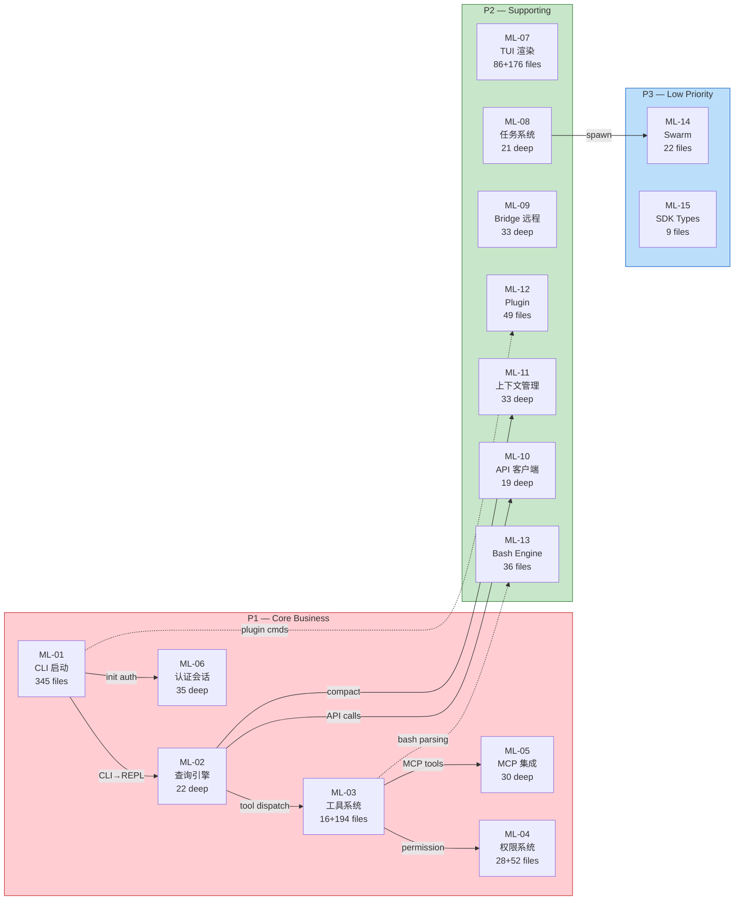

# Repo Map Analysis Report

**Project**: @anthropic-ai/claude-code (v999.0.0-restored)  
**Analysis Date**: 2025-01-27  
**Commit**: a5179f6588dd03cbe83a8d8b718a61875dba7b24  
**Map Version**: 0 (initial full analysis)  
**Prompt Files Used**: `actions/analyze.md` + `references/organize.md`

---

## 1. Completeness Findings

### 1.1 Entry File Verification

- **Status**: ✅ PASS
- **Evidence**: All 21 ML entry files across 15 mainlines verified to exist on disk. Checked: [`src/bootstrap-entry.ts`](/src/src/bootstrap-entry.ts), [`src/QueryEngine.ts`](/src/src/QueryEngine.ts), [`src/Tool.ts`](/src/src/Tool.ts), [`src/Task.ts`](/src/src/Task.ts), [`src/screens/REPL.tsx`](/src/src/screens/REPL.tsx), [`src/services/mcp/MCPConnectionManager.tsx`](/src/src/services/mcp/MCPConnectionManager.tsx), [`src/services/oauth/client.ts`](/src/src/services/oauth/client.ts), [`src/utils/permissions/permissions.ts`](/src/src/utils/permissions/permissions.ts), [`src/bridge/initReplBridge.ts`](/src/src/bridge/initReplBridge.ts), [`src/services/api/client.ts`](/src/src/services/api/client.ts), [`src/services/compact/autoCompact.ts`](/src/src/services/compact/autoCompact.ts), [`src/utils/plugins/pluginLoader.ts`](/src/src/utils/plugins/pluginLoader.ts), [`src/utils/bash/bashParser.ts`](/src/src/utils/bash/bashParser.ts), [`src/utils/swarm/inProcessRunner.ts`](/src/src/utils/swarm/inProcessRunner.ts), [`src/entrypoints/sdk/coreSchemas.ts`](/src/src/entrypoints/sdk/coreSchemas.ts), and 6 key modules.
- **Impact**: None — all entry points are valid.

### 1.2 Module Map Coverage

- **Status**: ⚠️ LOW
- **Evidence**: `src/` contains 38 subdirectories. The Module Map in `01-repo-map.md` lists 31 directories. Missing ~7 directories from the explicit module map (though they appear in the "Other" aggregation row). The 31 subdirectories listed all verified to exist. The repo map's "Breakdown by Top-Level Directory" table correctly accounts for all 2019 files across all 38+ directories.
- **Impact**: LOW — The aggregation row "其他（coordinator, server, schemas, plugins 等 7 个小目录）" covers the remaining directories. The per-directory breakdown table is complete (sums to 2019 files, 514,917 lines).

### 1.3 Dependency Verification

- **Status**: ⚠️ MEDIUM
- **Evidence**:
  - `@anthropic-ai/sdk`: ✅ `*` in dependencies
  - `react`: ✅ `*` in dependencies
  - `@opentelemetry/api`: ✅ `*` in dependencies
  - `lodash-es`: ✅ `*` in dependencies
  - `ink`: ✅ `*` in dependencies (but also forked at `src/ink/`)
  - **`zustand`**: ❌ NOT in package.json — no `import from 'zustand'` found in source. This is a false claim from the initial map-repo. **No actual code uses zustand** — the project uses React Context + custom hooks for state management.
  - **`commander`**: ❌ NOT directly in package.json — but `@commander-js/extra-typings: *` IS present. `commander` exists in `node_modules/` as a transitive dependency of `@commander-js/extra-typings`. The code imports from `commander` indirectly through the typings wrapper.
  - `@aws-sdk/client-bedrock-runtime`: ✅ in dependencies
  - Total: 74 dependencies, 0 devDependencies
- **Impact**: LOW — The zustand mention in repo map was inaccurate (no code uses it). Commander is accessible via transitive dependency. No functional gaps.

### 1.4 ink Dependency Duality

- **Status**: ⚠️ LOW
- **Evidence**: `ink` appears both as a package.json dependency AND as a fork at `src/ink/` (99 files, 19,879 lines). Source files import from `./ink` or `../ink` (local fork), not from `'ink'` (npm package). The only external import reference is a comment in [`src/ink/hooks/use-input.ts`](/src/src/ink/hooks/use-input.ts).
- **Impact**: LOW — The fork is the actual runtime dependency. The npm package likely provides types or is used during build. This is correctly documented in the Module Map.

### 1.5 Assumption Freshness

- **Status**: ⚠️ MEDIUM
- **Evidence**: `assumptions.md` contains 7 factual gaps and 7 speculations. All remain valid — none have been resolved by the 15 mainline traces. Key unresolved assumptions:
  1. `src/ink/` fork version and divergence from upstream ink
  2. Build/bundling pipeline (no build config in analyzed scope)
  3. Test infrastructure (no test files found)
  4. Deployment packaging mechanism
- **Impact**: MEDIUM — These gaps affect understanding of the deployment and testing story but don't affect runtime behavior analysis.

---

## 2. Consistency Findings

### 2.1 Architecture Description vs Module Map

- **Status**: ✅ PASS
- **Evidence**: The repo map describes a "CLI → REPL → QueryEngine → API" layered architecture. The Module Map reflects this:
  - Entry layer: `src/entrypoints/`, `src/bootstrap/`
  - Command routing: `src/commands/`, [`src/main.tsx`](/src/src/main.tsx)
  - Query engine: [`src/QueryEngine.ts`](/src/src/QueryEngine.ts), [`src/query.ts`](/src/src/query.ts)
  - Service layer: `src/services/` (api, mcp, compact, oauth, etc.)
  - Tool layer: `src/tools/`, [`src/Tool.ts`](/src/src/Tool.ts)
  - Presentation layer: `src/components/`, `src/ink/`, `src/hooks/`
  - Infrastructure: `src/bridge/`, `src/utils/`
- **Impact**: None — Architecture is consistent.

### 2.2 Cross-Reference Accuracy

- **Status**: ✅ PASS with observations
- **Evidence**: 23 cross-ML shared files identified in `call-graph.jsonl`. Key shared files:
  - [`src/Tool.ts`](/src/src/Tool.ts) → ML-02, ML-03 (3 segments)
  - [`src/tools.ts`](/src/src/tools.ts) → ML-01, ML-03 (2 segments)
  - [`src/context.ts`](/src/src/context.ts) → ML-01, ML-07, ML-11 (3 MLs)
  - [`src/entrypoints/init.ts`](/src/src/entrypoints/init.ts) → ML-01, ML-06
  - [`src/services/api/client.ts`](/src/src/services/api/client.ts) → ML-02, ML-10
  - [`src/services/compact/compact.ts`](/src/src/services/compact/compact.ts) → ML-02, ML-11
  - [`src/hooks/useCanUseTool.tsx`](/src/src/hooks/useCanUseTool.tsx) → ML-03, ML-04
- All referenced files exist and are correctly classified in `mapped-files.jsonl`.
- **Impact**: None — Cross-references are accurate.

### 2.3 Pattern Category Integrity

- **Status**: ⚠️ MEDIUM (one unowned pattern)
- **Evidence**:
  - 20 pattern categories total
  - 19 have `owner_ml` assigned
  - **PI-05 (service-module, 109 files)** has `owner_ml: null` — this is the only unowned pattern
  - PI-05 files span services/api, services/mcp, services/compact, services/oauth, services/plugins, services/skillSearch, etc. — these are claimed by individual MLs (ML-02, ML-05, ML-10, ML-11) as deep/standard files, but PI-05 itself has no single owner
  - 12 duplicate entries in PI-05's files list (109 total entries, 97 unique files)
- **Impact**: LOW — PI-05 is a cross-cutting category. Its files are individually traced by their respective MLs. The lack of a single owner is acceptable but should be documented.

### 2.4 Data Consistency

- **Status**: ✅ PASS
- **Evidence**:
  - `mapped-files.jsonl`: 1957 entries (deep=359, standard=1280, catalog=318)
  - `instance-manifest.jsonl`: 318 entries (matches catalog count)
  - `metadata.json`: mapped_file_count=1957, mapped_lines=515166
  - `mainline-file-map.jsonl`: 27 segment records across 15 mainlines
  - `call-graph.jsonl`: 281 entries
- **Known discrepancy**: mainline-file-map has 1192 unique files vs 1957 in mapped-files — 765 catalog-supplement files are not in mainline-file-map. This is a known legacy issue from the catalog-supplement step and does not affect coverage calculations.

---

## 3. High-Priority Analysis Paths

### Path 1: User Request → AI Response (ML-02 Core)
- **Why high priority**: This is the product's core value chain — every user interaction flows through this path
- **Focus areas**: QueryEngine state machine (`query.ts` 1729 lines), streaming response handling, tool dispatch loop
- **Known unknowns**: Error recovery paths, exact state transitions in the `while(true)` loop

### Path 2: Permission Decision Chain (ML-04)
- **Why high priority**: Security-critical — controls whether tools can execute
- **Focus areas**: `permissions.ts` rule matching, `bashClassifier.ts` command classification, `useCanUseTool.tsx` hook integration with ML-03
- **Known unknowns**: Edge cases in bash command classification, yolo mode bypass conditions

### Path 3: Tool Execution Pipeline (ML-03)
- **Why high priority**: 194 catalog tool instances + streaming execution — largest surface area
- **Focus areas**: Tool registration, `StreamingToolExecutor` (parallel streaming), permission interplay with ML-04
- **Known unknowns**: Tool parameter validation edge cases, MCP tool delegation

### Path 4: Context Window Management (ML-11)
- **Why high priority**: Directly affects AI response quality in long conversations
- **Focus areas**: Compact pipeline (4 stages), session memory, CLAUDE.md persistence
- **Known unknowns**: Feature-gated stubs (reactiveCompact, snipCompact, contextCollapse)

### Path 5: Authentication & Session (ML-06)
- **Why high priority**: System availability gate — no auth = no API access
- **Focus areas**: OAuth flow, multi-provider routing (API key / OAuth / AWS / GCP), SecureStorage 3-tier fallback
- **Known unknowns**: Token refresh race conditions, GrowthBook feature flag effects

---

## 4. Risk Areas

### Risk 1: Query Engine Complexity
- **Description**: `query.ts` is a 1729-line `while(true)` state machine with 9 State fields and 7 Continue paths. This is the highest-complexity file in the codebase.
- **Severity**: HIGH
- **Confidence**: HIGH (deep traced in ML-02-2)

### Risk 2: Permission System Attack Surface
- **Description**: The permission system must correctly classify arbitrary bash commands and file operations. `bashClassifier.ts` and `permissionRuleParser.ts` form the security boundary.
- **Severity**: HIGH
- **Confidence**: HIGH (deep traced in ML-04)

### Risk 3: Bridge Remote Code Execution
- **Description**: The bridge subsystem (ML-09) enables IDE-remote execution with `replBridge.ts` (2406 lines) handling message relay. Fault injection (BL-09-01) and multi-session (bridgeMain.ts 2999 lines) add complexity.
- **Severity**: MEDIUM
- **Confidence**: HIGH (deep traced in ML-09-1/2)

### Risk 4: Plugin System Isolation
- **Description**: `pluginLoader.ts` (3302 lines) loads external plugins with validation, but plugins can register commands, hooks, and agents. Blocklist/policy enforcement is critical.
- **Severity**: MEDIUM
- **Confidence**: MEDIUM (standard traced in ML-12)

### Risk 5: API Error Handling & Retry
- **Description**: `errors.ts` (1207 lines) handles 10+ HTTP error types with model fallback (Opus→Sonnet) and context overflow truncation. Incorrect error classification could cause data loss.
- **Severity**: MEDIUM
- **Confidence**: HIGH (deep traced in ML-10)

### Risk 6: ink Fork Divergence
- **Description**: `src/ink/` (99 files, 19,879 lines) is a fork of the ink framework. Divergence from upstream may introduce rendering bugs that are hard to trace.
- **Severity**: LOW
- **Confidence**: HIGH (deep traced in ML-07-1/5)

### Risk 7: Context Compact Data Loss
- **Description**: The compact pipeline can lose conversation context. The circuit breaker (3 consecutive failures → skip) means degraded quality without user awareness.
- **Severity**: MEDIUM
- **Confidence**: HIGH (deep traced in ML-11)

---

## 5. ML Priority Assessment

### Prompt Explanation

**Prompt file**: `actions/analyze.md § 5. ML Priority Assessment` defines 5 dimensions for priority reassessment:
1. **Business criticality** (external users, core business data)
2. **Path complexity** (core files count, cross-module call depth)
3. **Risk density** (risk areas in § 4 concentrated per ML)
4. **Sharing degree** (files shared across MLs)
5. **User traffic** (frequency of invocation path)

### Assessment Table

| ML | Name | Initial Priority | Adjusted Priority | Justification |
|----|------|-----------------|-------------------|---------------|
| ML-01 | CLI 启动与命令路由 | P1 | **P1** | Entry path for ALL user interactions. 345 files, 67,742 lines. Shares files with ML-03 (tools.ts), ML-06 (init.ts, state.ts), ML-07 (ink.ts). High business criticality. |
| ML-02 | 查询引擎主循环 | P1 | **P1** | Core value chain — every AI response flows here. 22 deep files including query.ts (1729L state machine). Shares with ML-03 (Tool.ts, StreamingToolExecutor), ML-10 (client.ts, withRetry.ts), ML-11 (compact.ts). Risk #1 (query.ts complexity). |
| ML-03 | 工具系统注册与调度 | P1 | **P1** | 194 catalog tool instances + 16 deep files. Shares with ML-02 (Tool.ts, toolOrchestration.ts), ML-04 (useCanUseTool.tsx), ML-05 (MCPTool.ts). Risk #3 surface area. |
| ML-04 | 权限系统 | P1 | **P1** | Security critical path. 28 deep files + 52 catalog. Risk #2 (permission attack surface). Shares with ML-03 (useCanUseTool.tsx) and ML-05 (channelPermissions.ts). |
| ML-05 | MCP 服务集成 | P1 | **P1** | Core extension mechanism — 30 deep files. Cross-cutting with ML-03 (MCPTool.ts) and ML-04 (channelPermissions). |
| ML-06 | 认证与会话管理 | P1 | **P1** | System availability gate. 35 deep files. Shares with ML-01 (init.ts, state.ts, config.ts) and ML-10 (bootstrap.ts). Risk #5 area. |
| ML-07 | TUI 渲染与交互 | P2 | **P2** | 86 deep files, 5 sub-maps — largest by file count. Internal interaction layer. Risk #6 (ink fork). Shared files: context.ts (ML-01, ML-11), ink.ts (ML-01). Not user-facing business logic. |
| ML-08 | 任务系统 | P2 | **P2** | 21 deep files, 7 task types. Background execution — non-blocking to main loop. Shares with ML-14 (spawnInProcess.ts). |
| ML-09 | Bridge 远程模式 | P2 | **P2** | 33 deep files. IDE integration — not all users. Risk #4 (remote execution). Shares with ML-01/ML-06 (auth). |
| ML-10 | API 客户端与重试层 | P2 | **P2** | 19 deep files. Internal service layer — called by ML-02. Risk #5 (error handling). Shares 5 files with ML-02. Could be argued for P1 but is a support layer, not user-facing. |
| ML-11 | 上下文与记忆管理 | P2 | **P2** | 33 deep files. Affects quality but doesn't block core function. Risk #7 (data loss). Shares with ML-02 (compact.ts, autoCompact.ts, tokens.ts). |
| ML-12 | Plugin System | P2 | **P2** | 49 files (16 deep + 33 standard). Extension system. Risk #4 (isolation). |
| ML-13 | Bash/Shell Engine | P2 | **P2** | 36 files. Parser engine for ML-03's Bash tool. Lower priority — no direct user interaction. |
| ML-14 | Swarm Orchestration | P2 | **P3** | 22 files. Advanced multi-agent feature — niche use case. Non-core path. |
| ML-15 | SDK Entry Points | P2 | **P3** | 9 files. API boundary definitions — static types/schemas. No runtime logic. |

### Priority Distribution

- **P1**: 6 mainlines (ML-01 ~ ML-06) — 481 deep files, 67,742+ lines
- **P2**: 7 mainlines (ML-07 ~ ML-13) — 259 deep files, significant surface area
- **P3**: 2 mainlines (ML-14, ML-15) — 10 deep files, low risk

### Adjustments Made

| ML | Change | Reason |
|----|--------|--------|
| ML-14 | P2 → **P3** | Swarm is an advanced multi-agent feature with niche use. Not core path complexity. |
| ML-15 | P2 → **P3** | SDK types are static definitions with no runtime logic or security implications. |

---

## 6. Recommendations for tasks Step

### 6.1 Task Grouping Strategy

**Group A — P1 Core (ML-01 ~ ML-06)**: Should be analyzed first and at DEEP depth.
- T-01: ML-02 Query Engine (the system's heart — highest complexity, highest risk)
- T-02: ML-04 Permission System (security critical — must validate bash classifier, rule parser)
- T-03: ML-03 Tool System (validate 194 catalog instances, StreamingToolExecutor)
- T-04: ML-01 CLI Startup (validate initialization sequence, commander routing)
- T-05: ML-05 MCP Integration (validate OAuth, connection lifecycle)
- T-06: ML-06 Auth & Session (validate multi-provider routing, token lifecycle)

**Group B — P2 Supporting (ML-07 ~ ML-13)**: STANDARD depth, can run in parallel.
- T-07: ML-07 TUI (focus on ink fork divergence, component architecture)
- T-08: ML-10 API Client (focus on retry logic, error classification)
- T-09: ML-11 Context Management (focus on compact pipeline, circuit breaker)
- T-10: ML-09 Bridge (focus on remote execution safety)
- T-11: ML-08 Tasks (focus on 7 task type lifecycle)
- T-12: ML-12 Plugins (focus on validation, isolation, blocklist)
- T-13: ML-13 Bash Engine (focus on parser safety)

**Group C — P3 Low Priority (ML-14, ML-15)**: OVERVIEW depth.
- T-14: ML-14 Swarm (OVERVIEW — verify backend detection, tmux integration)
- T-15: ML-15 SDK Types (OVERVIEW — verify schema completeness)

### 6.2 Critical Gaps to Fill First

1. **PI-05 ownership**: Assign PI-05 (service-module) to a cross-cutting "shared" category or document its multi-ML nature explicitly
2. **zustand removal**: Remove zustand from repo map dependency mentions — it's not used
3. **commander clarification**: Document that commander is accessed via `@commander-js/extra-typings` (transitive)
4. **PI-05 duplicate files**: Clean 12 duplicate entries in PI-05's file list

### 6.3 Map Quality Verdict

- **Rating**: **ADEQUATE**
- The repo map provides solid coverage (96.9% of files mapped) with accurate cross-references. The 6 P1 mainlines are well-traced with sufficient detail for DEEP analysis.
- Minor issues (PI-05 ownership, zustand inaccuracy, ~7 unlisted subdirectories) are LOW severity and don't block the tasks step.
- **No need to revisit map-repo** — proceed to tasks step with the adjustments noted above.

---

## 7. Repository Visualization

### 7.1 Architecture Overview Diagram

```mermaid
flowchart TB
    subgraph ENTRY["🎯 Entry Layer"]
        CLI["src/entrypoints/cli.tsx<br/>ML-01 core"]
        BOOT["src/bootstrap-entry.ts<br/>ML-01 core"]
    end

    subgraph INIT["⚙️ Initialization Layer"]
        MAIN["src/main.tsx<br/>ML-01 core, 1300+L"]
        INITF["src/entrypoints/init.ts<br/>ML-01+ML-06 shared"]
        AUTH["src/services/oauth/client.ts<br/>ML-06 core"]
        STATE["src/bootstrap/state.ts<br/>ML-01+ML-06 shared"]
    end

    subgraph QUERY["🔄 Query Engine Core"]
        QE["src/QueryEngine.ts<br/>ML-02 core, 1295L"]
        QUERY["src/query.ts<br/>ML-02 core, 1729L<br/>⚠️ HIGH RISK"]
        CLAUDE["src/services/api/claude.ts<br/>ML-02 core, 3419L"]
        MSG["src/utils/messages.ts<br/>ML-02 supporting, 5512L"]
    end

    subgraph TOOLS["🔧 Tool System"]
        TOOL["src/Tool.ts<br/>ML-02+ML-03 shared"]
        TOOLS_REG["src/tools.ts<br/>ML-01+ML-03 shared"]
        STREAM["src/services/tools/StreamingToolExecutor.ts<br/>ML-02+ML-03 shared"]
        TOOL_CAT["194 Tool Instances<br/>PI-01 catalog"]
    end

    subgraph PERM["🔒 Permission System"]
        PERM_CORE["src/utils/permissions/permissions.ts<br/>ML-04 core"]
        BASH_CLS["src/utils/permissions/bashClassifier.ts<br/>ML-04 core"]
        CAN_USE["src/hooks/useCanUseTool.tsx<br/>ML-03+ML-04 shared"]
        PERM_CAT["52 Permission Components<br/>PI-06 catalog"]
    end

    subgraph API["📡 API & Auth Layer"]
        CLIENT["src/services/api/client.ts<br/>ML-02+ML-10 shared"]
        RETRY["src/services/api/withRetry.ts<br/>ML-02+ML-10 shared"]
        ERRORS["src/services/api/errors.ts<br/>ML-10 core, 1207L"]
    end

    subgraph MCP["🔌 MCP Integration"]
        MCP_MGR["src/services/mcp/MCPConnectionManager.tsx<br/>ML-05 core"]
        MCP_CLIENT["src/services/mcp/client.ts<br/>ML-05 core"]
        MCP_TOOL["src/tools/MCPTool/MCPTool.ts<br/>ML-03+ML-05 shared"]
    end

    subgraph COMPACT["📦 Context & Memory"]
        AUTO["src/services/compact/autoCompact.ts<br/>ML-02+ML-11 shared"]
        COMPACT_F["src/services/compact/compact.ts<br/>ML-02+ML-11 shared"]
        MEMDIR["src/memdir/<br/>ML-11 core"]
    end

    subgraph TUI["🖥️ TUI Layer"]
        REPL["src/screens/REPL.tsx<br/>ML-07 core"]
        INK["src/ink/<br/>ML-07 fork, 99 files"]
        HOOKS["src/hooks/<br/>ML-07, 52 catalog PI-03"]
        COMP["src/components/<br/>ML-07, 406 files"]
    end

    subgraph BRIDGE["🌉 Bridge & Remote"]
        BRIDGE_INIT["src/bridge/initReplBridge.ts<br/>ML-09 core"]
        REPL_BRIDGE["src/bridge/replBridge.ts<br/>ML-09, 2406L"]
    end

    subgraph EXT["🧩 Extensions"]
        PLUGIN["src/utils/plugins/<br/>ML-12, 49 files"]
        BASH_Engine["src/utils/bash/<br/>ML-13, 36 files"]
        SWARM["src/utils/swarm/<br/>ML-14, 22 files"]
        SDK["src/entrypoints/sdk/<br/>ML-15, 9 files"]
    end

    %% Primary flow
    BOOT -->|"ML-01"| CLI
    CLI -->|"ML-01"| MAIN
    MAIN -->|"ML-01"| INITF
    INITF -->|"ML-01"| STATE
    INITF -->|"ML-06"| AUTH

    MAIN -->|"launch REPL"| REPL
    REPL -->|"user input"| QE
    QE -->|"ML-02"| QUERY
    QUERY -->|"API call"| CLAUDE
    CLAUDE -->|"ML-02+ML-10"| CLIENT
    CLIENT -->|"ML-10"| RETRY
    RETRY -->|"ML-10"| ERRORS

    QUERY -->|"tool dispatch"| TOOL
    TOOL -->|"ML-03"| STREAM
    TOOL -->|"permission check"| CAN_USE
    CAN_USE -->|"ML-04"| PERM_CORE
    PERM_CORE -->|"ML-04"| BASH_CLS

    QUERY -->|"ML-02+ML-11"| AUTO
    AUTO -->|"ML-11"| COMPACT_F
    COMPACT_F -->|"ML-11"| MEMDIR

    TOOL -->|"MCP tools"| MCP_TOOL
    MCP_TOOL -->|"ML-05"| MCP_MGR
    MCP_MGR -->|"ML-05"| MCP_CLIENT

    %% Cross-references (dashed)
    STATE -.->|"shared"| INITF
    CLIENT -.->|"shared ML-02+10"| CLAUDE
    TOOL -.->|"shared ML-02+03"| TOOLS_REG
    AUTO -.->|"shared ML-02+11"| COMPACT_F

    %% Risk indicators
    style QUERY fill:#ffebee,stroke:#c62828,stroke-width:3px
    style BASH_CLS fill:#fff3e0,stroke:#e65100,stroke-width:2px
    style REPL_BRIDGE fill:#fff3e0,stroke:#e65100,stroke-width:2px
    style PLUGIN fill:#e8f5e9,stroke:#2e7d32
    style SWARM fill:#e3f2fd,stroke:#1565c0
    style SDK fill:#e3f2fd,stroke:#1565c0
```

### 7.2 Mainline Flow Diagram



### 7.3 Cross-ML Shared File Network

```mermaid
graph TD
    subgraph Hub_Files["Shared Hub Files (23 total)"]
        TOOL["src/Tool.ts<br/>ML-02, ML-03"]
        TOOLS["src/tools.ts<br/>ML-01, ML-03"]
        CONTEXT["src/context.ts<br/>ML-01, ML-07, ML-11"]
        INIT["src/entrypoints/init.ts<br/>ML-01, ML-06"]
        CLIENT["src/services/api/client.ts<br/>ML-02, ML-10"]
        COMPACT["src/services/compact/compact.ts<br/>ML-02, ML-11"]
        CANUSE["src/hooks/useCanUseTool.tsx<br/>ML-03, ML-04"]
    end

    ML01(["ML-01 CLI"])
    ML02(["ML-02 Query"])
    ML03(["ML-03 Tools"])
    ML04(["ML-04 Permissions"])
    ML05(["ML-05 MCP"])
    ML06(["ML-06 Auth"])
    ML07(["ML-07 TUI"])
    ML10(["ML-10 API"])
    ML11(["ML-11 Context"])

    ML01 --- TOOLS
    ML01 --- INIT
    ML01 --- CONTEXT
    ML02 --- TOOL
    ML02 --- CLIENT
    ML02 --- COMPACT
    ML03 --- TOOL
    ML03 --- TOOLS
    ML03 --- CANUSE
    ML04 --- CANUSE
    ML05 --- CLIENT
    ML06 --- INIT
    ML07 --- CONTEXT
    ML10 --- CLIENT
    ML11 --- COMPACT
    ML11 --- CONTEXT

    style TOOL fill:#ffab91,stroke:#bf360c
    style TOOLS fill:#ffab91,stroke:#bf360c
    style CONTEXT fill:#ce93d8,stroke:#6a1b9a
    style INIT fill:#81d4fa,stroke:#01579b
    style CLIENT fill:#a5d6a7,stroke:#1b5e20
    style COMPACT fill:#fff59d,stroke:#f57f17
    style CANUSE fill:#ef9a9a,stroke:#b71c1c
```



### 7.4 Diagram Legend

- **Solid nodes**: Core files on main line paths (deep traced)
- **Dotted nodes**: Supporting/utility files (standard traced)
- **Colored links**: Different main lines (ML-01 = blue, ML-02 = green, ML-03 = orange, ML-04 = red, ML-05 = purple, etc.)
- **Dashed links**: Cross-main-line references
- **Grey fill**: Uncovered files/modules
- **Red border**: High-risk areas (query.ts state machine, permission bash classifier, bridge remote execution)
- **Orange border**: Medium-risk areas
- **Green/Blue fill**: P2/P3 mainlines

### 7.5 Coverage Visual Summary

| Metric | Value |
|--------|-------|
| Implementation files (baseline) | 2,019 |
| Mapped files | 1,957 (96.9%) |
| Deep traced | 359 (17.8%) |
| Standard traced | 1,280 (63.4%) |
| Cataloged | 318 (15.7%) |
| Uncovered (accepted) | 62 (3.1%) |
| Mainlines | 15 (6 P1 + 7 P2 + 2 P3) |
| Cross-ML shared files | 23 |
| Pattern categories | 20 (19 owned + 1 unowned PI-05) |
| Catalog instances | 318 |

---

## 8. Overall Map Quality Assessment

- **Rating**: **ADEQUATE**
- **Summary**: The repo map provides comprehensive coverage (96.9% of implementation files) with accurate entry points, consistent cross-references, and well-organized mainline structure. The 6 P1 mainlines cover all critical business paths. Minor issues include: (1) PI-05 has no owner_ml, (2) zustand falsely listed as dependency, (3) ~7 subdirectories not explicitly in module map, (4) 12 duplicate entries in PI-05. These are LOW severity and do not block the tasks step.

### Issues by Severity

| Severity | Count | Key Issues |
|----------|-------|------------|
| CRITICAL | 0 | — |
| HIGH | 0 | — |
| MEDIUM | 3 | PI-05 unowned, zustand false claim, assumptions unresolved |
| LOW | 3 | ~7 unlisted subdirs, ink duality, PI-05 duplicates |

### Top 3 Recommendations

1. **Start with ML-02 (Query Engine)** in tasks step — it's the system's heart with the highest complexity (1729-line state machine) and the most cross-ML sharing
2. **Assign PI-05 ownership** before tasks step — document that PI-05 is a cross-cutting category with files individually claimed by ML-02/05/10/11
3. **Prioritize security analysis** — ML-04 (permissions) and ML-03 (tool execution) should be analyzed at DEEP depth to validate the security boundary
