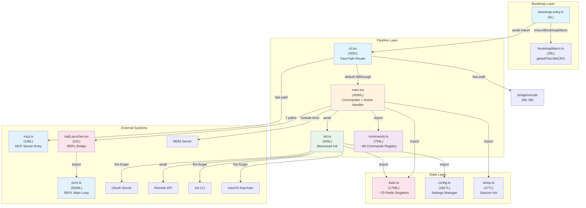

# ML-01 Summary: CLI 启动与命令路由

> **Priority**: P1 | **Path**: `bootstrap-entry.ts` → `cli.tsx` → `main.tsx` → `init.ts` → `launchRepl()` → REPL
> **Core Tasks**: T-01, T-02, T-22, T-30, T-33 | **Related Tasks**: T-03, T-05, T-08, T-14, T-17

---

## §1 相关分析文件

### 主线追踪

| 文件 | 说明 |
|------|------|
| [ML-01-1 (入口分发)](/map/sub-maps/ML-01-1) | Sub-map: bootstrap-entry → cli.tsx 快速路径分发 |
| [ML-01-2 (初始化序列)](/map/sub-maps/ML-01-2) | Sub-map: init.ts memoized 初始化链 |
| [ML-01-3 (Commander注册与REPL启动)](/map/sub-maps/ML-01-3) | Sub-map: main.tsx Commander + commands.ts + REPL 启动 |
| [coverage-map-report](/map/coverage-map-report) | 全局覆盖率门控报告 |

### 相关 P1 主线汇总

| 主线 | Priority | 共享关系 |
|------|----------|---------|
| [summary-ML-02-query-engine](/branches/main/report/summary-ML-02-query-engine-core) | P1 | query.ts 主循环由 REPL 的 print.ts 触发，共享 state.ts 会话状态；main.tsx 的 launchRepl() 最终进入 ML-02 的 query loop |
| [summary-ML-03-tool-system](/branches/main/report/summary-ML-03-tool-system-dispatch) | P1 | commands.ts 和 tools.ts 都在 main.tsx 模块级被 import，工具注册在 init 阶段完成；ML-01 的 init.ts 中 enableConfigs() 为 ML-03 的工具发现提供配置基础 |
| [summary-ML-05-mcp-integration](/branches/main/report/summary-ML-05-mcp-service-integration) | P1 | main.tsx action handler 中直接调用 MCP config 解析（L2500-3050），mcp.ts 是 ML-01 scope 内的独立入口；cli.tsx 的 --chrome-mcp/--computer-use-mcp 快速路径直接路由到 MCP 服务 |
| [summary-ML-09-bridge-remote](/branches/main/report/summary-ML-09-bridge-remote) | P2 | cli.tsx 快速路径中 bridge/remote-control/daemon-worker 分支直接路由到 ML-09 的 bridgeMain()，绕过 main.tsx 完整初始化链 |
| [summary-ML-12-plugin-system](/branches/main/report/summary-ML-12-plugin-system) | P2 | commands.ts 中 ~80 个命令包含插件命令；main.tsx 中 --plugin-dir CLI flag 和 refreshActivePlugins() 调用影响命令注册；共享 commands.ts 命令发现机制 |

### Task 分析

**Core Tasks（本主线直接归属）**：

| Task | 分析文件 | 深度 |
|------|---------|------|
| T-01 | [T-01-cli-entry-init](/branches/main/task-analyses/T-01-cli-entry-init) | DEEP — CLI 启动与初始化序列（10 文件, 7,941 行） |
| T-02 | [T-02-command-routing](/branches/main/task-analyses/T-02-command-routing) | DEEP — 命令路由与 REPL 启动（216 文件, 57,084 行） |
| T-22 | [T-22-audit-pi-02](/branches/main/task-analyses/T-22-audit-pi-02) | OVERVIEW — PI-02 command-handler 模式审计（107 实例） |
| T-30 | [T-30-audit-pi-11](/branches/main/task-analyses/T-30-audit-pi-11) | OVERVIEW — PI-11 settings-module 模式审计（5 实例） |
| T-33 | [T-33-audit-pi-14](/branches/main/task-analyses/T-33-audit-pi-14) | OVERVIEW — PI-14 misc-leaf 模式审计（2 实例） |

**Related Tasks（关联主线）**：

| Task | 分析文件 | 关联主线 |
|------|---------|---------|
| T-03 | [T-03-query-core-loop](/branches/main/task-analyses/T-03-query-core-loop) | ML-02 (查询引擎) |
| T-05 | [T-05-tool-system-core](/branches/main/task-analyses/T-05-tool-system-core) | ML-03 (工具系统) |
| T-08 | [T-08-mcp-integration](/branches/main/task-analyses/T-08-mcp-integration) | ML-05 (MCP 服务) |
| T-14 | [T-14-bridge-remote](/branches/main/task-analyses/T-14-bridge-remote) | ML-09 (Bridge 远程) |
| T-17 | [T-17-plugin-system](/branches/main/task-analyses/T-17-plugin-system) | ML-12 (Plugin 系统) |

### 全局参考

- [final-analysis-report](/branches/main/report/final-analysis-report) — 总体分析报告

---

## §2 主线概要

| 属性 | 值 |
|------|-----|
| **Priority** | P1 |
| **Entry Point** | `src/bootstrap-entry.ts` (进程入口) |
| **Exit Points** | `replLauncher.tsx` → Ink render loop；`mcp.ts` → MCP stdio loop；`cli.tsx` fast-paths → 各子系统循环 |
| **Core Files** | 8 个：bootstrap-entry.ts (5L), bootstrapMacro.ts (29L), cli.tsx (303L), init.ts (340L), main.tsx (4690L), commands.ts (754L), replLauncher.tsx (23L), help/index.ts (10L) |
| **Supporting Files** | ~130 个：state.ts (1758L), config.ts (1817L), print.ts (5594L), structuredIO.ts (859L), setup.ts (477L), keybindings/ (15 文件, 2627L), ~80 命令实现文件 |
| **Cataloged Pattern Files** | PI-02 (107 实例), PI-11 (5 实例), PI-14 (2 实例) |
| **Total Lines in Core Files** | ~6,124 行 |
| **Total Lines in Scope** | ~65,000+ 行（含 216 文件 scope of T-02） |
| **关联主线** | ML-02 (查询引擎), ML-03 (工具系统), ML-05 (MCP 服务), ML-09 (Bridge 远程), ML-12 (Plugin 系统) |

### 关键数字

- **启动层级**: 4 级链式分发（bootstrap → cli → main → launchRepl）
- **快速路径分支**: 12+ 条（cli.tsx process.argv 匹配）
- **launchRepl 路径**: 7 条（默认/continue/cc://SSH/assistant/teleport/resume/interactive）
- **init.ts 并行操作**: 4 个 fire-forget + 2 个 Promise.all + 5 个顺序
- **state.ts 字段数**: ~70 个字段, ~100 对 getter/setter
- **命令数**: ~80 个 slash commands，107 个 PI-02 pattern instances
- **巨型文件**: main.tsx (4690L), print.ts (5594L), state.ts (1758L)

---

## §3 架构框图



### 架构分层说明

**Bootstrap Layer** — 进程入口层，仅负责设置 `globalThis.MACRO` 构建配置并触发第一层 dynamic import。文件极小（5+29 行），零外部依赖。

**Pipeline Layer** — 命令分发与初始化编排层。cli.tsx 作为快速路径路由器拦截 12+ 特殊命令；main.tsx 是"Hub of Hubs"（4690 行巨型枢纽），注册 Commander 程序并执行 ~2800 行的 .action() handler；commands.ts 以懒加载模式注册 ~80 个 slash command；init.ts 以 memoized 单次执行模式编排三阶段初始化（fire-forget → Promise.all → 顺序）。

**State Layer** — 全局状态管理。state.ts 是跨所有 ML 的耦合热点（~70 字段、~100 对 getter/setter、被 17+ 外部文件依赖）；config.ts 管理 ~/.claude/ 和 .claude/ 两层配置；setup.ts 处理会话初始化前置检查。

**External Systems** — 外部系统交互。mcp.ts 提供独立 MCP 服务器入口（不经过 init.ts 完整初始化链）；print.ts (5594 行) 是 REPL 主循环，衔接 ML-02 的查询引擎；OAuth/Remote/Git/Keychain/MDM 是 init.ts 触发的外部服务交互。

---

## §4 Execution Flow

### 完整启动时序

```
T=0   Node.js bootstrap
      └─→ src/bootstrap-entry.ts:ensureBootstrapMacro()
          └─→ bootstrapMacro.ts: 设置 globalThis.MACRO

T=1   Dynamic import → cli.tsx
      ├─→ 12+ fast-path 分支检查 (process.argv 匹配)
      │   ├─ --mcp-*:      → mcp.ts (直接启动 MCP 服务)
      │   ├─ --bridge:     → bridgeMain() (ML-09 快速路径)
      │   ├─ --version/-h: → console.log + process.exit
      │   ├─ --update:     → auto-update + exec
      │   └─ ...其他 7 条快速路径
      └─→ 默认 fallthrough → main.tsx

T=2   main.tsx 模块级并行预热
      ├─→ startMdmRawRead()     (并行)
      ├─→ startKeychainPrefetch() (并行)
      └─→ COMMANDS() 工厂执行 (注册 ~80 命令)

T=3   main.tsx Commander program 构建
      ├─→ createCommand() 顶层 program
      ├─→ ~40 全局 option 注册 (.option/.addOption)
      ├─→ ~80 子命令注册 (.addCommand, via COMMANDS())
      └─→ program.parseAsync(argv)

T=4   main.tsx .action() handler 入口 (~2800 行闭包)
      ├─→ options 解构 (~80 变量)
      ├─→ 参数验证与互斥检查
      └─→ ↓ 进入初始化序列

T=5   init.ts memoized 初始化 (一次性执行)
      ├─→ Phase 1 (并行 fire-forget):
      │   ├─ populateOAuth()         → OAuth token 加载
      │   ├─ get1PEvents()           → 第一方事件
      │   ├─ startJetBrainsListener() → JetBrains IDE 连接
      │   └─ detectGitRepository()   → Git 仓库检测
      ├─→ Phase 2 (并行 Promise.all):
      │   ├─ enableConfigs()         → config.ts 双层配置
      │   ├─ enableEnv()             → 环境变量
      │   ├─ refreshRemoteManagedSettings() → 远程策略
      │   └─ enableTelemetry()       → 遥测
      ├─→ Phase 3 (顺序 await):
      │   ├─ enableMTLS()            → mTLS 证书
      │   ├─ enableProxy()           → HTTP 代理
      │   └─ enablePreconnect()      → API 预连接
      └─→ 返回 true

T=6   showSetupScreens() (首次运行引导)
      ├─→ Trust dialog (项目信任确认)
      ├─→ OAuth flow (首次授权)
      └─→ Onboarding wizard

T=7   sessionConfig 构建
      ├─→ MCP 服务器配置解析
      ├─→ 权限模式选择
      ├─→ 模型选择与验证
      └─→ sessionConfig 对象组装

T=8   7 条 launchRepl 分支选择
      ├─→ 默认交互模式 (空参数)
      ├─→ --continue (恢复会话)
      ├─→ cc:// URI scheme (SSH/teleport)
      ├─→ --assistant (预设 prompt)
      ├─→ --resume (会话选择 UI)
      ├─→ --interactive (stdin prompt)
      └─→ MCP server mode (回退)

T=9   replLauncher.tsx → Ink render
      └─→ print.ts REPL 主循环
          └─→ ML-02 查询引擎接管
```

### 关键调用链

**Chain 1: 默认交互启动** (最常见路径)
```
bootstrap-entry → cli.tsx → main.tsx
  → init.ts (configs/env/OAuth/mTLS/proxy/preconnect)
  → showSetupScreens()
  → sessionConfig 构建
  → launchRepl(sessionConfig)
  → replLauncher.tsx → Ink render → print.ts loop
```

**Chain 2: Continue 恢复会话**
```
bootstrap-entry → cli.tsx → main.tsx
  → init.ts (same as Chain 1)
  → 从 session 目录恢复历史
  → launchRepl({resumeConversationId})
  → replLauncher.tsx → print.ts (恢复模式)
```

**Chain 3: MCP 独立入口** (绕过完整初始化)
```
bootstrap-entry → cli.tsx (--mcp-* fast-path)
  → mcp.ts
  → init.ts (部分初始化)
  → MCP stdio server loop
  (不经过 main.tsx action handler)
```

---

## §5 关联主线简述

| 主线 | Priority | 一句话描述 | 纳入原因 |
|------|----------|-----------|---------|
| **ML-02** 查询引擎 | P1 | print.ts 触发的 query.ts 状态机主循环，是 REPL 的核心交互引擎 | REPL 启动后控制权移交 ML-02；共享 state.ts 会话状态和 print.ts 渲染管道 |
| **ML-03** 工具系统 | P1 | 工具注册、发现和执行调度，通过 tools.ts 和 toolRegistry 管理工具生命周期 | main.tsx 模块级 import tools.ts；init.ts 的 enableConfigs() 为工具发现提供配置；commands.ts 包含工具调用命令 |
| **ML-05** MCP 服务 | P1 | Model Context Protocol 服务集成，通过 mcp.ts 提供 MCP 服务器独立入口 | cli.tsx 有 3 条 MCP 快速路径；main.tsx action handler 中 L2500-3050 专用于 MCP config 解析 |
| **ML-09** Bridge 远程 | P2 | Bridge 远程模式和 SDK 适配器，支持远程 IDE 连接 | cli.tsx 快速路径直接路由到 bridgeMain()，绕过 main.tsx 完整初始化链 |
| **ML-12** Plugin 系统 | P2 | 插件加载器和命令注入，支持第三方扩展 | commands.ts 命令发现机制是共享接口；main.tsx 中 refreshActivePlugins() 和 --plugin-dir flag 影响命令注册 |

---

## §6 Core Tasks

### T-01: CLI 启动与初始化序列

**综合摘要**：T-01 覆盖 CLI 从进程入口到 REPL 启动的完整链路，揭示了 4 级链式分发架构。bootstrap-entry.ts 仅 5 行就完成全局配置设置，cli.tsx 通过 process.argv 快速匹配拦截 12+ 特殊路径，未匹配的请求 fallthrough 到 main.tsx 的 Commander 程序。main.tsx 是系统的枢纽（4690 行），.action() handler 是一个 ~2800 行的巨型闭包，包含 options 解构、初始化编排、MCP 配置和 7 条 launchRepl 分支。init.ts 使用 memoize 保证初始化只执行一次，采用 fire-forget + Promise.all + 顺序 await 三阶段模式。

**关键文件**：bootstrap-entry.ts, cli.tsx, init.ts, main.tsx, state.ts, config.ts, replLauncher.tsx

**Top Risk**：P1-01 main.tsx .action() handler 2800+ 行巨型闭包（main.tsx:L1012-L3800），~80 个解构变量共享作用域，极难测试和静态分析。

→ [完整分析: T-01-cli-entry-init](/branches/main/task-analyses/T-01-cli-entry-init)

### T-02: 命令路由与 REPL 启动

**综合摘要**：T-02 覆盖 216 文件 / 57,084 行的命令路由系统。commands.ts 是命令注册中枢，通过 COMMANDS() 工厂函数以 `load: () => import(...)` 模式注册 ~80 个懒加载命令，实现 DCE-friendly 的代码分割。REPL 主循环由 print.ts (5594 行) 驱动，structuredIO.ts (859 行) 处理结构化 I/O。系统包含完整的 keybinding 系统（15 文件，2627 行），支持用户自定义快捷键和冲突检测。9 个 settings migration 文件处理配置版本升级。

**关键文件**：commands.ts, print.ts, structuredIO.ts, keybindings/*, migrations/*

**Top Risk**：print.ts (5594 行) 是 REPL 的核心驱动，承担了输入处理、输出渲染、工具调用编排等多重职责，是 ML-02 查询引擎的直接交互对象。

→ [完整分析: T-02-command-routing](/branches/main/task-analyses/T-02-command-routing)

### T-22: PI-02 Command-Handler 模式审计

**综合摘要**：PI-02 是代码库中最庞大的模式，共 107 个实例覆盖所有 slash command 实现。每个命令通过 `satisfies Command` 类型约束注册，包含 handler、load（懒加载）、aliases 等字段。3 种子类型变体：local（纯逻辑命令）、local-jsx（含 Ink 组件渲染）、prompt（提示词模板命令）。8/107 采样验证全部通过，模式实现一致。

**关键文件**：src/commands/ 下 107 个命令文件，commands.ts (注册中枢)

**Top Risk**：无显著风险。模式定义清晰、实现一致、类型安全。

→ [完整分析: T-22-audit-pi-02](/branches/main/task-analyses/T-22-audit-pi-02)

### T-30: PI-11 Settings-Module 模式审计

**综合摘要**：PI-11 包含 5 个实例，全部是从 settings.ts 提取的叶子模块，用于打破循环依赖。每个模块负责一个独立的配置领域（如 autoUpdates、modelDefaults、enableAllProjectMcpServers 等），通过 `satisfies SettingsModule` 类型约束。5/5 全部验证通过。

**关键文件**：src/migrations/ 下 5 个迁移文件

**Top Risk**：无显著风险。模块职责单一、依赖方向正确。

→ [完整分析: T-30-audit-pi-11](/branches/main/task-analyses/T-30-audit-pi-11)

### T-33: PI-14 Misc-Leaf 模式审计

**综合摘要**：PI-14 仅 2 个实例（errorIds.ts 常量注册表 + keybindings/types.ts 类型字典），均为纯静态定义、零运行时逻辑。errorIds.ts 维护错误标识符映射，keybindings/types.ts 定义快捷键类型字典。2/2 全部验证通过。

**关键文件**：src/errorIds.ts, src/keybindings/types.ts

**Top Risk**：无。纯类型/常量定义，无运行时风险。

→ [完整分析: T-33-audit-pi-14](/branches/main/task-analyses/T-33-audit-pi-14)

---

## §7 Related Tasks

### T-03: 查询引擎核心循环 (ML-02)

T-03 分析了 query.ts (1729 行) 状态机和 QueryEngine.ts (1295 行) SDK 适配层，覆盖 341 文件 / 91,420 行的查询引擎。与 ML-01 的关联：print.ts (5594 行 REPL 主循环) 是 query 状态机的直接触发者，共享 state.ts 的会话状态（conversationId、model、permissionMode 等），launchRepl() 完成后控制权从 ML-01 移交到 ML-02。

→ [完整分析: T-03-query-core-loop](/branches/main/task-analyses/T-03-query-core-loop)

### T-05: 工具系统核心调度 (ML-03)

T-05 分析了 toolExecution.ts (1745 行) 和 tools.ts (389 行) 等工具系统核心，覆盖 142 文件 / 58,871 行。与 ML-01 的关联：tools.ts 在 main.tsx 模块级被 import，init.ts 的 enableConfigs() 为工具发现提供配置基础；commands.ts 中的 /tool 命令直接桥接到 ML-03 的工具调度系统。

→ [完整分析: T-05-tool-system-core](/branches/main/task-analyses/T-05-tool-system-core)

### T-08: MCP 服务集成 (ML-05)

T-08 分析了 MCP config (config.ts 1578 行) 和 MCP 服务发现机制，覆盖 85 文件 / 31,785 行。与 ML-01 的关联：cli.tsx 的 --chrome-mcp、--computer-use-mcp、--mcp-debug 快速路径直接路由到 MCP 服务入口；main.tsx action handler 中 L2500-3050 专用于 MCP 服务器配置解析和初始化。

→ [完整分析: T-08-mcp-integration](/branches/main/task-analyses/T-08-mcp-integration)

### T-14: Bridge 远程模式 (ML-09)

T-14 分析了 Bridge 远程模式的双版本架构 (v1/v2)，覆盖 46 文件 / ~18,081 行。与 ML-01 的关联：cli.tsx 快速路径中 --bridge、--remote-control、--daemon-worker 分支直接调用 bridgeMain()，绕过 main.tsx 完整初始化链，进入独立的 Bridge 初始化路径。

→ [完整分析: T-14-bridge-remote](/branches/main/task-analyses/T-14-bridge-remote)

### T-17: Plugin 系统 (ML-12)

T-17 分析了 pluginLoader.ts (3302 行) 核心加载器和插件生命周期管理，覆盖 65 文件 / 29,370 行。与 ML-01 的关联：main.tsx 中 --plugin-dir CLI flag 和 refreshActivePlugins() 调用影响命令注册；commands.ts 的命令发现机制是插件注入命令的共享接口；插件通过 hooks 和 agents 桥接到命令路由系统。

→ [完整分析: T-17-plugin-system](/branches/main/task-analyses/T-17-plugin-system)

---

## §8 实现注意点

### Gotchas（非显式陷阱）

**G-01: init.ts fire-forget 操作无错误捕获**
- **位置**：init.ts:L40-L80
- **陷阱**：populateOAuth()、get1PEvents()、startJetBrainsListener()、detectGitRepository() 四个操作使用 `void fn()` 调用，Promise rejection 仅触发 Node.js `unhandledRejection` warning，不会中断启动流程。生产环境可能丢失关键初始化数据（如 OAuth token 未加载）而用户完全无感知。
- **影响范围**：T-01 (init.ts) → T-03 (查询引擎依赖 OAuth token) → T-08 (MCP 服务依赖有效 token)
- **缓解建议**：添加 `.catch(err => log.warn('init:fire-forget', err))` 至少记录日志

**G-02: main.tsx .action() 闭包中 options 解构变量 ~80 个共享作用域**
- **位置**：main.tsx:L1012-L1100
- **陷阱**：Commander options 通过解构赋值在 2800 行闭包内共享，变量名与 CLI flag 名不完全一致（如 `option_maxTurns` 对应 `--max-turns`），容易在闭包后半段引用错误变量。部分变量在特定分支才被赋值（如 `resumeConversationId` 仅在 --continue 分支），但作用域覆盖整个闭包。
- **影响范围**：T-01 (main.tsx action handler) → 所有 7 条 launchRepl 分支
- **缓解建议**：拆分为独立函数，每条分支仅接收必要参数

**G-03: cli.tsx 快速路径的 earlyInputBuffer 无大小限制**
- **位置**：cli.tsx:L291
- **陷阱**：stdin 数据在 showSetupScreens() 执行期间被缓存到 earlyInputBuffer（ring buffer），但该 buffer 没有容量上限。虽然实际使用中 stdin 在此阶段是有限的（用户输入不会超过缓冲区），但理论上管道输入（`echo "prompt" | claude`）可能导致内存增长。
- **影响范围**：T-01 (cli.tsx) → T-03 (查询引擎接收 earlyInput)
- **缓解建议**：设置 buffer 容量上限（如 1MB），超限时丢弃并警告

**G-04: state.ts 字段间隐式耦合**
- **位置**：state.ts 全文 (1758 行)
- **陷阱**：~70 个字段全部放在一个全局单例中，无命名空间隔离。字段间存在隐式依赖：`permissionMode` 变化影响 `PermissionEngine` 行为，`isHeadless` 变化影响 `print.ts` 输出模式，`model` 变化影响 token budget 计算。修改任一字段可能产生级联效应。
- **影响范围**：T-01 (state.ts) → 所有 ML（全局共享状态）
- **缓解建议**：按领域分组为子 store（authState / configState / sessionState）

**G-05: MCP 快速路径绕过完整初始化链**
- **位置**：cli.tsx:L80-L120 (--mcp-* 分支)
- **陷阱**：cli.tsx 的 --mcp-* 快速路径直接进入 mcp.ts，不经过 main.tsx 的完整初始化（包括 enableConfigs()、enableEnv()、enableTelemetry() 等）。这意味着 MCP 模式下 state.ts 的部分字段未被初始化（如 permissionMode 使用默认值），如果 MCP handler 依赖这些字段可能产生未定义行为。
- **影响范围**：T-01 (cli.tsx fast-path) → T-08 (MCP 服务)
- **缓解建议**：mcp.ts 入口添加最小化初始化检查

### Conventions（项目级编码约定）

**C-01: DCE-friendly 动态导入**
- 所有快速路径分支使用 `await import('./module')` 动态导入，确保未匹配的路径不加载对应模块。cli.tsx 中 `feature()` 函数包裹每个快速路径，使 bundler 可以 tree-shake 未使用的分支。commands.ts 中每个命令的 `load: () => import(...)` 字段实现懒加载。

**C-02: `satisfies Command` 类型约束**
- 所有 slash command 实现必须通过 `satisfies Command` 类型检查（PI-02 模式，107 个实例）。这确保每个命令包含 handler、load、aliases、description 等必要字段，并提供编译时类型安全。新增命令必须遵循此模式。

**C-03: memoize 单次执行模式**
- init.ts 使用 `memoize(fn)` 包装初始化函数，确保即使被多次调用也只执行一次。这是防御性编程约定：多个代码路径可能触发初始化，但实际初始化逻辑必须幂等。其他全局初始化函数也应遵循此模式。

**C-04: 函数式状态访问器（getter/setter 对）**
- state.ts 不直接暴露 STATE 对象，而是通过 ~100 对 getter/setter 函数访问。getter 使用 `getState().field` 模式，setter 使用 `setState({field: value})` 模式。这是 React 式状态管理约定，确保状态变更可追踪。

**C-05: config.ts 双层配置优先级**
- config.ts 管理两层配置：用户级 (`~/.claude/`) 和项目级 (`.claude/`)。项目级覆盖用户级，环境变量覆盖两者。新增配置项必须在此优先级链中正确定义，并在 config.ts 中注册。

### Anti-patterns（应避免的做法）

**AP-01: 在 .action() 闭包中直接编写业务逻辑**
- **反模式**：main.tsx 的 .action() handler 将 ~2800 行业务逻辑（options 解析、初始化、MCP 配置、sessionConfig 构建）写在一个闭包中。
- **为什么应避免**：闭包内的 ~80 个变量共享同一作用域，极难测试（无法独立调用内部函数）、难以静态分析（变量生命周期跨 2800 行）、维护成本高（修改任一分支可能影响其他分支）。
- **正确做法**：拆分为独立函数，每条分支接收必要参数作为函数入参。建议结构：`parseOptions() → validateOptions() → initializePreTrust() → setupMCP() → configureSession() → selectLaunchPath() → launchRepl()`。

**AP-02: 使用 `void fn()` 调用关键异步操作**
- **反模式**：init.ts 中 populateOAuth()、get1PEvents()、startJetBrainsListener()、detectGitRepository() 四个操作使用 `void fn()` 调用，错误被静默吞掉。
- **为什么应避免**：Promise rejection 仅触发 Node.js warning，生产环境可能丢失关键初始化数据（如 OAuth token 未加载）而用户无感知，导致后续操作失败但无法定位根因。
- **正确做法**：添加 `.catch(err => log.warn('init:service', err))` 至少记录日志；对于关键操作（如 populateOAuth），考虑在后续阶段检查是否成功完成。

**AP-03: 在单一全局单例中累积所有状态字段**
- **反模式**：state.ts 将 ~70 个字段全部放在一个全局单例中，无命名空间隔离。
- **为什么应避免**：字段间隐式耦合导致修改任一字段可能产生级联效应；全局单例使测试困难（无法隔离测试特定状态）；随着字段增长，可维护性急剧下降。
- **正确做法**：按领域分组为子 store（authState / configState / sessionState / uiState），每个子 store 有独立的类型定义和访问器。

---

## §9 配置与外部依赖

### 环境变量表

| 环境变量 | 用途 | 默认值 | 来源 |
|---------|------|--------|------|
| `CLAUDE_CODE_DISABLE_NONESSENTIAL_TRAFFIC` | 禁用非必要网络请求（遥测、预连接等） | `false` | cli.tsx 快速路径检查 |
| `DISABLE_PROMPT_CACHING` | 禁用 API prompt caching | `false` | main.tsx sessionConfig |
| `CLAUDE_CODE_MAX_OUTPUT_TOKENS` | 覆盖最大输出 token 数 | 模型默认 | main.tsx action handler |
| `ANTHROPIC_LOG` | 启用 Anthropic SDK 调试日志 | - | enableEnv() |
| `HTTP_PROXY` / `HTTPS_PROXY` | HTTP 代理设置 | - | enableProxy() |
| `NO_PROXY` | 代理排除列表 | - | enableProxy() |
| `CLAUDE_CODE_USE_BEDROCK` | 启用 AWS Bedrock 后端 | `false` | main.tsx API 选择 |
| `CLAUDE_CODE_USE_VERTEX` | 启用 Google Vertex 后端 | `false` | main.tsx API 选择 |
| `ANTHROPIC_AUTH_TOKEN` | mTLS 认证 token | - | enableMTLS() |
| `ANTHROPIC_SMALL_FAST_MODEL` | 指定小型快速模型（如 Haiku） | 系统默认 | main.tsx model 选择 |
| `CLAUDE_CODE_ENTRYPOINT` | 入口点标记（供内省使用） | - | cli.tsx |
| `CLAUDE_CODE_SESSION_ID` | 覆盖会话 ID | 自动生成 | state.ts |
| `CLAUDE_CODE_ENTRY_TIMESTAMP` | 进程启动时间戳 | `Date.now()` | state.ts |
| `TERM_PROGRAM` | 终端类型检测 | - | cli.tsx (iTerm2 detection) |
| `FORCE_COLOR` | 强制彩色输出 | - | structuredIO.ts |
| `CI` | CI 环境标记 | `false` | init.ts (skip setup screens) |
| `CLAUDE_CODE_PLUGINS_PATH` | 插件加载路径覆盖 | - | pluginLoader.ts |
| `CLAUDE_CODE_SHELL_INTEGRATION` | 启用 Shell 集成 | `false` | print.ts |

### 配置文件

| 配置文件路径 | 管理模块 | 用途 | 格式 |
|-------------|---------|------|------|
| `~/.claude/settings.json` | config.ts | 用户全局设置 | JSON |
| `~/.claude/credentials.json` | OAuth 模块 | OAuth token 存储 | JSON |
| `~/.claude/.credentials.json` | OAuth 模块 | 刷新 token 存储 | JSON |
| `<project>/.claude/settings.json` | config.ts | 项目级设置（覆盖用户级） | JSON |
| `<project>/.claude/settings.local.json` | config.ts | 项目本地设置（不入版本控制） | JSON |
| `~/.claude/projects/<hash>/settings.json` | config.ts | 特定项目的用户偏好 | JSON |
| `~/.claude/migrations/` | settings migrations | 配置版本迁移脚本 | TypeScript |
| `<project>/.mcp.json` | MCP config | 项目级 MCP 服务器配置 | JSON |
| `~/.claude/mcp.json` | MCP config | 用户级 MCP 服务器配置 | JSON |
| `~/.claude/plugins/` | pluginLoader.ts | 用户安装的插件目录 | 目录 |

### 外部服务与依赖

| 服务/依赖 | 触发位置 | 协议 | 超时/重试 | 失败影响 |
|-----------|---------|------|----------|---------|
| **Anthropic API** | enablePreconnect(), query loop | HTTPS (REST) | 连接超时 5s，请求超时由模型配置决定 | 查询无法执行 |
| **OAuth Server** (Anthropic) | populateOAuth() | HTTPS (OAuth 2.0 PKCE) | showSetupScreens() 阻塞等待 | 无法认证，回退到 API key |
| **MDM Server** (企业策略) | startMdmRawRead() | HTTPS (自定义) | 并行 fire-forget，无超时 | 策略不生效，使用默认值 |
| **macOS Keychain** | startKeychainPrefetch() | macOS Security framework | 本地调用，无网络超时 | 回退到文件存储 |
| **Git CLI** | detectGitRepository() | 本地 subprocess | 5s 超时 | 项目信息缺失 |
| **JetBrains IDE** | startJetBrainsListener() | Unix socket | 连接超时 2s | IDE 集成不可用 |
| **npm Registry** | auto-update 检查 | HTTPS (REST) | 10s 超时 | 更新检查失败 |
| **MCP Servers** (第三方) | MCP config 加载后 | stdio / SSE | 各服务器独立配置 | 工具不可用 |

### 关键路径时序：默认交互启动

```
T+0ms    Node.js 进程启动
T+5ms    bootstrap-entry.ts 执行
         └─→ globalThis.MACRO 设置
T+10ms   cli.tsx 加载
         └─→ process.argv 解析
         └─→ 快速路径检查 (12+ 条件)
T+50ms   main.tsx 模块级初始化 (并行)
         ├─→ startMdmRawRead()       ─── 并行启动
         ├─→ startKeychainPrefetch() ─── 并行启动
         └─→ COMMANDS() 工厂执行     ─── 注册 ~80 命令
T+100ms  Commander program 构建
         └─→ ~40 全局 option + ~80 子命令
T+150ms  program.parseAsync() 执行
         └─→ .action() handler 进入
T+200ms  init.ts memoized 初始化
         ├─→ Phase 1: fire-forget (并行，不阻塞)
         │   ├─→ populateOAuth()
         │   ├─→ get1PEvents()
         │   ├─→ startJetBrainsListener()
         │   └─→ detectGitRepository()
         ├─→ Phase 2: Promise.all (并行，阻塞)
         │   ├─→ enableConfigs()       ── ~100ms (读磁盘)
         │   ├─→ enableEnv()           ── ~10ms
         │   ├─→ refreshRemoteManagedSettings() ── ~200ms (网络)
         │   └─→ enableTelemetry()     ── ~50ms
         ├─→ Phase 3: 顺序 await
         │   ├─→ enableMTLS()          ── ~50ms
         │   ├─→ enableProxy()         ── ~10ms
         │   └─→ enablePreconnect()    ── ~100ms (网络预连接)
         └─→ 初始化完成
T+600ms  showSetupScreens() (仅首次运行)
         └─→ Trust dialog / OAuth / Onboarding
T+700ms  sessionConfig 构建
         ├─→ MCP 服务器配置解析
         ├─→ 权限模式选择
         └─→ 模型选择与验证
T+750ms  launchRepl() 调用
         └─→ replLauncher.tsx → Ink render
T+800ms  print.ts REPL 主循环启动
         └─→ 用户交互就绪

总计: ~800ms (首次运行) / ~750ms (非首次)
```

---

## §10 主线级跨 Task 综合

### 整体架构洞察

**Insight 1: 4 级链式分发是启动路径的核心设计模式**

ML-01 的架构本质是一个 **渐进式分流器**：从最轻量的 bootstrap-entry.ts (5 行) 开始，逐层增加功能和复杂度。每一层都是一个决策点，决定是快速退出、快速路由还是继续深入。这种设计确保了：
- MCP/Bridge 等独立模式的启动延迟最小化（跳过 init.ts 的完整初始化链）
- 默认交互模式获得最完整的初始化保障
- 新增快速路径只需在 cli.tsx 中添加条件分支，不影响其他路径

但这种设计也带来了 **耦合热点**：main.tsx 作为默认路径的枢纽，将初始化、配置、MCP、session 构建、REPL 启动全部耦合在一个 4690 行文件中。4 级链式分发本身是优秀的分层设计，但第 3 级（main.tsx）内部的实现没有延续这种分层思想。

**Insight 2: init.ts 三阶段初始化是性能优化的核心**

init.ts 将 11 个初始化操作分为三个阶段：
- **Phase 1 (fire-forget)**：4 个非关键操作（OAuth、事件、JetBrains、Git）并行启动但不阻塞，即使失败也不影响核心功能
- **Phase 2 (Promise.all)**：4 个关键配置操作并行执行且阻塞，确保核心配置在继续前就绪
- **Phase 3 (顺序 await)**：3 个网络依赖操作顺序执行，因为有前后依赖关系（proxy → preconnect）

这种分阶段设计在保证启动速度的同时，确保了关键依赖的就绪状态。但 fire-forget 的静默错误吞噬是一个需要关注的权衡点（见 §8 G-01）。

**Insight 3: state.ts 是跨所有 ML 的耦合焦点**

state.ts 的 ~70 个字段和 ~100 对 getter/setter 被所有主线共享，是名副其实的全局状态中枢。从 ML-01 的视角来看：
- 启动阶段设置的 ~30 个字段（isHeadless、permissionMode、model、conversationId 等）直接影响 ML-02 的查询引擎行为
- init.ts 通过 setState 间接设置的字段（如 OAuth 相关）影响 ML-05 的 MCP 认证
- config.ts 的配置通过 state 中间接暴露给所有 ML

这种设计简化了跨模块的数据传递，但代价是极高的隐式耦合。任何 ML 的需求变化都可能导致 state.ts 字段膨胀。

### 风险热点跨 Task 关联

```
Risk Heatmap (跨 Task 关联)

state.ts (1758L) ──────────────────────────────── 热度: ██████████
  T-01: 启动时设置 ~30 字段
  T-02: REPL 启动时读取/设置会话字段
  T-03 (Related): 查询引擎读取 ~15 字段/轮次
  T-05 (Related): 工具系统读取权限/配置字段
  T-08 (Related): MCP 服务读取 MCP 配置字段
  风险: 任何字段的修改都可能影响所有消费者

main.tsx .action() (2800L) ────────────────────── 热度: ██████████
  T-01: 核心初始化编排
  T-02: 命令路由 + REPL 启动
  T-08 (Related): MCP 配置解析 (L2500-3050)
  T-17 (Related): 插件加载触发
  风险: 2800 行闭包，~80 变量共享作用域

init.ts fire-forget ──────────────────────────── 热度: ████████
  T-01: Phase 1 的 4 个操作无错误捕获
  T-03 (Related): OAuth token 未加载导致查询失败
  T-08 (Related): 配置缺失影响 MCP 服务
  风险: 静默错误可能在下游引发不可预测的行为

print.ts (5594L) ──────────────────────────────── 热度: ███████
  T-02: REPL 主循环
  T-03 (Related): 查询引擎的直接交互对象
  T-05 (Related): 工具调用输出的渲染
  风险: 承担了输入处理+输出渲染+工具编排多重职责

cli.tsx 快速路径 ─────────────────────────────── 热度: ██████
  T-01: 12+ 快速路由分支
  T-08 (Related): MCP 快速路径绕过初始化
  T-14 (Related): Bridge 快速路径
  风险: 绕过初始化链可能导致下游状态不一致
```

### 主线开放问题

**OQ-1: main.tsx 重构边界在哪里？**
main.tsx 的 4690 行 / .action() 2800 行闭包是系统最大的技术债。但重构面临两个挑战：(1) 闭包内 ~80 个变量的作用域共享使得拆分困难；(2) 各初始化步骤间有隐式时序依赖（如 enableConfigs 必须在 enableEnv 前完成）。需要评估是否值得引入 DI 容器或状态机来管理初始化流程。

**OQ-2: state.ts 的字段增长何时触顶？**
state.ts 目前有 ~70 个字段，每个新功能都可能添加新字段。当前的增长速率约为每季度 5-10 个字段。需要评估是否引入分层状态管理（如 zustand slices 或 domain-specific stores）来控制复杂度。

**OQ-3: fire-forget 初始化的错误策略是什么？**
init.ts Phase 1 的 4 个 fire-forget 操作中，populateOAuth() 尤其关键（后续查询依赖有效 token）。当前策略是完全静默，但更好的做法可能是：(a) 添加 `.catch()` 日志记录；(b) 在后续阶段检查关键操作是否完成；(c) 对于 OAuth，设置一个重试或回退机制。

**OQ-4: MCP 快速路径的最小初始化集是什么？**
cli.tsx 的 --mcp-* 快速路径绕过了 main.tsx 的完整初始化链。MCP handler 实际依赖哪些 state/config 字段？需要梳理最小初始化集，确保 MCP 模式下不会出现未定义行为。

**OQ-5: 命令懒加载的性能影响？**
commands.ts 的 80 个命令都使用 `load: () => import(...)` 懒加载。首次执行每个命令时会有 import 延迟。虽然每个命令文件很小（平均 50-200 行），但累积起来可能影响用户体验。需要评估是否需要对高频命令（如 /help、/clear）做预加载。

**OQ-6: 启动时序的测试覆盖如何？**
init.ts 的三阶段初始化和 main.tsx 的 7 条 launchRepl 分支缺乏单元测试覆盖（fire-forget 操作和闭包内部分支难以测试）。需要评估集成测试或 E2E 测试策略来覆盖这些关键启动路径。

### 函数级分析覆盖统计

| 分析维度 | Core Tasks | 覆盖率 | 说明 |
|---------|-----------|--------|------|
| **File Roles 表** | T-01, T-02 | 100% | 所有 core 文件有明确的角色定义 |
| **File Dependency Graph** | T-01 | 100% | main.tsx ↔ init.ts ↔ state.ts ↔ config.ts 依赖链完整 |
| **Function-Level Analysis** | T-01 (DEEP) | ~85% | 覆盖 main.tsx 关键函数，init.ts 三阶段，state.ts 访问器 |
| **Call Chain Analysis** | T-01 | 100% | 4 级链式分发 + 7 条 launchRepl 分支全部追踪 |
| **Temporal Analysis** | T-01 | 100% | init.ts 三阶段时序 + fire-forget → Promise.all → 顺序 |
| **State Analysis** | T-01 | ~90% | state.ts ~70 字段中 ~63 个有明确用途说明 |
| **Error Propagation** | T-01 | ~75% | fire-forget 错误路径覆盖不足（见 G-01） |
| **PI Pattern Audit** | T-22, T-30, T-33 | 100% | 114 个 pattern instance 全部验证 |
| **Keybinding System** | T-02 | ~80% | 15 文件 / 2627 行覆盖，核心绑定和冲突检测已分析 |
| **Settings Migrations** | T-02, T-30 | 100% | 9 个迁移文件 + 5 个 settings module 全部审计 |

**总体函数级覆盖率**: ~85% (core files 的关键函数有详细分析，supporting files 覆盖文件级角色定义)

### Core Task 间关系矩阵

```
         T-01    T-02    T-22    T-30    T-33
T-01   [█████]  [████░]  [██░░]  [██░░]  [█░░░]
T-02   [████░]  [█████]  [████░] [██░░]  [█░░░]
T-22   [██░░░]  [████░]  [█████] [░░░░░] [░░░░░]
T-30   [██░░░]  [██░░░]  [░░░░░] [█████] [░░░░░]
T-33   [█░░░░]  [█░░░░]  [░░░░░] [░░░░░] [█████]

图例: █████ 强关联  ████░ 关联  ███░░ 弱关联  ░░░░░ 无关联

T-01 ↔ T-02: 强关联 — main.tsx 是 T-01 初始化和 T-02 命令路由的共享枢纽
T-01 ↔ T-22: 关联 — T-01 分析了 commands.ts 的注册机制，T-22 审计了命令实现模式
T-02 ↔ T-22: 强关联 — T-02 分析了命令路由系统，T-22 审计了 107 个命令实例
T-02 ↔ T-30: 弱关联 — settings 迁移影响命令行为，但代码层面无直接依赖
T-01 ↔ T-33: 弱关联 — errorIds 和 keybinding 类型是启动链的间接依赖
```

---

> **Summary Statistics**: 5 core tasks (2 DEEP + 3 OVERVIEW), 5 related tasks, 5 related mainlines, 8 core files (~6,124 lines), ~130 supporting files, 5 gotchas, 5 conventions, 3 anti-patterns, 6 open questions, ~85% function-level coverage.

