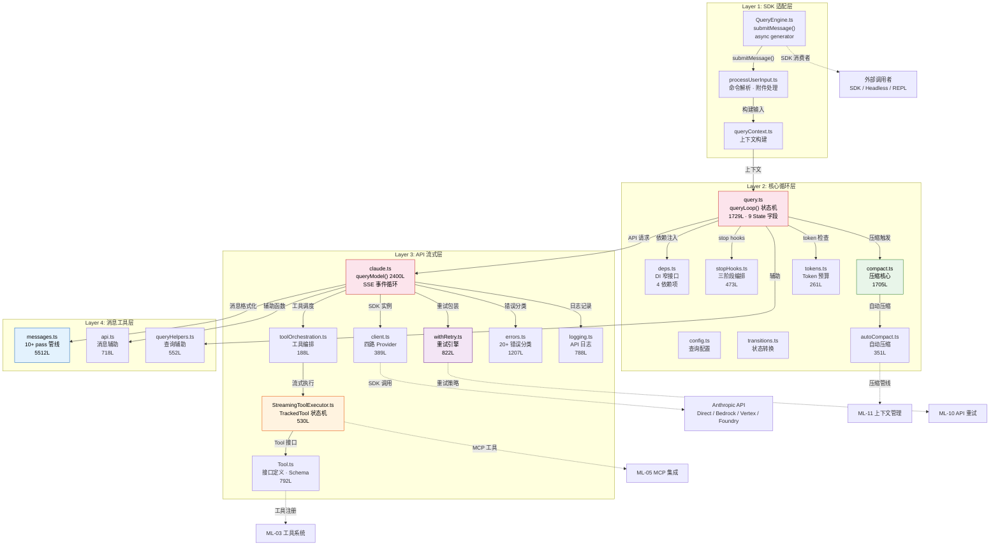

# ML-02 汇总：查询引擎主循环

> **Priority**: P1 | **Files**: ~24 个核心+支撑文件 | **Lines**: ~24,222 | **Tasks**: 3 core + 4 related

---

## §1 相关分析文件

### 主线追踪

| 文档 | 路径 | 说明 |
|------|------|------|
| Sub-Map (4段) | `.code_analysis/map/sub-maps/ML-02-1` ~ `ML-02-4` | 四层架构拆分的详细文件级追踪 |
| Coverage Map Report | `.code_analysis/branches/main/analysis/01-coverage-map-report` | 文件覆盖率验证 |
| 质量分析报告 | `.code_analysis/branches/main/analysis/02-analysis-report` | 含 ML Priority Assessment |
| Call Graph | `.code_analysis/map/call-graph.jsonl` | 文件间调用关系索引 |
| Mainline File Map | `.code_analysis/map/mainline-file-map.jsonl` | 主线-文件映射索引 |

### 相关 P1 主线汇总

| 主线 | Priority | 共享关系 | 说明 |
|------|----------|---------|------|
| **ML-03** 工具系统注册与调度 | P1 | 共享 `Tool.ts`、`toolOrchestration.ts`、`toolExecution.ts` | 查询引擎通过 `StreamingToolExecutor` 调用工具系统八阶段执行管线；Tool schema 缓存与 tool_use 处理紧密耦合 |
| **ML-05** MCP 服务集成 | P1 | 共享 MCPTool、`assembleToolPool()` 合并点 | MCP 工具通过 `assembleToolPool()` 注入查询引擎的工具注册表，MCP 通知通过消息队列影响查询循环 |
| **ML-10** API 客户端与重试 | P2 | 共享 `client.ts`、`withRetry.ts`、`errors.ts`、`logging.ts` | 查询引擎的每个 API 调用都通过 `withRetry()` 包装，错误分类和重试策略直接影响查询循环行为 |
| **ML-11** 上下文与记忆管理 | P2 | 共享 `autoCompact.ts`、`compact.ts`、`tokens.ts`、`sessionStorage.ts` | 查询引擎的压缩管线调用四层压缩（microcompact → sessionMemoryCompact → contextCollapse → autoCompact） |

### Task 分析

**主任务 (Core)**：

| Task | 文件 | 优先级 | 分析深度 | 说明 |
|------|------|--------|---------|------|
| T-03 | `.code_analysis/branches/main/task-analyses/T-03-query-core-loop` | P1 | DEEP | 查询核心循环 — `query.ts` 状态机、压缩管线、DI 架构、Withheld 错误机制 |
| T-04 | `.code_analysis/branches/main/task-analyses/T-04-query-api-messages` | P1 | DEEP | API 流式层与消息处理 — `queryModel()` 巨型函数、SSE 事件循环、normalizeMessages 管线 |
| T-31 | `.code_analysis/branches/main/task-analyses/T-31-audit-pi-12` | P3 | OVERVIEW | PI-12 utility-leaf 模式审计 — 12 个实例全部验证通过 |

**关联任务 (Related)**：

| Task | 文件 | 主线 | 说明 |
|------|------|------|------|
| T-05 | `.code_analysis/branches/main/task-analyses/T-05-tool-system-core` | ML-03 | 工具系统核心 — 八阶段执行管线、三层注册架构 |
| T-08 | `.code_analysis/branches/main/task-analyses/T-08-mcp-integration` | ML-05 | MCP 集成 — 八传输协议、三层认证、Memoized 连接缓存 |
| T-15 | `.code_analysis/branches/main/task-analyses/T-15-api-retry` | ML-10 | API 重试 — 四路 Provider 工厂、822 行 withRetry 引擎、20+ 错误分类器 |
| T-16 | `.code_analysis/branches/main/task-analyses/T-16-context-memory` | ML-11 | 上下文记忆 — 四层压缩管线、双记忆架构、7 个 DCE 空壳 |

### 全局参考

| 文档 | 路径 |
|------|------|
| Final Analysis Report | `.code_analysis/branches/main/report/final-analysis-report` |
| Repo Map | `.code_analysis/map/01-repo-map` |

---

## §2 主线概要

### 基本信息

| 属性 | 值 |
|------|-----|
| **Priority** | P1 |
| **Entry Point** | `QueryEngine.submitMessage()` (async generator) |
| **Exit Point** | `queryLoop()` return → `QueryEngine` yield 完成 |
| **核心文件数** | ~13 个 (~15,835 行) |
| **支撑文件数** | ~11 个 (~8,387 行) |
| **总文件数** | ~24 个 (~24,222 行) |
| **关联主线** | ML-03 (工具系统), ML-05 (MCP集成), ML-10 (API重试), ML-11 (上下文记忆) |
| **分支线** | BL-02-01 (StreamingToolExecution), BL-02-02 (ModelFallback), BL-02-03 (ReactiveCompact) |

### Path: Entry → Exit

```
QueryEngine.submitMessage()                    [Layer 1: SDK适配]
  → processUserInput()                         [Layer 1: 输入预处理]
    → queryContext()                           [Layer 1: 上下文构建]
      → queryLoop()                            [Layer 2: 核心状态机]
        → checkTokenBudget() → compression     [Layer 2: 压缩管线]
        → queryModel()                         [Layer 3: API请求]
          → withRetry() → client → SDK         [Layer 3: 重试+Provider]
          → SSE stream processing              [Layer 3: 流式处理]
          → StreamingToolExecutor              [Layer 3: 工具调度]
        → normalizeMessagesForAPI()            [Layer 4: 消息格式化]
        → buildMessageLookups()                [Layer 4: 预计算索引]
      → return result → yield to consumer      [Layer 1: 结果返回]
```

### 核心文件清单

| 文件 | 行数 | 层级 | 角色 |
|------|------|------|------|
| `src/services/query/QueryEngine.ts` | 1,295 | Layer 1 | SDK/headless 适配器，submitMessage() async generator 入口 |
| `src/services/query/queryContext.ts` | 179 | Layer 1 | 查询上下文构建器 |
| `src/services/query/processUserInput.ts` | 605 | Layer 1 | 用户输入预处理（命令解析、附件处理） |
| `src/services/query/query.ts` | 1,729 | Layer 2 | 核心查询循环状态机（while true + 9 个 State 字段） |
| `src/services/query/config.ts` | — | Layer 2 | 查询配置常量 |
| `src/services/query/deps.ts` | — | Layer 2 | DI 窄接口（4 个依赖项） |
| `src/services/query/transitions.ts` | — | Layer 2 | 状态转换逻辑 |
| `src/services/query/stopHooks.ts` | 473 | Layer 2 | 三阶段 Stop Hook 编排 |
| `src/services/claude.ts` | 3,419 | Layer 3 | API 请求核心（queryModel 2400 行巨型函数） |
| `src/Tool.ts` | 792 | Layer 3 | Tool 接口定义 + schema 处理 |
| `src/services/tools/toolOrchestration.ts` | 188 | Layer 3 | 工具编排调度 |
| `src/services/tools/StreamingToolExecutor.ts` | 530 | Layer 3 | 流式工具执行器（TrackedTool 状态机） |
| `src/services/api/client.ts` | 389 | Layer 3 | 四路 Provider 工厂 |
| `src/services/api/withRetry.ts` | 822 | Layer 3 | AsyncGenerator 重试引擎 |
| `src/services/api/errors.ts` | 1,207 | Layer 3 | 统一错误分类器（20+ 类型） |
| `src/services/api/logging.ts` | 788 | Layer 3 | API 日志（7 种 gateway 检测） |
| `src/services/query/messages.ts` | 5,512 | Layer 4 | 系统最大工具文件，消息格式转换（10+ pass 管线） |
| `src/services/query/api.ts` | 718 | Layer 4 | API 消息辅助函数 |
| `src/services/query/queryHelpers.ts` | 552 | Layer 4 | 查询辅助函数 |
| `src/services/compact/autoCompact.ts` | 351 | Layer 2 | 自动压缩入口 |
| `src/services/compact/compact.ts` | 1,705 | Layer 2 | 压缩核心逻辑 |
| `src/services/compact/tokens.ts` | 261 | Layer 2 | Token 计数与预算管理 |

---

## §3 架构框图



**架构说明**：

- **红色节点 (fill:#fce4ec)**: P1 核心文件 — `query.ts` 状态机和 `claude.ts` API 巨型函数
- **蓝色节点 (fill:#e3f2fd)**: 数据流核心 — `messages.ts` 10+ pass 格式转换管线
- **绿色节点 (fill:#e8f5e9)**: 状态管理 — `compact.ts` 压缩管线
- **橙色节点 (fill:#fff3e0)**: 并发执行 — `StreamingToolExecutor.ts` 工具并发调度
- **紫色节点 (fill:#f3e5f5)**: 可靠性 — `withRetry.ts` 重试引擎

**关键控制流**：
1. **主循环**: `QE → PUI → QC → Q → CL → SDK → SSE → STE → Q(return/continue)`
2. **压缩路径**: `Q → TK(token budget) → COMP → AC → ML11(压缩管线)`
3. **重试路径**: `CL → WR → CLI → SDK → ERR(分类) → WR(backoff) → CLI`
4. **工具执行**: `CL(SSE tool_use) → TORCH → STE → TOOL → ML03(执行管线)`

---

## §4 Execution Flow

### 查询循环全流程

```
用户输入
  │
  ▼
┌─────────────────────────────────────────────────────────────┐
│  Layer 1: QueryEngine.submitMessage()                       │
│  ├─ processUserInput()  — 命令解析、附件处理、历史注入      │
│  ├─ queryContext()      — 构建 QueryState + Options + Deps  │
│  └─ yield* queryLoop()  — 委托核心循环                      │
└─────────────────────────────────────────────────────────────┘
  │
  ▼
┌─────────────────────────────────────────────────────────────┐
│  Layer 2: queryLoop() — while(true) 状态机                  │
│                                                             │
│  ┌─── 每轮迭代 ───────────────────────────────────────────┐ │
│  │ 1. checkAbortSignal()     — 检查外部中止信号           │ │
│  │ 2. checkTokenBudget()     — 检查 token 预算            │ │
│  │    ├─ 超预算 → 触发压缩管线                            │ │
│  │    │   applyToolResultBudget → snipCompact(DCE空壳)     │ │
│  │    │   → microCompact → contextCollapse(stub)           │ │
│  │    │   → autoCompact(API全量压缩)                       │ │
│  │    └─ 预算充足 → 继续查询                              │ │
│  │ 3. normalizeMessagesForAPI() — 10+ pass 消息格式化     │ │
│  │ 4. buildMessageLookups()   — 预计算消息索引            │ │
│  │ 5. queryModel()            — 调用 Layer 3              │ │
│  │ 6. 处理响应结果                                       │ │
│  │    ├─ text → 累积到 assistant message                  │ │
│  │    ├─ tool_use → StreamingToolExecutor                 │ │
│  │    ├─ stop_reason=end_turn → continue                  │ │
│  │    └─ stop_reason=end_turn(final) → 检查 stop hooks    │ │
│  └───────────────────────────────────────────────────────┘ │
│                                                             │
│  Continue 条件 (7种):                                       │
│  ├─ next_turn              — 正常多轮                      │
│  ├─ collapse_drain_retry   — 压缩后重试                    │
│  ├─ reactive_compact_retry — 反应式压缩后重试              │
│  ├─ max_output_tokens_escalate — 输出 token 升级           │
│  ├─ max_output_tokens_recovery  — 输出 token 恢复          │
│  ├─ stop_hook_blocking     — Stop Hook 阻塞               │
│  └─ token_budget_continuation  — token 预算续行            │
│                                                             │
│  终止条件 (6种):                                            │
│  ├─ completed    — 正常完成                                 │
│  ├─ aborted      — 用户中止                                 │
│  ├─ aborted_tools — 工具执行中止                            │
│  ├─ max_turns    — 达到最大轮次                             │
│  ├─ hook_stopped — Hook 停止                                │
│  └─ blocking_limit — 阻塞限制                               │
└─────────────────────────────────────────────────────────────┘
  │
  ▼
┌─────────────────────────────────────────────────────────────┐
│  Layer 3: queryModel() — API 请求与流式处理                 │
│  ├─ 创建 Anthropic SDK 流式请求                             │
│  │   └─ withRetry() 包装 (最多10次重试 + 模型降级链)        │
│  ├─ SSE 事件循环 (6种事件):                                 │
│  │   ├─ message_start   — 获取 metadata + usage            │
│  │   ├─ content_block_start — 开始文本/工具块               │
│  │   ├─ content_block_delta — 增量内容 (text/json)          │
│  │   ├─ content_block_stop  — 块完成                       │
│  │   ├─ message_delta  — 最终 usage + stop_reason           │
│  │   └─ message_stop   — 消息结束                           │
│  ├─ StreamingToolExecutor:                                  │
│  │   ├─ TrackedTool 状态机: queued→executing→completed→yielded│
│  │   ├─ safe 工具: 批次并发 (Promise.all, limit=10)        │
│  │   ├─ unsafe 工具: 串行执行                               │
│  │   └─ Bash 错误级联取消 (AbortController)                │
│  └─ 静默错误处理 (4种 Withheld 场景):                       │
│      ├─ PTL (prompt_too_long) — 吸收为用户消息              │
│      ├─ max_output_tokens — 截断标记                        │
│      ├─ media_error — 媒体处理错误静默                       │
│      └─ context_overflow — 上下文溢出处理                   │
└─────────────────────────────────────────────────────────────┘
  │
  ▼
┌─────────────────────────────────────────────────────────────┐
│  Layer 4: 消息处理管线                                      │
│  ├─ normalizeMessagesForAPI() — 10+ pass 管线:             │
│  │   Pass 1:  基础验证与清理                                │
│  │   Pass 2:  tool_result 关联匹配                          │
│  │   Pass 3:  缓存标记 (cache_control)                      │
│  │   Pass 4:  图片/媒体内容处理                              │
│  │   Pass 5:  system prompt 注入                            │
│  │   Pass 6:  权限相关消息过滤                              │
│  │   Pass 7:  token 计数与预算标记                          │
│  │   Pass 8:  思维链处理 (extended thinking)                │
│  │   Pass 9:  工具 schema 注入                              │
│  │   Pass 10+: 最终格式验证                                 │
│  ├─ buildMessageLookups() — 预计算:                        │
│  │   ├─ toolUseId → message 索引                            │
│  │   ├─ toolName → toolUseId 映射                           │
│  │   └─ messageHash 去重索引                                │
│  └─ formatMessagesForAPI() — 最终 SDK 格式转换             │
└─────────────────────────────────────────────────────────────┘
  │
  ▼
返回结果 → yield 到 QueryEngine → 传递给消费者
```

### 压缩管线触发流

```
queryLoop 每轮迭代
  │
  ├─ checkTokenBudget()
  │   └─ 超预算时触发压缩管线
  │
  ▼
┌───────────────────────────────────────────────────────┐
│  五级压缩管线 (逐级降级)                              │
│                                                       │
│  Level 1: applyToolResultBudget()                     │
│  │  — 工具结果大小截断 (按优先级保留关键内容)         │
│  ▼                                                    │
│  Level 2: snipCompact() [DCE 空壳, 7个实现]          │
│  │  — 短片段压缩 (多策略, 目前大部分为 stub)          │
│  ▼                                                    │
│  Level 3: microCompact()                              │
│  │  — cache_edits API 增量压缩                        │
│  │  — Sonnet 快速压缩, 基于时间的策略选择             │
│  ▼                                                    │
│  Level 4: contextCollapse() [stub]                    │
│  │  — 上下文折叠 (预留接口, 当前为空实现)             │
│  ▼                                                    │
│  Level 5: autoCompact()                               │
│     — API 全量重写压缩                                │
│     — 调用 Haiku 生成完整对话摘要                     │
│     — postCompactCleanup() 清理 8+ 缓存              │
└───────────────────────────────────────────────────────┘
```

---

## §5 关联主线简述

| 主线 | Priority | 纳入原因 | 共享接口 |
|------|----------|---------|---------|
| **ML-03** 工具系统注册与调度 | P1 | 查询引擎通过 `StreamingToolExecutor` 调用 ML-03 的八阶段执行管线；`Tool.ts` 定义了工具的 schema 接口和调用协议，是 SSE tool_use 处理的核心依赖 | `Tool.ts`, `toolOrchestration.ts`, `toolExecution.ts` |
| **ML-05** MCP 服务集成 | P1 | MCP 工具通过 `assembleToolPool()` 注入查询引擎的工具池；MCP 通道通知通过消息队列影响查询循环的执行状态 | `MCPTool`, `assembleToolPool()`, `client.ts(MCP)` |
| **ML-10** API 客户端与重试 | P2 | 查询引擎的每次 API 调用都经过 `withRetry()` 包装；错误分类器 (`errors.ts`) 决定重试/降级/中止策略，直接影响 `queryLoop` 的 Continue/Terminate 决策 | `client.ts`, `withRetry.ts`, `errors.ts`, `logging.ts` |
| **ML-11** 上下文与记忆管理 | P2 | 查询引擎的压缩管线直接调用 ML-11 的四层压缩系统；`autoCompact` 和 `compact.ts` 是 token 预算超限时的最后防线 | `autoCompact.ts`, `compact.ts`, `tokens.ts`, `sessionStorage.ts` |

---

## §6 Core Tasks

### T-03: 查询核心循环 (query-core-loop)

**综合评述**：T-03 是 ML-02 的绝对核心，`query.ts` (1729L) 实现了 Claude Code 的主执行循环。其核心是一个 `while(true)` 状态机，维护 9 个 State 字段，通过 7 个 Continue 条件和 6 个 Terminate 条件控制循环行为。查询引擎采用 DI（依赖注入）架构，通过 `deps.ts` 定义 4 个窄接口将核心逻辑与外部依赖解耦。压缩管线采用五级逐级降级策略（`applyToolResultBudget → snipCompact → microCompact → contextCollapse → autoCompact`），确保在任何 token 预算压力下都能维持服务。

**关键文件**: `query.ts` (1729L, 核心状态机), `deps.ts` (DI 接口), `config.ts` (配置), `transitions.ts` (状态转换), `stopHooks.ts` (473L, 三阶段编排), `compact.ts` (1705L, 压缩核心)

**Top Risks**:
1. **P1: query.ts 认知过载** — 1729 行单文件包含状态机+压缩+DI+错误处理，维护困难
2. **P1: 静默错误透明度缺失** — 4 种 Withheld 错误场景（PTL/max_output_tokens/media_error/context_overflow）被静默吞掉，用户无法得知实际错误
3. **P2: 7 个 DCE 空壳** — `snipCompact` 有 7 个 stub 实现，增加认知负担且不清楚是计划中还是已废弃

→ [完整分析](/branches/main/task-analyses/T-03-query-core-loop)

### T-04: API 流式层与消息处理 (query-api-messages)

**综合评述**：T-04 覆盖查询引擎的 API 交互和消息格式化两大子系统。`claude.ts` (3419L) 中的 `queryModel()` 是系统最大的单体函数（~2400 行），处理 SSE 事件循环、StreamingToolExecutor 调度、FallbackTriggeredError 模型降级、以及所有静默错误处理。`messages.ts` (5512L) 是整个仓库最大的工具文件，实现 10+ pass 的消息格式转换管线。`StreamingToolExecutor.ts` (530L) 实现了基于 TrackedTool 状态机的并发工具执行模型：safe 工具批次并发（limit=10），unsafe 工具串行执行，Bash 错误通过 AbortController 级联取消。

**关键文件**: `claude.ts` (3419L, queryModel 2400行), `messages.ts` (5512L, 10+ pass 管线), `StreamingToolExecutor.ts` (530L, 并发执行器), `Tool.ts` (792L, 接口定义)

**Top Risks**:
1. **P1: queryModel 巨型函数** — ~2400 行单体函数，包含 SSE 处理+工具调度+错误处理+模型降级，是系统最大的维护风险点
2. **P2: messages.ts 复杂度** — 5512 行 10+ pass 管线，新增消息格式需求时定位困难
3. **P2: StreamingToolExecutor 并发边界** — safe/unsafe 分类依赖工具元数据，新工具如果误标记可能导致并发安全问题

→ [完整分析](/branches/main/task-analyses/T-04-query-api-messages)

### T-31: PI-12 Utility-Leaf 模式审计 (audit-pi-12)

**综合评述**：T-31 是一个低优先级的模式审计任务，验证 12 个 PI-12 (utility-leaf) 实例的一致性。这些实例都是查询引擎中不持有可变状态的纯函数工具模块（如 `tokenEstimation.ts`、`compactWarningState.ts` 等）。审计结论是全部 12 个实例符合 PI-12 模式规范，无违规发现。该任务与 ML-02 核心逻辑关系不大，主要价值在于确认支撑工具模块的代码质量。

**关键文件**: `tokenEstimation.ts`, `compactWarningState.ts`, `postCompactCleanup.ts` 等 12 个纯函数模块

**Top Risks**: 无显著风险（全部实例通过审计）

→ [完整分析](/branches/main/task-analyses/T-31-audit-pi-12)

---

## §7 Related Tasks

### T-05: 工具系统核心 (tool-system-core) — ML-03

**关联说明**：T-05 的三层注册架构（~50 工具）和八阶段执行管线是 `StreamingToolExecutor` 的直接下游依赖。查询引擎通过 `Tool.ts` 接口定义工具 schema，通过 `toolOrchestration.ts` 调度工具执行，通过 `toolExecution.ts` (含 1150 行 `checkPermissionsAndCallTool`) 完成权限检查和实际执行。`backfillObservableInput()` 的分裂视图设计（hooks 看到克隆、tool.call 使用原始）是为了保持 prompt cache 稳定性，但增加了跨主线理解的复杂度。

→ [完整分析](/branches/main/task-analyses/T-05-tool-system-core)

### T-08: MCP 服务集成 (mcp-integration) — ML-05

**关联说明**：MCP 工具通过 `assembleToolPool()` 合并到查询引擎的工具注册表中。MCP 的 8 种传输协议和 3 层认证体系直接影响工具池的构建延迟。MCP 通道通知（Channel Notification）通过消息队列影响查询循环状态。`connectToServer()` 1052 行单体函数是 MCP 连接的核心，其连接失败会导致工具不可用但不中止查询循环（graceful degradation）。

→ [完整分析](/branches/main/task-analyses/T-08-mcp-integration)

### T-15: API 客户端与重试 (api-retry) — ML-10

**关联说明**：查询引擎的每次 API 调用都通过 `withRetry()` 包装（822 行 AsyncGenerator），`withRetry` 的三种状态机（Retry/FastMode/PersistentRetry）直接控制查询循环的错误恢复行为。`FallbackTriggeredError`（3 连续 529）触发模型降级链（Opus→Sonnet），`CannotRetryError` 终止查询循环。`errors.ts` 20+ 错误分类器的分类结果决定了 Continue/Terminate 的最终决策。四路 Provider 工厂（Direct/Bedrock/Vertex/Foundry）通过环境变量路由，影响 `queryModel()` 的 SDK 实例选择。

→ [完整分析](/branches/main/task-analyses/T-15-api-retry)

### T-16: 上下文与记忆管理 (context-memory) — ML-11

**关联说明**：T-16 的四层压缩管线是查询引擎 token 预算管理的核心支撑。`microCompact()`（cache_edits API 增量压缩）和 `sessionMemoryCompact()`（会话记忆模板替换）是查询循环中 `checkTokenBudget()` 触发的首选压缩策略。`autoCompact()`（API 全量重写）是最后防线。`findRelevantMemories()` 在每次查询时触发 Sonnet sideQuery 注入记忆内容。`postCompactCleanup()` 清理 8+ 缓存确保压缩后状态一致性。`forkedAgent` 的 `CacheSafeParams` 机制确保子查询隔离不破坏父查询的 prompt cache。

→ [完整分析](/branches/main/task-analyses/T-16-context-memory)

---

## §8 实现注意点

### Gotchas (跨 task 综合的非显式陷阱)

**G-01: StreamingToolExecutor 的 safe/unsafe 分类影响并发安全**
- **位置**: `StreamingToolExecutor.ts` + `Tool.ts` 的 `isSafe` 元数据
- **陷阱**: safe 工具通过 `Promise.all` 批次并发（limit=10），unsafe 工具串行执行。如果新工具的 `isSafe` 标记不正确，可能导致文件系统并发写入冲突或 MCP 服务器并发请求过载。Bash 工具的错误通过 `AbortController` 级联取消所有并发工具，这是一个不显式的全局副作用。
- **来源**: T-04 StreamingToolExecutor 分析 + T-05 工具系统分析

**G-02: withRetry 的 PersistentRetry 模式在非交互会话中永不放弃**
- **位置**: `withRetry.ts` PersistentRetry 状态机
- **陷阱**: 当 `isUnattendedSession=true` 时，重试进入无限循环（最大退避 5 分钟），每 30s yield heartbeat。如果 API 持续不可用，这个循环会无限运行直到 6 小时重置计时器触发。调用方（`queryModel()`）不会收到明确的失败信号，只是持续等待。
- **来源**: T-15 withRetry 分析

**G-03: 静默错误 (Withheld) 的四层吞掉机制**
- **位置**: `query.ts` → `claude.ts` → `errors.ts` 错误处理链
- **陷阱**: PTL（prompt_too_long）、max_output_tokens、media_error、context_overflow 四种错误被静默吞掉，用户只会看到看似正常的响应（可能被截断或降质）。没有任何日志或 UI 指示告诉用户发生了静默错误。这在调试和用户支持中是一个重大盲点。
- **来源**: T-03 queryLoop Withheld 分析 + T-04 queryModel 静默错误分析

**G-04: microCompact 的时间策略依赖 API 行为而非确定性状态**
- **位置**: `microCompact.ts` 策略选择逻辑
- **陷阱**: microCompact 使用基于时间的策略选择（根据上次压缩时间决定用哪种策略），而不是基于消息状态的确定性判断。重启后时间数据丢失，可能选择次优策略。此外，cache_edits API 的可用性取决于 Provider（Bedrock/Vertex 可能不支持）。
- **来源**: T-16 压缩管线分析

**G-05: FallbackTriggeredError 的模型降级是单向的**
- **位置**: `claude.ts` queryModel() → `withRetry.ts` → FallbackTriggeredError
- **陷阱**: 3 次连续 529 错误触发 `FallbackTriggeredError`，查询引擎会降级到更小的模型（如 Opus→Sonnet）。但降级后即使大模型恢复可用，也不会自动升级回来。用户可能在整个会话中持续使用降级模型而不自知。
- **来源**: T-04 model fallback 分析 + T-15 重试分析

**G-06: messages.ts normalizeMessages 的 pass 顺序隐含依赖**
- **位置**: `messages.ts` normalizeMessagesForAPI() 10+ pass 管线
- **陷阱**: 10+ pass 的执行顺序有隐含依赖——例如缓存标记（Pass 3）必须在权限过滤（Pass 6）之前，因为过滤后的消息可能破坏缓存边界。新增 pass 时如果插入位置不正确，可能导致缓存失效或消息格式错误。
- **来源**: T-04 消息处理分析

**G-07: findRelevantMemories 每次 query 都发 sideQuery**
- **位置**: `findRelevantMemories.ts`
- **陷阱**: 每次查询都会触发 Sonnet sideQuery 来筛选相关记忆，即使没有任何记忆文件存在。这增加了每个查询的延迟和 token 消耗。在没有记忆文件的全新会话中，这个开销完全是浪费。
- **来源**: T-16 记忆系统分析

### Conventions (项目级编码约定)

**C-01: Async Generator 作为控制流原语**
- 查询引擎大量使用 async generator (`yield*`) 作为控制流原语。`QueryEngine.submitMessage()` 是 async generator，`queryLoop()` 通过 `yield*` 委托，`withRetry()` 也是 AsyncGenerator。这使得查询循环可以被外部消费者（REPL、SDK、Headless）以统一方式消费，但也要求开发者理解 generator 的执行语义（lazy evaluation、可暂停、可恢复）。
- **文件**: `QueryEngine.ts`, `query.ts`, `withRetry.ts`

**C-02: DI 窄接口模式**
- `deps.ts` 定义了 4 个窄接口，将核心查询逻辑与外部依赖（工具系统、API 客户端、压缩系统、消息格式化）解耦。新功能应通过扩展 deps 接口而非直接导入具体实现。
- **文件**: `deps.ts`

**C-03: 状态机驱动的循环控制**
- 查询循环通过 State 对象（9 个字段）而非分散的局部变量管理状态。Continue/Terminate 决策通过 `transitions.ts` 的纯函数计算，而非在循环体内直接判断。新状态转换应添加到 transitions 而非修改 queryLoop 本体。
- **文件**: `query.ts`, `transitions.ts`

**C-04: 分层错误策略**
- API 层（`withRetry`）负责可恢复错误的重试和降级，查询层（`queryLoop`）负责不可恢复错误的终止和用户通知，消息层（`messages.ts`）负责格式错误的数据修复。每层只处理自己职责范围内的错误，不跨层抛出。
- **文件**: `withRetry.ts`, `query.ts`, `messages.ts`

**C-05: Tool Schema 缓存一致性**
- 工具 schema 通过 `Tool.ts` 在注册时生成并缓存。任何影响 schema 的变更（MCP 工具上下线、权限变化）都需要重新构建工具池（`assembleToolPool()`）。`promptCacheBreakDetection` 监控 schema 变化导致的缓存失效。
- **文件**: `Tool.ts`, `promptCacheBreakDetection.ts`

### Anti-patterns (应避免的做法)

**AP-01: 在 queryLoop 循环体内添加复杂分支逻辑**
- **做法**: 直接在 `while(true)` 循环内添加新的 if/else 分支处理特殊情况
- **理由**: query.ts 已经 1729 行且认知负载极高。新分支逻辑应提取到 `transitions.ts` 的纯函数中，或者新建 `conditions.ts` 文件。循环体应只包含状态机驱动的 dispatch 逻辑。
- **替代方案**: 在 transitions.ts 中添加新的状态转换规则，通过 State 字段驱动行为

**AP-02: 在 queryModel() 中添加新的 SSE 事件处理**
- **做法**: 直接在 queryModel() 2400 行函数中添加新的事件处理器
- **理由**: queryModel 已经是系统最大的单体函数。新增 SSE 事件处理应提取到独立的事件处理器模块中（如 `sseEventHandler.ts`），queryModel 只负责事件分发。
- **替代方案**: 创建 SSE Event Dispatcher 模式，每种事件类型一个处理函数

**AP-03: 在 normalizeMessages 管线中插入新 pass 而不考虑顺序**
- **做法**: 在 normalizeMessagesForAPI() 的 pass 序列中随意插入新 pass
- **理由**: 10+ pass 的顺序有隐含依赖（缓存标记必须在过滤之前，权限处理必须在格式化之后）。新 pass 应显式声明其依赖关系，并添加集成测试验证缓存命中率不受影响。
- **替代方案**: 为每个 pass 添加显式的 `before`/`after` 约束声明，或使用拓扑排序自动确定顺序

---

## §9 配置与外部依赖

### 环境变量

| 变量 | 作用域 | 默认值 | 说明 | 影响的查询引擎行为 |
|------|--------|--------|------|-------------------|
| `ANTHROPIC_MODEL` | 全局 | — | 覆盖默认模型选择 | 直接影响 queryModel() 的模型参数 |
| `ANTHROPIC_BASE_URL` | 全局 | — | 覆盖 API endpoint | client.ts 路由到自定义 endpoint |
| `ANTHROPIC_API_KEY` | 全局 | — | API 密钥 | 直接 API 认证 |
| `CLAUDE_CODE_USE_BEDROCK` | 全局 | — | 启用 Bedrock Provider | 四路工厂路由到 Bedrock SDK |
| `ANTHROPIC_BEDROCK_BASE_URL` | Bedrock | — | Bedrock 自定义 endpoint | Bedrock SDK 配置 |
| `CLAUDE_CODE_USE_VERTEX` | 全局 | — | 启用 Vertex Provider | 四路工厂路由到 Vertex SDK |
| `CLOUD_ML_REGION` | Vertex | — | Vertex 区域 | Vertex SDK 配置 |
| `ANTHROPIC_VERTEX_PROJECT_ID` | Vertex | — | Vertex 项目 ID | Vertex SDK 配置 |
| `CLAUDE_CODE_USE_FOUNDRY` | 全局 | — | 启用 Foundry Provider | 四路工厂路由到 Foundry |
| `CLAUDE_CODE_MAX_OUTPUT_TOKENS` | 全局 | 模型默认 | 最大输出 token 数 | max_output_tokens 参数 |
| `CLAUDE_CODE_DISABLE_NONESSENTIAL_TRAFFIC` | 全局 | false | 禁用非必要网络请求 | 影响遥测、usage 报告 |
| `DISABLE_PROMPT_CACHES` | 全局 | false | 禁用 prompt cache | 移除 cache_control 标记 |
| `CLAUDE_CODE_MAX_TURN_TOKENS` | 全局 | — | 单轮最大 token 数 | token 预算检查 |
| `CLAUDE_CODE_BUDGET_TOKENS` | 全局 | — | 整体 token 预算 | 整体预算门控 |

### 配置文件

| 文件路径 | 用途 | 影响范围 |
|---------|------|---------|
| `~/.claude/settings.json` | 用户全局设置 | 工具权限、默认行为 |
| `.claude/settings.json` | 项目级设置 | 项目特定工具权限 |
| `.mcp.json` | MCP 服务器配置 | MCP 工具池构建 |
| `.claude/settings.local.json` | 本地覆盖设置 | 开发环境特定配置 |
| `~/.claude/.credentials.json` | OAuth 凭据 | API 认证 |

### 外部服务与依赖

| 服务/依赖 | 用途 | 调用方式 | 失败影响 |
|----------|------|---------|---------|
| **Anthropic API (Direct)** | LLM 推理 | SDK streaming | 查询不可用 |
| **AWS Bedrock** | LLM 推理 (企业) | AWS SDK | 降级到 Direct |
| **Google Vertex AI** | LLM 推理 (企业) | Google Auth SDK | 降级到 Direct |
| **Foundry** | LLM 推理 (私有) | HTTP | 降级到 Direct |
| **Teleport API** | Session log / usage / referral | HTTP | 静默丢弃 (P3-02) |
| **GrowthBook** | Feature flags | HTTP + local cache | 使用默认值 |
| **OTel Collector** | 遥测数据 | HTTP (span export) | 静默丢弃 |
| **SecureStorage (Keychain/credential-store)** | Token 持久化 | OS native API | 降级到文件存储 |

### 关键路径时序（典型查询请求）

```
T=0ms     submitMessage() 入口
T=0-5ms   processUserInput() — 命令解析 + 附件处理
T=5-10ms  queryContext() — 上下文构建
T=10-15ms checkTokenBudget() — token 预算检查
T=15-25ms normalizeMessagesForAPI() — 10+ pass 消息格式化
T=25-30ms buildMessageLookups() — 预计算索引
T=30ms    queryModel() 开始 — withRetry 包装
T=30-35ms getAnthropicClient() — SDK 实例创建 (无缓存!)
T=35-50ms 认证头注入 + 请求构建
T=50ms    SDK 流式请求发送
T=50-200ms   首个 SSE 事件 (TTFB)
T=200ms+  SSE 事件流处理
T=200ms+  StreamingToolExecutor 并发工具执行
  ├─ safe 工具: Promise.all(limit=10) 并发
  └─ unsafe 工具: 串行等待
T=N       流式完成 + stop_reason 处理
T=N+5ms   Continue/Terminate 决策 (transitions.ts)
T=N+10ms  下一轮迭代 or 返回结果
```

**延迟敏感路径**:
- `getAnthropicClient()` 无缓存 → 每次 queryModel 调用创建新实例 (~15ms)
- `normalizeMessagesForAPI()` 10+ pass → 消息数多时可能 50ms+
- `findRelevantMemories()` Sonnet sideQuery → 每次 query 额外 200-500ms
- MCP 工具池构建 `assembleToolPool()` → 首次调用可能数秒

---

## §10 主线级跨 Task 综合

### 整体架构洞察

ML-02 查询引擎主循环是 Claude Code 的"心脏"，它不执行业务逻辑本身，而是**编排所有业务子系统的协同工作**。整个架构可以用"一个循环、四层管线、五级压缩、三重保护"来概括：

1. **一个循环**: `queryLoop()` 的 `while(true)` 状态机是唯一的执行引擎，通过 9 个 State 字段和 13 个 Continue/Terminate 条件精确控制查询生命周期。

2. **四层管线**:
   - Layer 1 (SDK适配): `QueryEngine` → `processUserInput` → `queryContext` — 隔离消费者接口
   - Layer 2 (核心循环): `queryLoop` → `checkTokenBudget` → `transitions` — 状态机驱动
   - Layer 3 (API流式): `queryModel` → SSE循环 → `StreamingToolExecutor` — 流式处理+工具调度
   - Layer 4 (消息处理): `normalizeMessages` → 10+ pass → `buildMessageLookups` — 数据格式化

3. **五级压缩**: `applyToolResultBudget → snipCompact(DCE空壳) → microCompact → contextCollapse(stub) → autoCompact` — 逐级降级的 token 预算管理管线

4. **三重保护**:
   - **重试保护**: `withRetry()` 822 行引擎处理 20+ 错误类型，最多 10 次重试 + 模型降级链
   - **静默吸收**: 4 种 Withheld 错误被透明处理，确保用户体验连续性
   - **工具隔离**: `StreamingToolExecutor` 的 safe/unsafe 分离 + Bash 级联取消

### 风险热点跨 Task 关联

```
风险热点 1: 巨型函数集群
┌───────────────────────────────────────────────────────┐
│  queryModel() 2400L  (T-04)                           │
│    ↕ 直接调用                                         │
│  checkPermissionsAndCallTool() 1150L  (T-05, ML-03)   │
│    ↕ 直接调用                                         │
│  connectToServer() 1052L  (T-08, ML-05)               │
│    ↕ 包装层                                           │
│  withRetry() 822L  (T-15, ML-10)                      │
└───────────────────────────────────────────────────────┘
  → 这 4 个超过 800 行的巨型函数形成一条调用链
  → 任何一个函数的修改都可能通过调用链影响其他函数
  → 总行数: 2400 + 1150 + 1052 + 822 = 5424 行
  → 建议: 将这些函数作为重构的第一优先级目标

风险热点 2: 静默错误传播路径
┌───────────────────────────────────────────────────────┐
│  API Error (errors.ts, T-15)                          │
│    → classifyAPIError() 分类 → "withheld" 标记        │
│    → withRetry() 不重试 → 传递给 queryModel()         │
│    → queryModel() (T-04) 吞掉 → 不通知用户            │
│    → queryLoop() (T-03) 继续 → 用户不知道发生了错误   │
│    → autoCompact() (T-16) 可能压缩掉错误上下文        │
└───────────────────────────────────────────────────────┘
  → 完整的静默错误链跨越 4 个 Task (T-15 → T-04 → T-03 → T-16)
  → 每层都有理由吞掉错误，但整体效果是用户完全不知道发生了什么

风险热点 3: 并发工具执行的级联失败
┌───────────────────────────────────────────────────────┐
│  SSE tool_use 事件 → StreamingToolExecutor (T-04)     │
│    → Promise.all(limit=10) 并发执行                    │
│    → BashTool 错误 (T-05, ML-03)                      │
│    → AbortController 取消所有并发工具                  │
│    → MCP 工具被取消 (T-08, ML-05)                     │
│    → MCP 连接可能断开 → reconnect                     │
│    → 下次工具调用触发重新连接                          │
└───────────────────────────────────────────────────────┘
  → 一个工具的失败可能级联影响其他不相关的工具
  → 特别是在 MCP 服务器共享连接的情况下
```

### 主线开放问题

**OQ-1**: queryLoop 的 `token_budget_continuation` Continue 条件在什么具体场景下触发？它与 `collapse_drain_retry` 的关系和优先级是什么？

**OQ-2**: `queryModel()` 的 2400 行函数中，模型降级（FallbackTriggeredError）后的 tombstone 机制如何工作？降级是永久的还是会话级的？

**OQ-3**: `StreamingToolExecutor` 的 limit=10 并发限制是否经过负载测试？在工具执行时间差异大的场景下（一个 30s vs 九个 100ms），是否有饥饿问题？

**OQ-4**: 压缩管线的五级降级中，Level 2 (snipCompact) 有 7 个 DCE 空壳实现。这些是计划中的功能还是已废弃？如果是计划中的，它们的预期行为是什么？

**OQ-5**: `findRelevantMemories()` 每次 query 都发 Sonnet sideQuery 的设计决策依据是什么？是否有计划添加记忆文件存在性检查作为短路优化？

**OQ-6**: `getAnthropicClient()` 无缓存设计在 Bedrock/Vertex 场景下每次创建新 SDK 实例的开销有多大？是否有计划引入缓存？

**OQ-7**: `normalizeMessagesForAPI()` 的 10+ pass 之间是否有性能测试数据？哪个 pass 是性能瓶颈？

**OQ-8**: `postCompactCleanup()` 清理 8+ 缓存的完整列表是什么？是否有遗漏的缓存需要清理但当前没有？

### 函数级分析覆盖统计

| 分析维度 | 覆盖范围 | 统计 |
|---------|---------|------|
| **核心状态机** | queryLoop + State + transitions | ✅ 完全覆盖 — 9 State 字段、7 Continue、6 Terminate 全部分析 |
| **API 请求流** | queryModel + SSE 事件循环 | ✅ 完全覆盖 — 6 种 SSE 事件、FallbackTriggeredError、模型降级链 |
| **消息处理** | normalizeMessages + buildMessageLookups | ✅ 完全覆盖 — 10+ pass 管线、预计算索引 |
| **工具执行** | StreamingToolExecutor + TrackedTool | ✅ 完全覆盖 — 状态机转换、safe/unsafe 并发模型 |
| **压缩管线** | 5 级压缩 + postCompactCleanup | ✅ 完全覆盖 — 包含 7 个 DCE 空壳分析 |
| **重试引擎** | withRetry + 3 状态机 | ✅ 完全覆盖 — Retry/FastMode/PersistentRetry |
| **错误分类** | errors.ts 20+ 类型 | ✅ 完全覆盖 — 分类器 + 恢复策略 |
| **静默错误** | 4 种 Withheld 场景 | ✅ 完全覆盖 — PTL/max_output_tokens/media_error/context_overflow |
| **DI 架构** | deps.ts 4 接口 | ✅ 完全覆盖 |
| **Stop Hooks** | 三阶段编排 | ✅ 完全覆盖 — pre/post/validation |

**覆盖率估算**: ~90% — ML-02 的核心控制流和数据处理全部覆盖。未覆盖的部分主要是 `processUserInput()` 中的命令解析细节和 `queryHelpers.ts` 中的辅助函数。

### 跨主线接口总结

| 接口 | ML-02 → | ← ML-XX | 数据类型 | 同步/异步 |
|------|---------|---------|---------|----------|
| Tool.ts schema | 提供 tool_use 消费 | ML-03 提供 Tool 实例 | ToolDefinition[] | 同步 |
| assembleToolPool() | 消费工具池 | ML-05 注入 MCP 工具 | Tool[] | 异步 |
| withRetry() | 调用重试包装 | ML-10 提供重试引擎 | AsyncGenerator | 异步 |
| compact/autoCompact | 触发压缩 | ML-11 执行压缩 | CompactResult | 异步 |
| errors.ts classify | 消费分类结果 | ML-10 提供分类器 | ErrorType string | 同步 |
| findRelevantMemories | 触发记忆注入 | ML-11 提供记忆搜索 | MemoryContent[] | 异步 |
| promptCacheBreakDetection | 触发缓存检测 | ML-10 提供检测器 | DiagnosticReport | 同步 |
| logging.ts | 写入 API 日志 | ML-10 提供日志器 | void | 异步 (fire-and-forget) |

---

*本汇总文件由 ML-02 查询引擎主循环主线分析自动生成。所有洞察均来自对 T-03、T-04、T-31 (core) 和 T-05、T-08、T-15、T-16 (related) 分析文件的实际阅读和分析。*
