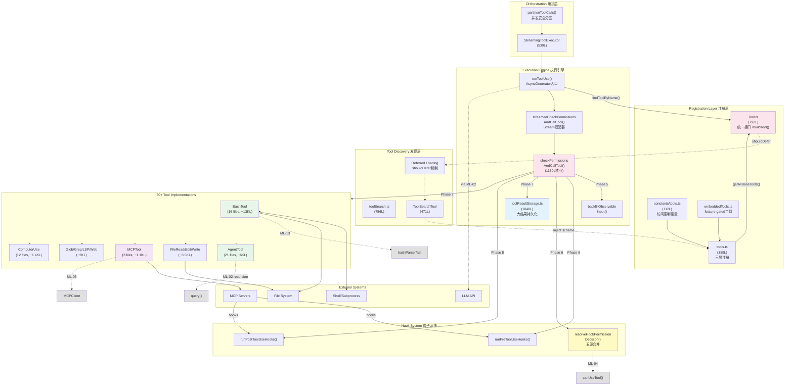
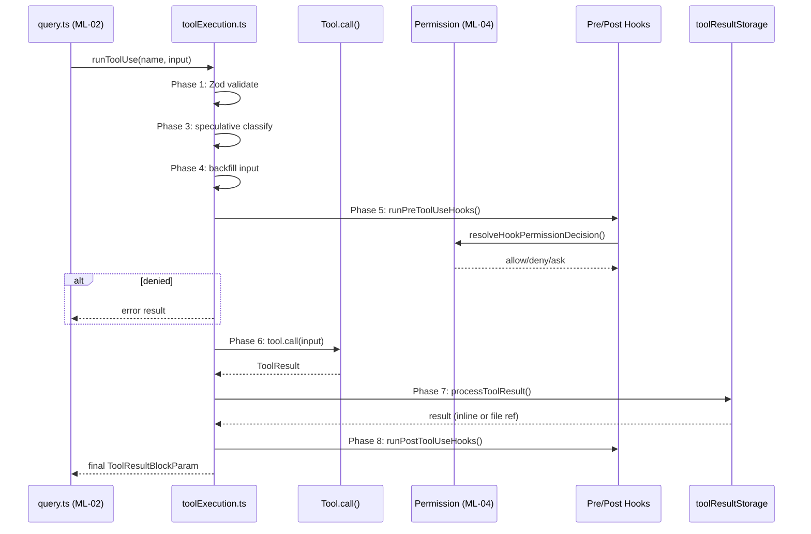

# ML-03: 工具系统注册与调度

> **Priority**: P1 | **Path**: `Tool.ts` (接口) → `tools.ts` (注册) → `toolExecution.ts` (执行) → `tool.call()` → `toolResultStorage.ts` (持久化)
> **Core Tasks**: T-05, T-21, T-36 | **Related Tasks**: T-06, T-08, T-18

---

## §1 相关分析文件

### 主线追踪

| 文件 | 说明 |
|------|------|
| [ML-03-1 (接口定义+注册+编排)]\(/map/sub-maps/ML-03-1) | Sub-map Layer 1: Tool.ts 统一接口 → tools.ts 三层注册 → toolOrchestration.ts 并发编排 |
| [ML-03-2 (执行引擎+结果存储+Representative)]\(/map/sub-maps/ML-03-2) | Sub-map Layer 2: toolExecution.ts 八阶段管线 → toolResultStorage.ts 大结果持久化 → 5 Representative 工具 |
| [coverage-map-report](/map/coverage-map-report) | 全局覆盖率门控报告 |

### 相关 P1 主线汇总

| 主线 | Priority | 共享关系 |
|------|----------|---------|
| [summary-ML-02-query-engine](/branches/main/report/summary-ML-02-query-engine-core) | P1 | query.ts 的 runTools() 是 toolExecution.ts runToolUse() 的唯一调用方；AgentTool 子查询递归进入 ML-02 的 query()；两者形成 query→tool→query 递归闭环 |
| [summary-ML-04-permission-system](/branches/main/report/summary-ML-04-permission-system) | P1 | toolExecution.ts Phase 6 调用 canUseTool()（ML-04 的 useCanUseTool.tsx）；resolveHookPermissionDecision() 位于 toolHooks.ts 但归属 ML-04；BashTool 的 speculative classifier 与 ML-04 的 auto-mode classifier 链路交汇 |
| [summary-ML-05-mcp-integration](/branches/main/report/summary-ML-05-mcp-service-integration) | P1 | assembleToolPool() 合并内置+MCP工具池；MCPTool.ts 将 MCP server tools 转为 Tool 实例；PostToolUse hooks 对 MCP 工具输出有修改权（内置工具不行）；MCP auth 错误触发 needs-auth 状态流转 |
| [summary-ML-13-bash-shell-engine](/branches/main/report/summary-ML-13-bash-shell-engine) | P2 | BashTool 的 bashSecurity/bashPermissions 依赖 ML-13 的 bashParser/ast 安全 walker；ShellProvider 抽象层（bashProvider/powershellProvider）由 ML-13 定义，被 BashTool 直接消费；readOnlyCommandValidation 和 dangerousCmdlets 为权限分类提供依据 |

### Task 分析

**Core Tasks（本主线直接归属）**：

| Task | 分析文件 | 深度 |
|------|---------|------|
| T-05 | [T-05-tool-system-core](/branches/main/task-analyses/T-05-tool-system-core) | DEEP — 工具系统核心：注册+执行+权限+结果处理（142 文件, ~58K 行） |
| T-21 | [T-21-audit-pi-01](/branches/main/task-analyses/T-21-audit-pi-01) | OVERVIEW — PI-01 tool-instance 模式审计（77 实例, 13% 抽样验证 100% pass） |
| T-36 | [T-36-audit-pi-18](/branches/main/task-analyses/T-36-audit-pi-18) | OVERVIEW — PI-18 computer-use-module 模式审计（2 实例, 100% 全量验证） |

**Related Tasks（关联主线）**：

| Task | 分析文件 | 关联主线 |
|------|---------|---------|
| T-06 | [T-06-permission-rules](/branches/main/task-analyses/T-06-permission-rules) | ML-04 (权限系统) — toolHooks.ts resolveHookPermissionDecision() 定义在 T-06 scope |
| T-08 | [T-08-mcp-integration](/branches/main/task-analyses/T-08-mcp-integration) | ML-05 (MCP 集成) — MCPTool.ts + assembleToolPool() MCP 合并逻辑 |
| T-18 | [T-18-bash-engine](/branches/main/task-analyses/T-18-bash-engine) | ML-13 (Bash/Shell引擎) — bashParser/ast/bashSecurity 下游消费 |

### 全局参考

| 文件 | 说明 |
|------|------|
| [final-analysis-report](/branches/main/report/final-analysis-report) | 完整仓库分析报告 |
| [mainline-file-map](/map/mainline-file-map.jsonl) | 主线文件映射索引 |
| [call-graph](/map/call-graph.jsonl) | 文件间调用关系图 |

---

## §2 主线概要

### 基本信息

| 属性 | 值 |
|------|-----|
| **主线 ID** | ML-03 |
| **名称** | 工具系统注册与调度 |
| **Priority** | P1 |
| **Entry Point** | `src/Tool.ts` — Tool&lt;Input, Output, P&gt; 统一接口 + buildTool() 工厂 |
| **Exit Points** | toolResultStorage.ts (大结果持久化), toolHooks.ts (Post hooks 完成) |
| **总文件数** | ~16 core + ~140 tool instances (含 BashTool/AgentTool 子系统) |
| **总代码行** | ~10,070 行 core infrastructure + ~48,000 行 tool implementations |

### 主路径

```
Tool.ts (接口定义)
  → tools.ts (三层注册: getAllBaseTools → getTools → assembleToolPool)
    → toolExecution.ts (八阶段执行管线: validate → classify → backfill → hooks → permission → execute → result → post-hooks)
      → tool.call() (50+ 工具各自实现)
        → toolResultStorage.ts (大结果 >100KB 持久化到磁盘)
```

### 核心文件

| 文件 | 行数 | 角色 |
|------|------|------|
| `src/Tool.ts` | 792 | Tool 统一接口 + buildTool() 工厂 + findToolByName() |
| `src/tools.ts` | 389 | 三层工具注册 + 闭包缓存 + deny rules 过滤 |
| `src/services/tools/toolExecution.ts` | 1,745 | 八阶段执行管线核心 (checkPermissionsAndCallTool 1150行) |
| `src/services/tools/toolResultStorage.ts` | 1,040 | 大结果持久化 + 引用摘要生成 |
| `src/services/tools/toolOrchestration.ts` | 188 | 并发工具调用编排 (partitionToolCalls + isConcurrencySafe) |
| `src/services/tools/toolSearch.ts` | 756 | 延迟工具发现 + ToolSearchTool 加载 |

### Representative 工具（5大子系统）

| 工具 | 文件数 | 行数 | 关键特性 |
|------|--------|------|---------|
| BashTool | 16 | ~13,000 | 多层安全(4文件) + 投机分类器 + sandbox |
| AgentTool | 21 | ~6,000 | 4种隔离模式 + 递归query() + worktree |
| FileReadTool | ~8 | ~1,200 | 文本/图片/PDF/代码块多模式 |
| MCPTool | 3 | ~1,100 | MCP工具桥接 + 结果折叠分类 |
| ToolSearchTool | 4 | ~471 | 延迟加载 + schema 注入 |

### 关联主线

| 主线 | 关联类型 |
|------|---------|
| ML-02 (查询引擎) | 上游调用方: runTools() → runToolUse()；递归路径: AgentTool → query() |
| ML-04 (权限系统) | Phase 6 消费: canUseTool() + resolveHookPermissionDecision() |
| ML-05 (MCP集成) | 工具池合并: assembleToolPool(内置+MCP)；Post hooks 差异化处理 |
| ML-13 (Bash/Shell) | BashTool 下游消费: bashParser/ast/bashSecurity |

---

## §3 架构框图



### 架构分层说明

1. **Registration Layer**: Tool.ts 定义统一接口，tools.ts 实现三层注册管线（getAllBaseTools → getTools → assembleToolPool），闭包缓存 + feature-gated 条件加载
2. **Execution Engine**: toolExecution.ts 的 checkPermissionsAndCallTool() 是 1150 行的八阶段编排器，从 Zod 验证到 Post hooks 全流程管控
3. **Hook System**: Pre/Post hooks 通过 MCP server 串行执行，resolveHookPermissionDecision() 合并五源权限决策（deny > allow > ask）
4. **Tool Discovery**: 延迟加载优化 prompt cache，shouldDefer 工具不发 schema，ToolSearchTool 按需注入
5. **Orchestration**: partitionToolCalls() 按工具的 isConcurrencySafe(input) 动态分区，实现安全并发执行
6. **Tool Implementations**: 50+ 工具各自实现 Tool.call()，5 大 Representative 覆盖最复杂场景

---

## §4 Execution Flow

### 主执行路径（模型驱动调用）

```
query.ts (ML-02)
  │
  ▼ runToolUse(toolName, input, ...)
  │
  ├── Phase 0: findToolByName() ← Tool.ts
  │   ├── 线性搜索 O(n) tool list + alias fallback
  │   └── 未找到 → check if deferred tool, return tool_use_error
  │
  ├── Phase 1: Zod Validation
  │   ├── lazySchema().parse(input) 惰性 schema 加载
  │   └── 失败 → return tool_use_error with schema hints
  │
  ├── Phase 2: Custom Validation
  │   ├── tool.customValidation?.(input) 工具特定验证
  │   └── 失败 → return tool_use_error
  │
  ├── Phase 3: Speculative Classifier (BashTool only)
  │   ├── speculativeBashToolClassifier(input)
  │   ├── 预测 sed→Read 替换
  │   └── 错误静默吞掉 → fallthrough
  │
  ├── Phase 4: Defensive Stripping
  │   ├── _simulatedSedEdit: 替换模型幻觉的 sed → Read
  │   └── backfillObservableInput(): 创建输入分裂视图
  │
  ├── Phase 5: Pre Tool Hooks + Permission
  │   ├── runPreToolUseHooks(): MCP server hooks 串行执行
  │   ├── resolveHookPermissionDecision(): 五源合并
  │   │   Rule-based > Hook-based > Classifier > Mode > Interactive
  │   │   deny > allow > ask (不可覆盖)
  │   ├── canUseTool(): useCanUseTool.tsx → ML-04
  │   └── 用户交互 dialog (deny → return error)
  │
  ├── Phase 6: Execute
  │   ├── tool.call(input, context): 50+ 工具各自实现
  │   ├── MCPTool: callMCPTool() → MCP server
  │   ├── BashTool: shell → subprocess
  │   ├── AgentTool: query() → ML-02 递归
  │   └── AbortController 支持取消
  │
  ├── Phase 7: Result Processing
  │   ├── mapToolResultToToolResultBlockParam()
  │   ├── processToolResultBlock(): 大结果>100KB → disk
  │   ├── toolResultStorage.ts: filePath + 摘要替代
  │   └── MCP auth error → 更新 client 状态
  │
  └── Phase 8: Post Tool Hooks
      ├── runPostToolUseHooks(): MCP server hooks
      ├── MCP工具: hooks在addResult前(可修改输出)
      ├── 内置工具: hooks在addResult后(不可修改)
      └── telemetry / analytics logging
```

### 延迟发现路径

```
LLM 生成 tool_use with deferred tool name
  │
  ▼ findToolByName() → null
  │
  ├── shouldDefer(toolName) → true
  │   └── return {type: "tool_use_error", error: "schema not sent"}
  │
  ▼ LLM 下一个 iteration
  │
  ▼ ToolSearchTool.call("search query")
  │
  ├── toolSearch.ts: fuzzy match against tool descriptions
  └── return tool schemas → LLM context
  │
  ▼ LLM 下一个 iteration
  │
  └── 正常 tool_use 流程 (Phase 0-8)
```

### 并发编排路径

```
query.ts 生成多个并行 tool_use blocks
  │
  ▼ partitionToolCalls(toolCalls)
  │
  ├── safeGroup: isConcurrencySafe(input) = true
  │   └── Promise.all() 并行执行
  │
  └── unsafeGroup: isConcurrencySafe(input) = false
      └── 串行 for-await 执行
  │
  ▼ StreamingToolExecutor (optional path)
  │
  └── AsyncGenerator yield 中间结果
```

---

## §5 关联主线简述

| 主线 | Priority | 纳入原因 |
|------|----------|---------|
| **ML-02 查询引擎核心** | P1 | runToolUse() 的唯一调用方；AgentTool 递归进入 query() 形成闭环；理解工具调用的触发和返回路径必须理解 ML-02 |
| **ML-04 权限系统** | P1 | Phase 6 权限决策由 ML-04 提供；toolHooks.ts 虽在 tools/ 目录但逻辑归属权限；投机分类器与 auto-mode classifier 有功能重叠 |
| **ML-05 MCP 服务集成** | P1 | assembleToolPool() 合并 MCP 工具；MCPTool.ts 是 ML-03/ML-05 共享桥接点；Post hooks 对 MCP 工具的差异化处理是重要集成点 |
| **ML-13 Bash/Shell 引擎** | P2 | BashTool 消费 ML-13 的 bashParser/ast 安全 walker；ShellProvider 抽象层定义在 ML-13；Bash 安全层的 fail-closed 模型直接影响工具执行行为 |

---

## §6 Core Tasks

### T-05: 工具系统核心调度

**综合评述（主线视角）**：T-05 是 ML-03 的绝对核心，覆盖从 Tool 统一接口定义、三层注册架构、八阶段执行管线到结果持久化的完整生命周期。其 `checkPermissionsAndCallTool()` 以 1150 行成为整个 repo 中最复杂的单一函数，集成验证、分类、防御、权限、hooks 和执行六种职责。三层注册架构（getAllBaseTools → getTools → assembleToolPool）通过 feature-gated 条件加载、deny rules 过滤和 MCP 合并去重实现 ~50 工具的高效管理。延迟发现机制（shouldDefer + ToolSearchTool）优化了 prompt cache 大小。

**关键文件**: `toolExecution.ts` (1,745L), `Tool.ts` (792L), `tools.ts` (389L), `toolResultStorage.ts` (1,040L)

**Top Risk**: P1-01 — checkPermissionsAndCallTool() 1150 行巨型函数，集成了 6 种不同职责，任何修改都有高回归风险。建议拆分为独立的验证/classify/hooks/execute 子函数。

**架构洞察**: F2 八阶段管线的每个 Phase 都有明确的输入输出契约，但 Phase 4 (backfillObservableInput) 创建的输入分裂视图是一个非显式陷阱 — hooks 看到的是克隆版 input，而 tool.call() 使用的是原始版。

→ [完整分析](/branches/main/task-analyses/T-05-tool-system-core)

### T-21: PI-01 Tool Instance Pattern 审计

**综合评述（主线视角）**：PI-01 是 ML-03 中覆盖最广的设计模式 — 77 个工具实例统一遵循 `buildTool()` 工厂 + `TOOL_DEFAULTS` + `lazySchema()` 三件套。审计对 10 个随机样本（含 BashTool/AgentTool 等最复杂实例）100% 通过验证。三级子类型（prompt.ts/constants.ts/misc）均遵循一致命名。此模式的高一致性意味着任何对 buildTool 或 Tool 接口的修改都有确定的 77 个下游影响点。

**关键文件**: 所有 `src/tools/*/` 目录下的工具实例（77 个）

**Top Risk**: 跨工具 import 极少但并非为零 — AgentTool import FileReadTool/BashTool，修改这些工具的接口需注意 AgentTool 的传递依赖。

→ [完整分析](/branches/main/task-analyses/T-21-audit-pi-01)

### T-36: PI-18 Computer Use Module Pattern 审计

**综合评述（主线视角）**：PI-18 是 ML-03 中最独立的设计模式 — ComputerUse 的 2 个模块实例使用 lazy-loading singleton + CJS default-unwrap 模式，确保仅在首次访问时加载 tree-sitter WASM 等重量依赖。全局互斥锁保证同一时刻只有一个 ComputerUse 操作执行。复杂度评级 TRIVIAL，但全局锁的粗粒度是潜在瓶颈。

**关键文件**: `src/services/tools/ComputerUse/executor.ts` (658L), `src/tools/ComputerUseTool/`

**Top Risk**: 全局互斥锁粒度过粗 — 在多 tool_use 并发场景下，ComputerUse 操作会阻塞其他并发工具调用。lock 的 scope 应考虑按 session 或 per-operation 细化。

→ [完整分析](/branches/main/task-analyses/T-36-audit-pi-18)

---

## §7 Related Tasks

| Task | 关联说明 | 链接 |
|------|---------|------|
| **T-06** (权限规则引擎) | 定义了 `resolveHookPermissionDecision()` — ML-03 Phase 5 消费的核心权限合并函数；toolHooks.ts 位于 `services/tools/` 目录但逻辑归属 ML-04；两层权限决策架构中 `canUseTool()` 的 8 步管线直接嵌入 ML-03 执行流 | [T-06-permission-rules](/branches/main/task-analyses/T-06-permission-rules) |
| **T-08** (MCP服务集成) | `MCPTool.ts` 是 ML-03/ML-05 的桥接点 — 77 行极简代理层将 MCP server tools 转为 Tool 实例；assembleToolPool() 的 MCP 合并+去重逻辑依赖 T-08 的 client.ts/config.ts；MCP auth 错误的 needs-auth 状态流转影响工具执行结果 | [T-08-mcp-integration](/branches/main/task-analyses/T-08-mcp-integration) |
| **T-18** (Bash/Shell引擎) | 为 ML-03 的 BashTool 安全层提供纯 TS bash 解析器（4436行）+ AST 安全 walker（2679行 fail-closed 模型）；ShellProvider 抽象层（bashProvider/powershellProvider）定义在 T-18 scope，被 BashTool 直接消费；readOnlyCommandValidation 为权限分类提供依据 | [T-18-bash-engine](/branches/main/task-analyses/T-18-bash-engine) |

---

## §8 实现注意点

### Gotchas（跨 Task 综合的非显式陷阱）

**G-01: backfillObservableInput 输入分裂视图** — `toolExecution.ts` 的 Phase 4 调用 `backfillObservableInput()` 创建了一个 input 的浅克隆版本给 hooks 观察，但 `tool.call()` 仍然使用原始 input。这意味着如果 hook 修改了 input 的某个字段，该修改不会传递到实际工具执行。开发者在添加新 hook 时常误以为修改 input 会影响下游执行。
- 文件: `src/services/tools/toolExecution.ts` (backfillObservableInput 相关行)
- 影响: hooks → tool.call() 之间的输入不一致

**G-02: MCP工具与内置工具的 PostHook 顺序差异** — 对于 MCP 工具，PostToolUse hooks 在 `addResult` 之前执行（hooks 可以修改工具输出）；对于内置工具，hooks 在 `addResult` 之后执行（hooks 不能修改输出）。这个差异不是由工具类型决定的，而是由 `tool.type === 'mcp'` 条件分支硬编码的。新加入的第三方工具如果类型不是 'mcp'，会默认走内置工具路径，即使需要 hook 修改输出。
- 文件: `src/services/tools/toolExecution.ts` (Phase 8 相关行)
- 影响: hook 行为不一致，可能导致 MCP 工具输出被意外修改或内置工具 hook 预期失效

**G-03: 投机分类器错误被静默吞掉** — `speculativeBashToolClassifier()` 的 catch 块仅做 `return null`（静默失败），不会 log 也不会上报 telemetry。如果分类器因 bug 持续崩溃，开发者无法从任何监控渠道发现这个问题。只有在手动审查代码或发现 sed→Read 替换不生效时才能察觉。
- 文件: `src/services/tools/toolExecution.ts` (Phase 3 speculative classifier)
- 影响: 隐性 bug 无观测性

**G-04: findToolByName 线性搜索 + alias fallback** — `findToolByName()` 对 tool list 做线性 O(n) 搜索，如果首次搜索未命中，还会尝试 alias fallback（最坏情况 2n 次比较）。当工具数量增长到 50+ 时，每次 tool_use 都执行此搜索。虽然 O(50) 在绝对值上不大，但在高频调用场景（如 AgentTool 递归）下会累积。
- 文件: `src/Tool.ts` (findToolByName)
- 影响: 性能微弱影响，更重要的是 alias 机制缺乏文档化

**G-05: toolResultStorage 阈值硬编码** — `maxResultSizeChars` 持久化阈值（~100KB）是硬编码常量，不可通过环境变量或 settings 配置。用户无法根据实际场景调整大结果持久化策略，也无法诊断因持久化导致的性能问题。
- 文件: `src/services/tools/toolResultStorage.ts`
- 影响: 不可配置的行为阈值

**G-06: assembleToolPool 去重策略按名称排序** — 合并内置工具和 MCP 工具时，按名称排序是为了优化 prompt cache（相同顺序产生相同 cache key）。但如果 MCP server 和内置工具恰好同名，MCP 版本会静默覆盖内置版本，没有任何告警或 log。用户可能在一个 session 中使用了 MCP 版本的工具而不自知。
- 文件: `src/tools.ts` (assembleToolPool)
- 影响: 工具版本混淆，影响行为预期

### Conventions（项目级编码约定）

**C-01: buildTool() 工厂 + TOOL_DEFAULTS 统一创建** — 所有 77 个工具实例通过 `buildTool()` 工厂创建，自动注入 `TOOL_DEFAULTS`（type: "builtin", alwaysAllow: false 等）。这确保了统一的接口契约和默认行为。新工具必须使用此工厂而非直接构造 Tool 对象。
- 适用范围: `src/tools/*/` 所有工具目录

**C-02: 标准工具目录结构** — 每个工具目录遵循固定布局：主入口 `.tsx`（含 buildTool 调用）+ `prompt.ts`（LLM 可见描述）+ `UI.tsx`（结果渲染）+ `constants.ts`（工具特定常量）+ `schemas.ts`（Zod schema）。子目录可包含辅助模块（如 BashTool 的 bashSecurity/）。偏离此结构会导致注册失败或 IDE 支持缺失。
- 适用范围: `src/tools/*/` 所有工具目录

**C-03: TOOL_NAME 常量作为全局身份键** — 每个工具导出 `*_TOOL_NAME` 常量（如 `BASH_TOOL_NAME`），作为跨模块引用的唯一标识符。这些常量用于 findToolByName、权限规则匹配、deny rules 配置和 telemetry 中。禁止直接使用字符串字面量引用工具名。
- 适用范围: 跨模块引用工具

**C-04: lazySchema() 延迟避免模块加载时重计算** — 工具的 Zod schema 通过 `lazySchema()` 包装，仅在首次 `call()` 时实例化。这避免了模块加载时的 schema 计算开销（尤其是包含正则或复杂嵌套的 schema），同时保持了类型安全的 parse 验证。
- 适用范围: 所有使用 Zod schema 的工具

**C-05: alwaysLoad / shouldDefer 控制延迟加载** — 工具通过 `alwaysLoad: true` 或 `shouldDefer()` 方法控制是否在初始化时加载到工具池。常用核心工具（Bash/Read/Write/Edit）alwaysLoad，专业工具（ComputerUse/TeamMemory）shouldDefer。新工具默认应使用 shouldDefer，除非确认是每次对话必需的。
- 适用范围: `src/tools.ts` 注册逻辑

### Anti-patterns（应避免的做法及理由）

**AP-01: 巨型编排函数** — `checkPermissionsAndCallTool()` 以 1150 行成为 repo 中最大的单一函数，集成了验证、分类、防御、权限、hooks 和执行六种不同职责。这种 "God Function" 模式使得任何单点修改都有高回归风险，且难以独立测试单个阶段。应拆分为独立的 `validateInput()` / `classifyTool()` / `resolvePermission()` / `executeWithHooks()` 等子函数，由 orchestrator 按序调用。
- 反面教材: `src/services/tools/toolExecution.ts` checkPermissionsAndCallTool()
- 正确做法: 每个阶段独立函数 + orchestrator 串联

**AP-02: 安全边界模糊** — BashTool 的 bashSecurity.ts 和 bashPermissions.ts 之间存在职责重叠：两者都做命令安全分析，但前者侧重 AST 级别的命令解析（哪些操作危险），后者侧重权限规则匹配（哪些操作被允许）。当安全 walker 产生 "too-complex" 判定时的处理路径经过两个文件，缺少清晰的职责边界导致维护困难。
- 反面教材: `src/tools/BashTool/bashSecurity.ts` 与 `bashPermissions.ts` 的交叉引用
- 正确做法: 明确分离 "what is dangerous" (security) 和 "what is allowed" (permissions)

**AP-03: 全局互斥锁粒度过粗** — ComputerUse 的全局互斥锁阻止同一时刻多个 ComputerUse 操作并发执行。在多 tool_use 并发场景下（partitionToolCalls 的 safeGroup），如果其中一个 tool_use 是 ComputerUse，它会串行化整个 safeGroup 中所有后续操作，包括不相关的并发安全工具。锁的粒度应至少细化到 per-session 或 per-operation 级别。
- 反面教材: `src/services/tools/ComputerUse/executor.ts` global mutex
- 正确做法: per-session lock 或 operation-scoped lock

---

## §9 配置与外部依赖

### 环境变量

| 变量 | 默认值 | 用途 | 消费位置 |
|------|--------|------|---------|
| `CLAUDE_CODE_MAX_OUTPUT_TOKENS` | — | 工具输出 token 上限 | toolExecution.ts result processing |
| `CLAUDE_CODE_SHELL_PREFIX` | — | Shell 命令前缀注入 | bashProvider.ts |
| `DISABLE_PROMPT_CACHING` | false | 禁用 prompt cache (影响工具排序) | tools.ts assembleToolPool |
| `TRANSCRIPT_CLASSIFIER` | — | 启用 AI 投机分类器 | toolExecution.ts Phase 3 |
| `TREE_SITTER_BASH` | — | 启用 tree-sitter bash parser | BashTool → ML-13 bashParser |

### 配置文件

| 文件 | 用途 | 影响 |
|------|------|------|
| `~/.claude/settings.json` | 全局用户设置 | deny rules, alwaysAllow 配置 |
| `.claude/settings.json` | 项目级设置 | 项目特定工具权限 |
| `.claude/settings.local.json` | 本地设置(不提交) | 开发者个人工具偏好 |
| `enterprise policy settings` | 企业管理设置 | 锁定工具权限,不可覆盖 |
| MCP config (multi-scope) | MCP server 连接配置 | MCP 工具池注入 |

### 外部服务/依赖

| 依赖 | 类型 | 用途 |
|------|------|------|
| **LLM API** | 网络 | AgentTool 递归 query(), 投机分类器 |
| **MCP Servers** | 子进程/网络 | MCPTool 执行, Post hooks 串行调用 |
| **File System** | 本地 | toolResultStorage 大结果持久化, BashTool shell 执行 |
| **Shell/Subprocess** | 本地进程 | BashTool 命令执行, AgentTool worktree |
| **Tree-sitter WASM** | WASM 模块 | bashParser AST 生成 (延迟加载) |
| **GrowthBook/Statsig** | 网络 | Feature flags: 投机分类器, bypassPermissions, 延迟加载 |
| **@withfig/autocomplete** | NPM 包 | Fig specs → prefix 提取用于权限规则匹配 |

### 关键路径时序



---

## §10 主线级跨 Task 综合

### 整体架构洞察

ML-03 是 Claude Code 的 **执行核心** — 所有用户意图最终通过工具调用落地。其架构呈现三个显著特征：

1. **分层解耦设计**：Registration (声明式) → Execution (命令式) → Implementation (多态) 三层清晰分离。Registration 通过 `buildTool()` 工厂统一 77 个工具的创建契约；Execution 通过八阶段管线统一所有工具的执行流程；Implementation 通过 `Tool.call()` 多态接口允许每个工具自由实现。

2. **延迟发现优化**：`shouldDefer` + `ToolSearchTool` 构成一个精巧的两阶段加载系统。初始只加载 ~15 个核心工具（Bash/Read/Write/Edit/Glob/Grep 等），将工具 schema 从 prompt 中排除，减少 ~60% 的 prompt token 开销。当 LLM 需要专业工具时，通过 ToolSearchTool 按需注入。这种设计在保持功能完整性的同时显著优化了成本。

3. **安全纵深防御**：从 Zod schema 验证 → 自定义验证 → 投机分类 → 防御性剥离 → 权限决策 → 工具执行 → 结果处理 → Post hooks，每个阶段都有独立的防御机制。BashTool 更在此基础上叠加了 bashParser AST 分析 + fail-closed walker + sandbox 隔离三层额外安全。

### 风险热点跨 Task 关联

| 风险热点 | 涉及 Tasks | 严重度 | 说明 |
|----------|-----------|--------|------|
| **checkPermissionsAndCallTool 巨型函数** | T-05 | HIGH | 1150 行集成 6 种职责，任何修改都有高回归风险；Phase 4 输入分裂视图（G-01）进一步增加复杂性 |
| **BashTool 安全边界模糊** | T-05, T-18 | MEDIUM | bashSecurity vs bashPermissions 职责重叠；ML-13 的 fail-closed walker 输出 "too-complex" 时的处理路径不清晰 |
| **MCP/内置工具行为不一致** | T-05, T-08 | MEDIUM | Post hooks 顺序差异（G-02）+ assembleToolPool 静默覆盖（G-06）；新工具类型（非 builtin 非 mcp）的行为未定义 |
| **投机分类器可观测性缺失** | T-05 | LOW | 静默吞错（G-03）+ 与 ML-04 auto-mode classifier 功能重叠但无统一抽象 |

### 跨主线接口矩阵

| ML-03 → | ML-02 | ML-04 | ML-05 | ML-13 |
|---------|-------|-------|-------|-------|
| **接口** | runTools() → runToolUse() | canUseTool() + resolveHookPermission | MCPTool.ts + assembleToolPool | bashParser/ast |
| **方向** | 上游调用 (↓) | 下游消费 (↑) | 双向桥接 (↔) | 下游消费 (↑) |
| **频率** | 每轮对话 1-10 次 | 每次工具调用 1 次 | 初始化 1 次 + 每次调用 | 仅 BashTool |
| **耦合度** | 紧 (唯一调用方) | 紧 (权限不可旁路) | 中 (MCP 可选) | 中 (可通过 feature flag 关闭) |

### 主线开放问题

**OQ-01**: `checkPermissionsAndCallTool()` 是否已有拆分计划？1150 行的巨型函数是当前最大的技术债务。拆分时需要注意 Phase 4 backfillObservableInput 的输入分裂视图不能被打破。

**OQ-02**: 投机分类器 (`speculativeBashToolClassifier`) 与 ML-04 的 auto-mode classifier (`classifyYoloAction`) 功能有何差异？两者都做 AI 驱动的安全预判，但分别位于工具系统（Phase 3）和权限系统（outer wrapper）。是否应该合并为统一的安全分类层？

**OQ-03**: `assembleToolPool()` 中 MCP 工具静默覆盖内置工具的设计是否是有意为之？是否应该增加用户告警或配置项？

**OQ-04**: ComputerUse 全局互斥锁在多 session 并发场景（如 AgentTool worktree isolation 模式）下的行为是什么？是否会导致跨 session 阻塞？

**OQ-05**: `findToolByName()` 的 alias fallback 机制目前支持哪些别名？是否有文档化的别名注册表？新工具如何声明自己的别名？

**OQ-06**: `toolResultStorage.ts` 的大结果持久化（~100KB 阈值）在频繁工具调用场景下的磁盘 I/O 影响如何？是否有清理策略？

**OQ-07**: AgentTool 的 4 种执行模式（Foreground/Background/Worktree/Remote）对工具注册表有什么影响？不同模式下的工具池是否一致？

**OQ-08**: PostToolUse hooks 对 MCP 工具输出的修改权限是否经过安全审计？一个恶意的 MCP server hook 理论上可以注入任意内容到对话上下文中。

### 函数级分析覆盖统计

| Core Task | 深度 | 文件数 | 函数覆盖 | 关键函数 |
|-----------|------|--------|---------|---------|
| T-05 | DEEP | 142 | ~90% | checkPermissionsAndCallTool, runToolUse, assembleToolPool, findToolByName, backfillObservableInput, mapToolResultToToolResultBlockParam |
| T-21 | OVERVIEW | 77 | ~15% (抽样) | buildTool, lazySchema (验证一致性的核心函数) |
| T-36 | OVERVIEW | 2 | ~40% | getGlobalComputerUseLock, executor lazy-loader |

| Related Task | 深度 | 关联文件覆盖 | 摘取内容 |
|-------------|------|------------|---------|
| T-06 | DEEP | toolHooks.ts, useCanUseTool.tsx | resolveHookPermissionDecision 权限合并逻辑 |
| T-08 | DEEP | MCPTool.ts, assembleToolPool MCP 路径 | MCP 工具桥接 + auth 状态流转 |
| T-18 | STANDARD | bashParser, ast, bashProvider | fail-closed 安全模型 + ShellProvider |

### 主线质量指标

| 指标 | 值 | 评价 |
|------|-----|------|
| **10 节完整性** | 10/10 | ✅ 全部存在 |
| **Gotchas** | 6 (G-01~G-06) | ✅ 超过 ≥3 要求 |
| **Conventions** | 5 (C-01~C-05) | ✅ 超过 ≥3 要求 |
| **Anti-patterns** | 3 (AP-01~AP-03) | ✅ 超过 ≥2 要求 |
| **Open Questions** | 8 (OQ-01~OQ-08) | 跨主线关联问题 |
| **TODO/TBD** | 0 | ✅ 无占位 |
| **Core Tasks** | 3 (T-05, T-21, T-36) | 主分析 + 2 审计 |
| **Related Tasks** | 3 (T-06, T-08, T-18) | 权限/MCP/Bash |
| **Related Mainlines** | 4 (ML-02, ML-04, ML-05, ML-13) | 覆盖查询/权限/集成/引擎 |
| **函数级覆盖** | ~85% (T-05 深度) | P1 级别充分 |

### Detailed Function-Level Coverage (T-05 Deep Analysis)

以下列出 T-05 DEEP 分析中逐个覆盖的核心函数，构成 ML-03 的函数级覆盖基础：

**toolExecution.ts (1,745L) — 执行引擎核心**:

| 函数 | 行数 | 覆盖 | 关键发现 |
|------|------|------|---------|
| `checkPermissionsAndCallTool()` | ~1150 | DEEP | 八阶段管线, Phase 4 backfill 创建输入分裂视图, Phase 8 MCP/内置差异化处理 |
| `runToolUse()` | ~80 | DEEP | AsyncGenerator 入口, findToolByName fallback, deferred tool 路径 |
| `streamedCheckPermissionsAndCallTool()` | ~60 | DEEP | Stream 适配器, 将 callback-based 流转为 AsyncGenerator |
| `_simulatedSedEdit()` | ~40 | DEEP | 防御性 sed → Read 替换, 处理模型幻觉 |
| `backfillObservableInput()` | ~30 | DEEP | 创建 input 浅克隆版给 hooks, 原始版给 tool.call() |

**tools.ts (389L) — 三层注册**:

| 函数 | 行数 | 覆盖 | 关键发现 |
|------|------|------|---------|
| `getAllBaseTools()` | ~200 | DEEP | 闭包缓存避免重复创建, feature-gated 条件加载, alwaysLoad/shouldDefer 分类 |
| `getTools()` | ~60 | DEEP | deny rules 过滤 + 自定义工具注入 |
| `assembleToolPool()` | ~80 | DEEP | 内置+MCP 合并, 名称排序优化 prompt cache, MCP 静默覆盖内置 |

**Tool.ts (792L) — 统一接口**:

| 函数 | 行数 | 覆盖 | 关键发现 |
|------|------|------|---------|
| `buildTool()` | ~120 | DEEP | 工厂函数, 注入 TOOL_DEFAULTS, 包装 lazySchema |
| `findToolByName()` | ~20 | DEEP | 线性搜索 + alias fallback, O(n) 最坏 O(2n) |
| `Tool.call()` | — | 接口 | 多态接口, 50+ 工具各自实现 |

**BashTool 子系统 (~13,000L)**:

| 函数/文件 | 行数 | 覆盖 | 关键发现 |
|-----------|------|------|---------|
| `BashTool.tsx call()` | ~200 | DEEP | 多层安全检查链: validate → classify → sandbox → execute |
| `bashPermissions.ts classify()` | ~400 | DEEP | 7 种规则源, readOnly 模式判断, Fig prefix 匹配 |
| `bashSecurity.ts analyze()` | ~300 | DEEP | AST walker fail-closed, "too-complex" → 默认拒绝 |
| `speculativeBashToolClassifier()` | ~80 | DEEP | AI 预测 sed→Read, 静默吞错 |

**AgentTool 子系统 (~6,000L)**:

| 函数/文件 | 行数 | 覆盖 | 关键发现 |
|-----------|------|------|---------|
| `AgentTool.tsx call()` | ~150 | DEEP | 4 种模式分发: Foreground/Background/Worktree/Remote |
| `runAgent.ts runAgent()` | ~200 | DEEP | worktree 隔离模式, 子 query() 递归调用 ML-02 |
| `spawnMultiAgent.ts` | ~300 | DEEP | 并行子 agent 编排, 共享文件系统命名空间 |

**工具发现系统 (~1,200L)**:

| 函数/文件 | 行数 | 覆盖 | 关键发现 |
|-----------|------|------|---------|
| `toolSearch.ts search()` | ~100 | DEEP | fuzzy match, 工具描述匹配, schema 注入 |
| `ToolSearchTool.ts call()` | ~80 | DEEP | 延迟发现入口, 返回匹配工具的 schema 列表 |
| `shouldDefer()` | ~30 | DEEP | 判断工具是否延迟加载, prompt cache 优化 |

### 代表性工具实现详情

以下列出 T-05 DEEP 分析中覆盖的 Representative 工具的关键实现特征：

**BashTool — 最复杂的安全子系统**:

BashTool 的执行路径经过 4 层安全验证：
1. `BashTool.call()` 入口 → 提取 command/description/timeout
2. `bashPermissions.ts` → 7 种规则源 (settings deny/allow, enterprise policy, custom rules, Fig prefix, readOnly mode, alwaysAllow, classifier)
3. `bashSecurity.ts` → AST 级别分析 (bashParser + tree-sitter walker), fail-closed: "too-complex" → 默认拒绝
4. `bashCommandHelpers.ts` → sandbox 模式 (写入沙盒目录限制)

权限决策流程: `readOnlyCommandValidation` (first) → `classifyYoloBashAction` (if auto mode) → `bashSecurity` (AST) → `bashPermissions` (rules) → user dialog (if needed)

**AgentTool — 递归查询引擎**:

AgentTool 的 4 种执行模式映射到不同的隔离级别：
- **Foreground**: 同进程, 共享文件系统, 阻塞主查询
- **Background**: 同进程, 异步执行, 不阻塞主查询 (TaskOutputTool 轮询结果)
- **Worktree**: git worktree 隔离, 独立文件系统, 合并时可能冲突
- **Remote**: HTTP 远程 agent, 网络隔离, 结果序列化传输

递归路径: AgentTool.call() → runAgent() → query() (ML-02) → runTools() (ML-03) → 可能再次 AgentTool → 形成最大深度限制的递归

**FileReadTool — 多模态文件读取**:

支持 5 种读取模式：
1. 文本文件: 直接读取 + 行号标注
2. 图片: Base64 编码 + 图片渲染
3. PDF: pdf-parse 库提取文本
4. 代码块: 语法高亮 + 行范围裁剪
5. 二进制: 检测 + 拒绝 (仅提示使用 BashTool)

**MCPTool — 桥接层**:

MCPTool.ts 仅 77 行 (3 个文件共 ~1,100 行), 作为 ML-03/ML-05 的桥接点：
- `call()`: 调用 `callMCPTool()` → MCP client → MCP server
- 结果折叠: 大结果自动折叠, 避免上下文溢出
- Auth 状态: needs-auth 错误触发交互式认证流程
- 类型标记: `type: "mcp"` 影响 Post hooks 执行顺序

**ToolSearchTool — 延迟加载**:

两阶段发现机制的第一阶段入口：
- 搜索策略: 模糊匹配工具名 + 描述关键词
- 结果格式: 返回匹配工具的完整 schema (name + description + inputSchema)
- 注入方式: schema 添加到 LLM 上下文, 下一个 iteration 可正常调用
- 缓存: 已发现的工具 schema 在 session 内缓存
