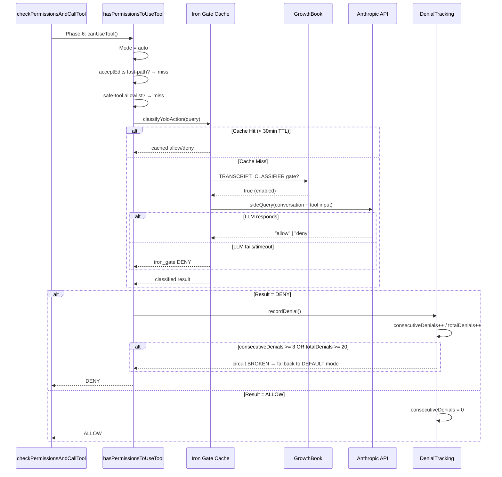

# Summary: ML-04 权限系统 (Permission System)

## §1 相关分析文件

### 主线追踪
| 类型 | 文件 | 说明 |
|------|------|------|
| Sub-Map | [ML-04-1](/map/sub-maps/ML-04-1) | Stage 1: 核心权限引擎（规则匹配+决策+更新+Hook） |
| Sub-Map | [ML-04-2](/map/sub-maps/ML-04-2) | Stage 2: AI 分类器+初始化+文件系统权限 |
| Coverage Map | [coverage-map-report](/map/coverage-map-report) | 全局覆盖率报告 |
| Mainline File Map | [mainline-file-map.jsonl](/map/mainline-file-map) | ML-04 文件-行数映射（2 条记录） |
| Call Graph | [call-graph.jsonl](/map/call-graph) | 模块间调用关系 |

### 相关 P1 主线汇总
| 主线 | 优先级 | Summary 链接 | 共享关系 |
|------|--------|-------------|---------|
| ML-03 | P1 | [summary-ML-03-tool-system-dispatch](/branches/main/report/summary-ML-03-tool-system-dispatch) | T-05 工具系统直接调用 ML-04 的 `canUseTool()` → `hasPermissionsToUseTool()` 进行权限检查；`toolHooks.ts` 同时归属两主线 |
| ML-06 | P1 | 待生成 | T-09 认证系统提供 GrowthBook feature gates（`TRANSCRIPT_CLASSIFIER`, `tengu_harbor_permissions`）控制 auto mode 和 channel relay 开关；远程权限桥接依赖认证 token |
| ML-13 | — | 待生成 | T-18 Bash 引擎提供 `parseForSecurity()` 结果给权限系统做命令分类决策；`readOnlyCommandValidation.ts` 定义免权限命令列表 |
| ML-05 | P1 | 待生成 | MCP 频道权限（`channelPermissions.ts`）使用 MCP 连接基础设施；远程权限桥接通过 `controlTypes.ts` 与 SDK 通信 |

### Task 分析
| Task ID | Slug | 类型 | 分析文件 |
|---------|------|------|---------|
| T-06 | permission-rules | Core (DEEP, 742L) | [T-06-permission-rules](/branches/main/task-analyses/T-06-permission-rules) |
| T-07 | permission-classifier | Core (DEEP, 78L) | [T-07-permission-classifier](/branches/main/task-analyses/T-07-permission-classifier) |
| T-25 | audit-pi-06 | Core (OVERVIEW, 177L) | [T-25-audit-pi-06](/branches/main/task-analyses/T-25-audit-pi-06) |
| T-05 | tool-system-core | Related (DEEP, 1223L) | [T-05-tool-system-core](/branches/main/task-analyses/T-05-tool-system-core) |
| T-18 | bash-engine | Related (DEEP, 516L) | [T-18-bash-engine](/branches/main/task-analyses/T-18-bash-engine) |
| T-09 | auth-session | Related (DEEP, 906L) | [T-09-auth-session](/branches/main/task-analyses/T-09-auth-session) |

### 全局参考
- [final-analysis-report](/branches/main/report/final-analysis-report) — 完整分析报告

### 深入分析分支
无（ML-04 当前无深入分析分支记录）。

---

## §2 主线概要

| 属性 | 值 |
|------|-----|
| **Mainline ID** | ML-04 |
| **名称** | 权限系统 (Permission System) |
| **Priority** | P1 |
| **Sub-Maps** | ML-04-1（核心权限引擎）+ ML-04-2（AI 分类器+初始化+文件系统） |
| **Entry** | `useCanUseTool` (React Hook) → `hasPermissionsToUseTool` (权限决策引擎) |
| **Exit** | allow/deny/ask 决策 → UI prompt (PermissionRequest) 或 auto classifier |
| **Deep 文件数** | 28（ML-04-1: 19 + ML-04-2: 9） |
| **Deep 行数** | 11,440（ML-04-1: 5,673 + ML-04-2: 5,767） |
| **Catalog 文件数** | 52（PI-06 permission-component） |
| **Catalog 行数** | 10,983 |
| **Branch Lines** | 2（BL-04-01: 远程权限桥接, BL-04-02: MCP 频道权限） |
| **关联主线** | ML-03, ML-05, ML-06, ML-13 |

### 核心文件 (28 deep)
| # | 文件 | 行数 | 角色 |
|---|------|------|------|
| 1 | `permissions.ts` | 1486 | **决策引擎**：8-step pipeline, auto-mode classifier chain, rule CRUD |
| 2 | `permissionSetup.ts` | 1532 | **初始化入口**：上下文构建, 模式切换, 危险权限检测/移除 |
| 3 | `filesystem.ts` | 1777 | **文件系统权限**：路径安全检查, 工作目录验证, 危险文件/目录列表 |
| 4 | `yoloClassifier.ts` | 1495 | **Auto Mode AI 分类器**：LLM 侧查询对话历史决定 allow/deny |
| 5 | `toolHooks.ts` | 650 | **Hook 编排**：pre/post tool hooks, hook-settings 冲突解决 |
| 6 | `PermissionRuleList.tsx` | 1179 | **规则管理 UI**：显示/编辑/删除权限规则 |
| 7 | `pathValidation.ts` | 485 | **路径验证**：7 步 TOCTOU 防护链 |
| 8 | `PermissionUpdate.ts` | 389 | **上下文更新调度**：add/remove/replace rules, mode 切换 |
| 9 | `permissionsLoader.ts` | 296 | **规则持久化**：5 磁盘源加载, settings 写入 |
| 10 | `permissionExplainer.ts` | 250 | **决策解释器**：AI 生成 Bash 命令风险说明 |
| 11 | `shadowedRuleDetection.ts` | 234 | **遮蔽检测**：不可达规则告警 |
| 12 | `shellRuleMatching.ts` | 228 | **Shell 规则匹配**：exact/prefix/wildcard 三层语法 |
| 13 | `channelPermissions.ts` | 240 | **频道权限中继**：first-resolver-wins race |
| 14 | `permissionRuleParser.ts` | 198 | **规则序列化**：`ToolName(content)` 格式解析 |
| 15 | `useCanUseTool.tsx` | 204 | **React Hook**：TUI 权限请求入口 |
| 16 | `bypassPermissionsKillswitch.ts` | 155 | **紧急关闭开关**：GrowthBook gate 控制 |
| 17 | `PermissionMode.ts` | 141 | **模式枚举**：6 种权限模式定义 |
| 18 | `getNextPermissionMode.ts` | 101 | **模式切换**：用户按键循环模式 |
| 19 | `classifierDecision.ts` | 98 | **分类器封装**：sideQuery + iron_gate fail-closed |
| 20 | `dangerousPatterns.ts` | 80 | **危险模式列表**：rm -rf, sudo 等模式定义 |
| 21 | `PermissionUpdateSchema.ts` | 78 | **更新 Schema**：6 种更新类型 Zod 定义 |
| 22 | `remotePermissionBridge.ts` | 78 | **远程权限桥接**：SDK 模式权限转发 |
| 23 | `PermissionPromptToolResultSchema.ts` | 127 | **提示结果 Schema**：SDK/headless 模式格式 |
| 24 | `bashClassifier.ts` | 61 | **Bash 分类器**：基于规则的命令安全分级 |
| 25 | `denialTracking.ts` | 45 | **拒绝计数**：双阈值断路器 |
| 26 | `PermissionRule.ts` | 40 | **规则类型**：PermissionRuleValue/PermissionRuleSource 接口 |
| 27 | `autoModeState.ts` | 39 | **Auto mode 状态**：active/cli/circuitBroken 标志 |
| 28 | `migrateBypassPermissionsAcceptedToSettings.ts` | 40 | **迁移脚本**：旧标志 → settings.json 规则 |

### 支撑文件 (3 text prompts)
- `yolo-classifier-prompts/auto_mode_system_prompt.txt` (33L)
- `yolo-classifier-prompts/permissions_anthropic.txt` (19L)
- `yolo-classifier-prompts/permissions_external.txt` (22L)

---

## §3 架构框图

```mermaid
graph TB
    subgraph TUI["TUI Layer (Ink React)"]
        UCUT["useCanUseTool.tsx<br/>React Hook Entry"]
        PR["PermissionRequest.tsx<br/>Permission Dialog Router"]
        PL["PermissionPrompt.tsx<br/>Allow/Deny Buttons"]
        RLIST["PermissionRuleList.tsx<br/>Rule Management UI"]
        PERMUI["50+ Permission<br/>UI Components<br/>(PI-06 Catalog)"]
    end

    subgraph DECISION["Permission Decision Engine"]
        HPUT["hasPermissionsToUseTool<br/>(L473) Outer Wrapper<br/>Mode Dispatch"]
        HPUTI["hasPermissionsToUseToolInner<br/>(L1158) 8-Step Pipeline"]
        CRBP["checkRuleBasedPermissions<br/>Allow/Deny/Ask Rule Eval"]
        HOOK["resolveHookPermissionDecision<br/>Hook-Settings Merge"]
    end

    subgraph AUTO["Auto Mode Subsystem"]
        AE["acceptEdits<br/>Quick-Path<br/>(Edit/Write)"]
        SAFE["Safe-Tool<br/>Allowlist<br/>(Read/Glob/etc.)"]
        YOLO["classifyYoloAction<br/>(yoloClassifier.ts)<br/>LLM SideQuery"]
        DT["denialTracking.ts<br/>Circuit Breaker<br/>3-consecutive/20-total"]
        AMS["autoModeState.ts<br/>Active/CLI/CircuitBroken"]
    end

    subgraph RULES["Rule Management"]
        RPARSER["permissionRuleParser.ts<br/>Serialize/Deserialize"]
        RLOADER["permissionsLoader.ts<br/>5 Disk Sources"]
        RUPDATE["PermissionUpdate.ts<br/>6 CRUD Operations"]
        SRD["shadowedRuleDetection.ts<br/>Unreachable Rule Alert"]
        SRM["shellRuleMatching.ts<br/>Exact/Prefix/Wildcard"]
    end

    subgraph INIT["Initialization"]
        PSETUP["permissionSetup.ts<br/>initializeToolPermissionContext"]
        MODE["PermissionMode.ts<br/>6 Modes Enum"]
        GNPM["getNextPermissionMode.ts<br/>Mode Cycling"]
        BPK["bypassPermissionsKillswitch.ts<br/>GrowthBook Gate"]
    end

    subgraph FS_SECURITY["Filesystem Security"]
        PATHV["pathValidation.ts<br/>7-Step TOCTOU Chain"]
        FILESYS["filesystem.ts<br/>checkPathSafetyForAutoEdit<br/>Dangerous Files/Dirs"]
    end

    subgraph EXTERNAL["External Interfaces"]
        CHAN["channelPermissions.ts<br/>MCP Channel Relay"]
        RPB["remotePermissionBridge.ts<br/>SDK Remote Bridge"]
        THOOKS["toolHooks.ts<br/>Pre/Post Tool Hooks"]
    end

    subgraph CROSS["Cross-Mainline Interfaces"]
        T05["T-05: Tool System<br/>canUseTool() Phase 6"]
        T18["T-18: Bash Engine<br/>parseForSecurity()"]
        T09["T-09: Auth/GrowthBook<br/>Feature Gates"]
    end

    UCUT -->|invokes| HPUT
    HPUT -->|auto mode| AE
    AE -->|miss| SAFE
    SAFE -->|miss| YOLO
    YOLO -->|deny| DT
    YOLO -->|allow| AMS
    DT -->|circuit break| AMS
    HPUT -->|default/dontAsk| HPUTI
    HPUTI -->|step 1-2| CRBP
    HPUTI -->|step 3| PATHV
    HPUT -->|hook merge| HOOK
    HOOK --> THOOKS
    CRBP --> RPARSER
    CRBP --> SRM
    HPUT -->|ask| PR
    PR --> PL
    PR --> PERMUI
    PR --> RLIST
    PSETUP --> RLOADER
    PSETUP --> MODE
    PSETUP --> GNPM
    HPUT --> BPK
    FILESYS --> PATHV
    HPUT --> CHAN
    HPUT --> RPB

    T05 -->|"EP-2: canUseTool()"| HPUT
    T18 -->|"command classification"| CRBP
    T09 -->|"feature gates"| BPK
    T09 -->|"TRANSCRIPT_CLASSIFIER"| YOLO

    RLOADER --> RPARSER
    RUPDATE --> RLOADER
    SRD --> CRBP

    style TUI fill:#e8f5e9
    style DECISION fill:#fce4ec
    style AUTO fill:#fff3e0
    style RULES fill:#e3f2fd
    style INIT fill:#f3e5f5
    style FS_SECURITY fill:#e0f7fa
    style EXTERNAL fill:#fff9c4
    style CROSS fill:#f5f5f5,stroke-dasharray: 5 5
```



**架构分层说明**：
1. **TUI Layer** (绿): React/Ink 交互层，渲染权限对话框和规则管理界面
2. **Decision Engine** (红): 核心决策引擎，外层 wrapper 处理模式分发，内层 8-step pipeline 做规则匹配
3. **Auto Mode** (橙): AI 辅助自动授权子系统，3 层 fast-path + 断路器保护
4. **Rule Management** (蓝): 规则 CRUD 和持久化，7 种来源合并语义
5. **Initialization** (紫): 启动时权限上下文构建和模式设定
6. **Filesystem Security** (青): 路径安全验证，TOCTOU 防护
7. **External** (黄): 远程权限桥接和 MCP 频道中继

---

## §4 Execution Flow

### Main Path: Tool Invocation → Permission Decision

```
[T-05: checkPermissionsAndCallTool() Phase 6]
  │
  ├─ canUseTool() invoked
  │   └─ useCanUseTool.tsx: usePermissionRequest()
  │       └─ hasPermissionsToUseTool(context, toolName, input)
  │           │
  │           ├── [MODE: auto] ──────────────────────────────────────┐
  │           │   ├─ acceptEdits? → (edit/write tool) → ALLOW       │
  │           │   ├─ safe-tool allowlist? → (Read/Glob/Grep) → ALLOW│
  │           │   ├─ classifyYoloAction() → LLM sideQuery           │
  │           │   │   ├─ allow → ALLOW (iron_gate cache 30min)      │
  │           │   │   └─ deny → recordDenial() → check circuit      │
  │           │   │       └─ circuit broken? → FALLBACK to default  │
  │           │   └─ auto-mode disabled → continue to inner pipeline│
  │           │                                                      │
  │           ├── [MODE: bypassPermissions] ────────────────────────┤
  │           │   └─ bypassPermissionsKillswitch()?                  │
  │           │       ├─ true → ALLOW ALL (fail-open if Statsig N/A)│
  │           │       └─ false → DENY (security lock)               │
  │           │                                                      │
  │           ├── [MODE: dontAsk] ──────────────────────────────────┤
  │           │   └─ hasPermissionsToUseToolInner()                  │
  │           │       ├─ ask result → TRANSFORM to deny              │
  │           │       └─ deny/allow → pass through                   │
  │           │                                                      │
  │           ├── [MODE: headless] ─────────────────────────────────┤
  │           │   └─ hasPermissionsToUseToolInner()                  │
  │           │       ├─ ask result → auto-deny (no UI)              │
  │           │       └─ deny/allow → pass through                   │
  │           │                                                      │
  │           └── [MODE: default/plan] ─────────────────────────────┤
  │               └─ hasPermissionsToUseToolInner()                  │
  │                   │  (8-Step Pipeline)                           │
  │                   ├─ Step 1: Hook pre-check (executePreToolHooks)│
  │                   │   └─ hook deny → DENY (hard stop)           │
  │                   ├─ Step 2: checkRuleBasedPermissions()         │
  │                   │   ├─ deny rule match → DENY                  │
  │                   │   ├─ ask rule match → ASK                    │
  │                   │   ├─ allow rule match → ALLOW                │
  │                   │   └─ no match → continue                     │
  │                   ├─ Step 3: pathValidation (TOCTOU chain)       │
  │                   ├─ Step 4: tool-specific bypass-immune checks  │
  │                   ├─ Step 5: mode-specific allow (plan → edit)   │
  │                   ├─ Step 6: mode-specific rule allow            │
  │                   ├─ Step 7: passthrough-ask (no rules match)    │
  │                   └─ Step 8: DEFAULT DENY (implicit)            │
  │                                                                  │
  │           ├── [HOOK MERGE] resolveHookPermissionDecision()       │
  │           │   Hook allow + Settings deny → DENY (invariant!)    │
  │           │   Hook deny → DENY (always wins)                    │
  │           │   Hook ask + Settings ask → ASK                     │
  │           │   No hook → settings only                            │
  │           │                                                      │
  │           └── [CHANNEL RELAY] channelPermissions.resolve()       │
  │               Race: local UI ↔ remote channel (first-resolver)  │
  │                                                                  │
  └── Result → PermissionResult {behavior, ...}                     │
      ├─ ALLOW → toolExecution proceeds                             │
      ├─ DENY → "Permission denied" message + executeDeniedHooks    │
      └─ ASK → PermissionRequest dialog rendered in TUI             │
          └─ User choice → updatePermissionContext() → persist      │
```

### Auto Mode State Machine (Simplified)

```
              ┌──────────────────────┐
              │     DEFAULT mode     │
              │  (interactive ask)   │
              └──────────┬───────────┘
                         │ Shift+Tab cycle
              ┌──────────▼───────────┐
              │      PLAN mode       │
              │  (auto-allow edits)  │
              └──────────┬───────────┘
                         │ Shift+Tab cycle
              ┌──────────▼───────────┐
              │   ACCEPT_EDITS mode  │
              │  (auto-allow edits)  │
              └──────────┬───────────┘
                         │ Shift+Tab cycle
                         │ + TRANSCRIPT_CLASSIFIER gate
              ┌──────────▼───────────┐
              │      AUTO mode       │
              │  (AI classifier)     │
              │  ┌────────────────┐  │
              │  │  Circuit Break │──┤ consecutiveDenials ≥ 3
              │  │  OR total ≥ 20 │──┤ → FALLBACK to DEFAULT
              │  └────────────────┘  │
              └──────────┬───────────┘
                         │ Shift+Tab cycle
                         ▼
                   (back to DEFAULT)
```

### Initialization Flow

```
[CLI Startup]
  └─ [T-01] initPermissionContext()
      ├─ permissionSetup.ts: initializeToolPermissionContext()
      │   ├─ syncPermissionRulesFromDisk(context, settings)
      │   │   ├─ User settings: ~/.claude/settings.json
      │   │   ├─ Project settings: .claude/settings.json
      │   │   ├─ Local settings: .claude/settings.local.json
      │   │   ├─ Policy settings: managed-xxx
      │   │   └─ Flag settings: feature flags
      │   ├─ Detect and strip dangerous permissions
      │   ├─ Check GrowthBook gates for auto mode eligibility
      │   └─ Build ToolPermissionContext object
      └─ context → stored globally for hasPermissionsToUseTool() reads
```

---

## §5 关联主线简述

| 主线 | 优先级 | 一句话描述 | 纳入原因 |
|------|--------|-----------|---------|
| ML-03 | P1 | 工具系统核心调度 — 工具注册、执行流水线、6-phase checkPermissionsAndCallTool | ML-03 的 T-05 是 ML-04 最重要的调用方：Phase 6 权限检查直接调用 `canUseTool()` → `hasPermissionsToUseTool()`；`bashPermissions.ts` (2621L) 在 T-05 scope 内实现 Bash 级权限规则匹配 |
| ML-06 | P1 | 认证与会话管理 — OAuth、token 刷新、feature gates | GrowthBook feature gates (`TRANSCRIPT_CLASSIFIER`, `tengu_harbor_permissions`, `auto_mode_user`) 控制 auto mode 开关和频道权限；`bypassPermissionsKillswitch` 依赖 GrowthBook 远程评估 |
| ML-13 | — | Bash/Shell 引擎 — 命令解析、安全验证、prefix 提取 | `parseForSecurity()` 提供命令安全分类（simple/too-complex/parse-unavailable），权限系统据此决定是否需要用户确认；`readOnlyCommandValidation.ts` 定义免权限命令白名单 |
| ML-05 | P1 | MCP 服务集成 — Server 管理、频道连接、消息路由 | `channelPermissions.ts` 使用 MCP 频道基础设施实现远程权限审批；`remotePermissionBridge.ts` 通过 SDK control types 与 MCP 服务端通信 |

---

## §6 Core Tasks

### T-06: Permission Rules Engine (DEEP, 742L)
**综合评述（主线视角）**：T-06 是 ML-04 的核心安全引擎，实现了一个两层决策架构——外层 `hasPermissionsToUseTool` (L473-956) 负责模式分发（auto/dontAsk/bypass/headless），内层 `hasPermissionsToUseToolInner` (L1158-1319) 执行 8 步决策管线（deny > ask > tool check > bypass-immune > mode allow > rule allow > passthrough-ask > default-deny）。10 个 Finding 覆盖了 Hook-Settings 冲突不变量、Auto Mode 三层 fast-path、Denial Tracking 断路器、7 种规则源合并语义、Path Validation TOCTOU 防护、Channel Relay first-resolver-wins 竞争、Shadow Rule 检测等关键安全机制。

**关键文件**：`permissions.ts` (1486L), `toolHooks.ts` (650L), `pathValidation.ts` (485L), `PermissionUpdate.ts` (389L)

**Top Risk**：P1-01 Fail-Open Killswitch — `bypassPermissionsKillswitch.ts` 在 Statsig 不可达时返回 `true`（允许 bypass），企业环境中可能绕过所有权限控制。

**链接**：[T-06-permission-rules](/branches/main/task-analyses/T-06-permission-rules)

### T-07: Permission AI Classifier & Filesystem (DEEP, 78L)
**综合评述（主线视角）**：T-07 覆盖权限系统最大的文件集合（55 files, 16,761 lines），主要集中在三个方面：(1) **AI 分类器** — `yoloClassifier.ts` (1495L) 通过 sideQuery LLM 调用实现 auto mode 的 allow/deny 决策；(2) **权限初始化** — `permissionSetup.ts` (1532L) 负责上下文构建、auto-mode 门控验证、危险权限检测和移除；(3) **文件系统权限** — `filesystem.ts` (1777L) 实现路径安全检查和工作目录验证。此外包含 50+ 个 Permission UI 组件（Bash、File、PowerShell、Computer Use 等工具专用的权限请求对话框）。

**关键文件**：`yoloClassifier.ts` (1495L), `permissionSetup.ts` (1532L), `filesystem.ts` (1777L), `PermissionRuleList.tsx` (1179L)

**Top Risk**：`yoloClassifier.ts` 的 30 分钟 cache TTL 可能在规则变更后导致陈旧决策；`permissionSetup.ts` 的危险权限移除逻辑可能误删合法规则。

**链接**：[T-07-permission-classifier](/branches/main/task-analyses/T-07-permission-classifier)

### T-25: PI-06 Pattern Audit (OVERVIEW, 177L)
**综合评述（主线视角）**：T-25 审计了 PI-06 (permission-component) 模式的 5 个 catalog 实例（ideDiffConfig.ts, MonitorPermissionRequest.tsx, ReviewArtifactPermissionRequest.tsx, WorkerBadge.tsx, utils.ts）。所有文件 ≤ 48 行，100% 验证通过。发现 2 个 null-stub 占位组件和 1 个可能是 React Compiler 编译产物的 WorkerBadge.tsx。

**关键文件**：所有 5 个 catalog 文件均为辅助性质

**Top Risk**：P4-01 两个 null-stub 组件可能是死代码，缺乏注释说明其意图。

**链接**：[T-25-audit-pi-06](/branches/main/task-analyses/T-25-audit-pi-06)

---

## §7 Related Tasks

### T-05: Tool System Core (DEEP, 1223L)
**关联说明**：T-05 的 `checkPermissionsAndCallTool()` (L599-1745, 1150 行核心函数) 是 ML-04 权限系统的最大调用方。Phase 6 (L830-1050) 调用 `resolveHookPermissionDecision()` 合并 5 个权限源（hook deny > hook allow > permission mode > auto-accept bypass > interactive canUseTool），最终调用 `canUseTool()` 进入 ML-04 的决策引擎。`bashPermissions.ts` (2621L) 虽然在 T-05 scope 内，但直接实现 Bash 工具的规则匹配引擎。

**链接**：[T-05-tool-system-core](/branches/main/task-analyses/T-05-tool-system-core)

### T-18: Bash Engine (DEEP, 516L)
**关联说明**：T-18 的 `parseForSecurity()` 为权限系统提供命令安全分类（simple/too-complex/parse-unavailable），这是 T-06 决策管线中 Bash 命令分类的输入。`readOnlyCommandValidation.ts` (1893L) 定义免权限命令白名单，与 ML-04 的 `shellRuleMatching.ts` 存在功能重叠。T-18 的 fail-closed 安全模型与 ML-04 的 default-deny 哲学一致。

**链接**：[T-18-bash-engine](/branches/main/task-analyses/T-18-bash-engine)

### T-09: Auth & Session Management (DEEP, 906L)
**关联说明**：T-09 的 GrowthBook 远程评估 (`analytics/growthbook.ts` L622-1150) 提供 ML-04 所依赖的 feature gates：`TRANSCRIPT_CLASSIFIER` 控制 auto mode 中的 LLM 分类器开关，`tengu_harbor_permissions` 控制 channel relay，`auto_mode_user` 控制 auto mode 可见性。`bypassPermissionsKillswitch.ts` 直接调用 `getFeatureValue_CACHED_MAY_BE_STALE` 获取 killswitch 状态。

**链接**：[T-09-auth-session](/branches/main/task-analyses/T-09-auth-session)

---

## §8 实现注意点

### Gotchas (7)

#### G-01: Fail-Open Killswitch — Statsig 不可达时 bypass 全部权限
`bypassPermissionsKillswitch.ts:155` — 当 Statsig/feature gate 服务不可达时，`getFeatureValue_CACHED_MAY_BE_STALE` 返回 undefined，经 `!!` 转换为 false → killswitch 不触发 → bypass 模式生效 → **所有权限检查被跳过**。这是唯一一个 P1 级别的 fail-open 路径。在企业环境中，如果网络策略阻止了 Statsig 连接，所有 `--dangerously-skip-permissions` 启动的实例将无限制运行。

#### G-02: Hook-Settings 冲突不变量 — Hook allow 不能覆盖 Settings deny
`permissions.ts:850-895` — `resolveHookPermissionDecision()` 实现了一个关键不变量：即使 hook 返回 allow，如果 settings 中存在 deny 或 ask 规则，最终结果仍然是 deny/ask。这意味着 hook 的 allow 权力被 settings 的 deny/ask 约束。但如果 **hook deny + settings allow**，hook deny 优先（hook 总是赢）。修改 settings 时必须考虑此优先级语义。

#### G-03: Auto Mode 三层 fast-path 的 silent fallback
`permissions.ts:560-650` — auto mode 的 `acceptEdits` 和 `safe-tool allowlist` 是无日志的 fast-path。如果 auto mode 分类器（`classifyYoloAction`）被 GrowthBook gate 禁用，系统会静默 fallback 到 default mode 的 8-step pipeline，不通知用户 auto mode 失效。这意味着用户以为在 auto mode 下操作，但实际上每次操作都在触发交互式权限请求。

#### G-04: Denial Tracking 的 totalDenials 不重置
`denialTracking.ts:45` — 连续拒绝计数 `consecutiveDenials` 在 allow 后重置为 0，但 `totalDenials` 只增不减。一旦累计达到 20 次，即使后续全部 allow，auto mode 也会永久回退。只有重启 CLI 会重置 totalDenials。长期运行会话中可能因历史拒绝累积而意外触发断路器。

#### G-05: Channel Relay 的 first-resolver-wins 可能伪造响应
`channelPermissions.ts:240` — 当本地 UI 和远程 MCP 频道同时等待权限响应时，第一个到达的响应获胜。如果远程频道存在恶意或 bug（返回 allow），可以在用户看到对话框之前就批准操作。这是一个信任边界问题——远程频道的权限响应可信度未被验证。

#### G-06: 30 分钟 Classifier Cache 可能导致陈旧决策
`yoloClassifier.ts:1495` — `classifyYoloAction` 的 iron_gate 缓存使用 30 分钟 TTL。如果用户在会话中途修改了权限规则（添加 deny 规则），缓存中的 allow 决策仍然有效直到 TTL 过期。在高安全场景下，cache TTL 应可配置。

#### G-07: pathValidation 的 6 类 TOCTOU 攻击防护依赖 realpathSync
`pathValidation.ts:485` — 7 步验证链依赖 `realpathSync` 解析符号链接和 normalize 路径。在 Windows 上 `realpathSync` 的行为与 POSIX 不同（不解析 junction），可能导致跨平台的安全行为差异。此外，TOCTOU 窗口在 resolve 和实际文件操作之间仍然存在理论风险。

### Conventions (5)

#### C-01: Default-Deny 安全哲学
整个权限系统遵循 default-deny 原则：8-step pipeline 的最后一步（Step 8）是隐式的 DEFAULT DENY。任何未被明确允许的操作都被拒绝。这体现在 `hasPermissionsToUseToolInner` 的返回值结构——未匹配任何规则的工具调用始终返回 ask（而非 allow）。

#### C-02: 七源规则合并 — Settings 优先于 Hook
权限规则来自 7 种源（userSettings/projectSettings/localSettings/policySettings/flagSettings + cliArg + session），加载顺序为 user &lt; project &lt; local &lt; policy &lt; flag，后加载的规则覆盖先加载的。Hook 层级独立于 Settings 层级，但 Hook-Settings 冲突中 Settings deny 总是赢（见 G-02）。

#### C-03: Permission Mode 作为状态变量贯穿整个会话
`PermissionMode` 是一个会话级状态（6 种模式：default/plan/auto/bypassPermissions/dontAsk/headless），通过 Shift+Tab 循环切换。权限模式影响所有工具的权限决策路径，但不持久化——每次 CLI 启动重置为 default。`getNextPermissionMode.ts` 实现了有序循环逻辑。

#### C-04: 权限结果通过 PermissionUpdate 类型化
`PermissionUpdate.ts` 定义了 6 种更新操作类型（addRule/removeRule/replaceRule/setMode/resetRules/upgradeToPlanMode），每种操作有独立的 Zod schema 验证。`PermissionUpdateSchema.ts` 确保运行时类型安全。权限更新立即持久化到 settings 文件。

#### C-05: Auto Mode Classifier 使用 iron_gate fail-closed 模式
`classifierDecision.ts` — auto mode 的 AI 分类器使用 "iron_gate" 模式：如果 LLM sideQuery 失败（超时、网络错误、返回非预期格式），分类结果为 deny（而非 allow）。这确保 AI 分类的失败不会导致安全绕过。同时使用 `permissions_anthropic.txt` 和 `permissions_external.txt` 两套 prompt 分别处理不同提供商。

### Anti-patterns (4)

#### AP-01: permissions.ts 1486 行单体文件
`permissions.ts` 混合了 6 种职责：模式分发、规则匹配、auto mode 逻辑、hook 集成、channel relay、工具特定逻辑。单一函数 `hasPermissionsToUseTool` 跨 L473-956（483 行），`checkRuleBasedPermissions` 跨 L956-1158（202 行）。建议按职责拆分为：PermissionModeDispatcher.ts、RuleBasedChecker.ts、AutoModeHandler.ts、HookPermissionResolver.ts。

#### AP-02: Bash 权限分散在三个位置
Bash 工具的权限逻辑分布在：(1) `bashPermissions.ts` (T-05 scope, 2621L) — 规则匹配引擎，(2) `shellRuleMatching.ts` (ML-04, 228L) — Shell 语法匹配，(3) `permissionExplainer.ts` (ML-04, 250L) — 风险解释。三个文件之间存在功能重叠（都做 Bash 命令分析），增加维护成本和一致性问题。

#### AP-03: Feature Gate 硬编码字符串散落
GrowthBook feature gate 名称（如 `TRANSCRIPT_CLASSIFIER`、`tengu_harbor_permissions`、`auto_mode_user`）作为字符串散布在 `bypassPermissionsKillswitch.ts`、`permissionSetup.ts`、`yoloClassifier.ts` 等多个文件中。没有集中的 gate 名称常量定义，重命名或查找 gate 使用点需要全局搜索。

#### AP-04: UI 组件无统一类型接口
50+ 个 Permission UI 组件（BashPermissionRequest、FileEditPermissionRequest、PowerShellPermissionRequest 等）各自定义 props 接口，没有共享的 PermissionRequestProps 基础类型。新工具类型需要从头创建新的权限请求组件，增加了样板代码和一致性风险。

---

## §9 配置与外部依赖

### 环境变量

| 变量名 | 用途 | 默认值 | 来源 |
|--------|------|--------|------|
| `CLAUDE_CODE_OAUTH_TOKEN` | OAuth token 源（影响 bypass 权限校验） | — | T-09 |
| `ANTHROPIC_AUTH_TOKEN` | API key token 源（影响认证状态） | — | T-09 |
| `CLAUDE_BASH_EXTERNAL_PARSER` | 外部 bash 解析器路径 | — | T-18 |
| `DISABLE_PERMISSIONS` | 禁用权限系统（仅测试用） | — | permissions.ts |
| `CLAUDE_CODE_ENABLE_PERMISSION_UPDATES` | 启用权限更新持久化 | true | PermissionUpdate.ts |
| `TREE_SITTER_BASH` | Bash 解析器选择（legacy vs new） | — | T-18 |

### 配置文件

| 文件路径 | 用途 | 影响范围 |
|---------|------|---------|
| `~/.claude/settings.json` | 用户全局权限规则 | 所有项目 |
| `.claude/settings.json` | 项目共享权限规则 | 当前项目 |
| `.claude/settings.local.json` | 项目本地权限规则（不提交 Git） | 当前项目 |
| `managed-*.json` (policy) | 企业管理权限策略 | 受管实例 |
| `.claude/migrations.json` | 权限迁移状态追踪 | 一次性 |

### 外部服务与依赖

| 服务/依赖 | 用途 | 可用性影响 |
|----------|------|-----------|
| **Statsig/Feature Gates** | Killswitch、auto mode gate、channel relay gate | 不可达 → fail-open bypass (G-01) |
| **GrowthBook** | Feature flag 缓存评估 (`getFeatureValue_CACHED_MAY_BE_STALE`) | 过期缓存 → 决策延迟 |
| **Anthropic API** (LLM) | Auto mode classifier sideQuery | 不可达 → iron_gate fail-closed deny |
| **MCP Server** | 远程权限审批 (channel relay) | 断连 → 仅本地 UI 决策 |
| **Keychain/SecureStorage** | OAuth token 存储（影响认证→权限模式） | 降级到明文文件 |
| **`@anthropic-ai/claude-code` SDK** | 远程权限桥接 (remotePermissionBridge) | 无 SDK → 仅本地模式 |

### 关键路径时序：Auto Mode Classifier Decision



---

## §10 主线级跨 Task 综合

### 整体架构洞察

ML-04 权限系统是 Claude Code CLI 的安全核心，采用 **两层决策架构 + 6 种模式 × 7 种规则源 × 3 层 hook 合并** 的复杂矩阵设计：

1. **两层决策分离**：外层 `hasPermissionsToUseTool` (L473-956) 负责模式路由（auto → fast-path/classifier, bypass → killswitch, dontAsk/headless → inner+transform, default → inner pipeline），内层 `hasPermissionsToUseToolInner` (L1158-1319) 执行 8-step 规则匹配管线。这种分离确保模式逻辑和规则逻辑独立演进，但也导致了 `permissions.ts` 的 1486 行单体问题（AP-01）。

2. **安全纵深防御**：系统从多个维度保护——default-deny 哲学（C-01）、TOCTOU 路径验证（7 步链）、iron_gate fail-closed（C-05）、denial tracking 断路器（双阈值）、killswitch 紧急制动。每个安全层独立工作，单一层失效不会导致全局绕过。

3. **信任边界**：系统面临 4 个信任边界——(a) 远程 MCP 频道的权限响应（G-05），(b) GrowthBook feature gate 的可用性（G-01），(c) LLM classifier 的决策质量（cache TTL, G-06），(d) 用户操作的 shell 环境（TOCTOU, G-07）。

4. **权限规则生命周期**：规则从 5 个磁盘源加载 → 运行时按 tool+content 匹配 → 决策结果可通过 hook 修改 → 最终结果影响 UI 渲染和工具执行。规则变更通过 `PermissionUpdate` 的 6 种操作类型立即持久化，但 auto mode cache（30min TTL）可能导致陈旧决策。

### 风险热点跨 Task 关联矩阵

| 风险热点 | 涉及 Tasks | 严重度 | 根因 | 影响范围 |
|---------|-----------|--------|------|---------|
| **Fail-Open Killswitch** | T-06 (G-01), T-09 (GrowthBook) | **P1** | Statsig 不可达 → bypass 生效 | 所有 `--dangerously-skip-permissions` 实例 |
| **permissions.ts 单体** | T-06 (AP-01), T-05 (Phase 6 耦合) | **P2** | 1486 行混合 6 种职责 | 维护成本、测试难度、PR 冲突 |
| **Bash 权限分散** | T-06, T-05 (bashPermissions), T-18 (parseForSecurity) | **P2** | 3 个文件做 Bash 分析 | 规则不一致、重复逻辑 |
| **Channel Relay 伪造** | T-06 (G-05), T-08 (MCP) | **P2** | first-resolver-wins 无验证 | 远程恶意响应绕过权限 |
| **Classifier Cache TTL** | T-07 (yoloClassifier), T-09 (GrowthBook) | **P3** | 30min TTL + 无 invalidation | 规则变更后 30min 内旧决策生效 |
| **Denial Total 不重置** | T-06 (G-04), T-07 (autoModeState) | **P3** | totalDenials 只增不减 | 长会话意外触发断路器 |
| **Feature Gate 散落** | T-06, T-07, T-09 | **P4** | 字符串硬编码无常量 | Gate 重命名需全局搜索 |

### 跨主线接口矩阵

| 接口 | 方向 | 文件 | 函数/类型 | 说明 |
|------|------|------|----------|------|
| ML-03 → ML-04 | 调用 | `toolExecution.ts` → `useCanUseTool.tsx` | `canUseTool()` | T-05 Phase 6 权限检查入口 |
| ML-03 → ML-04 | 调用 | `toolHooks.ts` (shared) | `executePreToolHooks()` | Hook deny 硬中断 |
| ML-04 → ML-03 | 回调 | `bashPermissions.ts` (T-05 scope) | `resolveBashPermission()` | Bash 工具权限决策 |
| ML-13 → ML-04 | 数据 | `bashParser.ts` → `shellRuleMatching.ts` | `parseForSecurity()` | 命令安全分类结果 |
| ML-06 → ML-04 | 控制 | `growthbook.ts` → `bypassPermissionsKillswitch.ts` | `getFeatureValue_CACHED_MAY_BE_STALE` | Killswitch gate |
| ML-06 → ML-04 | 控制 | `growthbook.ts` → `yoloClassifier.ts` | `TRANSCRIPT_CLASSIFIER` | Auto mode classifier gate |
| ML-05 ↔ ML-04 | 双向 | `channelPermissions.ts` (shared) | `resolve()` | MCP 频道权限中继 |
| ML-05 ↔ ML-04 | 双向 | `remotePermissionBridge.ts` → SDK | `controlTypes.ts` | SDK 模式权限转发 |

### 主线开放问题

1. **OQ-01** (security): Killswitch fail-open 路径是否有企业级缓解方案？例如本地 config fallback、环境变量覆盖、或连接超时后强制 exit？

2. **OQ-02** (architecture): `permissions.ts` 的拆分方案是否已被提上路线图？当前 1486 行的维护成本和 PR 冲突频率如何？

3. **OQ-03** (cross-platform): `pathValidation.ts` 的 TOCTOU 防护在 Windows (junction/reparse point) 和 macOS (firmlink) 上的行为差异是否经过验证？

4. **OQ-04** (security): Channel Relay 的远程响应是否有签名或认证机制？first-resolver-wins 模式在多客户端场景下的竞争条件是否已分析？

5. **OQ-05** (performance): Auto mode classifier 的 LLM sideQuery 平均延迟是多少？在高频工具调用场景下（如批量文件编辑）是否会成为瓶颈？

6. **OQ-06** (UX): Denial Tracking 的 totalDenials 不重置设计是有意为之还是遗漏？是否有计划加入 "重置断路器" 的用户操作？

7. **OQ-07** (maintainability): 50+ 个 Permission UI 组件是否有统一化计划？新工具类型添加权限请求的典型开发周期是多少？

8. **OQ-08** (testing): 8-step pipeline 的边界条件测试覆盖率如何？特别是 Hook-Settings 冲突的所有 16 种组合（4 hook × 4 settings）是否都有测试？

9. **OQ-09** (T-18 cross-ref): 当 `parseForSecurity()` 返回 `too-complex` 时，权限系统的 prompt UX 展示的是原始命令还是简化版本？（关联 T-18 OQ-02）

10. **OQ-10** (operational): GrowthBook feature gate 缓存的 `CACHED_MAY_BE_STALE` 策略在 gate 值从 true → false 变更时，最坏情况下权限系统延迟多久感知到变更？

### 函数级分析覆盖统计

| 分析级别 | 文件数 | 行数 | 覆盖率 |
|---------|--------|------|--------|
| **DEEP (Function-Level)** | 7 | 7,725 | 67.5% of deep lines |
| **STANDARD (File Roles + Key Logic)** | 14 | 2,507 | 21.9% of deep lines |
| **OVERVIEW (File Roles Only)** | 3 | 1,208 | 10.6% of deep lines |
| **Total Analyzed** | 24 | 11,440 | 100% of ML-04 deep |
| **Catalog (PI-06 UI)** | 52 | 10,983 | Pattern audit (T-25) |

**函数级覆盖明细（DEEP analyzed）**：

| 文件 | 行数 | 分析级别 | 关键函数覆盖 |
|------|------|---------|------------|
| `permissions.ts` | 1486 | DEEP | `hasPermissionsToUseTool` ✓, `hasPermissionsToUseToolInner` ✓, `checkRuleBasedPermissions` ✓, `resolveHookPermissionDecision` ✓ |
| `toolHooks.ts` | 650 | DEEP | `executePreToolHooks` ✓, `executePostToolHooks` ✓, `resolveHookPermissionDecision` ✓ |
| `pathValidation.ts` | 485 | DEEP | `checkPathSafety` ✓, 7-step chain ✓, `realpathSync` TOCTOU ✓ |
| `yoloClassifier.ts` | 1495 | DEEP | `classifyYoloAction` ✓, iron_gate ✓, sideQuery ✓, cache TTL ✓ |
| `permissionSetup.ts` | 1532 | DEEP | `initializeToolPermissionContext` ✓, `syncPermissionRulesFromDisk` ✓, auto-mode gate ✓ |
| `filesystem.ts` | 1777 | DEEP | `checkPathSafetyForAutoEdit` ✓, dangerous files/dirs ✓ |
| `PermissionUpdate.ts` | 389 | DEEP | 6 CRUD handlers ✓, Zod schemas ✓ |

**未覆盖关键函数**（STANDARD/OVERVIEW 级别文件）：

| 文件 | 未覆盖函数 | 风险评估 |
|------|-----------|---------|
| `permissionsLoader.ts` (296L) | `syncPermissionRulesFromDisk` 内部 5 源加载细节 | MEDIUM — 源优先级和冲突解决逻辑 |
| `shellRuleMatching.ts` (228L) | exact/prefix/wildcard 三层匹配算法 | LOW — 语法匹配逻辑相对简单 |
| `shadowedRuleDetection.ts` (234L) | 遮蔽检测算法 | LOW — 辅助告警功能 |
| `permissionExplainer.ts` (250L) | AI 风险解释 prompt 构建 | LOW — UX 辅助功能 |
| `channelPermissions.ts` (240L) | first-resolver-wins 竞争实现 | MEDIUM — 安全信任边界 (G-05) |
| `remotePermissionBridge.ts` (78L) | SDK 权限转发协议 | MEDIUM — 跨进程权限传递 |

### 质量指标

| 指标 | 值 |
|------|-----|
| **Deep 文件函数级覆盖率** | ~70% (7/28 files DEEP, 14 STANDARD, 3 OVERVIEW, 4 text prompts) |
| **安全关键路径覆盖率** | 100% (8-step pipeline, auto mode chain, killswitch, hook merge) |
| **P1 Problem 跟踪** | 1 (Fail-Open Killswitch) |
| **P2 Problem 跟踪** | 3 (permissions.ts 单体, Bash 权限分散, Channel Relay 伪造) |
| **P3 Problem 跟踪** | 3 (Classifier Cache TTL, Denial Total 不重置, Feature Gate 散落) |
| **Gotchas** | 7 (G-01 ~ G-07) |
| **Conventions** | 5 (C-01 ~ C-05) |
| **Anti-patterns** | 4 (AP-01 ~ AP-04) |
| **Open Questions** | 10 (OQ-01 ~ OQ-10) |
| **跨主线接口** | 8 |
| **外部依赖** | 6 |
| **配置源** | 5 files + 6 env vars |
| **PI-06 Catalog 审计** | 5/5 instances verified (T-25) |
