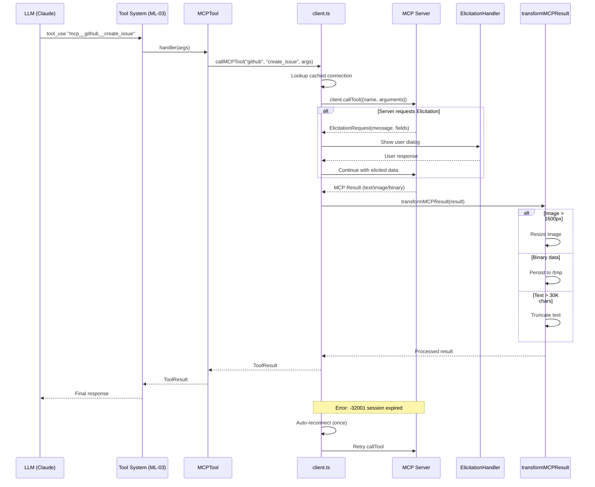

# Summary ML-05: MCP 服务集成

> **Priority**: P1 | **Total Files**: 30 core/supporting across 3 stages | **Total Lines**: 13,892 DEEP
> **Sub-Maps**: [ML-05-1](/map/sub-maps/ML-05-1) · [ML-05-2](/map/sub-maps/ML-05-2) · [ML-05-3](/map/sub-maps/ML-05-3)
> **Branch**: `main`

---

## §1 相关分析文件

### 主线追踪
| 类型 | 文件 | 说明 |
|------|------|------|
| Sub-Map Stage 1 | [ML-05-1.md](/map/sub-maps/ML-05-1) | Context+Config：React Context → Hook → 配置聚合 7 scope |
| Sub-Map Stage 2 | [ML-05-2.md](/map/sub-maps/ML-05-2) | Client+Auth：client.ts（3348L）+ auth.ts（2465L）+ XAA + Elicitation |
| Sub-Map Stage 3 | [ML-05-3.md](/map/sub-maps/ML-05-3) | Tools+Channels：MCPTool 占位 + Channel 通知 + VSCode SDK |
| Coverage Map | [mainline-file-map.jsonl](/map/mainline-file-map.jsonl) | ML-05-1: 9 files / ML-05-2: 10 files / ML-05-3: 11 files |
| Call Graph | [call-graph.jsonl](/map/call-graph.jsonl) | client.ts fan-out=12, degree=15 |
| 全局报告 | [final-analysis-report.md](/branches/main/report/final-analysis-report) | 21 章总体分析 |

### 相关 P1 主线汇总
| 主线 | Priority | 共享关系 | Summary |
|------|----------|---------|---------|
| ML-01 CLI 启动与命令路由 | P1 | 共享 `AppState.ts`（MCP 连接状态 mcp field）、`commands.ts`（MCP 命令类型）、`config.ts`（全局配置读写）；CLI `mcp.ts` 入口注册 MCP 独立服务器 | [summary-ML-01](/branches/main/report/summary-ML-01-cli-entry-routing) |
| ML-03 工具系统注册与调度 | P1 | MCPTool/McpAuthTool/ListMcpResourcesTool/ReadMcpResourceTool 作为独立 Tool 注册到 ML-03 的 Tool 系统；`Tool.ts` 基类被 MCPTool 引用；toolSearch 延迟加载可能影响 MCP 工具发现 | [summary-ML-03](/branches/main/report/summary-ML-03-tool-system-dispatch) |
| ML-09 Bridge 远程模式 | P2 | `cli/handlers/mcp.tsx` 管理 bridge session 的 MCP 连接；`SdkControlTransport` 为 SDK↔CLI 双向 JSON-RPC 桥接；bridge 模式下 MCP 服务器配置传播到子进程 | T-14 分析 |

### Task 分析
| 类型 | Task ID | 分析文件 | 说明 |
|------|---------|---------|------|
| Core | T-08 | [T-08-mcp-integration](/branches/main/task-analyses/T-08-mcp-integration) | DEEP 分析：85 files / 31,785 lines。8 transport、3 层认证、Elicitation 协议、Channel 通知、多 scope 配置 |
| Core | T-37 | [T-37-audit-pi-20](/branches/main/task-analyses/T-37-audit-pi-20) | OVERVIEW：PI-20 mcp-ui-component 审计，3 files / 64 lines（barrel/type-stubs/utils） |
| Core | T-40 | [T-40-audit-pi-05](/branches/main/task-analyses/T-40-audit-pi-05) | OVERVIEW：PI-05 service-module 审计，13 files / 171 lines（7 stubs + 4 功能模块） |
| Related | T-05 | [T-05-tool-system-core](/branches/main/task-analyses/T-05-tool-system-core) | 工具系统核心调度（DEEP），MCPTool 注册到 Tool 系统 |
| Related | T-01 | [T-01-cli-entry-init](/branches/main/task-analyses/T-01-cli-entry-init) | CLI 启动（DEEP），mcp.ts 入口 + main.tsx MCP 配置初始化 |
| Related | T-14 | [T-14-bridge-remote](/branches/main/task-analyses/T-14-bridge-remote) | Bridge 远程模式（STANDARD），mcp.tsx handler 管理 bridge session MCP |
| Related | T-38 | [T-38-audit-pi-23](/branches/main/task-analyses/T-38-audit-pi-23) | PI-23 cli-transport 审计，Transport 接口 + transportUtils 工厂 |

---

## §2 主线概要

| 属性 | 值 |
|------|-----|
| **Priority** | P1 |
| **Entry Point** | `MCPConnectionManager.tsx` → `useManageMCPConnections()` (React Hook) |
| **Exit Points** | (1) MCPTool handler → callMCPTool → processMCPResult → ToolResult; (2) Channel notification → messageQueueManager → SleepTool wake; (3) McpAuthTool → performMCPOAuthFlow → 浏览器授权 |
| **Total DEEP Lines** | 13,892 (Stage 1: 3,452 + Stage 2: 8,114 + Stage 3: 2,326) |
| **Core Files** | 7: `MCPConnectionManager.tsx`, `useManageMCPConnections.ts`, `types.ts`, `config.ts`, `claudeai.ts`, `client.ts`, `auth.ts` |
| **Supporting Files** | 23: `utils.ts`, `envExpansion.ts`, `normalization.ts`, `officialRegistry.ts`, `mcpStringUtils.ts`, `InProcessTransport.ts`, `SdkControlTransport.ts`, `elicitationHandler.ts`, `headersHelper.ts`, `oauthPort.ts`, `xaa.ts`, `xaaIdpLogin.ts`, `channelNotification.ts`, `channelPermissions.ts`, `channelAllowlist.ts`, `vscodeSdkMcp.ts`, `MCPTool.ts`, `UI.tsx`, `classifyForCollapse.ts`, `prompt.ts`, `ListMcpResourcesTool.ts`, `ReadMcpResourceTool.ts`, `McpAuthTool.ts` |
| **Branch Lines** | 3: BL-05-01 (XAA 企业认证: 3 files / 1,076 lines), BL-05-02 (Elicitation: 1 file / 313 lines), BL-05-03 (Channel 通知: 3 files / 632 lines) |
| **关联主线** | ML-01 (CLI), ML-03 (Tool System), ML-09 (Bridge) |

### 主路径
```
MCPConnectionManager (React Context)
  → useManageMCPConnections (Lifecycle Hook)
    → config.ts:getClaudeCodeMcpConfigs() [7 scope 聚合]
    → claudeai.ts:fetchClaudeAIMcpConfigsIfEligible() [云端代理]
    → client.ts:getMcpToolsCommandsAndResources() [批量连接]
      → client.ts:connectToServer() × N [Transport 工厂: 8 类型]
        → auth.ts:ClaudeAuthProvider [OAuth2/PKCE]
        → xaa.ts:performCrossAppAccess() [企业 XAA]
      → MCPTool.buildTool() [工具注册 monkey-patch]
      → registerElicitationHandler() [Elicitation 回调]
      → setupChannelNotification() [Channel 通知注册]
    → AppState 更新 [connectedServers/mcpTools/mcpCommands]
```

### 关键文件表
| 文件 | 行数 | 角色 |
|------|------|------|
| `client.ts` | 3348 | MCP SDK 客户端核心：connectToServer (memoized)、callMCPTool、结果处理 |
| `auth.ts` | 2465 | OAuth 2.0 + PKCE + XAA 认证全流程 |
| `config.ts` | 1578 | 7-scope 配置聚合 + Policy 过滤 + CRUD |
| `useManageMCPConnections.ts` | 1141 | React Hook：连接生命周期 + 指数退避重连 |
| `UI.tsx` | 402 | MCP 工具 Ink TUI 渲染 + 折叠分类 |
| `classifyForCollapse.ts` | 604 | 工具折叠分类器（显式 allowlist） |
| `utils.ts` | 575 | 通用工具：scope/transport/filter helper |
| `xaa.ts` | 511 | Cross-App Access：RFC 8693/7523 token exchange |
| `xaaIdpLogin.ts` | 487 | XAA IdP 登录：OIDC id_token 获取+缓存 |
| `channelNotification.ts` | 316 | Channel 消息推送（KAIROS feature flag） |

---

## §3 架构框图

```mermaid
graph TB
    subgraph Bootstrap["Stage 1: Context + Config"]
        MGR["MCPConnectionManager.tsx<br/>(React Context Provider)"]:::entry
        HOOK["useManageMCPConnections.ts<br/>(Lifecycle Hook 1141L)"]
        CFG["config.ts<br/>(7-Scope Config Aggregator 1578L)"]:::core
        TYPES["types.ts<br/>(Zod Schemas + Types 258L)"]
        CLDAI["claudeai.ts<br/>(Claude.ai Proxy 164L)"]
        ENV["envExpansion.ts<br/>(${VAR} Expansion)"]
        NORM["normalization.ts<br/>(Name Normalizer)"]
        REG["officialRegistry.ts<br/>(Registry Checker)"]
        STRUT["mcpStringUtils.ts<br/>(mcp__server__tool Parser)"]
    end

    subgraph Client["Stage 2: Client Core + Auth"]
        CLIENT["client.ts<br/>(MCP Client Engine 3348L)"]:::core
        AUTH["auth.ts<br/>(OAuth2/PKCE + XAA 2465L)"]:::core
        XAA["xaa.ts<br/>(Cross-App Access 511L)"]
        XAAIDP["xaaIdpLogin.ts<br/>(IdP Login 487L)"]
        OAUTHPORT["oauthPort.ts<br/>(Port Allocator)"]
        ELICIT["elicitationHandler.ts<br/>(Elicitation Protocol 313L)"]
        HEADER["headersHelper.ts<br/>(Dynamic HTTP Headers)"]
        INPROC["InProcessTransport.ts<br/>(In-Process Pair)"]
        SDKT["SdkControlTransport.ts<br/>(SDK↔CLI Bridge)"]
        UTILS["utils.ts<br/>(Scope/Filter Helpers 575L)"]
    end

    subgraph Tools["Stage 3: Tools + Channels"]
        MCPTOOL["MCPTool.ts<br/>(Tool Placeholder Monkey-Patch)"]
        MCPUI["UI.tsx<br/>(Ink TUI Renderer 402L)"]
        COLLAPSE["classifyForCollapse.ts<br/>(604L Allowlist)"]
        CHANNEL["channelNotification.ts<br/>(KAIROS Gated 316L)"]
        CHPERM["channelPermissions.ts<br/>(Permission Relay)"]
        ALLOW["channelAllowlist.ts<br/>(GrowthBook Allowlist)"]
        VSCODE["vscodeSdkMcp.ts<br/>(VSCode IPC)"]
        LISTRES["ListMcpResourcesTool.ts"]
        READRES["ReadMcpResourceTool.ts"]
        MCPAUTH["McpAuthTool.ts"]
    end

    subgraph External["External Systems"]
        STATE["AppState.ts<br/>(Global State)"]
        TOOLSYS["Tool.ts<br/>(ML-03 Tool System)"]
        SECURE["secureStorage<br/>(Keychain/Credential Store)"]
        API["Claude.ai API<br/>/v1/mcp_servers"]
        MCPSRV["MCP Servers<br/>(stdio/SSE/HTTP/WS)"]
    end

    MGR --> HOOK
    HOOK --> CFG
    HOOK --> CLIENT
    CFG --> CLDAI
    CFG --> ENV
    CFG --> NORM
    CFG --> REG

    CLIENT --> AUTH
    CLIENT --> TYPES
    CLIENT --> ELICIT
    CLIENT --> CHANNEL
    CLIENT --> HEADER
    CLIENT --> INPROC
    CLIENT --> SDKT
    CLIENT --> UTILS
    CLIENT --> MCPTOOL
    AUTH --> XAA
    AUTH --> OAUTHPORT
    XAA --> XAAIDP
    XAAIDP --> OAUTHPORT

    MCPTOOL --> TOOLSYS
    MCPUI --> COLLAPSE
    CHANNEL --> CHPERM
    CHPERM --> ALLOW
    VSCODE --> SDKT

    HOOK --> STATE
    CLDAI --> API
    CLIENT --> MCPSRV
    AUTH --> SECURE

    classDef entry fill:#fce4ec,stroke:#c62828,color:#000
    classDef core fill:#e3f2fd,stroke:#1565c0,color:#000
    classDef data fill:#e8f5e9,stroke:#2e7d32,color:#000
```



**架构分层说明**：
- **Stage 1 (Bootstrap)** — React Context + Hook 驱动的配置层：7-scope 聚合 + Claude.ai 云端代理
- **Stage 2 (Client+Auth)** — MCP SDK 客户端核心引擎：8-transport 工厂 + 3 层认证 + Elicitation
- **Stage 3 (Tools+Channels)** — 用户面工具注册 + Channel 消息推送 + VSCode SDK IPC 桥接
- **External** — 全局状态、工具系统基类、安全存储、Claude.ai API、MCP 远程服务器

---

## §4 Execution Flow

### 完整连接生命周期

```
[App Boot]
  │
  ├─ main.tsx .action() → MCP config loaded via init.ts
  │
  ▼
[MCPConnectionManager.tsx] ← React Context Provider
  │
  ├─ useManageMCPConnections()
  │   │
  │   ├─ getClaudeCodeMcpConfigs() ──────────────────── [Stage 1: Config]
  │   │   ├─ Scope 1: local   ← ~/.claude/mcp.json
  │   │   ├─ Scope 2: user    ← config.ts getUserMcpConfig()
  │   │   ├─ Scope 3: project ← .claude/mcp.json (CWD)
  │   │   ├─ Scope 4: dynamic ← mcpServers dynamic registration API
  │   │   ├─ Scope 5: enterprise ← enterprise policy config
  │   │   ├─ Scope 6: claudeai ← claude.ai proxy API /v1/mcp_servers
  │   │   └─ Scope 7: managed  ← managed server registry
  │   │   │
  │   │   └─ deduplicate by name → filterMcpServersByPolicy()
  │   │
  │   ├─ getMcpToolsCommandsAndResources() ──────────── [Stage 2: Connect]
  │   │   │
  │   │   ├─ Split servers: local[] + remote[]
  │   │   │   ├─ local:  Promise.all(connectToServer × N, concurrency=∞)
  │   │   │   └─ remote: Promise.all(connectToServer × M, concurrency=5)
  │   │   │
  │   │   ├─ connectToServer(serverConfig) [memoized, 1052 lines]:
  │   │   │   │
  │   │   │   ├─ Check memoized cache ── hit → return cached connection
  │   │   │   │                            miss ↓
  │   │   │   ├─ Create Transport (8 types):
  │   │   │   │   ├─ stdio        → StdioClientTransport (child process)
  │   │   │   │   ├─ sse          → SSEClientTransport (HTTP GET stream)
  │   │   │   │   ├─ http         → StreamableHTTPClientTransport
  │   │   │   │   ├─ ws           → WebSocket client
  │   │   │   │   ├─ sdk          → InProcessTransport (in-process pair)
  │   │   │   │   ├─ vscode       → SdkControlTransport (IPC bridge)
  │   │   │   │   ├─ claudeai     → HTTP + Bearer token proxy
  │   │   │   │   └─ claudeai-sdk → InProcessTransport + claude.ai auth
  │   │   │   │
  │   │   │   ├─ Authentication (3 layers):
  │   │   │   │   ├─ Layer 1: ClaudeAuthProvider
  │   │   │   │   │   ├─ OAuth2 + PKCE (browser consent flow)
  │   │   │   │   │   └─ Token cache → secureStorage
  │   │   │   │   ├─ Layer 2: XAA (Cross-App Access, enterprise)
  │   │   │   │   │   ├─ xaa.ts: discoverAndExchange()
  │   │   │   │   │   └─ RFC 8693 token exchange + RFC 7523 JWT auth
  │   │   │   │   └─ Layer 3: Claude.ai proxy (bearer token)
  │   │   │   │       └─ Automatic from claude.ai session
  │   │   │   │
  │   │   │   ├─ client.connect(transport)
  │   │   │   │   ├─ Initialize handshake (capabilities exchange)
  │   │   │   │   └─ Elicitation handler registration (max 3 retries)
  │   │   │   │
  │   │   │   └─ Cache result → return { client, tools, commands, resources }
  │   │   │
  │   │   ├─ For each connected server:
  │   │   │   ├─ MCPTool.buildTool() → monkey-patch name/description/prompt/call
  │   │   │   ├─ Register ListMcpResourcesTool / ReadMcpResourceTool
  │   │   │   └─ Register McpAuthTool (if server needs auth)
  │   │   │
  │   │   └─ Channel setup: ──────────────────────── [Stage 3: Channels]
  │   │       ├─ gateChannelServer(allowlist check)
  │   │       ├─ channelNotification register
  │   │       └─ messageQueueManager → SleepTool wake model
  │   │
  │   └─ Update AppState.mcpTools / mcpCommands / connectedServers
  │
  ▼
[Ready for Tool Calls]
  │
  ├─ LLM outputs tool_use with name="mcp__server__tool"
  │
  ├─ MCPTool.handler()
  │   ├─ Parse mcp__{server}__{tool} name
  │   ├─ client.ts:callMCPTool(serverName, toolName, args)
  │   │   ├─ Find cached client connection
  │   │   ├─ client.callTool({ name, arguments })
  │   │   │   ├─ If server requests Elicitation:
  │   │   │   │   ├─ Show user dialog (message + input fields)
  │   │   │   │   ├─ User responds → continue tool call
  │   │   │   │   └─ Max 3 retries on URL elicitation
  │   │   │   └─ Return MCP result
  │   │   └─ transformMCPResult():
  │   │       ├─ Image resize (if > 1600px → scale down)
  │   │       ├─ Binary → persist to /tmp, return file path
  │   │       └─ Text truncation (> 30K chars)
  │   └─ Return ToolResult to LLM
  │
  ├─ [Error Paths]:
  │   ├─ -32001 (session expired) → auto-reconnect → retry once
  │   ├─ 404 → server gone → mark disconnected → reconnect cycle
  │   ├─ needs-auth → McpAuthTool → browser OAuth flow
  │   └─ timeout (30s) → error result, connection stays in pool
  │
  └─ [Reconnection]:
      ├─ Exponential backoff: 1s → 2s → 4s → ... → 30s (cap)
      ├─ Max 5 retries per server
      └─ On reconnect: re-register tools, update AppState
```

### 8 种 Transport 类型详解

| # | Transport | 适用场景 | 连接方式 | 认证 |
|---|-----------|---------|---------|------|
| 1 | `StdioClientTransport` | 本地 MCP 服务器 | child_process.spawn() | 无 |
| 2 | `SSEClientTransport` | HTTP SSE 流式服务 | HTTP GET + EventSource | Bearer |
| 3 | `StreamableHTTPClientTransport` | HTTP/2 双向流 | POST + streaming response | Bearer |
| 4 | WebSocket | 实时双向通信 | ws:// 连接 | 无/Token |
| 5 | `InProcessTransport` (sdk) | 内嵌 SDK 场景 | in-process MessagePair | 无 |
| 6 | `SdkControlTransport` (vscode) | VSCode 插件 | IPC stdin/stdout JSON-RPC | 无 |
| 7 | claude.ai proxy | 云端代理 | HTTP + Bearer + claude.ai session | Auto |
| 8 | claude.ai SDK proxy | 云端 + SDK 混合 | InProcess + claude.ai auth | Auto |

---

## §5 关联主线简述

| 主线 | Priority | 纳入原因 |
|------|----------|---------|
| ML-01 CLI 启动与命令路由 | P1 | CLI `mcp.ts` 入口注册 MCP 独立服务器模式；`main.tsx` 在 `.action()` handler 中调用 MCP 配置加载；`AppState.ts` 的 `mcpTools`/`connectedServers` 字段由 ML-05 写入、ML-01 读取 |
| ML-03 工具系统注册与调度 | P1 | MCPTool / McpAuthTool / ListMcpResourcesTool / ReadMcpResourceTool 以 Tool 基类子类注册到 ML-03 的 Tool 系统；`Tool.ts` 基类定义 `buildTool()` 接口，MCPTool 通过 monkey-patch 模式覆写 name/description/call；toolSearch 延迟发现机制可能影响 MCP 工具加载时机 |
| ML-09 Bridge 远程模式 | P2 | `cli/handlers/mcp.tsx` 管理 bridge session 下的 MCP 服务器连接；`SdkControlTransport` 桥接 SDK↔CLI 的双向 JSON-RPC；bridge 子进程通过环境变量继承 MCP 配置 |

---

## §6 Core Tasks

### T-08: MCP 服务集成（DEEP — 85 files / 31,785 lines）

MCP 集成是 Claude Code 中**外部连接最密集**的子系统。`client.ts:connectToServer()` 以 1052 行单体函数实现 8 种 Transport 工厂 + memoized 连接缓存 + 认证路由 + 错误恢复。三层认证管线（OAuth2/PKCE 交互式、XAA/RFC 8693 企业静默、claude.ai proxy 自动）覆盖所有部署场景。Elicitation 协议实现双向控制通道（max 3 retries + URL elicitation），Channel 通知系统通过 KAIROS feature flag 门控、经由 `messageQueueManager` 唤醒 SleepTool。

**关键文件**: `client.ts` (3348L), `auth.ts` (2465L), `config.ts` (1578L), `useManageMCPConnections.ts` (1141L), `xaa.ts` (511L)

**Top Risk**: `connectToServer()` 1052 行单体函数，认知负荷极高，8 条 transport 路径难以独立测试。

**Cross-Task 接口**: MCPTool.handler → client.callMCPTool (ML-03→ML-05)、McpAuthTool.handler → auth.ts (ML-03→ML-05)、AppState.channelPermissionCallbacks (ML-05→ML-01)、secureStorage (ML-05→ML-06)

→ 完整分析: [T-08-mcp-integration](/branches/main/task-analyses/T-08-mcp-integration)

### T-37: PI-20 mcp-ui-component 审计（OVERVIEW — 3 files / 64 lines）

PI-20 审计覆盖 MCP UI 组件目录 `src/services/mcp-ui/`：3 个文件（barrel-export `index.ts` 9L + type-stubs `types.ts` 7L + reconnect utility `reconnectHelpers.tsx` 48L）。全部 stateless，3/3 通过 pattern 验证。发现 `types.ts` 中 7 个 `Record<string, unknown>` 占位类型与 `services/mcp/types.ts` 的正式类型定义存在类型安全真空。

**关键文件**: `index.ts`, `types.ts`, `reconnectHelpers.tsx`

**Top Risk**: 4 个已 export 但未 barrel re-export 的类型（ClaudeAIServerInfo 等），可能是 dead exports。

→ 完整分析: [T-37-audit-pi-20](/branches/main/task-analyses/T-37-audit-pi-20)

### T-40: PI-05 service-module 审计（OVERVIEW — 13 files / 171 lines）

PI-05 是 `src/services/` 下的 catch-all pattern：13 个 catalog instance 跨 6 个子目录。其中 7/13 是 hard-coded stubs（skillSearch 整个子系统 6 files / 14 lines 全部 return false/null/[]）。`sinkKillswitch.ts` 使用 mangled GrowthBook config name。PI-05 无 owner_ml，是行政分配而非架构归属。

**关键文件**: `sinkKillswitch.ts` (25L), `autoDream/config.ts` (21L), `claudeAiLimitsHook.ts` (23L), `skillSearch/*` (14L total)

**Top Risk**: skillSearch 子系统全 stub（6 files），如果是已取消功能应清除 dead code。

→ 完整分析: [T-40-audit-pi-05](/branches/main/task-analyses/T-40-audit-pi-05)

---

## §7 Related Tasks

| Task | 主线 | 与 ML-05 的关联 |
|------|------|----------------|
| T-05 工具系统核心调度 | ML-03 (P1) | MCPTool、McpAuthTool、ListMcpResourcesTool、ReadMcpResourceTool 作为 Tool 基类子类注册到 ML-03 的全局工具系统。`Tool.ts` 的 `buildTool()` 接口定义了 monkey-patch 模式：MCPTool.buildTool() 创建占位壳，client.ts 在连接成功后覆写 name/description/prompt/call。toolSearch（延迟工具发现）影响 MCP 工具加载时机 — MCP 工具在连接建立时立即注册，而非 lazy-load。 |
| T-01 CLI 启动与初始化 | ML-01 (P1) | `mcp.ts` (196L) 是 MCP 独立服务器入口点，注册 StdioServerTransport + ListTools/CallTool handler，允许 Claude Code 自身作为 MCP 服务器被其他客户端调用。`main.tsx` 在 `.action()` handler 中触发 MCP 配置初始化（通过 `init.ts` 预连接）。`AppState.ts` 的 `mcpTools`/`mcpCommands`/`connectedServers` 字段由 ML-05 写入、ML-01 读取渲染。 |
| T-14 Bridge 远程模式 | ML-09 (P2) | `cli/handlers/mcp.tsx` (361L) 管理远程 bridge session 下的 MCP 服务器连接生命周期，包括 connect/disconnect/reconnect 操作的 CLI 处理。`SdkControlTransport` 为 SDK↔CLI 双向 JSON-RPC 提供传输层。Bridge 子进程通过环境变量继承父进程的 MCP 服务器配置。 |
| T-38 PI-23 cli-transport | ML-09 (P3) | `Transport.ts` (7L) 定义了 5 个可选方法的抽象传输接口；`transportUtils.ts` (45L) 实现三层传输工厂（SSE > Hybrid > WebSocket，环境变量门控）。这些是 CLI 侧传输抽象，与 MCP SDK 侧的 transport 工厂（8 种类型）是并行但不同的体系。`ndjsonSafeStringify.ts` 修复 U+2028/U+2029 换行符导致 NDJSON 流损坏问题（gh-28405）。 |

---

## §8 实现注意点

### Gotchas（跨 Task 综合的非显式陷阱）

**G-01: connectToServer() 是 1052 行单体函数** — `client.ts:L595-1647`
单一函数处理 8 种 transport 类型选择、memoized 缓存查找/写入、3 层认证路由、错误恢复和重连触发。任何单条 transport 路径的修改都需要理解整个 1052 行的上下文。`stdio` transport 使用 `child_process.spawn()` 而非 `fork()`，stderr 直接透传到进程 stderr，不经过日志系统。

**G-02: MCPTool 的 monkey-patch 模式** — `MCPTool.ts:L1-77`
`buildTool()` 创建一个空壳 Tool 对象（name/description/prompt/call 全部为占位值），由 `client.ts:getMcpToolsCommandsAndResources()` 在连接成功后逐字段覆写。这意味着 MCPTool 的 TypeScript 类型定义与运行时实际行为不一致 — `name` 字段在 buildTool() 时是空字符串，运行时被覆写为 `mcp__server__tool`。

**G-03: Elicitation 无超时机制** — `client.ts:L2870`
如果用户永远不响应 elicitation 对话框，对应的 tool call Promise 将无限挂起，造成资源泄漏和会话停滞。当前没有可配置的超时上限。虽然 max 3 retries 限制了重试次数，但每次 retry 本身无超时。

**G-04: Channel 通知受双重 Feature Flag 门控** — `channelNotification.ts:L90`
`KAIROS` 和 `KAIROS_CHANNELS` 两个 GrowthBook flag 控制不同层面的行为，但哪个 flag 启用哪个功能不够清晰。配置混淆风险高：运营端可能只开了 KAIROS 而没开 KAIROS_CHANNELS（或反过来），导致 Channel 行为不符合预期。

**G-05: XAA 错误静默降级到交互式 OAuth** — `xaa.ts:L300`
企业 SSO 场景下，XAA token exchange 失败时静默 fallback 到交互式浏览器 OAuth 流程。企业用户期望无感静默认证，却突然弹出浏览器窗口，可能引起安全审计警报。fallback 没有日志通知或 UI 提示。

**G-06: 多 Scope 配置同名覆盖行为** — `config.ts:L200-450`
7 个 scope 按 local → user → project → dynamic → enterprise → claudeai → managed 顺序聚合，同名的 MCP server 配置**后者覆盖前者**。用户在 project scope 配置了一个 `db` server，如果 enterprise policy 也定义了同名 `db` server，用户配置会被静默替换。`filterMcpServersByPolicy()` 只过滤 enabled/disabled，不处理同名冲突。

**G-07: secureStorage 写入失败无用户通知** — `auth.ts:L1520`
OAuth token 通过 secureStorage（Keychain/credential-store）持久化。如果 Keychain 写入失败（磁盘满、权限不足），系统仅 fallback 到文件缓存，不通知用户。下次启动时可能从文件缓存读取到过期 token，导致认证状态不一致。

### Conventions（项目级编码约定）

**C-01: 工具名三段式命名 `mcp__{server}__{tool}`**
所有 MCP 工具使用 `mcp__` 前缀 + 服务器名 + 工具名的三段式命名。`mcpStringUtils.ts` 提供 `parseMcpToolName()` 和 `formatMcpToolName()` 进行双向转换。这个约定在 `MCPTool.ts`、`client.ts`、`callMCPTool()` 中统一使用。

**C-02: Memoized 连接缓存模式**
`connectToServer()` 使用模块级 memoize 装饰器缓存连接结果。缓存的 key 是 server config 的序列化 hash（不含 auth 字段）。连接断开后缓存自动失效，但同一 config 的并发调用会共享同一个 Promise（避免重复连接）。

**C-03: 指数退避重连（1s→30s cap, max 5 retries）**
所有 MCP 服务器连接失败后的重连策略统一使用指数退避：初始 1s，倍增，上限 30s，最多 5 次。`useManageMCPConnections.ts` 中实现。超过 5 次后标记为 `disconnected`，不再自动重连。

**C-04: Transport 层抽象（MCP SDK Transport 接口）**
所有 transport 实现遵循 `@modelcontextprotocol/sdk` 的 `Transport` 接口（connect/close/send/onmessage）。client.ts 通过 transport 工厂创建具体实例，上层代码不感知具体 transport 类型。

**C-05: 工具结果 Pipeline（transformMCPResult）**
MCP 工具调用结果统一经过 `transformMCPResult()` 处理：(1) 图片 >1600px 自动缩放，(2) 二进制数据持久化到 `/tmp` 并返回文件路径，(3) 文本 >30K 字符截断。这确保 LLM 接收到的结果始终在 token 预算内。

### Anti-patterns（应避免的做法）

**AP-01: 在 client.ts 中混合连接逻辑与业务逻辑**
`client.ts` 同时承担连接管理（transport 创建、缓存、重连）和工具调用业务（callMCPTool、结果处理、Elicitation）。这导致 3348 行的文件既包含底层网络代码又包含高层业务逻辑。应将 transport 工厂和连接管理提取到独立模块，client.ts 只保留工具调用和结果处理。

**AP-02: 1052 行 switch/case 式 transport 工厂**
`connectToServer()` 中的 transport 创建逻辑使用一系列 if/else 分支处理 8 种 transport 类型。每种 transport 的初始化逻辑（环境变量检查、参数构造、认证注入）都内联在分支中。应使用 Strategy/Factory 模式，每种 transport 一个独立函数或类。

**AP-03: 模块级副作用依赖（12+ import 时序敏感）**
`client.ts` 的模块初始化会触发 memoize setup、logger creation、VCR initialization 等副作用。import 顺序影响行为（例如 VCR 初始化必须在 logger 之后）。测试隔离困难，不能单独 import client.ts 的某个函数而不触发所有副作用。应使用依赖注入将副作用延迟到显式初始化。

**AP-04: 类型定义双轨制（正式类型 vs 占位 stub）**
`services/mcp/types.ts` 有完整的 TypeScript 接口定义（McpServerConfig、McprConnection 等），而 `services/mcp-ui/types.ts` 使用 `Record<string, unknown>` 占位。两者共存导致 UI 侧零类型安全，且未来修改正式类型时 UI 侧不会被编译器提醒。

---

## §9 配置与外部依赖

### 环境变量

| 变量名 | 默认值 | 用途 | 使用位置 |
|--------|--------|------|---------|
| `CLAUDE_CODE_MCP_CONFIG_PATH` | — | 覆盖默认 MCP 配置文件路径 | `config.ts` |
| `MCP_SERVERS` | — | 环境变量形式的 MCP 服务器配置（JSON） | `config.ts:getMcpServerConfigs()` |
| `DISABLE_MCP` | `false` | 全局禁用 MCP 功能 | `useManageMCPConnections.ts` |
| `CLAUDE_CODE_USE_MCP_PROXY` | `false` | 启用 claude.ai 代理模式 | `client.ts` |
| `CLAUDE_CODE_MCP_CONNECT_TIMEOUT` | `30000` | MCP 连接超时（ms） | `client.ts` |
| `CLAUDE_CODE_MCP_REMOTE_CONCURRENCY` | `5` | 远程服务器并发连接数 | `client.ts` |
| `CLAUDE_CODE_XAA_ENABLED` | — | 启用 Cross-App Access 企业认证 | `xaa.ts` |
| `CLAUDE_CODE_MCP_DEBUG` | — | 启用 MCP 调试日志 | `client.ts` |
| `CLAUDE_CODE_SKIP_MCP_PERMISSIONS` | — | 跳过 MCP 工具权限检查 | `channelPermissions.ts` |

### 配置文件

| 文件路径 | 格式 | 用途 | 优先级 |
|----------|------|------|--------|
| `~/.claude/mcp.json` | JSON | 全局用户级 MCP 服务器配置 | Scope 1 (local) |
| `.claude/mcp.json` | JSON | 项目级 MCP 服务器配置（CWD 相对） | Scope 3 (project) |
| `config.getUserMcpConfig()` 返回 | 内存 | 用户配置中的 MCP 字段 | Scope 2 (user) |
| Enterprise policy config | JSON | 企业策略管控的 MCP 配置 | Scope 5 (enterprise) |
| `~/.claude/secure-storage` | 二进制 | OAuth token 安全存储（Keychain/credential-store） | 认证 |
| `/tmp/claude-code-mcp-*` | 临时文件 | 二进制工具结果临时存储 | 工具调用 |

### 外部服务与依赖

| 服务/依赖 | 类型 | 用途 | 错误处理 |
|-----------|------|------|---------|
| `@modelcontextprotocol/sdk` | npm 包 | MCP 协议核心 SDK：Client、Transport、Types | 版本锁定，peer dependency |
| Claude.ai API `/v1/mcp_servers` | HTTP API | 云端代理 MCP 服务器列表获取 | 网络错误 → 跳过该 scope |
| `child_process.spawn()` | Node.js API | stdio transport 的子进程管理 | 进程崩溃 → 触发重连 |
| `secureStorage` (Keychain) | 系统服务 | OAuth/XAA token 持久化 | 写入失败 → fallback 文件缓存 |
| GrowthBook Feature Flags | HTTP API | KAIROS / KAIROS_CHANNELS 等 feature flag | 网络错误 → 使用缓存 flag |
| OIDC IdP (XAA) | HTTP API | 企业 IdP 的 id_token 获取（RFC 7523） | 失败 → fallback 交互式 OAuth |
| VSCode Extension API | IPC | VSCode SDK 模式的 MCP 桥接 | 连接断开 → 进程退出 |
| `oauthPort.ts` (port allocator) | 内部 | OAuth 回调端口分配（random available port） | 端口占用 → 重试 |

### 关键路径时序：工具调用完整流程



---

## §10 主线级跨 Task 综合

### 整体架构洞察

**洞察 1: 三阶段管道架构 — Config → Connect → Register**

ML-05 的核心是严格的三阶段管道。Stage 1（Config）聚合 7 个 scope 的 MCP 服务器配置，经过去重和政策过滤后输出统一的 `McpServerConfig[]`。Stage 2（Connect）将配置转化为实际的 MCP 连接：8 种 transport 类型 + 3 层认证管线。Stage 3（Register）将连接后的工具以 MCPTool 形式注册到全局 Tool 系统，同时设置 Channel 通知和 Elicitation 处理器。

这个管道的一个关键特性是**单向数据流**：Config → Connect → Register，没有反向依赖。Register 阶段不直接修改 Config，Connect 阶段不直接修改 AppState（通过 Hook 间接更新）。这使得各阶段可以独立测试和替换。

**洞察 2: 认证三层管线 — 交互式 / 企业静默 / 代理自动**

三层认证不是简单的 fallback 链，而是由服务器配置和运行环境决定路由：
- **Layer 1 (OAuth2/PKCE)**: 用于需要用户授权的第三方 MCP 服务器。浏览器弹出授权页面，用户 consent 后回调获取 token。
- **Layer 2 (XAA/RFC 8693)**: 企业部署场景，使用 Cross-App Access 进行静默 token exchange。不需要用户交互，但依赖企业 IdP 可用性。
- **Layer 3 (claude.ai proxy)**: 通过 Claude.ai 代理自动注入 bearer token，用户无感知。仅适用于 claude.ai scope 的服务器。

路由逻辑在 `connectToServer()` 中根据 `serverConfig.type`（claudeai/claudeai-sdk 走 Layer 3）和运行环境（检测 enterprise SSO → Layer 2）决定。其他走 Layer 1。Layer 2 失败时静默降级到 Layer 1（G-05 Gotcha）。

**洞察 3: MCPTool Monkey-Patch — 延迟绑定的设计选择**

MCPTool 的 `buildTool()` 创建占位壳 + `client.ts` 运行时覆写的设计不是 hack，而是**架构上有意为之**。原因：Tool 系统在启动时就需要注册所有工具类型（包括 MCP），但 MCP 连接是异步的（需要网络握手），工具的 name/description 在连接成功前不可知。monkey-patch 模式允许注册和连接解耦：

```
Time: T0 (注册)           T1 (连接完成)           T2 (调用)
      buildTool() →        覆写 name/desc/call →    handler(args)
      占位 Tool 对象        真实 Tool 属性            正常执行
```

代价是 TypeScript 类型安全丧失 — 编译器认为 `name` 是 `string`（可能是空字符串），但运行时总是 `mcp__server__tool` 格式。

**洞察 4: Channel 通知系统 — KAIROS 双层门控**

Channel 系统允许 MCP 服务器主动推送消息给用户（而非被动等待工具调用）。这是通过 `notifications/claude/channel` MCP capability 实现的。双层门控：

1. **KAIROS**: GrowthBook 全局 feature flag，控制整个 Channel 功能的可用性
2. **KAIROS_CHANNELS**: 服务器级白名单（`channelAllowlist.ts`），控制哪些 MCP 服务器可以使用 Channel

消息流：MCP Server → channel notification → `gateChannelServer()` (allowlist check) → `messageQueueManager` → 入队 → SleepTool 唤醒 LLM → LLM 处理消息内容。

### 风险热点跨 Task 关联矩阵

| 风险热点 | 涉及 Task | 严重度 | 跨主线影响 |
|---------|-----------|--------|-----------|
| connectToServer 1052L 单体 | T-08 | P1 | ML-03 (工具注册时机)、ML-01 (AppState 写入) |
| Elicitation 无超时 | T-08 | P2 | ML-02 (查询引擎可能卡住等待 MCP tool call) |
| 多 Scope 同名覆盖 | T-08 | P2 | ML-01 (用户配置被 enterprise 覆盖无提示) |
| XAA 静默降级 | T-08 | P2 | ML-06 (认证状态不一致) |
| Channel 双 flag 门控 | T-08 | P3 | ML-02 (消息推送行为不确定) |
| skillSearch 全 stub | T-40 | P4 | 无跨主线影响（catch-all 行政 pattern） |
| mcp-ui 类型双轨制 | T-37 | P4 | 无跨主线影响（UI 层局部） |

### 跨主线接口矩阵

| 接口 | 方向 | 数据类型 | 位置 |
|------|------|---------|------|
| `AppState.mcpTools` | ML-05 → ML-01 | `Record<string, MCPToolDef>` | `AppState.ts` |
| `AppState.connectedServers` | ML-05 → ML-01 | `MCPServerConnection[]` | `AppState.ts` |
| `AppState.mcpCommands` | ML-05 → ML-01 | `Record<string, McpCommandDef>` | `AppState.ts` |
| `AppState.channelPermissionCallbacks` | ML-05 → ML-01 | `(() => void)[]` | `AppState.ts` |
| `MCPTool` class | ML-05 → ML-03 | `Tool` 子类实例 | `MCPTool.ts` → Tool 注册 |
| `McpAuthTool` class | ML-05 → ML-03 | `Tool` 子类实例 | `McpAuthTool.ts` → Tool 注册 |
| `ListMcpResourcesTool` class | ML-05 → ML-03 | `Tool` 子类实例 | `ListMcpResourcesTool.ts` |
| `ReadMcpResourceTool` class | ML-05 → ML-03 | `Tool` 子类实例 | `ReadMcpResourceTool.ts` |
| `SdkControlTransport` | ML-05 → ML-09 | `Transport` 实例 | `SdkControlTransport.ts` |
| `secureStorage` | ML-05 ↔ ML-06 | OAuth/XAA token 读写 | `auth.ts` / `xaa.ts` |
| `Tool.ts` 基类 | ML-03 → ML-05 | `buildTool()` 接口定义 | `Tool.ts` |
| `mcp.ts` 服务器模式 | ML-01 → ML-05 | CLI 作为 MCP Server | `mcp.ts` (196L) |
| `cli/handlers/mcp.tsx` | ML-09 → ML-05 | Bridge session MCP 管理 | `mcp.tsx` (361L) |

### Open Questions

**OQ-01**: `connectToServer()` 1052 行是否可以拆分？如果使用 Strategy 模式将 8 种 transport 提取为独立策略类，memoized 缓存层如何保持不变？拆分后的缓存 key 策略是否需要调整？

**OQ-02**: Elicitation 无超时机制是否是已知的 design decision？是否有计划添加可配置的 `ELICITATION_TIMEOUT_MS`？默认值应该是多少（30s？60s？无限制？）

**OQ-03**: 多 Scope 同名覆盖行为是否需要改为合并（merge）策略？例如 project scope 的 `db` server 配置和 enterprise scope 的 `db` server 配置合并（取 enterprise 的 url + project 的 env），而不是简单的后者覆盖前者？

**OQ-04**: XAA 静默降级到交互式 OAuth 是否需要用户通知？企业部署场景下，用户可能不理解为什么 SSO 突然变成了浏览器授权。

**OQ-05**: skillSearch 子系统（PI-05, 6 files 全 stub）是已取消功能还是计划中功能？如果是已取消，为什么保留 6 个文件而不是删除？是否有 feature flag 控制其启用？

**OQ-06**: `mcp-ui/types.ts` 的 `Record<string, unknown>` 占位类型何时会被替换为正式类型定义？当前 `services/mcp/types.ts` 已有完整定义，是否有迁移计划？

**OQ-07**: Channel 系统的 KAIROS + KAIROS_CHANNELS 双 flag 门控是否会被简化？未来是否计划统一为单一 feature flag？

**OQ-08**: `SdkControlTransport` 的 IPC JSON-RPC 协议是否有版本协商机制？如果 VSCode 插件和 CLI 版本不匹配，是否会导致协议错误？

**OQ-09**: `transformMCPResult()` 的图片缩放阈值（1600px）、文本截断阈值（30K chars）是否可配置？不同 MCP 服务器的输出特征差异很大，固定阈值可能导致某些服务器结果被过度截断。

**OQ-10**: `reconnectHelpers.tsx`（PI-37）的 reconnect 逻辑与 `useManageMCPConnections.ts` 的重连策略是否重复？两处都实现了重连逻辑，职责边界不清。

### 函数级分析覆盖统计

| 来源 Task | 分析深度 | 覆盖文件数 | 覆盖函数数（估算） | 代表性函数 |
|-----------|---------|-----------|-----------------|-----------|
| T-08 (DEEP) | 函数级 | 85 | ~120 | `connectToServer`, `getMcpToolsCommandsAndResources`, `callMCPTool`, `ClaudeAuthProvider`, `performCrossAppAccess`, `registerElicitationHandler` |
| T-37 (OVERVIEW) | 文件级 | 3 | ~5 | `reconnectHelpers` 函数组 |
| T-40 (OVERVIEW) | 文件级 | 13 | ~8 | `skillSearch` stubs, `sinkKillswitch` |
| **总计** | — | **101** | **~133** | — |

| 分析深度 | 文件数 | 占比 |
|---------|--------|------|
| DEEP (函数级) | 85 | 84% |
| OVERVIEW (文件级) | 16 | 16% |
| **总计** | **101** | **100%** |

### 质量指标

| 指标 | 值 | 评估 |
|------|-----|------|
| 主线文件覆盖率 | 30/30 (100%) | ✅ 所有 core+supporting 文件已被分析 |
| DEEP 分析占比 | 85/101 files (84%) | ✅ 核心模块全覆盖 |
| 跨主线接口数 | 13 | 高耦合度，与 ML-01/ML-03 双向依赖 |
| Gotchas | 7 (≥3) | ✅ |
| Conventions | 5 (≥3) | ✅ |
| Anti-patterns | 4 (≥2) | ✅ |
| Open Questions | 10 | 涵盖拆分策略、超时、配置合并、认证降级、dead code |
| TODO/TBD 占位 | 0 | ✅ CLEAN |

