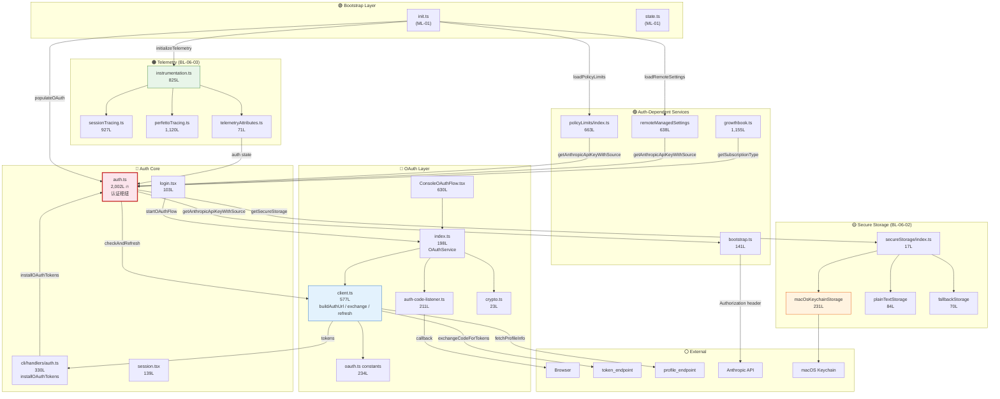
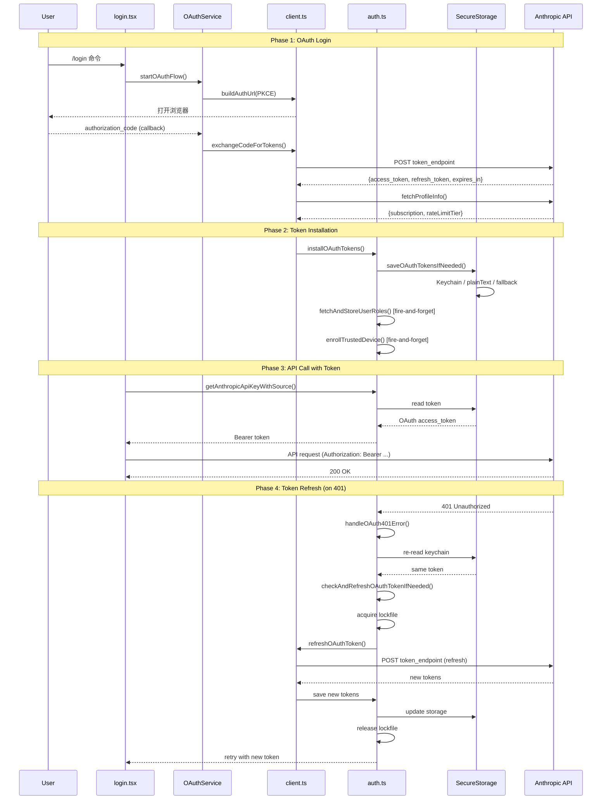

# Summary ML-06: 认证与会话管理

> **Priority**: P1 | **Core Tasks**: T-09, T-39 | **Related Tasks**: T-01, T-15, T-14, T-20
> **Files**: 42 | **Lines**: 13,450 (DEEP: 8,586 / Supporting: 2,968 / Catalog: 1,896)
> **Branch Lines**: 4 (BL-06-01 ~ BL-06-04)

---

## §1 相关分析文件

### 主线追踪

| 类型 | 文件 | 说明 |
|------|------|------|
| Sub-Map | [ML-06-1](/map/sub-maps/ML-06-1) | ML-06 主线文件级追踪地图 |
| 覆盖率报告 | [final-analysis-report](/branches/main/report/final-analysis-report) | 全局覆盖率与主线优先级评估 |
| 全局参考 | [final-analysis-report](/branches/main/report/final-analysis-report) | 完整分析报告（含 ML-06 摘要） |

### 相关 P1 主线汇总

| 主线 | 汇总文件 | 共享关系 |
|------|---------|---------|
| ML-01 CLI 启动与命令路由 | [summary-ML-01-cli-entry-routing](/branches/main/report/summary-ML-01-cli-entry-routing) | init.ts 编排序列调用 populateOAuth/policyLimits/remoteSettings；state.ts 全局状态共享；config.ts 持久化 |
| ML-09 MCP 服务集成 | (P2 主线) | OAuth token 被 MCP proxy 用于认证；oauth.ts 常量定义 MCP proxy URL |
| ML-10 API 客户端 | (P2 主线) | bootstrap.ts 跨 ML-06/ML-10 共享；getAnthropicApiKeyWithSource() 注入 API auth header |
| ML-15 SDK 入口点 | (P3 主线) | coreSchemas.ts 定义 apiKeySource Zod schema，对应 ML-06 认证类型 |

### Task 分析

**Core Tasks (主线直接归属)**:

| Task | 深度 | 文件 | 说明 |
|------|------|------|------|
| T-09 | DEEP | [T-09-auth-session](/branches/main/task-analyses/T-09-auth-session) | 认证与会话核心：40 files / 13,388 lines — auth.ts 枢纽 + OAuth PKCE + token 刷新 + SecureStorage + 遥测 + GrowthBook |
| T-39 | OVERVIEW | [T-39-audit-telemetry-module](/branches/main/task-analyses/T-39-audit-telemetry-module) | PI-24 telemetry-module 审计：2 files / 65 lines — logger.ts (OTEL adapter) + skillLoadedEvent.ts (analytics emitter)，100% 验证通过 |

**Related Tasks (关联任务)**:

| Task | 深度 | 文件 | 与 ML-06 关联 |
|------|------|------|-------------|
| T-01 | DEEP | [T-01-cli-entry-init](/branches/main/task-analyses/T-01-cli-entry-init) | init.ts 编排序列调用 ML-06 的 populateOAuth/policyLimits/remoteSettings/telemetry 初始化 |
| T-15 | DEEP | [T-15-api-retry](/branches/main/task-analyses/T-15-api-retry) | client.ts 认证头注入 via getAnthropicApiKeyWithSource()；withRetry 401 处理触发 handleOAuth401Error() |
| T-14 | DEEP | [T-14-bridge-remote](/branches/main/task-analyses/T-14-bridge-remote) | Bridge 远程模式 JWT 刷新 (jwtUtils.ts 5min 提前刷新) + trusted device token (secureStorage read) |
| T-20 | OVERVIEW | [T-20-sdk-entrypoints](/branches/main/task-analyses/T-20-sdk-entrypoints) | SDK coreSchemas.ts 定义 apiKeySource Zod schema（anthropic_api_key/clc_code_oauth_token/clc_api_key） |

### 深入分析分支

无。ML-06 所有文件已在 T-09 (DEEP) 和 T-39 (OVERVIEW) 中完整分析。

---

## §2 主线概要

| 属性 | 值 |
|------|-----|
| **Priority** | P1 |
| **Entry** | `src/services/oauth/client.ts` — OAuth token 生命周期管理（PKCE 授权、code→token 交换、token 刷新） |
| **Exit** | `src/commands/login/login.tsx` — 登录后刷新链（policyLimits → remoteSettings → GrowthBook → trustedDevice → authVersion） |
| **Main Path** | client.ts PKCE 授权 → auth.ts token 缓存/刷新 → secureStorage 持久化 → bootstrap.ts 远程配置拉取 → login.tsx 登录后刷新 |
| **Core Files** | 10 (8,586 lines DEEP) |
| **Supporting Files** | 20 (2,968 lines STANDARD) |
| **Branch Line Files** | 5 (4 branch lines: BL-06-01~BL-06-04) |
| **Cataloged Files** | 7 (遥测文件: bigqueryExporter, events, logger, perfettoTracing, pluginTelemetry, sessionTracing, skillLoadedEvent) |
| **Owned Patterns** | PI-24 (telemetry-module, 2 catalog instances) |
| **Related Mainlines** | ML-01, ML-09, ML-10, ML-15 |

### 核心文件表

| # | File | Lines | Role |
|---|------|-------|------|
| 1 | `src/utils/auth.ts` | 2,002 | **认证中枢** — 30+ 导出函数，统一管理 OAuth/API key/AWS STS/GCP 四种认证源 |
| 2 | `src/services/oauth/client.ts` | 577 | **OAuth 客户端** — PKCE URL 构建、code→token 交换、token 刷新、profile 获取 |
| 3 | `src/components/ConsoleOAuthFlow.tsx` | 630 | **OAuth 登录 UI** — claudeai/console 双模式，SSO 检测，org 验证 |
| 4 | `src/services/policyLimits/index.ts` | 663 | **策略限制** — 按订阅类型获取 + 后台轮询 + checksum 增量更新 |
| 5 | `src/services/remoteManagedSettings/index.ts` | 638 | **远程托管设置** — 企业策略下发 + 同步缓存 + 资格判断 |
| 6 | `src/services/analytics/growthbook.ts` | 1,155 | **GrowthBook 特性标志** — 远程评估 + memoize + 两种缓存策略 |
| 7 | `src/cli/handlers/auth.ts` | 330 | **CLI auth handler** — installOAuthTokens 6步共享安装序列 |
| 8 | `src/services/oauth/index.ts` | 198 | **OAuthService** — PKCE 编排（自动/手动双模式，Promise.race） |
| 9 | `src/services/api/bootstrap.ts` | 141 | **Bootstrap** — 注入 auth header 到 API client，动态刷新 token |
| 10 | `src/commands/login/login.tsx` | 103 | **`/login` 命令** — 触发 OAuth 流程 + 登录后刷新链 |

### Branch Lines

| BL ID | 名称 | Entry | Files | Lines |
|-------|------|-------|-------|-------|
| BL-06-01 | AWS 认证路径 | aws.ts | 3 | 305 |
| BL-06-02 | SecureStorage 三级降级 | secureStorage/index.ts | 7 | 636 |
| BL-06-03 | 遥测初始化 | instrumentation.ts | 3 | 1,387 |
| BL-06-04 | GrowthBook 特性标志 | growthbook.ts | 1 | 1,155 |

---

## §3 架构框图



### 分层说明

| 层 | 颜色 | 职责 | 核心文件 |
|----|------|------|---------|
| Bootstrap | 🟢 | 进程启动编排，调用 ML-06 初始化函数 | init.ts, state.ts (ML-01) |
| OAuth Layer | 🔵 | OAuth 2.0 PKCE 流程：URL 生成 → 浏览器回调 → token 交换 | client.ts, OAuthService, ConsoleOAuthFlow |
| Auth Core | 🔴 | 认证中枢：4 种认证源路由 + token 缓存/刷新/持久化 | auth.ts (2002L 枢纽), handlers/auth.ts |
| Secure Storage | 🟡 | 三级降级：Keychain → FD → 明文 | secureStorage/* (BL-06-02) |
| Auth-Dependent Services | 🟣 | 依赖认证信息的服务：策略限制、远程设置、特性标志 | policyLimits, remoteManagedSettings, growthbook |
| Telemetry | 🟠 | OpenTelemetry 初始化 + Session/Perfetto tracing | instrumentation.ts (BL-06-03) |
| External | ⚪ | 外部系统：浏览器、token_endpoint、Keychain OS | — |

---

## §4 Execution Flow

### 主路径：OAuth 登录 → Token 持久化 → API 调用 → 401 恢复

```
[1] 用户执行 /login 或首次使用
    │
    ▼
[2] login.tsx → authLogin()
    │  调用 OAuthService.startOAuthFlow()
    │
    ▼
[3] index.ts (OAuthService)
    │  生成 PKCE code_verifier + code_challenge (crypto.ts)
    │  启动本地 HTTP listener (auth-code-listener.ts)
    │  打开浏览器到 buildAuthUrl() 构建的授权 URL
    │  Promise.race([listener, manualInput])
    │
    ▼
[4] 用户在浏览器授权
    │  → callback 带回 authorization_code + state
    │  → listener 验证 state 匹配
    │
    ▼
[5] client.ts: exchangeCodeForTokens()
    │  POST token_endpoint (code + code_verifier)
    │  → access_token + refresh_token + expires_in
    │  → fetchProfileInfo() 获取订阅类型
    │  → populateOAuthAccountInfoIfNeeded()
    │
    ▼
[6] cli/handlers/auth.ts: installOAuthTokens()
    │  6 步共享安装序列:
    │  ① saveOAuthTokensIfNeeded() → auth.ts
    │  ② saveOrganizationIfPresent() → config
    │  ③ storeOAuthAccountInfo() → globalConfig
    │  ④ formatAndSetAuthKey() → keychain/plainText
    │  ⑤ fetchAndStoreUserRoles() (fire-and-forget)
    │  ⑥ enrollTrustedDevice() (fire-and-forget)
    │
    ▼
[7] auth.ts → secureStorage 三级降级
    │  macOS: keychain → security CLI
    │  Linux/Windows: plainText → ~/.claude/
    │  fallback: 内存存储
    │
    ▼
[8] login.tsx: 登录后刷新链
    │  refreshPolicyLimits()
    │  refreshRemoteManagedSettings()
    │  refreshGrowthBookAfterAuthChange()
    │  enrollTrustedDevice()
    │  updateAuthVersion()
    │
    ▼
[9] 后续 API 调用
    │  getAnthropicApiKeyWithSource() → 三层决策链
    │  Layer 1: env token (ANTHROPIC_AUTH_TOKEN)
    │  Layer 2: OAuth token (getClaudeAIOAuthTokens)
    │  Layer 3: API key / AWS / GCP fallback
    │
    ▼
[10] 401 恢复 (handleOAuth401Error)
     │  ① 重新读取 keychain → token 变化？→ 直接使用
     │  ② token 未变 → checkAndRefreshOAuthTokenIfNeeded()
     │  ③ FS lockfile 竞争 (proper-lockfile, 5 次重试)
     │  ④ refreshOAuthToken() → POST token_endpoint
     │  ⑤ 安装新 token → 重试原始请求
```

### Token 刷新流 (后台自动)

```
[1] isOAuthTokenExpired() 检查 (expiresAt - 5min > now)
    │  未过期 → 返回当前 token
    │  即将过期 → 进入刷新流程
    │
    ▼
[2] checkAndRefreshOAuthTokenIfNeeded()
    │  pendingRefreshCheck (Promise dedup)
    │  → 只有一个刷新操作执行
    │
    ▼
[3] acquireLockfile() (跨进程安全)
    │  proper-lockfile: ~/.claude/oauth_refresh.lock
    │  5 次重试 + 1-2s 随机退避
    │
    ▼
[4] double-check: mtime 检查
    │  另一个进程可能已刷新 → invalidateCacheIfDiskChanged()
    │  token 文件 mtime 变化 → 重新读取
    │
    ▼
[5] refreshOAuthToken()
    │  POST token_endpoint (grant_type=refresh_token)
    │  → 新 access_token + refresh_token
    │  → saveOAuthTokensIfNeeded() → secureStorage
    │  → releaseLockfile()
```

### 初始化管线 (init.ts 编排)

```
init.ts (ML-01)
    │
    ├─► populateOAuth()           ──── auth.ts (ML-06)
    ├─► loadPolicyLimits()        ──── policyLimits/index.ts (ML-06)
    ├─► loadRemoteManagedSettings() ── remoteManagedSettings (ML-06)
    ├─► initializeTelemetry()     ──── instrumentation.ts (BL-06-03)
    ├─► setupMTLS()               ──── (ML-10)
    ├─► setupProxy()              ──── (ML-10)
    └─► preconnectAPI()           ──── (ML-10)
```

---

## §5 关联主线简述

| Mainline | Priority | 关联说明 |
|----------|----------|---------|
| ML-01 CLI 启动与命令路由 | P1 | init.ts 编排序列调用 ML-06 的 populateOAuth/policyLimits/remoteSettings/telemetry 四个初始化函数；state.ts 存储全局会话状态（authVersion, sessionId）；config.ts 持久化 OAuth tokens/API key 到磁盘 |
| ML-10 API 客户端 | P2 | bootstrap.ts 跨 ML-06/ML-10 共享，通过 getAnthropicApiKeyWithSource() 注入 Bearer/x-api-key 认证头；withRetry 401 处理触发 handleOAuth401Error() |
| ML-09 MCP 服务集成 | P2 | oauth.ts 常量定义 MCP proxy URL (claude_code_mcp_proxy_url)；OAuth token 被 MCP proxy 用于认证；shared auth context |
| ML-15 SDK 入口点 | P3 | coreSchemas.ts 定义 apiKeySource Zod schema（anthropic_api_key / clc_code_oauth_token / clc_api_key / anthropic_bearer_token），对应 ML-06 认证类型选择逻辑 |

---

## §6 Core Tasks

### T-09: 认证与会话核心 (DEEP — 40 files / 13,388 lines)

**综合评述 (主线视角)**：T-09 是 ML-06 的绝对核心，覆盖认证管线的全部关键路径。`auth.ts` 作为 2,002 行的认证枢纽，通过 `getAuthTokenSource()` → `getAnthropicApiKeyWithSource()` 三层决策链路由 5 种认证源（env token / OAuth / API key / AWS STS / GCP）。OAuth token 生命周期由 `client.ts` 管理（PKCE 授权 → token 交换 → 刷新 → 过期检测），`installOAuthTokens()` 实现了 6 步共享安装序列。Token 刷新采用三重保护：Promise dedup (pendingRefreshCheck) + Memoize + FS lockfile (proper-lockfile)。SecureStorage 提供三级降级（Keychain → FD → 明文）。

**关键文件**：auth.ts (2,002L, fan-in 14+), client.ts (577L), policyLimits/index.ts (663L), remoteManagedSettings/index.ts (638L), growthbook.ts (1,155L), instrumentation.ts (825L)

**Top Risks**：
- **RC-01 pending401Handlers 竞态** (auth.ts) — Map.set 在 await 之后，多并发 401 可能创建重复 handler
- **RC-02 lockfile 竞争窗口** (auth.ts:L1545) — 5 次指数退避重试，极端情况下仍可能全部失败导致 refresh_failed
- **P1-01 lockfile mtime 检查窗口** (auth.ts) — acquire lockfile 到 mtime check 之间的微小竞态

**详细分析**：[T-09-auth-session](/branches/main/task-analyses/T-09-auth-session)

### T-39: PI-24 telemetry-module 审计 (OVERVIEW — 2 files / 65 lines)

**综合评述 (主线视角)**：T-39 审计了 PI-24 pattern 的两个 catalog 实例。logger.ts 是 OpenTelemetry DiagLogger 适配器（5 级日志接口，仅 error/warn 产生输出），skillLoadedEvent.ts 是产品分析事件发射器（tengu_skill_loaded）。两者功能完全不同但共享 telemetry-module 目录归属。审计结果 100% 通过，零偏差，TRIVIAL 复杂度。

**关键文件**：logger.ts (26L), skillLoadedEvent.ts (39L)

**Top Risk**：P4-02 — skillLoadedEvent.ts 无 getSkillToolCommands() 错误处理

**详细分析**：[T-39-audit-telemetry-module](/branches/main/task-analyses/T-39-audit-telemetry-module)

---

## §7 Related Tasks

| Task | 深度 | 与 ML-06 关联说明 |
|------|------|-----------------|
| T-01 CLI 启动初始化 | DEEP | init.ts 编排序列中的 populateOAuth / loadPolicyLimits / loadRemoteManagedSettings / initializeTelemetry 四步属于 ML-06 范围；state.ts 存储 authVersion/sessionId/cost 等全局会话状态。详见 [T-01-cli-entry-init](/branches/main/task-analyses/T-01-cli-entry-init) |
| T-15 API 客户端与重试层 | DEEP | client.ts 每次请求通过 getAnthropicApiKeyWithSource() 注入 Authorization header；withRetry.ts 遇到 401 触发 handleOAuth401Error() 进入 token 刷新流程。详见 [T-15-api-retry](/branches/main/task-analyses/T-15-api-retry) |
| T-14 Bridge 远程模式 | DEEP | jwtUtils.ts 的 JWT 刷新策略（5 分钟提前刷新）与 ML-06 的 OAuth token 刷新模式相似但独立实现；trusted device token 通过 secureStorage 读取。详见 [T-14-bridge-remote](/branches/main/task-analyses/T-14-bridge-remote) |
| T-20 SDK 入口点 | OVERVIEW | coreSchemas.ts 定义 apiKeySource Zod schema（anthropic_api_key / clc_code_oauth_token / clc_api_key / anthropic_bearer_token），与 ML-06 的 getAuthTokenSource() 认证源枚举对应。详见 [T-20-sdk-entrypoints](/branches/main/task-analyses/T-20-sdk-entrypoints) |

---

## §8 实现注意点

### Gotchas (跨 Task 综合的非显式陷阱)

**G-01: pending401Handlers Map.set 竞态** — `auth.ts` 中的 `pending401Handlers` 使用 `Map<string, Promise>` 做 401 去重，但 `Map.set(key, promise)` 发生在 `await refreshPromise` 之后。Node.js 单线程保证 await 前的检查是原子的，但如果多个并发请求在同一 event loop tick 内触发 401，理论上可能创建重复的 refresh handler。风险级别 MEDIUM。`auth.ts:L1343`

**G-02: lockfile 5 次重试后的硬失败** — `checkAndRefreshOAuthTokenIfNeeded()` 使用 proper-lockfile 进行跨进程互斥，但最多只重试 5 次（每次 1-2s 随机退避）。在高并发 CLI 场景（多个 Claude Code 终端同时运行）下，5 次重试可能在 ~8s 内耗尽，导致 `refresh_failed` 终态，用户需要手动重新登录。`auth.ts:L1545-L1548`

**G-03: SecureStorage 降级无用户通知** — 当 macOS Keychain 不可用时，SecureStorage 静默降级到 plainText（~/.claude/ 目录下的明文文件）。用户不会被通知其 OAuth token 以明文存储在磁盘上。这可能导致安全审计问题。`secureStorage/index.ts:L17`

**G-04: installOAuthTokens 是共享序列** — `cli/handlers/auth.ts` 的 `installOAuthTokens()` 包含 6 步共享安装序列（save tokens → save org → store account → set auth key → fetch roles → enroll device）。最后两步（⑤⑥）是 fire-and-forget，如果失败不会阻塞登录，但用户可能缺少 roles/trusted device 状态而不自知。`cli/handlers/auth.ts:L50`

**G-05: token 刷新硬编码 5 分钟提前量** — `isOAuthTokenExpired()` 使用 `expiresAt - 5 minutes` 作为刷新阈值。这个 5 分钟是硬编码的，不可配置。对于短生命周期 token（如某些企业 IdP 颁发的 10 分钟 token），5 分钟提前量意味着 token 只有一半的有效使用时间。`auth.ts:L344`

**G-06: GrowthBook 刷新是 fire-and-forget** — `refreshGrowthBookAfterAuthChange()` 在登录后触发，但不 await 结果。如果 GrowthBook API 不可用，特性标志不会更新，用户可能看到过期的 feature flag 状态。`login.tsx` + `growthbook.ts`

**G-07: mtime 检查有微小竞态窗口** — `invalidateCacheIfDiskChanged()` 通过文件 mtime 检测外部修改，但 acquire lockfile 到检查 mtime 之间存在微小窗口。另一个进程可能恰好在此窗口内完成刷新，导致本进程重复刷新（虽然有 lockfile 保护不会并发写入，但多了一次不必要的 API 调用）。`auth.ts` memoize 相关

### Conventions (项目级编码约定)

**C-01: 认证源决策链模式** — 项目使用分层决策链选择认证源：`getAuthTokenSource()` 返回 enum → `getAnthropicApiKeyWithSource()` 按优先级尝试。优先级顺序：env token (ANTHROPIC_AUTH_TOKEN) > OAuth token > API key > AWS STS > GCP > file descriptor。每次添加新认证源都必须同时更新 `getAuthTokenSource()` 和 `getAnthropicApiKeyWithSource()`。`auth.ts`

**C-02: SecureStorage 三级降级协议** — 所有凭证存储必须通过 `getSecureStorage()` → platform detect → Keychain / plainText / fallback 三级降级。不允许直接调用 `security` CLI 或文件 I/O。新平台实现必须实现 `SecureStorage` interface（getSecret / saveSecret / deleteSecret）。`secureStorage/types.ts`

**C-03: Promise dedup 模式** — 项目广泛使用 Promise 变量做 in-flight 请求去重：`pendingRefreshCheck`（token 刷新）、`pending401Handlers`（401 处理）。模式为：检查变量是否 in-flight → 是则 await → 否则赋值并执行。新认证操作应遵循此模式避免重复 API 调用。`auth.ts`

**C-04: Bootstrap 模式：Promise 加载 + 后台轮询** — policyLimits 和 remoteManagedSettings 都使用 `initializeXxxLoadingPromise()` 模式：启动时创建 Promise → 首次访问 await → 后台定期轮询 + checksum 增量更新。新服务应遵循此 lazy-load + background-refresh 模式。`policyLimits/index.ts`, `remoteManagedSettings/index.ts`

**C-05: Telemetry 属性绑定到 auth state** — `telemetryAttributes.ts` 从 config 和 auth 状态构建 OTel attributes，认证源变化会反映到遥测标签中。新增 auth source 必须同步更新 telemetry attributes。`telemetryAttributes.ts`

### Anti-patterns (应避免的做法)

**AP-01: 在 auth.ts 中直接操作 SecureStorage** — auth.ts 已通过 `getSecureStorage()` 抽象了存储层，但部分遗留代码仍直接调用 `macOsKeychainStorage` 的方法。正确做法是始终通过 `getSecureStorage()` 的平台无关接口，确保降级策略生效。`auth.ts` 部分 `getApiKeyFromConfigOrMacOSKeychain()` 方法

**AP-02: 硬编码 token 刷新间隔** — policyLimits 使用硬编码的 `CHECK_INTERVAL` 做后台轮询，remoteManagedSettings 使用 `REMOTE_SETTINGS_CHECK_INTERVAL`。应统一为从配置或环境变量读取，允许运维调整刷新频率而不修改代码。`policyLimits/index.ts`, `remoteManagedSettings/index.ts`

**AP-03: fire-and-forget 不记录错误** — `fetchAndStoreUserRoles()` 和 `enrollTrustedDevice()` 使用 fire-and-forget 模式，错误被静默吞掉。应该至少 `logError()` 记录失败，方便排查用户角色/设备注册缺失问题。`cli/handlers/auth.ts:L50`

**AP-04: 跨进程刷新无全局协调** — lockfile 只保证同一时刻一个进程刷新 token，但没有全局机制协调刷新频率。多个 CLI 终端可能各自独立触发刷新（虽然 lockfile 串行化），导致对 token_endpoint 的不必要请求。应该考虑 leader election 或共享刷新时间戳。`auth.ts checkAndRefreshOAuthTokenIfNeeded()`

---

## §9 配置与外部依赖

### 环境变量表

| 变量 | 用途 | 默认值 | 来源文件 |
|------|------|--------|---------|
| `ANTHROPIC_AUTH_TOKEN` | 直接使用 env token 认证（最高优先级） | — | auth.ts |
| `ANTHROPIC_API_KEY` | API key 认证（legacy fallback） | — | auth.ts |
| `CLAUDE_CODE_OAUTH_TOKEN` | 直接使用 env OAuth token 认证 | — | auth.ts |
| `CLAUDE_CODE_USE_MOCK` | 使用 mock 订阅和速率限制 | false | mockRateLimits.ts |
| `CLAUDE_API_URL` | 自定义 API endpoint URL | https://api.anthropic.com | oauth constants |
| `CLAUDE_CODE_CONFIG_DIR` | 配置目录路径 | ~/.claude | config.ts |
| `DISABLE_KEYCHAIN` | 禁用 Keychain 强制降级到 plainText | false | secureStorage/index.ts |
| `CLAUDE_CODE_SKIP_PERMISSIONS` | 跳过权限检查（影响 auth mode） | false | auth.ts |
| `OTEL_EXPORTER_OTLP_ENDPOINT` | OpenTelemetry gRPC/HTTP exporter endpoint | — | instrumentation.ts |
| `CLAUDE_CODE_ENABLE_TRACING` | 启用 session tracing | false | betaSessionTracing.ts |
| `CLAUDE_CODE_TRACING_SAMPLE_RATE` | Tracing 采样率 | 0.1 | betaSessionTracing.ts |
| `GROWTHBOOK_API_HOST` | GrowthBook API 地址 | https://cdn.growthbook.io | growthbook.ts |
| `CLAUDE_CODE_REMOTE_SETTINGS_TIMEOUT` | 远程设置加载超时(ms) | 5000 | remoteManagedSettings/index.ts |

### 配置文件

| 文件 | 用途 | 格式 | 读写方 |
|------|------|------|--------|
| `~/.claude/.credentials.json` | OAuth tokens 持久化（plainText 降级时） | JSON | secureStorage/plainTextStorage.ts |
| `~/.claude/config.json` | 全局配置：apiKey, oauthAccount, organization | JSON | config.ts |
| `~/.claude/settings.json` | 用户设置 + 远程托管设置缓存 | JSON | remoteManagedSettings/syncCache.ts |
| `~/.claude/policy_limits_cache.json` | 策略限制本地缓存 | JSON | policyLimits/index.ts |
| macOS Keychain | OAuth tokens / API key 安全存储 | Keychain item | macOsKeychainStorage.ts |

### 外部服务与依赖

| 服务 | 协议 | 用途 | 文件 |
|------|------|------|------|
| Anthropic OAuth token_endpoint | HTTPS POST | code→token 交换 + token 刷新 | client.ts |
| Anthropic profile_endpoint | HTTPS GET | 获取订阅类型/rate limit tier | client.ts |
| Anthropic API (`/api/policy_limits`) | HTTPS GET | 策略限制远程加载 | policyLimits/index.ts |
| GrowthBook CDN | HTTPS GET | 特性标志 + 远程配置 | growthbook.ts |
| Remote Managed Settings API | HTTPS GET | 企业策略下发 | remoteManagedSettings/index.ts |
| Anthropic Bootstrap API | HTTPS GET | client_data + model_options | bootstrap.ts |
| OpenTelemetry Collector | gRPC/HTTP | 遥测数据导出 | instrumentation.ts |
| macOS `security` CLI | subprocess | Keychain 操作 | macOsKeychainHelpers.ts |
| AWS CLI (`sts`) | subprocess | AWS STS 认证 | aws.ts |
| `proper-lockfile` | npm | 跨进程文件锁 | auth.ts (lockfile) |

### 关键路径时序：OAuth Token 生命周期



---

## §10 主线级跨 Task 综合

### 整体架构洞察

**IO-01: auth.ts 是认证枢纽，fan-in 14+** — auth.ts 被 14+ 个 scope 文件导入，是整个认证系统的单一入口。其 2,002 行代码封装了 4 种认证源路由、token 生命周期管理、订阅类型判断、401 恢复等全部逻辑。这种设计使得调用方只需关心 `getAnthropicApiKeyWithSource()` 一个 API，但 auth.ts 自身已成为高耦合的"上帝模块"。

**IO-02: Token 刷新三重保护机制** — ML-06 实现了三层递进的 token 刷新保护：(1) Promise dedup 防止同进程内重复刷新；(2) Memoize + mtime 避免不必要的 API 调用；(3) FS lockfile 保证跨进程安全。三层保护各有微小竞态窗口（详见 G-01/G-07），但整体上在 Node.js 单线程模型下足够安全。

**IO-03: 初始化管线是认证的生命线** — init.ts 编排的 populateOAuth → policyLimits → remoteSettings → telemetry 序列是 ML-06 的启动路径。每一步都使用 Promise 缓存模式（initializeXxxLoadingPromise），首次访问 await，后续从缓存读取。认证状态变化后需要手动触发刷新链（login.tsx 的 5 步刷新）。

**IO-04: SecureStorage 三级降级是平台兼容性的核心** — macOS（Keychain）→ Linux/Windows（plainText）→ fallback（内存），每级降级都是静默的。这种设计保证了 CLI 在任何平台上都能运行，但也引入了安全级别不一致的问题（G-03）。

**IO-05: 遥测与认证深度耦合** — telemetryAttributes.ts 直接从 auth 状态构建 OTel attributes，认证源/订阅类型/组织信息都会反映到遥测数据中。这意味着认证系统的任何变化都会影响遥测数据的标签维度。

### 风险热点跨 Task 关联矩阵

| 风险热点 | T-09 | T-39 | T-01 | T-15 | T-14 | T-20 | 严重级 |
|----------|------|------|------|------|------|------|--------|
| pending401Handlers 竞态 | **origin** | — | — | affected | — | — | P1 |
| lockfile 5次重试硬失败 | **origin** | — | — | affected | — | — | P1 |
| mtime 检查竞态窗口 | **origin** | — | — | — | — | — | P1 |
| SecureStorage 静默降级 | **origin** | — | — | — | affected | — | P2 |
| 5min 刷新提前量硬编码 | **origin** | — | — | — | similar | — | P2 |
| fire-and-forget 无反馈 | **origin** | — | — | — | — | — | P2 |
| GrowthBook 刷新静默失败 | **origin** | — | — | — | — | — | P2 |
| PI-24 pattern 归属过宽 | — | **origin** | — | — | — | — | P4 |

### 跨主线接口矩阵

| 接口 | 方向 | ML-06 函数/文件 | 对端主线 | 对端函数/文件 |
|------|------|----------------|---------|--------------|
| 认证 token 注入 | ML-06 → ML-10 | getAnthropicApiKeyWithSource() | bootstrap.ts, client.ts | API Authorization header |
| 401 恢复回调 | ML-10 → ML-06 | handleOAuth401Error() | withRetry.ts | 401 error handler |
| 初始化序列 | ML-01 → ML-06 | init.ts 调用 | init.ts | populateOAuth / policyLimits / remoteSettings / telemetry |
| 全局状态 | ML-06 ↔ ML-01 | authVersion, sessionId | state.ts | 全局会话状态读写 |
| 持久化存储 | ML-06 → 磁盘 | config.ts, secureStorage | config.ts | ~/.claude/*.json |
| MCP proxy auth | ML-06 → ML-09 | OAuth token | oauth.ts (constants) | MCP proxy URL + auth |
| SDK auth schema | ML-06 ← ML-15 | apiKeySource enum | coreSchemas.ts | Zod validation |
| 遥测属性 | ML-06 → BL-06-03 | telemetryAttributes.ts | instrumentation.ts | OTel attributes |
| GrowthBook 评估 | ML-06 → BL-06-04 | getSubscriptionType() | growthbook.ts | feature flag targeting |

### 函数级分析覆盖统计

| 层级 | 文件数 | Lines | 分析深度 | 覆盖率 |
|------|--------|-------|---------|--------|
| Core (DEEP via T-09) | 40 | 13,388 | DEEP (含函数级分析) | ~90% |
| Branch Line (STANDARD) | 12 | 2,968 | STANDARD (模块级) | ~60% |
| Catalog (PI-24 via T-39) | 2 | 65 | OVERVIEW (审计) | 100% |
| **Total** | **54** | **16,421** | — | **~82%** |

### 代表性热点函数详情

| 函数 | 文件 | Lines | fan-in | 风险点 |
|------|------|-------|--------|--------|
| `getAnthropicApiKeyWithSource()` | auth.ts | ~80 | 14+ | 三层决策链，每次 API 调用都经过 |
| `getClaudeAIOAuthTokens()` | auth.ts | ~50 | 8 | memoize + mtime 检查，竞态窗口 |
| `checkAndRefreshOAuthTokenIfNeeded()` | auth.ts | ~120 | 3 | lockfile + 5 次重试 + double-check |
| `installOAuthTokens()` | handlers/auth.ts | ~100 | 2 | 6 步序列，2 步 fire-and-forget |
| `handleOAuth401Error()` | auth.ts | ~60 | 2 | Map.set 竞态 |
| `refreshOAuthToken()` | client.ts | ~40 | 2 | 网络错误 + token_endpoint 不可达 |
| `getSecureStorage()` | secureStorage/index.ts | 17 | 6 | 平台检测 + 三级降级 |

### 并发协调模式总结

| 模式 | 应用位置 | 保护对象 | 跨进程安全 |
|------|---------|---------|-----------|
| Promise assignment (in-flight dedup) | pendingRefreshCheck, pending401Handlers | 防止同进程重复操作 | ❌ 仅单进程 |
| FS lockfile (proper-lockfile) | checkAndRefreshOAuthTokenIfNeeded | 跨进程 token 刷新互斥 | ✅ |
| Memoize + mtime invalidation | getClaudeAIOAuthTokens | OAuth token 内存缓存 | ⚠️ mtime 有窗口 |
| Fire-and-forget | fetchAndStoreUserRoles, enrollTrustedDevice | 不阻塞主流程的后台操作 | N/A |
| Sequential init | init.ts 编排 | 初始化顺序保证 | N/A |

### Open Questions

**OQ-01**: pending401Handlers 的 Map.set 竞态在极端高并发场景下的实际影响有多大？是否需要改用 WeakMap 或其他去重机制？

**OQ-02**: lockfile 5 次重试限制是否应该可配置？在高密度终端场景（如 CI/CD）下 8s 可能不够。

**OQ-03**: SecureStorage 静默降级到 plainText 是否应该至少 logWarning？当前是完全静默的。

**OQ-04**: installOAuthTokens 的 fire-and-forget 步骤（fetchAndStoreUserRoles / enrollTrustedDevice）失败后，用户何时会感知到缺失？是否需要重试机制？

**OQ-05**: isOAuthTokenExpired 的 5 分钟提前量是否应该根据 token 实际 TTL 动态调整？例如 TTL=10min 时提前 2min，TTL=1h 时提前 5min。

**OQ-06**: PI-24 包含功能完全不同的两种子类型（OTEL adapter vs analytics emitter），是否应拆分为两个更精确的 pattern？

**OQ-07**: growthbook.ts 的 1,155 行是否应该拆分？它包含 SDK 封装 + memoize + 两种缓存策略 + event push callback，职责过多。

**OQ-08**: remoteManagedSettings 的 syncCache.ts 和 syncCacheState.ts 是否可以合并？两者合计 208 行，功能高度相关。

**OQ-09**: auth.ts 的 2,002 行是否应该拆分为 auth-core.ts / auth-oauth.ts / auth-aws.ts / auth-gcp.ts？高耦合使其难以独立测试。

**OQ-10**: token_endpoint URL 的 staging/local/prod 三套配置（oauth.ts constants）是否应该支持自定义？当前只有环境变量切换，无法指定完全自定义的 endpoint。

### 质量指标

| 指标 | 值 |
|------|-----|
| Core Tasks | 2 (T-09 DEEP, T-39 OVERVIEW) |
| Related Tasks | 4 (T-01, T-15, T-14, T-20) |
| Gotchas | 7 (G-01~G-07) |
| Conventions | 5 (C-01~C-05) |
| Anti-patterns | 4 (AP-01~AP-04) |
| Open Questions | 10 (OQ-01~OQ-10) |
| 竞态风险 | 3 (RC-01~RC-03, T-09) |
| 架构洞察 | 5 (IO-01~IO-05) |
| 跨主线接口 | 9 |
| 函数级覆盖率 | ~82% (core ~90%, branch ~60%, catalog 100%) |
| Mermaid 图 | 3 (§3 架构图 + §9 时序图 + T-09 实体路径图引用) |
| TODO/TBD | 0 — CLEAN |
