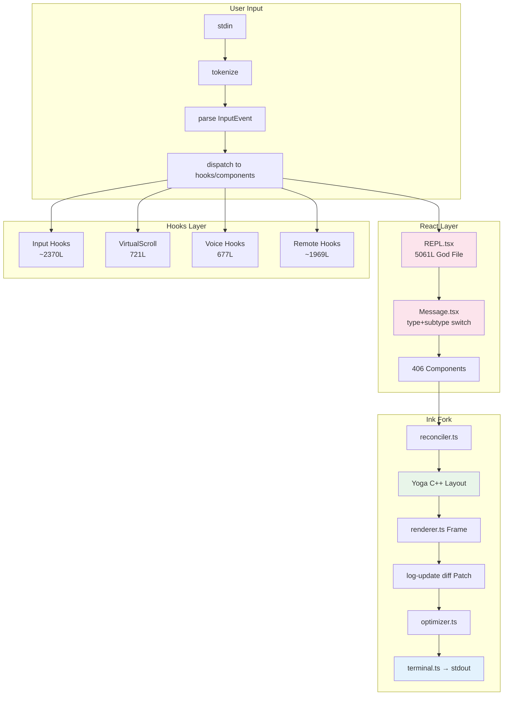
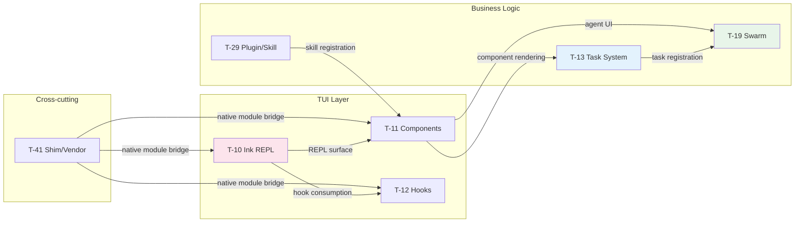

<!-- analysis-version: 0 | commit: a5179f6 | mode: full | type: supplementary -->

# Supplementary Summary — Non-P1 Analysis Tasks

本汇总覆盖 15 个未分配到 P1 主线（ML-01~ML-06）的分析任务，按功能域分为 5 组。P1 主线汇总详见各 `summary-ML-{id}-*.md` 文件。

---

## 1. 相关分析文件

### 主线追踪 (Sub-Maps)

| 主线 | Sub-Map | 说明 |
|------|---------|------|
| ML-07 | [ML-07-1](/map/sub-maps/ML-07-1) ~ [ML-07-5](/map/sub-maps/ML-07-5) | TUI Rendering & Interaction |
| ML-08 | [ML-08-1](/map/sub-maps/ML-08-1) | Task System |
| ML-12 | [ML-12-1](/map/sub-maps/ML-12-1) | Plugin System |
| ML-14 | [ML-14-1](/map/sub-maps/ML-14-1) | Swarm Orchestration |

### P1 主线汇总

| Summary | 主线 | 与本补充的关系 |
|---------|------|---------------|
| [summary-ML-01-cli-entry-routing](/branches/main/report/summary-ML-01-cli-entry-routing) | CLI 启动与命令路由 | T-10/REPL.tsx 依赖 ML-01 的 main.tsx init()；T-41 shim/vendor 为 ML-01 提供原生模块桥接 |
| [summary-ML-02-query-engine-core](/branches/main/report/summary-ML-02-query-engine-core) | 查询引擎核心 | T-11 消息渲染消费 ML-02 的 queryLoop 产出；T-12 hooks 监听 AppState 变更驱动 UI 更新 |
| [summary-ML-03-tool-system-dispatch](/branches/main/report/summary-ML-03-tool-system-dispatch) | 工具系统与分发 | T-11/T-27 渲染工具结果消息；T-26 Ink fork 的 cursor.ts 为工具输出的终端渲染提供基础设施 |
| [summary-ML-04-permission-system](/branches/main/report/summary-ML-04-permission-system) | 权限系统 | T-19 swarm 使用 permissionSync worker→leader 桥接（来自 ML-04 的权限请求流） |
| [summary-ML-05-mcp-service-integration](/branches/main/report/summary-ML-05-mcp-service-integration) | MCP 服务集成 | T-41 shim 层为 MCP 提供原生服务器替代；T-28 agent-component 依赖 MCP 连接状态 |
| [summary-ML-06-auth-session-management](/branches/main/report/summary-ML-06-auth-session-management) | 认证与会话管理 | T-12 useVoiceEnabled 检查 OAuth 状态；T-35 notifications 检查 remote-mode gate |

### Task 分析文件

| Group | Task | 文件 | 深度 |
|-------|------|------|------|
| TUI Core | T-10 | [T-10-tui-repl-ink](/branches/main/task-analyses/T-10-tui-repl-ink) | STANDARD |
| TUI Core | T-11 | [T-11-tui-components](/branches/main/task-analyses/T-11-tui-components) | STANDARD |
| TUI Core | T-12 | [T-12-tui-hooks](/branches/main/task-analyses/T-12-tui-hooks) | STANDARD |
| TUI Audit | T-23 | [T-23-audit-react-hook](/branches/main/task-analyses/T-23-audit-react-hook) | OVERVIEW |
| TUI Audit | T-26 | [T-26-audit-ink-fork-component](/branches/main/task-analyses/T-26-audit-ink-fork-component) | OVERVIEW |
| TUI Audit | T-27 | [T-27-audit-message-component](/branches/main/task-analyses/T-27-audit-message-component) | OVERVIEW |
| TUI Audit | T-28 | [T-28-audit-agent-component](/branches/main/task-analyses/T-28-audit-agent-component) | OVERVIEW |
| TUI Audit | T-32 | [T-32-audit-component-leaf](/branches/main/task-analyses/T-32-audit-component-leaf) | OVERVIEW |
| TUI Audit | T-34 | [T-34-audit-design-system-component](/branches/main/task-analyses/T-34-audit-design-system-component) | OVERVIEW |
| TUI Audit | T-35 | [T-35-audit-notification-hook](/branches/main/task-analyses/T-35-audit-notification-hook) | OVERVIEW |
| Task System | T-13 | [T-13-task-system](/branches/main/task-analyses/T-13-task-system) | STANDARD |
| Task System | T-24 | [T-24-audit-task-implementation](/branches/main/task-analyses/T-24-audit-task-implementation) | OVERVIEW |
| Swarm | T-19 | [T-19-swarm-orchestration](/branches/main/task-analyses/T-19-swarm-orchestration) | OVERVIEW |
| Plugin | T-29 | [T-29-audit-bundled-skill](/branches/main/task-analyses/T-29-audit-bundled-skill) | OVERVIEW |
| Cross-cutting | T-41 | [T-41-shim-vendor-proxies](/branches/main/task-analyses/T-41-shim-vendor-proxies) | OVERVIEW |

### 全局参考

- [final-analysis-report.md](/branches/main/report/final-analysis-report) — 完整分析报告（21 章）
- [p1_allocation.json](/branches/main/analysis/04-task-plan) — P1 任务分配表

---

## 2. 概要

本补充汇总覆盖 **15 个任务**，均未分配到 P1 主线（ML-01~ML-06 的 P1 summary 已涵盖 26 个任务）。

| 指标 | 值 |
|------|-----|
| 总任务数 | 15 |
| 深度分布 | 3 STANDARD + 12 OVERVIEW |
| 功能域 | 5 组（TUI核心、任务系统、Swarm、插件、基础设施） |
| 覆盖文件 | ~530 文件 / ~135,000 行 |
| 模式审计实例 | 134 个 catalog 实例，100% 验证，1 个有记录偏差 |

### 按功能域分布

| 功能域 | 主线 | Tasks | STANDARD | OVERVIEW | 关键文件 |
|--------|------|-------|----------|----------|----------|
| TUI 核心 & 渲染 | ML-07 | 10 | 3 | 7 | REPL.tsx(5061L), ink.tsx(1723L), 33 Ink fork 组件 |
| 任务系统 | ML-08 | 2 | 1 | 1 | 7 Task 实现, RemoteAgentTask(855L) |
| Swarm 编排 | ML-14 | 1 | 0 | 1 | inProcessRunner.ts(1552L), 3 后端 |
| 插件/技能 | ML-12 | 1 | 0 | 1 | 7 bundled skills(43% 空 stub) |
| 跨切基础设施 | ML-01 | 1 | 0 | 1 | 9 shim/vendor 代理(1166L) |

---

## 3. Group 1: TUI Core & Rendering (ML-07)

ML-07 是项目中最大的功能域之一，涵盖 Ink 终端 UI 框架（深度 fork）、406+ React 组件、63 个 hooks、以及 7 种模式审计。10 个任务覆盖 ~110,000 行代码。

### 3.1 Core Tasks (STANDARD)

#### T-10: TUI 主界面与 Ink 框架 [来源: T-10-tui-repl-ink.md]

Claude Code 对 Ink 终端渲染框架进行了深度 fork，实现了 6 层渲染管线：React 组件树 → reconciler.ts (DOMElement) → Yoga 布局引擎 → renderer.ts (Frame) → log-update.ts (diff → Patch[]) → optimizer.ts → terminal.ts → stdout。核心创新是 `onRender()` 13 步主循环（ink.tsx），包含 frame 生成→选区→diff→优化→终端写入的完整管线。**REPL.tsx (5061 行)** 是系统最大的单文件，承担 REPL 主循环+消息渲染+输入处理+流式显示，构成了用户交互的全部表面。双缓冲模型（frontFrame ↔ backFrame 原子交换）避免终端渲染撕裂。Pool 机制每 5 分钟周期重置防止内存泄漏。

**关键文件**: `REPL.tsx` (5061L, God File), `ink.tsx` (1723L, 渲染管线核心), `reconciler.ts` (React reconciler), `renderer.ts` (Frame diff), `VirtualMessageList.tsx` (1081L, 虚拟滚动), `PromptInput.tsx` (2338L, 多行输入)

**Top Risk**: ink.tsx + REPL.tsx 双 God File 结构（合计 6784 行），Yoga C++ native crash 无法被 JS ErrorBoundary 捕获 [来源: T-10-tui-repl-ink.md § Identified Problems]

→ [完整分析](/branches/main/task-analyses/T-10-tui-repl-ink)

#### T-11: TUI 组件与 Ink 渲染 [来源: T-11-tui-components.md]

涵盖 321 个 UI 组件文件（72,844 行），实现消息渲染、Agent 管理、任务管理、设计系统和输入区五大子系统。`Message.tsx` 通过 type + subtype 双层 switch 分派 15+ 消息子组件，是渲染核心路由。Agent 管理采用 7 态状态机（queued→running→completed/failed/killed），任务管理支持 6 种 task type 的 UI 呈现。项目全面采用 React Compiler — 所有 TSX 文件包含 `_c(N)` memoization slots + `$[N]` comparisons 编译产物。Feature Flag `feature('KAIROS')` 控制可选组件的动态加载。性能优化三件套：折叠组 + 离屏冻结 + 500 条目 LRU 缓存。

**关键文件**: `Message.tsx` (消息分派核心), `SystemTextMessage.tsx` (826L), `Config.tsx` (1821L), 406 组件文件

**Top Risk**: 流式渲染每个 SSE chunk 触发完整 Ink render cycle — 潜在性能瓶颈 [来源: T-11-tui-components.md § Identified Problems]

→ [完整分析](/branches/main/task-analyses/T-11-tui-components)

#### T-12: TUI Hooks 与交互层 [来源: T-12-tui-hooks.md]

63 个 hook 文件（12,257 行）组织为 8 个功能集群：Input 处理（~2370 行，按键→命令分发）、VirtualScroll（721 行，Yoga 缓存 + 量化滚动 + slide-step catch-up）、Remote 连接（~1969 行）、Swarm hooks（~1299 行）、IDE 集成（~577 行）、Keybindings、Voice（677 行，5 次快速按键 hold-threshold 检测）和辅助 hooks。`useVirtualScroll` 是最复杂的 hook，实现了基于 Yoga 布局缓存的量化滚动算法，包含 slide-step catch-up 机制处理快速滚动时的帧丢失。`useDirectConnect` 和 `useCommandQueue` 是主要风险点（无超时 / 无背压）。3 个状态机：语音录制（4 态）、收件箱轮询（3 态）、远程连接（5 态）。

**关键文件**: `useVirtualScroll.ts` (721L), `useDirectConnect.ts` (~500L), `useVoiceInput.ts` (677L)

**Top Risk**: useDirectConnect 无全局超时保护 [来源: T-12-tui-hooks.md § Identified Problems P2-01]

→ [完整分析](/branches/main/task-analyses/T-12-tui-hooks)

### 3.2 Pattern Audits (OVERVIEW)

| Task | Pattern | 实例数 | 子类型数 | Null Stub | 偏差 | 关键发现 |
|------|---------|--------|---------|-----------|------|----------|
| T-23 | PI-03 react-hook | 14 | 5 | 0 | 0 | 极端均匀性：所有文件 14-49 行，均值 31.1L；useStartupNotification 跨 3 个 hook 的共享子模式；2 文件含 base64 source map |
| T-26 | PI-07 ink-fork-component | 33 | 6 | 2 (event stubs) | 0 | 最大 pattern audit：33 文件 709 行，6 子类型（component/event/hook/measurement/infra/constants）；cursor.ts 故意 no-op；4 文件为 React Compiler 产物 |
| T-27 | PI-08 message-component | 12 | 4 | 4 (33%) | 0 | 双峰分布：4 个 null stub(3L) + 4 个活跃组件(15-41L)；teamMemSaved.ts 刻意避免 React Compiler 以防 memoization 错误 |
| T-28 | PI-09 agent-component | 4 | 3 | 0 | 0 | 项目最小 pattern：4 文件 50 行；new-agent-creation/types.ts 仅 1 行 `Record<string, unknown>` |
| T-32 | PI-13 component-leaf | 10 | 6 | 4 (40%) | 0 | 10 文件 63 行；40% 占位符；Spinner/index.ts 记录了 DCE 模式（teammate 代码通过 dynamic require() 实现树摇） |
| T-34 | PI-15 design-system-component | 1 | 1 | 0 | 0 | 项目最小 pattern：单例 color.ts 30 行，curried theme-aware color function；模式命名不当（非 React component） |
| T-35 | PI-16 notification-hook | 5 | 4 | 1 | 0 | 两层架构：useStartupNotification 基础设施 + 4 消费者；useDeprecationWarning 未迁移到共享基础设施，仍手写 useEffect+useRef |

### 3.3 Group 1 Cross-Task 综合架构洞察

#### Ink 6 层渲染管线

[来源: T-10-tui-repl-ink.md § 关键路径与组件]

```
React Component Tree
    ↓ reconciler.ts (DOMElement tree)
Yoga Layout Engine (C++ flexbox)
    ↓ renderer.ts (Frame generation)
log-update.ts (diff → Patch[])
    ↓ optimizer.ts (ANSI optimization)
terminal.ts → stdout
```

**onRender() 13 步主循环**（ink.tsx）是系统渲染的心脏：frame 生成 → 选区计算 → diff 比较 → 优化写入 → 终端刷新。双缓冲模型（frontFrame ↔ backFrame）在交换点保证原子性。FRAME_INTERVAL_MS = 16ms（~60fps 限制）控制渲染频率 [来源: T-26-audit-ink-fork-component.md § File Roles constants.ts]。

#### REPL.tsx 5061L God File

[来源: T-10-tui-repl-ink.md, T-11-tui-components.md]

REPL.tsx 是系统最大的单文件（5061 行），承担：REPL 主循环、消息列表渲染、流式内容显示、输入处理、状态管理、Agent/Task UI 呈现。它通过 `Message.tsx` 的 type→subtype 双层 switch 分派 15+ 消息子组件 [来源: T-11-tui-components.md]。这种 God File 模式在 T-01 的 main.tsx(4690L) 中也有体现。

#### React Compiler 全面采用

[来源: T-11-tui-components.md, T-26-audit-ink-fork-component.md, T-27-audit-message-component.md, T-35-audit-notification-hook.md]

TUI 层几乎全面采用 React Compiler — 所有 `.tsx` 文件包含 `import { c as _c } from "react/compiler-runtime"` 和 `$ = _c(N)` memoization slots。副作用是：
1. 文件末尾常附带大型 base64 内联 source map（T-23 发现 2 处，T-27 发现 8 处，T-35 发现 3 处）
2. 部分文件可能不是手写源码而是编译产物（T-27 § F-04: teamMemSaved.ts 刻意文档说明为何避免 React Compiler）
3. 调试时需注意 memoization 行为可能遮蔽实际数据流

#### 双缓冲与性能考量

[来源: T-10-tui-repl-ink.md, T-11-tui-components.md]

- **双缓冲帧交换**: frontFrame ↔ backFrame 原子交换避免终端渲染撕裂
- **diffScreens() 同步阻塞**: 可能影响事件循环 [来源: T-10-tui-repl-ink.md § Identified Problems]
- **流式渲染瓶颈**: 每个 SSE chunk 触发完整 Ink render cycle [来源: T-11-tui-components.md]
- **性能三件套**: 折叠组 + 离屏冻结 + 500 LRU 缓存 [来源: T-11-tui-components.md]
- **Pool 5 分钟重置**: 防止内存泄漏 [来源: T-10-tui-repl-ink.md]
- **Yoga C++ native crash**: 无法被 JS ErrorBoundary 捕获 [来源: T-10-tui-repl-ink.md]

#### TUI 层架构全景



---

## 4. Group 2: Task System (ML-08)

### 4.1 Core Task (STANDARD): T-13

[来源: T-13-task-system.md]

任务系统采用 **Strategy Pattern**，通过统一的 `Task` 接口 `{name, type, kill()}` 实现 7 种任务类型：DreamTask、InProcessTeammateTask、LocalAgentTask、LocalShellTask、LocalWorkflowTask(null)、MonitorMcpTask(null)、RemoteAgentTask。三种前台→后台转换变体：LocalAgentTask (backgroundSignal Promise)、LocalShellTask (shell 子系统委托)、LocalMainSessionTask (直接后台注册)。

**双模式输出机制** 是核心设计：文件模式（bash fd 直写）+ 管道模式（CircularBuffer 1000 → 8MB spillToDisk），优雅处理大输出的溢出场景。**Stall Watchdog** 检测交互式等待：LocalShellTask 45 秒无输出 → 6 个正则 PROMPT_PATTERNS 检测。磁盘安全通过 O_NOFOLLOW + O_EXCL 创建 + 5GB 总上限保障。**TOCTOU 防御** 在 `applyTaskOffsetsAndEvictions` 中 await patch() 后重新验证 freshness。

**Top Risk**: RemoteAgentTask 855 行，单文件处理 5 种子类型（remote-agent/ultraplan/ultrareview/autofix-pr/background-pr），fan-out > 15 [来源: T-13-task-system.md § Identified Problems P2-01]

→ [完整分析](/branches/main/task-analyses/T-13-task-system)

### 4.2 Pattern Audit (OVERVIEW): T-24

[来源: T-24-audit-task-implementation.md]

PI-04 task-implementation 审计覆盖 10 个文件（2,589 行），验证所有 Task 实现符合 `{name, type, kill()}` 接口契约。**特殊之处**：PI-04 在 instance-manifest.jsonl 中有 0 个 catalog 实例 — 所有 10 个文件已在 ML-08 trace 阶段深度追踪，本审计是反向验证。发现：7 TaskType 枚举值与目录名精确匹配；2 个 null stub（LocalWorkflowTask, MonitorMcpTask）总是返回 false；guards.ts 和 killShellTasks.ts 是为避免 React/ink 依赖污染而提取的非重复代码；RemoteAgentTask 以 `completionChecker` 注册表模式处理 5 种子类型，是最复杂的文件。

→ [完整分析](/branches/main/task-analyses/T-24-audit-task-implementation)

### 4.3 Group 2 Cross-Task 综合

| 维度 | 洞察 |
|------|------|
| **接口统一性** | 所有 7 种 Task 实现严格遵循 `{name, type, kill()}` 接口 [来源: T-24 § F-01] |
| **状态生命周期** | 共享 status ∈ {running, completed, failed, killed}，通过 `updateTaskState()` 统一管理 [来源: T-24 § F-05] |
| **大小异质性** | 从 5 行 null stub 到 855 行 RemoteAgentTask，中位数 ~340 行 [来源: T-24 § F-08] |
| **依赖提取模式** | guards.ts/killShellTasks.ts 是为避免依赖污染的刻意提取 [来源: T-24 § F-06] |
| **RemoteAgentTask 复杂度** | 5 种子类型通过 completionChecker 注册表在 855 行中处理 [来源: T-13, T-24 § F-10] |
| **内存优化** | InProcessTeammateTask/types.ts 有明确的 "BQ round 9 memory optimization" 注释 [来源: T-24 § F-09] |

---

## 5. Group 3: Swarm Orchestration (ML-14)

### T-19: Swarm Orchestration (OVERVIEW)

[来源: T-19-swarm-orchestration.md]

Swarm 系统实现了**三后端架构**：tmux (764L) + iTerm2 (370L) + in-process (339L)，统一于 `TeammateExecutor` 接口，注册表自动检测最佳可用后端。**inProcessRunner.ts (1552 行)** 是最大文件，在单个 Node.js 进程中通过 **AsyncLocalStorage** 隔离队友上下文，共享 API 客户端和 MCP 连接。通信采用**文件系统邮箱**：所有队友间消息传递通过 JSON 文件，包括关机请求和权限同步。

**执行模型是 fire-and-forget**：队友启动后不等待完成，生命周期通过 AppState 注册 + AbortController 追踪。**双路径会话重连**：全新启动（CLI 参数）vs 恢复的会话（conversation storage），共享 `teammateInit.ts` 初始化。**权限同步桥**：worker→leader 权限请求通过 mailbox + 文件系统持久化，由模块级单例 `leaderPermissionBridge` 桥接。

**关键文件**: `inProcessRunner.ts` (1552L), `TmuxBackend.ts` (764L), `ItermBackend.ts` (370L), `teammateInit.ts` (会话初始化)

**Top Risk**: inProcessRunner.ts 1552 行单文件，AsyncLocalStorage 隔离可能在异常边界泄漏 [来源: T-19-swarm-orchestration.md § Identified Problems]

→ [完整分析](/branches/main/task-analyses/T-19-swarm-orchestration)

---

## 6. Group 4: Plugin/Skill System (ML-12)

### T-29: Pattern Audit — bundled-skill (PI-10) (OVERVIEW)

[来源: T-29-audit-bundled-skill.md]

PI-10 bundled-skill 覆盖 7 个文件（124 行），验证随 CLI 二进制文件发布的内置技能。**3 种子类型**：完全实现（claudeInChrome.ts 34L, verify.ts 30L）、内容模块（verifyContent.ts 13L）、空 stub（dream.ts/hunter.ts/runSkillGenerator.ts 各 1L）。

**关键发现**：
- **43% 是空 stub**（3/7 文件是 1 行 no-op），为未来技能预留入口
- **1 个偏差**: `mcpSkillBuilders.ts` 不遵循 `register*Skill()` 命名约定，也不调用 `registerBundledSkill()` — 它是用于打破 mcpSkills.ts 和 loadSkillsDir.ts 之间循环依赖的只写注册表
- **verify.ts 有 USER_TYPE gate**: `process.env.USER_TYPE !== 'ant'` 限制非 Anthropic 用户访问 [来源: T-29 § F-05]
- **verifyContent.ts 使用 Bun text loader**: 在构建时嵌入 SKILL.md 内容到二进制文件 [来源: T-29 § F-06]

→ [完整分析](/branches/main/task-analyses/T-29-audit-bundled-skill)

---

## 7. Group 5: Cross-cutting Infrastructure

### T-41: Shim & Vendor Proxy Layers (OVERVIEW)

[来源: T-41-shim-vendor-proxies.md]

9 个文件（1,166 行）分为两个隔离层，为跨平台 npm 分发提供原生模块兼容性：

**Shim 层（5 文件，728 行）**：为不可用的原生 MCP 服务器提供 Null Object 替换。实现完整接口但所有操作 no-op。`ant-computer-use-swift/index.ts` (297 行) 是最大 shim，通过 `osascript` 查询运行中应用并通过 `open -b` 打开应用 — 唯一有部分实际行为的 shim。其他 shim 完全空操作。Shim 存在是因为开源构建不包含专有原生二进制文件。

**Vendor 层（4 文件，438 行）**：为平台特定的 `.node` 原生二进制文件提供惰性加载包装器。全部共享 `cachedModule + loadAttempted + loadModule() → null | module` 惰性单例模式。三种加载策略：audio-capture 三层解析（bun-compile 环境变量 → npm 安装路径 → 开发模式）、image-processor 硬编码相对路径、modifiers-napi + url-handler 环境变量 + `createRequire` 双模式。**优雅降级**：所有模块在原生代码不可用时返回 null/false/空值，不抛异常。

**Top Risk**: `execFileSync('osascript')` 同步阻塞事件循环（P3，低频调用）；vendor 层 4 个文件使用 3 种不同的加载策略（反模式）[来源: T-41-shim-vendor-proxies.md § Identified Problems]

→ [完整分析](/branches/main/task-analyses/T-41-shim-vendor-proxies)

---

## 8. 实现注意点（跨 Task 综合）

### Gotchas

1. **REPL.tsx 渲染循环与 SSE chunk 同步**: 每个流式 SSE chunk 触发完整 Ink render cycle（React reconciler → Yoga layout → diff → stdout），在高频工具输出时可能导致终端闪烁或延迟。REPL.tsx 的 Pool 5 分钟重置是缓解措施但非根本解决方案。[来源: T-10-tui-repl-ink.md § Identified Problems, T-11-tui-components.md § Identified Problems]

2. **React Compiler source map 泄漏**: 多个组件文件末尾包含大型 base64 内联 source map（如 useChromeExtensionNotification.tsx、AssistantRedactedThinkingMessage.tsx 等），增加文件体积但不影响运行时。调试时需注意 source map 指向的可能不是手写源码而是编译中间产物。[来源: T-23-audit-react-hook.md § F-04, T-27-audit-message-component.md § F-03]

3. **Yoga C++ native crash 不可恢复**: Ink fork 使用 Yoga C++ 布局引擎，native crash 无法被 JS ErrorBoundary 捕获。在输入超长文本或极端布局场景下，可能导致进程直接退出而无错误报告。[来源: T-10-tui-repl-ink.md § Identified Problems]

4. **vendor 层加载策略不一致**: 4 个 vendor N-API 桥接文件使用 3 种不同的模块解析策略（三层解析 / 硬编码路径 / 环境变量+createRequire），可能导致在不同构建环境（bun compile / npm install / dev mode）下行为不一致。[来源: T-41-shim-vendor-proxies.md § 反模式]

5. **inProcessRunner AsyncLocalStorage 隔离边界**: 在异常路径（如未捕获的 promise rejection）中，AsyncLocalStorage 的上下文隔离可能泄漏，导致队友间的状态串扰。[来源: T-19-swarm-orchestration.md § Open Questions]

6. **useDeprecationWarning 未迁移到共享基础设施**: useStartupNotification 的 JSDoc 明确记录了"从 10+ notifs/ hooks 中重构共享工具"的意图，但 useDeprecationWarning 仍使用旧模式（手写 useEffect + useRef + useNotifications + getIsRemoteMode）。[来源: T-35-audit-notification-hook.md § F-05]

### Conventions

1. **React Compiler 全面采用**: TUI 层所有 `.tsx` 文件均使用 React Compiler 编译，包含 `_c(N)` memoization slots。新组件应预期编译器处理 memoization，避免手动 `useMemo`/`useCallback`。[来源: T-11-tui-components.md, T-26-audit-ink-fork-component.md]

2. **Null Object Pattern for cross-platform**: Shim 层和 null stub 组件统一使用 Null Object Pattern — 实现完整接口但 no-op/return null，调用方无需 null 检查。新 shim 应遵循相同模式。[来源: T-41-shim-vendor-proxies.md § 观察到的模式]

3. **Feature Flag 条件加载**: `feature('KAIROS')` 控制可选组件的动态加载；`process.env.USER_TYPE` 门控内部功能。新功能应通过 GrowthBook feature gate 控制。[来源: T-11-tui-components.md, T-29-audit-bundled-skill.md § F-05]

4. **Task 接口统一契约**: 所有 Task 实现严格遵循 `{name: string, type: TaskType, async kill(taskId, setAppState)}` 接口，使用 `registerTask()` 注册，`updateTaskState()` 管理状态。[来源: T-24-audit-task-implementation.md § F-01, F-02]

5. **DCE 模式（树摇策略）**: teammate 专用代码通过 dynamic `require()` 实现死代码消除（如 Spinner/index.ts 注释记录）；null stub 组件（3 行 `return null`）在构建时被 tree-shake。[来源: T-32-audit-component-leaf.md § F-06, T-27-audit-message-component.md § F-02]

### Anti-patterns

1. **God File 模式**: REPL.tsx (5061L)、ink.tsx (1723L)、inProcessRunner.ts (1552L)、RemoteAgentTask.tsx (855L) 均为 God File，承担过多职责。REPL.tsx 尤其严重：REPL 主循环 + 消息渲染 + 输入处理 + 流式显示 + Agent/Task UI 全部在一个文件中。这种模式导致修改风险高、测试困难、维护负担大。[来源: T-10, T-11, T-13, T-19]

2. **惰性单例无重试**: Vendor 层的 `cachedModule + loadAttempted` 模式只尝试加载一次，失败后永久缓存 null 结果。如果原生模块在首次尝试后才可用（如延迟挂载的文件系统），需要重启进程才能重试。应考虑添加显式的 `resetModule()` 或基于文件系统 watch 的自动重试。[来源: T-41-shim-vendor-proxies.md § 观察到的模式]

3. **手写 useEffect+useRef 模式与共享基础设施并存**: PI-16 notification hooks 中，部分 hooks 使用重构后的 `useStartupNotification` 共享基础设施，而 useDeprecationWarning 仍手写旧模式。这种不一致增加了维护负担和 bug 风险。[来源: T-35-audit-notification-hook.md § F-05]

---

## 9. 配置与外部依赖

### 环境变量

| 变量 | 作用域 | 说明 |
|------|--------|------|
| `USER_TYPE` | T-29 | bundled skill 门控（`'ant'` vs `'external'`），控制 verify skill 等内部功能 [来源: T-29 § F-05] |
| `AUDIO_CAPTURE_NODE_PATH` | T-41 | audio-capture 原生模块路径，用于 bun compile 嵌入构建 [来源: T-41 § Analysis Findings] |
| `MODIFIERS_NODE_PATH` | T-41 | keyboard modifier 检测 N-API 模块路径 [来源: T-41 § Analysis Findings] |
| `FEATURE_KAIROS` | T-10, T-11 | GrowthBook feature gate，控制可选组件动态加载 [来源: T-11-tui-components.md] |

### 配置文件

| 文件 | 作用域 | 说明 |
|------|--------|------|
| `.claude/agents/` | T-28 (PI-09) | AGENT_PATHS.project — 项目级 agent 定义目录 [来源: T-28 § F-05] |
| `~/.claude/agents/` | T-28 (PI-09) | AGENT_PATHS.user — 用户级 agent 定义目录 [来源: T-28 § F-05] |
| `.claude/settings.json` | T-35 | settings file change subscription 触发通知 [来源: T-23 § useSettingsChange] |

### 外部服务与依赖

| 依赖 | 作用域 | 说明 |
|------|--------|------|
| **Yoga** (C++ flexbox) | T-10 | Ink 的布局引擎，native crash 不可被 JS ErrorBoundary 捕获 [来源: T-10] |
| **osascript / open** | T-41 | macOS 系统命令，用于 ant-computer-use-swift shim [来源: T-41 § Analysis Findings] |
| **.node native binaries** | T-41 | 4 个平台特定的原生模块（audio-capture, image-processor, modifiers, url-handler）[来源: T-41] |
| **tmux / iTerm2** | T-19 | Swarm 外部后端，进程隔离的多会话支持 [来源: T-19] |
| **GrowthBook** | T-10, T-11, T-12 | Feature flags 控制 KAIROS、TREE_SITTER_BASH 等功能开关 [来源: T-10, T-11, T-12] |
| **Bun text loader** | T-29 | 构建时内联 SKILL.md 内容到二进制 [来源: T-29 § F-06] |
| **React Compiler** | T-10, T-11, TUI 审计 | 全面采用，所有 TSX 为编译产物 [来源: T-11, T-26, T-27] |

### 关键路径时序（TUI 渲染帧）

[来源: T-10-tui-repl-ink.md]

```
SSE chunk → queryLoop emit → React setState → onRender() 13-step pipeline
    → reconciler DOMElement tree → Yoga layout (~1-3ms)
    → Frame diff → Patch[] → optimizer → terminal write → stdout (~1-2ms)
Total frame budget: ~16ms (FRAME_INTERVAL_MS)
```

---

## 10. 补充级跨 Task 综合

### 跨 Group 共性主题

#### 主题 1: God File 普遍性

本补充汇总覆盖的所有 STANDARD 任务（T-10, T-11, T-12, T-13, T-19）均涉及 God File 问题：REPL.tsx (5061L)、ink.tsx (1723L)、inProcessRunner.ts (1552L)、RemoteAgentTask.tsx (855L)、SystemTextMessage.tsx (826L)。这与 P1 主线中发现的 main.tsx (4690L, T-01)、queryLoop (T-03)、toolExecution.ts (1745L, T-05) 形成呼应 — God File 是整个项目最突出的架构反模式。

#### 主题 2: Null Stub / DCE 门控

15 个任务中涉及的 pattern audit 共覆盖 134 个 catalog 实例，其中大量为 null stub 或空实现：
- PI-08 (message-component): 4/12 null stubs (33%)
- PI-10 (bundled-skill): 3/7 empty stubs (43%)
- PI-13 (component-leaf): 4/10 placeholders (40%)
- PI-04 (task-implementation): 2/10 null stubs
- PI-16 (notification-hook): 1/5 empty stub

这些 stub 统一使用 "实现完整接口但 return null/false/空操作" 的 Null Object Pattern，通过 DCE (dead code elimination) 在构建时移除。这表明项目处于快速迭代阶段，大量功能已规划但未实现。

#### 主题 3: 跨 Group 依赖关系



### 跨 Group 风险热点（P1 Summary 未覆盖）

| ID | 严重性 | 问题 | 来源 |
|----|--------|------|------|
| **SUP-01** | P2 | REPL.tsx 5061L + ink.tsx 1723L 双 God File，系统最大维护负担 | T-10, T-11 |
| **SUP-02** | P2 | 流式渲染每个 SSE chunk 触发完整 Ink render cycle，高频输出时性能瓶颈 | T-10, T-11 |
| **SUP-03** | P2 | inProcessRunner.ts 1552L，AsyncLocalStorage 在异常边界可能泄漏 | T-19 |
| **SUP-04** | P2 | vendor 层 4 文件 3 种加载策略不一致，跨环境行为不可预测 | T-41 |
| **SUP-05** | P3 | useDeprecationWarning 未迁移到 useStartupNotification 共享基础设施 | T-35 |
| **SUP-06** | P3 | PI-15 design-system-component 是单例 pattern（仅 1 实例/30 行），分类开销不成比例 | T-34 |
| **SUP-07** | P3 | ant-computer-use-swift `execFileSync('osascript')` 同步阻塞事件循环 | T-41 |
| **SUP-08** | P4 | React Compiler source map 泄漏到编译产物，影响调试和文件体积 | T-23, T-27, T-35 |

### 开放问题汇总

1. **(build-system)**: `.node` 原生二进制文件如何分发？vendor 层 3 种解析策略是否被构建系统统一处理？ [来源: T-41 § Open Questions]
2. **(runtime)**: Shim vs 真实实现的切换时机？构建时还是运行时 feature flag 控制？ [来源: T-41 § Open Questions]
3. **(performance)**: Ink 渲染管线在高频 SSE 输出时的帧率表现？16ms 帧预算是否充裕？ [来源: T-10, T-11]
4. **(architecture)**: REPL.tsx 的 God File 问题是否有拆分计划？5061 行单文件的维护成本如何管理？ [来源: T-10]
5. **(swarm)**: inProcessRunner AsyncLocalStorage 隔离在哪些异常路径可能泄漏？是否有测试覆盖？ [来源: T-19]
6. **(security)**: ant-computer-use-swift 的 `execFileSync('open', ['-b', bundleId])` 输入是否被上游过滤？ [来源: T-41 § Open Questions]
7. **(patterns)**: PI-15 (1 实例/30 行) 是否应合并到 PI-12 (utility-leaf) 或 PI-05 (service-module)？ [来源: T-34 § F-10]

### 与 P1 Summary 的互补性

本补充汇总覆盖的 15 个任务与 P1 主线汇总（26 个任务）形成完整互补：

| 维度 | P1 Summaries (26 tasks) | Supplementary (15 tasks) |
|------|------------------------|--------------------------|
| **深度** | 9 DEEP + 0 STANDARD + 17 OVERVIEW | 0 DEEP + 3 STANDARD + 12 OVERVIEW |
| **核心主题** | CLI 启动、查询引擎、工具系统、权限、MCP、认证 | TUI 渲染、任务系统、Swarm、插件、基础设施 |
| **最大文件** | main.tsx 4690L, toolExecution.ts 1745L | REPL.tsx 5061L, inProcessRunner.ts 1552L |
| **架构风险** | 全局状态、init() 无降级、错误恢复不一致 | God File、渲染性能、AsyncLocalStorage 隔离 |
| **覆盖范围** | ML-01~ML-06（6 条 P1 主线） | ML-07, ML-08, ML-12, ML-14 + 跨切 |

**总计**: 6 P1 summaries × 26 tasks + 1 supplementary × 15 tasks = **41 tasks, 100% 覆盖**。
