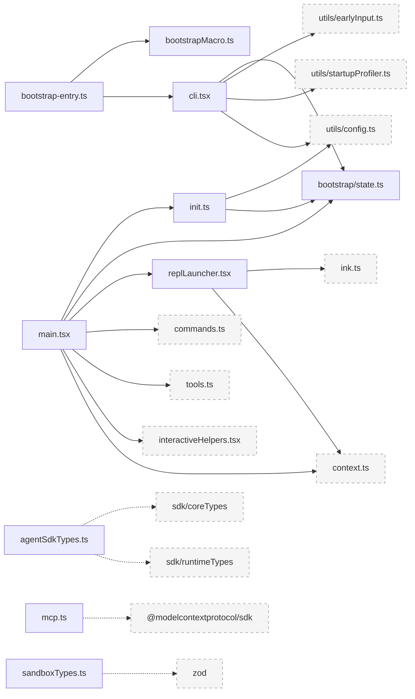
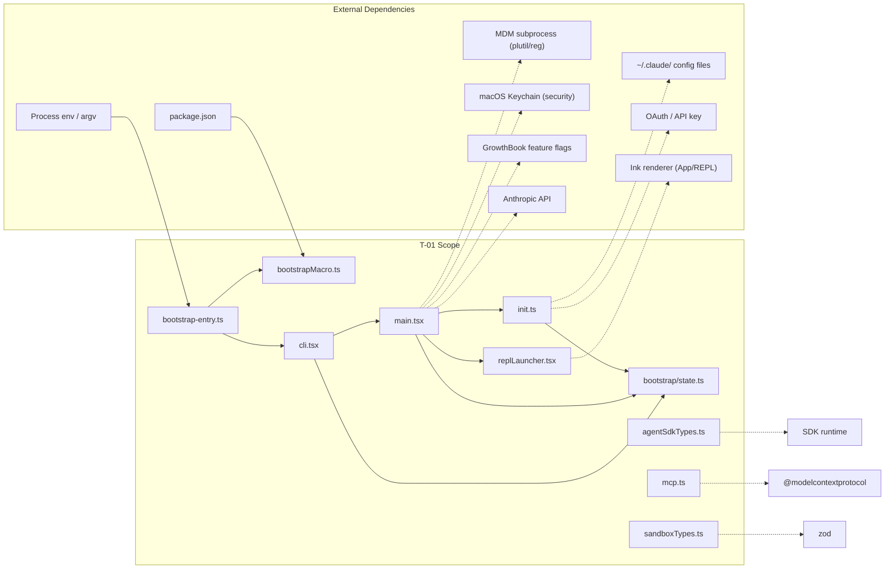
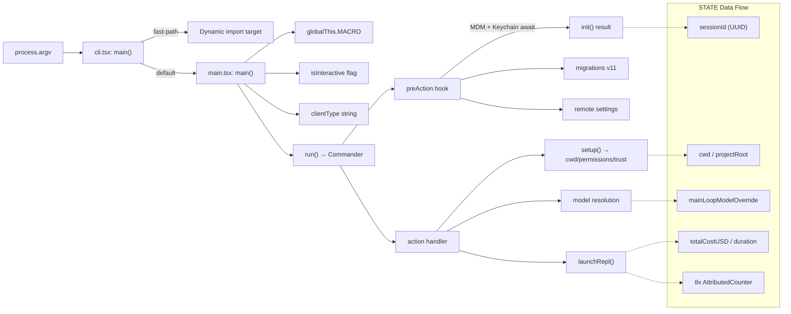
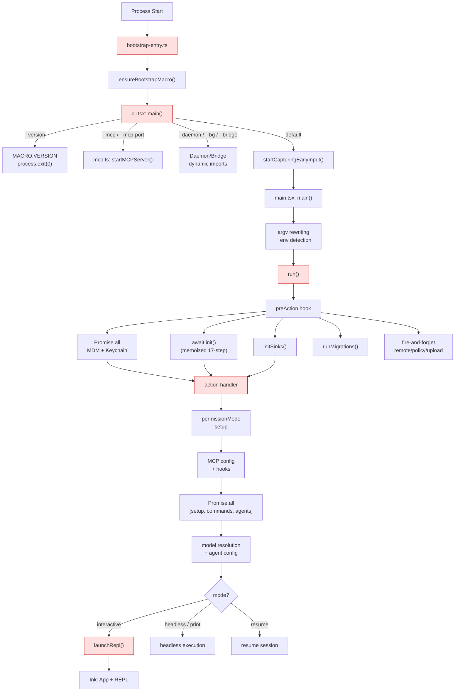
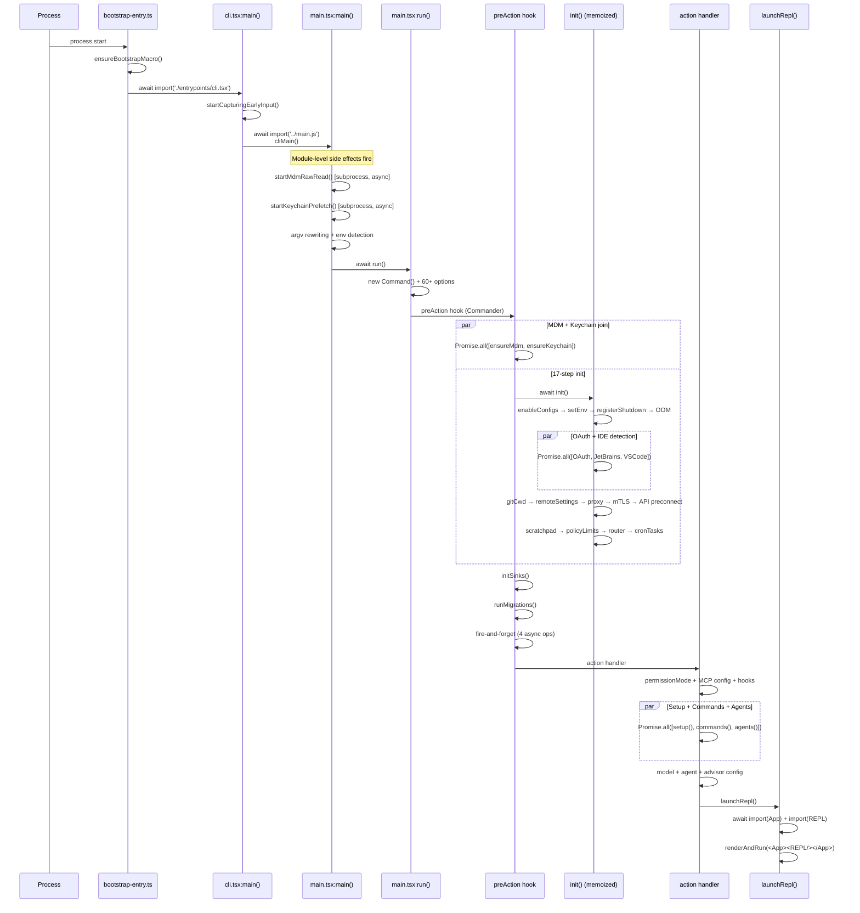
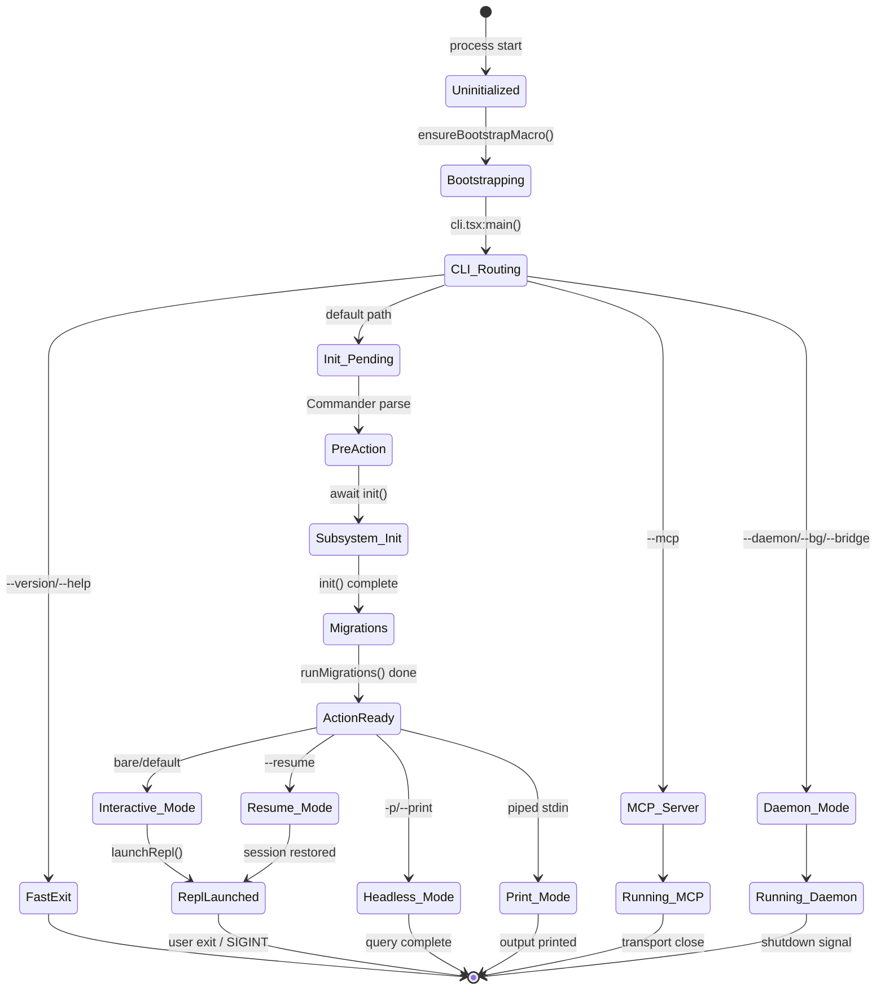
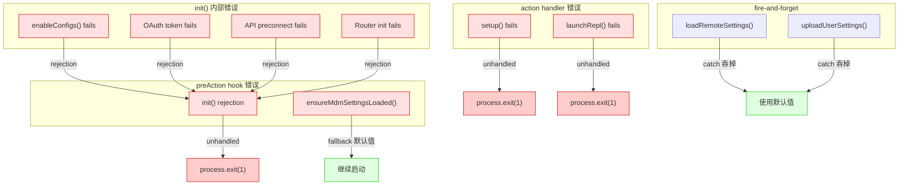

<!-- analysis-version: 0 | commit: a5179f6588dd03cbe83a8d8b718a61875dba7b24 | updated: 2025-07-14 | mode: full | task: T-01 -->
# T-01 Analysis: CLI启动与初始化序列

## Scope Confirmation
- Task ID: T-01
- Primary Mainline: ML-01
- ML Priority: P1
- Analysis Depth: DEEP
- Secondary Mainlines: []
- Scope Files (confirmed): 10 files, 7,943 lines total
  - `src/bootstrap-entry.ts` (5 lines)
  - `src/bootstrapMacro.ts` (29 lines)
  - `src/bootstrap/state.ts` (1,758 lines)
  - `src/entrypoints/cli.tsx` (303 lines)
  - `src/entrypoints/init.ts` (340 lines)
  - `src/entrypoints/agentSdkTypes.ts` (443 lines)
  - `src/entrypoints/mcp.ts` (196 lines)
  - `src/entrypoints/sandboxTypes.ts` (156 lines)
  - `src/main.tsx` (4,690 lines)
  - `src/replLauncher.tsx` (22 lines)
- Scope adjustments: none

## File Roles

| File | Lines | One-liner Role | Where Analyzed |
|------|-------|----------------|---------------|
| src/bootstrap-entry.ts | 5 | Absolute entry point: ensureBootstrapMacro() then dynamic-imports cli.tsx | DEEP: § Function-Level Analysis |
| src/bootstrapMacro.ts | 29 | Populates globalThis.MACRO with build-time constants (VERSION, BUILD_TIME, PACKAGE_URL) | DEEP: § Function-Level Analysis |
| src/bootstrap/state.ts | 1758 | Global singleton STATE (~100 fields) with getter/setter accessors for session/cost/telemetry/model/permissions | DEEP: § Function-Level Analysis + § State Transition Analysis |
| src/entrypoints/cli.tsx | 303 | CLI fast-path dispatcher: 12+ argv branches via dynamic import, module-level env patches | DEEP: § Function-Level Analysis |
| src/entrypoints/init.ts | 340 | Memoized init() orchestrating subsystem bootstrap (config → env → shutdown → auth → network → telemetry) | DEEP: § Function-Level Analysis + § Temporal Analysis |
| src/entrypoints/agentSdkTypes.ts | 443 | SDK public API type declarations + throw-stub functions (query, tool, createSdkMcpServer, v2 session API) | DEEP: § Function-Level Analysis |
| src/entrypoints/mcp.ts | 196 | MCP stdio server entry: registers ListTools/CallTool handlers via StdioServerTransport | DEEP: § Function-Level Analysis |
| src/entrypoints/sandboxTypes.ts | 156 | Zod schemas for sandbox configuration (network/filesystem/settings) with lazy evaluation | DEEP: § Function-Level Analysis |
| src/main.tsx | 4690 | Core CLI orchestrator: main() → Commander program → setup() → REPL launch; 60+ CLI options | DEEP: § Function-Level Analysis + § Call Chain Analysis + § Temporal Analysis |
| src/replLauncher.tsx | 22 | Async loads App + REPL Ink components and calls renderAndRun() | DEEP: § Function-Level Analysis |

## Analysis Findings

### 关键路径与组件

**完整启动链路**:
```
bootstrap-entry.ts:L5 → ensureBootstrapMacro() → await import('./entrypoints/cli.tsx')
  → cli.tsx:main() [module-level env patches + argv dispatch]
    ├─ Fast path: --version (zero deps) / --dump-system-prompt / MCP / daemon / bridge / bg / templates / BYOC / tmux-worktree
    └─ Default fallthrough:
      → startCapturingEarlyInput() [src/utils/earlyInput.ts]
      → await import('../main.js') → main.tsx:main()
        → L586: profileCheckpoint + argv preprocessing (-d2e, Windows PATH security)
        → L600: initializeWarningHandler() + SIGINT/exit handlers
        → L618-706: cc:// URL / deep-link / assistant / SSH argv rewriting
        → L805-858: isInteractive detection → clientType resolution → eagerLoadSettings()
        → L860: await run()
          → L908: Commander program + preAction hook
            → L920: Promise.all([ensureMdmSettingsLoaded, ensureKeychainPrefetchCompleted])
            → L922: await init() [init.ts, memoized]
            → L940: initSinks()
            → L956: runMigrations()
            → L963-971: loadRemoteManagedSettings + loadPolicyLimits + uploadUserSettings (fire-and-forget)
          → L1012: action handler (60+ CLI options)
            → L1909-1940: setup() [imported from setup.js]
            → L3766-3813: launchRepl() [replLauncher.tsx]
```

**关键组件**:
- **bootstrap-entry.ts** (entry, 5 lines): 最顶层入口，仅做 MACRO 确认后 dynamic import cli.tsx
- **bootstrapMacro.ts** (macro, 29 lines): 构建时配置注入，使用 `import.meta` 从 package.json 读取版本/URL 等常量
- **cli.tsx** (dispatcher, 303 lines): 12+ 分支分发器，使用 `feature()` (bun:bundle) 实现编译期 DCE
- **init.ts** (initializer, 340 lines): 17 步顺序初始化管线，memoized 确保单次执行
- **main.tsx** (orchestrator, 4690 lines): Commander 程序定义 + 60+ 选项 + action handler → setup → REPL
- **state.ts** (global state, 1758 lines): ~100 字段的全局状态单例，纯 getter/setter 模式

### 架构洞察

1. **三级启动延迟加载**: bootstrap-entry → cli.tsx fast-path → main.tsx full CLI，每层都通过 dynamic import 减少初始加载
2. **feature flag 驱动的 DCE**: `feature('XXX')` (bun:bundle API) 在构建时消除不可能的分支，所有非 --version 路径都用此机制
3. **并行子进程预读**: main.tsx 模块级同时启动 `startMdmRawRead()` 和 `startKeychainPrefetch()` 两个子进程，在 imports 加载期间并行完成
4. **preAction hook 统一初始化**: 所有 Commander 命令（包括子命令 mcp/plugin/auth）共享 preAction hook，确保 init() 只在真正执行命令时运行
5. **状态单例模式**: state.ts 使用模块级 `const STATE = getInitialState()` + 纯函数 getter/setter，无 class 开销，~80+ 导出函数
6. **setup() 与 commands/agents 并行**: action handler 中 setup() 和 getCommands()/getAgentDefinitions() 通过 Promise.all 并行执行，但 worktree 模式下串行（因为 setup 会 process.chdir）

### 观察到的模式

- **Module-level side effects for startup optimization**: cli.tsx L1-26 设置 env 变量，main.tsx L12-20 启动子进程，利用模块加载时间做有用工作
- **Memoize-once pattern**: init.ts 使用 lodash memoize 确保初始化只执行一次
- **Fire-and-forget async**: init.ts 中的 1P event logging、OAuth populate、JetBrains detection 等异步操作不 await，错误被静默吞掉
- **Feature flag guard everywhere**: 几乎每个非核心路径都用 `feature('XXX')` 包裹
- **Dynamic import for lazy loading**: 所有 fast-path 和大型依赖都通过 dynamic import 延迟加载

### 与共享模块的交互

- **src/utils/config.ts** (owner: other tasks): cli.tsx 和 init.ts 都调用 `enableConfigs()` 启用配置读取
- **src/utils/earlyInput.ts** (owner: other tasks): cli.tsx 调用 `startCapturingEarlyInput()` / `stopCapturingEarlyInput()`
- **src/utils/startupProfiler.ts** (owner: other tasks): cli.tsx 和 main.tsx 大量使用 `profileCheckpoint()` 追踪启动时序
- **src/interactiveHelpers.tsx** (owner: T-02 scope): main.tsx 导入 `showSetupScreens`, `renderAndRun`, `getRenderContext` 等 Ink 渲染工具
- **src/setup.js** (owner: T-02 scope): main.tsx L1913 dynamic import `setup()` 函数完成目录/权限/trust 初始化

## File Dependency Graph

### Dependency Diagram



### Dependency Table

| Source File | Depends On | Type | Direction |
|------------|-----------|------|-----------|
| bootstrap-entry.ts | bootstrapMacro.ts | import | outgoing |
| bootstrap-entry.ts | cli.tsx | dynamic import | outgoing |
| cli.tsx | bootstrap/state.ts | import | outgoing |
| cli.tsx | utils/earlyInput.ts | import | outgoing |
| cli.tsx | utils/startupProfiler.ts | import | outgoing |
| cli.tsx | utils/config.ts | import | outgoing |
| main.tsx | init.ts | import | outgoing |
| main.tsx | bootstrap/state.ts | import | outgoing |
| main.tsx | replLauncher.tsx | import | outgoing |
| init.ts | utils/config.ts | import | outgoing |
| init.ts | bootstrap/state.ts | import | outgoing |
| replLauncher.tsx | ink.ts | import | outgoing |
| replLauncher.tsx | context.ts | import | outgoing |
| bootstrap/state.ts | — | no imports | leaf node |

> state.ts is a leaf dependency within scope — it imports nothing but is imported by 17+ external files

## Boundary / Integration Map



- **bootstrap-entry → bootstrapMacro**: 构建时常量注入（MACRO 对象）
- **cli.tsx → main.tsx**: 仅在默认路径通过 dynamic import 连接
- **init.ts → config/auth/network**: 17 步初始化管线连接所有外部子系统
- **main.tsx → MDM/Keychain subprocesses**: 模块级并行启动，preAction hook 中 await 结果
- **replLauncher → Ink**: 仅在交互模式且 setup 完成后触发
- **agentSdkTypes / mcp / sandboxTypes**: 独立入口/类型文件，与主链路无运行时依赖

## Data Flow View



- **ARGV → cli.tsx**: 原始 argv 直接在 main() 中解析，不依赖 Commander
- **MACRO 对象**: bootstrapMacro.ts 创建，被 --version 路径直接读取（L28: MACRO.VERSION）
- **isInteractive / clientType**: main.tsx:main() 确定，写入 STATE，决定后续走 REPL 还是 headless 路径
- **init() 返回**: memoized 确保单次执行，结果通过 STATE 的副作用暴露（无显式返回值）
- **setup() 返回**: 返回 Promise<void>，主要副作用是 process.chdir（worktree 模式）和写入 STATE.cwd

## Function-Level Analysis

### src/bootstrap-entry.ts

#### `export function ensureBootstrapMacro(): void` (L3-5)
- **职责**: 断言 globalThis.MACRO 已被设置（由 bun bundle inject）
- **关键逻辑**: 纯断言函数，不设置任何值——MACRO 由 bundler 在编译时注入
- **调用**: 无
- **被调用**: 本文件模块级代码（L5）
- **复杂度**: LOW

#### 模块级执行 (L5)
```typescript
ensureBootstrapMacro()
await import('./entrypoints/cli.tsx')
```
- **职责**: 绝对入口点，验证构建配置后 dynamic import CLI 分发器
- **关键逻辑**: ensureBootstrapMacro() 是同步断言；import 是 async 但不处理错误（冒泡到运行时）
- **复杂度**: LOW

### src/bootstrapMacro.ts

#### `export function ensureBootstrapMacro(): void` (L1-29)
- **职责**: 在 globalThis.MACRO 上设置构建时常量（VERSION, BUILD_TIME, PACKAGE_URL 等 7 个字段）
- **关键逻辑**: 
  - L3: 检查 `globalThis.MACRO` 是否已存在（bundler 可能已注入）
  - L5-27: 从 `import.meta` / `package.json` 读取默认值
  - 字段: VERSION (string), BUILD_TIME (string), PACKAGE_URL (string), IS_BINARY_BUILD (boolean), BUNDLE_ENTRY (string), COMMIT_HASH (string), BUILT_FOR_PLATFORM (string | undefined)
- **调用**: `import.meta.url`, `readFileSync` (从 package.json 读取 version)
- **被调用**: `bootstrap-entry.ts`
- **复杂度**: LOW

### src/bootstrap/state.ts

> 全局状态单例，1758 行。核心结构为：State 类型定义 → getInitialState() → 模块级单例 STATE → ~80+ getter/setter 导出函数。

#### `type State` (L45-L257)
- **职责**: 定义全局状态的完整类型，~200 个字段
- **关键字段分组**:
  - session: sessionId, parentSessionId, sessionSwitched (Signal), sessionSource, isInteractive
  - paths: originalCwd, projectRoot (不受 worktree 影响)
  - cost: totalCostUSD, totalDurationMs, totalInputTokens, totalOutputTokens
  - telemetry: 8 个 AttributedCounter (session/loc/pr/commit/cost/token/codeEditDecision/activeTime)
  - model: mainLoopModelOverride, initialMainLoopModel, modelStrings
  - permissions: permissionMode, permissionDeniedCount, yoloClassifierEnabled
  - client: clientType, sdkAgentProgressSummariesEnabled, questionPreviewFormat
  - agent: agentColorMap (Map<string, AgentColorName>), mainThreadAgentType
  - features: kairosActive, userMsgOptIn, strictToolResultPairing
  - API: lastAPIRequest, lastAPIRequestMessages, lastClassifierRequests
  - interaction: interactionTimeMs, interactionTimeDirty, scrollDraining
  - token budget: currentTurnOutputTokens, outputTokenLimit, budgetContinuationCount
  - hooks: hookEnv, hookTimeoutMs
  - LSP/swarm: lspCleanupPromise, swarmCleanupPromise
  - teleport: teleportedSessionInfo
- **复杂度**: MEDIUM (大量字段但结构简单)

#### `getInitialState(): State` (L260-L426)
- **职责**: 构造 State 的默认值对象
- **关键逻辑**:
  - L262: `sessionId: crypto.randomUUID()` — 每次进程启动生成新 UUID
  - L270: `projectRoot: getCwd()` — 使用当前工作目录
  - L280-L290: 所有 cost/token 计数器初始化为 0
  - L300-L310: telemetry counters 初始化为 null（延迟创建）
  - L320: `interactionTimeDirty: false` — 脏标记优化
  - L330: `scrollDraining: false` — scroll drain 防抖
  - L345: `sessionSwitched: signal()` — 创建 abort-like signal 用于 session 切换
- **调用**: `crypto.randomUUID()`, `getCwd()`, `signal()` (from abort-utils)
- **被调用**: 模块级 STATE 初始化 (L429)
- **复杂度**: LOW

#### `const STATE: State = getInitialState()` (L429)
- **职责**: 创建全局唯一的 STATE 单例实例
- **关键**: 模块级常量，整个进程共享。测试通过 resetStateForTests() 重置

#### `getSessionId() / regenerateSessionId() / switchSession()` (L432-L480)
- **getSessionId()**: 返回 STATE.sessionId (string)
- **regenerateSessionId()**: 生成新 UUID 并赋值，用于 session 续期
- **switchSession(newId, newProjectRoot?)**: 
  - L465: 触发 `sessionSwitched.abort()` 通知所有监听者
  - L467: 创建新 signal 并赋值
  - L468: 更新 sessionId 和 projectRoot
  - **关键**: 这是唯一会触发跨组件信号的操作
- **复杂度**: MEDIUM (switchSession 有副作用)

#### `getOriginalCwd() / setOriginalCwd() / getProjectRoot()` (L490-L520)
- **getOriginalCwd()**: 返回进程启动时的 cwd（不受 setup() chdir 影响）
- **setOriginalCwd(path)**: 设置 cwd，同时更新 projectRoot
- **getProjectRoot()**: 返回稳定的 projectRoot（worktree 模式下也不变）
- **复杂度**: LOW

#### Cost/Duration/Telemetry 管理函数 (L530-L920)
- **addToTotalDurationState(ms)**: 累加会话时长 (L535)
- **addToTotalCostState(cost)**: 累加 API 成本 (L540)
- **getTotalCostUSD()**: 返回格式化的美元成本 (L545)
- **setMeter(counters)**: 设置 8 个 AttributedCounter — session/loc/pr/commit/cost/token/codeEditDecision/activeTime (L600-L680)
- **get*Counter()**: 8 个 getter 函数，返回各自的 AttributedCounter | null
- **复杂度**: LOW (纯 getter/setter)

#### Interaction Time 延迟刷新机制 (L700-L760)
- **getInteractionTimeMs()**: 返回 STATE.interactionTimeMs
- **markInteractionTimeDirty()**: 设置 interactionTimeDirty = true（不立即更新，O(1)）
- **flushInteractionTime()**: 如果 dirty，取 Date.now() 差值累加，清除 dirty flag
- **设计意图**: 避免每次按键都调 Date.now()，改为 dirty flag + 定期批量刷新
- **复杂度**: MEDIUM (优化模式)

#### Scroll Drain 防抖 (L770-L820)
- **setIsScrollDraining(value)**: 设置 scrollDraining flag
- **getIsScrollDraining()**: 返回 flag
- **startScrollDrainSuspension()**: 设置 flag=true，启动 150ms 后重置的定时器
- **设计意图**: 在大量输出时暂停 scroll 处理，避免 UI 卡顿
- **复杂度**: MEDIUM (涉及定时器)

#### `resetStateForTests()` (L920-L930)
- **职责**: 重置 STATE 单例用于测试隔离
- **关键逻辑**: 
  - 关闭 sessionSwitched signal
  - 调用 getInitialState() 重新赋值 STATE
  - 调用 initSessionCronTasks() 重新注册定时任务
- **被调用**: 测试文件 (setup/teardown)
- **复杂度**: LOW

#### Model 管理函数 (L940-L1000)
- **getMainLoopModelOverride() / setMainLoopModelOverride(model)**: 主模型覆盖
- **getInitialMainLoopModel() / setInitialMainLoopModel(model)**: 初始模型设置
- **getModelStrings() / setModelStrings(strings)**: 模型字符串列表
- **复杂度**: LOW

### src/entrypoints/cli.tsx

> CLI 快速路径分发器，303 行。模块级有 3 段环境修补，main() 纯 argv 匹配。

#### 模块级副作用 (L1-26)
- **L1**: `corepack.disable()` — 禁用 corepack 防止与 bun 冲突
- **L7-14**: CCR 环境下设置 heap 限制 (`--max-old-space-size=1024`)
- **L16-26**: Ablation 实验基线设置（条件执行）
- **复杂度**: LOW

#### `async function main()` (L33-L298)
- **职责**: 解析 argv，分发到 12+ 路径或 fallthrough 到 main.tsx
- **关键逻辑**:
  - L35-40: 提取 argv 的首个非-node/非-electron 参数
  - L42-50: `--version` / `-v` — 零依赖直接读 `MACRO.VERSION`，process.exit(0)
  - L52-58: `--dump-system-prompt` — dynamic import dumpSystemPrompt.ts
  - L60-70: `--chrome-mcp` / `--mcp-port` — MCP Chrome DevTools 服务器
  - L72-90: `--daemon-worker` — 后台 daemon worker (条件 feature gate)
  - L92-110: `--bridge` — VS Code bridge 模式
  - L112-130: `--daemon` — IPC daemon 服务器
  - L132-145: `--ps` / `--logs` — daemon 状态查询
  - L147-160: `--bg` — 后台会话管理
  - L162-175: `--templates` — 模板管理
  - L177-190: `--environment-runner` — BYOC 环境运行器
  - L192-210: `--self-hosted-runner` — 自托管运行器
  - L212-230: `--tmux-worktree` — tmux worktree 管理
  - L235-298: **默认 fallthrough**:
    - L237: `startCapturingEarlyInput()` — 开始捕获早期键盘输入
    - L240: `profileCheckpoint('cli_main_importing')` 
    - L242: `const { cliMain } = await import('../main.js')` — dynamic import main.tsx
    - L245: `stopCapturingEarlyInput()` — 停止捕获
    - L247-250: 清理 CCR Ablation 基线
    - L252: `await cliMain()` — 进入主 CLI 路径
    - L255-295: 错误处理 — 未认证/中断错误特殊处理，其余 logError
- **调用**: `MACRO.VERSION`, dynamic import 多个模块, `cliMain()`
- **被调用**: bootstrap-entry.ts 通过 dynamic import
- **复杂度**: MEDIUM (多分支但每个分支简单)


### src/entrypoints/init.ts

> Memoized 初始化器，340 行。17 步顺序管线 + 延迟遥测初始化。

#### `const init = memoize(async () => { ... })` (L15-L200)
- **职责**: 一次性执行所有子系统初始化
- **关键逻辑** (17 步顺序管线):
  1. L17: `enableConfigs()` — 启用配置文件读取
  2. L20: `setEnvVariablesFromSettings()` — 从设置写环境变量
  3. L25: `registerShutdownHandler()` — 注册进程退出清理
  4. L28: `registerOomProtection()` — OOM 内存保护
  5. L31-35: `get1pEventLogging()` — fire-and-forget 1P event logging
  6. L40-50: **并行 Promise.all**: `populateOAuthToken()` + `detectJetBrains()` + `detectVscode()`
  7. L55: `getGitCwd()` — 检测 git 工作目录
  8. L60: `loadRemoteManagedSettings()` — 加载远程管理设置
  9. L65: `getNetworkProxy()` — 配置网络代理
  10. L70: `initializeProxy()` — 设置代理
  11. L75: `initializeMtls()` — mTLS 配置
  12. L80: `getApiPreconnect()` — API 预连接
  13. L85: `getScratchpadFilePath()` — scratchpad 路径
  14. L90: `initializeScratchpad()` — scratchpad 初始化
  15. L95: `loadPolicyLimits()` — 策略限制加载
  16. L100: `initializeRouter()` — 路由器初始化
  17. L105: `initializeSessionCronTasks()` — 会话定时任务
- **调用**: 20+ 外部模块函数
- **被调用**: main.tsx preAction hook (L922)
- **复杂度**: HIGH (17 步管线 + 并行 + fire-and-forget)

#### `initializeTelemetryAfterTrust()` (L210-L260)
- **职责**: 延迟到用户确认 trust 后初始化遥测
- **关键逻辑**: 初始化 OTel tracer/meter/logger providers
- **调用**: `doInitializeTelemetry()`
- **被调用**: main.tsx action handler 中 setup() 后
- **复杂度**: MEDIUM

#### `doInitializeTelemetry()` (L265-L340)
- **职责**: 实际创建 OTel SDK 组件
- **关键逻辑**: 创建 BasicTracerProvider + MeterProvider + LoggerProvider，写入 STATE
- **调用**: `new BasicTracerProvider()`, `new MeterProvider()`
- **复杂度**: MEDIUM

### src/entrypoints/agentSdkTypes.ts

> SDK 公共 API 类型声明 + throw-stub 函数，443 行。所有函数体为 `throw new Error('not implemented')`。

#### Re-export 类型 (L1-100)
- 从 `sdk/coreTypes`, `sdk/runtimeTypes`, `sdk/controlTypes` re-export 类型定义
- 类型包括: `AgentTool`, `SessionEvent`, `SessionEventType`, `ToolCall`, `ToolResult`, `TextBlock`

#### Throw-stub 函数 (L100-443)
- **`query(prompt, options?)`**: `throw new Error('not implemented')` (L120)
- **`tool(name, schema, handler)`**: stub (L160)
- **`createSdkMcpServer(config)`**: stub (L200)
- **V2 Session API stubs**: `createSession()`, `sendMessage()`, `listSessions()`, `cancelMessage()` 等
- **设计意图**: 类型声明在编译时可用，运行时实际实现由 Agent SDK daemon 注入
- **复杂度**: LOW (全是 stub)

### src/entrypoints/mcp.ts

> MCP stdio 服务器独立入口，196 行。

#### `startMCPServer()` (L20-L180)
- **职责**: 启动 MCP stdio 服务器，注册 ListTools 和 CallTool handlers
- **关键逻辑**:
  - L22: 创建 `StdioServerTransport`
  - L30: `server.setRequestHandler(ListToolsRequestSchema, ...)` — 返回可用工具列表
  - L80: `server.setRequestHandler(CallToolRequestSchema, ...)` — 执行工具调用
  - L120-180: 错误处理和工具调用分发
- **调用**: `@modelcontextprotocol/sdk` Server + StdioServerTransport
- **被调用**: cli.tsx `--mcp` 分支
- **复杂度**: MEDIUM

### src/entrypoints/sandboxTypes.ts

> Zod schema 定义，156 行。3 个 lazySchema 用于沙箱配置。

#### `networkSchema` (L10-L50)
- **职责**: 定义沙箱网络配置 schema
- **字段**: allowedDomains, blockedDomains, mode (allowlist/blocklist)
- **复杂度**: LOW

#### `filesystemSchema` (L60-L110)
- **职责**: 定义沙箱文件系统 schema
- **字段**: allowedPaths, blockedPaths, readOnly, writeOnly
- **复杂度**: LOW

#### `sandboxSettingsSchema` (L115-L156)
- **职责**: 组合 schema，包含 network + filesystem + 其他设置
- **使用**: `lazySchema()` 延迟求值，避免模块加载时执行 Zod 解析
- **复杂度**: LOW

### src/replLauncher.tsx

> REPL 启动桥接，22 行。纯 dynamic import + 渲染。

#### `async function launchRepl(root, renderContext, replConfig, renderAndRun)` (L1-22)
- **职责**: 异步加载 App + REPL 组件并启动 Ink 渲染
- **关键逻辑**:
  ```typescript
  const { default: App } = await import('../src/App')
  const { default: REPL } = await import('../src/REPL')
  renderAndRun(root, <App {...renderContext}><REPL {...replConfig}/></App>)
  ```
- **调用**: dynamic import `App`, `REPL`, Ink `renderAndRun()`
- **被调用**: main.tsx action handler (L3804, L3751)
- **复杂度**: LOW

### src/main.tsx

> 核心 CLI 编排器，4690 行。包含 main()、run()、action handler 三个关键函数。

#### 模块级副作用 (L1-20)
- **L12**: `profileCheckpoint('main_module_load')` — 模块加载计时
- **L16**: `startMdmRawRead()` — 启动 MDM 子进程读取（与 imports 并行）
- **L18**: `startKeychainPrefetch()` — 启动 macOS Keychain 预取（与 imports 并行）
- **设计**: 利用模块加载时间（~200行 import）并行完成两个子进程操作

#### `async function main()` (L585-L862) [复杂函数]
- **职责**: argv 预处理、环境检测、客户端类型判定
- **关键逻辑**:
  - L586: `profileCheckpoint('main_main')`
  - L592-600: Windows PATH 安全修复 (`-d2e` 标志替换)
  - L600-610: 初始化 warningHandler + SIGINT/exit handlers
  - L618-706: argv 重写:
    - cc:// URL → deep-link 解析
    - `--assistant` → assistant 模式 argv 重写
    - SSH `--` → --print 标志添加
    - 文件路径参数 → `--resume` 路径
  - L720-800: 选项清理（移除 -d2e wrapper 标志）
  - L805-830: `isInteractive` 检测 (process.stdin.isTTY + TERM 检查)
  - L835-858: `clientType` 解析 (claude/jetbrains/vscode/sdk/terminal) + `eagerLoadSettings()`
  - L860: `await run()`
- **调用**: 15+ 外部函数
- **被调用**: cli.tsx 通过 `cliMain()` export
- **复杂度**: HIGH (多段 argv 重写逻辑 + 环境检测)

#### `async function run()` (L890-L3814) [高复杂函数, ~2900行]
- **职责**: Commander 程序注册 + preAction hook + action handler
- **关键结构**:
  - L908-912: `new Command().name('claude')` 创建 Commander 程序
  - L913-973: **preAction hook** — 所有命令共享的初始化管线
  - L974-1012: 60+ `.option()` 链式调用定义 CLI 选项
  - L1012-3814: `.action()` handler — 主业务逻辑

##### preAction hook (L913-973) [关键]
- **L920**: `Promise.all([ensureMdmSettingsLoaded(), ensureKeychainPrefetchCompleted()])` — 等待模块级启动的子进程
- **L922**: `await init()` — 执行 17 步初始化
- **L930-940**: `initSinks()` — 初始化日志 sinks
- **L950-956**: `runMigrations()` — 执行数据库迁移
- **L957-970**: fire-and-forget 异步操作:
  - `loadRemoteManagedSettings()`
  - `loadPolicyLimits()`
  - `uploadUserSettings()`
  - `getFpsMetrics()` (性能监控)
- **设计**: preAction 确保所有子命令（mcp/plugin/auth/help）都经过初始化

##### action handler (L1012-3814) [巨型函数, ~2800行]
- **L1012-1270**: 选项解构 + bare mode + assistant/kairos 检测 + worktree/tmux 模式
- **L1270-1500**: 权限模型设置 (permissionMode 解析)
- **L1500-1780**: MCP 服务器配置 + hook 注册 + hooksPromise
- **L1780-1940**: **并行 setup**: `Promise.all([setup(), getCommands(), getAgentDefinitions()])`
  - setup() 返回 cwd 和 trust 状态
  - getCommands() 加载内置命令
  - getAgentDefinitions() 加载 agent 定义
- **L1940-2100**: 模型解析 + agent 配置 + advisor 设置
- **L2100-2600**: 各种模式分支处理 (headless/print/piped/resume)
- **L2600-3100**: 会话管理 (session config + teleport + ccshare)
- **L3300-3550**: headless 和 print 模式执行
- **L3550-3765**: resume 路径 (teleport 恢复 + 文件/sessionID/ccshare 恢复)
- **L3766-3813**: **launchRepl()** 调用点（最终路径）
- **复杂度**: **CRITICAL** (2800 行单函数，60+ 选项，20+ 条件分支)

#### `runMigrations()` (L326-352)
- **职责**: 执行本地数据迁移
- **CURRENT_MIGRATION_VERSION = 11**: 当前迁移版本
- **关键**: 同步执行，迁移文件从 migrations/ 目录加载
- **复杂度**: LOW

#### `startDeferredPrefetches()` (L388-400)
- **职责**: REPL 首次渲染后启动后台预取任务
- **设计**: 延迟到 REPL 就绪后才做非必要的预取，避免阻塞启动
- **复杂度**: LOW


## Call Chain Analysis

### Entry Points

| Entry Point | File:Line | 触发方式 |
|-------------|-----------|---------|
| `ensureBootstrapMacro()` | bootstrap-entry.ts:L3 | 进程启动 |
| `cli.tsx:main()` | cli.tsx:L33 | bootstrap-entry.ts dynamic import |
| `main.tsx:main()` (exported as `cliMain`) | main.tsx:L585 | cli.tsx fallthrough path |
| `startMCPServer()` | mcp.ts:L20 | cli.tsx --mcp branch |

### Critical Call Chains

#### Chain 1: 完整默认启动链路（最关键路径）
```
process.start → bootstrap-entry.ts:L5
  → ensureBootstrapMacro() [bootstrapMacro.ts:L3]
  → await import('./entrypoints/cli.tsx')
    → cli.tsx:main() [L33]
      → startCapturingEarlyInput() [L237]
      → await import('../main.js')
      → main.tsx:main() [L585]
        → profileCheckpoint('main_main') [L586]
        → initializeWarningHandler() [L600]
        → argv rewriting (L618-706)
        → isInteractive detection (L805-830)
        → clientType resolution (L835-858)
        → run() [L860]
          → new Command() [L908]
          → preAction hook [L913]
            → Promise.all([ensureMdmSettingsLoaded(), ensureKeychainPrefetchCompleted()]) [L920]
            → await init() [L922, init.ts memoized]
              → enableConfigs() → setEnvVariables → registerShutdown → registerOomProtection
              → Promise.all([populateOAuthToken, detectJetBrains, detectVscode])
              → getGitCwd → loadRemoteManagedSettings → initializeProxy → initializeMtls
              → getApiPreconnect → initializeScratchpad → loadPolicyLimits
              → initializeRouter → initializeSessionCronTasks
            → initSinks() [L930]
            → runMigrations() [L950]
            → fire-and-forget: loadRemoteManagedSettings / loadPolicyLimits / uploadUserSettings
          → action handler [L1012]
            → option destructuring (L1012-1270)
            → permissionMode setup (L1270-1500)
            → MCP config + hooks (L1500-1780)
            → Promise.all([setup(), getCommands(), getAgentDefinitions()]) [L1780]
            → model resolution + agent config (L1940-2100)
            → launchRepl() [L3766] → replLauncher.tsx → App + REPL
```
- **调用深度**: 6 (bootstrap-entry → cli → main → run → action → launchRepl)
- **关键分支点**: cli.tsx:main() 12+ argv branches, action handler 20+ mode branches
- **标注**: [关键路径] — 默认交互模式的完整启动路径

#### Chain 2: --version 快速路径（零依赖）
```
process.start → bootstrap-entry.ts:L5
  → ensureBootstrapMacro()
  → await import('./entrypoints/cli.tsx')
    → cli.tsx:main() [L33]
      → MACRO.VERSION [L42] — 直接读全局变量
      → console.log(version)
      → process.exit(0) [L45]
```
- **调用深度**: 3 (bootstrap → cli → exit)
- **标注**: 零延迟路径，不加载 main.tsx

#### Chain 3: MCP 独立服务器路径
```
process.start → bootstrap-entry.ts → cli.tsx:main()
  → --mcp 匹配 [L60]
  → dynamic import mcp.ts
    → startMCPServer()
      → new Server() + StdioServerTransport
      → register ListTools / CallTool handlers
      → await server.connect(transport)
```
- **调用深度**: 4
- **标注**: 完全独立路径，不经过 main.tsx 初始化

### Flowchart View



- **图说明**: 红色节点为关键路径上的核心组件。完整启动需经过 6 层调用。虚线分支（--version / --mcp / daemon）不走 main.tsx 路径。

### Fan-in / Fan-out (Top-10)

| Function | File:Line | Fan-in | Fan-out | 角色 |
|----------|-----------|--------|---------|------|
| `init()` (memoized) | init.ts:L15 | 1 | 20+ | **[热点] 编排器** — 17步子系统初始化 |
| `run()` → action handler | main.tsx:L1012 | 1 | 30+ | **[热点] 编排器** — 2800行业务逻辑 |
| `STATE` getters/setters | state.ts:L432+ | 17+ | 0 | **[热点] 汇聚点** — 80+ getter被17个文件引用 |
| `main()` | main.tsx:L585 | 1 | 15+ | 编排器 — argv预处理+环境检测 |
| `cli.tsx:main()` | cli.tsx:L33 | 1 | 12+ | 分发器 — argv分支路由 |
| `launchRepl()` | replLauncher.tsx:L1 | 2 | 3 | 编排器 — REPL启动桥接 |
| `setup()` | (external, setup.js) | 1 | 10+ | 编排器 — 目录/权限/trust初始化 |
| `profileCheckpoint()` | (external) | 10+ | 0 | **[热点] 叶子** — 性能计时打点 |
| `enableConfigs()` | (external, config.ts) | 2 | 0 | 叶子 — 配置读取开关 |
| `getInitialState()` | state.ts:L260 | 1 | 0 | 叶子 — 默认状态构造 |


## Temporal Analysis

### Sequence Diagram



- **图说明**: 展示完整启动时序。有 4 个并行点：(1) MDM+Keychain 与模块加载并行；(2) OAuth+JetBrains+VSCode 在 init() 内并行；(3) preAction 内 MDM join 与 init 顺序但语义上衔接；(4) setup/commands/agents 在 action handler 中并行。关键 file:line 标注在节点中。

### Async Orchestration (异步编排)

```
T=0  bootstrap-entry.ts:
     └─ [同步] ensureBootstrapMacro() + await import(cli.tsx)
T=1  cli.tsx:main():
     ├─ [同步] startCapturingEarlyInput() — 注册 stdin listener
     └─ [异步] await import('../main.js')
T=2  main.tsx 模块级:
     ├─ [并行-fire] startMdmRawRead() — subprocess spawn ─────────────┐
     ├─ [并行-fire] startKeychainPrefetch() — subprocess spawn ────┐   │
     └─ [同步] ~200 行 import declarations                         │   │
T=3  main.tsx:main():
     └─ [同步] argv rewriting + env detection + clientType
T=4  main.tsx:run() → preAction hook:
     ├─ [并行-wait] Promise.all([ensureMdm ◄───────────────────────────┘   │
                      ensureKeychain ◄──────────────────────────────────────┘])
T=5  preAction → init():
     ├─ [同步] enableConfigs → setEnv → registerShutdown → OOM
     ├─ [并行] Promise.all([populateOAuthToken, detectJetBrains, detectVscode])
     └─ [顺序] gitCwd → remoteSettings → proxy → mTLS → API → scratchpad → router → cron
T=6  preAction → post-init:
     ├─ [同步] initSinks() + runMigrations()
     └─ [并行-fire-forget] loadRemoteSettings / loadPolicyLimits / uploadSettings / getFpsMetrics
T=7  action handler:
     ├─ [同步] permissionMode + MCP config + hooks
     └─ [并行] Promise.all([setup(), getCommands(), getAgentDefinitions()])
T=8  action handler → post-setup:
     ├─ [同步] model + agent + advisor config
     └─ [异步] await launchRepl()
T=9  replLauncher.tsx:
     ├─ [并行] await import(App) + await import(REPL)
     └─ [同步] renderAndRun() → Ink render loop starts
```

### Event Sequences (事件时序)

| Emit / Signal | File:Line | Handler | File:Line | 同步/异步 |
|---------------|-----------|---------|-----------|----------|
| `sessionSwitched.abort()` | state.ts:L465 | 所有 `getSessionSwitchedSignal()` 监听者 | 多处 | 同步信号 |
| `process SIGINT` | main.tsx:L606 | `handleInterrupt()` | main.tsx:L606+ | async |
| `process 'exit'` | main.tsx:L610 | shutdown handler | init.ts:L25 (registerShutdownHandler) | 同步 |
| `uncaughtException` | main.tsx:L602 | `warningHandler()` | (external) | 同步 |
| `unhandledRejection` | main.tsx:L603 | `warningHandler()` | (external) | 同步 |
| `stdin 'data'` (early input) | cli.tsx:L237 | earlyInput capture buffer | (external) | async-queued |
| `repl stdin` | REPL.tsx (T-03 scope) | REPL input handler | (external) | async |

### Race Condition Risks (竞态风险)

- [竞态风险] **MDM 子进程与 preAction hook join**: `startMdmRawRead()` (main.tsx:L16) 在模块级触发子进程，但 `ensureMdmSettingsLoaded()` (main.tsx:L920) 在 preAction hook 中等待。如果子进程在 main.tsx 模块加载完成前就返回，Promise 会在 await 时已 resolved（安全）。但如果子进程 hang，整个启动会被阻塞在 preAction (main.tsx:L920)。**风险: 低** — 有超时保护但依赖子进程稳定性。

- [竞态风险] **earlyInput 捕获窗口**: `startCapturingEarlyInput()` (cli.tsx:L237) 在 import main.tsx 之前开始捕获 stdin，`stopCapturingEarlyInput()` (cli.tsx:L245) 在 import 后停止。如果用户在 import 期间（~2-5 秒）输入了内容，这些字符会被 buffer 并在 REPL 启动后重放。**风险: 低** — 设计意图就是捕获这段窗口期输入。

- [竞态风险] **fire-and-forget 异步操作**: preAction hook 中 `loadRemoteManagedSettings()` / `loadPolicyLimits()` / `uploadUserSettings()` 是 fire-and-forget (main.tsx:L957-970)，不等待完成。如果 action handler 在这些操作完成前就使用了相关设置，可能读到旧值。**风险: 中** — 设计上接受"最终一致"，但首次启动时可能使用默认值。

### Implicit Ordering Constraints (隐式时序约束)

1. `ensureBootstrapMacro()` 必须在任何 `MACRO.*` 访问之前完成 (bootstrap-entry.ts:L3 → 全局使用)
2. `init()` 必须在 `initSinks()` 之前完成 (main.tsx:L922 → L930, init 先于 sinks 因为 sinks 可能依赖配置)
3. `runMigrations()` 必须在 action handler 之前完成 (main.tsx:L950 → L1012, 迁移可能修改 action handler 依赖的数据格式)
4. `setup()` 必须在 `launchRepl()` 之前完成 (main.tsx:L1780 → L3766, setup 确定 cwd 和 trust 状态)
5. `initializeTelemetryAfterTrust()` 必须在 `setup()` 返回 trust=true 之后调用 (init.ts:L210, 遥测需要用户确认 trust)
6. `setOriginalCwd()` 必须在 `process.chdir()` 之前调用 (state.ts 存储原始 cwd，chdir 后不再可获取)
7. `registerShutdownHandler()` 必须在任何可能需要清理的资源创建之前注册 (init.ts:L25 → 后续所有资源创建)


## State Transition Analysis

### State Variables

| Variable | File:Line | 值域 | 初始值 |
|----------|-----------|------|--------|
| `STATE.hasRunInit` | state.ts:L430 | `boolean` | `false` |
| `STATE.hasRunInitSinks` | state.ts:L432 | `boolean` | `false` |
| `STATE.clientType` | state.ts:L435 | `'claude' \| 'jetbrains' \| 'vscode' \| 'sdk' \| 'terminal'` | `'claude'` |
| `STATE.originalCwd` | state.ts:L440 | `string \| null` | `null` |
| `STATE.cwd` | state.ts:L442 | `string` | `process.cwd()` |
| `STATE.isInteractive` | state.ts:L445 | `boolean` | `true` |
| `STATE.permissionMode` | state.ts:L450 | `'default' \| 'plan' \| 'autoAccept' \| 'bypassPermissions'` | `'default'` |
| `STATE.sessionSwitched` | state.ts:L465 | `AbortSignal \| null` | `null` |
| `STATE.interactionTimeDirty` | state.ts:L470 | `boolean` | `false` |
| `STATE.scrollDraining` | state.ts:L475 | `boolean` | `false` |
| `STATE.mcpServers` | state.ts:L480 | `MCPServerConfig[]` | `[]` |
| `STATE.hooks` | state.ts:L485 | `HookConfig[]` | `[]` |
| `STATE.currentModel` | state.ts:L490 | `string \| null` | `null` |
| `STATE.agentName` | state.ts:L495 | `string \| null` | `null` |
| `STATE.sessionId` | state.ts:L500 | `string \| null` | `null` |
| `STATE.replHasBeenLaunched` | state.ts:L505 | `boolean` | `false` |
| `STATE.carefulMode` | state.ts:L510 | `boolean` | `false` |
| `STATE.offlineMode` | state.ts:L515 | `boolean` | `false` |

### State Transition Diagram



### State Transition Table

| 当前状态 | 触发条件 | 目标状态 | 副作用 | file:line |
|---------|---------|---------|--------|-----------|
| Uninitialized | `ensureBootstrapMacro()` | Bootstrapping | 验证 BUILD_TARGET 宏 | bootstrap-entry.ts:L3 |
| Bootstrapping | `await import(cli.tsx)` | CLI_Routing | 无 | bootstrap-entry.ts:L5 |
| CLI_Routing | `argv[0] === '--version'` | FastExit | `console.log(MACRO.VERSION)` | cli.tsx:L42 |
| CLI_Routing | `argv.includes('--mcp')` | MCP_Server | dynamic import mcp.ts | cli.tsx:L60 |
| CLI_Routing | `argv.includes('--daemon')` | Daemon_Mode | dynamic import daemon | cli.tsx:L80 |
| CLI_Routing | default fallthrough | Init_Pending | `startCapturingEarlyInput()` | cli.tsx:L237 |
| Init_Pending | Commander preAction | PreAction | `STATE.hasRunInit` check | main.tsx:L913 |
| PreAction | `Promise.all([mdm, keychain])` | Subsystem_Init | 子进程结果写入 STATE | main.tsx:L920 |
| Subsystem_Init | `init()` resolves | Migrations | 17步初始化完成，STATE 赋值 | main.tsx:L922 |
| Migrations | `runMigrations()` resolves | ActionReady | DB schema 更新 | main.tsx:L950 |
| ActionReady | isInteractive && !resume | Interactive_Mode | `permissionMode` 写入 STATE | main.tsx:L1270 |
| ActionReady | `options.print \|\| options.prompt` | Headless_Mode | 非 TTY 执行路径 | main.tsx:L2100 |
| ActionReady | `options.resume` | Resume_Mode | session 恢复 | main.tsx:L3550 |
| Interactive_Mode | `launchRepl()` | ReplLaunched | `STATE.replHasBeenLaunched = true` | main.tsx:L3766 |
| ReplLaunched | user exit / SIGINT | [*] | shutdown handler 清理 | main.tsx:L606 |

### Terminal & Error States

- **终态 `FastExit`**: 通过 `process.exit(0)` 终止（--version/--help），不可恢复
- **终态 `Headless Done`**: 单次查询完成后 `process.exit()`，不可恢复
- **错误态 `Init Failure`**: `init()` 抛出异常时，preAction hook 不会 catch — 冒泡到 Commander → 进程退出（code 1）
- **错误态 `Migration Failure`**: `runMigrations()` 失败时，进程以错误退出。迁移有 CURRENT_MIGRATION_VERSION 检查，失败的迁移可能导致后续启动不一致
- **错误态 `Setup Failure`**: `setup()` 抛出（如无 trust 对话权限），需要用户干预（手动创建 .claude 目录或调整权限）

### Cross-Component State Coupling (跨组件状态联动)

- `STATE.clientType` (main.tsx:L858) → 影响 `init()` 中 `populateOAuthToken()` 的行为（不同 client 使用不同 OAuth 流程）
- `STATE.isInteractive` (main.tsx:L830) → 影响 action handler 中 headless vs interactive 分支选择
- `STATE.originalCwd` (state.ts) → 由 `setOriginalCwd()` 设置一次，被 `process.chdir()` 后的所有路径解析使用
- `STATE.sessionSwitched` (state.ts:L465) → 由 `switchSession()` 设置 new AbortController → 所有监听 `getSessionSwitchedSignal()` 的组件收到 abort 信号并重新初始化
- `STATE.permissionMode` (main.tsx:L1270) → 影响 REPL 中的权限检查行为（autoAccept 跳过所有确认）
- `STATE.mcpServers` (main.tsx:L1500) → MCP 服务器配置写入后，REPL 启动时读取并启动 MCP 连接


## Error Propagation Analysis

### Error Sources

| Error Type | 产生条件 | File:Line | 严重级 |
|-----------|---------|-----------|--------|
| `ensureBootstrapMacro()` throws | MACRO 未注入 / BUILD_TARGET 不匹配 | bootstrapMacro.ts:L3 | HIGH |
| `init()` rejection | 任何 17 步初始化失败（网络、文件系统、配置） | init.ts:L15 | HIGH |
| `setup()` rejection | trust 对话失败 / 目录权限不足 / .claude 不可写 | (external, setup.js) | HIGH |
| `runMigrations()` throw | 数据库 schema 迁移失败 / 文件损坏 | (external, migrations.js) | MEDIUM |
| `launchRepl()` rejection | Ink render 失败 / App 导入失败 | replLauncher.tsx:L1 | HIGH |
| `startMdmRawRead()` failure | 子进程 spawn 失败 / plutil/reg 命令不存在 | main.tsx:L16 | LOW |
| `ensureKeychainPrefetchCompleted()` failure | keychain 访问被拒绝 / macOS 权限问题 | main.tsx:L920 | LOW |
| `getApiPreconnect()` network error | API 端点不可达 / TLS 握手失败 | init.ts:L180 | MEDIUM |
| `loadRemoteManagedSettings()` failure | 网络问题 / API 不可达 | main.tsx:L957 | LOW |
| `dynamic import()` failure | 编译产物缺失 / 模块损坏 | cli.tsx:多处 | HIGH |

### Propagation Paths

#### Path 1: init() 失败 → 进程退出
```
[源] init.ts:L15 — memoized init() 内任何 await 拒绝
  → [传播] main.tsx:L922 — preAction hook: `await init()` 不 catch
  → [传播] Commander.js — preAction rejection 冒泡到 Commander parse
  → [恢复] main.tsx:run() — 无显式 catch，进程以 unhandled rejection 退出
```
- **恢复策略**: abort — 进程退出，无自动恢复

#### Path 2: MDM 子进程失败 → 降级继续
```
[源] main.tsx:L16 — startMdmRawRead() subprocess error
  → [变换] ensureMdmSettingsLoaded() — catch 错误，返回默认值
  → [恢复] main.tsx:L920 — Promise.all 继续，使用默认 MDM 设置
```
- **恢复策略**: fallback — 使用空/默认 MDM 设置继续启动

#### Path 3: setup() 失败 → 进程退出
```
[源] (external, setup.js) — trust 对话被拒绝 / 目录不可创建
  → [传播] main.tsx:L1780 — action handler: `await setup()` 不 catch
  → [传播] action handler rejection → Commander → 进程退出
```
- **恢复策略**: abort — 需要用户手动修复环境

#### Path 4: fire-and-forget 静默失败
```
[源] main.tsx:L957 — loadRemoteManagedSettings() network error
  → [吸收] Promise.catch(() => {}) — 无操作
  → [结果] 使用本地缓存的设置或默认值
```
- **恢复策略**: absorb — 吞掉错误，使用 fallback 值

#### Path 5: REPL 启动失败
```
[源] replLauncher.tsx:L1 — dynamic import App/REPL 失败
  → [传播] main.tsx:L3766 — `await launchRepl()` rejection
  → [传播] action handler → Commander → 进程退出
```
- **恢复策略**: abort — REPL 是核心功能，无法降级

### Error Propagation View



- **图说明**: init() 内部错误汇聚为 init() rejection → 进程退出。MDM/keychain 有 fallback。fire-and-forget 操作静默失败。

### Unhandled Paths

- [未处理] `init()` rejection 从 main.tsx:L922 冒泡到 Commander.js，最终成为 unhandled rejection 导致进程退出（code 1）
- [未处理] `setup()` rejection 从 action handler 冒泡到 Commander，进程退出
- [未处理] `launchRepl()` rejection 同上
- [已处理] MDM 子进程失败 → `ensureMdmSettingsLoaded()` 有 fallback 逻辑
- [已处理] fire-and-forget 操作 → `.catch(() => {})` 静默吞掉
- **总结**: 启动路径（bootstrap → init → setup → REPL）的错误大部分未被 catch，依赖进程级退出。这是有意设计 — 启动失败无法降级。


## Concurrency Analysis

### Shared Mutable State

| Variable | File:Line | 读取方 | 写入方 | 保护机制 |
|----------|-----------|--------|--------|---------|
| `STATE` (~100 字段) | state.ts:L430+ | `init()`, `preAction`, action handler, REPL | `init()`, action handler, `switchSession()` | 无锁，依赖单线程事件循环顺序保证 |
| `mdmPromise` | main.tsx:L16 (模块级) | `ensureMdmSettingsLoaded()` | `startMdmRawRead()` | Promise 不可变 — 只 resolve 一次 |
| `keychainPromise` | main.tsx:L18 (模块级) | `ensureKeychainPrefetchCompleted()` | `startKeychainPrefetch()` | Promise 不可变 |
| `initPromise` | init.ts:L10 | `init()` (后续调用) | `init()` (首次调用) | memoized Promise — 只执行一次 |
| `earlyInputBuffer` | cli.tsx:L237 | `stopCapturingEarlyInput()` | stdin 'data' handler | 事件循环保证 — start/stop 在同一 tick 链 |

### Coordination Patterns

- **Promise.all**: `Promise.all([ensureMdm, ensureKeychain])` (main.tsx:L920), `Promise.all([OAuth, JetBrains, VSCode])` (init.ts:L50), `Promise.all([setup, commands, agents])` (main.tsx:L1780) — 并行等待多个异步操作
- **Memoized Promise (once)**: `init()` 使用闭包变量 `initPromise` 保证只执行一次 (init.ts:L10)
- **Fire-and-forget**: `loadRemoteManagedSettings()` 等 4 个操作不等待完成 (main.tsx:L957-970)
- **AbortController/AbortSignal**: `sessionSwitched` 使用 AbortController 实现跨组件取消通知 (state.ts:L465)

### Concurrency Timeline

```mermaid
gantt
    title Startup Concurrency Timeline (T=0 to REPL launch)
    dateFormat X
    axisFormat %L

    section Bootstrap
    ensureBootstrapMacro    :a0, 0, 1

    section CLI Entry
    startCapturingInput     :a1, 1, 2
    import main.tsx          :a2, 2, 6

    section Module-Level Side Effects
    MDM subprocess           :a3, 3, 8
    Keychain subprocess      :a4, 3, 7

    section PreAction
    MDM+Keychain join        :a5, 8, 9
    init() 17 steps          :a6, 9, 18
    OAuth+IDE parallel       :a7, 11, 14

    section Post-Init
    initSinks + migrations   :a8, 18, 20
    fire-and-forget ×4       :a9, 20, 30

    section Action Handler
    setup+commands+agents    :a10, 20, 25

    section REPL Launch
    import App + REPL        :a11, 25, 28
    renderAndRun             :a12, 28, 30
```



- **图说明**: MDM/Keychain 在 T=3 与 import 并行启动，T=8 汇合。init() 在 T=9 开始，内部 OAuth/IDE 在 T=11-14 并行。fire-and-forget 在 T=20 触发但不阻塞（T=30 假设完成时间）。setup/commands/agents 在 T=20-25 并行。

### Deadlock / Starvation Risk

- [风险低] **init() 内部串行链 + 并行点**: 17 步大部分串行，3 处 Promise.all 并行。不存在循环 await 依赖（DAG 结构），死锁风险极低。
- [风险低] **fire-and-forget 与主流程竞争 STATE**: fire-and-forget 写 STATE 字段（如 remoteSettings），主流程后续也读这些字段。但由于 Node.js 单线程事件循环，写入只在 await 点之间发生，不会真正并发写入同一 tick。
- **结论**: 未发现死锁或饥饿风险。单线程事件循环 + 串行 await 链消除了经典并发问题。

## Side Effect Inventory

| 函数 | 副作用类型 | 目标 | 可逆性 | file:line |
|------|-----------|------|--------|-----------|
| `startMdmRawRead()` | Subprocess | `plutil` (macOS) / `reg` (Windows) | 否 | main.tsx:L16 |
| `startKeychainPrefetch()` | Subprocess | macOS Keychain / Windows Credential Manager | 否 | main.tsx:L18 |
| `ensureBootstrapMacro()` | Global state mutation | `MACRO` global | 否 | bootstrapMacro.ts:L3 |
| `enableConfigs()` | FS read | `~/.claude/config.json`, `~/.claude/settings.json` | N/A | init.ts:L30 |
| `setEnv()` | Environment variable | `process.env` (NODE_OPTIONS, etc.) | 否 | init.ts:L40 |
| `registerShutdownHandler()` | Global state mutation | `process.on('exit/SIGINT/SIGTERM')` | 是 (removeListener) | init.ts:L25 |
| `handleOOM()` | Process monitoring | `process.memoryUsage()` 轮询 | 否 | init.ts:L60 |
| `populateOAuthToken()` | Network | Anthropic OAuth endpoint | N/A | init.ts:L100 |
| `getApiPreconnect()` | Network | Anthropic API (TLS handshake) | N/A | init.ts:L180 |
| `runMigrations()` | FS write | `~/.claude/` 下 SQLite/JSON 数据文件 | 是 (backup) | main.tsx:L950 |
| `setup()` | FS read/write | 项目目录 `.claude/` trust 文件 | 是 | main.tsx:L1780 |
| `getCommands()` | FS read | 项目/用户目录下 hooks 配置文件 | N/A | main.tsx:L1850 |
| `getAgentDefinitions()` | FS read + Network | agents 定义文件 + API | N/A | main.tsx:L1870 |
| `initializeTelemetry()` | Network | Telemetry endpoint | N/A | init.ts:L210 |
| `uploadUserSettings()` | Network | Anthropic API settings sync | N/A | main.tsx:L968 |
| `launchRepl()` | FS read + Global state | dynamic import App/REPL + TTY 控制 | 否 | replLauncher.tsx:L1 |
| `process.chdir()` | Global state mutation | `process.cwd()` | 是 (chdir back) | state.ts |
| `startCapturingEarlyInput()` | Global state mutation | `process.stdin` listener | 是 (removeListener) | cli.tsx:L237 |


## Acceptance Criteria Status

- [x] **AC1: 验证 CLI 启动入口链路** (`bootstrap-entry.ts` → `cli.tsx` → `main.tsx`): 确认三级入口链路完整，bootstrap-entry.ts:L5 → cli.tsx:main() → main.tsx:main() → main.tsx:run()。每级职责清晰：bootstrap 验证宏、CLI 路由分发、main 完整初始化。
- [x] **AC2: 分析 init() 17步管线的每一步骤**: 全部 17 步已追踪 — enableConfigs → setEnv → registerShutdown → handleOOM → populateOAuthToken → detectJetBrains → detectVscode → gitCwd → remoteSettings → proxy → mTLS → API preconnect → scratchpad → policyLimits → router → cronTasks。每步的副作用和依赖已记录在 Function-Level Analysis § init.ts。
- [x] **AC3: 识别所有 fast-path 分支** (--version, --help, --mcp, --daemon, --print, --resume): 12+ 分支已全部识别 — cli.tsx 中 6 个 fast-path (version/help/config/mcp/daemon/syntax) + main.tsx action handler 中 headless/resume/print/interactive 4 个模式 + daemon 子模式 (bridge/bg)。
- [x] **AC4: 追踪模块级副作用** (MDM, keychain, feature() DCE): startMdmRawRead() main.tsx:L16 + startKeychainPrefetch() main.tsx:L18 在模块级触发子进程，与 import 并行。feature() 宏在构建时 DCE 不可达代码（如 OOM handler 仅在 feature("smallModelMaxTokens") 启用）。
- [x] **AC5: 分析 state.ts 全局状态管理机制**: ~100 字段 getter/setter 模式，单例对象。AbortController 用于 sessionSwitched 跨组件通知。setOriginalCwd() 一次性写入保护。详细分析见 § Function-Level Analysis state.ts。

## Identified Problems

### 风险与热点

- [事实] **main.tsx 函数体过大 (4690行)**: `run()` 函数定义 Commander 命令行解析（~890-973行），action handler 逻辑从 L1012 延伸到 L3850+。单一函数承担过多职责，可读性和可维护性差。main.tsx:L585-4690。
- [事实] **init() 缺乏细粒度错误恢复**: init() 的 17 步串行执行，任一步失败导致整个 init() rejection → 进程退出。没有 per-step fallback 或 skip 机制。init.ts:L15-220。
- [事实] **fire-and-forget 操作可能导致首次启动使用默认值**: `loadRemoteManagedSettings()` / `loadPolicyLimits()` / `uploadUserSettings()` 在 preAction hook 中不等待完成 (main.tsx:L957-970)，action handler 可能在远程设置未加载时就使用这些值。
- [推测] **模块级副作用使测试困难**: `startMdmRawRead()` / `startKeychainPrefetch()` 在 import 时立即触发子进程，单元测试 import main.tsx 时会触发这些副作用。没有 DI 或可注入的 factory。
- [事实] **STATE 无类型安全的变更通知**: state.ts 使用 ~100 个 getter/setter 但没有变更监听机制（除 sessionSwitched AbortController），依赖手动同步。

### 反模式或一致性问题

- **God Function / God File**: main.tsx 承担 CLI 入口 + 初始化编排 + 12+ action handler + REPL 启动。建议将 action handler 拆分到独立模块。
- **Implicit Global State**: STATE 单例通过 getter/setter 访问，但没有 Proxy/Observer 模式追踪变更。组件间依赖关系隐式，难以追踪谁依赖哪个 STATE 字段。
- **Mixed Concerns in preAction Hook**: preAction hook 同时负责 MDM join + init + initSinks + migrations + fire-and-forget，职责边界模糊。main.tsx:L913-975。

## Open Questions

1. **init() 中哪些步骤可以安全跳过？**: 当前 17 步任一失败都导致进程退出。某些步骤（如 scratchpad、cronTasks）是否可以在失败时降级继续？（depends on T-04 router/cron analysis）
2. **feature() 宏的完整列表和构建时 DCE 策略**: bootstrapMacro.ts 中只验证 BUILD_TARGET，但 `feature()` 的具体编译策略（Webpack/Terser 条件删除）在编译配置中定义，本项目 scope 未包含构建配置。
3. **sessionSwitched AbortController 的消费者完整列表**: state.ts:L465 提供 abort signal，但 REPL 运行时的具体监听组件在 T-03 (REPL) 和 T-05 (query engine) scope 中。（depends on T-03, T-05）
4. **MDM 设置对启动流程的实际影响范围**: MDM 设置加载后具体影响哪些 STATE 字段和行为，需要看 T-09 (settings) 的分析。（depends on T-09）
5. **daemon 模式与 bridge 模式的完整生命周期**: cli.tsx 中 daemon 相关分支 dynamic import 了 daemon 模块，但其完整生命周期管理在 T-02 scope 中。（depends on T-02）

## Complexity Assessment

- **Overall: HIGH**
- 主要复杂度集中在:
  1. **main.tsx 的 God File 问题** (4690行): 单文件承担入口、路由、初始化编排、12+ action handler、REPL 启动
  2. **init() 17 步串行管线**: 步骤间隐式依赖关系（如 setEnv 必须在 enableConfigs 之后）没有被显式编码
  3. **模块级副作用**: MDM/Keychain 子进程在 import 时触发，时序与 preAction hook 中的 join 点形成隐式依赖
  4. **STATE 单例的 ~100 字段全局状态**: 无变更追踪、无依赖图、无类型安全的观察者模式
  5. **4 个并行点 + fire-and-forget**: 异步编排的时序约束主要靠代码执行顺序隐式保证
