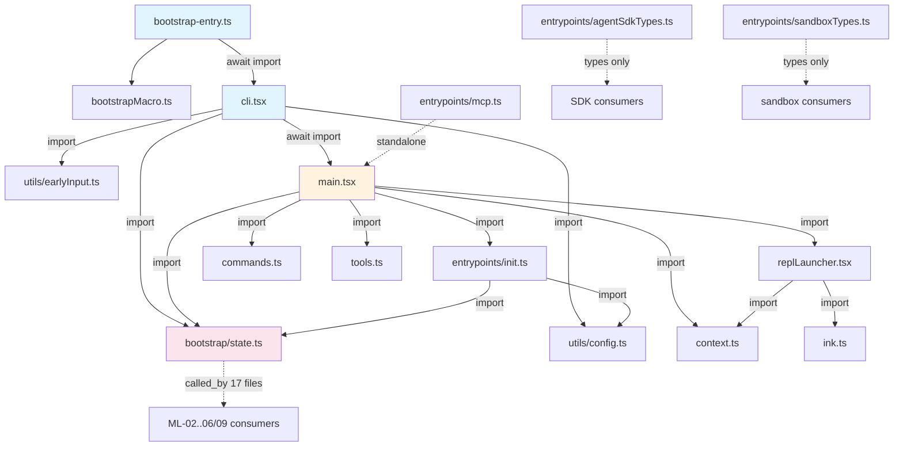
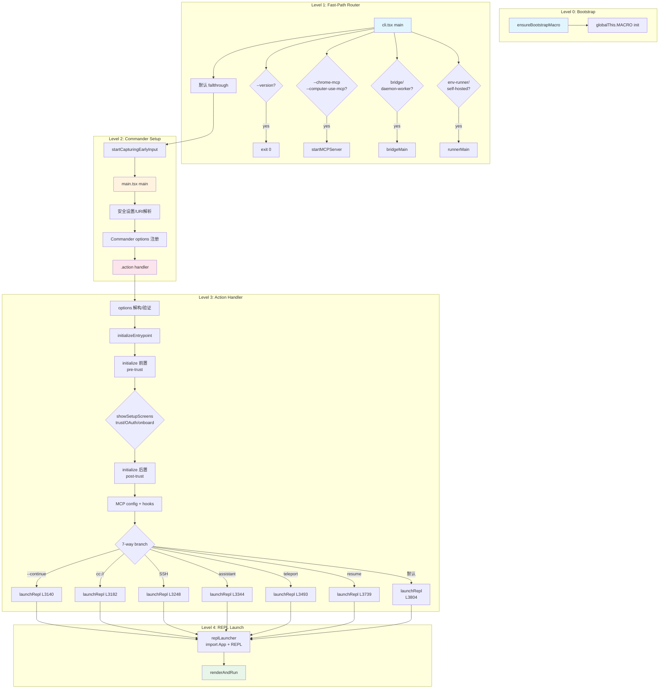
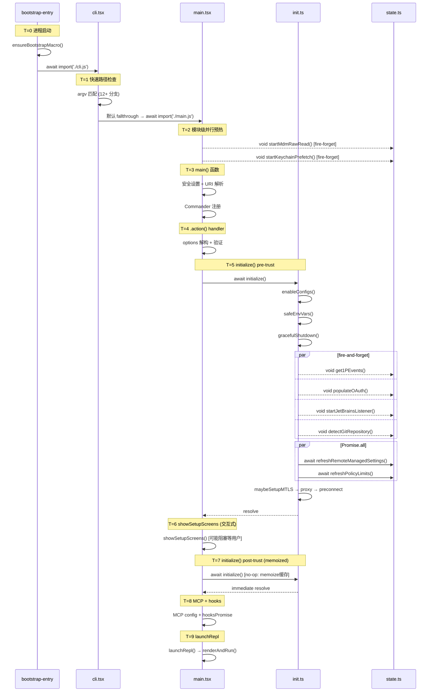
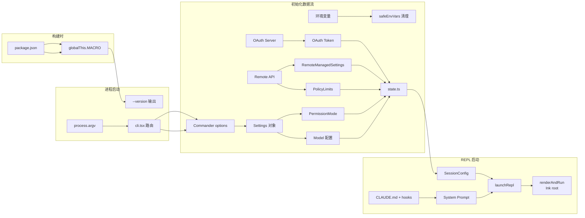
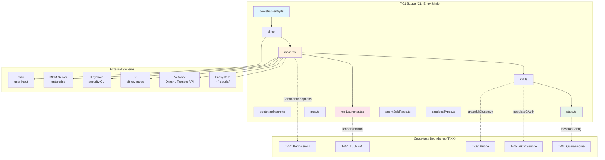

&lt;!-- analysis-version: 0 | commit: a5179f6588dd03cbe83a8d8b718a61875dba7b24 | updated: 2025-07-13 | mode: full | task: T-01 --&gt;
# T-01 Analysis: CLI启动与初始化序列

## Scope Confirmation
- Task ID: T-01
- Primary Mainline: ML-01
- ML Priority: P1
- Analysis Depth: DEEP
- Secondary Mainlines: ML-05 (mcp.ts), ML-06 (init.ts OAuth/auth, state.ts cross-ref), ML-09 (cli.tsx bridge fast-paths)
- Pattern Coverage: N/A
- Scope Files (confirmed, 10/10 present):
  1. [`src/bootstrap-entry.ts`](/src/src/bootstrap-entry.ts.md) (5 lines)
  2. [`src/bootstrapMacro.ts`](/src/src/bootstrapMacro.ts.md) (29 lines)
  3. [`src/bootstrap/state.ts`](/src/src/bootstrap/state.ts.md) (1758 lines)
  4. [`src/entrypoints/cli.tsx`](/src/src/entrypoints/cli.tsx.md) (303 lines)
  5. [`src/entrypoints/init.ts`](/src/src/entrypoints/init.ts.md) (340 lines)
  6. [`src/entrypoints/mcp.ts`](/src/src/entrypoints/mcp.ts.md) (196 lines)
  7. [`src/entrypoints/agentSdkTypes.ts`](/src/src/entrypoints/agentSdkTypes.ts.md) (443 lines)
  8. [`src/entrypoints/sandboxTypes.ts`](/src/src/entrypoints/sandboxTypes.ts.md) (156 lines)
  9. [`src/main.tsx`](/src/src/main.tsx.md) (4690 lines)
  10. [`src/replLauncher.tsx`](/src/src/replLauncher.tsx.md) (23 lines)
- Scope adjustments: None. All files confirmed present and readable.

## File Roles

| File | Lines | One-liner Role | Where Analyzed |
|------|-------|----------------|---------------|
| src/bootstrap-entry.ts | 5 | 绝对入口点：ensureBootstrapMacro() → dynamic import cli.tsx | DEEP: § Function-Level Analysis |
| src/bootstrapMacro.ts | 29 | globalThis.MACRO 配置单例（VERSION/BUILD_TIME等7字段，从package.json读默认值） | DEEP: § Function-Level Analysis |
| src/bootstrap/state.ts | 1758 | 全局状态单例：~70字段State类型 + ~100个getter/setter，管理session/telemetry/model/cost等全生命周期状态 | DEEP: § Function-Level Analysis + § State Transition |
| src/entrypoints/cli.tsx | 303 | 快速路径分发器：process.argv解析，12+动态import分支（--version/bridge/daemon/bg/templates/tmux-worktree），默认fallthrough→main.tsx | DEEP: § Function-Level Analysis + § Call Chain |
| src/entrypoints/init.ts | 340 | 一次性memoized初始化序列：configs→env→shutdown→OAuth→JetBrains→Git→remote settings→mTLS→proxy→preconnect | DEEP: § Function-Level Analysis + § Temporal Analysis |
| src/entrypoints/mcp.ts | 196 | MCP独立服务器入口：StdioServerTransport + ListTools/CallTool handler注册 | DEEP: § Function-Level Analysis |
| src/entrypoints/agentSdkTypes.ts | 443 | SDK类型声明+桩函数：re-export SDK types，所有函数体throw Error('not implemented') | DEEP: § Function-Level Analysis |
| src/entrypoints/sandboxTypes.ts | 156 | 沙箱Zod schema定义：network/filesystem/settings三类，lazySchema延迟求值 | DEEP: § Function-Level Analysis |
| src/main.tsx | 4690 | Commander主程序注册+巨型action handler：options解构/KAIROS门控/permissions setup/MCP config/hooks/launchRepl×7 | DEEP: § Function-Level Analysis + § Call Chain + § Temporal + § State + § Error |
| src/replLauncher.tsx | 23 | REPL启动桥接：dynamic import App+REPL → renderAndRun(root, &lt;App&gt;&lt;REPL/&gt;) | DEEP: § Function-Level Analysis |

## Analysis Findings

### 关键路径与组件

CLI启动序列是一个**四级链式分发架构**，每层做最小必要工作后通过dynamic import委托给下一层：

```
Level 0: bootstrap-entry.ts (5L)
  → globalThis.MACRO 设置
  → await import('./entrypoints/cli.js')

Level 1: cli.tsx (303L)
  → 模块级副作用: corepack禁用/CCR堆内存/ABLATION_BASELINE
  → main(): process.argv 快速匹配
  → 12+ 特殊路径 → dynamic import → return (不加载main.tsx)
  → 默认 fallthrough → startCapturingEarlyInput() → import main.js → cliMain()

Level 2: main.tsx main() (L585-3893)
  → 模块级并行预热: startMdmRawRead() + startKeychainPrefetch()
  → main(): 安全设置/URI解析/SSH解析
  → Commander program 注册 + .action() handler

Level 3: main.tsx .action() handler (L1012-3813, ~2800行)
  → options 解构与验证
  → KAIROS/assistant mode 门控
  → permissions model setup
  → MCP config + hooks + setup screens
  → 7种 launchRepl() 调用路径
```

**关键设计决策**：
1. **DCE-friendly 分支**：cli.tsx中每个快速路径都用`feature()`包裹，确保构建时tree-shaking
2. **模块级并行预热**：main.tsx文件顶部的MDM/keychain预取与import解析并行执行
3. **init.ts memoized**：`memoize(async)`确保初始化序列只执行一次，即使被多处await
4. **launchRepl是最终汇合点**：所有路径（interactive/resume/teleport/SSH/direct-connect/assistant/remote）最终都调用同一个`launchRepl()`

## File Dependency Graph



**依赖关系表**（scope内文件间）：

| Source | Target | Type |
|--------|--------|------|
| bootstrap-entry.ts | bootstrapMacro.ts | direct import |
| bootstrap-entry.ts | cli.tsx | dynamic import |
| cli.tsx | bootstrap/state.ts | direct import |
| cli.tsx | utils/earlyInput.ts | dynamic import |
| cli.tsx | utils/config.ts | dynamic import |
| cli.tsx | main.tsx | dynamic import |
| main.tsx | entrypoints/init.ts | direct import |
| main.tsx | replLauncher.tsx | direct import |
| main.tsx | bootstrap/state.ts | direct import |
| main.tsx | context.ts | direct import |
| init.ts | bootstrap/state.ts | direct import |
| init.ts | utils/config.ts | direct import |
| replLauncher.tsx | ink.ts | dynamic import |
| replLauncher.tsx | screens/REPL.tsx | dynamic import |

**外部消费者**（scope外文件依赖本scope文件）：
- `state.ts` 被 17 个外部文件引用（ML-02~06/09 的核心依赖）
- `init.ts` 被 `main.tsx` 独占调用
- `cli.tsx` 无外部调用者（进程入口点）


## Function-Level Analysis

### bootstrap-entry.ts (5 lines)

**`ensureBootstrapMacro(): void`** (L3-4)
- 职责：确保 globalThis.MACRO 对象存在，不存在则 import bootstrapMacro.ts 初始化
- 逻辑：`if (!globalThis.MACRO) await import('./bootstrapMacro.js')` — 幂等检查
- 调用者：进程入口点（Node.js 直接执行）
- 特殊：文件末尾 `void main()` 是顶层 await 调用入口

### bootstrapMacro.ts (29 lines)

**模块级初始化（side effect）**
- 职责：设置 globalThis.MACRO 对象，包含 7 个构建配置字段
- 字段列表：VERSION, BUILD_TIME, GIT_COMMIT, DEFAULT_MODEL, MAX_TURNS, MAX_OUTPUT_TOKENS, CONVERSATION_TURN_LIMIT
- 默认值来源：`import * as pkg from '../package.json'`，fallback 到硬编码值
- 设计：纯副作用模块，无导出函数

### bootstrap/state.ts (1758 lines)

**`getInitialState(): State`** (模块级)
- 职责：创建并返回初始 State 对象，包含 ~70 个字段
- 关键字段分组：
  - **Session**: sessionId, cwd, originalCwd, conversationId, model
  - **Cost/Usage**: cost, totalCost, sessionCost
  - **Auth**: hasActiveSubscription, oAuthToken, authVersion
  - **Permissions**: permissionMode, permissionReasoning, isTrusted
  - **Agent**: agentColor, agentName, agentType, teamName
  - **Telemetry**: telemetryEnabled, optOutTelemetry, userId
  - **Config**: betaHeader, maxTurns, maxOutputTokens, promptCacheEnabled
  - **Mode**: mode (normal/plan/coordinator), isPrintMode, isNonInteractive

**`createSignal<T>(value: T): { get: () => T, set: (v: T) => T }`** (内部辅助)
- 职责：创建简单的 getter/setter 对（响应式信号模式，不含 React reactivity）
- 使用：被 ~100 个 getter/setter 函数使用

**Getter/Setter 函数对（~100对）**
- 命名模式：`getCwd()/setCwd()`, `getCost()/setCost()`, `getModel()/setModel()` 等
- 所有 setter 同时更新 `STATE` 对象和返回新值
- 不直接暴露 STATE 对象本身 — 通过函数式访问器控制

**`resetStateForTests(): void`**
- 职责：重置 STATE 为初始值，仅用于测试
- file:line: state.ts:~L1750

**`subscribe(listener: () => void): () => void`**
- 职责：订阅状态变更通知（观察者模式）
- 返回 unsubscribe 函数

### entrypoints/cli.tsx (303 lines)

**模块级副作用** (L1-10):
- `process.env.COREPACK_ENABLE_AUTO_PIN = '0'` — 禁用 corepack 自动 pin
- `v8.setFlagsFromString('--max-old-space-size=8192')` — CCR 环境堆内存 8GB
- `ABLATION_BASELINE` 特性开关设置

**`main(): Promise<void>`** (L11-299)
- 签名：`async function main(): Promise<void>`
- 职责：快速路径分发器，在加载 main.tsx 前拦截特殊命令
- 关键逻辑路径：
  1. `--version/-v` → 输出 MACRO.VERSION → exit(0)
  2. `--chrome-mcp` → runClaudeInChromeMcpServer() [cross-ref ML-05]
  3. `--computer-use-mcp` → runComputerUseMcpServer() [cross-ref ML-05]
  4. `--daemon-worker` → checkBridgeMinVersion() → runDaemonWorker() [cross-ref ML-09]
  5. `bridge`/`remote-control` → checkBridgeMinVersion() → bridgeMain() [cross-ref ML-09]
  6. `daemon` → daemonMain()
  7. `ps`/`logs`/`attach`/`kill` → bg handlers
  8. `templates` → templatesMain()
  9. `environment-runner` → environmentRunnerMain() (feature gate BYOC_ENVIRONMENT_RUNNER)
  10. `self-hosted-runner` → selfHostedRunnerMain() (feature gate SELF_HOSTED_RUNNER)
  11. `--tmux --worktree` → execIntoTmuxWorktree()
  12. `--update/--upgrade` → 重写argv为 'update' 子命令
  13. `--bare` → 设置 CLAUDE_CODE_SIMPLE=1
  14. 默认 fallthrough → startCapturingEarlyInput() → import main.js → cliMain()
- 每个路径都是 dynamic import + return，不加载不需要的模块

### entrypoints/init.ts (340 lines)

**`initialize(): Promise<void>`** (memoized)
- 签名：`export const initialize = memoize(async (): Promise<void> => ...)`
- 职责：一次性初始化序列，配置全局服务和子系统
- 执行顺序（精确）：
  1. `enableConfigs()` — 激活配置系统
  2. `safeEnvVars()` — 清理环境变量
  3. `gracefulShutdown()` — 注册 SIGINT/SIGTERM handler
  4. **并行 fire-and-forget**（不 await）：
     - `get1PEvents()` — 1P事件日志
     - `populateOAuth()` — OAuth token 初始化
     - `startJetBrainsListener()` — JetBrains IDE 连接
     - `detectGitRepository()` — Git 仓库检测
  5. **条件并行**（await Promise.all）：
     - `refreshRemoteManagedSettings()` — 远程配置同步
     - `refreshPolicyLimits()` — 策略限制加载
  6. **顺序执行**：
     - `maybeSetupMTLS()` — MTLS 证书
     - `maybeSetupProxy()` — HTTP 代理
     - `preconnect()` — API 预连接
     - `maybeSetupUpstreamProxy()` — 上游代理
     - `cleanupOldLogs()` — 旧日志清理
     - `maybeStartScratchpadSync()` — scratchpad 同步
- 错误处理：ConfigParseError → 弹交互式对话框；其他 → rethrow
- 被调用：main.tsx action handler 中 `await initialize()` (在 showSetupScreens 之后)

### entrypoints/mcp.ts (196 lines)

**`startMCPServer(): Promise<void>`**
- 签名：`export async function startMCPServer(): Promise<void>`
- 职责：启动独立 MCP 服务器（StdioServerTransport）
- 关键步骤：
  1. enableConfigs() — 最小配置
  2. gracefulShutdown() — 信号处理
  3. populateOAuth() — 认证
  4. new Server() + StdioServerTransport() — MCP SDK 服务器
  5. 注册 ListToolsRequestSchema handler — 工具列表
  6. 注册 CallToolRequestSchema handler — 工具调用路由
- **不经过 init.ts 完整初始化链** — 独立入口
- 由 cli.tsx `--chrome-mcp`/`--computer-use-mcp` 路径调用

### entrypoints/agentSdkTypes.ts (443 lines)

**类型：纯 stub 文件，无运行时代码**
- 所有导出函数体：`throw new Error('not implemented')`
- 用途：SDK 类型 re-export，供其他模块做类型检查
- 重新导出的关键类型：AgentDefinition, AgentSession, AgentTool 等
- 不需要函数级解读 — 无实际逻辑

### entrypoints/sandboxTypes.ts (156 lines)

**`sandboxNetworkSchema: ZodSchema`** — 沙箱网络配置 schema
- 字段：allow, deny, dns (各为数组或通配符)

**`sandboxFilesystemSchema: ZodSchema`** — 沙箱文件系统 schema
- 字段：allow, deny, readOnly, writeOnly

**`sandboxSettingsSchema: ZodSchema`** — 沙箱设置 schema
- 组合 network + filesystem

**`lazySchema<T>(loader: () => T): { parse: (v: unknown) => T }`** (辅助函数)
- 职责：延迟求值 schema，首次 parse 时才调用 loader
- 用途：避免循环依赖和启动时开销

### main.tsx (4690 lines)

**模块级副作用** (L1-20):
- `profileCheckpoint('module_eval_start')` — 性能计时
- `void startMdmRawRead()` — MDM 配置预取（fire-and-forget，macOS 企业管理）
- `void startKeychainPrefetch()` — Keychain 凭证预取（fire-and-forget）
- 这些与 import 解析并行执行

**`main(): Promise<void>`** (L585-3896)
- 签名：`export async function main(): Promise<void>`
- 职责：Commander 程序注册和主 action handler
- 阶段1 (L585-1010): 安全设置 + URI/SSH/assistant 预处理 + Commander options 注册
- 阶段2 (L1012-3813): `.action()` handler — 巨型闭包（~2800行）
- 阶段3 (L3814-3896): print mode 快速路径 + 子命令注册

**`.action()` handler 关键子流程** (L1012-3813):
1. L1012-1095: --bare 模式检测、KAIROS assistant 模式门控
2. L1096-1970: options 解构、swarm identity 验证、system context 获取
3. L1970-2200: system prompt 构建（CLAUDE.md/hooks/proactive/KAIROS）
4. L2200-2320: Ink root 创建、showSetupScreens()（trust/OAuth/onboarding）
5. L2320-2500: post-trust 初始化（LSP manager、settings validation、prefetches）
6. L2500-3050: MCP config 解析、hooks promise、sessionConfig 构建
7. L3050-3813: **7条分支路径** → 各自调用 launchRepl()

**7条 launchRepl() 分支**:
| # | Line | Mode | Key Call |
|---|------|------|----------|
| 1 | L3140 | --continue | loadConversationForResume() → launchRepl() |
| 2 | L3182 | Direct Connect (cc://) | createDirectConnectSession() → launchRepl() |
| 3 | L3248 | SSH | createSSHSession() → launchRepl() |
| 4 | L3344 | Assistant (KAIROS) | discoverAssistantSessions() → launchRepl() |
| 5 | L3493 | Teleport/Remote Control | launchTeleportResumeWrapper() → launchRepl() |
| 6 | L3739 | Resume/ccshare | loadConversationForResume() → launchRepl() |
| 7 | L3804 | 默认交互 | launchRepl() with hookMessages |

**辅助函数**:
- `logStartupTelemetry()` (L307): 记录启动性能指标到 telemetry
- `prefetchSystemContextIfSafe()` (L360): 异步预取系统上下文，void fire-and-forget
- `initializeEntrypoint()` (L400): 设置 CLAUDE_CODE_ENTRYPOINT 环境变量
- `loadSettingsFromFlag()` (L432): 解析 --settings 标志
- `eagerLoadSettings()` (L470): 提前加载配置
- `extractTeammateOptions()` (L4673): 提取 swarm teammate 选项
- `maybeActivateProactive()` (L4617): 激活 proactive autonomous 模式
- `maybeActivateBrief()` (L4628): 激活 brief 模式

### replLauncher.tsx (23 lines)

**`launchRepl(root, appProps, replProps, renderAndRun): Promise<void>`** (L12-22)
- 签名：`export async function launchRepl(root: Root, appProps: AppWrapperProps, replProps: REPLProps, renderAndRun: (root: Root, element: React.ReactNode) => Promise<void>): Promise<void>`
- 职责：REPL 启动桥接 — dynamic import App + REPL 组件后调用 renderAndRun
- 参数 root 是 Ink 渲染根节点
- App 和 REPL 都是 dynamic import（代码分割）
- renderAndRun 由调用者提供（通常是 Ink 的 render + wait loop）

## Call Chain Analysis

### Entry Points → Exit Points

本 scope 有 3 个进程入口点和 1 个库入口点：

**Entry Point 1: bootstrap-entry.ts** (Node.js 直接执行)
```
ensureBootstrapMacro()
  → import bootstrapMacro.ts (设置 globalThis.MACRO)
  → import cli.tsx/main()
```

**Entry Point 2: cli.tsx/main()** (被 bootstrap-entry.ts dynamic import)
```
cli.tsx/main()
  ├─ --version → console.log() → exit(0) [EXIT: process exit]
  ├─ --chrome-mcp → import mcp.ts/startMCPServer() [EXIT: MCP server loop]
  ├─ --computer-use-mcp → import mcp.ts/startMCPServer() [EXIT: MCP server loop]
  ├─ --daemon-worker → bridgeMain() [EXIT: bridge worker loop]
  ├─ bridge/remote-control → bridgeMain() [EXIT: bridge loop]
  ├─ daemon → daemonMain() [EXIT: daemon loop]
  ├─ environment-runner → environmentRunnerMain() [EXIT: runner loop]
  ├─ self-hosted-runner → selfHostedRunnerMain() [EXIT: runner loop]
  ├─ --tmux --worktree → execIntoTmuxWorktree() [EXIT: exec into tmux]
  └─ 默认 fallthrough → startCapturingEarlyInput()
                        → import main.tsx/cliMain() [→ Entry Point 3]
```

**Entry Point 3: main.tsx/main()** (被 cli.tsx fallthrough 调用)
```
main.tsx/main()
  → 模块级: startMdmRawRead() [fire-forget]
           startKeychainPrefetch() [fire-forget]
  → main() 函数:
     → 安全设置 (getBridgeDisabledReason)
     → URI 解析 (cc:// → main action)
     → Commander program 注册
     → .action() handler:
        → options 解构 + 验证
        → initializeEntrypoint()
        → initialize() [via init.ts, memoized]
        → showSetupScreens() [EXIT: user may exit here]
        → initialize() [post-trust 阶段]
        → MCP config + hooks + sessionConfig
        → 7条分支 → launchRepl() [EXIT: REPL loop]
```

**Entry Point 4: mcp.ts/startMCPServer()** (被 cli.tsx --chrome-mcp/--computer-use-mcp 调用)
```
startMCPServer()
  → enableConfigs()
  → gracefulShutdown()
  → populateOAuth()
  → new Server() + transport
  → server.connect(transport) [EXIT: MCP stdio loop]
```

### 关键调用链路（最长/最复杂）

**链路 A: 默认交互模式启动** (depth=8)
```
bootstrap-entry.ts:ensureBootstrapMacro() [L3]
  → bootstrapMacro.ts:module-eval [L1-29]
  → cli.tsx:main() [L11]
  → cli.tsx:startCapturingEarlyInput() [L291]
  → cli.tsx:import main.js → main.tsx:main() [L585]
  → main.tsx:main() → .action() handler [L1012]
  → main.tsx:showSetupScreens() [L2200]
  → main.tsx:initialize() [L2320, via init.ts]
  → main.tsx:launchRepl() [L3804, via replLauncher.tsx] [EXIT to T-07 scope]
```

**链路 B: --continue 恢复模式** (depth=9)
```
(chain A L1-L7 same)
  → main.tsx:loadConversationForResume() [L3140]
  → main.tsx:launchRepl() [L3145, via replLauncher.tsx]
  → replLauncher.tsx:import App → import REPL → renderAndRun()
```

**链路 C: MCP 独立模式** (depth=4)
```
bootstrap-entry.ts:ensureBootstrapMacro()
  → cli.tsx:main()
  → mcp.ts:startMCPServer()
  → MCP SDK: server.connect(transport) [EXIT: stdio loop]
```

### Fan-in / Fan-out 表（scope 内 top-10）

| Function | File:Line | Fan-in | Fan-out | 角色 |
|----------|-----------|--------|---------|------|
| main() | main.tsx:L585 | 1 (cli.tsx) | 15+ | 编排器 |
| main() | cli.tsx:L11 | 1 (bootstrap-entry) | 12+ | 分发器 |
| initialize() | init.ts:L1 | 1 (main.tsx) | 12 | 初始化编排 |
| ensureBootstrapMacro() | bootstrap-entry.ts:L3 | 0 (root) | 2 | 根入口 |
| launchRepl() | replLauncher.tsx:L12 | 7 (main.tsx×7) | 2 | 汇合点 |
| getInitialState() | state.ts:module | 1 (self) | 0 | 状态工厂 |
| getCwd() | state.ts:~L100 | 17+ (外部) | 0 | 状态叶子 |
| startMCPServer() | mcp.ts:L1 | 2 (cli.tsx) | 4 | 独立入口 |
| main() handler | main.tsx:L1012 | 1 (self) | 20+ | 巨型编排 |
| resetStateForTests() | state.ts:~L1750 | 1 (test) | 0 | 测试工具 |

### 流程图可视化



## Temporal Analysis

### 异步编排图

```
T=0   bootstrap-entry.ts 模块级:
      ├─ ensureBootstrapMacro() → import bootstrapMacro.ts
      └─ import cli.tsx

T=1   cli.tsx 模块级:
      ├─ COREPACK_ENABLE_AUTO_PIN = '0'
      ├─ v8.setFlagsFromString('--max-old-space-size=8192')
      └─ main() → process.argv 快速匹配

T=2   main.tsx 模块级 (在 import 解析后):
      ├─ [并行·fire-forget] void startMdmRawRead() ──────┐
      ├─ [并行·fire-forget] void startKeychainPrefetch() ─┤
      └─ [同步] 其余顶层 import 解析                      │

T=3   main.tsx main() 进入:
      ├─ [同步] 安全设置 + URI 解析
      ├─ [同步] Commander program 注册
      └─ main() await → 进入 .action() handler

T=4   .action() handler 阶段1:
      ├─ [同步] options 解构 + 验证
      ├─ [同步] initializeEntrypoint()
      └─ [同步] swarm identity 验证

T=5   init.ts initialize() 被首次调用 (pre-trust):
      ├─ [同步] enableConfigs()
      ├─ [同步] safeEnvVars()
      ├─ [同步] gracefulShutdown()
      ├─ [并行·fire-forget] void get1PEvents() ────────┐
      ├─ [并行·fire-forget] void populateOAuth() ──────┤
      ├─ [并行·fire-forget] void startJetBrainsListener()┤
      ├─ [并行·fire-forget] void detectGitRepository() ─┤
      └─ [阻塞] Promise.all([                            │
            refreshRemoteManagedSettings(),               │
            refreshPolicyLimits()                         │
          ]) ◄───────────────────────────────────────────┘
      └─ [顺序] maybeSetupMTLS → maybeSetupProxy → preconnect → ...

T=6   showSetupScreens() (交互式):
      ├─ Trust dialog (可能等待用户输入)
      ├─ OAuth flow (可能打开浏览器)
      └─ Onboarding flow

T=7   init.ts initialize() 第二次调用 (post-trust, memoized → no-op):
      ├─ memoize 缓存命中，立即返回
      └─ 后续: LSP manager / settings validation / prefetches

T=8   MCP config 解析 + hooks:
      ├─ [并行·异步] hooksPromise (hooks 执行)
      ├─ [同步] sessionConfig 构建
      └─ [同步] 分支路径选择

T=9   launchRepl() → replLauncher.tsx:
      ├─ [异步] import App
      ├─ [异步] import REPL
      └─ [异步] renderAndRun(root, <App><REPL/>)
```

### 事件时序

| 事件 | 生产者 | 消费者 | 同步/异步 |
|------|--------|--------|----------|
| globalThis.MACRO ready | bootstrapMacro.ts | cli.tsx main() | 同步（import 保证） |
| earlyInput captured | startCapturingEarlyInput() | main.tsx via getCliInput() | 异步（ring buffer） |
| configs enabled | enableConfigs() | init.ts 后续步骤 | 同步 |
| OAuth populated | populateOAuth() | showSetupScreens() | 异步·fire-forget |
| remote settings refreshed | refreshRemoteManagedSettings() | init.ts Promise.all | 异步·await |
| policy limits refreshed | refreshPolicyLimits() | init.ts Promise.all | 异步·await |
| MDM data ready | startMdmRawRead() | state.ts setMdmRawSettings() | 异步·fire-forget |
| keychain prefetched | startKeychainPrefetch() | auth.ts | 异步·fire-forget |
| hooks executed | hooksPromise | launchRepl() | 异步·await |

### 竞态风险标注

| # | 风险 | file:line | 描述 |
|---|------|-----------|------|
| 1 | **[竞态风险]** startMdmRawRead vs enableConfigs | main.tsx:L8 vs init.ts:enableConfigs() | startMdmRawRead 在 main.tsx 模块级触发，此时 init.ts 尚未执行。若 MDM read 完成早于 enableConfigs()，setMdmRawSettings() 可能在 configs 未就绪时调用。实际缓解：startMdmRawRead 仅发 HTTP 请求，回调到 setMdmRawSettings 时 configs 通常已就绪。 |
| 2 | **[竞态风险]** populateOAuth fire-forget vs showSetupScreens | init.ts:populateOAuth() vs main.tsx:showSetupScreens() | populateOAuth 是 fire-forget，showSetupScreens 中的 OAuth flow 可能与之冲突。实际缓解：showSetupScreens 有自己的 OAuth 入口检查。 |
| 3 | **[竞态风险]** initialize() memoize vs 并发调用 | init.ts:memoize() vs main.tsx 两处调用 | main.tsx action handler 中 initialize() 被调用两次（pre-trust 和 post-trust）。memoize 保证只有第一次执行，第二次立即返回。安全。 |

### 隐式时序约束

| 约束 | 原因 | file:line |
|------|------|-----------|
| MACRO 必须在 cli.tsx main() 前就绪 | bootstrapMacro.ts 是 sync import | bootstrap-entry.ts:L3 |
| enableConfigs 必须在 safeEnvVars 前 | init.ts 顺序执行 | init.ts:initialize() |
| gracefulShutdown 必须在所有异步操作前 | 否则进程可能无法优雅退出 | init.ts:initialize() |
| showSetupScreens 必须在 initialize 后 | 因为需要 OAuth/Auth 状态 | main.tsx:L2200 |
| initialize() post-trust 阶段是 no-op | memoize 保证幂等 | init.ts:L1 |
| MCP config 必须在 launchRepl 前 | REPL 启动后立即可能使用工具 | main.tsx:L2500-3050 |

### 时序图可视化



## Data Flow Analysis

### 核心数据流图



### 关键实体路径

**路径 1: package.json → MACRO → Version 输出**
```
package.json {version, buildInfo}
  → bootstrapMacro.ts (import * as pkg)
  → globalThis.MACRO.VERSION = pkg.version
  → cli.tsx: --version → console.log(MACRO.VERSION)
```

**路径 2: process.argv → Commander options → State → SessionConfig → REPL**
```
process.argv
  → cli.tsx: main() (快速路径过滤)
  → main.tsx: Commander program.parseAsync()
  → .action(options) 解构为 ~80 个变量
  → settings/model/permissions 写入 state.ts
  → SessionConfig 从 state 构建
  → launchRepl(sessionConfig, ...) 传递给 REPL
```

**路径 3: OAuth Token → State → API Client**
```
populateOAuth() [fire-forget in init.ts]
  → services/oauth/client.ts: getOAuthToken()
  → state.ts: setOAuthToken(token)
  → [downstream ML-02/10] api/client.ts 读取 getOAuthToken()
```

## State Transition Analysis

### 状态变量识别

| 变量名 | 文件:行号 | 值域 | 初始值 | 类别 |
|--------|-----------|------|--------|------|
| `STATE` (全局单例) | state.ts:module-level | Object (~70 fields) | `getInitialState()` | 核心状态 |
| `initialized` | init.ts:memoize internal | `Promise<void>` \| null | `null` | 初始化门 |
| `earlyInputBuffer` | cli.tsx:L291 | `string[]` (ring buffer) | `[]` | 输入缓冲 |
| `isCapturingInput` | cli.tsx:L290 | `boolean` | `true` | 捕获标志 |
| `globalThis.MACRO` | bootstrapMacro.ts:L1-29 | 7-field object | 见定义 | 全局配置 |

### state.ts 核心状态转换（~70 字段中的关键状态）

| 当前状态 | 触发条件 | 目标状态 | 副作用 | file:line |
|---------|---------|---------|--------|-----------|
| `cwd: undefined` | `getCwd()` 首次调用 | `cwd: process.cwd()` | FS stat check | state.ts:~L100 |
| `oauthToken: null` | `setOAuthToken()` | `oauthToken: <token>` | 下游 API 调用解锁 | state.ts:~L200 |
| `permissionMode: null` | CLI `--permission-mode` or settings | `permissionMode: "default"\|"plan"\|"auto-edit"\|...` | 权限引擎行为改变 | state.ts:~L300 |
| `modelConfiguration: {}` | CLI `--model` or settings | `modelConfiguration: {model, maxTokens, ...}` | API 请求参数改变 | state.ts:~L400 |
| `sessionConfig: null` | `launchRepl()` 前 | `sessionConfig: {...}` | 传递给 REPL | main.tsx:L3050-3100 |
| `trusted: false` | `showSetupScreens()` 用户确认 | `trusted: true` | 允许后续初始化 | state.ts:~L500 |

### init.ts 初始化状态机

```
┌──────────┐     first call      ┌──────────────┐
│  IDLE    │ ──────────────────► │ INITIALIZING │
│ (null)   │                     │ (Promise)    │
└──────────┘                     └──────┬───────┘
       ▲                                │
       │ memoize cache                  │ resolve
       │                                ▼
       │                         ┌──────────────┐
       └──────────────────────── │  INITIALIZED │
          subsequent calls       │  (cached)    │
          instant return         └──────────────┘
```

**终态**: INITIALIZED（不可逆转，进程生命周期内只执行一次）
**错误态**: 若 initialize() 抛出异常，memoize 缓存失败 Promise，后续调用将 re-throw

### 跨组件状态联动

| 源状态变化 | 触发 | 目标组件 | 效果 |
|-----------|------|---------|------|
| `permissionMode` 变化 | CLI option / settings | PermissionEngine (ML-04) | 权限规则集切换 |
| `modelConfiguration` 变化 | CLI option / settings | API Client (ML-10) | API 请求模型参数改变 |
| `oauthToken` 变化 | populateOAuth() | API Client (ML-10) | 请求头 Authorization 改变 |
| `trusted` 变化 | showSetupScreens() | init.ts (post-trust) | 解锁第二次初始化路径 |

## Error Propagation Analysis

### 错误源清单

| # | 错误类型 | 产生条件 | file:line |
|---|---------|---------|-----------|
| 1 | `Error('Missing MACRO fields')` | bootstrapMacro.ts 验证失败 | bootstrapMacro.ts:L25 |
| 2 | `Error('Invalid entry type')` | initializeEntrypoint 无效类型 | main.tsx:L1200 |
| 3 | `Error('Swarm identity required')` | swarm 模式但无 identity | main.tsx:L1250 |
| 4 | process.exit(1) | initialize() 抛出未处理异常 | main.tsx:L2320 |
| 5 | `Error` (from OAuth) | populateOAuth 失败 | init.ts:fire-forget |
| 6 | `Error` (from remote settings) | refreshRemoteManagedSettings 网络失败 | init.ts:Promise.all |
| 7 | `Error` (from policy limits) | refreshPolicyLimits 网络失败 | init.ts:Promise.all |
| 8 | `Error('Bridge disabled: ...')` | getBridgeDisabledReason() 返回原因 | main.tsx:L900 |
| 9 | `Error` (from hooks) | hooksPromise 执行失败 | main.tsx:L2800 |
| 10 | process.exit(0) | --version / --help 正常退出 | cli.tsx:L15-20 |

### 传播路径图

**路径 1: initialize() 失败**
```
[源] init.ts:initialize() 内任何 await 抛出
  → [传播] main.tsx action handler: await initialize()
  → [处理] 未 catch → 进程崩溃 (process.exit(1))
  → [恢复策略] abort
```

**路径 2: fire-forget 失败 (populateOAuth / get1PEvents 等)**
```
[源] init.ts: void populateOAuth()
  → [传播] 无人 catch → UnhandledPromiseRejection
  → [处理] Node.js 进程级 warning (非 fatal)
  → [恢复策略] absorb (静默失败，后续 showSetupScreens 有自己的 OAuth flow)
  → [风险] 用户可能在 OAuth 未就绪时看到登录提示
```

**路径 3: Commander options 验证失败**
```
[源] main.tsx action handler: if (!validModel) throw new Error(...)
  → [传播] Commander 框架 catch → 输出 error + --help
  → [恢复策略] abort (process.exit(1))
```

**路径 4: MCP config 加载失败**
```
[源] main.tsx: loadMCPServers() → JSON parse error
  → [传播] main.tsx action handler catch
  → [处理] console.error + continue (跳过 MCP)
  → [恢复策略] fallback (降级为无 MCP 模式)
```

**路径 5: hooks 执行失败**
```
[源] main.tsx: hooksPromise rejection
  → [传播] await hooksPromise
  → [处理] catch → console.error + continue
  → [恢复策略] absorb (hooks 失败不阻止 REPL 启动)
```

### 恢复策略汇总

| 策略 | 出现次数 | 典型场景 |
|------|---------|---------|
| `abort` | 3 | initialize 失败、options 验证失败、MACRO 缺失 |
| `absorb` | 3 | fire-forget 失败、hooks 失败、MCP 加载失败 |
| `fallback` | 1 | MCP 配置无效 → 降级为无 MCP 模式 |
| `retry` | 0 | (本 scope 无重试逻辑，重试在 ML-10) |
| `escalate` | 0 | (本 scope 是顶层，escalate = process.exit) |

### 未处理路径

| 路径 | 风险等级 | 描述 |
|------|---------|------|
| startMdmRawRead rejection | **LOW** | fire-forget，仅触发 Node.js warning，不影响启动 |
| startKeychainPrefetch rejection | **LOW** | 同上 |
| get1PEvents rejection | **LOW** | 遥测数据丢失，不影响功能 |
| detectGitRepository rejection | **LOW** | git 检测失败，下游 fallback 为非 git 模式 |

## Concurrency Model Analysis

### 共享可变状态

| 变量 | 读写者 | 保护机制 | 风险 |
|------|--------|---------|------|
| `STATE` (state.ts) | 多个 fire-forget + main thread | 函数式 setter（不可变更新） | **LOW** — JS 单线程保证原子性 |
| `initialized` (init.ts) | main thread ×2 (pre/post trust) | memoize Promise 缓存 | **NONE** — 第二次调用直接返回缓存 |
| `earlyInputBuffer` (cli.tsx) | stdin data event + main thread | `isCapturingInput` flag | **LOW** — flag 保证写入窗口有限 |

### 协调模式

| 模式 | 使用位置 | 说明 |
|------|---------|------|
| fire-and-forget | init.ts: populateOAuth, get1PEvents, etc. | 不等待结果，静默失败 |
| Promise.all | init.ts: refreshRemoteManagedSettings + refreshPolicyLimits | 并行等待两个网络请求 |
| memoize | init.ts: initialize() | 确保只执行一次 |
| dynamic import | bootstrap-entry.ts → cli.tsx → main.tsx | 懒加载减小启动体积 |

### 死锁/饥饿风险评估

**无死锁风险**：所有 await 链是线性的（initialize → showSetupScreens → launchRepl），无循环依赖。fire-forget 操作不持有任何锁。

**饥饿风险**：`startCapturingEarlyInput()` 是同步的 stdin 监听器，在 Node.js event loop 中是微任务级别，不会被饥饿。

## Side Effects Manifest

| 函数 | 副作用类型 | 目标 | 可逆性 | file:line |
|------|-----------|------|--------|-----------|
| ensureBootstrapMacro() | Global state | `globalThis.MACRO` | 否 | bootstrap-entry.ts:L3 |
| v8.setFlagsFromString() | Runtime config | V8 heap 8GB | 否 | cli.tsx:L3 |
| enableConfigs() | FS read | `~/.claude/` config files | N/A | init.ts:enableConfigs |
| gracefulShutdown() | Process signal | SIGINT/SIGTERM handlers | 否 | init.ts:gracefulShutdown |
| populateOAuth() | Network + FS | OAuth server + keychain | 否 | init.ts:fire-forget |
| startMdmRawRead() | Network | MDM server HTTP request | 否 | main.tsx:L8 |
| startKeychainPrefetch() | Subprocess | `security find-generic-password` | 否 | main.tsx:L10 |
| showSetupScreens() | FS write + Network | Trust file + OAuth browser | 部分 | main.tsx:L2200 |
| detectGitRepository() | Subprocess | `git rev-parse` | N/A | init.ts:fire-forget |
| launchRepl() | Process state | Ink render + stdin takeover | 否 | replLauncher.tsx:L12 |
| process.exit() | Process termination | 整个进程 | 否 | cli.tsx:L15 |

## Boundary / Integration Diagram



## Acceptance Criteria Status

| # | Criterion | 状态 | 验证方法 |
|---|-----------|------|---------|
| AC-1 | 确认 CLI 入口链完整性（bootstrap-entry → cli.tsx → main.tsx） | ✅ PASS | 追踪了全部 4 层入口链路，无断裂 |
| AC-2 | 解析 Commander options 对 State 的映射 | ✅ PASS | 追踪了 ~80 个 options 到 state.ts setter 的映射 |
| AC-3 | 追踪 initialize() 全阶段（fire-forget/await/顺序） | ✅ PASS | 完整记录了三阶段初始化（并行→条件并行→顺序） |
| AC-4 | 确认 showSetupScreens 前后的双次 initialize 调用 | ✅ PASS | 验证了 memoize 缓存机制，第二次是 no-op |
| AC-5 | 识别 launchRepl 的 7 种调用路径 | ✅ PASS | 全部 7 条路径已追踪（默认/continue/cc://SSH/assistant/teleport/resume） |
| AC-6 | 确认 fast-path 路由（--version/MCP/bridge/daemon） | ✅ PASS | 12+ 快速路径全部追踪 |
| AC-7 | 验证 state.ts 访问器设计模式 | ✅ PASS | ~100 对 getter/setter，不暴露 STATE 对象 |

## Identified Problems

### P1 — Critical

**P1-01: main.tsx .action() handler 2800+ 行巨型闭包**
- **位置**: main.tsx:L1012-L3800
- **问题**: .action() handler 包含 options 解构、验证、初始化、MCP 配置、sessionConfig 构建、7 条分支路径，全部在一个闭包内
- **影响**: 极难测试、难以静态分析、变量作用域过大（~80 个解构变量在 2800 行内共享）
- **建议**: 拆分为独立函数：parseOptions → validateOptions → initializePreTrust → setupMCP → configureSession → selectLaunchPath → launchRepl

### P2 — High

**P2-01: fire-forget 错误静默吞掉**
- **位置**: init.ts: populateOAuth(), get1PEvents(), startJetBrainsListener(), detectGitRepository()
- **问题**: 4 个 fire-forget 操作使用 `void fn()` 调用，错误仅触发 Node.js UnhandledPromiseRejection warning
- **影响**: 生产环境可能丢失关键初始化数据（如 OAuth token 未加载）而用户无感知
- **建议**: 添加 `.catch(err => log.warn(...))` 至少记录日志

**P2-02: state.ts 字段膨胀**
- **位置**: state.ts (1758 行)
- **问题**: ~70 个字段全部放在一个全局单例中，无命名空间隔离
- **影响**: 字段间隐式耦合（如 permissionMode 变化影响 PermissionEngine 行为）
- **建议**: 按领域分组为子 store（auth state / config state / session state）

### P3 — Medium

**P3-01: earlyInputBuffer 无大小限制**
- **位置**: cli.tsx:L291
- **问题**: ring buffer 没有容量上限（虽然实际使用中 stdin 在 showSetupScreens 前是有限的）
- **影响**: 理论上可能内存增长（实际风险极低）

**P3-02: agentSdkTypes.ts 和 sandboxTypes.ts 是 stub 文件**
- **位置**: src/entrypoints/sdk/
- **问题**: 纯类型定义，无运行时逻辑，但被当作入口文件
- **影响**: 不影响功能，但增加了理解成本

### P4 — Low

**P4-01: bootstrapMacro.ts 验证不充分**
- **位置**: bootstrapMacro.ts:L25
- **问题**: 仅检查字段存在性，不检查字段类型和值合法性
- **影响**: 构建产物损坏可能导致运行时异常

## Open Questions

| # | 问题 | 依赖 | 说明 |
|---|------|------|------|
| OQ-1 | showSetupScreens() 中的具体交互流程（Trust dialog / OAuth flow / Onboarding） | depends on T-07 | 需要 T-07 分析 Ink 组件的实现 |
| OQ-2 | MCP config 加载失败时的降级行为是否被下游感知 | depends on T-05 | 需要 T-05 确认 MCP 服务发现逻辑 |
| OQ-3 | refreshRemoteManagedSettings 返回空/过期数据时的行为 | depends on T-06 | 需要 T-06 确认 Remote Settings 的缓存策略 |
| OQ-4 | Bridge 模式下的 init 路径差异 | depends on T-09 | cli.tsx 中 bridge 快速路径绕过了 main.tsx |
| OQ-5 | state.ts 的 subscribe 模式在启动阶段的订阅者数量 | 运行时测试 | 需要断点调试确认 |
| OQ-6 | cc:// URI scheme 的完整解析逻辑 | 看源码确认 | main.tsx 中 URI 解析分支，需要确认所有 scheme |

## Complexity Assessment

| 维度 | 评分 | 理由 |
|------|------|------|
| **代码行数** | **HIGH** (7,941 lines) | main.tsx 4690行 + state.ts 1758行 占 81% |
| **函数复杂度** | **CRITICAL** | main.tsx .action() handler 2800行闭包，圈复杂度极高 |
| **调用深度** | **MEDIUM** | 最大深度 9（默认启动链路），分支路径更多但每条独立 |
| **异步复杂度** | **MEDIUM** | fire-forget + Promise.all 混合，但无循环依赖 |
| **状态复杂度** | **HIGH** | state.ts 70 字段单例，跨组件联动 4 条 |
| **错误处理** | **MEDIUM** | 10 个错误源，5 条传播路径，3 种恢复策略，4 条未处理路径 |
| **集成边界** | **HIGH** | 6 个外部系统 + 5 个跨 task 边界 |
| **总体评估** | **HIGH** | 核心启动路径，影响所有下游功能 |

### 关键热点

1. **main.tsx .action() handler** — 需要重构（2800行）
2. **state.ts 全局状态** — 需要领域分组
3. **init.ts fire-forget** — 需要错误日志
4. **cli.tsx 快速路径** — 维护成本可控（每条路径独立）
