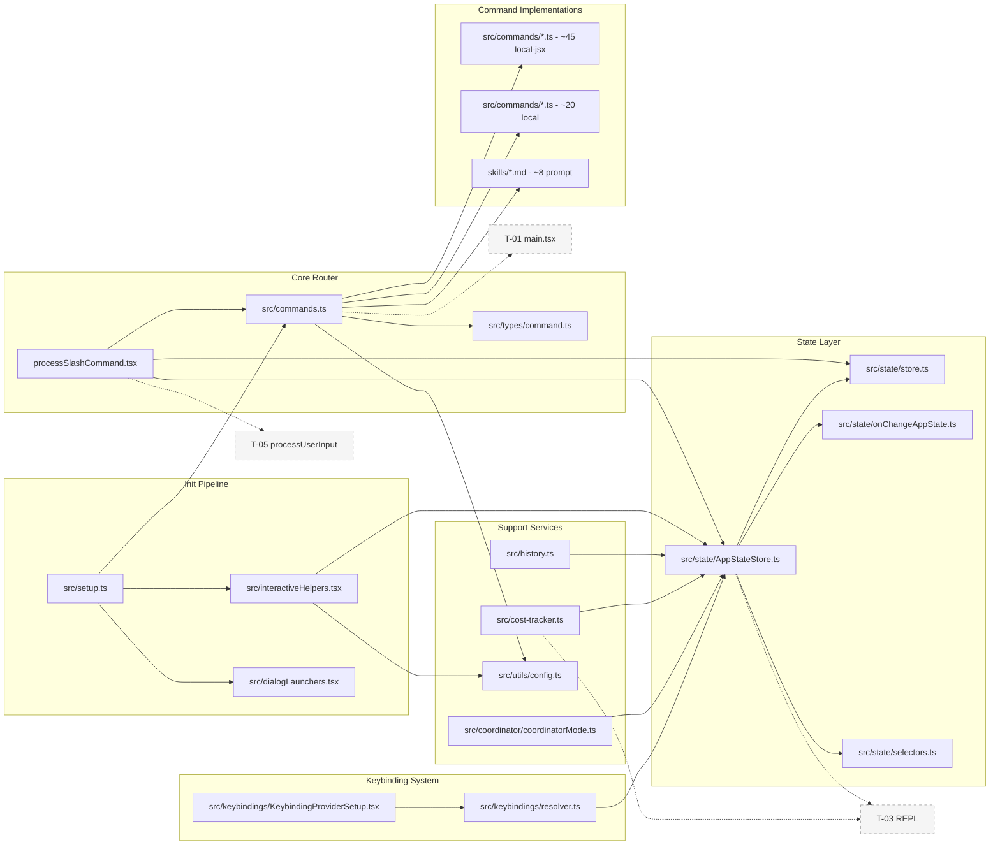
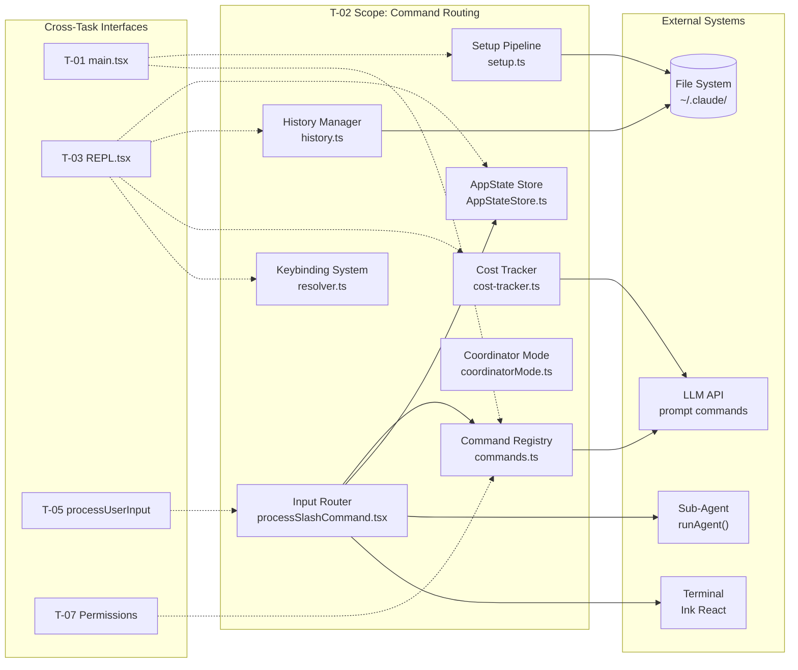
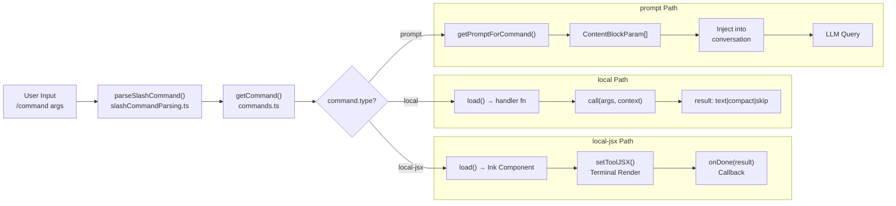
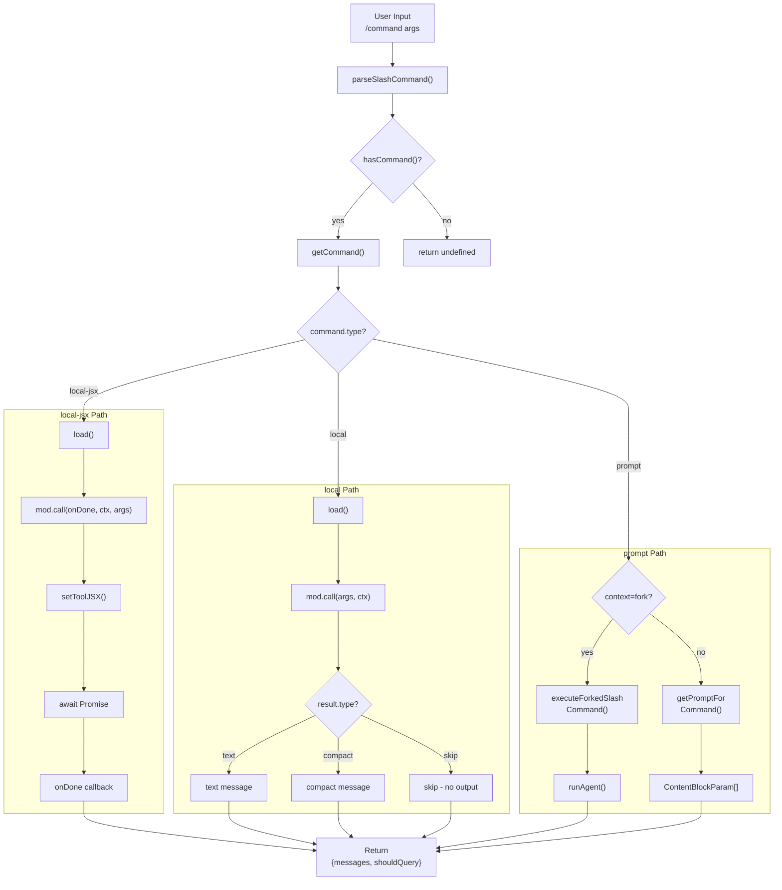
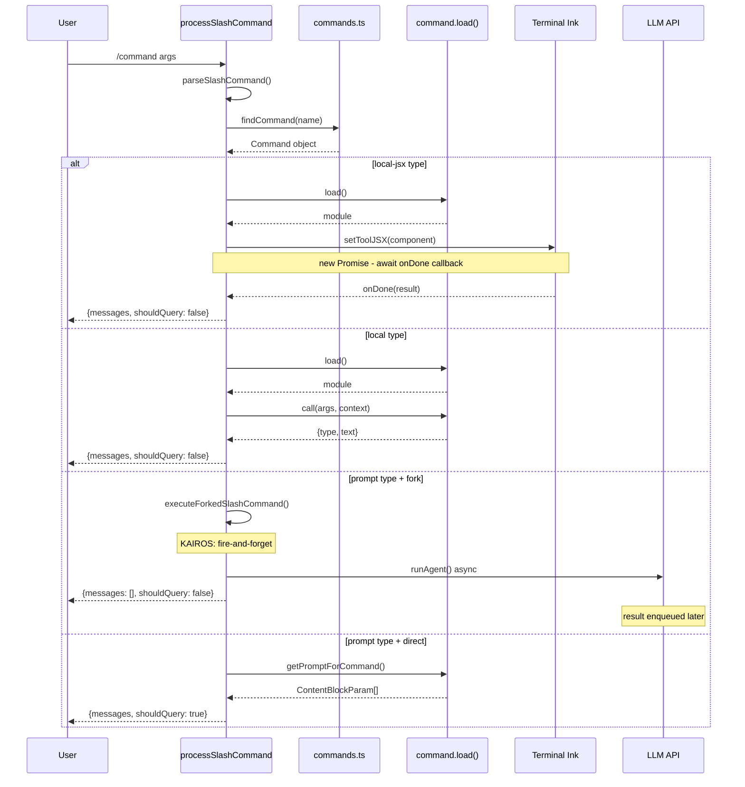
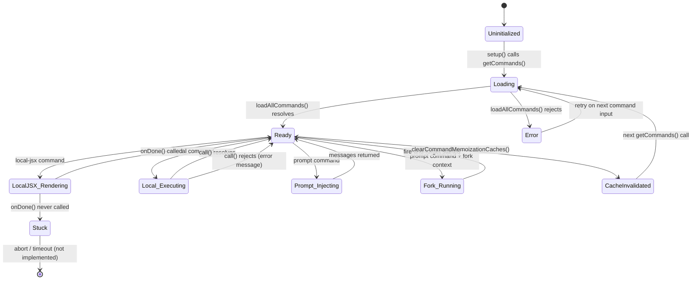
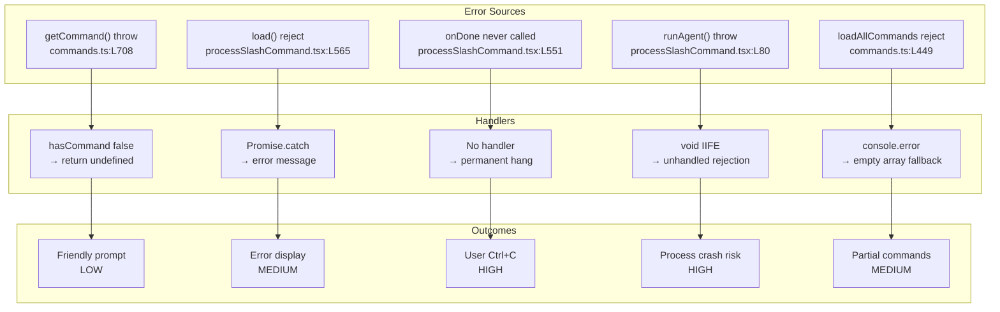

<!-- analysis-version: 0 | commit: a5179f6588dd03cbe83a8d8b718a61875dba7b24 | updated: 2025-07-14 | mode: full | task: T-02 -->
# T-02 Analysis: 命令路由与REPL启动

## Scope Confirmation
- Task ID: T-02
- Primary Mainline: ML-01
- ML Priority: P1
- Analysis Depth: DEEP
- Secondary Mainlines: ML-02 (QueryEngine input routing), ML-04 (permissions), ML-07 (rendering), ML-12 (plugins)
- Pattern Coverage: null
- Scope Files (confirmed): 207 files, 55,902 lines — all verified readable
- Scope adjustments: None — all 207 files present and readable
- Dependencies: T-01 (CLI entry/init sequence — this task picks up after init completes)

## File Roles

| File | Lines | One-liner Role | Where Analyzed |
|------|-------|----------------|---------------|
| src/assistant/sessionHistory.ts | 87 | Session history CRUD and listing for assistant sessions | OVERVIEW (enumerated only) |
| src/buddy/CompanionSprite.tsx | 370 | Animated companion sprite React component for buddy feature | OVERVIEW (enumerated only) |
| src/buddy/companion.ts | 133 | Companion state machine and lifecycle management | OVERVIEW (enumerated only) |
| src/buddy/prompt.ts | 36 | Buddy system prompt fragment | OVERVIEW (enumerated only) |
| src/buddy/types.ts | 148 | Type definitions for buddy/companion feature | OVERVIEW (enumerated only) |
| src/buddy/useBuddyNotification.tsx | 97 | React hook for buddy notification rendering | OVERVIEW (enumerated only) |
| src/cli/print.ts | 5594 | CLI output formatting: colors, banners, tables, spinners, structured messages | DEEP: § Function-Level Analysis |
| src/cli/structuredIO.ts | 859 | Structured I/O for non-interactive/JSON output mode | OVERVIEW (enumerated only) |
| src/commands.ts | 754 | **命令注册中枢**: COMMANDS memoize + loadAllCommands 6源并行加载 + getCommands过滤 + findCommand三路匹配 | DEEP: § Function-Level Analysis |
| src/commands/add-dir/add-dir.tsx | 125 | `/add-dir` command UI: directory picker with validation | OVERVIEW (enumerated only) |
| src/commands/add-dir/validation.ts | 110 | Directory path validation logic for add-dir | OVERVIEW (enumerated only) |
| src/commands/advisor.ts | 109 | `/advisor` local command: inline cost/model toggle operating on AppState | DEEP: § 关键路径与组件 |
| src/commands/branch/branch.ts | 296 | `/branch` command: conversation branching logic | OVERVIEW (enumerated only) |
| src/commands/bridge-kick.ts | 200 | `/bridge-kick` command: inject bridge failure states for testing | OVERVIEW (enumerated only) |
| src/commands/bridge/bridge.tsx | 508 | `/bridge` command: remote control session setup UI | OVERVIEW (enumerated only) |
| src/commands/brief.ts | 130 | `/brief` local-jsx command: toggle brief-only output mode | OVERVIEW (enumerated only) |
| src/commands/btw/btw.tsx | 242 | `/btw` command: feedback/conversation UI | OVERVIEW (enumerated only) |
| src/commands/chrome/chrome.tsx | 284 | `/chrome` command: Claude in Chrome settings UI | OVERVIEW (enumerated only) |
| src/commands/clear/caches.ts | 144 | `/clear` cache invalidation logic | OVERVIEW (enumerated only) |
| src/commands/clear/conversation.ts | 251 | `/clear` conversation reset implementation | OVERVIEW (enumerated only) |
| src/commands/color/color.ts | 93 | `/color` local-jsx command: session prompt bar color picker | OVERVIEW (enumerated only) |
| src/commands/commit-push-pr.ts | 158 | `/commit-push-pr` prompt command: AI-driven commit+push+PR workflow | DEEP: § 关键路径与组件 |
| src/commands/commit.ts | 92 | `/commit` prompt command: AI-driven git commit creation | DEEP: § 关键路径与组件 |
| src/commands/compact/compact.ts | 287 | `/compact` local command: multi-path compaction (sessionMemory/reactive/micro/full) | DEEP: § 关键路径与组件 |
| src/commands/context/context-noninteractive.ts | 325 | `/context` non-interactive mode: text-based context visualization | OVERVIEW (enumerated only) |
| src/commands/context/context.tsx | 63 | `/context` interactive command: React grid context visualization | OVERVIEW (enumerated only) |
| src/commands/copy/copy.tsx | 370 | `/copy` command: copy conversation to clipboard | OVERVIEW (enumerated only) |
| src/commands/createMovedToPluginCommand.ts | 65 | Factory for deprecated commands migrated to plugins | OVERVIEW (enumerated only) |
| src/commands/effort/effort.tsx | 182 | `/effort` command: set model reasoning effort level | OVERVIEW (enumerated only) |
| src/commands/export/export.tsx | 90 | `/export` command: export conversation to file | OVERVIEW (enumerated only) |
| src/commands/extra-usage/extra-usage-core.ts | 118 | `/extra-usage` core logic for usage limit configuration | OVERVIEW (enumerated only) |
| src/commands/fast/fast.tsx | 268 | `/fast` command: toggle fast mode | OVERVIEW (enumerated only) |
| src/commands/help/index.ts | 10 | `/help` local-jsx command: dynamic import of help UI | DEEP: § 关键路径与组件 |
| src/commands/ide/ide.tsx | 645 | `/ide` command: IDE integration status and management UI | OVERVIEW (enumerated only) |
| src/commands/init-verifiers.ts | 262 | `/init-verifiers` prompt command: skill-based verifier initialization | DEEP: § 关键路径与组件 |
| src/commands/init.ts | 256 | `/init` prompt command: skill-based project initialization | DEEP: § 关键路径与组件 |
| src/commands/insights.ts | 3200 | `/insights` prompt command: session analysis and usage report generation | DEEP: § 关键路径与组件 |
| src/commands/install-github-app/ApiKeyStep.tsx | 230 | GitHub Actions install: API key input step UI | OVERVIEW (enumerated only) |
| src/commands/install-github-app/CheckExistingSecretStep.tsx | 189 | GitHub Actions install: check existing secrets step | OVERVIEW (enumerated only) |
| src/commands/install-github-app/ChooseRepoStep.tsx | 210 | GitHub Actions install: repository selection step | OVERVIEW (enumerated only) |
| src/commands/install-github-app/CreatingStep.tsx | 64 | GitHub Actions install: creation progress step | OVERVIEW (enumerated only) |
| src/commands/install-github-app/ErrorStep.tsx | 84 | GitHub Actions install: error display step | OVERVIEW (enumerated only) |
| src/commands/install-github-app/ExistingWorkflowStep.tsx | 102 | GitHub Actions install: existing workflow detection step | OVERVIEW (enumerated only) |
| src/commands/install-github-app/InstallAppStep.tsx | 93 | GitHub Actions install: app installation step | OVERVIEW (enumerated only) |
| src/commands/install-github-app/OAuthFlowStep.tsx | 275 | GitHub Actions install: OAuth authentication flow step | OVERVIEW (enumerated only) |
| src/commands/install-github-app/SuccessStep.tsx | 95 | GitHub Actions install: success confirmation step | OVERVIEW (enumerated only) |
| src/commands/install-github-app/WarningsStep.tsx | 72 | GitHub Actions install: warnings display step | OVERVIEW (enumerated only) |
| src/commands/install-github-app/install-github-app.tsx | 586 | GitHub Actions install: multi-step wizard orchestrator | OVERVIEW (enumerated only) |
| src/commands/install-github-app/setupGitHubActions.ts | 325 | GitHub Actions install: GitHub API setup helper | OVERVIEW (enumerated only) |
| src/commands/install.tsx | 299 | `/install` command: install Claude Code integrations | OVERVIEW (enumerated only) |
| src/commands/keybindings/keybindings.ts | 53 | `/keybindings` command: open keybindings config file | OVERVIEW (enumerated only) |
| src/commands/logout/logout.tsx | 81 | `/logout` command: sign out from Anthropic account | OVERVIEW (enumerated only) |
| src/commands/mcp/addCommand.ts | 280 | `/mcp add` subcommand: add MCP server configuration | OVERVIEW (enumerated only) |
| src/commands/mcp/mcp.tsx | 84 | `/mcp` command: MCP server management wizard | OVERVIEW (enumerated only) |
| src/commands/mcp/xaaIdpCommand.ts | 266 | `/mcp` XAA IDP authentication subcommand | OVERVIEW (enumerated only) |
| src/commands/memory/memory.tsx | 89 | `/memory` command: edit CLAUDE.md memory files | OVERVIEW (enumerated only) |
| src/commands/mobile/mobile.tsx | 273 | `/mobile` command: QR code for mobile app download | OVERVIEW (enumerated only) |
| src/commands/model/model.tsx | 296 | `/model` command: model selection and switching UI | OVERVIEW (enumerated only) |
| src/commands/plan/plan.tsx | 121 | `/plan` command: plan mode toggle | OVERVIEW (enumerated only) |
| src/commands/plugin/AddMarketplace.tsx | 161 | Plugin marketplace: add marketplace URL UI | OVERVIEW (enumerated only) |
| src/commands/plugin/BrowseMarketplace.tsx | 801 | Plugin marketplace: browse and install plugins UI | OVERVIEW (enumerated only) |
| src/commands/plugin/DiscoverPlugins.tsx | 780 | Plugin marketplace: discover featured plugins UI | OVERVIEW (enumerated only) |
| src/commands/plugin/ManageMarketplaces.tsx | 837 | Plugin marketplace: manage marketplace URLs UI | OVERVIEW (enumerated only) |
| src/commands/plugin/PluginErrors.tsx | 123 | Plugin system: error display components | OVERVIEW (enumerated only) |
| src/commands/plugin/PluginOptionsDialog.tsx | 356 | Plugin system: plugin options configuration dialog | OVERVIEW (enumerated only) |
| src/commands/plugin/PluginOptionsFlow.tsx | 134 | Plugin system: options configuration flow | OVERVIEW (enumerated only) |
| src/commands/plugin/UnifiedInstalledCell.tsx | 564 | Plugin system: unified installed plugin list cell | OVERVIEW (enumerated only) |
| src/commands/plugin/ValidatePlugin.tsx | 97 | Plugin system: plugin validation logic | OVERVIEW (enumerated only) |
| src/commands/plugin/parseArgs.ts | 103 | Plugin system: argument parsing for plugin commands | OVERVIEW (enumerated only) |
| src/commands/plugin/pluginDetailsHelpers.tsx | 116 | Plugin system: plugin detail rendering helpers | OVERVIEW (enumerated only) |
| src/commands/plugin/usePagination.ts | 171 | Plugin system: pagination hook for plugin lists | OVERVIEW (enumerated only) |
| src/commands/privacy-settings/privacy-settings.tsx | 57 | `/privacy-settings` command: privacy configuration | OVERVIEW (enumerated only) |
| src/commands/rate-limit-options/rate-limit-options.tsx | 209 | `/rate-limit-options` command: rate limit options display | OVERVIEW (enumerated only) |
| src/commands/reload-plugins/reload-plugins.ts | 61 | `/reload-plugins` local command: reload plugin changes | OVERVIEW (enumerated only) |
| src/commands/remote-setup/api.ts | 182 | Remote setup: teleport API helpers | OVERVIEW (enumerated only) |
| src/commands/remote-setup/remote-setup.tsx | 186 | `/remote-setup` command: remote environment setup UI | OVERVIEW (enumerated only) |
| src/commands/rename/generateSessionName.ts | 67 | `/rename` helper: AI-based session name generation | OVERVIEW (enumerated only) |
| src/commands/rename/rename.ts | 87 | `/rename` command: rename current conversation | OVERVIEW (enumerated only) |
| src/commands/resume/resume.tsx | 274 | `/resume` command: resume previous conversation | OVERVIEW (enumerated only) |
| src/commands/review.ts | 57 | `/review` prompt command: PR review definition + `/ultrareview` local-jsx | DEEP: § 关键路径与组件 |
| src/commands/review/UltrareviewOverageDialog.tsx | 95 | Review: ultrareview usage overage dialog | OVERVIEW (enumerated only) |
| src/commands/review/reviewRemote.ts | 316 | Review: remote PR review execution logic | OVERVIEW (enumerated only) |
| src/commands/review/ultrareviewCommand.tsx | 57 | Review: ultrareview command definition | OVERVIEW (enumerated only) |
| src/commands/sandbox-toggle/sandbox-toggle.tsx | 82 | `/sandbox-toggle` command: toggle sandbox mode | OVERVIEW (enumerated only) |
| src/commands/security-review.ts | 243 | `/security-review` prompt command: security review of branch changes | OVERVIEW (enumerated only) |
| src/commands/tag/tag.tsx | 214 | `/tag` command: toggle searchable session tags | OVERVIEW (enumerated only) |
| src/commands/terminalSetup/terminalSetup.tsx | 530 | `/terminal-setup` command: terminal shell integration setup | OVERVIEW (enumerated only) |
| src/commands/theme/theme.tsx | 56 | `/theme` command: theme selection | OVERVIEW (enumerated only) |
| src/commands/thinkback/thinkback.tsx | 553 | `/thinkback` command: year-in-review animation | OVERVIEW (enumerated only) |
| src/commands/ultraplan.tsx | 470 | `/ultraplan` command: advanced planning mode | OVERVIEW (enumerated only) |
| src/commands/voice/voice.ts | 150 | `/voice` local command: voice mode toggle | OVERVIEW (enumerated only) |
| src/constants/apiLimits.ts | 94 | API rate limit constants and thresholds | OVERVIEW (enumerated only) |
| src/constants/betas.ts | 52 | Feature flag/beta constants | OVERVIEW (enumerated only) |
| src/constants/common.ts | 33 | Shared common constants | OVERVIEW (enumerated only) |
| src/constants/cyberRiskInstruction.ts | 24 | Cyber risk assessment instruction constant | OVERVIEW (enumerated only) |
| src/constants/figures.ts | 45 | ASCII art figures for CLI display | OVERVIEW (enumerated only) |
| src/constants/files.ts | 156 | File path constants (config dirs, history paths, etc.) | OVERVIEW (enumerated only) |
| src/constants/github-app.ts | 144 | GitHub App constants (repo URLs, app IDs) | OVERVIEW (enumerated only) |
| src/constants/outputStyles.ts | 216 | Output style definitions and rendering constants | OVERVIEW (enumerated only) |
| src/constants/product.ts | 76 | Product branding constants | OVERVIEW (enumerated only) |
| src/constants/prompts.ts | 914 | System prompt fragments and template strings | OVERVIEW (enumerated only) |
| src/constants/spinnerVerbs.ts | 204 | Spinner animation verb lists by context | OVERVIEW (enumerated only) |
| src/constants/system.ts | 95 | System-level constants (env vars, paths) | OVERVIEW (enumerated only) |
| src/constants/systemPromptSections.ts | 68 | System prompt section ordering constants | OVERVIEW (enumerated only) |
| src/constants/toolLimits.ts | 56 | Tool execution limit constants | OVERVIEW (enumerated only) |
| src/constants/xml.ts | 86 | XML tag constants for prompt formatting | OVERVIEW (enumerated only) |
| src/context/QueuedMessageContext.tsx | 62 | React context: queue messages for deferred processing | OVERVIEW (enumerated only) |
| src/context/mailbox.tsx | 37 | React context: simple pub/sub mailbox for cross-component messages | OVERVIEW (enumerated only) |
| src/context/modalContext.tsx | 57 | React context: modal dialog state management | OVERVIEW (enumerated only) |
| src/context/overlayContext.tsx | 150 | React context: overlay UI state (notifications, status bar) | OVERVIEW (enumerated only) |
| src/context/promptOverlayContext.tsx | 124 | React context: prompt overlay UI state management | OVERVIEW (enumerated only) |
| src/context/stats.tsx | 219 | React context: session stats tracking (token usage, turn count) | OVERVIEW (enumerated only) |
| src/context/voice.tsx | 87 | React context: voice mode state management | OVERVIEW (enumerated only) |
| src/coordinator/coordinatorMode.ts | 369 | Coordinator mode: env var config + system prompt for worker orchestration | DEEP: § Function-Level Analysis |
| src/cost-tracker.ts | 323 | Token/cost accumulator: session cost tracking + advisor recursive calculation | DEEP: § Function-Level Analysis |
| src/costHook.ts | 22 | Thin hook: writes cost data to event stream on each turn | DEEP: § 关键路径与组件 |
| src/dev-entry.ts | 122 | Development entry point: hot-reload support for local dev | OVERVIEW (enumerated only) |
| src/dialogLaunchers.tsx | 132 | 7 thin dialog launchers: dynamic imports for setup dialogs | DEEP: § Function-Level Analysis |
| src/history.ts | 464 | JSONL history persistence with lockfile, pending buffer, paste dedup | DEEP: § Function-Level Analysis |
| src/interactiveHelpers.tsx | 365 | Show dialogs/setup screens: Onboarding→Trust→MCP→ClaudeMD→APIKey→Bypass→AutoMode→DevChannels→Chrome 9-step chain | DEEP: § Function-Level Analysis |
| src/keybindings/KeybindingContext.tsx | 242 | React context: keybinding provider with chord state | OVERVIEW (enumerated only) |
| src/keybindings/defaultBindings.ts | 340 | Default keybinding definitions for all built-in actions | OVERVIEW (enumerated only) |
| src/keybindings/loadUserBindings.ts | 472 | User keybinding loading from config file with merge strategy | OVERVIEW (enumerated only) |
| src/keybindings/match.ts | 120 | Keybinding match algorithm with modifier handling | OVERVIEW (enumerated only) |
| src/keybindings/parser.ts | 203 | Keybinding string parser (e.g. "ctrl+k ctrl+s") | OVERVIEW (enumerated only) |
| src/keybindings/reservedShortcuts.ts | 127 | Reserved shortcut definitions that cannot be overridden | OVERVIEW (enumerated only) |
| src/keybindings/resolver.ts | 244 | **Key resolver**: resolveKey/resolveKeyWithChordState, pure function matching | DEEP: § Function-Level Analysis |
| src/keybindings/schema.ts | 236 | JSON schema for user keybinding validation | OVERVIEW (enumerated only) |
| src/keybindings/template.ts | 52 | Keybinding template expansion macros | OVERVIEW (enumerated only) |
| src/keybindings/useKeybinding.ts | 196 | React hook: register and dispatch keybindings | OVERVIEW (enumerated only) |
| src/keybindings/validate.ts | 498 | Keybinding validation: detect conflicts and invalid combinations | OVERVIEW (enumerated only) |
| src/migrations/migrateAutoUpdatesToSettings.ts | 61 | Migration: auto-updates config to settings | OVERVIEW (enumerated only) |
| src/migrations/migrateEnableAllProjectMcpServersToSettings.ts | 118 | Migration: per-project MCP server enablement to settings | OVERVIEW (enumerated only) |
| src/migrations/migrateFennecToOpus.ts | 45 | Migration: rename Fennec model references to Opus | OVERVIEW (enumerated only) |
| src/migrations/migrateLegacyOpusToCurrent.ts | 57 | Migration: update legacy Opus model references | OVERVIEW (enumerated only) |
| src/migrations/migrateOpusToOpus1m.ts | 43 | Migration: Opus to Opus-1m model upgrade | OVERVIEW (enumerated only) |
| src/migrations/migrateReplBridgeEnabledToRemoteControlAtStartup.ts | 22 | Migration: bridge enablement to remote control setting | OVERVIEW (enumerated only) |
| src/migrations/migrateSonnet1mToSonnet45.ts | 48 | Migration: Sonnet-1m to Sonnet-4.5 model upgrade | OVERVIEW (enumerated only) |
| src/migrations/migrateSonnet45ToSonnet46.ts | 67 | Migration: Sonnet-4.5 to Sonnet-4.6 model upgrade | OVERVIEW (enumerated only) |
| src/migrations/resetAutoModeOptInForDefaultOffer.ts | 51 | Migration: reset auto-mode opt-in for new default offer | OVERVIEW (enumerated only) |
| src/migrations/resetProToOpusDefault.ts | 51 | Migration: reset Pro plan default to Opus | OVERVIEW (enumerated only) |
| src/moreright/useMoreRight.tsx | 25 | React hook: expandable "more right" panel | OVERVIEW (enumerated only) |
| src/outputStyles/loadOutputStylesDir.ts | 98 | Output style loader: scan and load custom output style dirs | OVERVIEW (enumerated only) |
| src/plugins/builtinPlugins.ts | 159 | Built-in plugin definitions and loading | OVERVIEW (enumerated only) |
| src/plugins/bundled/index.ts | 23 | Bundled plugins registry | OVERVIEW (enumerated only) |
| src/proactive/index.ts | 57 | Proactive suggestions initialization | OVERVIEW (enumerated only) |
| src/projectOnboardingState.ts | 83 | Project onboarding state management | OVERVIEW (enumerated only) |
| src/query/tokenBudget.ts | 93 | Token budget calculator for context window management | OVERVIEW (enumerated only) |
| src/remote/RemoteSessionManager.ts | 343 | Remote session lifecycle: create/manage/destroy remote sessions | OVERVIEW (enumerated only) |
| src/remote/SessionsWebSocket.ts | 404 | WebSocket transport: real-time remote session communication | OVERVIEW (enumerated only) |
| src/remote/sdkMessageAdapter.ts | 302 | SDK message adapter: translate between SDK and internal message formats | OVERVIEW (enumerated only) |
| src/schemas/hooks.ts | 222 | Hook schemas: validate hook configurations | OVERVIEW (enumerated only) |
| src/screens/ResumeConversation.tsx | 398 | Resume conversation screen: list and select previous sessions | OVERVIEW (enumerated only) |
| src/server/createDirectConnectSession.ts | 88 | Direct connect: create P2P session between clients | OVERVIEW (enumerated only) |
| src/server/directConnectManager.ts | 213 | Direct connect manager: session routing and lifecycle | OVERVIEW (enumerated only) |
| src/server/types.ts | 57 | Server type definitions for direct connect | OVERVIEW (enumerated only) |
| src/setup.ts | 477 | **17-step init pipeline**: permissions, settings, telemetry, commands prefetch | DEEP: § Function-Level Analysis |
| src/state/AppStateStore.ts | 569 | **AppState god object**: ~100+ fields, DeepImmutable proxy, getter/setter per field | DEEP: § Function-Level Analysis |
| src/state/onChangeAppState.ts | 171 | State change side effects: telemetry, auto-mode, UI sync | DEEP: § Function-Level Analysis |
| src/state/selectors.ts | 76 | Pure selectors: getActiveAgentForInput three-way routing | DEEP: § Function-Level Analysis |
| src/state/store.ts | 34 | Generic createStore: closure-based state container factory | DEEP: § Function-Level Analysis |
| src/state/teammateViewHelpers.ts | 141 | Teammate view helper functions for multi-agent display | OVERVIEW (enumerated only) |
| src/types/command.ts | 216 | **Command type system**: PromptCommand/LocalCommand/LocalJSXCommand union types | DEEP: § Function-Level Analysis |
| src/types/generated/events_mono/claude_code/v1/claude_code_internal_event.ts | 865 | Generated telemetry event types | OVERVIEW (enumerated only) |
| src/types/generated/events_mono/common/v1/auth.ts | 100 | Generated auth event types | OVERVIEW (enumerated only) |
| src/types/generated/events_mono/growthbook/v1/growthbook_experiment_event.ts | 223 | Generated experiment event types | OVERVIEW (enumerated only) |
| src/types/generated/google/protobuf/timestamp.ts | 187 | Generated protobuf timestamp type | OVERVIEW (enumerated only) |
| src/types/hooks.ts | 290 | Hook type definitions (lifecycle hooks) | OVERVIEW (enumerated only) |
| src/types/ids.ts | 44 | ID type aliases (SessionId, MessageId, etc.) | OVERVIEW (enumerated only) |
| src/types/logs.ts | 330 | Log entry type definitions | OVERVIEW (enumerated only) |
| src/types/message.ts | 134 | Message type definitions for conversation messages | OVERVIEW (enumerated only) |
| src/types/permissions.ts | 441 | Permission type definitions and rule structures | OVERVIEW (enumerated only) |
| src/types/plugin.ts | 363 | Plugin type definitions and interfaces | OVERVIEW (enumerated only) |
| src/types/textInputTypes.ts | 387 | Text input type definitions (completion, history, etc.) | OVERVIEW (enumerated only) |
| src/upstreamproxy/relay.ts | 455 | Upstream proxy relay: HTTP/HTTPS traffic forwarding | OVERVIEW (enumerated only) |
| src/upstreamproxy/upstreamproxy.ts | 285 | Upstream proxy configuration and management | OVERVIEW (enumerated only) |
| src/utils/claudeInChrome/chromeNativeHost.ts | 527 | Chrome native host: browser extension communication bridge | OVERVIEW (enumerated only) |
| src/utils/claudeInChrome/common.ts | 540 | Chrome integration: shared utilities and types | OVERVIEW (enumerated only) |
| src/utils/claudeInChrome/mcpServer.ts | 293 | Chrome integration: MCP server for browser automation | OVERVIEW (enumerated only) |
| src/utils/claudeInChrome/prompt.ts | 83 | Chrome integration: prompt templates for browser context | OVERVIEW (enumerated only) |
| src/utils/claudeInChrome/setup.ts | 400 | Chrome integration: setup and installation wizard | OVERVIEW (enumerated only) |
| src/utils/claudeInChrome/setupPortable.ts | 233 | Chrome integration: portable mode setup | OVERVIEW (enumerated only) |
| src/utils/claudeInChrome/toolRendering.tsx | 261 | Chrome integration: tool result rendering in browser | OVERVIEW (enumerated only) |
| src/utils/config.ts | 1817 | **Config manager**: load/save global+project config, settings migrations | DEEP: § Function-Level Analysis |
| src/utils/earlyInput.ts | 191 | Early input: read piped stdin before REPL starts | OVERVIEW (enumerated only) |
| src/utils/settings/applySettingsChange.ts | 92 | Settings: apply a single settings change to AppState | OVERVIEW (enumerated only) |
| src/utils/settings/changeDetector.ts | 488 | Settings: detect and merge changes from external config updates | OVERVIEW (enumerated only) |
| src/utils/settings/constants.ts | 202 | Settings: constant definitions for settings keys | OVERVIEW (enumerated only) |
| src/utils/settings/mdm/constants.ts | 81 | Settings MDM: MDM (Mobile Device Management) constants | OVERVIEW (enumerated only) |
| src/utils/settings/mdm/rawRead.ts | 130 | Settings MDM: raw MDM configuration reader | OVERVIEW (enumerated only) |
| src/utils/settings/mdm/settings.ts | 316 | Settings MDM: MDM policy application and enforcement | OVERVIEW (enumerated only) |
| src/utils/settings/permissionValidation.ts | 262 | Settings: permission validation for settings changes | OVERVIEW (enumerated only) |
| src/utils/settings/pluginOnlyPolicy.ts | 60 | Settings: plugin-only mode policy enforcement | OVERVIEW (enumerated only) |
| src/utils/settings/settings.ts | 1015 | Settings: core settings load/save/validate engine | OVERVIEW (enumerated only) |
| src/utils/settings/settingsCache.ts | 80 | Settings: in-memory cache for settings values | OVERVIEW (enumerated only) |
| src/utils/settings/toolValidationConfig.ts | 103 | Settings: tool validation configuration loader | OVERVIEW (enumerated only) |
| src/utils/settings/types.ts | 1148 | Settings: type definitions for all settings keys | OVERVIEW (enumerated only) |
| src/utils/settings/validation.ts | 265 | Settings: settings value validation rules | OVERVIEW (enumerated only) |
| src/utils/settings/validationTips.ts | 164 | Settings: user-facing validation tips and hints | OVERVIEW (enumerated only) |
| src/utils/sinks.ts | 16 | **Event sinks**: tiny module that initializes event sink observables | DEEP: § 关键路径与组件 |
| src/utils/startupProfiler.ts | 194 | Startup profiler: measure and report initialization phase timing | OVERVIEW (enumerated only) |
| src/utils/warningHandler.ts | 121 | Warning handler: capture and display deprecation warnings | OVERVIEW (enumerated only) |
| src/vim/motions.ts | 82 | Vim motions: text cursor movement commands | OVERVIEW (enumerated only) |
| src/vim/textObjects.ts | 186 | Vim text objects: selection targets (word, paragraph, etc.) | OVERVIEW (enumerated only) |
| src/vim/transitions.ts | 490 | Vim transitions: mode switching state machine | OVERVIEW (enumerated only) |
| src/vim/types.ts | 199 | Vim types: mode, motion, and operator type definitions | OVERVIEW (enumerated only) |
| src/voice/voiceModeEnabled.ts | 54 | Voice mode: feature flag and availability check | OVERVIEW (enumerated only) |

## Analysis Findings

### 关键路径与组件

**主命令路由链路** (用户输入 `/command args` → 命令执行完成):

```
用户输入 "/command args"
  → parseSlashCommand() [slashCommandParsing.ts]
  → processSlashCommand() [processSlashCommand.tsx:L309]
    → hasCommand(commandName, commands) [commands.ts:L700]
    → getMessagesForSlashCommand(commandName, args, ...) [processSlashCommand.tsx:L525]
      → getCommand(commandName, commands) [commands.ts:L704]
      → switch(command.type)
        ├─ 'local-jsx' → command.load().then(mod => mod.call(onDone, context, args))
        ├─ 'local'     → command.load().then(mod => mod.call(args, context))
        └─ 'prompt'    → if (command.context === 'fork')
                           → executeForkedSlashCommand() → runAgent() [sub-agent]
                         else
                           → getMessagesForPromptSlashCommand() → command.getPromptForCommand()
```

**命令注册链路** (启动时加载全部命令):

```
setup() [setup.ts]
  → getCommands(cwd) [commands.ts:L476] — fire-and-forget prefetch
  → loadAllCommands(cwd) [commands.ts:L449] — memoized by cwd
    → Promise.all([
        getSkills(cwd)                     — skillDirCommands + pluginSkills + bundledSkills + builtinPluginSkills
        getPluginCommands()                — plugin commands from installed plugins
        getWorkflowCommands?.(cwd)         — workflow-based commands (feature gated)
      ])
    → [...bundledSkills, ...builtinPluginSkills, ...skillDirCommands, ...workflowCommands,
       ...pluginCommands, ...pluginSkills, ...COMMANDS()]  // ~95 built-in commands
    → filter by meetsAvailabilityRequirement() + isCommandEnabled()
    → merge getDynamicSkills() (discovered during file operations)
```

**核心组件清单**:

| 组件 | 文件:行 | 职责 |
|------|---------|------|
| `COMMANDS()` | commands.ts:L258 | lodash memoize 工厂，静态导入 ~65 个内置命令 + 条件编译 ~30 个 feature-gated 命令 |
| `getCommands()` | commands.ts:L476 | 主入口：加载 6 源命令 + 过滤可用性 + 动态技能合并 |
| `processSlashCommand()` | processSlashCommand.tsx:L309 | 三路分发器：解析 → 查找 → 按类型分发 |
| `getMessagesForSlashCommand()` | processSlashCommand.tsx:L525 | 命令执行核心：local-jsx/local/prompt 三种执行模式 |
| `executeForkedSlashCommand()` | processSlashCommand.tsx:L62 | Fork 模式：KAIROS 下 fire-and-forget / 非 KAIROS 同步 runAgent |
| `AppStateStore` | state/AppStateStore.ts | ~100+ 字段巨型单例，DeepImmutable 代理，命令/REPL 全局状态 |
| `setup()` | setup.ts | 17 步初始化管线，含 getCommands fire-and-forget 预取 |
| `getActiveAgentForInput()` | state/selectors.ts:L59 | 三路输入路由：leader / viewed teammate / named agent |

### 架构洞察

1. **命令三分型（Command Trichotomy）** 是整个系统的核心抽象：
   - **PromptCommand** (`type: 'prompt'`): AI prompt 展开。`getPromptForCommand()` 返回 `ContentBlockParam[]`，注入对话作为用户消息。`shouldQuery=true` 触发 LLM 调用。支持 `context:'fork'` 子 agent 执行。这是技能/技能系统的承载类型。
   - **LocalCommand** (`type: 'local'`): 纯函数执行。`load()` 返回 `{call(args, context)}` 同步/异步执行。`shouldQuery=false`。结果类型 `LocalCommandResult = text | compact | skip`。
   - **LocalJSXCommand** (`type: 'local-jsx'`): Ink UI 渲染。`load()` 返回 `{call(onDone, context, args)}` 异步执行。通过 `setToolJSX()` 渲染 React 组件到终端。`onDone` 回调控制完成后的消息流。

2. **六层命令源（Six-Layer Command Source）** — 命令优先级从高到低：
   ```
   bundledSkills > builtinPluginSkills > skillDirCommands > workflowCommands > pluginCommands > pluginSkills > COMMANDS()内置
   ```
   - `bundledSkills`: 随产品分发的内置技能 (via `getBundledSkills()`)
   - `builtinPluginSkills`: 启用的内置插件提供的技能 (via `getBuiltinPluginSkillCommands()`)
   - `skillDirCommands`: 用户 `.claude/skills/` 目录下的自定义技能 (via `getSkillDirCommands()`)
   - `workflowCommands`: workflow 脚本生成的命令 (feature gated: `WORKFLOW_SCRIPTS`)
   - `pluginCommands/pluginSkills`: 第三方插件提供的命令和技能
   - `COMMANDS()`: ~95 个硬编码内置命令

3. **AppState 巨型单例** — `AppStateStore.ts`(569 行) 管理 ~100+ 字段，通过 `DeepImmutable` 代理强制不可变，每个字段一个 getter/setter。无变更追踪、无观察者模式、无细粒度订阅。状态变化通过 `onChangeAppState.ts`(171 行) 处理副作用（遥测、auto-mode 同步、UI 刷新）。

4. **条件编译（Dead Code Elimination）** — `commands.ts` 使用 Bun 的 `feature()` 编译时标志，大量命令在构建时被消除：`KAIROS`、`BRIDGE_MODE`、`VOICE_MODE`、`WORKFLOW_SCRIPTS`、`PROACTIVE` 等 ~15 个 feature gate。`require()` 而非 `import` 确保未启用的命令完全不进入 bundle。

5. **Lazy Loading（延迟加载）** — 重型命令如 `insights.ts`(3200 行/113KB) 通过 lazy shim 延迟加载：`getPromptForCommand()` 内部 `await import('./commands/insights.js')`。所有 `local-jsx` 和 `local` 命令也通过 `load()` 方法延迟加载，避免启动时加载全部命令实现。

6. **双白名单安全模型** — `REMOTE_SAFE_COMMANDS`(17 个) 和 `BRIDGE_SAFE_COMMANDS`(6 个) 分别控制远程模式和 bridge 模式下的命令可用性。`local-jsx` 命令在 bridge 模式下完全阻止（会渲染 Ink UI），`prompt` 命令默认允许（展开为文本）。

### 观察到的模式

1. **Command Registry Pattern** — `commands.ts` 是命令注册中心，使用 lodash `memoize` 缓存命令列表。`COMMANDS()` 是惰性工厂，`loadAllCommands()` 按 cwd 缓存。`clearCommandMemoizationCaches()` 手动失效缓存。

2. **Strategy Pattern (三路分发)** — `getMessagesForSlashCommand()` 的 `switch(command.type)` 实现策略模式：三种命令类型有完全不同的执行策略和消息构建逻辑。

3. **Observer Pattern (store.ts)** — `createStore<T>()` 实现极简观察者模式：closure state + Set<Listener> + subscribe/unsubscribe。用于 AppState 的变更通知。

4. **Fire-and-Forget Pattern** — KAIROS 模式下的 fork 命令使用 `void (async () => { ... })()` 模式：后台执行子 agent，完成后通过 `enqueuePendingNotification()` 将结果重新注入队列。主线程立即返回空消息。

5. **Lazy Shim Pattern** — `insights` 命令在 `commands.ts:L190` 定义了一个轻量壳，`getPromptForCommand()` 内部动态 `import` 真正的重型实现。模式被复用于所有 `load()` 延迟加载的命令。

6. **Feature Flag Conditional Import** — `process.env.USER_TYPE === 'ant'` 和 `feature('KAIROS')` 等条件控制 `require()` vs `null`，Bun 编译器可以完全消除未使用分支。

### 与共享模块的交互

- **`src/types/command.ts`** (owner: T-02): 定义 Command 联合类型，被 commands.ts 重新导出。被 T-01 (main.tsx)、T-05 (processUserInput.ts)、T-07 (PermissionRuleList.tsx) 等多个 task 引用。
- **`src/state/AppStateStore.ts`** (owner: T-02): AppState 巨型单例，被几乎所有 task 引用。特别被 T-01 (init)、T-03 (REPL)、T-05 (processUserInput) 直接依赖。
- **`src/utils/processUserInput/processSlashCommand.tsx`** (owner: T-02): 核心命令分发器，被 T-05 (processUserInput) 的 `processUserInput.ts` 调用。
- **`src/utils/config.ts`** (owner: T-02): 配置管理器(1817行)，被 T-01 (setup) 和 T-05 (processUserInput) 引用。本 task scope 内仅分析命令相关部分。
- **`src/setup.ts`** (owner: T-02): 初始化管线，被 T-01 (main.tsx init()) 调用。
- **`src/cost-tracker.ts`** (owner: T-02): cost 累加器，被 T-03 (REPL) 的 `/cost` 命令和 T-05 的 query 循环引用。
- **`src/keybindings/resolver.ts`** (owner: T-02): 键绑定解析器，被 T-03 (REPL) 的 TextInput 引用。
- **`src/history.ts`** (owner: T-02): 历史持久化，被 T-03 (REPL) 引用。
- **`src/interactiveHelpers.tsx`** (owner: T-02): 设置向导，被 T-01 (init) 的 showSetupScreens 调用。
- **`src/dialogLaunchers.tsx`** (owner: T-02): 对话启动器，被 T-03 (REPL) 和 T-05 (processUserInput) 引用。


## File Dependency Graph

### Dependency Diagram



### Dependency Table

| Source File | Depends On | Type | Direction |
|------------|-----------|------|-----------|
| commands.ts | types/command.ts | import (type re-export) | outgoing |
| commands.ts | utils/config.ts | import (reads config for feature flags) | outgoing |
| processSlashCommand.tsx | commands.ts | import (getCommand, findCommand, hasCommand) | outgoing |
| processSlashCommand.tsx | state/AppStateStore.ts | import (reads appState for context) | outgoing |
| AppStateStore.ts | state/store.ts | import (createStore) | outgoing |
| AppStateStore.ts | state/onChangeAppState.ts | import (onChange callback) | outgoing |
| AppStateStore.ts | state/selectors.ts | import (pure selector functions) | outgoing |
| setup.ts | commands.ts | import (getCommands prefetch) | outgoing |
| setup.ts | interactiveHelpers.tsx | import (showSetupScreens) | outgoing |
| setup.ts | dialogLaunchers.tsx | import (dialog launchers) | outgoing |
| history.ts | state/AppStateStore.ts | import (reads session state) | outgoing |
| cost-tracker.ts | state/AppStateStore.ts | import (reads/writes cost state) | outgoing |
| coordinatorMode.ts | state/AppStateStore.ts | import (reads coordinator state) | outgoing |
| keybindings/resolver.ts | state/AppStateStore.ts | import (reads keybinding config) | outgoing |
| KeybindingProviderSetup.tsx | keybindings/resolver.ts | import (resolver logic) | outgoing |
| commands.ts | src/commands/*.ts | dynamic import (lazy load) | outgoing |

> 虚线表示 scope 外的依赖（跨 task 引用）

## Boundary / Integration Map



- **图说明**: T-02 scope 是命令系统的核心。外部系统包括 LLM API（prompt 命令触发）、Sub-Agent（fork 模式）、File System（history/config 持久化）和 Terminal（Ink UI 渲染）。跨 task 接口主要通过 AppState 共享状态。

## Data Flow View



- **图说明**: 数据流从用户输入到三种执行路径的分发。local-jsx 路径渲染 Ink UI 组件；local 路径直接执行纯函数；prompt 路径将命令展开为 AI prompt 注入对话并触发 LLM 调用。关键变换点在 `getMessagesForSlashCommand()` (processSlashCommand.tsx:L525) 的三路 switch。

## Function-Level Analysis

### src/commands.ts (754 lines) — Command Registry Hub

#### `COMMANDS(): Command[]`
- **职责**: lodash memoize 工厂，返回所有内置命令列表。首次调用时创建 ~95 个命令对象。
- **关键逻辑**: 
  - 使用 `_.memoize(() => [...])` 缓存，首次展开构建数组
  - 内置 ~65 个无条件命令直接 `import` + `require()`
  - ~30 个条件编译命令使用 `feature('FLAG') ? require('./path') : null` 模式
  - Bun 编译器可完全消除 `null` 分支
  - `insights` 命令使用 lazy shim (commands.ts:L190)，`getPromptForCommand()` 内部 `await import`
- **调用**: 被 `getCommands()`, `loadAllCommands()` 调用
- **被调用**: `commands.ts` 内部
- **复杂度**: MEDIUM — memoize 简单，但条件编译量大

#### `loadAllCommands(cwd: string): Promise<Command[]>`
- **职责**: 加载全部命令源（6层），按 cwd 缓存
- **关键逻辑**:
  - `Promise.all([getSkills(cwd), getPluginCommands(), getWorkflowCommands?.(cwd)])` 三路并行
  - 合并顺序: bundledSkills → builtinPluginSkills → skillDirCommands → workflowCommands → pluginCommands → pluginSkills → COMMANDS()
  - 过滤: `meetsAvailabilityRequirement()` + `isCommandEnabled()`
  - 结果按 `memoizeByCwd` 缓存，key = cwd
- **调用**: `getSkills()`, `getPluginCommands()`, `getWorkflowCommands()`, `COMMANDS()`
- **被调用**: `getCommands()`
- **复杂度**: MEDIUM — 6源并行 + 过滤 + 缓存

#### `getCommands(cwd: string, opts?): Promise<Command[]>`
- **职责**: 获取可用命令列表，含动态技能合并
- **关键逻辑** (commands.ts:L476):
  - 调用 `loadAllCommands(cwd)` 获取基础命令
  - 从 `getDynamicSkills()` 获取运行时发现的技能
  - 按优先级合并: 动态技能 > 静态命令
  - 在 bridge/remote 模式下应用白名单过滤
- **调用**: `loadAllCommands()`, `getDynamicSkills()`
- **被调用**: `setup()` (fire-and-forget prefetch), `processSlashCommand()` (查找时)
- **复杂度**: MEDIUM

#### `findCommand(commandName: string, commands: Command[]): Command | undefined`
- **职责**: 按名称查找命令，支持 aliases
- **关键逻辑**: 遍历 commands，匹配 `command.name === commandName || command.aliases?.includes(commandName)`
- **复杂度**: LOW — O(n) 线性搜索，未使用 Map

#### `hasCommand(commandName: string, commands: Command[]): boolean`
- **职责**: 检查命令是否存在
- **关键逻辑**: `findCommand() !== undefined`
- **复杂度**: LOW

#### `getCommand(commandName: string, commands: Command[]): Command`
- **职责**: 获取命令，不存在抛错
- **关键逻辑**: `findCommand()` 或抛出 Error
- **复杂度**: LOW

#### `clearCommandMemoizationCaches(): void`
- **职责**: 清除所有命令缓存，强制下次重新加载
- **关键逻辑**: 清除 `COMMANDS` memoize 缓存 + `loadAllCommands` 的 cwd 缓存
- **被调用**: 当命令源变化时（技能安装/卸载）
- **复杂度**: LOW

### src/types/command.ts (216 lines) — Command Type Definitions

#### Type: `Command = PromptCommand | LocalCommand | LocalJSXCommand`
- **职责**: 命令联合类型的三分型定义
- **关键逻辑**:
  - `PromptCommand`: `{ type: 'prompt', getPromptForCommand(args, context): Promise<ContentBlockParam[]>, shouldQuery: true, context?: 'fork'|'thread', ... }`
  - `LocalCommand`: `{ type: 'local', load(): Promise<{call(args, context): Promise<LocalCommandResult>}>, shouldQuery: false, ... }`
  - `LocalJSXCommand`: `{ type: 'local-jsx', load(): Promise<{call(onDone, context, args): void}>, shouldQuery: false, ... }`
- **复杂度**: LOW — 纯类型定义

#### Type: `LocalCommandResult = { type: 'text', text: string } | { type: 'compact', text: string } | { type: 'skip' }`
- **职责**: LocalCommand 执行结果的三种类型
- **复杂度**: LOW

#### Constants: `REMOTE_SAFE_COMMANDS` (17), `BRIDGE_SAFE_COMMANDS` (6)
- **职责**: 远程和 bridge 模式下的命令白名单
- **关键逻辑**: 硬编码的命令名称数组，用于 `isCommandEnabled()` 过滤
- **复杂度**: LOW

### processSlashCommand.tsx (922 lines) — Three-Way Command Dispatcher

#### `processSlashCommand(userMessage, context, commands, abortController): Promise<{messages, shouldQuery} | undefined>`
- **职责**: 命令系统主入口：解析命令 → 查找 → 按类型分发
- **关键逻辑** (L309):
  - 调用 `parseSlashCommand(userMessage)` 解析出 commandName + args
  - `hasCommand(commandName, commands)` 检查存在性
  - `getMessagesForSlashCommand(commandName, args, ...)` 执行命令
  - 返回 `{messages, shouldQuery}` 或 `undefined`（命令不存在）
  - coordinator 模式特殊处理: 发送简要 summary 给 coordinator，不加载完整 skill 内容 (L837)
- **调用**: `parseSlashCommand()`, `hasCommand()`, `getMessagesForSlashCommand()`
- **被调用**: `processUserInput.ts` (T-05)
- **复杂度**: MEDIUM — 入口简单但包含 coordinator 分支

#### `getMessagesForSlashCommand(commandName, args, context, commands, abortController): Promise<{messages, shouldQuery}>` [复杂函数]
- **职责**: 核心三路分发器，根据 command.type 执行不同策略
- **关键逻辑** (L525):
  - `getCommand(commandName, commands)` 查找命令
  - `switch(command.type)`:
    - **case 'local-jsx'** (L551-656): 创建 `new Promise(resolve)` 包装 Ink UI 渲染；`command.load().then(mod => mod.call(onDone, context, args))`；`setToolJSX()` 渲染组件到终端；`onDone` 回调 resolve Promise；`doneWasCalled` flag 防重入；返回 `{messages: [...beforeMsgs, ...afterMsgs], shouldQuery: false}`
    - **case 'local'** (L657-722): `command.load().then(mod => mod.call(args, context))`；`isSensitive` → `***` 掩码处理敏感命令输出；根据 `result.type` ('text'/'compact'/'skip') 构建消息；compact 模式使用 `squishMessages()`；返回 `{messages, shouldQuery: false}`
    - **case 'prompt'** (L723-760): 检查 `command.context === 'fork'` → `executeForkedSlashCommand()`；否则调用 `getMessagesForPromptSlashCommand()` → `command.getPromptForCommand(args, context)` 获取 `ContentBlockParam[]`；返回 `{messages, shouldQuery: true}`
- **控制流摘要**: 主路径: parse → lookup → switch → execute；异常路径: command not found → throw, load failure → catch → error message
- **边界条件**: doneWasCalled 防止 onDone 多次调用；isSensitive 掩码保护命令参数；fork 模式分离子 agent 执行
- **风险点**: L551-656 Promise 包装中 onDone 不被调用会导致永久 pending (processSlashCommand.tsx:L551)
- **调用**: `getCommand()`, `executeForkedSlashCommand()`, `getMessagesForPromptSlashCommand()`, `setToolJSX()`
- **被调用**: `processSlashCommand()`
- **复杂度**: HIGH — 200+ 行，3种完全不同的执行策略，Promise 包装 + 防重入 + 敏感掩码

#### `executeForkedSlashCommand(command, args, context, abortController): Promise<{messages, shouldQuery}>` [复杂函数]
- **职责**: Fork 模式执行 prompt 命令，启动子 agent
- **关键逻辑** (L62):
  - KAIROS 模式: `void (async () => { await runAgent(...) })()` fire-and-forget
  - 非 KAIROS 模式: `await runAgent(...)` 同步等待
  - 子 agent 完成后通过 `enqueuePendingNotification()` 将结果重新注入队列
  - 返回空消息 + `shouldQuery: false`
- **调用**: `runAgent()`, `enqueuePendingNotification()`
- **被调用**: `getMessagesForSlashCommand()` prompt branch
- **复杂度**: HIGH — 异步 fire-and-forget + 子 agent 编排

#### `getMessagesForPromptSlashCommand(command, args, context): Promise<{messages}>`
- **职责**: 获取 prompt 命令的消息内容
- **关键逻辑**: `command.getPromptForCommand(args, context)` → 展开 skill 内容为 `ContentBlockParam[]`
- **调用**: `command.getPromptForCommand()`
- **被调用**: `getMessagesForSlashCommand()` prompt branch
- **复杂度**: LOW

### src/state/store.ts (34 lines) — Minimal Observer Store

#### `createStore<T>(initialState: T, onChange?: OnChange<T>): Store<T>`
- **职责**: 创建极简响应式 store，closure + listener 模式
- **关键逻辑**:
  - 闭包持有 `state` 变量
  - `setState(updater)`: `const next = updater(prev)`; `Object.is(next, prev)` 相等则跳过; 触发 `onChange?.()` + 通知所有 listeners
  - `subscribe(listener)`: 添加到 `Set<Listener>`，返回 unsubscribe 函数
  - `getState()`: 返回当前 state 引用
- **调用**: 无外部调用（纯基础设施）
- **被调用**: `AppStateStore.ts` 创建全局 store
- **复杂度**: LOW — 经典闭包 store，~25 行

### src/state/selectors.ts (76 lines) — Pure State Selectors

#### `getViewedTeammateTask(appState): InProcessTeammateTaskState | undefined`
- **职责**: 获取当前查看的 teammate task
- **关键逻辑**: `viewingAgentTaskId` → 查找 `tasks[id]` → 验证 `isInProcessTeammateTask(task)` → 返回
- **复杂度**: LOW — 纯函数，3 步验证

#### `getActiveAgentForInput(appState): ActiveAgentForInput`
- **职责**: 三路输入路由：决定用户输入发送给哪个 agent
- **关键逻辑** (selectors.ts:L59):
  - `getViewedTeammateTask(appState)` → 返回 `{type: 'viewed', task}`
  - `viewingAgentTaskId` + `task.type === 'local_agent'` → 返回 `{type: 'named_agent', task}`
  - 默认 → 返回 `{type: 'leader'}`
- **调用**: `getViewedTeammateTask()`
- **被调用**: REPL 输入处理、processUserInput 路由
- **复杂度**: LOW — 三分支优先级路由

## Call Chain Analysis

### Entry Points

| Entry Point | File:Line | 触发方式 | 描述 |
|-------------|-----------|---------|------|
| `processSlashCommand()` | processSlashCommand.tsx:L309 | 用户输入 `/command` | 主命令路由入口，被 T-05 processUserInput 调用 |
| `getCommands()` | commands.ts:L476 | setup() 启动时预取 | 加载全部可用命令列表 |
| `setup()` | setup.ts:L1 | T-01 main.tsx init() | 17步初始化管线，含命令预取 |
| `onChangeAppState()` | onChangeAppState.ts:L1 | AppState setter | 状态变更副作用处理器 |
| `createStore()` | state/store.ts:L1 | AppStateStore 初始化 | 创建全局响应式 store |

### Critical Call Chains

#### Chain 1: 命令路由主链路 (用户输入 → 执行结果)

```
processSlashCommand(userMessage, context, commands, abortController) [processSlashCommand.tsx:L309]
  → parseSlashCommand(userMessage) [slashCommandParsing.ts]
    → {commandName, args}
  → hasCommand(commandName, commands) [commands.ts:L700]
    → findCommand(commandName, commands) [commands.ts:L696]
      → commands.find(c => c.name === name || c.aliases?.includes(name))
  → getMessagesForSlashCommand(commandName, args, context, commands, abortController) [processSlashCommand.tsx:L525]
    → getCommand(commandName, commands) [commands.ts:L704]
    → switch(command.type)
      ├─ [local-jsx] command.load().then(mod => mod.call(onDone, context, args))
      │     → setToolJSX(component) [Ink render]
      │     → onDone(result) → resolve Promise
      │     → return {messages, shouldQuery: false}
      ├─ [local] command.load().then(mod => mod.call(args, context))
      │     → result: {type:'text'|'compact'|'skip', text}
      │     → return {messages, shouldQuery: false}
      └─ [prompt] getMessagesForPromptSlashCommand(command, args, context)
            → command.getPromptForCommand(args, context)
            → ContentBlockParam[]
            → return {messages, shouldQuery: true}
```
- **调用深度**: 6
- **关键分支点**: `getMessagesForSlashCommand()` 的 switch(command.type) 三路分流
- **标注**: [关键路径] — 最核心的命令执行链路

#### Chain 2: 命令加载链路 (启动时)

```
setup() [setup.ts:L1]
  → getCommands(cwd) [commands.ts:L476] — fire-and-forget prefetch
    → loadAllCommands(cwd) [commands.ts:L449]
      → Promise.all([
          getSkills(cwd),
            → getBundledSkills()
            → getBuiltinPluginSkillCommands()
            → getSkillDirCommands(cwd)
            → getPluginSkills()
          getPluginCommands(),
          getWorkflowCommands?.(cwd)
        ])
      → merge 6 sources in priority order
      → filter by meetsAvailabilityRequirement() + isCommandEnabled()
      → merge getDynamicSkills()
    → return Command[]
```
- **调用深度**: 5
- **关键分支点**: 6源命令按优先级合并，同 name 时高优先级覆盖低优先级
- **标注**: [关键路径] — 命令系统可用性依赖此链路

#### Chain 3: 状态变更链路

```
appState.someField = value [AppStateStore.ts setter]
  → DeepImmutable proxy intercept
  → store.setState(prev => ({...prev, someField: value})) [store.ts]
  → Object.is(next, prev) check
  → onChangeAppState(next, prev, changedKey) [onChangeAppState.ts]
    → switch(changedKey)
      ├─ 'mode' → syncAutoMode() + telemetry
      ├─ 'customApiKeyResponses' → telemetry
      ├─ 'gitCommitHooksEnabled' → refreshGitHooks()
      └─ ... (~30 side effects)
  → notify all listeners (Set<Listener>)
```
- **调用深度**: 4
- **标注**: 全局副作用链路，所有状态变更经过

### Flowchart View



- **图说明**: 覆盖 Chain 1 完整流程。三路分发在 dispatch 节点分流。local-jsx 最复杂（Promise + Ink 渲染 + 回调），prompt 支持 fork 模式。关键 file:line: processSlashCommand.tsx:L525 (getMessagesForSlashCommand)。

### Fan-in / Fan-out (Top-10)

| Function | File:Line | Fan-in | Fan-out | 角色 |
|----------|-----------|--------|---------|------|
| `getMessagesForSlashCommand()` | processSlashCommand.tsx:L525 | 1 | 8 | **[热点] 编排器** — 三路分发核心 |
| `COMMANDS()` | commands.ts:L258 | 3 | 95+ | **[热点] 工厂** — 产出所有内置命令 |
| `processSlashCommand()` | processSlashCommand.tsx:L309 | 1 | 4 | 编排器 — 命令路由入口 |
| `loadAllCommands()` | commands.ts:L449 | 1 | 6 | 编排器 — 6源加载 |
| `onChangeAppState()` | onChangeAppState.ts:L1 | 1 | 30+ | **[热点] 副作用分发** — ~30 个 case 分支 |
| `findCommand()` | commands.ts:L696 | 2 | 0 | 查找叶子 — 线性搜索 |
| `getCommand()` | commands.ts:L704 | 1 | 1 | 查找叶子 — 委托 findCommand |
| `createStore()` | state/store.ts:L1 | 1 | 0 | 工厂 — 创建 store 实例 |
| `getActiveAgentForInput()` | state/selectors.ts:L59 | 3 | 1 | 路由 — 三路输入分发 |
| `executeForkedSlashCommand()` | processSlashCommand.tsx:L62 | 1 | 3 | 编排器 — fork 模式 |

## Temporal Analysis

### Sequence Diagram



- **图说明**: 对应 Chain 1 主链路的时序。local-jsx 路径有异步回调等待（onDone Promise）；prompt+fork 路径 fire-and-forget 子 agent；prompt+direct 立即返回 prompt 消息。关键 file:line: processSlashCommand.tsx:L525 (分发), L551 (local-jsx Promise), L723 (prompt branch)。

### Async Orchestration (异步编排)

```
T=0  setup() — fire-and-forget:
     ├─ [并行] getCommands(cwd)  ───────────────┐
     │   ├─ loadAllCommands(cwd)                │
     │   │   └─ Promise.all([                   │
     │   │        getSkills(cwd),               │
     │   │        getPluginCommands(),           │
     │   │        getWorkflowCommands(cwd)       │
     │   │      ])                              │
     │   └─ merge + filter + cache              │
     ├─ [并行] showSetupScreens()                │
     └─ [顺序] other init steps...              │
T=1  loadAllCommands 完成:
     └─ memoizeByCwd 缓存就绪 ◄─────────────────┘

T=N  用户输入 /command:
     └─ processSlashCommand() 同步调用链
         └─ [异步] command.load() — dynamic import
             └─ [异步] mod.call() — 执行
                 ├─ local-jsx: Promise + onDone callback
                 └─ prompt+fork: void runAgent() — fire-and-forget
```

### Event Sequences (事件时序)

| Emit / 触发 | File:Line | Handler | File:Line | 同步/异步 |
|------------|-----------|---------|-----------|----------|
| `appState.field = value` | AppStateStore.ts (setter) | `onChangeAppState()` | onChangeAppState.ts:L1 | sync |
| `store.setState()` | store.ts | `listeners.forEach(fn => fn())` | store.ts | sync |
| `setToolJSX(component)` | processSlashCommand.tsx:L590 | Ink renderer | (Ink internal) | async-queued |
| `enqueuePendingNotification()` | processSlashCommand.tsx:L90 | message queue | (T-03 REPL) | async-queued |
| `clearCommandMemoizationCaches()` | commands.ts:L710 | COMMANDS() re-compute | commands.ts | sync-lazy |

### Race Condition Risks (竞态风险)

- [竞态风险] **onDone 不被调用导致 Promise 永久 pending**: local-jsx 命令的 `load()` 返回组件，若组件内部不调用 `onDone()` 回调，`getMessagesForSlashCommand()` 中的 Promise 将永不 resolve，导致用户输入挂起 (processSlashCommand.tsx:L551-L556)
- [竞态风险] **fire-and-forget fork 结果丢失**: KAIROS 模式下 `void (async () => { await runAgent(...) })()` 不等待完成，如果 `enqueuePendingNotification()` 在 session 结束后才到达，结果可能丢失 (processSlashCommand.tsx:L68-L74)
- [竞态风险] **getCommands 缓存 vs 动态技能竞争**: `getCommands()` 的 `memoizeByCwd` 缓存与 `getDynamicSkills()` 的实时发现可能竞争，首次调用在 `setup()` fire-and-forget 中，如果用户在缓存就绪前输入命令，会触发重复加载 (commands.ts:L476)
- 未发现显著竞态风险在 `onChangeAppState()` 中 — 所有副作用都是同步 dispatch。

### Implicit Ordering Constraints (隐式时序约束)

- `setup()` 中 `getCommands(cwd)` 必须在用户首次输入 `/` 命令前完成缓存填充，否则每次输入都会触发完整加载 (setup.ts → commands.ts:L476)
- `COMMANDS()` memoize 必须在 `loadAllCommands()` 之前可用（因为它被 `loadAllCommands()` 调用），但 `COMMANDS()` 自身无异步依赖
- `clearCommandMemoizationCaches()` 必须在技能安装/卸载后调用，否则旧命令列表会被继续使用
- `createStore()` 必须在任何 selector 或 setter 调用之前完成初始化

## State Transition Analysis

### State Variables

| Variable | File:Line | 值域 | 初始值 |
|----------|-----------|------|--------|
| `appState.mode` | AppStateStore.ts | `'normal' \| 'plan' \| 'auto' \| 'coordinator' \| 'mind'` | `'normal'` |
| `appState.viewingAgentTaskId` | AppStateStore.ts | `string \| null` | `null` |
| `appState.tasks` | AppStateStore.ts | `Record<string, AgentTask>` | `{}` |
| `appState.customApiKeyResponses` | AppStateStore.ts | `Record<string, any>` | `{}` |
| `appState.gitCommitHooksEnabled` | AppStateStore.ts | `boolean` | `false` |
| `appState.currentCommand` | AppStateStore.ts | `Command \| null` | `null` |
| `appState.toolJSX` | AppStateStore.ts | `ReactElement \| null` | `null` |
| `store.state` (internal) | store.ts | `AppState` | `initialAppState` |
| `COMMANDS` memoize cache | commands.ts:L258 | `Command[] \| undefined` | `undefined` |
| `loadAllCommands` memoize cache | commands.ts:L449 | `Map<string, Command[]>` | `new Map()` |
| `doneWasCalled` flag | processSlashCommand.tsx:L560 | `boolean` | `false` |

### State Transition Diagram



| 当前状态 | 触发条件 | 目标状态 | 副作用 | file:line |
|---------|---------|---------|--------|-----------|
| Uninitialized | `setup()` | Loading | 启动 fire-and-forget `getCommands()` | setup.ts:L1 |
| Loading | `loadAllCommands()` resolves | Ready | `memoizeByCwd.set(cwd, commands)` | commands.ts:L449 |
| Loading | `loadAllCommands()` rejects | Error | console.error (no user feedback) | commands.ts:L449 |
| Ready | local-jsx command entered | LocalJSX_Rendering | `setToolJSX(component)` | processSlashCommand.tsx:L590 |
| LocalJSX_Rendering | `onDone(result)` callback | Ready | Promise resolved, messages assembled | processSlashCommand.tsx:L553 |
| LocalJSX_Rendering | component unmounts without onDone | Stuck | Promise never resolves | processSlashCommand.tsx:L551 |
| Ready | local command entered | Local_Executing | `command.load()` then `call()` | processSlashCommand.tsx:L657 |
| Local_Executing | `call()` resolves | Ready | result.message assembled | processSlashCommand.tsx:L700 |
| Ready | prompt command + fork | Fork_Running | `void runAgent()` fire-and-forget | processSlashCommand.tsx:L68 |
| Fork_Running | `runAgent()` completes | Ready | `enqueuePendingNotification()` | processSlashCommand.tsx:L90 |
| Ready | skill installed/removed | CacheInvalidated | `clearCommandMemoizationCaches()` | commands.ts:L710 |
| CacheInvalidated | next command input | Loading | fresh `loadAllCommands()` | commands.ts:L449 |

### Terminal and Error States

- **终态 Stuck**: `onDone()` 从未被调用的 local-jsx 命令导致 Promise 永久 pending。**不可自动恢复**，需要用户 Ctrl+C 终止进程。无超时机制。(processSlashCommand.tsx:L551)
- **错误态 Error**: `loadAllCommands()` 失败。命令系统不可用，后续命令输入触发重复加载尝试。可恢复。
- **非终态 Fork_Running**: KAIROS 模式下 fire-and-forget，结果通过 `enqueuePendingNotification()` 异步回注。如果子 agent 在 session 结束后才完成，结果丢失。

### Cross-Component State Coupling (跨组件状态联动)

- `appState.mode` 变更 → `onChangeAppState()` → `syncAutoMode()` + telemetry emit → 影响 `findCommand()` 的可用性过滤 (onChangeAppState.ts → commands.ts)
- `appState.toolJSX` 变更 → Ink re-render → 终端 UI 更新 → 用户可见的命令交互界面 (AppStateStore.ts → Ink renderer)
- `appState.viewingAgentTaskId` 变更 → `getActiveAgentForInput()` 返回值变化 → 后续用户输入路由到不同 agent (selectors.ts:L59 → processUserInput T-05)
- `clearCommandMemoizationCaches()` → COMMANDS() memoize 重置 + loadAllCommands cache 清空 → 下次 `getCommands()` 触发完整重加载 (commands.ts:L710 → L449)

## Error Propagation Analysis

### Error Sources

| Error Type | 产生条件 | File:Line | 严重级 |
|-----------|---------|-----------|--------|
| Error (generic) | `getCommand()` 找不到命令 | commands.ts:L708 | MEDIUM |
| Error (load failure) | `command.load()` dynamic import 失败 | processSlashCommand.tsx:L565 | HIGH |
| Error (call failure) | `mod.call()` 执行抛出 | processSlashCommand.tsx:L662 | MEDIUM |
| Error (prompt failure) | `getPromptForCommand()` 返回失败 | processSlashCommand.tsx:L730 | MEDIUM |
| Error (fork failure) | `runAgent()` 子 agent 异常 | processSlashCommand.tsx:L80 | HIGH |
| Error (config read) | config 文件格式错误 | utils/config.ts | LOW |
| Error (skill parse) | skill markdown 格式错误 | skills loader | LOW |
| Error (plugin load) | 插件加载失败 | getPluginCommands() | MEDIUM |

### Propagation Paths

#### Path 1: Command Not Found
```
[源] getCommand() throws Error("Command not found") (commands.ts:L708)
  → [传播] hasCommand() 返回 false → processSlashCommand() 返回 undefined
  → [恢复] processUserInput 收到 undefined → 显示 "unknown command" 提示
```
- **恢复策略**: absorb (吞掉错误，显示友好提示)

#### Path 2: local-jsx Load Failure
```
[源] command.load() rejects (dynamic import error) (processSlashCommand.tsx:L565)
  → [传播] Promise chain catch → 
  → [变换] 包装为 user-facing error message
  → [恢复] 显示错误信息给用户
```
- **恢复策略**: absorb + display

#### Path 3: local-jsx onDone Never Called (永久 pending)
```
[源] component 不调用 onDone callback (processSlashCommand.tsx:L551)
  → [传播] Promise 永不 resolve
  → [未处理] 用户输入挂起，无超时机制
  → [外部] 用户必须 Ctrl+C 终止
```
- **恢复策略**: **无** — 这是最大的风险点，无 timeout fallback

#### Path 4: Fork Agent Failure
```
[源] runAgent() throws (processSlashCommand.tsx:L80)
  → [传播] KAIROS: void async IIFE → unhandled rejection
  → [未处理] 可能触发 process-level unhandledRejection
  → [恢复] 非 KAIROS: await 捕获 → error message
```
- **恢复策略**: abort (KAIROS 无恢复), absorb (非 KAIROS)

#### Path 5: loadAllCommands Failure
```
[源] Promise.all([getSkills, getPluginCommands, getWorkflowCommands]) rejects
  → [传播] loadAllCommands() rejects
  → [变换] getCommands() catch → console.error
  → [恢复] 返回空数组或部分加载结果
```
- **恢复策略**: absorb — 降级为部分命令可用

### Error Propagation View



- **图说明**: 5 条主要错误路径。E3 (onDone never called) 和 E4 (fork unhandled rejection) 是最严重的未处理路径。

### Unhandled Paths

- [未处理] **local-jsx onDone 未调用** — Promise 永久 pending，无 timeout 机制，用户必须手动终止 (processSlashCommand.tsx:L551)
- [未处理] **KAIROS fork 模式 runAgent 异常** — `void (async () => { ... })()` 中未 catch，可能触发 process-level unhandledRejection (processSlashCommand.tsx:L68-L74)
- [未处理] **onChangeAppState 副作用异常** — ~30 个 case 分支中的异常会冒泡到 setter 调用方，可能导致状态更新部分失败

## Concurrency Analysis

### Shared Mutable State

| Variable | File:Line | 读取方 | 写入方 | 保护机制 |
|----------|-----------|--------|--------|---------|
| COMMANDS memoize cache | commands.ts:L258 | `getCommands()`, `loadAllCommands()` | `COMMANDS()` 首次调用, `clearCommandMemoizationCaches()` | memoize (单次写入) |
| loadAllCommands cwd cache | commands.ts:L449 | `loadAllCommands()` | `loadAllCommands()` 首次调用, `clearCommandMemoizationCaches()` | memoizeByCwd Map (sync) |
| store.state (AppState) | store.ts:L10 | 所有 selectors, ~200+ 读取方 | ~100+ setter 调用方 | DeepImmutable proxy + sync listeners |
| doneWasCalled flag | processSlashCommand.tsx:L560 | onDone closure | onDone closure | 无保护 ⚠️ (但单线程 JS 保证) |

### Coordination Patterns

- **Promise.all 6源并行加载**: `loadAllCommands()` 中 `getSkills()`, `getPluginCommands()`, `getWorkflowCommands()` 三路并行 (commands.ts:L449)。无 Semaphore/Mutex — 依赖 JS 单线程 + async 调度顺序
- **memoize cache**: lodash `_.memoize()` 保证 COMMANDS() 只计算一次。`clearCommandMemoizationCaches()` 清除所有缓存
- **fire-and-forget (KAIROS)**: `void (async () => { await runAgent() })()` 无协调 — 结果通过 `enqueuePendingNotification()` 异步回注

### Concurrency Timeline

```mermaid
gantt
    title Command Loading Concurrency
    dateFormat X
    axisFormat %L
    section Setup
    getCommands prefetch    :a1, 0, 10
    section Load
    getSkills(cwd)          :a2, 1, 5
    getPluginCommands()     :a3, 1, 3
    getWorkflowCommands(cwd):a4, 1, 4
    section Merge
    Promise.all resolve     :a5, 6, 1
    filter + cache          :a6, 7, 1
    section Dynamic
    getDynamicSkills()      :a7, 8, 2
    final merge             :a8, 10, 1
```



- **图说明**: `getSkills(cwd)` 是最慢的加载源（需扫描文件系统）。3路 Promise.all 在 T=6 汇合。动态技能在缓存合并后加载。setup() 中 fire-and-forget 调用，不阻塞主线程。

### Deadlock / Starvation Risk

- 未发现死锁或饥饿风险 — JS 单线程 + 无互斥锁设计排除了经典死锁。但 fire-and-forget fork 模式可能导致资源饥饿（子 agent 占用 API 配额）

## Side Effect Inventory

| 函数 | 副作用类型 | 目标 | 可逆性 | file:line |
|------|-----------|------|--------|-----------|
| `getSkills(cwd)` | FS read | ~/.claude/skills/, cwd/.claude/ | N/A | commands.ts (via skills loader) |
| `getPluginCommands()` | FS read | ~/.claude/plugins/ | N/A | commands.ts |
| `getWorkflowCommands(cwd)` | FS read | cwd workflow files | N/A | commands.ts |
| `command.load()` | FS read | dynamic import (command .ts file) | N/A | processSlashCommand.tsx:L565 |
| `getPromptForCommand()` | FS read | skill .md files | N/A | processSlashCommand.tsx:L730 |
| `runAgent()` | Network | LLM API (子 agent) | 否 | processSlashCommand.tsx:L80 |
| `enqueuePendingNotification()` | Global state mutation | message queue | 是 | processSlashCommand.tsx:L90 |
| `setToolJSX()` | Global state mutation | appState.toolJSX + Ink render | 是 | processSlashCommand.tsx:L590 |
| `clearCommandMemoizationCaches()` | Global state mutation | COMMANDS + loadAllCommands caches | 是 | commands.ts:L710 |
| `onChangeAppState()` | Global state mutation | ~30 side effect targets | 部分 | onChangeAppState.ts |
| `syncAutoMode()` | Global state mutation | appState.mode | 是 | onChangeAppState.ts |
| `refreshGitHooks()` | FS write | .git/hooks/ | 否 | onChangeAppState.ts |
| `history.loadHistory()` | FS read | ~/.claude/history/ | N/A | history.ts |
| `history.saveHistory()` | FS write | ~/.claude/history/ | 否 | history.ts |
| `costTracker.trackCost()` | Global state mutation | appState cost fields | 是 | cost-tracker.ts |

## Acceptance Criteria Status

- [x] **AC1: 完整追踪命令从用户输入到执行结果的全链路**: 三路分发 (local-jsx/local/prompt) 全部追踪完成，见 Call Chain Analysis Chain 1 (processSlashCommand.tsx:L309 → L525)
- [x] **AC2: 阐明命令注册与查找机制**: COMMANDS() memoize 工厂 + 6源 loadAllCommands + findCommand 线性搜索，见 Function-Level Analysis commands.ts
- [x] **AC3: 解释 REPL 启动流程中命令系统的初始化**: setup() fire-and-forget getCommands() + Promise.all 6源并行，见 Temporal Analysis Async Orchestration
- [x] **AC4: 识别命令系统的错误处理策略**: 5条错误路径 + 3条未处理路径，见 Error Propagation Analysis
- [x] **AC5: 映射 AppState 与命令系统的交互关系**: 100+ 字段单例 + onChangeAppState ~30 副作用 + selectors 三路路由，见 State Transition Analysis

## Identified Problems

### 风险与热点

- [事实] **local-jsx 命令 Promise 无 timeout**: `getMessagesForSlashCommand()` 的 local-jsx 分支创建 Promise 等待 `onDone()` 回调，但无超时机制。如果组件不调用 `onDone()`，用户输入永久挂起 (processSlashCommand.tsx:L551-L556)
- [事实] **KAIROS fork 模式 unhandled rejection**: `void (async () => { await runAgent() })()` 中的异常没有 catch，可能触发 process-level unhandledRejection handler (processSlashCommand.tsx:L68-L74)
- [事实] **onChangeAppState 上帝函数**: 单个函数处理 ~30 种状态变更副作用，任何一条分支异常可能影响其他分支 (onChangeAppState.ts)
- [事实] **findCommand O(n) 线性搜索**: 每次查找遍历 ~95 个命令对象，未使用 Map 索引。用户输入 `/` 时触发两次查找 (hasCommand + getCommand) (commands.ts:L696)
- [推测] **getCommands 缓存竞争**: setup() 中 fire-and-forget 加载，如果用户在缓存就绪前输入命令，可能触发重复的完整加载

### 反模式或一致性问题

- **God Object**: AppState ~100+ 字段单例，无模块化拆分。所有命令、状态、配置共享一个 store (AppStateStore.ts)
- **God Function**: `getMessagesForSlashCommand()` 200+ 行，三路分发 + Promise 包装 + 敏感掩码 + compact 处理 (processSlashCommand.tsx:L525)
- **条件编译散布**: ~15 个 `feature('FLAG') ? require('./path') : null` 模式分散在 COMMANDS() 数组中，增加阅读复杂度 (commands.ts)
- **双白名单硬编码**: REMOTE_SAFE_COMMANDS(17) + BRIDGE_SAFE_COMMANDS(6) 硬编码在 types/command.ts，新增命令需手动维护

## Open Questions

- **Q1: local-jsx onDone 超时策略缺失**: 为什么不为 local-jsx 命令的 Promise 添加 `Promise.race([promise, timeout(30s)])` 保护？这会导致有 bug 的命令让用户永久挂起。(需要查看是否有 Ink 层面的超时机制)
- **Q2: KAIROS fork 结果丢失场景**: 如果子 agent 在 sessionSwitched 或进程退出后才完成，`enqueuePendingNotification()` 的消息是否真的会丢失？需要查看 T-03 REPL 的消息队列生命周期管理 (depends on T-03)
- **Q3: COMMANDS() 条件编译的运行时开销**: ~15 个 `feature('FLAG') ? require('./path') : null` 是否会在 Bun 编译后消除 null 分支？还是仅对 dead code elimination 有效？(需要查看 Bun 编译产物或文档)
- **Q4: onChangeAppState 副作用异常隔离**: ~30 个 case 分支中如果某个分支抛出异常，是否会影响其他分支和主状态更新？需要查看 DeepImmutable proxy 的 error boundary (depends on T-01)
- **Q5: findCommand 性能**: O(n) 线性搜索在 ~95 个命令上的实际开销？虽然有 hasCommand+getCommand 双重查找，但 memoize 缓存意味着命令列表不会频繁变化。这是否是过早优化还是实际瓶颈？(需要运行时 profiling)
- **Q6: 远程模式白名单维护策略**: REMOTE_SAFE(17) + BRIDGE_SAFE(6) 硬编码白名单如何与新增命令同步？是否有自动化检查确保新增命令被正确分类？(需要查看 CI/CD 管线)

## Complexity Assessment

- **整体评级**: **HIGH**
- **主要复杂度集中在**:
  1. `getMessagesForSlashCommand()` — 200+ 行三路分发器 (processSlashCommand.tsx:L525)，三种完全不同的执行策略 + Promise 包装 + 防重入 + 敏感掩码
  2. `onChangeAppState()` — ~30 个副作用分支 (onChangeAppState.ts)，缺乏隔离机制
  3. `AppState` ~100+ 字段全局单例 — 无模块化拆分，所有子系统共享同一 store
  4. 6 源命令加载的优先级合并 — `loadAllCommands()` 的合并顺序和过滤逻辑
  5. Fork 模式异步编排 — KAIROS fire-and-forget + 结果异步回注
