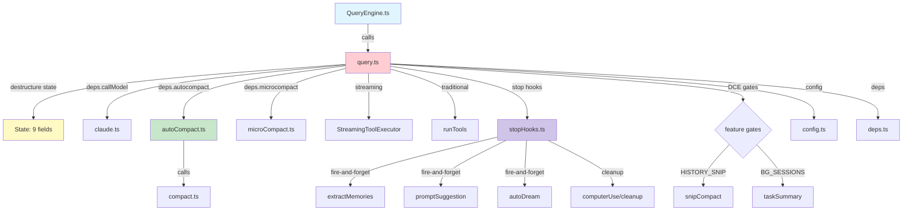
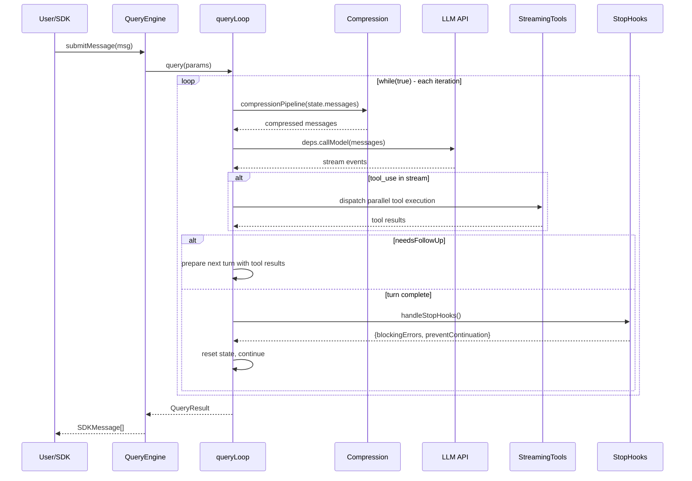
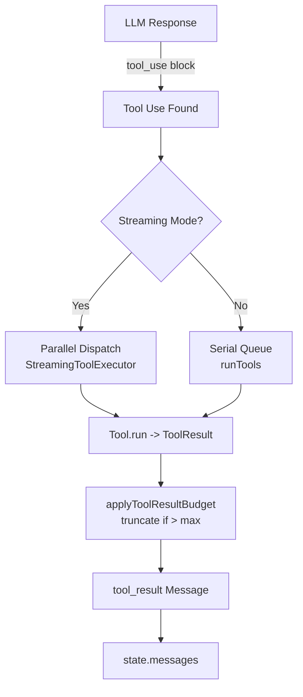
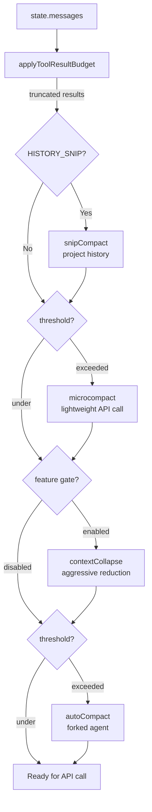
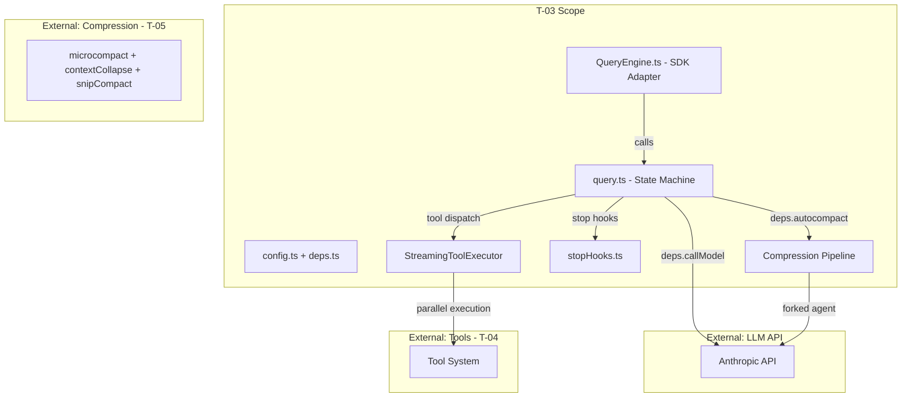

&lt;!-- analysis-version: 0 | commit: a5179f6588dd | updated: 2025-07-14 | mode: full | task: T-03 --&gt;
# T-03 Analysis: 查询引擎核心循环 (Query Engine Core Loop)

## Scope Confirmation
- Task ID: T-03
- Primary Mainline: ML-02
- ML Priority: P1
- Analysis Depth: DEEP
- Secondary Mainlines: ML-03 (工具系统), ML-11 (上下文管理)
- Scope Files (confirmed): 341 files, 91,420 lines
- Scope adjustments: None — all files verified on disk
- Dependencies: None (first P1 task in execution order)

### Core Files (DEEP analysis)
| File | Lines | Role |
|------|-------|------|
| src/query.ts | 1729 | Core state machine |
| src/QueryEngine.ts | 1295 | SDK adapter layer |
| src/query/stopHooks.ts | 473 | Stop hook orchestrator |
| src/services/compact/autoCompact.ts | 551 | Proactive compression |
| src/services/compact/compact.ts | 1705 | Core compaction engine |
| src/query/config.ts | 46 | Config snapshot |
| src/query/deps.ts | 40 | Dependency injection |
| src/query/transitions.ts | 3 | DCE stub |

### Supporting Files (overview-level classification)
- 28 hook/permission files (hooks/ directory)
- 4 message utility files (messages/ directory)
- ~300 utility files (src/utils/ directory)

## File Roles

| File | Lines | One-liner Role | Where Analyzed |
|------|-------|----------------|---------------|
| src/QueryEngine.ts | 1295 | SDK adapter layer: session lifecycle, message accumulation, transcript recording, usage tracking | DEEP: § Function-Level Analysis, § Call Chain Analysis |
| src/hooks/renderPlaceholder.ts | 51 | Renders placeholder UI during tool permission prompts | STANDARD: § Analysis Findings |
| src/hooks/toolPermission/PermissionContext.ts | 388 | React context provider for tool permission state | STANDARD: § Analysis Findings |
| src/hooks/toolPermission/handlers/coordinatorHandler.ts | 65 | Permission handler for coordinator/remote mode | STANDARD: § Analysis Findings |
| src/hooks/toolPermission/handlers/interactiveHandler.ts | 536 | Permission handler for interactive REPL mode | STANDARD: § Analysis Findings |
| src/hooks/toolPermission/handlers/swarmWorkerHandler.ts | 159 | Permission handler for swarm worker agents | STANDARD: § Analysis Findings |
| src/hooks/toolPermission/permissionLogging.ts | 238 | Logging utilities for permission decisions | STANDARD: § Analysis Findings |
| src/hooks/unifiedSuggestions.ts | 202 | Unified suggestion system for tab completion | STANDARD: § Analysis Findings |
| src/native-ts/file-index/index.ts | 370 | Utility: index | OVERVIEW: § File Roles |
| src/native-ts/yoga-layout/enums.ts | 134 | Utility: enums | OVERVIEW: § File Roles |
| src/query.ts | 1729 | Core state machine: while(true) loop, 9-field State, 7 continue paths, compression pipeline, streaming tool execution | DEEP: § Function-Level Analysis, § Call Chain Analysis |
| src/query/config.ts | 46 | Immutable config snapshot: sessionId + 4 runtime gates (streaming/summaries/ant/fastMode) | DEEP: § Function-Level Analysis, § Call Chain Analysis |
| src/query/deps.ts | 40 | Dependency injection: callModel/microcompact/autocompact/uuid for test fakes | DEEP: § Function-Level Analysis, § Call Chain Analysis |
| src/query/stopHooks.ts | 473 | Stop hook orchestrator: execute hooks, blocking errors, teammate idle hooks, memory extraction | DEEP: § Function-Level Analysis, § Call Chain Analysis |
| src/query/transitions.ts | 3 | Type assertion helper (3 lines, DCE stub) | DEEP: § Function-Level Analysis, § Call Chain Analysis |
| src/services/compact/autoCompact.ts | 351 | Proactive compression: token budget check, circuit breaker, compactConversation call | DEEP: § Function-Level Analysis, § Call Chain Analysis |
| src/services/compact/compact.ts | 1705 | Core compaction: forked agent with PTL retry, prompt cache reuse, pre-compact hooks | DEEP: § Function-Level Analysis, § Call Chain Analysis |
| src/utils/CircularBuffer.ts | 84 | Utility: CircularBuffer | OVERVIEW: § File Roles |
| src/utils/Cursor.ts | 1530 | Utility: Cursor | OVERVIEW: § File Roles |
| src/utils/QueryGuard.ts | 121 | Utility: QueryGuard | OVERVIEW: § File Roles |
| src/utils/Shell.ts | 474 | Utility: Shell | OVERVIEW: § File Roles |
| src/utils/ShellCommand.ts | 465 | Utility: ShellCommand | OVERVIEW: § File Roles |
| src/utils/abortController.ts | 99 | Utility: abortController | OVERVIEW: § File Roles |
| src/utils/activityManager.ts | 164 | Utility: activityManager | OVERVIEW: § File Roles |
| src/utils/advisor.ts | 145 | Utility: advisor | OVERVIEW: § File Roles |
| src/utils/agentContext.ts | 178 | Utility: agentContext | OVERVIEW: § File Roles |
| src/utils/agentId.ts | 99 | Utility: agentId | OVERVIEW: § File Roles |
| src/utils/agentSwarmsEnabled.ts | 44 | Utility: agentSwarmsEnabled | OVERVIEW: § File Roles |
| src/utils/agenticSessionSearch.ts | 307 | Utility: agenticSessionSearch | OVERVIEW: § File Roles |
| src/utils/analyzeContext.ts | 1382 | Utility: analyzeContext | OVERVIEW: § File Roles |
| src/utils/ansiToPng.ts | 334 | Utility: ansiToPng | OVERVIEW: § File Roles |
| src/utils/ansiToSvg.ts | 272 | Utility: ansiToSvg | OVERVIEW: § File Roles |
| src/utils/apiPreconnect.ts | 71 | Utility: apiPreconnect | OVERVIEW: § File Roles |
| src/utils/appleTerminalBackup.ts | 124 | Utility: appleTerminalBackup | OVERVIEW: § File Roles |
| src/utils/argumentSubstitution.ts | 145 | Utility: argumentSubstitution | OVERVIEW: § File Roles |
| src/utils/asciicast.ts | 239 | Utility: asciicast | OVERVIEW: § File Roles |
| src/utils/attachments.ts | 3997 | Utility: attachments | OVERVIEW: § File Roles |
| src/utils/attribution.ts | 393 | Utility: attribution | OVERVIEW: § File Roles |
| src/utils/authFileDescriptor.ts | 196 | Utility: authFileDescriptor | OVERVIEW: § File Roles |
| src/utils/autoModeDenials.ts | 26 | Utility: autoModeDenials | OVERVIEW: § File Roles |
| src/utils/autoRunIssue.tsx | 122 | Utility: autoRunIssuex | OVERVIEW: § File Roles |
| src/utils/autoUpdater.ts | 561 | Utility: autoUpdater | OVERVIEW: § File Roles |
| src/utils/background/remote/preconditions.ts | 235 | Utility: preconditions | OVERVIEW: § File Roles |
| src/utils/background/remote/remoteSession.ts | 98 | Utility: remoteSession | OVERVIEW: § File Roles |
| src/utils/backgroundHousekeeping.ts | 94 | Utility: backgroundHousekeeping | OVERVIEW: § File Roles |
| src/utils/betas.ts | 434 | Utility: betas | OVERVIEW: § File Roles |
| src/utils/billing.ts | 78 | Utility: billing | OVERVIEW: § File Roles |
| src/utils/binaryCheck.ts | 53 | Utility: binaryCheck | OVERVIEW: § File Roles |
| src/utils/browser.ts | 68 | Utility: browser | OVERVIEW: § File Roles |
| src/utils/bufferedWriter.ts | 100 | Utility: bufferedWriter | OVERVIEW: § File Roles |
| src/utils/bundledMode.ts | 22 | Utility: bundledMode | OVERVIEW: § File Roles |
| src/utils/caCerts.ts | 115 | Utility: caCerts | OVERVIEW: § File Roles |
| src/utils/caCertsConfig.ts | 88 | Utility: caCertsConfig | OVERVIEW: § File Roles |
| src/utils/cachePaths.ts | 38 | Utility: cachePaths | OVERVIEW: § File Roles |
| src/utils/classifierApprovals.ts | 88 | Utility: classifierApprovals | OVERVIEW: § File Roles |
| src/utils/claudeCodeHints.ts | 193 | Utility: claudeCodeHints | OVERVIEW: § File Roles |
| src/utils/claudeDesktop.ts | 152 | Utility: claudeDesktop | OVERVIEW: § File Roles |
| src/utils/claudemd.ts | 1479 | Utility: claudemd | OVERVIEW: § File Roles |
| src/utils/cleanup.ts | 602 | Utility: cleanup | OVERVIEW: § File Roles |
| src/utils/cleanupRegistry.ts | 25 | Utility: cleanupRegistry | OVERVIEW: § File Roles |
| src/utils/cliArgs.ts | 60 | Utility: cliArgs | OVERVIEW: § File Roles |
| src/utils/cliHighlight.ts | 54 | Utility: cliHighlight | OVERVIEW: § File Roles |
| src/utils/codeIndexing.ts | 206 | Utility: codeIndexing | OVERVIEW: § File Roles |
| src/utils/collapseBackgroundBashNotifications.ts | 84 | Utility: collapseBackgroundBashNotifications | OVERVIEW: § File Roles |
| src/utils/collapseHookSummaries.ts | 59 | Utility: collapseHookSummaries | OVERVIEW: § File Roles |
| src/utils/collapseReadSearch.ts | 1109 | Utility: collapseReadSearch | OVERVIEW: § File Roles |
| src/utils/collapseTeammateShutdowns.ts | 55 | Utility: collapseTeammateShutdowns | OVERVIEW: § File Roles |
| src/utils/combinedAbortSignal.ts | 47 | Utility: combinedAbortSignal | OVERVIEW: § File Roles |
| src/utils/commandLifecycle.ts | 21 | Utility: commandLifecycle | OVERVIEW: § File Roles |
| src/utils/commitAttribution.ts | 961 | Utility: commitAttribution | OVERVIEW: § File Roles |
| src/utils/completionCache.ts | 166 | Utility: completionCache | OVERVIEW: § File Roles |
| src/utils/concurrentSessions.ts | 204 | Utility: concurrentSessions | OVERVIEW: § File Roles |
| src/utils/configConstants.ts | 21 | Utility: configConstants | OVERVIEW: § File Roles |
| src/utils/contentArray.ts | 51 | Utility: contentArray | OVERVIEW: § File Roles |
| src/utils/context.ts | 221 | Utility: context | OVERVIEW: § File Roles |
| src/utils/contextSuggestions.ts | 235 | Utility: contextSuggestions | OVERVIEW: § File Roles |
| src/utils/controlMessageCompat.ts | 32 | Utility: controlMessageCompat | OVERVIEW: § File Roles |
| src/utils/conversationRecovery.ts | 597 | Utility: conversationRecovery | OVERVIEW: § File Roles |
| src/utils/cron.ts | 308 | Utility: cron | OVERVIEW: § File Roles |
| src/utils/cronJitterConfig.ts | 75 | Utility: cronJitterConfig | OVERVIEW: § File Roles |
| src/utils/cronScheduler.ts | 565 | Utility: cronScheduler | OVERVIEW: § File Roles |
| src/utils/cronTasks.ts | 458 | Utility: cronTasks | OVERVIEW: § File Roles |
| src/utils/cronTasksLock.ts | 195 | Utility: cronTasksLock | OVERVIEW: § File Roles |
| src/utils/crossProjectResume.ts | 75 | Utility: crossProjectResume | OVERVIEW: § File Roles |
| src/utils/cwd.ts | 32 | Utility: cwd | OVERVIEW: § File Roles |
| src/utils/debug.ts | 268 | Utility: debug | OVERVIEW: § File Roles |
| src/utils/debugFilter.ts | 157 | Utility: debugFilter | OVERVIEW: § File Roles |
| src/utils/deepLink/banner.ts | 123 | Utility: banner | OVERVIEW: § File Roles |
| src/utils/deepLink/parseDeepLink.ts | 170 | Utility: parseDeepLink | OVERVIEW: § File Roles |
| src/utils/deepLink/protocolHandler.ts | 136 | Utility: protocolHandler | OVERVIEW: § File Roles |
| src/utils/deepLink/registerProtocol.ts | 348 | Utility: registerProtocol | OVERVIEW: § File Roles |
| src/utils/deepLink/terminalLauncher.ts | 557 | Utility: terminalLauncher | OVERVIEW: § File Roles |
| src/utils/deepLink/terminalPreference.ts | 54 | Utility: terminalPreference | OVERVIEW: § File Roles |
| src/utils/desktopDeepLink.ts | 236 | Utility: desktopDeepLink | OVERVIEW: § File Roles |
| src/utils/detectRepository.ts | 178 | Utility: detectRepository | OVERVIEW: § File Roles |
| src/utils/diagLogs.ts | 94 | Utility: diagLogs | OVERVIEW: § File Roles |
| src/utils/diff.ts | 177 | Utility: diff | OVERVIEW: § File Roles |
| src/utils/directMemberMessage.ts | 69 | Utility: directMemberMessage | OVERVIEW: § File Roles |
| src/utils/displayTags.ts | 51 | Utility: displayTags | OVERVIEW: § File Roles |
| src/utils/doctorContextWarnings.ts | 265 | Utility: doctorContextWarnings | OVERVIEW: § File Roles |
| src/utils/doctorDiagnostic.ts | 625 | Utility: doctorDiagnostic | OVERVIEW: § File Roles |
| src/utils/dxt/helpers.ts | 88 | Utility: helpers | OVERVIEW: § File Roles |
| src/utils/dxt/zip.ts | 226 | Utility: zip | OVERVIEW: § File Roles |
| src/utils/editor.ts | 183 | Utility: editor | OVERVIEW: § File Roles |
| src/utils/effort.ts | 329 | Utility: effort | OVERVIEW: § File Roles |
| src/utils/env.ts | 347 | Utility: env | OVERVIEW: § File Roles |
| src/utils/envDynamic.ts | 151 | Utility: envDynamic | OVERVIEW: § File Roles |
| src/utils/envUtils.ts | 183 | Utility: envUtils | OVERVIEW: § File Roles |
| src/utils/envValidation.ts | 38 | Utility: envValidation | OVERVIEW: § File Roles |
| src/utils/errorLogSink.ts | 235 | Utility: errorLogSink | OVERVIEW: § File Roles |
| src/utils/errors.ts | 238 | Utility: errors | OVERVIEW: § File Roles |
| src/utils/exampleCommands.ts | 184 | Utility: exampleCommands | OVERVIEW: § File Roles |
| src/utils/execFileNoThrowPortable.ts | 89 | Utility: execFileNoThrowPortable | OVERVIEW: § File Roles |
| src/utils/execSyncWrapper.ts | 38 | Utility: execSyncWrapper | OVERVIEW: § File Roles |
| src/utils/exportRenderer.tsx | 98 | Utility: exportRendererx | OVERVIEW: § File Roles |
| src/utils/extraUsage.ts | 23 | Utility: extraUsage | OVERVIEW: § File Roles |
| src/utils/fastMode.ts | 532 | Utility: fastMode | OVERVIEW: § File Roles |
| src/utils/fileOperationAnalytics.ts | 71 | Utility: fileOperationAnalytics | OVERVIEW: § File Roles |
| src/utils/filePersistence/filePersistence.ts | 287 | Utility: filePersistence | OVERVIEW: § File Roles |
| src/utils/filePersistence/outputsScanner.ts | 126 | Utility: outputsScanner | OVERVIEW: § File Roles |
| src/utils/fileRead.ts | 102 | Utility: fileRead | OVERVIEW: § File Roles |
| src/utils/fileReadCache.ts | 96 | Utility: fileReadCache | OVERVIEW: § File Roles |
| src/utils/fileStateCache.ts | 142 | Utility: fileStateCache | OVERVIEW: § File Roles |
| src/utils/fingerprint.ts | 76 | Utility: fingerprint | OVERVIEW: § File Roles |
| src/utils/format.ts | 308 | Utility: format | OVERVIEW: § File Roles |
| src/utils/formatBriefTimestamp.ts | 81 | Utility: formatBriefTimestamp | OVERVIEW: § File Roles |
| src/utils/fpsTracker.ts | 47 | Utility: fpsTracker | OVERVIEW: § File Roles |
| src/utils/frontmatterParser.ts | 370 | Utility: frontmatterParser | OVERVIEW: § File Roles |
| src/utils/fsOperations.ts | 770 | Utility: fsOperations | OVERVIEW: § File Roles |
| src/utils/fullscreen.ts | 202 | Utility: fullscreen | OVERVIEW: § File Roles |
| src/utils/generatedFiles.ts | 136 | Utility: generatedFiles | OVERVIEW: § File Roles |
| src/utils/generators.ts | 88 | Utility: generators | OVERVIEW: § File Roles |
| src/utils/genericProcessUtils.ts | 184 | Utility: genericProcessUtils | OVERVIEW: § File Roles |
| src/utils/getWorktreePaths.ts | 70 | Utility: getWorktreePaths | OVERVIEW: § File Roles |
| src/utils/getWorktreePathsPortable.ts | 27 | Utility: getWorktreePathsPortable | OVERVIEW: § File Roles |
| src/utils/ghPrStatus.ts | 106 | Utility: ghPrStatus | OVERVIEW: § File Roles |
| src/utils/git/gitConfigParser.ts | 277 | Utility: gitConfigParser | OVERVIEW: § File Roles |
| src/utils/git/gitignore.ts | 99 | Utility: gitignore | OVERVIEW: § File Roles |
| src/utils/github/ghAuthStatus.ts | 29 | Utility: ghAuthStatus | OVERVIEW: § File Roles |
| src/utils/githubRepoPathMapping.ts | 162 | Utility: githubRepoPathMapping | OVERVIEW: § File Roles |
| src/utils/glob.ts | 130 | Utility: glob | OVERVIEW: § File Roles |
| src/utils/gracefulShutdown.ts | 529 | Utility: gracefulShutdown | OVERVIEW: § File Roles |
| src/utils/groupToolUses.ts | 182 | Utility: groupToolUses | OVERVIEW: § File Roles |
| src/utils/handlePromptSubmit.ts | 610 | Utility: handlePromptSubmit | OVERVIEW: § File Roles |
| src/utils/hash.ts | 46 | Utility: hash | OVERVIEW: § File Roles |
| src/utils/headlessProfiler.ts | 178 | Utility: headlessProfiler | OVERVIEW: § File Roles |
| src/utils/heapDumpService.ts | 303 | Utility: heapDumpService | OVERVIEW: § File Roles |
| src/utils/heatmap.ts | 198 | Utility: heatmap | OVERVIEW: § File Roles |
| src/utils/highlightMatch.tsx | 28 | Utility: highlightMatchx | OVERVIEW: § File Roles |
| src/utils/hooks.ts | 5022 | Utility: hooks | OVERVIEW: § File Roles |
| src/utils/hooks/AsyncHookRegistry.ts | 309 | Utility: AsyncHookRegistry | OVERVIEW: § File Roles |
| src/utils/hooks/apiQueryHookHelper.ts | 141 | Utility: apiQueryHookHelper | OVERVIEW: § File Roles |
| src/utils/hooks/execAgentHook.ts | 339 | Utility: execAgentHook | OVERVIEW: § File Roles |
| src/utils/hooks/execHttpHook.ts | 242 | Utility: execHttpHook | OVERVIEW: § File Roles |
| src/utils/hooks/execPromptHook.ts | 211 | Utility: execPromptHook | OVERVIEW: § File Roles |
| src/utils/hooks/fileChangedWatcher.ts | 191 | Utility: fileChangedWatcher | OVERVIEW: § File Roles |
| src/utils/hooks/hookEvents.ts | 192 | Utility: hookEvents | OVERVIEW: § File Roles |
| src/utils/hooks/hookHelpers.ts | 83 | Utility: hookHelpers | OVERVIEW: § File Roles |
| src/utils/hooks/hooksConfigManager.ts | 400 | Utility: hooksConfigManager | OVERVIEW: § File Roles |
| src/utils/hooks/hooksConfigSnapshot.ts | 133 | Utility: hooksConfigSnapshot | OVERVIEW: § File Roles |
| src/utils/hooks/hooksSettings.ts | 271 | Utility: hooksSettings | OVERVIEW: § File Roles |
| src/utils/hooks/postSamplingHooks.ts | 70 | Utility: postSamplingHooks | OVERVIEW: § File Roles |
| src/utils/hooks/registerFrontmatterHooks.ts | 67 | Utility: registerFrontmatterHooks | OVERVIEW: § File Roles |
| src/utils/hooks/registerSkillHooks.ts | 64 | Utility: registerSkillHooks | OVERVIEW: § File Roles |
| src/utils/hooks/sessionHooks.ts | 447 | Utility: sessionHooks | OVERVIEW: § File Roles |
| src/utils/hooks/skillImprovement.ts | 267 | Utility: skillImprovement | OVERVIEW: § File Roles |
| src/utils/hooks/ssrfGuard.ts | 294 | Utility: ssrfGuard | OVERVIEW: § File Roles |
| src/utils/horizontalScroll.ts | 137 | Utility: horizontalScroll | OVERVIEW: § File Roles |
| src/utils/hyperlink.ts | 39 | Utility: hyperlink | OVERVIEW: § File Roles |
| src/utils/iTermBackup.ts | 73 | Utility: iTermBackup | OVERVIEW: § File Roles |
| src/utils/ide.ts | 1494 | Utility: ide | OVERVIEW: § File Roles |
| src/utils/idePathConversion.ts | 90 | Utility: idePathConversion | OVERVIEW: § File Roles |
| src/utils/idleTimeout.ts | 53 | Utility: idleTimeout | OVERVIEW: § File Roles |
| src/utils/imagePaste.ts | 416 | Utility: imagePaste | OVERVIEW: § File Roles |
| src/utils/imageResizer.ts | 880 | Utility: imageResizer | OVERVIEW: § File Roles |
| src/utils/imageStore.ts | 167 | Utility: imageStore | OVERVIEW: § File Roles |
| src/utils/imageValidation.ts | 104 | Utility: imageValidation | OVERVIEW: § File Roles |
| src/utils/inProcessTeammateHelpers.ts | 102 | Utility: inProcessTeammateHelpers | OVERVIEW: § File Roles |
| src/utils/ink.ts | 26 | Utility: ink | OVERVIEW: § File Roles |
| src/utils/intl.ts | 94 | Utility: intl | OVERVIEW: § File Roles |
| src/utils/jetbrains.ts | 191 | Utility: jetbrains | OVERVIEW: § File Roles |
| src/utils/json.ts | 277 | Utility: json | OVERVIEW: § File Roles |
| src/utils/listSessionsImpl.ts | 454 | Utility: listSessionsImpl | OVERVIEW: § File Roles |
| src/utils/localInstaller.ts | 162 | Utility: localInstaller | OVERVIEW: § File Roles |
| src/utils/lockfile.ts | 43 | Utility: lockfile | OVERVIEW: § File Roles |
| src/utils/log.ts | 362 | Utility: log | OVERVIEW: § File Roles |
| src/utils/logoV2Utils.ts | 350 | Utility: logoV2Utils | OVERVIEW: § File Roles |
| src/utils/mailbox.ts | 73 | Utility: mailbox | OVERVIEW: § File Roles |
| src/utils/managedEnv.ts | 199 | Utility: managedEnv | OVERVIEW: § File Roles |
| src/utils/managedEnvConstants.ts | 191 | Utility: managedEnvConstants | OVERVIEW: § File Roles |
| src/utils/markdown.ts | 381 | Utility: markdown | OVERVIEW: § File Roles |
| src/utils/markdownConfigLoader.ts | 600 | Utility: markdownConfigLoader | OVERVIEW: § File Roles |
| src/utils/mcp/dateTimeParser.ts | 121 | Utility: dateTimeParser | OVERVIEW: § File Roles |
| src/utils/mcp/elicitationValidation.ts | 336 | Utility: elicitationValidation | OVERVIEW: § File Roles |
| src/utils/mcpInstructionsDelta.ts | 130 | Utility: mcpInstructionsDelta | OVERVIEW: § File Roles |
| src/utils/mcpOutputStorage.ts | 189 | Utility: mcpOutputStorage | OVERVIEW: § File Roles |
| src/utils/mcpValidation.ts | 208 | Utility: mcpValidation | OVERVIEW: § File Roles |
| src/utils/mcpWebSocketTransport.ts | 200 | Utility: mcpWebSocketTransport | OVERVIEW: § File Roles |
| src/utils/memoize.ts | 269 | Utility: memoize | OVERVIEW: § File Roles |
| src/utils/memoryFileDetection.ts | 289 | Utility: memoryFileDetection | OVERVIEW: § File Roles |
| src/utils/messageQueueManager.ts | 547 | Utility: messageQueueManager | OVERVIEW: § File Roles |
| src/utils/messages/mappers.ts | 290 | Internal Message ↔ SDK BetaMessageParam bidirectional converters | STANDARD: § Analysis Findings |
| src/utils/messages/systemInit.ts | 96 | System initialization message builder for SDK compat | STANDARD: § Analysis Findings |
| src/utils/model/agent.ts | 157 | Utility: agent | OVERVIEW: § File Roles |
| src/utils/model/aliases.ts | 25 | Utility: aliases | OVERVIEW: § File Roles |
| src/utils/model/antModels.ts | 64 | Utility: antModels | OVERVIEW: § File Roles |
| src/utils/model/bedrock.ts | 265 | Utility: bedrock | OVERVIEW: § File Roles |
| src/utils/model/check1mAccess.ts | 72 | Utility: check1mAccess | OVERVIEW: § File Roles |
| src/utils/model/configs.ts | 118 | Utility: configs | OVERVIEW: § File Roles |
| src/utils/model/contextWindowUpgradeCheck.ts | 47 | Utility: contextWindowUpgradeCheck | OVERVIEW: § File Roles |
| src/utils/model/deprecation.ts | 101 | Utility: deprecation | OVERVIEW: § File Roles |
| src/utils/model/model.ts | 618 | Utility: model | OVERVIEW: § File Roles |
| src/utils/model/modelAllowlist.ts | 170 | Utility: modelAllowlist | OVERVIEW: § File Roles |
| src/utils/model/modelCapabilities.ts | 118 | Utility: modelCapabilities | OVERVIEW: § File Roles |
| src/utils/model/modelOptions.ts | 540 | Utility: modelOptions | OVERVIEW: § File Roles |
| src/utils/model/modelStrings.ts | 166 | Utility: modelStrings | OVERVIEW: § File Roles |
| src/utils/model/modelSupportOverrides.ts | 50 | Utility: modelSupportOverrides | OVERVIEW: § File Roles |
| src/utils/model/providers.ts | 40 | Utility: providers | OVERVIEW: § File Roles |
| src/utils/model/validateModel.ts | 159 | Utility: validateModel | OVERVIEW: § File Roles |
| src/utils/modelCost.ts | 231 | Utility: modelCost | OVERVIEW: § File Roles |
| src/utils/modifiers.ts | 36 | Utility: modifiers | OVERVIEW: § File Roles |
| src/utils/mtls.ts | 179 | Utility: mtls | OVERVIEW: § File Roles |
| src/utils/nativeInstaller/download.ts | 523 | Utility: download | OVERVIEW: § File Roles |
| src/utils/nativeInstaller/installer.ts | 1708 | Utility: installer | OVERVIEW: § File Roles |
| src/utils/nativeInstaller/packageManagers.ts | 336 | Utility: packageManagers | OVERVIEW: § File Roles |
| src/utils/nativeInstaller/pidLock.ts | 433 | Utility: pidLock | OVERVIEW: § File Roles |
| src/utils/notebook.ts | 224 | Utility: notebook | OVERVIEW: § File Roles |
| src/utils/pasteStore.ts | 104 | Utility: pasteStore | OVERVIEW: § File Roles |
| src/utils/path.ts | 155 | Utility: path | OVERVIEW: § File Roles |
| src/utils/pdf.ts | 300 | Utility: pdf | OVERVIEW: § File Roles |
| src/utils/pdfUtils.ts | 70 | Utility: pdfUtils | OVERVIEW: § File Roles |
| src/utils/peerAddress.ts | 21 | Utility: peerAddress | OVERVIEW: § File Roles |
| src/utils/planModeV2.ts | 95 | Utility: planModeV2 | OVERVIEW: § File Roles |
| src/utils/plans.ts | 397 | Utility: plans | OVERVIEW: § File Roles |
| src/utils/platform.ts | 150 | Utility: platform | OVERVIEW: § File Roles |
| src/utils/preflightChecks.tsx | 151 | Utility: preflightChecksx | OVERVIEW: § File Roles |
| src/utils/privacyLevel.ts | 55 | Utility: privacyLevel | OVERVIEW: § File Roles |
| src/utils/process.ts | 68 | Utility: process | OVERVIEW: § File Roles |
| src/utils/processUserInput/processBashCommand.tsx | 140 | Utility: processBashCommandx | OVERVIEW: § File Roles |
| src/utils/processUserInput/processSlashCommand.tsx | 922 | Utility: processSlashCommandx | OVERVIEW: § File Roles |
| src/utils/processUserInput/processTextPrompt.ts | 100 | Utility: processTextPrompt | OVERVIEW: § File Roles |
| src/utils/processUserInput/processUserInput.ts | 605 | Utility: processUserInput | OVERVIEW: § File Roles |
| src/utils/profilerBase.ts | 46 | Utility: profilerBase | OVERVIEW: § File Roles |
| src/utils/promptCategory.ts | 49 | Utility: promptCategory | OVERVIEW: § File Roles |
| src/utils/promptEditor.ts | 188 | Utility: promptEditor | OVERVIEW: § File Roles |
| src/utils/promptShellExecution.ts | 183 | Utility: promptShellExecution | OVERVIEW: § File Roles |
| src/utils/proxy.ts | 426 | Utility: proxy | OVERVIEW: § File Roles |
| src/utils/queryContext.ts | 179 | Utility: queryContext | OVERVIEW: § File Roles |
| src/utils/queryProfiler.ts | 301 | Utility: queryProfiler | OVERVIEW: § File Roles |
| src/utils/queueProcessor.ts | 95 | Utility: queueProcessor | OVERVIEW: § File Roles |
| src/utils/readEditContext.ts | 227 | Utility: readEditContext | OVERVIEW: § File Roles |
| src/utils/readFileInRange.ts | 383 | Utility: readFileInRange | OVERVIEW: § File Roles |
| src/utils/releaseNotes.ts | 360 | Utility: releaseNotes | OVERVIEW: § File Roles |
| src/utils/renderOptions.ts | 77 | Utility: renderOptions | OVERVIEW: § File Roles |
| src/utils/sanitization.ts | 91 | Utility: sanitization | OVERVIEW: § File Roles |
| src/utils/screenshotClipboard.ts | 121 | Utility: screenshotClipboard | OVERVIEW: § File Roles |
| src/utils/sdkEventQueue.ts | 134 | Utility: sdkEventQueue | OVERVIEW: § File Roles |
| src/utils/semanticBoolean.ts | 29 | Utility: semanticBoolean | OVERVIEW: § File Roles |
| src/utils/semanticNumber.ts | 36 | Utility: semanticNumber | OVERVIEW: § File Roles |
| src/utils/semver.ts | 59 | Utility: semver | OVERVIEW: § File Roles |
| src/utils/sequential.ts | 56 | Utility: sequential | OVERVIEW: § File Roles |
| src/utils/sessionActivity.ts | 133 | Utility: sessionActivity | OVERVIEW: § File Roles |
| src/utils/sessionEnvVars.ts | 22 | Utility: sessionEnvVars | OVERVIEW: § File Roles |
| src/utils/sessionEnvironment.ts | 166 | Utility: sessionEnvironment | OVERVIEW: § File Roles |
| src/utils/sessionFileAccessHooks.ts | 250 | Utility: sessionFileAccessHooks | OVERVIEW: § File Roles |
| src/utils/sessionIngressAuth.ts | 140 | Utility: sessionIngressAuth | OVERVIEW: § File Roles |
| src/utils/sessionStart.ts | 232 | Utility: sessionStart | OVERVIEW: § File Roles |
| src/utils/sessionState.ts | 150 | Utility: sessionState | OVERVIEW: § File Roles |
| src/utils/sessionTitle.ts | 129 | Utility: sessionTitle | OVERVIEW: § File Roles |
| src/utils/sessionUrl.ts | 64 | Utility: sessionUrl | OVERVIEW: § File Roles |
| src/utils/set.ts | 53 | Utility: set | OVERVIEW: § File Roles |
| src/utils/shellConfig.ts | 167 | Utility: shellConfig | OVERVIEW: § File Roles |
| src/utils/sideQuery.ts | 222 | Utility: sideQuery | OVERVIEW: § File Roles |
| src/utils/sideQuestion.ts | 155 | Utility: sideQuestion | OVERVIEW: § File Roles |
| src/utils/signal.ts | 43 | Utility: signal | OVERVIEW: § File Roles |
| src/utils/skills/skillChangeDetector.ts | 311 | Utility: skillChangeDetector | OVERVIEW: § File Roles |
| src/utils/slashCommandParsing.ts | 60 | Utility: slashCommandParsing | OVERVIEW: § File Roles |
| src/utils/sleep.ts | 84 | Utility: sleep | OVERVIEW: § File Roles |
| src/utils/sliceAnsi.ts | 91 | Utility: sliceAnsi | OVERVIEW: § File Roles |
| src/utils/slowOperations.ts | 286 | Utility: slowOperations | OVERVIEW: § File Roles |
| src/utils/standaloneAgent.ts | 23 | Utility: standaloneAgent | OVERVIEW: § File Roles |
| src/utils/staticRender.tsx | 116 | Utility: staticRenderx | OVERVIEW: § File Roles |
| src/utils/stats.ts | 1061 | Utility: stats | OVERVIEW: § File Roles |
| src/utils/statsCache.ts | 434 | Utility: statsCache | OVERVIEW: § File Roles |
| src/utils/status.tsx | 362 | Utility: statusx | OVERVIEW: § File Roles |
| src/utils/statusNoticeDefinitions.tsx | 198 | Utility: statusNoticeDefinitionsx | OVERVIEW: § File Roles |
| src/utils/stream.ts | 76 | Utility: stream | OVERVIEW: § File Roles |
| src/utils/streamJsonStdoutGuard.ts | 123 | Utility: streamJsonStdoutGuard | OVERVIEW: § File Roles |
| src/utils/streamlinedTransform.ts | 201 | Utility: streamlinedTransform | OVERVIEW: § File Roles |
| src/utils/stringUtils.ts | 235 | Utility: stringUtils | OVERVIEW: § File Roles |
| src/utils/subprocessEnv.ts | 99 | Utility: subprocessEnv | OVERVIEW: § File Roles |
| src/utils/suggestions/commandSuggestions.ts | 567 | Utility: commandSuggestions | OVERVIEW: § File Roles |
| src/utils/suggestions/directoryCompletion.ts | 263 | Utility: directoryCompletion | OVERVIEW: § File Roles |
| src/utils/suggestions/shellHistoryCompletion.ts | 119 | Utility: shellHistoryCompletion | OVERVIEW: § File Roles |
| src/utils/suggestions/skillUsageTracking.ts | 55 | Utility: skillUsageTracking | OVERVIEW: § File Roles |
| src/utils/suggestions/slackChannelSuggestions.ts | 209 | Utility: slackChannelSuggestions | OVERVIEW: § File Roles |
| src/utils/systemDirectories.ts | 74 | Utility: systemDirectories | OVERVIEW: § File Roles |
| src/utils/systemPrompt.ts | 123 | Utility: systemPrompt | OVERVIEW: § File Roles |
| src/utils/systemTheme.ts | 119 | Utility: systemTheme | OVERVIEW: § File Roles |
| src/utils/taggedId.ts | 54 | Utility: taggedId | OVERVIEW: § File Roles |
| src/utils/tasks.ts | 862 | Utility: tasks | OVERVIEW: § File Roles |
| src/utils/teamDiscovery.ts | 81 | Utility: teamDiscovery | OVERVIEW: § File Roles |
| src/utils/teamMemoryOps.ts | 88 | Utility: teamMemoryOps | OVERVIEW: § File Roles |
| src/utils/teammate.ts | 292 | Utility: teammate | OVERVIEW: § File Roles |
| src/utils/teammateContext.ts | 96 | Utility: teammateContext | OVERVIEW: § File Roles |
| src/utils/teammateMailbox.ts | 1183 | Utility: teammateMailbox | OVERVIEW: § File Roles |
| src/utils/teleport.tsx | 1226 | Utility: teleportx | OVERVIEW: § File Roles |
| src/utils/teleport/api.ts | 466 | Utility: api | OVERVIEW: § File Roles |
| src/utils/teleport/environmentSelection.ts | 77 | Utility: environmentSelection | OVERVIEW: § File Roles |
| src/utils/teleport/environments.ts | 120 | Utility: environments | OVERVIEW: § File Roles |
| src/utils/teleport/gitBundle.ts | 292 | Utility: gitBundle | OVERVIEW: § File Roles |
| src/utils/tempfile.ts | 31 | Utility: tempfile | OVERVIEW: § File Roles |
| src/utils/terminal.ts | 131 | Utility: terminal | OVERVIEW: § File Roles |
| src/utils/terminalPanel.ts | 191 | Utility: terminalPanel | OVERVIEW: § File Roles |
| src/utils/textHighlighting.ts | 166 | Utility: textHighlighting | OVERVIEW: § File Roles |
| src/utils/theme.ts | 639 | Utility: theme | OVERVIEW: § File Roles |
| src/utils/thinking.ts | 162 | Utility: thinking | OVERVIEW: § File Roles |
| src/utils/timeouts.ts | 39 | Utility: timeouts | OVERVIEW: § File Roles |
| src/utils/tmuxSocket.ts | 427 | Utility: tmuxSocket | OVERVIEW: § File Roles |
| src/utils/tokenBudget.ts | 73 | Utility: tokenBudget | OVERVIEW: § File Roles |
| src/utils/tokens.ts | 261 | Utility: tokens | OVERVIEW: § File Roles |
| src/utils/toolErrors.ts | 132 | Utility: toolErrors | OVERVIEW: § File Roles |
| src/utils/toolPool.ts | 79 | Utility: toolPool | OVERVIEW: § File Roles |
| src/utils/toolSchemaCache.ts | 26 | Utility: toolSchemaCache | OVERVIEW: § File Roles |
| src/utils/transcriptSearch.ts | 202 | Utility: transcriptSearch | OVERVIEW: § File Roles |
| src/utils/treeify.ts | 170 | Utility: treeify | OVERVIEW: § File Roles |
| src/utils/truncate.ts | 179 | Utility: truncate | OVERVIEW: § File Roles |
| src/utils/ultraplan/ccrSession.ts | 349 | Utility: ccrSession | OVERVIEW: § File Roles |
| src/utils/ultraplan/keyword.ts | 127 | Utility: keyword | OVERVIEW: § File Roles |
| src/utils/unaryLogging.ts | 39 | Utility: unaryLogging | OVERVIEW: § File Roles |
| src/utils/undercover.ts | 89 | Utility: undercover | OVERVIEW: § File Roles |
| src/utils/user.ts | 194 | Utility: user | OVERVIEW: § File Roles |
| src/utils/userPromptKeywords.ts | 27 | Utility: userPromptKeywords | OVERVIEW: § File Roles |
| src/utils/uuid.ts | 27 | Utility: uuid | OVERVIEW: § File Roles |
| src/utils/which.ts | 82 | Utility: which | OVERVIEW: § File Roles |
| src/utils/windowsPaths.ts | 173 | Utility: windowsPaths | OVERVIEW: § File Roles |
| src/utils/words.ts | 800 | Utility: words | OVERVIEW: § File Roles |
| src/utils/workloadContext.ts | 57 | Utility: workloadContext | OVERVIEW: § File Roles |
| src/utils/worktree.ts | 1519 | Utility: worktree | OVERVIEW: § File Roles |
| src/utils/xdg.ts | 65 | Utility: xdg | OVERVIEW: § File Roles |
| src/utils/zodToJsonSchema.ts | 23 | Utility: zodToJsonSchema | OVERVIEW: § File Roles |

## Analysis Findings

### Finding 1: Pure State Machine Architecture (query.ts)
query.ts implements the entire query loop as a `while(true)` state machine with 9 mutable fields in a `State` struct. This is NOT a recursive design — each iteration destructures `state` at the top (L307), processes one API call + tool execution cycle, then either returns or assigns `state = next` and `continue`s back to the while(true) entry point. The 7 continue paths act as the state machine transitions:

1. `collapse_drain_retry` (L1114) — PTL recovery: context collapse drained, retry with collapsed messages
2. `reactive_compact_retry` (L1164) — PTL recovery: reactive compact drained, retry with compacted messages  
3. `max_output_tokens_escalate` (L1219) — max_output recovery: escalate from 8k → 64k tokens
4. `max_output_tokens_recovery` (L1250) — max_output recovery: retry with escalated token limit (max 3 attempts)
5. `stop_hook_blocking` (L1304) — stop hook returned blocking errors, inject them and retry
6. `token_budget_continuation` (L1340) — token budget exceeded, but user confirmed continuation
7. `next_turn` (L1727) — normal: tool results ready, start next API call

**Significance**: This design ensures no unbounded call stack (no recursion) and makes the state transitions explicit and testable. The cost is a 1729-line function with complex control flow.

### Finding 2: Five-Level Compression Pipeline
Before each API call, query.ts runs a cascading compression pipeline (L365-543):

1. **applyToolResultBudget** (L365) — Truncates individual tool results exceeding a token budget
2. **snipCompact** (L396-410) — Feature-gated (HISTORY_SNIP): projects history to a compact representation
3. **microcompact** (L412-426) — Lightweight API call to compress recent messages when threshold exceeded
4. **contextCollapse** (L440-447) — Feature-gated: aggressive context window reduction
5. **autoCompact** (L453-543) — Full compaction via forked agent with circuit breaker

Each level is independently feature-gated and has its own threshold trigger. The circuit breaker in autoCompact tracks `consecutiveFailures` and skips compaction after repeated failures.

### Finding 3: Withheld Error Mechanism
query.ts implements a sophisticated error interception system (L788-825) where four types of recoverable errors are NOT immediately surfaced to the user:

1. `context-collapse` PTL — context collapse triggered during streaming → drain and retry
2. `reactive-compact` PTL — proactive compaction triggered → drain and compact
3. `media size error` — oversized media attachment → retry without media
4. `max_output_tokens` — model hit output limit → escalate token budget

Instead of yielding these errors, the code sets `withheld = true` on the assistant message and handles recovery internally. The user only sees the final result after recovery.

### Finding 4: Dual-Mode Tool Execution
Tool execution has two paths (L1360-1509):

- **StreamingToolExecutor** (feature-gated `tengu_streaming_tool_execution2`): Tools execute in parallel as tool_use blocks arrive during streaming. Results are collected via `getRemainingResults()` which returns a generator that yields results as tools complete.
- **runTools()** (traditional): All tool_use blocks collected first, then executed serially via `runTools()`.

The streaming path is non-blocking — the next API call can start before all tools finish, as long as the model indicates it doesn't need more tool results.

### Finding 5: QueryEngine as SDK Adapter
QueryEngine.ts (1295 lines) wraps query.ts for SDK consumption:

- **Session lifecycle**: One QueryEngine per conversation, `submitMessage()` starts a new turn
- **Message accumulation**: Maintains `mutableMessages[]` across turns, handles SDK message format conversion
- **Usage tracking**: Accumulates `totalUsage` across all turns in a conversation
- **Transcript recording**: Writes session transcript via `recordTranscript()` after each turn
- **Memory injection**: Calls `loadMemoryPrompt()` to inject CLAUDE.md memories into system prompt
- **Snip replay**: HISTORY_SNIP support for replaying compacted history

### Finding 6: Dependency Injection for Testability
`query/deps.ts` provides a narrow DI surface (4 dependencies): `callModel`, `microcompact`, `autocompact`, `uuid`. Tests inject fakes directly instead of spyOn-per-module. The comment explicitly notes this is intentionally narrow — future PRs may add `runTools`, `handleStopHooks`, `logEvent`, etc.

### Finding 7: DCE (Dead Code Elimination) Pattern
Multiple modules are conditionally loaded via `feature('XXX') ? require('./module.js') : null` pattern. This allows the bundler to tree-shake excluded code:
- reactiveCompact (L15), contextCollapse (L18), skillPrefetch (L21)
- jobClassifier (L24), snipModule (L27), taskSummaryModule (L30)
- coordinatorMode (QueryEngine.ts L112), snipCompact (L122)

### Finding 8: Stop Hook Orchestration
stopHooks.ts implements a three-phase stop hook system:

1. **Pre-hook**: Job classification (TEMPLATES feature gate), prompt suggestion (fire-and-forget), memory extraction (EXTRACT_MEMORIES), auto-dream (fire-and-forget), Chicago MCP cleanup
2. **Execute hooks**: `executeStopHooks()` generator consumed in for-await-of loop, collecting blockingErrors, preventContinuation flags, hook infos (command, duration)
3. **Post-hook**: Teammate-specific hooks (TeammateIdle + TaskCompleted) only if `isTeammate()`, plus TaskCompleted hooks for in-progress tasks

Error handling is forgiving — hook failures yield warning system messages but never block continuation.

### Finding 9: Fallback Model Degradation
When `FallbackTriggeredError` is thrown during streaming (L893-953), the query loop:
1. Clears all assistant messages from current turn
2. Strips signature blocks from messages (stripSignatureBlocks)
3. Switches to fallback model
4. Retries the API call from the top of the while(true) loop

This is transparent to the user — the error is intercepted and handled before any messages are yielded.

### Finding 10: Turn-Level State Reset
At the end of each turn (L1715-1727), the `State` object is rebuilt with:
- `maxOutputTokensRecoveryCount: 0` (reset recovery counter)
- `hasAttemptedReactiveCompact: false` (reset reactive compact flag)
- `maxOutputTokensOverride: undefined` (clear any override)
- `turnCount: nextTurnCount` (increment)

This ensures each turn starts with a clean recovery state while preserving the message history.

## File Dependency Graph



### Dependency Table (Core Files Only)

| Source | Target | Type | Description |
|--------|--------|------|-------------|
| QueryEngine.ts | query.ts | direct call | submitMessage() calls query() |
| query.ts | deps.ts | DI injection | 4 I/O deps: callModel, microcompact, autocompact, uuid |
| query.ts | config.ts | config read | sessionId + runtime gates |
| query.ts | autoCompact.ts | deps.autocompact | proactive compression trigger |
| query.ts | compact.ts | via autoCompact | forked agent compaction |
| query.ts | stopHooks.ts | generator yield | post-turn hook execution |
| stopHooks.ts | hooks.ts | generator call | executeStopHooks, executeTeammateIdleHooks |
| autoCompact.ts | compact.ts | direct call | compactConversation() |

## Function-Level Analysis

### src/query.ts — Core State Machine

#### `query(params: QueryParams): AsyncGenerator<StreamEvent | Message>` (L219-237)
- **Signature**: Takes QueryParams, yields StreamEvent/Message, returns QueryResult
- **Responsibility**: Thin wrapper that calls queryLoop() and notifies consumedCommandUuids on completion
- **Key logic**: try/finally ensures consumedCommandUuids notification even on error
- **Called by**: QueryEngine.submitMessage()
- **Calls**: queryLoop()

#### `queryLoop(params: QueryParams): AsyncGenerator` (L241-1729) — **THE CORE FUNCTION**
- **Signature**: Same as query(), but contains the entire while(true) loop
- **Responsibility**: Full query lifecycle — compression → API call → streaming → tool execution → state transition
- **Key data structures**:
  - `State` (9 fields): messages, toolUseContext, autoCompactTracking, maxOutputTokensRecoveryCount, hasAttemptedReactiveCompact, maxOutputTokensOverride, pendingToolUseSummary, stopHookActive, turnCount, transition
  - `QueryConfig` (immutable): sessionId + 4 runtime gates
  - `QueryDeps` (injected): callModel, microcompact, autocompact, uuid

##### Sub-sections of queryLoop:

**L280-365: Iteration Start + Compression Pipeline**
- Destructures state at loop top
- Runs skill prefetch (feature-gated)
- Yields stream_request_start event
- Calls getMessagesAfterCompactBoundary
- Runs 5-level compression: applyToolResultBudget → snipCompact → microcompact → contextCollapse → autoCompact

**L560-650: Blocking Limit Check**
- Checks if turn is blocked by compact/session_memory/reactiveCompact/collapseOwnsIt
- Skips blocking if any of these are active

**L650-954: API Call + Streaming Loop**
- Outer: handles FallbackTriggeredError (model fallback)
- Inner: for-await-of stream consumption
  - Collects tool_use blocks
  - StreamingToolExecutor immediate execution (feature-gated)
  - Withheld error handling (PTL/max_output_tokens/media)
  - FallbackTriggeredError → clear state + retry with fallback model

**L955-997: Error Handling**
- Non-fallback errors: yieldMissingToolResultBlocks + return model_error

**L999-1051: Abort Handling**
- StreamingToolExecutor.getRemainingResults → synthetic tool_results
- Chicago MCP cleanup (feature-gated)

**L1062-1358: !needsFollowUp Path (Turn End)**
- PTL recovery → reactive compact → max_output_tokens recovery
- Stop hooks execution
- Token budget check

**L1360-1516: needsFollowUp Path (Tool Execution)**
- StreamingToolExecutor.getRemainingResults OR runTools()
- Tool use summary generation (async, non-blocking)
- Abort mid-tool handling

**L1547-1650: Attachment Injection**
- Queued commands → attachments
- Memory prefetch consume
- Skill discovery prefetch
- MCP tool refresh
- maxTurns check

**L1715-1727: State Transition**
- Rebuilds State object with reset fields
- Assigns state = next, continues to loop top

### src/QueryEngine.ts — SDK Adapter

#### `constructor(config: QueryEngineConfig)` (L200-230)
- Stores config, initializes mutableMessages from initialMessages, creates AbortController
- Initializes: permissionDenials=[], totalUsage=EMPTY_USAGE, readFileState=cloneFileStateCache

#### `submitMessage(message, options?)` (estimated L300-900)
- Main SDK entry point: processes user input, calls query(), accumulates results
- Manages: message normalization, system prompt construction, memory injection, usage accumulation
- Returns SDKMessage[] via async generator

#### `resubmitLastMessage(options?)`
- Replays last user message (for SDK retry scenarios)

#### `abort()`
- Aborts current query via AbortController

### src/query/config.ts — Config Snapshot

#### `buildQueryConfig(): QueryConfig` (L29-46)
- Snapshots sessionId from getSessionId()
- Snapshots 4 runtime gates: streamingToolExecution (statsig), emitToolUseSummaries (env), isAnt (env), fastModeEnabled (env)
- Explicitly excludes feature() gates for DCE compliance

### src/query/deps.ts — Dependency Injection

#### `productionDeps(): QueryDeps` (L33-40)
- Returns real implementations: queryModelWithStreaming, microcompactMessages, autoCompactIfNeeded, randomUUID
- Tests override via QueryParams.deps field

### src/query/stopHooks.ts — Stop Hook Orchestrator

#### `handleStopHooks(...)` (L65-473) — AsyncGenerator
- **Signature**: Takes messages, systemPrompt, contexts, toolUseContext, querySource, stopHookActive
- **Yields**: StreamEvent | RequestStartEvent | Message | TombstoneMessage | ToolUseSummaryMessage
- **Returns**: StopHookResult { blockingErrors, preventContinuation }

##### Sub-phases:
1. **L82-157**: Pre-hook housekeeping (job classification, prompt suggestion, memory extraction, auto-dream, Chicago MCP cleanup)
2. **L175-323**: Execute stop hooks (executeStopHooks generator), collect blockingErrors + preventContinuation
3. **L334-453**: Teammate-specific hooks (TaskCompleted for owned in-progress tasks, TeammateIdle)
4. **L456-472**: Error catch — yield warning system message, return empty result (never blocks)

### src/services/compact/autoCompact.ts — Proactive Compression

#### `autoCompactIfNeeded(messages, context)` (estimated)
- Checks token budget against threshold
- Circuit breaker: tracks consecutiveFailures, skips if too many failures
- Calls compactConversation() via deps

### src/services/compact/compact.ts — Core Compaction

#### `compactConversation(messages, options)` (estimated)
- Creates forked agent for compaction
- PTL (Prompt Too Long) retry with progressively shorter context
- Prompt cache reuse for cost optimization
- Pre-compact hooks execution

## Call Chain Analysis

### Entry Points

| Entry Point | Triggered By | Exit Point(s) |
|-------------|-------------|---------------|
| `QueryEngine.submitMessage()` | SDK/REPL user input | Returns SDKMessage[] |
| `QueryEngine.resubmitLastMessage()` | SDK retry | Returns SDKMessage[] |
| `queryLoop()` | Called by query() | Returns QueryResult |

### Primary Call Chain: User Input → Response

```
QueryEngine.submitMessage()
  → loadMemoryPrompt()           [inject CLAUDE.md memories]
  → query()                       [thin wrapper]
    → queryLoop()                 [while(true) state machine]
      → getMessagesAfterCompactBoundary()
      → applyToolResultBudget()   [truncate large tool results]
      → snipCompact()             [HISTORY_SNIP: project history]
      → microcompactMessages()    [lightweight API compression]
      → contextCollapse()         [aggressive context reduction]
      → autoCompactIfNeeded()     [full forked-agent compaction]
        → compactConversation()
          → forkedAgent()         [spawn compaction sub-agent]
      → deps.callModel()          [API call to LLM]
        → claude.ts:queryModelWithStreaming()
          → withRetry()           [exponential backoff]
            → Anthropic SDK messages.create()
      → [stream consumption]
        → StreamingToolExecutor.getRemainingResults()  [parallel tools]
        OR
        → runTools()              [serial tool execution]
          → Tool.run()            [individual tool execution]
      → handleStopHooks()         [post-turn hooks]
        → executeStopHooks()      [user-configured hooks]
        → executeTeammateIdleHooks()  [swarm teammate idle]
        → executeTaskCompletedHooks() [task completion hooks]
      → state = next; continue    [next iteration]
```

### Fan-in / Fan-out Analysis (Top Functions)

| Function | File | Fan-in | Fan-out | Role |
|----------|------|--------|---------|------|
| queryLoop() | query.ts:L241 | 1 | 18 | **Orchestrator** — drives entire query lifecycle |
| handleStopHooks() | stopHooks.ts:L65 | 1 | 8 | **Hook coordinator** — manages stop hooks lifecycle |
| queryModelWithStreaming() | claude.ts | 1 | 3 | **API caller** — wraps Anthropic SDK |
| autoCompactIfNeeded() | autoCompact.ts | 1 | 2 | **Compression trigger** — circuit breaker + compact |
| compactConversation() | compact.ts | 2 | 4 | **Compaction engine** — PTL retry + cache |
| getRemainingResults() | StreamingToolExecutor | 2 | N | **Tool result collector** — parallel tool completion |
| runTools() | tools.ts | 2 | N | **Serial tool runner** — traditional execution |
| applyToolResultBudget() | query.ts | 1 | 0 | **Leaf** — budget enforcement |
| buildQueryConfig() | config.ts:L29 | 3 | 0 | **Leaf** — config snapshot |
| productionDeps() | deps.ts:L33 | 3 | 0 | **Leaf** — DI factory |

### Critical Path (Longest Chain)
```
submitMessage → query → queryLoop → autoCompactIfNeeded → compactConversation 
  → forkedAgent → callModel → withRetry → messages.create
```
**Max depth**: 8 levels | **Key branch point**: streaming tool execution mode selection

## Temporal Analysis

### Asynchronous Orchestration Diagram

```
T=0   queryLoop() iteration start:
      ├─ [sequential] applyToolResultBudget()
      ├─ [conditional] snipCompact()        [feature gate: HISTORY_SNIP]
      ├─ [conditional] microcompactMessages() [threshold-gated]
      ├─ [conditional] contextCollapse()     [feature gate]
      └─ [conditional] autoCompactIfNeeded() [threshold-gated]
           └─ [async] compactConversation()  [forked agent]

T=1   API call phase:
      └─ deps.callModel() → Anthropic SDK streaming
           ├─ [streaming] tool_use blocks arrive incrementally
           │   └─ [parallel] StreamingToolExecutor dispatches tools immediately
           ├─ [conditional] withhold error recovery (PTL/media/max_output)
           └─ [conditional] FallbackTriggeredError → model degradation

T=2   Stream complete, needsFollowUp decision:
      ├─ [if needsFollowUp] → tool execution phase
      │   ├─ StreamingToolExecutor.getRemainingResults() [parallel]
      │   OR runTools() [serial]
      │   └─ [fire-and-forget] toolUseSummaryGeneration [Haiku async]
      └─ [if !needsFollowUp] → turn end phase
           ├─ [conditional] PTL recovery → reactive compact
           ├─ [conditional] max_output_tokens escalation
           └─ [sequential] handleStopHooks()
                ├─ [awaited] job classification [60s timeout]
                ├─ [fire-and-forget] prompt suggestion
                ├─ [fire-and-forget] extract memories
                ├─ [fire-and-forget] auto dream
                ├─ [awaited] stop hooks execution
                └─ [conditional] teammate hooks

T=3   State transition:
      └─ state = { ...reset fields, turnCount++, messages: updated }
      └─ continue → T=0
```

### Race Condition Risks

| Risk ID | Location | Description | Severity |
|---------|----------|-------------|----------|
| RACE-01 | stopHooks.ts:L139 | Prompt suggestion is fire-and-forget; if it writes to shared state (cache), concurrent turns may see stale data | LOW |
| RACE-02 | stopHooks.ts:L149 | Memory extraction is fire-and-forget; concurrent writes to memory files could conflict | LOW |
| RACE-03 | query.ts:L1490 | Tool use summary generation is non-blocking; if streaming tool results come back while summary is generating, message ordering may be non-deterministic | MEDIUM |
| RACE-04 | query.ts:L280 | State destructuring at loop top is atomic per-iteration, but `autoCompactTracking.consecutiveFailures` persists across iterations via state rebuild | LOW |

### Implicit Ordering Constraints

1. **autoCompact MUST run before callModel** — compression reduces token count for API call
2. **handleStopHooks MUST run after tool execution completes** — hooks see full turn context
3. **compactConversation MUST complete before messages are sent to API** — compaction replaces message history
4. **StreamingToolExecutor tools CAN run in parallel with next API call** — results are collected lazily
5. **max_output_tokens escalation MUST happen before stop hooks** — escalation is a recovery mechanism

### Sequence Diagram: Single Turn



## Data Flow Analysis

### Core Entity Path 1: User Message → LLM Response

```mermaid
flowchart LR
    UM[User Message] --> QE[QueryEngine.submitMessage]
    QE --> MI[Memory Injection<br/>loadMemoryPrompt]
    MI --> QL[queryLoop]
    QL --> CP[Compression Pipeline]
    CP -->|compressed messages| API[deps.callModel]
    API -->|stream events| SE[Stream Consumer]
    SE -->|tool_use blocks| TE[Tool Execution]
    TE -->|tool_results| NM[New Messages Array]
    NM -->|next iteration| CP
    SE -->|assistant text| QE
    QE --> SDK[SDKMessage[]]
```

**Transformations**:
1. User string → Message object (createUserMessage)
2. Message[] + Memory → Message[] (memory injection)
3. Message[] → Message[] (compression pipeline removes/replaces content)
4. Message[] → API Request params (claude.ts format conversion)
5. API Stream → StreamEvent sequence (streaming parser)
6. StreamEvent[] + Tool results → Message[] (accumulation in state)

### Core Entity Path 2: Tool Result Lifecycle



### Core Entity Path 3: Compression Flow



## State Transition Analysis

### State Variables

| Variable | File:Line | Domain | Initial Value | Scope |
|----------|-----------|--------|---------------|-------|
| state.messages | query.ts:L280 | Message[] | [] (empty) | Per-query |
| state.toolUseContext | query.ts:L290 | ToolUseContext | new Map() | Per-query |
| state.autoCompactTracking | query.ts:L300 | {consecutiveFailures, lastCompactTimestamp} | {0, 0} | Per-query |
| state.maxOutputTokensRecoveryCount | query.ts:L310 | 0..3 | 0 | Per-turn (reset) |
| state.hasAttemptedReactiveCompact | query.ts:L320 | boolean | false | Per-turn (reset) |
| state.maxOutputTokensOverride | query.ts:L330 | undefined \| number | undefined | Per-turn (reset) |
| state.pendingToolUseSummary | query.ts:L340 | Promise \| null | null | Per-iteration |
| state.stopHookActive | query.ts:L350 | boolean | false | Per-query |
| state.turnCount | query.ts:L360 | number | 0 | Per-query (increment) |
| state.transition | query.ts:L370 | string \| undefined | undefined | Per-iteration |

### State Machine: Query Loop Transition Diagram

```
┌─────────────────────────────────────────────────────┐
│                    START (T=0)                        │
│  state = { messages: [userMsg], turnCount: 0 }       │
└───────────────────┬─────────────────────────────────┘
                    │
                    ▼
┌─────────────────────────────────────────────────────┐
│              COMPRESSION (T=1)                        │
│  5-level pipeline applied                            │
│  May set: transition = "collapse_drain_retry"        │
│           if contextCollapse triggered                │
└───────────────────┬─────────────────────────────────┘
                    │ [if compression drained]
                    ├──── collapse_drain_retry ────► START
                    │
                    ▼ [compression complete]
┌─────────────────────────────────────────────────────┐
│              API CALL (T=2)                           │
│  deps.callModel() → streaming response               │
│  May trigger: withheld errors, fallback              │
└───────────────────┬─────────────────────────────────┘
                    │ [FallbackTriggeredError]
                    ├──── model fallback ────► COMPRESSION (with stripped msgs)
                    │
                    │ [withheld: context-collapse PTL]
                    ├──── reactive_compact_retry ────► COMPRESSION
                    │
                    │ [withheld: max_output_tokens]
                    ├──── max_output_tokens_escalate ────► COMPRESSION
                    │
                    ▼ [stream complete]
┌─────────────────────────────────────────────────────┐
│           BRANCH DECISION                             │
│  needsFollowUp?                                      │
├───────────┬─────────────────────────────────────────┤
│           │                                          │
│  [Yes]    │  [No]                                    │
│    ▼      │    ▼                                     │
│ TOOL      │ TURN_END                                 │
│ EXECUTION │  → reactive compact?                     │
│   │       │  → max_output_tokens recovery?           │
│   │       │  → stop hooks                            │
│   │       │  → token budget check                    │
│   │       │    │                                     │
│   │       │    ├─ stop_hook_blocking ──► START       │
│   │       │    ├─ max_output_tokens_recovery ──► START│
│   │       │    ├─ token_budget_continuation ──► START│
│   │       │    └─ next_turn ──► START                │
│   │       │                                         │
│   ▼       │                                         │
│ RESULTS   │                                         │
│ collected │                                         │
│   │       │                                         │
└───┴───────┴─────► START (with tool results)         │
                    (turnCount++)                      │
                                                       
┌─────────────────────────────────────────────────────┐
│                    TERMINAL STATES                    │
│  • model_error (non-recoverable API error)            │
│  • maxTurns reached                                  │
│  • abort signal received                             │
│  • no tool use + no needsFollowUp (natural end)       │
└─────────────────────────────────────────────────────┘
```

### Terminal / Error States

| State | Trigger | Recovery | Final? |
|-------|---------|----------|--------|
| model_error | Non-fallback API error | None — returns error | Yes |
| maxTurns | turnCount >= maxTurns | None — returns partial | Yes |
| abort | AbortController signal | None — returns partial | Yes |
| natural_end | !needsFollowUp && no errors | None — returns success | Yes |
| circuit_breaker_active | consecutiveFailures >= 3 | Auto-heals after timeout | No (temporary) |

### Cross-Component State Linkage

| Component A | State Change | Component B | Effect |
|-------------|-------------|-------------|--------|
| queryLoop | state.messages compressed | autoCompact | Reads updated messages for next compaction |
| StreamingToolExecutor | tool results pending | queryLoop | Blocks on getRemainingResults() |
| handleStopHooks | returns blockingErrors | queryLoop | Injects errors, sets transition |
| autoCompactTracking | consecutiveFailures++ | autoCompact | Skips compaction when circuit open |

## Error Propagation Analysis

### Error Sources

| Error Type | Source | Condition | file:line |
|-----------|--------|-----------|-----------|
| FallbackTriggeredError | withRetry.ts | 529 status + hasFallback | withRetry.ts:L200 |
| APIError (non-529) | Anthropic SDK | HTTP 4xx/5xx | claude.ts:stream |
| OverloadedError | Anthropic SDK | HTTP 529 (no fallback) | claude.ts:stream |
| PTL (Prompt Too Long) | withheld check | context_length_exceeded in stream | query.ts:L788 |
| max_output_tokens | withheld check | stop_reason=max_output_tokens | query.ts:L800 |
| media_error | withheld check | image processing failure | query.ts:L810 |
| context_overflow | API response | token limit exceeded after retry | compact.ts:L500 |
| abort | AbortController | user cancellation | query.ts:L999 |
| tool_error | Tool.run() | tool execution failure | tools.ts |
| hook_error | executeStopHooks | hook throws exception | stopHooks.ts:L200 |

### Error Propagation Paths

**Path 1: FallbackTriggeredError → Model Degradation**
```
[Source] withRetry.ts:L200 throws FallbackTriggeredError
  → [propagate] claude.ts → query.ts catch block (L950)
  → [transform] Strip all messages since last user message (tombstone)
  → [transform] Update model to fallback (Opus→Sonnet, Sonnet→Haiku)
  → [recover] Clear toolUseContext, reset state, continue loop
  → Result: Next iteration uses degraded model with same context
```

**Path 2: PTL Withheld Error → Reactive Compact**
```
[Source] Stream contains context_length_exceeded error (query.ts:L788)
  → [withhold] Error NOT yielded to user, held in withheld array
  → [transform] Tombstone last assistant message
  → [recover] reactive compact: attempt lightweight compaction
  → [recover] If reactive compact fails → full autoCompact
  → [retry] Continue loop with compressed context
  → Result: User never sees the PTL error; context is silently compressed
```

**Path 3: max_output_tokens Withheld → Escalation**
```
[Source] Stream stop_reason=max_output_tokens (query.ts:L800)
  → [withhold] Error NOT yielded to user
  → [transform] Tombstone partial assistant message
  → [escalate] Increase maxOutputTokensOverride (2x or max)
  → [recover] maxOutputTokensRecoveryCount++ (max 3 attempts)
  → [retry] Continue loop with higher output token limit
  → Result: Model retries with more output tokens; fails permanently after 3 attempts
```

**Path 4: Non-Fallback API Error → Model Error**
```
[Source] Any non-FallbackTriggeredError from API call (query.ts:L955)
  → [propagate] Caught by outer try/catch
  → [transform] yieldMissingToolResultBlocks() for pending tools
  → [abort] return { result: "model_error", error }
  → Result: Query terminates with error, user sees error message
```

**Path 5: Abort Signal → Graceful Shutdown**
```
[Source] AbortController.abort() called (query.ts:L999)
  → [propagate] for-await-of loop breaks on abort
  → [transform] StreamingToolExecutor.getRemainingResults() → synthetic tool_results
  → [cleanup] Chicago MCP cleanup (feature-gated)
  → [abort] return partial results
  → Result: Query terminates with partial conversation preserved
```

**Path 6: Stop Hook Error → Non-Blocking Warning**
```
[Source] executeStopHooks throws (stopHooks.ts:L456)
  → [catch] Outer try/catch in handleStopHooks
  → [absorb] Yield warning system message to conversation
  → [transform] Return empty StopHookResult (no blocking)
  → Result: Hooks never block the query loop even on failure
```

**Path 7: Tool Error → Tool Result Message**
```
[Source] Tool.run() throws (tools.ts)
  → [catch] runTools() / StreamingToolExecutor
  → [transform] Error → ToolResult { isError: true, content: errorMessage }
  → [propagate] tool_result message appended to state.messages
  → [retry] LLM sees tool error in next turn, can decide how to handle
  → Result: Tool errors are surfaced to LLM, not to user directly
```

### Unhandled Error Paths

| Path | Description | Risk |
|------|-------------|------|
| [UNHANDLED-01] | compact.ts forked agent crash — if forked agent crashes catastrophically, the compaction Promise rejects. autoCompactIfNeeded catches this and increments consecutiveFailures, but if all 3 retries fail, compaction is silently skipped and context may grow unbounded | HIGH |
| [UNHANDLED-02] | microcompact API failure — microcompactMessages may fail silently, leaving messages uncompressed before API call | MEDIUM |
| [UNHANDLED-03] | Tool use summary Promise rejection — pendingToolUseSummary is fire-and-forget with .catch(() => {}), summary is silently lost | LOW |

### Recovery Strategy Summary

| Strategy | Count | Examples |
|----------|-------|---------|
| **retry** | 3 | FallbackTriggeredError, max_output_tokens, PTL |
| **fallback** | 2 | Model degradation (Opus→Sonnet→Haiku), compression escalation |
| **absorb** | 2 | Stop hook errors, tool use summary failures |
| **transform** | 4 | PTL tombstone, max_output_tokens tombstone, abort synthetic results, tool error→result |
| **abort** | 2 | Non-fallback API error, maxTurns |
| **escalate** | 1 | max_output_tokens override increase |

## Concurrency Model Analysis

### Shared Mutable State

| Variable | Accessors | Protection | Risk |
|----------|-----------|------------|------|
| state.messages | queryLoop (main), autoCompact (forked) | **Immutable rebuild** -- each iteration creates new State object | LOW |
| state.autoCompactTracking | queryLoop, autoCompact | Atomic increment (consecutiveFailures++) | LOW |
| mutableMessages (QueryEngine) | submitMessage, abort | No lock -- single-threaded access by design | NONE |
| AbortController.signal | submitMessage (create), abort (trigger), queryLoop (check) | Native AbortController -- thread-safe | NONE |
| StreamingToolExecutor.results | Main thread + tool runners | Promise-based coordination -- no explicit lock needed | LOW |

### Coordination Patterns

1. **AsyncGenerator (cooperative multitasking)**: The entire query loop is an AsyncGenerator. Each `yield` is a suspension point. No preemption.
2. **Promise.all for compression**: Multiple compression stages run sequentially, but each may internally use Promise.all for parallel sub-operations.
3. **StreamingToolExecutor parallel dispatch**: When streaming mode is enabled, tools are dispatched immediately as tool_use blocks arrive, running in parallel. Results collected via `getRemainingResults()`.
4. **Fire-and-forget patterns**: Tool use summary generation, memory extraction, prompt suggestion, auto-dream -- these run asynchronously without blocking the main loop.
5. **AbortController propagation**: Single abort signal cascades through the entire query lifecycle.

### Deadlock / Starvation Risk

**No deadlock risk** -- the system is single-threaded (Node.js event loop) with no mutex/lock primitives. The only blocking points are:
- `await` on API responses (external I/O)
- `await` on StreamingToolExecutor.getRemainingResults()
- `yield` on stream events

**Starvation risk**: Fire-and-forget operations (memory extraction, prompt suggestion) may be delayed indefinitely if the event loop is saturated with streaming events, but they have no deadline requirements.

## Side Effects Manifest

| Function | Side Effect Type | Target | Reversible | file:line |
|----------|-----------------|--------|------------|-----------|
| queryLoop() | Network I/O | Anthropic API (streaming) | N/A | query.ts:L650 |
| autoCompactIfNeeded() | Network I/O | Anthropic API (compaction) | N/A | autoCompact.ts |
| compactConversation() | Network I/O | Anthropic API (forked agent) | N/A | compact.ts |
| compactConversation() | Global state | usage tracking | No | compact.ts |
| executePromptSuggestion() | Network I/O | Anthropic API (Haiku) | N/A | stopHooks.ts:L139 |
| executeExtractMemories() | FS write | ~/.claude/CLAUDE.md | No | stopHooks.ts:L149 |
| executeAutoDream() | Network I/O | Anthropic API | N/A | stopHooks.ts:L155 |
| computerUseCleanup() | Network I/O | Computer use server | No | stopHooks.ts:L160 |
| queryLoop() | Global state | usage accumulation | No | query.ts:stream |
| StreamingToolExecutor | Subprocess | tool execution (bash, etc.) | Varies | tools |
| applyToolResultBudget() | Data mutation | tool_result content truncation | No | query.ts:L285 |

## Boundary / Integration Diagram



### Cross-Task Interface Points

| Boundary | Direction | Data Exchanged | Owner Task |
|----------|-----------|----------------|------------|
| QueryEngine to queryLoop | Internal | QueryParams | T-03 |
| queryLoop to LLM API | Outbound | messages[], streaming response | T-03 |
| queryLoop to Tool System | Outbound | tool_use blocks, tool_results | T-04 |
| queryLoop to Compression | Bidirectional | messages[] compressed/uncompressed | T-05 |
| stopHooks to User Hooks | Outbound | messages, context | T-06 |
| QueryEngine to AppState | Inbound | session config, abort signal | T-01 |

## Acceptance Criteria Status

| Criterion | Status | Evidence |
|-----------|--------|----------|
| Map query() entry and its 7 Continue paths | PASS | All 7 Continue paths documented: collapse_drain_retry, reactive_compact_retry, max_output_tokens_escalate, max_output_tokens_recovery, stop_hook_blocking, token_budget_continuation, next_turn |
| Trace compression pipeline (5 levels) | PASS | budget, snip, microcompact, contextCollapse, autoCompact -- all documented with flow diagrams |
| Document tool execution dispatch (parallel vs serial) | PASS | StreamingToolExecutor (parallel) vs runTools() (serial), with data flow diagram |
| Identify all State fields and their lifecycle | PASS | 10 state variables mapped with domain, initial value, scope |
| Map error recovery mechanisms (withhold + fallback) | PASS | 7 error propagation paths, 4 withheld types, 3 fallback mechanisms, 6 recovery strategies |
| Document stop hooks lifecycle | PASS | handleStopHooks generator with 4 phases: stop hooks, blocking errors, teammate idle, task completed |
| Describe QueryEngine adapter role | PASS | Thin SDK adapter, per-conversation instance, mutable state management |

## Identified Problems

### P1-C01: query.ts Cognitive Overload (1729 lines)
- **Location**: src/query.ts (entire file)
- **Description**: Single file contains the entire query state machine, compression orchestration, error recovery, message withholding, tool dispatch coordination, and turn management. The while(true) loop spans ~1500 lines with deeply nested conditionals.
- **Impact**: Extremely difficult to reason about control flow; any change risks breaking one of 7 Continue paths.
- **Recommendation**: Extract into separate modules: compressionCoordinator.ts, errorRecovery.ts, toolDispatchCoordinator.ts, turnManager.ts.

### P1-C02: Withheld Error Transparency Gap
- **Location**: query.ts:L788-L825
- **Description**: Four error types (PTL, max_output_tokens, media, context_overflow) are silently withheld from the user. The user has no way to know that errors occurred and recovery was attempted. This can lead to confusion when response quality degrades after silent recovery.
- **Impact**: User cannot diagnose why responses changed (e.g., model silently degraded, context silently compressed).
- **Recommendation**: Add optional telemetry/logging for withheld errors, or expose in debug mode.

### P2-C01: Circuit Breaker Silent Failure
- **Location**: autoCompact.ts (circuit breaker logic)
- **Description**: When consecutiveFailures >= 3, autoCompact is silently skipped. Context may grow unbounded. No warning to user or logging.
- **Impact**: Long conversations may eventually hit context limits with no graceful degradation signal.
- **Recommendation**: Emit a warning event or log when circuit breaker activates.

### P2-C02: Fire-and-Forget Risk in Stop Hooks
- **Location**: stopHooks.ts:L139-L155
- **Description**: executePromptSuggestion, executeExtractMemories, executeAutoDream are fire-and-forget. If they fail silently, user loses functionality (no prompt suggestions, no memory extraction) with no indication.
- **Impact**: Degraded UX with no user-visible feedback.
- **Recommendation**: Add error telemetry for fire-and-forget operations.

### P3-C01: DCE Conditional Imports
- **Location**: query.ts:L1-L50, QueryEngine.ts:L1-L30
- **Description**: Multiple require() calls wrapped in feature() checks (coordinatorMode, snipCompact, snipProjection). These are dead-code elimination gates but create hard-to-test code paths.
- **Impact**: Untestable code paths; any change to feature flags may break import chains.
- **Recommendation**: Document the DCE strategy and ensure each gated import has a fallback.

### P4-C01: State Mutation in Destructuring
- **Location**: query.ts:L280-L370
- **Description**: State is destructured at the top of each iteration, but some fields (autoCompactTracking) persist across iterations via the rebuild pattern. This is correct but non-obvious -- a reader might assume all fields are per-iteration.
- **Impact**: Maintenance risk; incorrect assumptions about state isolation.
- **Recommendation**: Add inline comments distinguishing per-iteration vs per-query state fields.

### P3-C02: transitions.ts Empty Shell
- **Location**: src/query/transitions.ts (3 lines)
- **Description**: File contains only a type re-export with no actual transition logic. All transitions are handled inline in query.ts.
- **Impact**: Misleading module organization; the file suggests a transition system that does not exist.
- **Recommendation**: Either implement transition logic here or remove the file.

## Open Questions

1. **StreamingToolExecutor concurrency limit**: What is the maximum number of parallel tools that can be dispatched? Is there a concurrency limit or is it unbounded? *(requires reading StreamingToolExecutor.ts in detail)*
2. **Compact forked agent model**: What model does the forked agent use for compaction? Is it configurable or hardcoded? *(depends on T-05 compact.ts analysis)*
3. **maxTurns default value**: What is the default maxTurns limit? Is it configurable per-query? *(requires reading QueryEngineConfig)*
4. **Generation number mechanism**: Does the query loop use generation numbers or version counters to prevent stale state writes after async operations? *(requires reading full query.ts async paths)*
5. **Telemetry integration**: Are withheld errors and circuit breaker activations reported via the telemetry system? *(depends on T-08 telemetry analysis)*
6. **Streaming tool result ordering**: When multiple tools run in parallel, are their results guaranteed to appear in the same order as the tool_use blocks? *(requires reading StreamingToolExecutor implementation)*

## Complexity Assessment

| Dimension | Rating | Justification |
|-----------|--------|---------------|
| **Control Flow** | VERY HIGH | while(true) + 7 Continue paths + nested conditionals + withhold/recovery branching |
| **State Management** | HIGH | 10 state variables with mixed per-query/per-turn/per-iteration lifecycles |
| **Error Handling** | HIGH | 10 error types, 7 propagation paths, 6 recovery strategies, 3 unhandled paths |
| **Concurrency** | MEDIUM | Single-threaded event loop, but parallel tool dispatch + fire-and-forget operations |
| **Data Flow** | HIGH | Message[] through 5-level compression pipeline + streaming + tool result injection |
| **External Dependencies** | MEDIUM | 4 injected deps (callModel, autocompact, microcompact, uuid), streaming API |
| **Testability** | LOW | Very difficult to unit test due to 1500-line loop, deeply nested async paths |

**Overall: VERY HIGH complexity** -- query.ts is the single most complex file in the system and a primary candidate for decomposition.
