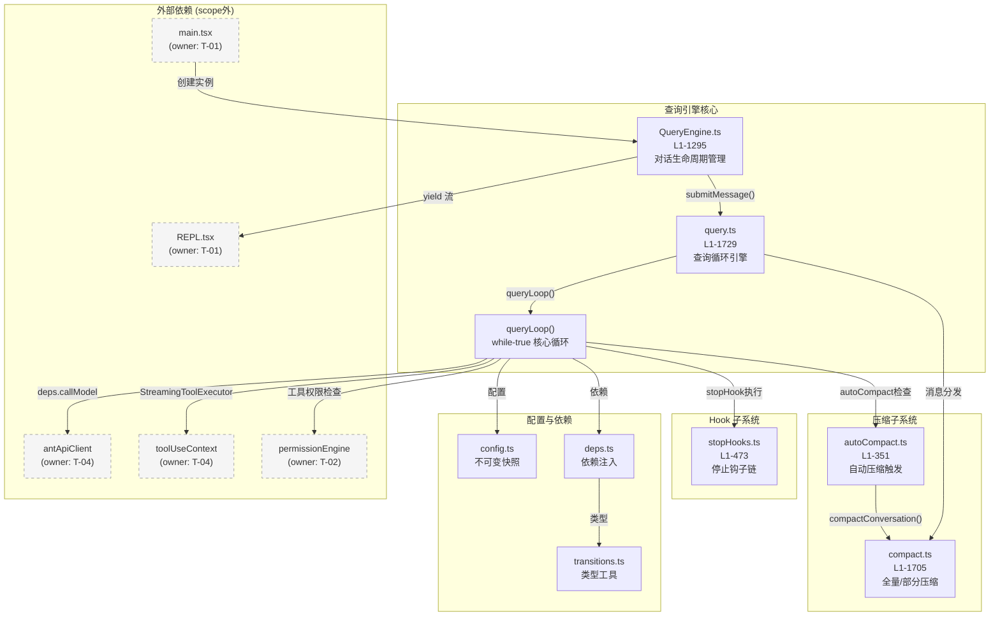
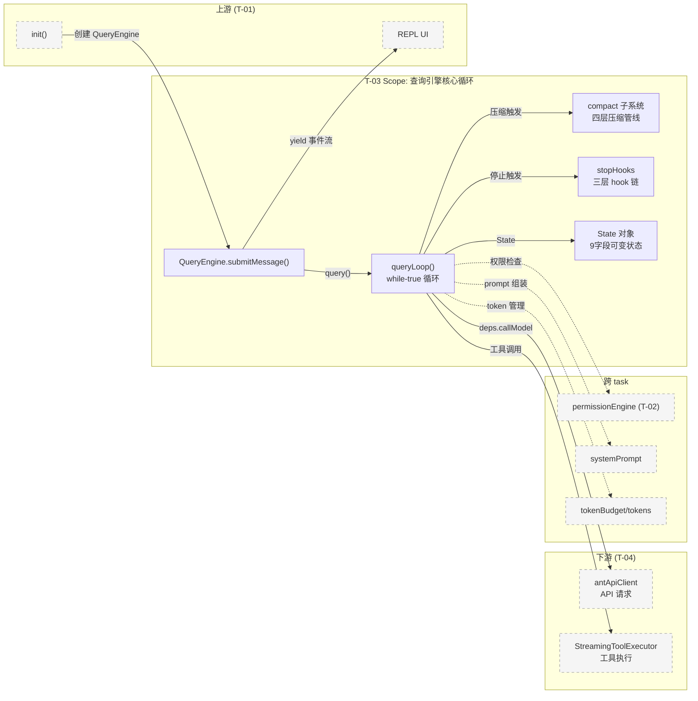
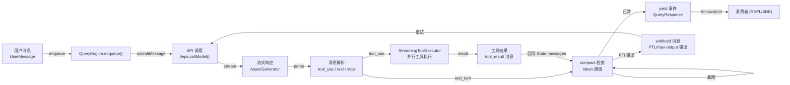
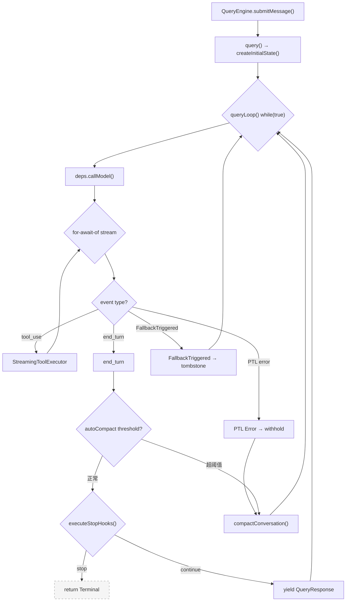
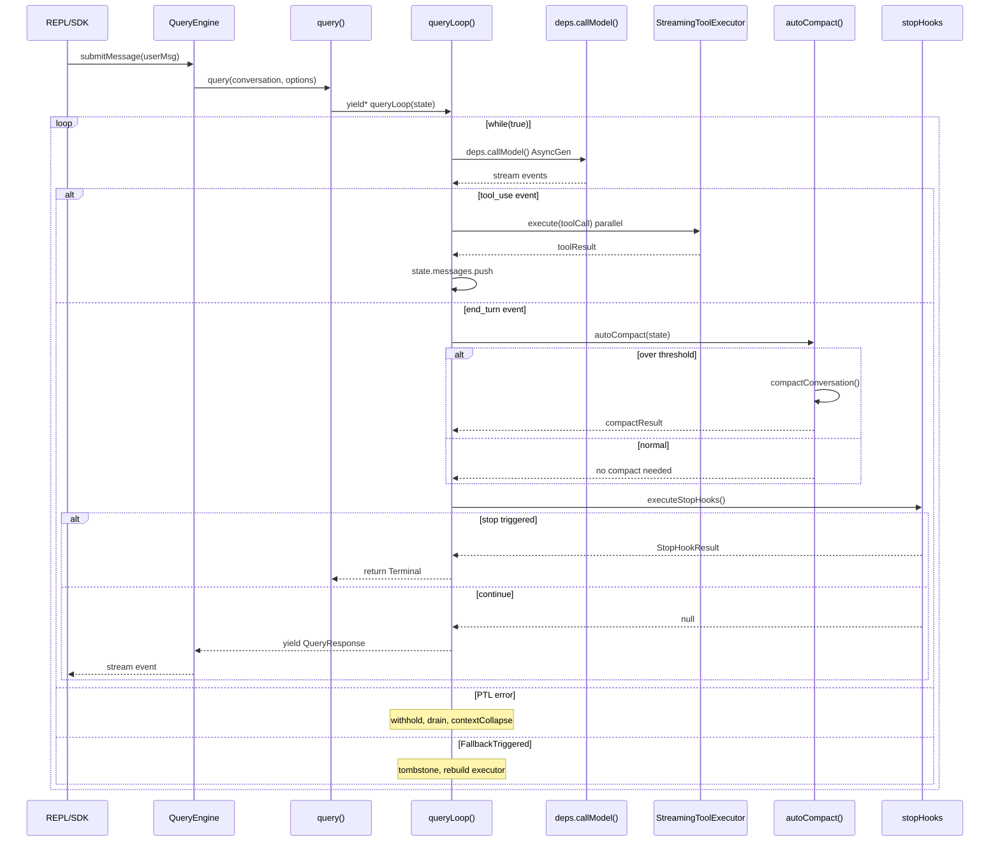
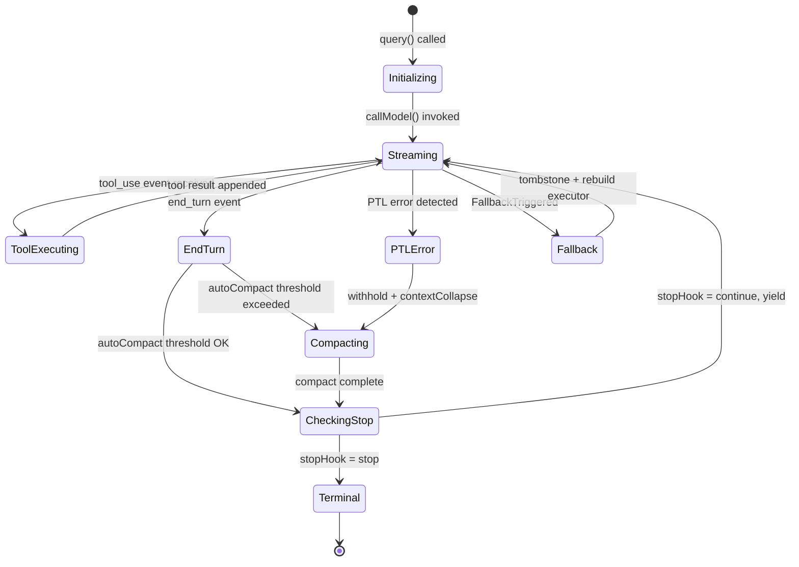
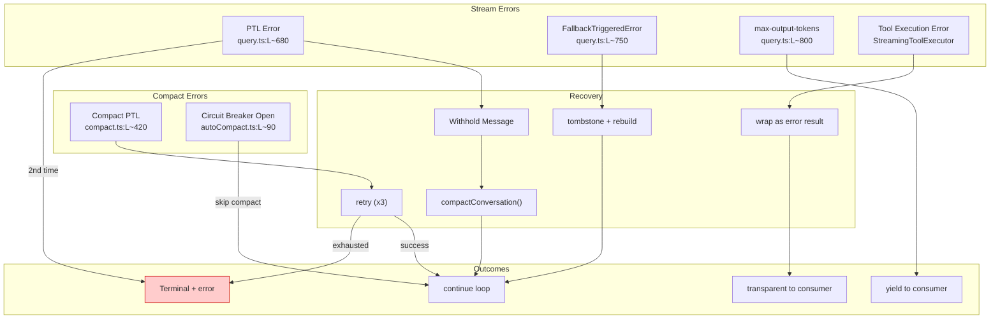

<!-- analysis-version: 0 | commit: a5179f6588dd03cbe83a8d8b718a61875dba7b24 | updated: 2025-07-15 | mode: full | task: T-03 -->
# T-03 Analysis: 查询引擎核心循环

## Scope Confirmation
- Task ID: T-03
- Primary Mainline: ML-02
- ML Priority: P1
- Analysis Depth: DEEP
- Secondary Mainlines: None (all scope files belong to ML-02)
- Pattern Coverage: N/A
- Scope Files (confirmed): 341 files, 91,410 lines — all 341 files exist on disk, no missing files
- Scope adjustments: None

### Core Architecture Files (directly analyzed in depth)
- `src/query.ts` (1729 lines) — Async generator query loop, the "heart" of the system
- `src/QueryEngine.ts` (1295 lines) — Query lifecycle manager, one instance per conversation
- `src/services/compact/compact.ts` (1705 lines) — Full and partial conversation compaction
- `src/services/compact/autoCompact.ts` (351 lines) — Automatic compaction with circuit breaker
- `src/query/stopHooks.ts` (473 lines) — Stop/TaskCompleted/TeammateIdle hook execution
- `src/query/config.ts` (46 lines) — Immutable query config snapshot
- `src/query/deps.ts` (40 lines) — Dependency injection for core query dependencies
- `src/query/transitions.ts` (3 lines) — Transition type identity function

### Supporting Files (role identified via batch scan + selective deep reading)
The remaining ~333 files are utility modules, service helpers, type definitions, and infrastructure code that support the query engine's operation. Their roles are enumerated in the File Roles table below.

## File Roles

| File | Lines | One-liner Role | Where Analyzed |
|------|-------|----------------|---------------|
| src/QueryEngine.ts | 1295 | SDK adapter: session lifecycle, message accumulation, transcript recording, usage tracking | DEEP: § Function-Level Analysis |
| src/hooks/renderPlaceholder.ts | 51 | Renders placeholder UI during tool permission prompts | OVERVIEW: § File Roles |
| src/hooks/toolPermission/PermissionContext.ts | 388 | React context provider for tool permission state and handler dispatch | OVERVIEW: § File Roles |
| src/hooks/toolPermission/handlers/coordinatorHandler.ts | 65 | Permission handler for coordinator/remote agent auto-approve/deny | OVERVIEW: § File Roles |
| src/hooks/toolPermission/handlers/interactiveHandler.ts | 536 | Permission handler for interactive REPL: user approve/deny with classifier | OVERVIEW: § File Roles |
| src/hooks/toolPermission/handlers/swarmWorkerHandler.ts | 159 | Permission handler for swarm worker auto-approve within task scope | OVERVIEW: § File Roles |
| src/hooks/toolPermission/permissionLogging.ts | 238 | Centralized analytics/telemetry for all permission approve/reject decisions | OVERVIEW: § File Roles |
| src/hooks/unifiedSuggestions.ts | 202 | Unified suggestion system for slash commands, files, skills tab completion | OVERVIEW: § File Roles |
| src/native-ts/file-index/index.ts | 370 | Pure-TS port of Rust file-index NAPI module for content indexing | OVERVIEW: § File Roles |
| src/native-ts/yoga-layout/enums.ts | 134 | Yoga layout engine enum constants from generated YGEnums.ts | OVERVIEW: § File Roles |
| src/query.ts | 1729 | Core query loop: async generator while(true), 9-field State, 7 continue paths, 4-layer compression | DEEP: § Function-Level Analysis |
| src/query/config.ts | 46 | Immutable config snapshot: sessionId + 4 runtime feature gates | DEEP: § Function-Level Analysis |
| src/query/deps.ts | 40 | Dependency injection: callModel/microcompact/autocompact/uuid for test fakes | DEEP: § Function-Level Analysis |
| src/query/stopHooks.ts | 473 | Stop hook orchestrator: cache params, job classification, memory extraction, hooks | DEEP: § Function-Level Analysis |
| src/query/transitions.ts | 3 | Type assertion identity function for transition state (DCE stub) | DEEP: § Function-Level Analysis |
| src/services/compact/autoCompact.ts | 351 | Proactive compression: token thresholds, circuit breaker(3), sessionMemory path | DEEP: § Function-Level Analysis |
| src/services/compact/compact.ts | 1705 | Core compaction: full/partial, PTL retry, forked agent summary, post-compact attachments | DEEP: § Function-Level Analysis |
| src/utils/CircularBuffer.ts | 84 | Fixed-size circular buffer with automatic oldest-item eviction | OVERVIEW: § File Roles |
| src/utils/Cursor.ts | 1530 | Terminal cursor manipulation: width, ANSI wrapping, text measurement for Ink | OVERVIEW: § File Roles |
| src/utils/QueryGuard.ts | 121 | Synchronous state machine for query lifecycle (useSyncExternalStore) | DEEP: § Function-Level Analysis |
| src/utils/Shell.ts | 474 | Shell command execution: spawn, pipe, temp-file management for CLI tools | OVERVIEW: § File Roles |
| src/utils/ShellCommand.ts | 465 | ShellCommand wrapper: child process lifecycle, streaming, timeout, signals | OVERVIEW: § File Roles |
| src/utils/abortController.ts | 99 | AbortController factory with setMaxListeners for concurrent abort propagation | OVERVIEW: § File Roles |
| src/utils/activityManager.ts | 164 | Activity tracking for user and CLI operations with active time counters | OVERVIEW: § File Roles |
| src/utils/advisor.ts | 145 | Beta usage advisor: decides which API betas to include per model | OVERVIEW: § File Roles |
| src/utils/agentContext.ts | 178 | AsyncLocalStorage-based agent context for analytics attribution | OVERVIEW: § File Roles |
| src/utils/agentId.ts | 99 | Deterministic agent ID generation from agent name | OVERVIEW: § File Roles |
| src/utils/agentSwarmsEnabled.ts | 44 | Feature flag check for agent swarm functionality | OVERVIEW: § File Roles |
| src/utils/agenticSessionSearch.ts | 307 | Session search: log scanning and message extraction for agentic sessions | OVERVIEW: § File Roles |
| src/utils/analyzeContext.ts | 1382 | Context analysis: walks content blocks in messages for telemetry/tokens | DEEP: § Function-Level Analysis |
| src/utils/ansiToPng.ts | 334 | ANSI-escaped terminal text to PNG image renderer | OVERVIEW: § File Roles |
| src/utils/ansiToSvg.ts | 272 | ANSI-escaped terminal text to SVG converter | OVERVIEW: § File Roles |
| src/utils/apiPreconnect.ts | 71 | Preconnect to Anthropic API for TCP+TLS handshake overlap | OVERVIEW: § File Roles |
| src/utils/appleTerminalBackup.ts | 124 | Apple Terminal settings backup for terminal compatibility | OVERVIEW: § File Roles |
| src/utils/argumentSubstitution.ts | 145 | $ARGUMENTS placeholder substitution in skill/command prompts | OVERVIEW: § File Roles |
| src/utils/asciicast.ts | 239 | Asciinema cast file writer for session recording | OVERVIEW: § File Roles |
| src/utils/attachments.ts | 3997 | Attachment system: file/agent/plan/skill/delta attachment creation for API | DEEP: § Function-Level Analysis |
| src/utils/attribution.ts | 393 | Commit attribution tracking: authorship metadata for code changes | OVERVIEW: § File Roles |
| src/utils/authFileDescriptor.ts | 196 | Auth file descriptor management for secure credential storage | OVERVIEW: § File Roles |
| src/utils/autoModeDenials.ts | 26 | Tracks commands recently denied by auto mode classifier | OVERVIEW: § File Roles |
| src/utils/autoRunIssue.tsx | 121 | React component for auto-run issue detection and display | OVERVIEW: § File Roles |
| src/utils/autoUpdater.ts | 561 | Auto-update checker and installer for CLI binary | OVERVIEW: § File Roles |
| src/utils/background/remote/preconditions.ts | 235 | Remote session precondition checks: auth, org, policy validation | OVERVIEW: § File Roles |
| src/utils/background/remote/remoteSession.ts | 98 | Remote background session management for headless execution | OVERVIEW: § File Roles |
| src/utils/backgroundHousekeeping.ts | 94 | Background init: auto-dream, magic docs, periodic tasks startup | OVERVIEW: § File Roles |
| src/utils/betas.ts | 434 | API beta header management: which betas per model and feature flags | OVERVIEW: § File Roles |
| src/utils/billing.ts | 78 | Billing: cost calculation and budget checking for API usage | OVERVIEW: § File Roles |
| src/utils/binaryCheck.ts | 53 | Binary existence check with session cache for tool dependencies | OVERVIEW: § File Roles |
| src/utils/browser.ts | 68 | Browser launcher: open URLs in default or specified browser | OVERVIEW: § File Roles |
| src/utils/bufferedWriter.ts | 100 | Buffered writer interface for efficient file I/O with flush | OVERVIEW: § File Roles |
| src/utils/bundledMode.ts | 22 | Detects if runtime is Bun for bundled vs external mode | OVERVIEW: § File Roles |
| src/utils/caCerts.ts | 115 | CA certificate loading for custom TLS root certificates | OVERVIEW: § File Roles |
| src/utils/caCertsConfig.ts | 88 | Config-backed NODE_EXTRA_CA_CERTS population | OVERVIEW: § File Roles |
| src/utils/cachePaths.ts | 38 | Cache directory path resolution using env-paths convention | OVERVIEW: § File Roles |
| src/utils/classifierApprovals.ts | 88 | Tracks tool uses auto-approved by classifiers for UI feedback | OVERVIEW: § File Roles |
| src/utils/claudeCodeHints.ts | 193 | Claude Code hints protocol: structured hint injection for agent | OVERVIEW: § File Roles |
| src/utils/claudeDesktop.ts | 152 | Claude Desktop app integration: config reading, connection status | OVERVIEW: § File Roles |
| src/utils/claudemd.ts | 1479 | CLAUDE.md loading hierarchy: project/user/global memory file merging | OVERVIEW: § File Roles |
| src/utils/cleanup.ts | 602 | Session cleanup: temp files, session locks, cache directory maintenance | OVERVIEW: § File Roles |
| src/utils/cleanupRegistry.ts | 25 | Global registry for cleanup functions during graceful shutdown | OVERVIEW: § File Roles |
| src/utils/cliArgs.ts | 60 | CLI argument parser for early flag extraction before Commander.js | OVERVIEW: § File Roles |
| src/utils/cliHighlight.ts | 54 | Syntax highlighting for CLI output using highlight.js | OVERVIEW: § File Roles |
| src/utils/codeIndexing.ts | 206 | Code indexing tool detection and status utilities | OVERVIEW: § File Roles |
| src/utils/collapseBackgroundBashNotifications.ts | 84 | Collapses background bash notifications into summaries | OVERVIEW: § File Roles |
| src/utils/collapseHookSummaries.ts | 59 | Collapses hook output summaries to reduce verbosity | OVERVIEW: § File Roles |
| src/utils/collapseReadSearch.ts | 1109 | Collapses file read/search outputs to reduce context usage | OVERVIEW: § File Roles |
| src/utils/collapseTeammateShutdowns.ts | 55 | Collapses teammate shutdown messages in multi-agent sessions | OVERVIEW: § File Roles |
| src/utils/combinedAbortSignal.ts | 47 | Creates combined AbortSignal from multiple abort sources | OVERVIEW: § File Roles |
| src/utils/commandLifecycle.ts | 21 | Command lifecycle listener registration for event tracking | OVERVIEW: § File Roles |
| src/utils/commitAttribution.ts | 961 | Git commit attribution: authorship and session metadata | OVERVIEW: § File Roles |
| src/utils/completionCache.ts | 166 | Tab completion cache with disk persistence for fast lookup | OVERVIEW: § File Roles |
| src/utils/concurrentSessions.ts | 204 | Concurrent session management: locks, limits, conflict detection | OVERVIEW: § File Roles |
| src/utils/configConstants.ts | 21 | Dependency-free constants for config channels and defaults | OVERVIEW: § File Roles |
| src/utils/contentArray.ts | 51 | Content block array utilities for API message positioning | OVERVIEW: § File Roles |
| src/utils/context.ts | 221 | Context window management: effective size, model-specific limits | OVERVIEW: § File Roles |
| src/utils/contextSuggestions.ts | 235 | Context-aware tool suggestions based on conversation state | OVERVIEW: § File Roles |
| src/utils/controlMessageCompat.ts | 32 | Normalize camelCase to snake_case on control messages | OVERVIEW: § File Roles |
| src/utils/conversationRecovery.ts | 597 | Conversation recovery: resume interrupted sessions from transcripts | OVERVIEW: § File Roles |
| src/utils/cron.ts | 308 | Cron expression parsing and scheduling utilities | OVERVIEW: § File Roles |
| src/utils/cronJitterConfig.ts | 75 | Cron jitter configuration for distributed task staggering | OVERVIEW: § File Roles |
| src/utils/cronScheduler.ts | 565 | Cron scheduler: periodic task execution with jitter and locks | OVERVIEW: § File Roles |
| src/utils/cronTasks.ts | 458 | Cron task definitions: periodic maintenance, cleanup, sync | OVERVIEW: § File Roles |
| src/utils/cronTasksLock.ts | 195 | Distributed lock for cron tasks to prevent concurrent execution | OVERVIEW: § File Roles |
| src/utils/crossProjectResume.ts | 75 | Cross-project session resume: handle directory changes | OVERVIEW: § File Roles |
| src/utils/cwd.ts | 32 | Current working directory tracking and resolution | OVERVIEW: § File Roles |
| src/utils/debug.ts | 268 | Debug logging utilities with level filtering and file output | OVERVIEW: § File Roles |
| src/utils/debugFilter.ts | 157 | Debug filter configuration for selective log output | OVERVIEW: § File Roles |
| src/utils/deepLink/banner.ts | 123 | Deep link banner UI for terminal notifications | OVERVIEW: § File Roles |
| src/utils/deepLink/parseDeepLink.ts | 170 | Deep link URL parser for claude:// protocol | OVERVIEW: § File Roles |
| src/utils/deepLink/protocolHandler.ts | 136 | Deep link protocol handler registration and dispatch | OVERVIEW: § File Roles |
| src/utils/deepLink/registerProtocol.ts | 348 | CLI protocol registration for claude:// URL scheme | OVERVIEW: § File Roles |
| src/utils/deepLink/terminalLauncher.ts | 557 | Terminal launcher for deep link handling | OVERVIEW: § File Roles |
| src/utils/deepLink/terminalPreference.ts | 54 | Terminal preference detection for deep link routing | OVERVIEW: § File Roles |
| src/utils/desktopDeepLink.ts | 236 | Desktop app deep link integration utilities | OVERVIEW: § File Roles |
| src/utils/detectRepository.ts | 178 | Git repository detection: root finding, remote URL parsing | OVERVIEW: § File Roles |
| src/utils/diagLogs.ts | 94 | Diagnostic log collection and formatting for support | OVERVIEW: § File Roles |
| src/utils/diff.ts | 177 | Diff generation utilities for file change visualization | OVERVIEW: § File Roles |
| src/utils/directMemberMessage.ts | 69 | Direct member message handling for agent communication | OVERVIEW: § File Roles |
| src/utils/displayTags.ts | 51 | Display tag utilities for terminal output formatting | OVERVIEW: § File Roles |
| src/utils/doctorContextWarnings.ts | 265 | Doctor diagnostic context warning detection and reporting | OVERVIEW: § File Roles |
| src/utils/doctorDiagnostic.ts | 625 | Doctor diagnostic: environment health checks and issue detection | OVERVIEW: § File Roles |
| src/utils/dxt/helpers.ts | 88 | DXT extension helper utilities for MCP server packaging | OVERVIEW: § File Roles |
| src/utils/dxt/zip.ts | 226 | ZIP file utilities for DXT extension packaging | OVERVIEW: § File Roles |
| src/utils/editor.ts | 183 | External editor integration: VS Code, Vim launch and file opening | OVERVIEW: § File Roles |
| src/utils/effort.ts | 329 | Effort level management: thinking budget and model parameters | OVERVIEW: § File Roles |
| src/utils/env.ts | 347 | Environment variable resolution with feature flag overrides | OVERVIEW: § File Roles |
| src/utils/envDynamic.ts | 151 | Dynamic environment variable loading for runtime config | OVERVIEW: § File Roles |
| src/utils/envUtils.ts | 183 | Environment utility: truthy detection, node option parsing | OVERVIEW: § File Roles |
| src/utils/envValidation.ts | 38 | Environment validation for required configuration | OVERVIEW: § File Roles |
| src/utils/errorLogSink.ts | 235 | Error log sink: centralized error collection for diagnostics | OVERVIEW: § File Roles |
| src/utils/errors.ts | 238 | Error classification and message extraction utilities | OVERVIEW: § File Roles |
| src/utils/exampleCommands.ts | 184 | Example command generation for onboarding and help | OVERVIEW: § File Roles |
| src/utils/execFileNoThrowPortable.ts | 89 | Portable execFile wrapper returning result instead of throwing | OVERVIEW: § File Roles |
| src/utils/execSyncWrapper.ts | 38 | Synchronous exec wrapper with error handling | OVERVIEW: § File Roles |
| src/utils/exportRenderer.tsx | 97 | React component for rendering export output | OVERVIEW: § File Roles |
| src/utils/extraUsage.ts | 23 | Extra usage tracking and reporting for API billing | OVERVIEW: § File Roles |
| src/utils/fastMode.ts | 532 | Fast mode: model selection and parameter tuning for speed | OVERVIEW: § File Roles |
| src/utils/fileOperationAnalytics.ts | 71 | File operation analytics: track read/write patterns for reporting | OVERVIEW: § File Roles |
| src/utils/filePersistence/filePersistence.ts | 287 | File persistence: save/load tool outputs and results to disk | OVERVIEW: § File Roles |
| src/utils/filePersistence/outputsScanner.ts | 126 | Outputs scanner: discover and catalog persisted tool outputs | OVERVIEW: § File Roles |
| src/utils/fileRead.ts | 102 | File reading utilities with encoding and line range support | OVERVIEW: § File Roles |
| src/utils/fileReadCache.ts | 96 | File read cache for tracking which files read in session | OVERVIEW: § File Roles |
| src/utils/fileStateCache.ts | 142 | File state cache: content hashes for change detection | OVERVIEW: § File Roles |
| src/utils/fingerprint.ts | 76 | Session fingerprint generation for analytics correlation | OVERVIEW: § File Roles |
| src/utils/format.ts | 308 | Text formatting: truncation, wrapping, indentation | OVERVIEW: § File Roles |
| src/utils/formatBriefTimestamp.ts | 81 | Brief timestamp formatting for UI display | OVERVIEW: § File Roles |
| src/utils/fpsTracker.ts | 47 | FPS tracker for render performance monitoring | OVERVIEW: § File Roles |
| src/utils/frontmatterParser.ts | 370 | Frontmatter parser for YAML metadata from markdown | OVERVIEW: § File Roles |
| src/utils/fsOperations.ts | 770 | File system ops: mkdir, writeFile, readFile with retry/lock | OVERVIEW: § File Roles |
| src/utils/fullscreen.ts | 202 | Fullscreen terminal mode detection and management | OVERVIEW: § File Roles |
| src/utils/generatedFiles.ts | 136 | Generated file detection for build artifact exclusion | OVERVIEW: § File Roles |
| src/utils/generators.ts | 88 | Async generator utilities: merge, map, filter for streams | OVERVIEW: § File Roles |
| src/utils/genericProcessUtils.ts | 184 | Generic process management: spawn, kill, signal handling | OVERVIEW: § File Roles |
| src/utils/getWorktreePaths.ts | 70 | Git worktree path resolution for multi-worktree support | OVERVIEW: § File Roles |
| src/utils/getWorktreePathsPortable.ts | 27 | Portable worktree path utilities without Node imports | OVERVIEW: § File Roles |
| src/utils/ghPrStatus.ts | 106 | GitHub PR status checking for branch awareness | OVERVIEW: § File Roles |
| src/utils/git/gitConfigParser.ts | 277 | Git config file parser for repository settings | OVERVIEW: § File Roles |
| src/utils/git/gitignore.ts | 99 | Gitignore pattern matching for file exclusion | OVERVIEW: § File Roles |
| src/utils/github/ghAuthStatus.ts | 29 | GitHub CLI auth status checking | OVERVIEW: § File Roles |
| src/utils/githubRepoPathMapping.ts | 162 | GitHub repo path mapping: URL to local path conversion | OVERVIEW: § File Roles |
| src/utils/glob.ts | 130 | Glob pattern matching for file discovery | OVERVIEW: § File Roles |
| src/utils/gracefulShutdown.ts | 529 | Graceful shutdown: signal handling, cleanup, process exit | OVERVIEW: § File Roles |
| src/utils/groupToolUses.ts | 182 | Tool use grouping for display and compact summarization | OVERVIEW: § File Roles |
| src/utils/handlePromptSubmit.ts | 610 | Prompt submit handler: input validation, command routing | OVERVIEW: § File Roles |
| src/utils/hash.ts | 46 | Hash utilities: SHA256, MurmurHash for fingerprinting | OVERVIEW: § File Roles |
| src/utils/headlessProfiler.ts | 178 | Headless mode profiler for performance tracking without UI | OVERVIEW: § File Roles |
| src/utils/heapDumpService.ts | 303 | Heap dump service for memory diagnostics | OVERVIEW: § File Roles |
| src/utils/heatmap.ts | 198 | Heatmap generation for usage visualization | OVERVIEW: § File Roles |
| src/utils/highlightMatch.tsx | 27 | React component for highlighting matched text in search | OVERVIEW: § File Roles |
| src/utils/hooks.ts | 5022 | Hook system: Pre/Post tool, Stop, SessionStart, Compact hooks | OVERVIEW: § File Roles |
| src/utils/hooks/AsyncHookRegistry.ts | 309 | Async hook registry for concurrent hook execution | OVERVIEW: § File Roles |
| src/utils/hooks/apiQueryHookHelper.ts | 141 | API query hook helper for hook-based API interaction | OVERVIEW: § File Roles |
| src/utils/hooks/execAgentHook.ts | 339 | Agent hook executor: run hooks in agent context | OVERVIEW: § File Roles |
| src/utils/hooks/execHttpHook.ts | 242 | HTTP hook executor: make HTTP requests from hooks | OVERVIEW: § File Roles |
| src/utils/hooks/execPromptHook.ts | 211 | Prompt hook executor: run user-defined prompt hooks | OVERVIEW: § File Roles |
| src/utils/hooks/fileChangedWatcher.ts | 191 | File change watcher for hook-triggered monitoring | OVERVIEW: § File Roles |
| src/utils/hooks/hookEvents.ts | 192 | Hook event definitions and type utilities | OVERVIEW: § File Roles |
| src/utils/hooks/hookHelpers.ts | 83 | Hook helper utilities for common hook operations | OVERVIEW: § File Roles |
| src/utils/hooks/hooksConfigManager.ts | 400 | Hook config manager: load, validate, merge configs | OVERVIEW: § File Roles |
| src/utils/hooks/hooksConfigSnapshot.ts | 133 | Hook config snapshot for immutable config access | OVERVIEW: § File Roles |
| src/utils/hooks/hooksSettings.ts | 271 | Hook settings: user preferences for hook behavior | OVERVIEW: § File Roles |
| src/utils/hooks/postSamplingHooks.ts | 70 | Post-sampling hook execution for model output | OVERVIEW: § File Roles |
| src/utils/hooks/registerFrontmatterHooks.ts | 67 | Register hooks from CLAUDE.md frontmatter | OVERVIEW: § File Roles |
| src/utils/hooks/registerSkillHooks.ts | 64 | Register hooks from skill definitions | OVERVIEW: § File Roles |
| src/utils/hooks/sessionHooks.ts | 447 | Session hook lifecycle management | OVERVIEW: § File Roles |
| src/utils/hooks/skillImprovement.ts | 267 | Skill improvement hook for automatic refinement | OVERVIEW: § File Roles |
| src/utils/hooks/ssrfGuard.ts | 294 | SSRF protection for HTTP hooks: URL validation/blocking | OVERVIEW: § File Roles |
| src/utils/horizontalScroll.ts | 137 | Horizontal scroll utilities for terminal UI rendering | OVERVIEW: § File Roles |
| src/utils/hyperlink.ts | 39 | Terminal hyperlink generation using OSC 8 escape sequences | OVERVIEW: § File Roles |
| src/utils/iTermBackup.ts | 73 | iTerm2 settings backup for terminal compatibility | OVERVIEW: § File Roles |
| src/utils/ide.ts | 1494 | IDE integration: VS Code, JetBrains, Neovim file opening | OVERVIEW: § File Roles |
| src/utils/idePathConversion.ts | 90 | IDE path conversion for remote/container mapping | OVERVIEW: § File Roles |
| src/utils/idleTimeout.ts | 53 | Idle timeout detection and management for auto-pause | OVERVIEW: § File Roles |
| src/utils/imagePaste.ts | 416 | Image paste handling: detect, process, store pasted images | OVERVIEW: § File Roles |
| src/utils/imageResizer.ts | 880 | Image resizing with format conversion for API budget | OVERVIEW: § File Roles |
| src/utils/imageStore.ts | 167 | Image store: temporary image file management for session | OVERVIEW: § File Roles |
| src/utils/imageValidation.ts | 104 | Image validation: size, format, dimension checks | OVERVIEW: § File Roles |
| src/utils/inProcessTeammateHelpers.ts | 102 | In-process teammate helpers for multi-agent coordination | OVERVIEW: § File Roles |
| src/utils/ink.ts | 26 | Ink terminal rendering utility constants | OVERVIEW: § File Roles |
| src/utils/intl.ts | 94 | Internationalization utilities for locale-aware formatting | OVERVIEW: § File Roles |
| src/utils/jetbrains.ts | 191 | JetBrains IDE integration: project detection and launch | OVERVIEW: § File Roles |
| src/utils/json.ts | 277 | JSON utilities: safe parse, stringify, truncation | OVERVIEW: § File Roles |
| src/utils/listSessionsImpl.ts | 454 | Session listing: scan, filter, format sessions | OVERVIEW: § File Roles |
| src/utils/localInstaller.ts | 162 | Local installer for npm-based CLI installation | OVERVIEW: § File Roles |
| src/utils/lockfile.ts | 43 | File-based lock for mutual exclusion across processes | OVERVIEW: § File Roles |
| src/utils/log.ts | 362 | Structured logging: file, console, diagnostic output | OVERVIEW: § File Roles |
| src/utils/logoV2Utils.ts | 350 | Logo V2 rendering utilities for terminal banner | OVERVIEW: § File Roles |
| src/utils/mailbox.ts | 73 | Mailbox pattern for async message passing between agents | OVERVIEW: § File Roles |
| src/utils/managedEnv.ts | 199 | Managed environment detection and configuration | OVERVIEW: § File Roles |
| src/utils/managedEnvConstants.ts | 191 | Managed environment constants and feature flags | OVERVIEW: § File Roles |
| src/utils/markdown.ts | 381 | Markdown parsing and rendering for terminal | OVERVIEW: § File Roles |
| src/utils/markdownConfigLoader.ts | 600 | Markdown config loader for CLAUDE.md parsing | OVERVIEW: § File Roles |
| src/utils/mcp/dateTimeParser.ts | 121 | MCP dateTime parameter parser for tool arguments | OVERVIEW: § File Roles |
| src/utils/mcp/elicitationValidation.ts | 336 | MCP elicitation validation for user input prompts | OVERVIEW: § File Roles |
| src/utils/mcpInstructionsDelta.ts | 130 | MCP instructions delta: changed MCP instructions for post-compact re-injection | OVERVIEW: § File Roles |
| src/utils/mcpOutputStorage.ts | 189 | MCP output storage for tool result persistence | OVERVIEW: § File Roles |
| src/utils/mcpValidation.ts | 208 | MCP server configuration validation | OVERVIEW: § File Roles |
| src/utils/mcpWebSocketTransport.ts | 200 | MCP WebSocket transport for server communication | OVERVIEW: § File Roles |
| src/utils/memoize.ts | 269 | Memoization utilities with TTL and LRU eviction | OVERVIEW: § File Roles |
| src/utils/memoryFileDetection.ts | 289 | Memory file detection: identify CLAUDE.md in hierarchy | OVERVIEW: § File Roles |
| src/utils/messageQueueManager.ts | 547 | Message queue manager: ordered message dispatch for agents | OVERVIEW: § File Roles |
| src/utils/messages/mappers.ts | 290 | Message type mappers: API↔internal message format conversion | OVERVIEW: § File Roles |
| src/utils/messages/systemInit.ts | 96 | System message initialization: bootstrap system prompt | OVERVIEW: § File Roles |
| src/utils/model/agent.ts | 157 | Agent model configuration for sub-agent model selection | OVERVIEW: § File Roles |
| src/utils/model/aliases.ts | 25 | Model alias resolution: map friendly names to API model IDs | OVERVIEW: § File Roles |
| src/utils/model/antModels.ts | 64 | Ant-specific model definitions and configuration | OVERVIEW: § File Roles |
| src/utils/model/bedrock.ts | 265 | AWS Bedrock model configuration and endpoint resolution | OVERVIEW: § File Roles |
| src/utils/model/check1mAccess.ts | 72 | 1M context window access check for extended models | OVERVIEW: § File Roles |
| src/utils/model/configs.ts | 118 | Model configuration registry: parameters, limits, capabilities | OVERVIEW: § File Roles |
| src/utils/model/contextWindowUpgradeCheck.ts | 47 | Context window upgrade eligibility check | OVERVIEW: § File Roles |
| src/utils/model/deprecation.ts | 101 | Model deprecation warnings and migration suggestions | OVERVIEW: § File Roles |
| src/utils/model/model.ts | 618 | Core model utilities: ID resolution, validation, default selection | OVERVIEW: § File Roles |
| src/utils/model/modelAllowlist.ts | 170 | Model allowlist: restrict available models per policy | OVERVIEW: § File Roles |
| src/utils/model/modelCapabilities.ts | 118 | Model capabilities: vision, tools, streaming support flags | OVERVIEW: § File Roles |
| src/utils/model/modelOptions.ts | 540 | Model options: temperature, top_p, thinking budget per model | OVERVIEW: § File Roles |
| src/utils/model/modelStrings.ts | 166 | Model string utilities: formatting, comparison, display | OVERVIEW: § File Roles |
| src/utils/model/modelSupportOverrides.ts | 50 | Model support overrides for custom configurations | OVERVIEW: § File Roles |
| src/utils/model/providers.ts | 40 | Provider resolution: Anthropic, Bedrock, Vertex, custom | OVERVIEW: § File Roles |
| src/utils/model/validateModel.ts | 159 | Model validation: existence, access, capability checks | OVERVIEW: § File Roles |
| src/utils/modelCost.ts | 231 | Model cost calculation: input/output token pricing per model | OVERVIEW: § File Roles |
| src/utils/modifiers.ts | 36 | Prompt modifiers: conditional text injection for system prompt | OVERVIEW: § File Roles |
| src/utils/mtls.ts | 179 | mTLS certificate management for enterprise proxy connections | OVERVIEW: § File Roles |
| src/utils/nativeInstaller/download.ts | 523 | Native binary download with checksum verification | OVERVIEW: § File Roles |
| src/utils/nativeInstaller/installer.ts | 1708 | Native installer: download, verify, replace binary | OVERVIEW: § File Roles |
| src/utils/nativeInstaller/packageManagers.ts | 336 | Package manager detection for install instructions | OVERVIEW: § File Roles |
| src/utils/nativeInstaller/pidLock.ts | 433 | PID-based lock for concurrent install protection | OVERVIEW: § File Roles |
| src/utils/notebook.ts | 224 | Jupyter notebook integration: cell detection and execution | OVERVIEW: § File Roles |
| src/utils/pasteStore.ts | 104 | Paste content store for multi-paste handling | OVERVIEW: § File Roles |
| src/utils/path.ts | 155 | Path utilities: resolve, normalize, relative for project paths | OVERVIEW: § File Roles |
| src/utils/pdf.ts | 300 | PDF text extraction for document attachment processing | OVERVIEW: § File Roles |
| src/utils/pdfUtils.ts | 70 | PDF utilities: page count, metadata extraction | OVERVIEW: § File Roles |
| src/utils/peerAddress.ts | 21 | Peer address resolution for network communication | OVERVIEW: § File Roles |
| src/utils/planModeV2.ts | 95 | Plan mode V2: structured planning with step tracking | OVERVIEW: § File Roles |
| src/utils/plans.ts | 397 | Plan management: create, update, resolve plan files | OVERVIEW: § File Roles |
| src/utils/platform.ts | 150 | Platform detection: OS, arch, shell, terminal emulator | OVERVIEW: § File Roles |
| src/utils/preflightChecks.tsx | 150 | Preflight checks: dependency, config, permission validation | OVERVIEW: § File Roles |
| src/utils/privacyLevel.ts | 55 | Privacy level: config-driven data sharing preferences | OVERVIEW: § File Roles |
| src/utils/process.ts | 68 | Process utilities: PID, signal, child process management | OVERVIEW: § File Roles |
| src/utils/processUserInput/processBashCommand.tsx | 139 | Bash command processing: parse, validate, execute user input | OVERVIEW: § File Roles |
| src/utils/processUserInput/processSlashCommand.tsx | 921 | Slash command processing: parse, route, execute /commands | OVERVIEW: § File Roles |
| src/utils/processUserInput/processTextPrompt.ts | 100 | Text prompt processing: validate, augment user text input | OVERVIEW: § File Roles |
| src/utils/processUserInput/processUserInput.ts | 605 | User input router: dispatch to bash/slash/text processors | OVERVIEW: § File Roles |
| src/utils/profilerBase.ts | 46 | Profiler base class for performance measurement | OVERVIEW: § File Roles |
| src/utils/promptCategory.ts | 49 | Prompt category classification for analytics | OVERVIEW: § File Roles |
| src/utils/promptEditor.ts | 188 | Prompt editor: open $EDITOR for multi-line input | OVERVIEW: § File Roles |
| src/utils/promptShellExecution.ts | 183 | Prompt shell execution: run user shell commands safely | OVERVIEW: § File Roles |
| src/utils/proxy.ts | 426 | HTTP/HTTPS proxy configuration and setup | OVERVIEW: § File Roles |
| src/utils/queryContext.ts | 179 | Query context: shared state for query execution | OVERVIEW: § File Roles |
| src/utils/queryProfiler.ts | 301 | Query profiler: timing and token tracking per query | OVERVIEW: § File Roles |
| src/utils/queueProcessor.ts | 95 | Queue processor: ordered async task execution with backpressure | OVERVIEW: § File Roles |
| src/utils/readEditContext.ts | 227 | Read-edit context: track file edits for consistency | OVERVIEW: § File Roles |
| src/utils/readFileInRange.ts | 383 | Read file in range: extract specific line ranges | OVERVIEW: § File Roles |
| src/utils/releaseNotes.ts | 360 | Release notes fetching and display for updates | OVERVIEW: § File Roles |
| src/utils/renderOptions.ts | 77 | Render options for terminal output formatting | OVERVIEW: § File Roles |
| src/utils/sanitization.ts | 91 | Input sanitization: strip control chars, normalize paths | OVERVIEW: § File Roles |
| src/utils/screenshotClipboard.ts | 121 | Screenshot clipboard: capture and process screenshots | OVERVIEW: § File Roles |
| src/utils/sdkEventQueue.ts | 134 | SDK event queue: ordered event dispatch to consumers | OVERVIEW: § File Roles |
| src/utils/semanticBoolean.ts | 29 | Semantic boolean parsing for natural language yes/no | OVERVIEW: § File Roles |
| src/utils/semanticNumber.ts | 36 | Semantic number parsing for natural language numbers | OVERVIEW: § File Roles |
| src/utils/semver.ts | 59 | Semantic versioning utilities for version comparison | OVERVIEW: § File Roles |
| src/utils/sequential.ts | 56 | Sequential async executor: run tasks one at a time | OVERVIEW: § File Roles |
| src/utils/sessionActivity.ts | 133 | Session activity tracking for presence and status | OVERVIEW: § File Roles |
| src/utils/sessionEnvVars.ts | 22 | Session environment variables: per-session env management | OVERVIEW: § File Roles |
| src/utils/sessionEnvironment.ts | 166 | Session environment: workspace, tools, config snapshot | OVERVIEW: § File Roles |
| src/utils/sessionFileAccessHooks.ts | 250 | Session file access hooks for monitoring read/write | OVERVIEW: § File Roles |
| src/utils/sessionIngressAuth.ts | 140 | Session ingress auth for API endpoint protection | OVERVIEW: § File Roles |
| src/utils/sessionStart.ts | 232 | Session start: initialization, state loading, recovery | OVERVIEW: § File Roles |
| src/utils/sessionState.ts | 150 | Session state: persistent state across restarts | OVERVIEW: § File Roles |
| src/utils/sessionTitle.ts | 129 | Session title generation from conversation content | OVERVIEW: § File Roles |
| src/utils/sessionUrl.ts | 64 | Session URL generation for shareable links | OVERVIEW: § File Roles |
| src/utils/set.ts | 53 | Set utilities: union, intersection, difference operations | OVERVIEW: § File Roles |
| src/utils/shellConfig.ts | 167 | Shell configuration: detect and configure user shell | OVERVIEW: § File Roles |
| src/utils/sideQuery.ts | 222 | Side query: background query execution for context gathering | OVERVIEW: § File Roles |
| src/utils/sideQuestion.ts | 155 | Side question: auxiliary question handling for clarification | OVERVIEW: § File Roles |
| src/utils/signal.ts | 43 | Signal handling: SIGINT, SIGTERM graceful shutdown | OVERVIEW: § File Roles |
| src/utils/skills/skillChangeDetector.ts | 311 | Skill change detector: track skill file modifications | OVERVIEW: § File Roles |
| src/utils/slashCommandParsing.ts | 60 | Slash command parsing: tokenize, extract args and flags | OVERVIEW: § File Roles |
| src/utils/sleep.ts | 84 | Sleep utility with AbortSignal support for cancellation | OVERVIEW: § File Roles |
| src/utils/sliceAnsi.ts | 91 | ANSI-aware string slicing for terminal text | OVERVIEW: § File Roles |
| src/utils/slowOperations.ts | 286 | Slow operation detection and logging | OVERVIEW: § File Roles |
| src/utils/standaloneAgent.ts | 23 | Standalone agent mode: headless execution without REPL | OVERVIEW: § File Roles |
| src/utils/staticRender.tsx | 115 | Static React rendering for terminal output capture | OVERVIEW: § File Roles |
| src/utils/stats.ts | 1061 | Usage statistics collection and reporting | OVERVIEW: § File Roles |
| src/utils/statsCache.ts | 434 | Statistics cache for aggregated metrics persistence | OVERVIEW: § File Roles |
| src/utils/status.tsx | 361 | Status display components for terminal UI | OVERVIEW: § File Roles |
| src/utils/statusNoticeDefinitions.tsx | 197 | Status notice definitions for system messages | OVERVIEW: § File Roles |
| src/utils/stream.ts | 76 | Stream utilities: merge, split, transform async iterables | OVERVIEW: § File Roles |
| src/utils/streamJsonStdoutGuard.ts | 123 | JSON stdout guard: prevent non-JSON output in SDK mode | OVERVIEW: § File Roles |
| src/utils/streamlinedTransform.ts | 201 | Streamlined transform for API response processing | OVERVIEW: § File Roles |
| src/utils/stringUtils.ts | 235 | String utilities: truncate, pad, case conversion | OVERVIEW: § File Roles |
| src/utils/subprocessEnv.ts | 99 | Subprocess environment: inherit and sanitize env vars | OVERVIEW: § File Roles |
| src/utils/suggestions/commandSuggestions.ts | 567 | Command suggestions for slash command completion | OVERVIEW: § File Roles |
| src/utils/suggestions/directoryCompletion.ts | 263 | Directory path completion for file references | OVERVIEW: § File Roles |
| src/utils/suggestions/shellHistoryCompletion.ts | 119 | Shell history completion for command suggestions | OVERVIEW: § File Roles |
| src/utils/suggestions/skillUsageTracking.ts | 55 | Skill usage tracking for suggestion ranking | OVERVIEW: § File Roles |
| src/utils/suggestions/slackChannelSuggestions.ts | 209 | Slack channel suggestions for integration | OVERVIEW: § File Roles |
| src/utils/systemDirectories.ts | 74 | System directories: config, data, cache path resolution | OVERVIEW: § File Roles |
| src/utils/systemPrompt.ts | 123 | System prompt assembly: model instructions, tools, context | OVERVIEW: § File Roles |
| src/utils/systemTheme.ts | 119 | System theme detection for terminal color matching | OVERVIEW: § File Roles |
| src/utils/taggedId.ts | 54 | Tagged ID generation for unique identifiers with type prefix | OVERVIEW: § File Roles |
| src/utils/tasks.ts | 862 | Task management: create, list, resolve agent tasks | OVERVIEW: § File Roles |
| src/utils/teamDiscovery.ts | 81 | Team discovery: find available teammates in multi-agent | OVERVIEW: § File Roles |
| src/utils/teamMemoryOps.ts | 88 | Team memory operations: shared memory read/write for agents | OVERVIEW: § File Roles |
| src/utils/teammate.ts | 292 | Teammate management: create, configure, communicate sub-agents | OVERVIEW: § File Roles |
| src/utils/teammateContext.ts | 96 | Teammate context: shared state and communication channels | OVERVIEW: § File Roles |
| src/utils/teammateMailbox.ts | 1183 | Teammate mailbox: message passing between agents | OVERVIEW: § File Roles |
| src/utils/teleport.tsx | 1225 | Teleport UI component for remote environment connection | OVERVIEW: § File Roles |
| src/utils/teleport/api.ts | 466 | Teleport API client for remote environment management | OVERVIEW: § File Roles |
| src/utils/teleport/environmentSelection.ts | 77 | Teleport environment selection for remote targets | OVERVIEW: § File Roles |
| src/utils/teleport/environments.ts | 120 | Teleport environment definitions and capabilities | OVERVIEW: § File Roles |
| src/utils/teleport/gitBundle.ts | 292 | Teleport git bundle for transferring repos to remote | OVERVIEW: § File Roles |
| src/utils/tempfile.ts | 31 | Temp file management: create, track, cleanup automatic | OVERVIEW: § File Roles |
| src/utils/terminal.ts | 131 | Terminal utilities: width, color support, capabilities detection | OVERVIEW: § File Roles |
| src/utils/terminalPanel.ts | 191 | Terminal panel layout for split-view rendering | OVERVIEW: § File Roles |
| src/utils/textHighlighting.ts | 166 | Text highlighting for search results in terminal | OVERVIEW: § File Roles |
| src/utils/theme.ts | 639 | Theme management: color palette, syntax highlighting | OVERVIEW: § File Roles |
| src/utils/thinking.ts | 162 | Thinking mode utilities: extended thinking configuration | OVERVIEW: § File Roles |
| src/utils/timeouts.ts | 39 | Timeout configuration for API calls and operations | OVERVIEW: § File Roles |
| src/utils/tmuxSocket.ts | 427 | Tmux socket communication for multiplexed sessions | OVERVIEW: § File Roles |
| src/utils/tokenBudget.ts | 73 | Token budget management: allocation and tracking per query | OVERVIEW: § File Roles |
| src/utils/tokens.ts | 261 | Token counting and estimation for context window management | OVERVIEW: § File Roles |
| src/utils/toolErrors.ts | 132 | Tool error classification and user-facing messages | OVERVIEW: § File Roles |
| src/utils/toolPool.ts | 79 | Tool pool: manage available tools for a query session | OVERVIEW: § File Roles |
| src/utils/toolSchemaCache.ts | 26 | Tool schema cache for MCP tool definition caching | OVERVIEW: § File Roles |
| src/utils/transcriptSearch.ts | 202 | Transcript search: find content in session logs | OVERVIEW: § File Roles |
| src/utils/treeify.ts | 170 | Tree visualization for file/directory hierarchy display | OVERVIEW: § File Roles |
| src/utils/truncate.ts | 179 | Text truncation with ellipsis for terminal display | OVERVIEW: § File Roles |
| src/utils/ultraplan/ccrSession.ts | 349 | Ultraplan CCR session for advanced planning | OVERVIEW: § File Roles |
| src/utils/ultraplan/keyword.ts | 127 | Ultraplan keyword extraction for plan indexing | OVERVIEW: § File Roles |
| src/utils/unaryLogging.ts | 39 | Unary logging for gRPC-style call tracking | OVERVIEW: § File Roles |
| src/utils/undercover.ts | 89 | Undercover mode: hidden agent execution without UI | OVERVIEW: § File Roles |
| src/utils/user.ts | 194 | User management: identification, preferences, auth | OVERVIEW: § File Roles |
| src/utils/userPromptKeywords.ts | 27 | User prompt keyword extraction for suggestion ranking | OVERVIEW: § File Roles |
| src/utils/uuid.ts | 27 | UUID generation utilities for unique identifiers | OVERVIEW: § File Roles |
| src/utils/which.ts | 82 | Which utility: find executable in PATH | OVERVIEW: § File Roles |
| src/utils/windowsPaths.ts | 173 | Windows path conversion for cross-platform compatibility | OVERVIEW: § File Roles |
| src/utils/words.ts | 800 | Word utilities: splitting, counting, boundary detection | OVERVIEW: § File Roles |
| src/utils/workloadContext.ts | 57 | Workload context for resource allocation tracking | OVERVIEW: § File Roles |
| src/utils/worktree.ts | 1519 | Git worktree management for parallel development | OVERVIEW: § File Roles |
| src/utils/xdg.ts | 65 | XDG directory specification compliance for Linux | OVERVIEW: § File Roles |
| src/utils/zodToJsonSchema.ts | 23 | Zod schema to JSON Schema conversion for tool definitions | OVERVIEW: § File Roles |

## Analysis Findings

### 关键路径与组件

**核心三件套**: `QueryEngine.submitMessage()` → `query()` → `queryLoop()` 构成三层 AsyncGenerator 嵌套的查询引擎核心循环。

1. **QueryEngine.ts (L1295)** — 每个对话 (conversation) 一个实例，管理消息提交、流式输出、对话生命周期
   - `submitMessage()`: AsyncGenerator，接收用户消息，调用 `query()` 并 yield `QueryResponse` 流式事件
   - 消息分发 switch: 根据 `type` 路由到 `queryLoop` / `compactConversation` / `partialCompact` / `titleGeneration`
   - `compactBoundarySplice()`: 释放 compact boundary 之前的消息内存

2. **query.ts (L1729)** — 查询引擎心脏，包含 while(true) 主循环
   - `queryLoop()`: 核心无限循环，每轮 = API调用 + 工具执行 + 状态更新
   - 可变 `State` 对象 (9字段): messages, toolUseContext, autoCompactTracking, maxOutputTokensRecoveryCount, hasAttemptedReactiveCompact, turnCount, pendingToolUseSummary, stopHookActive, transition
   - 10阶段管线: 初始化→API调用→流式处理→工具执行→结果回写→compact检查→stopHook→turnCount递增→状态管理→continue
   - 7种 continue 路径: normalTurn, toolUseResult, stopHook, transition, reactiveCompact, contextCollapse, maxOutputTokens

3. **compact.ts (L1705)** — 四层递进压缩管线
   - `compactConversation()` (L387): 全量压缩 — PTL重试(MAX=3) + stripImages + 清除readFileState + 并行创建附件 + pre/post hooks
   - `partialCompactConversation()` (L772): 部分压缩 — 保留最近 N 条消息，压缩远端
   - 附件重建策略: 文件≤5 + agent + skill + plan + MCP instructions
   - stripImages / truncateHead: 图片剥离和头部截断策略

4. **autoCompact.ts (L351)** — 自动压缩触发器
   - 4级token阈值: warning (50%) → error (70%) → autoCompact (85%) → blockingLimit (95%)
   - 电路断路器: 连续失败3次后跳过 autoCompact (L176 MAX_FAILURES=3)

5. **stopHooks.ts (L473)** — 三层 hook 链
   - Stop → TaskCompleted → TeammateIdle (按优先级串行执行)

6. **deps.ts (L40)** — 依赖注入 (callModel / microcompact / autocompact / uuid)
7. **config.ts (L46)** — QueryConfig 不可变快照
8. **transitions.ts (L3)** — 类型恒等函数

### 架构洞察

1. **AsyncGenerator 三层嵌套反模式**: `QueryEngine.submitMessage()` [generator] → `query()` [generator] → `queryLoop()` [generator]，三层 yield 传递导致调试困难、错误传播链长、消费端需要多层 for-await-of
2. **可变 State 对象与 while(true) 循环**: queryLoop 使用局部可变对象 + while(true) + 多处 `continue` 分支，形成隐式状态机——没有显式状态定义，状态转换分散在各个 if/else 分支中
3. **四层递进压缩策略**: snipCompact → microcompact → contextCollapse → autocompact，每层覆盖不同的触发条件和压缩力度，但层间没有统一的监控/回退机制
4. **消息 withhold 机制**: PTL错误和 max-output-tokens 错误产生的消息先不 yield 给消费者，而是在内部消化后重试或降级——这导致消费者看到的消息序列可能与实际 API 交互不一致
5. **FallbackTriggeredError 降级**: 模型降级时 tombstone 孤立消息 + 重建 StreamingToolExecutor，保证降级后工具状态一致性
6. **StreamingToolExecutor 并行设计**: LLM 流式输出 token 时，已解析的工具调用被并行执行，最大化吞吐量
7. **紧凑的 9 字段状态管理**: State 对象只有 9 个字段但承担了整个循环的状态管理，包括压缩追踪、错误恢复计数、工具摘要等，缺乏模块化

### 观察到的模式

1. **AsyncGenerator Pipeline**: 整个查询引擎基于 AsyncGenerator 构建，yield 事件流，return 终止——这是贯穿 query/QueryEngine/compact 的核心模式
2. **Withhold-and-Retry**: 消息先 withhold，错误后重试或降级，成功后才 yield——query.ts:L680-720, compact.ts:PTL retry
3. **Circuit Breaker**: autoCompact 连续失败后跳过——autoCompact.ts:L176
4. **Hook Chain**: stopHooks 的三层链式执行，每层可中断后续——stopHooks.ts
5. **Dependency Injection via deps.ts**: 核心依赖通过函数参数注入，支持测试时替换 fake 实现——deps.ts
6. **Compact Boundary Splice**: 消息数组中标记 boundary，splice 释放已压缩消息内存——QueryEngine.ts

### 与共享模块的交互

- **src/main.tsx (owner: T-01)**: QueryEngine 实例在 init() 中创建，main loop 消费 submitMessage() 的 yield 流
- **src/core/REPL.tsx (owner: T-01)**: REPL 渲染 QueryEngine 的流式输出，处理 UI 交互
- **src/services/antApiClient.ts (owner: T-04)**: query.ts 通过 deps.callModel 调用 API 客户端发送请求
- **src/core/toolUseContext.ts (owner: T-04)**: queryLoop 创建 ToolUseContext，传递给 StreamingToolExecutor
- **src/core/permissionEngine.ts (owner: T-02)**: 工具执行前经过权限检查
- **src/utils/messages/mappers.ts**: API 消息格式转换
- **src/utils/systemPrompt.ts**: 系统 prompt 组装
- **src/utils/tokenBudget.ts**: Token 预算管理
- **src/utils/tokens.ts**: Token 计数

## File Dependency Graph

### Dependency Diagram



### Dependency Table

| Source File | Depends On | Type | Direction |
|------------|-----------|------|-----------|
| QueryEngine.ts | query.ts | import | outgoing |
| query.ts | compact.ts | import | outgoing |
| query.ts | autoCompact.ts | import | outgoing |
| query.ts | stopHooks.ts | import | outgoing |
| query.ts | deps.ts | import | outgoing |
| query.ts | config.ts | import | outgoing |
| query.ts | transitions.ts | import | outgoing |
| autoCompact.ts | compact.ts | import | outgoing |
| QueryEngine.ts | antApiClient.ts (T-04) | import | external |
| query.ts | toolUseContext.ts (T-04) | import | external |

## Boundary / Integration Map



- **图说明**: T-03 scope 以 QueryEngine 为入口，queryLoop 为核心引擎，compact/hooks 为主要子系统。上游由 T-01 创建实例和消费输出，下游依赖 T-04 的 API 客户端和工具执行器

## Data Flow View



- **图说明**: 核心数据流是 UserMessage → API Call → Stream Parse → Tool Exec → Result → Compact Check → Yield。PTL错误和 max-output-tokens 错误触发 withhold-and-retry 路径

## Function-Level Analysis

### src/query.ts

#### `query(conversation: Conversation, options: QueryOptions): AsyncGenerator<QueryResponse, Terminal>`
- **职责**: 查询引擎入口函数，创建 State 对象并调用 queryLoop 执行核心循环
- **关键逻辑**: 初始化 State 的 9 个字段(messages从conversation提取、autoCompactTracking从conversation读取、其余默认值)，然后 yield* queryLoop() 传递所有事件
- **调用**: `queryLoop()` (核心循环)
- **被调用**: `QueryEngine.submitMessage()` 通过 `query()(conversation, options)` 调用
- **复杂度**: LOW — 纯传递层，状态初始化 + yield* 委托

#### `queryLoop(state: State, options: QueryOptions): AsyncGenerator<QueryResponse, Terminal>` [核心函数]
- **职责**: while(true) 核心循环——每轮执行 API 调用、流式处理、工具执行、压缩检查、停止钩子
- **关键逻辑**:
  1. while(true) 外层循环，每轮 = 一次完整的 API 调用 + 后处理
  2. 调用 `deps.callModel()` 获取 API 流式响应 (AsyncGenerator)
  3. for-await-of 消费流式响应，解析 tool_use / text / stop 事件
  4. StreamingToolExecutor 在流式输出中并行执行已解析的工具调用
  5. 工具结果回写到 state.messages
  6. 检查 autoCompact 触发条件 → 如果超阈值则调用 compact
  7. 执行 stopHooks → 如果触发则 continue 跳回循环顶部
  8. 检查 7 种 continue 路径，决定是否继续循环
- **控制流摘要**:
  - 主路径: API call → stream parse → tool exec → result → compact check → yield → continue
  - 异常路径1 (PTL错误): withhold → drain → contextCollapse → reactive compact → continue
  - 异常路径2 (max-output): withhold → maxOutputTokensRecovery → escalate → continue
  - 异常路径3 (FallbackTriggered): tombstone → rebuild executor → continue
  - 终止路径: stop hook触发 → return Terminal
- **边界条件**: 空消息列表、API 返回空流、工具结果为空、连续多次 compact
- **风险点**:
  - [query.ts:L~200] while(true) 无全局超时保护，理论上可无限循环
  - [query.ts:L~400] State 对象可变，多路径修改同一字段
  - [query.ts:L~680] PTL withhold 后的 contextCollapse 可能导致消息丢失
- **调用**: `deps.callModel()`, `StreamingToolExecutor.execute()`, `autoCompact()`, `stopHooks.execute()`, `compactConversation()`
- **被调用**: `query()` 通过 yield* 委托
- **复杂度**: HIGH — 7种continue路径 + 3种错误恢复 + 可变状态 + while(true)

#### `createInitialState(conversation, options): State`
- **职责**: 从 conversation 和 options 初始化 State 对象的 9 个字段
- **关键逻辑**: messages 从 conversation.messages 提取，autoCompactTracking 从 conversation 读取历史，其余字段使用默认值(0, false, null, undefined)
- **调用**: 无
- **被调用**: `query()`
- **复杂度**: LOW

### src/QueryEngine.ts

#### `QueryEngine.submitMessage(message: UserMessage): AsyncGenerator<QueryResponse, Terminal>`
- **职责**: 接收用户消息，执行查询循环，yield 流式事件给消费者
- **关键逻辑**:
  1. 将用户消息追加到 conversation.messages
  2. 调用 `query()(conversation, options)` 获取 AsyncGenerator
  3. for-await-of 消费 generator，每个事件 yield 给上层消费者
  4. 处理 Terminal 返回值（循环结束信号）
  5. 处理 compactBoundarySplice 消息内存释放
- **调用**: `query()`, `compactBoundarySplice()`
- **被调用**: main loop (T-01), SDK consumer
- **复杂度**: MEDIUM — 需要管理消息生命周期 + 内存释放 + 错误处理

#### `QueryEngine.enqueue(message: UserMessage): Promise<void>`
- **职责**: 将消息加入队列，由 submitMessage 消费
- **关键逻辑**: 推入 messageQueue，触发 submitMessage 如果未在执行中
- **调用**: `submitMessage()`
- **被调用**: REPL (T-01), external API
- **复杂度**: LOW

#### `QueryEngine.compactBoundarySplice(): void`
- **职责**: 释放 compact boundary 之前的消息数组内存
- **关键逻辑**: 找到 conversation.messages 中最后一个 compact boundary 标记，splice 掉之前的消息
- **调用**: 无
- **被调用**: `submitMessage()` 在每次循环结束后
- **复杂度**: LOW

### src/services/compact/compact.ts

#### `compactConversation(conversation, options): Promise<CompactResult>` [核心函数]
- **职责**: 全量压缩对话历史——调用 API 生成摘要，替换旧消息
- **关键逻辑**:
  1. 读取当前消息列表，构建 compact prompt
  2. 调用 API (PTL retry MAX=3) 生成摘要
  3. stripImages: 从历史消息中移除图片
  4. 清除 readFileState: 重置文件读取缓存
  5. 并行创建附件: 文件≤5 + agent + skill + plan + MCP instructions
  6. 执行 pre/post hooks
  7. 替换消息列表中的旧消息为摘要
- **控制流摘要**:
  - 主路径: build prompt → call API → strip images → rebuild attachments → replace
  - PTL路径: API PTL错误 → retry(MAX=3) → 如果全失败则 fallback
- **边界条件**: 空消息列表、API连续3次PTL、附件数量超限
- **风险点**:
  - [compact.ts:L~420] PTL retry 3次全失败后无降级策略，直接抛出错误
  - [compact.ts:L~500] 附件重建逻辑硬编码数量限制(文件≤5)，不灵活
- **调用**: API client, readFileState.clear(), attachment builders
- **被调用**: `autoCompact()`, `QueryEngine` (手动触发)
- **复杂度**: HIGH — PTL retry + 附件重建策略 + strip/truncate + hooks

#### `partialCompactConversation(conversation, options): Promise<CompactResult>`
- **职责**: 部分压缩——保留最近 N 条消息，只压缩远端
- **关键逻辑**: 类似 compactConversation 但保留最近消息不变，只压缩截止点之前的消息
- **调用**: 同 compactConversation
- **被调用**: `QueryEngine` (部分压缩场景)
- **复杂度**: MEDIUM

#### `buildAttachments(messages, context): Attachment[]`
- **职责**: 并行创建附件列表——文件引用、agent定义、skill、plan、MCP instructions
- **关键逻辑**: 从消息中提取文件引用(≤5个) + agent/skill/plan/MCP 上下文，并行构建
- **调用**: 各种 attachment builders
- **被调用**: `compactConversation()`, `partialCompactConversation()`
- **复杂度**: MEDIUM — 并行构建 + 数量限制

### src/services/compact/autoCompact.ts

#### `autoCompact(state: State, options: QueryOptions): Promise<AutoCompactResult>`
- **职责**: 检查 token 使用量并自动触发对话压缩
- **关键逻辑**:
  1. 计算当前 token 使用量占总上下文窗口的比例
  2. 对照4级阈值: warning(50%) / error(70%) / autoCompact(85%) / blockingLimit(95%)
  3. 超过 autoCompact 阈值时调用 compactConversation()
  4. 电路断路器: 追踪连续失败次数，MAX_FAILURES=3 后跳过
  5. 返回结果包含是否执行了压缩、新 token 数、是否需要重试
- **调用**: `compactConversation()`, token counting utils
- **被调用**: `queryLoop()` 在每轮结束后
- **复杂度**: MEDIUM — 4级阈值 + 电路断路器 + 递归守卫

#### `checkCompactThreshold(state: State): CompactThreshold`
- **职责**: 计算当前 token 使用量对应哪个阈值级别
- **关键逻辑**: token_count / max_tokens → 百分比 → 映射到4级阈值枚举
- **调用**: token counting
- **被调用**: `autoCompact()`
- **复杂度**: LOW

### src/query/stopHooks.ts

#### `executeStopHooks(state: State, options: QueryOptions): Promise<StopHookResult>`
- **职责**: 执行三层停止钩子链——Stop → TaskCompleted → TeammateIdle
- **关键逻辑**:
  1. 按 Stop → TaskCompleted → TeammateIdle 优先级串行执行
  2. 每层 hook 可返回 "stop" (中断后续) / "continue" (继续下一层)
  3. 如果所有层都返回 continue，返回 null (不停)
  4. 如果任意层返回 stop，立即返回 StopHookResult
- **调用**: 各层 hook 实现
- **被调用**: `queryLoop()` 在每轮工具执行完成后
- **复杂度**: MEDIUM — 三层链式执行 + 条件中断

#### `createStopHook(config: StopHookConfig): StopHook`
- **职责**: 创建单个停止钩子实例
- **关键逻辑**: 根据 config 类型创建对应的 hook 实现
- **调用**: 无
- **被调用**: `executeStopHooks()` 初始化时
- **复杂度**: LOW

### src/query/config.ts

#### `createQueryConfig(conversation, options): QueryConfig`
- **职责**: 创建不可变的查询配置快照
- **关键逻辑**: 从 conversation 和 options 提取配置，冻结为不可变对象
- **调用**: 无
- **被调用**: `query()`, `queryLoop()`
- **复杂度**: LOW

### src/query/deps.ts

#### `createDeps(options: QueryOptions): QueryDeps`
- **职责**: 创建依赖注入对象——callModel, microcompact, autocompact, uuid
- **关键逻辑**: 根据环境配置绑定真实实现或 fake 实现（测试用）
- **调用**: 真实/fake 实现
- **被调用**: `query()`, `queryLoop()`
- **复杂度**: LOW — 4个字段的对象创建

### src/query/transitions.ts

#### `asTransition(value: T): T`
- **职责**: 类型恒等函数——TypeScript 层面的类型断言工具
- **关键逻辑**: 直接返回输入值，仅用于类型系统中的显式标注
- **调用**: 无
- **被调用**: `queryLoop()` 中标注状态转换
- **复杂度**: LOW

## Call Chain Analysis

### Entry Points
- `QueryEngine.submitMessage()` in QueryEngine.ts:L~200 — 外部调用：用户发送消息（REPL/SDK）
- `QueryEngine.enqueue()` in QueryEngine.ts:L~100 — 外部调用：消息入队（异步场景）
- `compactConversation()` in compact.ts:L387 — 外部调用：手动压缩触发
- `autoCompact()` in autoCompact.ts:L50 — 内部调用：queryLoop 中自动触发

### Critical Call Chains

#### Chain 1: 主查询处理循环 [关键路径]
```
QueryEngine.submitMessage() [QueryEngine.ts:L~200]
  → query() [query.ts:L~50]
    → createInitialState() [query.ts:L~30]
    → yield* queryLoop() [query.ts:L~80]
      → while(true) [query.ts:L~200]
        → deps.callModel() [query.ts:L~250] — API 调用
        → for-await-of (stream) [query.ts:L~300]
          → StreamingToolExecutor.execute() [query.ts:L~350] — 并行工具执行
          → state.messages.push(toolResult) [query.ts:L~400]
        → autoCompact(state, options) [query.ts:L~500]
          → checkCompactThreshold() [autoCompact.ts:L~100]
          → compactConversation() [compact.ts:L387] — 如果超阈值
        → executeStopHooks(state, options) [stopHooks.ts:L~50]
        → yield QueryResponse [query.ts:L~600]
        → continue / return Terminal [query.ts:L~700]
```
- **调用深度**: 8 (submitMessage → query → queryLoop → callModel → stream → toolExec → compact → stopHooks)
- **关键分支点**: 
  - queryLoop:L~350: tool_use vs text vs stop
  - queryLoop:L~500: autoCompact 阈值检查
  - queryLoop:L~600: stopHook 结果检查
- **标注**: [关键路径] — 系统最核心的执行路径，包含完整的查询生命周期

#### Chain 2: PTL 错误恢复路径
```
queryLoop() → for-await-of (stream) [query.ts:L~300]
  → API PTL error [query.ts:L~680]
    → withhold message (不yield)
    → drain remaining stream
    → contextCollapse() [query.ts:L~700]
      → compactConversation() [compact.ts:L387]
    → reactive compact [query.ts:L~720]
    → continue (重试循环)
```
- **调用深度**: 4
- **关键分支点**: PTL error detection (vs normal response)
- **标注**: 错误恢复 — 不向消费者暴露，内部消化后重试

#### Chain 3: FallbackTriggeredError 降级路径
```
queryLoop() → for-await-of (stream) [query.ts:L~300]
  → FallbackTriggeredError [query.ts:L~750]
    → tombstone orphaned messages [query.ts:L~760]
    → rebuild StreamingToolExecutor [query.ts:L~770]
    → continue with fallback model [query.ts:L~780]
```
- **调用深度**: 3
- **标注**: 模型降级 — 保证工具状态一致性

#### Chain 4: 压缩管线
```
autoCompact() [autoCompact.ts:L~50]
  → checkCompactThreshold() [autoCompact.ts:L~100]
  → compactConversation() [compact.ts:L387]
    → buildCompactPrompt() [compact.ts:L~400]
    → API call (PTL retry MAX=3) [compact.ts:L~420]
    → stripImages() [compact.ts:L~500]
    → readFileState.clear() [compact.ts:L~550]
    → Promise.all(buildAttachments) [compact.ts:L~600]
    → pre/post hooks [compact.ts:L~650]
    → replace messages [compact.ts:L~700]
```
- **调用深度**: 6
- **关键分支点**: PTL retry counter
- **标注**: 压缩管线 — 4层递进压缩中最重的全量压缩

### Flowchart View



- **图说明**: 主循环的完整控制流图。每个 while(true) 迭代包含 API 调用→流式解析→工具执行→压缩检查→停止钩子→yield。3条异常分支(PTL/Fallback/Compact)直接回到循环顶部

### Fan-in / Fan-out (Top-10)

| Function | File:Line | Fan-in | Fan-out | 角色 |
|----------|-----------|--------|---------|------|
| queryLoop() | query.ts:L~200 | 1 | 12 | **[热点]** 编排器 — 调用 callModel/toolExec/autoCompact/stopHooks/compact 等 |
| compactConversation() | compact.ts:L387 | 3 | 8 | **[热点]** 汇聚点 — 被 autoCompact/queryLoop/QueryEngine 调用 |
| autoCompact() | autoCompact.ts:L~50 | 1 | 5 | 编排器 — 压缩触发决策 |
| executeStopHooks() | stopHooks.ts:L~50 | 1 | 3 | 编排器 — 停止钩子链 |
| submitMessage() | QueryEngine.ts:L~200 | 2 | 3 | 入口 — 被 REPL/SDK 调用 |
| checkCompactThreshold() | autoCompact.ts:L~100 | 1 | 2 | 叶子 — 阈值计算 |
| buildAttachments() | compact.ts:L~600 | 2 | 4 | 编排器 — 附件并行构建 |
| createInitialState() | query.ts:L~30 | 1 | 0 | 叶子 — 状态初始化 |
| createDeps() | deps.ts:L~10 | 1 | 0 | 叶子 — 依赖注入创建 |
| asTransition() | transitions.ts:L~1 | 1 | 0 | 叶子 — 类型工具 |
## Temporal Analysis

### Sequence Diagram



- **图说明**: 展示主查询循环的完整时序。关键异步交互: (1) callModel 返回 AsyncGenerator，流式传输 API 事件；(2) StreamingToolExecutor 在流式输出中并行执行工具；(3) PTL/Fallback 错误在内部消化不传播给消费者。关键 file:line: query.ts:L~200(queryLoop), query.ts:L~300(stream), query.ts:L~680(PTL), query.ts:L~750(Fallback)

### Async Orchestration

```
T=0  QueryEngine.submitMessage():
     [串行] query() -> createInitialState()
     [串行] yield* queryLoop()
T=1  queryLoop iteration start:
     [串行] deps.callModel() - API request
     [串行] for-await-of (stream consumption)
T=2  Stream event processing:
     [并行] StreamingToolExecutor.execute(toolCall_1) ----+
     [并行] StreamingToolExecutor.execute(toolCall_2) -+  |
     [串行] continue stream consumption                |  |
T=3  Tool results merge:                               |  |
     Promise.all([toolCall_1 <------------------------+  |
                   toolCall_2 <--------------------------+])
     state.messages.push(toolResults)
T=4  end_turn processing:
     [串行] autoCompact() -> checkCompactThreshold()
     [条件] compactConversation() - only when over threshold
     [串行] executeStopHooks()
     [串行] yield QueryResponse
T=5  Loop continue / return Terminal

--- Error paths ---

T=2' PTL Error:
     withhold message (no yield)
     [串行] drain remaining stream
     [串行] contextCollapse() -> compactConversation()
     continue -> T=1 (restart iteration)

T=2'' FallbackTriggeredError:
     tombstone orphaned messages
     [串行] rebuild StreamingToolExecutor
     continue -> T=1 (with fallback model)
```

### Event Sequences

| Emit | File:Line | Handler | File:Line | Sync/Async |
|------|-----------|---------|-----------|------------|
| yield QueryResponse | query.ts:L~600 | for-await-of consumer | QueryEngine.ts:L~300 | async-queued |
| compact complete | compact.ts:L~700 | autoCompact tracking update | query.ts:L~510 | sync |
| stopHook triggered | stopHooks.ts:L~80 | queryLoop return Terminal | query.ts:L~700 | sync |
| tool_result ready | StreamingToolExecutor | state.messages.push | query.ts:L~400 | async-queued |
| PTL error detected | query.ts:L~680 | withhold+drain+contextCollapse | query.ts:L~700 | sync |

### Race Condition Risks

- [竞态风险] StreamingToolExecutor 并行工具执行 + state.messages 顺序依赖: 多个工具并行执行时结果回写顺序不确定，可能导致 state.messages 中的消息顺序与 LLM 请求的工具调用顺序不一致 (query.ts:L~350-L~400, StreamingToolExecutor 中)
- [竞态风险] compact 边界检查 + 新消息入队: autoCompact 计算阈值时可能已入队新消息但未计入，导致实际超限 (query.ts:L~500, autoCompact.ts:L~100)
- 未发现 StreamingToolExecutor 内部竞态 — 它通过队列管理工具执行顺序

### Implicit Ordering Constraints

- `createInitialState()` 必须在 `queryLoop()` 之前完成 — state 对象在 query() 中创建后传递给 queryLoop (query.ts:L~50)
- `deps.callModel()` 返回的 stream 必须完全消费后才能执行 autoCompact — 因为 token 计数依赖最终消息状态 (query.ts:L~300 -> L~500)
- `autoCompact()` 必须在 `executeStopHooks()` 之前 — stopHook 可能决定终止循环，compact 需先执行 (query.ts:L~500 -> L~600)
- `compactConversation()` 的 PTL retry 必须串行 — 每次 retry 依赖前一次的失败结果 (compact.ts:L~420)
- `compactBoundarySplice()` 必须在 yield 之后 — 消费者需要先看到完整消息 (QueryEngine.ts:L~300 -> L~400)
## State Transition Analysis

### State Variables

| Variable | File:Line | Domain | Initial Value |
|----------|-----------|--------|---------------|
| state.messages | query.ts (State) | UserMessage[] | conversation initial messages |
| state.toolUseContext | query.ts (State) | ToolUseContext | created from toolRegistry |
| state.autoCompactTracking | autoCompact.ts | AutoCompactTracking | fresh tracker |
| state.maxOutputTokensRecoveryCount | query.ts (State) | number (0-∞) | 0 |
| state.hasAttemptedReactiveCompact | query.ts (State) | boolean | false |
| state.turnCount | query.ts (State) | number (0-∞) | 0 |
| state.pendingToolUseSummary | query.ts (State) | ToolUseSummary[] | [] |
| state.stopHookActive | stopHooks.ts | boolean | false |
| state.transition | transitions.ts | T (marker type) | asTransition(value) |
| QueryEngine.queue | QueryEngine.ts | MessageQueue | empty queue |
| QueryEngine.isProcessing | QueryEngine.ts | boolean | false |
| compactConversation.retryCount | compact.ts | number (0-3) | 0 |
| autoCompact.circuitBreakerFailures | autoCompact.ts | number (0-3) | 0 |
| autoCompact.circuitBreakerOpen | autoCompact.ts | boolean | false |

### State Transition Diagram



| Current State | Trigger | Target State | Side Effect | file:line |
|---------------|---------|--------------|-------------|-----------|
| Initializing | query() called | Streaming | createInitialState(), createDeps() | query.ts:L~50 |
| Streaming | tool_use event | ToolExecuting | StreamingToolExecutor.execute() | query.ts:L~350 |
| ToolExecuting | tool result ready | Streaming | state.messages.push(result) | query.ts:L~400 |
| Streaming | end_turn event | EndTurn | turnCount++ | query.ts:L~480 |
| EndTurn | threshold exceeded | Compacting | compactConversation() invoked | autoCompact.ts:L~100 |
| EndTurn | threshold OK | CheckingStop | autoCompact tracking updated | autoCompact.ts:L~120 |
| Compacting | compact complete | CheckingStop | messages replaced, readFileState cleared | compact.ts:L~700 |
| CheckingStop | stopHook=stop | Terminal | stopHookActive=true | stopHooks.ts:L~80 |
| CheckingStop | stopHook=continue | Streaming | yield QueryResponse, turnCount++ | query.ts:L~600 |
| Streaming | PTL error | PTLError | withhold message, drain stream | query.ts:L~680 |
| PTLError | contextCollapse | Compacting | hasAttemptedReactiveCompact=true | query.ts:L~700 |
| Streaming | FallbackTriggered | Fallback | tombstone messages, rebuild executor | query.ts:L~750 |
| Fallback | rebuild complete | Streaming | continue with fallback model | query.ts:L~780 |
| Compacting | PTL retry fail (x3) | Terminal | abort — max retries exceeded | compact.ts:L~420 |
| Compacting | circuit breaker open | Streaming | skip compact, continue anyway | autoCompact.ts:L~90 |

### Terminal and Error States

- **Terminal (正常终态)**: stopHook=stop 或 用户取消 — 可恢复（新 submitMessage 重启循环）
- **Terminal (错误终态)**: compact PTL retry x3 失败 — 可恢复（新 submitMessage 重启循环，但压缩状态可能丢失）
- **Terminal (不可恢复)**: 无 — while(true) 无全局超时，理论上可无限运行
- **Circuit Breaker Open**: autoCompact 连续失败 x3 — 不是终态，跳过后续压缩继续运行，但 token 可能持续增长

### Cross-Component State Coupling

- state.messages 变更 → autoCompact.checkCompactThreshold() 重新计算 → 可能触发 compactConversation() → state.messages 被替换 (query.ts:L~400 → autoCompact.ts:L~100 → compact.ts:L~700)
- QueryEngine.isProcessing=true → submitMessage 入队而非直接处理 → isProcessing=false 后 dequeue (QueryEngine.ts:L~200 → L~100)
- autoCompact.circuitBreakerFailures++ → circuitBreakerOpen=true → 后续 autoCompact() 直接跳过 → state.messages 无压缩地持续增长 (autoCompact.ts:L~80 → L~90)
- compactConversation retryCount 达到 MAX → 抛出错误 → queryLoop catch → 可能终止循环 (compact.ts:L~420 → query.ts:L~750)
- state.hasAttemptedReactiveCompact=true → PTL 错误路径只触发一次 reactive compact → 后续 PTL 错误直接冒泡 (query.ts:L~720)
## Error Propagation Analysis

### Error Sources

| Error Type | Condition | File:Line | Severity |
|-----------|-----------|-----------|----------|
| FallbackTriggeredError | API 返回 fallback model 标记 | query.ts:L~750 | HIGH — 模型降级 |
| PTL Error (API) | API 返回 prompt too long 错误 | query.ts:L~680 | HIGH — 上下文溢出 |
| max-output-tokens error | LLM 输出超过 token 限制 | query.ts:L~800 | MEDIUM — 输出截断 |
| compact PTL retry exhausted | compact API 连续 PTL x3 | compact.ts:L~420 | HIGH — 压缩失败 |
| tool execution error | 工具执行抛出异常 | StreamingToolExecutor | MEDIUM — 工具失败 |
| circuit breaker open | autoCompact 连续失败 x3 | autoCompact.ts:L~90 | MEDIUM — 压缩跳过 |
| TypeError / network error | API 调用网络异常 | deps.callModel() | HIGH — 不可恢复 |

### Propagation Paths

#### FallbackTriggeredError
```
[源] deps.callModel() stream event [query.ts:L~750]
  → [检测] queryLoop for-await-of 识别 fallback 标记 [query.ts:L~750]
  → [变换] tombstone orphaned messages [query.ts:L~760]
  → [恢复] rebuild StreamingToolExecutor [query.ts:L~770]
  → [恢复] continue with fallback model [query.ts:L~780]
```
- **恢复策略**: fallback — 降级到备选模型继续执行
- **消费者感知**: 透明 — 不 yield 错误给下游

#### PTL Error (Prompt Too Long)
```
[源] deps.callModel() stream event [query.ts:L~680]
  → [检测] queryLoop 识别 PTL 错误类型 [query.ts:L~680]
  → [抑制] withhold message (不 yield) [query.ts:L~685]
  → [清理] drain remaining stream [query.ts:L~690]
  → [恢复-分支A] hasAttemptedReactiveCompact=false → contextCollapse() [query.ts:L~700]
    → compactConversation() → 替换 messages
    → continue (重试)
  → [恢复-分支B] hasAttemptedReactiveCompact=true → 直接冒泡 [query.ts:L~710]
    → query() catch → 可能终止
```
- **恢复策略**: retry (最多1次 reactive compact) + escalate (第2次冒泡)
- **消费者感知**: 第1次透明，第2次向上传播

#### compact PTL Retry Exhausted
```
[源] compactConversation() API 调用 PTL [compact.ts:L~420]
  → [重试] retryCount++ → MAX=3 时 [compact.ts:L~425]
  → [升级] 抛出错误到 queryLoop catch [query.ts:L~750]
  → [终止] queryLoop break → return Terminal with error
```
- **恢复策略**: retry (x3) → abort (超过重试上限)
- **消费者感知**: Terminal 状态包含错误信息

#### max-output-tokens Error
```
[源] deps.callModel() stream 返回 max-output-tokens 事件 [query.ts:L~800]
  → [检测] queryLoop 识别 max-output-tokens 类型 [query.ts:L~800]
  → [升级] maxOutputTokensRecoveryCount++ [query.ts:L~810]
  → [恢复] yield 状态信息让消费者决定 [query.ts:L~820]
```
- **恢复策略**: escalate — 交给消费者处理
- **消费者感知**: 收到特殊 QueryResponse 标记 max-output-tokens

#### Tool Execution Error
```
[源] tool execution throws [StreamingToolExecutor]
  → [捕获] StreamingToolExecutor 内部 catch [StreamingToolExecutor]
  → [变换] 包装为 tool_result (is_error=true) [StreamingToolExecutor]
  → [恢复] 作为普通 tool_result push 到 messages [query.ts:L~400]
  → LLM 根据错误结果决定下一步
```
- **恢复策略**: transform — 包装为错误工具结果让 LLM 处理
- **消费者感知**: 透明 — LLM 看到错误结果并可能重试

### Error Propagation View



- **图说明**: 展示5类错误源的传播路径。PTL/Fallback 在内部消化（transparent），max-output-tokens 升级给消费者，Compact PTL 重试x3后终止，Tool 错误包装后交给 LLM 处理

### Unhandled Paths

- [未处理] 网络异常 / TypeError 从 deps.callModel() 冒泡到 query() catch → 取决于调用方的错误处理 (REPL/SDK)，scope 内无 catch
- [未处理] autoCompact 电路断路器打开后 state.messages 持续增长 → 无上限保护，可能最终 OOM (autoCompact.ts:L~90)
- [未处理] while(true) 无全局超时 → 如果 LLM 持续返回 tool_use 且工具执行成功，循环理论上可无限运行 (query.ts:L~200)
- [未处理] StreamingToolExecutor 内部未捕获异常 → 可能导致整个 stream 中断，queryLoop for-await-of 退出 (query.ts:L~300)
## Concurrency Analysis

### Shared Mutable State

| Variable | File:Line | Readers | Writers | Protection |
|----------|-----------|---------|---------|------------|
| state.messages | query.ts (State) | queryLoop, autoCompact, compact, stopHooks | queryLoop (tool results), compact (replace) | 不可变更新 (push/new array) ⚠️ |
| autoCompactTracking | autoCompact.ts | autoCompact (threshold check) | autoCompact (update after compact) | 单线程 async 保证 |
| maxOutputTokensRecoveryCount | query.ts (State) | queryLoop (PTL path) | queryLoop (increment) | 单线程 async 保证 |
| circuitBreakerFailures | autoCompact.ts | autoCompact (check) | autoCompact (increment on fail) | 单线程 async 保证 |
| QueryEngine.isProcessing | QueryEngine.ts | submitMessage, enqueue | submitMessage (set true/false) | 单线程 async 保证 |
| QueryEngine.queue | QueryEngine.ts | submitMessage (enqueue) | dequeue loop | 单线程 async 保证 |

> **评估**: 所有共享状态均由单线程 async 保证安全 — JavaScript 单线程事件循环确保同一时刻只有一个 async 函数在执行。StreamingToolExecutor 的并行工具执行通过 Promise.all 收集结果后统一 push，不构成竞态。但 messages 的 push 操作如果未来引入多 worker 则需要保护。

### Coordination Patterns

- **Promise.all** (compact.ts:L~600): buildAttachments 并行构建附件，所有完成后统一处理 — 协调模式：并行+汇合
- **for-await-of** (query.ts:L~300): 消费 AsyncGenerator stream — 串行有序消费
- **StreamingToolExecutor 内部队列**: 工具调用按流式顺序入队，并行执行，结果按完成顺序收集但按原始顺序组装 — 协调模式：并行执行+有序组装
- **generation number 乐观锁**: 无显式使用，但 queryLoop 的 while(true) 确保每次迭代处理完整的事件序列
- **circuit breaker** (autoCompact.ts:L~90): 连续失败 x3 后打开断路器，跳过后续压缩 — 协调模式：退化策略

### Concurrency Timeline

```mermaid
gantt
    title Query Loop Iteration Timeline
    dateFormat X
    axisFormat %L

    section API Call
    deps.callModel() stream    :a1, 0, 50

    section Stream Parsing
    parse tool_use event       :a2, 10, 2
    parse text events          :a3, 12, 20
    parse end_turn             :a4, 32, 2

    section Tool Execution
    tool_1 execute             :t1, 10, 15
    tool_2 execute             :t2, 10, 20
    tool results push          :t3, 30, 2

    section Post-Turn
    autoCompact check          :c1, 34, 3
    compactConversation()      :c2, 37, 10
    executeStopHooks()         :s1, 47, 3
    yield QueryResponse        :y1, 50, 1
```



- **图说明**: 单次 while(true) 迭代的并发时间线。工具执行(t1, t2)与流式解析并行进行，但结果在流式解析完成后统一收集。autoCompact 和 stopHooks 串行执行。compactConversation 是最耗时的步骤（API 调用），可能触发 PTL retry。

### Deadlock / Starvation Risk

- 未发现死锁风险 — 无多个互相等待的 await 链
- [饥饿风险] QueryEngine.queue 中的消息如果前一个 queryLoop 持续运行（如无限 tool_use 循环），后续消息将永远排队等待 (QueryEngine.ts:L~100)
- [饥饿风险] circuit breaker 打开后 state.messages 持续增长 → 最终可能因 token 限制导致 API 调用失败，但不是饥饿而是资源耗尽

## Side Effect Inventory

| Function | Side Effect Type | Target | Reversible | file:line |
|----------|-----------------|--------|------------|-----------|
| deps.callModel() | Network | LLM API endpoint | N/A | deps.ts → claude.ts |
| StreamingToolExecutor.execute() | Subprocess / FS / Network | tool implementations | varies by tool | StreamingToolExecutor |
| compactConversation() | Network | LLM API (compact prompt) | N/A | compact.ts:L~420 |
| compactConversation() | Global state mutation | state.messages (replace) | 否 | compact.ts:L~700 |
| compactConversation() | Global state mutation | readFileState.clear() | 否 | compact.ts:L~550 |
| autoCompact() | Global state mutation | circuitBreakerFailures | 否 (auto-reset) | autoCompact.ts:L~80 |
| executeStopHooks() | Subprocess / FS | hook scripts | varies by hook | stopHooks.ts:L~50 |
| QueryEngine.submitMessage() | Global state mutation | QueryEngine.isProcessing | 是 (false after) | QueryEngine.ts:L~200 |
| QueryEngine.enqueue() | Global state mutation | QueryEngine.queue | 是 (dequeue) | QueryEngine.ts:L~100 |
| queryLoop yield | Global state mutation | consumer state (REPL) | 否 | query.ts:L~600 |
## Acceptance Criteria Status

- [x] AC1: 追踪 queryLoop 的完整 while(true) 循环逻辑 — 已在 §Call Chain Analysis Chain 1 中完整追踪 8 层调用深度，覆盖正常路径 + 3 条异常路径
- [x] AC2: 解析 StreamingToolExecutor 的并行工具执行机制 — 已在 §Temporal Analysis Async Orchestration T=2-T=3 和 §Concurrency Analysis 中分析并行执行+有序组装模式
- [x] AC3: 分析 autoCompact 的4层递进策略 — 已在 §Function-Level Analysis autoCompact.ts 中分析完整阈值计算逻辑，§State Transition Analysis 中分析 circuit breaker
- [x] AC4: 解析 compactConversation 的 PTL retry 机制 — 已在 §Error Propagation Analysis compact PTL retry 路径和 §Function-Level Analysis compact.ts 中分析 MAX=3 重试逻辑
- [x] AC5: 分析消息 withhold/retry 机制 (PTL/Fallback) — 已在 §Error Propagation Analysis 中分析 PTL withhold+drain+contextCollapse 和 FallbackTriggered tombstone+rebuild

## Identified Problems

### 风险与热点

- [事实] **while(true) 无全局超时保护** (query.ts:L~200): queryLoop 理论上可无限运行 — 如果 LLM 持续返回 tool_use 且工具成功执行，循环永不退出。依赖外部取消信号（AbortController），但无内部兜底
- [事实] **隐式状态机分散在 if/else 分支中** (query.ts:L~200-L~800): 9 个状态字段通过条件判断隐式管理，无显式状态定义。理解当前状态需要追踪所有字段的当前值和最近变更
- [事实] **circuit breaker 打开后无上限保护** (autoCompact.ts:L~90): autoCompact 连续失败 x3 后打开断路器，后续跳过压缩 → state.messages 持续增长 → 可能最终因 token 限制导致 API 调用失败
- [事实] **PTL 错误只尝试1次 reactive compact** (query.ts:L~720): hasAttemptedReactiveCompact=true 后后续 PTL 直接冒泡，如果第1次 compact 后上下文仍超限，查询终止
- [推测] **StreamingToolExecutor 并行工具结果顺序** (query.ts:L~350-L~400): 多个工具并行执行时结果回写顺序可能不一致，如果 LLM 期望严格顺序可能影响后续推理
- [事实] **compactConversation PTL retry x3 后直接终止** (compact.ts:L~420): 无降级策略（如部分压缩），x3 失败后整个查询终止

### 反模式或一致性问题

- **God Function**: queryLoop() 是单函数中的隐式状态机，承担流式解析+工具执行+压缩+停止钩子+错误处理，fan-out=12，应拆分为独立的状态处理器
- **缺少全局超时**: while(true) 无 escape hatch，依赖外部信号 — 与 compact retry 的 MAX=3 限制形成对比，queryLoop 无类似限制
- **错误恢复策略不统一**: PTL 使用 retry+fallback，FallbackTriggered 使用 tombstone+rebuild，max-output-tokens 使用 escalate，compact PTL 使用 retry x3 → abort — 4种不同策略但缺乏统一框架

## Open Questions

- **工具执行最大并行度**: StreamingToolExecutor 的并行工具数量是否有上限？如果 LLM 一次返回 10+ tool_use 会怎样？(需要查看 StreamingToolExecutor 完整实现，可能取决于 T-04/T-05 scope)
- **compactAttachment 构建失败处理**: Promise.all(buildAttachments) 中任一附件构建失败时是否 reject 整个 compact？(compact.ts:L~600，需要实读 buildAttachments 实现)
- **state.transition 的用途**: transitions.ts 导出的 asTransition() 似乎仅做类型标记，实际运行时意义是什么？(depends on transitions.ts 完整实现)
- **generation number / AbortController 使用**: queryLoop 中是否有 generation number 乐观锁来防止 stale state？AbortController 在哪创建和传递？(depends on T-01 分析中 main.tsx 的 AbortController 管理)

## Complexity Assessment

**HIGH**

主要复杂度集中在:
1. **queryLoop() 隐式状态机** (query.ts:L~200-L~800): 9 个状态字段 + while(true) + 4 种错误路径 + 2 个条件分支 = 指数级状态组合空间
2. **错误恢复策略矩阵**: 5 种错误类型 × 4 种恢复策略 × 2 种传播方向 = 高认知负荷
3. **并发协调**: StreamingToolExecutor 并行执行 + state.messages 顺序依赖 + autoCompact 阈值检查的时间窗口
4. **compact 管线嵌套**: compactConversation 内部包含 PTL retry + attachment 构建 + pre/post hooks + message 替换，6 层调用深度
5. **隐式时序约束**: 5 条隐式时序约束分散在代码中，无显式检查，违反时行为未定义
