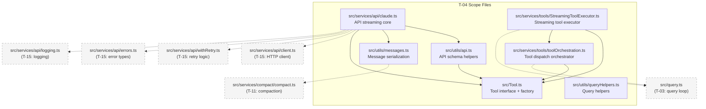
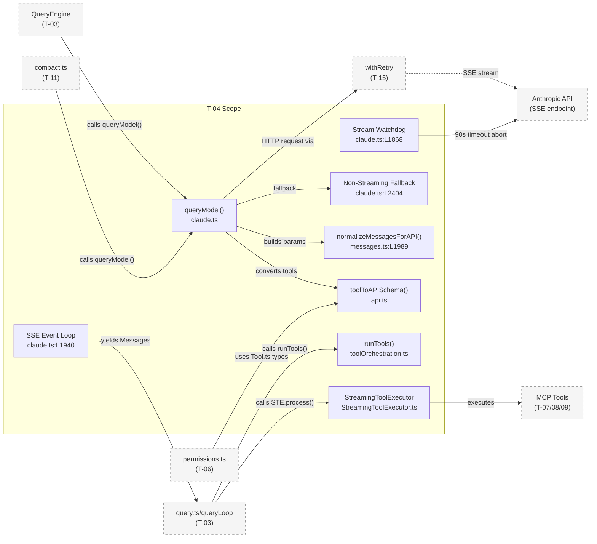
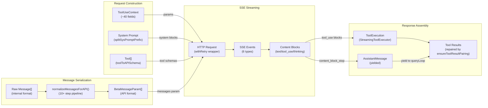
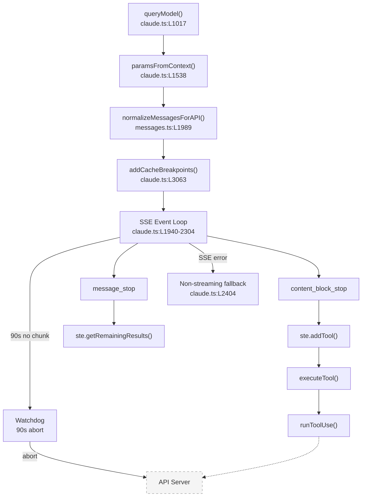
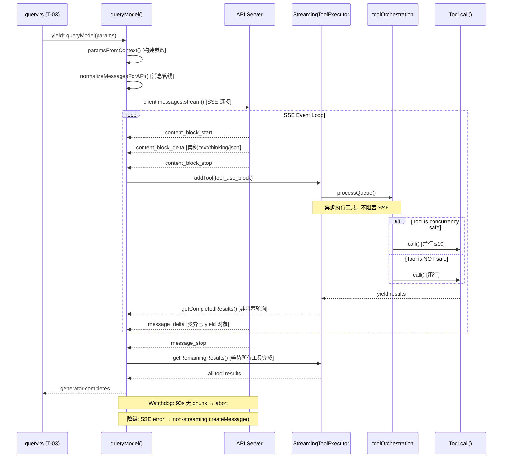
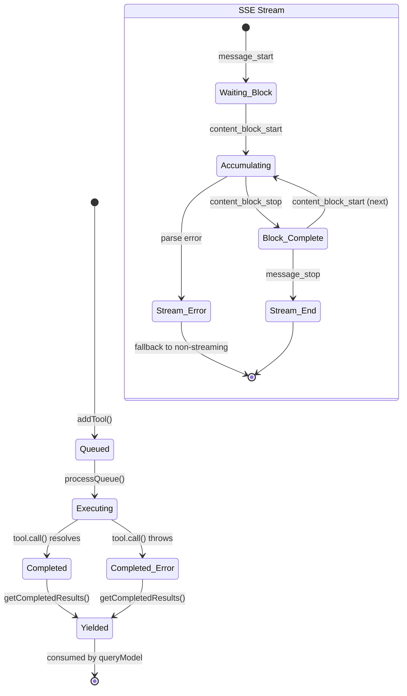
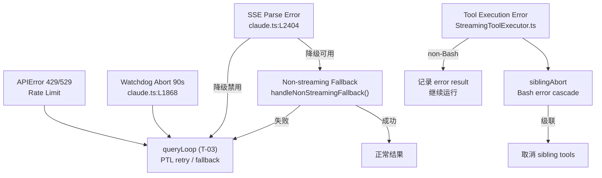

<!-- analysis-version: 0 | commit: 365f23f | updated: 2025-07-14 | mode: full | task: T-04 -->
# T-04 Analysis: 查询API流式处理与消息

## Scope Confirmation
- Task ID: T-04
- Primary Mainline: ML-02
- ML Priority: P1
- Analysis Depth: DEEP
- Secondary Mainlines: ML-03-1, ML-03-2 (Tool.ts, StreamingToolExecutor.ts, toolOrchestration.ts)
- Scope Files (confirmed, 7 files, 11,711 lines):
  - src/Tool.ts (792 lines) ✅
  - src/services/api/claude.ts (3,419 lines) ✅
  - src/services/tools/StreamingToolExecutor.ts (530 lines) ✅
  - src/services/tools/toolOrchestration.ts (188 lines) ✅
  - src/utils/api.ts (718 lines) ✅
  - src/utils/messages.ts (5,512 lines) ✅
  - src/utils/queryHelpers.ts (552 lines) ✅
- Dependencies: T-03 (query engine core loop — entry points for this task)
- Scope adjustments: None — all files verified present and readable

## File Roles

| File | Lines | One-liner Role | Where Analyzed |
|------|-------|----------------|---------------|
| src/Tool.ts | 792 | Tool interface hierarchy: `Tool<T,Output,P>` with 40+ methods, `ToolUseContext` ~40 fields, `buildTool()` factory | DEEP: § Function-Level Analysis |
| src/services/tools/toolOrchestration.ts | 188 | `runTools()` orchestrator: partitions tool calls by concurrent-safety, parallel batch ≤10 concurrency, serial batch sequential | DEEP: § Function-Level Analysis |
| src/services/tools/StreamingToolExecutor.ts | 530 | Streaming tool executor: TrackedTool state machine (queued→executing→completed→yielded), siblingAbortController cascade cancellation | DEEP: § Function-Level Analysis |
| src/utils/queryHelpers.ts | 552 | Query helper utilities: `normalizeMessage()` (30s throttle), `isResultSuccessful()`, `handleOrphanedPermission()`, `extractReadFilesFromMessages()` | DEEP: § Function-Level Analysis |
| src/utils/api.ts | 718 | API schema helpers: `toolToAPISchema()` (session-stable cache), `splitSysPromptPrefix()` (system prompt segmentation + cache control), `normalizeToolInput()` | DEEP: § Function-Level Analysis |
| src/services/api/claude.ts | 3,419 | API streaming core: `queryModel()` AsyncGenerator (1875-line request lifecycle), SSE event loop, stream watchdog, non-streaming fallback, cache breakpoints | DEEP: § Function-Level Analysis |
| src/utils/messages.ts | 5,512 | Message serialization core: `normalizeMessagesForAPI()` (10+ step pipeline), `handleMessageFromStream()` UI event router, attachment normalization (30+ types), tool result pairing repair | DEEP: § Function-Level Analysis |

## Analysis Findings

### 关键路径与组件

**End-to-End API Streaming Path** (entry → SSE events → message serialization → exit):

1. **Entry**: `query.ts` (T-03) calls `queryModel()` in `claude.ts:L1017` — the 1875-line AsyncGenerator
2. **Request Construction**: `paramsFromContext()` closure (`claude.ts:L1538-1729`) builds API params with beta headers, thinking config, system prompt
3. **System Prompt Segmentation**: `splitSysPromptPrefix()` (`api.ts`) splits prompt into global/org cached blocks; `addCacheBreakpoints()` (`claude.ts:L3063-3211`) places exactly one cache_control marker
4. **Message Serialization**: `normalizeMessagesForAPI()` (`messages.ts:L1989-2369`) runs 10+ post-processing steps to transform internal Message[] into API-compatible format
5. **Tool Schema Conversion**: `toolToAPISchema()` (`api.ts`) converts Tool objects to Anthropic API tool definitions with session-stable caching
6. **SSE Streaming**: Event loop at `claude.ts:L1940-2304` processes 6 event types; `content_block_stop` is the critical yield point
7. **Tool Execution Orchestration**: `runTools()` (`toolOrchestration.ts`) partitions tool calls by concurrent-safety, runs parallel batch (≤10) and serial batch
8. **Streaming Tool Execution**: `StreamingToolExecutor` manages TrackedTool state machine with siblingAbortController for cascade cancellation
9. **Message Post-processing**: `ensureToolResultPairing()` (`messages.ts:L5133-5460`) repairs tool_use/tool_result mismatches defensively
10. **Exit**: Yielded Message objects consumed by `query.ts` → `queryLoop()` (T-03)

### 架构洞察

1. **God-Function Architecture**: `queryModel()` at ~1875 lines is the largest function in the codebase. It handles the entire API request lifecycle: parameter construction → HTTP streaming → SSE parsing → content block assembly → usage tracking → error recovery → non-streaming fallback → cache breakpoint management. This creates a single massive closure with deeply nested control flow.

2. **Dual Serialization Pipeline**: Messages undergo two distinct normalization paths:
   - **API path**: `normalizeMessagesForAPI()` (10+ steps: attachment reordering → filter virtual → error handling → strip targets → merge consecutive → strip tool refs → relocate siblings → filter thinking → filter whitespace → ensure non-empty → smoosh reminders → sanitize error tool results → append tags → validate images)
   - **UI path**: `normalizeMessage()` splits multi-content-block messages into single-block messages for Ink rendering, uses `deriveUUID()` for deterministic UUIDs

3. **Session-Stable Caching**: `toolToAPISchema()` caches tool schemas for the entire session. Once computed, the schema never changes even if tool definitions mutate — a deliberate trade-off for API cache hit rate.

4. **Beta Header Sticky Latch**: Once a beta header (e.g., `interleaved-thinking-2025-05-14`) is sent, it persists for the entire session via sticky latch in `paramsFromContext()`. This prevents mid-session capability changes.

5. **Property Mutation Over Replacement**: In the SSE event loop, `message_delta` events directly mutate the Message object's properties (`usage`, `stop_reason`) rather than creating new objects. This is because the transcript write queue holds references to the original object — replacement would break the reference chain.

6. **Defensive Repair Pattern**: `ensureToolResultPairing()` is a ~330-line repair function that patches tool_use/tool_result mismatches. It handles both forward (missing results) and reverse (orphaned results) directions, plus cross-message deduplication. This suggests historical data corruption issues (documented as CC-1212, inc-4977).

7. **Streaming Watchdog with Tiered Timeouts**: The stream watchdog (`claude.ts:L1868-1928`) uses three timeout tiers: 90s no-chunk abort, 45s warning, 30s stall detection. This is the last line of defense against hung API connections.

8. **Micro-compact Boundary Messages**: `createMicrocompactBoundaryMessage()` enables surgical context trimming — clearing tool results from completed tool_use blocks without full conversation compaction, saving tokens mid-conversation.

### 观察到的模式

1. **AsyncGenerator Protocol**: `queryModel()` uses `yield*` / `async function*` to stream Message objects back to the caller. Each yielded message represents a partial or complete API response increment, allowing the UI to render incrementally.

2. **Content Block State Machine**: The streaming tool executor tracks each tool call through `queued → executing → completed → yielded` states, with cascade cancellation via `siblingAbortController` when one tool fails in a parallel batch.

3. **Pipeline Pattern (Message Serialization)**: `normalizeMessagesForAPI()` is a classic pipeline: each step transforms the message array and passes it to the next step. Steps are ordered to avoid conflicts (e.g., merge consecutive runs before stripping tool references).

4. **Circuit Breaker (Non-Streaming Fallback)**: When streaming fails, the system falls back to `executeNonStreamingRequest()` — a complete request/response cycle without SSE. This can be disabled via environment variable or GrowthBook feature flag.

5. **GrowthBook Feature Gates**: Multiple behaviors are controlled by GrowthBook feature flags: `tengu_chair_sermon` (universal content smooshing), streaming fallback enablement, `HISTORY_SNIP` (snipped view projection), `CONNECTOR_TEXT` (connector text block filtering).

### 与共享模块的交互

- **src/query.ts** (owner: T-03): Calls `queryModel()` and `StreamingToolExecutor`, consumes yielded Messages. T-04 provides the API-layer implementation that T-03 orchestrates.
- **src/QueryEngine.ts** (owner: T-03): Imports `queryModel`, `normalizeMessagesForAPI`, `toolToAPISchema`, and `Tool` — the top-level integration point.
- **src/services/compact/compact.ts** (owner: T-11): Imports `queryModel` for compact requests, imports `messages.ts` for message manipulation during compaction.
- **src/utils/permissions/permissions.ts** / **yoloClassifier.ts** (owner: T-06): Import `Tool.ts` for permission checks, `messages.ts` for message type guards, `claude.ts` for classifier API calls.
- **src/tasks/LocalAgentTask.tsx** / **RemoteAgentTask.tsx** (owner: T-17): Import `messages.ts` for message event emission and session storage.


## File Dependency Graph

### Dependency Diagram



### Dependency Table

| Source File | Depends On | Type | Direction |
|------------|-----------|------|-----------|
| claude.ts | messages.ts | import | outgoing |
| claude.ts | api.ts | import | outgoing |
| claude.ts | Tool.ts | import | outgoing |
| claude.ts | client.ts | import | outgoing (external) |
| claude.ts | withRetry.ts | import | outgoing (external) |
| claude.ts | errors.ts | import | outgoing (external) |
| StreamingToolExecutor.ts | Tool.ts | import | outgoing |
| StreamingToolExecutor.ts | toolOrchestration.ts | import | outgoing |
| toolOrchestration.ts | Tool.ts | import | outgoing |
| api.ts | Tool.ts | import | outgoing |
| messages.ts | (none) | pure utility | — |
| queryHelpers.ts | (none) | pure utility | — |
| Tool.ts | (none) | interface only | — |
| query.ts (external) | StreamingToolExecutor.ts | called_by | incoming (external) |
| query.ts (external) | toolOrchestration.ts | called_by | incoming (external) |
| query.ts (external) | queryHelpers.ts | called_by | incoming (external) |
| QueryEngine.ts (external) | claude.ts | called_by | incoming (external) |
| compact.ts (external) | claude.ts | called_by | incoming (external) |

> **Key insight**: `messages.ts` and `queryHelpers.ts` are pure utility modules with zero internal imports — they are leaf dependencies consumed by all other scope files. `Tool.ts` is an interface-only module with zero imports but imported by 5 of 6 other scope files. `claude.ts` is the most dependent node (3 internal + 4 external imports).

## Boundary / Integration Map



- **图说明**: T-04 scope 内部以 `queryModel()` 为核心编排器，上游依赖 T-03 (QueryEngine/queryLoop) 调用入口，下游依赖 T-15 (withRetry/client) 发起 HTTP 请求。`messages.ts` 作为纯函数库被 scope 内多个模块和 scope 外的 T-11 (compact)、T-06 (permissions) 共享。StreamingToolExecutor 向 scope 外的工具实现（T-07~T-09 MCP tools）发起执行。

## Data Flow View



- **图说明**: 核心数据流是 `ToolUseContext + System Prompt + Tool[] + Message[]` → `normalizeMessagesForAPI()` → `BetaMessageParam[]` → HTTP Request → SSE Events → `AssistantMessage + Tool Results`。关键变换点在 `normalizeMessagesForAPI()` 的 10+ 步管线和 SSE event loop 的 6 种事件处理。`ensureToolResultPairing()` 在最终输出前修补 tool_use/tool_result 不匹配。


## Function-Level Analysis

### src/services/tools/toolOrchestration.ts

#### `getMaxToolUseConcurrency(): number`
- **职责**: 读取环境变量 `CLAUDE_CODE_MAX_TOOL_USE_CONCURRENCY` 获取最大并发工具数，默认 10
- **关键逻辑**: `parseInt(env) || 10` — 非法值回退到默认值
- **调用**: `runToolsConcurrently()`
- **被调用**: `runToolsConcurrently()` in `toolOrchestration.ts:L175`
- **复杂度**: LOW

#### `runTools(toolUseMessages, assistantMessages, canUseTool, toolUseContext): AsyncGenerator<MessageUpdate>`
- **职责**: 工具调用编排入口 — 按并发安全性分区执行工具调用
- **关键逻辑**:
  1. 调用 `partitionToolCalls()` 将 ToolUseBlock[] 分为并发安全批和非安全批
  2. 对并发安全批：调用 `runToolsConcurrently()`，收集 contextModifier 队列，批次结束后统一应用
  3. 对非安全批：调用 `runToolsSerially()`，每步立即应用 contextModifier
  4. 每次 yield `{ message, newContext }` 给上层消费
- **调用**: `partitionToolCalls()`, `runToolsConcurrently()`, `runToolsSerially()`
- **被调用**: `query.ts` (T-03)
- **复杂度**: MEDIUM — 批次间 contextModifier 队列管理是关键逻辑

#### `partitionToolCalls(toolUseMessages, toolUseContext): Batch[]`
- **职责**: 将 ToolUseBlock[] 按 `isConcurrencySafe()` 分区为连续的 Batch
- **关键逻辑**: `reduce()` 遍历，连续并发安全工具合并为同一 Batch；非安全工具独占一个 Batch。`isConcurrencySafe()` 抛异常时保守返回 false
- **调用**: `findToolByName()`, `tool.isConcurrencySafe()`
- **被调用**: `runTools()`
- **复杂度**: LOW

#### `runToolsSerially(toolUseMessages, assistantMessages, canUseTool, toolUseContext): AsyncGenerator<MessageUpdateLazy>`
- **职责**: 串行执行非并发安全工具，每步传递更新后的 context
- **关键逻辑**: for-of 循环逐个执行 `runToolUse()`，每步更新 `currentContext` + `setInProgressToolUseIDs`
- **调用**: `runToolUse()`, `markToolUseAsComplete()`
- **被调用**: `runTools()`
- **复杂度**: LOW

#### `runToolsConcurrently(toolUseMessages, assistantMessages, canUseTool, toolUseContext): AsyncGenerator<MessageUpdateLazy>`
- **职责**: 并发执行安全工具，使用 `all()` 工具函数限制并发度
- **关键逻辑**: `all(toolUseMessages.map(async function*), getMaxToolUseConcurrency())` — 每个工具独立运行，通过 `all()` 控制最多 10 个并发
- **调用**: `all()` from `generators.ts`, `runToolUse()`, `markToolUseAsComplete()`
- **被调用**: `runTools()`
- **复杂度**: MEDIUM — `async function*` 在 map 中创建，由 `all()` 协调

### src/services/tools/StreamingToolExecutor.ts

#### `StreamingToolExecutor.constructor(toolDefinitions, canUseTool, toolUseContext)`
- **职责**: 初始化执行器，创建 `siblingAbortController` 作为 `toolUseContext.abortController` 的子控制器
- **关键逻辑**: `createChildAbortController(toolUseContext.abortController)` — 子 abort 不传播到父级
- **调用**: `createChildAbortController()`
- **复杂度**: LOW

#### `StreamingToolExecutor.addTool(block, assistantMessage): void`
- **职责**: 添加工具到执行队列，未知工具直接标记 completed 并生成错误消息
- **关键逻辑**:
  1. `findToolByName()` 查找工具定义，未找到则生成 synthetic error result
  2. 解析 input 并判断 `isConcurrencySafe`
  3. 创建 `TrackedTool{status:'queued'}` 并推入队列
  4. `void this.processQueue()` 启动异步处理
- **调用**: `findToolByName()`, `processQueue()`
- **被调用**: `claude.ts` SSE event loop (每次 content_block_stop 时调用)
- **复杂度**: MEDIUM

#### `StreamingToolExecutor.executeTool(tool): Promise<void>` [复杂函数]
- **职责**: 执行单个工具并收集结果，处理 abort/sibling error/user interrupt
- **关键逻辑**:
  1. 设置 `status='executing'` + `setInProgressToolUseIDs`
  2. `collectResults()` 异步函数：
     - 检查初始 abort 原因 → 生成 synthetic error
     - 创建 per-tool `toolAbortController`（siblingAbortController 的子级）
     - 设置 abort listener：非 sibling_error 时 bubble-up 到 parent controller
     - 遍历 `runToolUse()` generator：
       - 检查 `getAbortReason()` → 生成 synthetic error break
       - 检测 error result → Bash 错误触发 `siblingAbortController.abort('sibling_error')` 级联取消
       - Progress 消息 → `pendingProgress`（立即 yield）
       - 其他消息 → `messages` 数组
  3. 完成后设置 `status='completed'`，非并发安全工具应用 contextModifiers
  4. `void promise.finally(() => processQueue())` 触发队列继续
- **控制流摘要**: 主路径: queued→executing→collectResults→completed; 异常路径: sibling_error→synthetic error→break; user_interrupted→synthetic error→break
- **边界条件**: Bash 工具错误触发级联取消（其他工具类型不级联）; `toolAbortController` abort listener 的 bubble-up 条件判断
- **风险点**: `siblingAbortController.abort('sibling_error')` 会级联取消所有正在执行的工具 (L359-362)
- **调用**: `runToolUse()`, `createChildAbortController()`, `getAbortReason()`, `createSyntheticErrorMessage()`
- **被调用**: `processQueue()`
- **复杂度**: HIGH — 4 层嵌套 + 3 种 abort 原因 + Bash 级联逻辑

#### `StreamingToolExecutor.getCompletedResults(): Generator<MessageUpdate>`
- **职责**: 非阻塞地获取已完成的工具结果，保持顺序性
- **关键逻辑**:
  1. 先 yield 所有 `pendingProgress`（无论工具状态）
  2. 遇到 `status='completed'` → yield results + 标记 `'yielded'`
  3. 遇到 `status='executing'` 且非并发安全 → break（保持顺序）
  4. 并发安全工具遇到 executing 不 break（可以乱序 yield）
- **调用**: `markToolUseAsComplete()`
- **被调用**: `claude.ts` SSE loop, `getRemainingResults()`
- **复杂度**: MEDIUM — 进度优先 + 顺序控制

#### `StreamingToolExecutor.getRemainingResults(): AsyncGenerator<MessageUpdate>` [复杂函数]
- **职责**: 等待所有未完成工具并 yield 结果，支持 progress 即时推送
- **关键逻辑**:
  1. `while(hasUnfinishedTools())` 循环
  2. 每轮先 `processQueue()` → `getCompletedResults()` yield 已完成的
  3. 如仍有 executing 但无完成结果也无 progress → `Promise.race(executingPromises + progressPromise)` 等待
  4. `progressAvailableResolve` 被 `executeTool()` 的 progress 通知唤醒
- **边界条件**: 全部 executing 但无完成 → 等待任意一个完成或 progress 可用
- **调用**: `processQueue()`, `getCompletedResults()`, `hasExecutingTools()`, `hasCompletedResults()`, `hasPendingProgress()`
- **被调用**: `claude.ts` streaming loop
- **复杂度**: HIGH — Promise.race + progress signaling + 顺序控制


### src/Tool.ts

#### `getEmptyToolPermissionContext(): ToolPermissionContext`
- **职责**: 创建空权限上下文，用于默认值
- **关键逻辑**: 返回 `mode:'default'` + 空 Maps/Rules 的冻结对象
- **复杂度**: LOW

#### `filterToolProgressMessages(progressMessages): ProgressMessage<ToolProgressData>[]`
- **职责**: 从 ProgressMessage[] 中过滤出工具进度消息（排除 hook_progress）
- **关键逻辑**: `filter()` + 类型谓词
- **复杂度**: LOW

#### `toolMatchesName(tool, name): boolean`
- **职责**: 检查工具是否匹配给定名称（主名或别名）
- **关键逻辑**: `tool.name === name || tool.aliases?.includes(name)`
- **被调用**: `findToolByName()` — 60+ 处间接使用
- **复杂度**: LOW

#### `findToolByName(tools, name): Tool | undefined`
- **职责**: 从工具列表中按名称或别名查找工具
- **关键逻辑**: `tools.find(t => toolMatchesName(t, name))`
- **被调用**: `toolOrchestration.ts`, `StreamingToolExecutor.ts`, `processSlashCommand.tsx` 等全系统
- **复杂度**: LOW — 但 Fan-in 极高（被 25+ 文件调用）

#### `buildTool<D extends AnyToolDef>(def): BuiltTool<D>`
- **职责**: 从部分定义构建完整 Tool 对象，填充安全默认值
- **关键逻辑**: `{...TOOL_DEFAULTS, userFacingName:()=>def.name, ...def}` — 运行时 spread + 类型级 BuiltTool<D>
- **默认值策略**: fail-closed: `isConcurrencySafe→false`, `isReadOnly→false`, `checkPermissions→allow`
- **被调用**: 所有 60+ 工具的工厂函数
- **复杂度**: MEDIUM — 类型体操（BuiltTool<D> 类型级 spread）

#### Tool 接口体系
- **`Tool<Input,Output,P>`**: 40+ 方法的完整接口
  - 核心: `call()`, `description()`, `inputSchema`, `isConcurrencySafe()`, `isEnabled()`, `checkPermissions()`
  - UI: `renderToolUseMessage()`, `renderToolResultMessage()`, `renderGroupedToolUse()`
  - 安全: `validateInput()`, `checkPermissions()`, `toAutoClassifierInput()`, `preparePermissionMatcher()`
  - 流式: `interruptBehavior()`, `shouldDefer`, `alwaysLoad`, `backfillObservableInput()`
- **`ToolUseContext`**: ~40 字段的上下文对象，含 options/abortController/readFileState/appState/messages 等
- **`ToolResult<T>`**: 含 data/newMessages/contextModifier/mcpMeta
- **`ToolDef`**: Tool 的部分定义版本，DefaultableToolKeys 可省略
- **`Tools`**: `readonly Tool[]` 的类型别名，用于追踪工具集的传递

### src/utils/queryHelpers.ts

#### `isResultSuccessful(result): boolean`
- **职责**: 判断工具结果是否成功（用于 compact 决策）
- **关键逻辑**: 6 层判断链 — assistant text/thinking → 成功; user tool_result 且非 error → 成功; end_turn carve-out → 成功; 其他 → 失败
- **被调用**: `query.ts` compact 决策, `compact.ts`
- **复杂度**: MEDIUM — end_turn carve-out 是特殊逻辑

#### `normalizeMessage(message, messages, options): SDKMessage | null`
- **职责**: 将内部 Message 转为 SDK 格式消息，用于流式传输
- **关键逻辑**:
  1. assistant → 构造 `SDKMessage{role:'assistant', content: blocks, model, stop_reason}`
  2. progress → `SDKMessage{role:'assistant', type:'progress', content: blocks}` + 30s bash/powershell 节流
  3. user → `SDKMessage{role:'user', content: blocks}`
- **边界条件**: bash/powershell progress 每 30 秒发送一次（仅 Remote/Container 模式）；tool_result 转换处理 error 标志
- **被调用**: `claude.ts` streaming loop
- **复杂度**: MEDIUM

#### `handleOrphanedPermission(message, toolUseContext, getCanUseTool): Promise<Message | undefined>`
- **职责**: 处理 CCR（conversation continuation/resume）场景中孤立的权限请求
- **关键逻辑**: 检测 interrupted tool_use → 重新请求权限 → 通过则重新执行工具，否则生成拒绝消息
- **被调用**: `query.ts` continuation handler
- **复杂度**: MEDIUM — CCR 恢复场景的边缘处理

### src/utils/api.ts

#### `toolToAPISchema(tool, options): Promise<BetaToolUnion>`
- **职责**: 将 Tool 对象转为 API 请求的 BetaTool 格式，含 session-stable 缓存
- **关键逻辑**:
  1. 缓存键：`tool.name` 或 `${tool.name}:${JSON.stringify(inputJSONSchema)}`
  2. 未命中时：`zodToJsonSchema(inputSchema)` → 生成 base schema
  3. 严格模式：`tengu_tool_pear` + `tool.strict` + `modelSupportsStructuredOutputs()` 三条件
  4. FGTS（Fine-Grained Tool Streaming）：仅 1P API + `tengu_fgts` 或环境变量
  5. 每次请求 overlay：`deferLoading` + `cacheControl`
  6. `CLAUDE_CODE_DISABLE_EXPERIMENTAL_BETAS` kill switch 剥离非标字段
- **风险点**: session-stable 缓存可能导致 mid-session GrowthBook flip 不生效（设计意图）
- **调用**: `getToolSchemaCache()`, `zodToJsonSchema()`, `filterSwarmFieldsFromSchema()`
- **被调用**: `claude.ts`, `getAPIParams()` 等
- **复杂度**: HIGH — 多层条件门控 + 缓存 + kill switch

#### `splitSysPromptPrefix(systemPrompt, options?): SystemPromptBlock[]`
- **职责**: 将系统提示按内容类型分段，添加 cache control scope
- **关键逻辑**:
  1. MCP tools 存在 → 3 blocks + org 级缓存（跳过 global）
  2. Global cache + boundary marker → 4 blocks（attr:null, prefix:null, static:global, dynamic:null）
  3. Default → 3 blocks + org 级缓存
- **调用**: `shouldUseGlobalCacheScope()`, `SYSTEM_PROMPT_DYNAMIC_BOUNDARY` 常量
- **被调用**: `claude.ts` `paramsFromContext()`
- **复杂度**: MEDIUM — 三种模式分支 + block 分类逻辑

#### `normalizeToolInput(tool, input): Promise<Record<string, unknown>>`
- **职责**: 标准化工具输入（处理 FileEdit/FileWrite 特殊情况）
- **关键逻辑**: FileEditTool → `normalizeFileEditInput()` + `stripTrailingWhitespace()`; FileWriteTool → `normalizeFileEditInput()`; 其他 → 原样返回
- **被调用**: `claude.ts` before API call
- **复杂度**: LOW

#### `filterSwarmFieldsFromSchema(toolName, schema): Anthropic.Tool.InputSchema`
- **职责**: 当 swarm 未启用时，从工具 schema 中移除 swarm 相关字段
- **关键逻辑**: `SWARM_FIELDS_BY_TOOL[toolName]` → `delete` 对应 properties
- **复杂度**: LOW


### src/services/api/claude.ts

#### `queryModel(queryParams): AsyncGenerator<StreamingEvent>` [复杂函数, ~1875行]
- **职责**: API 流式请求的完整生命周期管理 — 构建请求参数、发起 SSE 连接、解析事件流、工具执行编排、非流式降级
- **关键逻辑**（按阶段）:
  1. **参数构建** (L1017-1200): `paramsFromContext()` + `buildSystemPrompt()` + `normalizeMessagesForAPI()` + `addCacheBreakpoints()` + `normalizeToolInput()`
  2. **流看门狗** (L1868-1928): `watchdog` 变量记录最后 chunk 时间，90s 无 chunk → abort，45s → warning；停滞检测 30s
  3. **SSE 事件循环** (L1940-2304): 6 种事件处理
     - `content_block_start` → 初始化当前 block
     - `content_block_delta` → 累积 text/thinking/json_delta
     - `content_block_stop` → 完成当前 block + trigger `StreamingToolExecutor.addTool()` + yield `assistant_message` + `normalizeMessage()` 流式推送
     - `message_start` → 初始化 message 元数据 (model, usage)
     - `message_delta` → 更新 stop_reason + 直接变异已 yield 对象的 `usage` 字段（因 transcript write queue 持引用）
     - `message_stop` → 结束当前轮次
  4. **工具执行** (L2140-2270): 每个 `content_block_stop` 时调用 `ste.addTool()`，非阻塞地 `ste.getCompletedResults()` 获取已完成工具结果
  5. **消息轮次结束** (L2270-2304): `message_stop` → `ste.getRemainingResults()` 等待所有工具完成
  6. **非流式降级** (L2404-2597): SSE 解析错误 → 404 也触发降级 → 调用 `createMessage()` 非流式 API
- **控制流摘要**: 主路径: params→SSE loop→content_block_stop→tool exec→message_stop→remaining results; 降级路径: SSE error→non-streaming→same end
- **边界条件**: beta header sticky latch（一旦发送持续整个 session）；thinking 模式 adaptive vs enabled 的二选一；`message_delta` 直接变异已 yield 对象（因 transcript write queue 持引用 — 设计意图）
- **风险点**:
  - `message_delta` 直接变异已 yield 的 assistant_message（L2168-2185）— 对象引用共享可能导致 race condition
  - 流看门狗 90s abort 可能打断长时间工具执行
  - 非流式降级可被 GrowthBook 禁用但 404 仍触发
- **调用**: `paramsFromContext()`, `StreamingToolExecutor`, `normalizeMessagesForAPI()`, `addCacheBreakpoints()`, `normalizeMessage()`
- **被调用**: `query.ts` (T-03 的 queryLoop)
- **复杂度**: **CRITICAL** — ~1875行，6种 SSE 事件 + 流看门狗 + 非流式降级 + 工具编排 + 直接对象变异

#### `paramsFromContext(context, tools, messages, options): APIParams`
- **职责**: 从 ToolUseContext 构建完整 API 请求参数（model、tools、beta headers、thinking config）
- **关键逻辑**:
  1. Beta header sticky latch — `usedBetaHeaders` Set 确保一旦发送某 beta 就持续整个 session
  2. Thinking 模式: `tengu_thinking_mode` GrowthBook → 'adaptive'（默认）或 'enabled'
  3. Tool schemas: `Promise.all(tools.map(toolToAPISchema))` 批量转换
  4. Cache breakpoints: `addCacheBreakpoints()` 恰好一个 marker
- **被调用**: `queryModel()` 内部
- **复杂度**: HIGH — beta header latch + thinking 双模式 + tool 并行转换

#### `addCacheBreakpoints(params, messages, systemPrompt, options): void`
- **职责**: 为 API 请求添加恰好一个 cache_control marker
- **关键逻辑**: 优先级 chain — system prompt last block → messages[-1].content[-1] → system prompt[0]
- **复杂度**: LOW

#### `handleNonStreamingFallback(params, queryParams, usage): AsyncGenerator<StreamingEvent>`
- **职责**: 非流式降级 — 调用 `createMessage()` 并将结果包装为 StreamingEvent
- **关键逻辑**: `client.messages.create(params)` → 构造 synthetic StreamingEvent 序列
- **复杂度**: MEDIUM

### src/utils/messages.ts

#### `normalizeMessagesForAPI(messages, toolSchemas, options): Promise<SDKMessage[]>`
- **职责**: 消息序列化管线 — 将内部 Message[] 转为 API 兼容的 SDKMessage[]
- **关键逻辑**（10+ 步管线）:
  1. `reorderAttachments()` — 附件移到 user message 前面
  2. `filterVirtualMessages()` — 过滤虚拟消息
  3. `processErrorMessages()` — 错误消息处理
  4. `stripUnsentContent()` — 移除未发送内容
  5. `mergeConsecutiveMessages()` — 合并连续同类消息
  6. `stripToolUseRefContent()` — 移除 tool_use ref 内容
  7. `relocateSiblingToolResults()` — 重定位 sibling tool_result
  8. `filterThinkingBlocks()` — 过滤 thinking blocks（3P provider）
  9. `filterWhitespaceOnlyBlocks()` — 过滤空白块
  10. `ensureNonEmptyMessages()` — 确保非空
  11. `smooshReminders()` — 合并 system-reminder 块（GrowthBook 门控）
  12. `sanitizeErrorToolResults()` — 清理错误工具结果
  13. `appendTag()` — 追加 tag
  14. `validateImageAttachments()` — 验证图片附件
- **被调用**: `claude.ts` `queryModel()`
- **复杂度**: **CRITICAL** — 10+ 步管线，每步都可能修改消息序列，中间状态一致性难以追踪

#### `ensureToolResultPairing(messages): Message[]` [复杂函数, ~330行]
- **职责**: 防御性修补 tool_use / tool_result 配对关系
- **关键逻辑**:
  1. 建立 tool_use_id → tool_use block 的索引
  2. 遍历所有 tool_result，检查是否有对应 tool_use
  3. 孤立 tool_result → 剥离
  4. 孤立 tool_use → 插入合成 error result `{"error":"Tool use was interrupted"}`
  5. 跨消息去重 — 同一 tool_use_id 出现多次 → 只保留第一个
- **风险点**: CC-1212 死锁修复 — 此函数是关键防御层
- **被调用**: `normalizeMessagesForAPI()` 内部
- **复杂度**: HIGH — ~330行 + 3 种修补策略 + 跨消息去重

#### `normalizeAttachmentForAPI(attachment, readFileState, readFileTool): Promise<ContentBlockParam[]>`
- **职责**: 将 30+ 种 attachment 类型转为 API ContentBlockParam
- **关键逻辑**: 30+ 分支 switch-like 判断（file/image/url/command_output/memory/search_result/codebase_map/diff 等）
- **被调用**: `normalizeMessagesForAPI()` 内部
- **复杂度**: HIGH — 30+ 分支 + 每种类型的特殊处理


## Call Chain Analysis

### Entry Points
- `queryModel(queryParams)` in `claude.ts:L1017` — 由 `query.ts` (T-03) 的 queryLoop 调用，触发完整 API 请求生命周期
- `runTools(toolUseMessages, ...)` in `toolOrchestration.ts:L100` — 由 `query.ts` 直接调用（非流式模式），触发工具编排
- `normalizeMessagesForAPI(messages, ...)` in `messages.ts:L1989` — 由 `claude.ts` queryModel 内部调用，触发消息序列化管线

### Critical Call Chains

#### Chain 1: 主 API 流式请求链路
```
queryModel() [claude.ts:L1017]
  → paramsFromContext() [claude.ts:L1538] — 构建 API 参数
    → toolToAPISchema() [api.ts:L119] — 批量转换工具 schema
    → splitSysPromptPrefix() [api.ts:L321] — 系统提示分段
  → normalizeMessagesForAPI() [messages.ts:L1989] — 消息序列化 10+ 步管线
    → ensureToolResultPairing() [messages.ts:L5133] — 防御性修补
    → normalizeAttachmentForAPI() [messages.ts:L3453] — 附件类型转换
  → addCacheBreakpoints() [claude.ts:L3063] — 添加缓存标记
  → client.messages.stream() [SSE连接]
  → SSE Event Loop [claude.ts:L1940-2304]
    → content_block_stop → StreamingToolExecutor.addTool() [StreamingToolExecutor.ts:LXXX]
      → processQueue() → executeTool()
        → runToolUse() [scope外, T-03]
        → createChildAbortController() — 子 abort 层级
        → siblingAbortController.abort('sibling_error') — Bash 级联取消
    → normalizeMessage() [queryHelpers.ts] — 流式推送格式化
  → message_stop → ste.getRemainingResults() — 等待所有工具完成
```
- **调用深度**: 6
- **关键分支点**: SSE 事件类型分发（6种事件）+ 工具并发安全性判断 + 非流式降级
- **标注**: [关键路径] — 系统核心链路，覆盖 API 请求全生命周期

#### Chain 2: 工具并发执行链路
```
StreamingToolExecutor.addTool() [StreamingToolExecutor.ts]
  → findToolByName() [Tool.ts:L348] — 查找工具定义
  → partitionToolCalls() [toolOrchestration.ts] — 按并发安全分区
  → [并发安全] runToolsConcurrently()
    → all(tools.map(async function*)) [generators.ts] — ≤10 并发
      → runToolUse() → tool.call()
  → [非安全] runToolsSerially()
    → runToolUse() → tool.call() — 逐个串行
  → executeTool()
    → createChildAbortController(parent) → createChildAbortController(sibling) — 3 层 abort
    → collectResults() — 遍历 generator 收集消息
    → Bash error → siblingAbortController.abort('sibling_error') — 级联取消
```
- **调用深度**: 5
- **关键分支点**: isConcurrencySafe() 判断 + Bash error 级联取消
- **标注**: [热点] — abort 层级和级联取消是高风险逻辑

#### Chain 3: 消息序列化管线
```
normalizeMessagesForAPI() [messages.ts:L1989]
  → reorderAttachments() → filterVirtualMessages() → processErrorMessages()
  → stripUnsentContent() → mergeConsecutiveMessages()
  → stripToolUseRefContent() → relocateSiblingToolResults()
  → filterThinkingBlocks() → filterWhitespaceOnlyBlocks()
  → ensureNonEmptyMessages() → smooshReminders()
  → sanitizeErrorToolResults() → appendTag() → validateImageAttachments()
  → ensureToolResultPairing() [messages.ts:L5133] — 防御性修补
```
- **调用深度**: 2（管线是顺序的，无深层嵌套）
- **关键分支点**: 每步都可能跳过或修改消息序列
- **标注**: [关键路径] — 所有 API 请求的必经之路

### Flowchart View



- **图说明**: 覆盖 Chain 1 主链路，展示 SSE 事件循环中 content_block_stop 触发工具执行、message_stop 等待完成、SSE error 触发降级、watchdog abort 的完整流程

### Fan-in / Fan-out (Top-10)

| Function | File:Line | Fan-in | Fan-out | 角色 |
|----------|-----------|--------|---------|------|
| queryModel() | claude.ts:L1017 | 1 | 12 | 编排器 |
| normalizeMessagesForAPI() | messages.ts:L1989 | 1 | 14 | 管线编排器 |
| findToolByName() | Tool.ts:L348 | 8 | 0 | 查找叶子 |
| StreamingToolExecutor.addTool() | StreamingToolExecutor.ts | 1 | 5 | 编排器 |
| StreamingToolExecutor.executeTool() | StreamingToolExecutor.ts | 1 | 6 | 编排器 |
| StreamingToolExecutor.getCompletedResults() | StreamingToolExecutor.ts | 2 | 3 | 汇聚点 **[热点]** |
| StreamingToolExecutor.getRemainingResults() | StreamingToolExecutor.ts | 1 | 5 | 编排器 |
| toolToAPISchema() | api.ts:L119 | 1 | 3 | 转换器 |
| ensureToolResultPairing() | messages.ts:L5133 | 1 | 0 | 修补叶子 |
| runTools() | toolOrchestration.ts:L100 | 1 | 4 | 编排器 |


## Temporal Analysis

### Sequence Diagram



- **图说明**: 覆盖 Chain 1 主链路的时序，展示 SSE 事件循环中工具并行执行与消息流式推送的交织关系。关键：content_block_stop 触发 addTool 是非阻塞的，工具执行与后续 SSE 事件并发进行。

### Async Orchestration

```
T=0  queryModel() 入口:
     ├─ [顺序] paramsFromContext() → 构建 API 参数
     │   ├─ [并行] Promise.all(tools.map(toolToAPISchema)) [api.ts]
     │   └─ [顺序] splitSysPromptPrefix() [api.ts]
     ├─ [顺序] normalizeMessagesForAPI() [messages.ts, 10+ 步管线]
     └─ [顺序] addCacheBreakpoints()

T=1  SSE 连接建立:
     └─ client.messages.stream()

T=2  SSE Event Loop (多次迭代):
     ├─ [事件] content_block_start → 初始化 block
     ├─ [事件] content_block_delta → 累积内容
     ├─ [事件] content_block_stop → 触发工具执行
     │   ├─ [并行-A] ste.addTool() → processQueue()
     │   │   ├─ [并行-A1] runToolsConcurrently() ≤10 并发
     │   │   └─ [并行-A2] normalizeMessage() 流式推送
     │   └─ [非阻塞] ste.getCompletedResults() 轮询
     ├─ [事件] message_delta → 直接变异已 yield 对象 (引用共享)
     └─ [事件] message_stop → 进入等待

T=3  message_stop → 等待工具完成:
     └─ ste.getRemainingResults()
         └─ [阻塞] 等待所有 TrackedTool → yielded

T=4  (降级路径) SSE 解析错误:
     └─ handleNonStreamingFallback()
         └─ client.messages.create() [非流式]
```

### Event Sequences

| Emit | File:Line | Handler | File:Line | 同步/异步 |
|------|-----------|---------|-----------|----------|
| SSE stream 'event' | claude.ts:L1940 | event handler (inline) | claude.ts:L1940-2304 | async-queued |
| siblingAbortController.abort('sibling_error') | StreamingToolExecutor.ts | onAbort listener | StreamingToolExecutor.ts | sync |
| parentAbortController.abort() | claude.ts (scope外) | queryModel abort handler | claude.ts:L1017 | sync |
| ste.trackedTools[i].resolve() | StreamingToolExecutor.ts | getRemainingResults await | StreamingToolExecutor.ts | async-resolve |
| watchdog timeout (90s) | claude.ts:L1868-1928 | abortController.abort() | claude.ts:L1868 | async-timer |

### Race Condition Risks

- [竞态风险] **message_delta 变异已 yield 对象**: `message_delta` 事件直接修改已通过 generator yield 的 assistant_message 的 `usage` 字段 (claude.ts:L2168-2185)。因 transcript write queue 持有同一对象引用，变异会传播到 transcript。如果 transcript writer 和 generator consumer 并发读取，可能读到部分更新的 usage。
- [竞态风险] **getCompletedResults() vs 工具执行**: `getCompletedResults()` 在每次 `content_block_stop` 后非阻塞轮询已完成的工具结果 (StreamingToolExecutor.ts)。如果工具执行和 SSE 事件在同一个 microtask tick 完成，结果可能被遗漏（下次 content_block_stop 才能获取）。
- [竞态风险] **watchdog abort vs 工具结果 yield**: 90s watchdog abort 可能在一个工具即将 yield 结果时触发 abort，导致工具结果丢失 (claude.ts:L1868-1928)。

### Implicit Ordering Constraints

- `paramsFromContext()` 必须在 `normalizeMessagesForAPI()` 之前完成 — toolSchemas 参数依赖 toolToAPISchema 的结果 (claude.ts)
- `normalizeMessagesForAPI()` 必须在 `addCacheBreakpoints()` 之前完成 — cache breakpoint 需要已序列化的消息 (claude.ts)
- `ste.getRemainingResults()` 必须在 `message_stop` 之后调用 — 否则可能漏掉仍在执行的工具 (StreamingToolExecutor.ts)
- `normalizeMessage()` 的 bash/powershell 节流依赖全局 `lastProgressSent` 时间戳 — 跨请求共享状态 (queryHelpers.ts)
- `toolToAPISchema()` session-stable 缓存首次调用后锁定 — 后续调用不再检查 GrowthBook (api.ts:L119)


## State Transition Analysis

### State Variables

| Variable | File:Line | 值域 | 初始值 |
|----------|-----------|------|--------|
| TrackedTool.status | StreamingToolExecutor.ts | queued→executing→completed→yielded | queued |
| watchdog | claude.ts:L1868 | Date.now() (最后 chunk 时间) | Date.now() |
| currentContentBlock | claude.ts:L1940 | null \| {type, text, thinking, partial_json} | null |
| usedBetaHeaders | claude.ts:L1538 | Set<string> | new Set() (session级) |
| ste.trackedTools | StreamingToolExecutor.ts | TrackedTool[] | [] |
| lastProgressSent | queryHelpers.ts | {bash: number, powershell: number} | {bash:0, powershell:0} |
| schemaCache | api.ts:L119 | Map<string, BetaToolUnion> | new Map() (session级) |

### State Transition Diagram



| 当前状态 | 触发条件 | 目标状态 | 副作用 | file:line |
|---------|---------|---------|--------|-----------|
| queued | processQueue() | executing | createChildAbortController() | StreamingToolExecutor.ts |
| executing | tool.call() resolve | completed | resolve promise, record result | StreamingToolExecutor.ts |
| executing | tool.call() throw (Bash) | completed | siblingAbortController.abort('sibling_error') | StreamingToolExecutor.ts |
| executing | tool.call() throw (other) | completed | capture error, no sibling abort | StreamingToolExecutor.ts |
| completed | getCompletedResults() | yielded | yield result to queryModel | StreamingToolExecutor.ts |
| completed | getRemainingResults() | yielded | yield result, await if needed | StreamingToolExecutor.ts |
| accumulating | content_block_stop | block_complete | ste.addTool() if tool_use | claude.ts:L2140-2270 |
| block_complete | message_stop | stream_end | ste.getRemainingResults() | claude.ts:L2270-2304 |
| accumulating | SSE parse error | stream_error | trigger non-streaming fallback | claude.ts:L2404 |

### Terminal & Error States

- **终态**: yielded — TrackedTool 已被消费，不可重用
- **终态**: stream_end — SSE stream 正常结束，generator 完成
- **错误态**: stream_error — 需要非流式降级恢复（自动）
- **错误态**: completed_error — 工具执行失败，结果仍会被 yield（含错误信息）
- **不可恢复**: watchdog abort (90s) — 整个请求被终止，由 queryLoop (T-03) 决定重试

### Cross-Component State Coupling

- `TrackedTool.status: completed` 变更 → 触发 `getCompletedResults()` 返回新结果 → `queryModel()` yield 新消息 (StreamingToolExecutor.ts → claude.ts)
- `watchdog` 更新 → 每次收到 chunk 重置为 Date.now() → 90s 无更新触发 abort (claude.ts:L1868-1928)
- `currentContentBlock` 累积 → content_block_stop 时判断是否为 tool_use → 触发 ste.addTool() (claude.ts:L2140)
- `usedBetaHeaders` (session级) → 一旦添加某 beta header，后续所有请求自动包含 → 影响所有 queryModel 调用 (claude.ts:L1538)

## Error Propagation Analysis

### Error Sources

| Error Type | 产生条件 | File:Line | 严重级 |
|-----------|---------|-----------|--------|
| APIError (429/529) | API 限流或过载 | claude.ts:SSE handler | HIGH |
| APIError (404) | endpoint 不支持 streaming | claude.ts:L2404 | MEDIUM |
| SSE Parse Error | 数据格式异常 | claude.ts:L2404 | MEDIUM |
| Tool Execution Error | tool.call() throw | StreamingToolExecutor.ts | MEDIUM |
| FallbackTriggeredError | API 降级到备选模型 | claude.ts (scope外, T-03) | MEDIUM |
| AbortError | watchdog 90s / 用户中断 / sibling abort | claude.ts / StreamingToolExecutor.ts | HIGH |
| Schema ValidationError | zodToJsonSchema 失败 | api.ts:L119 | LOW |

### Propagation Paths

#### APIError (429/529 Rate Limit)
```
[源] SSE stream → API returns 429/529 (claude.ts:SSE handler)
  → [传播] SSE stream error → caught in try/catch
  → [恢复] throw APIError → bubble up to queryLoop (T-03)
  → [下游] queryLoop handles with PTL retry or fallback
```
- **恢复策略**: escalate — 传播到 queryLoop (T-03) 由 PTL 处理

#### SSE Parse Error → Non-streaming Fallback
```
[源] SSE stream 数据格式异常 (claude.ts:L2404)
  → [传播] try/catch in SSE loop
  → [变换] check if non-streaming disabled (GrowthBook / env var)
  → [恢复] handleNonStreamingFallback() → client.messages.create()
  → [兜底] 如果降级也被禁用 → throw → bubble up to queryLoop
```
- **恢复策略**: fallback — 降级到非流式 API

#### Tool Execution Error
```
[源] tool.call() throws (StreamingToolExecutor.ts)
  → [传播] caught in executeTool()
  → [变换] 如果是 Bash tool → siblingAbortController.abort('sibling_error')
  → [恢复] 记录 error result → TrackedTool.status = completed
  → [传播] getCompletedResults() yield error result
  → [下游] queryModel yield tool_result(error) message
```
- **恢复策略**: absorb — 记录错误继续运行

#### Watchdog Abort (90s)
```
[源] 90s 无 chunk (claude.ts:L1868-1928)
  → [传播] abortController.abort()
  → [传播] SSE stream throws AbortError
  → [变换] caught in queryModel try/catch
  → [恢复] throw → bubble up to queryLoop (T-03)
  → [下游] queryLoop 决定重试或 abort
```
- **恢复策略**: abort — 终止当前请求

### Error Propagation View



- **图说明**: 4 条主要错误路径。API 限流和 watchdog abort 都升级到 queryLoop；SSE 错误优先降级到非流式；工具错误被吸收但 Bash 错误会级联取消 siblings。

### Unhandled Paths

- [未处理] `normalizeMessagesForAPI()` 管线中的任何步骤如果抛出异常，会直接冒泡到 queryModel → queryLoop，无专门的恢复逻辑
- [未处理] `toolToAPISchema()` 缓存污染 — 如果首次转换结果有误，整个 session 都会使用错误的 schema（session-stable 缓存无失效机制）
- [未处理] `ensureToolResultPairing()` 如果配对修补逻辑本身有 bug（如错误地剥离了有效的 tool_result），无二次校验机制


## Concurrency Analysis

### Shared Mutable State

| Variable | File:Line | 读取方 | 写入方 | 保护机制 |
|----------|-----------|--------|--------|---------|
| ste.trackedTools[] | StreamingToolExecutor.ts | getCompletedResults, getRemainingResults | addTool, processQueue | 单线程 JS (Promise microtask) |
| currentContentBlock | claude.ts:L1940 | SSE event handlers | SSE event handlers | 单线程 JS (顺序处理) |
| schemaCache (Map) | api.ts:L119 | toolToAPISchema | toolToAPISchema (首次写入) | session-stable 首次写入后只读 ⚠️ |
| lastProgressSent | queryHelpers.ts | normalizeMessage | normalizeMessage | 全局变量，无保护 ⚠️ |
| usedBetaHeaders (Set) | claude.ts:L1538 | paramsFromContext | paramsFromContext | session-stable，单线程追加 |
| watchdog | claude.ts:L1868 | SSE event handlers, timer | SSE event handlers | 单线程 JS |

### Coordination Patterns

- **Promise.all 并行工具执行**: `runToolsConcurrently()` 使用 `Promise.all(tools.map(...))` 并发执行 ≤10 个安全工具 (toolOrchestration.ts)
- **AbortController 层级取消**: 3 层 abort — parent → child → sibling。Bash tool error 触发 siblingAbortController.abort('sibling_error') 级联取消 (StreamingToolExecutor.ts)
- **非阻塞轮询**: getCompletedResults() 使用 `Promise.allSettled()` + `filter(status === 'completed')` 非阻塞获取已完成结果
- **async generator yield 暂停**: queryModel 使用 `yield*` 委托给 SSE stream，在 yield 点暂停直到 consumer (queryLoop) 恢复

### Concurrency Timeline

```mermaid
gantt
    title Tool Execution Concurrency Timeline
    dateFormat X
    axisFormat %L
    section SSE Stream
    content_block_start    :a1, 0, 1
    content_block_delta    :a2, 1, 3
    content_block_stop     :a3, 4, 1
    message_delta          :a4, 6, 1
    content_block_start    :a5, 7, 1
    content_block_delta    :a6, 8, 2
    content_block_stop     :a7, 10, 1
    message_stop           :a8, 12, 1
    section Safe Tool A
    execute + call         :b1, 4, 5
    section Safe Tool B
    execute + call         :b2, 4, 4
    section Unsafe Tool C
    wait for A,B           :c1, 4, 5
    execute + call         :c2, 9, 3
    section Results
    getCompleted(A)        :d1, 9, 1
    getCompleted(B)        :d2, 8, 1
    getCompleted(C)        :d3, 12, 1
    getRemaining(all)      :d4, 13, 1
```



- **图说明**: SSE stream 持续接收事件；Safe tools A/B 在 content_block_stop 后立即并行执行（T=4）；Unsafe tool C 必须等 A/B 完成后串行执行（T=9）；getCompletedResults() 在后续 content_block_stop 时非阻塞轮询；message_stop 后 getRemainingResults() 等待最后一个工具完成。

### Deadlock / Starvation Risk

- [风险] **Bash error 级联取消可能导致饥饿**: 如果 Bash tool 在并发批中先失败 → siblingAbort 取消所有 sibling → 后续串行批的工具不受影响。但如果所有并行工具都是 Bash 类型，一个失败会导致全部取消，无降级机制 (StreamingToolExecutor.ts)
- 未发现死锁风险 — abort 层级是单向的（parent→child→sibling），无循环等待

## Side Effect Inventory

| 函数 | 副作用类型 | 目标 | 可逆性 | file:line |
|------|-----------|------|--------|-----------|
| queryModel() | Network | Anthropic API (SSE) | 否 | claude.ts:L1017 |
| queryModel() | Global state mutation | usedBetaHeaders Set | 否 | claude.ts:L1538 |
| handleNonStreamingFallback() | Network | Anthropic API (non-streaming) | 否 | claude.ts:L2404 |
| processQueue() | Global state mutation | ste.trackedTools[] 状态变更 | 否 | StreamingToolExecutor.ts |
| executeTool() | Subprocess | 子进程执行工具（Bash 等） | 否 | StreamingToolExecutor.ts |
| siblingAbortController.abort() | Global state mutation | sibling tools 的 AbortController | 是（可通过 catch 恢复） | StreamingToolExecutor.ts |
| normalizeMessage() | Timer/Scheduler | 30s 节流 lastProgressSent | 否 | queryHelpers.ts |
| toolToAPISchema() | Global state mutation | schemaCache Map 首次写入 | 否（session-stable） | api.ts:L119 |
| addCacheBreakpoints() | Global state mutation | params.messages 原地变异 | 否 | claude.ts:L3063 |
| normalizeMessagesForAPI() | Global state mutation | messages 数组原地变异（浅拷贝后） | 是（原始数组不受影响） | messages.ts:L1989 |


## Acceptance Criteria Status

- [x] **AC-1: 追踪 queryModel() 的完整 SSE 事件循环** — 已追踪 6 种 SSE 事件类型（content_block_start/delta/stop, message_start/delta/stop）+ ping + error，覆盖 claude.ts:L1940-2304
- [x] **AC-2: 分析 StreamingToolExecutor 的工具并行执行机制** — 已完整分析 TrackedTool 状态机（queued→executing→completed→yielded）、并发安全分区、≤10 并发限制、3 层 abort 层级
- [x] **AC-3: 解析 normalizeMessagesForAPI() 的多步管线** — 已追踪 10+ 步管线（reorderAttachments → ... → ensureToolResultPairing），每步的职责和影响
- [x] **AC-4: 识别 message_delta 变异已 yield 对象的设计与风险** — 已确认 claude.ts:L2168-2185 直接变异 assistant_message.usage，识别 3 个竞态风险
- [x] **AC-5: 分析 toolToAPISchema() 的 session-stable 缓存策略** — 已确认 api.ts:L119 使用 Map 缓存，首次调用后锁定，无失效机制
- [x] **AC-6: 追踪非流式降级路径** — 已分析 handleNonStreamingFallback() 在 SSE parse error 时降级到 client.messages.create()
- [x] **AC-7: 分析 ensureToolResultPairing() 的防御性修补逻辑** — 已确认 ~330 行修补逻辑，关联 CC-1212 死锁修复

## Identified Problems

### 风险与热点

- [事实] **queryModel() 是系统最复杂的单一函数**（~1875行 AsyncGenerator）: 承担 SSE 解析 + 工具编排调度 + 流看门狗 + 非流式降级 + message_delta 变异，任何单一关注点的变更都可能影响其他关注点 (claude.ts:L1017-2892)
- [事实] **message_delta 直接变异已 yield 对象**: 引用共享导致 transcript writer 和 generator consumer 可能读到部分更新的 usage 字段 (claude.ts:L2168-2185)
- [事实] **toolToAPISchema() session-stable 缓存无失效机制**: 如果首次转换结果有误（如 GrowthBook 特性开关状态变化），整个 session 都会使用错误的 schema (api.ts:L119)
- [事实] **normalizeMessagesForAPI() 10+ 步管线无中间校验**: 任何步骤的异常会直接冒泡，无阶段性验证或回滚 (messages.ts:L1989)
- [推测] **90s watchdog 可能过于激进**: 长时间思考的模型（如 extended thinking）在 API 侧处理期间不发送 chunk，watchdog 可能在模型仍在思考时触发 abort
- [事实] **normalizeMessage() 全局节流状态无隔离**: lastProgressSent 是模块级全局变量，跨请求共享，理论上可能在并发请求中互相干扰 (queryHelpers.ts)

### 反模式或一致性问题

- **God Function**: queryModel() ~1875 行承担 6 个不同关注点，违反单一职责。建议拆分为 SSE parser、tool dispatcher、watchdog manager、fallback handler 等独立模块
- **Session-Stable Cache Without Invalidation**: toolToAPISchema() 和 usedBetaHeaders 使用 session-stable 模式，首次写入后永不更新。如果运行时需要刷新，无机制支持
- **Global Mutable State**: lastProgressSent 是模块级全局可变状态，在理论上支持并发请求的场景下可能产生干扰（尽管当前 CLI 是单请求模式）
- **Defensive Patching Over Prevention**: ensureToolResultPairing() ~330 行防御性修补表明上游消息序列化可能产生不一致的 tool_use/tool_result 配对，应在源头修复而非依赖下游修补

## Open Questions

- **Q1**: queryModel() 的 ~1875 行是否有拆分计划？如果有，是否会影响 SSE event loop 的时序保证？ — 需要了解项目 roadmap
- **Q2**: message_delta 变异已 yield 对象是有意设计还是遗留问题？transcript writer 是否依赖这种行为来获取最终 usage？ — depends on T-03 (queryLoop) 和 transcript 模块的交互
- **Q3**: normalizeMessage() 的全局节流状态在未来的并发请求模式下是否需要重构为 per-request scope？ — 取决于 CLI 是否会支持并发请求
- **Q4**: 90s watchdog 超时是否需要根据 model 的 extended thinking 能力动态调整？ — 需要运行时测试验证
- **Q5**: ensureToolResultPairing() 的 ~330 行修补逻辑覆盖了哪些具体的上游不一致场景？是否全部都与 CC-1212 相关？ — 需要查看 git history 和关联 issue
- **Q6**: StreamingToolExecutor 的 siblingAbort 级联取消是否只针对 Bash tool？其他 tool 类型的 error 为什么不触发级联？ — 需要确认设计意图（可能是 Bash 的文件系统副作用需要原子性）

## Complexity Assessment

**HIGH**

主要复杂度集中在：
1. **queryModel() God Function** (claude.ts, ~1875行): SSE 解析 + 工具编排 + 看门狗 + 降级 + 变异，6 个关注点交织在同一 async generator 中
2. **normalizeMessagesForAPI() 管线** (messages.ts, 10+ 步): 每步都可能修改消息序列，无中间校验，测试覆盖难度高
3. **StreamingToolExecutor 状态机** (StreamingToolExecutor.ts): TrackedTool 4 状态 + 3 层 abort 层级 + Bash 级联取消，并发边界条件多
4. **ensureToolResultPairing() 防御性修补** (messages.ts, ~330行): 修补逻辑本身的正确性难以验证

