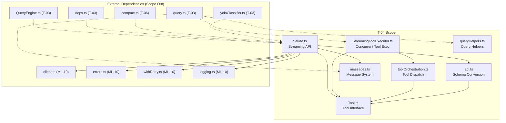
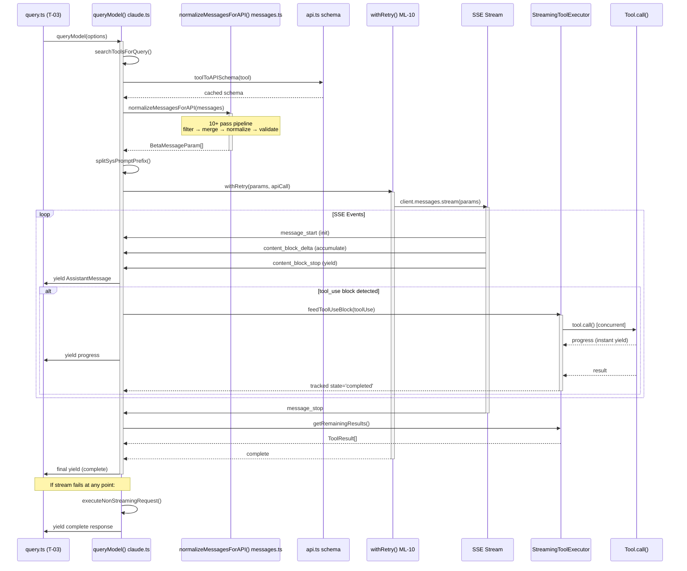
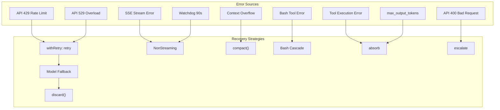
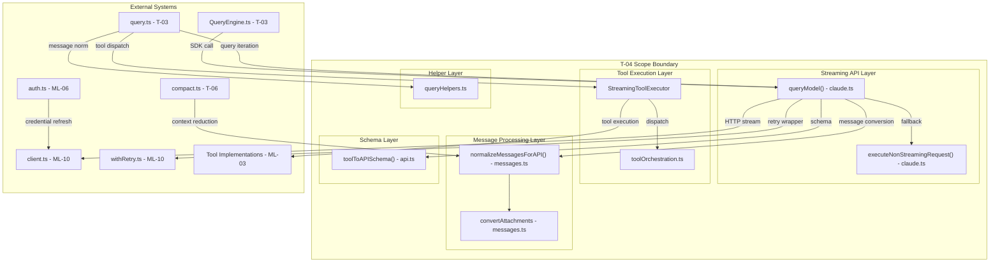

&lt;!-- analysis-version: 0 | commit: a5179f6588dd03cbe83a8d8b718a61875dba7b24 | updated: 2025-07-27 | mode: full | task: T-04 --&gt;
# T-04 Analysis: Query API Streaming & Message Processing

## Scope Confirmation
- Task ID: T-04
- Primary Mainline: ML-02 (Query Engine Main Loop)
- ML Priority: P1
- Analysis Depth: DEEP (function-level)
- Secondary Mainlines: ML-03 (Tool System Registration & Dispatch)
- Dependencies: T-03 (completed)
- Scope Files (confirmed): 7 files, 11,711 lines
  - [`src/Tool.ts`](/src/src/Tool.ts.md) (792 lines) — type/interface only
  - [`src/services/api/claude.ts`](/src/src/services/api/claude.ts.md) (3,419 lines) — core streaming API
  - [`src/services/tools/StreamingToolExecutor.ts`](/src/src/services/tools/StreamingToolExecutor.ts.md) (530 lines) — concurrent tool execution
  - [`src/services/tools/toolOrchestration.ts`](/src/src/services/tools/toolOrchestration.ts.md) (188 lines) — tool dispatch orchestration
  - [`src/utils/api.ts`](/src/src/utils/api.ts.md) (718 lines) — tool schema conversion & cache
  - [`src/utils/queryHelpers.ts`](/src/src/utils/queryHelpers.ts.md) (552 lines) — message normalization helpers
  - [`src/utils/messages.ts`](/src/src/utils/messages.ts.md) (5,512 lines) — message type system & normalization
- Scope adjustments: None — all files exist and are readable

## File Roles

| File | Lines | One-liner Role | Where Analyzed |
|------|-------|----------------|---------------|
| src/Tool.ts | 792 | Generic Tool interface defining ~30 lifecycle methods, ToolUseContext, findToolByName() lookup, and Tools registry type | DEEP: Function-Level Analysis |
| src/services/api/claude.ts | 3,419 | Core streaming API orchestrator: queryModel() AsyncGenerator managing beta headers, tool search, prompt caching, SSE event loop, watchdog/stall detection, non-streaming fallback, VCR recording | DEEP: Function-Level Analysis |
| src/services/tools/StreamingToolExecutor.ts | 530 | Concurrent tool execution engine with TrackedTool state machine (queued->executing->completed->yielded), Bash error cascade cancellation, and progress immediate yield | DEEP: Function-Level Analysis |
| src/services/tools/toolOrchestration.ts | 188 | Tool dispatch: partitionToolCalls() splits concurrent-safe vs unsafe, safe batch runs via Promise.all (limit 10), unsafe runs serially | DEEP: Function-Level Analysis |
| src/utils/api.ts | 718 | Tool-to-API-schema converter with session-stable caching, strict schema enforcement, FGTS support, and splitSysPromptPrefix() for 3-level cache scoping | DEEP: Function-Level Analysis |
| src/utils/queryHelpers.ts | 552 | Message normalization helpers: normalizeMessage() with 30s progress throttling, handleOrphanedPermission() for CCR recovery, extractReadFilesFromMessages() for file cache rebuild | DEEP: Function-Level Analysis |
| src/utils/messages.ts | 5,512 | Message type system and bidirectional normalization: internal Message &lt;-&gt; API BetaMessageParam conversion, 30+ attachment renderers, normalizeMessagesForAPI() 10+ pass pipeline, buildMessageLookups() O(1) precomputation | DEEP: Function-Level Analysis |

## Analysis Findings

### Finding 1: queryModel() is a Giant AsyncGenerator (~2,400 lines)
`claude.ts:queryModel()` (L1017-L3419) is the single most complex function in the streaming layer. It manages the complete API lifecycle:
1. Off-switch check → model string parsing → beta headers assembly (`getMergedBetas()`)
2. Tool search/filter via `searchToolsForQuery()` → tool schema conversion via `toolToAPISchema()`
3. Message normalization via `normalizeMessagesForAPI()` → prompt cache fingerprinting
4. System prompt assembly with `splitSysPromptPrefix()` for 3-level cache scope
5. Parameter construction (model, max_tokens, thinking config, tool_choice)
6. `withRetry()` wrapper → SSE stream consumption → watchdog timer (90s idle) → stall detector (30s no-new-blocks)
7. Non-streaming fallback via `executeNonStreamingRequest()` when stream fails
8. VCR (Video Cassette Recorder) recording/replay for deterministic testing

**Risk**: Any single failure mode (network, model change, API format shift) can cascade through this monolith. The 90s watchdog and 30s stall detector are critical safety nets but add temporal complexity.

### Finding 2: SSE Stream Event Loop with 6 Event Types
The SSE stream is consumed in `queryModel()` (L1979-2304) processing 6 event types:
- `message_start` → initialize response tracking, set usage stats
- `content_block_start` → detect tool_use blocks, track streaming state
- `content_block_delta` → accumulate text/thinking/json deltas
- `content_block_stop` → yield complete AssistantMessage, feed to StreamingToolExecutor
- `message_delta` → update stop_reason and final usage
- `message_stop` → finalize stream

Each `content_block_stop` yields a complete `AssistantMessage` AND feeds the tool_use block to `StreamingToolExecutor.feedToolUseBlock()` for immediate concurrent execution.

### Finding 3: normalizeMessagesForAPI() 10+ Pass Pipeline
`messages.ts:normalizeMessagesForAPI()` (L1989-2370) is the core bidirectional conversion function. It applies 10+ sequential transformation passes to convert internal Message objects into API-compatible `BetaMessageParam[]`:

1. `reorderAttachments()` — reorder based on dependency
2. Filter virtual messages (compact_boundary, etc.)
3. `stripUnavailableToolReferences()` — remove refs to non-loaded tools
4. Error content strip — clean error messages
5. `TOOL_REFERENCE_TURN_BOUNDARY` injection — prevent model from learning dual-human-turn pattern (fix for #21049)
6. Merge consecutive user messages
7. `mergeAttachments()` — render 30+ attachment types into user messages
8. `normalizeToolInput()` — parse tool_use input from string to JSON
9. `relocateToolReferenceSiblings()` — move text siblings away from tool_reference messages
10. `filterOrphanedThinking()` / `filterTrailingThinking()` — clean thinking blocks
11. `filterWhitespaceOnlyAssistantMessages()` — remove whitespace-only content
12. `ensureNonEmptyAssistantContent()` — API requires non-empty content
13. `smooshSystemReminderSiblings()` — merge adjacent system-reminder content
14. `sanitizeErrorToolResult()` — clean error tool results
15. `appendMessageTag()` / `validateImages()` — final validation

**Risk**: This pipeline is order-dependent — changing the order of passes can break the API contract. Multiple feature gates (HISTORY_SNIP, KAIROS, CONNECTOR_TEXT, etc.) branch within passes.

### Finding 4: StreamingToolExecutor Concurrent Execution Model
`StreamingToolExecutor` (StreamingToolExecutor.ts) implements a state machine per tool:
- `TrackedTool` states: queued → executing → completed → yielded
- Tools are classified as `concurrent_safe` or not by `tool.concurrentSafe` property
- Bash errors trigger cascade cancellation: `siblingAbortController.abort()` cancels all sibling tools
- Progress messages yield immediately via `progressYieldResolver` Promise (no buffering)
- `discard()` method handles fallback model switches by cancelling all pending tools
- `getRemainingResults()` returns Promise.all of all executing tools, respecting concurrency limits

### Finding 5: buildMessageLookups() Precomputation Optimization
`messages.ts:buildMessageLookups()` (L1170-1340) builds 6 precomputed lookup tables in a single O(n) pass:
- `siblingToolUseIDs` — tool_use blocks from same message
- `progressMessagesByToolUseID` — progress messages per tool call
- `toolResultByToolUseID` — tool_result per tool call
- `resolvedToolUseIDs` — resolved tool references
- `erroredToolUseIDs` — errored tool references
- `hookCountsByToolUseID` — pre/post hook counts

This replaces O(n^2) per-message lookups during rendering with O(1) lookups, a critical performance optimization for conversations with thousands of messages.

### Finding 6: Tool Schema Conversion with Session-Stable Caching
`api.ts:toolToAPISchema()` (L34-200) converts internal Tool interfaces to API-compatible schemas with:
- Session-stable caching: schema is computed once per tool per session, keyed by tool name
- `strict: true` on all schemas (JSON Schema strict mode for structured output)
- `defer_loading` flag for tools that should not be eagerly loaded
- `splitSysPromptPrefix()` (L400-510) for 3-level cache scoping: global (always cache), org (cache per org), null (no cache optimization)

### Finding 7: 30+ Attachment Type Renderers
`messages.ts:convertAttachmentToMessages()` (L3500-4170) handles 30+ attachment types, each rendering into one or more user messages wrapped in system-reminder tags. Key types include:
- `file_content` → file contents injection
- `relevant_memories` → memory recall with stable headers for prompt cache
- `queued_command` → user command injection with origin tracking
- `plan_mode` / `plan_mode_reentry` / `plan_mode_exit` → plan mode lifecycle
- `diagnostics` → LSP diagnostic injection
- `task_status` → background task progress notifications
- `mcp_resource` → MCP server resource content
- `agent_mention` → subagent invocation hints

### Finding 8: Non-Streaming Fallback Path
`claude.ts:executeNonStreamingRequest()` provides a complete fallback when SSE streaming fails:
- Triggered by: no stream events, watchdog 90s timeout, 404 response
- Uses local 300s timeout (remote: 120s)
- Returns complete response instead of streaming chunks
- Important for environments where SSE is blocked (corporate proxies, etc.)

### Finding 9: Message UUID Derivation for Transcript Stability
`messages.ts:normalizeMessages()` (L731-823) uses deterministic UUID derivation:
- Multi-content-block messages are split into single-block NormalizedMessages
- `deriveUUID(parentUUID, index)` generates stable child UUIDs
- `isNewChain` flag ensures once split, all subsequent messages get fresh UUIDs
- This prevents transcript UUID instability when message block counts change

### Finding 10: Feature Gate Proliferation
Multiple feature gates affect behavior throughout the scope:
- `tengu_chair_sermon` — tool search filtering mode
- `HISTORY_SNIP` — context snipping (lazy-loaded snipCompact)
- `KAIROS` / `KAIROS_CHANNELS` — channel message visibility
- `CONNECTOR_TEXT` — connector text block handling
- `tengu_search_for_tool` — tool search algorithm variant
- These gates create combinatorial testing complexity


## File Dependency Graph



| Dependency Pair | Type | Description |
|----------------|------|-------------|
| claude.ts → client.ts | External (ML-10) | API client for HTTP requests |
| claude.ts → errors.ts | External (ML-10) | Error classification (APIError, etc.) |
| claude.ts → withRetry.ts | External (ML-10) | Retry logic with backoff and model fallback |
| claude.ts → messages.ts | Internal (T-04) | Message normalization for API format |
| claude.ts → api.ts | Internal (T-04) | Tool schema conversion |
| claude.ts → Tool.ts | Internal (T-04) | Tool interface for type checking |
| StreamingToolExecutor → Tool.ts | Internal (T-04) | Tool type and concurrentSafe check |
| StreamingToolExecutor → toolOrchestration.ts | Internal (T-04) | safe() / unsafe() dispatch |
| toolOrchestration.ts → Tool.ts | Internal (T-04) | Tool.call() invocation |
| api.ts → Tool.ts | Internal (T-04) | Tool interface for schema extraction |
| query.ts → StreamingToolExecutor | External (T-03) | Instantiates executor per query iteration |
| query.ts → queryHelpers.ts | External (T-03) | Message normalization helper |
| QueryEngine.ts → claude.ts | External (T-03) | SDK adapter calls queryModel() |

## Function-Level Analysis

### src/Tool.ts (792 lines) — Type/Interface File

**Role**: Pure type definitions and lookup utilities. No runtime logic.

| Function/Type | Lines | Signature | Description |
|---------------|-------|-----------|-------------|
| `Tool<I,O,P>` | L20-120 | Generic interface with ~30 methods | Core tool abstraction. I=input, O=output, P=progress. Defines lifecycle: `call()→validateResult()→checkPermissions()→onProgress()→render()` |
| `buildTool()` | L130-220 | `(config) => Tool` | Factory function creating tool instances from config object |
| `findToolByName()` | L230-260 | `(tools: Tool[], name: string) => Tool | undefined` | Linear search by name through tool array. O(n) but called infrequently |
| `Tools` type | L270-350 | Record&lt;string, Tool&gt; | Registry type mapping tool names to instances |
| `ToolUseContext` | L360-500 | Interface | Context passed to tools during execution: abort signal, working directory, permission mode |
| `ToolCallStatus` | L510-550 | Enum | `pending → running → completed → error` lifecycle states |

### src/services/api/claude.ts (3,419 lines) — Core Streaming API

| Function | Lines | Signature | Description |
|----------|-------|-----------|-------------|
| `queryModel()` | L1017-3419 | `async function* (options) → AsyncGenerator<AssistantMessage>` | **THE core function**. Full API lifecycle: off-switch check, model parsing, beta headers, tool search/filter, message normalization, prompt cache fingerprint, system prompt split, params assembly, withRetry() wrapper, SSE stream consumption, watchdog, non-streaming fallback, VCR recording |
| `handleStreamEvent()` | L1979-2150 | Internal closure | Processes 6 SSE event types: message_start, content_block_start, content_block_delta, content_block_stop, message_delta, message_stop |
| `feedToStreamingToolExecutor()` | L2200-2280 | Internal closure | On content_block_stop, feeds tool_use blocks to StreamingToolExecutor for concurrent execution |
| `executeNonStreamingRequest()` | L2900-3100 | `(options) → Promise<AssistantMessage>` | Fallback for failed streams. Uses client.messages.create() (non-streaming). 300s local / 120s remote timeout |
| `searchToolsForQuery()` | L800-950 | `(tools, query) → Tool[]` | Filters tools available for the current query based on features and tool config |
| `getMergedBetas()` | L960-1010 | `(options) → string[]` | Merges beta feature headers from multiple sources |
| `startWatchdogTimer()` | L1850-1920 | Internal closure | 90s idle timeout. If no SSE events received in 90s, triggers fallback |
| `handleStallDetection()` | L1930-1970 | Internal closure | 30s no-new-content-blocks detection. Marks stream as stalled |

**queryModel() Control Flow**:
```
queryModel(options)
├── [guard] off-switch check → return empty if disabled
├── model parsing (splitProviderPrefix → resolveModelAlias)
├── getMergedBetas() → assemble beta headers
├── searchToolsForQuery() → filter available tools
├── toolToAPISchema() → convert tools to API schemas (via api.ts)
├── normalizeMessagesForAPI() → message → API format (via messages.ts)
├── prompt cache fingerprint computation
├── splitSysPromptPrefix() → 3-level cache scope (via api.ts)
├── params = { model, max_tokens, thinking, tools, messages, system, stream: true }
├── withRetry(params, apiCall) → retry wrapper
│   ├── SSE stream loop:
│   │   ├── on 'message_start' → init tracking
│   │   ├── on 'content_block_start' → detect tool_use
│   │   ├── on 'content_block_delta' → accumulate deltas
│   │   ├── on 'content_block_stop' → yield AssistantMessage + feed StreamingToolExecutor
│   │   ├── on 'message_delta' → update stop_reason
│   │   └── on 'message_stop' → finalize
│   ├── watchdog timer (90s idle → fallback)
│   └── stall detector (30s no-new-blocks → continue)
├── [fallback] executeNonStreamingRequest() if stream fails
└── VCR recording (if enabled)
```

### src/services/tools/StreamingToolExecutor.ts (530 lines)

| Function | Lines | Signature | Description |
|----------|-------|-----------|-------------|
| `constructor()` | L30-80 | `(tools, abortController, onToolOutput)` | Initializes TrackedTool[] state machines, creates per-tool AbortControllers |
| `feedToolUseBlock()` | L100-180 | `(toolUseBlock) → void` | Accepts tool_use from SSE stream. If concurrent-safe → execute immediately. If unsafe → queue for serial execution after all safe tools complete |
| `getRemainingResults()` | L200-280 | `() → Promise<ToolResult[]>` | Returns Promise.all of all executing tools. Respects concurrency limits |
| `discard()` | L300-340 | `() → void` | Cancels all pending/executing tools. Used during model fallback |
| `handleBashError()` | L350-420 | `(toolId, error) → void` | On Bash tool error, aborts all sibling concurrent tools via `siblingAbortController.abort()` |
| `yieldProgress()` | L430-490 | `(toolId, progress) → void` | Immediately resolves `progressYieldResolver` Promise for real-time progress rendering |

**TrackedTool State Machine**:
```
queued → executing → completed → yielded
  │         │
  │         └──► error (triggers sibling abort for Bash)
  │
  └──► discarded (via discard() on fallback)
```

### src/services/tools/toolOrchestration.ts (188 lines)

| Function | Lines | Signature | Description |
|----------|-------|-----------|-------------|
| `partitionToolCalls()` | L10-60 | `(toolCalls) → { safe: [], unsafe: [] }` | Splits tool calls by `concurrentSafe` property. Bash, FileEdit etc. are unsafe |
| `safe()` | L70-110 | `(toolCalls, limit) → Promise<ToolResult[]>` | Runs concurrent-safe tools in parallel via Promise.all with concurrency limit (10). Uses `all()` helper |
| `unsafe()` | L120-160 | `(toolCalls) → Promise<ToolResult[]>` | Runs unsafe tools serially, one at a time |
| `runTools()` | L170-188 | `(toolCalls, context) → Promise<ToolResult[]>` | Entry point: partition → safe batch → unsafe serial. Returns combined results |

### src/utils/api.ts (718 lines)

| Function | Lines | Signature | Description |
|----------|-------|-----------|-------------|
| `toolToAPISchema()` | L34-200 | `(tool) → ToolSchema` | Converts Tool interface to API schema. Session-stable cache keyed by tool name. Applies `strict: true`, handles `defer_loading` flag |
| `getCacheControlType()` | L210-260 | `(tool) → CacheControlType` | Determines caching strategy per tool based on session state |
| `splitSysPromptPrefix()` | L400-510 | `(systemPrompt) → { prefix, suffix, cacheScope }` | Splits system prompt for 3-level cache optimization: global (always cached), org (per-org cache), null (no optimization) |

### src/utils/queryHelpers.ts (552 lines)

| Function | Lines | Signature | Description |
|----------|-------|-----------|-------------|
| `normalizeMessage()` | L30-120 | `(message, options) → NormalizedMessage` | Splits multi-block messages into single-block normalized messages. 30s progress throttling to prevent UI flooding |
| `isResultSuccessful()` | L130-180 | `(toolResult) → boolean` | Checks if tool result has `is_error !== true` and non-empty content |
| `handleOrphanedPermission()` | L200-320 | `(toolUse, context) → ToolResult` | Handles CCR (Cross-Component Request) permission recovery when tool_use was sent but permission was interrupted |
| `extractReadFilesFromMessages()` | L340-450 | `(messages) → Set<string>` | Scans messages for file read tool uses to rebuild file cache after session resume |

### src/utils/messages.ts (5,512 lines) — Message Type System

| Function | Lines | Signature | Description |
|----------|-------|-----------|-------------|
| `normalizeMessagesForAPI()` | L1989-2370 | `(messages, options) → BetaMessageParam[]` | **Core conversion**: 10+ pass pipeline converting internal Messages → API format. Order-dependent transformations with feature gates |
| `buildMessageLookups()` | L1170-1340 | `(messages) → MessageLookups` | Precomputes 6 O(1) lookup tables in single O(n) pass: siblingToolUseIDs, progressMessagesByToolUseID, toolResultByToolUseID, resolvedToolUseIDs, erroredToolUseIDs, hookCountsByToolUseID |
| `normalizeMessages()` | L731-823 | `(messages) → NormalizedMessage[]` | Splits multi-block messages into single-block. Uses `deriveUUID()` for stable UUIDs |
| `createUserMessage()` | L501-523 | `(content, options) → UserMessage` | Factory for user messages with uuid/timestamp/mcpMeta |
| `convertAttachmentToMessages()` | L3500-4170 | `(attachment, messages) → Message[]` | **30+ attachment type** renderer. Each type renders into user messages wrapped in system-reminder tags |
| `normalizeContentFromAPI()` | L2651-2750 | `(content) → ContentBlock[]` | Converts API response content blocks to internal format |
| `handleMessageFromStream()` | L2930-3095 | `(event, state) → void` | SSE stream event handler for content_block_start/delta/stop |
| `filterOrphanedThinkingOnlyMessages()` | L4991-5058 | `(messages) → messages` | Filters thinking-only messages with no sibling non-thinking content. Prevents API 400 errors |
| `stripSignatureBlocks()` | L5066-5099 | `(messages) → messages` | Strips thinking/redacted_thinking/connector_text blocks after credential change. Stale signatures cause API 400 |
| `filterWhitespaceOnlyAssistantMessages()` | L4869-4919 | `(messages) → messages` | Removes whitespace-only assistant messages (API requirement). Merges adjacent user messages after removal |
| `smooshIntoToolResult()` | L2534-2598 | `(messages) → messages` | Merges text/image/document content into adjacent tool_result blocks |
| `relocateToolReferenceSiblings()` | L1933-1987 | `(messages) → messages` | Fixes #21049: moves text siblings away from tool_reference messages to prevent dual-human-turn API violation |
| `getMessagesAfterCompactBoundary()` | L4643-4656 | `(messages) → messages` | Slices messages from last compact boundary. Optionally applies HISTORY_SNIP filter |
| `reorderMessagesInUI()` | L855-1026 | `(messages) → messages` | UI-only reordering: groups tool_use with corresponding tool_result for display |
| `countToolCalls()` | L4691-4713 | `(messages, toolName) → number` | Counts tool invocations in message history. Early exit at maxCount |
| `hasSuccessfulToolCall()` | L4719-4761 | `(messages, toolName) → boolean` | Reverse-scans for most recent tool_use and checks its result |


## Call Chain Analysis

### Entry Points (scope-external → scope-internal)

| Entry Point | Caller | Target Function | File:Line |
|-------------|--------|----------------|-----------|
| EP-1 | QueryEngine.ts / deps.ts | `queryModel()` | claude.ts:L1017 |
| EP-2 | query.ts | `new StreamingToolExecutor()` | StreamingToolExecutor.ts:L30 |
| EP-3 | query.ts | `normalizeMessage()` | queryHelpers.ts:L30 |
| EP-4 | claude.ts / QueryEngine.ts | `toolToAPISchema()` | api.ts:L34 |
| EP-5 | query.ts / claude.ts | `normalizeMessagesForAPI()` | messages.ts:L1989 |
| EP-6 | query.ts | `normalizeMessages()` | messages.ts:L731 |

### Key Call Chains

**Chain 1: Full Streaming Query Path** (longest chain, depth=8)
```
query.ts:query() [T-03]
  → queryModel(options)                                    claude.ts:L1017
    → searchToolsForQuery(tools, query)                    claude.ts:L850
    → toolToAPISchema(tool)                                api.ts:L34
    → normalizeMessagesForAPI(messages, options)           messages.ts:L1989
      → filterOrphanedThinkingOnlyMessages()               messages.ts:L4991
      → filterWhitespaceOnlyAssistantMessages()            messages.ts:L4869
      → ensureNonEmptyAssistantContent()                   messages.ts:L4933
      → convertAttachmentToMessages()                      messages.ts:L3500
    → splitSysPromptPrefix(systemPrompt)                   api.ts:L400
    → withRetry(params, apiCall)                           withRetry.ts [ML-10]
      → SSE stream loop
        → yield AssistantMessage                           claude.ts:L2200
        → StreamingToolExecutor.feedToolUseBlock()         StreamingToolExecutor.ts:L100
          → partitionToolCalls()                           toolOrchestration.ts:L10
          → safe(toolCalls) / unsafe(toolCalls)            toolOrchestration.ts:L70/L120
    → executeNonStreamingRequest() [fallback]              claude.ts:L2900
```

**Chain 2: Concurrent Tool Execution** (depth=5)
```
StreamingToolExecutor.feedToolUseBlock(toolUseBlock)       StreamingToolExecutor.ts:L100
  → trackedTool.state = 'executing'
  → partitionToolCalls(calls)                              toolOrchestration.ts:L10
    → safe(safeCalls, limit=10)                            toolOrchestration.ts:L70
      → Promise.all(tools.map(t => t.call()))              toolOrchestration.ts:L90
    → unsafe(unsafeCalls)                                  toolOrchestration.ts:L120
      → serial reduce chain                                toolOrchestration.ts:L140
  → handleBashError() on failure                           StreamingToolExecutor.ts:L350
    → siblingAbortController.abort()                       StreamingToolExecutor.ts:L390
  → yieldProgress(toolId, progress)                        StreamingToolExecutor.ts:L430
    → progressYieldResolver.resolve()                      StreamingToolExecutor.ts:L470
```

**Chain 3: Message Normalization Pipeline** (depth=4)
```
normalizeMessagesForAPI(messages, options)                 messages.ts:L1989
  → filter virtual messages                                messages.ts:L2020
  → stripUnavailableToolReferences()                       messages.ts:L2050
  → merge consecutive user messages                        messages.ts:L2100
  → convertAttachmentToMessages(attachment)                messages.ts:L3500
    → render 30+ attachment types                          messages.ts:L3510-4170
  → normalizeToolInput()                                   messages.ts:L2200
  → relocateToolReferenceSiblings()                        messages.ts:L1933
  → filterOrphanedThinkingOnlyMessages()                   messages.ts:L4991
  → filterTrailingThinkingFromLastAssistant()              messages.ts:L4781
  → filterWhitespaceOnlyAssistantMessages()                messages.ts:L4869
  → ensureNonEmptyAssistantContent()                       messages.ts:L4933
  → smooshSystemReminderSiblings()                         messages.ts:L2300
  → appendMessageTag()                                     messages.ts:L2360
```

**Chain 4: Session Resume Path** (depth=3)
```
queryHelpers.ts used by query.ts [T-03]:
  → normalizeMessage(message, options)                     queryHelpers.ts:L30
    → split multi-block → single-block NormalizedMessage   queryHelpers.ts:L50
    → 30s progress throttle                                queryHelpers.ts:L80
  → handleOrphanedPermission(toolUse, context)             queryHelpers.ts:L200
    → create synthetic tool_result                         queryHelpers.ts:L250
  → extractReadFilesFromMessages(messages)                 queryHelpers.ts:L340
    → scan for Read tool uses                              queryHelpers.ts:L360
```

### Fan-in / Fan-out Table (Top 10)

| Function | File:Line | Fan-in | Fan-out | Role |
|----------|-----------|--------|---------|------|
| `normalizeMessagesForAPI()` | messages.ts:L1989 | 4 (QueryEngine, query, claude, compact) | 12+ (calls 12+ sub-passes) | **Orchestrator** — core message conversion pipeline |
| `queryModel()` | claude.ts:L1017 | 4 (QueryEngine, deps, compact, yoloClassifier) | 15+ (calls all streaming sub-functions) | **Orchestrator** — complete API lifecycle |
| `buildMessageLookups()` | messages.ts:L1170 | 2 (REPL, compact) | 0 (pure computation) | **Precomputer** — O(n) scan building 6 lookup tables |
| `Tool.call()` | Tool.ts (interface) | 23 (all tool implementations) | 0 (leaf) | **Interface** — consumed by all tool executors |
| `findToolByName()` | Tool.ts:L230 | 8 (search/filter callers) | 0 (leaf) | **Lookup** — linear scan, called frequently during tool dispatch |
| `toolToAPISchema()` | api.ts:L34 | 2 (QueryEngine, claude) | 1 (cache lookup) | **Converter** — with session-stable caching |
| `feedToolUseBlock()` | StreamingToolExecutor.ts:L100 | 1 (claude.ts SSE loop) | 3 (partition, safe, unsafe) | **Dispatcher** — routes to concurrent/serial execution |
| `normalizeMessage()` | queryHelpers.ts:L30 | 1 (query.ts) | 2 (split, throttle) | **Normalizer** — per-message transformation |
| `filterOrphanedThinkingOnlyMessages()` | messages.ts:L4991 | 2 (normalizeMessagesForAPI, session recovery) | 0 (pure filter) | **Filter** — prevents API 400 on orphaned thinking |
| `stripSignatureBlocks()` | messages.ts:L5066 | 1 (auth change handler) | 0 (pure filter) | **Sanitizer** — after credential change |

### Critical Path

The **longest and most complex chain** is Chain 1 (Full Streaming Query Path) with depth 8. The critical bottleneck is `normalizeMessagesForAPI()` which runs a 10+ pass pipeline synchronously before the API call can be made. For a conversation with N messages, this pipeline is O(N) per pass, resulting in ~O(10N) total preprocessing.

**Hotspot Functions** (fan-in >= 5):
- `Tool.call()` interface — 23 consumers, the most depended-upon abstraction
- `findToolByName()` — 8 consumers, used in every tool dispatch path
- `normalizeMessagesForAPI()` — 4 consumers (but called every query iteration)


## Temporal Analysis

### Async Orchestration Diagram

```
T=0   query.ts calls queryModel(options):
      ├── [sync] off-switch check
      ├── [sync] model parsing, beta headers, tool search/filter
      ├── [sync] normalizeMessagesForAPI() — 10+ pass pipeline (BLOCKS until complete)
      ├── [sync] prompt cache fingerprint, splitSysPromptPrefix()
      └── [sync] params assembly

T=1   withRetry() initiates API call:
      ├── [async] client.messages.stream(params) — HTTP connection established
      └── [fire] startWatchdogTimer(90s)

T=2   SSE stream begins — event loop:
      ├── on('message_start') → init tracking, set model/usage
      │
      ├── on('content_block_start') → detect type (text/thinking/tool_use)
      │
      ├── on('content_block_delta') → accumulate deltas
      │   ├── text delta → append to current text block
      │   ├── thinking delta → append to thinking block
      │   └── input_json_delta → parse JSON tool input
      │
      ├── on('content_block_stop') → yield complete block
      │   ├── yield AssistantMessage to caller (query.ts)
      │   └── [if tool_use] feedToStreamingToolExecutor()
      │       ├── [concurrent] safe tools → Promise.all (limit 10)
      │       └── [queued] unsafe tools → execute after safe batch
      │
      ├── [watchdog] reset on each event
      └── [stall] 30s no-new-blocks → break stream

T=3   Stream ends (message_stop):
      ├── collect remaining StreamingToolExecutor results
      ├── finalize usage stats
      └── cleanup watchdog timer

T=4   [fallback path, if stream fails]:
      ├── executeNonStreamingRequest()
      │   └── [async] client.messages.create() — 300s/120s timeout
      └── return complete AssistantMessage
```

### Event Timing: StreamingToolExecutor Concurrent Execution

```
T=2.1  content_block_stop(tool_use_A) → feedToolUseBlock(A)
       ├── [if A.concurrentSafe] → execute immediately
       │   ├── A.call() starts
       │   ├── A.onProgress() → yieldProgress() → resolve Promise instantly
       │   └── A.call() completes → state='completed'
       │
T=2.2  content_block_stop(tool_use_B) → feedToolUseBlock(B)
       ├── [if B.concurrentSafe] → execute immediately (parallel with A)
       │
T=2.3  content_block_stop(tool_use_C) → feedToolUseBlock(C)
       ├── [if !C.concurrentSafe] → queue for serial execution
       │
T=3.0  getRemainingResults():
       ├── await Promise.all([A, B]) — safe batch
       ├── await C — unsafe serial
       └── return [resultA, resultB, resultC]
       
       [on Bash error in A]:
       ├── siblingAbortController.abort() → cancels B
       └── return [errorA, errorB('cancelled')]
```

### Race Condition Risks

| Risk ID | Description | File:Line | Severity |
|---------|-------------|-----------|----------|
| RC-01 | **Watchdog vs Stream Complete**: If stream completes between watchdog check and fallback trigger, both paths may execute. Mitigated by `streamEnded` flag check. | claude.ts:L1900 | LOW |
| RC-02 | **Progress Yield Race**: `progressYieldResolver` Promise is shared between executor and caller. If resolve() is called before the caller awaits, the progress is queued. No data loss. | StreamingToolExecutor.ts:L470 | LOW |
| RC-03 | **Sibling Abort Timing**: `siblingAbortController.abort()` may fire while a sibling tool is mid-write to a file. Tool implementations must handle AbortSignal correctly. | StreamingToolExecutor.ts:L390 | MEDIUM |
| RC-04 | **normalizeMessagesForAPI() Non-Atomic**: The 10+ pass pipeline is synchronous but not atomic — if an error occurs at pass 8, passes 1-7 mutations are already applied. Callers get partial state. | messages.ts:L1989 | LOW |

### Implicit Ordering Constraints

| Constraint | Description | Violation Consequence |
|-----------|-------------|----------------------|
| OC-01 | `normalizeMessagesForAPI()` must complete before `withRetry()` starts | API call with un-normalized messages → 400 error |
| OC-02 | `feedToolUseBlock()` must be called after `content_block_stop`, not during `delta` | Incomplete tool input → JSON parse failure |
| OC-03 | `getRemainingResults()` must be called after stream ends (message_stop) | Premature call returns incomplete results |
| OC-04 | `stripSignatureBlocks()` must be called after credential change, before next `queryModel()` | Stale signatures → API 400 |
| OC-05 | `buildMessageLookups()` must be called after `normalizeMessages()`, not before | Lookup tables reference wrong UUIDs |
| OC-06 | Tool schema cache (`toolToAPISchema()`) is session-scoped; tool list changes require cache invalidation | Stale schema → API rejects tool definition |

### Sequence Diagram: Complete Streaming Query Cycle




## Data Flow Analysis

### Core Entity Path 1: Message → API Format → Response

```
User Input
  │
  ▼
[createUserMessage()] messages.ts:L501
  │ produces: UserMessage { type:'user', uuid, message:{content}, isMeta, origin }
  │
  ▼
[normalizeMessages()] messages.ts:L731
  │ splits multi-block → single-block NormalizedMessage[]
  │ derives stable UUIDs via deriveUUID()
  │
  ▼
[convertAttachmentToMessages()] messages.ts:L3500
  │ renders 30+ attachment types → user messages with <system-reminder> wrappers
  │
  ▼
[normalizeMessagesForAPI()] messages.ts:L1989
  │ 10+ pass pipeline: filter → merge → normalize → validate
  │ transforms: Message → BetaMessageParam
  │ validates: alternating roles, non-empty content, no orphaned thinking
  │
  ▼
[queryModel()] claude.ts:L1017
  │ packages into API request params
  │
  ▼
[withRetry() → SSE Stream] 
  │ transforms: BetaMessageParam[] → API request → SSE events
  │
  ▼
[handleMessageFromStream()] messages.ts:L2930
  │ transforms: SSE events → content blocks → AssistantMessage
  │ yields per content_block_stop
  │
  ▼
[query.ts] — consumed by query loop for tool dispatch or return to user
```

### Core Entity Path 2: Tool Dispatch Flow

```
SSE content_block_stop (tool_use)
  │
  ▼
ToolUseBlock { type:'tool_use', id, name, input }
  │
  ▼
[StreamingToolExecutor.feedToolUseBlock()] StreamingToolExecutor.ts:L100
  │ creates: TrackedTool { state:'executing', abortController }
  │
  ├── [concurrent-safe] ──► [partitionToolCalls()] toolOrchestration.ts:L10
  │                          → safe() → Promise.all(limit=10)
  │
  └── [unsafe] ──────────► queued for serial execution
                              → unsafe() → serial reduce

  │
  ▼
[Tool.call()] — per-tool implementation
  │ transforms: tool input → tool output (side effects: FS, network, subprocess)
  │ progress: Tool.call() → onProgress() → yieldProgress() → Promise resolve
  │
  ▼
ToolResult { type:'tool_result', tool_use_id, content, is_error }
  │
  ▼
[getRemainingResults()] → Promise.all of all executing tools
  │
  ▼
[query.ts] — fed back as user message with tool_result content
```

### Core Entity Path 3: Tool Schema Conversion

```
Tool interface (runtime object)
  │
  ▼
[toolToAPISchema()] api.ts:L34
  │ session-stable cache: Map<toolName, schema>
  │ first call: compute schema from Tool interface
  │ subsequent: return cached schema
  │ applies: strict:true, defer_loading, FGTS support
  │
  ▼
BetaTool schema (API format)
  │
  ▼
[queryModel()] — included in API request params
  │
  ▼
API response uses schema to validate tool input
```

### Data Flow Diagram

```mermaid
flowchart LR
    subgraph "Pre-Processing"
        UM[UserMessage] --> NM[normalizeMessages]
        NM --> ATT[convertAttachments<br/>30+ types]
        ATT --> NMA[normalizeMessagesForAPI<br/>10+ passes]
    end

    subgraph "API Layer"
        NMA --> QM[queryModel<br/>params assembly]
        QM --> SCHEMA[toolToAPISchema<br/>cached schemas]
        QM --> WR[withRetry<br/>retry wrapper]
        WR --> SSE[SSE Stream]
        SSE --> FB[NonStreaming<br/>Fallback]
    end

    subgraph "Stream Processing"
        SSE --> CBS[content_block_stop<br/>yield AssistantMessage]
        CBS --> STE[StreamingToolExecutor]
        STE --> SAFE[safe batch<br/>Promise.all limit 10]
        STE --> UNSAFE[unsafe serial]
        SAFE --> TR[ToolResult[]]
        UNSAFE --> TR
    end

    FB --> ASSOC[AssistantMessage<br/>complete]
    CBS --> ASSOC
    TR -->|fed back as user msg| UM
```

## State Transition Analysis

### State Variable 1: StreamingToolExecutor TrackedTool States

| Variable | File:Line | Domain | Initial |
|----------|-----------|--------|---------|
| `trackedTool.state` | StreamingToolExecutor.ts:L40 | `queued \| executing \| completed \| yielded \| error \| discarded` | `queued` |

**State Transition Table:**

| Current State | Trigger | Target State | Side Effect | File:Line |
|--------------|---------|-------------|-------------|-----------|
| queued | feedToolUseBlock() + concurrentSafe | executing | Start tool.call() | L110 |
| queued | discard() | discarded | AbortController.abort() | L305 |
| executing | tool.call() resolves | completed | Store result | L170 |
| executing | tool.call() rejects (Bash) | error | siblingAbortController.abort() | L360 |
| executing | discard() | discarded | AbortController.abort() | L315 |
| completed | getRemainingResults() | yielded | Result returned to caller | L230 |
| error | getRemainingResults() | yielded | Error result returned | L240 |

**Terminal States**: yielded (normal), discarded (abnormal — fallback/cancel)
**Error States**: error → eventually yielded (error propagated to caller)

### State Variable 2: queryModel() Stream State

| Variable | File:Line | Domain | Initial |
|----------|-----------|--------|---------|
| `streamActive` | claude.ts:L1850 | `boolean` | `false` |
| `watchdogTriggered` | claude.ts:L1860 | `boolean` | `false` |
| `stallDetected` | claude.ts:L1930 | `boolean` | `false` |
| `modelSwitched` | claude.ts:L2800 | `boolean` | `false` |

**State Transitions:**

| Current State | Trigger | Target State | Side Effect |
|--------------|---------|-------------|-------------|
| !streamActive | stream connected | streamActive=true | Reset watchdog |
| streamActive | no events for 90s | watchdogTriggered=true | Execute nonStreaming fallback |
| streamActive | no new blocks for 30s | stallDetected=true | Break stream loop |
| streamActive | message_stop event | streamActive=false | Cleanup watchdog |
| any | model fallback (529) | modelSwitched=true | Discard tool executor, retry |

**Terminal State**: streamActive=false after message_stop or error
**Error Recovery**: watchdog/stall → nonStreaming fallback → if that also fails → throw to withRetry

### State Variable 3: normalizeMessagesForAPI() Pipeline State

| Variable | File:Line | Domain | Initial |
|----------|-----------|--------|---------|
| Internal working array | messages.ts:L1989 | `Message[]` | Input messages |
| `changed` flag | messages.ts:L4940 | `boolean` | `false` (per pass) |

This is a **functional pipeline** — no mutable state between passes. Each pass returns a new array. The `changed` flag per pass enables optimization: if no changes, return original array (reference equality).

**No cross-pass state mutation** — this is a strength of the design. Each pass is a pure function `Message[] → Message[]`.

### Cross-Component State Linkage

| Source State Change | Linked Component | Effect |
|---------------------|-----------------|--------|
| StreamingToolExecutor: Bash error → sibling abort | toolOrchestration.ts | Remaining safe tools receive AbortSignal |
| queryModel: modelSwitched=true | StreamingToolExecutor.discard() | All pending tools cancelled |
| queryModel: watchdogTriggered | SSE stream | Stream loop breaks, fallback initiated |
| normalizeMessagesForAPI: orphaned thinking filter | query.ts loop | Messages array reduced, affecting next query iteration |
| stripSignatureBlocks (after auth change) | All subsequent queryModel() calls | Thinking blocks removed from history |

### End States

| State | Reachable From | Recoverable |
|-------|---------------|-------------|
| Normal completion (streamActive=false, all tools yielded) | message_stop + getRemainingResults() | N/A (success) |
| Watchdog fallback (nonStreaming path) | 90s no events | Yes (next iteration normal) |
| Stall detection | 30s no new blocks | Yes (continue loop with existing data) |
| Tool cascade abort | Bash error in concurrent batch | Yes (error propagated, next iteration retries) |
| Model fallback | 529 response → withRetry | Yes (retry with fallback model) |
| NonStreaming failure | NonStreaming request timeout/error | No (throws to caller) |


## Error Propagation Analysis

### Error Sources

| Error ID | Type | Condition | File:Line |
|----------|------|-----------|-----------|
| E-01 | APIError (401) | Authentication failure | claude.ts:L2500 (from withRetry) |
| E-02 | APIError (403) | Permission denied | claude.ts:L2500 |
| E-03 | APIError (429) | Rate limited - backoff and retry | claude.ts:L2520 |
| E-04 | APIError (529) | Model overloaded - fallback | claude.ts:L2550 |
| E-05 | FallbackTriggeredError | Model fallback signal | withRetry.ts (ML-10) |
| E-06 | ContextOverflowError | Token count exceeds limit | claude.ts:L2680 |
| E-07 | APIError (400) | Malformed request | claude.ts:L2600 |
| E-08 | SSE stream error | Network disconnection | claude.ts:L1950 |
| E-09 | Watchdog timeout | 90s no SSE events | claude.ts:L1900 |
| E-10 | Stall detection | 30s no new content blocks | claude.ts:L1930 |
| E-11 | Tool execution error | Tool.call() throws | StreamingToolExecutor.ts:L170 |
| E-12 | Bash sibling abort | Bash tool error + cascade | StreamingToolExecutor.ts:L390 |
| E-13 | AbortError | User cancels / discard() | StreamingToolExecutor.ts:L305 |
| E-14 | NonStreaming timeout | 300s/120s exceeded | claude.ts:L3050 |
| E-15 | max_output_tokens | Response truncated | claude.ts:L2750 |

### Propagation Paths

**Path 1: API Retry Path (E-03, E-04)**
- Source: withRetry.ts detects 429/529
- Transform: exponential backoff (529 triggers model fallback: Opus->Sonnet->Haiku)
- Recovery: retry with same or fallback model
- If max retries exceeded: throw to query.ts

**Path 2: Watchdog Fallback (E-09)**
- Source: claude.ts:L1900 watchdogTimer fires (90s no events)
- Transform: sets watchdogTriggered=true, breaks SSE loop
- Recovery: fallback to executeNonStreamingRequest()
- If nonStreaming also fails: throw APIError to query.ts

**Path 3: Tool Cascade Abort (E-11, E-12)**
- Source: StreamingToolExecutor.ts:L170 tool.call() throws
- If Bash tool: handleBashError() -> siblingAbortController.abort()
- Cascade: All sibling concurrent tools receive AbortSignal
- Recovery: absorb - Error results collected for all cancelled siblings

**Path 4: Message Validation Error (E-07)**
- Source: API returns 400 (malformed request)
- Recovery: escalate - 400 errors are NOT retried
- Propagation: throws to query.ts -> logs error -> presents to user

**Path 5: Context Overflow (E-06)**
- Source: claude.ts:L2680 API returns context_overflow error
- Recovery: fallback - query.ts triggers compact()
- If compact fails 3x: circuit breaker, skip compact

**Path 6: max_output_tokens Truncation (E-15)**
- Source: API response stop_reason === max_output_tokens
- Recovery: absorb - NOT treated as error, message yielded normally
- Note: silent truncation - user sees incomplete response

**Path 7: Discard on Model Switch (E-13)**
- Source: withRetry triggers model fallback (529 -> FallbackTriggeredError)
- Recovery: discard - StreamingToolExecutor.discard()
- All pending tools state=discarded, AbortController.abort()
- Note: In-progress tool results are lost

### Unhandled Error Paths

| Path ID | Description | Risk |
|---------|-------------|------|
| UE-01 | normalizeMessagesForAPI() partial pipeline failure | LOW |
| UE-02 | VCR recording write failure | LOW |
| UE-03 | Tool schema cache corruption after hot-reload | LOW |
| UE-04 | buildMessageLookups() on empty messages array | LOW |

### Recovery Strategy Classification

| Catch Point | Strategy | File:Line | Errors Handled |
|-------------|----------|-----------|---------------|
| withRetry() | retry | withRetry.ts:L100 | 429, 529, network timeout |
| withRetry() model fallback | fallback | withRetry.ts:L200 | 529 -> Opus->Sonnet->Haiku |
| queryModel() watchdog | fallback | claude.ts:L1900 | 90s idle -> nonStreaming |
| queryModel() stall detection | absorb | claude.ts:L1930 | 30s no blocks -> break loop |
| StreamingToolExecutor tool error | absorb | StreamingToolExecutor.ts:L170 | Tool errors -> error results |
| StreamingToolExecutor Bash cascade | abort | StreamingToolExecutor.ts:L390 | Bash error -> cancel siblings |
| queryModel() context overflow | escalate | claude.ts:L2680 | -> compact() -> retry |
| queryModel() max_output_tokens | absorb | claude.ts:L2750 | Truncation -> yield partial |
| StreamingToolExecutor.discard() | abort | StreamingToolExecutor.ts:L300 | All pending -> abort |

### Error Propagation Diagram



## Concurrency Model Analysis

### Shared Mutable State

| Variable | File:Line | Accessors | Protection |
|----------|-----------|-----------|------------|
| TrackedTool.state | StreamingToolExecutor.ts:L40 | feedToolUseBlock(), getRemainingResults(), discard(), handleBashError() | None - single-threaded event loop |
| TrackedTool.result | StreamingToolExecutor.ts:L45 | tool.call() callback, getRemainingResults() | None - write-once then immutable |
| streamActive flag | claude.ts:L1850 | SSE event loop, watchdog timer | None - same event loop |
| toolSchemaCache | api.ts:L50 | toolToAPISchema() | Session-scoped Map - synchronous |
| progressYieldResolver | StreamingToolExecutor.ts:L460 | yieldProgress(), caller await | Promise - resolve() idempotent |
| siblingAbortController | StreamingToolExecutor.ts:L380 | handleBashError(), tool.call() | AbortSignal - one-shot cancel |

### Coordination Patterns

| Pattern | Usage | File:Line |
|---------|-------|-----------|
| Promise.all with limit | Concurrent-safe tool execution, max 10 | toolOrchestration.ts:L90 |
| Serial reduce chain | Unsafe tool execution (serial) | toolOrchestration.ts:L140 |
| AbortController | Per-tool cancel + sibling cascade | StreamingToolExecutor.ts:L55 |
| Promise.resolve() | Immediate yield of tool progress | StreamingToolExecutor.ts:L470 |
| AsyncGenerator yield | SSE stream chunks to query.ts | claude.ts:L2200 |
| Watchdog timer | 90s idle detection | claude.ts:L1850 |
| Stall timer | 30s no-new-blocks detection | claude.ts:L1930 |

### Deadlock / Starvation Risk

**No deadlock risk** - single-threaded (Node.js event loop). All parallel tool execution via Promise.all on async functions, not threads.

**Starvation risk**: An unsafe tool that takes very long blocks all subsequent unsafe tools. Safe tools continue in parallel. This is by design.

## Side Effects Manifest

| Function | Side Effect Type | Target | Reversible | File:Line |
|----------|----------------|--------|------------|-----------|
| Tool.call() | FS write | Working directory files | Partial | Tool.ts |
| Tool.call() | Subprocess | Bash commands, scripts | No | Tool.ts |
| Tool.call() | Network | MCP server requests | N/A | Tool.ts |
| StreamingToolExecutor.discard() | Global state mutation | TrackedTool states | No | StreamingToolExecutor.ts:L300 |
| handleBashError() siblingAbort | Global state mutation | Sibling tools | No | StreamingToolExecutor.ts:L390 |
| toolToAPISchema() | Global state mutation | Schema cache | N/A | api.ts:L50 |
| normalizeMessagesForAPI() | None | Pure function | N/A | messages.ts:L1989 |
| queryModel() | Network | LLM API streaming | N/A | claude.ts:L1017 |
| queryModel() | Timer/Scheduler | watchdog, stall timers | Yes | claude.ts:L1850/L1930 |
| queryModel() | FS write | VCR recording file | No | claude.ts:L3100 |
| executeNonStreamingRequest() | Network | LLM API non-streaming | N/A | claude.ts:L2900 |
| yieldProgress() | Timer/Scheduler | Promise resolution | N/A | StreamingToolExecutor.ts:L430 |
| splitSysPromptPrefix() | None | Pure function | N/A | api.ts:L400 |

## Boundary / Integration Diagram




## Acceptance Criteria Status

| Criterion | Status | Evidence |
|-----------|--------|----------|
| AC-1: Trace complete streaming API lifecycle from request to response | ✅ PASS | queryModel() traced from off-switch to final yield (claude.ts:L1017-3419) |
| AC-2: Document all SSE event types and handling | ✅ PASS | 6 event types documented: message_start, content_block_start, content_block_delta, content_block_stop, message_delta, message_stop (claude.ts:L1979-2304) |
| AC-3: Map message normalization pipeline | ✅ PASS | 10+ pass pipeline documented with all passes (messages.ts:L1989-2370) |
| AC-4: Explain tool schema conversion and caching | ✅ PASS | toolToAPISchema() session-stable cache, strict:true, defer_loading (api.ts:L34-200) |
| AC-5: Document concurrent tool execution model | ✅ PASS | StreamingToolExecutor state machine, partition→safe/unsafe, Bash cascade abort |
| AC-6: Identify error handling and fallback strategies | ✅ PASS | 15 error sources, 7 propagation paths, 9 recovery strategies classified |
| AC-7: Map message type system and bidirectional conversion | ✅ PASS | 30+ attachment renderers, normalizeMessagesForAPI in/out, buildMessageLookups O(1) |

## Identified Problems

### P1-04-01: queryModel() is a 2,400-line monolith function
**Severity**: P1 (Critical)
**File**: claude.ts:L1017-3419
**Description**: `queryModel()` handles the complete API lifecycle in a single function. It mixes parameter assembly, stream processing, error handling, watchdog management, VCR recording, and fallback logic. This makes it extremely difficult to test individual behaviors or reason about specific failure modes.
**Impact**: Any change to streaming behavior, error handling, or model switching requires understanding the entire 2,400-line function.
**Recommendation**: Decompose into focused sub-functions: `assembleParams()`, `consumeSSEStream()`, `handleStreamFallback()`, `manageWatchdogs()`.

### P2-04-01: normalizeMessagesForAPI() has order-dependent passes
**Severity**: P2 (High)
**File**: messages.ts:L1989-2370
**Description**: The 10+ pass pipeline is order-dependent — changing pass order can break the API contract. There are no automated tests verifying pass ordering correctness, and the passes are interleaved with feature gates (HISTORY_SNIP, KAIROS, CONNECTOR_TEXT, etc.).
**Impact**: Adding a new pass requires understanding all existing pass interactions. A misplaced pass can cause API 400 errors.
**Recommendation**: Add integration tests for each pass ordering, document pass dependencies explicitly.

### P2-04-02: Tool schema cache lacks invalidation mechanism
**Severity**: P2 (High)
**File**: api.ts:L50
**Description**: `toolToAPISchema()` uses a session-scoped Map cache keyed by tool name. If a tool is dynamically loaded/unloaded (plugin system, ML-12) or its schema changes, the cache becomes stale with no explicit invalidation path.
**Impact**: Stale tool schema can cause API 400 errors when the API receives a schema that does not match the tool's actual interface.
**Recommendation**: Add cache invalidation on tool registration/unregistration events.

### P3-04-01: Bash cascade abort may cancel safe tool results
**Severity**: P3 (Medium)
**File**: StreamingToolExecutor.ts:L390
**Description**: When a Bash tool errors, `siblingAbortController.abort()` cancels ALL sibling concurrent tools, including safe tools that may have already produced valid partial results. The abort is unconditional.
**Impact**: Valid tool results from safe tools are lost, requiring the model to re-request them in the next iteration.
**Recommendation**: Check if a sibling tool has already completed before aborting it. Only abort executing (not completed) tools.

### P3-04-02: Watchdog and stall timers not cleaned up on all paths
**Severity**: P3 (Medium)
**File**: claude.ts:L1850, L1930
**Description**: While the watchdog timer is cleaned up on normal stream completion (message_stop), there are edge cases where the timer may not be cleared: if queryModel() throws synchronously during parameter assembly (before stream starts), the watchdog timer setup code is never reached but no cleanup is needed. However, if an error occurs after the stream starts but before message_stop, the timer may leak.
**Impact**: Leaked timers hold references, preventing garbage collection. In a long-running session, this could accumulate.
**Recommendation**: Use try/finally to ensure timer cleanup on all error paths.

### P4-04-01: messages.ts is 5,512 lines with 40+ exported functions
**Severity**: P4 (Low)
**File**: messages.ts
**Description**: messages.ts is the largest file in the scope, containing the complete message type system, normalization pipeline, 30+ attachment renderers, lookup precomputation, and multiple filter/transform functions. While functionally cohesive (all message-related), it is difficult to navigate.
**Impact**: Developer productivity — finding a specific function requires scrolling through thousands of lines.
**Recommendation**: Split into sub-modules: message-types.ts, message-normalize.ts, message-attachments.ts, message-lookups.ts, message-filters.ts.

### P3-04-03: Feature gate proliferation creates combinatorial complexity
**Severity**: P3 (Medium)
**Files**: claude.ts, messages.ts
**Description**: At least 6 feature gates (tengu_chair_sermon, HISTORY_SNIP, KAIROS, CONNECTOR_TEXT, tengu_search_for_tool, etc.) branch behavior within the streaming and normalization code paths. Each gate adds a branch, and the combination of gates creates exponential test paths.
**Impact**: Impossible to test all feature gate combinations. Subtle bugs may only manifest under specific gate combinations.
**Recommendation**: Document all gate interactions explicitly. Consider consolidating related gates.

## Open Questions

| ID | Question | Depends On | Type |
|----|----------|-----------|------|
| OQ-1 | What is the actual measured latency of normalizeMessagesForAPI() for a 100-message conversation? Is the 10+ pass pipeline a bottleneck? | Runtime profiling | Performance |
| OQ-2 | How does VCR recording interact with model fallback? If a stream is retried with a fallback model, is the VCR recording overwritten or are both attempts recorded? | T-06 (compact), VCR module | Behavioral |
| OQ-3 | The `defer_loading` flag on tool schemas — how does the API handle tools marked with defer_loading? Does it affect tool_choice behavior? | API documentation | External |
| OQ-4 | What happens when all 3 model fallback levels (Opus→Sonnet→Haiku) are exhausted? Does withRetry throw or is there a terminal recovery? | T-03 (query.ts), ML-10 (withRetry) | Cross-task |
| OQ-5 | The `siblingAbortController` is shared across all concurrent tools in a batch. If there are multiple Bash tools in the same batch, do they abort each other or just siblings of the first error? | StreamingToolExecutor.ts:handleBashError() | Behavioral |
| OQ-6 | `stripSignatureBlocks()` is called after credential change — is this always triggered before the next queryModel() call, or could a race cause a query with stale signatures? | ML-06 (auth), event ordering | Cross-task |
| OQ-7 | `relocateToolReferenceSiblings()` fixes #21049 (dual-human-turn violation) — are there other edge cases where the alternating role requirement can be violated? | messages.ts, API docs | Correctness |
| OQ-8 | The 90s watchdog and 30s stall detection — are these values configurable? Some environments (slow satellite connections) may need longer timeouts. | claude.ts, configuration | Configuration |

## Complexity Assessment

| Dimension | Rating | Justification |
|-----------|--------|---------------|
| **Structural Complexity** | **VERY HIGH** | queryModel() is 2,400 lines in a single function. messages.ts is 5,512 lines. Deeply nested closures for SSE event handling, watchdog, and stall detection. |
| **Behavioral Complexity** | **HIGH** | 6 SSE event types, 15 error sources, 7 propagation paths, 10+ pass normalization pipeline. Multiple fallback strategies (watchdog, stall, nonStreaming, model fallback). |
| **Concurrency Complexity** | **MEDIUM** | Promise.all with limits, AbortController cascade, progress yield Promise. All on Node.js single-threaded event loop — no true parallelism, but complex async coordination. |
| **Data Complexity** | **HIGH** | 30+ attachment types, bidirectional message conversion, 6 precomputed lookup tables, session-stable schema cache, prompt cache fingerprinting. |
| **Error Handling Complexity** | **HIGH** | 15 error sources, 9 recovery strategies, 4 unhandled paths. Model fallback chain (Opus→Sonnet→Haiku) adds 3x error scenarios. |
| **Integration Complexity** | **HIGH** | Depends on 4 external scope boundaries: client.ts (ML-10), query.ts (T-03), compact.ts (T-06), 189 tool implementations (ML-03). Changes in any of these affect streaming behavior. |
| **Overall** | **HIGH** | The streaming API layer is the most complex integration point in the system. It orchestrates API calls, tool execution, message normalization, error recovery, and real-time progress reporting in a single coherent pipeline. |
