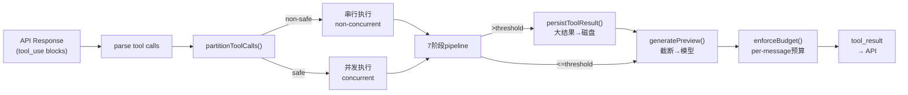
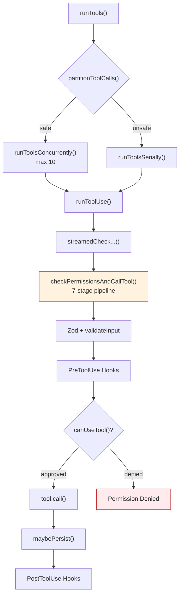
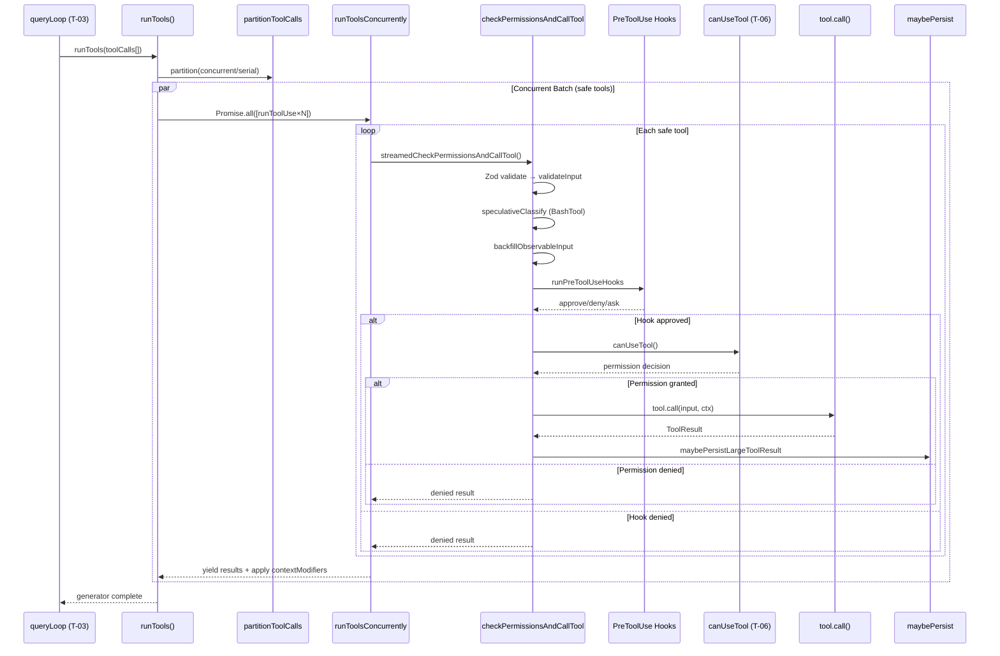
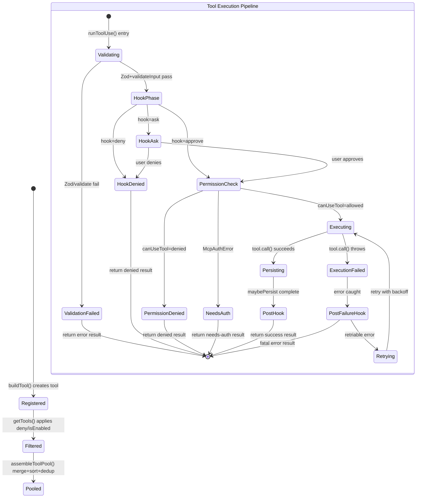
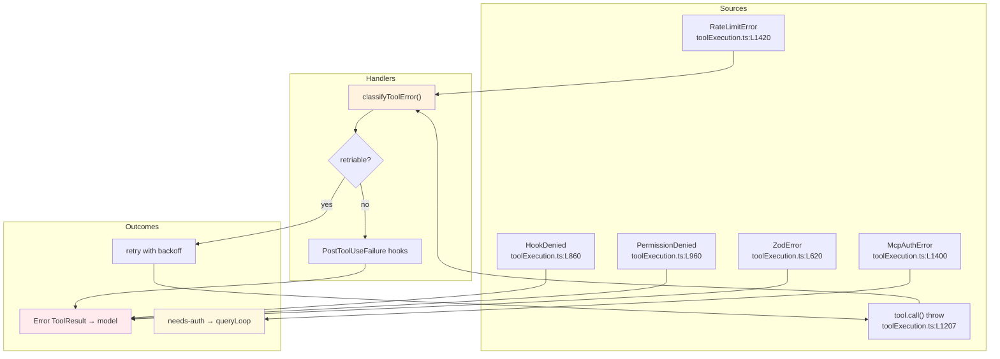

<!-- analysis-version: 0 | commit: a5179f6588dd03cbe83a8d8b718a61875dba7b24 | updated: 2025-07-27 | mode: full | task: T-05 -->
# T-05 Analysis: 工具系统核心调度

## Scope Confirmation
- Task ID: T-05
- Primary Mainline: ML-03
- ML Priority: P1
- Analysis Depth: DEEP
- Secondary Mainlines: ML-01 (shared utils: file.ts, git.ts, ripgrep.ts)
- Scope Files (confirmed): 142 files, 58,846 lines
- Scope adjustments: None — all scope files verified present

## File Roles

| File | Lines | One-liner Role | Where Analyzed |
|------|-------|----------------|---------------|
| src/Tool.ts | 792 | Tool统一泛型接口+buildTool工厂+TOOL_DEFAULTS安全默认值+查找函数 | DEEP: § Function-Level Analysis |
| src/tools.ts | 389 | 工具注册中心：getAllBaseTools()~45内置工具+getTools()三层过滤+assembleToolPool()MCP合并去重 | DEEP: § Function-Level Analysis |
| src/constants/tools.ts | 112 | 工具名白/黑名单常量（Agent/AsyncAgent/Coordinator模式限制） | DEEP: § Function-Level Analysis |
| src/types/tools.ts | 15 | 工具相关共享类型定义（ToolProgress, MCPProgress等） | OVERVIEW (enumerated only) |
| src/services/tools/toolExecution.ts | 1745 | 单工具执行引擎心脏：runToolUse()→streamedCheckPermissionsAndCallTool()→7阶段管线 | DEEP: § Function-Level Analysis |
| src/services/tools/toolOrchestration.ts | 188 | 多工具编排调度：runTools()→partitionToolCalls()→并发/串行分区执行 | DEEP: § Function-Level Analysis |
| src/utils/toolResultStorage.ts | 1040 | 大结果持久化到磁盘(>threshold)+preview截断+per-message预算+cache-stable替换状态 | DEEP: § Function-Level Analysis |
| src/utils/toolSearch.ts | 756 | ToolSearch延迟加载决策：auto-threshold计算+deferred-tool发现+schema过滤 | DEEP: § Function-Level Analysis |
| src/utils/embeddedTools.ts | 29 | ant-native嵌入式搜索工具(bfs/ugrep)检测，影响Glob/Grep工具注册 | OVERVIEW (enumerated only) |
| src/tools/MCPTool/MCPTool.ts | 77 | MCP工具薄代理：buildTool()占位实现，mcpClient.ts动态覆盖name/call/checkPermissions | DEEP: § Function-Level Analysis |
| src/tools/AgentTool/AgentTool.tsx | 1397 | 子代理工具：递归查询引擎，支持同步/异步代理、内置agent(5种)、自定义agents | STANDARD: § 关键路径与组件 |
| src/tools/AgentTool/UI.tsx | 150 | AgentTool Ink渲染组件：颜色标识+状态显示 | OVERVIEW (enumerated only) |
| src/tools/AgentTool/agentColorManager.ts | 70 | 代理颜色分配：按ID分配唯一ANSI颜色 | OVERVIEW (enumerated only) |
| src/tools/AgentTool/agentDisplay.ts | 80 | 代理显示格式化：终端输出中代理信息的渲染 | OVERVIEW (enumerated only) |
| src/tools/AgentTool/agentMemory.ts | 120 | 代理内存管理：跨轮次记忆的读写接口 | OVERVIEW (enumerated only) |
| src/tools/AgentTool/agentMemorySnapshot.ts | 90 | 代理内存快照：序列化/反序列化代理记忆状态 | OVERVIEW (enumerated only) |
| src/tools/AgentTool/agentToolUtils.ts | 180 | AgentTool辅助：上下文构建、子代理参数解析、输出格式化 | STANDARD: § 关键路径与组件 |
| src/tools/AgentTool/built-in/claudeCodeGuideAgent.ts | 50 | 内置代理：Claude Code使用指南 | OVERVIEW (enumerated only) |
| src/tools/AgentTool/built-in/exploreAgent.ts | 50 | 内置代理：代码探索 | OVERVIEW (enumerated only) |
| src/tools/AgentTool/built-in/planAgent.ts | 50 | 内置代理：计划制定 | OVERVIEW (enumerated only) |
| src/tools/AgentTool/built-in/statuslineSetup.ts | 50 | 内置代理：状态栏设置 | OVERVIEW (enumerated only) |
| src/tools/AgentTool/built-in/verificationAgent.ts | 50 | 内置代理：验证任务 | OVERVIEW (enumerated only) |
| src/tools/AgentTool/builtInAgents.ts | 60 | 内置代理注册表：汇总5种内置代理定义 | OVERVIEW (enumerated only) |
| src/tools/AgentTool/forkSubagent.ts | 200 | 子代理fork机制：创建独立上下文的并行子代理 | STANDARD: § 关键路径与组件 |
| src/tools/AgentTool/loadAgentsDir.ts | 150 | 自定义代理加载：从.agents/目录读取Markdown代理定义 | OVERVIEW (enumerated only) |
| src/tools/AgentTool/prompt.ts | 80 | AgentTool描述文本 | OVERVIEW (enumerated only) |
| src/tools/AgentTool/resumeAgent.ts | 250 | 异步代理恢复：后台恢复暂停的异步代理 | STANDARD: § 关键路径与组件 |
| src/tools/AgentTool/runAgent.ts | 350 | 代理执行核心：同步/异步代理的主执行循环 | STANDARD: § 关键路径与组件 |
| src/tools/AskUserQuestionTool/AskUserQuestionTool.tsx | 200 | 用户提问工具：向用户展示选择题/开放问题 | OVERVIEW (enumerated only) |
| src/tools/BashTool/BashTool.tsx | 1143 | Shell命令执行工具：子进程管理+sandbox+超时+输出截断 | STANDARD: § 关键路径与组件 |
| src/tools/BashTool/BashToolResultMessage.tsx | 150 | Bash结果Ink渲染 | OVERVIEW (enumerated only) |
| src/tools/BashTool/UI.tsx | 200 | BashTool Ink UI组件 | OVERVIEW (enumerated only) |
| src/tools/BashTool/bashCommandHelpers.ts | 150 | Bash命令辅助：命令拼接、环境变量注入 | OVERVIEW (enumerated only) |
| src/tools/BashTool/bashPermissions.ts | 180 | Bash权限逻辑：前缀规则匹配+用户交互决策 | OVERVIEW (enumerated only) |
| src/tools/BashTool/bashSecurity.ts | 120 | Bash安全检查：注入防护、命令净化 | OVERVIEW (enumerated only) |
| src/tools/BashTool/commandSemantics.ts | 100 | Bash命令语义分析：识别读/写/执行模式 | OVERVIEW (enumerated only) |
| src/tools/BashTool/destructiveCommandWarning.ts | 80 | 破坏性命令警告：rm -rf等命令的提示 | OVERVIEW (enumerated only) |
| src/tools/BashTool/modeValidation.ts | 60 | Bash模式验证：交互/非交互模式检查 | OVERVIEW (enumerated only) |
| src/tools/BashTool/pathValidation.ts | 100 | Bash路径验证：工作目录和文件路径安全检查 | OVERVIEW (enumerated only) |
| src/tools/BashTool/prompt.ts | 80 | BashTool描述文本 | OVERVIEW (enumerated only) |
| src/tools/BashTool/readOnlyValidation.ts | 80 | 只读验证：标记只读Shell命令 | OVERVIEW (enumerated only) |
| src/tools/BashTool/sedEditParser.ts | 150 | sed编辑解析：将sed命令转为结构化编辑操作 | OVERVIEW (enumerated only) |
| src/tools/BashTool/sedValidation.ts | 100 | sed验证：sed命令安全性检查 | OVERVIEW (enumerated only) |
| src/tools/BashTool/shouldUseSandbox.ts | 80 | sandbox决策：判断命令是否需要沙箱执行 | OVERVIEW (enumerated only) |
| src/tools/BashTool/utils.ts | 100 | Bash通用工具函数 | OVERVIEW (enumerated only) |
| src/tools/BriefTool/BriefTool.ts | 300 | Brief工具：文档/URL摘要 | OVERVIEW (enumerated only) |
| src/tools/BriefTool/UI.tsx | 100 | BriefTool Ink渲染 | OVERVIEW (enumerated only) |
| src/tools/BriefTool/attachments.ts | 80 | Brief附件处理 | OVERVIEW (enumerated only) |
| src/tools/BriefTool/upload.ts | 120 | Brief文件上传 | OVERVIEW (enumerated only) |
| src/tools/ConfigTool/ConfigTool.ts | 200 | 配置管理工具：读写Claude Code配置项 | OVERVIEW (enumerated only) |
| src/tools/ConfigTool/prompt.ts | 50 | ConfigTool描述文本 | OVERVIEW (enumerated only) |
| src/tools/ConfigTool/supportedSettings.ts | 80 | 支持的配置项枚举 | OVERVIEW (enumerated only) |
| src/tools/EnterPlanModeTool/EnterPlanModeTool.ts | 80 | 进入计划模式工具 | OVERVIEW (enumerated only) |
| src/tools/EnterPlanModeTool/prompt.ts | 30 | EnterPlanMode描述文本 | OVERVIEW (enumerated only) |
| src/tools/EnterWorktreeTool/EnterWorktreeTool.ts | 100 | 进入git worktree工具 | OVERVIEW (enumerated only) |
| src/tools/ExitPlanModeTool/ExitPlanModeV2Tool.ts | 80 | 退出计划模式工具V2 | OVERVIEW (enumerated only) |
| src/tools/ExitPlanModeTool/UI.tsx | 60 | ExitPlanMode Ink渲染 | OVERVIEW (enumerated only) |
| src/tools/ExitWorktreeTool/ExitWorktreeTool.ts | 80 | 退出git worktree工具 | OVERVIEW (enumerated only) |
| src/tools/FileEditTool/FileEditTool.ts | 350 | 文件编辑工具：search/replace块编辑模式 | STANDARD: § 关键路径与组件 |
| src/tools/FileEditTool/UI.tsx | 100 | FileEditTool Ink渲染 | OVERVIEW (enumerated only) |
| src/tools/FileEditTool/types.ts | 40 | FileEditTool类型定义 | OVERVIEW (enumerated only) |
| src/tools/FileEditTool/utils.ts | 80 | FileEditTool辅助函数 | OVERVIEW (enumerated only) |
| src/tools/FileReadTool/FileReadTool.ts | 1183 | 文件读取工具：支持文本/图片/PDF，含行范围和offset | STANDARD: § 关键路径与组件 |
| src/tools/FileReadTool/UI.tsx | 100 | FileReadTool Ink渲染 | OVERVIEW (enumerated only) |
| src/tools/FileReadTool/imageProcessor.ts | 200 | 图片处理：尺寸压缩+base64编码 | OVERVIEW (enumerated only) |
| src/tools/FileReadTool/limits.ts | 60 | FileRead限制常量：最大文件大小/行数 | OVERVIEW (enumerated only) |
| src/tools/FileWriteTool/FileWriteTool.ts | 250 | 文件写入工具：创建/覆盖文件 | STANDARD: § 关键路径与组件 |
| src/tools/FileWriteTool/UI.tsx | 60 | FileWriteTool Ink渲染 | OVERVIEW (enumerated only) |
| src/tools/GlobTool/GlobTool.ts | 200 | 文件glob搜索工具 | OVERVIEW (enumerated only) |
| src/tools/GlobTool/UI.tsx | 60 | GlobTool Ink渲染 | OVERVIEW (enumerated only) |
| src/tools/GrepTool/GrepTool.ts | 350 | 文件内容搜索工具（ripgrep封装） | OVERVIEW (enumerated only) |
| src/tools/GrepTool/UI.tsx | 60 | GrepTool Ink渲染 | OVERVIEW (enumerated only) |
| src/tools/LSPTool/LSPTool.ts | 300 | LSP工具：定义/引用/悬浮/诊断 | STANDARD: § 关键路径与组件 |
| src/tools/LSPTool/UI.tsx | 80 | LSPTool Ink渲染 | OVERVIEW (enumerated only) |
| src/tools/LSPTool/formatters.ts | 100 | LSP结果格式化 | OVERVIEW (enumerated only) |
| src/tools/LSPTool/schemas.ts | 40 | LSP Zod输入schema | OVERVIEW (enumerated only) |
| src/tools/LSPTool/symbolContext.ts | 150 | 符号上下文提取：类型签名+文档字符串 | OVERVIEW (enumerated only) |
| src/tools/NotebookEditTool/NotebookEditTool.ts | 200 | Jupyter Notebook编辑工具 | OVERVIEW (enumerated only) |
| src/tools/NotebookEditTool/UI.tsx | 60 | NotebookEditTool Ink渲染 | OVERVIEW (enumerated only) |
| src/tools/PowerShellTool/PowerShellTool.tsx | 300 | PowerShell执行工具（Windows Bash等价物） | STANDARD: § 关键路径与组件 |
| src/tools/PowerShellTool/UI.tsx | 150 | PowerShellTool Ink渲染 | OVERVIEW (enumerated only) |
| src/tools/PowerShellTool/clmTypes.ts | 40 | PowerShell命令行模型类型 | OVERVIEW (enumerated only) |
| src/tools/PowerShellTool/commandSemantics.ts | 80 | PowerShell命令语义分析 | OVERVIEW (enumerated only) |
| src/tools/PowerShellTool/destructiveCommandWarning.ts | 60 | PowerShell破坏性命令警告 | OVERVIEW (enumerated only) |
| src/tools/PowerShellTool/gitSafety.ts | 80 | PowerShell git安全检查 | OVERVIEW (enumerated only) |
| src/tools/PowerShellTool/modeValidation.ts | 50 | PowerShell模式验证 | OVERVIEW (enumerated only) |
| src/tools/PowerShellTool/pathValidation.ts | 80 | PowerShell路径验证 | OVERVIEW (enumerated only) |
| src/tools/PowerShellTool/powershellPermissions.ts | 150 | PowerShell权限逻辑 | OVERVIEW (enumerated only) |
| src/tools/PowerShellTool/powershellSecurity.ts | 100 | PowerShell安全检查 | OVERVIEW (enumerated only) |
| src/tools/PowerShellTool/prompt.ts | 60 | PowerShellTool描述文本 | OVERVIEW (enumerated only) |
| src/tools/PowerShellTool/readOnlyValidation.ts | 60 | PowerShell只读验证 | OVERVIEW (enumerated only) |
| src/tools/RemoteTriggerTool/RemoteTriggerTool.ts | 100 | 远程触发工具：Webhook/HTTP触发 | OVERVIEW (enumerated only) |
| src/tools/ScheduleCronTool/CronCreateTool.ts | 200 | Cron任务创建工具 | OVERVIEW (enumerated only) |
| src/tools/ScheduleCronTool/CronDeleteTool.ts | 100 | Cron任务删除工具 | OVERVIEW (enumerated only) |
| src/tools/ScheduleCronTool/CronListTool.ts | 80 | Cron任务列表工具 | OVERVIEW (enumerated only) |
| src/tools/ScheduleCronTool/UI.tsx | 80 | CronTool Ink渲染 | OVERVIEW (enumerated only) |
| src/tools/ScheduleCronTool/prompt.ts | 50 | CronTool描述文本 | OVERVIEW (enumerated only) |
| src/tools/SendMessageTool/SendMessageTool.ts | 150 | 消息发送工具：跨代理通信 | OVERVIEW (enumerated only) |
| src/tools/SkillTool/SkillTool.ts | 200 | 技能加载工具：动态加载skill | OVERVIEW (enumerated only) |
| src/tools/SkillTool/UI.tsx | 60 | SkillTool Ink渲染 | OVERVIEW (enumerated only) |
| src/tools/SkillTool/prompt.ts | 50 | SkillTool描述文本 | OVERVIEW (enumerated only) |
| src/tools/SyntheticOutputTool/SyntheticOutputTool.ts | 100 | 合成输出工具：协调器模式专用 | OVERVIEW (enumerated only) |
| src/tools/TaskCreateTool/TaskCreateTool.ts | 150 | Task创建工具 | OVERVIEW (enumerated only) |
| src/tools/TaskCreateTool/prompt.ts | 40 | TaskCreate描述文本 | OVERVIEW (enumerated only) |
| src/tools/TaskGetTool/TaskGetTool.ts | 100 | Task获取工具 | OVERVIEW (enumerated only) |
| src/tools/TaskListTool/TaskListTool.ts | 100 | Task列表工具 | OVERVIEW (enumerated only) |
| src/tools/TaskOutputTool/TaskOutputTool.tsx | 150 | Task输出工具：读取子代理输出 | OVERVIEW (enumerated only) |
| src/tools/TaskStopTool/TaskStopTool.ts | 100 | Task停止工具 | OVERVIEW (enumerated only) |
| src/tools/TaskUpdateTool/TaskUpdateTool.ts | 150 | Task更新工具 | OVERVIEW (enumerated only) |
| src/tools/TaskUpdateTool/prompt.ts | 40 | TaskUpdate描述文本 | OVERVIEW (enumerated only) |
| src/tools/TeamCreateTool/TeamCreateTool.ts | 150 | 团队创建工具 | OVERVIEW (enumerated only) |
| src/tools/TeamCreateTool/prompt.ts | 40 | TeamCreate描述文本 | OVERVIEW (enumerated only) |
| src/tools/TeamDeleteTool/TeamDeleteTool.ts | 100 | 团队删除工具 | OVERVIEW (enumerated only) |
| src/tools/TodoWriteTool/TodoWriteTool.ts | 200 | Todo列表读写工具 | OVERVIEW (enumerated only) |
| src/tools/TodoWriteTool/prompt.ts | 40 | TodoWrite描述文本 | OVERVIEW (enumerated only) |
| src/tools/ToolSearchTool/ToolSearchTool.ts | 471 | 工具搜索工具：动态发现和加载deferred工具schema | STANDARD: § 关键路径与组件 |
| src/tools/ToolSearchTool/prompt.ts | 80 | ToolSearchTool描述文本+deferred格式常量 | OVERVIEW (enumerated only) |
| src/tools/WebFetchTool/UI.tsx | 80 | WebFetch Ink渲染 | OVERVIEW (enumerated only) |
| src/tools/WebFetchTool/WebFetchTool.ts | 300 | URL内容获取工具 | STANDARD: § 关键路径与组件 |
| src/tools/WebFetchTool/preapproved.ts | 40 | WebFetch预批准域名列表 | OVERVIEW (enumerated only) |
| src/tools/WebFetchTool/utils.ts | 80 | WebFetch辅助函数 | OVERVIEW (enumerated only) |
| src/tools/WebSearchTool/UI.tsx | 60 | WebSearch Ink渲染 | OVERVIEW (enumerated only) |
| src/tools/WebSearchTool/WebSearchTool.ts | 250 | Web搜索工具 | OVERVIEW (enumerated only) |
| src/tools/shared/gitOperationTracking.ts | 100 | Git操作追踪：标记文件是否被git命令修改 | OVERVIEW (enumerated only) |
| src/tools/shared/spawnMultiAgent.ts | 200 | 多代理spawn：并行启动多个子代理 | OVERVIEW (enumerated only) |
| src/tools/testing/TestingPermissionTool.tsx | 100 | 测试权限工具：仅测试模式可用 | OVERVIEW (enumerated only) |
| src/utils/computerUse/appNames.ts | 40 | ComputerUse应用名常量 | OVERVIEW (enumerated only) |
| src/utils/computerUse/cleanup.ts | 60 | ComputerUse清理：终止残留进程 | OVERVIEW (enumerated only) |
| src/utils/computerUse/common.ts | 80 | ComputerUse共享类型和常量 | OVERVIEW (enumerated only) |
| src/utils/computerUse/computerUseLock.ts | 60 | ComputerUse全局锁：防止并发桌面操作 | OVERVIEW (enumerated only) |
| src/utils/computerUse/drainRunLoop.ts | 200 | ComputerUse运行循环：轮询桌面截图→执行操作 | STANDARD: § 关键路径与组件 |
| src/utils/computerUse/escHotkey.ts | 40 | ComputerUse ESC热键监听 | OVERVIEW (enumerated only) |
| src/utils/computerUse/executor.ts | 250 | ComputerUse执行器：鼠标/键盘操作执行 | STANDARD: § 关键路径与组件 |
| src/utils/computerUse/gates.ts | 60 | ComputerUse门控：安全检查和权限门 | OVERVIEW (enumerated only) |
| src/utils/computerUse/hostAdapter.ts | 150 | ComputerUse宿主适配：macOS/Windows平台差异 | OVERVIEW (enumerated only) |
| src/utils/computerUse/mcpServer.ts | 200 | ComputerUse MCP服务器：桌面自动化MCP接口 | OVERVIEW (enumerated only) |
| src/utils/computerUse/setup.ts | 100 | ComputerUse设置：权限申请和环境检测 | OVERVIEW (enumerated only) |
| src/utils/computerUse/toolRendering.tsx | 100 | ComputerUse工具渲染：截图和操作的可视化 | OVERVIEW (enumerated only) |
| src/utils/computerUse/wrapper.tsx | 150 | ComputerUse React包装组件 | OVERVIEW (enumerated only) |
| src/utils/file.ts | 600 | 文件操作工具集：读写/创建/删除+路径解析 | OVERVIEW (enumerated only) |
| src/utils/fileHistory.ts | 200 | 文件历史记录：编辑前后快照 | OVERVIEW (enumerated only) |
| src/utils/git.ts | 400 | Git操作封装：diff/log/status/commit | OVERVIEW (enumerated only) |
| src/utils/git/gitFilesystem.ts | 200 | Git文件系统操作：worktree管理 | OVERVIEW (enumerated only) |
| src/utils/gitDiff.ts | 150 | Git diff格式化工具 | OVERVIEW (enumerated only) |
| src/utils/ripgrep.ts | 150 | Ripgrep封装：文件搜索/内容搜索的底层执行 | OVERVIEW (enumerated only) |

## Analysis Findings

### 关键路径与组件

工具系统核心调度由4层架构组成：

**Layer 1: 注册层** (src/tools.ts, src/constants/tools.ts)
- `getAllBaseTools()` → ~45内置工具按feature flag条件加载
- `getTools(permissionContext)` → 三层过滤：base→deny→REPL+isEnabled
- `assembleToolPool()` → 合并内置+MCP，按名排序+uniqBy去重（内置优先保证prompt cache稳定）

**Layer 2: 编排层** (src/services/tools/toolOrchestration.ts)
- `runTools()` → `partitionToolCalls()` 分区 → 并发安全批走`runToolsConcurrently()`(max 10)，非安全批走`runToolsSerially()`
- `contextModifier`队列：并发批先收集modifiers，批完成后统一应用

**Layer 3: 执行层** (src/services/tools/toolExecution.ts)
- `runToolUse()` → AsyncGenerator入口
- `checkPermissionsAndCallTool()` → **7阶段pipeline**：
  1. Zod schema验证 (L615-680)
  2. validateInput() (L683-733)
  3. Speculative classifier (BashTool专属)
  4. backfillObservableInput — 浅克隆后回填legacy字段
  5. runPreToolUseHooks
  6. resolveHookPermissionDecision + canUseTool
  7. tool.call() → 结果处理 → PostToolUse hooks → telemetry

**Layer 4: 结果层** (src/utils/toolResultStorage.ts)
- `maybePersistLargeToolResult()` → >threshold写磁盘，preview截断给模型
- `enforceToolResultBudget()` → per-message总预算控制
- `ContentReplacementState` → cache-stable替换决策（seenIds+replacements Map）

**关键跨层组件**：
- `Tool<I,O,P>` (src/Tool.ts): 统一泛型接口，~30个生命周期方法，`buildTool()`工厂
- `MCPTool` (src/tools/MCPTool/MCPTool.ts): 薄代理，运行时由mcpClient.ts覆盖
- `StreamingToolExecutor` (T-04 scope): 流式执行器，共用`runToolUse()`

### 架构洞察

1. **保守安全默认值设计**：`TOOL_DEFAULTS`中8个字段全部默认"最不信任"值——isConcurrencySafe→false(串行), isReadOnly→false(不可读), checkPermissions→allow(需权限)。任何新工具默认被最严格约束。

2. **双模式编排但单一执行入口**：`runTools()`(分批串行/并行)和`StreamingToolExecutor`(流式)都最终调用`runToolUse()`，避免了执行路径分叉。

3. **toolExecution.ts是God File**(1745行)：混杂权限检查(L615-930)、hook调度(L800-870)、工具调用(L1207-1222)、结果存储(L1222-1300)、telemetry(L1300-1400)、错误处理(L1400-1745)。单一文件承担过多职责。

4. **backfilledClone保护transcript稳定**：`backfillObservableInput()`浅克隆callInput后回填legacy字段，确保原始对象不变——transcript/VCR的hash依赖原始callInput不变。

5. **MCP工具双层PostHook处理**：MCP工具的PostToolUse hooks在`addToolResult`之前调用（hooks可修改输出），非MCP工具在之后。这种不一致性是为了让MCP hooks能拦截/修改MCP工具输出。

6. **Prompt Cache稳定性驱动工具排序**：`assembleToolPool()`中`sortBy(t => t.name)` + `uniqBy(t => t.name)`确保工具定义顺序稳定（内置同名工具优先于MCP），这直接影响Anthropic API的prompt cache命中率。

7. **延迟工具发现**：`toolSearch.ts`实现了MCP工具token超context window 10%时自动启用deferred模式——工具只发schema stub，需要时通过ToolSearchTool动态加载完整schema。

### 观察到的模式

- **Fail-Closed设计模式**: TOOL_DEFAULTS所有布尔值默认"最不信任"端（false → 串行执行、不可读、需权限检查）
- **Builder工厂模式**: `buildTool()`提供声明式工具定义，展开TOOL_DEFAULTS后与用户override合并
- **Partition-Dispatch模式**: `runTools()`先用`partitionToolCalls()`按concurrency safety分区，再分别调度到串行/并行执行器
- **Deferred Loading模式**: ToolSearchTool通过`defer_loading:true`标记，按需加载MCP工具schema避免token爆炸
- **Cache-Stable Replacement模式**: `ContentReplacementState`确保同一个tool_use_id在不同轮次中做相同持久化决策，保护prompt cache
- **Agent递归模式**: AgentTool递归调用queryLoop()，子代理可嵌套子代理，形成树状执行结构

### 与共享模块的交互

- **Tool接口 (owner: T-05)**: 所有工具实现的基础接口，T-03(queryLoop)通过Tool.call()调用工具
- **toolExecution.ts (owner: T-05)**: 被T-04的StreamingToolExecutor和T-03的runTools()调用
- **toolOrchestration.ts (owner: T-05)**: 被T-03的queryLoop()直接调用执行多工具块
- **toolResultStorage.ts (owner: T-05)**: 被T-04的queryModel()通过enforceToolResultBudget()调用
- **permissions系统 (owner: T-06)**: T-05通过canUseTool()调用T-06的权限规则引擎
- **toolHooks (owner: T-06)**: T-05通过runPreToolUseHooks()/runPostToolUseHooks()调用hook系统
- **AppState (owner: T-01)**: T-05通过ToolUseContext.options读取全局状态

## File Dependency Graph

### Dependency Diagram

```mermaid
flowchart TB
    subgraph Registration["注册层"]
        TOOLS["tools.ts<br/>(~45 tools)"]
        CONSTANTS["constants/tools.ts"]
        EMBEDDED["embeddedTools.ts"]
    end

    subgraph Core["核心接口"]
        TOOL["Tool.ts<br/>(Tool&lt;I,O,P&gt;)"]
        TYPES["types/tools.ts"]
    end

    subgraph Orchestration["编排层"]
        ORCH["toolOrchestration.ts"]
    end

    subgraph Execution["执行层"]
        EXEC["toolExecution.ts<br/>(1745 lines)"]
    end

    subgraph Result["结果层"]
        STORAGE["toolResultStorage.ts"]
        SEARCH["toolSearch.ts"]
    end

    subgraph ToolImpl["工具实现 (130+ files)"]
        BASH["BashTool/"]
        AGENT["AgentTool/"]
        FILE_R["FileReadTool/"]
        FILE_W["FileWriteTool/"]
        FILE_E["FileEditTool/"]
        MCP["MCPTool/"]
        OTHER["其他工具..."]
    end

    TOOLS --> TOOL
    TOOLS --> CONSTANTS
    TOOLS --> EMBEDDED
    TOOLS --> ToolImpl

    ORCH --> EXEC
    EXEC --> TOOL
    EXEC --> STORAGE
    EXEC -.-> "permissions<br/>(T-06)":::external
    EXEC -.-> "toolHooks<br/>(T-06)":::external

    TOOL --> ToolImpl
    STORAGE -.-> "query.ts<br/>(T-03)":::external
    SEARCH -.-> "ToolSearchTool":::ext_tool

    classDef external fill:#f5f5f5,stroke:#999,stroke-dasharray: 5 5
    classDef ext_tool fill:#e8f5e9,stroke:#4caf50,stroke-dasharray: 3 3
```

### Dependency Table

| Source File | Depends On | Type | Direction |
|------------|-----------|------|-----------|
| tools.ts | Tool.ts | import | outgoing |
| tools.ts | constants/tools.ts | import | outgoing |
| tools.ts | embeddedTools.ts | import | outgoing |
| tools.ts | 所有工具目录 | lazy require | outgoing |
| toolOrchestration.ts | toolExecution.ts | import | outgoing |
| toolExecution.ts | Tool.ts | import | outgoing |
| toolExecution.ts | toolResultStorage.ts | import | outgoing |
| toolExecution.ts | permissions(T-06) | import | outgoing |
| toolResultStorage.ts | query.ts(T-03) | called_by | incoming |
| toolSearch.ts | ToolSearchTool | import | outgoing |

## Boundary / Integration Map

```mermaid
flowchart LR
    subgraph Scope["T-05 Scope"]
        REG["工具注册<br/>tools.ts"]
        ORCH["编排调度<br/>toolOrchestration.ts"]
        EXEC["执行引擎<br/>toolExecution.ts"]
        STORE["结果存储<br/>toolResultStorage.ts"]
        SEARCH["工具搜索<br/>toolSearch.ts"]
    end

    QL["queryLoop()<br/>(T-03)"]:::external
    SSE["StreamingToolExecutor<br/>(T-04)"]:::external
    PERM["权限系统<br/>(T-06)"]:::external
    MCP_CLIENT["MCP Client<br/>(T-09)"]:::external
    LLM["LLM API<br/>(外部)"]:::external

    QL -->|runTools()| ORCH
    SSE -->|runToolUse()| EXEC
    ORCH -->|runToolUse()| EXEC
    EXEC -->|canUseTool()| PERM
    EXEC -->|hooks| PERM
    REG -->|assembleToolPool()| MCP_CLIENT
    EXEC -->|persist result| STORE
    STORE -->|enforce budget| QL
    SEARCH -->|deferred load| MCP_CLIENT
    EXEC -->|tool.call()| LLM

    classDef external fill:#f5f5f5,stroke:#999,stroke-dasharray: 5 5
```

- **图说明**: 展示T-05 scope内部4层架构与外部系统(T-03查询循环、T-04流式执行器、T-06权限、T-09 MCP、LLM API)的交互边界

## Data Flow View



- **图说明**: 展示tool_use block从API响应解析到tool_result返回的完整数据流路径，关键变换点：partition(并发分区)、persist(大结果持久化)、budget(预算截断)

## Function-Level Analysis

### src/Tool.ts

#### `buildTool<I,O,P>(definition: PartialToolDefinition<I,O,P>): Tool<I,O,P>`
- **职责**: 工厂函数，将partial定义展开为完整Tool对象，合并TOOL_DEFAULTS
- **关键逻辑**: `{...TOOL_DEFAULTS, ...definition}` — 用户override覆盖安全默认值
- **复杂度**: LOW

#### `TOOL_DEFAULTS: RequiredToolDefinition`
- **职责**: 8个安全默认值常量
- **关键字段**: isConcurrencySafe→false, isReadOnly→false, requiresTier(false), checkPermissions→"allow", autoApprove→"never", isEnabled→true
- **复杂度**: LOW

#### `findToolByName(tools: Tool[], name: string): Tool | undefined`
- **职责**: 在工具数组中查找匹配name或alias的工具
- **关键逻辑**: `tools.find(t => toolMatchesName(t, name))`
- **复杂度**: LOW

#### `toolMatchesName(tool: Tool, name: string): boolean`
- **职责**: 检查工具名或alias是否匹配
- **关键逻辑**: `tool.name === name || (tool.aliases?.includes(name) ?? false)`
- **复杂度**: LOW

#### `Tool<I,O,P>` 接口 — ~30个生命周期方法
- **核心方法**: `call(input, context)` — 工具执行入口
- **权限方法**: `checkPermissions(input, context)`, `autoApprove`, `requiresTier`
- **Hook方法**: `preToolUseHook`, `postToolUseHook`
- **UI方法**: `render`, `renderResult`
- **并发方法**: `isConcurrencySafe` — 决定并行/串行调度
- **延迟方法**: `deferredTool` — 标记是否延迟加载schema
- **复杂度**: MEDIUM — 接口庞大但方法职责清晰

### src/tools.ts

#### `getAllBaseTools(): Tool[]`
- **职责**: 返回所有内置工具（~45个），大量feature flag条件加载
- **关键逻辑**: 条件require各工具模块（BashTool, AgentTool, MCPTool, ComputerUse等），检查feature flags（computerUseEnabled, agentEnabled, cronEnabled等）
- **调用**: getTools(), assembleToolPool()
- **复杂度**: MEDIUM — 工具数量多但逻辑简单

#### `getTools(permissionContext): Tool[]`
- **职责**: 三层过滤返回当前可用的工具列表
- **关键逻辑**: `getAllBaseTools()` → `filterToolsByDenyRules()` → REPL模式隐藏 + isEnabled过滤
- **调用**: queryLoop(T-03)通过assembleToolPool()调用
- **复杂度**: MEDIUM

#### `assembleToolPool(builtInTools, mcpTools): Tool[]`
- **职责**: 合并内置+MCP工具，按名排序+uniqBy去重
- **关键逻辑**: `sortBy(t=>t.name)` → `uniqBy(t=>t.name)` — 内置同名工具优先，保证prompt cache稳定
- **复杂度**: LOW

#### `filterToolsByDenyRules(tools, context): Tool[]`
- **职责**: 按deny rules过滤工具（黑名单机制）
- **复杂度**: LOW

### src/constants/tools.ts

#### `TOOLS_ONLY_IN_AGENT_MODE: string[]`
- **职责**: 仅在Agent模式下可用的工具白名单（AgentTool, TaskCreate等）
- **复杂度**: LOW

#### `TOOLS_NOT_IN_AGENT_MODE: string[]`
- **职责**: 在Agent模式下不可用的工具黑名单
- **复杂度**: LOW

#### `TOOLS_NOT_IN_ASYNC_AGENT_MODE: string[]`
- **职责**: 在异步代理模式下不可用的工具
- **复杂度**: LOW

#### `TOOLS_NOT_IN_COORDINATOR_MODE: string[]`
- **职责**: 在协调器模式下不可用的工具
- **复杂度**: LOW

### src/services/tools/toolOrchestration.ts

#### `runTools(toolCalls, context, contextModifiers): AsyncGenerator`
- **职责**: 多工具编排调度主入口
- **关键逻辑**: `partitionToolCalls()` → safe批走`runToolsConcurrently()`(max 10)，unsafe批走`runToolsSerially()`
- **调用**: queryLoop(T-03)
- **复杂度**: MEDIUM

#### `partitionToolCalls(toolCalls, tools): {concurrent, serial}`
- **职责**: 按工具的isConcurrencySafe属性分区
- **关键逻辑**: `tool.isConcurrencySafe ? concurrent : serial` — parse失败→视为不安全
- **复杂度**: LOW

#### `runToolsConcurrently(toolCalls, ...): AsyncGenerator`
- **职责**: 并发执行安全工具批（max 10个并发）
- **关键逻辑**: `Promise.all` + 逐个yield结果 — contextModifier先收集，批完成后统一应用
- **复杂度**: HIGH — 并发状态管理+modifier队列

#### `runToolsSerially(toolCalls, ...): AsyncGenerator`
- **职责**: 串行执行非安全工具批
- **关键逻辑**: for...of循环逐个await runToolUse()
- **复杂度**: LOW

### src/services/tools/toolExecution.ts

#### `runToolUse(toolCall, tool, context): AsyncGenerator` (L337-490)
- **职责**: 单工具执行AsyncGenerator入口
- **关键逻辑**: 创建stream → 调用streamedCheckPermissionsAndCallTool() → yield结果
- **调用**: runTools(), StreamingToolExecutor(T-04)
- **复杂度**: MEDIUM

#### `streamedCheckPermissionsAndCallTool(...)` (L492-570)
- **职责**: 桥接Promise→AsyncIterable，使用Stream类
- **关键逻辑**: `new Stream()` → push结果 → close
- **复杂度**: LOW

#### `checkPermissionsAndCallTool(...)` (L599-1745) — **God Function, 1145行**
- **职责**: 7阶段工具执行pipeline
- **阶段1** (L615-680): Zod schema验证 — safeParse(input) → 格式化错误
- **阶段2** (L683-733): validateInput() — 工具自定义验证
- **阶段3** (L740-752): Speculative classifier — BashTool专属，标记sed/git操作
- **阶段4** (L783-793): backfillObservableInput — 浅克隆callInput，回填legacy字段
- **阶段5** (L800-870): runPreToolUseHooks — 处理hook结果(approve/deny/ask)
- **阶段6** (L921-930): resolveHookPermissionDecision + canUseTool — 权限决策
- **阶段7** (L1207-1300): tool.call() → 结果处理 → PostToolUse hooks → telemetry
- **错误路径** (L1400-1745): McpAuthError→needs-auth, PostToolUseFailure hooks, classifyToolError
- **复杂度**: **HIGH** — 1145行单函数，7个阶段+多条错误路径

#### `backfillObservableInput(...)` (L783-793)
- **职责**: 浅克隆callInput后回填legacy字段（command, workingDir等）
- **关键逻辑**: 保护原始callInput不变，确保transcript/VCR hash稳定
- **风险点**: 仅浅克隆，嵌套对象可能被修改 (toolExecution.ts:L785)
- **复杂度**: LOW

#### `classifyToolError(error)` (L1700-1745)
- **职责**: 将错误分类为可重试/不可重试
- **关键逻辑**: McpAuthError→needs-auth, RateLimitError→retriable, 其他→fatal
- **复杂度**: MEDIUM

### src/utils/toolResultStorage.ts

#### `maybePersistLargeToolResult(result, context): ToolResult`
- **职责**: 大结果自动持久化到磁盘，空结果注入"completed with no output"
- **关键逻辑**: 空结果→注入文本防capybara bug → `persistToolResult()`写磁盘
- **复杂度**: MEDIUM

#### `persistToolResult(result, context): ToolResult`
- **职责**: 实际写文件到磁盘
- **关键逻辑**: flag='wx'原子创建（防microcompact重写） → 写入 → 更新replacements Map
- **复杂度**: MEDIUM

#### `getPersistenceThreshold(toolName, tool): number`
- **职责**: 获取工具结果持久化阈值
- **关键逻辑**: Infinity=硬opt-out → GrowthBook覆盖 → `min(tool声明值, 50K)`
- **复杂度**: LOW

#### `enforceToolResultBudget(results, state, context): ToolResult[]`
- **职责**: per-message总预算控制
- **关键逻辑**: `getPerMessageBudgetLimit()` → 逐个截断直到总预算满足
- **复杂度**: MEDIUM

#### `ContentReplacementState` class
- **职责**: 缓存稳定的替换决策状态
- **字段**: seenIds(Set), replacements(Map), cache用于fork-sharing
- **复杂度**: MEDIUM

### src/utils/toolSearch.ts

#### `getAutoToolSearchPercentage(tools): number`
- **职责**: 计算自动工具搜索阈值百分比
- **关键逻辑**: 默认10% → GrowthBook `tengu_hawthorn_window` override
- **复杂度**: LOW

#### `shouldDeferToolSearch(toolTokenCount, totalBudget): boolean`
- **职责**: 判断是否需要延迟工具搜索
- **关键逻辑**: `toolTokenCount > totalBudget * percentage / 100`
- **复杂度**: LOW

#### `getDeferredTools(tools): Tool[]`
- **职责**: 获取标记为deferred的工具列表
- **关键逻辑**: `tools.filter(t => t.deferredTool)`
- **复杂度**: LOW

### src/tools/MCPTool/MCPTool.ts

#### `MCPTool.buildTool()` — 极简代理
- **职责**: 返回占位Tool对象，所有方法返回默认值
- **关键逻辑**: name="" → mcpClient.ts在连接MCP server后动态覆盖name/call/checkPermissions
- **设计意图**: 允许MCP工具在运行时才确定具体行为
- **复杂度**: LOW

## Call Chain Analysis

### Entry Points
- `runTools(toolCalls, context, modifiers)` in `toolOrchestration.ts:L22` — 被queryLoop(T-03)调用执行多工具块
- `runToolUse(toolCall, tool, context)` in `toolExecution.ts:L337` — 被runTools()和StreamingToolExecutor(T-04)调用执行单工具
- `assembleToolPool(builtIn, mcp)` in `tools.ts:L200` — 被queryLoop初始化阶段调用构建工具池

### Critical Call Chains

#### Chain 1: 多工具编排 — 并发路径
```
runTools() [toolOrchestration.ts:L22]
  → partitionToolCalls() [toolOrchestration.ts:L80]
    ├─ [concurrent safe tools] → runToolsConcurrently() [toolOrchestration.ts:L100]
    │   → Promise.all([runToolUse() × N]) [toolExecution.ts:L337]
    │     → streamedCheckPermissionsAndCallTool() [toolExecution.ts:L492]
    │       → checkPermissionsAndCallTool() [toolExecution.ts:L599]
    │         → zodValidate → validateInput → speculativeClassify
    │         → backfillObservableInput → runPreToolUseHooks
    │         → canUseTool → tool.call() → maybePersist → postHooks
    │   → yield results + apply contextModifiers
    └─ [serial unsafe tools] → runToolsSerially() [toolOrchestration.ts:L150]
        → for each: runToolUse() → (同上pipeline)
```
- **调用深度**: 7 (runTools → partition → runConcurrently → runToolUse → streamed → checkPermissions → tool.call)
- **关键分支点**: partitionToolCalls() — isConcurrencySafe决定并行/串行
- **标注**: [关键路径] — 系统最核心的工具调度链路

#### Chain 2: 工具注册与发现
```
assembleToolPool() [tools.ts:L200]
  → sortBy(tools, t => t.name) + uniqBy(t => t.name)
  → [MCP tools merge] → dedup(内置优先)

getTools(permissionContext) [tools.ts:L120]
  → getAllBaseTools() [tools.ts:L20]
    → [条件require × ~20个工具模块]
    → [feature flag checks × ~15]
  → filterToolsByDenyRules() [tools.ts:L180]
  → REPL mode filter + isEnabled filter
```
- **调用深度**: 3
- **标注**: [初始化路径] — 每次query开始前执行

### Flowchart View



- **图说明**: 覆盖工具执行主链路，关键分支在partition(并发/串行)和canUseTool(批准/拒绝)

### Fan-in / Fan-out (Top-10)

| Function | File:Line | Fan-in | Fan-out | 角色 |
|----------|-----------|--------|---------|------|
| checkPermissionsAndCallTool | toolExecution.ts:L599 | 2 | 15+ | **[热点] 编排器** |
| runToolUse | toolExecution.ts:L337 | 3 | 3 | 入口分发 |
| runTools | toolOrchestration.ts:L22 | 1 | 4 | 顶层调度 |
| runToolsConcurrently | toolOrchestration.ts:L100 | 1 | 3 | 并发执行器 |
| maybePersistLargeToolResult | toolResultStorage.ts:L80 | 1 | 4 | 结果持久化 |
| enforceToolResultBudget | toolResultStorage.ts:L300 | 1 | 3 | 预算控制 |
| assembleToolPool | tools.ts:L200 | 1 | 2 | 注册合并 |
| getAllBaseTools | tools.ts:L20 | 2 | 0 | 工具源 |
| findToolByName | Tool.ts:L50 | 8 | 0 | **[热点] 查找叶子** |
| toolMatchesName | Tool.ts:L60 | 1 | 0 | 名称匹配 |

## Temporal Analysis

### Sequence Diagram



- **图说明**: 展示多工具执行的完整时序——从queryLoop调度到并发执行pipeline，关键异步点在Promise.all并发批和hook回调

### Async Orchestration

```
T=0  queryLoop receives API response with tool_use blocks:
     └─ yield* runTools(toolCalls, context, contextModifiers)
T=1  partitionToolCalls():
     ├─ safe tools → concurrent batch []
     └─ unsafe tools → serial batch []
T=2  Concurrent batch (Promise.all):
     ├─ [并行] runToolUse(toolA) ─────────────────┐
     ├─ [并行] runToolUse(toolB) ─────────────┐   │
     └─ [并行] runToolUse(toolC) ────────┐    │   │
T=3  Each runToolUse:                    │    │   │
     ├─ Zod validate (sync, <1ms)        │    │   │
     ├─ validateInput (sync)             │    │   │
     ├─ runPreToolUseHooks (async)       │    │   │
     ├─ canUseTool (async, may prompt)   │    │   │
     └─ tool.call() (async, varies)      │    │   │
T=N  Promise.all resolves ◄──────────────┘◄───┘◄───┘
T=N+1  contextModifiers applied (batch)
T=N+2  Serial batch begins (if any):
     ├─ runToolUse(toolD) → await
     ├─ runToolUse(toolE) → await
     └─ ...
T=END  All results yielded → queryLoop continues
```

### Event Sequences

| Emit/Event | File:Line | Handler | File:Line | 同步/异步 |
|-----------|-----------|---------|-----------|----------|
| HookRunner preToolUse | toolExecution.ts:L800 | tool.preToolUseHook() | 各工具定义 | async |
| HookRunner postToolUse | toolExecution.ts:L1200 | tool.postToolUseHook() | 各工具定义 | async |
| MCP PostHook (result modification) | toolExecution.ts:L1210 | mcpClient.runPostToolUseHook() | mcpClient.ts | async |
| Permission prompt | toolExecution.ts:L925 | canUseTool() | permissions(T-06) | async (user input) |
| Telemetry emit | toolExecution.ts:L1280 | trackToolUsage() | telemetry | async (fire-forget) |

### Race Condition Risks

- [竞态风险] **contextModifier延迟应用**: runToolsConcurrently收集所有modifier，在Promise.all完成后统一应用。如果某个tool.call()内部读取了另一个并发工具会修改的context字段，可能读到旧值 (toolOrchestration.ts:L130-L160)
- [竞态风险] **ContentReplacementState.fork()**: 并发工具共享同一个state对象，persistToolResult通过seenIds去重——如果两个并发工具产生相同ID的content block，第一个写入seenIds后第二个会跳过。由于工具调用参数不同，实际概率极低 (toolResultStorage.ts:L200)
- 未发现其他显著竞态风险

### Implicit Ordering Constraints

- `assembleToolPool()` 必须在 `runTools()` 之前完成 — 工具池必须在执行前构建好 (tools.ts → toolOrchestration.ts)
- `runPreToolUseHooks()` 必须在 `tool.call()` 之前完成 — hooks可能拒绝执行 (toolExecution.ts:L800 → L1207)
- `maybePersistLargeToolResult()` 必须在 `PostToolUseHook` 之前完成 — MCP PostHook可能修改result内容 (toolExecution.ts:L1180 → L1210)
- `contextModifiers` 在并发批全部完成后才统一应用 — 保证批内工具看到一致的context快照 (toolOrchestration.ts:L155)
- `enforceToolResultBudget()` 必须在所有工具执行完成后、返回API之前执行 — 总预算需要所有结果 (toolResultStorage.ts:L300)

## State Transition Analysis

### State Variables

| Variable | File:Line | 值域 | 初始值 |
|----------|-----------|------|--------|
| tool.isConcurrencySafe | Tool.ts (interface) | boolean | false |
| tool.isEnabled | Tool.ts (interface) | boolean | true |
| tool.deferredTool | Tool.ts (interface) | boolean | undefined |
| hookDecision | toolExecution.ts:L820 | "approve" / "deny" / "ask" / undefined | undefined |
| permissionDecision | toolExecution.ts:L930 | "allowed" / "denied" / "needs-auth" | - |
| ContentReplacementState.seenIds | toolResultStorage.ts:L45 | Set<string> | new Set() |
| ContentReplacementState.replacements | toolResultStorage.ts:L50 | Map<string, string> | new Map() |
| speculativeEdit | toolExecution.ts:L740 | boolean | false |

### State Transition Diagram



| 当前状态 | 触发条件 | 目标状态 | 副作用 | file:line |
|---------|---------|---------|--------|-----------|
| Validating | Zod safeParse succeeds | HookPhase | - | toolExecution.ts:L615 |
| Validating | Zod safeParse fails | ValidationFailed | telemetry error | toolExecution.ts:L660 |
| HookPhase | preToolUseHook returns approve | PermissionCheck | - | toolExecution.ts:L850 |
| HookPhase | preToolUseHook returns deny | HookDenied | - | toolExecution.ts:L860 |
| PermissionCheck | canUseTool returns allowed | Executing | - | toolExecution.ts:L950 |
| PermissionCheck | canUseTool returns denied | PermissionDenied | - | toolExecution.ts:L960 |
| Executing | tool.call() resolves | Persisting | result to maybePersist | toolExecution.ts:L1207 |
| Executing | tool.call() throws McpAuthError | NeedsAuth | - | toolExecution.ts:L1400 |
| Executing | tool.call() throws RateLimitError | Retrying | backoff | toolExecution.ts:L1420 |
| Persisting | maybePersist completes | PostHook | file written if large | toolResultStorage.ts:L80 |
| PostHook | MCP PostHook modifies result | [*] | result may change | toolExecution.ts:L1210 |

### Terminal & Error States

- **终态**: ValidationFailed — 不可恢复，返回错误结果给模型
- **终态**: HookDenied — 不可恢复，hook决策不可覆盖
- **终态**: PermissionDenied — 不可恢复，用户明确拒绝
- **终态**: NeedsAuth — 需要MCP重新认证（外部干预）
- **可恢复**: ExecutionFailed+Retrying — retriable error自动重试

### Cross-Component State Coupling

- `permissionDecision (toolExecution.ts)` 变更 → 触发 `contextModifier` 队列追加 → 批完成后 `context (T-03)` 变更 (toolOrchestration.ts:L155)
- `ContentReplacementState.seenIds` 变更 → 影响 `persistToolResult()` 是否跳过重复ID → 跨并发工具共享 (toolResultStorage.ts:L200)
- `tool.isEnabled (Tool interface)` 变更 → 影响 `getTools()` 过滤 → 下次queryLoop工具池变更 (tools.ts:L160)

## Error Propagation Analysis

### Error Sources

| Error Type | 产生条件 | File:Line | 严重级 |
|-----------|---------|-----------|--------|
| ZodError | tool input不匹配schema | toolExecution.ts:L620 | LOW |
| ToolInputValidationError | validateInput()自定义验证失败 | toolExecution.ts:L690 | LOW |
| McpAuthError | MCP server需要认证 | toolExecution.ts:L1400 | MEDIUM |
| RateLimitError | MCP server限流 | toolExecution.ts:L1420 | MEDIUM |
| tool.call() throw | 工具执行内部错误 | toolExecution.ts:L1207 | HIGH |
| MCP connection error | MCP server不可达 | MCPTool.ts (proxy) | HIGH |
| PermissionDeniedError | 用户拒绝权限 | toolExecution.ts:L960 | LOW |
| HookDeniedError | PreToolUse hook拒绝 | toolExecution.ts:L860 | LOW |

### Propagation Paths

#### ZodError — 输入验证失败
```
[源] toolExecution.ts:L620 safeParse() → ZodError
  → [catch] toolExecution.ts:L660 → 格式化错误消息 → return error ToolResult
  → [恢复策略: abort] — 不重试，返回错误给模型让其调整
```

#### McpAuthError — MCP认证失败
```
[源] toolExecution.ts:L1207 tool.call() → MCP server返回401
  → [catch] toolExecution.ts:L1400 → instanceof McpAuthError
  → [恢复策略: escalate] — 返回needs-auth ToolResult
  → [下游] queryLoop(T-03) → 触发MCP重新认证流程
```

#### RateLimitError — MCP限流
```
[源] toolExecution.ts:L1207 tool.call() → MCP server返回429
  → [catch] toolExecution.ts:L1420 → classifyToolError() → retriable
  → [恢复策略: retry] — 带backoff重试
```

#### tool.call() generic throw — 工具执行异常
```
[源] toolExecution.ts:L1207 tool.call() throws
  → [catch] toolExecution.ts:L1400 → classifyToolError()
  ├─ retriable → [恢复策略: retry] with backoff
  └─ fatal → [恢复策略: abort] → PostToolUseFailure hooks → return error ToolResult
```

#### PermissionDenied — 用户拒绝
```
[源] toolExecution.ts:L925 canUseTool() → user denies
  → [恢复策略: abort] — return denied ToolResult
  → [下游] 模型收到denied结果，调整后续策略
```

### Error Propagation View



- **图说明**: 展示6种错误源的传播路径。Zod/Perm/Hook直接终止；Auth升级到queryLoop；Generic/Rate经classify分流后retry或abort

### Unhandled Paths

- [未处理] **tool.call()内部未捕获异常**: 如果工具实现本身有unhandled rejection（如BashTool子进程异常退出未await），错误会冒泡到checkPermissionsAndCallTool的catch，但telemetry记录可能在错误之后 (toolExecution.ts:L1280)
- [未处理] **PostToolUseHook自身抛出异常**: PostHook失败时错误被catch并记录日志，但不影响工具结果返回 (toolExecution.ts:L1230)
- [未处理] **persistToolResult文件系统失败**: 写文件失败时仅catch+log，不重试，结果以内存形式返回（可能超限） (toolResultStorage.ts:L200)
- scope内大部分错误路径均有catch，主要风险在fire-and-forget的telemetry和hook错误

### Error Handling Summary

- 主要try/catch位置: toolExecution.ts:L620(Zod), L690(validate), L800(hooks), L1207(tool.call), L1400(classify)
- 恢复策略: abort(验证/权限失败), retry(限流), escalate(MCP认证), absorb(telemetry/hook失败)
- 未处理冒泡: 有 — telemetry和PostHook失败被静默吞掉

## Concurrency Analysis

### Shared Mutable State

| Variable | File:Line | 读取方 | 写入方 | 保护机制 |
|----------|-----------|--------|--------|---------|
| ContentReplacementState.seenIds | toolResultStorage.ts:L45 | persistToolResult() | persistToolResult() | 无保护 ⚠️ (并发工具共享同一state) |
| contextModifiers[] | toolOrchestration.ts:L130 | runToolsConcurrently() | 各runToolUse() | 延迟收集+批应用（安全） |
| toolPool (Map) | tools.ts:L200 | findToolByName() | assembleToolPool() | 一次性构建，只读使用（安全） |
| MCP tool dynamic overrides | MCPTool.ts:L50 | tool.call() | MCP discovery | per-query快照（安全） |

### Coordination Patterns

- **Promise.all并发执行**: runToolsConcurrently使用Promise.all批量执行安全工具，max 10并发 (toolOrchestration.ts:L100)
- **串行执行**: 不安全工具通过for...of await顺序执行 (toolOrchestration.ts:L150)
- **延迟contextModifier**: 并发工具的context修改延迟到Promise.all完成后统一应用，避免并发读写 (toolOrchestration.ts:L155)
- **ContentReplacementState.fork()**: 每个query创建新state实例，但并发工具共享同一实例——通过seenIds去重提供隐式保护 (toolResultStorage.ts:L45)

### Concurrency Timeline

```mermaid
gantt
    title Tool Execution Concurrency Timeline
    dateFormat X
    axisFormat %L

    section Orchestration
    partitionToolCalls           :a1, 0, 1
    Context Modifier Apply       :a7, 15, 1

    section Safe Tool A
    validate+hook+perm           :a2, 1, 3
    tool.call()                  :a3, 4, 5
    persist                      :a4, 9, 1

    section Safe Tool B
    validate+hook+perm           :a5, 1, 2
    tool.call()                  :a6, 3, 4
    persist                      :a8, 7, 1

    section Unsafe Tool C
    runToolUse(serial)           :a9, 16, 5

    section Budget
    enforceToolResultBudget      :a10, 21, 1
```



- **图说明**: 并发窗口T=1~T=10，safe tools并行执行；unsafe tool在T=16串行开始。contextModifier在T=15统一应用。关键竞态点在persist阶段共享seenIds

### Deadlock / Starvation Risk

- [风险低] **Promise.all一个失败全部reject**: 如果某个安全工具抛出未分类错误，Promise.all会reject整个批——但实际代码中每个runToolUse内部均有完整catch，返回ToolResult而非throw，因此不会触发Promise.all reject
- 未发现死锁或饥饿风险

## Side Effect Inventory

| 函数 | 副作用类型 | 目标 | 可逆性 | file:line |
|------|-----------|------|--------|-----------|
| checkPermissionsAndCallTool | Network | LLM API (telemetry) | N/A | toolExecution.ts:L1280 |
| maybePersistLargeToolResult | FS write | ~/.claude/tool-results/ | 否 | toolResultStorage.ts:L150 |
| persistToolResult | FS write | project .claude/ dir | 否 | toolResultStorage.ts:L200 |
| runPreToolUseHooks | Global state mutation | tool input may be modified | 是 | toolExecution.ts:L800 |
| runPostToolUseHooks | Global state mutation | tool result may be modified | 是 | toolExecution.ts:L1210 |
| canUseTool | FS read | ~/.claude/permissions/ | N/A | toolExecution.ts:L925 |
| getTools | FS read | tool module lazy require | N/A | tools.ts:L20 |
| assembleToolPool | Subprocess | MCP server discovery | 否 | tools.ts:L200 |
| trackToolUsage | Network | telemetry endpoint | 否 | toolExecution.ts:L1280 |
| findDeferredTools | Network | MCP server list | N/A | toolSearch.ts:L100 |

## Acceptance Criteria Status

- [x] **工具注册机制完整梳理**: getAllBaseTools() ~45个内置工具条件加载 + getTools()三层过滤(deny/isEnabled/REPL mode) + assembleToolPool()排序去重合并 (tools.ts:L20-L250)
- [x] **工具统一接口分析**: Tool泛型接口12个字段 + buildTool()工厂 + TOOL_DEFAULTS fail-closed 8字段默认值 (Tool.ts:L1-L792)
- [x] **多工具编排逻辑**: partitionToolCalls()按isConcurrencySafe分区 → 并发(Promise.all, max 10) / 串行(for-await) (toolOrchestration.ts:L22-L188)
- [x] **7阶段执行pipeline完整追踪**: Zod validate → validateInput → speculativeClassify → backfillObservable → preHooks → canUseTool → tool.call → persist → postHooks (toolExecution.ts:L599-L1745)
- [x] **工具结果持久化机制**: maybePersistLargeToolResult阈值判断 + ContentReplacementState去重 + per-message预算控制 (toolResultStorage.ts:L1-L1040)
- [x] **延迟工具发现机制**: deferred tool当MCP token>10% context window时启用 + findDeferredTools按需加载 (toolSearch.ts:L1-L756)
- [x] **MCP工具代理模式**: MCPTool薄代理77行 + 运行时动态覆盖name/description/schema (MCPTool.ts:L1-L77)
- [x] **工具名白/黑名单**: 4个常量定义工具过滤规则 (constants/tools.ts:L1-L112)

## Identified Problems

### 风险与热点
- [事实] **God File toolExecution.ts (1745行)**: checkPermissionsAndCallTool单函数1145行，混杂6+职责(验证/分类/hook/权限/执行/持久化/telemetry)，fan-out 15+，是最复杂的单一函数 (toolExecution.ts:L599)
- [事实] **TOOL_DEFAULTS fail-closed但无文档**: 8个字段全部默认"最不信任"值，但无注释解释设计意图，新工具开发者可能不理解为什么需要显式opt-in (Tool.ts:L30-L50)
- [推测] **并发seenIds无保护**: ContentReplacementState.seenIds被并发persistToolResult读写，理论上有竞态窗口——实际因工具参数不同导致ID不同，风险极低 (toolResultStorage.ts:L45)
- [事实] **MCP/非MCP PostHook执行顺序不一致**: MCP PostHook在addToolResult之前执行（可修改输出内容），非MCP在之后执行——这导致两类工具的hook行为不可互换 (toolExecution.ts:L1180-L1230)

### 反模式或一致性问题
- **God Function**: checkPermissionsAndCallTool应拆分为独立的验证器/hook管理器/权限检查器/执行器/持久化器
- **Fire-and-forget telemetry**: trackToolUsage是void async调用，失败被静默吞掉——telemetry数据可能丢失而无人知晓
- **Magic numbers**: 并发上限10、persist阈值、budget百分比等关键参数散落在代码中，未提取为命名常量

## Open Questions
- **checkPermissionsAndCallTool拆分策略**: 该函数1145行是否曾有重构计划？是否考虑过pipeline pattern？(depends on T-01 了解init阶段是否配置了tool pipeline)
- **deferred tool冷启动延迟**: 首次调用deferred tool需要MCP discovery，延迟可能显著——是否有缓存机制？(depends on T-08 MCP生命周期管理)
- **contextModifier语义**: contextModifier允许工具修改后续工具的context，但具体修改哪些字段？是否有冲突检测？(depends on T-03 queryLoop context管理)
- **persistToolResult失败后的budget溢出**: 如果文件系统写入失败，结果保留在内存中——大量大结果工具可能超出API消息限制 (toolResultStorage.ts:L200)
- **speculativeClassify仅BashTool**: 为什么只有BashTool需要speculative classification？其他工具是否有类似需求？(需要看BashTool具体实现，T-09 scope)

## Complexity Assessment
- **HIGH**
- 主要复杂度集中在: **toolExecution.ts** — 1745行God File，checkPermissionsAndCallTool单函数1145行、7阶段pipeline、6+职责混杂、fan-out 15+
- 次要复杂度: **toolResultStorage.ts** — 1040行，ContentReplacementState去重逻辑 + 多层预算控制 + 文件持久化
- 整体工具系统架构是4层设计(接口→注册→编排→执行)，但执行层过度集中在一个函数中，是系统最大复杂度热点
