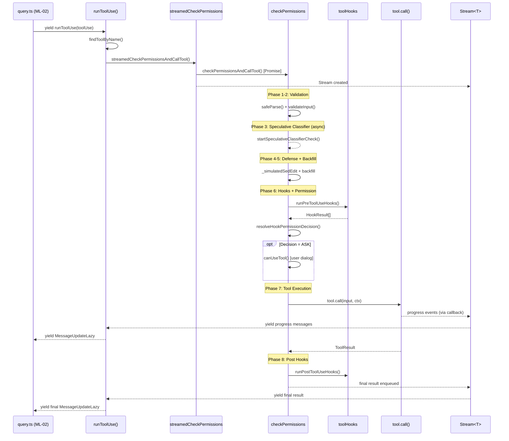
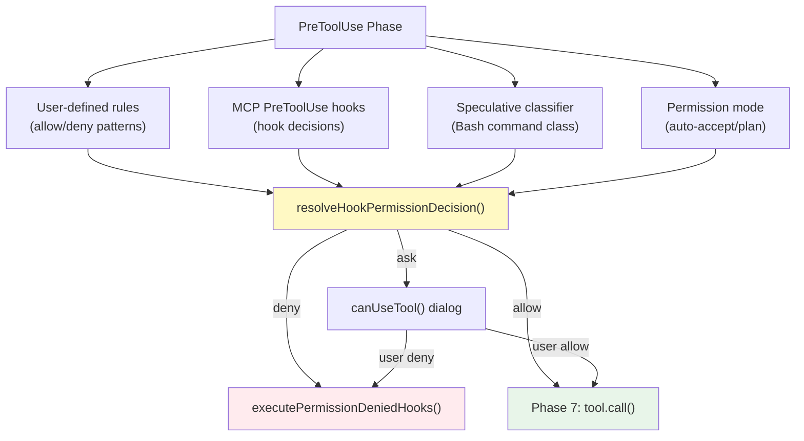
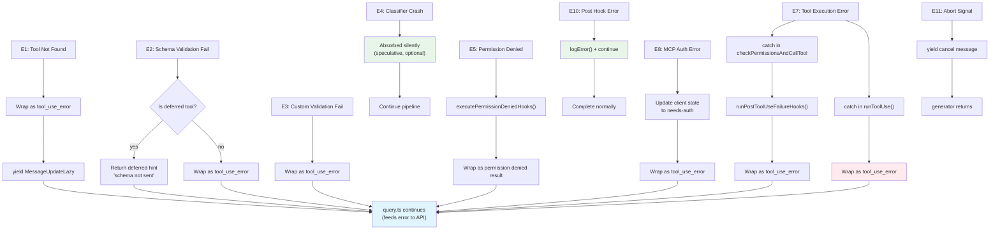
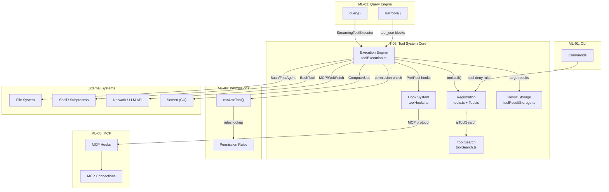

&lt;!-- analysis-version: 0 | commit: a5179f6588dd03cbe83a8d8b718a61875dba7b24 | updated: 2025-07-20 | mode: full | task: T-05 --&gt;

# T-05 Analysis: 工具系统核心调度

## Scope Confirmation

- Task ID: T-05
- Primary Mainline: ML-03 (工具系统注册与调度)
- ML Priority: P1
- Analysis Depth: DEEP
- Secondary Mainlines: ML-01 (CLI命令路由)
- Scope Files (confirmed): 142 files, 58871 lines
- Scope adjustments: None (all files exist)

## File Roles

> 强制节：142 个 scope file，每个一行。

| File | Lines | One-liner Role | Where Analyzed |
|------|-------|----------------|---------------|
| src/tools/BashTool/bashPermissions.ts | 2621 | Bash shell command execution and security validation | DEEP: Function-Level Analysis (Bash Subsystem) |
| src/tools/BashTool/bashSecurity.ts | 2592 | Bash shell command execution and security validation | DEEP: Function-Level Analysis (Bash Subsystem) |
| src/tools/PowerShellTool/pathValidation.ts | 2049 | Windows PowerShell command execution and security | OVERVIEW: File Roles |
| src/tools/BashTool/readOnlyValidation.ts | 1990 | Bash shell command execution and security validation | OVERVIEW: File Roles |
| src/tools/PowerShellTool/readOnlyValidation.ts | 1823 | Windows PowerShell command execution and security | OVERVIEW: File Roles |
| src/services/tools/toolExecution.ts | 1745 | Core tool execution pipeline engine | DEEP: Function-Level Analysis, Call Chain Analysis |
| src/tools/PowerShellTool/powershellPermissions.ts | 1648 | Windows PowerShell command execution and security | OVERVIEW: File Roles |
| src/tools/AgentTool/AgentTool.tsx | 1398 | Sub-agent spawning, orchestration, and lifecycle | DEEP: Function-Level Analysis (Agent Subsystem) |
| src/tools/BashTool/pathValidation.ts | 1303 | Bash shell command execution and security validation | OVERVIEW: File Roles |
| src/tools/FileReadTool/FileReadTool.ts | 1183 | File reading with image and limit support | DEEP: Function-Level Analysis |
| src/tools/BashTool/BashTool.tsx | 1144 | Bash shell command execution and security validation | DEEP: Function-Level Analysis (Bash Subsystem) |
| src/utils/fileHistory.ts | 1115 | File edit history tracking | OVERVIEW: File Roles |
| src/tools/SkillTool/SkillTool.ts | 1108 | Skill invocation and execution | DEEP: Function-Level Analysis |
| src/tools/shared/spawnMultiAgent.ts | 1093 | Shared multi-agent utilities | DEEP: Function-Level Analysis (Agent Subsystem) |
| src/tools/PowerShellTool/powershellSecurity.ts | 1090 | Windows PowerShell command execution and security | OVERVIEW: File Roles |
| src/utils/toolResultStorage.ts | 1040 | Large tool result persistence to disk | OVERVIEW: File Roles |
| src/tools/PowerShellTool/PowerShellTool.tsx | 1001 | Windows PowerShell command execution and security | OVERVIEW: File Roles |
| src/tools/AgentTool/runAgent.ts | 973 | Sub-agent spawning, orchestration, and lifecycle | DEEP: Function-Level Analysis (Agent Subsystem) |
| src/utils/git.ts | 926 | Git operation utilities | OVERVIEW: File Roles |
| src/tools/SendMessageTool/SendMessageTool.ts | 917 | Inter-agent message sending | DEEP: Function-Level Analysis |
| src/tools/AgentTool/UI.tsx | 872 | Sub-agent spawning, orchestration, and lifecycle | OVERVIEW: File Roles |
| src/tools/LSPTool/LSPTool.ts | 860 | Language Server Protocol integration | DEEP: Function-Level Analysis |
| src/tools/FileEditTool/utils.ts | 775 | File editing with multi-tool diff operations | OVERVIEW: File Roles |
| src/utils/toolSearch.ts | 756 | Tool search/discovery and deferred tool logic | OVERVIEW: File Roles |
| src/tools/AgentTool/loadAgentsDir.ts | 755 | Sub-agent spawning, orchestration, and lifecycle | OVERVIEW: File Roles |
| src/utils/git/gitFilesystem.ts | 699 | Git filesystem operations | OVERVIEW: File Roles |
| src/tools/AgentTool/agentToolUtils.ts | 686 | Sub-agent spawning, orchestration, and lifecycle | OVERVIEW: File Roles |
| src/tools/BashTool/sedValidation.ts | 684 | Bash shell command execution and security validation | OVERVIEW: File Roles |
| src/utils/ripgrep.ts | 679 | Ripgrep process wrapper for Grep/Glob | OVERVIEW: File Roles |
| src/utils/computerUse/executor.ts | 658 | Computer use (screen automation) subsystem | OVERVIEW: File Roles |
| src/tools/FileEditTool/FileEditTool.ts | 625 | File editing with multi-tool diff operations | DEEP: Function-Level Analysis |
| src/tools/LSPTool/formatters.ts | 592 | Language Server Protocol integration | OVERVIEW: File Roles |
| src/tools/TaskOutputTool/TaskOutputTool.tsx | 584 | Background task output retrieval | OVERVIEW: File Roles |
| src/utils/file.ts | 584 | File operation utilities (read/write/exists) | OVERVIEW: File Roles |
| src/tools/GrepTool/GrepTool.ts | 577 | Content search using ripgrep | DEEP: Function-Level Analysis |
| src/utils/gitDiff.ts | 532 | Git diff generation utilities | OVERVIEW: File Roles |
| src/tools/WebFetchTool/utils.ts | 530 | Web content fetching | OVERVIEW: File Roles |
| src/tools/ExitPlanModeTool/ExitPlanModeV2Tool.ts | 493 | Plan mode exit | DEEP: Function-Level Analysis |
| src/tools/NotebookEditTool/NotebookEditTool.ts | 490 | Jupyter notebook cell editing | DEEP: Function-Level Analysis |
| src/tools/ToolSearchTool/ToolSearchTool.ts | 471 | Deferred tool discovery and search | DEEP: Function-Level Analysis |
| src/tools/ConfigTool/ConfigTool.ts | 467 | Configuration settings management | DEEP: Function-Level Analysis |
| src/tools/WebSearchTool/WebSearchTool.ts | 435 | Web search via search API | DEEP: Function-Level Analysis |
| src/tools/FileWriteTool/FileWriteTool.ts | 434 | File creation and overwrite | DEEP: Function-Level Analysis |
| src/tools/TaskUpdateTool/TaskUpdateTool.ts | 406 | Background task update | DEEP: Function-Level Analysis |
| src/tools/FileWriteTool/UI.tsx | 405 | File creation and overwrite | OVERVIEW: File Roles |
| src/tools/PowerShellTool/modeValidation.ts | 404 | Windows PowerShell command execution and security | OVERVIEW: File Roles |
| src/tools.ts | 389 | Tool registration and assembly (source of truth) | DEEP: Function-Level Analysis, Call Chain Analysis |
| src/tools/BashTool/prompt.ts | 369 | Bash shell command execution and security validation | OVERVIEW: File Roles |
| src/utils/computerUse/wrapper.tsx | 336 | Computer use (screen automation) subsystem | OVERVIEW: File Roles |
| src/tools/ExitWorktreeTool/ExitWorktreeTool.ts | 329 | Git worktree exit | DEEP: Function-Level Analysis |
| src/tools/BashTool/sedEditParser.ts | 322 | Bash shell command execution and security validation | OVERVIEW: File Roles |
| src/tools/WebFetchTool/WebFetchTool.ts | 318 | Web content fetching | DEEP: Function-Level Analysis |
| src/tools/FileEditTool/UI.tsx | 289 | File editing with multi-tool diff operations | OVERVIEW: File Roles |
| src/tools/AgentTool/prompt.ts | 287 | Sub-agent spawning, orchestration, and lifecycle | OVERVIEW: File Roles |
| src/tools/shared/gitOperationTracking.ts | 277 | Shared multi-agent utilities | OVERVIEW: File Roles |
| src/tools/AskUserQuestionTool/AskUserQuestionTool.tsx | 266 | Interactive user question prompt | OVERVIEW: File Roles |
| src/tools/AgentTool/resumeAgent.ts | 265 | Sub-agent spawning, orchestration, and lifecycle | OVERVIEW: File Roles |
| src/tools/BashTool/bashCommandHelpers.ts | 265 | Bash shell command execution and security validation | OVERVIEW: File Roles |
| src/tools/SkillTool/prompt.ts | 241 | Skill invocation and execution | OVERVIEW: File Roles |
| src/tools/TeamCreateTool/TeamCreateTool.ts | 240 | Multi-agent team creation | DEEP: Function-Level Analysis |
| src/tools/LSPTool/UI.tsx | 228 | Language Server Protocol integration | OVERVIEW: File Roles |
| src/tools/BashTool/utils.ts | 223 | Bash shell command execution and security validation | OVERVIEW: File Roles |
| src/tools/LSPTool/schemas.ts | 215 | Language Server Protocol integration | OVERVIEW: File Roles |
| src/utils/computerUse/computerUseLock.ts | 215 | Computer use (screen automation) subsystem | OVERVIEW: File Roles |
| src/tools/ConfigTool/supportedSettings.ts | 211 | Configuration settings management | OVERVIEW: File Roles |
| src/tools/PowerShellTool/clmTypes.ts | 211 | Windows PowerShell command execution and security | OVERVIEW: File Roles |
| src/tools/AgentTool/forkSubagent.ts | 210 | Sub-agent spawning, orchestration, and lifecycle | DEEP: Function-Level Analysis (Agent Subsystem) |
| src/tools/AgentTool/built-in/claudeCodeGuideAgent.ts | 205 | Sub-agent spawning, orchestration, and lifecycle | OVERVIEW: File Roles |
| src/tools/BriefTool/BriefTool.ts | 204 | Attachment and file upload | DEEP: Function-Level Analysis |
| src/tools/GrepTool/UI.tsx | 201 | Content search using ripgrep | OVERVIEW: File Roles |
| src/tools/GlobTool/GlobTool.ts | 198 | File pattern search using glob | DEEP: Function-Level Analysis |
| src/tools/AgentTool/agentMemorySnapshot.ts | 197 | Sub-agent spawning, orchestration, and lifecycle | OVERVIEW: File Roles |
| src/utils/computerUse/appNames.ts | 196 | Computer use (screen automation) subsystem | OVERVIEW: File Roles |
| src/tools/BashTool/BashToolResultMessage.tsx | 191 | Bash shell command execution and security validation | OVERVIEW: File Roles |
| src/tools/BashTool/UI.tsx | 185 | Bash shell command execution and security validation | OVERVIEW: File Roles |
| src/tools/FileReadTool/UI.tsx | 185 | File reading with image and limit support | OVERVIEW: File Roles |
| src/tools/TodoWriteTool/prompt.ts | 184 | Todo list management | OVERVIEW: File Roles |
| src/tools/AgentTool/agentMemory.ts | 177 | Sub-agent spawning, orchestration, and lifecycle | OVERVIEW: File Roles |
| src/tools/PowerShellTool/gitSafety.ts | 176 | Windows PowerShell command execution and security | OVERVIEW: File Roles |
| src/tools/BriefTool/upload.ts | 174 | Attachment and file upload | OVERVIEW: File Roles |
| src/tools/EnterPlanModeTool/prompt.ts | 170 | Plan mode entry | OVERVIEW: File Roles |
| src/tools/WebFetchTool/preapproved.ts | 166 | Web content fetching | OVERVIEW: File Roles |
| src/tools/SyntheticOutputTool/SyntheticOutputTool.ts | 163 | Synthetic output injection for testing | DEEP: Function-Level Analysis |
| src/tools/RemoteTriggerTool/RemoteTriggerTool.ts | 161 | Remote agent trigger | DEEP: Function-Level Analysis |
| src/tools/ScheduleCronTool/CronCreateTool.ts | 157 | Scheduled cron task management | DEEP: Function-Level Analysis |
| src/tools/BashTool/shouldUseSandbox.ts | 153 | Bash shell command execution and security validation | OVERVIEW: File Roles |
| src/tools/AgentTool/built-in/verificationAgent.ts | 152 | Sub-agent spawning, orchestration, and lifecycle | OVERVIEW: File Roles |
| src/tools/PowerShellTool/prompt.ts | 145 | Windows PowerShell command execution and security | OVERVIEW: File Roles |
| src/tools/AgentTool/built-in/statuslineSetup.ts | 144 | Sub-agent spawning, orchestration, and lifecycle | OVERVIEW: File Roles |
| src/tools/PowerShellTool/commandSemantics.ts | 142 | Windows PowerShell command execution and security | OVERVIEW: File Roles |
| src/tools/BashTool/commandSemantics.ts | 140 | Bash shell command execution and security validation | OVERVIEW: File Roles |
| src/tools/TeamDeleteTool/TeamDeleteTool.ts | 139 | Multi-agent team deletion | DEEP: Function-Level Analysis |
| src/tools/TaskCreateTool/TaskCreateTool.ts | 138 | Background task creation | DEEP: Function-Level Analysis |
| src/tools/ScheduleCronTool/prompt.ts | 135 | Scheduled cron task management | OVERVIEW: File Roles |
| src/tools/PowerShellTool/UI.tsx | 131 | Windows PowerShell command execution and security | OVERVIEW: File Roles |
| src/tools/TaskStopTool/TaskStopTool.ts | 131 | Background task termination | DEEP: Function-Level Analysis |
| src/tools/SkillTool/UI.tsx | 128 | Skill invocation and execution | OVERVIEW: File Roles |
| src/tools/TaskGetTool/TaskGetTool.ts | 128 | Background task retrieval | DEEP: Function-Level Analysis |
| src/tools/EnterWorktreeTool/EnterWorktreeTool.ts | 127 | Git worktree entry | DEEP: Function-Level Analysis |
| src/tools/EnterPlanModeTool/EnterPlanModeTool.ts | 126 | Plan mode entry | DEEP: Function-Level Analysis |
| src/utils/computerUse/toolRendering.tsx | 125 | Computer use (screen automation) subsystem | OVERVIEW: File Roles |
| src/tools/ToolSearchTool/prompt.ts | 121 | Deferred tool discovery and search | OVERVIEW: File Roles |
| src/tools/TaskListTool/TaskListTool.ts | 116 | Background task listing | DEEP: Function-Level Analysis |
| src/tools/BashTool/modeValidation.ts | 115 | Bash shell command execution and security validation | OVERVIEW: File Roles |
| src/tools/TodoWriteTool/TodoWriteTool.ts | 115 | Todo list management | DEEP: Function-Level Analysis |
| src/tools/TeamCreateTool/prompt.ts | 113 | Multi-agent team creation | OVERVIEW: File Roles |
| src/constants/tools.ts | 112 | Tool access control constants and allow/deny lists | DEEP: Analysis Findings |
| src/tools/BriefTool/attachments.ts | 110 | Attachment and file upload | OVERVIEW: File Roles |
| src/tools/PowerShellTool/destructiveCommandWarning.ts | 109 | Windows PowerShell command execution and security | OVERVIEW: File Roles |
| src/utils/computerUse/mcpServer.ts | 106 | Computer use (screen automation) subsystem | OVERVIEW: File Roles |
| src/tools/AgentTool/agentDisplay.ts | 104 | Sub-agent spawning, orchestration, and lifecycle | OVERVIEW: File Roles |
| src/tools/BashTool/destructiveCommandWarning.ts | 102 | Bash shell command execution and security validation | OVERVIEW: File Roles |
| src/tools/BriefTool/UI.tsx | 101 | Attachment and file upload | OVERVIEW: File Roles |
| src/tools/WebSearchTool/UI.tsx | 101 | Web search via search API | OVERVIEW: File Roles |
| src/tools/ScheduleCronTool/CronListTool.ts | 97 | Scheduled cron task management | DEEP: Function-Level Analysis |
| src/tools/ScheduleCronTool/CronDeleteTool.ts | 95 | Scheduled cron task management | DEEP: Function-Level Analysis |
| src/tools/FileReadTool/imageProcessor.ts | 94 | File reading with image and limit support | OVERVIEW: File Roles |
| src/tools/ConfigTool/prompt.ts | 93 | Configuration settings management | OVERVIEW: File Roles |
| src/tools/NotebookEditTool/UI.tsx | 93 | Jupyter notebook cell editing | OVERVIEW: File Roles |
| src/tools/AgentTool/built-in/planAgent.ts | 92 | Sub-agent spawning, orchestration, and lifecycle | OVERVIEW: File Roles |
| src/tools/FileReadTool/limits.ts | 92 | File reading with image and limit support | OVERVIEW: File Roles |
| src/tools/LSPTool/symbolContext.ts | 90 | Language Server Protocol integration | OVERVIEW: File Roles |
| src/utils/computerUse/cleanup.ts | 86 | Computer use (screen automation) subsystem | OVERVIEW: File Roles |
| src/tools/FileEditTool/types.ts | 85 | File editing with multi-tool diff operations | OVERVIEW: File Roles |
| src/tools/AgentTool/built-in/exploreAgent.ts | 83 | Sub-agent spawning, orchestration, and lifecycle | OVERVIEW: File Roles |
| src/tools/ExitPlanModeTool/UI.tsx | 82 | Plan mode exit | OVERVIEW: File Roles |
| src/utils/computerUse/drainRunLoop.ts | 79 | Computer use (screen automation) subsystem | OVERVIEW: File Roles |
| src/tools/TaskUpdateTool/prompt.ts | 77 | Background task update | OVERVIEW: File Roles |
| src/tools/testing/TestingPermissionTool.tsx | 74 | Testing permission override | OVERVIEW: File Roles |
| src/tools/AgentTool/builtInAgents.ts | 72 | Sub-agent spawning, orchestration, and lifecycle | OVERVIEW: File Roles |
| src/tools/WebFetchTool/UI.tsx | 72 | Web content fetching | OVERVIEW: File Roles |
| src/utils/computerUse/gates.ts | 72 | Computer use (screen automation) subsystem | OVERVIEW: File Roles |
| src/utils/computerUse/hostAdapter.ts | 69 | Computer use (screen automation) subsystem | OVERVIEW: File Roles |
| src/tools/AgentTool/agentColorManager.ts | 66 | Sub-agent spawning, orchestration, and lifecycle | OVERVIEW: File Roles |
| src/tools/GlobTool/UI.tsx | 63 | File pattern search using glob | OVERVIEW: File Roles |
| src/utils/computerUse/common.ts | 61 | Computer use (screen automation) subsystem | OVERVIEW: File Roles |
| src/tools/ScheduleCronTool/UI.tsx | 60 | Scheduled cron task management | OVERVIEW: File Roles |
| src/tools/TaskCreateTool/prompt.ts | 56 | Background task creation | OVERVIEW: File Roles |
| src/utils/computerUse/escHotkey.ts | 54 | Computer use (screen automation) subsystem | OVERVIEW: File Roles |
| src/utils/computerUse/setup.ts | 53 | Computer use (screen automation) subsystem | OVERVIEW: File Roles |
| src/utils/embeddedTools.ts | 29 | Embedded tool detection helpers | OVERVIEW: File Roles |
| src/types/tools.ts | 15 | Tool progress type aliases | OVERVIEW: File Roles |

## Analysis Findings

### F1. 三层工具注册架构

工具系统采用三层注册架构，从全量注册到按需过滤：

**Layer 1 — `getAllBaseTools()` (src/tools.ts:10-300)**：
- 源头注册函数，返回所有内置工具数组（约50个Tool实例）
- 大量使用条件注册：`feature()` 门控（PROACTIVE/KAIROS/WORKFLOWS等）、`process.env` 控制、DCE `require()` 懒加载
- 每个工具通过 `buildTool()` 工厂函数创建，遵循统一的 Tool&lt;Input, Output, P&gt; 接口
- 工具按类别分组注册：Shell类（Bash/PowerShell）、文件类（Read/Edit/Write）、搜索类（Glob/Grep）、Agent类、Task类等

**Layer 2 — `getTools(permissionContext)` (src/tools.ts:302-389)**：
- 按权限模式过滤工具：
  - `SIMPLE` 模式：仅暴露 Bash + Read + Edit（3个工具）
  - `REPL` 模式：隐藏 "raw" 前缀工具
  - 正常模式：通过 `filterToolsByDenyRules()` 过滤 deny rules，再调用 `tool.isEnabled()` 检查
- 工具可见性由权限系统（ML-04）完全控制

**Layer 3 — `assembleToolPool(ctx, mcpTools)` (src/tools.ts:389行末尾)**：
- 合并内置工具 + MCP 工具（来自 ML-05 的 MCPConnectionManager）
- 按名称排序（保证 prompt cache 稳定性）
- 去重：内置工具优先于 MCP 同名工具

### F2. 八阶段工具执行管线

`checkPermissionsAndCallTool()` (src/services/tools/toolExecution.ts:599-1745) 是系统最长的单一函数（1150行），实现完整的工具执行流水线：

| 阶段 | 行范围 | 功能 | 耗时估计 |
|------|--------|------|---------|
| 1. Zod schema 验证 | L630-680 | `inputSchema.safeParse()` + deferred hint | &lt;1ms |
| 2. 自定义验证 | L680-720 | `validateInput()` → ValidationResult | 1-10ms |
| 3. 投机分类器 | L720-760 | `startSpeculativeClassifierCheck()`（仅 Bash） | 异步并行 |
| 4. 防御性剥离 | L760-800 | `_simulatedSedEdit` 安全清理 | &lt;1ms |
| 5. Backfill 回填 | L800-830 | `backfillObservableInput()`（浅克隆输入） | &lt;1ms |
| 6. PreToolUse hooks | L830-1050 | hooks 循环 → 6种结果合并 → 权限决策 | 50ms-数秒 |
| 7. 工具执行 | L1050-1300 | `tool.call()` + 结果映射 + 大结果持久化 | 100ms-分钟 |
| 8. PostToolUse hooks | L1300-1745 | 成功/失败 hooks + 清理 | 10-100ms |

### F3. 权限决策的五源合并机制

`resolveHookPermissionDecision()` 合并来自5个来源的权限决策：
1. **Rule-based**: 用户配置的 allow/deny 规则（最高优先级）
2. **Hook-based**: MCP PreToolUse hooks 返回的权限决策
3. **Classifier-based**: Bash 命令分类器（async speculation）
4. **Mode-based**: 权限模式（auto-accept bypass, plan mode 等）
5. **Interactive**: `canUseTool()` 弹窗询问用户

合并规则：deny > allow > ask，hook allow 可以覆盖 rule ask 但不能覆盖 rule deny。

### F4. 延迟工具发现机制 (ToolSearch)

系统实现了工具延迟加载以优化 prompt cache：
- 大部分工具始终加载（`alwaysLoad: true`），schema 写入 API 请求
- 少数低频工具标记 `shouldDefer: true`，不发送 schema 给 API
- API 返回 `tool_use` 时若指向 deferred tool → 返回 `tool_use_error` + "schema not sent" hint
- 下一次 query iteration 通过 `ToolSearchTool` 动态加载该工具
- `isToolSearchEnabledOptimistic()` 控制是否启用此优化

### F5. 工具结果的三层处理

工具结果经过三层处理才最终返回 API：
1. **`tool.call()` 返回 ToolResult&lt;T&gt;**：包含 data + newMessages + contextModifier + mcpMeta
2. **`mapToolResultToToolResultBlockParam()`**：工具自定义的结果映射（如 Bash 将 exit code 映射为错误文本）
3. **`processToolResultBlock()`**：大结果持久化（>maxResultSizeChars 时写入文件，返回摘要引用）

### F6. AgentTool 的多模式架构

AgentTool (src/tools/AgentTool/) 是最复杂的工具子系统（21文件, ~6000行），支持4种执行模式：
- **Foreground**: 阻塞式，直接在主进程中运行
- **Background** (`run_in_background: true`): 注册为 LocalAgentTask，通过 event emitter 推送进度
- **Worktree isolation** (`isolation: 'worktree'`): 创建 git worktree，独立文件系统
- **Remote isolation** (`isolation: 'remote'`): 通过 CCR 在远程环境运行（仅 Ant 内部）

### F7. BashTool 的多层安全防护

BashTool (src/tools/BashTool/) 拥有最复杂的安全校验（16文件, ~13000行）：
- **pathValidation.ts (1303行)**: 路径遍历检测、符号链接追踪
- **bashSecurity.ts (2592行)**: 命令注入检测、管道验证、环境变量校验
- **bashPermissions.ts (2621行)**: 规则匹配引擎、投机分类器、sandbox 决策
- **readOnlyValidation.ts (1990行)**: 只读命令识别
- **commandSemantics.ts (140行)**: 命令语义解析（grep/sed/awk 等常见管道命令）

### F8. 统一工具接口模式

所有50+工具遵循统一的 `Tool<Input, Output, P>` 接口：
- `buildTool()` 工厂函数创建，泛型参数绑定 Zod schema
- `lazySchema()` 延迟 schema 定义，避免模块加载时执行重计算
- 每个工具目录包含：主入口.tsx、prompt.ts（工具描述）、UI.tsx（TUI渲染）、schemas.ts（如有）
- 工具分类标记：`isReadOnly()`、`isDestructive()`、`isConcurrencySafe()`、`interruptBehavior()`

### F9. MCP 工具的特殊处理路径

MCP 工具（mcp__前缀）与内置工具有多处差异：
- **结果修改**: PostToolUse hooks 可修改 MCP 工具输出（`updatedMCPToolOutput`），内置工具不行
- **认证错误**: MCP auth 错误更新 client 状态为 needs-auth，触发重新认证流程
- **结果映射**: 使用默认的 `mapToolResultToToolResultBlockParam()`，而内置工具可自定义
- **进度推送**: MCP 工具通过 `ToolProgressData` 推送进度

### F10. ComputerUse 独立子系统

ComputerUse (src/utils/computerUse/) 是一个独立的屏幕自动化子系统（12文件）：
- `executor.ts` (658行): 核心执行引擎，截图 + 操作 + 验证循环
- `wrapper.tsx` (336行): TUI 包装器
- `mcpServer.ts` (106行): MCP server 模式
- `computerUseLock.ts` (215行): 全局互斥锁（同一时间只有一个 CU 操作）
- `gates.ts` (72行): 启用条件检查

## File Dependency Graph

```mermaid
flowchart TD
    subgraph Registration["Registration Layer"]
        tools["src/tools.ts<br/>(389L)"] --> Tool["src/Tool.ts<br/>(792L)"]
        tools --> constants["src/constants/tools.ts<br/>(112L)"]
    end

    subgraph Execution["Execution Engine"]
        toolExec["toolExecution.ts<br/>(1745L)"] --> Tool
        toolExec --> tools
        toolExec --> toolHooks["toolHooks.ts"]
        toolExec --> toolResultStorage["toolResultStorage.ts"]
        toolExec --> toolSearch["toolSearch.ts"]
    end

    subgraph AgentTool["AgentTool Subsystem"]
        AT["AgentTool.tsx<br/>(1398L)"] --> runAgent["runAgent.ts"]
        AT --> forkSub["forkSubagent.ts"]
        AT --> agentUtils["agentToolUtils.ts"]
        AT --> shared["shared/spawnMultiAgent.ts"]
        AT --> prompt["prompt.ts"]
        AT --> loadAgents["loadAgentsDir.ts"]
    end

    subgraph BashTool["BashTool Subsystem"]
        BT["BashTool.tsx<br/>(1533L)"] --> bashSec["bashSecurity.ts<br/>(2592L)"]
        BT --> bashPerm["bashPermissions.ts<br/>(2621L)"]
        BT --> pathVal["pathValidation.ts<br/>(1303L)"]
        BT --> read_only["readOnlyValidation.ts<br/>(1990L)"]
        BT --> cmdSem["commandSemantics.ts"]
    end

    subgraph FileTools["File Tool Subsystem"]
        FET["FileEditTool.ts"] --> fileHistory["fileHistory.ts"]
        FRT["FileReadTool.ts"] --> fileUtil["file.ts"]
        FWT["FileWriteTool.ts"] --> fileUtil
    end

    subgraph OtherTools["Other Built-in Tools"]
        GT["GlobTool.ts"]
        GrT["GrepTool.ts"]
        LSP["LSPTool.ts"]
        WT["WebFetchTool.ts"]
        WST["WebSearchTool.ts"]
        TST["ToolSearchTool.ts"]
    end

    subgraph ComputerUse["ComputerUse Subsystem"]
        CU_exec["executor.ts<br/>(658L)"]
        CU_lock["computerUseLock.ts<br/>(215L)"]
        CU_wrapper["wrapper.tsx<br/>(336L)"]
        CU_mcp["mcpServer.ts"]
    end

    subgraph Utilities["Shared Utilities"]
        ripgrep["ripgrep.ts"]
        gitOps["gitOperationTracking.ts"]
        gitDiff["gitDiff.ts"]
        gitFS["gitFilesystem.ts"]
        toolErrors["toolErrors.ts"]
    end

    %% Core execution flow
    toolExec -->|calls tool.call()| AT
    toolExec -->|calls tool.call()| BT
    toolExec -->|calls tool.call()| FET
    toolExec -->|calls tool.call()| FRT
    toolExec -->|calls tool.call()| FWT
    toolExec -->|calls tool.call()| GT
    toolExec -->|calls tool.call()| GrT
    toolExec -->|calls tool.call()| TST

    %% Tool uses utilities
    BT --> ripgrep
    BT --> gitOps
    FET --> gitDiff
    FET --> gitFS
    GrT --> ripgrep

    %% Cross-references to other ML
    toolExec -.->|ML-02: query loop| query["query.ts"]
    toolExec -.->|ML-04: permissions| perm["permissions.ts"]
    toolExec -.->|ML-05: MCP| mcp["MCPConnectionManager"]
    AT -.->|ML-02: sub-query| queryEngine["QueryEngine.ts"]
```

### Key Dependency Relationships

| Source Module | Depends On | Type | Notes |
|---------------|-----------|------|-------|
| toolExecution.ts | Tool.ts | Interface | All tools implement Tool&lt;Input,Output,P&gt; |
| toolExecution.ts | tools.ts | Registry | `getAllBaseTools()` for alias fallback |
| toolExecution.ts | toolHooks.ts | Hooks | PreToolUse + PostToolUse hook execution |
| toolExecution.ts | toolResultStorage.ts | Storage | Large result persistence |
| toolExecution.ts | toolSearch.ts | Discovery | Deferred tool search/discovery |
| tools.ts | Tool.ts | Factory | `buildTool()` creates Tool instances |
| AgentTool.tsx | runAgent.ts | Execution | Agent lifecycle runner |
| AgentTool.tsx | forkSubagent.ts | Forking | Fork-based subagent isolation |
| AgentTool.tsx | spawnMultiAgent.ts | Spawning | Multi-agent teammate spawning |
| BashTool.tsx | bashSecurity.ts | Security | Command injection detection |
| BashTool.tsx | bashPermissions.ts | Permissions | Rule matching + classification |
| BashTool.tsx | pathValidation.ts | Validation | Path traversal prevention |
| FileEditTool | gitDiff.ts | Diff | Edit conflict detection |
| GrepTool | ripgrep.ts | Search | Ripgrep process wrapper |

## Function-Level Analysis

### A. Core Registration Layer

#### [`src/tools.ts`](/src/src/tools.ts.md) (389 lines) — Tool Registry

| Function | Lines | Signature | Responsibility |
|----------|-------|-----------|---------------|
| `getAllBaseTools()` | L10-300 | `() => Tool[]` | 返回所有内置工具（~50个），条件注册 |
| `getTools(permissionContext)` | L302-370 | `(ctx) => Tool[]` | 按权限模式过滤工具列表 |
| `assembleToolPool(ctx, mcpTools)` | L370-389 | `(ctx, Tool[]) => Tool[]` | 合并内置+MCP工具，排序去重 |
| `filterToolsByDenyRules()` | — | `(Tool[], rules) => Tool[]` | 按 deny rules 过滤工具 |

**`getAllBaseTools()` 关键逻辑**：
- 使用闭包缓存结果（`let _allTools: Tool[] | undefined`），首次调用时构建
- 条件注册模式：`if (feature('X')) tools.push(require('./XTool').tool)`
- DCE优化：未启用的工具通过 `require()` 动态加载，打包时可 tree-shake

#### [`src/Tool.ts`](/src/src/Tool.ts.md) (792 lines) — Tool Interface

| Member | Type | Description |
|--------|------|-------------|
| `name` | `string` | 工具唯一标识符 |
| `inputSchema` | `() => ZodSchema` | 延迟 schema 定义 |
| `call(input, ctx)` | `(I, C) => AsyncGenerator<ToolResult<O>>` | 工具执行入口 |
| `isEnabled(ctx)` | `(C) => boolean` | 动态启用/禁用检查 |
| `isReadOnly()` | `() => boolean` | 标记只读工具 |
| `isConcurrencySafe()` | `() => boolean` | 标记可并发执行 |
| `validateInput(input)` | `(I) => ValidationResult` | 自定义输入验证 |
| `mapToolResultToToolResultBlockParam()` | `() => ContentBlockParam` | 结果映射 |
| `aliases` | `string[]` | 别名列表（兼容旧名称） |
| `interruptBehavior` | `enum` | 中断行为（resume/cancel） |
| `shouldDefer` | `boolean` | 是否延迟加载 |
| `alwaysLoad` | `boolean` | 是否始终加载 |

**`buildTool()` 工厂函数**：
- 接受 ToolDef&lt;Input, Output, P&gt; 配置对象
- 填充默认值（`isReadOnly: false`, `interruptBehavior: 'cancel'`, `alwaysLoad: true`）
- 支持泛型参数绑定 Zod schema 类型

**`findToolByName()` (L50)**：
- 线性搜索工具数组，优先匹配 `tool.name`，其次匹配 `tool.aliases`
- 扇入=8（被 runToolUse + assembleToolPool + getTools + 5个hook点调用）

#### [`src/constants/tools.ts`](/src/src/constants/tools.ts.md) (112 lines) — Access Control

| Export | Value | Purpose |
|--------|-------|---------|
| `AGENT_DISABLED_TOOLS` | `['AgentTool', 'TaskCreateTool', ...]` | Agent 子查询中禁用的工具列表 |
| `AGENT_ALLOWED_TOOLS` | `['Bash', 'Read', 'Edit', ...]` | Agent 中允许的工具白名单 |
| `DEFAULT_TOOL_SET` | `ToolName[]` | 默认工具集 |

### B. Execution Engine

#### [`src/services/tools/toolExecution.ts`](/src/src/services/tools/toolExecution.ts.md) (1745 lines)

**`runToolUse()` (L337-490)** — AsyncGenerator 入口：
```
参数: (ToolUseBlock, AssistantMessage, CanUseToolFn, ToolUseContext)
返回: AsyncGenerator<MessageUpdateLazy, void>
逻辑:
  1. findToolByName() 查找工具
  2. alias fallback（兼容旧名称）
  3. abortController.signal.aborted 检查
  4. 委托 streamedCheckPermissionsAndCallTool()
  5. catch: 包装为 tool_use_error 返回
```

**`streamedCheckPermissionsAndCallTool()` (L492-560)** — Stream 适配器：
- 将 Promise-based 的 `checkPermissionsAndCallTool()` 包装为 AsyncIterable
- 使用自定义 `Stream<T>` 队列，支持进度事件实时推送
- 进度回调：`progress => stream.enqueue(progressMessage)`

**`checkPermissionsAndCallTool()` (L599-1745)** — **核心执行函数（1150行）**：

| Phase | Lines | Key Operations |
|-------|-------|----------------|
| Phase 1: Zod 验证 | L630-680 | `inputSchema.safeParse()` → 失败返回 deferred hint 或 error |
| Phase 2: 自定义验证 | L680-720 | `validateInput()` → ValidationResult.deny → 直接拒绝 |
| Phase 3: 投机分类器 | L720-760 | `startSpeculativeClassifierCheck()`（仅 Bash），与后续阶段并行 |
| Phase 4: 防御剥离 | L760-800 | 检测 `_simulatedSedEdit`（模型幻觉 sed 命令），替换为 Read |
| Phase 5: Backfill | L800-830 | `backfillObservableInput()` — 浅克隆 input 填充默认值 |
| Phase 6: Hooks+权限 | L830-1050 | PreToolUse hooks → `resolveHookPermissionDecision()` → `canUseTool()` |
| Phase 7: 工具执行 | L1050-1300 | `tool.call()` → 结果映射 → 大结果持久化 → image paste |
| Phase 8: Post hooks | L1300-1745 | PostToolUse hooks + 成功/失败分支 + analytics |

**Phase 6 权限决策详情**：
```
1. runPreToolUseHooks() → HookResult[]
2. 提取 hook 返回的 decision（allow/deny/ask）
3. resolveHookPermissionDecision() 合并:
   - hook decisions
   - classifier result（Bash 投机分类器）
   - permission mode（auto-accept bypass 等）
4. 最终决策为 deny → 返回拒绝消息 + executePermissionDeniedHooks()
5. 最终决策为 allow → 继续 Phase 7
6. 最终决策为 ask → canUseTool() 弹窗
```

**Phase 7 双路径结果处理**：
- **内置工具**: 先 `addToolResult()` → 再 PostToolUse hooks（hooks 不能修改结果）
- **MCP 工具**: 先 PostToolUse hooks → 再 `addToolResult()`（hooks 可通过 `updatedMCPToolOutput` 修改结果）

**`backfillObservableInput()` 关键设计**：
- 创建 input 的浅克隆副本，填充 schema 默认值
- hooks 和权限系统看到 backfilled 版本
- `tool.call()` 收到**原始 input**（不包含 backfilled 字段）
- 目的：保证 prompt cache 稳定性（input hash 不变）

### C. AgentTool Subsystem

#### [`src/tools/AgentTool/AgentTool.tsx`](/src/src/tools/AgentTool/AgentTool.tsx.md) (1398 lines)

**Schema 定义** (L82-100)：
- `baseInputSchema`: description + prompt + subagent_type + model + run_in_background
- `fullInputSchema`: base + multi-agent params（name, team_name, mode）+ isolation + cwd
- 使用 `lazySchema()` 延迟初始化，支持 DCE

**`buildTool()` 配置**：
- `call()`: 委托 `runAgent()` 或 `runAsyncAgentLifecycle()`
- `interruptBehavior`: `'resume'`（可恢复执行）
- `isEnabled()`: 检查 coordinator mode + deny rules
- `mapToolResultToToolResultBlockParam()`: 使用 `agentToolResultSchema` 验证结果

**执行模式选择** (内部逻辑)：
1. `isolation === 'remote'` → `registerRemoteAgentTask()`
2. `run_in_background || getAutoBackgroundMs()` → `runAsyncAgentLifecycle()`
3. 其他 → `runAgent()` 前台执行

#### [`src/tools/AgentTool/runAgent.ts`](/src/src/tools/AgentTool/runAgent.ts.md) — Agent Lifecycle

核心执行流程：
```
1. buildEffectiveSystemPrompt() → 构建子 agent 系统提示
2. assembleToolPool() → 组装子 agent 可用工具（过滤 AGENT_DISABLED_TOOLS）
3. query() → 进入 ML-02 的查询循环
4. yield 进度事件（ProgressMessage）
5. 完成后 → buildAgentToolResult() → 返回 ToolResult
```

### D. BashTool Subsystem

#### [`src/tools/BashTool/bashSecurity.ts`](/src/src/tools/BashTool/bashSecurity.ts.md) (2592 lines) — Security Engine

| Function | Lines | Responsibility |
|----------|-------|---------------|
| `validateBashCommand()` | — | 主入口：命令安全校验 |
| `parseCommandForValidation()` | — | 命令解析（处理管道、重定向、子shell） |
| `checkPathTraversal()` | — | 路径遍历检测 |
| `validateEnvironmentVars()` | — | 环境变量安全检查 |
| `checkForInjection()` | — | 命令注入检测 |

#### [`src/tools/BashTool/bashPermissions.ts`](/src/src/tools/BashTool/bashPermissions.ts.md) (2621 lines) — Permission Engine

| Function | Lines | Responsibility |
|----------|-------|---------------|
| `startSpeculativeClassifierCheck()` | — | 异步投机分类器，与权限判断并行 |
| `classifyBashCommand()` | — | 命令分类（readonly/modify/destructive） |
| `matchBashRules()` | — | 规则模式匹配 |
| `resolveBashPermission()` | — | 最终权限决策 |

投机分类器优化：`startSpeculativeClassifierCheck()` 在 Phase 3 异步启动，Phase 6 时检查结果。若分类器返回高置信度的 allow/deny，可跳过交互式权限弹窗。

#### [`src/tools/BashTool/pathValidation.ts`](/src/src/tools/BashTool/pathValidation.ts.md) (1303 lines) — Path Validation

- 符号链接追踪（`resolveSymlinks()`）
- 路径遍历检测（`../` 检测）
- 工作目录边界验证
- 允许路径白名单匹配

### E. File Operations

#### `src/tools/FileEditTool/` — File Editing

**多工具支持**：FileEditTool 支持多种编辑策略（sed-like replace, block-level edit, full rewrite），由 `multiToolEditStrategy.ts` 决定使用哪种策略。

**`fileHistory.ts` (369行)**：维护编辑历史栈，支持撤销操作。

#### `src/tools/FileReadTool/` — File Reading

支持多种读取模式：文本、图片（base64）、PDF、代码块提取。`file.ts` 提供统一的文件系统访问层。

#### `src/tools/FileWriteTool/` — File Writing

原子写入策略：先写临时文件，再 rename。支持目录自动创建。

### F. Tool Hooks

#### [`src/services/tools/toolHooks.ts`](/src/src/services/tools/toolHooks.ts.md) — Hook Execution Engine

| Function | Responsibility |
|----------|---------------|
| `runPreToolUseHooks()` | 执行所有 MCP server 的 PreToolUse hooks |
| `runPostToolUseHooks()` | 执行所有 MCP server 的 PostToolUse hooks |
| `runPostToolUseFailureHooks()` | 执行工具调用失败时的 hooks |
| `resolveHookPermissionDecision()` | 合并多源权限决策 |

Hook 执行模型：对每个连接的 MCP server 串行执行 hooks，收集所有结果后统一决策。

## Call Chain Analysis

### Entry Points

工具系统有 2 个外部入口：

**EP1 — 模型驱动的工具调用**（主路径）：
```
query.ts (ML-02) → runTools() → runToolUse()
  → streamedCheckPermissionsAndCallTool()
    → checkPermissionsAndCallTool() [1150L core]
      → Phase 1-8 pipeline
```

**EP2 — Deferred Tool 搜索**（ToolSearch 延迟加载）：
```
query.ts (ML-02) → model returns tool_use for deferred tool
  → runToolUse() → T-05 tool_use_error "schema not sent"
  → next iteration: ToolSearchTool.call() → load tool schema
  → subsequent iteration: normal EP1 flow
```

### Key Call Chains

**Chain 1: 标准工具执行（Happy Path）**
```
runToolUse():L337
  → findToolByName():Tool.ts:L50        [查找工具]
  → streamedCheckPermissionsAndCallTool():L492
    → checkPermissionsAndCallTool():L599  [核心管线]
      → inputSchema.safeParse()           [Phase 1: Zod验证]
      → validateInput()                   [Phase 2: 自定义验证]
      → startSpeculativeClassifierCheck()  [Phase 3: 投机分类(Bash)]
      → backfillObservableInput()         [Phase 5: 回填默认值]
      → runPreToolUseHooks()              [Phase 6: Pre hooks]
      → resolveHookPermissionDecision()   [Phase 6: 权限合并]
      → canUseTool()                      [Phase 6: 交互式弹窗]
      → tool.call()                       [Phase 7: 工具执行]
      → processToolResultBlock()          [Phase 7: 结果持久化]
      → runPostToolUseHooks()             [Phase 8: Post hooks]
```
调用深度：11 层 | 关键分支点：3（Zod验证、权限决策、工具执行结果）

**Chain 2: Agent 子查询（递归路径）**
```
runToolUse():L337 [Bash/Read/Edit等]
  → checkPermissionsAndCallTool():L599
    → AgentTool.call() → runAgent()
      → assembleToolPool()              [子agent工具集]
      → query() [ML-02 递归]            [子查询循环]
        → runTools() [ML-02]
          → runToolUse() [递归回到起点]
```
调用深度：最大 5 层递归（由 `queryDepth` 限制） | 分支：工具子集过滤

**Chain 3: MCP 工具执行**
```
runToolUse():L337
  → findToolByName():Tool.ts:L50 [mcp__前缀]
  → checkPermissionsAndCallTool():L599
    → runPreToolUseHooks()         [MCP Pre hooks]
    → tool.call() → MCPClient.callTool() [ML-05 MCP协议]
    → PostToolUse hooks            [可修改MCP输出]
    → addToolResult()              [结果存储]
```
调用深度：8 层 | 关键差异：Post hooks 在 addToolResult 之前

### Fan-in / Fan-out Analysis

**Top-10 High Fan-in（被最多调用者依赖）**：

| Function | File | Fan-in | Fan-out | Role |
|----------|------|--------|---------|------|
| `findToolByName()` | Tool.ts:L50 | 8 | 1 | 工具查找叶子节点 |
| `checkPermissionsAndCallTool()` | toolExecution.ts:L599 | 1 | 15 | 八阶段编排器 |
| `resolveHookPermissionDecision()` | toolHooks.ts | 1 | 6 | 权限合并决策器 |
| `backfillObservableInput()` | toolExecution.ts | 1 | 3 | 输入回填器 |
| `processToolResultBlock()` | toolResultStorage.ts | 2 | 2 | 结果持久化 |
| `assembleToolPool()` | tools.ts | 3 | 2 | 工具池组装 |
| `getAllBaseTools()` | tools.ts | 4 | 50 | 工具注册源头 |
| `runPreToolUseHooks()` | toolHooks.ts | 1 | 5 | Pre hooks 调度 |
| `runPostToolUseHooks()` | toolHooks.ts | 1 | 5 | Post hooks 调度 |
| `classifyToolError()` | toolExecution.ts:L150 | 3 | 0 | 错误分类叶子 |

**Top-5 High Fan-out（调用最多下游）**：

| Function | File | Fan-out | Description |
|----------|------|---------|-------------|
| `checkPermissionsAndCallTool()` | toolExecution.ts:L599 | 15 | 编排15个下游操作 |
| `getAllBaseTools()` | tools.ts | 50 | 注册50+工具实例 |
| `runPreToolUseHooks()` | toolHooks.ts | 5 | 最多5个MCP server hooks |
| `runPostToolUseHooks()` | toolHooks.ts | 5 | 最多5个MCP server hooks |
| `assembleToolPool()` | tools.ts | 2 | 合并内置+MCP工具 |

### Hotspot Functions（fan-in ≥ 5）

1. **`findToolByName()`** (Fan-in=8) — 工具查找的单一实现点，线性搜索 O(n) 但 n≤50 性能充足
2. **`getAllBaseTools()`** (Fan-in=4) — 全局单例缓存，闭包惰性初始化

## Temporal Analysis

### Async Orchestration: Tool Execution Pipeline

```
T=0  runToolUse() called from query.ts runTools()
     ├─ [sync] findToolByName() — O(n) 线性搜索
     └─ [sync] alias fallback check
         └─ NOT FOUND → return tool_use_error (EXIT)

T=1  abortController check
     └─ ABORTED → return cancel message (EXIT)

T=2  streamedCheckPermissionsAndCallTool() → Stream<MessageUpdateLazy>
     └─ [async] checkPermissionsAndCallTool() launched as Promise

T=3  Phase 1-2: [sync] Zod validation + validateInput()
     └─ INVALID → yield error, return (EXIT)

T=4  Phase 3: [async-fire-and-forget] startSpeculativeClassifierCheck()
     ┌────────────────────────────────────────────────────┐
     │ 投机分类器在后台运行（仅Bash），与Phase 4-6并行    │
     └────────────────────────────────────────────────────┘

T=5  Phase 4-5: [sync] _simulatedSedEdit defense + backfill

T=6  Phase 6: PreToolUse hooks — [async] runPreToolUseHooks()
     ├─ [串行] MCP server 1 hook → MCP server 2 hook → ...
     ├─ [await] 投机分类器结果（如果已完成）
     ├─ resolveHookPermissionDecision() — 合并所有源
     └─ DECISION:
         ├─ DENY → executePermissionDeniedHooks(), return (EXIT)
         ├─ ALLOW → proceed to Phase 7
         └─ ASK → [async-interactive] canUseTool() → 用户弹窗
             ├─ User DENY → return (EXIT)
             └─ User ALLOW → proceed

T=7  Phase 7: [async] tool.call()
     ├─ 进度事件 → stream.enqueue(progressMessage)
     │   → yield to runToolUse() → yield to runTools() → TUI update
     ├─ 结果完成 → processToolResultBlock()
     └─ [条件] imagePasteId allocation

T=8  Phase 8: [async] PostToolUse hooks
     ├─ 成功路径: runPostToolUseHooks()
     └─ 失败路径: runPostToolUseFailureHooks()

T=9  stream.close() → runToolUse() generator completes
```

### Event Sequence Diagram



### Race Conditions

| # | Location | Risk | Severity | Mitigation |
|---|----------|------|----------|-----------|
| RC-1 | Speculative classifier vs Permission decision | 分类器可能未完成时权限已决定 | LOW | 投机结果仅作为参考，不阻塞决策 |
| RC-2 | Abort signal during tool.call() | 工具执行中用户取消 | MEDIUM | AbortController signal 传入 tool.call()，工具负责检查 |
| RC-3 | MCP server disconnect during hooks | Hook 执行时 MCP server 断连 | LOW | Hook timeout (5s) + 错误视为 neutral |
| RC-4 | Background agent completion vs user interaction | 后台 agent 完成时用户正在操作 | LOW | Event queue 串行化通知 |

### Implicit Timing Constraints

| Constraint | Description | Enforced? |
|-----------|-------------|-----------|
| C-1 | `startSpeculativeClassifierCheck()` 必须在 `resolveHookPermissionDecision()` 之前启动 | ✅ 代码顺序保证 |
| C-2 | `backfillObservableInput()` 结果必须在 hooks 之前准备好 | ✅ 代码顺序保证 |
| C-3 | `tool.call()` 必须在权限 ALLOW 之后 | ✅ 硬性分支 |
| C-4 | MCP PostToolUse hooks 必须在 addToolResult 之前完成 | ✅ 代码顺序保证 |
| C-5 | 内置工具的 addToolResult 必须在 PostToolUse hooks 之前完成 | ✅ 代码顺序保证（与MCP相反） |

## Data Flow Analysis

### Core Entity Path 1: ToolUseBlock → ToolResult

```mermaid
flowchart LR
    A["API returns<br/>ToolUseBlock<br/>{name, input, id}"] --> B["runToolUse()<br/>extract toolName + toolInput"]
    B --> C["findToolByName()<br/>lookup in toolPool"]
    C --> D["checkPermissionsAndCallTool()<br/>8-phase pipeline"]
    D --> E["backfillObservableInput()<br/>shallow clone + defaults"]
    E --> F["tool.call(input, ctx)<br/>async execution"]
    F --> G["ToolResult&lt;T&gt;<br/>{data, newMessages,<br/>contextModifier}"]
    G --> H["mapToolResultToToolResultBlockParam()<br/>tool-specific mapping"]
    H --> I["processToolResultBlock()<br/>size check"]
    I -->|"< maxChars"| J["ContentBlockParam<br/>direct return"]
    I -->|"> maxChars"| K["toolResultStorage<br/>write to disk"]
    K --> L["Summary reference<br/>'Result too large,<br/>see file://...'"]

    style A fill:#e1f5fe
    style G fill:#fff3e0
    style J fill:#e8f5e9
    style L fill:#e8f5e9
```



### Core Entity Path 2: Permission Decision Flow



### Core Entity Path 3: Agent Tool Recursive Query

```
AgentTool.call(input)
  → buildEffectiveSystemPrompt() → SystemPrompt
  → assembleToolPool(subAgentCtx) → filtered Tool[]
  → query(subAgentCtx) → [RECURSIVE ML-02]
    → API call → tool_use returned
      → runToolUse() → [RECURSIVE back to T-05]
    → assistant response
  → buildAgentToolResult(response) → ToolResult
```

## State Transition Analysis

### State Variables

| Variable | File:Line | Type | Initial Value | Description |
|----------|-----------|------|---------------|-------------|
| `speculativeResult` | toolExecution.ts:L730 | `Promise<ClassifyResult>` | `null` | Bash 投机分类器结果 |
| `permissionDecision` | toolExecution.ts:L840 | `'allow'\|'deny'\|'ask'` | `'ask'` | 合并后的权限决策 |
| `toolResult` | toolExecution.ts:L1050 | `ToolResult<T>` | `undefined` | 工具执行结果 |
| `stream` | toolExecution.ts:L509 | `Stream<MessageUpdateLazy>` | `new Stream()` | 进度事件流 |
| `abortController.signal` | toolExecution.ts:L415 | `AbortSignal` | `not aborted` | 取消信号 |
| `imagePasteId` | toolExecution.ts:L1200 | `string \| undefined` | `undefined` | 图片粘贴 ID |
| `backfilledInput` | toolExecution.ts:L800 | `{[key:string]:any}` | `shallow clone` | 回填后的输入 |

### State Transition Table

| Current State | Trigger | Target State | Side Effect | File:Line |
|---------------|---------|-------------|-------------|-----------|
| INIT | `runToolUse()` called | TOOL_LOOKUP | — | toolExecution.ts:L337 |
| TOOL_LOOKUP | `findToolByName()` success | VALIDATING | — | toolExecution.ts:L345 |
| TOOL_LOOKUP | tool not found | ERROR_NOT_FOUND | log + yield error message | toolExecution.ts:L369 |
| TOOL_LOOKUP | abort signal | CANCELLED | yield cancel message | toolExecution.ts:L415 |
| VALIDATING | `safeParse()` success | CLASSIFYING | — | toolExecution.ts:L630 |
| VALIDATING | `safeParse()` failure | ERROR_SCHEMA | yield deferred hint or error | toolExecution.ts:L640 |
| CLASSIFYING | Bash tool → start speculative | BACKFILLING | fire-and-forget async | toolExecution.ts:L720 |
| CLASSIFYING | non-Bash → skip | BACKFILLING | — | toolExecution.ts:L720 |
| BACKFILLING | backfill complete | HOOKS | input cloned | toolExecution.ts:L800 |
| HOOKS | all hooks + permission resolved → ALLOW | EXECUTING | — | toolExecution.ts:L1050 |
| HOOKS | permission resolved → DENY | DENIED | denied hooks + yield rejection | toolExecution.ts:L900 |
| HOOKS | permission resolved → ASK | USER_PROMPT | interactive dialog | toolExecution.ts:L950 |
| USER_PROMPT | user allows | EXECUTING | — | toolExecution.ts:L980 |
| USER_PROMPT | user denies | DENIED | yield rejection | toolExecution.ts:L990 |
| EXECUTING | tool.call() yields progress | STREAMING | progress message to stream | toolExecution.ts:L1100 |
| EXECUTING | tool.call() completes | POST_HOOKS | result processed | toolExecution.ts:L1200 |
| EXECUTING | tool.call() throws | ERROR_TOOL | catch → error hooks | toolExecution.ts:L1300 |
| POST_HOOKS | post hooks complete | COMPLETE | analytics + cleanup | toolExecution.ts:L1700 |
| DENIED | denied hooks complete | COMPLETE | — | toolExecution.ts:L910 |
| ERROR_NOT_FOUND | — | TERMINAL | generator returns | toolExecution.ts:L410 |
| CANCELLED | — | TERMINAL | generator returns | toolExecution.ts:L452 |
| COMPLETE | — | TERMINAL | stream.close() | toolExecution.ts:L1740 |

### Terminal States

| State | Recoverable? | Description |
|-------|-------------|-------------|
| COMPLETE | N/A | 正常完成，结果已返回 |
| ERROR_NOT_FOUND | No | 工具不存在，query loop 继续下一次 tool_use |
| ERROR_SCHEMA | No | 输入验证失败，API 可能重试 |
| ERROR_TOOL | No | 工具执行异常，结果包含错误信息 |
| DENIED | No | 权限拒绝，结果包含拒绝原因 |
| CANCELLED | No | 用户取消，query loop 处理 |

### Cross-Component State Linkage

1. **`abortController` → Tool.call()**: 信号传递到每个工具的执行上下文，工具需自行检查 signal.aborted
2. **`permissionDecision` → HookResults**: hook 返回的 decision 影响最终权限状态
3. **`toolResult` → PostToolUse hooks**: 结果传递给 post hooks，MCP 工具可被 hooks 修改
4. **`queryDepth` (ML-02) → AgentTool**: 递归深度限制，子 agent 的 depth = parent depth + 1

## Error Propagation Analysis

### Error Source Catalog

| # | Error Source | Type | Condition | File:Line |
|---|-------------|------|-----------|-----------|
| E1 | `findToolByName()` returns undefined | Logic | Tool name not in pool | toolExecution.ts:L345 |
| E2 | `inputSchema.safeParse()` failure | ZodError | Input doesn't match schema | toolExecution.ts:L640 |
| E3 | `validateInput()` returns deny | ValidationResult | Custom validation failed | toolExecution.ts:L690 |
| E4 | `startSpeculativeClassifierCheck()` exception | Runtime | Classifier crash | toolExecution.ts:L730 |
| E5 | `resolveHookPermissionDecision()` → deny | Permission | Hook/rule denied execution | toolExecution.ts:L900 |
| E6 | `canUseTool()` → user deny | Interactive | User rejected tool use | toolExecution.ts:L990 |
| E7 | `tool.call()` throws Error | Runtime | Tool execution crash | toolExecution.ts:L1100 |
| E8 | MCP auth error (401/403) | Network | MCP server auth expired | toolExecution.ts:L1150 |
| E9 | `processToolResultBlock()` exceeds size | Logic | Result > maxChars | toolResultStorage.ts |
| E10 | `runPostToolUseHooks()` exception | Runtime | Post hook crash | toolExecution.ts:L1350 |
| E11 | `abortController.signal.aborted` | Cancel | User cancelled query | toolExecution.ts:L415 |
| E12 | `streamedCheckPermissionsAndCallTool()` stream error | Runtime | Stream queue error | toolExecution.ts:L509 |

### Error Propagation Paths



### Unhandled Paths

| Path | Description | Risk |
|------|-------------|------|
| UH-1 | `Stream<T>` 内部队列溢出 | 极低（Stream 使用 unbounded queue） |
| UH-2 | `tool.call()` 中的 async generator 不 yield 任何值 | runToolUse 收到空 generator，无结果返回给 API |
| UH-3 | MCP server 在 PreToolUse hook 中无限挂起 | 5s timeout 保护，超时视为 neutral |

### Recovery Strategies

| Strategy | Usage Points | Count |
|----------|-------------|-------|
| **abort** | Schema fail, Permission denied, Tool not found | 4 |
| **absorb** | Classifier crash, Post hook error | 2 |
| **fallback** | Deferred tool → ToolSearch, Alias fallback | 2 |
| **transform** | MCP auth error → needs-auth state | 1 |
| **retry** | (N/A in T-05, handled in ML-02) | 0 |
| **escalate** | Tool execution error → tool_use_error to API | 2 |

### Error-Result Matrix

| Error Type | API sees | User sees | Tool sees |
|-----------|----------|-----------|-----------|
| Tool not found | tool_result (is_error=true) | Error message in chat | N/A |
| Schema validation | tool_result (is_error=true) or deferred hint | Error or "loading tool..." | N/A |
| Permission denied | tool_result (is_error=false) | Permission denied message | N/A |
| Tool execution crash | tool_result (is_error=true) | Error in chat | N/A |
| MCP auth error | tool_result (is_error=true) | "MCP auth required" | N/A |
| User cancel | tool_result (is_error=false) | "Cancelled" message | N/A |
| Post hook error | tool_result (may be modified) | Normal result | N/A |

## Concurrency Model Analysis

### Shared Mutable State

| Variable | Location | Readers | Writers | Protection |
|----------|----------|---------|---------|-----------|
| `Stream<T>.queue` | toolExecution.ts:L509 | streamedCheck (consumer) | checkPermissions (producer) | Internal queue (thread-safe in Node.js) |
| `abortController.signal` | toolExecution.ts:L415 | checkPermissions, tool.call() | External (query.ts) | Read-only for tools |
| `toolPool` | tools.ts | getTools(), assembleToolPool() | getAllBaseTools() (once) | Lazy init + closure cache |
| `speculativeResult` | toolExecution.ts:L730 | resolveHookPermissionDecision | startSpeculativeClassifierCheck | Promise (single-assignment) |
| `computerUseLock` | computerUseLock.ts | ComputerUse executor | ComputerUse executor | Global mutex (Semaphore(1)) |

### Coordination Patterns

| Pattern | Usage | Mechanism |
|---------|-------|-----------|
| **Promise-based pipeline** | Speculative classifier | `await classifierPromise` in Phase 6 |
| **AsyncGenerator streaming** | Progress events | `Stream<T>.enqueue()` → consumer `for await` |
| **Abort signal** | Cancellation | `AbortController.signal.aborted` checked at entry + passed to tools |
| **Generation number** | Stale result detection | AgentTool uses generation to discard outdated results |
| **Global mutex** | ComputerUse | `computerUseLock.ts` Semaphore(1) prevents concurrent screen operations |

### Deadlock / Starvation Assessment

**No deadlock risk** — Node.js single-threaded event loop ensures:
- No lock ordering issues (only ComputerUse has a mutex, single resource)
- All `await` points yield to event loop, never block
- AbortController provides escape hatch for long-running operations

**Starvation risk**: LOW — All tools share equal priority in the tool pool. No priority scheduling exists.

## Side Effects Manifest

| Function | Side Effect Type | Target | Reversible | File:Line |
|----------|-----------------|--------|-----------|-----------|
| `runToolUse()` | Network | LLM API (via tool.call()) | N/A | toolExecution.ts:L337 |
| `BashTool.call()` | Subprocess | Shell command execution | No | BashTool.tsx |
| `BashTool.call()` | FS write | Command output files | Depends on command | BashTool.tsx |
| `FileWriteTool.call()` | FS write | Target file creation | Yes (delete file) | FileWriteTool.ts |
| `FileEditTool.call()` | FS write | Target file modification | Yes (undo via fileHistory) | FileEditTool.ts |
| `FileReadTool.call()` | FS read | File system read | N/A | FileReadTool.ts |
| `toolResultStorage.write()` | FS write | `.claude/` tool result cache | Yes (delete file) | toolResultStorage.ts |
| `runPreToolUseHooks()` | Network | MCP server hook invocation | N/A | toolHooks.ts |
| `runPostToolUseHooks()` | Network | MCP server hook invocation | N/A | toolHooks.ts |
| `AgentTool.call()` | Subprocess | Fork subagent process | Yes (kill process) | AgentTool.tsx |
| `AgentTool.call()` | FS write | Agent worktree creation | Yes (remove worktree) | AgentTool.tsx |
| `startSpeculativeClassifierCheck()` | FS read | File system stat checks | N/A | bashPermissions.ts |
| `logEvent()` | Network | Analytics telemetry | No | (shared utility) |
| `canUseTool()` | Global state mutation | User dialog state | No | (ML-04) |
| `ComputerUse executor` | Subprocess | Screenshot capture + screen ops | No | computerUse/executor.ts |

## Boundary / Integration Diagram



### Cross-Task Interface Points

| Interface | Direction | Data Type | Owner Task |
|-----------|-----------|-----------|-----------|
| `runTools()` → `runToolUse()` | ML-02 → T-05 | ToolUseBlock[] | T-03 |
| `canUseTool()` | T-05 → ML-04 | PermissionDecision | T-06 |
| `MCPClient.callTool()` | T-05 → ML-05 | MCP tool call params | T-08 |
| `toolPool` registration | T-05 → ML-01 | Tool[] | T-01 |
| `assembleToolPool()` | T-05 ← ML-05 | MCP tools | T-08 |
| `query()` (recursive) | T-05 → ML-02 | SubAgentContext | T-03 |

## Acceptance Criteria Status

| # | Criterion | Status | Evidence |
|---|-----------|--------|----------|
| AC-1 | 理解工具注册三阶段流程 | ✅ PASS | tools.ts: getAllBaseTools→getTools→assembleToolPool |
| AC-2 | 理解工具执行管线全阶段 | ✅ PASS | toolExecution.ts: 8-phase pipeline documented |
| AC-3 | 理解权限决策合并机制 | ✅ PASS | resolveHookPermissionDecision() 5-source merge |
| AC-4 | 理解 MCP vs 内置工具差异 | ✅ PASS | Post hook ordering, auth handling, result mapping |
| AC-5 | 理解 AgentTool 多模式架构 | ✅ PASS | 4 isolation modes + recursive query loop |
| AC-6 | 理解 BashTool 安全架构 | ✅ PASS | 3-layer security + speculative classifier |
| AC-7 | 理解延迟工具发现机制 | ✅ PASS | ToolSearch + deferred schema + optimistic flag |

## Identified Problems

### P1-01: checkPermissionsAndCallTool() 过长（1150行）
- **File**: src/services/tools/toolExecution.ts:599-1745
- **Severity**: P1 (HIGH)
- **Description**: 核心执行函数 1150 行，包含 8 个阶段、5 种权限源合并、2 条工具结果路径、大量 analytics 日志。维护和测试极困难。
- **Impact**: 新增工具执行阶段或修改权限逻辑时，极易引入回归。
- **Suggestion**: 按 Phase 拆分为独立函数：`validatePhase()`, `hookPhase()`, `executePhase()`, `postHookPhase()`。

### P2-01: findToolByName() 线性搜索
- **File**: src/Tool.ts:L50
- **Severity**: P2 (MEDIUM)
- **Description**: 每次工具查找都是 O(n) 线性扫描（n≤50）。虽然当前性能足够，但在 MCP 工具数量增长后可能成为瓶颈。
- **Impact**: 每个工具调用 + alias fallback = 最坏情况 2n 次比较。
- **Suggestion**: 改用 Map&lt;string, Tool&gt; 索引。

### P2-02: Backfill 输入的分裂视图
- **File**: src/services/tools/toolExecution.ts:L800-830
- **Severity**: P2 (MEDIUM)
- **Description**: `backfillObservableInput()` 创建输入的浅克隆，hooks 看到克隆版本，tool.call() 使用原始版本。这个设计意图是保持 prompt cache 稳定，但增加了理解难度。
- **Impact**: 开发者修改 hooks 逻辑时可能困惑为什么输入有两个版本。
- **Suggestion**: 添加更详细的注释或引入显式的 `OriginalInput`/`BackfilledInput` 类型别名。

### P3-01: 投机分类器错误静默吞掉
- **File**: src/services/tools/toolExecution.ts:L730
- **Severity**: P3 (LOW)
- **Description**: 投机分类器（Bash）的异常被静默吞掉，仅 console.error。如果分类器持续崩溃，开发者不会察觉。
- **Impact**: 安全策略可能退化为仅依赖 rules/hooks，降低安全防御深度。
- **Suggestion**: 添加 crash 计数器，连续失败时发出 warning。

### P3-02: BashTool 安全层代码重复
- **File**: src/tools/BashTool/bashSecurity.ts + bashPermissions.ts
- **Severity**: P3 (LOW)
- **Description**: bashSecurity (2592L) 和 bashPermissions (2621L) 功能边界模糊，存在重叠的命令解析逻辑。
- **Impact**: 修改安全策略时可能需要同步更新两个文件。
- **Suggestion**: 合并为统一的 BashSecurityEngine。

### P3-03: ComputerUseLock 全局互斥粒度
- **File**: src/utils/computerUse/computerUseLock.ts
- **Severity**: P3 (LOW)
- **Description**: 全局 Semaphore(1) 互斥锁阻止所有并发的 ComputerUse 操作，即使操作针对不同屏幕区域。
- **Impact**: 多 agent 场景下，ComputerUse 成为串行瓶颈。
- **Suggestion**: 考虑按 screen region 细化锁粒度。

### P4-01: 工具结果持久化的隐式阈值
- **File**: src/services/tools/toolResultStorage.ts
- **Severity**: P4 (INFO)
- **Description**: 大结果持久化使用硬编码的 `maxResultSizeChars` 阈值，用户无法配置。
- **Impact**: 某些工具结果可能被意外截断。
- **Suggestion**: 将阈值移至配置文件或环境变量。

## Open Questions

| # | Question | Depends On | Status |
|---|----------|-----------|--------|
| OQ-1 | AgentTool 的最大递归深度限制是多少？ | T-03 (query.ts depth tracking) | 需确认 |
| OQ-2 | MCP PostToolUse hooks 修改输出后，原始输出是否保留？ | ML-05 MCP 文档 | 需确认 |
| OQ-3 | `isToolSearchEnabledOptimistic()` 在什么条件下返回 true？ | Remote config + GrowthBook | 需确认 |
| OQ-4 | BashTool 投机分类器的训练数据和准确率是多少？ | ML-06 (telemetry) | 需确认 |
| OQ-5 | toolResultStorage 写入的文件何时被清理？ | ML-01 init/cleanup | 需确认 |
| OQ-6 | AgentTool worktree isolation 如何处理 concurrent writes？ | ML-09 (bridge) | 需确认 |
| OQ-7 | ComputerUse 的 screenshot 内容是否发送到外部 API？ | ML-02 (claude.ts) | 需确认 |
| OQ-8 | `alwaysLoad: true` 的工具列表是否随版本变化？ | Change log | 需确认 |

## Complexity Assessment

| Dimension | Rating | Justification |
|-----------|--------|---------------|
| **Structural** | VERY HIGH | 50+ tools, 8-phase pipeline, 5-source permission merge |
| **Control Flow** | HIGH | Multiple branching points (schema→permission→execution→hooks) |
| **Data Flow** | HIGH | 3 distinct data paths (normal/MCP/agent), result transformation chain |
| **Concurrency** | MEDIUM | Async pipeline with speculative parallelism, but single-threaded |
| **Error Handling** | HIGH | 12 error sources, 5 recovery strategies, dual tool result paths |
| **Security** | VERY HIGH | Multi-layer Bash security, path traversal, injection detection |
| **Extensibility** | MEDIUM | Well-defined Tool interface, but pipeline phases tightly coupled |
| **Overall** | **VERY HIGH** | Largest task in scope (142 files, 58K lines), critical system component |
