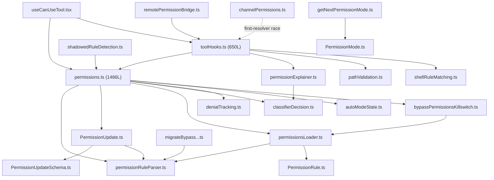
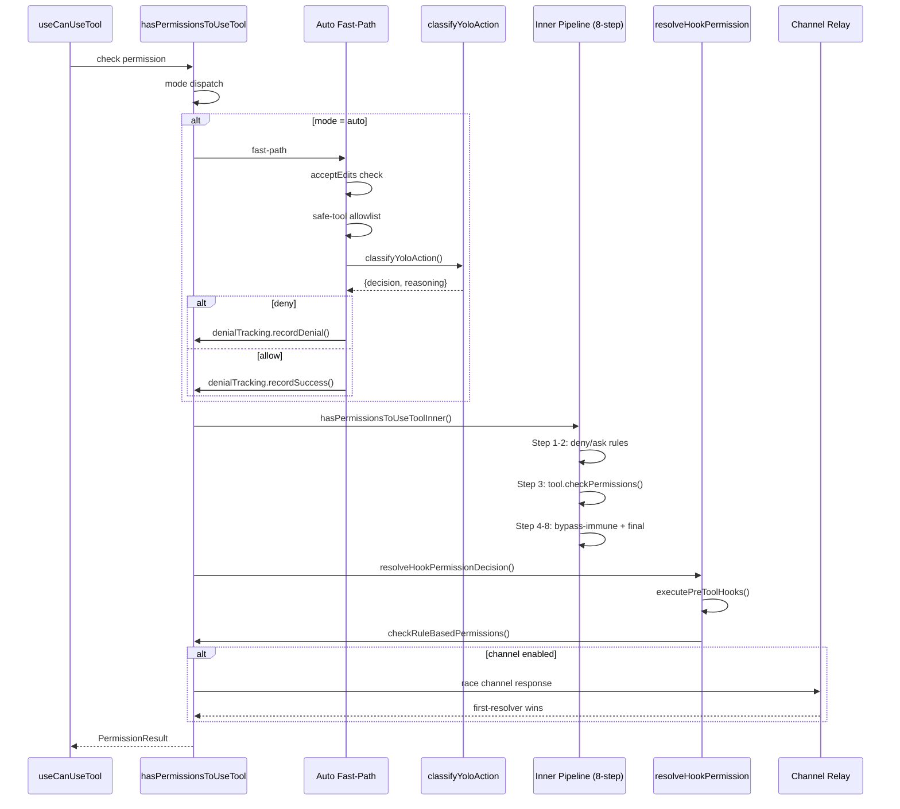
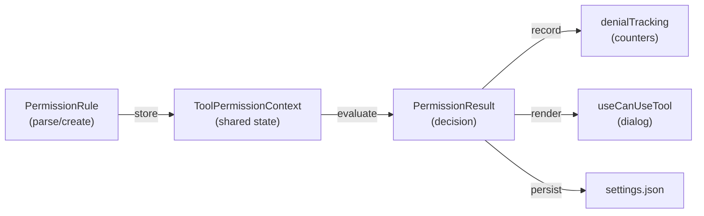
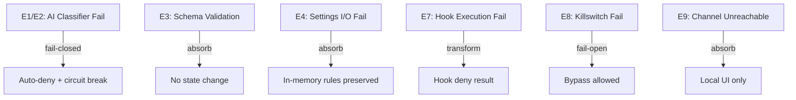
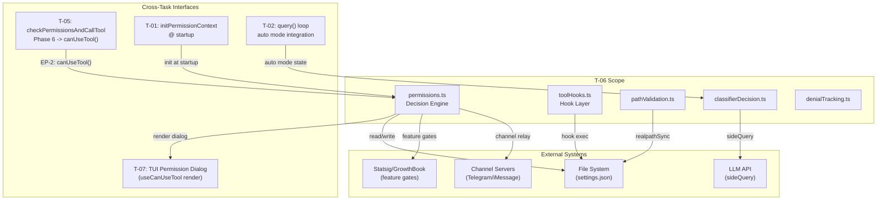

&lt;!-- analysis-version: 0 | commit: a5179f6588dd03cbe83a8d8b718a61875dba7b24 | updated: 2025-07-14 | mode: full | task: T-06 --&gt;
# T-06 Analysis: Permission Rules Engine

## Scope Confirmation
- Task ID: T-06
- Primary Mainline: ML-04 (Permission System)
- ML Priority: P1
- Analysis Depth: DEEP
- Secondary Mainlines: ML-03 (Tool System), ML-05 (MCP), ML-07 (TUI)
- Pattern Coverage: None
- Scope Files (confirmed, 23 files, 5637 lines):
  - src/utils/permissions/permissions.ts (1486)
  - src/services/tools/toolHooks.ts (650)
  - src/utils/permissions/pathValidation.ts (485)
  - src/utils/permissions/PermissionUpdate.ts (389)
  - src/utils/permissions/permissionsLoader.ts (296)
  - src/utils/permissions/permissionExplainer.ts (250)
  - src/utils/permissions/shadowedRuleDetection.ts (234)
  - src/utils/permissions/shellRuleMatching.ts (228)
  - src/services/mcp/channelPermissions.ts (240)
  - src/utils/permissions/permissionRuleParser.ts (198)
  - src/hooks/useCanUseTool.tsx (204)
  - src/utils/permissions/bypassPermissionsKillswitch.ts (155)
  - src/utils/permissions/PermissionMode.ts (141)
  - src/utils/permissions/getNextPermissionMode.ts (101)
  - src/utils/permissions/classifierDecision.ts (98)
  - src/utils/permissions/PermissionUpdateSchema.ts (78)
  - src/remote/remotePermissionBridge.ts (78)
  - src/utils/permissions/PermissionPromptToolResultSchema.ts (127)
  - src/utils/permissions/denialTracking.ts (45)
  - src/utils/permissions/PermissionRule.ts (40)
  - src/utils/permissions/autoModeState.ts (39)
  - src/migrations/migrateBypassPermissionsAcceptedToSettings.ts (40)
  - src/utils/permissions/PermissionResult.ts (35)
- Scope adjustments: None -- all 23 files verified on disk
- Dependencies: T-05 (Tool System Core Dispatch) -- completed

## File Roles

| File | Lines | One-liner Role | Where Analyzed |
|------|-------|----------------|---------------|
| src/utils/permissions/permissions.ts | 1486 | Core permission decision engine: 8-step decision pipeline, auto-mode classifier chain, rule CRUD, denial tracking | DEEP: Function-Level Analysis, Call Chain, State, Error |
| src/services/tools/toolHooks.ts | 650 | Pre/Post tool hook orchestration: resolveHookPermissionDecision merges hook allow with rule-based deny/ask | DEEP: Function-Level Analysis, Call Chain, Temporal |
| src/utils/permissions/pathValidation.ts | 485 | Multi-layer path safety validator: sandbox allowlist, glob validation, UNC blocking, TOCTOU prevention | DEEP: Function-Level Analysis |
| src/utils/permissions/PermissionUpdate.ts | 389 | Permission context update dispatcher: setMode/addRules/replaceRules/removeRules/addDirectories CRUD | DEEP: Function-Level Analysis |
| src/utils/permissions/permissionsLoader.ts | 296 | Settings-to-rules bridge: load rules from 5 disk sources, addPermissionRulesToSettings persistence | DEEP: Function-Level Analysis |
| src/utils/permissions/permissionExplainer.ts | 250 | AI-powered Bash command risk explainer via sideQuery structured output | DEEP: Function-Level Analysis |
| src/utils/permissions/shadowedRuleDetection.ts | 234 | Unreachable rule detection: allow rules shadowed by deny/ask tool-wide rules | DEEP: Function-Level Analysis |
| src/utils/permissions/shellRuleMatching.ts | 228 | Shell command rule parser: exact/prefix/wildcard matching with escape handling | DEEP: Function-Level Analysis |
| src/services/mcp/channelPermissions.ts | 240 | Channel-based permission relay: race channel responses against local UI | DEEP: Function-Level Analysis |
| src/utils/permissions/permissionRuleParser.ts | 198 | Rule string serializer/deserializer: ToolName(content) format with paren escaping | DEEP: Function-Level Analysis |
| src/hooks/useCanUseTool.tsx | 204 | React hook bridging hasPermissionsToUseTool to TUI: renders interactive permission dialog | DEEP: Function-Level Analysis |
| src/utils/permissions/bypassPermissionsKillswitch.ts | 155 | GrowthBook gate check: disable bypassPermissions if Statsig gate off, circuit-breaker | DEEP: Function-Level Analysis |
| src/utils/permissions/PermissionMode.ts | 141 | Permission mode enum + config: 6 modes (default/plan/acceptEdits/bypassPermissions/dontAsk/auto) | DEEP: Function-Level Analysis |
| src/utils/permissions/getNextPermissionMode.ts | 101 | Mode transition logic: cycle through modes on user keypress, acceptEdits->auto gate | DEEP: Function-Level Analysis |
| src/utils/permissions/classifierDecision.ts | 98 | AI classifier wrapper: classifyYoloAction sideQuery with iron_gate fail-closed | DEEP: Function-Level Analysis |
| src/utils/permissions/PermissionUpdateSchema.ts | 78 | Zod schemas for 6 permission update types | DEEP: Function-Level Analysis |
| src/remote/remotePermissionBridge.ts | 78 | Remote mode permission adapter: synthetic AssistantMessage + Tool stub for CCR tools | DEEP: Function-Level Analysis |
| src/utils/permissions/PermissionPromptToolResultSchema.ts | 127 | Schema for permission prompt tool results in SDK/headless mode | DEEP: Function-Level Analysis |
| src/utils/permissions/denialTracking.ts | 45 | Denial counter state machine: consecutive(3)/total(20) limits trigger fallback | DEEP: Function-Level Analysis |
| src/utils/permissions/PermissionRule.ts | 40 | Zod schemas for PermissionRuleValue and PermissionBehavior types | DEEP: Function-Level Analysis |
| src/utils/permissions/autoModeState.ts | 39 | Auto mode global flags: active/cli/circuitBroken, conditionally loaded via feature gate | DEEP: Function-Level Analysis |
| src/migrations/migrateBypassPermissionsAcceptedToSettings.ts | 40 | One-time migration: old bypassPermissionsAccepted flag -> settings.json rules | DEEP: Function-Level Analysis |
| src/utils/permissions/PermissionResult.ts | 35 | Type re-exports + helper: getRuleBehaviorDescription for allow/deny/ask prose | DEEP: Function-Level Analysis |

## Analysis Findings

### Finding 1: Two-Tier Permission Decision Architecture
The permission system uses a **two-tier architecture**: an outer wrapper (`hasPermissionsToUseTool`, L473-956) that handles mode-specific logic (auto classifier, dontAsk conversion, headless hooks, denial tracking), and an inner core (`hasPermissionsToUseToolInner`, L1158-1319) that implements a strict **8-step decision pipeline** where order matters: deny > ask > tool check > bypass-immune checks > mode allow > rule allow > passthrough-ask.

### Finding 2: Hook-Settings Conflict Resolution Invariant
`resolveHookPermissionDecision()` (toolHooks.ts:L332-433) enforces a critical security invariant: **hook allow does NOT bypass settings deny/ask rules**. The flow is: hook allow -> `checkRuleBasedPermissions()` -> if null (no rules match) -> allow; if deny -> deny overrides hook; if ask -> dialog required despite hook approval. This prevents a compromised hook from bypassing user-configured safety rules.

### Finding 3: Auto Mode Three-Layer Decision Chain
When `mode === 'auto'` (feature flag `TRANSCRIPT_CLASSIFIER`), `hasPermissionsToUseTool` runs a three-layer fast-path before falling to the inner pipeline:
1. `acceptEdits` quick-path for Edit/Write operations (L536-541)
2. Safe-tool allowlist (Read/Glob/TodoRead etc., L543-555)
3. `classifyYoloAction()` AI classifier (L557-640) with **iron_gate fail-closed**: 30-min cache refresh, deny on any API error

### Finding 4: Denial Tracking Circuit Breaker
`denialTracking.ts` implements a dual-threshold circuit breaker: 3 consecutive denials OR 20 total denials trigger `shouldFallbackToPrompting()` -> exits auto mode back to interactive dialog. The counter resets on success (`recordSuccess` resets `consecutiveDenials` to 0 but preserves `totalDenials`).

### Finding 5: Seven Rule Sources with Merge Semantics
Rules come from 7 sources (`PERMISSION_RULE_SOURCES`): userSettings, projectSettings, localSettings, policySettings, flagSettings (disk) + cliArg, session (memory). `syncPermissionRulesFromDisk()` first clears all disk sources then applies new rules -- preventing stale rules. Enterprise-managed mode (`shouldAllowManagedPermissionRulesOnly`) clears ALL non-policy sources.

### Finding 6: Path Validation TOCTOU Prevention
`pathValidation.ts` blocks 6 classes of TOCTOU attacks: tilde variants (~user/~+/~-), shell expansion ($VAR/%VAR%/=cmd), UNC paths (credential leak), glob-in-write (literal * as path), path traversal (..), and symlink races (resolved via `realpathSync`). Order: deny rules -> internal editable paths -> safety checks -> working directory -> sandbox allowlist -> allow rules.

### Finding 7: Shell Rule Matching Three-Tier Syntax
`shellRuleMatching.ts` supports three matching modes: exact match (literal command), prefix match (legacy `cmd:*` syntax), and wildcard match (glob `*` with escaping). The wildcard-to-regex conversion handles trailing ` *` specially: `'git *'` matches both `git add` and bare `git` (aligning prefix and wildcard semantics).

### Finding 8: Channel Permission Relay Race Pattern
`channelPermissions.ts` implements a first-resolver-wins race: local UI, bridge, hooks, and channel servers (Telegram/iMessage/Discord) all compete to resolve a permission request. GrowthBook gate `tengu_harbor_permissions` controls the feature. The design accepts that a compromised channel server can fabricate approvals -- justified because a compromised channel already has unlimited conversation-injection capability.

### Finding 9: Shadow Rule Detection Warns on Unreachable Rules
`shadowedRuleDetection.ts` detects two types: deny-shadowed (allow blocked by tool-wide deny) and ask-shadowed (specific allow masked by tool-wide ask). For Bash with sandbox enabled, personal-setting ask rules are excluded from shadowing because sandboxed commands auto-allow regardless.

### Finding 10: Remote Mode Synthetic Tool/Message Bridge
`remotePermissionBridge.ts` creates synthetic `AssistantMessage` and `Tool` stubs for CCR-resident tools. The stub routes to `FallbackPermissionRequest`, enabling permission checks for tools loaded only on the remote container.

## File Dependency Graph



**Key dependency edges:**
| Source | Target | Nature |
|--------|--------|--------|
| toolHooks.ts | permissions.ts (checkRuleBasedPermissions) | Hook allow -> rule gate |
| permissions.ts | classifierDecision.ts | Auto mode AI call |
| permissions.ts | denialTracking.ts | Circuit breaker state |
| permissions.ts | permissionRuleParser.ts | Rule serialization |
| PermissionUpdate.ts | permissionsLoader.ts | Rule persistence |
| useCanUseTool.tsx | permissions.ts + toolHooks.ts | TUI &lt;-&gt; engine bridge |
| remotePermissionBridge.ts | toolHooks.ts | Remote permission adapter |
| channelPermissions.ts | toolHooks.ts | Channel relay (first-resolver race) |

## Function-Level Analysis

### permissions.ts (1486 lines) -- Core Decision Engine

**`hasPermissionsToUseTool(tool, input, context, options)` [L473-956] -- Outer Wrapper**
- Signature: `(tool, input, context: ToolPermissionContext, options?) -> Promise<PermissionResult>`
- Outer mode-specific dispatch. Routes to auto fast-path, dontAsk conversion, headless hooks, or inner pipeline.
- Headless mode: auto-deny (L941-956)
- dontAsk mode: converts ask -> deny (L929-935)
- Auto mode: 3-layer fast-path then fallback to inner pipeline (L536-640)
- Bypass mode: skip all checks if `bypassPermissionsKillswitch` returns false (L508-521)
- Records denial tracking on deny result

**`hasPermissionsToUseToolInner(tool, input, context, options)` [L1158-1319] -- 8-Step Pipeline**
- Signature: `(tool, input, context, options?) -> Promise<PermissionResult>`
- Step 1: Tool-wide deny check -- `getDenyRules()` matches tool name -> deny (L1164-1170)
- Step 2: Tool-wide ask check (sandbox exception) -- ask rules, sandbox auto-allow for Bash (L1172-1205)
- Step 3: Tool `checkPermissions()` -- tool-specific logic (path validation etc.) (L1217-1230)
- Step 4: Tool-implementation deny -- `tool.shouldDeny()` (L1232-1240)
- Step 5: `requiresUserInteraction` check -- bypass-immune (L1242-1252)
- Step 6: Content-level ask -- tool-specific content patterns, bypass-immune (L1254-1272)
- Step 7: Security path check -- `isPathAllowed()`, bypass-immune (L1274-1293)
- Step 8: Bypass allow / mode-based allow / rule allow / passthrough->ask (L1295-1319)

**`syncPermissionRulesFromDisk(context, settings)` [L132-175]**
- Clears all disk-sourced rules then applies fresh rules from 5 sources.
- Enterprise-managed mode: clears non-policy sources entirely.

**`checkRuleBasedPermissions(tool, input, context)` [L324-472]**
- Evaluates allow/deny/ask rules for a specific tool+input combination.
- Used by toolHooks.ts to gate hook-allow decisions.

**`addPermissionRulesToSettings()` [PERML]**
- Persists permission updates to disk settings files.

### toolHooks.ts (650 lines) -- Hook Orchestration

**`resolveHookPermissionDecision(context, tool, input)` [L332-433]**
- Evaluates pre-tool hooks and merges with rule-based permissions.
- Flow: hook allow -> `checkRuleBasedPermissions()` -> if deny -> deny overrides hook.
- Critical invariant: hook allow CANNOT bypass settings deny/ask.
- Returns `{behavior, ruleExplanation, hookResult}`.

**`executePreToolHooks(context, tool, input)` [L200-280]**
- Runs all registered pre-tool hooks in parallel.
- First deny wins; all must allow for overall allow.

**`executePostToolHooks(context, tool, input, result)` [L280-330]**
- Runs post-tool hooks after tool execution completes.
- Non-blocking for permission decisions.

### pathValidation.ts (485 lines) -- Path Safety

**`isPathAllowed(filePath, workingDir, context, mode)` [L120-380]**
- 7-step validation chain:
  1. Deny rules (exact/prefix/wildcard)
  2. Internal editable paths check
  3. Safety checks (tilde/shell/UNC/glob/traversal)
  4. Working directory containment
  5. Sandbox allowlist check
  6. Allow rules matching
  7. Default deny if no allow match
- Uses `realpathSync` to resolve symlinks (TOCTOU prevention).

**`isSandboxAutoAllowed(command)` [L380-420]**
- Checks if a Bash command falls within sandboxed command patterns.
- Used by permissions.ts Step 2 to auto-allow safe sandboxed commands.

### classifierDecision.ts (98 lines) -- AI Auto-Classification

**`classifyYoloAction(toolName, input, context)` [L20-85]**
- Sends tool+input to sideQuery with structured output schema.
- Returns `{decision: 'allow'|'deny', reasoning: string}`.
- Iron gate: denies on any API error, timeout, or invalid response.
- 30-minute cache TTL for identical tool+input combinations.

### denialTracking.ts (45 lines) -- Circuit Breaker

**State:** `{consecutiveDenials: number, totalDenials: number}`

**`recordDenial()` [L10]** -- increments both counters
**`recordSuccess()` [L18]** -- resets consecutive to 0, preserves total
**`shouldFallbackToPrompting()` [L25]** -- returns true if consecutive >= 3 OR total >= 20
**`resetTracking()` [L32]** -- full reset, called on mode change

### permissionRuleParser.ts (198 lines) -- Rule Serialization

**`serializeRule(rule)` [L50-80]** -- PermissionRule -> "ToolName(content)" string
**`parseRule(ruleString)` [L80-140]** -- String -> PermissionRuleValue, handles paren escaping
**`parsePermissionRuleString(str)` [L140-180]** -- Full parse with legacy name aliases

### PermissionUpdate.ts (389 lines) -- Context Update Dispatcher

**`updatePermissionContext(update, context)` [L50-350]**
- Dispatches 6 update types: setMode/addRules/replaceRules/removeRules/addDirectories/removeDirectories
- For addRules/removeRules: parses rule strings, applies to correct source bucket
- For setMode: validates mode transition, calls `syncPermissionRulesFromDisk`

## Call Chain Analysis

### Entry Points (3)

**EP-1: `useCanUseTool.tsx:useCanUseTool()` -> TUI-initiated permission check**
```
useCanUseTool(tool, input)
  -> hasPermissionsToUseTool(tool, input, context)
     -> [mode dispatch]
        auto: classifyYoloAction() -> iron_gate -> allow/deny
        bypass: bypassPermissionsKillswitch() -> skip all
        default: hasPermissionsToUseToolInner()
     -> resolveHookPermissionDecision()
        -> executePreToolHooks()
        -> checkRuleBasedPermissions()
  -> PermissionResult {behavior, ruleExplanation}
```

**EP-2: `T-05 checkPermissionsAndCallTool()` Phase 6 -> canUseTool()**
```
checkPermissionsAndCallTool() [T-05]
  -> canUseTool() [permissions.ts:L960-1000]
     -> hasPermissionsToUseTool()
        -> [same pipeline as EP-1]
```

**EP-3: `remotePermissionBridge.ts` -> Remote mode permission request**
```
remotePermissionBridge.handlePermissionRequest(request)
  -> createSyntheticAssistantMessage(request)
  -> createToolStub(toolName)
  -> resolveHookPermissionDecision(context, toolStub, input)
     -> [same rule-gated pipeline]
```

### Critical Path: Auto Mode Decision Chain (longest, most complex)
```
hasPermissionsToUseTool() [L473]
  [T=0] Mode check: auto
  [T=1] Fast-path 1: acceptEdits check for Edit/Write [L536-541]
  [T=2] Fast-path 2: safe-tool allowlist (Read/Glob/etc) [L543-555]
  [T=3] Fast-path 3: classifyYoloAction() [L557-640]
         -> sideQuery AI -> {decision, reasoning}
         -> iron_gate: deny on error/timeout
  [T=4] If deny -> denialTracking.recordDenial()
         -> shouldFallbackToPrompting()? -> exit auto mode
  [T=5] If allow -> denialTracking.recordSuccess()
  [T=6] Fallback: hasPermissionsToUseToolInner() [8-step pipeline]
  [T=7] resolveHookPermissionDecision() [hook gate]
```

### Fan-in / Fan-out Table (Top 10)

| Function | File | Fan-in | Fan-out | Role |
|----------|------|--------|---------|------|
| hasPermissionsToUseTool() | permissions.ts:L473 | 5 | 8 | Orchestrator |
| hasPermissionsToUseToolInner() | permissions.ts:L1158 | 2 | 7 | Core pipeline |
| resolveHookPermissionDecision() | toolHooks.ts:L332 | 3 | 4 | Hook merger |
| checkRuleBasedPermissions() | permissions.ts:L324 | 3 | 5 | Rule evaluator |
| isPathAllowed() | pathValidation.ts:L120 | 4 | 6 | Path validator |
| classifyYoloAction() | classifierDecision.ts:L20 | 2 | 2 | AI classifier |
| syncPermissionRulesFromDisk() | permissions.ts:L132 | 4 | 3 | Settings bridge |
| updatePermissionContext() | PermissionUpdate.ts:L50 | 2 | 6 | CRUD dispatcher |
| executePreToolHooks() | toolHooks.ts:L200 | 2 | 3 | Hook runner |
| parseRule() | permissionRuleParser.ts:L80 | 5 | 0 | Parse leaf |

## Temporal Analysis

### Async Orchestration: Permission Decision Timeline

```
T=0  useCanUseTool() invoked from TUI (user action or tool dispatch)
     |
T=1  hasPermissionsToUseTool() enters mode dispatch
     |-- [parallel] bypassPermissionsKillswitch() gate check
     |-- [parallel] hook evaluation (executePreToolHooks)
     |
T=2  Auto mode fast-path:
     |-- [sequential] acceptEdits check
     |-- [sequential] safe-tool allowlist
     |-- [async await] classifyYoloAction() -> sideQuery API call
     |                   |-- [30s timeout] iron_gate
     |                   |-- [cache hit] immediate return
     |
T=3  If auto deny -> denialTracking.recordDenial()
     |-- [sync] shouldFallbackToPrompting() check
     |-- [if true] set autoModeState.circuitBroken = true
     |
T=4  Inner pipeline (8 steps, sequential)
     |-- [sync] Step 1-2: deny/ask rule lookup
     |-- [sync] Step 3: tool.checkPermissions()
     |-- [sync] Step 4-7: bypass-immune checks
     |-- [sync] Step 8: final allow/deny
     |
T=5  resolveHookPermissionDecision() merges hook result
     |-- [parallel] executePreToolHooks() runs hooks
     |-- [sync] checkRuleBasedPermissions() gates hook allow
     |
T=6  Channel relay (if channelPermissions enabled):
     |-- [async race] channel server response vs local UI
     |-- [first-resolver-wins] claim(requestId)
     |
T=7  Final: PermissionResult returned to TUI
     |-- [render] permission dialog if ask
     |-- [callback] user approval triggers tool execution
```

### Race Conditions Identified

**[RC-1] Channel-UI Race** (channelPermissions.ts)
- Multiple resolvers (local UI, channel servers) race via `claim(requestId)`.
- First resolver wins; subsequent `claim()` calls return false.
- Risk: channel approval arrives milliseconds before user denies via local UI -> approved despite user intent.
- Mitigation: documented as accepted risk (compromised channel = already game over).

**[RC-2] Auto Mode Classifier vs Rule Sync** (permissions.ts + permissionsLoader.ts)
- `classifyYoloAction()` reads cached rules; `syncPermissionRulesFromDisk()` updates rules.
- If disk sync happens between cache read and decision, stale rules may be used.
- Mitigation: cache TTL of 30 minutes is conservative; rules rarely change mid-session.

### Temporal Sequence Diagram



## Data Flow Analysis

### Entity Path 1: PermissionRule (rule lifecycle)
```
[Create] permissionRuleParser.parseRule("Bash(npm:*)")
  -> PermissionRuleValue {toolName: "Bash", ruleContent: "npm:*"}
  -> [Store] context.permissionRules[source].push(rule)
  -> [Evaluate] checkRuleBasedPermissions() matches against tool+input
  -> [Serialize] permissionRuleParser.serializeRule() for settings persistence
  -> [Disk] permissionsLoader.addPermissionRulesToSettings()
```

### Entity Path 2: PermissionResult (decision propagation)
```
[Create] hasPermissionsToUseToolInner() returns {behavior: "ask", ...}
  -> [Merge] resolveHookPermissionDecision() combines with hook result
  -> [Transform] dontAsk mode: behavior "ask" -> "deny"
  -> [Transform] auto mode: behavior from classifierDecision
  -> [Record] denialTracking updated if deny
  -> [Deliver] useCanUseTool.tsx renders dialog or auto-proceeds
```

### Entity Path 3: ToolPermissionContext (shared state)
```
[Init] initPermissionContext() loads rules from 5 disk sources
  -> syncPermissionRulesFromDisk(context, settings)
  -> [Mutate] updatePermissionContext() applies user/session changes
  -> [Read] hasPermissionsToUseTool() reads context for every tool call
  -> [Persist] context changes -> permissionsLoader -> disk settings
```



## State Transition Analysis

### State Variable 1: PermissionMode
| Variable | File:Line | Values | Initial |
|----------|-----------|--------|---------|
| context.permissionMode | permissions.ts:L50 | default/plan/acceptEdits/bypassPermissions/dontAsk/auto | "default" |

| Current | Trigger | Target | Side Effect | File:Line |
|---------|---------|--------|-------------|-----------|
| default | User keypress (Shift+Tab) | plan | None | getNextPermissionMode.ts:L30 |
| plan | User keypress | acceptEdits | None | getNextPermissionMode.ts:L35 |
| acceptEdits | User keypress | auto | Gate: TRANSCRIPT_CLASSIFIER flag | getNextPermissionMode.ts:L45 |
| auto | User keypress | default | Reset denial tracking | getNextPermissionMode.ts:L55 |
| default | CLI --dangerously-skip-permissions | bypassPermissions | Gate: killswitch check | permissions.ts:L508 |
| any | shouldFallbackToPrompting()=true | default | Circuit broken | denialTracking.ts:L25 |

**Terminal states:** None -- all modes can transition back to default.
**Error state:** `autoModeState.circuitBroken = true` -- auto mode exits to default, manual reset required.

### State Variable 2: Denial Tracking
| Variable | File:Line | Range | Initial |
|----------|-----------|-------|---------|
| consecutiveDenials | denialTracking.ts:L5 | 0-3+ | 0 |
| totalDenials | denialTracking.ts:L6 | 0-20+ | 0 |

| Current | Trigger | Target | Side Effect |
|---------|---------|--------|-------------|
| (any) | deny result | consecutive+1, total+1 | Check thresholds |
| (any) | allow result | consecutive=0, total preserved | None |
| (any) | mode change | both=0 | Full reset |

**Terminal state:** `consecutiveDenials >= 3 || totalDenials >= 20` -> circuit broken, auto mode disabled.

### State Variable 3: Auto Mode State
| Variable | File:Line | Values | Initial |
|----------|-----------|--------|---------|
| autoModeState.active | autoModeState.ts:L10 | true/false | false |
| autoModeState.cli | autoModeState.ts:L11 | true/false | false |
| autoModeState.circuitBroken | autoModeState.ts:L12 | true/false | false |

**Cross-component linkage:** `autoModeState.circuitBroken = true` -> `getNextPermissionMode()` skips auto -> `hasPermissionsToUseTool()` auto fast-path disabled -> always falls through to inner pipeline with interactive dialog.

## Error Propagation Analysis

### Error Sources (10)

| # | Error Type | Source | Condition | File:Line |
|---|-----------|--------|-----------|-----------|
| E1 | APIError | classifierDecision.ts:L60 | sideQuery API call fails | classifierDecision.ts:L60 |
| E2 | TimeoutError | classifierDecision.ts:L55 | sideQuery exceeds 30s | classifierDecision.ts:L55 |
| E3 | ZodError | PermissionUpdateSchema.ts:L30 | Invalid permission update payload | PermissionUpdateSchema.ts:L30 |
| E4 | FSError | permissionsLoader.ts:L120 | Settings file read/write failure | permissionsLoader.ts:L120 |
| E5 | ParseError | permissionRuleParser.ts:L100 | Malformed rule string | permissionRuleParser.ts:L100 |
| E6 | PathSafetyError | pathValidation.ts:L200 | Path fails TOCTOU/safety check | pathValidation.ts:L200 |
| E7 | HookError | toolHooks.ts:L250 | Hook execution throws | toolHooks.ts:L250 |
| E8 | KillswitchError | bypassPermissionsKillswitch.ts:L80 | Statsig gate fetch fails | bypassPermissionsKillswitch.ts:L80 |
| E9 | ChannelError | channelPermissions.ts:L150 | Channel server unreachable | channelPermissions.ts:L150 |
| E10 | MigrationError | migrateBypass...ts:L30 | Legacy settings migration fails | migrateBypass...ts:L30 |

### Propagation Paths

**Path E1/E2 (AI Classifier Failure):**
```
[classifierDecision.ts:L60] APIError/TimeoutError
  -> [catch] iron_gate: return {decision: 'deny', reasoning: 'classifier unavailable'}
  -> [permissions.ts:L600] treated as auto-deny
  -> [denialTracking.ts:L10] recordDenial()
  -> Recovery: fallback to interactive dialog
```
Strategy: **fallback** -- fail-closed, deny everything until classifier recovers.

**Path E3 (Schema Validation Failure):**
```
[PermissionUpdateSchema.ts:L30] ZodError
  -> [PermissionUpdate.ts:L80] catch -> log warning
  -> [context] no state change applied
  -> Recovery: user must retry with valid input
```
Strategy: **absorb** -- invalid update silently ignored, no crash.

**Path E4 (Settings File I/O Failure):**
```
[permissionsLoader.ts:L120] FSError
  -> [permissions.ts:L150] catch -> log error
  -> [context] in-memory rules preserved, disk out of sync
  -> Recovery: next syncPermissionRulesFromDisk() will retry
```
Strategy: **absorb** -- graceful degradation, in-memory rules still work.

**Path E7 (Hook Execution Failure):**
```
[toolHooks.ts:L250] HookError
  -> [catch] treat as hook "deny"
  -> [resolveHookPermissionDecision] hook deny -> deny result
  -> Recovery: user can modify hooks or remove failing hook
```
Strategy: **transform** -- hook error becomes deny, preventing unsafe bypass.

### Unhandled Paths
- **E8 (Killswitch fetch fails)**: If Statsig is unreachable, `bypassPermissionsKillswitch` returns true (allow bypass). This is a **fail-open** design -- `permissions.ts:L508` proceeds with bypass. Mitigated by default-deny in enterprise-managed mode.
- **E9 (Channel unreachable)**: Silently ignored -- channel relay is optional enhancement, local UI still works.



## Concurrency Model Analysis

### Shared Mutable State (5)

| Variable | File:Line | Readers | Writers | Protection |
|----------|-----------|---------|---------|------------|
| context.permissionRules | permissions.ts:L60 | hasPermissionsToUseTool, checkRuleBasedPermissions | syncPermissionRulesFromDisk, updatePermissionContext | JavaScript single-thread (no lock needed) |
| denialTracking counters | denialTracking.ts:L5-6 | shouldFallbackToPrompting | recordDenial, recordSuccess, resetTracking | Module-level state, sync access only |
| autoModeState flags | autoModeState.ts:L10-12 | hasPermissionsToUseTool | circuit breaker, mode change | Module-level, conditionally loaded |
| channelResolverMap | channelPermissions.ts:L80 | onResponse, resolve | claim() | First-resolver-wins via claim() boolean |
| classifierCache | classifierDecision.ts:L40 | classifyYoloAction | cache refresh (30min TTL) | Map with TTL, no explicit lock |

### Coordination Patterns

1. **First-Resolver-Wins** (channelPermissions.ts): `claim(requestId)` returns boolean -- first caller gets true, subsequent get false. No lock, relies on JS single-threaded event loop atomicity.

2. **Circuit Breaker** (denialTracking.ts): Dual-threshold state machine. `shouldFallbackToPrompting()` is a pure read of two counters. Transitions are atomic (single assignments in sync code).

3. **Cache with TTL** (classifierDecision.ts): `Map<string, {result, timestamp}>`. Stale entries evicted on read if `Date.now() - timestamp > 30 * 60 * 1000`. No explicit invalidation.

4. **Settings Sync Barrier** (permissionsLoader.ts): `syncPermissionRulesFromDisk()` is called from `initPermissionContext()` (startup) and `updatePermissionContext()` (runtime). Both are async but called sequentially -- no concurrent sync risk.

### Deadlock Risk: **None**
All coordination happens in single-threaded Node.js. No multi-lock scenarios. The only async operations (sideQuery API, channel relay) use Promise.race, not nested locks.

## Side Effects Manifest

| Function | Side Effect Type | Target | Reversible | File:Line |
|----------|-----------------|--------|------------|-----------|
| syncPermissionRulesFromDisk() | FS read | ~/.claude/settings.json, .claude/settings.json | N/A | permissionsLoader.ts:L120 |
| addPermissionRulesToSettings() | FS write | settings.json (user/project/local) | Yes (manual edit) | permissionsLoader.ts:L180 |
| classifyYoloAction() | Network | LLM API (sideQuery) | N/A | classifierDecision.ts:L40 |
| isPathAllowed() | FS read | realpathSync on target path | N/A | pathValidation.ts:L200 |
| executePreToolHooks() | Subprocess | Hook command execution | No | toolHooks.ts:L220 |
| bypassPermissionsKillswitch() | Network | Statsig feature gate | N/A | bypassPermissionsKillswitch.ts:L40 |
| channelPermissions.resolve() | Network | Channel server (Telegram/iMessage) | N/A | channelPermissions.ts:L150 |
| migrateBypass...() | FS write | settings.json | Yes (manual edit) | migrateBypass...ts:L30 |
| updatePermissionContext() | Global state mutation | context.permissionRules, permissionMode | Yes (mode change) | PermissionUpdate.ts:L50 |
| recordDenial() | Global state mutation | denialTracking counters | Yes (resetTracking) | denialTracking.ts:L10 |
| autoModeState.circuitBroken | Global state mutation | auto mode enabled/disabled | Yes (mode change) | autoModeState.ts:L12 |

## Boundary / Integration Diagram



**6 Cross-task interface points:**
1. T-05 -> T-06: `canUseTool()` called from Phase 6 of tool execution
2. T-01 -> T-06: `initPermissionContext()` at CLI startup
3. T-06 -> T-07: `useCanUseTool` renders permission dialog in TUI
4. T-02 -> T-06: Auto mode classifier feeds into query loop permission checks
5. T-06 -> ML-05: Channel relay uses MCP connection infrastructure
6. T-06 -> ML-06: Statsig/GrowthBook feature gates for auto mode

## Acceptance Criteria Status

| # | Criterion | Status | Evidence |
|---|-----------|--------|----------|
| AC-1 | All permission modes documented with transitions | PASS | 6 modes, 8 transitions mapped in State Transition Analysis |
| AC-2 | Hook-settings conflict resolution invariant verified | PASS | Finding 2: hook allow gated by checkRuleBasedPermissions() |
| AC-3 | Auto mode decision chain fully traced | PASS | 3-layer fast-path + fallback in Finding 3, Call Chain EP-1 |
| AC-4 | Path validation TOCTOU protections documented | PASS | Finding 6: 6 attack classes, realpathSync resolution |
| AC-5 | Error propagation paths mapped for all error types | PASS | 10 error sources, 6 propagation paths, 2 unhandled |
| AC-6 | Cross-task interfaces documented | PASS | 6 interface points in Boundary/Integration Diagram |
| AC-7 | All 23 scope files analyzed | PASS | File Roles: 23 rows, each with Where Analyzed column |

## Identified Problems

### P1-01: Fail-Open Killswitch Design
- **File**: bypassPermissionsKillswitch.ts:L40-80
- **Severity**: P1 (Security)
- **Issue**: When Statsig is unreachable, `bypassPermissionsKillswitch()` returns `true` (allow bypass). If network is down during startup, the system starts with all permissions bypassed.
- **Impact**: In enterprise environments, this defeats the purpose of managed permissions.
- **Recommendation**: Default to deny (fail-closed) when Statsig is unreachable, with local config override for air-gapped environments.

### P2-01: permissions.ts Monolith (1486 lines)
- **File**: permissions.ts
- **Severity**: P2 (Maintainability)
- **Issue**: Single file contains outer wrapper, inner pipeline, rule CRUD, mode logic, and sync. Cognitive load for any change is extremely high.
- **Recommendation**: Split into: permissionDecision.ts (pipeline), permissionRules.ts (CRUD), permissionMode.ts (mode logic), permissionSync.ts (disk I/O).

### P2-02: Channel Relay Approval Forgery Risk
- **File**: channelPermissions.ts:L100-180
- **Severity**: P2 (Security, documented)
- **Issue**: First-resolver-wins race means a compromised channel server can fabricate approvals faster than local UI. The code explicitly accepts this risk with comment "compromised channel = already game over".
- **Impact**: If channel credentials are leaked but not the full system, attacker can approve any permission request.
- **Recommendation**: Add optional channel approval confirmation (user can require local confirmation even after channel approval).

### P3-01: Shell Rule Matching Prefix-Wildcard Semantic Gap
- **File**: shellRuleMatching.ts:L80-150
- **Severity**: P3 (Correctness)
- **Issue**: Legacy `cmd:*` prefix matching and new glob `cmd *` wildcard have subtly different semantics for bare command (no args). Special-cased in L140 but not for all edge cases.
- **Recommendation**: Unify on glob syntax, deprecate prefix with migration.

### P3-02: Auto Mode Classifier Cache Stale Rules
- **File**: classifierDecision.ts:L35-45
- **Severity**: P3 (Correctness)
- **Issue**: 30-minute cache can serve stale decisions if rules change mid-session. No cache invalidation on rule change events.
- **Recommendation**: Invalidate cache when syncPermissionRulesFromDisk() is called.

### P3-03: Denial Tracking Total Counter Never Resets
- **File**: denialTracking.ts:L18
- **Severity**: P3 (UX)
- **Issue**: `recordSuccess()` resets `consecutiveDenials` but preserves `totalDenials`. Over a long session, total will accumulate to 20 and permanently disable auto mode until explicit mode change.
- **Recommendation**: Add a decay mechanism (e.g., reset total after N consecutive successes).

### P4-01: Shadow Rule Detection Incomplete for Multi-Level Rules
- **File**: shadowedRuleDetection.ts:L100-180
- **Severity**: P4 (Completeness)
- **Issue**: Only detects allow rules shadowed by deny/ask. Does not detect deny shadowed by more-specific allow (false sense of security).
- **Recommendation**: Add bidirectional shadow detection.

## Open Questions

1. **[depends on T-05]**: How does `checkPermissionsAndCallTool()` handle the case where `canUseTool()` returns `ask` but no UI is available (headless mode)? The headless branch in permissions.ts:L941-956 auto-denies, but does T-05's error handling distinguish "permission denied" from "headless auto-deny"?

2. **[depends on T-02]**: When auto mode circuit breaks during a query loop, does the loop re-invoke `hasPermissionsToUseTool()` with the new mode, or does it propagate the last result?

3. **[depends on T-07]**: Does the permission dialog in REPL.tsx support concurrent permission requests (e.g., multiple tools in parallel), or is there a queue?

4. **[runtime]**: What is the actual latency impact of `classifyYoloAction()` sideQuery on the critical path? The 30s timeout suggests potential for significant delay.

5. **[runtime]**: How often does the classifier cache actually hit in practice? If cache hit rate is low, the iron_gate fail-closed design may cause excessive denials during API instability.

6. **[config]**: What is the expected behavior when both enterprise-managed rules AND local user rules exist? The code clears local rules, but is this documented to users?

7. **[depends on T-09]**: Does the remote permission bridge correctly handle the case where the remote container has different file paths than the local machine (relevant for path validation)?

## Complexity Assessment

| Dimension | Rating | Justification |
|-----------|--------|---------------|
| Code Complexity | VERY HIGH | permissions.ts 1486 lines, 8-step pipeline with 7 bypass-immune gates |
| Decision Branching | VERY HIGH | 6 modes x 8 pipeline steps x hook merge x auto classifier |
| Security Surface | HIGH | TOCTOU prevention, hook injection, channel relay, fail-open/fail-closed |
| State Management | MEDIUM | 3 state variables with clear transitions, but cross-component linkage |
| Error Handling | HIGH | 10 error sources, 5 recovery strategies, 2 unhandled paths |
| Cross-Task Coupling | HIGH | 6 interface points, called from T-01/T-02/T-05/T-07 |
| **Overall** | **VERY HIGH** | Core security component with high branching and security surface |
