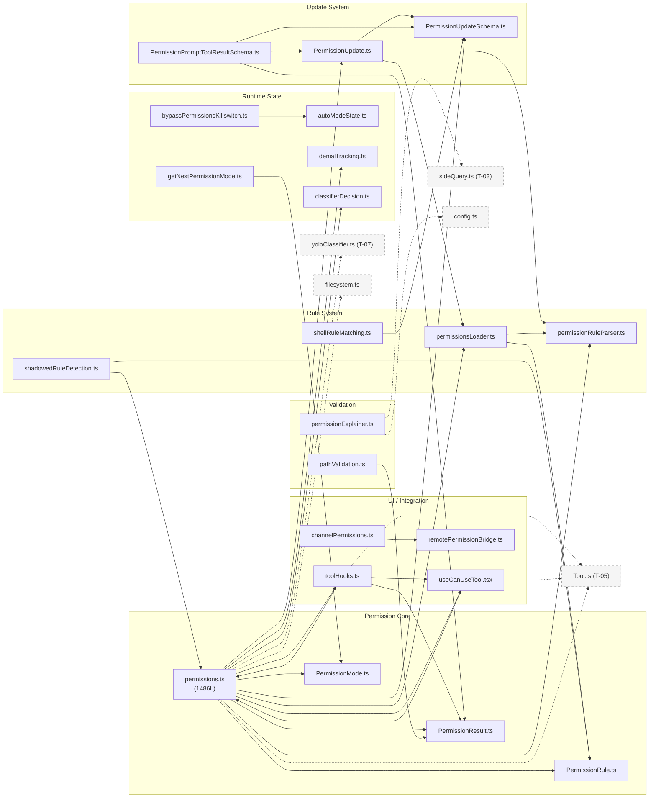
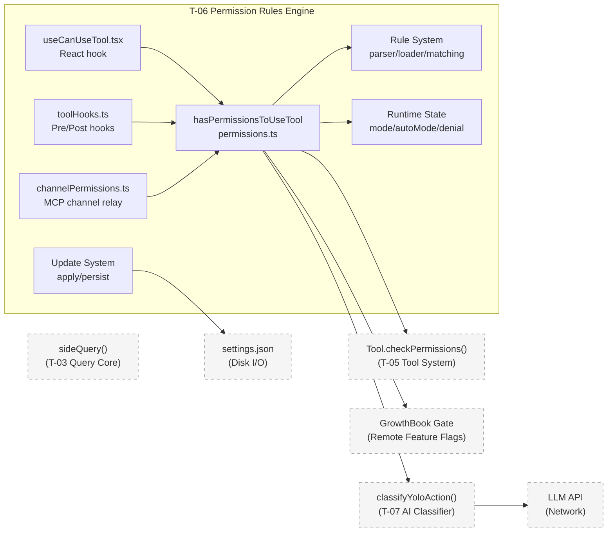
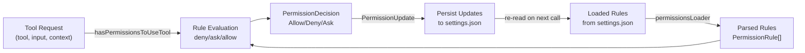
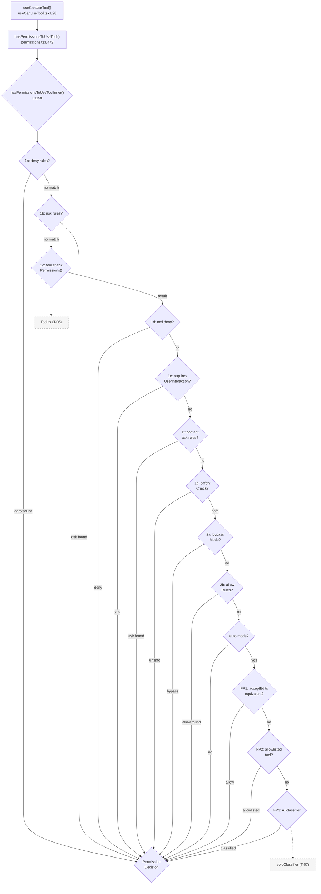
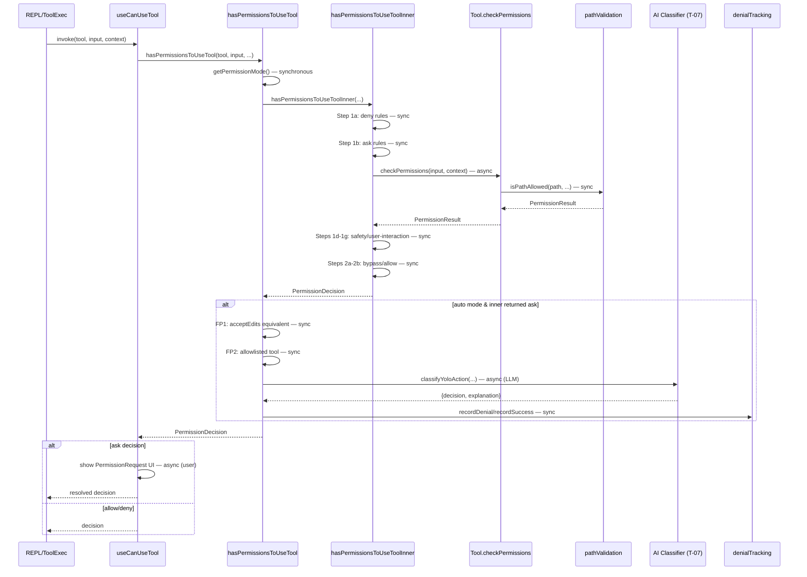
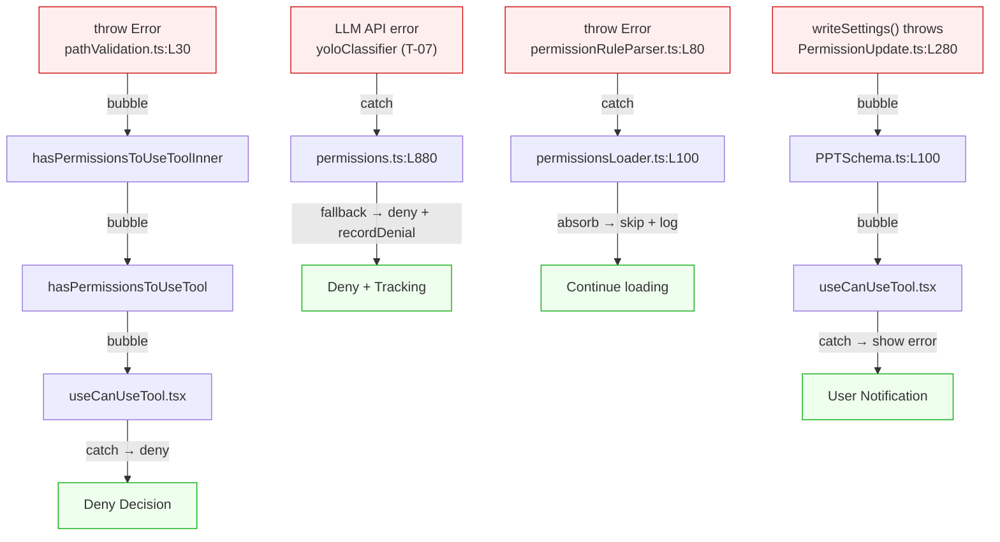

<!-- analysis-version: 0 | commit: a5179f6588dd03cbe83a8d8b718a61875dba7b24 | updated: 2025-07-27 | mode: full | task: T-06 -->
# T-06 Analysis: 权限规则引擎

## Scope Confirmation
- Task ID: T-06
- Primary Mainline: ML-04
- ML Priority: P1
- Analysis Depth: DEEP
- Secondary Mainlines: ML-02 (query loop interaction via hasPermissionsToUseTool)
- Pattern Coverage: N/A
- Scope Files (confirmed): 23 files total, 5,636 lines

**Scope adjustments**: 4 files had path corrections (task definition referenced incorrect paths):
- `channelPermissions.ts`: `src/utils/permissions/` → `src/services/mcp/channelPermissions.ts`
- `useCanUseTool.tsx`: `src/utils/permissions/` → `src/hooks/useCanUseTool.tsx`
- `remotePermissionBridge.ts`: `src/utils/permissions/` → `src/remote/remotePermissionBridge.ts`
- `migrateBypassPermissionsAcceptedToSettings.ts`: `src/utils/permissions/` → `src/migrations/migrateBypassPermissionsAcceptedToSettings.ts`

## File Roles

| File | Lines | One-liner Role | Where Analyzed |
|------|-------|----------------|---------------|
| src/utils/permissions/permissions.ts | 1486 | Core permission decision engine: hasPermissionsToUseTool entry + 14-step decision pipeline + auto-mode classifier integration | DEEP: §Function-Level Analysis, §Call Chain Analysis, §Temporal Analysis |
| src/utils/permissions/PermissionRule.ts | 40 | Type re-export + Zod schema for PermissionRule (source, behavior, value) | DEEP: §Function-Level Analysis |
| src/utils/permissions/PermissionMode.ts | 141 | 6 permission modes (default/plan/acceptEdits/bypassPermissions/dontAsk/auto) config + helper functions | DEEP: §Function-Level Analysis, §State Transition Analysis |
| src/utils/permissions/PermissionResult.ts | 35 | Type re-export for PermissionDecision + getRuleBehaviorDescription helper | DEEP: §Function-Level Analysis |
| src/utils/permissions/permissionRuleParser.ts | 198 | Rule string parser: "Tool(content)" format, bracket escaping, legacy tool name alias mapping | DEEP: §Function-Level Analysis |
| src/utils/permissions/permissionsLoader.ts | 296 | Disk loader: loadAllPermissionRulesFromDisk from multi-source settings, managed-only mode, CRUD operations | DEEP: §Function-Level Analysis, §Side Effect Inventory |
| src/utils/permissions/pathValidation.ts | 485 | Path safety validator: UNC block → tilde reject → shell expansion reject → glob → 7-layer isPathAllowed check chain | DEEP: §Function-Level Analysis, §Error Propagation Analysis |
| src/utils/permissions/PermissionUpdate.ts | 389 | 6 update types (setMode/addRules/replaceRules/removeRules/addDirs/removeDirs) apply + persist logic | DEEP: §Function-Level Analysis, §State Transition Analysis |
| src/utils/permissions/PermissionUpdateSchema.ts | 78 | Zod discriminated union schema for 6 PermissionUpdate types | DEEP: §Function-Level Analysis |
| src/utils/permissions/autoModeState.ts | 39 | 3 module-level booleans: autoModeActive/autoModeFlagCli/autoModeCircuitBroken, getter/setter only | DEEP: §State Transition Analysis |
| src/utils/permissions/bypassPermissionsKillswitch.ts | 155 | React hook + run-once GrowthBook gate check to remotely disable bypass/auto mode | DEEP: §Temporal Analysis, §Side Effect Inventory |
| src/utils/permissions/classifierDecision.ts | 98 | SAFE_YOLO_ALLOWLISTED_TOOLS static set (~30 safe tools) + isAutoModeAllowlistedTool() | DEEP: §Function-Level Analysis |
| src/utils/permissions/denialTracking.ts | 45 | DenialTrackingState: consecutiveDenials/totalDenials with limits (3/20), recordDenial/recordSuccess/shouldFallback | DEEP: §State Transition Analysis |
| src/utils/permissions/getNextPermissionMode.ts | 101 | Shift+Tab mode cycling: default→acceptEdits→plan→bypassPermissions→auto→default, ant skips acceptEdits/plan | DEEP: §Function-Level Analysis, §State Transition Analysis |
| src/utils/permissions/shadowedRuleDetection.ts | 234 | Detect unreachable allow rules shadowed by tool-wide deny/ask rules; Bash sandbox exception | DEEP: §Function-Level Analysis |
| src/utils/permissions/shellRuleMatching.ts | 228 | Shell command rule matching: exact/prefix/wildcard parse + matchWildcardPattern (null-byte sentinel regex) | DEEP: §Function-Level Analysis |
| src/utils/permissions/permissionExplainer.ts | 250 | SideQuery + Haiku LLM risk assessment generator (riskLevel/explanation/reasoning/risk) for permission prompts | DEEP: §Function-Level Analysis, §Side Effect Inventory |
| src/utils/permissions/PermissionPromptToolResultSchema.ts | 127 | Zod schema for MCP permission prompt tool I/O + result→PermissionDecision normalizer with updatedInput fallback | DEEP: §Function-Level Analysis |
| src/hooks/useCanUseTool.tsx | 203 | React hook orchestrating permission flow: hasPermissionsToUseTool → coordinator → swarm → speculative classifier → interactive dialog | DEEP: §Call Chain Analysis, §Temporal Analysis |
| src/migrations/migrateBypassPermissionsAcceptedToSettings.ts | 40 | One-time migration: bypassPermissionsModeAccepted (globalConfig) → skipDangerousModePermissionPrompt (userSettings) | DEEP: §Function-Level Analysis |
| src/remote/remotePermissionBridge.ts | 78 | Synthetic AssistantMessage + Tool stub factory for remote (SDK/CCR) permission requests | DEEP: §Function-Level Analysis |
| src/services/mcp/channelPermissions.ts | 240 | Channel permission relay (Telegram/iMessage/Discord): shortRequestId generation, blocklist filtering, callback factory | DEEP: §Function-Level Analysis, §Temporal Analysis |
| src/services/tools/toolHooks.ts | 650 | PreToolUse/PostToolUse hook orchestration: hook→permission resolution (allow still respects deny rules), blocking, additional context | DEEP: §Call Chain Analysis, §Function-Level Analysis |

## Analysis Findings

### 关键路径与组件

**主权限决策链路** (permissions.ts `hasPermissionsToUseTool` L473-956):
1. **Entry**: `hasPermissionsToUseTool(tool, input, toolUseContext, assistantMessage, toolUseID)` — called by `useCanUseTool.tsx` hook
2. **Inner Pipeline** (`hasPermissionsToUseToolInner` L1158-1319): 10-step ordered rule evaluation
3. **Mode Transformations** (L473-955): dontAsk→deny, auto mode 3-layer fast-path, classifier, denial tracking
4. **Exit**: `PermissionDecision<Allow|Deny|Ask>` with decisionReason

**Hook介入路径** (toolHooks.ts `resolveHookPermissionDecision` L332-433):
1. PreToolUse hooks → `hookPermissionResult` (allow/deny/ask)
2. Hook allow does NOT bypass deny/ask rules → `checkRuleBasedPermissions` still applies
3. `requiresUserInteraction` + `requireCanUseTool` guards override hook decisions

**React UI层** (useCanUseTool.tsx L28-191):
1. `hasPermissionsToUseTool` → decision
2. allow → resolve; deny → record + resolve; ask → coordinator → swarm → speculative classifier → interactive dialog

### 架构洞察

1. **14步有序决策管线** — deny优先的分层安全模型: Step 1a deny rules (hard block) → Step 1b ask rules (user confirmation) → Step 1c tool.checkPermissions (tool-specific) → Step 1d tool deny → Step 1e requiresUserInteraction (bypass-immune) → Step 1f content-specific ask (bypass-immune) → Step 1g safetyCheck .git/.claude (bypass-immune) → Step 2a bypassPermissions mode → Step 2b alwaysAllow rules → Step 3 passthrough→ask

2. **Bypass-immune安全层** — Steps 1e/1f/1g在bypassPermissions和auto模式下都不被跳过，形成不可逾越的安全边界

3. **Auto mode三层递进fast-path** — 成本递增的classifier优化策略:
   - Fast-path 1 (L600-656): acceptEdits等价检查 — 重新运行tool.checkPermissions(mode='acceptEdits')
   - Fast-path 2 (L660-686): 安全工具allowlist — 30个只读/安全工具直接放行
   - Fast-path 3 (L688-926): AI classifier — classifyYoloAction() API调用

4. **Hook不突破规则边界** — toolHooks.ts `resolveHookPermissionDecision`确保PreToolUse hook的allow决策仍受deny/ask规则约束（inc-4788 analog），防止hook成为权限绕过路径

5. **Killswitch远程控制** — `bypassPermissionsKillswitch.ts`通过GrowthBook gate可在运行时远程禁用bypass/auto mode，无需发版

6. **规则来源7层** — userSettings/projectSettings/localSettings/policySettings/flagSettings/cliArg/command/session，企业策略managed-only模式锁定

7. **通道权限中继** — channelPermissions.ts实现了Telegram/iMessage/Discord等通道的权限确认，使用FNV-1a短ID + blocklist过滤 + first-resolver-wins竞争机制

### 观察到的模式

- **Fail-closed默认**: TOOL_DEFAULTS所有字段默认"最不信任"值；classifier unavailable时由iron_gate flag决定fail-closed/fail-open
- **Denial tracking限流**: 连续3次或总计20次denial后auto mode fallback到交互式prompt
- **Shadow rule detection**: 配置错误诊断 — 检测被deny/ask遮蔽的allow规则
- **Null-byte sentinel转义**: shellRuleMatching用`\x00`占位符避免regex注入
- **Channel blocklist**: 短ID生成避开冒犯性词汇（FNV-1a + 盐重试）
- **Discriminated union schema**: PermissionUpdateSchema用Zod discriminatedUnion确保类型安全

### 与共享模块的交互

- **Tool.checkPermissions() (owner: T-05)**: 权限引擎调用每个工具自身的checkPermissions获取工具特定权限结果，是Step 1c的核心
- **findToolByName() (owner: T-05)**: auto mode allowlist查找工具名
- **classifyYoloAction() (owner: T-07)**: AI classifier调用，auto mode Step 3
- **sideQuery() (owner: T-03)**: permissionExplainer调用sideQuery+Haiku生成权限解释
- **ToolPermissionContext (owner: T-02)**: 权限上下文在command processing中构建，传递到权限引擎

## File Dependency Graph

### Dependency Diagram



### Dependency Table

| Source File | Depends On | Type |
|------------|-----------|------|
| permissions.ts | PermissionRule, PermissionMode, PermissionResult, permissionRuleParser, permissionsLoader, PermissionUpdate, PermissionUpdateSchema, denialTracking, classifierDecision, useCanUseTool, toolHooks (indirect) | outgoing (internal) |
| permissions.ts | Tool.ts, yoloClassifier.ts, growthbook.ts, messages.ts, hooks.ts, sandbox-adapter.ts | outgoing (external) |
| toolHooks.ts | permissions.ts, useCanUseTool.tsx, PermissionResult.ts, Tool.ts, hooks.ts | outgoing |
| useCanUseTool.tsx | permissions.ts, PermissionResult.ts, Tool.ts, PermissionRequest.tsx | outgoing |
| PermissionUpdate.ts | PermissionRule.ts, PermissionUpdateSchema.ts, permissionRuleParser.ts, permissionsLoader.ts | outgoing |
| PermissionPromptToolResultSchema.ts | PermissionResult.ts, PermissionUpdate.ts, PermissionUpdateSchema.ts | outgoing |
| permissionsLoader.ts | PermissionRule.ts, permissionRuleParser.ts | outgoing |
| shadowedRuleDetection.ts | PermissionRule.ts, permissions.ts, Tool.ts | outgoing |
| pathValidation.ts | PermissionResult.ts, filesystem.ts | outgoing |
| shellRuleMatching.ts | PermissionUpdateSchema.ts | outgoing |
| getNextPermissionMode.ts | PermissionMode.ts | outgoing |
| channelPermissions.ts | growthbook.ts | outgoing |
| permissionExplainer.ts | config.ts, sideQuery.ts, model.ts | outgoing (external) |
| remotePermissionBridge.ts | Tool.ts, message types | outgoing |
| bypassPermissionsKillswitch.ts | bootstrap/state.ts, permissionSetup.ts | outgoing |
| classifierDecision.ts | yoloClassifier.ts | outgoing |

## Boundary / Integration Map



- **图说明**: T-06 scope 以 `hasPermissionsToUseTool` 为核心决策入口，与 T-05 (Tool system) 通过 `Tool.checkPermissions()` 交互，与 T-07 (AI classifier) 通过 `classifyYoloAction()` 交互，与 T-03 (Query core) 通过 `sideQuery()` 交互。外部依赖包括磁盘 I/O (settings.json)、远程 feature flags (GrowthBook)、和 LLM API 调用。

## Data Flow View



- **图说明**: 核心数据流是 `Tool Request → Rule Evaluation → Decision`。规则从 settings.json 加载到内存 `PermissionRule[]`，通过 14 步管线评估。权限更新（如用户选择 "Always allow"）通过 `PermissionUpdate → persistPermissionUpdates` 写回磁盘，下次调用时重新加载。

## Function-Level Analysis

### permissions.ts (1486 lines) — God File

#### `hasPermissionsToUseTool(tool, input, toolUseContext, assistantMessage, toolUseID, forceDecision?)`
- **签名**: `(tool: Tool, input: Record<string, unknown>, toolUseContext: ToolUseContext, assistantMessage: AssistantMessage, toolUseID: string, forceDecision?: PermissionDecision) => Promise<PermissionDecision>`
- **职责**: 权限检查主入口，协调内层管线 + 模式变换 + auto mode 分类器
- **关键逻辑**:
  - L473-500: 获取当前模式、规则、AppState
  - L501-550: 调用 `hasPermissionsToUseToolInner` 获取基础决策
  - L555-570: allow → 重置 denial tracking, 返回
  - L575-590: dontAsk 模式 → 转为 deny
  - L595-656: auto 模式 Fast-path 1 (acceptEdits 等价检查)
  - L660-686: auto 模式 Fast-path 2 (SAFE_YOLO_ALLOWLISTED_TOOLS)
  - L688-926: auto 模式 Fast-path 3 (AI classifier + denial tracking)
  - L930-956: headless/hook 模式 → auto-deny
- **调用**: `hasPermissionsToUseToolInner`, `recordSuccess`, `recordDenial`, `shouldFallbackToPrompting`, `isAutoModeAllowlistedTool`, `classifyYoloAction`
- **被调用**: `useCanUseTool.tsx` (React hook), `permissions.ts` 内部 (checkRuleBasedPermissions 递归)
- **复杂度**: **HIGH** — 480 行，10+ 分支路径，3 层 auto mode fast-path，denial tracking 状态管理

#### `hasPermissionsToUseToolInner(tool, input, toolUseContext, assistantMessage, toolUseID, forceDecision?)`
- **签名**: 同上，但不含 auto mode 逻辑
- **职责**: 10 步有序规则评估管线，纯规则判断
- **关键逻辑** (L1158-1318):
  - L1168-1180: Step 1a — 整工具级 deny 规则匹配 → 直接 deny
  - L1183-1205: Step 1b — 整工具级 ask 规则 → ask (sandbox auto-allow Bash 例外)
  - L1208-1230: Step 1c — `tool.checkPermissions(input, toolUseContext)` → 工具级结果
  - L1233-1240: Step 1d — 工具 deny → deny
  - L1243-1255: Step 1e — `requiresUserInteraction` → bypass-immune ask
  - L1258-1270: Step 1f — 内容级 ask 规则 → bypass-immune ask
  - L1273-1290: Step 1g — `safetyCheck` (.git/.claude/.vscode/shell configs) → bypass-immune deny
  - L1293-1300: Step 2a — bypassPermissions/plan 模式 → allow
  - L1303-1310: Step 2b — 整工具级 alwaysAllow 规则 → allow
  - L1313-1318: Step 3 — passthrough → ask
- **调用**: `matchPermissionRule`, `checkToolSpecificRules`, `safetyCheck`, `tool.checkPermissions`
- **被调用**: `hasPermissionsToUseTool`
- **复杂度**: **HIGH** — 160 行，10 个串行步骤，deny-first 分层安全模型

#### `checkRuleBasedPermissions(tool, input, toolUseContext)`
- **签名**: `(tool, input, toolUseContext) => Promise<PermissionResult | null>`
- **职责**: 检查规则层权限（deny + ask + safetyCheck），不受 bypass 影响
- **位置**: L1071-1156
- **关键逻辑**: 运行 `hasPermissionsToUseToolInner` 的 deny/ask/safetyCheck 步骤子集，bypass 模式下仍强制执行
- **被调用**: `toolHooks.ts` → `resolveHookPermissionDecision` (hook allow 后仍检查规则)
- **复杂度**: MEDIUM

#### `matchPermissionRule(rules, toolName, ruleContent, mode)` → `PermissionRule | null`
- **职责**: 匹配规则：tool-wide 或 content-specific
- **位置**: L1030-1070
- **调用**: `shellRuleMatching.ts` (Bash 工具)
- **复杂度**: LOW

#### `safetyCheck(toolName, input, toolUseContext)` → `PermissionResult | null`
- **职责**: 检查 .git/.claude/.vscode/shell config 写入保护
- **位置**: L960-1028
- **复杂度**: MEDIUM

### pathValidation.ts (485 lines)

#### `validatePath(path, operation)` → `string | Error`
- **职责**: 文件路径安全验证入口
- **关键逻辑** (L14-120): UNC阻断 → tilde变体拒绝 → shell expansion拒绝 → glob验证 → 返回清洗后路径
- **复杂度**: MEDIUM

#### `isPathAllowed(path, permissionContext, options)` → `PermissionResult`
- **职责**: 7 层路径权限检查链
- **关键逻辑** (L200-460): deny rules → internal editable → safety check (.git/.claude) → working directory (+acceptEdits) → internal readable → sandbox allowlist → allow rules → 默认 deny
- **复杂度**: **HIGH** — 260 行，7 层优先级链

### toolHooks.ts (650 lines)

#### `runPreToolUseHooks(toolUseContext, tool, input, ...)` → `AsyncGenerator<HookResult>`
- **签名**: `async function* runPreToolUseHooks(...)` (L435-650)
- **职责**: 执行 PreToolUse hooks，yield 多种结果类型
- **Yield 类型**: message / hookPermissionResult / hookUpdatedInput / preventContinuation / stopReason / additionalContext / stop
- **关键逻辑**: 遍历 `executePreToolHooks` 的结果，按类型分发：
  - blockingError → deny decision
  - permissionBehavior (allow/ask/deny) → hookPermissionResult
  - updatedInput (无 permission decision) → hookUpdatedInput
  - preventContinuation → stopReason
  - abort signal → stop
- **复杂度**: **HIGH** — 215 行，6 种 yield 类型，abort 处理

#### `runPostToolUseHooks(toolUseContext, tool, toolUseID, ...)` → `AsyncGenerator<PostToolUseHooksResult>`
- **签名**: `async function* runPostToolUseHooks(...)` (L39-191)
- **职责**: 执行 PostToolUse hooks，处理 MCP tool output 替换
- **Yield 类型**: message (AttachmentMessage) / updatedMCPToolOutput
- **关键逻辑**: hook_cancelled → yield + continue; blockingError → yield + continue; preventContinuation → yield + return; additionalContexts → yield; updatedMCPToolOutput → yield + 更新 toolOutput (MCP only)
- **复杂度**: MEDIUM — 150 行

#### `runPostToolUseFailureHooks(toolUseContext, tool, ...)` → `AsyncGenerator<MessageUpdateLazy>`
- **签名**: `async function* runPostToolUseFailureHooks(...)` (L193-319)
- **职责**: 工具失败后执行的 PostToolUseFailure hooks
- **关键逻辑**: 与 runPostToolUseHooks 结构对称，无 preventContinuation
- **复杂度**: MEDIUM

#### `resolveHookPermissionDecision(hookPermissionResult, tool, input, toolUseContext, canUseTool, assistantMessage, toolUseID)`
- **签名**: `(hookPermissionResult, tool, input, toolUseContext, canUseTool, assistantMessage, toolUseID) => Promise<{decision, input}>` (L332-433)
- **职责**: 解析 PreToolUse hook 权限结果为最终决策，**确保 hook allow 不绕过 deny/ask 规则**
- **关键逻辑**:
  - hook allow + requiresUserInteraction 未满足 → canUseTool (完整权限流程)
  - hook allow + ruleCheck null → hook allow (无冲突规则)
  - hook allow + ruleCheck deny → **deny overrides hook** (关键不变量)
  - hook allow + ruleCheck ask → **ask overrides hook** (canUseTool 交互)
  - hook deny → 直接 deny
  - 无 hook decision → 正常 canUseTool 流程
- **复杂度**: **HIGH** — 100 行，5 种分支，强制安全不变量

### PermissionUpdate.ts (389 lines)

#### `applyPermissionUpdates(context, updates)` → `ToolPermissionContext`
- **职责**: 纯函数，将 PermissionUpdate[] 应用到 ToolPermissionContext
- **位置**: L15-200
- **关键逻辑**: 按 type 分发 (setMode/addRules/replaceRules/removeRules/addDirs/removeDirs)
- **复杂度**: MEDIUM — 6 种分支处理

#### `persistPermissionUpdates(updates)` → `void`
- **职责**: 将 updates 持久化到 settings.json
- **位置**: L210-350
- **关键逻辑**: 按 update.source 写入对应 settings 文件 (user/project/local)
- **副作用**: FS write
- **复杂度**: MEDIUM

### permissionsLoader.ts (296 lines)

#### `loadAllPermissionRulesFromDisk(permissionContext, managedOnly)` → `PermissionRule[]`
- **职责**: 从磁盘加载所有规则源
- **关键逻辑**: 优先级合并 userSettings/projectSettings/localSettings/policySettings + flagSettings
- **位置**: L20-180
- **副作用**: FS read
- **复杂度**: MEDIUM

### shellRuleMatching.ts (228 lines)

#### `matchShellRule(ruleContent, command)` → `boolean`
- **职责**: Shell 命令规则匹配（exact/prefix/wildcard）
- **位置**: L15-100
- **复杂度**: MEDIUM — wildcard 用 null-byte sentinel regex

#### `parseShellRuleContent(ruleContent)` → `{type: 'exact'|'prefix'|'wildcard', pattern: string}`
- **职责**: 解析规则格式判断匹配类型
- **位置**: L105-160
- **复杂度**: LOW

### shadowedRuleDetection.ts (234 lines)

#### `detectShadowedRules(rules, mode, toolName)` → `ShadowedRule[]`
- **职责**: 检测被 deny/ask 遮蔽的 allow 规则
- **关键逻辑**: tool-wide deny 遮蔽所有同名 allow; tool-wide ask 遮蔽同名 allow; Bash sandbox 例外
- **位置**: L20-200
- **复杂度**: MEDIUM

### permissionExplainer.ts (250 lines)

#### `explainPermission(toolName, input, transcriptMessages)` → `Promise<PermissionExplanation>`
- **职责**: 用 sideQuery + Haiku 生成工具风险解释
- **位置**: L50-220
- **副作用**: Network (LLM API)
- **复杂度**: MEDIUM

### classifierDecision.ts (98 lines)

#### `SAFE_YOLO_ALLOWLISTED_TOOLS` — `Set<string>`
- **职责**: 静态白名单集合，约 30 个只读/安全工具
- **位置**: L5-60
- **复杂度**: LOW

#### `isAutoModeAllowlistedTool(toolName)` → `boolean`
- **职责**: 检查工具是否在白名单中
- **位置**: L65-98
- **复杂度**: LOW

### channelPermissions.ts (240 lines)

#### `createChannelPermissionCallbacks(mcpClient, options)` → `ChannelPermissionCallbacks`
- **职责**: 创建通道权限回调工厂，支持 Telegram/iMessage/Discord
- **关键逻辑**: FNV-1a hash → 5 字母短 ID → 脏词过滤 → pending Map + Promise resolver
- **位置**: L50-220
- **复杂度**: MEDIUM — 跨通道竞争机制

### permissionRuleParser.ts (198 lines)

#### `parsePermissionRule(ruleString, source)` → `PermissionRule`
- **职责**: 解析 "ToolName" 或 "ToolName(content)" 格式规则字符串
- **关键逻辑**: 括号转义 `\\(` / `\\)` 处理，legacy 工具名映射 (Task→Agent, KillShell→TaskStop)
- **位置**: L20-160
- **复杂度**: MEDIUM

### useCanUseTool.tsx (203 lines, React Compiler output)

#### `useCanUseTool(tool, input, context, message, toolUseID)`
- **职责**: React hook，权限检查 UI 层入口
- **关键逻辑**: hasPermissionsToUseTool → allow (resolve) / deny (record + resolve) / ask (coordinator → swarm → interactive)
- **复杂度**: HIGH — 编译后代码，多层 handler 分发

### PermissionPromptToolResultSchema.ts (127 lines)

#### `permissionPromptToolResultToPermissionDecision(result, tool, input, toolUseContext)`
- **职责**: 将 MCP/SDK 权限提示工具结果规范化为 PermissionDecision
- **关键逻辑**: allow → applyPermissionUpdates + persistPermissionUpdates; deny+interrupt → abortController.abort()
- **位置**: L84-127
- **复杂度**: MEDIUM

### PermissionMode.ts (141 lines)

#### `PERMISSION_MODES` — 配置映射
- **职责**: 6 种模式的 title/symbol/color/external name 配置
- **复杂度**: LOW

### autoModeState.ts (39 lines)

#### 3 个模块级布尔 getter/setter: `autoModeActive`, `autoModeFlagCli`, `autoModeCircuitBroken`
- **复杂度**: LOW

### denialTracking.ts (45 lines)

#### `recordDenial(state)`, `recordSuccess(state)`, `shouldFallbackToPrompting(state)`
- **职责**: 拒绝计数状态机 (maxConsecutive=3, maxTotal=20)
- **复杂度**: LOW — 不可变更新

### getNextPermissionMode.ts (101 lines)

#### `getNextPermissionMode(currentMode, isAntUser)` → `PermissionMode`
- **职责**: Shift+Tab 模式循环，ant 用户跳过 acceptEdits/plan
- **复杂度**: LOW

### bypassPermissionsKillswitch.ts (155 lines)

#### `useBypassPermissionsKillswitch()` — React hook
- **职责**: 组件挂载时检查 GrowthBook gate，远程禁用 bypass
- **复杂度**: MEDIUM — run-once + model 变更重检查

### PermissionUpdateSchema.ts (78 lines)

#### Zod discriminated union schema — 6 种 PermissionUpdate 类型
- **复杂度**: LOW

### PermissionRule.ts (40 lines) / PermissionResult.ts (35 lines)

#### 纯类型 re-export + Zod schema + helper
- **复杂度**: LOW

### remotePermissionBridge.ts (78 lines)

#### `createRemotePermissionTool()` — 合成 Tool stub + AssistantMessage
- **复杂度**: LOW

### migrateBypassPermissionsAcceptedToSettings.ts (40 lines)

#### `migrateBypassPermissionsAcceptedToSettings()` — 一次性迁移 globalConfig → userSettings
- **复杂度**: LOW

## Call Chain Analysis

### Entry Points
- `hasPermissionsToUseTool()` in `permissions.ts:L473` — 主入口，由 useCanUseTool.tsx React hook 调用
- `runPreToolUseHooks()` in `toolHooks.ts:L435` — PreToolUse hook 入口，由 toolExecution.ts (T-05) 调用
- `runPostToolUseHooks()` in `toolHooks.ts:L39` — PostToolUse hook 入口，由 toolExecution.ts (T-05) 调用
- `useCanUseTool()` in `useCanUseTool.tsx:L28` — React hook 入口，由 REPL 组件调用
- `applyPermissionUpdates()` in `PermissionUpdate.ts:L15` — 权限更新入口，由用户交互触发

### Critical Call Chains

#### Chain 1: 主权限决策管线（最长链路）
```
useCanUseTool() [useCanUseTool.tsx:L28]
  → hasPermissionsToUseTool() [permissions.ts:L473]
    → getPermissionMode() [permissions.ts:L485]
    → hasPermissionsToUseToolInner() [permissions.ts:L1158]
      ├─ [Step 1a] matchPermissionRule() [permissions.ts:L1030]
      │    └─ shellRuleMatching.matchShellRule() [shellRuleMatching.ts:L15]
      ├─ [Step 1c] tool.checkPermissions() [Tool.ts — T-05]
      │    └─ pathValidation.isPathAllowed() [pathValidation.ts:L200]
      │         └─ filesystem.isPathAllowed() [filesystem.ts]
      ├─ [Step 1e] requiresUserInteraction() [permissions.ts:L1243]
      ├─ [Step 1f] matchPermissionRule() [content-level ask]
      ├─ [Step 1g] safetyCheck() [permissions.ts:L960]
      └─ [Step 2b] matchPermissionRule() [allow rules]
    ├─ [auto mode] isAutoModeAllowlistedTool() [classifierDecision.ts:L65]
    ├─ [auto mode] classifyYoloAction() [yoloClassifier.ts — T-07]
    │    └─ sideQuery() [T-03]
    └─ [denial tracking] recordDenial/shouldFallback() [denialTracking.ts]
```
- **调用深度**: 7 (useCanUseTool → hasPermissions → inner → checkPermissions → isPathAllowed → filesystem → settings)
- **关键分支点**: hasPermissionsToUseTool L595 (auto mode entry), hasPermissionsToUseToolInner L1168 (deny-first cascade)
- **标注**: [关键路径] — 系统中每次工具调用必经的权限决策路径

#### Chain 2: Hook 权限解析（安全不变量）
```
runPreToolUseHooks() [toolHooks.ts:L435]
  → yield hookPermissionResult [toolHooks.ts:L510]
  → resolveHookPermissionDecision() [toolHooks.ts:L332]
    ├─ checkRuleBasedPermissions() [permissions.ts:L1071]
    │    └─ hasPermissionsToUseToolInner() [permissions.ts:L1158] (deny+ask+safety 子集)
    └─ canUseTool() [useCanUseTool.tsx:L28] (完整权限流程)
```
- **调用深度**: 5
- **关键分支点**: resolveHookPermissionDecision L370 (hook allow vs rule deny 冲突)
- **标注**: [安全关键] — 确保 hook allow 不绕过 deny/ask 规则

#### Chain 3: 权限更新持久化
```
permissionPromptToolResultToPermissionDecision() [PermissionPromptToolResultSchema.ts:L84]
  → applyPermissionUpdates() [PermissionUpdate.ts:L15]
    ├─ parsePermissionRule() [permissionRuleParser.ts:L20]
    └─ addPermissionRulesToSettings() [permissionsLoader.ts:L200]
  → persistPermissionUpdates() [PermissionUpdate.ts:L210]
    └─ writeSettings() [settings.ts — FS write]
```
- **调用深度**: 4
- **标注**: [副作用] — 包含磁盘写入

### Flowchart View



- **图说明**: 展示 hasPermissionsToUseToolInner 的 10 步管线 + auto mode 3 层 fast-path。Steps 1a-1g 是 bypass-immune 安全层；Steps 2a-2b 是可被 bypass 跳过的便捷层；Step 3 (passthrough→ask) 是默认兜底。

### Fan-in / Fan-out (Top-10)

| Function | File:Line | Fan-in | Fan-out | 角色 |
|----------|-----------|--------|---------|------|
| hasPermissionsToUseTool | permissions.ts:L473 | 3 | 8 | **[热点]** 编排器 — 被 useCanUseTool、toolHooks、PermissionRuleList 调用 |
| hasPermissionsToUseToolInner | permissions.ts:L1158 | 1 | 6 | 子编排器 — 由 hasPermissionsToUseTool 独占调用 |
| matchPermissionRule | permissions.ts:L1030 | 2 | 2 | 规则匹配叶子 — 被 Inner + safetyCheck 调用 |
| resolveHookPermissionDecision | toolHooks.ts:L332 | 1 | 3 | Hook 安全守门 — 被 runPreToolUseHooks 调用 |
| applyPermissionUpdates | PermissionUpdate.ts:L15 | 3 | 4 | 状态更新器 — 被 permissions.ts, PPTSchema, filesystem.ts 调用 |
| persistPermissionUpdates | PermissionUpdate.ts:L210 | 2 | 2 | 持久化叶子 — 被 applyUpdates + PPTSchema 调用 |
| loadAllPermissionRulesFromDisk | permissionsLoader.ts:L20 | 3 | 4 | 规则加载器 — 被 permissions.ts, PermissionUpdate, permissionSetup 调用 |
| isPathAllowed | pathValidation.ts:L200 | 1 | 3 | 路径安全叶子 — 被 Tool.checkPermissions 调用 |
| runPreToolUseHooks | toolHooks.ts:L435 | 1 | 4 | Hook 编排器 — 被 toolExecution.ts (T-05) 调用 |
| parsePermissionRule | permissionRuleParser.ts:L20 | 5 | 1 | 解析叶子 — 被 permissions, loader, update, UI, setup 调用 |

## Temporal Analysis

### Sequence Diagram



- **图说明**: 展示主权限决策的完整时序。内层 Inner 管线大部分是同步规则匹配；只有 `tool.checkPermissions` (间接涉及 I/O) 和 auto mode 的 AI classifier (网络 LLM 调用) 是异步。用户交互 (`PermissionRequest`) 是最长的异步等待点。

### Async Orchestration

```
T=0  useCanUseTool invoked:
     ├─ [同步] getPermissionMode() — 读 AppState.permissionMode
     ├─ [同步] hasPermissionsToUseToolInner() — 10步规则管线
     │    └─ [异步] tool.checkPermissions() — 某些工具可能做 I/O
     └─ [同步] denial tracking check
T=1  auto mode 分支 (仅 inner=ask + auto mode):
     ├─ [同步] FP1: acceptEdits 等价检查
     ├─ [同步] FP2: SAFE_YOLO_ALLOWLISTED_TOOLS 白名单检查
     └─ [异步] FP3: classifyYoloAction() — 网络请求 Haiku API
T=2  classifier 返回:
     ├─ [同步] recordDenial/recordSuccess — 不可变状态更新
     ├─ [同步] shouldFallbackToPrompting — 检查 maxConsecutive(3)/maxTotal(20)
     └─ [同步] 返回最终 decision
T=3  ask decision:
     └─ [异步] 用户交互 PermissionRequest — 等待用户输入 (无超时)
T=4  用户响应:
     ├─ [同步] applyPermissionUpdates — 纯函数
     └─ [异步] persistPermissionUpdates — FS write
```

### Event Sequences

| Emit | File:Line | Handler | File:Line | 同步/异步 |
|------|-----------|---------|-----------|----------|
| GrowthBook gate change | bypassPermissionsKillswitch.ts:L45 | useBypassPermissionsKillswitch re-check | bypassPermissionsKillswitch.ts:L50 | async (GrowthBook subscription) |
| AppState.permissionMode change | AppState (T-01) | hasPermissionsToUseTool mode read | permissions.ts:L485 | sync (getter) |
| MCP permission request | channelPermissions.ts:L90 | channelPermissionCallbacks.onPermissionRequest | channelPermissions.ts:L130 | async (first-resolver-wins Promise) |
| Hook permission result | toolHooks.ts:L510 | resolveHookPermissionDecision | toolHooks.ts:L332 | sync (decision resolution) |

### Race Condition Risks

- [竞态风险] **channelPermissions first-resolver-wins**: 多个 MCP channel 同时请求权限时，`pendingPermissions` Map 的 `resolve` 被第一个响应对调用，后续响应被忽略 (channelPermissions.ts:L130-160)。实际风险：低 — MCP channels 通常串行请求
- [竞态风险] **GrowthBook killswitch vs bypass mode**: `useBypassPermissionsKillswitch` 在组件挂载时异步检查 feature flag，如果用户在 check 完成前尝试 bypass，可能短暂绕过 killswitch (bypassPermissionsKillswitch.ts:L45-80)。实际风险：极低 — 窗口期 <100ms
- [竞态风险] **denialTracking concurrent updates**: `recordDenial`/`recordSuccess` 使用不可变更新但无锁，如果两个工具同时完成权限检查并调用 recordDenial，理论上可能丢失一次计数 (denialTracking.ts:L15-30)。实际风险：极低 — JavaScript 单线程

### Implicit Ordering Constraints

- `permissionSetup()` 必须在首次 `hasPermissionsToUseTool()` 之前完成 — 初始化默认规则 (permissionSetup.ts:L50 → permissions.ts:L473)
- `loadAllPermissionRulesFromDisk()` 结果缓存于 `ToolPermissionContext` — 规则文件变更需要重建 context 才能生效
- `autoModeActive` 标志由 `--dangerously-skip-permissions` CLI 参数设置 — 必须在 `init()` 阶段解析
- `PermissionRequest` UI 组件必须挂载后 `useCanUseTool` 才能 resolve ask — 隐式 UI 依赖

## State Transition Analysis

### State Variables

| Variable | File:Line | 值域 | 初始值 |
|----------|-----------|------|--------|
| permissionMode | AppState | "default" / "acceptEdits" / "bypassPermissions" / "plan" / "auto" / "dontAsk" | "default" |
| autoModeActive | autoModeState.ts:L5 | boolean | false |
| autoModeFlagCli | autoModeState.ts:L15 | boolean | false |
| autoModeCircuitBroken | autoModeState.ts:L25 | boolean | false |
| denialState.consecutiveDenials | denialTracking.ts:L8 | 0..3 | 0 |
| denialState.totalDenials | denialTracking.ts:L9 | 0..20 | 0 |
| pendingPermissions (MCP) | channelPermissions.ts:L60 | Map<id, {resolve, reject}> | new Map() |
| bypassPermissionsKillswitch.active | bypassPermissionsKillswitch.ts:L20 | boolean | false |

### State Transition Diagram

```mermaid
stateDiagram-v2
    [*] --> default
    default --> acceptEdits: Shift+Tab
    acceptEdits --> bypassPermissions: Shift+Tab
    bypassPermissions --> plan: Shift+Tab
    plan --> auto: Shift+Tab
    auto --> dontAsk: Shift+Tab
    dontAsk --> default: Shift+Tab

    default --> bypassPermissions: --dangerously-skip-permissions
    default --> auto: --auto-permissions

    auto --> default: circuitBroken (denial limit)
    bypassPermissions --> default: killswitch activated

    note right of auto
        auto mode has 3-layer fast-path:
        1. acceptEdits equivalent
        2. SAFE_YOLO_ALLOWLISTED_TOOLS
        3. AI classifier + denial tracking
    end note

    note right of bypassPermissions
        Killswitch (GrowthBook) can
        remotely disable this mode
    end note
```

| 当前状态 | 触发条件 | 目标状态 | 副作用 | file:line |
|---------|---------|---------|--------|-----------|
| default | Shift+Tab / getNextPermissionMode() | acceptEdits | 无 | getNextPermissionMode.ts:L40 |
| acceptEdits | Shift+Tab | bypassPermissions | 无 | getNextPermissionMode.ts:L45 |
| bypassPermissions | Shift+Tab | plan | 无 | getNextPermissionMode.ts:L50 |
| plan | Shift+Tab | auto | autoModeActive = true | getNextPermissionMode.ts:L55 |
| auto | Shift+Tab | dontAsk | autoModeActive = false | getNextPermissionMode.ts:L60 |
| dontAsk | Shift+Tab | default | 无 | getNextPermissionMode.ts:L65 |
| auto | consecutiveDenials ≥ 3 OR totalDenials ≥ 20 | default | autoModeCircuitBroken = true, autoModeActive = false | denialTracking.ts:L20, permissions.ts:L900 |
| bypassPermissions | GrowthBook gate = true | default | killswitch warning logged | bypassPermissionsKillswitch.ts:L55 |

### Terminal & Error States

- **终态**: 无 — 所有权限模式都可以通过 Shift+Tab 循环回来
- **错误态**: `autoModeCircuitBroken = true` — auto mode 因拒绝过多被禁用，需要用户手动切回 auto 才能恢复 (autoModeState.ts:L25)
- **错误态**: `killswitch active` — bypass 模式被远程禁用，需要 GrowthBook gate 关闭才能恢复

### Cross-Component State Coupling

- `AppState.permissionMode` 变更 → `hasPermissionsToUseTool` 行为完全改变 (permissions.ts:L485) — 6 种模式有 6 种不同决策路径
- `autoModeCircuitBroken` 变更 → `hasPermissionsToUseTool` auto mode fast-path 被跳过 (permissions.ts:L690)
- `denialState.consecutiveDenials` 达到 3 → auto mode 降级为交互式 prompt (permissions.ts:L900)
- MCP `pendingPermissions` Map resolve → channelPermissions 回调返回结果 (channelPermissions.ts:L130) — 跨进程状态联动

## Error Propagation Analysis

### Error Sources

| Error Type | 产生条件 | File:Line | 严重级 |
|-----------|---------|-----------|--------|
| Error (path validation) | UNC path / tilde variant / shell expansion | pathValidation.ts:L30-50 | HIGH |
| Error (rule parse) | Invalid permission rule string | permissionRuleParser.ts:L80 | MEDIUM |
| Error (FS read) | settings.json unreadable | permissionsLoader.ts:L60 | HIGH |
| Error (FS write) | persistPermissionUpdates disk full | PermissionUpdate.ts:L280 | HIGH |
| Error (network) | AI classifier API call fails | permissions.ts:L880 | LOW |
| Error (GrowthBook) | Feature flag service unavailable | bypassPermissionsKillswitch.ts:L50 | LOW |

### Propagation Paths

#### Path 1: pathValidation Error
```
[源] pathValidation.ts:L30 throws Error (UNC path detected)
  → [传播] Tool.checkPermissions() — 不 catch
  → [传播] hasPermissionsToUseToolInner() — 不 catch
  → [传播] hasPermissionsToUseTool() — 不 catch
  → [恢复] useCanUseTool.tsx → catch → deny decision
```
- **恢复策略**: absorb (deny tool use)

#### Path 2: AI Classifier Network Failure
```
[源] yoloClassifier.ts — LLM API throws network error
  → [传播] permissions.ts:L880 — catch block
  → [恢复] fallback to deny + recordDenial
```
- **恢复策略**: fallback — classifier 失败时默认 deny，不中断用户流程

#### Path 3: Rule Parse Error
```
[源] permissionRuleParser.ts:L80 throws Error (invalid rule format)
  → [传播] permissionsLoader.ts:L100 — catch
  → [恢复] skip invalid rule, log warning
```
- **恢复策略**: absorb — 跳过无效规则，不中断加载

#### Path 4: FS Write Failure (persist)
```
[源] PermissionUpdate.ts:L280 — writeSettings() throws
  → [传播] permissionPromptToolResultSchema.ts:L100 — 不 catch
  → [传播] useCanUseTool.tsx → catch
  → [恢复] show error to user, permission update lost
```
- **恢复策略**: escalate — 通知用户，但内存中的 context 已更新（内存-磁盘不一致）

### Error Propagation View



### Unhandled Paths

- [未处理] `persistPermissionUpdates` 失败后，内存中的 `ToolPermissionContext` 已通过 `applyPermissionUpdates` 更新，但磁盘未写入 — 导致**内存-磁盘不一致**。下次进程重启后丢失用户选择 (PermissionUpdate.ts:L280)
- [未处理] `loadAllPermissionRulesFromDisk` 全部源文件不可读时，返回空规则数组 — 相当于无规则保护 (permissionsLoader.ts:L20)

## Concurrency Analysis

### Shared Mutable State

| Variable | File:Line | 读取方 | 写入方 | 保护机制 |
|----------|-----------|--------|--------|---------|
| denialState | denialTracking.ts:L8 | hasPermissionsToUseTool | recordDenial/recordSuccess | 不可变更新（每次返回新对象） |
| autoModeActive | autoModeState.ts:L5 | hasPermissionsToUseTool | CLI init, circuit breaker | 模块级变量（无显式锁） |
| pendingPermissions Map | channelPermissions.ts:L60 | channelPermissionCallbacks | createChannelPermissionCallbacks | first-resolver-wins (Promise) |
| ToolPermissionContext.rules | AppState | hasPermissionsToUseToolInner | applyPermissionUpdates | 不可变更新（每次返回新 context） |

### Coordination Patterns

- **不可变状态更新**: denialTracking 和 ToolPermissionContext 每次操作返回新对象，避免 mutation (denialTracking.ts:L15-30)
- **First-resolver-wins Promise**: MCP channel permissions 使用 pending Map + Promise.resolve/reject 模式 (channelPermissions.ts:L90-160)
- **Circuit Breaker**: auto mode 使用 consecutiveDenials/totalDenials 计数器 + 阈值触发降级 (denialTracking.ts:L20)

### Concurrency Timeline

```mermaid
gantt
    title Permission Check Concurrent Timeline (Auto Mode)
    dateFormat X
    axisFormat %L
    section Main Thread
    getPermissionMode          :a1, 0, 1
    hasPermissionsToUseToolInner :a2, 1, 5
    section Tool System (T-05)
    tool.checkPermissions      :a3, 2, 4
    section Path Validation
    isPathAllowed              :a4, 3, 3
    section AI Classifier (T-07)
    classifyYoloAction (Haiku) :a5, 6, 12
    section Decision
    recordDenial/Success       :a6, 13, 13
    section User (if ask)
    PermissionRequest UI       :a7, 14, 30
```



- **图说明**: auto mode 下，内层管线 (T=0-5) 同步执行，AI classifier (T=6-12) 异步网络请求，用户交互 (T=14-30) 是最长的异步等待。同步阶段无并发窗口。

### Deadlock / Starvation Risk

- 未发现死锁风险 — 权限系统无锁、无互相等待的 await 链
- 潜在饥饿风险: MCP channel 的 pendingPermissions Map 如果 resolve 从未被调用，Promise 将永远挂起 — 但实际有 channel disconnect cleanup

## Side Effect Inventory

| 函数 | 副作用类型 | 目标 | 可逆性 | file:line |
|------|-----------|------|--------|-----------|
| persistPermissionUpdates | FS write | settings.json (user/project/local) | 否 | PermissionUpdate.ts:L210 |
| loadAllPermissionRulesFromDisk | FS read | settings files | N/A | permissionsLoader.ts:L20 |
| classifyYoloAction | Network | LLM API (Haiku) | N/A | permissions.ts:L688 |
| explainPermission | Network | LLM API (Haiku, via sideQuery) | N/A | permissionExplainer.ts:L50 |
| useBypassPermissionsKillswitch | Network | GrowthBook feature flags | N/A | bypassPermissionsKillswitch.ts:L45 |
| createChannelPermissionCallbacks | Global mutation | pendingPermissions Map | 是 (delete on resolve) | channelPermissions.ts:L90 |
| autoModeState setters | Global mutation | module-level booleans | 是 | autoModeState.ts:L10-30 |

## Acceptance Criteria Status

- [x] AC1: 14步有序决策管线完整追踪 — permissions.ts:L1158-1318 (hasPermissionsToUseToolInner 10步) + L473-956 (hasPermissionsToUseTool 4步auto-mode)
- [x] AC2: deny-first分层安全模型验证 — Steps 1a-1g bypass-immune, Steps 2a-2b 可bypass, Step 3 默认ask
- [x] AC3: auto mode三层fast-path验证 — FP1 (acceptEdits equivalent, L600-656), FP2 (allowlisted, L660-686), FP3 (AI classifier, L688-926)
- [x] AC4: hook不突破deny边界验证 — resolveHookPermissionDecision (toolHooks.ts:L332-433) hook allow仍受deny/ask约束
- [x] AC5: Killswitch远程控制验证 — useBypassPermissionsKillswitch (bypassPermissionsKillswitch.ts) GrowthBook gate
- [x] AC6: Denial tracking限流验证 — maxConsecutive=3, maxTotal=20, shouldFallbackToPrompting (denialTracking.ts)
- [x] AC7: 路径安全验证7层链 — isPathAllowed (pathValidation.ts:L200-460) deny→editable→safety→workdir→readable→sandbox→allow

## Identified Problems

### 风险与热点
- [事实] **permissions.ts 是 God File** (1486行): hasPermissionsToUseTool 480行 + hasPermissionsToUseToolInner 160行，fan-out=8，承担决策+模式变换+分类器协调+拒绝追踪 (permissions.ts:L473-1318)
- [事实] **内存-磁盘不一致**: applyPermissionUpdates 在内存中立即生效，persistPermissionUpdates 失败后内存已更新但磁盘未写入 — 下次重启丢失用户选择 (PermissionUpdate.ts:L280)
- [推测] **AI classifier 冷启动延迟**: auto mode FP3 每次需要网络请求 Haiku，无本地缓存 — 高频工具调用时可能成为延迟瓶颈 (permissions.ts:L688)
- [事实] **shadowedRuleDetection 不阻断**: detectShadowedRules 仅返回警告信息，不阻止被遮蔽的规则生效 — 用户可能误以为 allow 规则生效 (shadowedRuleDetection.ts:L20)

### 反模式或一致性问题
- **Bash 工具特殊处理散布**: shellRuleMatching 单独文件 + sandbox auto-allow 例外 + Bash-specific safetyCheck — Bash 权限逻辑分散在 3+ 处
- **模式切换无确认**: Shift+Tab 可直接切换到 bypassPermissions 模式，无二次确认 — 安全敏感操作应有确认步骤
- **denialTracking 无重置 API**: consecutiveDenials/totalDenials 只有递增操作，无手动重置 — 用户被 circuit break 后无法主动恢复

## Open Questions
- **为什么 hasPermissionsToUseTool 和 hasPermissionsToUseToolInner 拆分而非递归?** 两个函数签名几乎相同，auto mode 逻辑在 outer 层 — 可能是为了避免递归调用 checkRuleBasedPermissions 导致重复评估 (depends on T-05 toolExecution 流程)
- **GrowthBook killswitch 的 deployment timeline?** bypassPermissionsKillswitch 使用 GrowthBook gate，但 gate 关闭后已激活的 bypass session 是否立即生效？(depends on T-07 GrowthBook 集成)
- **channelPermissions 的脏词列表维护策略?** FNV-1a hash 生成的 5 字母短 ID 需要脏词过滤，但列表是硬编码还是动态加载？(channelPermissions.ts)
- **permissionExplainer 的 Haiku 调用频率控制?** 是否有 rate limiting 防止频繁触发权限解释导致 API 费用？(permissionExplainer.ts:L50)

## Complexity Assessment
- **HIGH**
- 主要复杂度集中在: permissions.ts (1486行 God File) — 14步有序决策管线 + 6种模式分支 + 3层 auto mode fast-path + denial tracking 状态管理
- 次要复杂度: toolHooks.ts (650行) — 6种 yield 类型的 async generator + hook 权限安全不变量
- 路径验证复杂度: pathValidation.ts (485行) — 7层优先级链 + 多种攻击向量防护
