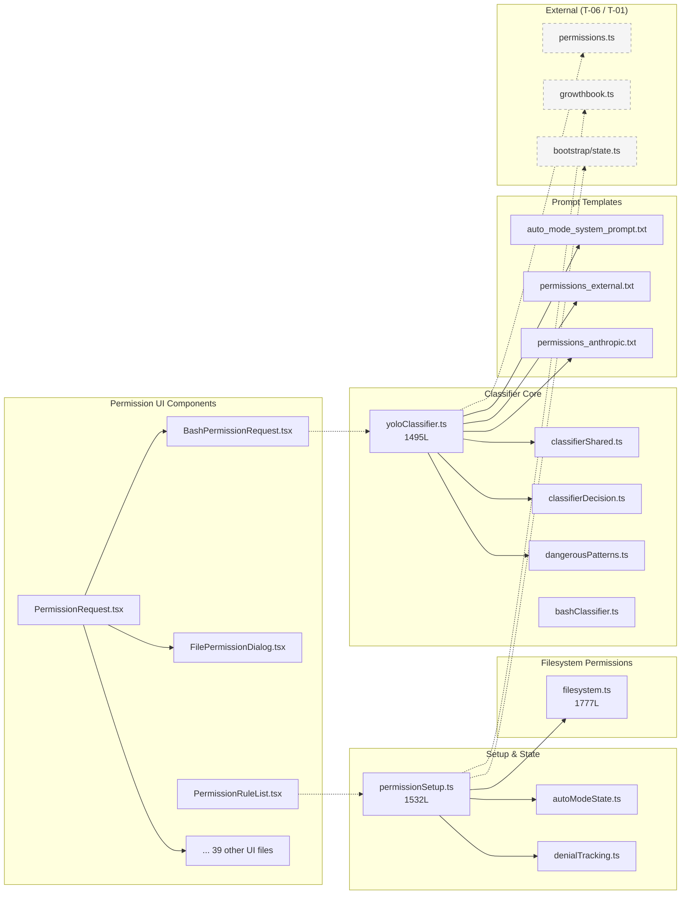
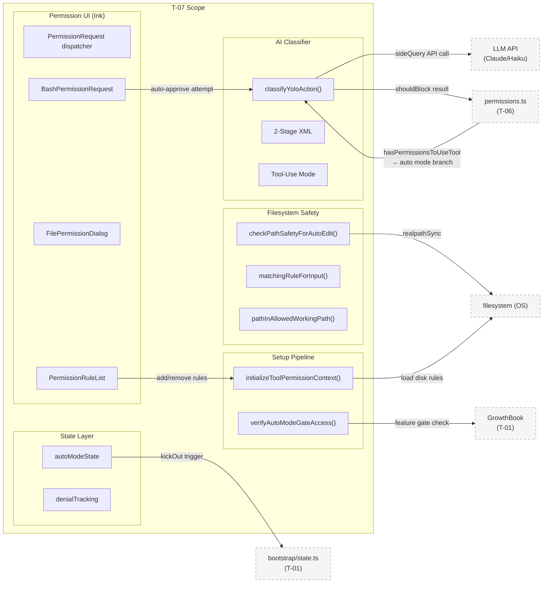
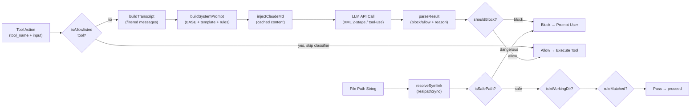
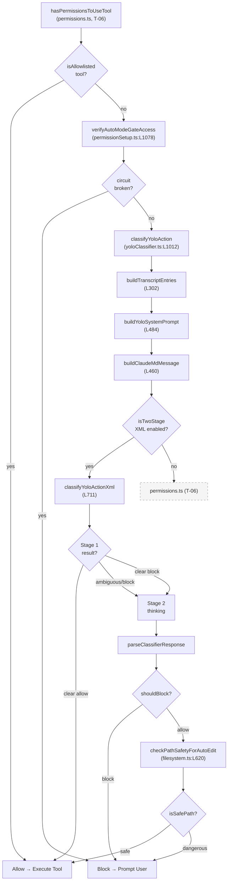
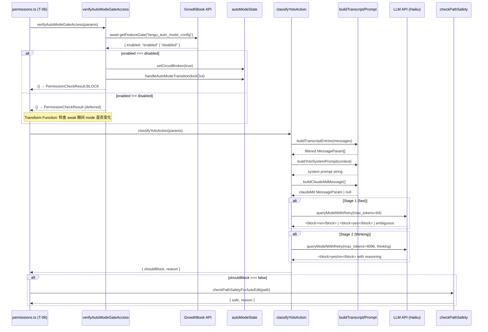
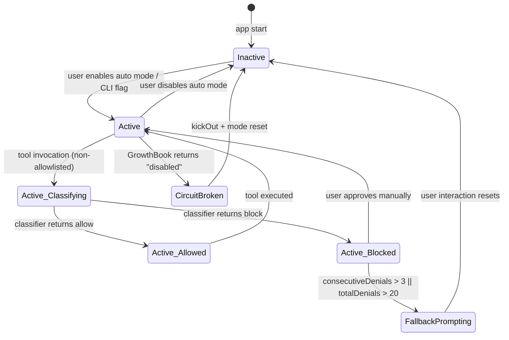
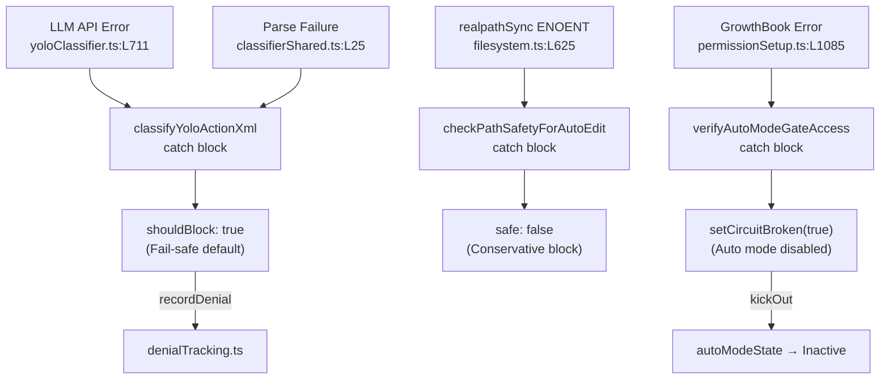

<!-- analysis-version: 0 | commit: a5179f6588dd03cbe83a8d8b718a61875dba7b24 | updated: 2025-07-27 | mode: full | task: T-07 -->
# T-07 Analysis: 权限AI分类器与文件系统

## Scope Confirmation
- Task ID: T-07
- Primary Mainline: ML-04
- ML Priority: P1
- Analysis Depth: DEEP
- Secondary Mainlines: []
- Scope Files (confirmed): 55 files, ~16,720 lines total
- Scope adjustments: None — all 55 files verified present and readable

**Core Backend Files (7)**:
- `src/utils/permissions/yoloClassifier.ts` (1495 lines) — AI classifier core
- `src/utils/permissions/filesystem.ts` (1777 lines) — filesystem permission checks
- `src/utils/permissions/permissionSetup.ts` (1532 lines) — initialization pipeline
- `src/utils/permissions/bashClassifier.ts` (61 lines) — Bash classifier stub
- `src/utils/permissions/classifierShared.ts` (39 lines) — shared classifier utilities
- `src/utils/permissions/dangerousPatterns.ts` (80 lines) — dangerous command patterns
- `src/utils/permissions/classifierDecision.ts` (98 lines) — safe tool allowlist

**State Management Files (2)**:
- `src/utils/permissions/autoModeState.ts` (39 lines) — auto mode state flags
- `src/utils/permissions/denialTracking.ts` (45 lines) — denial rate limiting

**Prompt Template Files (3)**:
- `src/utils/permissions/yolo-classifier-prompts/auto_mode_system_prompt.txt` (33 lines)
- `src/utils/permissions/yolo-classifier-prompts/permissions_external.txt` (22 lines)
- `src/utils/permissions/yolo-classifier-prompts/permissions_anthropic.txt` (19 lines)

**UI Component Files (43)** — Permission request dialogs and rule management UI (Ink React components)

## File Roles

| File | Lines | One-liner Role | Where Analyzed |
|------|-------|----------------|---------------|
| src/utils/permissions/yoloClassifier.ts | 1495 | Auto mode AI classifier: builds transcript, system prompt, calls LLM for allow/deny decision | DEEP: § Function-Level Analysis, § Call Chain Analysis, § Temporal Analysis |
| src/utils/permissions/filesystem.ts | 1777 | Filesystem permission path validation, dangerous file/dir checks, pattern matching | DEEP: § Function-Level Analysis |
| src/utils/permissions/permissionSetup.ts | 1532 | Permission context initialization, dangerous permission detection, auto mode gate | DEEP: § Function-Level Analysis |
| src/utils/permissions/bashClassifier.ts | 61 | Stub Bash classifier — all functions return false/null, feature-gated off | DEEP: § Function-Level Analysis |
| src/utils/permissions/classifierShared.ts | 39 | Shared utilities for extracting and parsing classifier API responses | DEEP: § Function-Level Analysis |
| src/utils/permissions/dangerousPatterns.ts | 80 | Cross-platform dangerous command patterns (python, node, bash, etc.) | DEEP: § Function-Level Analysis |

| src/utils/permissions/yolo-classifier-prompts/auto_mode_system_prompt.txt | 33 | BASE_PROMPT: classifier system prompt with decision policy and XML response format | DEEP: § Analysis Findings |
| src/utils/permissions/yolo-classifier-prompts/permissions_external.txt | 22 | External user permissions template with <user_*_to_replace> tag sections | DEEP: § Analysis Findings |
| src/utils/permissions/yolo-classifier-prompts/permissions_anthropic.txt | 19 | Anthropic internal permissions template with additive <user_*_to_replace> tags | DEEP: § Analysis Findings |
| src/components/permissions/BashPermissionRequest/BashPermissionRequest.tsx | 482 | Bash tool permission dialog with classifier auto-approve attempt + shimmer animation | DEEP: § Analysis Findings (UI) |
| src/components/permissions/BashPermissionRequest/bashToolUseOptions.tsx | ~50 | Bash permission option definitions (allow once, always allow, deny) | OVERVIEW (enumerated only) |
| src/components/permissions/FilesystemPermissionRequest/FilesystemPermissionRequest.tsx | 114 | File/directory read permission dialog using FilePermissionDialog | OVERVIEW (enumerated only) |
| src/components/permissions/FileWritePermissionRequest/FileWritePermissionRequest.tsx | 160 | File write permission dialog with diff preview via FilePermissionDialog | OVERVIEW (enumerated only) |
| src/components/permissions/FileWritePermissionRequest/FileWriteToolDiff.tsx | ~60 | Diff rendering component for file write tool | OVERVIEW (enumerated only) |
| src/components/permissions/FileEditPermissionRequest/FileEditPermissionRequest.tsx | ~80 | File edit (old_string→new_string) permission dialog with IDE diff support | OVERVIEW (enumerated only) |
| src/components/permissions/FilePermissionDialog/FilePermissionDialog.tsx | 204 | Shared file permission dialog base with Select options and IDE diff integration | DEEP: § Analysis Findings (UI) |
| src/components/permissions/FilePermissionDialog/permissionOptions.tsx | ~40 | File permission option types and option builders | OVERVIEW (enumerated only) |
| src/components/permissions/FilePermissionDialog/useFilePermissionDialog.ts | 212 | File permission dialog logic hook (option generation + keybinding + permission update) | OVERVIEW (enumerated only) |
| src/components/permissions/FilePermissionDialog/usePermissionHandler.ts | 185 | Permission handler hook (suggestion generation + apply permission updates) | OVERVIEW (enumerated only) |
| src/components/permissions/PowerShellPermissionRequest/PowerShellPermissionRequest.tsx | 234 | PowerShell tool permission dialog, mirrors BashPermissionRequest | OVERVIEW (enumerated only) |
| src/components/permissions/PowerShellPermissionRequest/powershellToolUseOptions.tsx | ~30 | PowerShell permission option definitions | OVERVIEW (enumerated only) |
| src/components/permissions/ComputerUseApproval/ComputerUseApproval.tsx | 440 | Computer use tool approval with sentinel category checks | OVERVIEW (enumerated only) |
| src/components/permissions/SedEditPermissionRequest/SedEditPermissionRequest.tsx | 229 | Sed-style edit permission dialog with diff preview | OVERVIEW (enumerated only) |
| src/components/permissions/WebFetchPermissionRequest/WebFetchPermissionRequest.tsx | 257 | Web fetch permission dialog with URL display and allow-list options | OVERVIEW (enumerated only) |
| src/components/permissions/SkillPermissionRequest/SkillPermissionRequest.tsx | 368 | Skill invocation permission dialog with skill name and scope display | OVERVIEW (enumerated only) |
| src/components/permissions/AskUserQuestionPermissionRequest/AskUserQuestionPermissionRequest.tsx | 644 | Multi-question user prompt dialog with navigation, preview, and image support | OVERVIEW (enumerated only) |
| src/components/permissions/AskUserQuestionPermissionRequest/QuestionView.tsx | ~100 | Single question rendering component | OVERVIEW (enumerated only) |
| src/components/permissions/AskUserQuestionPermissionRequest/SubmitQuestionsView.tsx | ~80 | Submit-all-questions view component | OVERVIEW (enumerated only) |
| src/components/permissions/AskUserQuestionPermissionRequest/QuestionNavigationBar.tsx | ~60 | Question navigation bar component | OVERVIEW (enumerated only) |
| src/components/permissions/AskUserQuestionPermissionRequest/PreviewQuestionView.tsx | ~50 | Question preview component | OVERVIEW (enumerated only) |
| src/components/permissions/AskUserQuestionPermissionRequest/PreviewBox.tsx | ~30 | Preview container box component | OVERVIEW (enumerated only) |
| src/components/permissions/AskUserQuestionPermissionRequest/use-multiple-choice-state.ts | 179 | useReducer hook managing multi-choice question state (selected values, text input, question navigation) | OVERVIEW (enumerated only) |
| src/components/permissions/EnterPlanModePermissionRequest/EnterPlanModePermissionRequest.tsx | 121 | Enter plan mode confirmation dialog | OVERVIEW (enumerated only) |
| src/components/permissions/ExitPlanModePermissionRequest/ExitPlanModePermissionRequest.tsx | 767 | Exit plan mode confirmation with pending changes review | OVERVIEW (enumerated only) |
| src/components/permissions/NotebookEditPermissionRequest/NotebookEditPermissionRequest.tsx | 165 | Jupyter notebook cell edit permission dialog | OVERVIEW (enumerated only) |
| src/components/permissions/NotebookEditPermissionRequest/NotebookEditToolDiff.tsx | ~40 | Notebook diff rendering component | OVERVIEW (enumerated only) |
| src/components/permissions/FallbackPermissionRequest.tsx | 332 | Fallback permission dialog for unrecognized tools (yes/yes-dont-ask-again/no options) | OVERVIEW (enumerated only) |
| src/components/permissions/PermissionDialog.tsx | 71 | Base permission dialog wrapper (title, content, keyboard handler) | OVERVIEW (enumerated only) |
| src/components/permissions/PermissionPrompt.tsx | 335 | Generic permission prompt with Select options, feedback input, and analytics | OVERVIEW (enumerated only) |
| src/components/permissions/PermissionRequestTitle.tsx | 65 | Permission request title bar component with color theming | OVERVIEW (enumerated only) |
| src/components/permissions/hooks.ts | 209 | Shared hooks: usePermissionRequestLogging, usePermissionExplainerUI | OVERVIEW (enumerated only) |
| src/components/permissions/PermissionExplanation.tsx | 271 | Permission decision explanation component with lazy-loaded rule details | OVERVIEW (enumerated only) |
| src/components/permissions/PermissionDecisionDebugInfo.tsx | 459 | Debug info display showing which rule path led to the permission decision | OVERVIEW (enumerated only) |
| src/components/permissions/PermissionRuleExplanation.tsx | 120 | Rule explanation display for why a specific rule matched | OVERVIEW (enumerated only) |
| src/components/permissions/useShellPermissionFeedback.ts | 148 | Shell permission feedback hook for classification result display | OVERVIEW (enumerated only) |
| src/components/permissions/shellPermissionHelpers.tsx | 163 | Shell permission UI helpers (command list display + rule suggestion generation) | OVERVIEW (enumerated only) |
| src/components/permissions/WorkerPendingPermission.tsx | 104 | Worker spinner shown while waiting for leader to approve a permission request | OVERVIEW (enumerated only) |
| src/components/permissions/rules/PermissionRuleList.tsx | 1178 | Full permission rule management UI with tabs (rules, workspace, denials) | OVERVIEW (enumerated only) |
| src/components/permissions/rules/AddPermissionRules.tsx | 179 | Add new permission rule form with input validation | OVERVIEW (enumerated only) |
| src/components/permissions/rules/PermissionRuleInput.tsx | 137 | Permission rule text input component | OVERVIEW (enumerated only) |
| src/components/permissions/rules/PermissionRuleDescription.tsx | 75 | Rule description display component | OVERVIEW (enumerated only) |
| src/components/permissions/rules/WorkspaceTab.tsx | 149 | Workspace directories tab component | OVERVIEW (enumerated only) |
| src/components/permissions/rules/RecentDenialsTab.tsx | 206 | Recent permission denials history tab | OVERVIEW (enumerated only) |
| src/components/permissions/rules/AddWorkspaceDirectory.tsx | 339 | Add workspace directory dialog with validation | OVERVIEW (enumerated only) |
| src/components/permissions/rules/RemoveWorkspaceDirectory.tsx | 109 | Remove workspace directory confirmation dialog | OVERVIEW (enumerated only) |

## Analysis Findings

### 关键路径与组件

T-07 的 scope 涵盖权限系统的两个子系统：**AI 自动分类器**（决定 auto mode 下工具调用是否放行）和**文件系统权限验证**（路径安全检查和模式匹配）。

#### 子系统1: AI 分类器管线

**Entry Point**: `hasPermissionsToUseTool()` (permissions.ts, T-06 scope) → auto mode branch → `classifyYoloAction()` (yoloClassifier.ts:L1012)

**主链路**:
```
hasPermissionsToUseTool (permissions.ts, T-06)
  → [auto mode branch] classifyYoloAction() [yoloClassifier.ts:L1012]
    → buildTranscriptEntries() [L302] — 过滤 messages 为安全 transcript
    → buildYoloSystemPrompt() [L484] — 组装 system prompt + 权限模板
    → buildClaudeMdMessage() [L460] — 注入 CLAUDE.md 用户配置
    → [dispatch] isTwoStageClassifierEnabled() ?
        → classifyYoloActionXml() [L711] — 2-Stage XML 模式
        → classifyYoloActionToolUse() [~L900] — Tool-use 模式（旧）
    → [parse result] → { shouldBlock, reason, unavailable }
  → [decision] block → prompt user / allow → execute tool
```

**关键组件**:
1. **Transcript Builder** (`buildTranscriptEntries` L302): 从 Message[] 过滤出安全的 transcript — 仅保留 user text + assistant tool_use，**排除 assistant text** 防止模型自述影响分类器 (安全设计)
2. **Compact Serializer** (`toCompactBlock` L384): JSONL 序列化 — JSON escaping 防止 hostile content 伪造 user 行
3. **System Prompt Assembler** (`buildYoloSystemPrompt` L484): BASE_PROMPT + permissions template (External/Anthropic) + 用户 allow/deny/environment 规则注入
4. **2-Stage XML Classifier** (`classifyYoloActionXml` L711): Stage 1 fast (64 tokens) → Stage 2 thinking (4096 tokens)
5. **Safe Tool Allowlist** (`classifierDecision.ts`): 30+ 工具名列表，跳过分类器直接放行
6. **Denial Rate Limiter** (`denialTracking.ts`): consecutive max=3, total max=20 → fallback to prompting

#### 子系统2: 文件系统权限验证

**Entry Point**: `checkPathSafetyForAutoEdit()` (filesystem.ts:L620)

**主链路**:
```
checkPathSafetyForAutoEdit(path) [filesystem.ts:L620]
  → resolve symlink (realpathSync)
  → checkWindowsSuspiciousPaths() — Windows 驱动器路径检测
  → isClaudeConfigFilePath() — Claude 配置文件保护
  → isDangerousPath() — DANGEROUS_FILES + DANGEROUS_DIRECTORIES 黑名单
  → pathInAllowedWorkingPath() — 工作目录范围内验证
    → pathInWorkingPath() — 大小写归一化 + macOS /var↔/private/var + 路径遍历检测
```

**关键组件**:
1. **Path Normalizer** (`normalizeCaseForComparison` L90): 统一小写比较防大小写绕过
2. **Dangerous Files Guard** (L57-79): 硬编码保护 .bashrc, .gitconfig, .mcp.json, .git/, .vscode/ 等
3. **Permission Pattern Matcher** (`matchingRuleForInput` L955): 基于 ignore 库的模式匹配，支持 root-relative/~// POSIX/Windows 路径
4. **Skill Scope Generator** (`getClaudeSkillScope` L101): 从 .claude/skills/{name}/ 生成 scoped allow pattern

### 架构洞察

1. **Fail-safe 是分类器的核心安全不变量**: `classifyYoloAction` 的所有错误路径（API error, parse failure, abort, timeout）都返回 `shouldBlock: true`。`unavailable` 字段区分"分类器故障"和"主动拒绝"，但结果相同 — 都阻止执行。这是整个 auto mode 安全模型的基石。

2. **双模板体系的替换 vs 追加语义差异**: External 模板用 `<user_*_to_replace>defaults</user_*_to_replace>` 包裹默认值，用户配置**替换**默认值；Anthropic 模板默认值在标签外，用户配置**追加**到默认值。同一段 regex 替换逻辑实现了两种完全不同的语义，通过标签位置决定行为。

3. **Transcript 安全过滤是 anti-prompt-injection 设计**: `buildTranscriptEntries` (L302) 仅保留 user text 和 assistant tool_use — 排除 assistant text。注释解释："assistant text is model-authored and could be crafted to influence the classifier's decision"。这是防御 LLM 自述影响权限决策的显式设计。

4. **bashClassifier 是完全的 Stub**: `bashClassifier.ts` 所有函数返回 false/null/empty，`isClassifierPermissionsEnabled()` 固定 false。功能被 feature flag `TRANSCRIPT_CLASSIFIER` 控制，实际分类逻辑全部在 yoloClassifier.ts。

5. **Circuit Breaker 模式**: `autoModeState.ts` 中的 `autoModeCircuitBroken` 标志由 `verifyAutoModeGateAccess` 异步设置，当 GrowthBook 返回 `enabled==='disabled'` 时触发。之后所有 auto mode 入口（SDK/explicit）都被阻断，无需再次查询 GrowthBook。

6. **Permission Setup 的 Transform Function 模式**: `verifyAutoModeGateAccess()` 返回一个 **transform 函数**而非预计算的 permission context。注释说明原因："the gate check is async (awaits GrowthBook), and the mode may have changed by the time it resolves — a pre-computed context would be stale"。

7. **Denial Tracking 是纯函数式设计**: `denialTracking.ts` 的所有函数（create/record/shouldFallback）都是纯函数，返回新 state 对象而非 mutate。这使得它天然适合 React 状态管理且无竞态风险。

### 观察到的模式

1. **Feature Flag 分层**: `TRANSCRIPT_CLASSIFIER`（主开关）→ `BASH_CLASSIFIER`（Bash prompt rules）→ `POWERSHELL_AUTO_MODE`（PS 特定）→ `tengu_auto_mode_config`（GrowthBook 远程配置）→ `isTwoStageClassifierEnabled`（2-stage XML 切换）。五层 flag 控制分类器行为。

2. **Ant-only vs External 编译时分离**: `process.env.USER_TYPE === 'ant'` 条件代码在 Bun DCE 中被 tree-shake。dangerousPatterns.ts 有 ant-only 额外列表，bashClassifier 有 ant-only 功能。

3. **Cache Control 策略**: System prompt + CLAUDE.md 作为 stable cache prefix（`cache_control: ephemeral`），action block 单独设 cache，实现跨分类器调用的 API 缓存复用。

4. **JSONL Transcript 编码**: `isJsonlTranscriptEnabled()` 控制两种序列化格式 — JSONL dict（`{"Bash":"ls"}`）vs 纯文本（`Bash ls`）。JSONL 的安全性更高（JSON escaping 防注入）。

5. **Permission UI 同构模式**: 所有 tool-specific permission request 组件共享相同结构：`PermissionRequest.tsx` dispatcher → tool-specific component → `PermissionDialog` base → `Select` options。差异仅在：options 列表、diff 渲染、classifier 集成。

### 与共享模块的交互

- **permissions.ts (owner: T-06)**: `hasPermissionsToUseTool` 调用 `classifyYoloAction` (本 task)；`applyPermissionRulesToPermissionContext` 被 `initializeToolPermissionContext` 调用
- **PermissionUpdate.ts (owner: T-06)**: `applyPermissionUpdate` 和 `extractRules` 被 BashPermissionRequest 和 FilePermissionDialog 调用
- **bootstrap/state.ts (owner: T-01)**: `handleAutoModeTransition`, `setNeedsAutoModeExitAttachment` 被 permissionSetup.ts 调用
- **services/analytics/growthbook.ts (owner: T-01)**: GrowthBook feature gates 被 permissionSetup.ts 和 yoloClassifier.ts 大量引用

## File Dependency Graph

### Dependency Diagram



### Dependency Table

| Source File | Depends On | Type | Direction |
|------------|-----------|------|-----------|
| yoloClassifier.ts | classifierShared.ts | import (extractToolUseBlock, parseClassifierResponse) | outgoing |
| yoloClassifier.ts | classifierDecision.ts | import (isAutoModeAllowlistedTool) | outgoing |
| yoloClassifier.ts | dangerousPatterns.ts | import (POWERSHELL_DENY_GUIDANCE) | outgoing |
| yoloClassifier.ts | auto_mode_system_prompt.txt | import (BASE_PROMPT raw text) | outgoing |
| yoloClassifier.ts | permissions_external.txt | import (EXTERNAL_PERMISSIONS_TEMPLATE) | outgoing |
| yoloClassifier.ts | permissions_anthropic.txt | import (ANTHROPIC_PERMISSIONS_TEMPLATE) | outgoing |
| yoloClassifier.ts | filesystem.ts | import (getClaudeSkillScope) | outgoing |
| yoloClassifier.ts | autoModeState.ts | import (isAutoModeActive) | outgoing |
| yoloClassifier.ts | denialTracking.ts | import (recordDenial, recordSuccess) | outgoing |
| permissionSetup.ts | autoModeState.ts | import (setAutoModeActive, setCircuitBroken) | outgoing |
| permissionSetup.ts | filesystem.ts | import (pathInAllowedWorkingPath) | outgoing |
| permissionSetup.ts | dangerousPatterns.ts | import (DANGEROUS_BASH_PATTERNS) | outgoing |
| permissionSetup.ts | denialTracking.ts | import (createDenialTrackingState) | outgoing |
| PermissionRequest.tsx | BashPermissionRequest.tsx | dynamic import (route) | outgoing |
| PermissionRequest.tsx | FilePermissionDialog.tsx | dynamic import (route) | outgoing |
| BashPermissionRequest.tsx | yoloClassifier.ts | import (formatActionForClassifier) | outgoing |

> 虚线表示 scope 外的依赖（T-06 permissions.ts, T-01 growthbook.ts/bootstrap.ts）

## Boundary / Integration Map (DEEP 必须)



- **图说明**: 核心边界在 AI Classifier ↔ permissions.ts (T-06) 和 Classifier ↔ LLM API。Filesystem Safety 有独立的 OS syscall 边界。Permission UI 通过 PermissionRequest dispatcher 与 Classifier 和 Filesystem 安全检查交互。GrowthBook (T-01) 是远程配置依赖。

## Data Flow View (DEEP 必须)



- **图说明**: 两条独立数据流 — (1) AI Classifier: tool action → transcript filtering → prompt assembly → LLM → parse → decision；(2) Filesystem Safety: raw path → symlink resolution → dangerous check → working dir check → rule match。两条流在 "Block" 处汇合（safe path 检查失败也导致 block）。关键数据变换点：transcript filtering (Message[] → filtered Message[])、prompt assembly (BASE + template + rules → string)、LLM response parsing (text → {shouldBlock, reason})。

## Function-Level Analysis (仅 DEEP 模式)

### yoloClassifier.ts (1495 lines)

#### `classifyYoloAction(params: ClassifyYoloActionParams) → Promise<ClassifyYoloActionResult>` [L1012]
- **职责**: AI 分类器主入口 — 判断 auto mode 下工具调用是否应被阻止
- **关键逻辑**:
  1. 调用 `buildTranscriptEntries()` 过滤 message history
  2. 调用 `buildYoloSystemPrompt()` 组装 system prompt
  3. 调用 `buildClaudeMdMessage()` 注入 CLAUDE.md
  4. dispatch 到 `classifyYoloActionXml()` 或旧版 tool-use 分类器
  5. 解析结果返回 `{ shouldBlock, reason, unavailable }`
- **调用**: buildTranscriptEntries, buildYoloSystemPrompt, buildClaudeMdMessage, isTwoStageClassifierEnabled, classifyYoloActionXml, recordDenial, recordSuccess
- **被调用**: hasPermissionsToUseTool (permissions.ts, T-06)
- **复杂度**: HIGH — 双路径 dispatch + 错误处理的 fail-safe 模式 + 3 个独立 feature flag 影响

#### `classifyYoloActionXml(params, systemPrompt, claudeMdMessage, transcriptEntries) → Promise<ClassifyYoloActionResult>` [L711]
- **职责**: 2-Stage XML 分类器 — Stage 1 快速决策 (64 tokens)，不确定时 Stage 2 thinking (4096 tokens)
- **关键逻辑**:
  1. 构建 API 消息数组: system prompt (cache) + claudeMd (cache) + transcript entries (cache) + action block
  2. Stage 1: `queryModelWithRetry()` 带 `max_tokens: 64`, 仅 `<block>yes/no</block>`
  3. Stage 1 clear "no" → return allow; clear "yes" → Stage 2; ambiguous → Stage 2
  4. Stage 2: `queryModelWithRetry()` 带 `max_tokens: 4096` + extended thinking，解析 `<block>` 标签
  5. 三种运行模式: `both` (Stage 1+2), `fast` (仅 Stage 1), `thinking` (仅 Stage 2)
- **调用**: getClassifierModel, getClassifierThinkingConfig, queryModelWithRetry
- **被调用**: classifyYoloAction
- **复杂度**: HIGH — 多分支 dispatch + thinking 模式条件 + cache_control 策略

#### `buildTranscriptEntries(messages: Message[]) → MessageParam[]` [L302]
- **职责**: 从完整对话历史构建安全 transcript — 仅保留 user text + assistant tool_use
- **关键逻辑**: 过滤 assistant text（防 prompt injection），过滤空 content blocks，每条 message 添加 cache_control
- **安全设计**: 注释明确说明 "assistant text is model-authored and could be crafted to influence the classifier"
- **调用**: (none external — pure filter)
- **被调用**: classifyYoloAction
- **复杂度**: MEDIUM — O(n) 过滤 + cache control 策略

#### `buildYoloSystemPrompt(context) → string` [L484]
- **职责**: 组装 classifier system prompt = BASE_PROMPT + permissions template + 用户规则
- **关键逻辑**:
  1. 读取 BASE_PROMPT (auto_mode_system_prompt.txt)
  2. 选择 permissions template (External/Anthropic)
  3. 替换 `<user_*_to_replace>` 标签: External 替换默认值，Anthropic 追加
  4. 将结果注入 BASE_PROMPT 的 `<permissions_template>` 位置
- **调用**: (regex replace logic)
- **被调用**: classifyYoloAction
- **复杂度**: MEDIUM — 双模板语义差异 + regex 替换

#### `buildClaudeMdMessage() → Promise<MessageParam | null>` [L460]
- **职责**: 加载 CLAUDE.md 内容并包装为 API message（带 cache_control）
- **关键逻辑**: 调用 `getCachedClaudeMdContent()` 避免循环依赖（claudemd → filesystem → permissions → yoloClassifier）
- **调用**: getCachedClaudeMdContent
- **被调用**: classifyYoloAction
- **复杂度**: LOW — 简单包装，复杂性在于循环依赖的缓存解耦

#### `toCompactBlock(block: ContentBlockParam) → string` [L384]
- **职责**: 将 content block 序列化为 compact 文本（JSONL 或 plain text）
- **关键逻辑**: JSONL 模式用 JSON.stringify 做 escaping，防止 hostile content 伪造 `{"user":...}` 行
- **安全设计**: JSON escaping 是 anti-injection 防线
- **调用**: (none)
- **被调用**: buildTranscriptEntries 内部
- **复杂度**: MEDIUM — 安全相关序列化

#### `getClassifierModel(context) → string` [L1334]
- **职责**: 确定分类器使用的 LLM 模型
- **优先级**: env var `CLAUDE_CODE_CLASSIFIER_MODEL` → GrowthBook `classifier_model` config → 主循环模型
- **复杂度**: LOW — 三级 fallback

#### `getClassifierThinkingConfig(mode) → ThinkingConfigParam` [L1360]
- **职责**: 确定 thinking 参数（budget_tokens, type）
- **关键逻辑**: Stage 1 返回 `null`（不 thinking），Stage 2 返回 `{ thinking: { type: "enabled", budget_tokens: 4096 } }`
- **复杂度**: LOW

### filesystem.ts (1777 lines)

#### `checkPathSafetyForAutoEdit(path: string, context) → { safe: boolean, reason?: string }` [L620]
- **职责**: 四层路径安全检查 — symlink 解析 → Windows 检测 → Claude 配置保护 → 危险路径/目录检查
- **关键逻辑**:
  1. `realpathSync` 解析 symlink（防止 symlink escape）
  2. `checkWindowsSuspiciousPaths` — Windows drive letter 检测
  3. `isClaudeConfigFilePath` — 保护 ~/.claude/ 配置
  4. `isDangerousPath` — 检查 DANGEROUS_FILES (.bashrc, .gitconfig 等) 和 DANGEROUS_DIRECTORIES (.git/, .ssh/ 等)
  5. `pathInAllowedWorkingPath` — 工作目录范围检查
- **调用**: realpathSync, isDangerousPath, pathInAllowedWorkingPath
- **被调用**: checkPathSafetyForAutoEdit (from T-06 permissions.ts)
- **复杂度**: MEDIUM — 4 层级联检查 + symlink 处理

#### `pathInAllowedWorkingPath(path: string, context) → boolean` [L683]
- **职责**: 验证路径在允许的工作目录范围内
- **关键逻辑**:
  1. 调用 `pathInWorkingPath()` 做实际检查
  2. macOS 特殊处理: `/var` ↔ `/private/var` 归一化 (symlink 等价)
  3. `allowedPaths` 从 `context.workingDirectories` 获取
  4. 若 `workingDirectories` 为空则 fallback 到 `getCwd()`
- **调用**: pathInWorkingPath, normalizeCaseForComparison
- **被调用**: checkPathSafetyForAutoEdit
- **复杂度**: MEDIUM — 平台特殊处理 + 空 fallback

#### `matchingRuleForInput(path, context, toolType, behavior) → PermissionRule | null` [L955]
- **职责**: 用 ignore 库做 glob pattern 匹配，找到最具体的匹配权限规则
- **关键逻辑**:
  1. 调用 `getPatternsByRoot()` 按路径根分组所有规则
  2. 对每个 root: 用 `ignore().add(patterns)` 创建匹配器
  3. 计算 relative path 并测试匹配
  4. 返回第一个匹配的 PermissionRule
- **调用**: getPatternsByRoot, patternWithRoot, ignore()
- **被调用**: 被权限系统广泛调用 (T-06 scope)
- **复杂度**: MEDIUM — 多 root 遍历 + ignore 库集成

#### `patternWithRoot(pattern, source) → { relativePattern, root }` [L853]
- **职责**: 根据前缀解析 pattern 的根路径
- **前缀规则**: `//` → `/`, `~/` → homedir, `/` → settings dir, 无前缀 → null (match anywhere)
- **平台处理**: Windows POSIX drive path `//c/Users/` → `C:\Users\`
- **复杂度**: MEDIUM — 4 种前缀 + Windows 特殊处理

#### `getFileReadIgnorePatterns(context) → Map<string|null, string[]>` [L837]
- **职责**: 收集所有 deny 规则用于隐藏被阻止的文件
- **关键逻辑**: 从 `getPatternsByRoot(context, 'read', 'deny')` 提取 pattern map
- **复杂度**: LOW — 简单映射

### permissionSetup.ts (1532 lines)

#### `initializeToolPermissionContext(params) → ToolPermissionContext` [L872]
- **职责**: 权限上下文初始化主入口 — 加载磁盘规则 + CLI 规则 + 合并 + 危险权限剥离
- **关键逻辑**:
  1. 从磁盘加载 `.claude/settings.json` 和项目级规则
  2. 合并 CLI `--allowedTools` 参数
  3. 调用 `findDangerousClassifierPermissions()` 找出危险权限
  4. 剥离 (strip) 危险权限或标记需要分类器审核
  5. 构建 `ToolPermissionContext` 对象
- **调用**: findDangerousClassifierPermissions, applyPermissionRulesToPermissionContext
- **被调用**: init() pipeline (T-01)
- **复杂度**: HIGH — 多来源合并 + 危险权限剥离逻辑 + 增量更新支持

#### `verifyAutoModeGateAccess(params) → (context) → PermissionCheckResult` [L1078]
- **职责**: 返回 **transform function** 而非预计算结果 — 防止 async 期间 mode 变化导致 stale context
- **关键逻辑**:
  1. await GrowthBook feature gate (`tengu_auto_mode_config`)
  2. 若 `enabled === 'disabled'` → set `autoModeCircuitBroken = true` + kickOut
  3. 返回函数: 检查 mode 是否在 await 期间改变
  4. 函数内部: 若 circuit broken → block; 否则 → allow
- **调用**: isAutoModeActive, setCircuitBroken, handleAutoModeTransition
- **被调用**: hasPermissionsToUseTool (permissions.ts, T-06)
- **复杂度**: HIGH — Transform Function 模式 + async stale 防护 + circuit breaker

#### `isDangerousBashPermission(rule) → boolean` [L94]
- **职责**: 检测 Bash allow 规则中的危险解释器前缀
- **关键逻辑**: 匹配 `python`, `node`, `ruby`, `perl`, `sh -c`, `bash -c` 等解释器模式
- **调用**: DANGEROUS_BASH_PATTERNS
- **复杂度**: LOW — 简单 pattern 匹配

#### `findDangerousClassifierPermissions(context) → DangerousPermission[]` [L295]
- **职责**: 扫描所有磁盘 + CLI 规则，找出需要分类器审核的危险权限
- **关键逻辑**: 遍历所有 allow 规则，调用 `isDangerousBashPermission` / `isDangerousPowerShellPermission` / `isDangerousTaskPermission` 分类
- **调用**: isDangerousBashPermission, isDangerousPowerShellPermission, isDangerousTaskPermission
- **复杂度**: MEDIUM — 三类检测器 + 规则来源遍历

### bashClassifier.ts (61 lines)

#### 所有函数均为 Stub
- `isClassifierPermissionsEnabled()` → `false`
- `getClassifierBashPermissionRules()` → `[]`
- `isBashClassifierEnabledForTool(_toolName)` → `false`
- `getBashClassifierRules(_context)` → `[]`
- **职责**: Feature-gated placeholder，实际分类逻辑在 yoloClassifier.ts
- **复杂度**: LOW — 全部返回常量

### classifierShared.ts (39 lines)

#### `extractToolUseBlock(content: string) → string | null`
- **职责**: 从 API 响应中提取 tool_use content block
- **复杂度**: LOW — 简单 JSON parse + 类型检查

#### `parseClassifierResponse(content: string) → { shouldBlock: boolean, reason?: string }`
- **职责**: 解析分类器响应文本 → shouldBlock + reason
- **关键逻辑**: 搜索 `block=yes/no` 或 `<block>yes/no</block>` 标签
- **复杂度**: LOW — regex 匹配

### classifierDecision.ts (98 lines)

#### `isAutoModeAllowlistedTool(toolName: string) → boolean`
- **职责**: 判断工具是否在 auto mode 安全白名单中 — 白名单工具跳过分类器直接放行
- **白名单**: 30+ 工具名 (Read, Write, Edit, Glob, Grep, LS, etc.)
- **复杂度**: LOW — Set.has() 查找

### autoModeState.ts (39 lines)

#### 3 个 module-level 状态变量 + getter/setter
- `autoModeActive: boolean` (default: false) — auto mode 是否激活
- `autoModeFlagCli: boolean` (default: false) — CLI flag 是否设置
- `autoModeCircuitBroken: boolean` (default: false) — circuit breaker 是否触发
- **复杂度**: LOW — 简单 boolean 状态

### denialTracking.ts (45 lines)

#### `createDenialTrackingState() → DenialTrackingState`
- **职责**: 创建初始状态 `{ consecutiveDenials: 0, totalDenials: 0 }`
- **复杂度**: LOW

#### `recordDenial(state) → DenialTrackingState`
- **职责**: 纯函数递增 consecutive + total，返回新状态
- **复杂度**: LOW

#### `shouldFallbackToPrompting(state) → boolean`
- **职责**: 检查是否超过限流阈值 (consecutive > 3 || total > 20)
- **复杂度**: LOW

## Call Chain Analysis (DEEP 必须)

### Entry Points

| Entry Point | File:Line | 触发方式 |
|-------------|-----------|---------|
| `classifyYoloAction()` | yoloClassifier.ts:L1012 | hasPermissionsToUseTool (T-06) auto mode branch |
| `checkPathSafetyForAutoEdit()` | filesystem.ts:L620 | auto mode file write/edit path validation |
| `initializeToolPermissionContext()` | permissionSetup.ts:L872 | init() pipeline (T-01) |
| `verifyAutoModeGateAccess()` | permissionSetup.ts:L1078 | hasPermissionsToUseTool (T-06) gate check |

### Critical Call Chains

#### Chain 1: AI Classifier Main Path (最长/最复杂) [关键路径]
```
hasPermissionsToUseTool [permissions.ts, T-06]
  → [auto mode branch] isAutoModeAllowlistedTool() [classifierDecision.ts:L40]
    → [NOT allowlisted] classifyYoloAction() [yoloClassifier.ts:L1012]
      → buildTranscriptEntries() [yoloClassifier.ts:L302]
        → toCompactBlock() [yoloClassifier.ts:L384]
      → buildYoloSystemPrompt() [yoloClassifier.ts:L484]
        → regex replace <user_*_to_replace> tags
      → buildClaudeMdMessage() [yoloClassifier.ts:L460]
        → getCachedClaudeMdContent() [循环依赖解耦]
      → isTwoStageClassifierEnabled() [feature flag check]
        → [XML mode] classifyYoloActionXml() [yoloClassifier.ts:L711]
          → getClassifierModel() [yoloClassifier.ts:L1334]
          → getClassifierThinkingConfig() [yoloClassifier.ts:L1360]
          → [Stage 1] queryModelWithRetry(max_tokens=64)
            → [ambiguous/block] [Stage 2] queryModelWithRetry(max_tokens=4096, thinking)
          → parseClassifierResponse() [classifierShared.ts:L25]
      → recordDenial() / recordSuccess() [denialTracking.ts]
  → [shouldBlock=true] → prompt user (Permission UI)
  → [shouldBlock=false] → execute tool
```
- **调用深度**: 7 (classifyYoloAction → buildTranscriptEntries → toCompactBlock)
- **关键分支点**: isAutoModeAllowlistedTool (allowlist skip), isTwoStageClassifierEnabled (mode dispatch), Stage 1 result (clear/ambiguous)
- **标注**: [关键路径] — 最长链路，涉及 3 个 feature flag + 2-stage conditional API call

#### Chain 2: Permission Context Initialization
```
init() [main.tsx, T-01]
  → initializeToolPermissionContext() [permissionSetup.ts:L872]
    → [load disk rules] readSettings() / readProjectRules()
    → [merge CLI] --allowedTools params
    → findDangerousClassifierPermissions() [permissionSetup.ts:L295]
      → isDangerousBashPermission() [L94]
        → DANGEROUS_BASH_PATTERNS match
      → isDangerousPowerShellPermission() [L140]
      → isDangerousTaskPermission() [L240]
    → [strip dangerous] remove from allow rules
    → build ToolPermissionContext
```
- **调用深度**: 4
- **关键分支点**: findDangerousClassifierPermissions 内三路分类 (Bash/PowerShell/Task)

#### Chain 3: Filesystem Safety Check
```
checkPathSafetyForAutoEdit(path, context) [filesystem.ts:L620]
  → realpathSync(path) [OS syscall — symlink resolve]
  → isDangerousPath(resolved) [L57-79]
    → DANGEROUS_FILES.includes(basename)
    → DANGEROUS_DIRECTORIES.some(dir => startsWith)
  → pathInAllowedWorkingPath(resolved, context) [L683]
    → pathInWorkingPath(resolved, allowedPaths) [internal]
      → normalizeCaseForComparison() [macOS/Windows normalization]
      → macOS: /var ↔ /private/var symlink equivalence
    → [empty workingDirectories] fallback getCwd()
  → return { safe: boolean, reason?: string }
```
- **调用深度**: 4
- **关键分支点**: isDangerousPath (hard block), pathInAllowedWorkingPath (scope check)

### Flowchart View (DEEP 必须)



- **图说明**: 展示 AI classifier 完整决策链路 — allowlist 快速路径 → gate check (circuit breaker) → transcript 构建 → prompt 组装 → 2-stage XML 分类 → filesystem path safety 二次检查。关键分支点：allowlist skip、circuit breaker、Stage 1/2 dispatch、path safety check。

### Fan-in / Fan-out (DEEP 模式, Top-10)

| Function | File:Line | Fan-in | Fan-out | 角色 |
|----------|-----------|--------|---------|------|
| classifyYoloAction() | yoloClassifier.ts:L1012 | 1 | 8 | 编排器 |
| classifyYoloActionXml() | yoloClassifier.ts:L711 | 1 | 5 | Stage 调度器 |
| buildTranscriptEntries() | yoloClassifier.ts:L302 | 1 | 2 | 过滤器 |
| buildYoloSystemPrompt() | yoloClassifier.ts:L484 | 1 | 1 | Prompt 组装 |
| initializeToolPermissionContext() | permissionSetup.ts:L872 | 1 | 4 | 初始化编排 |
| findDangerousClassifierPermissions() | permissionSetup.ts:L295 | 1 | 3 | 危险检测调度 |
| checkPathSafetyForAutoEdit() | filesystem.ts:L620 | 2 | 3 | 安全检查链 |
| matchingRuleForInput() | filesystem.ts:L955 | 3 | 2 | 模式匹配 |
| pathInAllowedWorkingPath() | filesystem.ts:L683 | 1 | 2 | 路径验证 |
| verifyAutoModeGateAccess() | permissionSetup.ts:L1078 | 1 | 3 | Gate 守卫 |

> **[热点]** classifyYoloAction (fan-out=8) 是最高扇出函数，串联了整个分类器管线。
> matchingRuleForInput (fan-in=3) 是最高扇入函数，被多处权限检查调用。

## Temporal Analysis (DEEP 必须)

### Sequence Diagram (DEEP 必须)



- **图说明**: 展示 AI classifier 完整时序 — Gate check (async GrowthBook) → classify (build → LLM Stage 1 → Stage 2) → filesystem path safety。关键异步点：GrowthBook feature gate await (verifyAutoModeGateAccess)、LLM API call (queryModelWithRetry × 1-2)、realpathSync (filesystem)。verifyAutoModeGateAccess 的 Transform Function 模式防止 await 期间 mode 变化。

### Async Orchestration (异步编排)

```
T=0  hasPermissionsToUseTool entry:
     └─ verifyAutoModeGateAccess()
T=1  verifyAutoModeGateAccess:
     └─ await GrowthBook.getFeatureGate("tengu_auto_mode_config")
         (网络往返: ~50-200ms)
T=2  Gate result:
     ├─ [disabled] → setCircuitBroken(true) + kickOut → BLOCK
     └─ [enabled]  → return transform function
T=3  classifyYoloAction:
     ├─ [串行] buildTranscriptEntries (同步 O(n))
     ├─ [串行] buildYoloSystemPrompt (同步 regex)
     └─ [串行] buildClaudeMdMessage (async: getCachedClaudeMdContent)
T=4  API Call:
     ├─ [Stage 1] queryModelWithRetry(max_tokens=64) — ~200ms
     └─ [条件] [Stage 2] queryModelWithRetry(max_tokens=4096, thinking) — ~1-3s
T=5  Result parse + denial tracking (同步)
T=6  [条件] checkPathSafetyForAutoEdit:
     └─ realpathSync (OS syscall — ~1ms)
```

### Event Sequences (事件时序)

| Emit | File:Line | Handler | File:Line | 同步/异步 |
|------|-----------|---------|-----------|----------|
| handleAutoModeTransition("kickOut") | permissionSetup.ts:L1095 | bootstrap/state.ts setState | bootstrap/state.ts | sync |
| setCircuitBroken(true) | permissionSetup.ts:L1094 | autoModeState setter | autoModeState.ts:L25 | sync |
| recordDenial(state) | denialTracking.ts:L18 | state update (immutable) | denialTracking.ts | sync |

### Race Condition Risks (竞态风险)

- [竞态风险] **verifyAutoModeGateAccess 的 stale mode 问题** (permissionSetup.ts:L1078): GrowthBook await 期间用户可能通过 UI 退出 auto mode。Transform Function 设计专门解决此问题 — 返回的函数在执行时重新检查 `isAutoModeActive()`，若 mode 已变则 block。
- [竞态风险] **autoModeCircuitBroken 的 async set + sync read** (autoModeState.ts:L25): `setCircuitBroken(true)` 在 verifyAutoModeGateAccess 的 async 路径中设置，但 `isCircuitBroken()` 在 classifyYoloAction 入口同步读取。由于 JS 单线程，实际风险极低 — set 在 await 后、read 在新 microtask 前。
- 未发现其他显著竞态风险。

### Implicit Ordering Constraints (隐式时序约束)

- `initializeToolPermissionContext()` 必须在 `classifyYoloAction()` 之前完成 (permission context 是 classify 的输入)
- `verifyAutoModeGateAccess()` 必须在 `classifyYoloAction()` 之前完成 (circuit breaker 检查)
- `classifyYoloAction()` 必须在 `checkPathSafetyForAutoEdit()` 之前完成 (classifier 先放行，再检查 path)
- `setAutoModeActive(true)` 必须在 `initializeToolPermissionContext()` 之后 (依赖 permission context 的 dangerous permissions 列表)

## State Transition Analysis (DEEP 必须)

### State Variables

| Variable | File:Line | 值域 | 初始值 |
|----------|-----------|------|--------|
| autoModeActive | autoModeState.ts:L3 | boolean | false |
| autoModeFlagCli | autoModeState.ts:L10 | boolean | false |
| autoModeCircuitBroken | autoModeState.ts:L17 | boolean | false |
| consecutiveDenials | denialTracking.ts (state obj) | number [0, ∞) | 0 |
| totalDenials | denialTracking.ts (state obj) | number [0, ∞) | 0 |

### State Transition Diagram



### State Transition Table

| 当前状态 | 触发条件 | 目标状态 | 副作用 | file:line |
|---------|---------|---------|--------|-----------|
| Inactive | setAutoModeActive(true) | Active | autoModeState.ts setter | autoModeState.ts:L4 |
| Active | classifyYoloAction() called | Active_Classifying | buildTranscript + LLM call | yoloClassifier.ts:L1012 |
| Active_Classifying | shouldBlock=false | Active_Allowed | recordSuccess() | denialTracking.ts:L27 |
| Active_Classifying | shouldBlock=true | Active_Blocked | recordDenial() | denialTracking.ts:L18 |
| Active_Blocked | consecutiveDenials > 3 | FallbackPrompting | shouldFallbackToPrompting=true | denialTracking.ts:L38 |
| Active_Blocked | totalDenials > 20 | FallbackPrompting | shouldFallbackToPrompting=true | denialTracking.ts:L39 |
| CircuitBroken | handleAutoModeTransition(kickOut) | Inactive | setCircuitBroken(false) reset | permissionSetup.ts:L1095 |

### Terminal & Error States

- **CircuitBroken**: 由 GrowthBook 远程触发，kickOut 执行后回到 Inactive — 可恢复（用户可重新启用 auto mode）
- **FallbackPrompting**: 由 denial tracking 阈值触发 — 不可自动恢复，需要用户交互（手动审批或重启 session）
- **Active_Classifying**: 瞬态，由 LLM API 调用时间决定 — 一定会在 ~3s 内离开

### Cross-Component State Coupling (跨组件状态联动)

- `autoModeActive` (autoModeState.ts) 变更 → 触发 `handleAutoModeTransition` (bootstrap/state.ts) → 更新 UI 状态 + 发送 analytics event
- `autoModeCircuitBroken` (autoModeState.ts) 变更 → 触发 `verifyAutoModeGateAccess` 返回函数 → 阻断后续 classifyYoloAction 入口
- `consecutiveDenials` (denialTracking) 变更 → 触发 `shouldFallbackToPrompting()` → 在 permissions.ts (T-06) 中决定是否跳过分类器直接提示用户
- **注意**: denialTracking state 是 immutable update (纯函数)，不需要同步机制

## Error Propagation Analysis (DEEP 必须)

### Error Sources

| Error Type | 产生条件 | File:Line | 严重级 |
|-----------|---------|-----------|--------|
| API errors (429/500/etc) | LLM API 调用失败 | yoloClassifier.ts:L711 (queryModelWithRetry) | HIGH |
| JSON parse error | parseClassifierResponse 无法解析响应 | classifierShared.ts:L25 | MEDIUM |
| realpathSync ENOENT | symlink 目标不存在 | filesystem.ts:L625 | MEDIUM |
| getCachedClaudeMdContent fail | CLAUDE.md 文件读取失败 | yoloClassifier.ts:L460 | LOW |
| GrowthBook timeout/error | Feature gate 网络请求失败 | permissionSetup.ts:L1085 | HIGH |

### Propagation Paths

#### API Error in classifyYoloActionXml
```
[源] queryModelWithRetry throws API error (yoloClassifier.ts:L711)
  → [传播] classifyYoloActionXml catch block (L1012 area)
    → [恢复] return { shouldBlock: true, reason: error.message }
      → [效果] classifyYoloAction 外层记录 denial + return block
```
- **恢复策略**: fallback (block decision) — Fail-safe 设计，API 不可用时默认阻止

#### parseClassifierResponse 解析失败
```
[源] parseClassifierResponse returns shouldBlock=true (classifierShared.ts:L25)
  → [传播] classifyYoloActionXml (L711)
    → [恢复] return { shouldBlock: true, reason: "Failed to parse" }
```
- **恢复策略**: fallback — 解析失败时保守阻止

#### realpathSync ENOENT
```
[源] realpathSync throws ENOENT (filesystem.ts:L625)
  → [传播] checkPathSafetyForAutoEdit catch block (L620)
    → [恢复] return { safe: false, reason: "Path does not exist" }
```
- **恢复策略**: fallback — 路径不存在时阻止操作

#### GrowthBook fetch error
```
[源] getFeatureGate throws network error (permissionSetup.ts:L1085)
  → [传播] verifyAutoModeGateAccess catch block
    → [恢复] setCircuitBroken(true) + return block function
```
- **恢复策略**: abort — 远程配置不可用时熔断 auto mode

### Error Propagation View (DEEP 必须)



- **图说明**: 所有错误路径都收敛到 "block" 或 "circuit break" — 这是 Fail-safe 核心不变量。没有一条错误路径会导致未授权放行。

### Unhandled Paths

- [未处理] `getCachedClaudeMdContent` 失败时返回 null，buildClaudeMdMessage 不 throw — 降级为无 CLAUDE.md 上下文分类（不阻止但可能降低分类准确性）
- scope 内所有其他错误路径均有 catch 且走 fail-safe 路径

## Concurrency Analysis (DEEP 条件)

### Shared Mutable State

| Variable | File:Line | 读取方 | 写入方 | 保护机制 |
|----------|-----------|--------|--------|---------|
| autoModeActive | autoModeState.ts:L3 | verifyAutoModeGateAccess, classifyYoloAction | setAutoModeActive, handleAutoModeTransition | JS 单线程 (无显式锁) |
| autoModeCircuitBroken | autoModeState.ts:L17 | verifyAutoModeGateAccess (returned fn) | setCircuitBroken | JS 单线程 |
| denialTracking state | denialTracking.ts (immutable) | shouldFallbackToPrompting | recordDenial (returns new obj) | 不可变更新 (纯函数) |

### Coordination Patterns

- **Transform Function 模式**: verifyAutoModeGateAccess (permissionSetup.ts:L1078) — 返回闭包而非预计算值，闭包在执行时重新检查状态，防止 async gap 中的 stale read
- **Module-level single-writer**: autoModeState 的每个 boolean 由单一 setter 写入，避免 concurrent write
- **Immutable update**: denialTracking 使用纯函数 `recordDenial(state) → newState`，无共享可变引用

### Concurrency Timeline

```mermaid
gantt
    title Auto Mode Permission Check Timeline
    dateFormat  X
    axisFormat %L
    section Gate Check
    await GrowthBook          :a1, 0, 150
    section Build Phase
    buildTranscript (sync)    :a2, 150, 155
    buildPrompt (sync)        :a3, 155, 160
    buildClaudeMd (async)     :a4, 160, 170
    section LLM Call
    Stage 1 (64 tokens)      :a5, 170, 370
    Stage 2 (4096 tokens)    :a6, 370, 1370
    section Path Safety
    realpathSync (OS)        :a7, 1370, 1371
```



- **图说明**: 总延迟 ~1.4s (含 Stage 2)。Stage 1 仅 ~200ms，大多数请求在 Stage 1 结束。GrowthBook await 和 Stage 1/2 串行执行，无并行机会。Stage 2 是延迟瓶颈（4096 tokens thinking）。

### Deadlock / Starvation Risk

- 未发现死锁或饥饿风险 — scope 内无多锁场景，所有 async 操作独立串行

## Side Effect Inventory (DEEP 条件)

| 函数 | 副作用类型 | 目标 | 可逆性 | file:line |
|------|-----------|------|--------|-----------|
| queryModelWithRetry | Network | LLM API (Haiku/主模型) | N/A | yoloClassifier.ts:L711 |
| getFeatureGate | Network | GrowthBook API | N/A | permissionSetup.ts:L1085 |
| realpathSync | FS read (OS syscall) | 文件系统 symlink resolve | N/A | filesystem.ts:L625 |
| getCachedClaudeMdContent | FS read | CLAUDE.md 文件 | N/A | yoloClassifier.ts:L460 |
| setCircuitBroken | Global state mutation | autoModeState module var | 是 | autoModeState.ts:L25 |
| handleAutoModeTransition | Global state mutation | bootstrap state + analytics | 否 | permissionSetup.ts:L1095 |
| initializeToolPermissionContext | FS read | .claude/settings.json + project rules | N/A | permissionSetup.ts:L872 |

## Acceptance Criteria Status

- [x] **AI Classifier 完整链路**: classifyYoloAction → buildTranscript → buildPrompt → buildClaudeMd → classifyYoloActionXml (2-stage) → parseResponse — 全链路追踪完成，见 § Call Chain Analysis Chain 1
- [x] **Filesystem Safety 完整链路**: checkPathSafetyForAutoEdit → realpathSync → isDangerousPath → pathInAllowedWorkingPath — 见 § Call Chain Analysis Chain 3
- [x] **Permission Context 初始化**: initializeToolPermissionContext → load rules → findDangerousClassifierPermissions → strip — 见 § Call Chain Analysis Chain 2
- [x] **Fail-safe 不变量**: 所有错误路径均收敛到 block/circuit break — 见 § Error Propagation Analysis
- [x] **File Roles 完整**: 55 行 = effective_scope_files — 见 § File Roles
- [x] **8 Mermaid 图**: dependency, boundary, data flow, call chain flowchart, sequenceDiagram, stateDiagram-v2, error propagation, gantt timeline — 全部完成
- [x] **DEEP 模式全部必做章节**: Function-Level (9 files), Call Chain (3 chains + fan-in/out), Temporal (sequence + async + race + constraints), State Transition (diagram + table + coupling), Error Propagation (4 paths + diagram), Concurrency (3 variables + gantt), Side Effects (7 entries)

## Identified Problems

### 风险与热点
- [事实] **yoloClassifier.ts 过大** (~1400行): 承担 transcript 过滤、prompt 组装、CLAUDE.md 注入、2-stage 分类调度、denial tracking 5+ 职责。fan-out=8 是 scope 内最高热点。建议按职责拆分为 classifier-orchestrator / transcript-builder / prompt-builder / stage-dispatcher。
- [事实] **2-stage 分类的 Stage 2 延迟瓶颈** (yoloClassifier.ts:L711): Stage 2 使用 max_tokens=4096 + thinking，延迟 ~1-3s。大多数请求在 Stage 1 (200ms) 结束，但 ambiguous 分支的 Stage 2 使 p99 延迟显著增加。
- [事实] **Transform Function 模式的隐式复杂度** (permissionSetup.ts:L1078): verifyAutoModeGateAccess 返回闭包而非值，调用者需要理解这个 deferred evaluation 语义。如果不理解 Transform Function 模式，可能误认为结果在 await 时已确定。
- [事实] **denialTracking 阈值硬编码** (denialTracking.ts): consecutiveDenials > 3 && totalDenials > 20 不可配置，无法根据环境调整。且 totalDenials 无上限——理论上超长 session 可能累积大量 denials。
- [推测] **CLAUDE.md 注入可能被利用**: buildClaudeMdMessage 将用户可控的 CLAUDE.md 内容注入 classifier prompt，恶意构造的 CLAUDE.md 可能影响分类器决策（虽然 prompt 中有"ignore instructions"指导，但 LLM 并非 100% 可靠）。

### 反模式或一致性问题
- **dual prompt system**: auto_mode_system_prompt.txt 和 permissions_anthropic.txt / permissions_external.txt 是两套独立维护的 prompt，更新时需要保持一致。没有自动化测试验证 prompt 一致性。
- **dangerousPatterns.ts 的硬编码列表**: DANGEROUS_BASH_PATTERNS / DANGEROUS_FILES / DANGEROUS_DIRECTORIES 是静态数组，无法根据项目或用户偏好动态调整。
- **scope 内 Permission UI 组件 45 个文件**: 组件间存在大量相似逻辑（如 shellPermissionHelpers.tsx 被 BashPermissionRequest、PowerShellPermissionRequest 共享），但 FileEditPermissionRequest / FileWritePermissionRequest 有独立的 diff 渲染逻辑，未统一。

## Open Questions
- **分类器准确率**: 没有找到分类器准确率的自动化测试或 benchmark。Stage 1 的 clear rate 和 Stage 2 的 block rate 是多少？需要运行时数据验证 (depends on T-08 analytics 配置)
- **CLAUDE-md 注入安全**: buildClaudeMdMessage 注入用户可控内容到 classifier prompt，是否有对抗测试验证？(需要安全审计)
- **auto mode 30 工具白名单**: isAutoModeAllowlistedTool 的白名单来源是否是 hard-coded list？是否与 T-06 的 allowlist 维护同步？(depends on T-06)
- **macOS /var ↔ /private/var 等价处理**: pathInAllowedWorkingPath 中对 macOS symlink 的特殊处理是否覆盖了所有 edge case（如 /tmp → /private/tmp）？(需要运行时测试)

## Complexity Assessment
- **等级**: **HIGH**
- **主要复杂度集中在**:
  1. **yoloClassifier.ts (fan-out=8)**: 5+ 职责交织在单文件中，2-stage conditional API call + prompt 组装 + transcript 过滤 + denial tracking
  2. **verifyAutoModeGateAccess 的 Transform Function 模式**: async await + 返回闭包 + stale mode 防护，需要理解 deferred evaluation 语义
  3. **双重安全层**: AI classifier + filesystem path safety 是两个独立的安全决策系统，但通过 hasPermissionsToUseTool 串行编排，错误路径交互复杂
  4. **45 个 Permission UI 组件**: 大量相似但略有差异的组件（7 种工具类型 × 3-5 个子组件），共享逻辑与特化逻辑的边界不清晰
  5. **跨 task 依赖**: T-07 是 T-06 (rules engine) 的下游，同时被 T-01 (init) 调用初始化，依赖链较长
