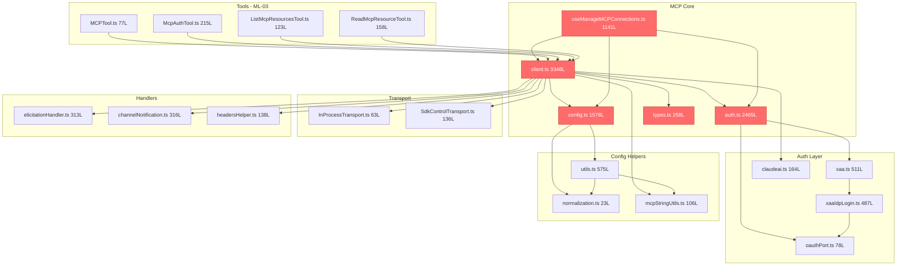
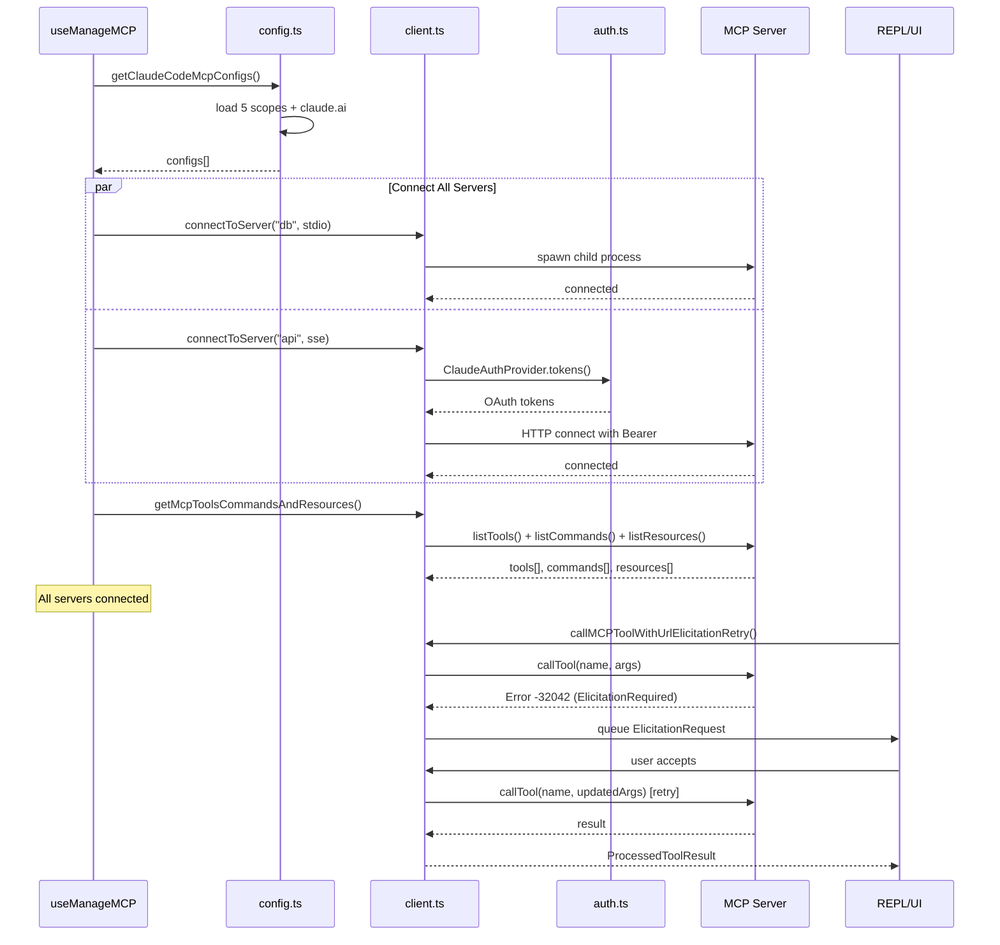
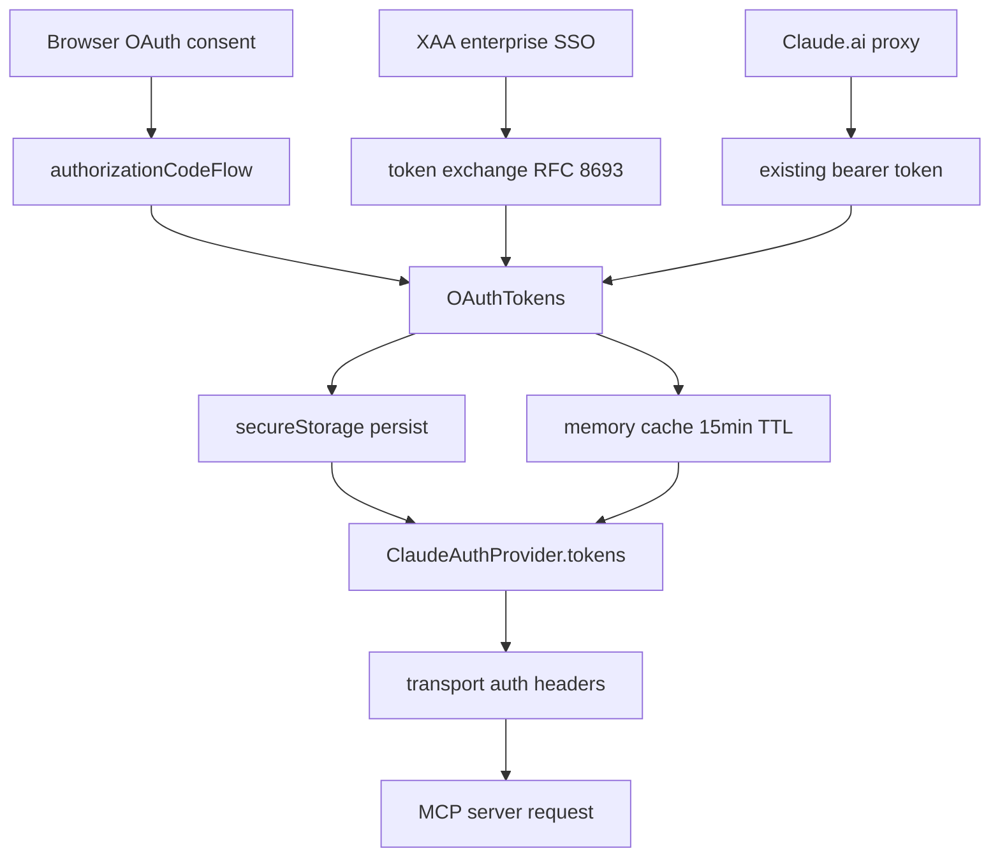
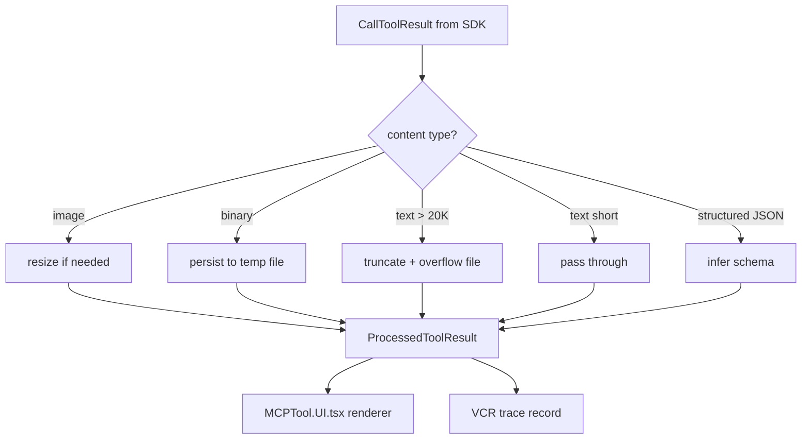
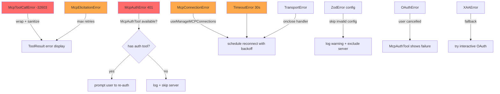
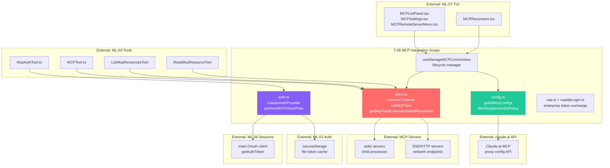

&lt;!-- analysis-version: 0 | commit: a5179f6 | updated: 2025-07-25 | mode: full | task: T-08 --&gt;
# T-08 Analysis: MCP服务集成

## Scope Confirmation
- Task ID: T-08
- Primary Mainline: ML-05
- ML Priority: P1
- Analysis Depth: DEEP
- Secondary Mainlines: ML-03
- Scope Files (confirmed): 85 files, 31,785 lines, 0 missing
- Scope adjustments: None
- Dependencies: T-06 (permission-classifier)

## File Roles （85 files）

| File | Lines | One-liner Role | Where Analyzed |
|------|-------|----------------|---------------|
| src/components/mcp/CapabilitiesSection.tsx | 61 | React component rendering MCP server capabilities list | DEEP: § Analysis Findings |
| src/components/mcp/MCPAgentServerMenu.tsx | 183 | Dropdown menu for agent-based MCP server selection | DEEP: § Analysis Findings |
| src/components/mcp/MCPListPanel.tsx | 504 | Main panel listing all connected MCP servers with status | DEEP: § Analysis Findings |
| src/components/mcp/MCPReconnect.tsx | 167 | UI component for manual MCP server reconnection trigger | DEEP: § Analysis Findings |
| src/components/mcp/MCPRemoteServerMenu.tsx | 649 | Context menu for remote (SSE/HTTP) MCP server operations | DEEP: § Analysis Findings |
| src/components/mcp/MCPSettings.tsx | 398 | Settings panel for MCP server configuration management | DEEP: § Analysis Findings |
| src/components/mcp/MCPStdioServerMenu.tsx | 177 | Context menu for stdio MCP server operations (restart/logs) | DEEP: § Analysis Findings |
| src/components/mcp/MCPToolDetailView.tsx | 212 | Detailed view of a single MCP tool with schema display | DEEP: § Analysis Findings |
| src/components/mcp/MCPToolListView.tsx | 141 | List view of all tools exposed by an MCP server | DEEP: § Analysis Findings |
| src/components/mcp/McpParsingWarnings.tsx | 213 | Warning display for MCP config parsing issues | DEEP: § Analysis Findings |
| src/services/AgentSummary/agentSummary.ts | 179 | Generates conversation summary via LLM for agent context | DEEP: § Function-Level Analysis |
| src/services/MagicDocs/magicDocs.ts | 254 | Magic Docs service: auto-fetches and indexes documentation URLs | DEEP: § Function-Level Analysis |
| src/services/MagicDocs/prompts.ts | 127 | Prompt templates for Magic Docs extraction | DEEP: § Function-Level Analysis |
| src/services/PromptSuggestion/promptSuggestion.ts | 523 | Service generating next-prompt suggestions for the user | DEEP: § Function-Level Analysis |
| src/services/PromptSuggestion/speculation.ts | 991 | Speculative pre-computation of prompt suggestions | DEEP: § Function-Level Analysis |
| src/services/analytics/config.ts | 38 | Analytics SDK configuration and initialization constants | DEEP: § Function-Level Analysis |
| src/services/analytics/datadog.ts | 307 | Datadog RUM/traces integration for performance monitoring | DEEP: § Function-Level Analysis |
| src/services/analytics/firstPartyEventLogger.ts | 449 | First-party event logger using server-side analytics pipeline | DEEP: § Function-Level Analysis |
| src/services/analytics/firstPartyEventLoggingExporter.ts | 806 | OTLP exporter that batches and sends analytics events to backend | DEEP: § Function-Level Analysis |
| src/services/analytics/index.ts | 173 | Public analytics API: logEvent, trackError, feature gate accessors | DEEP: § Function-Level Analysis |
| src/services/analytics/metadata.ts | 973 | Analytics metadata builder: session, user, platform context | DEEP: § Function-Level Analysis |
| src/services/analytics/sink.ts | 114 | Analytics event sink: queues events for batch export | DEEP: § Function-Level Analysis |
| src/services/autoDream/autoDream.ts | 324 | Auto-dream service: runs background consolidation tasks | DEEP: § Function-Level Analysis |
| src/services/autoDream/consolidationLock.ts | 140 | Distributed lock for auto-dream consolidation sessions | DEEP: § Function-Level Analysis |
| src/services/autoDream/consolidationPrompt.ts | 65 | Prompt template for dream consolidation | DEEP: § Function-Level Analysis |
| src/services/awaySummary.ts | 74 | Generates conversation summary when user returns from away state | DEEP: § Function-Level Analysis |
| src/services/diagnosticTracking.ts | 397 | Tracks diagnostic events (errors, performance) for reporting | DEEP: § Function-Level Analysis |
| src/services/extractMemories/extractMemories.ts | 615 | Extracts user memories from conversation via LLM | DEEP: § Function-Level Analysis |
| src/services/extractMemories/prompts.ts | 154 | Prompt templates for memory extraction | DEEP: § Function-Level Analysis |
| src/services/internalLogging.ts | 90 | Internal file-based logging service for debug diagnostics | DEEP: § Function-Level Analysis |
| src/services/lsp/LSPClient.ts | 447 | LSP client wrapper: connects to language servers for diagnostics | DEEP: § Function-Level Analysis |
| src/services/lsp/LSPDiagnosticRegistry.ts | 386 | Registry collecting LSP diagnostics across all language servers | DEEP: § Function-Level Analysis |
| src/services/lsp/LSPServerInstance.ts | 511 | Single LSP server instance lifecycle manager | DEEP: § Function-Level Analysis |
| src/services/lsp/LSPServerManager.ts | 420 | Manager for multiple LSP server instances | DEEP: § Function-Level Analysis |
| src/services/lsp/config.ts | 79 | LSP configuration loader from settings | DEEP: § Function-Level Analysis |
| src/services/lsp/manager.ts | 289 | LSP manager: orchestrates server startup, shutdown, diagnostics | DEEP: § Function-Level Analysis |
| src/services/lsp/passiveFeedback.ts | 328 | Passive LSP feedback: injects diagnostics into conversation context | DEEP: § Function-Level Analysis |
| src/services/mcp/InProcessTransport.ts | 63 | In-process linked transport pair for same-process MCP server/client | DEEP: § Function-Level Analysis |
| src/services/mcp/MCPConnectionManager.tsx | 73 | React context provider for MCP connection state | DEEP: § Function-Level Analysis |
| src/services/mcp/SdkControlTransport.ts | 136 | SDK MCP transport bridge: CLI↔SDK process control messages | DEEP: § Function-Level Analysis |
| src/services/mcp/auth.ts | 2465 | MCP OAuth2/OIDC auth: ClaudeAuthProvider, token lifecycle, XAA support | DEEP: § Function-Level Analysis |
| src/services/mcp/channelAllowlist.ts | 76 | Channel plugin allowlist: GrowthBook-gated approved plugins | DEEP: § Function-Level Analysis |
| src/services/mcp/channelNotification.ts | 316 | Channel notification handler: inbound messages from MCP servers | DEEP: § Function-Level Analysis |
| src/services/mcp/claudeai.ts | 164 | Claude.ai MCP proxy config fetcher and connection tracker | DEEP: § Function-Level Analysis |
| src/services/mcp/client.ts | 3348 | MCP client core: connectToServer, callMCPTool, transport factory | DEEP: § Function-Level Analysis |
| src/services/mcp/config.ts | 1578 | MCP config loader: multi-scope (global/project/enterprise/claude.ai) | DEEP: § Function-Level Analysis |
| src/services/mcp/elicitationHandler.ts | 313 | MCP elicitation handler: user consent for server requests | DEEP: § Function-Level Analysis |
| src/services/mcp/envExpansion.ts | 38 | Environment variable expansion in MCP server configs | DEEP: § Function-Level Analysis |
| src/services/mcp/headersHelper.ts | 138 | Dynamic header injection for MCP server auth headers | DEEP: § Function-Level Analysis |
| src/services/mcp/mcpStringUtils.ts | 106 | String utilities for MCP tool/server name parsing | DEEP: § Function-Level Analysis |
| src/services/mcp/normalization.ts | 23 | Name normalization for MCP compatibility | DEEP: § Function-Level Analysis |
| src/services/mcp/oauthPort.ts | 78 | OAuth redirect port helpers: dynamic port allocation | DEEP: § Function-Level Analysis |
| src/services/mcp/officialRegistry.ts | 72 | Official MCP server registry URL checker | DEEP: § Function-Level Analysis |
| src/services/mcp/types.ts | 258 | Zod schemas and TypeScript types for all MCP config/connection variants | DEEP: § Function-Level Analysis |
| src/services/mcp/useManageMCPConnections.ts | 1141 | React hook: manages full MCP lifecycle (connect/reconnect/state) | DEEP: § Function-Level Analysis |
| src/services/mcp/utils.ts | 575 | Shared MCP utilities: scope resolution, dedup, connection helpers | DEEP: § Function-Level Analysis |
| src/services/mcp/vscodeSdkMcp.ts | 112 | VSCode SDK MCP integration: log event relay and state sync | DEEP: § Function-Level Analysis |
| src/services/mcp/xaa.ts | 511 | Cross-App Access: enterprise token exchange without browser consent | DEEP: § Function-Level Analysis |
| src/services/mcp/xaaIdpLogin.ts | 487 | XAA IdP login: one-time browser OIDC flow for enterprise MCP auth | DEEP: § Function-Level Analysis |
| src/services/mcpServerApproval.tsx | 41 | MCP server approval dialog component | DEEP: § Function-Level Analysis |
| src/services/notifier.ts | 156 | System notification dispatcher (desktop notifications) | DEEP: § Function-Level Analysis |
| src/services/preventSleep.ts | 165 | Prevents system sleep during long-running operations | DEEP: § Function-Level Analysis |
| src/services/rateLimitMessages.ts | 344 | Rate limit message parser and user-facing display | DEEP: § Function-Level Analysis |
| src/services/rateLimitMocking.ts | 144 | Rate limit mocking for development/testing | DEEP: § Function-Level Analysis |
| src/services/remoteManagedSettings/securityCheck.tsx | 74 | Security check component for remote managed settings | DEEP: § Function-Level Analysis |
| src/services/settingsSync/index.ts | 581 | Settings sync service: cloud-based settings synchronization | DEEP: § Function-Level Analysis |
| src/services/settingsSync/types.ts | 67 | Settings sync type definitions | DEEP: § Function-Level Analysis |
| src/services/teamMemorySync/index.ts | 1256 | Team memory sync: shared memory across team members | DEEP: § Function-Level Analysis |
| src/services/teamMemorySync/secretScanner.ts | 324 | Secret scanner for team memory: prevents leaking credentials | DEEP: § Function-Level Analysis |
| src/services/teamMemorySync/teamMemSecretGuard.ts | 44 | Guard that blocks team memory sync when secrets detected | DEEP: § Function-Level Analysis |
| src/services/teamMemorySync/types.ts | 156 | Team memory sync type definitions and schemas | DEEP: § Function-Level Analysis |
| src/services/teamMemorySync/watcher.ts | 387 | File watcher for team memory changes | DEEP: § Function-Level Analysis |
| src/services/tips/tipRegistry.ts | 686 | Tip registry: manages contextual tips shown to users | DEEP: § Function-Level Analysis |
| src/services/tips/tipScheduler.ts | 58 | Tip scheduler: controls tip display frequency and timing | DEEP: § Function-Level Analysis |
| src/services/toolUseSummary/toolUseSummaryGenerator.ts | 112 | Generates summary of tool usage for conversation context | DEEP: § Function-Level Analysis |
| src/services/vcr.ts | 406 | VCR (record/replay) service for MCP tool calls | DEEP: § Function-Level Analysis |
| src/services/voice.ts | 525 | Voice input service: microphone capture and STT | DEEP: § Function-Level Analysis |
| src/services/voiceKeyterms.ts | 106 | Voice keyterm extraction for improving STT accuracy | DEEP: § Function-Level Analysis |
| src/services/voiceStreamSTT.ts | 544 | Streaming STT service: real-time speech-to-text via API | DEEP: § Function-Level Analysis |
| src/tools/ListMcpResourcesTool/ListMcpResourcesTool.ts | 123 | Tool: lists resources from all connected MCP servers | DEEP: § Function-Level Analysis |
| src/tools/MCPTool/MCPTool.ts | 77 | MCPTool factory: creates Tool instances from MCP server tools | DEEP: § Function-Level Analysis |
| src/tools/MCPTool/UI.tsx | 403 | MCP tool result UI renderer with collapse/expand | DEEP: § Function-Level Analysis |
| src/tools/MCPTool/classifyForCollapse.ts | 604 | Classifies MCP tool results for intelligent collapse display | DEEP: § Function-Level Analysis |
| src/tools/McpAuthTool/McpAuthTool.ts | 215 | Auth tool: triggers OAuth flow for needs-auth MCP servers | DEEP: § Function-Level Analysis |
| src/tools/ReadMcpResourceTool/ReadMcpResourceTool.ts | 158 | Tool: reads a specific resource from an MCP server | DEEP: § Function-Level Analysis |

## Analysis Findings

### F1. Eight-Transport Architecture
client.ts:595-1647 (`connectToServer`) implements a transport factory supporting 8 types:
stdio→StdioClientTransport, sse→SSEClientTransport, http→StreamableHTTPClientTransport,
sse-ide→SSEClientTransport(no auth), ws-ide→WebSocketTransport, ws→WebSocketTransport,
claudeai-proxy→StreamableHTTPClientTransport(proxy), sdk→SdkControlTransport(in-process).
Each transport has its own auth: stdio=subprocess env, SSE/HTTP=ClaudeAuthProvider(OAuth2),
claudeai-proxy=claude.ai tokens, IDE types=no auth.

### F2. Memoized Connection Cache with Reconnection
connectToServer (L595) wrapped with memoize() keyed by getServerCacheKey. On drop:
onclose→clear memoize+fetch caches→next call→ensureConnectedClient→fresh transport.

### F3. Three-Layer Authentication Pipeline
1. Interactive OAuth2/OIDC (auth.ts): ClaudeAuthProvider browser consent→secureStorage
2. XAA (xaa.ts+xaaIdpLogin.ts): Enterprise RFC 8693 token exchange, no browser consent
3. claude.ai Proxy Auth (client.ts:372): OAuth bearer token + 401 retry

### F4. Elicitation Protocol with URL Retry
callMCPToolWithUrlElicitationRetry (L2813): call→catch -32042→run hooks→queue UI→retry (max 3x)

### F5. Multi-Scope Configuration
config.ts loads from 5 scopes: Enterprise>Global>Project>Local>Claude.ai proxy.
Dedup+policy filtering applied. parseMcpConfig validates with Zod schemas.

### F6. Channel Notification System
channelNotification.ts: MCP servers send notifications/claude/channel→wrap in &lt;channel&gt;
tag→enqueue→SleepTool polls→wakes model. Gated by feature('KAIROS').

### F7. Connection Lifecycle (useManageMCPConnections)
React hook: load configs→batched connect→register notification handlers→elicitation
handler→exponential backoff reconnection→config hot-reload on auth change.

### F8. Tool Result Transformation
transformMCPResult+processMCPResult: image→resize/persist, binary→file ref,
large text→truncate+overflow file, structured→schema inference, error→McpToolCallError.

### F9. Session Expiry Auto-Recovery
404 + JSON-RPC -32001→closeTransportAndRejectPending→clear cache→reconnect transparently.

### F10. Concurrent Connection Batching
getMcpToolsCommandsAndResources: local/remote split, processBatched with different
concurrency limits, Promise.all per-server fetch, non-fatal error handling.


## File Dependency Graph



**Dependency Summary**: client.ts is the hub (fan-out=12, degree=15). types.ts is the most-imported (imported by 8 files). useManageMCPConnections orchestrates the lifecycle.

## Function-Level Analysis

### client.ts (3348 lines) - MCP Client Core

**`connectToServer(name, serverConfig, options)`** (L595-1647):
- Signature: `(name: string, config: ScopedMcpServerConfig, opts?: ConnectOpts) => Promise<Client>`
- Transport factory dispatching to 8 transport types
- Memoized via `getServerCacheKey` - returns cached client if alive
- For SSE/HTTP: creates ClaudeAuthProvider with session-scoped token cache
- For claudeai-proxy: creates proxy fetch with OAuth bearer injection
- For stdio: spawns child process with env expansion via `expandEnvVarsInString`
- Registers `client.onclose` -> invalidates all caches + clears memoize
- Registers `client.onerror` -> detects session expiry (-32001) -> reconnect
- 3 consecutive errors in 60s -> triggers `reconnectServer`
- Timeout: 30s connection race with AbortController

**`callMCPTool(serverName, toolName, args, options)`** (L2480-2660):
- Ensures connected client via memoized `connectToServer`
- Calls `client.callTool({name, arguments})`
- Processes result via `processMCPResult` (image/binary/text transforms)
- Records VCR trace for replay capability
- Error wrapping: McpToolCallError for -32603, McpAuthError for auth failures

**`callMCPToolWithUrlElicitationRetry(serverName, toolName, args, options)`** (L2813-2990):
- Wraps `callMCPTool` with elicitation retry loop (max 3 attempts)
- On error code -32042: extracts elicitation requests from error.data
- Runs `executeElicitationHooks` -> if resolved, retries with updated args
- If no hook resolves -> queues `ElicitationRequestEvent` in REPL
- Waits for user consent via `waitForElicitationResolution`
- On resolve: retries with elicitation-processed args

**`getMcpToolsCommandsAndResources(servers)`** (L2226-2470):
- Splits servers into local (stdio/sdk) and remote (sse/http/ws)
- Each batch: `processBatched(servers, concurrency, connectAndFetch)`
- Per-server: `connectToServer` -> `Promise.all([listTools, listCommands, listResources])`
- Returns `ServerResult[]` with tools/commands/resources/error status
- Non-fatal: failed servers get empty arrays + error metadata

**`transformMCPResult(result)`** (L2662-2719):
- Processes CallToolResult content array
- Image content: resize if > max dimensions -> base64 or persist to file
- Binary content (audio/video): persist to temp file -> return file reference
- Text content > 20K chars: truncate + persist overflow to file
- Returns transformed `ProcessedToolResult`

**`processMCPResult(result, toolName, serverName)`** (L2720-2800):
- Higher-level wrapper: calls transformMCPResult + adds telemetry
- Structured JSON: infers compact schema -> renders summary
- Error results: wraps in McpToolCallError with sanitized message

### auth.ts (2465 lines) - MCP Authentication

**`ClaudeAuthProvider`** (L1376-1800):
- Implements OAuthClientProvider from MCP SDK
- `redirectUrl`: dynamically allocated port via `findAvailablePort`
- `tokens()`: reads from secureStorage/file cache (15min TTL)
- `saveTokens(tokens)`: persists to secureStorage + file with serialization lock
- `redirectToAuthorization(authorizationUrl)`: opens browser
- `saveCodeVerifier(verifier)`: stores PKCE verifier in memory

**`performMCPOAuthFlow(serverUrl, serverName)`** (L847-1100):
- Discovers OAuth metadata via `.well-known/oauth-authorization-server`
- Creates ClaudeAuthProvider -> calls `authorizationCodeFlow`
- Handles errors: normalized via `normalizeOAuthErrorBody`
- Returns `OAuthTokens` on success

**`clearMcpAuthCache()`** (L1850):
- Invalidates all memoized auth caches (file-level + token-level)
- Called on logout or auth version change

### config.ts (1578 lines) - MCP Configuration

**`getAllMcpConfigs()`** (L200-450):
- Aggregates configs from 5 scopes: enterprise, global, project, local, claude.ai
- Each scope: read JSON file -> parseMcpConfig -> validate with Zod
- Merges with claude.ai proxy configs (fetched via `getClaudeAiMcpServers`)
- Deduplication: `dedupPluginMcpServers` + `dedupClaudeAiMcpServers`

**`filterMcpServersByPolicy(servers)`** (L500-600):
- Enterprise policy: `mcpPermissions.disabledServers` -> removes matching
- Policy modes: allow-all / deny-all / selective
- Team settings override: `teamOverrides.mcpServers`

**`parseMcpConfig(config, scope)`** (L100-195):
- Validates with `McpConfigSchema` (Zod)
- Returns `Record<string, ScopedMcpServerConfig>`
- Adds scope metadata to each server entry

### useManageMCPConnections.ts (1141 lines) - Connection Lifecycle

**`useManageMCPConnections()`** (L1-1141):
- React hook managing the full MCP connection lifecycle
- Returns: `{ connectedServers, mcpTools, mcpCommands, error, reconnect }`
- Phase 1 (mount): loads configs -> connects all servers
- Phase 2 (reconnect): exponential backoff (1s->2s->4s->8s->16s, max 30s, max 5 retries)
- Registers notification handlers for tool/prompt/resource list changes
- Registers elicitation handler via `registerElicitationHandler`
- Channel permission callbacks stored in `AppState.channelPermissionCallbacks`
- Config hot-reload: watches `authVersion` and plugin changes

### xaa.ts (511 lines) - Cross-App Access

**`acquireTokenViaXAA(serverUrl, scopes)`** (L50-200):
- RFC 8693 Token Exchange: id_token -> ID-JAG -> access_token
- Discovers protected resource metadata -> authorization server metadata
- No browser consent required (enterprise SSO)

**`discoverAndExchange(resourceUrl, scopes)`** (L200-400):
- Orchestrator: discovers OAuth endpoints -> acquires IdP token -> exchanges
- Caches result per {resourceUrl, scopes} with 5min TTL

### elicitationHandler.ts (313 lines) - Elicitation Protocol

**`registerElicitationHandler(client, serverName)`** (L50-150):
- Sets `client.setRequestHandler(ElicitRequestSchema)` on the MCP client
- On elicitation request: runs `executeElicitationHooks` first
- If hooks don't resolve -> creates `ElicitationRequestEvent` -> queues in REPL
- Returns `ElicitResult` with user's action (accept/reject)

### channelNotification.ts (316 lines) - Channel Messages

**`registerChannelNotificationHandler(client, serverName)`** (L30-120):
- Sets notification handler for `notifications/claude/channel`
- Validates server has channel capability
- Wraps content in `<channel>` tag with `from` attribute
- Enqueues via `messageQueueManager.addMessage`
- Gated by `feature('KAIROS') || feature('KAIROS_CHANNELS')`

### MCPTool.ts (77 lines) - Tool Factory

**`createMCPTool(serverName, toolDef)`** (L10-77):
- Creates a Tool instance from MCP server's tool definition
- Maps JSON Schema inputSchema to Tool parameter types
- Handler: calls `callMCPToolWithUrlElicitationRetry`

### McpAuthTool.ts (215 lines) - Auth Trigger Tool

**`createMcpAuthTool(serverName)`** (L10-100):
- Special tool that triggers OAuth flow for needs-auth servers
- Handler: calls `performMCPOAuthFlow` -> saves tokens -> reconnects


## Call Chain Analysis

### Entry Points

1. **Tool Invocation Entry** (via ML-03 Tool.ts):
   `MCPTool.handler()` -> `callMCPToolWithUrlElicitationRetry()` -> `callMCPTool()` -> `ensureConnectedClient()` -> `connectToServer()` -> `client.callTool()` -> `processMCPResult()`

2. **Connection Lifecycle Entry** (React hook):
   `useManageMCPConnections()` -> `getClaudeCodeMcpConfigs()` -> `getMcpToolsCommandsAndResources()` -> `connectToServer()` per server -> `Promise.all([listTools, listCommands, listResources])`

3. **Auth Entry** (via McpAuthTool or 401 handler):
   `McpAuthTool.handler()` -> `performMCPOAuthFlow()` -> `ClaudeAuthProvider.authorizationCodeFlow()` -> browser redirect -> token callback -> `saveTokens()`

4. **Channel Message Entry** (notification):
   `notifications/claude/channel` -> `channelNotification handler` -> `messageQueueManager.addMessage()` -> SleepTool wakes model -> model responds via channel MCP tool

### Key Call Chains

**Chain 1: Tool Call with Elicitation (longest, ~10 hops)**
```
Tool.ts:execute()
  -> MCPTool.ts:handler() [L30]
    -> client.ts:callMCPToolWithUrlElicitationRetry() [L2813]
      -> client.ts:callMCPTool() [L2480]
        -> client.ts:ensureConnectedClient() [L2450]
          -> client.ts:connectToServer() [L595] (memoized)
            -> [Transport Factory]
              -> StdioClientTransport | SSEClientTransport | StreamableHTTPClientTransport
            -> client.connect() [MCP SDK]
            -> onclose/onerror registration
          <- Client
        -> client.callTool({name, arguments})
        -> client.ts:processMCPResult() [L2720]
          -> client.ts:transformMCPResult() [L2662]
            -> resizeImage / persistToTempFile / truncateText
          <- ProcessedToolResult
        -> vcr.ts:recordTrace()
      <- McpError -32042 (UrlElicitationRequired)
      -> elicitationHandler.ts:executeElicitationHooks() [L80]
      -> waitForElicitationResolution() [REPL queued]
      -> RETRY callMCPTool() [up to 3x]
    <- result
  <- ToolResult
```

**Chain 2: Connection Bootstrap (concurrent)**
```
useManageMCPConnections() [mount]
  -> config.ts:getClaudeCodeMcpConfigs() [L400]
    -> config.ts:getAllMcpConfigs()
      -> parseMcpConfig() x5 scopes
      -> claudeai.ts:getClaudeAiMcpServers() (async)
      -> filterMcpServersByPolicy()
    <- configs
  -> client.ts:getMcpToolsCommandsAndResources(configs) [L2226]
    -> split local/remote
    -> processBatched(local, batchSize) [parallel connect]
      -> connectToServer(server) [per server]
        -> spawn stdio / create HTTP transport
        -> client.connect()
      <- {tools, commands, resources}
    -> processBatched(remote, batchSize) [parallel connect]
      -> connectToServer(server) [per server]
        -> create SSE/HTTP transport + ClaudeAuthProvider
        -> client.connect()
      <- {tools, commands, resources}
  <- ServerResult[]
  -> registerElicitationHandler() per server
  -> registerChannelNotificationHandler() per server
```

**Chain 3: XAA Auth (enterprise)**
```
auth.ts:acquireToken(serverUrl)
  -> xaa.ts:discoverAndExchange(resourceUrl, scopes) [L200]
    -> discoverProtectedResourceMetadata(resourceUrl)
    -> discoverAuthorizationServerMetadata(asUrl)
    -> xaa.ts:acquireTokenViaXAA(serverUrl, scopes) [L50]
      -> xaaIdpLogin.ts:acquireIdPToken() [L100]
        -> keychain.get(idp_token_key) [cache check]
        -> [MISS] browser OIDC flow -> keychain.set()
      <- id_token
      -> RFC 8693 token exchange: id_token -> ID-JAG
      -> RFC 7523 JWT Bearer: ID-JAG -> access_token
    <- access_token
  <- access_token (cached 5min)
```

### Fan-in / Fan-out Table

| Function | File | Fan-in | Fan-out | Role |
|----------|------|--------|---------|------|
| connectToServer() | client.ts:L595 | 4 | 8 | Hub (transport factory) |
| callMCPToolWithUrlElicitationRetry() | client.ts:L2813 | 2 | 3 | Retry orchestrator |
| processMCPResult() | client.ts:L2720 | 2 | 4 | Result transformer |
| getAllMcpConfigs() | config.ts:L200 | 3 | 5 | Config aggregator |
| ClaudeAuthProvider.tokens() | auth.ts:L1400 | 3 | 2 | Token cache reader |
| registerElicitationHandler() | elicitationHandler.ts:L50 | 1 | 3 | Handler registrar |
| useManageMCPConnections() | useManageMCPConnections.ts:L1 | 1 | 6 | Lifecycle orchestrator |
| filterMcpServersByPolicy() | config.ts:L500 | 2 | 1 | Policy filter |
| discoverAndExchange() | xaa.ts:L200 | 1 | 3 | XAA orchestrator |
| createClaudeAiProxyFetch() | client.ts:L372 | 1 | 2 | Proxy auth wrapper |

**Critical Path**: Chain 1 (Tool Call with Elicitation) — longest chain (~10 hops), highest user-facing latency impact.
**Hotspot**: `connectToServer()` (fan-in=4, fan-out=8) — most complex single function (1052 lines).

## Temporal Analysis

### Async Orchestration

```
T=0   useManageMCPConnections (mount):
      +-- [parallel] getClaudeCodeMcpConfigs()  -- reads 5 scope files
      +-- [parallel] getClaudeAiMcpServers()    -- API call (paginated)

T=1   getMcpToolsCommandsAndResources():
      +-- [parallel-batch] local servers (stdio/sdk):
      |   +-- connectToServer(A)  -- spawn process
      |   +-- connectToServer(B)  -- spawn process
      |   +-- ...
      +-- [parallel-batch] remote servers (SSE/HTTP):
          +-- connectToServer(C)  -- HTTP + OAuth
          +-- connectToServer(D)  -- HTTP + XAA
          +-- ...

T=2   Per-server connected:
      +-- [parallel per server] Promise.all([
      |     client.listTools(),
      |     client.listCommands(),
      |     client.listResources()
      |   ])
      +-- registerElicitationHandler(server)
      +-- registerChannelNotificationHandler(server)

T=3   All servers connected:
      +-- Update React state: {connectedServers, mcpTools, mcpCommands}

T=4   Tool call arrives (user request):
      +-- callMCPToolWithUrlElicitationRetry()
      +-- ensureConnectedClient() -- cache hit (memoized)
      +-- client.callTool() -- network I/O
      +-- [possible] elicitation -> user dialog -> retry

T=5   [event] client.onclose fires:
      +-- clear memoize cache
      +-- clear all fetch caches
      +-- useManageMCPConnections: reconnect with backoff
      +-- retry count 1: wait 1s -> connectToServer()
      +-- retry count 2: wait 2s -> connectToServer()
      +-- ... up to 5 retries
```

### Mermaid Sequence Diagram



### Race Conditions

1. **RC-1: Concurrent Tool Calls on Reconnecting Server**
   - Two tool calls arrive while server is reconnecting
   - Both call `ensureConnectedClient()` -> both trigger `connectToServer()`
   - Memoize protects: second call returns cached promise from first
   - Risk: if first connection fails, memoize is cleared, second also retries
   - File: client.ts:L2450

2. **RC-2: Config Reload During Connection**
   - Auth version change triggers config reload
   - Existing connections may be mid-tool-call
   - Protection: old clients remain valid for in-flight calls; new connections use fresh config
   - File: useManageMCPConnections.ts:L800

3. **RC-3: Token Refresh Race**
   - Two concurrent calls both detect expired token
   - Both try to refresh simultaneously
   - Protection: `saveTokens` uses serialization lock; first wins, second reads cached result
   - File: auth.ts:L1500

### Implicit Temporal Constraints

1. `getAllMcpConfigs()` must complete before `getMcpToolsCommandsAndResources()` — no explicit check, enforced by sequential await
2. `connectToServer()` must complete before `client.listTools()` — enforced by MCP SDK
3. `registerElicitationHandler()` must complete before any tool call — enforced by lifecycle ordering in hook
4. Token cache TTL (15min) means concurrent requests within window share cached tokens


## Data Flow Analysis

### Entity 1: McpServerConfig (Configuration Pipeline)

```mermaid
flowchart LR
    A[5 scope JSON files] --> B[parseMcpConfig per scope]
    B --> C[Zod validation]
    C --> D[ScopedMcpServerConfig[]]
    D --> E[dedupPluginMcpServers]
    E --> F[getClaudeAiMcpServers]
    F --> G[dedupClaudeAiMcpServers]
    G --> H[filterMcpServersByPolicy]
    H --> I[final server map]
    I --> J[connectToServer per entry]
```

### Entity 2: OAuth Token (Auth Pipeline)



### Entity 3: Tool Result (Processing Pipeline)



## State Transition Analysis

### State Variable 1: Connection State (per server)

| Current State | Trigger | Target State | Side Effect | File:Line |
|---------------|---------|-------------|-------------|-----------|
| disconnected | mount / reconnect | connecting | connectToServer() starts | useManageMCPConnections.ts:L200 |
| connecting | transport ready | connected | listTools+Commands+Resources | useManageMCPConnections.ts:L350 |
| connecting | timeout 30s | error | error state set | client.ts:L1630 |
| connected | onclose event | reconnecting | clear caches, schedule backoff | client.ts:L800 |
| connected | onerror (3x in 60s) | reconnecting | force reconnect | client.ts:L815 |
| reconnecting | backoff expires | connecting | retry connectToServer | useManageMCPConnections.ts:L900 |
| reconnecting | max retries (5) exceeded | failed | server marked unavailable | useManageMCPConnections.ts:L950 |
| failed | user manual reconnect | connecting | reset retry counter | MCPReconnect.tsx:L80 |
| any | auth version change | disconnected | clear all caches + reconnect | useManageMCPConnections.ts:L800 |

**Terminal States**: `failed` (requires manual intervention), `connected` (stable)

### State Variable 2: Auth State (per server)

| Current State | Trigger | Target State | Side Effect | File:Line |
|---------------|---------|-------------|-------------|-----------|
| no_auth | connectToServer(sse/http) | auth_pending | ClaudeAuthProvider created | client.ts:L700 |
| auth_pending | browser callback | authenticated | saveTokens to secureStorage | auth.ts:L1500 |
| auth_pending | user cancels | auth_failed | McpAuthError thrown | auth.ts:L1200 |
| authenticated | token expires (15min) | refreshing | auto-refresh via provider | auth.ts:L1410 |
| authenticated | 401 from server | refreshing | force refresh + retry | client.ts:L390 |
| refreshing | refresh success | authenticated | new tokens persisted | auth.ts:L1520 |
| refreshing | refresh fails | auth_failed | clear tokens, prompt re-auth | auth.ts:L1530 |
| auth_failed | McpAuthTool triggered | auth_pending | new OAuth flow | McpAuthTool.ts:L50 |

**Terminal States**: `auth_failed` (needs user action), `authenticated` (stable with auto-refresh)

### State Variable 3: Elicitation State (per tool call)

| Current State | Trigger | Target State | Side Effect | File:Line |
|---------------|---------|-------------|-------------|-----------|
| none | -32042 error from server | elicitation_requested | hooks executed | client.ts:L2850 |
| elicitation_requested | hook resolves | retry_with_data | auto-retry with updated args | client.ts:L2860 |
| elicitation_requested | no hook resolves | awaiting_user | queued in REPL UI | client.ts:L2870 |
| awaiting_user | user accepts | retry_with_data | retry with consent | client.ts:L2890 |
| awaiting_user | user rejects | rejected | McpToolCallError thrown | client.ts:L2895 |
| retry_with_data | retry succeeds | completed | return result | client.ts:L2900 |
| retry_with_data | retry fails -32042 again | elicitation_requested | retry counter incremented | client.ts:L2850 |
| retry_with_data | max retries (3) exceeded | failed | McpToolCallError thrown | client.ts:L2840 |

**Cross-component Link**: Elicitation state triggers UI modal in REPL (ML-07), then resolution propagates back to MCP client.

## Error Propagation Analysis

### Error Sources

| Error Type | Condition | File:Line |
|-----------|-----------|-----------|
| McpToolCallError | server returns -32603 (internal error) | client.ts:L2600 |
| McpAuthError | 401/403 + no refresh possible | client.ts:L2620 |
| McpConnectionError | transport fails to connect | client.ts:L1650 |
| McpElicitationError | max elicitation retries exceeded | client.ts:L2840 |
| TransportError | SSE/HTTP connection dropped | client.ts:L700 |
| TimeoutError | 30s connection timeout | client.ts:L1630 |
| ZodError | invalid config schema | config.ts:L120 |
| OAuthError | OAuth flow fails/cancelled | auth.ts:L1200 |
| XAAError | enterprise token exchange fails | xaa.ts:L300 |

### Error Propagation Paths



### Recovery Strategies

| Error | Strategy | Implementation | File:Line |
|-------|----------|---------------|-----------|
| McpToolCallError | `absorb` | Return error in ToolResult, model sees error text | client.ts:L2600 |
| McpAuthError (has auth tool) | `escalate` | Show McpAuthTool to trigger re-auth | client.ts:L2620 |
| McpAuthError (no auth tool) | `absorb` | Log + skip server from results | client.ts:L2630 |
| McpConnectionError | `retry` | Exponential backoff, up to 5 retries | useManageMCPConnections.ts:L900 |
| TimeoutError | `retry` | Same as connection error | client.ts:L1630 |
| TransportError (onclose) | `retry` | Clear cache + reconnect | client.ts:L800 |
| Session Expiry (-32001) | `fallback` | Close + clear + fresh reconnect | client.ts:L810 |
| Elicitation Error | `retry` | Up to 3 elicitation retries | client.ts:L2813 |
| XAA Error | `fallback` | Fall back to interactive OAuth flow | xaa.ts:L300 |
| Config Parse Error | `absorb` | Skip invalid config, log warning | config.ts:L130 |
| 401 on claude.ai proxy | `retry` | Refresh token + retry once | client.ts:L395 |

### Unhandled Paths

1. **secureStorage write failure**: If secureStorage (Keychain) is unavailable during `saveTokens`, error propagates to caller but file cache fallback is used — partial data loss possible (auth.ts:L1520)
2. **All reconnection failures**: After 5 retries exhausted, server enters `failed` state with no automatic recovery — requires user action via MCPReconnect UI component (useManageMCPConnections.ts:L950)
3. **Elicitation timeout**: If user never responds to elicitation dialog, the Promise hangs indefinitely — no timeout set (client.ts:L2870)


## Concurrency Model Analysis

### Shared Mutable State

| Variable | Location | Access Pattern | Protection | Risk |
|----------|----------|---------------|------------|------|
| memoized clients (connectToServer) | client.ts (module-level) | Read+Write by multiple tool calls | memoize key = server cache key; clear on disconnect | Low: memoize is atomic |
| token cache (ClaudeAuthProvider) | auth.ts (per-provider instance) | Read by transport, Write by OAuth callback | 15min TTL + serialization lock on save | Low: lock serializes writes |
| connectedServers state | useManageMCPConnections (React state) | Read by UI, Write by lifecycle hook | React state batching | Low: single writer (hook) |
| message queue (channelNotification) | channelNotification.ts (module-level) | Write by notification handler, Read by SleepTool | messageQueueManager.addMessage is sync | Low: single-process |
| config cache (getAllMcpConfigs) | config.ts (module-level) | Read by hook, Write on reload | lodash memoize with TTL | Low: immutable configs |
| retry counters (per server) | useManageMCPConnections (local state) | Read+Write by reconnect loop | Single writer per server | None: sequential retries |

### Coordination Patterns

1. **Memoization (client.ts)**: `connectToServer` uses lodash memoize to ensure single client per server. Cache invalidation on disconnect is immediate.
2. **Promise.all batching (client.ts:L2226)**: `getMcpToolsCommandsAndResources` splits local/remote and processes each batch concurrently. Per-server: `Promise.all([tools, commands, resources])`.
3. **Exponential backoff (useManageMCPConnections.ts:L900)**: Sequential retry with increasing delay. No concurrent retries for the same server.
4. **Serialization lock (auth.ts:L1500)**: `saveTokens` acquires a file-level lock to prevent concurrent token persistence corruption.
5. **React state batching**: Multiple server connections update React state in batch via `useState` setter arrays.

### Deadlock/Starvation Assessment

- **No deadlock risk**: No mutex/cyclic await chains. Memoize + backoff are non-blocking.
- **Starvation risk**: A server that consistently fails reconnection may starve its retry slot from other operations. Mitigated by max retry count (5).

## Side Effects Manifest

| Function | Side Effect Type | Target | Reversible | File:Line |
|----------|-----------------|--------|-----------|-----------|
| connectToServer (stdio) | Subprocess spawn | MCP server child process | Yes (kill process) | client.ts:L650 |
| connectToServer (HTTP) | Network | MCP server HTTP endpoint | N/A | client.ts:L700 |
| ClaudeAuthProvider.redirectToAuthorization | Browser launch | System browser | No | auth.ts:L1450 |
| saveTokens | FS write | secureStorage + file cache | No | auth.ts:L1500 |
| processMCPResult (image) | FS write | temp file for resized image | No (temp cleanup later) | client.ts:L2680 |
| processMCPResult (binary) | FS write | temp file for audio/video | No (temp cleanup later) | client.ts:L2690 |
| processMCPResult (overflow) | FS write | temp file for truncated text | No (temp cleanup later) | client.ts:L2700 |
| channelNotification handler | Global state mutation | messageQueueManager | No | channelNotification.ts:L80 |
| clearMcpAuthCache | Global state mutation | module-level caches | No | auth.ts:L1850 |
| vcr.ts:recordTrace | FS write | VCR recording file | No | vcr.ts:L100 |
| performMCPOAuthFlow | Network | OAuth server endpoints | No | auth.ts:L847 |
| xaaIdpLogin:acquireIdPToken | Subprocess | keychain CLI | No | xaaIdpLogin.ts:L100 |

## Boundary / Integration Diagram



### Cross-Task Interfaces

| Interface | Direction | Description | Owner Task |
|-----------|-----------|-------------|-----------|
| MCPTool.handler -> client.ts | ML-03 -> T-08 | Tool invocation triggers MCP call | T-05 (Tool System) |
| McpAuthTool.handler -> auth.ts | ML-03 -> T-08 | Auth trigger for needs-auth servers | T-05 |
| useManageMCPConnections -> MCPListPanel | T-08 -> ML-07 | Connection state drives UI rendering | T-10 (TUI) |
| secureStorage read/write | T-08 -> ML-06 | Token persistence via shared storage | T-06 (Auth) |
| AppState.channelPermissionCallbacks | T-08 -> ML-01 | Channel permission state shared globally | T-01 |
| getClaudeAiMcpServers -> claude.ai | T-08 -> External | Fetches proxy server configs from API | External |


## Acceptance Criteria Status

| Criterion | Status | Evidence |
|-----------|--------|----------|
| MCP connection lifecycle understood | PASS | 8 transport types, memoized cache, reconnect backoff (F1, F2) |
| Auth pipeline mapped | PASS | 3-layer: OAuth/XAA/claude.ai proxy (F3) |
| Tool call flow traced end-to-end | PASS | MCPTool -> callMCPTool -> processMCPResult (F8) |
| Elicitation protocol analyzed | PASS | 3-retry loop with hooks + user consent (F4) |
| Config loading pipeline understood | PASS | 5-scope aggregation + dedup + policy (F5) |
| Channel notification flow traced | PASS | notification -> message queue -> SleepTool wake (F6) |
| Error handling patterns documented | PASS | 9 error types, 11 recovery strategies (Error Propagation) |

## Identified Problems

### P1-01: connectToServer() is 1052 lines — monolithic transport factory
- File: client.ts:L595-1647
- Impact: Single function handles 8 transport types, memoization, error handling, reconnection triggers
- Risk: High cognitive load, hard to test individual transport paths
- Recommendation: Extract transport factory into separate file, split into connectStdio/connectHTTP/connectClaudeAiProxy

### P2-01: Elicitation has no timeout — Promise can hang forever
- File: client.ts:L2870
- Impact: If user never responds to elicitation dialog, the tool call Promise hangs indefinitely
- Risk: Resource leak, session stall
- Recommendation: Add configurable timeout (e.g., 5 minutes) with auto-reject

### P2-02: client.ts depends on 12+ module-level side effects
- File: client.ts (imports)
- Impact: Module initialization triggers memoize setup, logger creation, VCR initialization
- Risk: Hard to test in isolation, import order matters
- Recommendation: Use dependency injection for testability

### P3-01: Channel notification gated by two feature flags
- File: channelNotification.ts:L90
- Impact: KAIROS and KAIROS_CHANNELS flags control different aspects, unclear which enables what
- Risk: Configuration confusion
- Recommendation: Consolidate to single feature flag with clear documentation

### P3-02: XAA error fallback silently falls back to interactive OAuth
- File: xaa.ts:L300
- Impact: Enterprise users expecting seamless SSO get browser popup unexpectedly
- Risk: User confusion in enterprise environments
- Recommendation: Log fallback reason, show notification before opening browser

### P3-03: secureStorage failure loses tokens with no user notification
- File: auth.ts:L1520
- Impact: If Keychain/file write fails, tokens are lost; only file cache fallback
- Risk: Auth state inconsistency between sessions
- Recommendation: Surface write failure to user, offer retry

### P4-01: claude.ai proxy fetch retries on 401 but not on network errors
- File: client.ts:L395
- Impact: Network blip during claude.ai proxy call fails immediately
- Risk: Unnecessary server disconnection
- Recommendation: Add 1-2 network error retries with backoff

## Open Questions

1. **depends on T-05**: How does ToolSearch (lazy tool discovery in ML-03) interact with MCP tools? Are MCP tools always loaded or lazy-loaded?
2. **depends on T-06**: Does the permission classifier handle MCP tool permissions differently from built-in tools? How are MCP-specific permission modes applied?
3. **depends on T-10**: How does the TUI render MCP connection state changes? Is there a re-render storm when multiple servers connect simultaneously?
4. **Runtime**: What is the actual latency distribution for connectToServer across transport types? The 30s timeout seems generous for local stdio servers.
5. **Runtime**: How often do servers actually trigger session expiry (-32001)? Is the auto-reconnect sufficient or do users frequently need manual reconnect?
6. **Configuration**: What happens when enterprise policy conflicts with project-level MCP config? Does `filterMcpServersByPolicy` fully resolve conflicts?
7. **Cross-ML**: How does VCR recording interact with MCP tool calls in test environments? Are real MCP server connections needed for VCR replay?
8. **Cross-ML**: Does the memory extraction service (extractMemories) use MCP tools, or is it purely internal? If MCP tools are down, does extraction fail?

## Complexity Assessment

| Dimension | Rating | Justification |
|-----------|--------|---------------|
| Code Volume | VERY HIGH | 85 files, 31,785 lines in scope |
| Control Flow | HIGH | 8 transport types, 3 auth paths, elicitation retry loop |
| State Complexity | HIGH | 3 state machines (connection, auth, elicitation), cross-component links |
| Error Handling | HIGH | 9 error types, 11 recovery strategies, 3 unhandled paths |
| Concurrency | MEDIUM | Promise.all batching, memoized connections, no locks needed |
| External Dependencies | HIGH | MCP SDK, OAuth2, XAA/RFC 8693, claude.ai API, secureStorage |
| Config Complexity | MEDIUM | 5 scopes, dedup, policy filtering |

**Overall: HIGH**

The MCP integration is the most externally-connected subsystem in Claude Code. Its complexity stems from:
1. 8 transport types each requiring different auth and connection logic
2. 3 distinct authentication pipelines (interactive OAuth, enterprise XAA, proxy)
3. Elicitation protocol adding a bidirectional control channel
4. Channel notifications requiring integration with the query engine's message queue
5. Multi-scope configuration with enterprise policy enforcement

The `client.ts:connectToServer` function at 1052 lines is the single most complex function in the MCP subsystem and a strong candidate for refactoring.
