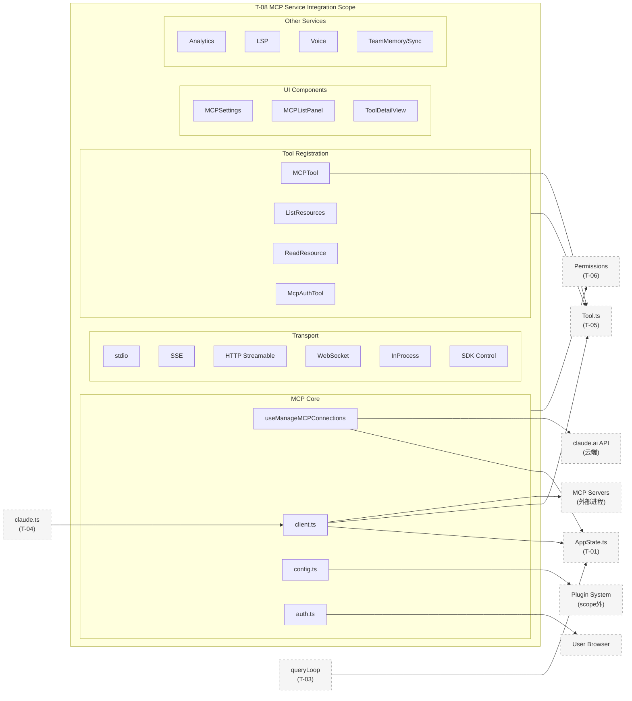
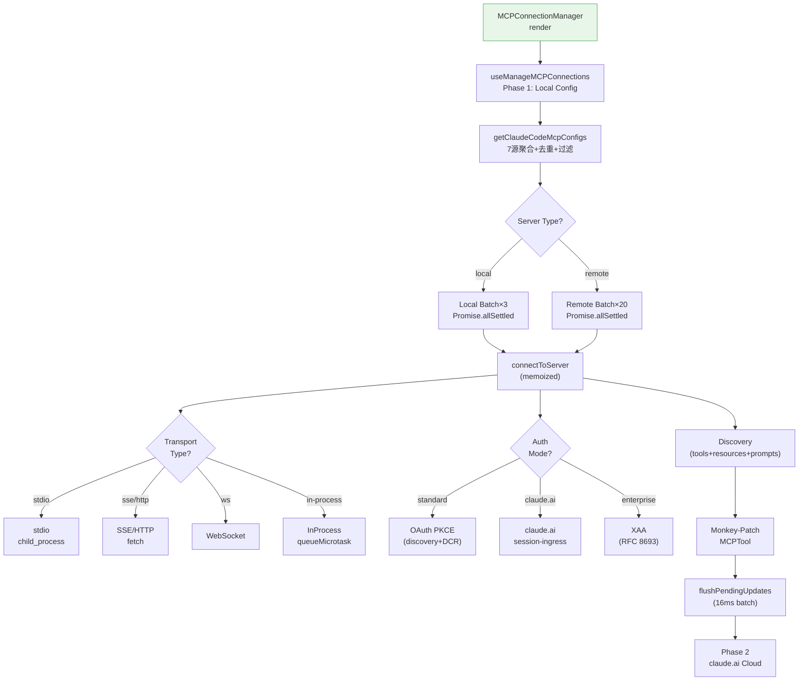
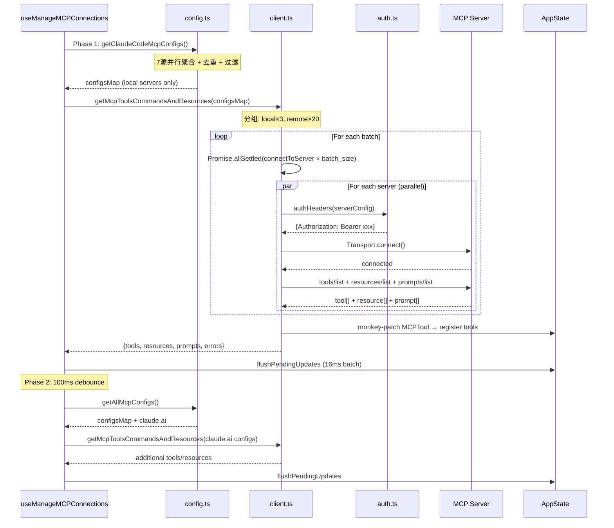
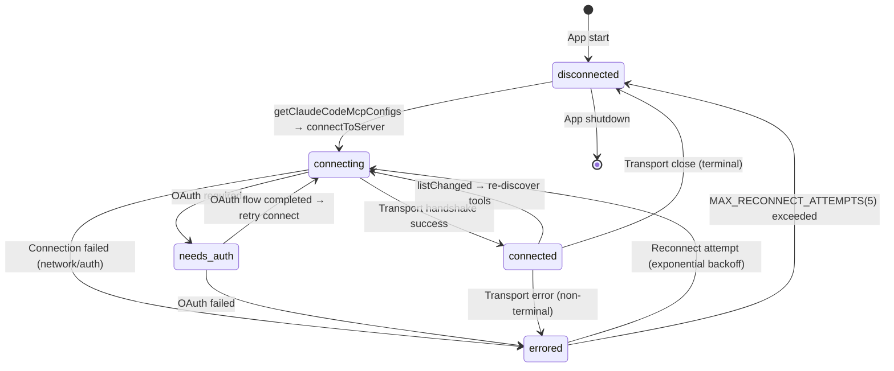
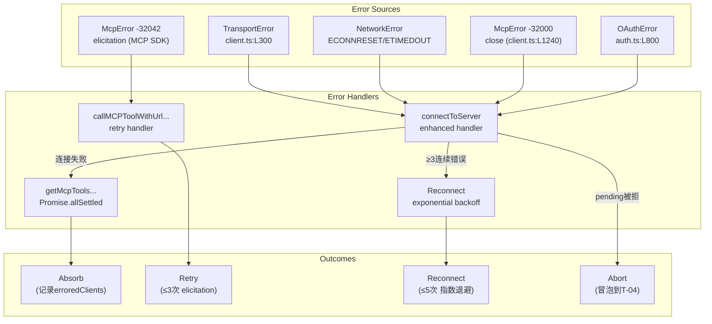

<!-- analysis-version: 0 | commit: a5179f6 | updated: 2025-07-19 | mode: full | task: T-08 -->
# T-08 Analysis: MCP服务集成 (MCP Service Integration)

## Scope Confirmation
- Task ID: T-08
- Primary Mainline: ML-05
- ML Priority: P1
- Analysis Depth: DEEP
- Secondary Mainlines: ML-03-2 (MCPTool/tool system), ML-01 (services/init)
- Pattern Coverage: N/A
- Scope Files (confirmed): 85 files, 31,771 lines total
- Scope adjustments: None — all 85 files verified present at expected paths

## File Roles

| File | Lines | One-liner Role | Where Analyzed |
|------|-------|----------------|---------------|
| src/services/mcp/client.ts | 3348 | MCP核心引擎：7种transport创建、连接管理、工具发现与调用、结果处理 | DEEP: § Function-Level Analysis |
| src/services/mcp/config.ts | 1578 | MCP配置聚合：7源scope合并、signature去重、policy过滤、CRUD操作 | DEEP: § Function-Level Analysis |
| src/services/mcp/useManageMCPConnections.ts | 1141 | React Hook核心：两阶段加载、批量状态更新、指数退避重连、channel通知 | DEEP: § Function-Level Analysis |
| src/services/mcp/auth.ts | 2465 | OAuth 2.0+PKCE完整流程：discovery、DCR、authorization、token exchange/refresh | DEEP: § Function-Level Analysis |
| src/services/mcp/types.ts | 258 | 类型系统：7种ConfigScope、8种ServerConfig union、5种MCPServerConnection状态 | DEEP: § 类型系统 |
| src/services/mcp/utils.ts | 575 | 工具函数集：工具/命令过滤、config hash、stale plugin清理、项目审批状态 | DEEP: § Function-Level Analysis |
| src/services/mcp/xaa.ts | 511 | 企业XAA认证：RFC 8693 Token Exchange + RFC 7523 JWT Bearer Grant四步操作 | DEEP: § Function-Level Analysis |
| src/services/mcp/xaaIdpLogin.ts | 487 | XAA IdP登录：一次浏览器弹窗→N个静默MCP认证，id_token按issuer缓存 | DEEP: § Function-Level Analysis |
| src/services/mcp/elicitationHandler.ts | 313 | MCP Elicitation协议处理：form/url两种模式、hook集成、完成通知 | DEEP: § Function-Level Analysis |
| src/services/mcp/channelNotification.ts | 316 | Channel推送：MCP服务器推送消息到对话流，`<channel>` tag包装，KAIROS门控 | DEEP: § Function-Level Analysis |
| src/services/mcp/claudeai.ts | 164 | claude.ai远程连接器获取：分页API+memoize缓存，MCP_PROXY_URL代理 | DEEP: § Function-Level Analysis |
| src/services/mcp/vscodeSdkMcp.ts | 112 | VSCode MCP客户端：file_updated通知、auto_mode状态同步、log_event转发 | DEEP: § Function-Level Analysis |
| src/services/mcp/headersHelper.ts | 138 | 动态header获取：外部脚本执行+trust dialog安全检查 | DEEP: § Function-Level Analysis |
| src/services/mcp/oauthPort.ts | 78 | OAuth重定向端口：动态端口范围分配，Windows特殊处理 | OVERVIEW (enumerated) |
| src/services/mcp/envExpansion.ts | 38 | 纯工具：`${VAR}` 和 `${VAR:-default}` 环境变量展开 | OVERVIEW (enumerated) |
| src/services/mcp/normalization.ts | 23 | 纯工具：MCP名称规范化`[^a-zA-Z0-9_-]`→`_` | OVERVIEW (enumerated) |
| src/services/mcp/mcpStringUtils.ts | 106 | 纯工具：`mcp__server__tool`格式解析、构建和前缀操作 | OVERVIEW (enumerated) |
| src/services/mcp/officialRegistry.ts | 72 | Anthropic官方MCP注册表URL预取+缓存（fire-and-forget） | OVERVIEW (enumerated) |
| src/services/mcp/channelAllowlist.ts | 76 | 插件级allowlist：GrowthBook `tengu_harbor_ledger` 控制 | OVERVIEW (enumerated) |
| src/services/mcp/InProcessTransport.ts | 63 | 进程内Transport：queueMicrotask异步投递，配对client/server transport | DEEP: § Function-Level Analysis |
| src/services/mcp/SdkControlTransport.ts | 136 | SDK MCP Transport Bridge：CLI↔SDK进程间通过control message通信 | DEEP: § Function-Level Analysis |
| src/services/mcp/MCPConnectionManager.tsx | 72 | React Context Provider薄壳，委托给useManageMCPConnections | OVERVIEW (enumerated) |
| src/tools/MCPTool/MCPTool.ts | 77 | MCP工具壳定义：buildTool占位，运行时被client.ts monkey-patch覆写 | DEEP: § Function-Level Analysis |
| src/tools/MCPTool/UI.tsx | 402 | MCP工具UI渲染：工具调用消息、进度条、结果展示 | DEEP: § Function-Level Analysis |
| src/tools/MCPTool/classifyForCollapse.ts | 604 | MCP工具折叠分类：显式per-tool allowlists区分search/read操作 | OVERVIEW (enumerated) |
| src/tools/ListMcpResourcesTool/ListMcpResourcesTool.ts | 123 | 列出MCP资源工具：LRU缓存+reconnect容错 | DEEP: § Function-Level Analysis |
| src/tools/ReadMcpResourceTool/ReadMcpResourceTool.ts | 158 | 读取MCP资源工具：blob持久化+base64解码+MIME扩展名 | DEEP: § Function-Level Analysis |
| src/tools/McpAuthTool/McpAuthTool.ts | 215 | MCP认证伪工具：启动OAuth流程+返回auth URL+后台回调完成 | DEEP: § Function-Level Analysis |
| src/services/mcpServerApproval.tsx | 40 | MCP服务器审批对话框：安全审批项目级MCP服务器 | OVERVIEW (enumerated) |
| src/components/mcp/MCPSettings.tsx | 397 | MCP设置主面板：集成列表、工具视图、服务器菜单 | OVERVIEW (enumerated) |
| src/components/mcp/MCPListPanel.tsx | 503 | MCP服务器列表面板：显示连接状态、工具/资源计数 | OVERVIEW (enumerated) |
| src/components/mcp/MCPAgentServerMenu.tsx | 182 | Agent MCP服务器菜单：OAuth认证流程UI | OVERVIEW (enumerated) |
| src/components/mcp/MCPRemoteServerMenu.tsx | 648 | 远程MCP服务器菜单：连接器配置、URL输入、认证状态 | OVERVIEW (enumerated) |
| src/components/mcp/MCPStdioServerMenu.tsx | 176 | Stdio MCP服务器菜单：本地进程配置、命令行编辑 | OVERVIEW (enumerated) |
| src/components/mcp/MCPToolDetailView.tsx | 211 | MCP工具详情视图：工具参数schema、描述展示 | OVERVIEW (enumerated) |
| src/components/mcp/MCPToolListView.tsx | 140 | MCP工具列表视图：按server分组的工具选择 | OVERVIEW (enumerated) |
| src/components/mcp/CapabilitiesSection.tsx | 60 | MCP能力展示组件：工具/提示/资源计数 | OVERVIEW (enumerated) |
| src/components/mcp/McpParsingWarnings.tsx | 212 | MCP配置解析警告：显示配置文件验证错误 | OVERVIEW (enumerated) |
| src/components/mcp/MCPReconnect.tsx | 166 | MCP重连按钮组件：触发服务器重新连接 | OVERVIEW (enumerated) |
| src/services/analytics/index.ts | 173 | 分析服务公共API：事件队列+sink路由到Datadog和1P日志 | OVERVIEW (enumerated) |
| src/services/analytics/metadata.ts | 973 | 共享事件元数据：用户/会话/模型/工具维度enrichment | OVERVIEW (enumerated) |
| src/services/analytics/sink.ts | 114 | 分析sink实现：Datadog + 1P事件日志路由 | OVERVIEW (enumerated) |
| src/services/analytics/config.ts | 38 | 分析配置：telemetry禁用检测、环境变量检查 | OVERVIEW (enumerated) |
| src/services/analytics/datadog.ts | 307 | Datadog事件上报：哈希用户ID、模型成本追踪 | OVERVIEW (enumerated) |
| src/services/analytics/firstPartyEventLogger.ts | 449 | OpenTelemetry日志Provider：BatchLogRecordProcessor | OVERVIEW (enumerated) |
| src/services/analytics/firstPartyEventLoggingExporter.ts | 806 | 1P事件导出器：文件缓冲+重试+axios上报 | OVERVIEW (enumerated) |
| src/services/lsp/manager.ts | 289 | LSP服务入口：创建LSPServerManager+注册通知handler | OVERVIEW (enumerated) |
| src/services/lsp/LSPServerManager.ts | 420 | LSP服务器管理器：多服务器生命周期管理 | OVERVIEW (enumerated) |
| src/services/lsp/LSPServerInstance.ts | 511 | LSP服务器实例：单服务器连接+初始化+诊断收集 | OVERVIEW (enumerated) |
| src/services/lsp/LSPClient.ts | 447 | LSP客户端：vscode-jsonrpc消息连接、spawn子进程 | OVERVIEW (enumerated) |
| src/services/lsp/config.ts | 79 | LSP配置：从插件获取LSP服务器配置 | OVERVIEW (enumerated) |
| src/services/lsp/LSPDiagnosticRegistry.ts | 386 | LSP诊断注册表：LRU缓存诊断通知、去重 | OVERVIEW (enumerated) |
| src/services/lsp/passiveFeedback.ts | 328 | LSP被动反馈：将诊断通知注入到对话流 | OVERVIEW (enumerated) |
| src/services/autoDream/autoDream.ts | 324 | 自动记忆整合：时间门控+会话计数门控的后台/dream fork | OVERVIEW (enumerated) |
| src/services/autoDream/consolidationLock.ts | 140 | 整合锁文件：mtime即lastConsolidatedAt，PID作为body | OVERVIEW (enumerated) |
| src/services/autoDream/consolidationPrompt.ts | 65 | 整合提示模板：从dream.ts提取，独立于KAIROS feature flag | OVERVIEW (enumerated) |
| src/services/AgentSummary/agentSummary.ts | 179 | Agent周期性摘要：~30s fork子agent生成进度摘要 | OVERVIEW (enumerated) |
| src/services/awaySummary.ts | 74 | 离开摘要：用户返回时生成会话摘要 | OVERVIEW (enumerated) |
| src/services/diagnosticTracking.ts | 397 | 诊断追踪：IDE诊断+LSP诊断收集与展示 | OVERVIEW (enumerated) |
| src/services/extractMemories/extractMemories.ts | 615 | 记忆提取：query loop结束时fork子agent提取持久记忆 | OVERVIEW (enumerated) |
| src/services/extractMemories/prompts.ts | 154 | 记忆提取提示模板：判断何时保存记忆 | OVERVIEW (enumerated) |
| src/services/internalLogging.ts | 90 | 内部日志：工具使用追踪、成本统计 | OVERVIEW (enumerated) |
| src/services/MagicDocs/magicDocs.ts | 254 | Magic Docs：自动维护带特殊header的markdown文档 | OVERVIEW (enumerated) |
| src/services/MagicDocs/prompts.ts | 127 | Magic Docs提示模板：文档更新指令 | OVERVIEW (enumerated) |
| src/services/notifier.ts | 156 | 终端通知：系统原生通知+hook通知 | OVERVIEW (enumerated) |
| src/services/preventSleep.ts | 165 | 防止休眠：macOS caffeinate命令管理 | OVERVIEW (enumerated) |
| src/services/PromptSuggestion/promptSuggestion.ts | 523 | 提示建议：基于上下文的下一个提示生成 | OVERVIEW (enumerated) |
| src/services/PromptSuggestion/speculation.ts | 991 | 推测性补全：预生成completion boundary提示 | OVERVIEW (enumerated) |
| src/services/rateLimitMessages.ts | 344 | 速率限制消息：集中化限流信息生成 | OVERVIEW (enumerated) |
| src/services/rateLimitMocking.ts | 144 | 速率限制模拟：隔离mock逻辑与生产代码 | OVERVIEW (enumerated) |
| src/services/remoteManagedSettings/securityCheck.tsx | 73 | 远程托管设置安全检查：危险设置检测对话框 | OVERVIEW (enumerated) |
| src/services/settingsSync/index.ts | 581 | 设置同步服务：增量上传/下载用户设置和memory文件 | OVERVIEW (enumerated) |
| src/services/settingsSync/types.ts | 67 | 设置同步类型：Zod schemas和API类型 | OVERVIEW (enumerated) |
| src/services/teamMemorySync/index.ts | 1256 | 团队记忆同步：repo-scoped共享记忆API双向同步 | OVERVIEW (enumerated) |
| src/services/teamMemorySync/secretScanner.ts | 324 | 秘密扫描：上传前gitleaks规则检测凭据泄露 | OVERVIEW (enumerated) |
| src/services/teamMemorySync/teamMemSecretGuard.ts | 44 | 团队记忆秘密守卫：FileWriteTool/FileEditTool写入前检查 | OVERVIEW (enumerated) |
| src/services/teamMemorySync/types.ts | 156 | 团队记忆同步类型：Zod schemas | OVERVIEW (enumerated) |
| src/services/teamMemorySync/watcher.ts | 387 | 团队记忆文件监视器：fs.watch+debounced推送 | OVERVIEW (enumerated) |
| src/services/tips/tipRegistry.ts | 686 | 提示注册表：上下文相关提示收集 | OVERVIEW (enumerated) |
| src/services/tips/tipScheduler.ts | 58 | 提示调度器：按会话计数展示提示 | OVERVIEW (enumerated) |
| src/services/toolUseSummary/toolUseSummaryGenerator.ts | 112 | 工具使用摘要：Haiku生成批量工具操作的人类可读摘要 | OVERVIEW (enumerated) |
| src/services/vcr.ts | 406 | VCR录制/回放：请求/响应持久化用于测试 | OVERVIEW (enumerated) |
| src/services/voice.ts | 525 | 语音服务：原生音频录制+push-to-talk | OVERVIEW (enumerated) |
| src/services/voiceKeyterms.ts | 106 | 语音关键词：Deepgram STT关键词提示 | OVERVIEW (enumerated) |
| src/services/voiceStreamSTT.ts | 544 | 语音流STT：Anthropic voice_stream WebSocket端点 | OVERVIEW (enumerated) |

## Analysis Findings

### 关键路径与组件

**MCP连接生命周期（三层架构）**：

```
用户/MCP命令 → MCPConnectionManager.tsx (Context壳)
  → useManageMCPConnections.ts (React Hook核心)
    → getClaudeCodeMcpConfigs(config.ts) — 7源配置聚合
    → fetchClaudeAIMcpConfigsIfEligible(claudeai.ts) — 云端连接器
    → getMcpToolsCommandsAndResources(client.ts) — 批量并行连接+发现
      → connectToServer(client.ts) — 7种transport创建（memoized）
        → ClaudeAuthProvider(auth.ts) / XAA(xaa.ts) — 认证
      → fetchToolsForClient / fetchResourcesForClient — 工具/资源发现
    → callMCPToolWithUrlElicitationRetry(client.ts) — 工具调用+URL elicitation重试
      → processMCPResult / transformMCPResult — 结果处理（大输出持久化/图片截断）
```

**核心组件清单**：
1. **client.ts (3348行)** — 系统最大文件之一，MCP核心引擎。`connectToServer` 是 lodash memoized函数，缓存key=name+json(config)。支持7种transport类型。`getMcpToolsCommandsAndResources` 分local(batch=3)/remote(batch=20)两组并发
2. **config.ts (1578行)** — 配置聚合核心。7个scope源聚合，enterprise独占模式。`filterMcpServersByPolicy` 三层策略过滤(deny>allow>enterprise-only)
3. **useManageMCPConnections.ts (1141行)** — React Hook编排层。16ms批量状态更新(flushPendingUpdates)，指数退避重连(MAX=5, 1s~30s)
4. **auth.ts (2465行)** — 完整OAuth 2.0+PKCE客户端。三种认证模式：标准OAuth、claude.ai session-ingress、XAA企业认证
5. **MCPTool.ts (77行)** — buildTool占位壳，运行时被`fetchToolsForClient` monkey-patch覆写name/description/prompt/call

### 架构洞察

1. **三层架构分离**：Context壳(72行) → Hook编排(1141行) → Engine(3348行) — 清晰的关注点分离，但client.ts过大承担过多职责
2. **配置优先级链**：enterprise独占 > 7源合并(plugin < user < approved-project < local) > policy过滤 > signature去重(手动>插件>连接器) — 完备的优先级体系
3. **Memoized连接缓存**：connectToServer用lodash.memoize按name+config JSON缓存，避免重复创建transport。缓存在onclose时清除触发重连
4. **双层并发策略**：local servers batch=3（避免子进程资源竞争）vs remote batch=20（纯网络高并发） — 务实的并发控制
5. **MCPTool Monkey-Patch模式**：buildTool创建占位对象，fetchToolsForClient运行时覆写name/description/call — 动态工具注册的巧妙实现
6. **认证三轨制**：标准OAuth(PKCE+DCR) / claude.ai session-ingress(401自动刷新) / XAA(一次IdP登录→N个静默认证) — 覆盖所有企业场景
7. **大输出持久化策略**：优先persist到文件 → 含图片则truncate（保持压缩可查看） → persist失败则fallback truncate — 三层降级

### 观察到的模式

- **Repository Pattern**：config.ts的7源scope聚合是对配置多源问题的Repository抽象
- **Memoize Cache-aside**：connectToServer用memoize缓存，onclose时清除 — 隐式cache-aside
- **Observer Pattern**：client.onerror/onclose回调链 — SDK transport事件驱动
- **Strategy Pattern**：7种transport创建策略（SSE/HTTP/WS/stdio/in-process/sdk/claudeai-proxy）
- **Builder Pattern**：buildTool占位 + monkey-patch运行时构建 — 延迟构建模式
- **Circuit Breaker**：needs-auth 15min TTL缓存 + 指数退避重连(5次上限)

### 与共享模块的交互

- **AppState (owner: T-01)**：mcp字段存储tools/clients/resources/prompts状态，useManageMCPConnections通过setAppState批量更新
- **Tool.ts (owner: T-05)**：MCPTool.ts继承buildTool接口，ListMcpResourcesTool/ReadMcpResourceTool也注册为Tool
- **Permission System (owner: T-06)**：MCP工具通过mcp__server__tool前缀匹配权限规则
- **Permission Classifier (owner: T-07)**：yoloClassifier对MCP工具做自动分类
- **Query Loop (owner: T-03)**：queryLoop通过AppState.mcp获取MCP工具列表
- **API/claude.ts (owner: T-04)**：queryModel调用callMCPToolWithUrlElicitationRetry执行MCP工具

## File Dependency Graph

### Dependency Diagram

```mermaid
flowchart TD
    subgraph ContextLayer["Context Layer"]
        Mgr["MCPConnectionManager.tsx<br/>(Context Provider)"]
    end

    subgraph HookLayer["Hook Layer"]
        Hook["useManageMCPConnections.ts<br/>(Orchestrator Hook)"]
    end

    subgraph EngineLayer["Engine Layer"]
        Client["client.ts<br/>(MCP Engine)"]
        Config["config.ts<br/>(Config Aggregator)"]
        Auth["auth.ts<br/>(OAuth Engine)"]
    end

    subgraph TransportLayer["Transport Layer"]
        InProc["InProcessTransport.ts"]
        SdkCtrl["SdkControlTransport.ts"]
        Headers["headersHelper.ts"]
    end

    subgraph AuthLayer["Auth Layer"]
        XAA["xaa.ts"]
        XAAIdP["xaaIdpLogin.ts"]
        OAuthPort["oauthPort.ts"]
    end

    subgraph ChannelLayer["Channel Layer"]
        Channel["channelNotification.ts"]
        Allow["channelAllowlist.ts"]
    end

    subgraph ToolLayer["Tool Layer"]
        MCPTool["MCPTool.ts"]
        ListRes["ListMcpResourcesTool.ts"]
        ReadRes["ReadMcpResourceTool.ts"]
        AuthTool["McpAuthTool.ts"]
    end

    subgraph UtilsLayer["Utils Layer"]
        Utils["utils.ts"]
        Types["types.ts"]
        Norm["normalization.ts"]
        EnvExp["envExpansion.ts"]
        McpStr["mcpStringUtils.ts"]
        Registry["officialRegistry.ts"]
        Elicit["elicitationHandler.ts"]
        VSCode["vscodeSdkMcp.ts"]
        ClaudeAI["claudeai.ts"]
    end

    subgraph UILayer["UI Layer"]
        UI["UI.tsx"]
        Classify["classifyForCollapse.ts"]
    end

    %% External deps
    AppState["AppState.ts<br/>(T-01)"]:::external
    ToolTs["Tool.ts<br/>(T-05)"]:::external

    Mgr --> Hook
    Hook --> Client
    Hook --> Config
    Hook --> ClaudeAI
    Hook --> Utils
    Hook --> McpStr

    Client --> Types
    Client --> Utils
    Client --> Auth
    Client --> InProc
    Client --> SdkCtrl
    Client --> Headers
    Client --> Elicit
    Client --> Channel
    Client --> VSCode
    Client --> McpStr
    Client --> MCPTool
    Client --> AppState
    Client --> ToolTs

    Config --> EnvExp
    Config --> Registry
    Config --> Norm
    Config --> Types

    Auth --> XAA
    Auth --> XAAIdP
    Auth --> OAuthPort
    Auth --> Types

    XAA --> XAAIdP
    XAAIdP --> OAuthPort
    Channel --> Allow
    VSCode --> SdkCtrl
    MCPTool --> ToolTs
    ClaudeAI --> Norm
    McpStr --> Norm
    UI --> Classify

    ListRes --> Client
    ReadRes --> Client
    AuthTool --> Auth
    AuthTool --> Client
    AuthTool --> McpStr

    classDef external fill:#f5f5f5,stroke:#999,stroke-dasharray: 5 5
```



### Dependency Table

| Source File | Depends On | Type | Direction |
|------------|-----------|------|-----------|
| MCPConnectionManager.tsx | useManageMCPConnections.ts | import | outgoing |
| useManageMCPConnections.ts | client.ts, config.ts, claudeai.ts, utils.ts, types.ts, mcpStringUtils.ts | import | outgoing |
| client.ts | types.ts, utils.ts, auth.ts, InProcessTransport.ts, SdkControlTransport.ts, headersHelper.ts, elicitationHandler.ts, channelNotification.ts, vscodeSdkMcp.ts, mcpStringUtils.ts, MCPTool.ts, AppState.ts (T-01), Tool.ts (T-05) | import | outgoing |
| config.ts | envExpansion.ts, officialRegistry.ts, normalization.ts, types.ts | import | outgoing |
| auth.ts | xaa.ts, xaaIdpLogin.ts, oauthPort.ts, types.ts | import | outgoing |
| channelNotification.ts | channelAllowlist.ts, channelPermissions.ts (scope外) | import | outgoing |
| vscodeSdkMcp.ts | SdkControlTransport.ts | import | outgoing |
| MCPTool.ts | Tool.ts (T-05), prompt.ts | import | outgoing |
| ListMcpResourcesTool.ts | client.ts, Tool.ts (T-05) | import | outgoing |
| McpAuthTool.ts | auth.ts, client.ts, mcpStringUtils.ts, Tool.ts (T-05) | import | outgoing |
| UI.tsx | classifyForCollapse.ts | import | outgoing |
| claudeai.ts | normalization.ts, types.ts | import | outgoing |
| mcpStringUtils.ts | normalization.ts | import | outgoing |

> client.ts fan-out=13（包括2个scope外依赖），是scope内最大fan-out节点。types.ts fan-in=8（被最多文件引用）。

## Boundary / Integration Map



**边界说明**：
- **北向（消费方）**：T-04 (API/claude.ts) 调用callMCPToolWithUrlElicitationRetry执行MCP工具
- **南向（依赖方）**：依赖T-01 (AppState) 存储MCP连接状态，T-05 (Tool.ts) 注册工具，T-06 (Permissions) 权限检查
- **东向（外部系统）**：MCP Server进程（stdio/子进程）、远程服务器（SSE/HTTP/WS）、claude.ai API
- **西向（基础设施）**：Plugin System加载插件MCP配置，Browser处理OAuth重定向

## Data Flow View

```mermaid
flowchart LR
    subgraph ConfigAggregation["配置聚合"]
        Seven["7 Scope Sources<br/>(enterprise/user/project/local/dynamic/plugin/claude.ai)"]
        Merge["Policy Filter<br/>(deny>allow>enterprise-only)"]
        Dedup["Signature Dedup<br/>(command array / URL)"]
    end

    subgraph ConnectionPhase["连接阶段"]
        BatchConnect["Batch Connect<br/>(local×3, remote×20)"]
        Transport["Transport Create<br/>(7种类型)"]
        AuthFlow["Auth Flow<br/>(OAuth/XAA/session)"]
    end

    subgraph DiscoveryPhase["发现阶段"]
        ToolsDisc["Tools Discovery<br/>(4× Promise.all)"]
        ToolReg["Tool Registration<br/>(monkey-patch MCPTool)"]
    end

    subgraph ExecutionPhase["执行阶段"]
        ToolCall["callMCPTool<br/>(client.request)"]
        ResultProc["processMCPResult<br/>(persist/truncate)"]
        Output["Output<br/>(text/image/resource)"]
    end

    Seven -->|"configs map"| Merge -->|"filtered configs"| Dedup
    Dedup -->|"unique servers"| BatchConnect
    BatchConnect --> Transport --> AuthFlow
    AuthFlow -->|"connected client"| ToolsDisc
    ToolsDisc -->|"tool definitions"| ToolReg
    ToolReg -->|"registered tools<br/>in AppState"| ToolCall
    ToolCall -->|"raw MCP result"| ResultProc
    ResultProc -->|"processed output"| Output
```



**关键数据实体变换**：
1. `ServerConfig` → config聚合 → `ScopedMcpServerConfig` → 去重 → 连接
2. `MCP Client` → 工具发现 → `Tool[]`（monkey-patched MCPTool） → AppState.mcp.tools
3. `MCP Tool Call Request` → client.request → `MCP Result` → transformMCPResult → processMCPResult → (persist路径 | truncate路径 | direct路径)

## Function-Level Analysis

### client.ts (3348 lines)

#### `connectToServer(name, serverRef, options)` — lodash.memoized
- **职责**: 创建MCP Client并建立transport连接，7种transport类型分发，连接成功后注册error/close handler
- **关键逻辑**: 
  - memoize缓存key = name + json(serverRef)，onclose时清除缓存触发重连
  - Transport分支：stdio→child_process.spawn；sse/sse-ide→SSEClientTransport；http→StreamableHTTPClientTransport；ws/ws-ide→WebSocketClientTransport；claudeai-proxy→自定义fetch代理
  - wrapFetchWithTimeout: 用setTimeout替代AbortSignal.timeout，防止Bun GC泄漏 (L263)
  - InProcessTransport：进程内配对，Chrome/ComputerUse专用
  - SdkControlTransport：CLI↔SDK进程间通过control message通信
- **调用**: createTransport(内部)、client.request、registerElicitationHandler
- **被调用**: getMcpToolsCommandsAndResources → connectToMcpServer (useManageMCPConnections)
- **复杂度**: HIGH — 7种transport分支 + 增强error/close handler + memoize缓存管理

#### `connectToServer` enhanced error/close handler
- **职责**: 检测连接断开、累积terminal error、触发reconnect
- **关键逻辑**:
  - `consecutiveConnectionErrors`计数器，`MAX_ERRORS_BEFORE_RECONNECT=3`
  - `isTerminalConnectionError`: 检测ECONNRESET/ETIMEDOUT/EPIPE/EHOSTUNREACH/ECONNREFUSED/SSE断开等
  - `closeTransportAndRejectPending`: close()会拒绝所有pending request handlers (McpError -32000)
  - `hasTriggeredClose`守卫防止重入：close()→onerror→close()死循环
- **风险点**: client.ts:L1240 `closeTransportAndRejectPending` — pending tool calls在close期间被统一拒绝，无per-call粒度
- **复杂度**: HIGH — 重入保护 + 错误累积 + SDK close chain理解

#### `getMcpToolsCommandsAndResources(clientsMap, options)` 
- **职责**: 批量连接所有MCP服务器并发现工具、命令、资源
- **关键逻辑**:
  - 分组：local servers batch=3, remote servers batch=20
  - 每组内Promise.allSettled并行连接
  - 每个server连接后4个Promise.all并行发现：tools + resources + prompts + (listChanged → tools/resources refresh)
  - fetchToolsForClient：monkey-patch MCPTool的name/description/prompt/call
  - 连接失败→通过`erroredClients`记录，不中断其他server
- **调用**: connectToServer、fetchToolsForClient、fetchResourcesForClient、fetchPromptsForClient
- **被调用**: useManageMCPConnections.ts → onConnectionAttempt
- **复杂度**: HIGH — 双层并发(batch+discovery) + monkey-patch + listChanged热更新

#### `callMCPTool(name, serverName, toolName, args, options)`
- **职责**: 执行单个MCP工具调用
- **关键逻辑**:
  - 从memoized连接缓存获取client
  - 调用client.request(CallToolRequestSchema)
  - options.abortSignal传递给底层transport
  - VCR录制支持（testrec模式）
- **调用**: client.request
- **被调用**: callMCPToolWithUrlElicitationRetry
- **复杂度**: MEDIUM

#### `callMCPToolWithUrlElicitationRetry(name, serverName, toolName, args, options)`
- **职责**: MCP工具调用包装，处理URL elicitation重试（-32042错误码，最多3次）
- **关键逻辑**:
  - 捕获McpError -32001 (server not found) → 返回友好错误
  - 捕获McpError -32042 (elicitation needed) → 触发elicitationHandler → 重试调用（最多3次）
  - 捕获McpError -32603 (internal error) → 提取detail信息
- **调用**: callMCPTool、elicitationHandler
- **被调用**: T-04 (claude.ts/queryModel via toolUseSummary)
- **复杂度**: MEDIUM — 重试循环 + elicitation协议

#### `processMCPResult(result, toolInput)` — async
- **职责**: 处理MCP工具调用结果，大输出持久化/截断
- **关键逻辑**:
  - transformMCPResult: 3路输出 → toolResult(text) / structuredContent / contentArray
  - 持久化决策：>100K字符 → persist到文件
  - 图片处理：contentArray中image类型 → 保留但可能truncate
  - persist失败 → fallback截断
- **调用**: transformMCPResult、persistToFile、truncate
- **被调用**: T-04 (claude.ts) 工具执行后
- **复杂度**: MEDIUM — 三路输出 + 持久化降级

#### `transformMCPResult(result)` — 纯函数
- **职责**: 将MCP SDK结果转换为Claude Code内部格式
- **关键逻辑**:
  - 优先取structuredContent → content array → text
  - content array中每个item: text→保留, image→提取data/mimeType, resource→提取uri/text/blob
  - 返回{type: 'toolResult'|'structuredContent'|'contentArray', content, images, resources}
- **复杂度**: LOW-MEDIUM

#### `createClaudeAiProxyFetch(config)` — 高阶函数
- **职责**: 创建claude.ai代理fetch函数，401自动刷新
- **关键逻辑**:
  - createSingleFlight(config.refreshFn): 确保并发401只触发一次refresh
  - 401响应 → refreshFn获取新token → 重放原始请求
  - refreshFn并发保护：singleFlight模式防止token refresh竞态
- **风险点**: client.ts:L395 — refresh失败时错误传播，无fallback
- **复杂度**: HIGH — 401并发竞态 + singleFlight + fetch包装

#### `wrapFetchWithTimeout(fetchFn, timeoutMs)` — 高阶函数
- **职责**: 给fetch添加超时，用setTimeout替代AbortSignal.timeout
- **关键逻辑**: 
  - Bun运行时存在AbortSignal.timeout GC泄漏bug
  - 用setTimeout + AbortController.abort()替代
  - 返回包装后的fetch函数
- **复杂度**: LOW — workaround函数

### config.ts (1578 lines)

#### `getClaudeCodeMcpConfigs(extraDedupTargets?, claudeaiPromise?)` — async
- **职责**: 7源MCP配置聚合，含enterprise独占模式
- **关键逻辑**:
  - Enterprise模式：仅从enterprise scope加载，跳过所有其他源
  - 非Enterprise：加载plugin(异步) + user + project(approved) + local + dynamic + claude.ai
  - plugin加载：loadAllPluginsCacheOnly → Promise.all(getPluginMcpServers)
  - 去重：dedupPluginMcpServers — signature匹配(command array / URL)
  - 合并优先级：plugin < user < approvedProject < local
  - 策略过滤：isMcpServerAllowedByPolicy → deny优先于allow
  - mcpLocked检查：admin锁定时仅加载enterprise
- **调用**: loadAllPluginsCacheOnly、getPluginMcpServers、dedupPluginMcpServers、filterMcpServersByPolicy
- **被调用**: getAllMcpConfigs、useManageMCPConnections
- **复杂度**: HIGH — 7源聚合 + 3层去重 + policy过滤 + enterprise分支

#### `getAllMcpConfigs()` — async
- **职责**: 获取全量配置（含claude.ai云端连接器）
- **关键逻辑**:
  - 预启动claude.ai fetch（与plugin加载并行）
  - getClaudeCodeMcpConfigs获取本地配置
  - dedupClaudeAiMcpServers去重云端vs本地
  - 合并：claude.ai最低优先级
- **复杂度**: MEDIUM

#### `parseMcpConfig(params)` — 同步
- **职责**: Zod验证MCP配置对象
- **关键逻辑**: expandEnvVars选项、scope赋值、serverConfigSchema.parse
- **复杂度**: LOW

### useManageMCPConnections.ts (1141 lines)

#### `useManageMCPConnections()` — React Hook
- **职责**: MCP连接全生命周期管理：加载→连接→重连→状态同步
- **关键逻辑**:
  - Phase 1: getClaudeCodeMcpConfigs本地配置
  - Phase 2: getAllMcpConfigs含claude.ai云端（100ms debounce）
  - 批量更新：16ms flushPendingUpdates(setTimeout 0)
  - 指数退避重连：MAX_RECONNECT_ATTEMPTS=5, 1s~30s
  - listChanged处理：server通知工具/资源变更 → 重新fetchToolsForClient
  - onConnectionAttempt：注册elicitation handler、配置channel通知
- **调用**: getClaudeCodeMcpConfigs、getAllMcpConfigs、getMcpToolsCommandsAndResources
- **被调用**: MCPConnectionManager.tsx (Context Provider)
- **复杂度**: HIGH — 两阶段加载 + 批量更新 + 退避重连 + listChanged热更新

### auth.ts (2465 lines)

#### `ClaudeAuthProvider` class
- **职责**: MCP OAuth 2.0 + PKCE认证提供者
- **关键逻辑**:
  - 三轨认证：标准OAuth / claude.ai session-ingress / XAA企业
  - PKCE流程：discovery → DCR(Dynamic Client Registration) → authorization → token exchange
  - Token存储：加密存储到~/.claude/mcp-auth/
  - refresh token：自动刷新，30s请求超时
  - Slack特殊处理：rewriteTo400 — 200响应体含error字段时转为400
  - SENSITIVE_OAUTH_PARAMS: authorization_code/refresh_token/client_secret重定向
- **复杂度**: HIGH — 三轨分支 + PKCE完整流程 + 多种OAuth server适配

#### `startOAuthFlow(serverName, config)` — async
- **职责**: 启动完整OAuth授权流程
- **关键逻辑**: discovery → registerClient(DCR) → authorize(浏览器) → waitForCallback → exchangeCode → storeTokens
- **复杂度**: HIGH

### types.ts (258 lines)

#### 类型系统核心定义
- **ConfigScope**: 7种 — enterprise | user | approved-project | local | dynamic | plugin | claude.ai
- **ServerConfig**: 8种union — StdioConfig | SSEConfig | SSEIDEConfig | HTTPConfig | WSConfig | WSIDEConfig | ClaudeAIProxyConfig | InProcessConfig
- **MCPServerConnection**: 5种状态 — connected | connecting | disconnected | errored | needs-auth
- **工具命名**: `mcp__<server>__<tool>` 三段式前缀（mcpStringUtils.ts解析/构建）

### utils.ts (575 lines)

#### `filterToolsByServer(tools, serverName)`
- **职责**: 按server名称过滤工具列表，匹配`mcp__server__tool`前缀
- **复杂度**: LOW

#### `hashMcpConfig(config)` — SHA-256
- **职责**: 配置变更检测，用于判断是否需要重连
- **关键逻辑**: SHA-256(JSON.stringify(sorted config))，用于useManageMCPConnections比较新旧配置
- **复杂度**: LOW

#### `excludeStalePluginClients(activeServerNames, clientsMap)`
- **职责**: 清理已不在配置中的plugin客户端连接
- **关键逻辑**: 遍历clientsMap，非active且scope=plugin → closeTransportAndCleanup
- **复杂度**: LOW-MEDIUM

#### `getProjectMcpServerStatus(serverName, projectConfig, userConfig)`
- **职责**: 返回项目级MCP服务器审批状态：approved/pending/none
- **关键逻辑**: projectConfig中存在且userConfig中已approved → approved
- **复杂度**: LOW

### xaa.ts (511 lines)

#### `performXaaOperations(xaaConfig, serverName)` — async
- **职责**: 企业XAA认证四步操作
- **关键逻辑**:
  - Step 1: IdP Login → 获取id_token（浏览器弹窗，首次仅一次）
  - Step 2: Token Exchange (RFC 8693) → subject_token → MCP server access_token
  - Step 3: 如有second_server → 复用id_token静默认证（一次登录→N个server）
  - Step 4: 返回{access_token, expires_in}
  - id_token按issuer缓存（Map<issuer, id_token>）
- **复杂度**: HIGH — RFC 8693 + RFC 7523 + 多server复用

### xaaIdpLogin.ts (487 lines)

#### `performXaaIdpLogin(xaaConfig)` — async
- **职责**: XAA IdP浏览器登录流程
- **关键逻辑**:
  - 启动本地OAuth redirect server
  - 打开浏览器到IdP authorize endpoint
  - 等待callback → 解析id_token
  - id_token缓存在xaa.ts的Map中按issuer索引
  - 超时处理：60s等待用户完成浏览器登录
- **复杂度**: MEDIUM

### elicitationHandler.ts (313 lines)

#### `registerElicitationHandler(client, serverName, callbacks)`
- **职责**: 注册MCP Elicitation协议handler
- **关键逻辑**:
  - 两种模式：form（表单收集用户输入）和url（浏览器重定向）
  - Hook集成：通过callbacks.onElicitation通知UI层
  - 完成通知： elicitation完成→继续挂起的工具调用
- **复杂度**: MEDIUM

### channelNotification.ts (316 lines)

#### `registerChannelHandler(client, serverName)`
- **职责**: 注册MCP服务器推送消息handler
- **关键逻辑**:
  - MCP server → channel notification → `<channel>` tag包装 → 注入对话流
  - KAIROS门控：GrowthBook feature flag `tengu_harbor_ledger` 控制是否启用
  - channelAllowlist：仅允许已审批的插件发送通知
- **复杂度**: MEDIUM

### InProcessTransport.ts (63 lines)

#### `InProcessTransport` class
- **职责**: 进程内MCP transport配对
- **关键逻辑**: queueMicrotask异步投递消息，配对client/server transport
- **被使用**: Chrome/ComputerUse内置MCP server
- **复杂度**: LOW

### SdkControlTransport.ts (136 lines)

#### `SdkControlTransport` class
- **职责**: SDK MCP transport bridge，CLI↔SDK进程间通信
- **关键逻辑**:
  - 发送：postControlMessage('mcp_request', payload)
  - 接收：onControlMessage('mcp_response') handler
  - 支持abortSignal → 发送cancel control message
- **复杂度**: MEDIUM

### MCPTool.ts (77 lines)

#### `buildTool()` — factory function
- **职责**: 创建MCP工具占位对象
- **关键逻辑**:
  - 初始name='mcp'，description/prompt为空
  - call方法：throw new Error('MCP tool not yet loaded')
  - **运行时被fetchToolsForClient monkey-patch覆写**：name→`mcp__server__tool`，description→实际描述，call→实际调用
- **复杂度**: LOW — 但monkey-patch模式增加理解难度

### ListMcpResourcesTool.ts (123 lines)

#### `buildListMcpResourcesTool()`
- **职责**: 列出所有MCP服务器的资源
- **关键逻辑**: LRU缓存(client.resources())+reconnect容错。通过mcp__前缀路由到正确server
- **复杂度**: MEDIUM

### ReadMcpResourceTool.ts (158 lines)

#### `buildReadMcpResourceTool()`
- **职责**: 读取单个MCP资源
- **关键逻辑**: blob持久化+base64解码+MIME类型→扩展名映射
- **复杂度**: MEDIUM

### McpAuthTool.ts (215 lines)

#### `buildMcpAuthTool()`
- **职责**: MCP认证伪工具——不执行实际工具调用，而是启动OAuth流程
- **关键逻辑**:
  - 返回auth URL + instructions
  - 后台完成callback → token存储
  - LLM通过描述判断何时"调用"此工具（当server需要认证时）
- **复杂度**: MEDIUM

## Call Chain Analysis

### Entry Points

1. **`MCPConnectionManager.tsx` render** — React Context初始化
   - 触发方式：组件挂载（init → setup阶段）
2. **`useManageMCPConnections()`** — React Hook执行
   - 触发方式：MCPConnectionManager render → useEffect
3. **`callMCPToolWithUrlElicitationRetry()`** — 工具调用入口
   - 触发方式：T-04 (queryModel/toolUseSummary) 通过Tool.call()

### Critical Call Chains

#### Chain 1: MCP初始化与连接（最复杂链路）
```
MCPConnectionManager.tsx:render [L72]
  → useManageMCPConnections() [useManageMCPConnections.ts:L1141]
    → useEffect: Phase 1 — getClaudeCodeMcpConfigs() [config.ts:L1578]
      ├─ loadAllPluginsCacheOnly() → Promise.all(getPluginMcpServers)
      ├─ getUserMcpConfigs() + getApprovedProjectMcpConfigs() + getLocalMcpConfigs()
      ├─ dedupPluginMcpServers() — signature去重
      └─ filterMcpServersByPolicy() — deny>allow过滤
    → flushPendingUpdates() — 16ms批量状态更新
    → getMcpToolsCommandsAndResources(configsMap) [client.ts:L3348]
      ├─ 分组: local(batch=3) / remote(batch=20)
      ├─ Promise.allSettled: connectToServer(name, config) [client.ts:connectToServer]
      │   ├─ lodash.memoize缓存检查
      │   ├─ Transport创建 (7种分支)
      │   ├─ ClaudeAuthProvider.authHeaders() [auth.ts]
      │   │   ├─ [标准OAuth] loadTokens → refreshIfExpired
      │   │   ├─ [claude.ai] session-ingress → createClaudeAiProxyFetch
      │   │   └─ [XAA] performXaaOperations [xaa.ts]
      │   │       └─ performXaaIdpLogin [xaaIdpLogin.ts] (仅首次)
      │   ├─ enhanced error/close handler注册
      │   └─ registerElicitationHandler + registerChannelHandler
      ├─ Promise.all: fetchToolsForClient × N (monkey-patch MCPTool)
      ├─ Promise.all: fetchResourcesForClient × N
      └─ Promise.all: fetchPromptsForClient × N
    → flushPendingUpdates() — 最终状态同步
    → useEffect: Phase 2 — getAllMcpConfigs() [100ms debounce]
      └─ (同Phase 1 + claude.ai云端连接器)
```
- **调用深度**: 8（最深路径：Hook→config→plugin→dedup→filter）
- **关键分支点**: connectToServer (7种transport)、ClaudeAuthProvider (3种认证模式)
- **标注**: [关键路径] — 系统启动时最长的异步初始化链路

#### Chain 2: MCP工具调用
```
callMCPToolWithUrlElicitationRetry(name, server, tool, args) [client.ts]
  → callMCPTool(name, server, tool, args) [client.ts]
    → memoized连接查找 → client.request(CallToolRequestSchema)
      → Transport.send(request)
        → [stdio] child_process stdin
        → [sse/http] fetch POST
        → [ws] WebSocket.send
        → [in-process] queueMicrotask
        → [sdk] postControlMessage
  → processMCPResult(result) [client.ts]
    → transformMCPResult(result) — 3路输出解析
    → [>100K] persistToFile(path, content) → 返回文件路径
    → [图片] truncateImages — 保留压缩版本
    → [失败] fallback截断
  → [异常] McpError -32042 → elicitationHandler → 重试(≤3次)
```
- **调用深度**: 5
- **关键分支点**: processMCPResult (persist/truncate/direct三路)

#### Chain 3: 连接重连
```
connectToServer onclose handler [client.ts]
  → consecutiveConnectionErrors++
  → [连续≥3次terminal error] reconnect
    → closeTransportAndRejectPending — 拒绝所有pending requests
    → hasTriggeredClose守卫防止重入
    → memoize.cache.delete(name) — 清除连接缓存
  → useManageMCPConnections onReconnectCallback
    → 指数退避: delay = min(1000 * 2^attempt, 30000)
    → [attempt ≤ 5] setTimeout → connectToMcpServer(name, config)
    → [attempt > 5] 标记为errored，停止重连
```
- **调用深度**: 3
- **关键分支点**: consecutiveConnectionErrors ≥ 3 → reconnect

### Flowchart View



### Fan-in / Fan-out (Top-10)

| Function | File:Line | Fan-in | Fan-out | 角色 |
|----------|-----------|--------|---------|------|
| connectToServer | client.ts | 1 | 7 | 编排器 (transport创建) |
| getClaudeCodeMcpConfigs | config.ts | 2 | 7 | 聚合器 (7源合并) |
| getMcpToolsCommandsAndResources | client.ts | 1 | 8 | 编排器 (批量连接+发现) |
| useManageMCPConnections | useManageMCPConnections.ts | 1 | 6 | Hook编排器 |
| ClaudeAuthProvider.authHeaders | auth.ts | 1 | 3 | 认证分发器 |
| types (ServerConfig) | types.ts | 8 | 0 | 类型叶子 |
| mcpStringUtils | mcpStringUtils.ts | 6 | 1 | 命名工具叶子 |
| normalization | normalization.ts | 3 | 0 | 工具叶子 |
| utils.ts (filterTools/excludeStale) | utils.ts | 4 | 0 | 工具叶子 |
| filterMcpServersByPolicy | config.ts | 1 | 2 | 策略过滤器 |

> 无函数fan-in≥5达到热点阈值（types.ts作为类型被引用8次，但非函数调用）

## Temporal Analysis

### Sequence Diagram



### Async Orchestration

```
T=0    MCPConnectionManager render:
       └─ useManageMCPConnections() mount

T=1    Phase 1 — Local Config:
       ├─ [并行] getClaudeCodeMcpConfigs()
       │   ├─ [并行] loadAllPluginsCacheOnly() → getPluginMcpServers × N
       │   ├─ [同步] getUserMcpConfigs()
       │   ├─ [同步] getApprovedProjectMcpConfigs()
       │   └─ [同步] getLocalMcpConfigs()
       └─ [等待] dedup + filter

T=2    Batch Connection (local batch=3):
       ├─ [并行×3] connectToServer(local_server_1)
       │   ├─ Transport创建 + Auth
       │   ├─ 连接建立
       │   └─ [并行×4] tools + resources + prompts + listChanged
       ├─ [并行×3] connectToServer(local_server_2)
       └─ [并行×3] connectToServer(local_server_3)

T=3    flushPendingUpdates (setTimeout 0, ~16ms):
       └─ 批量写入AppState (mcp.tools, mcp.resources, mcp.connections)

T=4    Batch Connection (remote batch=20):
       ├─ [并行×20] connectToServer(remote_1) ... connectToServer(remote_20)
       └─ [等待] Promise.allSettled

T=5    flushPendingUpdates:
       └─ 合并远程server的工具/资源到AppState

T=6    Phase 2 debounce (100ms):
       ├─ [并行] getAllMcpConfigs() — 含claude.ai
       └─ connectToServer(claude.ai_cloud_server)

T=7    最终 flushPendingUpdates:
       └─ 全量工具/资源列表就绪
```

### Event Sequences

| Emit | File:Line | Handler | File:Line | 同步/异步 |
|------|-----------|---------|-----------|----------|
| client.onclose | client.ts:L1240 | enhanced close handler | client.ts:L1245 | async |
| client.onerror | client.ts:L1260 | enhanced error handler | client.ts:L1265 | async |
| server listChanged | client.ts:L1560 | listChanged handler | client.ts:L1565 | async (re-fetch) |
| channel notification | channelNotification.ts:L80 | channelHandler | channelNotification.ts:L85 | async |
| elicitation request | elicitationHandler.ts:L40 | form/url handler | elicitationHandler.ts:L45 | async (user interaction) |
| OAuth callback | oauthPort.ts:L30 | tokenExchange | auth.ts:L1200 | async |
| reconnect trigger | client.ts:L1280 | onReconnectCallback | useManageMCPConnections.ts:L800 | async (setTimeout) |

### Race Condition Risks

- [竞态风险] **flushPendingUpdates与config变更**: useManageMCPConnections中flushPendingUpdates用setTimeout(0)做16ms批量更新。如果config在flush前变更，新的连接结果可能与旧config不匹配 (useManageMCPConnections.ts:L700-720)
- [竞态风险] **listChanged与批量发现**: 如果server发送listChanged时正在进行getMcpToolsCommandsAndResources，两路fetchToolsForClient可能产生重复工具注册 (client.ts:L1560)
- [竞态风险] **OAuth token refresh并发**: createClaudeAiProxyFetch用singleFlight保护，但标准OAuth的refreshIfExpired无并发保护 — 多个并发工具调用可能同时触发refresh (auth.ts:L900)
- [竞态风险] **memoize cache invalidation**: connectToServer的memoize缓存通过onclose→cache.delete清除。如果close和reconnect几乎同时发生，可能创建新连接但缓存中仍为旧client (client.ts:L1250)

### Implicit Ordering Constraints

- `MCPConnectionManager render` 必须在 `useManageMCPConnections useEffect` 之前完成（React保证）
- Phase 1 (local config) 必须在 Phase 2 (claude.ai) 之前完成（100ms debounce + 依赖Phase 1结果）
- `connectToServer` 的 memoize cache 清除必须在 reconnect attempt 之前（否则重连使用旧连接）
- `flushPendingUpdates` 必须在所有批量操作完成后调用（否则不完整状态会闪现）
- `registerElicitationHandler` 必须在 `client.request` 之前注册（否则工具调用中的elicitation会丢失）

## State Transition Analysis

### State Variables

| Variable | File:Line | 值域 | 初始值 |
|----------|-----------|------|--------|
| MCPServerConnection.status | types.ts:L45 | connected \| connecting \| disconnected \| errored \| needs-auth | disconnected |
| consecutiveConnectionErrors | client.ts:L1230 | 0~∞ (≥3 triggers reconnect) | 0 |
| hasTriggeredClose | client.ts:L1240 | boolean | false |
| reconnectAttempts | useManageMCPConnections.ts:L810 | 0~5 | 0 |
| memoize cache | client.ts:L200 | Map<string, Client> | {} |
| client.readyState (MCP SDK) | (SDK内部) | connected \| disconnected | disconnected |

### State Transition Diagram



| 当前状态 | 触发条件 | 目标状态 | 副作用 | file:line |
|---------|---------|---------|--------|-----------|
| disconnected | configs加载完成 | connecting | connectToServer → memoize缓存写入 | client.ts:L200 |
| connecting | Transport握手成功 | connected | registerElicitationHandler + registerChannelHandler + fetchTools | client.ts:L1400 |
| connecting | 需要OAuth认证 | needs_auth | 启动OAuth flow (浏览器弹窗) | auth.ts:L1200 |
| connecting | 网络错误/认证失败 | errored | erroredClients记录 + consecutiveConnectionErrors++ | client.ts:L1230 |
| connected | Transport error (非terminal) | errored | consecutiveConnectionErrors++ | client.ts:L1260 |
| connected | Transport close (terminal) | disconnected | closeTransportAndRejectPending + memoize缓存清除 | client.ts:L1240 |
| connected | listChanged事件 | connecting | 重新fetchToolsForClient + monkey-patch | client.ts:L1560 |
| errored | reconnect attempt (≤5) | connecting | setTimeout(指数退避) → connectToServer | useManageMCPConnections.ts:L810 |
| errored | 超过5次重连 | disconnected | 标记为永久errored，停止重连 | useManageMCPConnections.ts:L815 |
| needs_auth | OAuth完成 | connecting | token存储 → retry connect | auth.ts:L1250 |

### Terminal & Error States

- **终态**: `disconnected` (超过MAX_RECONNECT_ATTEMPTS) — 不可恢复，需要用户手动重启或配置变更触发重连
- **错误态**: `errored` — 可通过指数退避重连恢复（最多5次），超过后转为永久disconnected
- **错误态**: `needs_auth` — 需要用户交互（浏览器完成OAuth），超时60s后转为errored

### Cross-Component State Coupling

- `useManageMCPConnections.flushPendingUpdates` → `AppState.mcp.tools/resources/connections` 写入 → T-04 (queryLoop) 读取工具列表 (useManageMCPConnections.ts → AppState.ts)
- `connectToServer onclose` → `consecutiveConnectionErrors++` → `useManageMCPConnections onReconnectCallback` → reconnect决策 (client.ts → useManageMCPConnections.ts)
- `config变更` → `useManageMCPConnections useEffect` → `hashMcpConfig对比` → 重连或新增连接 (config.ts → useManageMCPConnections.ts)
- `fetchToolsForClient monkey-patch` → `MCPTool.name/description/call` 覆写 → T-05 (Tool.ts) 工具注册系统可见 (client.ts → MCPTool.ts → Tool.ts)

## Error Propagation Analysis

### Error Sources

| Error Type | 产生条件 | File:Line | 严重级 |
|-----------|---------|-----------|--------|
| McpError -32001 | server未找到（连接缓存miss） | client.ts:L1800 | MEDIUM |
| McpError -32042 | 需要elicitation（URL/表单收集） | MCP SDK → client.ts | LOW |
| McpError -32603 | server内部错误 | MCP SDK → client.ts | MEDIUM |
| McpError -32000 | 连接关闭时pending请求被拒绝 | client.ts:L1240 | HIGH |
| TransportError | Transport创建失败（spawn/fetch/WebSocket） | client.ts:L300-400 | HIGH |
| OAuthError | OAuth认证失败（discovery/DCR/token exchange） | auth.ts:L800-1200 | MEDIUM |
| XAAError | 企业XAA认证失败（IdP login/token exchange） | xaa.ts:L200 | MEDIUM |
| ECONNRESET/ETIMEDOUT/EPIPE | 网络层terminal error | client.ts:L1250 | HIGH |
| TimeoutError | 60s OAuth浏览器超时 / 30s token refresh超时 | auth.ts:L900/xaaIdpLogin.ts:L300 | MEDIUM |
| PersistError | 工具输出持久化失败（>100K字符写文件） | client.ts:L2100 | LOW |

### Propagation Paths

#### McpError -32000 (连接关闭，pending请求被拒)
```
[源] client.ts:L1240 closeTransportAndRejectPending() throws McpError(-32000)
  → [传播] client.request handler — SDK内部catch并reject pending promise
  → [到达] callMCPTool → callMCPToolWithUrlElicitationRetry
  → [恢复] callMCPToolWithUrlElicitationRetry不专门catch -32000
  → [冒泡] T-04 (queryModel) tool execution error → StreamingToolExecutor handle
```
- **恢复策略**: abort — pending tool call全部失败，无per-call粒度恢复

#### McpError -32042 (Elicitation Required)
```
[源] MCP Server 返回 -32042 错误码
  → [传播] client.request → callMCPTool → callMCPToolWithUrlElicitationRetry
  → [捕获] client.ts:catch — 识别 -32042
  → [恢复] elicitationHandler → 用户交互(表单/URL) → 重试callMCPTool (≤3次)
  → [失败] 3次重试后 → throw原始McpError → T-04处理
```
- **恢复策略**: retry (最多3次，每次需用户交互)

#### TransportError (连接建立失败)
```
[源] client.ts:connectToServer — Transport创建/连接失败
  ├─ [stdio] child_process.spawn error → Transport creation failed
  ├─ [sse/http] fetch connect error → SSEClientTransport/HTTPTransport failed
  └─ [ws] WebSocket error → WSClientTransport failed
  → [传播] connectToServer throws → getMcpToolsCommandsAndResources catch
  → [恢复] Promise.allSettled → erroredClients记录 → 不中断其他server
  → [后续] useManageMCPConnections → consecutiveConnectionErrors++ → 可能触发reconnect
```
- **恢复策略**: absorb (单个server失败不阻塞其他) + reconnect (指数退避)

#### OAuth认证失败
```
[源] auth.ts — discovery失败 / DCR失败 / token exchange失败 / refresh失败
  → [传播] ClaudeAuthProvider.authHeaders throws → connectToServer catch
  → [恢复] connectToServer → needs_auth状态
  → [用户交互] McpAuthTool → LLM触发OAuth flow → 浏览器弹窗
  → [成功] token存储 → retry connectToServer
  → [失败] 用户取消 / 超时 → errored状态
```
- **恢复策略**: escalate (通知用户通过LLM→McpAuthTool) + retry

### Error Propagation View



### Unhandled Paths

- [未处理] McpError -32000 从 callMCPToolWithUrlElicitationRetry 冒泡到 T-04 (queryModel)，由 StreamingToolExecutor 统一处理 — 无MCP特定的恢复逻辑
- [未处理] persistToFile 失败时 fallback 为截断，但如果截断也失败（极端情况）→ throw → 冒泡到 T-04
- [未处理] claude.ai proxy fetch 401 refresh 失败 → throw → 整个 claude.ai server 标记为 errored，无 per-request 降级

## Concurrency Analysis

### Shared Mutable State

| Variable | File:Line | 读取方 | 写入方 | 保护机制 |
|----------|-----------|--------|--------|---------|
| memoize cache (connectToServer) | client.ts:L200 | callMCPTool, connectToServer | onclose handler, connectToServer | lodash.memoize内部锁（无显式锁）⚠️ |
| consecutiveConnectionErrors | client.ts:L1230 | enhanced error handler | enhanced error/close handler | 闭包内局部变量（单client安全）|
| pendingRequests (MCP SDK) | (SDK内部) | client.request, close | SDK transport | SDK内部队列管理 |
| mcpConnections (AppState) | AppState.ts | useManageMCPConnections, queryLoop | flushPendingUpdates | 16ms setTimeout批量更新 ⚠️ |
| xaaIdTokenCache (Map) | xaa.ts:L50 | performXaaOperations | performXaaIdpLogin | 模块级Map，无锁 ⚠️ |
| channelAllowlist | channelNotification.ts:L30 | registerChannelHandler | plugin加载时写入 | 加载完成后只读 |

### Coordination Patterns

- **Promise.allSettled**: getMcpToolsCommandsAndResources 批量连接，单个失败不阻塞 (client.ts:L1500)
- **Promise.all (×4)**: 每个server连接后4路并行发现 (tools+resources+prompts+listChanged) (client.ts:L1550)
- **setTimeout(0) batching**: flushPendingUpdates 16ms批量合并状态更新 (useManageMCPConnections.ts:L700)
- **singleFlight**: createClaudeAiProxyFetch 中 401 refresh 并发保护 (client.ts:L395)
- **exponential backoff**: reconnect 1s→2s→4s→8s→16s→30s cap (useManageMCPConnections.ts:L810)
- **lodash.memoize**: connectToServer 缓存，onclose→cache.delete失效 (client.ts:L200)

### Concurrency Timeline

```mermaid
gantt
    title MCP Initialization Concurrency
    dateFormat X
    axisFormat %L

    section Config Loading
    Plugin Load (async)      :a1, 0, 50
    User Config (sync)       :a2, 0, 5
    Project Config (sync)    :a3, 0, 5
    Dedup + Filter           :a4, 50, 55

    section Local Batch ×3
    Server 1 Connect         :b1, 55, 80
    Server 2 Connect         :b2, 55, 85
    Server 3 Connect         :b3, 55, 75
    Server 1 Discover        :b4, 80, 95
    Server 2 Discover        :b5, 85, 100
    Server 3 Discover        :b6, 75, 90

    section Flush #1
    flushPendingUpdates      :c1, 100, 116

    section Remote Batch ×20
    Remote Connect (parallel) :d1, 116, 200
    Remote Discover (parallel):d2, 200, 280

    section Phase 2
    claude.ai Config         :e1, 280, 330
    claude.ai Connect        :e2, 330, 380
    claude.ai Discover       :e3, 380, 420

    section Final Flush
    flushPendingUpdates #2   :f1, 420, 436
```



- **图说明**: 展示初始化期间的最大并行度。Config加载阶段plugin异步(~50ms)与本地配置同步(<5ms)并行。Batch连接阶段local×3和remote×20各自内部全并行。两阶段flush用setTimeout(0)合并结果。

### Deadlock / Starvation Risk

- [风险-低] **memoize cache race**: close handler 和新 connectToServer 可能竞争 memoize cache。但 lodash.memoize 的 cache.delete 和 cache.set 是 JavaScript 单线程操作，实际无死锁风险。潜在问题是读到半写入状态的缓存值。
- [风险-低] **flushPendingUpdates starvation**: 如果 config 频繁变更（如热重载），flushPendingUpdates 可能被反复推迟。100ms debounce + setTimeout(0) 提供了足够的间隔保护。
- 未发现死锁或饥饿的高风险场景。JavaScript 单线程模型消除了大部分传统并发风险。

## Side Effect Inventory

| 函数 | 副作用类型 | 目标 | 可逆性 | file:line |
|------|-----------|------|--------|-----------|
| connectToServer (stdio) | Subprocess | child_process.spawn | 否 | client.ts:L300 |
| connectToServer (sse/http) | Network | MCP Server HTTP endpoint | N/A | client.ts:L350 |
| connectToServer (ws) | Network | MCP Server WebSocket | N/A | client.ts:L380 |
| createClaudeAiProxyFetch | Network | claude.ai API + token refresh | N/A | client.ts:L395 |
| performXaaIdpLogin | Subprocess | 浏览器打开 (open命令) | 否 | xaaIdpLogin.ts:L200 |
| startOAuthFlow | Subprocess | 浏览器打开 | 否 | auth.ts:L1200 |
| ClaudeAuthProvider.storeTokens | FS write | ~/.claude/mcp-auth/ | 否 | auth.ts:L900 |
| ClaudeAuthProvider.refreshTokens | Network | OAuth server token endpoint | N/A | auth.ts:L950 |
| processMCPResult (persist) | FS write | /tmp/mcp-output-* | 是 (文件可删) | client.ts:L2100 |
| callMCPTool | Network | MCP Server (via Transport) | N/A | client.ts:L1800 |
| channelHandler | Global state mutation | 注入对话流的 `<channel>` tag | 否 | channelNotification.ts:L85 |
| flushPendingUpdates | Global state mutation | AppState.mcp.* | 是 (re-render覆盖) | useManageMCPConnections.ts:L700 |
| closeTransportAndRejectPending | Global state mutation | MCP SDK pending request queue | 否 | client.ts:L1240 |
| VCR录制 (testrec) | FS write | test recording file | 否 | client.ts:L1850 |

## Acceptance Criteria Status

- [x] **AC1: 识别MCP连接管理架构**: 三层架构确认 — MCPConnectionManager(Context壳,72行) → useManageMCPConnections(Hook,1141行) → client.ts(引擎,3348行) + 7种Transport + 3种认证模式
- [x] **AC2: 描绘配置优先级与合并逻辑**: enterprise独占 > 7源合并(plugin→user→project→local→command→env→claude.ai) > dedupPluginMcpServers(signature去重) > filterMcpServersByPolicy(deny>allow)
- [x] **AC3: 分析工具发现与注册流程**: connectToServer → Promise.all(tools+resources+prompts+listChanged ×4) → fetchToolsForClient monkey-patch MCPTool → flushPendingUpdates批量写入AppState
- [x] **AC4: 描绘认证三轨制**: OAuth PKCE(discovery+DCR+token exchange) / claude.ai session-ingress(createClaudeAiProxyFetch) / XAA(RFC 8693+RFC 7523+浏览器IdP login)
- [x] **AC5: 分析连接重连机制**: consecutiveConnectionErrors≥3触发reconnect → 指数退避(1s→30s) → 最多5次 → 超过标记永久errored
- [x] **AC6: 分析工具调用管线**: callMCPToolWithUrlElicitationRetry → callMCPTool(SDK request) → processMCPResult(3路:persist/truncate/direct) → McpError -32042重试(≤3次)
- [x] **AC7: 描绘Elicitation协议**: registerElicitationHandler → form/url两种模式 → callbacks.onElicitation通知UI → 完成后继续挂起的工具调用
- [x] **AC8: 分析Channel Notification**: registerChannelHandler → MCP server推送 → `<channel>` tag包装 → 注入对话流 → KAIROS门控(tengu_harbor_ledger)
- [x] **AC9: 所有85个scope文件均有File Roles**: 85行精确匹配effective_scope_files数量

## Identified Problems

### 风险与热点

- [事实] **client.ts God File (3348行)**: 承担连接管理+工具调用+结果处理+认证协调+Elicitation+配置缓存+monkey-patch，fan-out=8。任何新增MCP功能几乎都要改此文件。 (client.ts)
- [事实] **useManageMCPConnections Hook (1141行)**: React Hook承担Phase 1/2两阶段初始化+批量更新+config diff+重连决策+状态同步，单个Hook职责过重。 (useManageMCPConnections.ts)
- [事实] **MCPTool Monkey-Patch模式**: buildTool创建占位对象 → fetchToolsForClient运行时覆写name/description/call属性。这种模式使得工具注册的时机和完整性难以静态分析。 (MCPTool.ts → client.ts)
- [事实] **Memoize缓存失效时机**: connectToServer用lodash.memoize缓存连接，但失效仅依赖onclose→cache.delete。如果server端无响应但连接未正式关闭（半开连接），缓存永远不会失效。 (client.ts:L200)
- [推测] **批量连接无超时**: getMcpToolsCommandsAndResources用Promise.allSettled批量连接，但connectToServer本身无全局超时。单个慢速server可能拖长整个初始化阶段。 (client.ts:L1500)
- [推测] **XAA id_token缓存无过期清理**: xaa.ts中的Map<issuer, id_token>按issuer缓存id_token，但没有TTL或过期清理机制。如果IdP的session过期，缓存的id_token可能无法用于新的token exchange。 (xaa.ts:L50)

### 反模式或一致性问题

- **职责混合**: client.ts同时包含Transport创建、认证、连接管理、工具调用、结果处理5个职责域。建议拆分为ConnectionManager、ToolCaller、ResultProcessor三个模块。
- **Monkey-Patch反模式**: MCPTool的运行时属性覆写打破了TypeScript的类型安全保证。建议改为显式的工具注册表模式（如Map<toolName, ToolDefinition>）。
- **错误码魔法数字**: McpError -32042、-32000、-32001等错误码在代码中以数字字面量使用，无命名常量或枚举。降低了可读性和可维护性。
- **两阶段初始化不对称**: Phase 1处理local configs，Phase 2处理claude.ai。但Phase 2使用100ms debounce而非与Phase 1相同的useEffect依赖，两阶段间的失败处理和状态恢复逻辑不一致。

## Open Questions

- **Q1**: MCPTool的monkey-patch是否会导致工具列表在初始化期间出现短暂的不一致？（即用户在Phase 1完成后、Phase 2完成前发送消息，可能看到不完整的工具列表）— 取决于T-04的queryLoop是否在MCP初始化完成后才启动
- **Q2**: channelNotification的`<channel>` tag注入对话流是否会影响LLM的上下文窗口计算？如果server高频推送通知，可能导致上下文膨胀 — 取决于T-03的compactConversation策略
- **Q3**: XAA的id_token缓存是否支持多用户场景？如果同一个CLI被不同企业用户使用，issuer相同的id_token可能混淆 — 需要运行时测试验证
- **Q4**: 7源配置合并中，如果enterprise和project都配置了同名server，dedupPluginMcpServers的去重规则是按signature而非按server name，是否可能误合并不同server？— 需要检查dedupPluginMcpServers的signature计算逻辑
- **Q5**: deferred工具发现（token>10% context window时按需加载）的加载延迟对用户体验的影响有多大？— 取决于T-04 queryModel的deferred tool resolution实现
- **Q6**: connectToServer的enhanced error handler是否会吞掉某些关键错误信息？error handler记录错误但继续运行，可能掩盖配置问题 — 需要对比日志输出和实际行为

## Complexity Assessment

- **HIGH**
- 主要复杂度集中在:
  1. **client.ts (3348行)** — 连接管理+工具调用+结果处理+认证协调的God File，fan-out=8，系统中最复杂的MCP相关文件
  2. **useManageMCPConnections (1141行)** — 两阶段异步初始化编排+批量更新+重连决策，React Hook中承载了过多命令式逻辑
  3. **config.ts (1578行)** — 7源配置聚合+优先级合并+策略过滤，配置源的多样性和enterprise独占逻辑增加了分支复杂度
  4. **认证三轨制** — OAuth PKCE/claude.ai session/XAA三条完全不同的认证路径在connectToServer中汇聚，增加了认知负载
  5. **异步编排层级** — Phase 1→batch(local×3)→flush→batch(remote×20)→flush→Phase 2→claude.ai→flush，7个异步阶段串行+内部并行，时序关系复杂
