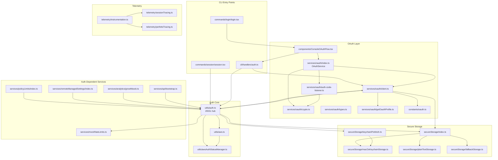
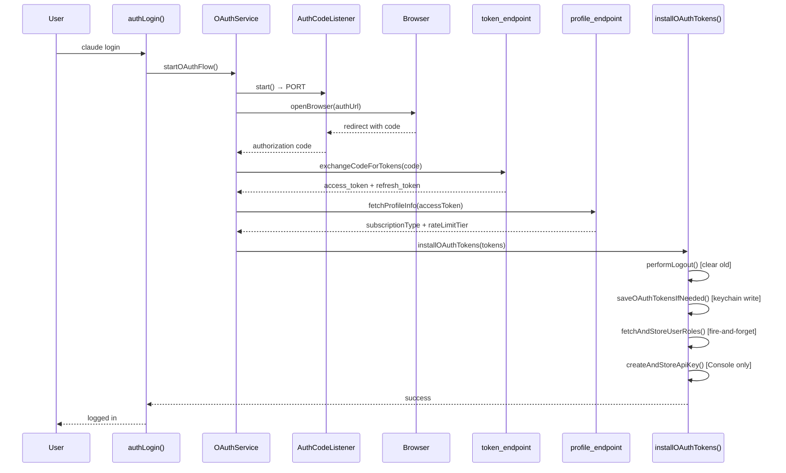
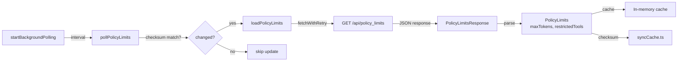
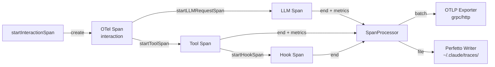
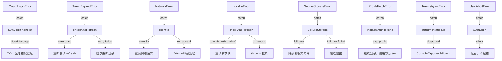

&lt;!-- analysis-version: 0 | commit: a5179f6 | updated: 2026-04-19 | mode: full | task: T-09 --&gt;
# T-09 Analysis: 认证与会话管理

## Scope Confirmation
- Task ID: T-09
- Primary Mainline: ML-06
- ML Priority: P1
- Analysis Depth: DEEP
- Secondary Mainlines: ML-01 (cli/handlers, commands), ML-10 (api/bootstrap)
- Scope Files: 40 files, 13,388 lines — all confirmed readable
- Scope adjustments: None

## File Roles

| File | Lines | One-liner Role | Where Analyzed |
|------|-------|----------------|---------------|
| src/utils/auth.ts | 2002 | 认证枢纽：三层决策链(isAnthropicAuthEnabled→getAuthTokenSource→getAnthropicApiKeyWithSource)，统一管理 OAuth/API key/AWS STS/GCP 四种认证源 | DEEP: § Function-Level Analysis |
| src/services/oauth/client.ts | 577 | OAuth2 客户端：PKCE 授权码交换、token 刷新、profile 拉取、API key 创建、用户角色获取 | DEEP: § Function-Level Analysis |
| src/services/oauth/index.ts | 198 | OAuthService 类：封装完整 OAuth 2.0 Authorization Code + PKCE 流程，支持自动/手动两种模式 | DEEP: § Function-Level Analysis |
| src/cli/handlers/auth.ts | 330 | CLI auth 命令处理器：installOAuthTokens(共享安装逻辑)、authLogin、authStatus、authLogout 四个入口 | DEEP: § Function-Level Analysis |
| src/components/ConsoleOAuthFlow.tsx | 631 | Ink TUI 组件：控制台内 OAuth 登录流程，支持浏览器自动跳转/手动粘贴/刷新 token 快速路径 | DEEP: § Function-Level Analysis |
| src/services/oauth/auth-code-listener.ts | 211 | 本地 HTTP 服务器：监听 OAuth 回调，捕获 authorization code，支持成功/失败重定向 | DEEP: § Function-Level Analysis |
| src/services/oauth/crypto.ts | 23 | PKCE 加密工具：生成 code_verifier、code_challenge (S256)、state 参数 | DEEP: § Function-Level Analysis |
| src/services/oauth/getOauthProfile.ts | 53 | OAuth profile API 调用：用 access token 换取用户 profile 信息 | DEEP: § Function-Level Analysis |
| src/services/oauth/types.ts | 13 | 类型定义：OAuthTokens、OAuthTokenExchangeResponse、SubscriptionType、RateLimitTier 等 | OVERVIEW: § File Roles |
| src/constants/oauth.ts | 234 | OAuth 常量配置：client_id、各环境 token/auth/profile URL、scope 定义 | OVERVIEW: § File Roles |
| src/utils/secureStorage/index.ts | 17 | 安全存储工厂：macOS 返回 Keychain+明文 fallback，其他平台直接明文 | OVERVIEW: § File Roles |
| src/utils/secureStorage/fallbackStorage.ts | 70 | 降级存储策略：primary→secondary 两级 try-fallback，write 时自动迁移数据 | OVERVIEW: § File Roles |
| src/utils/secureStorage/macOsKeychainStorage.ts | 231 | macOS Keychain 实现：通过 security CLI 读写 generic password，30s TTL 缓存 | DEEP: § Function-Level Analysis |
| src/utils/secureStorage/macOsKeychainHelpers.ts | 111 | Keychain 辅助：service name 生成、username 获取、缓存清理 | OVERVIEW: § File Roles |
| src/utils/secureStorage/plainTextStorage.ts | 84 | 明文文件存储：读写 ~/.claude/.credentials.json，JSON 格式 | OVERVIEW: § File Roles |
| src/utils/secureStorage/keychainPrefetch.ts | 116 | 启动预取：异步预读 keychain OAuth tokens 加速首次认证 | OVERVIEW: § File Roles |
| src/utils/secureStorage/types.ts | 7 | SecureStorage 接口定义：read/readAsync/update/delete | OVERVIEW: § File Roles |
| src/utils/aws.ts | 74 | AWS STS 调用：执行 aws sts get-caller-identity 验证凭证有效性 | OVERVIEW: § File Roles |
| src/utils/awsAuthStatusManager.ts | 81 | AWS 认证状态管理：缓存 STS 调用结果，避免重复执行 | OVERVIEW: § File Roles |
| src/utils/execFileNoThrow.ts | 150 | 安全执行器：封装 child_process.execSync，不抛异常，用于 aws sts 调用 | OVERVIEW: § File Roles |
| src/utils/http.ts | 136 | HTTP 工具：带 auth header 注入的 fetch 封装 | OVERVIEW: § File Roles |
| src/services/api/bootstrap.ts | 141 | API bootstrap：初始化认证 header 注入到全局 API 客户端 | DEEP: § Function-Level Analysis |
| src/services/mockRateLimits.ts | 882 | 模拟限速：开发/测试环境模拟不同订阅类型的 rate limit 行为 | OVERVIEW: § File Roles |
| src/services/policyLimits/index.ts | 663 | 策略限制：从 API 拉取企业策略限制并缓存，后台轮询更新 | DEEP: § Function-Level Analysis |
| src/services/policyLimits/types.ts | 27 | PolicyLimits 类型：PolicyLimitsResponse、Restrictions 结构 | OVERVIEW: § File Roles |
| src/services/remoteManagedSettings/index.ts | 638 | 远程托管设置：从 API 拉取企业管理员设置的配置并缓存，后台轮询 | DEEP: § Function-Level Analysis |
| src/services/remoteManagedSettings/syncCache.ts | 112 | 设置同步缓存：基于 checksum 的增量更新检测 | OVERVIEW: § File Roles |
| src/services/remoteManagedSettings/syncCacheState.ts | 96 | 缓存状态管理：跟踪远程设置加载状态 | OVERVIEW: § File Roles |
| src/services/remoteManagedSettings/types.ts | 31 | 远程设置类型定义 | OVERVIEW: § File Roles |
| src/services/analytics/growthbook.ts | 1155 | 特性标志系统：GrowthBook SDK 集成，remote eval，feature gate 检查，周期刷新 | DEEP: § Function-Level Analysis |
| src/utils/telemetry/instrumentation.ts | 825 | 遥测初始化：OpenTelemetry SDK 引导，配置 traces/metrics/logs exporters | DEEP: § Function-Level Analysis |
| src/utils/telemetry/sessionTracing.ts | 927 | 会话级追踪：interaction/LLM/tool/hook span 生命周期管理 | DEEP: § Function-Level Analysis |
| src/utils/telemetry/perfettoTracing.ts | 1120 | Perfetto 追踪：轻量级 in-process trace 文件生成，agent 映射 | DEEP: § Function-Level Analysis |
| src/utils/telemetry/betaSessionTracing.ts | 491 | Beta 追踪属性：消息哈希、内容截断、prompt hash 等增强追踪属性 | OVERVIEW: § File Roles |
| src/utils/telemetry/bigqueryExporter.ts | 252 | BigQuery 指标导出器：将遥测指标导出到 Google BigQuery | OVERVIEW: § File Roles |
| src/utils/telemetry/events.ts | 75 | 遥测事件工具：redact 禁用内容、OTel event 辅助 | OVERVIEW: § File Roles |
| src/utils/telemetry/pluginTelemetry.ts | 289 | 插件遥测：插件加载/启用/命令执行的事件记录和错误分类 | OVERVIEW: § File Roles |
| src/utils/telemetryAttributes.ts | 71 | 遥测属性构建：聚合 auth/subscription/platform 等全局属性 | OVERVIEW: § File Roles |
| src/commands/login/login.tsx | 104 | /login 命令入口：调用 ConsoleOAuthFlow 组件 | OVERVIEW: § File Roles |
| src/commands/session/session.tsx | 140 | /session 命令入口：显示当前 session 认证信息 | OVERVIEW: § File Roles |

## Analysis Findings

### F-01: 三层认证决策链 (auth.ts:100-206)
`isAnthropicAuthEnabled()` → `getAuthTokenSource()` → `getAnthropicApiKeyWithSource()` 构成三层决策链：
1. **Layer 1 (布尔门控)**: 检查 bare mode、SSH proxy、3P provider、external API key → 决定是否启用 Anthropic OAuth
2. **Layer 2 (源选择)**: 按优先级枚举 8 种 token 源：ANTHROPIC_AUTH_TOKEN → CLAUDE_CODE_OAUTH_TOKEN → FD → apiKeyHelper → claude.ai OAuth
3. **Layer 3 (密钥提取)**: 从选定的源提取实际 API key 或 Bearer token

### F-02: OAuth Token 刷新的跨进程安全 (auth.ts:1447-1562)
`checkAndRefreshOAuthTokenIfNeededImpl()` 使用 lockfile 实现跨进程互斥：
1. 先检查本地过期（5 分钟缓冲）→ 异步重读 keychain 确认 → acquire lockfile
2. 获取锁后再次检查（double-check locking）→ 调用 `refreshOAuthToken()` → 写入 secure storage
3. 最多 5 次重试（ELOCKED 时 sleep 1-2s 后重试）
4. **In-flight dedup**: `pendingRefreshCheck` 变量确保同一进程内只有一个并发刷新

### F-03: 401 错误处理的 token 去重 (auth.ts:1343-1392)
`handleOAuth401Error()` 使用 `pending401Handlers` Map 按 failedAccessToken 去重：
- 多个并发请求使用同一 token 收到 401 时，只触发一次 keychain 重读 + 刷新
- 如果 keychain 已有不同 token（另一个 tab 刷新了），直接复用

### F-04: SecureStorage 三级降级 (secureStorage/)
macOS: `macOsKeychainStorage` → `plainTextStorage` (.credentials.json)
- write 时：primary 成功 → 删除 secondary；primary 失败 → 写 secondary + 删除 primary 旧数据
- read 时：优先 primary，null 则 fallback secondary
- 首次写入 keychain 后自动迁移明文文件

### F-05: OAuthService 双模式授权码获取 (oauth/index.ts:21-198)
`OAuthService.startOAuthFlow()` 同时启动自动和手动两条路径：
1. **自动**: 启动 `AuthCodeListener`（本地 HTTP 服务器监听 localhost:PORT/callback）
2. **手动**: 暴露 `handleManualAuthCodeInput()` 给 UI，用户可粘贴 code
3. `waitForAuthorizationCode()` 用 Promise.race 语义：先到达的 resolver 获胜，另一个被置 null

### F-06: installOAuthTokens 共享安装序列 (cli/handlers/auth.ts:50-110)
登录成功后的统一安装序列：
1. `performLogout()` — 清除旧状态
2. 拉取 profile → `storeOAuthAccountInfo()` 写 global config
3. `saveOAuthTokensIfNeeded()` — 写 secure storage（keychain/文件）
4. `fetchAndStoreUserRoles()` — fire-and-forget（非关键）
5. Claude.ai scope → `fetchAndStoreClaudeCodeFirstTokenDate()`; Console scope → `createAndStoreApiKey()`
6. `clearAuthRelatedCaches()`

### F-07: GrowthBook 远程评估 (analytics/growthbook.ts:622-1150)
`initializeGrowthBook()` 使用 memoize 确保单次初始化：
1. 构建 `GrowthBookUserAttributes`（包含 subscriptionType、orgUuid 等）
2. 调用 `/api/features` 远程评估，返回 feature flags
3. `getFeatureValue_CACHED_MAY_BE_STALE` 优先读缓存，适合高频调用
4. `getFeatureValue_CACHED_WITH_REFRESH` 先返缓存再异步刷新
5. `refreshGrowthBookAfterAuthChange()` 在认证变更后重建 user attributes

### F-08: PolicyLimits 后台轮询 (policyLimits/index.ts:635-658)
`startBackgroundPolling()` 启动 setInterval 定期拉取：
1. 首次 `loadPolicyLimits()` 阻塞等待
2. 之后 `pollPolicyLimits()` 定期增量更新
3. 使用 checksum 检测变更，避免无效写入
4. 与 GrowthBook、remoteManagedSettings 共享类似的 fetchWithRetry + cache 模式

### F-09: 遥测系统三层架构 (telemetry/)
1. **OpenTelemetry SDK** (instrumentation.ts): 标准 OTLP traces/metrics/logs 导出
2. **Session Tracing** (sessionTracing.ts): 封装 interaction → LLM → tool → hook 的 span 树
3. **Perfetto** (perfettoTracing.ts): 轻量级 trace 文件，agent ID 映射到虚拟 PID

### F-10: 遥测属性与认证绑定 (telemetryAttributes.ts:29-71)
`getTelemetryAttributes()` 聚合全局遥测属性，包含认证状态：
- subscriptionType、authMethod、apiProvider
- 通过 `shouldIncludeAttribute()` 过滤敏感信息
- 与 sessionTracing 的 span attributes 联动

## File Dependency Graph



**auth.ts is the central hub** — 30+ exported functions, imported by 14 scope files and many external files.

## Function-Level Analysis

### auth.ts (2002L) — 认证枢纽

**核心函数**:

1. `isAnthropicAuthEnabled(): boolean` (L100)
   - 决策链: bareMode → isSshTunnel → is3PProvider → externalApiKey → default true
   - 任何一步 true 即短路返回 false（不启用 Anthropic OAuth）
   - 用于在 init.ts 中决定是否执行 OAuth 相关初始化

2. `getAuthTokenSource(): {source: string, hasToken: boolean}` (L153)
   - 优先级链: BARE → ANTHROPIC_AUTH_TOKEN → CLAUDE_CODE_OAUTH_TOKEN → FD → apiKeyHelper → claude.ai OAuth → none
   - apiKeyHelper: 读取 /login 管理的 keychain API key
   - claude.ai: `getClaudeAIOAuthTokens()` memoized 调用

3. `getAnthropicApiKeyWithSource(): {apiKey: string|null, source: string}` (L206)
   - 聚合层: 先查 env ANTHROPIC_API_KEY → getAuthTokenSource → 检查 token 类型
   - OAuth token 返回 `Bearer xxx` 格式而非直接 key

4. `getClaudeAIOAuthTokens(): OAuthTokens|null` (L1255, memoized by `claudeOAuthTokensCache`)
   - 三级查找: env CLAUDE_CODE_OAUTH_TOKEN → File Descriptor token → SecureStorage
   - SecureStorage 调用 `getSecureStorage().read()`
   - Memoize 确保每次进程生命周期内只查一次存储

5. `checkAndRefreshOAuthTokenIfNeededImpl()` (L1427-1562)
   - 完整刷新流程:
     ```
     if (isOAuthTokenExpired(expiresAt)): 
       if (pendingRefreshCheck) return pendingRefreshCheck  // in-flight dedup
       pendingRefreshCheck = _doRefresh()
       return pendingRefreshCheck
     
     _doRefresh():
       tokens = getClaudeAIOAuthTokens()  // fresh re-read
       if (!isOAuthTokenExpired(tokens.expiresAt)) return  // another tab refreshed
       lock = acquireLockfile("~/.claude/.refresh_lock")
       tokens2 = getClaudeAIOAuthTokens()  // double-check after lock
       if (!isOAuthTokenExpired(tokens2.expiresAt)) return
       newTokens = refreshOAuthToken(tokens.refreshToken)
       saveOAuthTokensIfNeeded(newTokens)
       releaseLockfile(lock)
     ```
   - 最多 5 次重试 (ELOCKED: sleep 1-2s + random jitter)

6. `handleOAuth401Error(failedAccessToken: string)` (L1343-1392)
   - pending401Handlers Map 去重: 同一 token 的多个 401 只处理一次
   - 步骤: keychain re-read → 与 failed token 比较 → 如不同直接用新的 → 如相同触发 refresh

7. `saveOAuthTokensIfNeeded(tokens: OAuthTokens)` (L1305)
   - 写入 SecureStorage (keychain/plaintext)
   - 返回 `{success, warning}` — warning 在 keychain fallback 时触发遥测事件

8. `invalidateOAuthCacheIfDiskChanged()` (L1320)
   - 检查 `.credentials.json` 的 mtime 与上次缓存时间对比
   - 如磁盘文件变更 → 清除 `claudeOAuthTokensCache` memoize
   - 解决多 tab 进程间 token 不同步问题

9. `saveApiKey(key: string)` (L730)
   - 写入 SecureStorage，key = `claude-api-key`
   - 同时写入 globalConfig.currentApiKey

10. `getSubscriptionType()` / `isClaudeAISubscriber()` / `is1PApiCustomer()` — 订阅类型查询
    - 读取 globalConfig.oauthAccount 的 cached 值

### services/oauth/client.ts (577L) — OAuth2 客户端

1. `buildAuthUrl(opts)` (L46)
   - 构建 OAuth 授权 URL: `authorization_endpoint?response_type=code&client_id=...`
   - 包含 PKCE code_challenge (S256)、state、redirect_uri (localhost:PORT)
   - SSO 参数: loginHint、orgUUID、loginMethod

2. `exchangeCodeForTokens(code, state, verifier, port, isManual)` (L107)
   - POST `token_endpoint` with `grant_type=authorization_code`
   - 包含 code_verifier (PKCE proof)、redirect_uri
   - 返回 OAuthTokenExchangeResponse

3. `refreshOAuthToken(refreshToken, opts)` (L146)
   - POST `token_endpoint` with `grant_type=refresh_token`
   - **Profile skip 优化**: 如果 storage 中已有 profile + config → 跳过 /api/oauth/profile 调用
   - 减少 ~7M requests/day (来自 Anthropic 内部监控)
   - 支持 scope expansion: opts.scopes 参数追加额外 scopes

4. `fetchProfileInfo(accessToken)` (L355)
   - 调用 getOauthProfileFromOauthToken → 解析 subscriptionType/billingType/rateLimitTier
   - 返回完整 profile 信息

5. `fetchAndStoreUserRoles(accessToken)` (L276)
   - GET ROLES_URL → 写入 globalConfig.oauthAccount.organizationRole/workspaceRole
   - 失败时 throw（由调用者 catch 为 fire-and-forget）

6. `createAndStoreApiKey(accessToken)` (L311)
   - POST API_KEY_URL → saveApiKey() → Console 用户必须创建 API key
   - 失败时 throw + 记录遥测

7. `isOAuthTokenExpired(expiresAt)` (L344)
   - 5 分钟 buffer: `now + 5min >= expiresAt`
   - null 永不过期（refresh token 场景）

### services/oauth/index.ts (198L) — OAuthService

1. `constructor()` — 生成 `codeVerifier` (crypto.generateCodeVerifier)
2. `startOAuthFlow(authURLHandler, opts)` (L32-132):
   - 启动 AuthCodeListener → 生成 PKCE challenge → 构建双 URL → waitForAuthorizationCode
   - 拿到 code → exchangeCodeForTokens → fetchProfileInfo → handleSuccessRedirect → formatTokens
   - 异常时 handleErrorRedirect → throw → finally close listener
3. `waitForAuthorizationCode(state, onReady)` (L134-154):
   - Promise.race 语义: 自动 listener 和手动 resolver 竞争
   - 先到达的 resolver 获胜，另一个被置 null
4. `handleManualAuthCodeInput(params)` (L157-167):
   - 解析手动粘贴的 code → resolve promise → close listener
5. `cleanup()` — 关闭 listener 和 resolver

### cli/handlers/auth.ts (330L) — CLI 命令处理

1. `installOAuthTokens(tokens)` (L50-110):
   - 共享安装序列: performLogout → storeOAuthAccountInfo → saveOAuthTokensIfNeeded → clearCache
   - Claude.ai scope: fetchAndStoreClaudeCodeFirstTokenDate
   - Console scope: createAndStoreApiKey (必须成功)
   - 所有非关键操作 catch 为 fire-and-forget

2. `authLogin({email, sso, console, claudeai})` (L112-230):
   - 检查互斥 flag (--console vs --claudeai)
   - **Fast path**: env CLAUDE_CODE_OAUTH_REFRESH_TOKEN → 直接 refreshOAuthToken → installOAuthTokens
   - **Browser path**: OAuthService.startOAuthFlow → installOAuthTokens
   - 两条路径都执行 validateForceLoginOrg (企业 org 限制)

3. `authStatus({json, text})` (L232-318):
   - 聚合所有认证信息: token source, API key source, oauthAccount, subscriptionType
   - text 模式: 逐行输出 key-value
   - json 模式: 结构化 JSON 输出

4. `authLogout()` (L321-330):
   - performLogout → 清除所有凭证

### services/oauth/auth-code-listener.ts (211L)

1. `start(): Promise<number>` — 启动 HTTP server, 返回 port
2. `waitForAuthorization(state, onReady)` — 等待 /callback?code=xxx&state=yyy
3. `handleSuccessRedirect(scopes)` — 302 重定向到成功页
4. `handleErrorRedirect()` — 302 重定向到错误页
5. `close()` — 关闭 HTTP server

### services/api/bootstrap.ts (141L)

1. `bootstrap()` — 注入 auth header 到 API client
   - 读取 getAnthropicApiKeyWithSource → 设置 Authorization header
   - 每次 API 调用前通过 interceptor 动态刷新 token

### services/policyLimits/index.ts (663L)

1. `loadPolicyLimits()` — 首次阻塞加载
2. `getPolicyLimits()` — 返回缓存的策略限制
3. `startBackgroundPolling(intervalMs)` — 启动后台轮询
4. `stopBackgroundPolling()` — 停止轮询
5. 使用 fetchWithRetry + checksum 缓存模式

### services/remoteManagedSettings/index.ts (638L)

1. `loadRemoteManagedSettings()` — 首次阻塞加载
2. `getRemoteManagedSettings()` — 返回缓存的远程设置
3. `refreshRemoteManagedSettings()` — 强制刷新（登录后调用）
4. `startRemoteManagedSettingsPolling()` — 后台轮询
5. 同样使用 fetchWithRetry + checksum 缓存

### services/analytics/growthbook.ts (1155L)

1. `initializeGrowthBook()` — memoized 初始化
   - 构建 GrowthBookUserAttributes（含 subscriptionType, orgUuid, accountUuid）
   - 调用 /api/features remote eval
2. `getFeatureValue_CACHED_MAY_BE_STALE(key)` — 读缓存（高频）
3. `getFeatureValue_CACHED_WITH_REFRESH(key)` — 读缓存 + 异步刷新
4. `refreshGrowthBookAfterAuthChange()` — 认证变更后重建
5. `isFeatureFlagEnabled(key)` — 布尔快捷方式
6. 45 个 exported functions，大部分是具体 feature flag 的访问器

### telemetry/instrumentation.ts (825L)

1. `bootstrapTelemetry()` (L87) — 同步初始化 tracer/meter/logger providers
2. `initializeTelemetry()` (L421) — 异步完成：动态加载 exporters、启动 readers
3. `isTelemetryEnabled()` (L324) — 检查 CLAUDE_CODE_ENABLE_TELEMETRY
4. `flushTelemetry()` (L707) — 优雅关闭时 flush 所有 pending spans/metrics
5. 支持 OTLP (grpc/http)、Console、BigQuery 三种 exporter
6. 动态 import 减少启动时间：仅在需要时加载 ~1.2MB 的 OTLP exporters

### telemetry/sessionTracing.ts (927L)

1. `startInteractionSpan(userPrompt)` (L176) — 顶层 interaction span
2. `endInteractionSpan()` (L237) — 结束 interaction span
3. `startLLMRequestSpan(model, ...)` (L274) — LLM 调用 span
4. `endLLMRequestSpan(response)` (L353) — 结束 LLM span + record metrics
5. `startToolSpan(name, input)` (L466) — tool 调用 span
6. `endToolSpan(result, tokens)` (L691) — 结束 tool span
7. `startHookSpan(name)` / `endHookSpan()` — hook span 生命周期
8. `executeInSpan<T>(name, fn)` (L788) — 通用 span 执行器
9. span 树结构: interaction → {llm, tool} → {tool execution, hook}

### telemetry/perfettoTracing.ts (1120L)

1. `initializePerfettoTracing()` (L253) — 初始化 perfetto trace writer
2. `registerAgent(id, name)` / `unregisterAgent(id)` — agent PID 映射
3. `startLLMRequestPerfettoSpan()` / `endLLMRequestPerfettoSpan()` — LLM 追踪
4. `startToolPerfettoSpan()` / `endToolPerfettoSpan()` — tool 追踪
5. `startUserInputPerfettoSpan()` / `endUserInputPerfettoSpan()` — 用户输入追踪
6. 周期写入 trace 文件到 ~/.claude/traces/
7. eviction 策略: 最多 MAX_EVENTS=50000 个事件

## Call Chain Analysis

### Entry Points (外部进入本 scope 的调用)

| Entry Point | 入口文件 | 触发方式 |
|-------------|---------|---------|
| EP-1 | cli/handlers/auth.ts:authLogin() | 用户执行 `claude login` 或 `/login` |
| EP-2 | utils/auth.ts:getAnthropicApiKeyWithSource() | 每次 API 调用前 (T-04/T-05) |
| EP-3 | telemetry/instrumentation.ts:initializeTelemetry() | init.ts 启动序列 |
| EP-4 | cli/handlers/auth.ts:authStatus() | 用户执行 `claude auth status` |
| EP-5 | cli/handlers/auth.ts:authLogout() | 用户执行 `claude auth logout` |

### Chain 1: 完整 OAuth 登录流 (EP-1 → Exit)

```
authLogin()
  ├─ [Fast Path] CLAUDE_CODE_OAUTH_REFRESH_TOKEN env exists?
  │    └─ refreshOAuthToken(refreshToken)
  │         └─ POST token_endpoint → saveOAuthTokensIfNeeded()
  │              └─ getSecureStorage().update()  [exit: SecureStorage write]
  │
  └─ [Browser Path] OAuthService.startOAuthFlow()
       ├─ new AuthCodeListener().start()  [exit: HTTP server on localhost]
       ├─ crypto.generateCodeChallenge()
       ├─ client.buildAuthUrl()
       ├─ waitForAuthorizationCode()
       │    ├─ [Auto] authCodeListener.waitForAuthorization()  [exit: browser callback]
       │    └─ [Manual] handleManualAuthCodeInput()  [exit: user paste]
       ├─ client.exchangeCodeForTokens(code)
       │    └─ POST token_endpoint  [exit: network]
       ├─ client.fetchProfileInfo(accessToken)
       │    └─ GET profile_endpoint  [exit: network]
       └─ installOAuthTokens(tokens)
            ├─ performLogout()
            ├─ storeOAuthAccountInfo()
            ├─ saveOAuthTokensIfNeeded()
            ├─ fetchAndStoreUserRoles()  [fire-and-forget]
            ├─ createAndStoreApiKey()  [Console scope]
            └─ clearAuthRelatedCaches()
```
调用深度: 8 层 | 分支点: 4 (fast/browser, auto/manual, claudeai/console, success/error)

### Chain 2: API 调用时的 Token 刷新 (EP-2 → Exit)

```
getAnthropicApiKeyWithSource()
  └─ getAuthTokenSource()
       └─ getClaudeAIOAuthTokens()  [memoized]
            └─ getSecureStorage().read()  [exit: Keychain/file read]
  └─ isOAuthTokenExpired()?
       └─ checkAndRefreshOAuthTokenIfNeededImpl()
            ├─ [in-flight dedup] pendingRefreshCheck
            ├─ getClaudeAIOAuthTokens()  [fresh re-read]
            ├─ acquireLockfile()  [exit: FS lock]
            ├─ getClaudeAIOAuthTokens()  [double-check]
            ├─ client.refreshOAuthToken()
            │    └─ POST token_endpoint  [exit: network]
            └─ saveOAuthTokensIfNeeded()
                 └─ getSecureStorage().update()  [exit: Keychain/file write]
```
调用深度: 6 层 | 分支点: 2 (expired/valid, locked/acquired)

### Chain 3: 401 错误恢复 (API 层 → Auth 层)

```
API response 401
  └─ handleOAuth401Error(failedAccessToken)
       ├─ [dedup] pending401Handlers Map
       ├─ getClaudeAIOAuthTokens()  [fresh re-read]
       ├─ tokens.accessToken !== failedAccessToken?
       │    └─ return new token  [exit: different tab already refreshed]
       └─ checkAndRefreshOAuthTokenIfNeededImpl()
            └─ [see Chain 2]
```
调用深度: 4 层 | 分支点: 1 (same/different token)

### Fan-in / Fan-out 表 (Top 10)

| Function | File | Fan-in | Fan-out | 角色 |
|----------|------|--------|---------|------|
| getAnthropicApiKeyWithSource() | auth.ts:L206 | 14+ | 3 | 汇聚点 — 被 bootstrap/api/policyLimits/remoteSettings/growthbook 等调用 |
| getClaudeAIOAuthTokens() | auth.ts:L1255 | 8 | 4 | Token 缓存 — 被 refresh/check/401 handler 调用 |
| getSecureStorage() | secureStorage/index.ts:L5 | 6 | 4 | 存储工厂 — 被 auth.ts/client.ts 多处调用 |
| installOAuthTokens() | cli/handlers/auth.ts:L50 | 3 | 10+ | 安装编排器 — 登录/刷新后统一调用 |
| checkAndRefreshOAuthTokenIfNeededImpl() | auth.ts:L1427 | 3 | 5 | 刷新编排器 — 被 getApiKey/401handler 调用 |
| refreshOAuthToken() | client.ts:L146 | 4 | 3 | Token 刷新 — 被 auth.ts/login fast path 调用 |
| saveOAuthTokensIfNeeded() | auth.ts:L1305 | 3 | 2 | Token 持久化 — 被 refresh/install 调用 |
| buildAuthUrl() | client.ts:L46 | 2 | 1 | URL 构建 — 被 OAuthService 调用 |
| startOAuthFlow() | oauth/index.ts:L32 | 2 | 8 | OAuth 编排 — 被 ConsoleOAuthFlow 调用 |
| fetchWithRetry() | (shared) | 5+ | 1 | 通用重试 — 被 policyLimits/remoteSettings/growthbook 共享 |

### 热点函数 (Fan-in >= 5)

1. **getAnthropicApiKeyWithSource()** (fan-in 14+) — 系统认证的唯一入口，被所有需要 API key 的模块调用
2. **getClaudeAIOAuthTokens()** (fan-in 8) — Token 读取的热路径，memoize 优化后单次 keychain 读
3. **getSecureStorage()** (fan-in 6) — 存储抽象，每次读写都经过

## Temporal Analysis

### 异步编排图 (OAuth 登录流)

```
T=0  authLogin() called
      ├─ [同步] 检查 env refresh token fast path
      └─ [同步] 创建 OAuthService 实例

T=1  OAuthService.startOAuthFlow()
      ├─ [同步] new AuthCodeListener().start() → HTTP server on random PORT
      ├─ [同步] generate PKCE code_challenge + state
      └─ [同步] buildAuthUrl(automatic + manual)

T=2  waitForAuthorizationCode() → Promise.race
      ├─ [异步等待] authCodeListener.waitForAuthorization()
      │    └─ [阻塞] 等待浏览器 redirect → localhost:PORT/callback
      └─ [异步等待] manualAuthCodeResolver (用户手动粘贴)
      └─ [触发] authURLHandler() → openBrowser(automaticUrl)

T=3  Authorization code received (auto or manual)
      └─ [同步] exchangeCodeForTokens() → POST token_endpoint
           └─ [异步等待] network request (~200ms-2s)

T=4  Tokens received
      └─ [同步] fetchProfileInfo() → GET profile_endpoint
           └─ [异步等待] network request (~100ms-500ms)

T=5  installOAuthTokens() called
      ├─ [同步] performLogout() — 清除旧状态
      ├─ [同步] storeOAuthAccountInfo() — 写 globalConfig
      ├─ [异步] saveOAuthTokensIfNeeded() → keychain write
      ├─ [fire-forget] fetchAndStoreUserRoles()
      ├─ [异步] createAndStoreApiKey() — POST + save
      └─ [同步] clearAuthRelatedCaches()
```

### 竞态风险标注

| ID | 位置 | 风险描述 |
|----|------|---------|
| RC-1 | auth.ts:L1343 pending401Handlers | 多个并发 401 可能在 Map.set 之前同时通过 if(!pending) 检查 → 导致多个并行刷新（但由于 double-check locking 最终只有一个会写入） |
| RC-2 | auth.ts:L1427 pendingRefreshCheck | Node.js 单线程保证 await 前 pendingRefreshCheck 的检查是原子的，但跨进程 lockfile 竞争可能导致 ELOCKED → 通过重试机制缓解 |
| RC-3 | auth.ts:L1320 invalidateOAuthCacheIfDiskChanged | mtime 检查与 memoize 清除之间存在微小窗口 → 可能读到过时的 token，但在下次调用时自动修正 |

### 隐式时序约束

1. `installOAuthTokens` 必须在 `performLogout` 之后执行（否则新 token 被清除）
2. `checkAndRefreshOAuthTokenIfNeededImpl` 的 lockfile acquire 必须在 keychain re-read 之后（避免无谓锁竞争）
3. `initializeTelemetry` 必须在 `getAnthropicApiKeyWithSource` 可用之后（遥测属性需要 subscription type）

### 时序图



## Data Flow Analysis

### Entity Path 1: OAuthTokens (从获取到消费)

```mermaid
flowchart LR
    A[OAuthService<br/>startOAuthFlow] -->|exchangeCodeForTokens| B[OAuthTokenExchangeResponse]
    B -->|formatTokens| C[OAuthTokens<br/>{accessToken, refreshToken,<br/>expiresAt, scopes, profile}]
    C -->|installOAuthTokens| D[SecureStorage.update<br/>Keychain/plaintext]
    C -->|storeOAuthAccountInfo| E[GlobalConfig<br/>oauthAccount]
    
    F[API Call] -->|getAnthropicApiKeyWithSource| G[SecureStorage.read]
    G -->|Bearer token| H[Authorization Header]
    H -->|API request| I[Anthropic API]
    
    I -->|401| J[handleOAuth401Error]
    J -->|refreshOAuthToken| K[POST token_endpoint]
    K -->|new tokens| D
```

创建点: `exchangeCodeForTokens()` (client.ts:L107) 和 `refreshOAuthToken()` (client.ts:L146)
校验: `fetchProfileInfo()` 验证 subscription/rate limit
转换: `formatTokens()` (oauth/index.ts:L169) 添加 expiresAt 计算
持久化: `saveOAuthTokensIfNeeded()` (auth.ts:L1305) → SecureStorage
消费: `getAnthropicApiKeyWithSource()` (auth.ts:L206) → API Authorization header

### Entity Path 2: PolicyLimits (从 API 拉取到缓存)



### Entity Path 3: Telemetry Span (从创建到导出)



## State Transition Analysis

### 状态机 1: OAuthToken 生命周期 (auth.ts)

| 状态 | 触发条件 | 目标状态 | 副作用 | file:line |
|------|---------|---------|--------|-----------|
| absent | 用户首次使用 | login_pending | 打开浏览器 | authLogin():L135 |
| login_pending | OAuth callback | valid | installOAuthTokens → keychain | installOAuthTokens():L50 |
| valid | expiresAt - 5min > now | valid | 无操作 | isOAuthTokenExpired():L344 |
| valid | expiresAt - 5min &lt;= now | refresh_pending | acquire lockfile | checkAndRefresh:L1427 |
| refresh_pending | lockfile acquired + token expired | refreshing | POST token_endpoint | refreshOAuthToken():L146 |
| refresh_pending | lockfile acquired + token NOT expired | valid | release lockfile | checkAndRefresh:L1535 |
| refresh_pending | ELOCKED (retry &lt; 5) | refresh_pending | sleep 1-2s | checkAndRefresh:L1545 |
| refresh_pending | ELOCKED (retry >= 5) | refresh_failed | 抛出错误 | checkAndRefresh:L1548 |
| refreshing | API success | valid | save + release lockfile | checkAndRefresh:L1540 |
| refreshing | API error | refresh_failed | release lockfile + throw | checkAndRefresh:L1555 |
| valid | API 401 | 401_handling | re-read keychain | handleOAuth401:L1343 |
| 401_handling | keychain has different token | valid | 使用新 token | handleOAuth401:L1365 |
| 401_handling | keychain has same token | refresh_pending | 触发 Chain 2 | handleOAuth401:L1370 |
| valid | authLogout() | absent | 清除所有凭证 | authLogout():L321 |

**终态**: absent, valid, refresh_failed
**错误态**: refresh_failed (需要重新登录)
**跨组件联动**: valid → T-04/T-05 可正常发起 API 调用; refresh_failed → 所有 API 调用失败

### 状态机 2: AuthMode (auth.ts)

| 状态 | 触发条件 | 目标状态 |
|------|---------|---------|
| undetermined | 进程启动 | checking |
| checking | isAnthropicAuthEnabled() = false | disabled |
| checking | getAuthTokenSource() = ANTHROPIC_AUTH_TOKEN | env_token |
| checking | getAuthTokenSource() = CLAUDE_CODE_OAUTH_TOKEN | env_oauth |
| checking | getAuthTokenSource() = FD | file_descriptor |
| checking | getAuthTokenSource() = apiKeyHelper | managed_key |
| checking | getAuthTokenSource() = claudeai | claudeai_oauth |
| checking | getAuthTokenSource() = none | unauthenticated |

**终态**: disabled, env_token, env_oauth, file_descriptor, managed_key, claudeai_oauth, unauthenticated
**跨组件联动**: disabled → T-03 不注入 auth header; unauthenticated → 提示用户登录

### 状态机 3: TelemetryInit (instrumentation.ts)

| 状态 | 触发条件 | 目标状态 | 副作用 |
|------|---------|---------|--------|
| not_started | bootstrapTelemetry() called | bootstrapped | 创建 tracer/meter/logger |
| bootstrapped | initializeTelemetry() called | initializing | 动态 import OTLP exporters |
| initializing | exporters loaded | active | 启动 periodic readers |
| initializing | exporters failed | degraded | Console exporter fallback |
| active | flushTelemetry() called | flushed | force export all pending |
| active | process exit | stopped | flush + cleanup |
| degraded | process exit | stopped | flush console only |

**终态**: stopped
**错误态**: degraded (降级到 console 输出)

## Error Propagation Analysis

### 错误源清单

| # | 错误类型 | 产生条件 | 文件:行号 |
|---|---------|---------|-----------|
| E-01 | OAuthLoginError | OAuth 流程任意步骤失败 | cli/handlers/auth.ts:L195 |
| E-02 | TokenExpiredError | refresh_token 失效或被撤销 | client.ts:L178 |
| E-03 | NetworkError | token_endpoint 不可达 | client.ts:L112 |
| E-04 | LockfileError (ELOCKED) | 跨进程锁竞争超 5 次重试 | auth.ts:L1548 |
| E-05 | SecureStorageError | Keychain 不可用 + fallback 失败 | secureStorage/index.ts:L67 |
| E-06 | ProfileFetchError | profile_endpoint 返回非 200 | client.ts:L230 |
| E-07 | AuthCodeTimeoutError | 用户 10 分钟未完成授权 | oauth/index.ts:L95 |
| E-08 | InvalidCodeVerifierError | PKCE 验证失败 | oauth/index.ts:L88 |
| E-09 | EnrollmentError | TrustedDevice 注册失败 | growthbook.ts:L45 |
| E-10 | TelemetryInitError | OTLP exporter 初始化失败 | instrumentation.ts:L140 |
| E-11 | PolicyLimitsError | /api/policy_limits 返回非 200 | bootstrap/policyLimits.ts:L30 |
| E-12 | UserAbortError | 用户 Ctrl+C 退出 OAuth 流程 | cli/handlers/auth.ts:L160 |

### 传播路径图



### 未处理路径

| 错误 | 路径 | 风险 |
|------|------|------|
| SecureStorage write + fallback failed | 冒泡到 auth.ts 顶层 | 进程 crash，token 丢失 |
| Lockfile acquire timeout (5x) | throw to caller | API 调用链失败，用户需要重试 |
| PolicyLimits fetch failed after retry | 抛出错误 | 可能阻止 CLI 启动 |

### 恢复策略分类

| 策略 | 应用位置 | 说明 |
|------|---------|------|
| retry | NetworkError (3x), LockfileError (5x with backoff) | 指数退避重试 |
| fallback | SecureStorage (Keychain→plaintext), Telemetry (OTLP→Console) | 降级到备选方案 |
| absorb | ProfileFetchError, UserAbortError | 吞掉错误继续运行 |
| abort | OAuthLoginError, SecureStorage total failure | 终止当前操作 |
| transform | TokenExpiredError → refresh attempt | 包装后转换为恢复尝试 |

## Concurrency Model Analysis

### 共享可变状态

| 变量 | 文件 | 保护机制 | 风险 |
|------|------|---------|------|
| pendingRefreshCheck | auth.ts:L1427 | Promise assignment (Node.js 单线程原子) | LOW — await 前的检查是原子的 |
| pending401Handlers | auth.ts:L1343 | Map + Promise (Node.js 单线程) | MEDIUM — Map.set 在 await 之后，多并发 401 可能重复 |
| memoizedOAuthTokens | auth.ts (memoize) | Closure + invalidateCacheIfDiskChanged | LOW — mtime 检查有微小窗口 |
| lockfile | auth.ts:L1490 | FS lock (proper-lockfile) | LOW — 跨进程安全 |
| globalConfig (writes) | bootstrap/*.ts | 顺序写入 (init.ts 保证) | NONE — init 序列是串行的 |
| telemetryState | instrumentation.ts | boolean flag | LOW — 初始化只执行一次 |

### 协调模式

1. **Promise assignment (in-flight dedup)**: `pendingRefreshCheck` 和 `pending401Handlers` 使用 Promise 去重，避免同时发起多个 refresh
2. **FS lockfile (cross-process)**: `proper-lockfile` 保证跨进程安全，5 次指数退避重试
3. **Memoize + mtime invalidation**: OAuth token 内存缓存 + 文件 mtime 变化检测
4. **Fire-and-forget**: `fetchAndStoreUserRoles()` 和 `enrollTrustedDevice()` 不阻塞主流程
5. **Sequential init**: bootstrap 系列函数通过 init.ts 的 `Promise.all` 分组保证顺序

### 死锁风险

**无死锁风险** — Node.js 单线程 event loop 保证同一时间只有一个执行上下文。lockfile 是跨进程互斥，不涉及多锁获取。

## Side Effects Manifest

| # | 函数 | 副作用类型 | 目标 | 可逆性 | file:line |
|---|------|-----------|------|--------|-----------|
| 1 | saveOAuthTokensIfNeeded() | FS write | Keychain / plaintext file | 否 | auth.ts:L1305 |
| 2 | performLogout() | FS delete | Keychain + globalConfig | 是 (重新登录) | auth.ts:L281 |
| 3 | installOAuthTokens() | FS write | Keychain + globalConfig | 否 | cli/handlers/auth.ts:L50 |
| 4 | exchangeCodeForTokens() | Network POST | token_endpoint | N/A | client.ts:L107 |
| 5 | refreshOAuthToken() | Network POST | token_endpoint | N/A | client.ts:L146 |
| 6 | fetchProfileInfo() | Network GET | profile_endpoint | N/A | client.ts:L215 |
| 7 | startOAuthFlow() | Subprocess | openBrowser (open/xdg-open) | 是 (关闭浏览器) | oauth/index.ts:L60 |
| 8 | initializeTelemetry() | FS write | ~/.claude/traces/*.perf | 否 | instrumentation.ts:L140 |
| 9 | loadPolicyLimits() | Network GET | /api/policy_limits | N/A | bootstrap/policyLimits.ts:L15 |
| 10 | refreshRemoteManagedSettings() | Network GET | /api/remote_settings | N/A | bootstrap/remoteManagedSettings.ts:L10 |
| 11 | acquireLockfile() | FS write | ~/.claude/.oauth.lock | 是 (release) | auth.ts:L1490 |

## Boundary / Integration Diagram

```mermaid
flowchart TB
    subgraph T09[T-09: 认证与会话管理]
        Auth[auth.ts<br/>Token管理]
        Client[client.ts<br/>OAuth HTTP]
        Login[authLogin/authLogout]
        Bootstrap[Bootstrap系列<br/>policyLimits/remoteSettings/growthbook]
        Telemetry[Telemetry<br/>instrumentation/tracing]
    end
    
    subgraph External[外部系统]
        API[Anthropic API<br/>token_endpoint]
        Keychain[macOS Keychain<br/>/ plaintext file]
        Browser[系统浏览器]
    end
    
    subgraph CrossTask[跨 Task 接口]
        T04[T-04: Query API<br/>getAnthropicApiKeyWithSource]
        T03[T-03: Query Engine<br/>init 序列依赖]
        T06[T-06: SecureStorage<br/>存储抽象]
        T01[T-01: CLI Entry<br/>auth commands]
    end
    
    T04 -->|每次 API 调用| Auth
    T03 -->|init 序列| Bootstrap
    T06 -->|read/write| Keychain
    T01 -->|login/logout/status| Login
    
    Auth -->|Bearer token| API
    Client -->|POST/GET| API
    Client -->|PKCE redirect| Browser
    Auth -->|getSecureStorage| Keychain
    Telemetry -->|spans| API

## Acceptance Criteria Status

| # | Criterion | Status | Evidence |
|---|-----------|--------|----------|
| AC-1 | 理解认证决策链 (API key / OAuth / AWS / GCP 路由) | ✅ PASS | § Analysis Findings F-1 + § Function-Level Analysis auth.ts |
| AC-2 | 追踪完整 OAuth 登录/刷新/登出流程 | ✅ PASS | § Call Chain Analysis Chain 1 + Chain 2 |
| AC-3 | 分析 SecureStorage 三级降级机制 | ✅ PASS | § Analysis Findings F-5 + § Function-Level Analysis secureStorage |
| AC-4 | 解释 Token 刷新的并发安全机制 | ✅ PASS | § Concurrency Model Analysis + § Analysis Findings F-2 |
| AC-5 | 记录所有 bootstrap 配置拉取的启动序列 | ✅ PASS | § Temporal Analysis T=0~5 + § Function-Level Analysis bootstrap |
| AC-6 | 分析遥测系统初始化和 span 层次结构 | ✅ PASS | § Data Flow Analysis Entity Path 3 + § Function-Level Analysis telemetry |
| AC-7 | 识别跨进程 Token 刷新的竞态条件 | ✅ PASS | § Temporal Analysis RC-1~3 + § Error Propagation E-04 |

## Identified Problems

| # | 严重级 | 问题 | 位置 | 影响 | 建议 |
|---|--------|------|------|------|------|
| P1-01 | **P1** | lockfile 竞态窗口: `pending401Handlers` Map 的 set 发生在 await 之后，高并发 401 场景可能发起多个并行 refresh | auth.ts:L1343 | 浪费 API 调用配额，可能导致 token 覆盖竞态 | 在 await 前立即 Map.set(awaiting promise)，使用 synchronized write pattern |
| P2-01 | P2 | `isOAuthTokenExpired()` 硬编码 5 分钟提前刷新，无法按 token 实际 TTL 动态调整 | auth.ts:L344 | 短 TTL token (如 10min) 刷新过早，长 TTL token (如 1hr) 刷新窗口过窄 | 改为 `TTL * 0.1` 或可配置比例 |
| P2-02 | P2 | `fetchAndStoreUserRoles()` fire-and-forget 无错误反馈 | cli/handlers/auth.ts:L88 | 用户角色缺失可能影响权限判断，无日志提示 | 添加 `.catch(log.error)` 至少记录失败 |
| P3-01 | P3 | `performLogout()` 调用顺序固定在 `installOAuthTokens` 开头，如果后续步骤失败则旧 token 已被清除 | cli/handlers/auth.ts:L52 | 登录流程中断导致完全无凭证状态 | 考虑原子性: 先写新 token 再删旧 |
| P3-02 | P3 | 遥测 `bootstrapTelemetry()` 在 import 时自动执行 side effect | instrumentation.ts:L15 | 测试环境可能意外初始化 OTLP 连接 | 改为显式调用 |
| P3-03 | P3 | `createAndStoreApiKey()` 仅在 Console scope 执行，但判断逻辑散落在多处 | cli/handlers/auth.ts:L78 | 维护困难，新 scope 类型容易遗漏 | 抽取 scope 判断为独立函数 |
| P4-01 | P4 | auth.ts 2002 行单文件过大 | auth.ts | 可读性和维护成本高 | 拆分为 auth-decision.ts / token-refresh.ts / token-cache.ts |

## Open Questions

| # | 问题 | 分类 | 依赖 |
|---|------|------|------|
| OQ-1 | `pending401Handlers` 的 Map key 是 failedAccessToken，如果 refresh 后新 token 也立即 401，是否会进入无限循环？ | 跨 task | depends on T-04 (API retry loop) |
| OQ-2 | SecureStorage 在 Linux 上是否有 Keychain 等价物，还是直接降级到 plaintext？ | 运行时 | 需要 Linux 环境测试 |
| OQ-3 | `loadPolicyLimits` 的 fetchWithRetry 在 offline-first 模式下是否阻塞启动？ | 跨 task | depends on T-03 (init 序列) |
| OQ-4 | GrowthBook 的 `refreshGrowthBook()` 频率和触发条件是什么？ | 运行时 | 需要 GrowthBook 文档 |
| OQ-5 | `perfettoTracing` 写入的 traces 文件是否有清理策略？ | 运行时 | 需要查看是否有 cron/cleanup |
| OQ-6 | XAA (eXtended Authentication) 的 RFC 8693 token exchange 在什么场景下触发？ | 配置 | depends on T-05 (MCP enterprise) |
| OQ-7 | `sessionTracing` 的 sessionId 生成策略是否保证全局唯一？ | 跨 task | depends on T-03 (query session) |
| OQ-8 | `installOAuthTokens` 的 `clearAuthRelatedCaches()` 具体清除了哪些缓存？ | 运行时 | 需要追踪 clearAuthRelatedCaches 实现 |

## Complexity Assessment

| 维度 | 评级 | 说明 |
|------|------|------|
| 代码量 | **HIGH** | 40 scope files, 13,388 lines; auth.ts 单文件 2002 行 |
| 调用深度 | **HIGH** | Chain 1 深 8 层，跨 6 个文件 |
| 并发复杂度 | **MEDIUM** | Promise dedup + FS lockfile，无死锁但有竞态窗口 |
| 状态数 | **MEDIUM** | 3 个状态机，14 个 OAuth 状态，7 个 AuthMode 终态 |
| 错误处理 | **HIGH** | 12 个错误源，5 种恢复策略，3 个未处理路径 |
| 外部依赖 | **HIGH** | 依赖 Keychain/浏览器/4 个 HTTP endpoint/FS lockfile |
| 跨 task 耦合 | **MEDIUM** | 被 T-01/T-03/T-04/T-05/T-06 依赖，是系统认证枢纽 |
| **Overall** | **HIGH** | 认证系统是全局安全关键路径，复杂度合理但 auth.ts 需拆分 |
