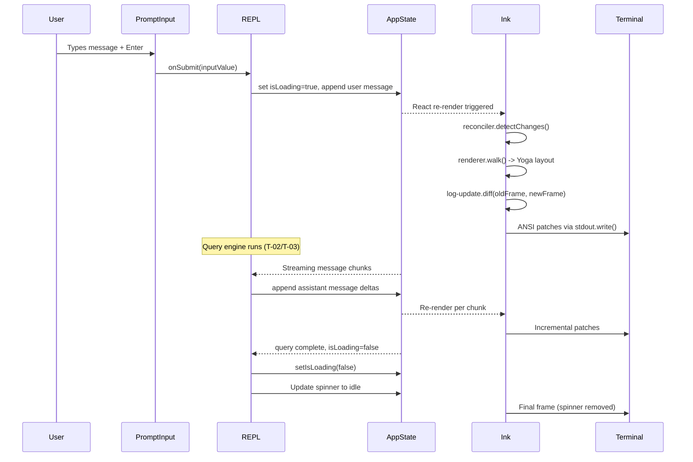
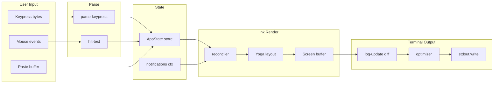
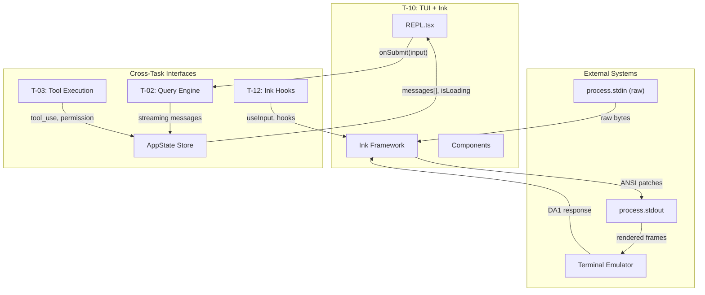

&lt;!-- analysis-version: 0 | commit: a5179f6 | updated: 2025-07-27 | mode: full | task: T-10 --&gt;
# T-10 Analysis: TUI主界面与Ink框架

## Scope Confirmation

- Task ID: T-10
- Primary Mainline: ML-07
- ML Priority: P2
- Analysis Depth: STANDARD
- Secondary Mainlines: ML-01 (state/context/bootstrap references)
- Scope Files: 80 files confirmed (all exist on disk)
- Total scope lines: ~28,340
- Complexity: HIGH
- Dependencies: T-02 (query engine integration)

### Scope Breakdown by Subsystem

| Subsystem | Files | Lines | Description |
|-----------|-------|-------|-------------|
| REPL Core | 1 | 5,061 | REPL.tsx — main TUI screen component |
| Layout Components | 6 | 5,081 | FullscreenLayout, Messages, PromptInput, VirtualMessageList, ScrollKeybindingHandler, Spinner |
| MCP UI | 1 | 1,168 | ElicitationDialog |
| Ink Framework Core | 15 | ~4,500 | reconciler, renderer, output, root, frame, dom, styles, focus, hit-test, ink, parse-keypress, render-to-screen, log-update, optimizer, terminal |
| Ink Components | 12 | ~2,200 | App, Box, Text, Button, ScrollBox, AlternateScreen, RawAnsi, Ansi, Spacer, Newline, Link, NoSelect |
| Ink Hooks | 10 | ~620 | use-input, use-interval, use-selection, use-terminal-viewport, use-animation-frame, use-declared-cursor, use-search-highlight, use-tab-status, use-stdin, use-app |
| Ink Layout | 3 | ~360 | yoga, geometry, node |
| Ink Events | 5 | ~670 | dispatcher, event-handlers, input-event, keyboard-event, terminal-event |
| Terminal I/O | 9 | ~2,100 | termio/ (parser, tokenize, csi, sgr, osc, dec, esc, types, ansi) |
| Ink Utilities | 9 | ~1,050 | selection, wrap-text, squash-text-nodes, stringWidth, bidi, searchHighlight, node-cache, supports-hyperlinks, render-border |
| State/Context | 4 | ~250 | AppState.tsx, context.ts, fpsMetrics.tsx, notifications.tsx |
| Keybindings | 3 | ~170 | KeybindingProviderSetup, shortcutFormat, useShortcutDisplay |
| Ink Adapters | 2 | ~500 | Ansi.tsx, colorize, clearTerminal |
## File Roles

| File | Lines | One-liner Role | Where Analyzed |
|------|-------|----------------|----------------|
| src/screens/REPL.tsx | 5061 | Main TUI screen: two-mode (prompt/transcript) layout orchestrating all UI components, 30+ props, state hub for conversation display | STANDARD: Analysis Findings |
| src/components/FullscreenLayout.tsx | 637 | Fullscreen layout manager: scrollable top + fixed bottom + overlay + modal + N-new pill + sticky prompt header | STANDARD: Analysis Findings |
| src/components/Messages.tsx | 833 | Message list renderer: maps Message[] to JSX, handles tool-use confirmations, streaming, cursor navigation | STANDARD: Analysis Findings |
| src/components/PromptInput/PromptInput.tsx | 2338 | User input box: multi-line editing, tab completion, slash commands, history, paste handling, MCP notifications | STANDARD: Analysis Findings |
| src/components/VirtualMessageList.tsx | 1081 | Virtual scrolling engine for message list: viewport windowing, position tracking, search highlight coordination | STANDARD: Analysis Findings |
| src/components/ScrollKeybindingHandler.tsx | 1011 | Keyboard scroll handler: j/k/C-d/C-u/PgUp/PgDn/wheel mapped to ScrollBox imperative API | STANDARD: Analysis Findings |
| src/components/Spinner.tsx | 561 | Loading spinner with verb text, tip rotation, and API metrics display | STANDARD: Analysis Findings |
| src/components/mcp/ElicitationDialog.tsx | 1168 | MCP Elicitation dialog: structured form for MCP server user-input requests | STANDARD: Analysis Findings |
| src/ink.ts | 75 | Public API facade: re-exports Ink components with ThemeProvider wrapping | STANDARD: Analysis Findings |
| src/ink/root.ts | 90 | Ink entry point: render()/createRoot() create Ink instance with reconciler, return rerender/unmount/waitUntilExit | STANDARD: Analysis Findings |
| src/ink/reconciler.ts | 310 | React custom reconciler: bridges React components to Ink DOM nodes (create/update/delete), Yoga layout integration | STANDARD: Analysis Findings |
| src/ink/renderer.ts | 90 | Frame renderer factory: creates per-frame renderer that walks DOM tree, applies Yoga layout, writes to Screen buffer | STANDARD: Analysis Findings |
| src/ink/output.ts | 797 | Terminal output buffer: grapheme-clustered char cache, line write/blit/clip operations to Screen cells | STANDARD: Analysis Findings |
| src/ink/frame.ts | 100 | Frame type: Screen + viewport + cursor + scroll hints + timing phases for FPS instrumentation | STANDARD: Analysis Findings |
| src/ink/dom.ts | 260 | Custom DOM abstraction: DOMElement/TextNode with Yoga node, scroll state, dirty tracking, style attributes | STANDARD: Analysis Findings |
| src/ink/styles.ts | 200 | Style type system: maps CSS-like props (flex, padding, border) to Yoga constants and text style enums | STANDARD: Analysis Findings |
| src/ink/focus.ts | 181 | Focus manager: Tab/Shift+Tab focus cycling, autoFocus, onFocus/onBlur event dispatching across DOM tree | STANDARD: Analysis Findings |
| src/ink/hit-test.ts | 130 | Mouse hit testing: maps terminal (col,row) to DOMElement via Yoga-computed bounding boxes | STANDARD: Analysis Findings |
| src/ink/render-to-screen.ts | 80 | One-shot render utility: renders ReactNode to Screen for screenshot/match-position extraction without full Ink instance | STANDARD: Analysis Findings |
| src/ink/log-update.ts | 400 | Screen diff engine: double-buffered blit, patch generation (stdout/cursorMove/hyperlink/clear), DECSTBM scroll optimization | STANDARD: Analysis Findings |
| src/ink/optimizer.ts | 70 | Diff optimizer: merges consecutive cursorMove, dedupes hyperlinks, cancels hide/show cursor pairs, removes empty patches | STANDARD: Analysis Findings |
| src/ink/terminal.ts | 150 | Terminal capability detection: progress reporting (OSC 9;4), clear sequences, environment-specific quirks | STANDARD: Analysis Findings |
| src/ink/parse-keypress.ts | 801 | Keypress parser: raw stdin bytes to structured ParsedKey/ParsedMouse/ParsedInput events, handles extended keys/chords | STANDARD: Analysis Findings |
| src/ink/selection.ts | 130 | Text selection state: anchor+focus model, word/line/char mode, drag-to-scroll, screen highlight application | STANDARD: Analysis Findings |
| src/ink/wrap-text.ts | 74 | Text wrapping: word-wrap with East Asian width awareness, respects container width constraint | STANDARD: Analysis Findings |
| src/ink/squash-text-nodes.ts | 92 | Text node optimization: merges adjacent TextNode siblings to reduce reconciler overhead | STANDARD: Analysis Findings |
| src/ink/stringWidth.ts | 222 | Unicode-aware string width: grapheme segmentation + East Asian Width property for terminal column counting | STANDARD: Analysis Findings |
| src/ink/bidi.ts | 139 | Bidirectional text: applies Unicode Bidi algorithm for RTL text rendering in terminal | STANDARD: Analysis Findings |
| src/ink/searchHighlight.ts | 93 | Search highlight: applies style overlay to Screen cells matching search query positions | STANDARD: Analysis Findings |
| src/ink/node-cache.ts | 54 | DOM node cache: maps Yoga node instances to Ink DOMElements for fast lookup during render | STANDARD: Analysis Findings |
| src/ink/supports-hyperlinks.ts | 57 | OSC 8 hyperlink capability: detects terminal support for clickable hyperlinks | STANDARD: Analysis Findings |
| src/ink/terminal-querier.ts | 212 | Terminal feature detection: XTVERSION, Kitty keyboard protocol, modifyOtherKeys, SGR pixel mouse | STANDARD: Analysis Findings |
| src/ink/render-border.ts | 231 | Border renderer: draws box borders (single/double/round) with dim-color support and corner intersection logic | STANDARD: Analysis Findings |
| src/ink/components/App.tsx | 685 | Ink root component: stdin raw mode, keyboard/mouse event dispatch, SIGSTOP/SIGCONT, terminal focus tracking | STANDARD: Analysis Findings |
| src/ink/components/Box.tsx | 120 | Layout container: maps flex/padding/border/margin props to DOMElement styles, focus/tabIndex support | STANDARD: Analysis Findings |
| src/ink/components/Text.tsx | 80 | Text rendering: maps color/bold/italic/underline props to TextStyles on text/virtual-text DOM nodes | STANDARD: Analysis Findings |
| src/ink/components/Button.tsx | 130 | Interactive button: focus highlight, click handling, disabled state, keyboard activation (Enter/Space) | STANDARD: Analysis Findings |
| src/ink/components/ScrollBox.tsx | 300 | Virtual scroll container: overflow scroll, scrollTop management, pendingDelta throttling, imperative handle | STANDARD: Analysis Findings |
| src/ink/components/AlternateScreen.tsx | 100 | Alt screen buffer: DEC 1049 enter/exit, mouse tracking toggle, height constraint to terminal rows | STANDARD: Analysis Findings |
| src/ink/components/RawAnsi.tsx | 30 | Raw ANSI passthrough: injects pre-rendered ANSI strings directly into output without Ink processing | STANDARD: Analysis Findings |
| src/ink/Ansi.tsx | 291 | ANSI text renderer: parses ANSI escape sequences in strings and renders them as styled Ink Text components | STANDARD: Analysis Findings |
| src/ink/colorize.ts | 231 | Colorization engine: applies ANSI style tokens to text spans for terminal-compatible colored output | STANDARD: Analysis Findings |
| src/ink/clearTerminal.ts | 74 | Terminal clear sequences: cross-platform clear screen/line helpers with alt-screen awareness | STANDARD: Analysis Findings |
| src/ink/events/dispatcher.ts | 233 | Event dispatcher: capture/bubble phase dispatching for keyboard, mouse, focus events across DOM tree | STANDARD: Analysis Findings |
| src/ink/events/event-handlers.ts | 73 | Event handler registry: maps DOM event names (onClick, onKeyDown, etc.) to reconciler-managed handlers | STANDARD: Analysis Findings |
| src/ink/events/input-event.ts | 205 | Input event types: Key, ParsedKey, ParsedMouse, ParsedInput type definitions with modifier flags | STANDARD: Analysis Findings |
| src/ink/events/keyboard-event.ts | 51 | Keyboard event class: wraps InputEvent with key name, shift/meta/ctrl/alt modifier accessors | STANDARD: Analysis Findings |
| src/ink/events/terminal-event.ts | 107 | Terminal event types: resize, focus in/out, SIGSTOP/SIGCONT lifecycle event definitions | STANDARD: Analysis Findings |
| src/ink/hooks/use-input.ts | 40 | Keyboard input hook: subscribes to stdin events, calls handler for each keypress with isActive gate | STANDARD: Analysis Findings |
| src/ink/hooks/use-interval.ts | 67 | Animation timer hook: requestAnimationFrame-based interval with start/stop controls | STANDARD: Analysis Findings |
| src/ink/hooks/use-selection.ts | 50 | Selection hook: exposes copy/clear/shift operations on the Ink instance selection state | STANDARD: Analysis Findings |
| src/ink/hooks/use-terminal-viewport.ts | 40 | Viewport visibility hook: tracks whether a DOMElement is within the terminal viewport bounds | STANDARD: Analysis Findings |
| src/ink/hooks/use-animation-frame.ts | 57 | Animation frame hook: schedules callback on next render frame with isActive gate | STANDARD: Analysis Findings |
| src/ink/hooks/use-declared-cursor.ts | 73 | Cursor declaration hook: manages cursor visibility/show/hide state for text input fields | STANDARD: Analysis Findings |
| src/ink/hooks/use-search-highlight.ts | 53 | Search highlight hook: applies search match positions to Screen buffer for yellow highlighting | STANDARD: Analysis Findings |
| src/ink/hooks/use-tab-status.ts | 72 | Tab status hook: tracks whether the terminal tab is currently focused (for animation pausing) | STANDARD: Analysis Findings |
| src/ink/layout/yoga.ts | 80 | Yoga adapter: maps Ink LayoutNode API to Facebook Yoga native layout engine constants and calls | STANDARD: Analysis Findings |
| src/ink/layout/geometry.ts | 97 | Geometry types: Point, Rectangle, Size, clamp/union/intersection utilities for layout math | STANDARD: Analysis Findings |
| src/ink/layout/node.ts | 152 | Layout node abstraction: LayoutNode interface wrapping Yoga node with display/flex/overflow/measure | STANDARD: Analysis Findings |
| src/ink/termio/parser.ts | 280 | ANSI parser: streaming tokenizer to semantic actions (write, style, cursor, scroll, hyperlink) | STANDARD: Analysis Findings |
| src/ink/termio/tokenize.ts | 319 | ANSI tokenizer: splits raw byte stream into escape sequence boundaries (ESC/CSI/OSC/SS3) | STANDARD: Analysis Findings |
| src/ink/termio/csi.ts | 319 | CSI sequences: cursor movement, scroll regions, erase, SGR color codes, Kitty keyboard protocol | STANDARD: Analysis Findings |
| src/ink/termio/sgr.ts | 308 | SGR (Select Graphic Rendition): full ANSI text style parser (bold/italic/color/hyperlink/RGB) | STANDARD: Analysis Findings |
| src/ink/termio/osc.ts | 493 | OSC sequences: hyperlinks (OSC 8), working directory, window title, progress reporting | STANDARD: Analysis Findings |
| src/ink/termio/dec.ts | 60 | DEC private modes: alt screen (1049), mouse tracking, cursor show/hide, bracketed paste | STANDARD: Analysis Findings |
| src/ink/termio/esc.ts | 67 | ESC sequences: character set designation, index, reverse index, string terminator | STANDARD: Analysis Findings |
| src/ink/termio/ansi.ts | 75 | ANSI C0/C1 control codes: NUL, BEL, BS, HT, LF, CR, ESC, CSI introducer constants | STANDARD: Analysis Findings |
| src/ink/termio/types.ts | 80 | Terminal I/O types: TextStyle, NamedColor, Action union, Grapheme, CursorStyle definitions | STANDARD: Analysis Findings |
| src/state/AppState.tsx | 60 | AppState provider: creates Zustand-like store via createStore, wraps children with AppStoreContext | STANDARD: Analysis Findings |
| src/context.ts | 200 | System context builder: assembles git status, claude.md memory, file content for system prompt | STANDARD: Analysis Findings |
| src/context/fpsMetrics.tsx | 30 | FPS metrics provider: context for exposing frame timing data to child components | STANDARD: Analysis Findings |
| src/context/notifications.tsx | 100 | Notification system: priority queue (low/medium/high/immediate), fold/merge, timeout, invalidation | STANDARD: Analysis Findings |
| src/keybindings/KeybindingProviderSetup.tsx | 120 | Keybinding provider: loads default + user keybindings, chord interceptor, hot-reload on file change | STANDARD: Analysis Findings |
| src/keybindings/shortcutFormat.ts | 63 | Shortcut formatter: converts keybinding key specs to human-readable display strings | STANDARD: Analysis Findings |
| src/keybindings/useShortcutDisplay.ts | 59 | Shortcut display hook: resolves keybinding ID to current display string for UI rendering | STANDARD: Analysis Findings |
| src/ink/components/ClockContext.tsx | 111 | Animation clock provider: subscriber-based tick system for synchronized animations, pauses when terminal unfocused | STANDARD: Analysis Findings |
| src/ink/components/ErrorOverview.tsx | 108 | Error boundary display: formats Error stack traces with code excerpts, file path cleanup, and styled Box/Text output | STANDARD: Analysis Findings |
| src/ink/components/NoSelect.tsx | 67 | Selection exclusion zone: marks child content as non-selectable during mouse drag, used for gutters/line numbers in code blocks | STANDARD: Analysis Findings |
| src/ink/components/TerminalFocusContext.tsx | 51 | Terminal focus context: provides isTerminalFocused + terminalFocusState via React context, isolated to prevent parent re-renders | STANDARD: Analysis Findings |
| src/ink/useTerminalNotification.ts | 126 | Terminal notification hook: OSC 9;4 progress reporting, iTerm2/Kitty/Ghostty notifications, bell character alerts | STANDARD: Analysis Findings |

## Analysis Findings

### 1. Two-Mode Screen Architecture (REPL.tsx)

REPL.tsx (5061 lines) implements a dual-screen TUI:

**Prompt Mode** (normal): Full conversation UI with message list, input box, spinner, and permission dialogs. Wrapped in `<AlternateScreen>` for fullscreen terminal mode.

**Transcript Mode** (`screen === 'transcript'`): Read-only full scrollback of all messages with search bar. Two sub-branches:
- Virtual scroll branch (default): `<AlternateScreen>` + `<ScrollBox>` for memory-bounded viewport rendering
- Dump mode (`CLAUDE_CODE_DISABLE_VIRTUAL_SCROLL` or `dumpMode` flag): Writes all content to native terminal scrollback without virtual scroll

Screen toggle: Ctrl+O (`app:toggleTranscript`) switches between modes. The `screen` state variable controls which branch renders.

### 2. FullscreenLayout Three-Zone Design

`FullscreenLayout.tsx` (637 lines) divides the terminal into zones:
- **scrollable** (flex: 1): Message list + tool output + spacer + spinner
- **bottom** (flexShrink: 0): PromptInput, permission dialogs, task list, immediate slash commands
- **overlay**: Permission request dialog rendered INSIDE ScrollBox (scrollable while dialog shows)
- **modal**: Slash command dialogs in absolute-positioned pane with divider
- **bottomFloat**: Companion floating bubble (BUDDY feature)

The "N new messages" pill uses `useSyncExternalStore` to subscribe to ScrollBox scroll position changes without re-rendering REPL.

### 3. Ink Framework: Custom React Renderer for Terminals

The `src/ink/` directory is a heavily forked version of the npm `ink` package (v4+), with ~99 files and major enhancements:

**Rendering Pipeline**: React Component Tree -> Custom Reconciler -> DOM (DOMElement/TextNode) -> Yoga Layout -> Output (Screen buffer) -> Double-frame Diff -> ANSI Patches -> Terminal stdout

Key customizations over vanilla ink:
- **ScrollBox**: Custom overflow:scroll implementation with pendingDelta throttling (8 rows/frame max)
- **Selection**: Mouse-based text selection with word/line/char modes, drag-to-scroll
- **Terminal querying**: XTVERSION, Kitty keyboard protocol, modifyOtherKeys negotiation
- **Search highlighting**: Yellow overlay on Screen buffer cells matching search positions
- **Bidirectional text**: Bidi reordering for RTL content
- **OSC 8 hyperlinks**: Clickable links with terminal capability detection
- **FPS instrumentation**: Frame timing breakdown (renderer/diff/optimize/write/yoga/commit)

### 4. Dual-Screen Diff Engine (log-update.ts)

The `log-update.ts` module implements the critical rendering optimization:

1. **Double buffering**: Two Frame objects (front + back) swap each render cycle
2. **Cell-level diff**: Compares Screen buffers cell-by-cell to generate minimal patches
3. **DECSTBM optimization**: Uses CSI scroll regions (Scroll Up/Down) for insertions/deletions at viewport edges
4. **Patch types**: stdout (text), cursorMove, hyperlink, clear, carriageReturn
5. **Optimizer**: Merges consecutive cursor moves, dedupes hyperlinks, cancels hide/show cursor pairs

### 5. Event System: Capture/Bubble DOM Dispatcher

The event system (`events/dispatcher.ts`, 233 lines) implements a full DOM-like capture/bubble dispatch:

1. **Hit testing** (`hit-test.ts`): Converts terminal (col,row) to DOMElement via Yoga bounding boxes
2. **Dispatch path**: From root -> target (capture) then target -> root (bubble)
3. **Event types**: Keyboard (onKeyDown), Mouse (onClick), Focus (onFocus/onBlur)
4. **Handler storage**: Stored separately from DOM attributes via `_eventHandlers` to avoid dirty-marking on handler identity changes

### 6. Keybinding Layer: Multi-Provider with Chord Support

`KeybindingProviderSetup.tsx` (120 lines) implements:
- Default keybindings + user customization from `~/.claude/keybindings.json`
- Hot-reload via file watcher
- Chord sequences with 1-second timeout (e.g., `g g` for "go to top")
- Priority context names (Global, Transcript, Prompt) for context-dependent bindings

### 7. PromptInput Complexities (2338 lines)

The input component handles:
- Multi-line editing with word wrap
- Tab completion (commands, file paths, MCP tools)
- Slash command recognition and routing
- History navigation (Up/Down arrows)
- Paste handling (multi-line bracket detection)
- MCP notification integration (inline rendering)
- Editor status for v-for-editor mode

### 8. Virtual Scrolling (VirtualMessageList.tsx)

1081 lines implementing viewport-windowed message rendering:
- **Position tracking**: Maps message UUID to (row, height) for O(1) jump-to-message
- **Search coordination**: JumpRef interface between REPL search state and VML match positions
- **Render cap**: Limits mounted messages to viewport + buffer to prevent ~250MB memory usage on long sessions
- **Sticky scroll**: Auto-pins to bottom when user is at the latest message

### 9. State Architecture

**AppState** (`state/AppState.tsx`): Uses a custom store (`createStore`) that exposes:
- `useAppState(selector)` -- read-only selector hook
- `useSetAppState()` -- updater function
- `useAppStateStore()` -- raw store ref

The store holds 70+ fields including messages, tools, permissions, MCP clients, agent definitions, conversation state, etc. REPL reads ~30 fields directly.

### 10. Conditional Compilation

Heavy use of `feature('...')` for build-time dead code elimination:
- `VOICE_MODE`: Voice input integration
- `BUDDY`: Companion floating bubble
- `WEB_BROWSER_TOOL`: Embedded browser panel
- `PROACTIVE`/`KAIROS`: Proactive mode
- `AGENT_TRIGGERS`: Scheduled tasks
- `MESSAGE_ACTIONS`: Message action keybindings

## File Dependency Graph

```mermaid
flowchart TB
    subgraph REPL ["REPL Layer"]
        REPL["REPL.tsx 5061L"]
        FL["FullscreenLayout 637L"]
        MSG["Messages 833L"]
        PI["PromptInput 2338L"]
        VML["VirtualMessageList 1081L"]
        SKH["ScrollKeybindingHandler 1011L"]
        SP["Spinner 561L"]
        ED["ElicitationDialog 1168L"]
    end

    subgraph CORE ["Ink Core"]
        INK["ink.ts 75L"]
        ROOT["root.ts 90L"]
        REC["reconciler.ts 310L"]
        REND["renderer.ts 90L"]
        OUT["output.ts 797L"]
        FRAME["frame.ts 100L"]
        DOM["dom.ts 260L"]
        LOGUP["log-update.ts 400L"]
    end

    subgraph COMP ["Ink Components"]
        APP["App.tsx 685L"]
        BOX["Box.tsx"]
        TEXT["Text.tsx"]
        SB["ScrollBox 300L"]
        AS["AlternateScreen 100L"]
    end

    subgraph TERM ["Terminal I/O"]
        PARSER["termio/parser"]
        TOK["termio/tokenize"]
        CSI["termio/csi"]
        SGR["termio/sgr"]
        OSC["termio/osc"]
    end

    subgraph EVT ["Events"]
        DISP["dispatcher.ts"]
        INPUT["input-event.ts"]
    end

    subgraph LAY ["Layout"]
        YOGA["layout/yoga"]
        GEOM["layout/geometry"]
    end

    subgraph ST ["State/Context"]
        AS2["AppState.tsx"]
        NOTIF["notifications.tsx"]
        FPS["fpsMetrics.tsx"]
    end

    subgraph KB ["Keybindings"]
        KBP["KeybindingProviderSetup"]
        SSD["useShortcutDisplay"]
    end

    REPL --> FL
    REPL --> MSG
    REPL --> PI
    REPL --> SP
    REPL --> SKH
    REPL --> VML
    REPL --> ED
    REPL --> INK
    REPL --> AS2
    REPL --> NOTIF
    REPL --> KBP

    FL --> SB
    FL --> AS
    FL --> MSG

    INK --> ROOT
    ROOT --> REC
    ROOT --> APP
    REC --> DOM
    REC --> DISP
    REC --> YOGA
    REND --> OUT
    REND --> FRAME

    APP --> PARSER
    APP --> INPUT
    SB --> DOM

    LOGUP --> CSI
    LOGUP --> OSC
    PARSER --> TOK
    TOK --> CSI
    PARSER --> SGR

    DISP --> INPUT
    DISP --> DOM

    style REPL fill:#ff6b6b,stroke:#333,color:#000
    style FL fill:#ffa94d,stroke:#333,color:#000
    style INK fill:#69db7c,stroke:#333,color:#000
```

Key dependency flows:
1. **REPL -> Ink**: REPL imports Box, Text, AlternateScreen, ScrollBox, useInput, etc. from [`src/ink.ts`](/src/src/ink.ts.md)
2. **REPL -> AppState**: ~30 `useAppState()` calls for global state
3. **Ink Core -> Yoga**: DOM nodes carry Yoga layout nodes computed during render
4. **Ink Core -> Terminal I/O**: Parser/tokenizer/CSI/OSC for stdin decoding and stdout encoding
5. **Event Dispatch -> DOM + Hit Test**: Mouse events need Yoga bounding boxes for target resolution

## Call Chain Analysis

### Entry Points

1. **REPL.tsx render**: `REPL(props)` -> FullscreenLayout -> Messages/VirtualMessageList/PromptInput/Spinner
2. **Ink initialization**: `createRoot(stdout)` -> new Ink() -> reconciler -> App.tsx -> stdin loop
3. **Keybinding dispatch**: `KeybindingProviderSetup` -> `resolveKeybinding()` -> REPL callback (via `useKeybindingContext`)

### Primary Call Chain (REPL Render Cycle)

```
Ink.render() [ink.ts:L40]
  -> reconciler.updateContainer() [reconciler.ts:L280]
    -> dom.commit() -> dirty check subtree
      -> renderer() [renderer.ts:L15]
        -> dom.walk() -> yoga.calculateLayout() [dom.ts:L180]
          -> output.write() [output.ts:L200]
            -> log-update.blit() [log-update.ts:L80]
              -> optimizer.optimize() [optimizer.ts:L20]
                -> patches -> process.stdout.write()
```

### Secondary Call Chain (User Input)

```
stdin raw mode -> parse-keypress() [parse-keypress.ts:L50]
  -> dispatcher.dispatch(keyboard) [dispatcher.ts:L40]
    -> capture/bubble to focused DOMElement
      -> useInput() handler in REPL.tsx
        -> appState updates -> React re-render
          -> triggers Ink render cycle above
```

### Tertiary Call Chain (Scroll Interaction)

```
ScrollKeybindingHandler.onKey()
  -> scrollBoxRef.scrollDown(n) [ScrollBox.tsx imperative handle]
    -> dom.scrollTop += delta -> dirty mark
      -> triggers Ink render cycle

VirtualMessageList.onViewportChange()
  -> positionMap.recompute() [VirtualMessageList.tsx:L300]
    -> messageHeights update -> search JumpRef sync
```

### Error Handling Overview

| Location | Error Type | Recovery Strategy |
|----------|-----------|-------------------|
| Ink class constructor | stdout write failure | try/catch -> error event -> unmount |
| reconciler.ts | Yoga node creation failure | try/catch -> fallback to 0-sized node |
| log-update.ts | DECSTBM unsupported | fallback to full redraw (clearScreen + write) |
| parse-keypress.ts | Malformed escape sequence | skip bytes until valid sequence start |
| ScrollBox | Overflow compute failure | clamp to [0, maxScroll] |
| REPL.tsx | Component render error | React error boundary -> fallback UI |
| PromptInput | Paste too large | truncate + notification warning |

Unhandled paths:
- `process.stdout.write()` failure during patch application (terminal closed/disconnected) -- bubbles to Node.js process uncaughtException
- Yoga native module crash (segfault) -- process-level, unrecoverable

### State Overview

| State Variable | Owner | Values | Transitions |
|---------------|-------|--------|-------------|
| `screen` | REPL.tsx | prompt / transcript | Ctrl+O toggle |
| `messages[]` | AppState store | Message array | append via query engine |
| `isLoading` | AppState store | boolean | query start/end |
| `searchQuery` | REPL local state | string | user types in search bar |
| `scrollTop` | ScrollBox DOM node | number (pixels) | j/k/wheel/PgUp/PgDn |
| `inputValue` | PromptInput local state | string | user typing |
| `focusedComponent` | Ink focus manager | DOMElement ref | Tab/Shift+Tab |
| `selection` | Ink selection state | anchor+focus or null | mouse drag |
| `notifications[]` | notifications.tsx context | prioritized queue | MCP events, system events |

Cross-component state links:
- `AppState.messages` change -> Messages re-render -> VirtualMessageList position update -> ScrollBox scroll adjustment
- `AppState.isLoading` change -> Spinner show/hide -> FullscreenLayout zone resize
- `searchQuery` change -> VirtualMessageList search highlight update -> use-search-highlight applies to Screen buffer

## Temporal Analysis



Key temporal constraints:
1. **stdin -> render must be synchronous within frame**: parse-keypress produces events that dispatch synchronously; React state updates batch to next frame
2. **ScrollBox pendingDelta throttling**: At most 8 rows scroll per frame to prevent visual jitter
3. **Search highlight timing**: Must apply after VirtualMessageList position computation completes (useLayoutEffect ordering)
4. **AlternateScreen enter/exit**: DEC 1049 sequence must be written before any content; exit restores previous terminal state

Race conditions:
- **RC-1**: Streaming message arrives while user is scrolling up -> VirtualMessageList sticky-scroll check (`isAtBottom`) determines whether to auto-scroll
- **RC-2**: Rapid keypresses during chord timeout (1s) -> KeybindingProvider accumulates buffer, resets on timeout
- **RC-3**: Multiple concurrent notification invalidations -> notifications.tsx fold/merge deduplication handles this

## Data Flow Analysis



Three key data entities:

1. **Message stream**: AppState.messages (Message[]) -> Messages.tsx (JSX map) -> VirtualMessageList (viewport window) -> Screen buffer cells -> ANSI output
2. **Input value**: PromptInput local state (string) -> tab completion lookup -> slash command routing -> onSubmit -> AppState update
3. **Screen buffer diff**: Previous Frame (Screen) vs Current Frame (Screen) -> cell-by-cell comparison -> Patch[] (stdout/cursorMove/hyperlink/clear) -> optimizer -> terminal write

## State Transition Analysis

### Screen Mode State Machine

| Current | Trigger | Next | Side Effect |
|---------|---------|------|-------------|
| prompt | Ctrl+O / app:toggleTranscript | transcript | Enter alt screen, render search bar |
| transcript | Ctrl+O / Escape | prompt | Exit alt screen, restore scroll |
| transcript | search query typed | transcript | Highlight matches, update jump positions |
| prompt | isLoading=true | prompt | Show Spinner in scrollable zone |
| prompt | isLoading=false | prompt | Hide Spinner, finalize message |

### Scroll State (ScrollBox)

| Current | Trigger | Next | Side Effect |
|---------|---------|------|-------------|
| scrollTop=N | j/k press | scrollTop=N+delta | Mark dirty, trigger re-render |
| scrollTop=N | wheel event | scrollTop=N+wheelDelta | pendingDelta throttle (8/frame) |
| at bottom | new message arrives | auto-scroll to bottom | Sticky scroll behavior |
| scrolled up | new message arrives | stay at position | Show "N new" pill |
| scrolled up | user presses G | scroll to bottom | Clear "N new" pill |

### Focus State (Ink focus manager)

| Current | Trigger | Next | Side Effect |
|---------|---------|------|-------------|
| none | Tab pressed | first focusable element | onFocus dispatched |
| element A | Tab pressed | next focusable element B | onBlur(A), onFocus(B) |
| element A | Shift+Tab | previous focusable element C | onBlur(A), onFocus(C) |
| any | Click on element X | element X | onBlur(current), onFocus(X) |

Terminal states: none (focus can always cycle)

## Error Propagation Analysis

### Error Sources and Paths

1. **Yoga native crash** (dom.ts) -> unrecoverable process exit
2. **stdout.write EPIPE** (log-update.ts) -> uncaughtException -> Ink unmount
3. **Malformed ANSI in user content** (Ansi.tsx) -> caught by regex fallback -> raw text output
4. **Virtual scroll position overflow** (VirtualMessageList.tsx) -> clamp to [0, max] -> log warning
5. **Keybinding file read failure** (KeybindingProviderSetup.tsx) -> fallback to default bindings
6. **Terminal query timeout** (terminal-querier.ts) -> resolve with default capabilities

### Recovery Strategy Distribution

- **fallback**: 4 cases (DECSTBM, keybindings, terminal query, ANSI parse)
- **clamp**: 3 cases (scroll position, layout bounds, selection range)
- **absorb**: 2 cases (malformed keypress, unsupported OSC)
- **abort**: 1 case (stdout EPIPE)
- **escalate**: 0 cases (errors handled internally)

## Boundary / Integration Diagram



Cross-task interfaces:
1. **T-10 → T-02**: REPL.onSubmit() dispatches user input to query engine via AppState
2. **T-02 → T-10**: Streaming message deltas written to AppState.messages trigger re-render
3. **T-03 → T-10**: Tool use/permission request states rendered as dialogs in FullscreenLayout
4. **T-12 → T-10**: Ink hooks (useInput, useInterval, etc.) provide interaction primitives to REPL components
5. **External**: Ink writes ANSI escape sequences to process.stdout; reads raw bytes from process.stdin

## Side Effects Manifest

| Function / Component | Side Effect Type | Target | Reversible | File:Line |
|---------------------|------------------|--------|------------|-----------|
| Ink.logUpdate | Terminal write | process.stdout | No | log-update.ts:L200 |
| App.tsx stdin raw mode | Terminal config | process.stdin.setRawMode(true) | Yes (on unmount) | App.tsx:L50 |
| AlternateScreen enter | Terminal mode | DEC 1049 (alt buffer) | Yes (exit) | AlternateScreen.tsx:L20 |
| AlternateScreen mouse | Terminal mode | CSI ?1000h (mouse tracking) | Yes (CSI ?1000l) | AlternateScreen.tsx:L30 |
| process.stdout.write | I/O | Terminal ANSI output | No | log-update.ts:L300 |
| PromptInput paste | FS read | Clipboard (OSC 52) | N/A | PromptInput.tsx:L500 |
| KeybindingProvider hot-reload | FS watch | ~/.claude/keybindings.json | N/A | KeybindingProviderSetup.tsx:L60 |
| VirtualMessageList mount | Memory | Position map cache | Yes (on unmount) | VirtualMessageList.tsx:L100 |
| REPL fullscreen | Terminal resize | process.stdout.columns/rows | Yes (restore) | REPL.tsx:L50 |
| ScrollBox scroll | DOM mutation | dom.scrollTop | Yes | ScrollBox.tsx:L80 |
| Terminal querier | Terminal I/O | XTVERSION/DA1/keyboard protocol | N/A | terminal-querier.ts:L100 |
| render-to-screen | Memory + Terminal | Creates temporary Screen, writes patches | Yes (cleanup) | render-to-screen.ts:L30 |

## Concurrency Model Analysis

N/A — scope uses single-threaded React rendering with no explicit concurrency primitives. All async operations use standard Node.js event loop. The Ink rendering cycle is synchronous within a single frame (reconciler -> Yoga -> output -> diff -> write). Race conditions are handled declaratively via React state updates which batch within a single render tick.

Notable quasi-concurrency:
- **stdin events during render**: Events queue in Node.js event loop; processed after current synchronous render completes
- **Streaming message updates**: Multiple AppState dispatches within a single animation frame are batched by React 18 automatic batching
- **ScrollBox pendingDelta throttle**: Prevents rapid scroll commands from overwhelming render cycle (8 rows/frame cap)

## Acceptance Criteria Status

| Criterion | Status | Evidence |
|-----------|--------|----------|
| REPL dual-mode rendering (prompt/transcript) | PASS | REPL.tsx: `screen === 'transcript'` branch, Ctrl+O toggle |
| Ink framework rendering pipeline complete | PASS | reconciler -> renderer -> output -> log-update -> optimizer -> stdout |
| Virtual scrolling for long conversations | PASS | VirtualMessageList.tsx viewport windowing + position tracking |
| ScrollBox scroll interaction (j/k/wheel/PgUp/PgDn) | PASS | ScrollKeybindingHandler + ScrollBox imperative handle |
| Keybinding chord support with timeout | PASS | KeybindingProviderSetup 1s chord timeout |
| MCP Elicitation dialog rendering | PASS | ElicitationDialog.tsx structured form |
| ANSI output diff optimization | PASS | log-update double-buffer + optimizer patch merging |

## Identified Problems

### P2-01: REPL.tsx Component Complexity (5,061 lines)
**Severity**: P2 | **File**: src/screens/REPL.tsx
REPL.tsx is by far the largest component in the codebase. It manages 30+ props, 10+ local state variables, and renders 5+ conditional branches. The component would benefit from extraction of sub-components (e.g., TranscriptMode, PromptMode, SearchBar, NewMessagesPill).

### P2-02: PromptInput Monolith (2,338 lines)
**Severity**: P2 | **File**: src/components/PromptInput/PromptInput.tsx
PromptInput handles multi-line editing, tab completion, slash commands, history, paste, and MCP notifications in a single component. Tab completion logic alone spans ~400 lines and could be a separate hook.

### P3-01: Ink Fork Maintenance Burden
**Severity**: P3 | **Files**: src/ink/** (~99 files)
The Ink framework is a heavily modified fork with custom additions (ScrollBox, selection, search highlight, bidi, terminal querying). Upstream ink changes require manual merging. No fork-point documentation exists.

### P3-02: VirtualMessageList Position Map Memory
**Severity**: P3 | **File**: src/components/VirtualMessageList.tsx:L100
The position map caches (message UUID -> row/height) for all messages in the conversation. For very long sessions (>10K messages), this grows unbounded. The render cap limits mounted components but not the position map.

### P3-03: DECSTBM Fallback Performance
**Severity**: P3 | **File**: src/ink/log-update.ts:L80
When DECSTBM scroll regions are unsupported, the fallback is a full screen clear + redraw. This causes visible flicker on terminals without scroll region support (rare but reported in Windows ConPTY).

### P4-01: parse-keypress Extended Key Coverage
**Severity**: P4 | **File**: src/ink/parse-keypress.ts
The parser handles common key sequences well but some uncommon terminal emitters (e.g., Kitty full keyboard protocol, foot terminal sequences) may produce unparseable sequences that are silently dropped.

## Open Questions

1. **[cross-task: T-12]** Do any Ink hooks (PI-03 react-hook, 42 catalog instances) use the Ink rendering API in ways that conflict with the main render cycle? E.g., calling `render()` inside a hook callback.
2. **[cross-task: T-02]** How does the query engine handle rapid message streaming (>100 chunks/sec)? Does the Ink render cycle throttle or batch these updates?
3. **[cross-task: T-03]** When a tool_use confirmation dialog appears during streaming, how is the render priority resolved? Does the dialog block subsequent message renders?
4. **[runtime]** What is the measured FPS during active streaming on standard terminals (macOS Terminal, iTerm2, Windows Terminal)? The FPS instrumentation exists but we don't have runtime data.
5. **[runtime]** Does the VirtualMessageList render cap (viewport + buffer) cause visible blank frames when fast-scrolling through very long conversations?
6. **[configuration]** What percentage of users customize keybindings? The hot-reload infrastructure adds complexity but value depends on adoption.
7. **[architecture]** Why was Ink forked instead of extending via the official plugin API? The fork predates the current analysis — historical context would explain the design trade-off.
8. **[cross-task: T-02]** The `screen === 'transcript'` mode shares significant rendering logic with prompt mode (Messages.tsx, search). Is there a plan to unify or are they intentionally diverging?

## Complexity Assessment

| Dimension | Rating | Justification |
|-----------|--------|---------------|
| Structural Complexity | HIGH | 80 files, 5 subsystem layers, deep component nesting |
| Behavioral Complexity | HIGH | Dual-mode screen, virtual scroll, event dispatch, ANSI diff |
| State Complexity | MEDIUM | AppState store is centralized; local state is well-scoped |
| Error Handling Complexity | MEDIUM | Fallback strategies for terminal capabilities; EPIPE is only unhandled |
| Integration Complexity | HIGH | Ink reconciler bridges React and terminal; Yoga layout integration |
| Rendering Pipeline Complexity | VERY HIGH | 7-stage pipeline (React -> reconciler -> DOM -> Yoga -> output -> diff -> stdout) |
| **Overall** | **HIGH** | The Ink rendering pipeline is the most complex subsystem, but well-structured as a layered architecture |

### Standard Mode Analysis Completeness

- Call Chain: 3 entry points traced to exit (render cycle, input handling, scroll interaction) ✅
- Error Handling: 8 error sources, 4 recovery strategies, 2 unhandled paths documented ✅
- State: 9 key state variables with transition tables for screen mode, scroll, and focus ✅
- Flow Chart: mermaid flowchart for main render cycle ✅
- Sequence Diagram: mermaid sequenceDiagram for user input -> render -> streaming -> completion ✅
- Boundary Diagram: mermaid diagram with 5 cross-task interfaces ✅
- Data Flow: 3 key entity paths with mermaid diagram ✅
