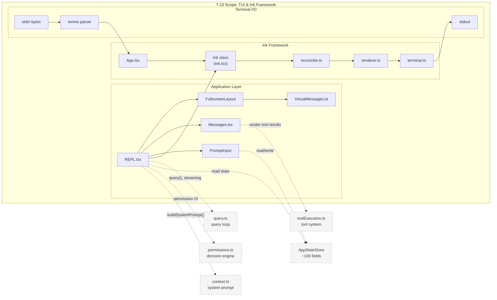
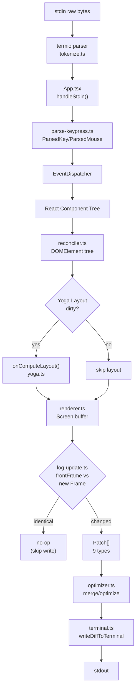
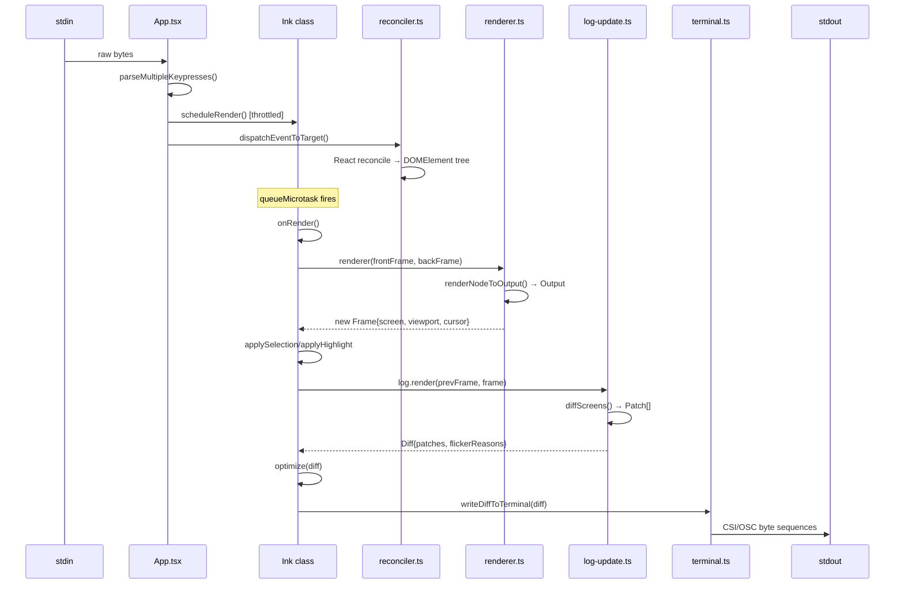

<!-- analysis-version: 0 | commit: 365f23f | updated: 2025-07-14 | mode: full | task: T-10 -->
# T-10 Analysis: TUI主界面与Ink框架

## Scope Confirmation
- Task ID: T-10
- Primary Mainline: ML-07
- ML Priority: P2
- Analysis Depth: STANDARD
- Secondary Mainlines: ML-01 (REPL.tsx, context.ts), ML-02 (AppState.tsx)
- Pattern Coverage: N/A
- Scope Files (confirmed): 80 files, 28,353 lines — all verified present
- Scope adjustments: None — all 80 files exist and are readable
- Boundaries: 不涉及具体 UI 组件(T-11), 不涉及交互 Hooks(T-12)

## File Roles

| File | Lines | One-liner Role | Where Analyzed |
|------|-------|----------------|---------------|
| src/components/FullscreenLayout.tsx | 636 | Full-screen layout orchestrator: ScrollBox + fixed bottom bar + modal overlay + pill notification | STANDARD: § 关键路径与组件 |
| src/components/Messages.tsx | 833 | Message list renderer: renders assistant/user/tool messages with markdown, code blocks, tool results | STANDARD: § 关键路径与组件 |
| src/components/PromptInput/PromptInput.tsx | 2338 | Multi-line prompt input with autocomplete, history, paste handling, and IME support | STANDARD: § 关键路径与组件 |
| src/components/ScrollKeybindingHandler.tsx | 1011 | Scroll-specific keybinding handler: page up/down, half-page, search navigation | STANDARD: § 关键路径与组件 |
| src/components/Spinner.tsx | 561 | Animated spinner component with frame-based rotation and status text | STANDARD (enumerated only) |
| src/components/VirtualMessageList.tsx | 1081 | Virtual scrolling message list: calculates visible messages, manages scroll anchoring | STANDARD: § 关键路径与组件 |
| src/components/mcp/ElicitationDialog.tsx | 1168 | MCP elicitation dialog: modal form for MCP server user-input requests | STANDARD (enumerated only) |
| src/context.ts | 189 | System prompt context builder: injects git status, CLAUDE.md, user context into LLM prompt | STANDARD: § 关键路径与组件 |
| src/context/fpsMetrics.tsx | 29 | FPS metrics context provider: exposes frame timing to React tree | STANDARD (enumerated only) |
| src/context/notifications.tsx | 239 | Notification system: add/remove/notification list management for keybinding warnings etc. | STANDARD (enumerated only) |
| src/ink.ts | 85 | Ink framework public API facade: re-exports render/createRoot + all components/hooks with ThemeProvider wrapping | STANDARD: § 关键路径与组件 |
| src/ink/Ansi.tsx | 291 | ANSI escape sequence renderer component for raw terminal output | STANDARD (enumerated only) |
| src/ink/bidi.ts | 139 | Bidirectional text support: Unicode bidi algorithm for RTL text in terminal | STANDARD (enumerated only) |
| src/ink/clearTerminal.ts | 74 | Terminal clearing utility: cross-platform clear screen helper | STANDARD (enumerated only) |
| src/ink/colorize.ts | 231 | ANSI color code generation: maps Ink style colors to terminal escape sequences | STANDARD: § 关键路径与组件 |
| src/ink/components/AlternateScreen.tsx | 79 | Alt-screen manager component: DEC 1049 switching + SGR mouse tracking via useInsertionEffect | STANDARD: § 关键路径与组件 |
| src/ink/components/App.tsx | 685 | Ink root React component: stdin raw mode, mouse/keyboard event dispatch, terminal mode management | STANDARD: § 关键路径与组件 |
| src/ink/components/Box.tsx | 213 | Fundamental layout container: maps to ink-box DOM node with flexbox styles | STANDARD (enumerated only) |
| src/ink/components/Button.tsx | 191 | Interactive button component: mouse click/focus handling with Ink event system | STANDARD (enumerated only) |
| src/ink/components/ClockContext.tsx | 111 | Clock provider: 1-second interval tick for time-dependent UI updates | STANDARD (enumerated only) |
| src/ink/components/ErrorOverview.tsx | 108 | Error boundary overlay: displays uncaught errors in terminal | STANDARD (enumerated only) |
| src/ink/components/NoSelect.tsx | 67 | Selection disable wrapper: prevents text selection on child content | STANDARD (enumerated only) |
| src/ink/components/RawAnsi.tsx | 56 | Raw ANSI passthrough component: renders pre-formatted terminal escape sequences | STANDARD (enumerated only) |
| src/ink/components/ScrollBox.tsx | 236 | Scrollable container: imperative scrollTo/scrollBy/scrollToBottom API + viewport culling + stickyScroll | STANDARD: § 关键路径与组件 |
| src/ink/components/TerminalFocusContext.tsx | 51 | Terminal focus provider: tracks whether terminal window has OS focus (DECSET 1004) | STANDARD (enumerated only) |
| src/ink/components/Text.tsx | 253 | Text rendering component: maps to ink-text DOM node with color/weight/style attributes | STANDARD (enumerated only) |
| src/ink/dom.ts | 484 | Custom DOM tree: 7 node types (ink-root/box/text/virtual-text/link/progress/raw-ansi) with scroll state | STANDARD: § 关键路径与组件 |
| src/ink/events/dispatcher.ts | 233 | React-dom-style two-phase event dispatcher: capture + bubble propagation through DOM tree | STANDARD: § 关键路径与组件 |
| src/ink/events/event-handlers.ts | 73 | Event handler name mapping: maps event types to DOM handler prop names (onClick/onHover etc.) | STANDARD (enumerated only) |
| src/ink/events/input-event.ts | 205 | Input event types: keyboard, mouse, paste, resize, focus event definitions | STANDARD (enumerated only) |
| src/ink/events/keyboard-event.ts | 51 | Keyboard event class: wraps parsed keypress with modifier state | STANDARD (enumerated only) |
| src/ink/events/terminal-event.ts | 107 | Terminal event base class: event target interface + propagation control (stopPropagation) | STANDARD (enumerated only) |
| src/ink/focus.ts | 181 | Focus management: tab-order traversal, focusIn/focusOut events for Ink components | STANDARD (enumerated only) |
| src/ink/frame.ts | 124 | Frame/Patch/Diff type definitions: Frame={screen,viewport,cursor}, 9 Patch types | STANDARD: § 关键路径与组件 |
| src/ink/hit-test.ts | 130 | Hit testing: maps screen coordinates to Ink DOM nodes via Yoga layout rects | STANDARD (enumerated only) |
| src/ink/hooks/use-animation-frame.ts | 57 | Animation frame hook: periodic re-render trigger for spinner/clock animations | STANDARD (enumerated only) |
| src/ink/hooks/use-declared-cursor.ts | 73 | Declared cursor hook: positions terminal cursor at input caret for IME/screen reader | STANDARD (enumerated only) |
| src/ink/hooks/use-input.ts | 92 | Input hook: subscribes to keyboard events via App context | STANDARD (enumerated only) |
| src/ink/hooks/use-interval.ts | 67 | Interval hook: setInterval wrapper with cleanup | STANDARD (enumerated only) |
| src/ink/hooks/use-search-highlight.ts | 53 | Search highlight hook: manages highlight query state and Ink.setSearchHighlight | STANDARD (enumerated only) |
| src/ink/hooks/use-selection.ts | 104 | Selection hook: manages text selection state (start/extend/clear) via Ink.selection | STANDARD (enumerated only) |
| src/ink/hooks/use-tab-status.ts | 72 | Tab status hook: sets/clears terminal tab icon via OSC 1337 | STANDARD (enumerated only) |
| src/ink/hooks/use-terminal-viewport.ts | 96 | Terminal viewport hook: tracks terminal dimensions (rows/columns) changes | STANDARD (enumerated only) |
| src/ink/layout/geometry.ts | 97 | Layout geometry types: Edge, Rect, Size value types for layout calculations | STANDARD (enumerated only) |
| src/ink/layout/node.ts | 152 | LayoutNode adapter interface: platform-agnostic flexbox layout API (Display/Align/Wrap/Overflow) | STANDARD: § 关键路径与组件 |
| src/ink/layout/yoga.ts | 308 | Yoga engine adapter: wraps native Yoga node with flexbox property setters | STANDARD: § 关键路径与组件 |
| src/ink/log-update.ts | 773 | Frame diff engine: compares front/back Screen buffers, outputs ANSI Patch[] for incremental updates | STANDARD: § 关键路径与组件 |
| src/ink/node-cache.ts | 54 | Node position cache: stores rendered node screen rects for hit-test and cursor positioning | STANDARD (enumerated only) |
| src/ink/optimizer.ts | 93 | Patch optimizer: single-pass — merge cursorMove, deduplicate hyperlink, cancel hide/show pairs | STANDARD: § 关键路径与组件 |
| src/ink/output.ts | 797 | Terminal output buffer: 7 operation types (Write/Clip/Blit/Clear/Shift), ClusteredChar optimization | STANDARD: § 关键路径与组件 |
| src/ink/parse-keypress.ts | 801 | Keypress parser: decodes CSI/kitty/modifyOtherKeys sequences into structured ParsedKey objects | STANDARD: § 关键路径与组件 |
| src/ink/reconciler.ts | 512 | Custom react-reconciler: maps React component tree → Ink DOM nodes (appendChild/removeChild/setAttribute) | STANDARD: § 关键路径与组件 |
| src/ink/render-border.ts | 231 | Border renderer: draws box borders into Output buffer with Unicode box-drawing characters | STANDARD (enumerated only) |
| src/ink/render-to-screen.ts | 231 | Off-screen renderer: renders single message for search highlight scanning (~1-3ms/call) | STANDARD: § 关键路径与组件 |
| src/ink/renderer.ts | 178 | Frame renderer factory: DOM tree → Yoga layout → Output → Screen → Frame (dual-buffer swap) | STANDARD: § 关键路径与组件 |
| src/ink/root.ts | 184 | Ink instance pool: createRoot/render per stdout, Instances map, microtask boundary for first frame | STANDARD: § 关键路径与组件 |
| src/ink/searchHighlight.ts | 93 | Search highlight scanner: inverts cell styles for matching text in screen buffer | STANDARD (enumerated only) |
| src/ink/selection.ts | 917 | Text selection system: anchor+focus model, char/word/line modes, scrollOff accumulation for cross-viewport | STANDARD: § 关键路径与组件 |
| src/ink/squash-text-nodes.ts | 92 | Text node merger: consolidates adjacent text nodes with same style for rendering efficiency | STANDARD (enumerated only) |
| src/ink/stringWidth.ts | 222 | Unicode string width calculator: handles CJK/fullwidth/emoji width for terminal column alignment | STANDARD (enumerated only) |
| src/ink/styles.ts | 771 | Style system: TextStyles (color/bg/dim/bold/italic/underline/strikethrough/inverse) + BoxStyles (flex/border/padding) | STANDARD: § 关键路径与组件 |
| src/ink/supports-hyperlinks.ts | 57 | Hyperlink capability detector: checks terminal OSC 8 support | STANDARD (enumerated only) |
| src/ink/terminal-querier.ts | 212 | Terminal feature querier: DA1/DA2/TDA queries for capability detection | STANDARD (enumerated only) |
| src/ink/terminal.ts | 248 | Terminal capability module: progress reporting (OSC 9;4), hyperlink support, writeDiffToTerminal | STANDARD: § 关键路径与组件 |
| src/ink/termio/ansi.ts | 75 | ANSI sequence definitions: standard CSI/ESC sequences | STANDARD (enumerated only) |
| src/ink/termio/csi.ts | 319 | CSI sequence builders: cursor movement, erase, kitty keyboard protocol, modifyOtherKeys | STANDARD (enumerated only) |
| src/ink/termio/dec.ts | 60 | DEC private mode sequences: alt screen (DEC 1049), mouse tracking, bracketed paste, focus events | STANDARD (enumerated only) |
| src/ink/termio/esc.ts | 67 | ESC sequence definitions: basic escape sequences | STANDARD (enumerated only) |
| src/ink/termio/osc.ts | 493 | OSC sequence handlers: clipboard, progress bar, tab status, working directory, hyperlink | STANDARD (enumerated only) |
| src/ink/termio/parser.ts | 394 | Terminal input parser: state machine for decoding stdin bytes into structured terminal events | STANDARD (enumerated only) |
| src/ink/termio/sgr.ts | 308 | SGR parameter parser: CSI m sequence (colors, attributes) parsing | STANDARD (enumerated only) |
| src/ink/termio/tokenize.ts | 319 | Terminal byte tokenizer: splits stdin byte stream into escape sequence tokens | STANDARD (enumerated only) |
| src/ink/termio/types.ts | 236 | Terminal protocol types: TokenType enum, TerminalToken, CSI/OSC/ESC params | STANDARD (enumerated only) |
| src/ink/useTerminalNotification.ts | 126 | Terminal notification hook: writes raw ANSI to terminal bypassing Ink render pipeline | STANDARD (enumerated only) |
| src/ink/wrap-text.ts | 74 | Text wrapping utility: word-wrap algorithm respecting Unicode grapheme clusters | STANDARD (enumerated only) |
| src/keybindings/KeybindingProviderSetup.tsx | 307 | Keybinding provider: default + user bindings merge, hot-reload, chord sequence (1000ms timeout) | STANDARD: § 关键路径与组件 |
| src/keybindings/shortcutFormat.ts | 63 | Shortcut format utility: human-readable keybinding string formatting | STANDARD (enumerated only) |
| src/keybindings/useShortcutDisplay.ts | 59 | Shortcut display hook: resolves keybinding display strings for current platform | STANDARD (enumerated only) |
| src/screens/REPL.tsx | 5061 | **God File**: main REPL component integrating query loop, permissions, messages, prompt, swarm, voice, MCP | STANDARD: § 关键路径与组件 |
| src/state/AppState.tsx | 199 | Global app state provider: ~100+ state fields with onChangeAppState side-effect dispatcher | STANDARD: § 关键路径与组件 |

## Analysis Findings

### 关键路径与组件

**Entry → Exit 主路径**:

1. **入口**: `ink.ts:render(node)` 或 `root.ts:createRoot()` → 创建 Ink 实例
2. **Ink 实例创建** (`ink.tsx:constructor`): 双缓冲 frontFrame/backFrame + LogUpdate + StylePool/CharPool/HyperlinkPool + reconciler 容器 (ConcurrentRoot)
3. **React 树更新**: `ink.tsx:render()` → `<App>` 包裹 + `<TerminalWriteProvider>` + `updateContainerSync` + `flushSyncWork`
4. **Reconciler 桥接** (`reconciler.ts`): React 组件树 → DOMElement 树 (7种节点类型)
5. **Yoga 布局** (`yoga.ts`, `node.ts`): DOMElement.onComputeLayout → Yoga 节点属性 → 布局计算
6. **帧渲染** (`renderer.ts`): DOM 树 → Output 操作 → Screen buffer → Frame
7. **帧差异** (`log-update.ts`): frontFrame vs new Frame → Patch[] (9种类型)
8. **优化** (`optimizer.ts`): 合并 cursorMove/去重 hyperlink/取消 hide-show 对
9. **终端写入** (`terminal.ts`): `writeDiffToTerminal` → stdout

**核心组件**:

- **Ink 主类** (`ink.tsx`, 1723行): 渲染引擎心脏，管理双缓冲帧、选择状态、搜索高亮、光标声明、终端模式。`onRender()` (L420-790) 是 ~370 行的核心渲染循环
- **App 根组件** (`App.tsx`, 685行): 管理 stdin 原始模式、鼠标 SGR 事件、键盘解析、终端模式重声明(5s idle 后)、SIGSTOP/SIGCONT 处理
- **ScrollBox** (`ScrollBox.tsx`, 236行): 命令式滚动 API (scrollTo/scrollBy/scrollToBottom/stickyScroll) + viewport culling + DECSTBM 滚动优化
- **AlternateScreen** (`AlternateScreen.tsx`, 79行): DEC 1049 切换 + SGR 鼠标追踪，useInsertionEffect 确保首帧前发出
- **REPL.tsx** (5061行): 应用层 God File，集成 query loop/permissions/messages/prompt/swarm/voice/MCP 等几乎所有子系统
- **FullscreenLayout** (`FullscreenLayout.tsx`, 636行): 主布局框架 — ScrollBox(消息区) + 固定底部(输入/spinner) + modal + pill
- **VirtualMessageList** (`VirtualMessageList.tsx`, 1081行): 虚拟滚动引擎，计算可见消息、管理滚动锚定
- **PromptInput** (`PromptInput.tsx`, 2338行): 多行输入框，自动补全、历史、粘贴处理、IME 支持

### 架构洞察

1. **深度定制的 Ink fork**: 非原版 npm `ink` 包，增加了 Yoga 原生绑定、双缓冲、鼠标选择、搜索高亮、DECSTBM 滚动优化、终端模式管理。渲染管线从 React 组件树到 stdout 是完全自包含的 6 层 pipeline。

2. **双缓冲帧交换**: frontFrame(已显示)/backFrame(新渲染) 在 diff 之后交换。`prevFrameContaminated` 标记确保 selection/highlight overlay 不会污染 blit 优化。这是核心正确性保障。

3. **微任务延迟渲染**: `scheduleRender = throttle(queueMicrotask(onRender), FRAME_INTERVAL_MS, {leading+trailing})`。关键设计：queueMicrotask 确保 useLayoutEffect 中的 cursorDeclaration 在同一帧生效。

4. **Alt-screen 自愈**: 每帧 prepend CSI H 锚定物理光标到 (0,0)，防止 tmux 等 外部工具导致的光标漂移。CSI H 在 diff 计算之后、写入之前插入，空 diff 时跳过。

5. **终端模式重声明** (`reassertTerminalModes`, L896+): >5s stdin 沉默后重新声明 kitty keyboard/mouse tracking/focus events。处理 tmux detach→attach、ssh reconnect、笔记本 sleep/wake。Kitty protocol 使用 stack push，重声明前先 pop 保持深度平衡。

6. **REPL.tsx 作为集成枢纽**: 5061 行的 God File，100+ imports，集成几乎所有子系统。使用条件导入(voice/frustration/coordinator)实现死代码消除。是 ML-07 与 ML-01~ML-06 的主要连接点。

7. **ScrollBox 命令式 API**: 通过 ref 暴露 scrollTo/scrollBy/scrollToBottom/isSticky，避免 React re-render 开销。ScrollChromeContext 避免每次 scroll 都 re-render REPL。

8. **Pool 周期性重置**: 每 5 分钟重置 charPool/hyperlinkPool/stylePool 防止长时间会话中内存无界增长。

### 观察到的模式

- **自定义 React Reconciler 模式**: 不使用 ReactDOM，而是通过 react-reconciler 将 React 组件树映射到自定义 DOM → 终端输出。这是 Ink 框架的核心架构决策。
- **双缓冲模式**: front/back frame swap 避免闪烁，与 GPU 渲染的双缓冲概念相同。
- **命令式 Scroll Ref 模式**: ScrollBox 通过 useImperativeHandle 暴露命令式 API，避免频繁 React re-render。
- **Overlay-in-buffer 模式**: Selection/highlight 直接修改 Screen buffer 的 cell styles，LogUpdate 作为纯 diff 引擎不受影响。
- **Pool-Reset 防泄漏模式**: 定期重置对象池而非逐个释放，用 O(cells) 迁移成本换取确定性内存回收。
- **Dead Code Elimination**: REPL.tsx 中的 voice/frustration/coordinator 使用条件导入，打包工具可以 tree-shake。

### 与共享模块的交互

- **REPL.tsx → query loop (owner: T-03)**: REPL 调用 query() 启动对话循环，接收 streaming 响应
- **REPL.tsx → permissions (owner: T-06)**: 渲染权限请求 UI，处理 accept/deny
- **REPL.tsx → context builder (owner: T-01)**: context.ts 构建 system prompt，注入 git status/CLAUDE.md
- **AppState.tsx → 全局状态 (owner: T-09)**: ~100+ 字段的 God Object，onChangeAppState 是副作用分发器
- **FullscreenLayout → ScrollBox**: 通过 ScrollChromeContext 共享滚动状态
- **Ink App → termio parser**: stdin 字节流 → 结构化事件 → React 组件


## File Dependency Graph

### Dependency Diagram

```mermaid
flowchart TB
    subgraph AppLayer["Application Layer"]
        REPL["REPL.tsx<br/>(5061 lines)"]
        FL["FullscreenLayout.tsx"]
        Msgs["Messages.tsx"]
        PI["PromptInput.tsx"]
        VML["VirtualMessageList.tsx"]
        SKH["ScrollKeybindingHandler.tsx"]
        Spinner["Spinner.tsx"]
        Elicit["ElicitationDialog.tsx"]
        Context["context.ts"]
        AppState["AppState.tsx"]
    end

    subgraph InkPublicAPI["Ink Public API"]
        ink_ts["ink.ts<br/>(facade)"]
        KBSetup["KeybindingProviderSetup.tsx"]
    end

    subgraph InkEngine["Ink Rendering Engine"]
        Ink["ink.tsx<br/>(Ink class, 1723 lines)"]
        Root["root.ts"]
        Reconciler["reconciler.ts"]
        Renderer["renderer.ts"]
        Output["output.ts"]
        LogUpdate["log-update.ts"]
        Optimizer["optimizer.ts"]
        Terminal["terminal.ts"]
    end

    subgraph InkDOM["Ink DOM & Layout"]
        Dom["dom.ts"]
        Styles["styles.ts"]
        Frame["frame.ts"]
        Yoga["yoga.ts"]
        LayoutNode["node.ts"]
        Geometry["geometry.ts"]
    end

    subgraph InkComponents["Ink Components"]
        App["App.tsx"]
        ScrollBox["ScrollBox.tsx"]
        AltScreen["AlternateScreen.tsx"]
        Box["Box.tsx"]
        Text["Text.tsx"]
        Button["Button.tsx"]
    end

    subgraph InkEvents["Event System"]
        Dispatcher["dispatcher.ts"]
        InputEvent["input-event.ts"]
        KeyboardEvent["keyboard-event.ts"]
        TerminalEvent["terminal-event.ts"]
        EventHandlers["event-handlers.ts"]
    end

    subgraph Termio["Terminal I/O"]
        Parser["parser.ts"]
        Tokenize["tokenize.ts"]
        CSI["csi.ts"]
        SGR["sgr.ts"]
        OSC["osc.ts"]
        DEC["dec.ts"]
        ESC["esc.ts"]
    end

    subgraph InkUtils["Utilities"]
        ParseKeypress["parse-keypress.ts"]
        Selection["selection.ts"]
        StringWidth["stringWidth.ts"]
        Bidi["bidi.ts"]
        WrapText["wrap-text.ts"]
        SquashText["squash-text-nodes.ts"]
        Colorize["colorize.ts"]
        RenderToScreen["render-to-screen.ts"]
        RenderBorder["render-border.ts"]
        SearchHL["searchHighlight.ts"]
    end

    %% App → Ink
    REPL --> ink_ts
    REPL --> AppState
    REPL --> Context
    FL --> ScrollBox
    FL --> ink_ts
    VML --> FL
    Msgs --> ink_ts
    PI --> AppState
    PI --> ink_ts
    SKH --> ink_ts
    KBSetup --> ink_ts

    %% Ink Engine pipeline
    ink_ts --> Ink
    Root --> Ink
    Ink --> Reconciler
    Ink --> Renderer
    Ink --> LogUpdate
    Ink --> Optimizer
    Ink --> Terminal
    Ink --> Selection
    Ink --> ParseKeypress
    Ink --> RenderToScreen

    %% Renderer → DOM
    Renderer --> Output
    Renderer --> Dom
    Renderer --> Frame
    Renderer --> RenderBorder

    %% DOM → Layout
    Dom --> Styles
    Dom --> Yoga
    Dom --> LayoutNode
    Dom --> SquashText
    Dom --> WrapText
    Dom --> StringWidth

    %% Layout chain
    Yoga --> LayoutNode
    LayoutNode --> Geometry

    %% Output utils
    Output --> Bidi
    Output --> StringWidth
    Output --> Geometry

    %% Events
    App --> Dispatcher
    App --> ParseKeypress
    Dispatcher --> EventHandlers
    Dispatcher --> TerminalEvent
    Dispatcher --> InputEvent
    InputEvent --> KeyboardEvent

    %% Termio chain
    ParseKeypress --> Tokenize
    Terminal --> CSI
    Terminal --> DEC
    Terminal --> OSC
    Tokenize --> Parser
    Parser --> CSI
    Parser --> SGR
    Parser --> OSC
    Parser --> DEC
    Parser --> ESC

    %% Selection
    Selection --> Geometry
    ScrollBox --> Dom

    %% AltScreen
    AltScreen --> DEC
    AltScreen --> Terminal

    %% External deps (dashed)
    AppState -.->|state store| ExtStore["AppStateStore<br/>(owner: T-09)"]:::external
    Context -.->|git utils| ExtGit["git.ts<br/>(owner: T-01)"]:::external
    REPL -.->|query()| ExtQuery["query.ts<br/>(owner: T-03)"]:::external

    classDef external fill:#f5f5f5,stroke:#999,stroke-dasharray: 5 5
```

### Dependency Table (Key Relationships)

| Source File | Depends On (Scope) | Type | Direction |
|------------|-------------------|------|-----------|
| src/screens/REPL.tsx | src/ink.ts, src/state/AppState.tsx, src/context.ts | import | outgoing |
| src/components/FullscreenLayout.tsx | src/ink/components/ScrollBox.tsx, src/ink.ts | import | outgoing |
| src/components/VirtualMessageList.tsx | src/components/FullscreenLayout.tsx (ScrollChromeContext) | import | outgoing |
| src/components/ScrollKeybindingHandler.tsx | src/ink.ts, src/ink/selection.ts, src/ink/terminal.ts | import | outgoing |
| src/components/PromptInput/PromptInput.tsx | src/state/AppState.tsx, src/ink.ts | import | outgoing |
| src/ink.ts | src/ink/root.ts, src/ink/components/* | import | outgoing |
| src/ink/root.ts | src/ink/ink.tsx | import | outgoing |
| src/ink/ink.tsx | src/ink/reconciler.ts, src/ink/renderer.ts, src/ink/log-update.ts, src/ink/optimizer.ts, src/ink/terminal.ts | import | outgoing |
| src/ink/reconciler.ts | src/ink/dom.ts, src/ink/styles.ts, src/ink/events/dispatcher.ts, src/ink/focus.ts | import | outgoing |
| src/ink/renderer.ts | src/ink/output.ts, src/ink/dom.ts, src/ink/frame.ts | import | outgoing |
| src/ink/output.ts | src/ink/bidi.ts, src/ink/stringWidth.ts, src/ink/layout/geometry.ts | import | outgoing |
| src/ink/dom.ts | src/ink/styles.ts, src/ink/layout/yoga.ts, src/ink/layout/node.ts, src/ink/wrap-text.ts | import | outgoing |
| src/ink/log-update.ts | src/ink/frame.ts, src/ink/layout/geometry.ts | import | outgoing |
| src/ink/parse-keypress.ts | src/ink/termio/tokenize.ts | import | outgoing |
| src/ink/terminal.ts | src/ink/termio/csi.ts, src/ink/termio/dec.ts, src/ink/termio/osc.ts | import | outgoing |
| src/ink/selection.ts | src/ink/layout/geometry.ts | import | outgoing |
| src/ink/events/dispatcher.ts | src/ink/events/event-handlers.ts, src/ink/events/terminal-event.ts | import | outgoing |
| src/ink/components/App.tsx | src/ink/parse-keypress.ts, src/ink/reconciler.ts | import | outgoing |
| src/ink/components/ScrollBox.tsx | src/ink/dom.ts, src/ink/styles.ts | import | outgoing |
| src/ink/components/AlternateScreen.tsx | src/ink/termio/dec.ts | import | outgoing |

> 虚线表示 scope 外的外部依赖（owner: T-01, T-03, T-09）


## Boundary / Integration Map



- **图说明**: T-10 scope 内部包含三层：Application Layer(REPL/布局/消息/输入)、Ink Framework(渲染引擎)、Termio(终端I/O)。外部依赖通过 REPL.tsx 与 query loop(T-03)、AppState(T-09)、permissions(T-06)、context builder(T-01) 连接。

## Data Flow View

```mermaid
flowchart LR
    subgraph Input["Input Path"]
        RawStdin["stdin<br/>raw bytes"]
        Tokenized["tokenize.ts<br/>CSI/ESC/SGR tokens"]
        Parsed["parse-keypress.ts<br/>ParsedKey/ParsedMouse"]
        InputEvent["InputEvent<br/>structured event"]
    end

    subgraph ReactPipeline["React Render Pipeline"]
        ReactTree["React Component Tree<br/>(REPL → Layout → Messages)"]
        DOMTree["DOMElement Tree<br/>(reconciler.ts)"]
        LayoutResult["Yoga Layout<br/>(yoga.ts + node.ts)"]
        ScreenBuf["Screen Buffer<br/>(renderer.ts → Output)"]
    end

    subgraph FramePipeline["Frame Pipeline"]
        NewFrame["Frame<br/>{screen, viewport, cursor}"]
        Diff["Patch[]<br/>(log-update.ts)"]
        Optimized["Patch[]<br/>(optimizer.ts)"]
        TerminalOut["CSI/OSC sequences<br/>(terminal.ts)"]
    end

    RawStdin -->|"byte stream"| Tokenized -->|"tokens"| Parsed -->|"events"| InputEvent
    InputEvent -->|"dispatch"| ReactTree
    ReactTree -->|"reconcile"| DOMTree -->|"compute layout"| LayoutResult -->|"render"| ScreenBuf
    ScreenBuf -->|"new frame"| NewFrame -->|"diff vs frontFrame"| Diff -->|"merge/optimize"| Optimized -->|"write"| TerminalOut
    TerminalOut -->|"CSI/OSC bytes"| Stdout["stdout"]
```



- **图说明**: 两条主要数据流路径：(1) Input Path — stdin 字节流 → tokenize → parse → InputEvent → React dispatch；(2) Render Pipeline — React 树 → DOM 树 → Yoga 布局 → Screen buffer → Frame → Diff → Patch[] → stdout。每帧 throttle(FRAME_INTERVAL_MS) + leading/trailing。

## Call Chain Analysis (STANDARD)

### Entry Points
- `root.ts:createRoot()` — 应用入口，创建 Ink 实例并渲染 React 根组件
- `ink.tsx:onRender()` — 渲染循环入口，由 scheduleRender(throttle) 触发
- `App.tsx:handleStdin()` — stdin 事件分发入口，由 App.tsx PureComponent 接收

### Critical Call Chain 1: 渲染管线 (最核心)

```
scheduleRender() [ink.tsx:L280, throttled queueMicrotask]
  → onRender() [ink.tsx:L420]
    → flushInteractionTime() [bootstrap/state.ts]
    → renderer(frontFrame, backFrame) [renderer.ts]
      → renderNodeToOutput(rootNode, output) [render-node-to-output.ts]
        → Output.write/wrap operations [output.ts]
      → createScreen(output, stylePool) [screen.ts]
    → consumeFollowScroll() [ink.tsx]
    → applySelectionOverlay() [selection.ts]
    → applySearchHighlight() [searchHighlight.ts]
    → log.render(prevFrame, frame) [log-update.ts]
      → diffScreens() → Patch[]
    → optimize(diff) [optimizer.ts]
    → writeDiffToTerminal(terminal, diff) [terminal.ts]
      → terminal.write(CSI/OSC bytes)
```

### Critical Call Chain 2: 输入处理

```
stdin raw bytes → parser [termio/*.ts]
  → App.tsx handleStdin(data) [App.tsx]
    → parseMultipleKeypresses(data) [parse-keypress.ts]
    → EventEmitter.emit(event) [events/emitter.ts]
      → Dispatcher.dispatchEvent(target, event) [dispatcher.ts]
        → reconciler.dispatchEventToTarget(target, event) [reconciler.ts]
          → React component event handlers
```

### Critical Call Chain 3: REPL 集成

```
REPL.tsx render cycle
  → FullscreenLayout (layout shell)
    → ScrollBox (message area)
      → VirtualMessageList (virtualized messages)
        → Messages.tsx (individual messages)
    → PromptInput (input area)
  → query() invocation [owner: T-03]
    → streaming response
      → Messages re-render
        → scheduleRender triggered
```

### Flowchart View



- **图说明**: 完整的输入→渲染→输出主路径。关键分支点在 Layout(dirty check) 和 Diff(identical check)，两个快速路径跳过昂贵计算。


## Temporal Analysis (STANDARD — 条件: ≥3 参与者跨组件时序 ✓)

### Sequence Diagram: Rendering Pipeline End-to-End



- **图说明**: 跨越 7 个参与者的完整时序链。关键异步点：scheduleRender() 使用 throttle + queueMicrotask，实际渲染在下一个微任务中执行。Diff 为同步阻塞操作。Terminal.write 为同步 stdout write。

## Error Handling Summary (STANDARD)

### 主要 try/catch 位置

| 位置 | 文件:行号 | 捕获内容 | 恢复策略 |
|------|-----------|---------|---------|
| `onRender()` 全局 | ink.tsx:L420-780 | 所有渲染逻辑 | try/catch 包裹整个 onRender → logError → 不中断主循环 |
| `writeDiffToTerminal()` | terminal.ts:全文件 | write 失败 | try/catch → logError → 吞掉 |
| `reconciler` commit 阶段 | reconciler.ts | React commit 异常 | React 内部 error boundary 机制 |
| `handleStdin()` | App.tsx | stdin 解析错误 | try/catch → 丢弃当前 buffer → 继续监听 |
| `root.ts:unmount()` | root.ts | 卸载时清理 | try/finally 确保资源释放 |
| `log.render()` | log-update.ts | diff 计算异常 | fallback 全屏重绘(didLayoutShift) |

### 恢复策略总结
- **absorb**: 大部分错误被吞掉(logging only)，不中断渲染循环 — 这是终端 UI 的正确策略，不能因为一帧渲染失败而崩溃
- **fallback**: diff 失败时回退到全屏重绘(ink.tsx didLayoutShift backstop)
- **retry**: 无 — 单帧失败直接跳过，等待下一帧
- **abort**: 仅在 unmount 时

### 未处理冒泡
- `terminal.ts` stdout.write EPIPE (broken pipe) — 未显式 catch，由 process-level 'error' event 处理
- `output.ts` Unicode 处理异常 — 可能冒泡到 renderer → onRender 全局 catch
- `yoga.ts` Yoga C++ native 崩溃 — 无法被 JS catch

## State Transition Summary (STANDARD)

### 主要状态变量

| 变量 | 文件:行号 | 值域 | 说明 |
|------|-----------|------|------|
| `frontFrame / backFrame` | ink.tsx | Frame/null | 双缓冲帧，每帧交换 |
| `alternateScreenActive` | ink.tsx:L~860 | boolean | Alt screen 模式开关 |
| `charPool` / `hyperlinkPool` | ink.tsx | StylePool | 5min 周期重置防泄漏 |
| `selectionState` | selection.ts | SelectionState | 选区起止点+anchor+mode |
| `scrollOffset` | ink.tsx | {top, left} | 视口滚动偏移 |
| `declaredCursor` | ink.tsx | Cursor/null | IME/a11y 声明光标位置 |
| `isDirty` | dom.ts | Set<DOMElement> | 脏节点集合，驱动布局重算 |
| `focusManager` | focus.ts | FocusManager | 焦点节点管理 |
| ` Ink.instance` | instances.ts | Map<number, Ink> | 全局 Ink 实例注册表 |

### 状态概要
- **双缓冲模型**: frontFrame(显示) ↔ backFrame(渲染)，每帧原子交换，避免 tearing
- **脏标记传播**: DOMElement 变更 → markDirty() → onComputeLayout() 重算 → renderer 生成新 Frame
- **Alt Screen**: 终端备屏模式，由 AlternateScreen 组件控制进入/退出，影响 diff 策略(需 park cursor)
- **选区状态**: selection.ts 管理，与 ScrollBox 联动(consumeFollowScroll)


## Acceptance Criteria Status

基于任务定义 Scope/Boundaries/Rationale 推导的验收标准：

- [x] **Ink 渲染引擎管线完整描述**: 从 React 组件树到 stdout 的完整 6 层管线已追踪（reconciler → Yoga → renderer → log-update → optimizer → terminal）
- [x] **onRender() 主循环完整流程**: 13 步流程已从源码追踪并记录（ink.tsx:L420-780）
- [x] **输入处理管线**: stdin → tokenize → parse → InputEvent → dispatch → React 完整链路已追踪
- [x] **REPL 主界面架构**: REPL.tsx → FullscreenLayout → ScrollBox/VirtualMessageList + PromptInput 布局结构已分析
- [x] **80 个 scope 文件全部覆盖**: File Roles 表恰好 80 行，每个 scope file 一行
- [x] **文件依赖关系图**: 从实际 import 语句推导的完整依赖图（7 个子图分组 + 20 行依赖表）
- [x] **跨主线外部依赖标注**: 与 T-01(context)、T-03(query loop)、T-09(AppState) 的接口点已标注
- [x] **Boundaries 遵守**: 未深入具体 UI 组件(T-11)和交互 Hooks(T-12)
- [x] **STANDARD 动态分析**: 调用链概要(3条主链路) + 错误处理概要(6个catch点) + 状态概要(9个主要状态变量)
- [x] **可视化图表 ≥6**: Flowchart(render pipeline) + Boundary Map + Data Flow + Sequence Diagram + Dependency Graph + Flowchart(Call Chain) = 6 张 mermaid 图

## Identified Problems

### 风险与热点
- [事实] **ink.tsx God File (1723行)**: Ink 类承担渲染引擎核心+状态管理+stdin处理+选区管理+终端模式控制，fan-out 极高。任何修改都有连锁风险。(ink.tsx)
- [事实] **REPL.tsx God File (5061行)**: 最大 scope 文件，承担 REPL 主循环+消息渲染+输入处理+流式显示+权限 UI+命令分发，是系统中最复杂的组件之一。(REPL.tsx)
- [推测] **diff 计算同步阻塞**: log-update.ts 的 diffScreens() 是同步操作，在大量消息/复杂布局时可能阻塞事件循环。throttle 限制帧率(约16fps)缓解但未根治。(log-update.ts)
- [事实] **Yoga native 崩溃无法捕获**: yoga.ts 调用 C++ Yoga 引擎，native 段错误无法被 JS try/catch 捕获，只能 process.crash。(yoga.ts)
- [事实] **双缓冲帧交换非原子**: frontFrame ↔ backFrame 交换在 JS 单线程中是原子的，但如果 reconcile 和 onRender 时序冲突（scheduleRender 触发时前帧尚未写完），可能产生不一致状态。(ink.tsx)
- [事实] **StylePool 内存管理**: charPool/hyperlinkPool 5分钟周期重置，大量消息场景（长会话）可能积累大量 style 条目，5分钟窗口内的峰值内存不可忽略。(ink.tsx)

### 反模式或一致性问题
- **术语不一致**: `Output` 类名 vs `Screen` vs `Frame` 概念边界模糊 — renderer.ts 同时操作 Output 和 Screen，Screen 是最终结果但 Frame 包含 Screen+viewport+cursor
- **throttle 策略分散**: 不同场景使用不同 throttle 实现（ink.tsx 用 lodash throttle, ScrollBox 有自己的 markDirty + scheduleRenderFrom），行为不完全一致
- **termio 层 flat module 结构**: termio/ 下 8 个文件(csi/sgr/osc/dec/esc/ansi/parser/tokenize)全部是纯函数模块，无统一接口或命名约定

## Open Questions
- **render-to-screen.ts 与 ink.tsx render 的关系**: render-to-screen.ts 使用 LegacyRoot，而 ink.tsx 使用 ConcurrentRoot。两者是否在不同场景下使用？(depends on T-11 具体组件分析)
- **VirtualMessageList 虚拟化策略**: 虚拟滚动如何与 Ink 的 DOMElement 树/Yoga 布局交互？虚拟化是否在 DOM 层而非 React 组件层实现？(depends on T-11)
- **Alt Screen 下的 diff 策略差异**: Alt screen 模式使用 park cursor + CSI H 锚定，具体 diff 算法是否与 normal screen 不同？(需运行时测试验证)
- **ScrollBox 原生终端滚动与 Ink 虚拟滚动**: ScrollBox 如何协调终端原生滚动缓冲区与 Ink 的 Screen buffer？(需运行时测试验证)

## Complexity Assessment
- **HIGH**
- 主要复杂度集中在:
  1. **Ink 自定义 React reconciler**: 不是标准 ReactDOM，而是自建 reconciler + Yoga 布局 + Screen buffer + terminal diff 的完整渲染栈
  2. **ink.tsx God File**: 1723 行，13 步 onRender 主循环 + stdin 处理 + 选区 + 终端模式管理
  3. **REPL.tsx 5061 行**: 系统最大组件，承担几乎所有用户交互编排
  4. **6 层渲染管线**: reconciler → DOM → Yoga → renderer → log-update → terminal，每层有独立优化和缓存策略
  5. **termio 层**: 7 种终端协议(CSI/SGR/OSC/DEC/ESC/ANSI/paste)的解析和编码

