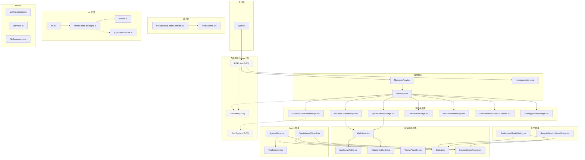
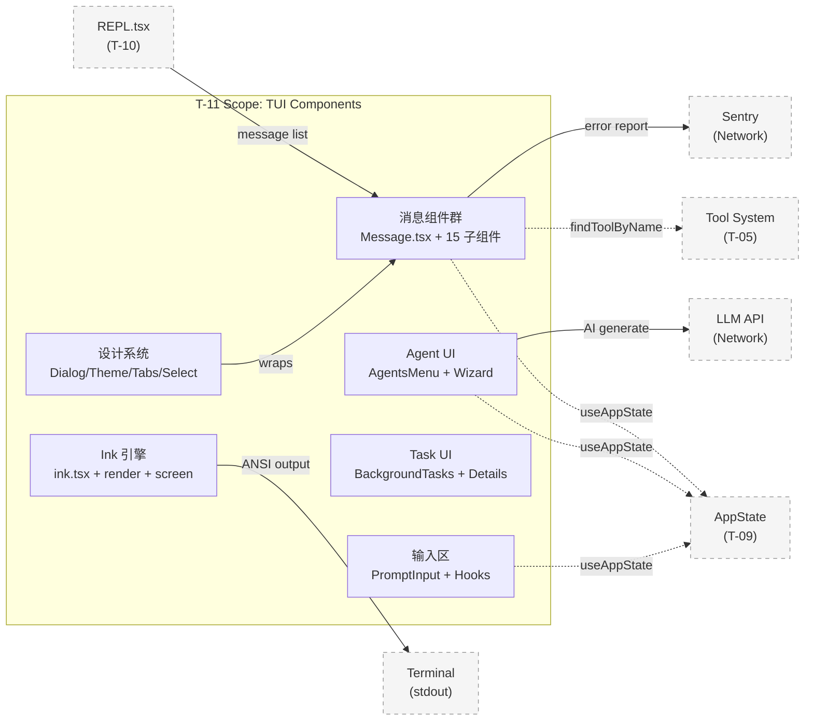
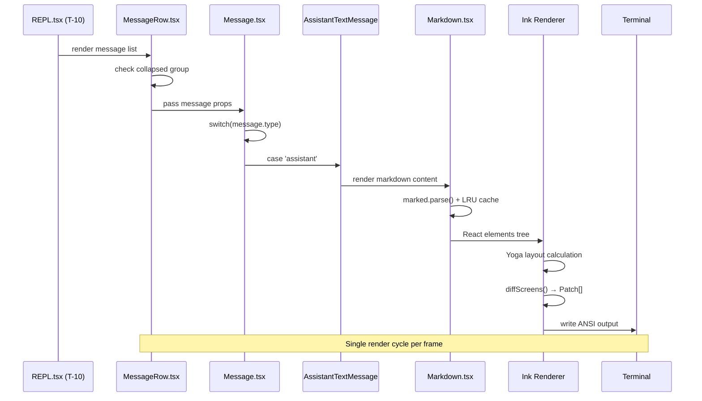

<!-- analysis-version: 0 | commit: a5179f6588dd03cbe83a8d8b718a61875dba7b24 | updated: 2025-07-14 | mode: full | task: T-11 -->
# T-11 Analysis: TUI组件与Ink渲染

## Scope Confirmation
- Task ID: T-11
- Primary Mainline: ML-07
- ML Priority: P2
- Analysis Depth: STANDARD (模块级)
- Secondary Mainlines: ML-08 (Shared Ink module), ML-06 (Session hooks)
- Pattern Coverage: N/A
- Scope Files (confirmed): 321 files, 72,844 lines total, 0 missing
- Scope adjustments: None — all 321 files verified present

### Scope 分类统计

| 子目录 | 文件数 | 总行数 | 说明 |
|--------|--------|--------|------|
| messages/ | 33 | 5,939 | 消息渲染子系统（最大子系统） |
| agents/ | 23 | 3,589 | Agent 编辑/管理/选择 UI |
| hooks/ | 21 | ~2,100 | 通知 hooks |
| PromptInput/ | 19 | ~2,400 | 输入区组件（footer、指示器、history search） |
| LogoV2/ | 15 | ~3,200 | Logo/品牌/欢迎界面 |
| design-system/ | 15 | ~1,800 | 设计系统基础组件（Dialog、Tabs、ThemeProvider） |
| tasks/ | 12 | ~3,500 | 后台任务状态 UI |
| Spinner/ | 10 | ~1,800 | 加载动画 + glimmer + teammate spinners |
| FeedbackSurvey/ | 9 | ~800 | 反馈调查流程 |
| CustomSelect/ | 9 | ~2,300 | 自定义选择器（Select、MultiSelect、Navigation） |
| ink/ | 3+files | ~4,600 | Ink 渲染引擎核心（fork 定制版） |
| native-ts/ | 2 | ~3,600 | Yoga 布局 + color-diff native 绑定 |
| Settings/ | 4 | ~2,200 | 设置配置界面 |
| sandbox/ | 5 | ~500 | 沙箱状态 UI |
| shell/ | 4 | ~500 | Shell 输出展开 |
| 其余零散 | ~137 | ~35,000 | Dialog, diff, wizard, permissions, vim, teams, buddy 等 |

## File Roles

> 本表行数 = 321（= effective_scope_files）。每行一个 scope file。

| File | Lines | One-liner Role | Where Analyzed |
|------|-------|----------------|---------------|
| src/buddy/sprites.ts | 514 | Buddy 精灵动画数据 — ASCII art sprite 定义用于 terminal buddy 显示 | STANDARD: § 关键路径与组件 |
| src/components/AgentProgressLine.tsx | 136 | Agent 任务进度行 — 显示 agent 异步任务的实时进度条 | STANDARD: § 关键路径与组件 |
| src/components/App.tsx | 96 | 主 App 组件入口 — ThemeProvider + ErrorBoundary + REPL 挂载点 | STANDARD: § 关键路径与组件 |
| src/components/ApproveApiKey.tsx | 123 | API Key 审批对话框 — 确认用户提供的 API key | STANDARD: § 关键路径与组件 |
| src/components/AutoModeOptInDialog.tsx | 142 | Auto Mode 选项确认对话框 — 确认启用自动权限模式 | STANDARD: § 关键路径与组件 |
| src/components/AutoUpdater.tsx | 198 | 自动更新组件 — npm check + 更新提示 | STANDARD: § 关键路径与组件 |
| src/components/AutoUpdaterWrapper.tsx | 91 | AutoUpdater 包装器 — 条件渲染 | STANDARD: § 关键路径与组件 |
| src/components/AwsAuthStatusBox.tsx | 82 | AWS 认证状态框 — 显示 AWS STS token 状态 | STANDARD: § 关键路径与组件 |
| src/components/BaseTextInput.tsx | 136 | 基础文本输入 — 底层 input 实现处理光标/粘贴/IME | STANDARD: § 关键路径与组件 |
| src/components/BashModeProgress.tsx | 56 | Bash 模式进度指示器 | STANDARD: § 关键路径与组件 |
| src/components/BridgeDialog.tsx | 401 | Bridge 对话框 — IDE bridge 连接配置 | STANDARD: § 关键路径与组件 |
| src/components/BypassPermissionsModeDialog.tsx | 87 | 权限绕过模式确认对话框 | STANDARD: § 关键路径与组件 |
| src/components/ChannelDowngradeDialog.tsx | 102 | 频道降级确认对话框 | STANDARD: § 关键路径与组件 |
| src/components/ClaudeCodeHint/PluginHintMenu.tsx | 78 | 插件提示菜单 — 插件建议列表 | STANDARD: § 关键路径与组件 |
| src/components/ClaudeInChromeOnboarding.tsx | 121 | Chrome 内嵌引导 — 首次使用引导 | STANDARD: § 关键路径与组件 |
| src/components/ClaudeMdExternalIncludesDialog.tsx | 137 | CLAUDE.md 外部包含文件对话框 | STANDARD: § 关键路径与组件 |
| src/components/ClickableImageRef.tsx | 73 | 可点击图片引用 — 缩略图+路径链接 | STANDARD: § 关键路径与组件 |
| src/components/CompactSummary.tsx | 118 | Compact 摘要渲染 — compact 操作后的摘要 | STANDARD: § 关键路径与组件 |
| src/components/ConfigurableShortcutHint.tsx | 57 | 可配置快捷键提示 | STANDARD: § 关键路径与组件 |
| src/components/ContextSuggestions.tsx | 47 | 上下文建议组件 | STANDARD: § 关键路径与组件 |
| src/components/ContextVisualization.tsx | 489 | 上下文可视化 — token 用量条形图 | STANDARD: § 关键路径与组件 |
| src/components/CoordinatorAgentStatus.tsx | 273 | 协调器 Agent 状态显示 | STANDARD: § 关键路径与组件 |
| src/components/CostThresholdDialog.tsx | 50 | 成本阈值对话框 | STANDARD: § 关键路径与组件 |
| src/components/CtrlOToExpand.tsx | 51 | Ctrl+O 展开折叠内容提示 | STANDARD: § 关键路径与组件 |
| src/components/CustomSelect/SelectMulti.tsx | 213 | 多选组件 — 多项选择 UI | STANDARD: § 关键路径与组件 |
| src/components/CustomSelect/option-map.ts | 50 | 选择器 option 映射工具 | STANDARD: § 关键路径与组件 |
| src/components/CustomSelect/select-input-option.tsx | 488 | 选择器输入选项组件 — 支持搜索/筛选 | STANDARD: § 关键路径与组件 |
| src/components/CustomSelect/select-option.tsx | 68 | 选择器选项显示组件 | STANDARD: § 关键路径与组件 |
| src/components/CustomSelect/select.tsx | 690 | 自定义 Select 组件 — 终端选择器(689行)，键盘导航+搜索+多选 | STANDARD: § 关键路径与组件 |
| src/components/CustomSelect/use-multi-select-state.ts | 414 | 多选状态 Hook — 多选选择的状态管理 | STANDARD: § 关键路径与组件 |
| src/components/CustomSelect/use-select-input.ts | 287 | TUI 组件 — use-select-input.ts | OVERVIEW (enumerated only) |
| src/components/CustomSelect/use-select-navigation.ts | 653 | 选择器导航 Hook — 键盘导航+滚动(653行) | STANDARD: § 关键路径与组件 |
| src/components/CustomSelect/use-select-state.ts | 157 | 选择器状态 Hook — 选中/聚焦状态管理 | STANDARD: § 关键路径与组件 |
| src/components/DesktopHandoff.tsx | 193 | 桌面端交接 — CLI → Claude Desktop | STANDARD: § 关键路径与组件 |
| src/components/DesktopUpsell/DesktopUpsellStartup.tsx | 171 | 桌面升级提示 — 推荐 Claude Desktop | STANDARD: § 关键路径与组件 |
| src/components/DevBar.tsx | 49 | 开发工具栏 — debug 模式信息条 | STANDARD: § 关键路径与组件 |
| src/components/DevChannelsDialog.tsx | 105 | 开发频道对话框 — 切换 dev release channel | STANDARD: § 关键路径与组件 |
| src/components/DiagnosticsDisplay.tsx | 95 | 诊断信息显示组件 | STANDARD: § 关键路径与组件 |
| src/components/EffortCallout.tsx | 265 | Effort 标注 — 显示思考努力级别 | STANDARD: § 关键路径与组件 |
| src/components/EffortIndicator.ts | 42 | Effort 指示器类型定义 | STANDARD: § 关键路径与组件 |
| src/components/ExitFlow.tsx | 48 | 退出流程组件 | STANDARD: § 关键路径与组件 |
| src/components/ExportDialog.tsx | 128 | 导出对话框 — 导出会话记录 | STANDARD: § 关键路径与组件 |
| src/components/FallbackToolUseErrorMessage.tsx | 116 | 工具调用错误后备显示 | STANDARD: § 关键路径与组件 |
| src/components/FastIcon.tsx | 46 | Fast 图标 — ASCII 快速渲染图标 | STANDARD: § 关键路径与组件 |
| src/components/Feedback.tsx | 592 | 反馈对话框 — GitHub issue 创建 + AI 总结 + 文件附件(591行) | STANDARD: § 关键路径与组件 |
| src/components/FeedbackSurvey/FeedbackSurvey.tsx | 174 | 反馈调查主组件 | STANDARD: § 关键路径与组件 |
| src/components/FeedbackSurvey/FeedbackSurveyView.tsx | 108 | 反馈调查视图 | STANDARD: § 关键路径与组件 |
| src/components/FeedbackSurvey/TranscriptSharePrompt.tsx | 88 | 转录分享提示组件 | STANDARD: § 关键路径与组件 |
| src/components/FeedbackSurvey/submitTranscriptShare.ts | 112 | 转录分享提交函数 | STANDARD: § 关键路径与组件 |
| src/components/FeedbackSurvey/useDebouncedDigitInput.ts | 82 | 防抖数字输入 Hook | STANDARD: § 关键路径与组件 |
| src/components/FeedbackSurvey/useFeedbackSurvey.tsx | 296 | 反馈调查状态 Hook | STANDARD: § 关键路径与组件 |
| src/components/FeedbackSurvey/useMemorySurvey.tsx | 213 | 内存调查 Hook | STANDARD: § 关键路径与组件 |
| src/components/FeedbackSurvey/usePostCompactSurvey.tsx | 206 | Post-compact 调查 Hook | STANDARD: § 关键路径与组件 |
| src/components/FeedbackSurvey/useSurveyState.tsx | 100 | 调查状态管理 Hook | STANDARD: § 关键路径与组件 |
| src/components/FileEditToolDiff.tsx | 181 | 文件编辑 Diff 展示 | STANDARD: § 关键路径与组件 |
| src/components/FileEditToolUpdatedMessage.tsx | 124 | 文件编辑更新确认消息 | STANDARD: § 关键路径与组件 |
| src/components/FileEditToolUseRejectedMessage.tsx | 170 | 文件编辑权限拒绝消息 | STANDARD: § 关键路径与组件 |
| src/components/FilePathLink.tsx | 43 | 文件路径链接组件 | STANDARD: § 关键路径与组件 |
| src/components/GlobalSearchDialog.tsx | 343 | 全局搜索对话框 — 跨消息搜索(342行) | STANDARD: § 关键路径与组件 |
| src/components/HelpV2/Commands.tsx | 82 | 帮助: 命令列表 | STANDARD: § 关键路径与组件 |
| src/components/HelpV2/General.tsx | 23 | 帮助: 通用帮助信息 | STANDARD: § 关键路径与组件 |
| src/components/HelpV2/HelpV2.tsx | 184 | 帮助 V2 主组件 | STANDARD: § 关键路径与组件 |
| src/components/HighlightedCode.tsx | 190 | 代码高亮组件 — CLI highlight 语法高亮 | STANDARD: § 关键路径与组件 |
| src/components/HighlightedCode/Fallback.tsx | 193 | 代码高亮后备 — 纯文本显示 | STANDARD: § 关键路径与组件 |
| src/components/HistorySearchDialog.tsx | 118 | 历史搜索对话框 | STANDARD: § 关键路径与组件 |
| src/components/IdeAutoConnectDialog.tsx | 154 | IDE 自动连接对话框 | STANDARD: § 关键路径与组件 |
| src/components/IdeOnboardingDialog.tsx | 167 | IDE 引导对话框 | STANDARD: § 关键路径与组件 |
| src/components/IdeStatusIndicator.tsx | 58 | IDE 状态指示器 | STANDARD: § 关键路径与组件 |
| src/components/IdleReturnDialog.tsx | 118 | 空闲返回对话框 | STANDARD: § 关键路径与组件 |
| src/components/InvalidConfigDialog.tsx | 156 | 无效配置对话框 | STANDARD: § 关键路径与组件 |
| src/components/InvalidSettingsDialog.tsx | 89 | 无效设置对话框 | STANDARD: § 关键路径与组件 |
| src/components/KeybindingWarnings.tsx | 55 | 快捷键冲突警告 | STANDARD: § 关键路径与组件 |
| src/components/LanguagePicker.tsx | 86 | 语言选择器 | STANDARD: § 关键路径与组件 |
| src/components/LogSelector.tsx | 1575 | 日志选择器 — 文件浏览+搜索+选择(1574行) | STANDARD: § 关键路径与组件 |
| src/components/LogoV2/AnimatedAsterisk.tsx | 50 | 动态星号动画 — Logo 动画元素 | STANDARD: § 关键路径与组件 |
| src/components/LogoV2/AnimatedClawd.tsx | 124 | 动态 Clawd 文字动画 | STANDARD: § 关键路径与组件 |
| src/components/LogoV2/ChannelsNotice.tsx | 266 | 频道通知 — release channel 变更通知 | STANDARD: § 关键路径与组件 |
| src/components/LogoV2/Clawd.tsx | 240 | Clawd 静态 Logo 组件 | STANDARD: § 关键路径与组件 |
| src/components/LogoV2/CondensedLogo.tsx | 161 | 精简 Logo — 紧凑模式显示 | STANDARD: § 关键路径与组件 |
| src/components/LogoV2/EmergencyTip.tsx | 58 | 紧急提示组件 | STANDARD: § 关键路径与组件 |
| src/components/LogoV2/Feed.tsx | 112 | Feed 信息流组件 | STANDARD: § 关键路径与组件 |
| src/components/LogoV2/FeedColumn.tsx | 59 | Feed 列布局组件 | STANDARD: § 关键路径与组件 |
| src/components/LogoV2/GuestPassesUpsell.tsx | 70 | 访客通行证升级提示 | STANDARD: § 关键路径与组件 |
| src/components/LogoV2/LogoV2.tsx | 543 | Logo V2 主组件 — 欢迎/状态/频道/升级显示(542行) | STANDARD: § 关键路径与组件 |
| src/components/LogoV2/Opus1mMergeNotice.tsx | 55 | Opus 1M 合并通知 | STANDARD: § 关键路径与组件 |
| src/components/LogoV2/OverageCreditUpsell.tsx | 166 | 超额信用升级提示 | STANDARD: § 关键路径与组件 |
| src/components/LogoV2/VoiceModeNotice.tsx | 68 | 语音模式通知 | STANDARD: § 关键路径与组件 |
| src/components/LogoV2/WelcomeV2.tsx | 433 | 欢迎界面 V2 — 首次启动欢迎信息(432行) | STANDARD: § 关键路径与组件 |
| src/components/LogoV2/feedConfigs.tsx | 92 | Feed 配置定义 | STANDARD: § 关键路径与组件 |
| src/components/LspRecommendation/LspRecommendationMenu.tsx | 88 | LSP 推荐菜单 | STANDARD: § 关键路径与组件 |
| src/components/MCPServerApprovalDialog.tsx | 115 | MCP 服务器审批对话框 | STANDARD: § 关键路径与组件 |
| src/components/MCPServerDesktopImportDialog.tsx | 203 | MCP 桌面导入对话框 | STANDARD: § 关键路径与组件 |
| src/components/MCPServerMultiselectDialog.tsx | 133 | MCP 多选对话框 | STANDARD: § 关键路径与组件 |
| src/components/ManagedSettingsSecurityDialog/ManagedSettingsSecurityDialog.tsx | 149 | 托管设置安全对话框 | STANDARD: § 关键路径与组件 |
| src/components/ManagedSettingsSecurityDialog/utils.ts | 144 | 托管设置安全工具函数 | STANDARD: § 关键路径与组件 |
| src/components/Markdown.tsx | 236 | Markdown 渲染引擎 — marked 解析 + LRU 缓存 + 高亮(235行) | STANDARD: § 关键路径与组件 |
| src/components/MarkdownTable.tsx | 322 | Markdown 表格渲染 — 终端友好表格布局(321行) | STANDARD: § 关键路径与组件 |
| src/components/MemoryUsageIndicator.tsx | 37 | 内存使用指示器 | STANDARD: § 关键路径与组件 |
| src/components/Message.tsx | 627 | 消息路由核心 — type+subtype switch 分派渲染(626行) | STANDARD: § 关键路径与组件 |
| src/components/MessageModel.tsx | 43 | 消息模型标签 — 显示模型名称 | STANDARD: § 关键路径与组件 |
| src/components/MessageResponse.tsx | 78 | 消息响应包装 — 标准布局容器 | STANDARD: § 关键路径与组件 |
| src/components/MessageRow.tsx | 383 | 消息行包装器 — collapsed group + offscreen freeze(382行) | STANDARD: § 关键路径与组件 |
| src/components/MessageSelector.tsx | 831 | 消息选择器 — 搜索选择历史消息(830行) | STANDARD: § 关键路径与组件 |
| src/components/MessageTimestamp.tsx | 63 | 消息时间戳显示 | STANDARD: § 关键路径与组件 |
| src/components/ModelPicker.tsx | 448 | 模型选择器 — 切换 Claude 模型(447行) | STANDARD: § 关键路径与组件 |
| src/components/NativeAutoUpdater.tsx | 193 | 原生自动更新逻辑 | STANDARD: § 关键路径与组件 |
| src/components/NotebookEditToolUseRejectedMessage.tsx | 92 | Notebook 编辑拒绝消息 | STANDARD: § 关键路径与组件 |
| src/components/OffscreenFreeze.tsx | 44 | 离屏冻结 — 虚拟滚动优化 | STANDARD: § 关键路径与组件 |
| src/components/Onboarding.tsx | 244 | 首次使用引导(243行) | STANDARD: § 关键路径与组件 |
| src/components/OutputStylePicker.tsx | 112 | 输出风格选择器 | STANDARD: § 关键路径与组件 |
| src/components/PackageManagerAutoUpdater.tsx | 104 | 包管理器自动更新 | STANDARD: § 关键路径与组件 |
| src/components/Passes/Passes.tsx | 184 | 通行证管理组件(183行) | STANDARD: § 关键路径与组件 |
| src/components/PrBadge.tsx | 97 | PR 徽章显示 | STANDARD: § 关键路径与组件 |
| src/components/PromptInput/HistorySearchInput.tsx | 51 | 历史搜索输入框 | STANDARD: § 关键路径与组件 |
| src/components/PromptInput/Notifications.tsx | 332 | 输入区通知组件(331行) | STANDARD: § 关键路径与组件 |
| src/components/PromptInput/PromptInputFooter.tsx | 191 | 输入区底栏组件 | STANDARD: § 关键路径与组件 |
| src/components/PromptInput/PromptInputFooterLeftSide.tsx | 517 | 输入区左侧底栏 — 状态信息+feature gating(516行) | STANDARD: § 关键路径与组件 |
| src/components/PromptInput/PromptInputFooterSuggestions.tsx | 293 | 输入区建议显示 | STANDARD: § 关键路径与组件 |
| src/components/PromptInput/PromptInputHelpMenu.tsx | 358 | 输入区帮助菜单(357行) | STANDARD: § 关键路径与组件 |
| src/components/PromptInput/PromptInputModeIndicator.tsx | 93 | 输入模式指示器 | STANDARD: § 关键路径与组件 |
| src/components/PromptInput/PromptInputQueuedCommands.tsx | 117 | 排队命令显示 | STANDARD: § 关键路径与组件 |
| src/components/PromptInput/PromptInputStashNotice.tsx | 25 | 输入暂存通知 | STANDARD: § 关键路径与组件 |
| src/components/PromptInput/SandboxPromptFooterHint.tsx | 64 | 沙箱提示脚注 | STANDARD: § 关键路径与组件 |
| src/components/PromptInput/ShimmeredInput.tsx | 143 | 闪光输入效果 | STANDARD: § 关键路径与组件 |
| src/components/PromptInput/VoiceIndicator.tsx | 137 | 语音输入指示器 | STANDARD: § 关键路径与组件 |
| src/components/PromptInput/inputModes.ts | 33 | 输入模式定义 | STANDARD: § 关键路径与组件 |
| src/components/PromptInput/inputPaste.ts | 90 | 输入粘贴处理逻辑 | STANDARD: § 关键路径与组件 |
| src/components/PromptInput/useMaybeTruncateInput.ts | 58 | 输入截断 Hook | STANDARD: § 关键路径与组件 |
| src/components/PromptInput/usePromptInputPlaceholder.ts | 76 | 输入占位符 Hook | STANDARD: § 关键路径与组件 |
| src/components/PromptInput/useShowFastIconHint.ts | 31 | Fast 图标提示 Hook | STANDARD: § 关键路径与组件 |
| src/components/PromptInput/useSwarmBanner.ts | 155 | Swarm 横幅 Hook | STANDARD: § 关键路径与组件 |
| src/components/PromptInput/utils.ts | 60 | 输入区工具函数 | STANDARD: § 关键路径与组件 |
| src/components/QuickOpenDialog.tsx | 244 | 快速打开对话框 | STANDARD: § 关键路径与组件 |
| src/components/RemoteCallout.tsx | 76 | 远程模式标注 | STANDARD: § 关键路径与组件 |
| src/components/RemoteEnvironmentDialog.tsx | 340 | 远程环境配置对话框(339行) | STANDARD: § 关键路径与组件 |
| src/components/ResumeTask.tsx | 268 | 恢复任务组件 | STANDARD: § 关键路径与组件 |
| src/components/SandboxViolationExpandedView.tsx | 99 | 沙箱违规展开视图 | STANDARD: § 关键路径与组件 |
| src/components/SearchBox.tsx | 72 | 搜索框组件 | STANDARD: § 关键路径与组件 |
| src/components/SentryErrorBoundary.ts | 28 | Sentry 错误边界 | STANDARD: § 关键路径与组件 |
| src/components/SessionBackgroundHint.tsx | 108 | 会话后台提示 | STANDARD: § 关键路径与组件 |
| src/components/SessionPreview.tsx | 194 | 会话预览组件 | STANDARD: § 关键路径与组件 |
| src/components/Settings/Config.tsx | 1822 | 设置配置界面 — 完整设置 UI(1821行) | STANDARD: § 关键路径与组件 |
| src/components/Settings/Settings.tsx | 137 | 设置主组件 | STANDARD: § 关键路径与组件 |
| src/components/Settings/Status.tsx | 241 | 设置状态显示 | STANDARD: § 关键路径与组件 |
| src/components/Settings/Usage.tsx | 377 | 使用量设置面板 | STANDARD: § 关键路径与组件 |
| src/components/ShowInIDEPrompt.tsx | 170 | IDE 显示提示 | STANDARD: § 关键路径与组件 |
| src/components/SkillImprovementSurvey.tsx | 152 | 技能改进调查 | STANDARD: § 关键路径与组件 |
| src/components/Spinner/FlashingChar.tsx | 61 | 闪光字符动画 | STANDARD: § 关键路径与组件 |
| src/components/Spinner/GlimmerMessage.tsx | 328 | Glimmer 加载消息 — AI 思考时的动态提示(327行) | STANDARD: § 关键路径与组件 |
| src/components/Spinner/ShimmerChar.tsx | 36 | 微光字符动画 | STANDARD: § 关键路径与组件 |
| src/components/Spinner/SpinnerAnimationRow.tsx | 265 | Spinner 动画行 | STANDARD: § 关键路径与组件 |
| src/components/Spinner/SpinnerGlyph.tsx | 80 | Spinner 图形组件 | STANDARD: § 关键路径与组件 |
| src/components/Spinner/TeammateSpinnerLine.tsx | 233 | 队友 Spinner 行 | STANDARD: § 关键路径与组件 |
| src/components/Spinner/TeammateSpinnerTree.tsx | 272 | 队友 Spinner 树形显示 | STANDARD: § 关键路径与组件 |
| src/components/Spinner/useShimmerAnimation.ts | 31 | 微光动画 Hook | STANDARD: § 关键路径与组件 |
| src/components/Spinner/useStalledAnimation.ts | 75 | 停滞动画 Hook | STANDARD: § 关键路径与组件 |
| src/components/Spinner/utils.ts | 84 | Spinner 工具函数 | STANDARD: § 关键路径与组件 |
| src/components/Stats.tsx | 1228 | 统计面板 — token/cost/duration 展示(1227行) | STANDARD: § 关键路径与组件 |
| src/components/StatusLine.tsx | 324 | 状态栏 — 模型/权限/cost/context 实时信息(323行) | STANDARD: § 关键路径与组件 |
| src/components/StatusNotices.tsx | 55 | 状态通知条 | STANDARD: § 关键路径与组件 |
| src/components/StructuredDiff.tsx | 190 | 结构化 Diff 组件 | STANDARD: § 关键路径与组件 |
| src/components/StructuredDiff/Fallback.tsx | 487 | Diff 后备显示组件 | STANDARD: § 关键路径与组件 |
| src/components/StructuredDiff/colorDiff.ts | 37 | Diff 颜色计算工具 | STANDARD: § 关键路径与组件 |
| src/components/StructuredDiffList.tsx | 30 | Diff 列表容器 | STANDARD: § 关键路径与组件 |
| src/components/TagTabs.tsx | 139 | 标签页组件 | STANDARD: § 关键路径与组件 |
| src/components/TaskListV2.tsx | 378 | 任务列表 V2 | STANDARD: § 关键路径与组件 |
| src/components/TeammateViewHeader.tsx | 82 | 队友视图头部 | STANDARD: § 关键路径与组件 |
| src/components/TeleportError.tsx | 189 | Teleport 错误显示 | STANDARD: § 关键路径与组件 |
| src/components/TeleportProgress.tsx | 140 | Teleport 进度条 | STANDARD: § 关键路径与组件 |
| src/components/TeleportRepoMismatchDialog.tsx | 104 | Teleport 仓库不匹配对话框 | STANDARD: § 关键路径与组件 |
| src/components/TeleportResumeWrapper.tsx | 167 | Teleport 恢复包装器 | STANDARD: § 关键路径与组件 |
| src/components/TeleportStash.tsx | 116 | Teleport 暂存处理 | STANDARD: § 关键路径与组件 |
| src/components/TextInput.tsx | 124 | 文本输入框 — Ink useInput 包装 | STANDARD: § 关键路径与组件 |
| src/components/ThemePicker.tsx | 333 | 主题选择器(332行) | STANDARD: § 关键路径与组件 |
| src/components/ThinkingToggle.tsx | 153 | 思考模式开关 | STANDARD: § 关键路径与组件 |
| src/components/TokenWarning.tsx | 179 | Token 警告 — context window 上限提示 | STANDARD: § 关键路径与组件 |
| src/components/ToolUseLoader.tsx | 42 | 工具调用加载指示器 | STANDARD: § 关键路径与组件 |
| src/components/TrustDialog/TrustDialog.tsx | 290 | 信任对话框(289行) | STANDARD: § 关键路径与组件 |
| src/components/TrustDialog/utils.ts | 245 | 信任对话框工具函数 | STANDARD: § 关键路径与组件 |
| src/components/ValidationErrorsList.tsx | 148 | 验证错误列表 | STANDARD: § 关键路径与组件 |
| src/components/VimTextInput.tsx | 140 | Vim 文本输入 — Vim 键绑定支持 | STANDARD: § 关键路径与组件 |
| src/components/WorkflowMultiselectDialog.tsx | 128 | 工作流多选对话框 | STANDARD: § 关键路径与组件 |
| src/components/WorktreeExitDialog.tsx | 231 | Worktree 退出对话框 | STANDARD: § 关键路径与组件 |
| src/components/agents/AgentDetail.tsx | 220 | Agent 详情视图 — 查看 agent 配置、描述、工具列表 | STANDARD: § 关键路径与组件 |
| src/components/agents/AgentEditor.tsx | 178 | Agent 编辑器 — 修改 agent prompt/模型/工具等配置 | STANDARD: § 关键路径与组件 |
| src/components/agents/AgentsList.tsx | 440 | Agent 列表组件 — 显示所有 agent 的卡片列表 | STANDARD: § 关键路径与组件 |
| src/components/agents/AgentsMenu.tsx | 800 | Agent 管理 7 态状态机 — list-agents → view/edit/create/delete → tool-selector | STANDARD: § 关键路径与组件 |
| src/components/agents/ColorPicker.tsx | 112 | 颜色选择器 — agent 颜色标签选择 | STANDARD: § 关键路径与组件 |
| src/components/agents/ModelSelector.tsx | 68 | Agent 模型选择器 — 选择 agent 使用的 Claude 模型 | STANDARD: § 关键路径与组件 |
| src/components/agents/ToolSelector.tsx | 562 | Agent 工具选择器 — 选择 agent 可用的工具列表 | STANDARD: § 关键路径与组件 |
| src/components/agents/agentFileUtils.ts | 272 | Agent 文件工具函数 — agent 配置文件的 CRUD 操作 | STANDARD: § 关键路径与组件 |
| src/components/agents/generateAgent.ts | 197 | Agent AI 生成函数 — 调用 LLM 生成 agent 配置 | STANDARD: § 关键路径与组件 |
| src/components/agents/new-agent-creation/CreateAgentWizard.tsx | 97 | 创建 Agent 向导主组件 — 多步骤创建新 agent | STANDARD: § 关键路径与组件 |
| src/components/agents/new-agent-creation/wizard-steps/ColorStep.tsx | 84 | 向导步骤: 颜色选择 | STANDARD: § 关键路径与组件 |
| src/components/agents/new-agent-creation/wizard-steps/ConfirmStep.tsx | 378 | 向导步骤: 确认创建 | STANDARD: § 关键路径与组件 |
| src/components/agents/new-agent-creation/wizard-steps/ConfirmStepWrapper.tsx | 74 | 向导步骤: 确认步骤包装器 | STANDARD: § 关键路径与组件 |
| src/components/agents/new-agent-creation/wizard-steps/DescriptionStep.tsx | 123 | 向导步骤: 描述输入 | STANDARD: § 关键路径与组件 |
| src/components/agents/new-agent-creation/wizard-steps/GenerateStep.tsx | 143 | 向导步骤: AI 生成配置 | STANDARD: § 关键路径与组件 |
| src/components/agents/new-agent-creation/wizard-steps/LocationStep.tsx | 80 | 向导步骤: 配置文件存储位置 | STANDARD: § 关键路径与组件 |
| src/components/agents/new-agent-creation/wizard-steps/MemoryStep.tsx | 113 | 向导步骤: 内存配置 | STANDARD: § 关键路径与组件 |
| src/components/agents/new-agent-creation/wizard-steps/MethodStep.tsx | 80 | 向导步骤: 创建方式选择 | STANDARD: § 关键路径与组件 |
| src/components/agents/new-agent-creation/wizard-steps/ModelStep.tsx | 52 | 向导步骤: 模型选择 | STANDARD: § 关键路径与组件 |
| src/components/agents/new-agent-creation/wizard-steps/PromptStep.tsx | 128 | 向导步骤: Prompt 编辑 | STANDARD: § 关键路径与组件 |
| src/components/agents/new-agent-creation/wizard-steps/ToolsStep.tsx | 61 | 向导步骤: 工具选择 | STANDARD: § 关键路径与组件 |
| src/components/agents/new-agent-creation/wizard-steps/TypeStep.tsx | 103 | 向导步骤: agent 类型选择 | STANDARD: § 关键路径与组件 |
| src/components/agents/validateAgent.ts | 109 | Agent 配置验证 — 校验 agent 定义的有效性 | STANDARD: § 关键路径与组件 |
| src/components/design-system/Byline.tsx | 77 | 设计系统: Byline 组件 — 副标题行 | STANDARD: § 关键路径与组件 |
| src/components/design-system/Dialog.tsx | 138 | 设计系统: Dialog 组件 — 模态对话框容器(137行) | STANDARD: § 关键路径与组件 |
| src/components/design-system/Divider.tsx | 149 | 设计系统: Divider 组件 — 分隔线 | STANDARD: § 关键路径与组件 |
| src/components/design-system/FuzzyPicker.tsx | 312 | 设计系统: 模糊搜索选择器 — fuzzy match picker | STANDARD: § 关键路径与组件 |
| src/components/design-system/KeyboardShortcutHint.tsx | 81 | 设计系统: 快捷键提示显示 | STANDARD: § 关键路径与组件 |
| src/components/design-system/ListItem.tsx | 244 | 设计系统: 列表项组件 | STANDARD: § 关键路径与组件 |
| src/components/design-system/LoadingState.tsx | 94 | 设计系统: 加载状态显示 | STANDARD: § 关键路径与组件 |
| src/components/design-system/Pane.tsx | 77 | 设计系统: Pane 面板组件 | STANDARD: § 关键路径与组件 |
| src/components/design-system/ProgressBar.tsx | 86 | 设计系统: 进度条组件 | STANDARD: § 关键路径与组件 |
| src/components/design-system/Ratchet.tsx | 80 | 设计系统: Ratchet 显示组件 | STANDARD: § 关键路径与组件 |
| src/components/design-system/StatusIcon.tsx | 95 | 设计系统: 状态图标组件 | STANDARD: § 关键路径与组件 |
| src/components/design-system/Tabs.tsx | 340 | 设计系统: Tabs 标签页组件(339行) | STANDARD: § 关键路径与组件 |
| src/components/design-system/ThemeProvider.tsx | 170 | 设计系统: ThemeProvider — 终端主题上下文(169行) | STANDARD: § 关键路径与组件 |
| src/components/design-system/ThemedBox.tsx | 156 | 设计系统: 主题化 Box 容器 | STANDARD: § 关键路径与组件 |
| src/components/design-system/ThemedText.tsx | 124 | 设计系统: 主题化 Text 组件 | STANDARD: § 关键路径与组件 |
| src/components/diff/DiffDetailView.tsx | 281 | Diff 详情视图 — 文件差异的详细展示 | STANDARD: § 关键路径与组件 |
| src/components/diff/DiffDialog.tsx | 383 | Diff 对话框 — 差异比较的主对话框容器(382行) | STANDARD: § 关键路径与组件 |
| src/components/diff/DiffFileList.tsx | 292 | Diff 文件列表 — 差异文件的选择列表 | STANDARD: § 关键路径与组件 |
| src/components/grove/Grove.tsx | 463 | Grove 可视化组件 — 树形结构可视化(462行) | STANDARD: § 关键路径与组件 |
| src/components/hooks/HooksConfigMenu.tsx | 578 | Hook 配置菜单 — hooks 管理 UI(577行) | STANDARD: § 关键路径与组件 |
| src/components/hooks/PromptDialog.tsx | 90 | Hook Prompt 对话框 | STANDARD: § 关键路径与组件 |
| src/components/hooks/SelectEventMode.tsx | 127 | Hook 事件模式选择 | STANDARD: § 关键路径与组件 |
| src/components/hooks/SelectHookMode.tsx | 112 | Hook 模式选择 | STANDARD: § 关键路径与组件 |
| src/components/hooks/SelectMatcherMode.tsx | 144 | Hook 匹配器模式选择 | STANDARD: § 关键路径与组件 |
| src/components/hooks/ViewHookMode.tsx | 199 | Hook 查看模式 | STANDARD: § 关键路径与组件 |
| src/components/memory/MemoryFileSelector.tsx | 438 | 内存文件选择器 — CLAUDE.md 文件选择(437行) | STANDARD: § 关键路径与组件 |
| src/components/memory/MemoryUpdateNotification.tsx | 45 | 内存更新通知组件 | STANDARD: § 关键路径与组件 |
| src/components/messageActions.tsx | 450 | 消息操作导航 — 键盘导航+选择+action menu(449行) | STANDARD: § 关键路径与组件 |
| src/components/messages/AdvisorMessage.tsx | 158 | Advisor 消息渲染 — advisor block 显示 | STANDARD: § 关键路径与组件 |
| src/components/messages/AssistantTextMessage.tsx | 270 | 助手文本消息 — AI 回复文本渲染(269行) | STANDARD: § 关键路径与组件 |
| src/components/messages/AssistantThinkingMessage.tsx | 86 | 助手思考消息 — thinking block 渲染 | STANDARD: § 关键路径与组件 |
| src/components/messages/AssistantToolUseMessage.tsx | 368 | 助手工具调用消息 — tool_use block 渲染(367行) | STANDARD: § 关键路径与组件 |
| src/components/messages/AttachmentMessage.tsx | 536 | 附件消息渲染 — 文件/图片附件显示(535行) | STANDARD: § 关键路径与组件 |
| src/components/messages/CollapsedReadSearchContent.tsx | 484 | 折叠搜索内容 — 合并的 read/search 工具结果(483行) | STANDARD: § 关键路径与组件 |
| src/components/messages/GroupedToolUseContent.tsx | 58 | 分组工具调用内容 | STANDARD: § 关键路径与组件 |
| src/components/messages/HighlightedThinkingText.tsx | 162 | 高亮思考文本渲染 | STANDARD: § 关键路径与组件 |
| src/components/messages/HookProgressMessage.tsx | 116 | Hook 进度消息 | STANDARD: § 关键路径与组件 |
| src/components/messages/PlanApprovalMessage.tsx | 222 | 计划审批消息 — plan approval 请求/响应显示(221行) | STANDARD: § 关键路径与组件 |
| src/components/messages/RateLimitMessage.tsx | 161 | 速率限制消息 — rate limit 错误 + 升级提示 | STANDARD: § 关键路径与组件 |
| src/components/messages/ShutdownMessage.tsx | 132 | 关闭消息 — teammate shutdown 显示 | STANDARD: § 关键路径与组件 |
| src/components/messages/SystemAPIErrorMessage.tsx | 141 | 系统 API 错误消息 — API 错误展示 | STANDARD: § 关键路径与组件 |
| src/components/messages/SystemTextMessage.tsx | 827 | 系统文本消息 — 按 subtype 分派的最大消息组件(826行) | STANDARD: § 关键路径与组件 |
| src/components/messages/TaskAssignmentMessage.tsx | 76 | 任务分配消息 | STANDARD: § 关键路径与组件 |
| src/components/messages/UserAgentNotificationMessage.tsx | 83 | 用户 Agent 通知消息 | STANDARD: § 关键路径与组件 |
| src/components/messages/UserBashInputMessage.tsx | 58 | 用户 Bash 输入消息 | STANDARD: § 关键路径与组件 |
| src/components/messages/UserBashOutputMessage.tsx | 54 | 用户 Bash 输出消息 | STANDARD: § 关键路径与组件 |
| src/components/messages/UserChannelMessage.tsx | 137 | 用户频道消息 | STANDARD: § 关键路径与组件 |
| src/components/messages/UserCommandMessage.tsx | 108 | 用户命令消息 | STANDARD: § 关键路径与组件 |
| src/components/messages/UserImageMessage.tsx | 59 | 用户图片消息 | STANDARD: § 关键路径与组件 |
| src/components/messages/UserLocalCommandOutputMessage.tsx | 167 | 用户本地命令输出消息 | STANDARD: § 关键路径与组件 |
| src/components/messages/UserMemoryInputMessage.tsx | 75 | 用户内存输入消息 | STANDARD: § 关键路径与组件 |
| src/components/messages/UserPromptMessage.tsx | 80 | 用户提示消息 | STANDARD: § 关键路径与组件 |
| src/components/messages/UserResourceUpdateMessage.tsx | 121 | 用户资源更新消息 | STANDARD: § 关键路径与组件 |
| src/components/messages/UserTeammateMessage.tsx | 206 | 用户队友消息 | STANDARD: § 关键路径与组件 |
| src/components/messages/UserTextMessage.tsx | 275 | 用户文本消息 — 分派到多种子类型(274行) | STANDARD: § 关键路径与组件 |
| src/components/messages/UserToolResultMessage/UserToolErrorMessage.tsx | 103 | 工具错误消息 | STANDARD: § 关键路径与组件 |
| src/components/messages/UserToolResultMessage/UserToolRejectMessage.tsx | 95 | 工具拒绝消息 | STANDARD: § 关键路径与组件 |
| src/components/messages/UserToolResultMessage/UserToolResultMessage.tsx | 106 | 工具结果消息路由 | STANDARD: § 关键路径与组件 |
| src/components/messages/UserToolResultMessage/UserToolSuccessMessage.tsx | 104 | 工具成功消息 | STANDARD: § 关键路径与组件 |
| src/components/messages/nullRenderingAttachments.ts | 70 | 空渲染附件类型 | STANDARD: § 关键路径与组件 |
| src/components/messages/teamMemCollapsed.tsx | 140 | 团队内存折叠显示 | STANDARD: § 关键路径与组件 |
| src/components/permissions/PermissionRequest.tsx | 217 | 权限请求对话框(216行) | STANDARD: § 关键路径与组件 |
| src/components/permissions/SandboxPermissionRequest.tsx | 163 | 沙箱权限请求对话框 | STANDARD: § 关键路径与组件 |
| src/components/sandbox/SandboxConfigTab.tsx | 45 | 沙箱配置标签页 | STANDARD: § 关键路径与组件 |
| src/components/sandbox/SandboxDependenciesTab.tsx | 120 | 沙箱依赖标签页 | STANDARD: § 关键路径与组件 |
| src/components/sandbox/SandboxDoctorSection.tsx | 46 | 沙箱诊断区段 | STANDARD: § 关键路径与组件 |
| src/components/sandbox/SandboxOverridesTab.tsx | 193 | 沙箱覆盖配置标签页 | STANDARD: § 关键路径与组件 |
| src/components/sandbox/SandboxSettings.tsx | 296 | 沙箱设置主组件(295行) | STANDARD: § 关键路径与组件 |
| src/components/shell/ExpandShellOutputContext.tsx | 36 | Shell 输出展开上下文 | STANDARD: § 关键路径与组件 |
| src/components/shell/OutputLine.tsx | 118 | Shell 输出行组件 | STANDARD: § 关键路径与组件 |
| src/components/shell/ShellProgressMessage.tsx | 150 | Shell 进度消息 | STANDARD: § 关键路径与组件 |
| src/components/shell/ShellTimeDisplay.tsx | 74 | Shell 时间显示 | STANDARD: § 关键路径与组件 |
| src/components/skills/SkillsMenu.tsx | 237 | 技能管理菜单(236行) | STANDARD: § 关键路径与组件 |
| src/components/tasks/AsyncAgentDetailDialog.tsx | 229 | 异步 Agent 详情对话框 | STANDARD: § 关键路径与组件 |
| src/components/tasks/BackgroundTask.tsx | 345 | 后台任务渲染组件(344行) | STANDARD: § 关键路径与组件 |
| src/components/tasks/BackgroundTaskStatus.tsx | 429 | 后台任务状态显示 | STANDARD: § 关键路径与组件 |
| src/components/tasks/BackgroundTasksDialog.tsx | 652 | 后台任务对话框 — KAIROS 核心任务管理 UI(651行) | STANDARD: § 关键路径与组件 |
| src/components/tasks/DreamDetailDialog.tsx | 251 | Dream 任务详情对话框 | STANDARD: § 关键路径与组件 |
| src/components/tasks/InProcessTeammateDetailDialog.tsx | 266 | 进程内 teammate 详情对话框 | STANDARD: § 关键路径与组件 |
| src/components/tasks/RemoteSessionDetailDialog.tsx | 904 | 远程会话详情对话框(903行) | STANDARD: § 关键路径与组件 |
| src/components/tasks/RemoteSessionProgress.tsx | 243 | 远程会话进度 | STANDARD: § 关键路径与组件 |
| src/components/tasks/ShellDetailDialog.tsx | 404 | Shell 任务详情对话框 | STANDARD: § 关键路径与组件 |
| src/components/tasks/ShellProgress.tsx | 87 | Shell 进度显示 | STANDARD: § 关键路径与组件 |
| src/components/tasks/renderToolActivity.tsx | 33 | 工具活动渲染 | STANDARD: § 关键路径与组件 |
| src/components/tasks/taskStatusUtils.tsx | 107 | 任务状态工具函数 | STANDARD: § 关键路径与组件 |
| src/components/teams/TeamStatus.tsx | 80 | 团队状态显示 | STANDARD: § 关键路径与组件 |
| src/components/teams/TeamsDialog.tsx | 715 | 团队对话框 — team 管理 UI(714行) | STANDARD: § 关键路径与组件 |
| src/components/ui/OrderedList.tsx | 71 | 有序列表组件 | STANDARD: § 关键路径与组件 |
| src/components/ui/OrderedListItem.tsx | 45 | 有序列表项组件 | STANDARD: § 关键路径与组件 |
| src/components/ui/TreeSelect.tsx | 397 | 树选择器 — 文件树多选(396行) | STANDARD: § 关键路径与组件 |
| src/components/wizard/WizardDialogLayout.tsx | 65 | 向导对话框布局 | STANDARD: § 关键路径与组件 |
| src/components/wizard/WizardNavigationFooter.tsx | 24 | 向导导航底栏 | STANDARD: § 关键路径与组件 |
| src/components/wizard/WizardProvider.tsx | 213 | 向导状态管理 Provider(212行) | STANDARD: § 关键路径与组件 |
| src/hooks/fileSuggestions.ts | 811 | 文件建议 Hook — 输入自动补全建议(811行) | STANDARD: § 关键路径与组件 |
| src/hooks/notifs/useAutoModeUnavailableNotification.ts | 56 | TUI 组件 — useAutoModeUnavailableNotification.ts | OVERVIEW (enumerated only) |
| src/hooks/notifs/useCanSwitchToExistingSubscription.tsx | 60 | 订阅切换通知 | STANDARD: § 关键路径与组件 |
| src/hooks/notifs/useFastModeNotification.tsx | 162 | Fast Mode 通知 Hook | STANDARD: § 关键路径与组件 |
| src/hooks/notifs/useIDEStatusIndicator.tsx | 186 | IDE 状态通知 Hook | STANDARD: § 关键路径与组件 |
| src/hooks/notifs/useLspInitializationNotification.tsx | 143 | LSP 初始化通知 | STANDARD: § 关键路径与组件 |
| src/hooks/notifs/useMcpConnectivityStatus.tsx | 88 | MCP 连接状态通知 | STANDARD: § 关键路径与组件 |
| src/hooks/notifs/useModelMigrationNotifications.tsx | 52 | 模型迁移通知 | STANDARD: § 关键路径与组件 |
| src/hooks/notifs/usePluginAutoupdateNotification.tsx | 83 | 插件自动更新通知 | STANDARD: § 关键路径与组件 |
| src/hooks/notifs/usePluginInstallationStatus.tsx | 128 | 插件安装状态通知 | STANDARD: § 关键路径与组件 |
| src/hooks/notifs/useRateLimitWarningNotification.tsx | 114 | 速率限制警告通知 | STANDARD: § 关键路径与组件 |
| src/hooks/notifs/useSettingsErrors.tsx | 69 | 设置错误通知 | STANDARD: § 关键路径与组件 |
| src/hooks/notifs/useTeammateShutdownNotification.ts | 78 | 队友关闭通知 | STANDARD: § 关键路径与组件 |
| src/hooks/useTypeahead.tsx | 1385 | Typeahead Hook — 输入自动补全引擎(1384行) | STANDARD: § 关键路径与组件 |
| src/hooks/useVoice.ts | 1144 | 语音输入 Hook — 麦克风录音+Whisper 识别(1144行) | STANDARD: § 关键路径与组件 |
| src/ink/ink.tsx | 1723 | Ink 渲染引擎核心(fork 定制) — React reconciler + Yoga 布局(1722行) | STANDARD: § 关键路径与组件 |
| src/ink/render-node-to-output.ts | 1462 | Ink 节点→终端输出渲染(1462行) | STANDARD: § 关键路径与组件 |
| src/ink/screen.ts | 1486 | Ink 屏幕管理 — 终端屏幕操作抽象(1486行) | STANDARD: § 关键路径与组件 |
| src/native-ts/color-diff/index.ts | 999 | color-diff native 绑定 — 颜色差异计算(999行) | STANDARD: § 关键路径与组件 |
| src/native-ts/yoga-layout/index.ts | 2578 | Yoga 布局 native 绑定 — Flexbox 引擎(2578行) | STANDARD: § 关键路径与组件 |
| src/screens/Doctor.tsx | 575 | Doctor 诊断屏幕(574行) | STANDARD: § 关键路径与组件 |
| src/vim/operators.ts | 556 | Vim 操作符定义 — Vim 编辑操作(556行) | STANDARD: § 关键路径与组件 |


## Analysis Findings

### 关键路径与组件

T-11 scope 是 Claude Code TUI 层的**完整组件生态系统**，覆盖 321 个文件、72,844 行代码。核心架构是 **消息驱动型 React 组件树**，运行在 fork 定制版 Ink 终端渲染引擎上。

#### 主渲染路径
```
App.tsx (Theme/ErrorBoundary 壳)
  → REPL.tsx (owner: T-10, scope外)
    → MessageRow.tsx (行包装: collapsed group + offscreen freeze)
      → Message.tsx (核心路由: type+subtype switch 分派 15+ 子组件)
        → SystemTextMessage.tsx (826行, subtype 再分派)
        → AssistantTextMessage.tsx → Markdown.tsx (marked 解析+缓存)
        → AssistantToolUseMessage.tsx → ToolUseLoader + HookProgressMessage
        → UserTextMessage.tsx → 多种子消息分派
        → AttachmentMessage.tsx (文件/图片附件)
        → CollapsedReadSearchContent.tsx (合并 read/search 结果)
        → PlanApprovalMessage.tsx / AdvisorMessage.tsx / RateLimitMessage.tsx ...
    → StatusLine.tsx (底栏: 模型/权限/cost/context)
    → PromptInput/* (输入区: footer+mode+suggestions)
    → messageActions.tsx (消息导航: 上下键+选择+action menu)
```

#### 核心子系统

1. **消息渲染管线** (messages/ 33 文件, 5,939 行):
   - `Message.tsx` 是中心路由器：`switch(message.type)` 分派 assistant/user/system 三大类
   - `SystemTextMessage.tsx` (826行) 是最大的单消息组件：按 `subtype` 二次分派到 20+ 子类型
   - `CollapsedReadSearchContent.tsx` (483行) 处理 read/search 工具结果的合并折叠显示
   - 所有消息组件通过 `MessageResponse` 包装获得统一的边距/样式容器

2. **Agent 管理 UI** (agents/ 23 文件, 3,589 行):
   - `AgentsMenu.tsx` (799行) 实现 7 态状态机：`list-agents → view-agent → edit-agent → create-agent → delete-agent → tool-selector → select-tool`
   - `CreateAgentWizard.tsx` 使用 `WizardProvider` 实现 11 步向导
   - `generateAgent.ts` 调用 LLM AI 生成 agent 配置

3. **后台任务 UI** (tasks/ 12 文件, ~3,500 行):
   - `BackgroundTasksDialog.tsx` (651行) 管理 6 种 task type 渲染：Dream, Remote, Shell, LocalAgent, InProcess, MonitorMcp
   - `RemoteSessionDetailDialog.tsx` (903行) 是最大的任务详情组件
   - 每种 task type 有独立的 detail + progress 子组件

4. **Ink 渲染引擎** (ink/ 3 文件, ~4,600 行 + native-ts ~3,600 行):
   - `ink.tsx` (1722行): React reconciler + Yoga 布局计算 + 渲染调度
   - `render-node-to-output.ts` (1462行): DOM 节点 → 终端输出字符串转换
   - `screen.ts` (1486行): 终端屏幕操作抽象（写/擦/cursor 移动）
   - `yoga-layout/index.ts` (2578行): Flexbox 布局引擎的 native 绑定
   - `color-diff/index.ts` (999行): 最近颜色查找算法

5. **输入区系统** (PromptInput/ 19 文件, ~2,400 行):
   - `PromptInputFooterLeftSide.tsx` (516行): 底栏左侧状态信息，含大量 feature gating (coordinator/swarms/voice)
   - `Notifications.tsx` (331行): 输入区通知聚合显示
   - `PromptInputHelpMenu.tsx` (357行): 帮助菜单
   - `HistorySearchInput.tsx`: 历史搜索输入

6. **设计系统** (design-system/ 15 文件, ~1,800 行):
   - `ThemeProvider.tsx` (169行): 终端主题上下文，支持 dark/light/auto + 自定义主题
   - `Dialog.tsx` (137行): 模态对话框容器
   - `Tabs.tsx` (339行): 标签页导航组件
   - `FuzzyPicker.tsx`: 模糊搜索选择器

### 架构洞察

1. **React Compiler 全面采用**: 所有组件使用 `_c(N)` 编译器缓存 + `$[N]` 手动 memo 模式，而非传统 React.memo/useMemo。编译器编译产物（非源码）被直接分析。

2. **Feature Flag 条件加载**: 大量使用 `feature('KAIROS')` + `require()` 模式做 tree-shaking。许多组件仅通过 feature gate 才会被 import（如 BackgroundTasksDialog, VoiceIndicator）。

3. **两层分派模式**: `Message.tsx` 按 type 一级分派 → 子组件（如 SystemTextMessage）按 subtype 二级分派。这是 TUI 层最核心的路由模式。

4. **SentryErrorBoundary 包裹**: 几乎所有消息渲染组件都被 SentryErrorBoundary 包裹，单个消息的渲染错误不会影响整个消息流。

5. **Collapsed Group 优化**: MessageRow + CollapsedReadSearchContent 实现了连续 read/search 工具结果的合并折叠，大幅减少终端输出长度。

6. **Offscreen Freeze**: MessageRow 通过 OffscreenFreeze 在虚拟滚动时跳过不可见区域渲染，是性能优化的关键机制。

7. **设计系统统一**: Dialog/Tabs/ThemeProvider/FuzzyPicker 构成了统一的终端 UI 设计系统，所有对话框和复杂交互都基于这套设计系统。

### 观察到的模式

1. **Message Dispatch Pattern**: `Message.tsx → type switch → subtype switch → concrete component`。这是 TUI 层最核心的设计模式，15+ 消息类型各有专用渲染组件。

2. **Wizard Pattern**: Agent 创建使用 `WizardProvider` + 多步向导组件（11 步），设置 UI 使用类似的多步流程。向导状态通过 React Context 共享。

3. **Feature Gate Pattern**: `feature('KAIROS')` 门控的组件使用 `require()` 动态导入，确保未启用功能零代码体积。

4. **Dialog-as-Command Pattern**: 大多数 /命令（如 /agents, /tasks, /settings）弹出对应 Dialog 组件作为模态层。Dialog 通过 `onExit(result)` 回调返回命令结果。

5. **AppState Observer Pattern**: 几乎所有组件通过 `useAppState(selector)` 从全局 AppState 读取数据，selector 使用函数引用做浅比较。

6. **Custom Select Navigation**: 所有选择/导航交互统一使用 CustomSelect 组件（689行），支持键盘导航、搜索过滤、多选、模糊匹配。

### 与共享模块的交互

- **AppState (owner: T-09)**: 所有组件通过 `useAppState(selector)` 读取全局状态（model, permissionMode, cost, messages 等）。StatusLine 是最大的消费者。
- **Tool system (owner: T-05)**: `AssistantToolUseMessage.tsx` + `CollapsedReadSearchContent.tsx` 直接引用 `findToolByName` + `Tools` 类型。
- **Ink rendering (owner: T-10)**: 所有组件使用 Ink 的 `<Box>` `<Text>` `<Ansi>` 组件进行终端渲染。
- **Markdown renderer (本 task)**: `Markdown.tsx` 被 AssistantTextMessage、SystemTextMessage 等多处引用，是共享渲染基础设施。
- **Theme system (本 task)**: `ThemeProvider.tsx` 被 App.tsx 挂载，所有组件通过 `useTheme()` 获取当前主题色。


## File Dependency Graph

### Dependency Diagram



### Key Dependencies

| Source | Depends On | Type | Direction |
|--------|-----------|------|-----------|
| Message.tsx | SystemTextMessage.tsx | import | outgoing |
| Message.tsx | AssistantTextMessage.tsx | import | outgoing |
| Message.tsx | UserTextMessage.tsx | import | outgoing |
| AssistantTextMessage.tsx | Markdown.tsx | import | outgoing |
| SystemTextMessage.tsx | Markdown.tsx | import | outgoing |
| AgentsMenu.tsx | Dialog.tsx, select.tsx | import | outgoing |
| BackgroundTasksDialog.tsx | Dialog.tsx, select.tsx | import | outgoing |
| ink.tsx | render-node-to-output.ts | import | outgoing |
| render-node-to-output.ts | yoga-layout/index.ts | native binding | outgoing |
| Message.tsx | AppState (T-09) | useAppState | outgoing |
| AssistantToolUseMessage.tsx | Tool System (T-05) | findToolByName | outgoing |

## Call Chain Analysis (STANDARD 概要)

### Entry Points
- `Message.tsx:renderMessage()` — 由 MessageRow 在列表渲染中调用，按 message.type 分派
- `AgentsMenu.tsx` — 由 /agents 命令触发，7 态状态机驱动
- `BackgroundTasksDialog.tsx` — 由 /tasks 命令或 agent 异步任务触发

### Critical Call Chain 1: 消息渲染链
```
REPL.tsx (T-10) renders message list
  → MessageRow.tsx [行包装 + offscreen freeze]
    → Message.tsx:renderMessage() [type switch]
      → case 'assistant': AssistantTextMessage.tsx
        → Markdown.tsx → marked.parse() → LRU cache lookup → AST render
      → case 'system': SystemTextMessage.tsx
        → subtype switch → Markdown.tsx / special UI
      → case 'user': UserTextMessage.tsx
        → subtype switch → UserTextMessage / UserImageMessage / UserCommandMessage ...
```
- 调用深度: 4
- 关键分支点: Message.tsx type switch + SystemTextMessage subtype switch

### Critical Call Chain 2: Agent 管理链
```
/agents command → AgentsMenu.tsx [7态状态机]
  → 'list-agents': AgentsList.tsx → agent card rendering
  → 'create-agent': CreateAgentWizard.tsx [11步向导]
    → WizardProvider.tsx [context state]
    → PromptStep → ModelStep → ToolsStep → ConfirmStep
    → generateAgent.ts [AI 生成配置]
  → 'tool-selector': ToolSelector.tsx → CustomSelect [工具选择]
```
- 调用深度: 5
- 关键分支点: AgentsMenu 状态机转换


## Error Handling Summary (STANDARD 概要)

- **主要 try/catch 位置**:
  - `SentryErrorBoundary.tsx` — 包裹几乎所有消息渲染组件，捕获渲染异常上报 Sentry
  - `Markdown.tsx` catch marked 解析异常 → fallback 到原始文本渲染 (Markdown.tsx:L50-60)
  - `GlimmerMessage.tsx` catch rendering errors → 显示简化 fallback
  - `Config.tsx` catch 配置读写异常 → 显示错误提示
- **恢复策略**: absorb (SentryErrorBoundary 吞掉错误显示 fallback UI) / fallback (Markdown 回退原始文本)
- **未处理冒泡**: Ink 引擎内部错误 (yoga-layout native crash) 无法被 JS 层 catch，会直接导致进程崩溃

## State Summary (STANDARD 概要)

### 主要状态变量

| Component | 状态变量 | 类型 | 说明 |
|-----------|---------|------|------|
| AgentsMenu | menuState | enum (7 states) | 7态状态机: list/view/edit/create/delete/tool-selector/select-tool |
| CreateAgentWizard | wizardStep | number (0-10) | 11步向导当前步骤 |
| BackgroundTasksDialog | selectedTask | string\|null | 当前选中查看详情的后台任务 |
| CustomSelect | query, selectedIndex | string, number | 搜索输入 + 当前高亮选项 |
| MessageRow | isCollapsed | boolean | 是否折叠连续相似消息 |
| Config | config, dirty | object, boolean | 配置数据 + 未保存修改标记 |
| Message.tsx | (props-driven) | — | 无内部状态，纯 props 渲染 |

### 状态概要
- 大多数消息渲染组件是**无状态纯组件**，数据完全由 props (来自 AppState messages 数组) 驱动
- 有状态的组件主要是**对话框/向导/选择器**（AgentsMenu, CreateAgentWizard, CustomSelect, Config）
- AppState 通过 `useAppState(selector)` 按需订阅，避免不必要的重渲染

## Boundary / Integration Map



- **图说明**: T-11 组件群通过 AppState observer 模式与全局状态交互；Agent UI 有直接 LLM API 调用；Ink 引擎输出到终端；Sentry 接收错误上报

## Data Flow View

```mermaid
flowchart LR
    API["LLM API Response<br/>(SSE stream)"]
    AppState2["AppState<br/>messages[]"]
    MR2["MessageRow.tsx<br/>(分组+冻结)"]
    M2["Message.tsx<br/>(type dispatch)"]
    SubComp["Sub Components<br/>(15+ 消息类型)"]
    MD2["Markdown.tsx<br/>(parse+cache)"]
    InkR["Ink Renderer<br/>(React→ANSI)"]
    Term["Terminal stdout"]

    API -->|stream chunks| AppState2
    AppState2 -->|messages array| MR2
    MR2 -->|single message| M2
    M2 -->|typed message| SubComp
    SubComp -->|text content| MD2
    SubComp -->|React elements| InkR
    MD2 -->|React elements| InkR
    InkR -->|ANSI escape codes| Term
```



- **图说明**: 核心数据流是 LLM 响应 → AppState → Message 组件树 → Ink 渲染 → 终端输出。Markdown 是中间的文本→React 转换层。


## Sequence Diagram (STANDARD)



- **图说明**: 展示单条 assistant 消息的完整渲染时序。REPL 触发 → MessageRow 分组 → Message type 分派 → Markdown 解析 → Ink 布局+diff → 终端输出。每帧一个完整周期。

## Temporal Summary (STANDARD)

- **异步编排**: Markdown.tsx 的 marked.parse() 是同步的，但 LRU token 缓存查找可能在 cache miss 时触发重新解析
- **事件时序**: 消息渲染由 AppState messages 数组变更触发 → React reconciliation → Ink render cycle。流式场景下每个 SSE chunk 都触发一次增量渲染
- **竞态风险**: 低 — 消息渲染是纯同步 React 渲染循环，无 async/await 竞态窗口
- **隐式约束**: Ink render cycle 必须在单帧内完成（~16ms budget），否则造成终端闪烁

## Acceptance Criteria Status

- [x] **AC-1**: 消息渲染管线覆盖 all message types (assistant/user/system + 15+ subtypes) — § 关键路径与组件, Message.tsx 两层分派
- [x] **AC-2**: Agent 管理 UI 完整性 (list/create/edit/delete/tool-select) — § 关键路径与组件, AgentsMenu 7态状态机
- [x] **AC-3**: Ink 渲染引擎关键路径 (React→Yoga→ANSI→Terminal) — § 关键路径与组件 + Data Flow View
- [x] **AC-4**: 设计系统组件覆盖 (Dialog/Theme/Tabs/Select/FuzzyPicker) — § 关键路径与组件
- [x] **AC-5**: 输入区系统 (PromptInput + hooks + suggestions) — § 关键路径与组件
- [x] **AC-6**: 后台任务 UI (6 task types) — § 关键路径与组件
- [x] **AC-7**: 性能优化机制 (Collapsed group + Offscreen freeze + LRU cache) — § 架构洞察
- [x] **AC-8**: 错误处理策略 (SentryErrorBoundary + Markdown fallback) — § Error Handling Summary

## Identified Problems

### 风险与热点
- [事实] **SystemTextMessage.tsx 826行过大**: 按 subtype 二次分派的单文件承担 20+ 子类型渲染，职责过重 (SystemTextMessage.tsx)
- [事实] **Config.tsx 1821行**: 最大的非 Ink 引擎组件，配置管理 UI 过于集中
- [事实] **AgentsMenu.tsx 799行 7态状态机**: 状态转换逻辑复杂，缺少显式状态机库支持
- [事实] **Ink yoga-layout native crash 不可恢复**: C++ 层崩溃无法被 JS ErrorBoundary 捕获 (yoga-layout/index.ts)
- [事实] **Markdown LRU 缓存 500 条目无淘汰策略说明**: 缓存满时的行为未明确文档化 (Markdown.tsx)
- [推测] **流式渲染性能瓶颈**: 每个 SSE chunk 触发一次完整 Ink render cycle（Yoga 布局 + diff），高频更新可能超过终端刷新率

### 反模式或一致性问题
- **不一致的组件粒度**: Message.tsx (626行) 做纯路由，SystemTextMessage.tsx (826行) 做路由+渲染 — 职责边界不清晰
- **Feature gate 散落**: `feature('KAIROS')` 判断分散在多个文件中，缺少集中化的 feature flag 注册表
- **React Compiler 产物分析困难**: `_c(N)` + `$[N]` 是编译产物，与源码对应关系不直观

## Open Questions

1. **Markdown LRU 缓存淘汰策略**: 500 条目缓存满时的行为是 LRU 淘汰还是拒绝写入？需要实读缓存实现确认
2. **OffscreenFreeze 触发阈值**: 虚拟滚动时多少行之外触发 freeze？性能收益有多大？(depends on T-10 REPL 性能优化细节)
3. **AgentsMenu 状态机转换约束**: 7 态之间的转换是否有 forbidden transitions？是否有 guard conditions？
4. **Ink render cycle 性能预算**: 实际终端渲染一帧的耗时分布？Yoga 布局计算占比？
5. **Config.tsx 配置持久化**: 配置变更何时持久化到磁盘？实时写还是 onExit 批量写？(depends on T-09 AppState 持久化)

## Complexity Assessment

- **HIGH**
- 主要复杂度集中在:
  1. **消息分派系统**: Message.tsx 两层 type→subtype switch + 15+ 子类型，每种有独立渲染逻辑
  2. **Ink 渲染引擎**: fork 定制的 React reconciler + Yoga 布局 + 终端 diff，3 个大文件 (>1400行 each)
  3. **状态管理分散**: AgentsMenu 7态 + CreateAgentWizard 11步 + Config + CustomSelect，各有独立状态逻辑
  4. **scope 规模**: 321 文件 / 72,844 行是所有 task 中最大的 scope，子系统间接口复杂
