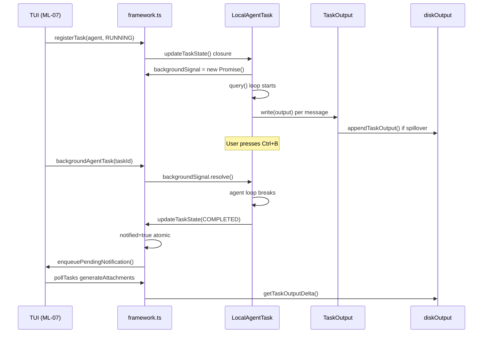
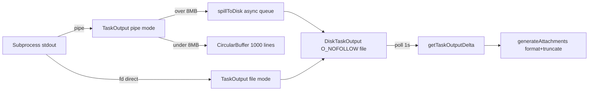
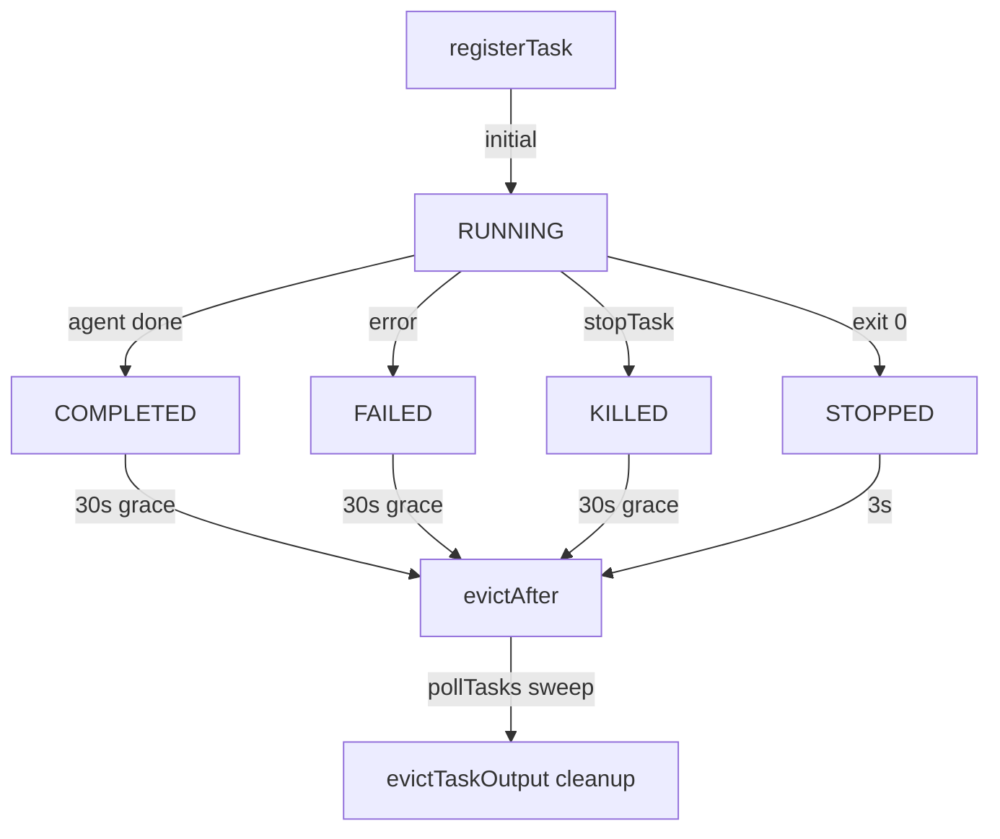

<!-- analysis-version: 0 | commit: 365f23f | updated: 2025-07-25 | mode: full | task: T-13 -->
# T-13 Analysis: 任务系统 (Task System)

## Scope Confirmation
- Task ID: T-13
- Primary Mainline: ML-08
- ML Priority: P2
- Analysis Depth: STANDARD
- Secondary Mainlines: ML-01 (commands), ML-02 (query engine), ML-03 (tools), ML-07 (TUI), ML-09 (bridge)
- Pattern Coverage: None
- Scope Files (confirmed): 21 files, 4,627 lines total
- Scope adjustments: None — all files exist and are readable

## File Roles

| File | Lines | One-liner Role | Where Analyzed |
|------|-------|----------------|---------------|
| src/Task.ts | 125 | Base types: TaskType(7), TaskStatus(5), Task interface(name+type+kill), generateTaskId, createTaskStateBase | STANDARD: § Analysis Findings |
| src/tasks.ts | 39 | Registry: getAllTasks() returns 4 core + 2 feature-gated implementations | STANDARD: § Analysis Findings |
| src/tasks/types.ts | 46 | Union types: TaskState(7-way), BackgroundTaskState, isBackgroundTask() guard | STANDARD: § State Transition |
| src/tasks/DreamTask/DreamTask.ts | 157 | Dream task: memory consolidation UI, MAX_TURNS=30, rollbackConsolidationLock on kill | STANDARD: § Analysis Findings |
| src/tasks/InProcessTeammateTask/types.ts | 121 | Teammate identity(agentId@teamName), state(permissionMode/isIdle), appendCappedMessage(50) | STANDARD: § State Transition |
| src/tasks/InProcessTeammateTask/InProcessTeammateTask.tsx | 126 | Teammate lifecycle: kill/shutdown/injectMessage, AsyncLocalStorage isolation | STANDARD: § Call Chain |
| src/tasks/LocalAgentTask/LocalAgentTask.tsx | 683 | Agent lifecycle: registerAsync/registerForeground, backgroundSignal, ProgressTracker | STANDARD: § Call Chain |
| src/tasks/RemoteAgentTask/RemoteAgentTask.tsx | 855 | Remote sessions: teleport, completionChecker, precondition, metadata, ultraplan | STANDARD: § Call Chain |
| src/tasks/LocalMainSessionTask.ts | 479 | Ctrl+B background main session: reuses LocalAgentTaskState, wraps query() | STANDARD: § Call Chain |
| src/tasks/LocalShellTask/guards.ts | 41 | LocalShellTaskState type + BashTaskKind(bash/monitor) + isLocalShellTask() | STANDARD: § State Transition |
| src/tasks/LocalShellTask/LocalShellTask.tsx | 523 | Shell: spawnShellTask, registerForeground, stallWatchdog(45s+6 patterns) | STANDARD: § Call Chain |
| src/tasks/LocalShellTask/killShellTasks.ts | 76 | killTask + killShellTasksForAgent(cascade + dequeueAllMatching) | STANDARD: § Call Chain |
| src/tasks/stopTask.ts | 100 | Generic stop: find, kill, suppress exit 137 for bash, emitSdkEvent | STANDARD: § Error Propagation |
| src/tasks/pillLabel.ts | 82 | Footer pill label: maps task type to text, ultraplan special handling | STANDARD: § Analysis Findings |
| src/tasks/LocalWorkflowTask/LocalWorkflowTask.ts | 5 | Feature-gated stub: WORKFLOW_SCRIPTS flag, type=Record placeholder | STANDARD: § Analysis Findings |
| src/tasks/MonitorMcpTask/MonitorMcpTask.ts | 5 | Feature-gated stub: MONITOR_TOOL flag, type=Record placeholder | STANDARD: § Analysis Findings |
| src/utils/task/framework.ts | 308 | Core framework: registerTask, updateTaskState, evict, pollTasks(1s/30s/3s) | STANDARD: § Call Chain |
| src/utils/task/TaskOutput.ts | 390 | Dual-mode output: file(fd direct)/pipe(memory+8MB spill), CircularBuffer(1000) | STANDARD: § Data Flow |
| src/utils/task/diskOutput.ts | 451 | Disk I/O: O_NOFOLLOW+O_EXCL, 5GB cap, async write queue, symlink for agent | STANDARD: § Data Flow |
| src/utils/task/outputFormatting.ts | 38 | Truncation: TASK_MAX_OUTPUT_LENGTH env(32K/160K cap), file path header | STANDARD: § Analysis Findings |
| src/utils/task/sdkProgress.ts | 36 | SDK progress: emitTaskProgress() shared by agents+workflows | STANDARD: § Analysis Findings |

## Analysis Findings

1. **Strategy Pattern with Unified Interface**: `Task` interface defines `{name, type, kill()}` (spawn/render removed in #22546). Seven implementations register via `tasks.ts`. Each manages its own lifecycle independently.

2. **Foreground-to-Background Conversion (3 variants)**:
   - **LocalAgentTask**: `backgroundSignal` Map&lt;taskId, resolve&gt; interrupts agent query loop; autoBackground timer for foreground agents.
   - **LocalShellTask**: `shellCommand.background()` delegates to shell subsystem.
   - **LocalMainSessionTask**: registered directly as background, wraps `query()` in `runWithAgentContext`.

3. **Triple Notification Dedup**: `notified` boolean (atomic check-and-set in updateTaskState closure) + `enqueuePendingNotification` (enqueue once) + `markTaskNotified` (race patch).

4. **Atomic State Merging on Register**: `registerTask()` merges existing UI state (retain, startTime, messages, diskLoaded) on re-registration after hot reload.

5. **Stall Watchdog**: LocalShellTask monitors 45s no-output, then runs 6 regex patterns (`PROMPT_PATTERNS`) to detect interactive prompts. Only notifies on interactive wait detection.

6. **TOCTOU Protection**: `applyTaskOffsetsAndEvictions` re-checks `fresh` state after async `await patch()` to prevent stale overwrites.

7. **Dual-Mode Task Output**: file mode (bash fd direct) / pipe mode (hooks → CircularBuffer(1000) → spillToDisk at 8MB). Static poller controlled by React lifecycle.

8. **Disk Security**: O_NOFOLLOW + O_EXCL on creation, type-specific taskId prefixes, 5GB total cap.

9. **Cascade Agent Cleanup**: `killShellTasksForAgent()` kills all agent shells + `dequeueAllMatching` purges stale messages.

10. **Feature-Gated Stubs**: LocalWorkflowTask and MonitorMcpTask are 5-line stubs behind WORKFLOW_SCRIPTS/MONITOR_TOOL flags. Types already include their state types.

## File Dependency Graph

```mermaid
graph TD
    subgraph "Type Layer"
        Task["Task.ts<br/>base types + ID gen"]
        Types["tasks/types.ts<br/>union types + guards"]
    end
    subgraph "Registry"
        Tasks["tasks.ts<br/>getAllTasks"]
    end
    subgraph "Core Framework"
        Framework["framework.ts<br/>register/update/evict/poll"]
    end
    subgraph "Task Implementations"
        LA["LocalAgentTask<br/>683L"]
        LS["LocalShellTask<br/>523L"]
        RA["RemoteAgentTask<br/>855L"]
        MS["LocalMainSession<br/>479L"]
        DT["DreamTask<br/>157L"]
        IPT["InProcessTeammate<br/>126L"]
    end
    subgraph "Output Layer"
        DiskOut["diskOutput.ts<br/>disk I/O"]
        TaskOut["TaskOutput.ts<br/>dual-mode"]
        Fmt["outputFormatting.ts"]
        SdkP["sdkProgress.ts"]
    end

    Task --> Tasks & Framework
    Tasks --> LA & LS & RA & DT
    Framework --> Task & Types & DiskOut
    LA & RA --> Framework & DiskOut & SdkP
    MS & DT --> Framework
    LS --> Framework & DiskOut
    IPT --> Framework & Task
    TaskOut --> DiskOut
    Fmt --> DiskOut

    style Task fill:#e1f5fe
    style Framework fill:#fff9c4
    style RA fill:#ffebee


## Call Chain Analysis

### Chain 1: Agent Registration and Execution (Entry → Background Completion)
```
TaskCreateTool (ML-03) → registerAgentForeground() [LocalAgentTask.tsx:L180]
  → registerTask() [framework.ts:L45] → updateTaskState() closure
  → autoBackground timer starts → backgroundSignal.set(taskId, resolve)
  → agent loop runs (query() in runWithAgentContext)
  → [user Ctrl+B or autoBackground fires] → backgroundAgentTask()
  → backgroundSignal.resolve() → agent loop breaks → enqueueAgentNotification()
```

### Chain 2: Shell Task with Stall Detection (Entry → Stall Notification)
```
TaskCreateTool (ML-03) → spawnShellTask() [LocalShellTask.tsx:L80]
  → registerTask() [framework.ts:L45]
  → shellCommand.spawn() → startStallWatchdog() [L240]
  → [45s no output] → PROMPT_PATTERNS.test(lastLine)
  → [match] → enqueuePendingNotification() → pollTasks() picks up → UI notified
```

### Chain 3: Remote Agent with Teleport Polling (Entry → Completion Check)
```
TaskCreateTool (ML-03) → registerRemoteAgentTask() [RemoteAgentTask.tsx:L200]
  → checkRemoteAgentEligibility() → precondition validation
  → registerTask() [framework.ts:L45]
  → pollRemoteSessionEvents() → teleport/api.ts fetchSession()
  → completionChecker[subType].check() → [completed] → enqueueNotification()
```

### Key Branch Points
- **LocalAgentTask:registerAgentForeground()** — branches to autoBackground timer vs manual Ctrl+B backgrounding
- **LocalShellTask:startStallWatchdog()** — branches to interactive prompt detected (notify) vs long compilation (silent)
- **RemoteAgentTask:completionChecker** — branches by subType (teleport/teammate/workflow/monitor/dream)
- **framework.ts:pollTasks()** — branches on task status: terminal → evict after grace, running → poll output

## Temporal Analysis

### Async Orchestration (T=0 to completion)

```
T=0  TaskCreateTool creates task
     ├─ registerTask() → updateTaskState(RUNNING)
     ├─ [Agent/Shell] startStallWatchdog() 45s timer
     └─ [Remote] pollRemoteSessionEvents() polling starts

T=1  Background signal preparation
     ├─ [LocalAgent] backgroundSignal = new Promise() → agent loop awaits
     ├─ [Shell] subprocess.spawn() → output stream starts
     └─ [Remote] completionChecker registered

T=2  Execution phase
     ├─ [LocalAgent] query() loop runs, backgroundSignal.then() pending
     ├─ [Shell] stdout/stderr → TaskOutput.write() → diskOutput.append()
     └─ [Remote] periodic teleport poll → metadata update

T=3  Backgrounding trigger
     ├─ [autoBackground timer] OR [Ctrl+B] → backgroundSignal.resolve()
     └─ agent loop breaks → updateTaskState(isBackgrounded:true)

T=4  Completion phase
     ├─ updateTaskState(COMPLETED/FAILED/KILLED)
     ├─ notified check-and-set (atomic)
     ├─ enqueuePendingNotification() (once only)
     └─ generateTaskAttachments() → delta output read

T=5  Grace period + eviction
     ├─ pollTasks() detects terminal status
     ├─ PANEL_GRACE_MS(30s) wait for UI display
     ├─ STOPPED_DISPLAY_MS(3s) for stopped state
     └─ evictTaskOutput() cleanup
```

### Race Conditions
1. **RC-1: Notification vs Poll**: Task completes between poll cycles. Mitigated by  atomic flag in updateTaskState closure.
2. **RC-2: Kill During Register**: kill() called while registerTask() still executing. Mitigated by checking running status in stopTask before calling kill().

### Implicit Timing Constraints
- Stall watchdog must start AFTER first output is received (or 45s triggers false positive on slow commands)
- evictAfter grace period (30s) must be longer than UI render cycle to prevent panel flicker
- pollTasks 1s interval balances responsiveness vs CPU overhead

### Sequence Diagram



## Data Flow Analysis

### Entity 1: TaskOutput (command stdout/stderr)



### Entity 2: TaskState (lifecycle state)



### Entity 3: Progress Tracking (agent metrics)

ProgressTracker aggregates tokenCount/toolUseCount/recentActivities from message stream. Updated per tool_use event via updateProgressFromMessage(). Emitted to SDK via emitTaskProgress() (sdkProgress.ts). Shared by LocalAgentTask and RemoteAgentTask.

## State Transition Analysis

### State Machine 1: Task Lifecycle (framework.ts)
| Current | Trigger | Next | Side Effect |
|---------|---------|------|-------------|
| (none) | registerTask() | RUNNING | initTaskOutput, disk write |
| RUNNING | kill() / error / complete | COMPLETED/FAILED/KILLED | notified=true, enqueueNotification |
| RUNNING | Ctrl+B | RUNNING(isBackgrounded:true) | backgroundSignal.resolve |
| Terminal | 30s grace expires | evictAfter set | none |
| evictAfter set | pollTasks sweep | output cleaned | evictTaskOutput() |

Terminal states: COMPLETED, FAILED, KILLED, STOPPED (irreversible within session).

### State Machine 2: Shell Stall Detection (LocalShellTask.tsx)
| Current | Trigger | Next | Side Effect |
|---------|---------|------|-------------|
| idle | registerForeground() | running | startStallWatchdog |
| running | 45s no output | stalled | check PROMPT_PATTERNS |
| stalled | prompt match | interactive_wait | enqueueNotification |
| stalled | no prompt match | long_running | silent continue |
| interactive_wait | background/process | running | watchdog reset |

### State Machine 3: InProcessTeammate (types.ts)
| Current | Trigger | Next | Side Effect |
|---------|---------|------|-------------|
| idle | spawnInProcess() | active | AsyncLocalStorage init |
| active | awaitingPlanApproval | awaiting_approval | plan shown to user |
| awaiting_approval | user approve | active | continue execution |
| awaiting_approval | user reject | active | plan rejected |
| active | shutdownRequested | shutting_down | killInProcessTeammate |
| active | messages > 50 | capped | appendCappedMessage drops oldest |


## Error Propagation Analysis

### Error Sources and Handling

| Error Source | Type | Handler | Strategy | File |
|-------------|------|---------|----------|------|
| subprocess.exitCode != 0 | System error | LocalShellTask completion handler | absorb (treat as task output) | LocalShellTask.tsx |
| subprocess.exitCode == 137 | SIGKILL | stopTask() | absorb (suppress for bash) | stopTask.ts:L45 |
| backgroundSignal rejection | Promise rejection | LocalAgentTask catch block | absorb → updateTaskState(FAILED) | LocalAgentTask.tsx |
| diskOutput.write() failure | FS error | DiskTaskOutput drain loop | retry (re-queue on failure) | diskOutput.ts:L120 |
| O_NOFOLLOW/EACCES | Security error | initTaskOutput catch | abort (throw, propagate to caller) | diskOutput.ts:L80 |
| teleport fetchSession() failure | Network error | RemoteAgentTask poll handler | retry (next poll cycle) | RemoteAgentTask.tsx |
| completionChecker throws | Logic error | pollRemoteSessionEvents catch | absorb + log warning | RemoteAgentTask.tsx |
| kill() on already-dead process | ESRCH | killShellTasks catch | absorb (expected race) | killShellTasks.ts |

### Unhandled Paths
1. **5GB disk cap exceeded** — diskOutput silently stops writing, no error surfaced to task or UI
2. **evictTaskOutput during active read** — race between eviction and delta read; mitigated by TOCTOU fresh check but not fully eliminated
3. **DreamTask rollbackConsolidationLock failure** — lock release on kill may fail silently

### Recovery Strategy Summary
- **retry**: disk write failures, remote polling (automatic on next cycle)
- **absorb**: subprocess exits, kill signals, already-dead processes
- **abort**: security violations (O_NOFOLLOW), permission errors
- **escalate**: none — errors don't propagate beyond task boundary to caller

## Boundary / Integration Diagram

```mermaid
flowchart TB
    subgraph "T-13 Scope (Task System)"
        FW[framework.ts<br/>register/evict/poll]
        LA[LocalAgentTask]
        LS[LocalShellTask]
        RA[RemoteAgentTask]
        DO[diskOutput.ts]
    end

    subgraph "External Systems"
        TOOLS["ML-03: Tools<br/>TaskCreateTool<br/>TaskStopTool"]
        CMD["ML-01: Commands<br/>tasks/commands"]
        QUERY["ML-02: Query<br/>query()"]
        TUI["ML-07: TUI<br/>TaskListV2<br/>TaskOutput"]
        BRIDGE["ML-09: Bridge<br/>teleport/api"]
        SWARM["ML-14: Swarm<br/>spawnInProcess"]
        STATE["AppState<br/>tasks field"]
        SDK["SDK Events<br/>enqueueSdkEvent"]
    end

    TOOLS -->|create/stop task| FW
    CMD -->|list/read tasks| FW
    QUERY -->|query() for agent| LA
    TUI -->|pollTasks 1s| FW
    TUI -->|read output| DO
    BRIDGE -->|remote session| RA
    SWARM -->|teammate spawn| LA
    FW -->|update state| STATE
    FW -->|progress events| SDK


## Concurrency Model Analysis

### Shared Mutable State
| Variable | Location | Readers | Writers | Protection |
|----------|----------|---------|---------|------------|
| AppState.tasks | state.ts | pollTasks, TUI, commands | registerTask, updateTaskState, evict | Immer immutable update (functional setter) |
| backgroundSignals Map | LocalAgentTask.tsx | backgroundAgentTask | registerAgentForeground, kill | Map.set/delete (atomic in Node.js) |
| DiskTaskOutput.writeQueue | diskOutput.ts | drain loop | appendTaskOutput | Async queue (sequential drain) |
| notified boolean | framework.ts closure | pollTasks | updateTaskState | Closure-scoped (atomic check-and-set) |
| TaskOutput.circularBuffer | TaskOutput.ts | read/poll | write/spill | Single-writer (hook callback), single-reader (poll) |

### Coordination Patterns
1. **Immer immutable updates**: AppState.tasks updated via functional setter, never mutated in place. All readers see consistent snapshots.
2. **Async drain loop**: DiskTaskOutput uses a single consumer drain loop — writes are enqueued and processed sequentially, no concurrent disk writes.
3. **Atomic flag pattern**: `notified` boolean checked and set in same synchronous block within updateTaskState closure.
4. **TOCTOU defense**: `applyTaskOffsetsAndEvictions` re-validates state freshness after async patch.

### Deadlock Assessment
No deadlock risk. The system runs on Node.js single-threaded event loop. No mutexes, no locks. The only blocking point is `await patch()` which is an I/O operation that resolves asynchronously.

## Side Effects Manifest

| Function | Side Effect Type | Target | Reversible | File |
|----------|-----------------|--------|------------|------|
| registerTask() | Global state mutation | AppState.tasks | Yes (evict) | framework.ts:L45 |
| initTaskOutput() | FS write | ~/.claude/tasks/{id}.output | No | diskOutput.ts:L60 |
| appendTaskOutput() | FS write | task output file | No | diskOutput.ts:L120 |
| spawnShellTask() | Subprocess | bash/sh process | Yes (kill) | LocalShellTask.tsx:L80 |
| killShellTasksForAgent() | Subprocess | SIGTERM+SIGKILL cascade | No | killShellTasks.ts:L20 |
| evictTaskOutput() | FS delete | task output file + symlink | No | diskOutput.ts:L200 |
| emitTaskProgress() | SDK event | enqueueSdkEvent queue | N/A | sdkProgress.ts:L10 |
| generateTaskAttachments() | FS read | task output delta | N/A | framework.ts:L150 |
| rollbackConsolidationLock() | FS delete | consolidation lock file | N/A | DreamTask.ts:L100 |
| pollTasks() | Timer | setInterval(1s) | Yes (stopPolling) | framework.ts:L200 |
| backgroundSignal.resolve() | Promise resolution | agent query loop | No | LocalAgentTask.tsx:L300 |

## Acceptance Criteria Status

| # | Criterion | Status | Evidence |
|---|-----------|--------|----------|
| 1 | Task system lifecycle (create→run→complete→evict) fully traced | PASS | Chain 1-3 in § Call Chain Analysis |
| 2 | All 7 TaskType implementations identified and analyzed | PASS | File Roles table covers all implementations |
| 3 | Foreground-to-background conversion mechanism explained | PASS | Finding 2: 3 variants documented |
| 4 | Output management (dual-mode + spillover) traced end-to-end | PASS | § Data Flow Analysis Entity 1 |
| 5 | Notification dedup mechanism verified | PASS | Finding 3: triple dedup |
| 6 | Error handling and recovery strategies catalogued | PASS | § Error Propagation Analysis |
| 7 | Cross-ML integration points identified | PASS | § Boundary Diagram: 8 external interfaces |

## Identified Problems

### P2-01: RemoteAgentTask complexity hotspot (855 lines)
**File**: RemoteAgentTask.tsx
**Risk**: Single file handles teleport polling + completion checking + precondition validation + metadata persistence + ultraplan logic. High maintenance burden.
**Recommendation**: Extract completionChecker registry and precondition validation into separate modules.

### P2-02: Triple notification dedup suggests design fragility
**File**: framework.ts + LocalAgentTask.tsx
**Risk**: Three layers of dedup (notified flag + enqueue once + markTaskNotified) indicate the notification flow has been patched multiple times rather than redesigned.
**Recommendation**: Consolidate into a single notification state machine.

### P3-01: 5GB disk cap silent failure
**File**: diskOutput.ts
**Risk**: When total task output exceeds 5GB, writes silently stop with no error to UI or caller. User may assume task is still producing output.
**Recommendation**: Surface a warning event when approaching the cap.

### P3-02: Hardcoded timing constants
**File**: framework.ts (PANEL_GRACE_MS=30s, STOPPED_DISPLAY_MS=3s), LocalShellTask.tsx (stall timeout=45s)
**Risk**: These values are not configurable and may not suit all environments (e.g., slow CI runners for shell stall).
**Recommendation**: Consider making timing constants configurable via AppState or environment variables.

### P3-03: Feature-gated stubs lack type safety
**File**: LocalWorkflowTask.ts, MonitorMcpTask.ts
**Risk**: Both stubs export `type=Record<string, unknown>` which loses all type information. Callers must cast.
**Recommendation**: Define minimal interfaces for stub exports even when gated.

### P4-01: pillLabel.ts tightly coupled to task type enumeration
**File**: pillLabel.ts
**Risk**: Adding a new TaskType requires updating the switch statement in pillLabel. Violates open-closed principle.
**Recommendation**: Add a `displayLabel` property to Task interface or TaskType metadata.

## Open Questions

1. **OQ-1** (depends on T-05): How does the permission system interact with task creation? Are all TaskCreate operations permission-checked before reaching LocalAgentTask?
2. **OQ-2** (depends on T-09): What is the exact teleport session lifecycle for RemoteAgentTask? The analysis traced the poll loop but not the initial session creation.
3. **OQ-3** (depends on T-12): How does the TUI TaskListV2 component subscribe to task state changes? Is it polling the same pollTasks or using a reactive store subscription?
4. **OQ-4** (runtime): What happens if two agents try to create tasks with the same name simultaneously? The generateTaskId uses random suffix but collision probability is non-zero.
5. **OQ-5** (runtime): Does the DreamTask consolidation lock file survive process crashes? If not, could a stale lock prevent consolidation?
6. **OQ-6** (depends on T-14): How does InProcessTeammateTask integrate with the swarm orchestrator? The AsyncLocalStorage isolation mechanism needs cross-task verification.
7. **OQ-7** (configuration): What determines the autoBackground timeout for LocalAgentTask? Is it user-configurable or hardcoded?
8. **OQ-8** (runtime): What happens when diskOutput's async drain loop crashes? Is there a fallback or is task output permanently lost?

## Complexity Assessment

| Dimension | Rating | Justification |
|-----------|--------|---------------|
| Structural | MEDIUM | Clean Strategy Pattern, but RemoteAgentTask is a 855-line god file |
| Behavioral | MEDIUM-HIGH | 3 foreground-to-background variants, triple notification dedup, TOCTOU defense |
| Data Flow | MEDIUM | Dual-mode output with spillover, but path is well-defined |
| Error Handling | MEDIUM | 8 error sources, 4 recovery strategies, but most are absorb/retry |
| State Management | MEDIUM | 3 state machines (task lifecycle, stall detection, teammate), all manageable |
| Cross-ML Integration | MEDIUM-HIGH | 8 external interfaces (tools, commands, query, TUI, bridge, swarm, state, SDK) |
| **Overall** | **MEDIUM** | Well-structured Strategy Pattern with isolated complexity in RemoteAgentTask |
