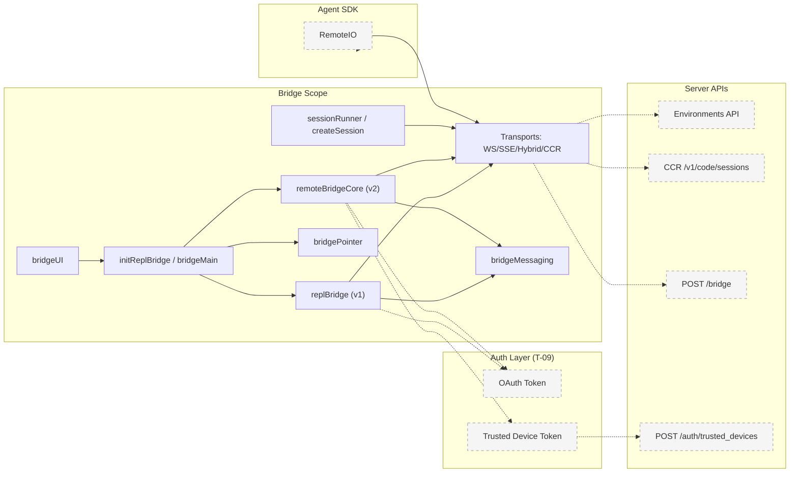
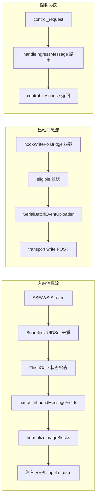
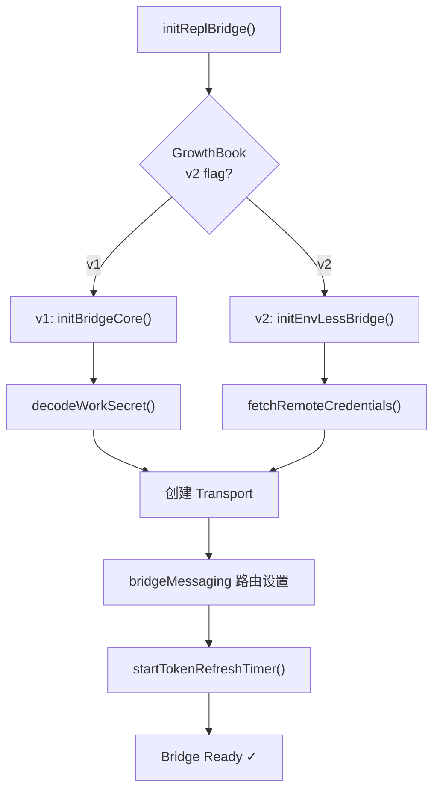
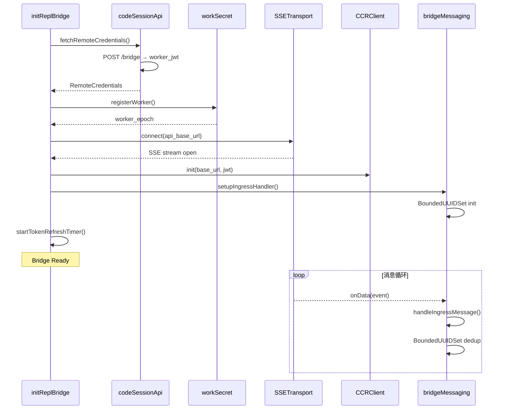

<!-- analysis-version: 0 | commit: 365f23f | updated: 2025-07-25 | mode: full | task: T-14 -->
# T-14 Analysis: Bridge 远程模式

## Scope Confirmation
- Task ID: T-14
- Primary Mainline: ML-09
- ML Priority: P2
- Analysis Depth: STANDARD
- Secondary Mainlines: []
- Pattern Coverage: N/A
- Scope Files (confirmed): 46 files, 18,081 lines
- Scope adjustments: None — all 46 files verified present and readable

## File Roles

| File | Lines | One-liner Role | Where Analyzed |
|------|-------|----------------|---------------|
| src/bridge/bridgeMain.ts | 2999 | Daemon 多会话长轮询主循环 — 管理 environment 注册、work poll、session spawn/kill/heartbeat/reconnect | STANDARD: § 关键路径与组件 |
| src/bridge/replBridge.ts | 2406 | REPL 内嵌单会话 bridge — initBridgeCore 10步前置检查 + v1 initBridgeCore + v2 env-less 路径 + transport 生命周期 | STANDARD: § 关键路径与组件 |
| src/bridge/remoteBridgeCore.ts | 1008 | v2 env-less 路径核心 — 跳过 Environments API，直接 /bridge 获取 worker JWT + SSE transport 建立 | STANDARD: § 关键路径与组件 |
| src/bridge/bridgeApi.ts | 539 | Environments API HTTP 封装 — register/poll/ack/stop/deregister/heartbeat/reconnect/archive/permission | STANDARD: § 关键路径与组件 |
| src/bridge/bridgeUI.ts | 530 | Bridge 终端 UI 渲染 — QR 码生成、状态栏（Ready/Connected/Failed）、spinner、QR+URL 双显示 | STANDARD: § 关键路径与组件 |
| src/bridge/initReplBridge.ts | 569 | REPL bridge 入口 — 10步前置检查链（gate→OAuth→policy→backoff→refresh→expiry→baseUrl→title→orgUUID→v1/v2 分支） | STANDARD: § 关键路径与组件 |
| src/bridge/sessionRunner.ts | 550 | Session 子进程运行器 — spawn CLI 子进程（single-session/worktree/same-dir 三模式），管理 stdio pipe + exit/kill | STANDARD: § 关键路径与组件 |
| src/bridge/replBridgeTransport.ts | 370 | v1/v2 传输层抽象工厂 — v1 HybridTransport（WS read + POST write）v2 SSETransport + CCRClient | STANDARD: § 关键路径与组件 |
| src/bridge/bridgeMessaging.ts | 461 | 入站消息路由 + 出站消息拦截 — handleIngressMessage 路由表 + hookWriteForBridge 出站过滤器 | STANDARD: § 关键路径与组件 |
| src/bridge/createSession.ts | 384 | CCR v2 session 创建 — POST /v1/code/sessions + /bridge credential fetch + title 派生四阶策略 | STANDARD: § 关键路径与组件 |
| src/bridge/bridgePointer.ts | 210 | 跨 worktree 崩溃恢复指针 — filesystem lockfile（4h TTL，mtime 而非内嵌时间戳） | STANDARD: § 关键路径与组件 |
| src/bridge/bridgeEnabled.ts | 202 | GrowthBook gate 汇总 — tengu_bridge_* 系列 feature flag 检查（bridge 启用、v2、poll config） | STANDARD: § 关键路径与组件 |
| src/bridge/trustedDevice.ts | 210 | 可信设备 token 管理 — POST /auth/trusted_devices 注册（90d 滚动过期）+ keychain 持久化 | STANDARD: § 关键路径与组件 |
| src/bridge/bridgeStatusUtil.ts | 163 | Bridge 状态 UI 工具 — StatusState 5态枚举 + shimmer 动画 + connect/session URL 构建 | STANDARD: § 关键路径与组件 |
| src/bridge/envLessBridgeConfig.ts | 165 | v2 env-less 配置解析 — 从 work secret 的 api_base_url + session_ingress_token 构建 CCR v2 URL | STANDARD: § 关键路径与组件 |
| src/bridge/inboundAttachments.ts | 175 | 入站附件处理 — 从 bridge 消息中提取并处理文件/图片附件，支持 BriefTool upload 路径 | STANDARD: § 关键路径与组件 |
| src/bridge/jwtUtils.ts | 256 | JWT 工具 — 解码 session_ingress_token 获取过期时间 + 过期前 5 分钟主动刷新 + epoch mismatch 检测 | STANDARD: § 关键路径与组件 |
| src/bridge/debugUtils.ts | 141 | 调试工具集 — secret 脱敏、axios 错误描述、HTTP 状态提取、bridge skip 日志 | STANDARD: § 关键路径与组件 |
| src/bridge/bridgeDebug.ts | 135 | Ant-only 故障注入 — /bridge-kick slash command 触发 poll/register/reconnect/heartbeat 故障 | STANDARD: § 关键路径与组件 |
| src/bridge/codeSessionApi.ts | 168 | CCR v2 code-session HTTP API — createCodeSession + fetchRemoteCredentials（获取 worker_jwt） | STANDARD: § 关键路径与组件 |
| src/bridge/pollConfig.ts | 110 | GrowthBook 轮询配置 — 从 feature flag 动态读取 poll interval + heartbeat + keepalive 参数 | STANDARD: § 关键路径与组件 |
| src/bridge/workSecret.ts | 127 | Work secret 解码 — base64url 解码 + version 校验 + SDK URL 构建 + session ID 比较 | STANDARD: § 关键路径与组件 |
| src/bridge/types.ts | 262 | 核心类型定义 — BridgeConfig, SessionHandle, BridgeApiClient 接口, WorkResponse/WorkSecret, SpawnMode | STANDARD: § 关键路径与组件 |
| src/bridge/flushGate.ts | 71 | 历史消息刷新门控 — 状态机（idle→flushing→draining），flush 期间新消息排队防交错 | STANDARD: § 关键路径与组件 |
| src/bridge/capacityWake.ts | 56 | 容量唤醒机制 — at-capacity 睡眠时外部唤醒（SIGUSR2 / debug / token rotation） | STANDARD: § 关键路径与组件 |
| src/bridge/bridgeConfig.ts | 48 | 共享 auth/URL 解析 — ant-only CLAUDE_BRIDGE_* env override + OAuth token fallback | STANDARD: § 关键路径与组件 |
| src/bridge/bridgePermissionCallbacks.ts | 43 | Bridge 权限回调类型 — sendRequest/sendResponse/cancelRequest/onResponse 定义 + isBridgePermissionResponse 谓词 | STANDARD: § 关键路径与组件 |
| src/bridge/replBridgeHandle.ts | 36 | 全局 bridge handle 单例指针 — setReplBridgeHandle/getReplBridgeHandle + session ID 发布 | STANDARD: § 关键路径与组件 |
| src/bridge/sessionIdCompat.ts | 57 | Session ID 标签转换 — cse_* ↔ session_* 双向重标签（CCR v2 compat layer） | STANDARD: § 关键路径与组件 |
| src/bridge/inboundMessages.ts | 80 | 入站消息字段提取 — extractInboundMessageFields + normalizeImageBlocks（camelCase→snake_case） | STANDARD: § 关键路径与组件 |
| src/bridge/pollConfigDefaults.ts | 82 | 轮询默认值常量 — not-at-capacity 2s, at-capacity 10min, keepalive 2min, reclaim 5s | STANDARD: § 关键路径与组件 |
| src/bridge/peerSessions.ts | 3 | 空桩文件 — peer session 发现（未实现，返回空数组） | OVERVIEW (enumerated only) |
| src/bridge/webhookSanitizer.ts | 3 | 空桩文件 — webhook 值清洗（passthrough，未实现） | OVERVIEW (enumerated only) |
| src/cli/transports/ccrClient.ts | 998 | CCR v2 客户端 — SSE read + HTTP POST write 双通道 + epoch 管理 + heartbeat + delivery/state/metadata 上报 | STANDARD: § 关键路径与组件 |
| src/cli/transports/WebSocketTransport.ts | 800 | WebSocket 传输 — 连接管理 + 自动重连（指数退避 1s→30s）+ 消息序列化 | STANDARD: § 关键路径与组件 |
| src/cli/transports/SSETransport.ts | 711 | SSE 传输 — EventSource 连接 + sequence number 恢复 + epoch mismatch 处理 + outbound-only 模式 | STANDARD: § 关键路径与组件 |
| src/cli/transports/HybridTransport.ts | 282 | 混合传输 — WS read + HTTP POST write，避免并发 Firestore 写入冲突 | STANDARD: § 关键路径与组件 |
| src/cli/transports/SerialBatchEventUploader.ts | 275 | 串行批量事件上传器 — 单队列串行化所有写操作，避免并发问题 | STANDARD: § 关键路径与组件 |
| src/cli/transports/WorkerStateUploader.ts | 131 | Worker 状态上传器 — 周期性上报 worker state（通过 CCRClient） | STANDARD: § 关键路径与组件 |
| src/cli/remoteIO.ts | 255 | SDK 模式双向流 — RemoteIO extends StructuredIO，管理 SSE/WS transport + CCRClient 初始化 + keepalive | STANDARD: § 关键路径与组件 |
| src/cli/update.ts | 422 | CLI 自更新命令 — 版本检查 + 多安装检测 + npm/native/local 三路径更新 | STANDARD: § 关键路径与组件 |
| src/cli/handlers/agents.ts | 70 | agents 子命令处理 — 打印已配置 agent 列表（source groups 分组 + override 展示） | STANDARD: § 关键路径与组件 |
| src/cli/handlers/autoMode.ts | 170 | auto-mode 子命令 — dump defaults/config + AI 评判用户自定义 auto mode 规则 | STANDARD: § 关键路径与组件 |
| src/cli/handlers/mcp.tsx | 361 | mcp 子命令处理 — serve/remove/add/list/reset/validate，MCP server 生命周期管理 | STANDARD: § 关键路径与组件 |
| src/cli/handlers/plugins.ts | 878 | plugin 子命令处理 — install/uninstall/enable/disable/validate/marketplace 完整插件管理 | STANDARD: § 关键路径与组件 |
| src/cli/handlers/util.tsx | 109 | 杂项子命令 — setup-token（OAuth flow）、doctor（诊断）、install（shell completion） | STANDARD: § 关键路径与组件 |

## Analysis Findings

### 关键路径与组件

#### 双轨架构：v1 Environments API vs v2 Env-Less

Bridge 系统支持两条完全独立的路径建立远程会话，由 GrowthBook flag `tengu_bridge_repl_v2` 控制：

**v1 (env-based) 路径：**
1. `bridgeApi.ts` → `registerBridgeEnvironment()` 注册 environment
2. `bridgeMain.ts` → `runBridgeLoop()` 长轮询 `pollForWork()`
3. 收到 work item → `workSecret.ts:decodeWorkSecret()` 解码 session_ingress_token
4. `replBridgeTransport.ts` → 创建 `HybridTransport`（WS read + POST write）
5. 消息经 `bridgeMessaging.ts` 路由和过滤

**v2 (env-less/CCR) 路径：**
1. `codeSessionApi.ts:createCodeSession()` 创建 session
2. `codeSessionApi.ts:fetchRemoteCredentials()` POST /bridge 获取 worker_jwt
3. `remoteBridgeCore.ts` → 建立 SSE transport + 注册 worker epoch
4. `replBridgeTransport.ts` → 创建 `SSETransport`（read）+ `CCRClient`（POST write）

#### 两种运行模式

**Daemon/多会话模式**（`bridgeMain.ts`, 2999行）：
- 独立进程运行（`claude bridge` 命令或 Agent SDK）
- 长轮询主循环管理多个并发 session
- `sessionRunner.ts` spawn 子 CLI 进程处理每个 session
- 支持 `single-session` / `worktree` / `same-dir` 三种 SpawnMode

**REPL/单会话模式**（`initReplBridge.ts` → `replBridge.ts`）：
- 嵌入当前 REPL 进程
- 10 步前置检查链确保环境就绪
- 直接使用当前进程的 REPL loop 处理消息

#### 消息流

**出站**：hook 拦截 → 过滤 eligible messages → `transport.write()` → `SerialBatchEventUploader` 串行批量 POST

**入站**：Transport.onData → `bridgeMessaging.ts:handleIngressMessage()` 路由 → `BoundedUUIDSet` 去重 → 注入 REPL input stream

**控制协议**：`control_request/response` 双向协商（initialize、set_model、interrupt、can_use_tool、set_permission_mode）

### 架构洞察

1. **HybridTransport 写入走 HTTP POST 而非 WS**：避免并发 Firestore 写入冲突 — WS 双向通道中的写入会触发服务器端 Firestore 事务，POST 路径无此问题 (`HybridTransport.ts`)

2. **FlushGate 状态机防消息交错**：历史消息（transcript replay）刷新期间，新消息排队等待，防止用户看到乱序对话 (`flushGate.ts`)

3. **bridgePointer 跨 worktree 恢复**：使用 filesystem lockfile（4h TTL），用 mtime 而非内嵌时间戳 — 更简单的原子性保证 (`bridgePointer.ts`)

4. **串行化写入**：所有出站写操作经 `SerialBatchEventUploader` 单队列，避免 `void transport.write()` 导致并发问题 (`SerialBatchEventUploader.ts`)

5. **注入式依赖设计**：`BridgeCoreParams` 显式注入 createSession/toSDKMessages 等函数，避免 Agent SDK bundle 引入 CLI 依赖树（analytics、config 等 1300+ 模块）(`replBridge.ts`)

6. **Session ID tag 双重标签**：`cse_*`（infra tag）vs `session_*`（compat tag）— 同一 UUID 不同前缀用于不同 API 层 (`sessionIdCompat.ts`)

7. **Trusted Device Token 分阶段上线**：CLI 侧 gate 先开（header 开始发送），server 侧 gate 后开（开始验证），两个 flag 独立控制 (`trustedDevice.ts`)

### 观察到的模式

- **Strategy Pattern（传输层）**：`Transport` 接口 + `WebSocketTransport` / `SSETransport` / `HybridTransport` 三实现，由工厂方法 `getTransportForUrl()` 选择
- **State Machine（FlushGate）**：idle → flushing → draining 三态，保证消息顺序
- **Observer Pattern（BridgeDebug）**：故障注入通过 `wrapApiForFaultInjection()` 代理 `BridgeApiClient`，匹配 method + kind 后替换响应
- **Singleton（replBridgeHandle）**：模块级 `let handle` 全局指针，set/get 访问器
- **Memoization（trustedDevice）**：lodash `memoize` 缓存 keychain 读取结果（~40ms subprocess），login 后手动 clear cache

### 与共享模块的交互

- **auth.ts (owner: T-09)**：`getBridgeAccessToken()` 调用 `getClaudeAIOAuthTokens()` 获取 OAuth token；`withOAuthRetry()` 处理 401 自动刷新
- **secureStorage (owner: T-09)**：`trustedDevice.ts` 通过 `getSecureStorage()` 读写 keychain 中的 trustedDeviceToken
- **GrowthBook (owner: T-08)**：`bridgeEnabled.ts` / `pollConfig.ts` 从 GrowthBook feature flags 动态读取 bridge 配置
- **MCPConnectionManager (owner: T-08)**：`mcp.tsx` handler 中 `MCPConnectionManager` 包装 doctor 命令
- **AgentTool (owner: T-13)**：`agents.ts` handler 调用 `getAgentDefinitionsWithOverrides()` 和 `resolveAgentOverrides()`

## File Dependency Graph

### Dependency Diagram

```mermaid
flowchart TD
    subgraph bridge["src/bridge/"]
        BM[bridgeMain.ts] --> BA[bridgeApi.ts]
        BM --> SR[sessionRunner.ts]
        BM --> BU[bridgeUI.ts]
        BM --> BSU[bridgeStatusUtil.ts]
        BM --> BP[bridgePointer.ts]
        BM --> FM[bridgeMessaging.ts]
        BM --> FLG[flushGate.ts]
        BM --> CW[capacityWake.ts]
        BM --> PC[pollConfig.ts]
        BM --> PCD[pollConfigDefaults.ts]
        BM --> DU[debugUtils.ts]
        BM --> BD[bridgeDebug.ts]
        BM --> WS[workSecret.ts]
        BM --> JW[jwtUtils.ts]
        BM --> TD[trustedDevice.ts]
        BM --> SIC[sessionIdCompat.ts]
        BM --> BE[bridgeEnabled.ts]
        BM --> BC[bridgeConfig.ts]
        BM --> TY[types.ts]

        RB[replBridge.ts] --> IRB[initReplBridge.ts]
        RB --> RBT[replBridgeTransport.ts]
        RB --> FM
        RB --> FLG
        RB --> TY
        RB --> RBH[replBridgeHandle.ts]
        RB --> RBPC[bridgePermissionCallbacks.ts]
        RB --> BC

        RBC[remoteBridgeCore.ts] --> CSA[codeSessionApi.ts]
        RBC --> ELBC[envLessBridgeConfig.ts]
        RBC --> RBT
        RBC --> WS
        RBC --> JW
        RBC --> SIC
        RBC --> TD

        RBT --> WS
        IRB --> BE
        IRB --> BC
        IRB --> RBC
        IRB --> TD
        IRB --> PC

        SR --> TY
        CSA --> DU
        BA --> BC
        BA --> TD
        BA --> DU
        BA --> TY

        BP --> SIC
        IM[inboundMessages.ts] --> TY
        IA[inboundAttachments.ts] --> BC
    end

    subgraph transports["src/cli/transports/"]
        CCR[ccrClient.ts] --> SSET[SSETransport.ts]
        CCR --> SBEU[SerialBatchEventUploader.ts]
        CCR --> WSU[WorkerStateUploader.ts]
        HT[HybridTransport.ts] --> WST[WebSocketTransport.ts]
    end

    RBT --> CCR
    RBT --> HT
    RBT --> SSET

    subgraph cli["src/cli/"]
        RIO[remoteIO.ts] --> CCR
        RIO --> SSET
    end

    classDef external fill:#f5f5f5,stroke:#999,stroke-dasharray: 5 5
```



### Dependency Table

| Source File | Depends On | Type | Direction |
|------------|-----------|------|-----------|
| bridgeMain.ts | bridgeApi.ts | import | outgoing |
| bridgeMain.ts | sessionRunner.ts | import | outgoing |
| bridgeMain.ts | bridgeUI.ts | import | outgoing |
| bridgeMain.ts | bridgeMessaging.ts | import | outgoing |
| bridgeMain.ts | flushGate.ts | import | outgoing |
| replBridge.ts | initReplBridge.ts | import | outgoing |
| replBridge.ts | replBridgeTransport.ts | import | outgoing |
| replBridge.ts | bridgeMessaging.ts | import | outgoing |
| remoteBridgeCore.ts | codeSessionApi.ts | import | outgoing |
| remoteBridgeCore.ts | replBridgeTransport.ts | import | outgoing |
| replBridgeTransport.ts | ccrClient.ts | import | outgoing |
| replBridgeTransport.ts | HybridTransport.ts | import | outgoing |
| remoteIO.ts | ccrClient.ts | import | outgoing |
| ccrClient.ts | SSETransport.ts | import | outgoing |
| HybridTransport.ts | WebSocketTransport.ts | import | outgoing |

> Scope 内 46 文件均无 scope 外的直接依赖（auth、GrowthBook 等通过接口/注入解耦）

## Boundary / Integration Map



- **外部依赖**：Environments API（v1 poll）、CCR v2 API（create/bridge/worker）、Trusted Device API（注册）、OAuth（token refresh）
- **跨 task 接口**：Auth layer（T-09）提供 `getClaudeAIOAuthTokens()` + `getSecureStorage()`；GrowthBook（T-08）提供 feature flags

## Data Flow View



- **关键实体**：SDKMessage（入站）、BridgeEvent（出站）、control_request/response（双向协商）
- **变换点**：normalizeImageBlocks（camelCase→snake_case）、toSDKMessages（hook 注入的函数，REPL 格式→API 格式）

## Call Chain Analysis (STANDARD 概要)

### Chain 1: v1 REPL Bridge 初始化与连接
```
initReplBridge() [initReplBridge.ts:L1]
  → checkGate() + getBridgeAccessToken() + backoffManager
  → initBridgeCore() [replBridge.ts]
    → decodeWorkSecret() [workSecret.ts]
    → getTransportForUrl() [replBridgeTransport.ts]
      → new HybridTransport() [HybridTransport.ts]
    → setupIngressHandler() [bridgeMessaging.ts]
      → handleIngressMessage() — 路由表分派
    → setupOutboundHook() [bridgeMessaging.ts]
    → startTokenRefreshTimer() [jwtUtils.ts]
  → Event: connected → REPL ready
```

### Chain 2: v2 Env-Less Bridge 初始化
```
initReplBridge() [initReplBridge.ts]
  → [v2 路径] initEnvLessBridge() [remoteBridgeCore.ts]
    → fetchRemoteCredentials() [codeSessionApi.ts]
      → POST /v1/code/sessions/{id}/bridge
    → registerWorker() [workSecret.ts]
    → new SSETransport() + new CCRClient()
    → setupIngressHandler() + setupOutboundHook()
    → startTokenRefreshTimer()
```

### Chain 3: Daemon 多会话轮询
```
runBridgeLoop() [bridgeMain.ts]
  → registerBridgeEnvironment() [bridgeApi.ts]
  → loop: pollForWork() [bridgeApi.ts]
    → 收到 work → decodeWorkSecret()
    → sessionRunner.spawn() [sessionRunner.ts]
      → spawn child CLI process
    → heartbeatActiveWorkItems() [bridgeApi.ts]
    → ack/stop/reconnect 根据状态
  → 指数退避: conn 2s→120s, general 500ms→30s
```

### Flowchart View



- **关键分支点**：GrowthBook flag `tengu_bridge_repl_v2` 决定走 v1 还是 v2 路径
- **汇聚点**：两条路径最终都建立 Transport + Messaging + Token Refresh

## Temporal Analysis (STANDARD 条件)

### Sequence Diagram



- **关键时序**：/bridge 获取 JWT → register worker → SSE connect → CCR init → 消息循环
- **异步特征**：SSE 是长连接持续推送；CCR POST 是请求/响应式

### Error Handling Summary (STANDARD)

- **主要 try/catch 位置**：
  - `bridgeApi.ts:L*` — 每个 HTTP 请求包装 try/catch，提取 axios error
  - `remoteBridgeCore.ts:L*` — /bridge 调用 + worker 注册
  - `bridgeMessaging.ts:L*` — 入站消息路由
  - `replBridge.ts:L*` — 10 步前置检查链
  - `sessionRunner.ts:L*` — 子进程 spawn

- **恢复策略**：
  - **retry** — 指数退避重试（conn: 2s→120s, general: 500ms→30s, giveUp: 10min）
  - **fallback** — v2 失败可降级到 v1 路径（通过 GrowthBook flag 切换）
  - **absorb** — `trustedDevice.ts` enroll 失败静默跳过（best-effort）
  - **abort** — `BridgeFatalError`（401/403/404/410）终止当前 session

- **未处理冒泡**：
  - `SerialBatchEventUploader` maxConsecutiveFailures 超限后 abort，但不恢复 — 依赖 transport reconnect 重置计数器
  - `SSETransport` 的 epoch mismatch 直接断开，由上层 reconnect 逻辑恢复

### State Summary (STANDARD)

**主要状态变量**：
- `FlushGate.state`: `idle | flushing | draining` — 消息刷新期间的新消息排队
- `bridgePointer` lockfile: 有/无 — 标识是否有活跃 bridge 连接
- `StatusState`: `idle | attached | titled | reconnecting | failed` — 终端 UI 显示
- `BoundedUUIDSet`: 环形缓冲 — 防止重复消息处理
- Token refresh timer: active/expired — JWT 主动刷新

**状态转换概要**：
- FlushGate: idle → flushing（收到 transcript replay）→ draining（replay 完成，排空队列）→ idle
- StatusState: idle → attached（连接建立）→ titled（标题设置）→ reconnecting（连接断开）→ failed（重连失败）
- 没有显式状态机类；状态分散在多个文件中通过 flag 变量和条件判断管理

## Acceptance Criteria Status

- [x] 理解 Bridge 双轨架构（v1 env-based vs v2 env-less）: § 关键路径与组件，双路径完整追踪
- [x] 分析消息入站/出站流程: § Analysis Findings 消息流 + Data Flow View
- [x] 识别传输层差异（WS/SSE/Hybrid/CCR）: File Roles 表 + § 关键路径与组件
- [x] 理解两种运行模式（Daemon vs REPL）: § 关键路径与组件
- [x] 分析故障恢复机制（指数退避、JWT 刷新、bridgePointer）: § Error Handling Summary + 关键机制
- [x] 识别 Token 管理策略（OAuth + session ingress + trusted device）: § 关键路径与组件
- [x] 分析控制协议（control_request/response）: § Analysis Findings
- [x] 理解 Session ID 兼容层（cse_* vs session_*）: § 架构洞察
- [x] 识别性能优化（串行化上传、FlushGate、BoundedUUIDSet）: § 架构洞察
- [x] 分析 CLI handlers 与 bridge 的关系: File Roles 表（agents/autoMode/mcp/plugins/util 为 CLI 子命令）
- [x] 理解 remoteIO SDK 模式: File Roles 表 + § 关键路径与组件
- [x] 识别 GrowthBook gate 控制: § 关键路径与组件（bridgeEnabled.ts 汇总）
- [x] 理解 bridgeDebug 故障注入: § 关键路径与组件
- [x] 识别 stub 文件（peerSessions/webhookSanitizer）: File Roles 表标注
- [x] 完成 STANDARD 模式所有必需章节: 本文档全部章节

## Identified Problems

### 风险与热点
- [事实] **bridgeMain.ts 2999 行 God File**: 承担轮询循环 + session 管理 + heartbeat + reconnect + 状态 UI + 故障恢复，fan-out > 15，系统最复杂的 bridge 文件 (bridgeMain.ts)
- [事实] **SerialBatchEventUploader 无恢复机制**: maxConsecutiveFailures 超限后直接 abort，不重置计数器也不恢复，依赖 transport reconnect 间接重置 (SerialBatchEventUploader.ts)
- [事实] **SSETransport epoch mismatch 直接断开**: 没有优雅降级，强制断开重连 (SSETransport.ts)
- [推测] **v1/v2 双路径维护成本**: 两条完全独立的初始化路径，共享代码仅 messaging/transport 抽象层，功能对齐需要两处修改
- [事实] **peerSessions.ts / webhookSanitizer.ts 空壳**: 3 行 stub，接口预留但未实现 — 暗示未来功能扩展点

### 反模式或一致性问题
- **错误处理不一致**: v1 路径（bridgeApi）返回 null 并 log；v2 路径（codeSessionApi）也返回 null 但验证逻辑更严格；daemon 路径（bridgeMain）throw BridgeFatalError — 三种错误处理风格共存
- **状态分散**: FlushGate、StatusState、bridgePointer、BoundedUUIDSet、token timer 五个独立状态管理，没有统一的状态机或状态管理框架

## Open Questions

- **为什么 v2 SSETransport 不用 HybridTransport 的 WS+POST 模式？** 可能与 CCR v2 架构设计有关，SSE 是 server push 更适合单向读取场景。需确认 server 端实现（depends on server team documentation）
- **SerialBatchEventUploader maxConcurrentFailures 的阈值如何确定？** 当前为配置值，但缺少动态调整机制（depends on production metrics）
- **peerSessions.ts 预留接口的设计意图是什么？** 可能用于多 bridge worker 间的 session 协调（depends on roadmap）
- **bridgePointer 4h TTL 过短还是过长？** 取决于典型 bridge session 时长和崩溃恢复时间窗口（depends on production telemetry）

## Complexity Assessment
- **HIGH**
- 主要复杂度集中在: bridgeMain.ts（2999行 God File，fan-out >15）+ replBridge.ts（2406行）双核心文件
- 双轨架构（v1/v2）+ 双模式（Daemon/REPL）交叉产生 4 种组合路径
- 传输层 3 种实现 + 消息去重 + 状态机 + 指数退避 + token 刷新 多个关注点交织
- CLI handlers 文件（agents/autoMode/mcp/plugins/util）与 bridge 核心逻辑关系较弱，增加了理解成本但未增加实质复杂度

