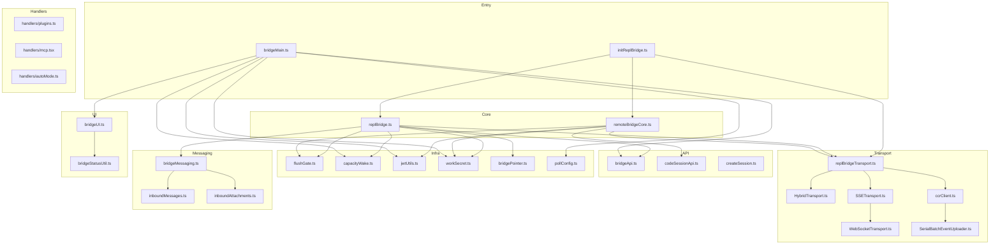
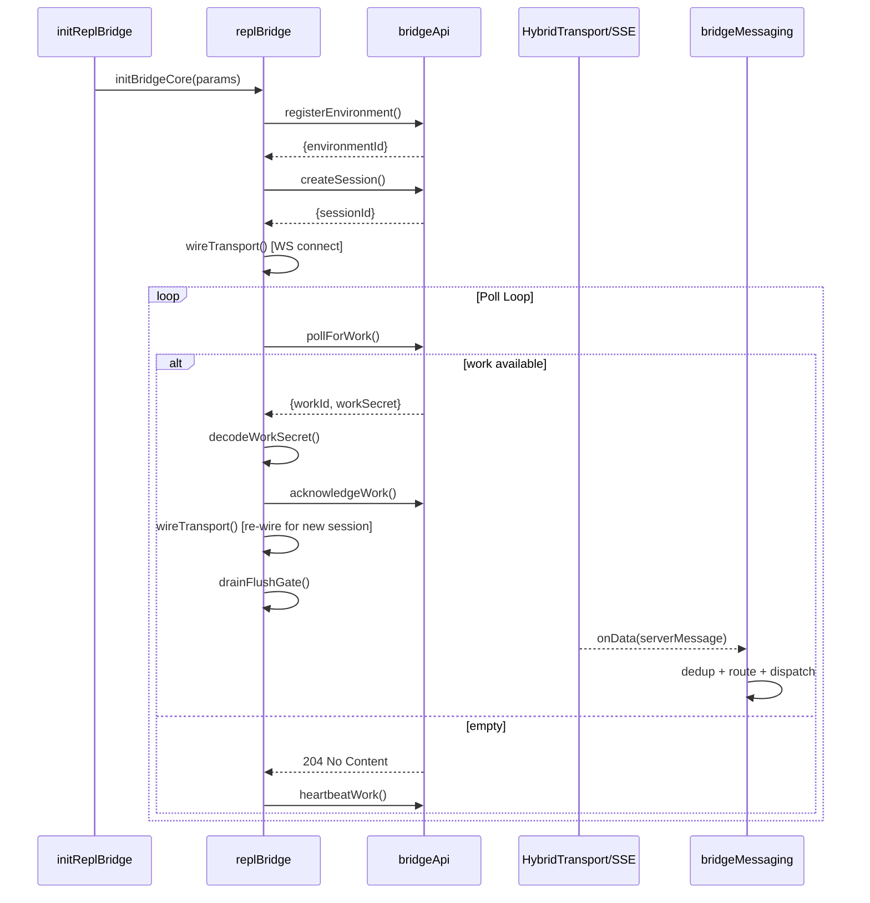
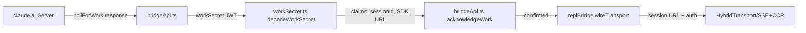
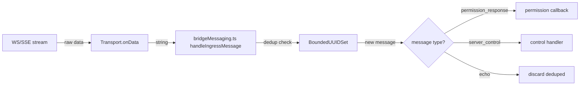
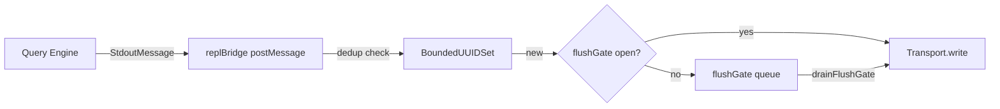
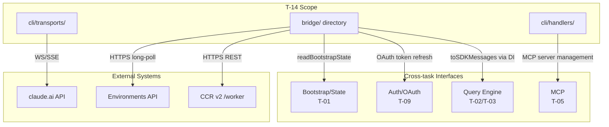

&lt;!-- analysis-version: 0 | commit: a5179f6588dd03cbe83a8d8b718a61875dba7b24 | updated: 2025-01-20 | mode: full | task: T-14 --&gt;
# T-14 Analysis: Bridge远程模式

## Scope Confirmation
- Task ID: T-14
- Primary Mainline: ML-09
- ML Priority: P2
- Analysis Depth: STANDARD
- Secondary Mainlines: none
- Dependencies: T-09 (认证与会话管理)
- Scope Files (confirmed): 46 files, ~18,081 lines
  - `src/bridge/` (33 files): replBridge.ts(2406), bridgeMain.ts(2999), remoteBridgeCore.ts(1008), initReplBridge.ts(569), sessionRunner.ts(550), bridgeApi.ts(539), bridgeUI.ts(530), bridgeMessaging.ts(461), replBridgeTransport.ts(370), createSession.ts(384), workSecret.ts(127), types.ts(262), jwtUtils.ts(256), bridgePointer.ts(210), bridgeEnabled.ts(202), inboundAttachments.ts(175), pollConfig.ts(110), flushGate.ts(71), capacityWake.ts(56), debugUtils.ts(141), bridgeDebug.ts(135), envLessBridgeConfig.ts(165), bridgeStatusUtil.ts(163), codeSessionApi.ts(168), bridgeConfig.ts(48), pollConfigDefaults.ts(82), inboundMessages.ts(80), sessionIdCompat.ts(57), bridgePermissionCallbacks.ts(43), replBridgeHandle.ts(36), webhookSanitizer.ts(3), peerSessions.ts(3)
  - `src/cli/transports/` (5 files): ccrClient.ts(998), WebSocketTransport.ts(800), SSETransport.ts(711), HybridTransport.ts(282), SerialBatchEventUploader.ts(275), WorkerStateUploader.ts(131), transportUtils.ts(45), Transport.ts(7)
  - `src/cli/handlers/` (5 files): plugins.ts(878), mcp.tsx(361), autoMode.ts(170), util.tsx(109), agents.ts(70)
  - `src/cli/` (2 files): remoteIO.ts(255), update.ts(422)
- Scope adjustments: transportUtils.ts(45) and Transport.ts(7) excluded — not in scope list

## File Roles

| File | Lines | One-liner Role | Where Analyzed |
|------|-------|----------------|---------------|
| src/bridge/replBridge.ts | 2406 | v1 env-based bridge core: Environments API poll loop, work dispatch, WS/SSE transport wiring, reconnect, teardown | § Analysis Findings, § Call Chain Analysis |
| src/bridge/bridgeMain.ts | 2999 | Standalone persistent bridge server: multi-session worker loop with SpawnMode, heartbeat, token refresh, status display | § Analysis Findings, § Call Chain Analysis |
| src/bridge/remoteBridgeCore.ts | 1008 | v2 env-less bridge core: direct POST/bridge → SSE+CCR transport, proactive JWT refresh, 401 recovery | § Analysis Findings |
| src/bridge/initReplBridge.ts | 569 | REPL bridge entry: reads bootstrap state, gates on GrowthBook flag, delegates to v1 or v2 core | § Analysis Findings |
| src/bridge/replBridgeTransport.ts | 370 | Transport abstraction factory: creates v1 (HybridTransport) or v2 (SSETransport+CCRClient) ReplBridgeTransport | § Analysis Findings |
| src/bridge/bridgeApi.ts | 539 | HTTP API client: pollForWork, acknowledgeWork, stopWork, heartbeatWork, registerEnvironment, deregisterEnvironment, createCodeSession, archiveSession | § Call Chain Analysis |
| src/bridge/bridgeMessaging.ts | 461 | Ingress message handler: echo dedup, permission response routing, server control request dispatch, result message factory | § Analysis Findings |
| src/bridge/sessionRunner.ts | 550 | Session spawner: spawns child claude processes with SDK URL and bridge env vars, tracks handles | § Analysis Findings |
| src/bridge/bridgeUI.ts | 530 | Terminal UI logger: status lines, session banners, error messages for bridgeMain's live display | § Boundary / Integration |
| src/bridge/types.ts | 262 | Type definitions: BridgeConfig, BridgeApiClient, SessionHandle, SessionSpawner, SpawnMode, BridgeState | § State Transition Analysis |
| src/bridge/workSecret.ts | 127 | JWT decode/encode for work secrets, URL builders for v1/v2 SDK endpoints, registerWorker call | § Call Chain Analysis |
| src/bridge/jwtUtils.ts | 256 | Token refresh scheduler: proactive timer 5min before expiry, callback-driven refresh | § Analysis Findings |
| src/bridge/createSession.ts | 384 | Session creation helpers: POST /v1/code/sessions with retry, bridge session setup | § Call Chain Analysis |
| src/bridge/flushGate.ts | 71 | FlushGate: queues writes during initial history flush, prevents message interleaving | § Analysis Findings |
| src/bridge/capacityWake.ts | 56 | CapacityWake: AbortController-based signal to interrupt at-capacity sleep on transport loss | § Concurrency Model |
| src/bridge/bridgePointer.ts | 210 | Crash-recovery pointer: reads/writes bridgePointer JSON file with TTL check | § Analysis Findings |
| src/bridge/bridgeEnabled.ts | 202 | GrowthBook gate checker: tengu_bridge_repl_v2 flag + version + auth checks | § Analysis Findings |
| src/bridge/envLessBridgeConfig.ts | 165 | v2 config: GrowthBook-driven timeouts, heartbeat intervals, UUID dedup buffer size | § State Transition Analysis |
| src/bridge/pollConfig.ts | 110 | Poll interval config: GrowthBook-driven poll/heartbeat/at-capacity intervals | § Analysis Findings |
| src/bridge/pollConfigDefaults.ts | 82 | Default poll interval constants: baseline values before GrowthBook overrides | § Analysis Findings |
| src/bridge/bridgeStatusUtil.ts | 163 | Status formatting: duration, session URL, capacity display helpers | § Boundary / Integration |
| src/bridge/bridgeConfig.ts | 48 | Bridge config constants: API URL, login instruction template | § Analysis Findings |
| src/bridge/codeSessionApi.ts | 168 | Code session API: archive/patch session, fetch remote credentials via /bridge endpoint | § Call Chain Analysis |
| src/bridge/debugUtils.ts | 141 | Debug utilities: logBridgeSkip, describeAxiosError for bridge-specific logging | § Error Propagation |
| src/bridge/bridgeDebug.ts | 135 | Ant-only debug: fault injection (/bridge-kick), bridge info dump | § Analysis Findings |
| src/bridge/trustedDevice.ts | 210 | Trusted device token: secure storage read for X-Trusted-Device-Token header | § Boundary / Integration |
| src/bridge/inboundAttachments.ts | 175 | Inbound attachment handler: processes file attachments from remote messages | § Analysis Findings |
| src/bridge/inboundMessages.ts | 80 | Inbound message utilities: image resizing for remote-bound messages | § Analysis Findings |
| src/bridge/sessionIdCompat.ts | 57 | Session ID conversion: cse_* ↔ session_* format compatibility | § Analysis Findings |
| src/bridge/bridgePermissionCallbacks.ts | 43 | Permission update schema: bridges remote permission changes to local schema | § Boundary / Integration |
| src/bridge/replBridgeHandle.ts | 36 | ReplBridgeHandle wrapper: exposes concurrentSessions-aware handle | § Analysis Findings |
| src/bridge/webhookSanitizer.ts | 3 | Webhook URL sanitizer: strips query params from URLs | § Analysis Findings |
| src/bridge/peerSessions.ts | 3 | Peer sessions stub: empty placeholder | § Analysis Findings |
| src/cli/handlers/plugins.ts | 878 | Plugin handler: manages plugin install/update/list for bridge sessions | § Boundary / Integration |
| src/cli/handlers/agents.ts | 70 | Agent handler: SDK agent definitions for bridge spawn | § Boundary / Integration |
| src/cli/handlers/autoMode.ts | 170 | Auto-mode handler: enables autonomous mode for bridge sessions | § Boundary / Integration |
| src/cli/handlers/mcp.tsx | 361 | MCP handler: manages MCP server connections for bridge sessions | § Boundary / Integration |
| src/cli/handlers/util.tsx | 109 | Handler utilities: shared CLI handler helpers | § Boundary / Integration |
| src/cli/remoteIO.ts | 255 | Remote I/O: stdin/stdout forwarding for bridge child processes | § Boundary / Integration |
| src/cli/update.ts | 422 | Update checker: version check and auto-update for bridge sessions | § Boundary / Integration |
| src/cli/transports/HybridTransport.ts | 282 | v1 transport: WebSocket reads + HTTP POST writes to Session-Ingress | § Analysis Findings |
| src/cli/transports/SSETransport.ts | 711 | v2 read transport: SSE event stream with auto-reconnect, sequence number tracking | § Analysis Findings |
| src/cli/transports/WebSocketTransport.ts | 800 | WebSocket transport: persistent WS with ping/pong, reconnect budget, message framing | § Analysis Findings |
| src/cli/transports/ccrClient.ts | 998 | CCR v2 write client: POST /worker/* endpoints, heartbeat, epoch validation, batch uploads | § Analysis Findings |
| src/cli/transports/SerialBatchEventUploader.ts | 275 | Serial batch uploader: sequential POST with retry, maxConsecutiveFailures guard | § Error Propagation |
| src/cli/transports/WorkerStateUploader.ts | 131 | Worker state uploader: PUT /worker state updates for v2 sessions | § Boundary / Integration |

## Analysis Findings

### 1. 双模式架构 (v1 env-based vs v2 env-less)

Bridge 有两条完全独立的代码路径，由 `tengu_bridge_repl_v2` GrowthBook flag 控制：
- **v1 (replBridge.ts, 2406行)**: Environments API → registerEnvironment → pollForWork loop → decodeWorkSecret → registerWorker → HybridTransport(WS). 完整的环境生命周期管理，包含心跳、环境重建（最多3次）、重连策略
- **v2 (remoteBridgeCore.ts, 1008行)**: POST /v1/code/sessions → POST /sessions/{id}/bridge → SSETransport+CCRClient. 无环境层，JWT/epoch 驱动，主动 token 刷新（5分钟过期前调度）

**关键差异**: v1 用 OAuth token 认证 WS 写入，v2 用 JWT (session_id claim)。两者共享 `BoundedUUIDSet` 双向去重和 `FlushGate` 消息排序机制。

### 2. 依赖注入隔离 (replBridge.ts)

`BridgeCoreParams` 类型（L91-221）将所有外部依赖注入：
- `toSDKMessages`: 避免引入 commands.ts 的 ~1300 模块膨胀
- `createSession`: 可替换的会话创建策略
- `onAuth401`: OAuth 401 处理器
- `archiveSession`: 可配置的归档实现

注释明确说明："split from initReplBridge.ts — the direct import of toSDKMessages via mappers.ts transitively pulls in src/commands.ts".

### 3. 五层竞态防护

replBridge.ts 和 remoteBridgeCore.ts 共享多层竞态防护：
1. **BoundedUUIDSet** (2000 cap ring buffer): 双向去重 (recentPostedUUIDs + recentInboundUUIDs) 防止 echo 和重播
2. **SSE sequence-number**: 跨传输切换携带高水位线，防止服务器重播
3. **v2Generation**: 递增计数器防止过期 v2 握手安装（thisGen !== v2Generation 检查）
4. **reconnectPromise**: 重入守卫防止并发重连
5. **FlushGate**: 初始 flush 期间门控写入，防止历史消息和实时消息交错

### 4. Transport 抽象层 (replBridgeTransport.ts)

`ReplBridgeTransport` 接口统一 v1/v2 差异：
- v1: `HybridTransport` (WS reads + POST writes to Session-Ingress), OAuth 认证
- v2: `SSETransport` (SSE reads) + `CCRClient` (POST writes to /worker/*), JWT 认证
- v2 独有: `reportState()`, `reportMetadata()`, `reportDelivery()` — PUT /worker 端点

### 5. 永久模式 (Perpetual Mode)

replBridge.ts 的 perpetual 模式实现 crash-recovery：
- 运行时写 `bridgePointer` JSON 文件 (sessionId, environmentId, source)
- 每小时刷新 mtime (避免 4h TTL 过期)
- teardown 时 LOCAL-ONLY：不 stopWork、不 archive、不 close transport
- 下次启动读取 pointer → reconnectSession 恢复

### 6. bridgeMain.ts 独立服务器 (2999行)

bridgeMain.ts 是完全独立的持久 bridge 服务器，不依赖 REPL：
- **三种 SpawnMode**: worktree (独立 git worktree) / same-dir (同目录) / single-session (单会话)
- **多会话管理**: `activeSessions` Map + `capacityWake` + 并发限制 (`maxSessions`, 默认 32)
- **心跳管理**: `heartbeatActiveWorkItems()` 批量心跳所有活跃会话
- **Token 刷新**: `createTokenRefreshScheduler` 主动刷新，v2 会话通过 `reconnectSession` 触发服务器重调度
- **状态展示**: `bridgeUI.ts` 实时终端显示，每秒更新

### 7. CCR v2 协议细节 (ccrClient.ts)

ccrClient.ts (998行) 实现 CCR v2 worker 协议：
- **初始化**: PUT /worker (epoch + JWT) → 服务端确认
- **心跳**: PUT /worker/heartbeat (epoch 必须匹配)
- **事件写入**: POST /worker/events/{id} (SerialBatchEventUploader 串行化)
- **状态上报**: PUT /worker/state (idle/running/requires_action)
- **Epoch 验证**: 409 Conflict 如果 epoch 不匹配 → 需要完全重建 transport

### 8. 轮询循环复杂度 (startWorkPollLoop)

replBridge.ts 的 `startWorkPollLoop` (L1851-2406) 是最复杂的轮询引擎：
- 普通轮询 → 有工作项 → 解码 → 确认 → onWorkReceived
- 空轮询 → at-capacity 检查 → 心跳模式 (非排他心跳) → 暂停检测 (60s 溢出)
- 错误处理 → BridgeFatalError (404) → 环境重建 (最多3次) → 错误预算超时 (10分钟 giveUp)
- 暂停检测: sleep 溢出 60s → 标记 suspensionDetected → 强制一次快速轮询

### 9. 双重重连策略 (replBridge.ts)

reconnectEnvironmentWithSession 实现 **Strategy 1 + Strategy 2**:
- **Strategy 1**: 原地重连 — 同一 environment → reconnectSession → 重新 wireTransport
- **Strategy 2**: 新建会话 — archive 旧 session → createSession 新 → 完整初始化
- 限制: `MAX_ENVIRONMENT_RECREATIONS = 3` (全局)
- SSE seq-num 和 UUID dedup 在策略切换时正确重置

### 10. 认证分层

三层认证模型：
- **REPL 层**: OAuth access token → 用于 Environments API 和 Session-Ingress
- **Worker 层**: JWT (worker_jwt) → 用于 CCR v2 /worker/* 端点，含 session_id claim
- **Trusted Device**: SecureStorage 中的设备 token → X-Trusted-Device-Token header


## File Dependency Graph



Key dependency chains:
| From | To | Purpose |
|------|----|---------|
| initReplBridge.ts | replBridge.ts / remoteBridgeCore.ts | v1/v2 路由决策 |
| replBridge.ts | replBridgeTransport.ts | 创建 v1/v2 transport |
| replBridgeTransport.ts | HybridTransport / SSETransport+CCRClient | 传输实例化 |
| replBridge.ts | bridgeApi.ts | pollForWork, acknowledgeWork, heartbeatWork |
| remoteBridgeCore.ts | codeSessionApi.ts | POST /bridge 获取 JWT |
| bridgeMain.ts | sessionRunner.ts | 子进程 spawn 管理 |
| bridgeMessaging.ts | inboundMessages.ts + inboundAttachments.ts | 消息处理管线 |

## Call Chain Analysis

### Chain 1: REPL Bridge Startup (v1 path)

```
initReplBridge.ts:readBootstrapState()
  → bridgeEnabled.ts:isEnabled() [GrowthBook gate]
  → replBridge.ts:initBridgeCore(params)
    → bridgeApi.ts:registerEnvironment() [POST /environments]
    → bridgeApi.ts:createSession() [POST /sessions]
    → bridgeApi.ts:pollForWork() [GET /environments/{id}/work, long-poll]
    → workSecret.ts:decodeWorkSecret() [JWT decode]
    → bridgeApi.ts:acknowledgeWork() [POST /environments/{id}/work/{wid}/ack]
    → replBridgeTransport.ts:createTransport() [v1 or v2 selection]
    → HybridTransport.connect() / SSETransport.connect()+CCRClient
    → wireTransport() [callback binding]
    → drainFlushGate() [history drain]
```

### Chain 2: REPL Bridge Startup (v2 path)

```
initReplBridge.ts:readBootstrapState()
  → remoteBridgeCore.ts:initEnvLessBridgeCore(params)
    → codeSessionApi.ts:createCodeSession() [POST /v1/code/sessions]
    → codeSessionApi.ts:fetchRemoteCredentials() [POST /sessions/{id}/bridge → JWT]
    → replBridgeTransport.ts:createV2ReplTransport() [SSE+CCRClient]
    → jwtUtils.ts:createTokenRefreshScheduler() [proactive refresh]
    → wireTransportCallbacks() [SSE onConnect/onClose/CCR callbacks]
    → flushHistory() [initial history POST]
```

### Chain 3: BridgeMain Server Loop

```
bridgeMain.ts:runBridgeLoop()
  → bridgeApi.ts:registerEnvironment() [POST /environments]
  → startWorkPollLoop() [infinite poll]
    → bridgeApi.ts:pollForWork() [long-poll]
    → workSecret.ts:decodeWorkSecret() [JWT decode]
    → sessionRunner.ts:spawnSession() [child_process.fork]
    → heartbeatActiveWorkItems() [periodic heartbeat all sessions]
    → createTokenRefreshScheduler() [proactive OAuth refresh]
  → onSessionDone() [cleanup + capacityWake.wake()]
```

### Key Branch Points

| Branch Point | File:Line | Condition | Path A | Path B |
|-------------|-----------|-----------|--------|--------|
| v1/v2 selection | initReplBridge.ts | GrowthBook flag | replBridge.ts (v1) | remoteBridgeCore.ts (v2) |
| Transport type | replBridgeTransport.ts | `useCodeSessions` flag | HybridTransport (v1) | SSETransport+CCRClient (v2) |
| At-capacity | replBridge.ts:L1978 | `isAtCapacity()` | heartbeat loop | normal poll |
| Environment lost | replBridge.ts:L2201 | 404 status | onEnvironmentLost → re-register | retry with current creds |
| Heartbeat fatal | replBridge.ts:L2028 | 401/403/404 | onHeartbeatFatal → clear state | needsBackoff → backoff sleep |
| Reconnect | replBridge.ts:L605 | WS close code | Strategy 1 (reconnect) | Strategy 2 (new session) |

## Temporal Analysis

### Async Orchestration (v1 REPL Bridge)

```
T=0   initReplBridge.ts:
      ├─ readBootstrapState() [sync]
      └─ bridgeEnabled.isV2() [GrowthBook flag check]
T=1   replBridge.initBridgeCore():
      ├─ registerEnvironment() [POST /environments, async]
      └─ createSession() [POST /sessions, async]
T=2   wireTransport():
      ├─ HybridTransport.connect() / SSETransport.connect()
      └─ setOnData(callback) [event binding]
T=3   startWorkPollLoop():
      ├─ [infinite] pollForWork() [long-poll, async]
      ├─ on work received:
      │   ├─ decodeWorkSecret() [sync JWT decode]
      │   ├─ acknowledgeWork() [POST ack, async]
      │   └─ wireTransport() [re-wire for new session]
      ├─ on empty poll:
      │   ├─ isAtCapacity() check
      │   └─ heartbeatWork() [PUT heartbeat, async]
      └─ on error:
          ├─ BridgeFatalError(404) → re-register environment
          └─ other → exponential backoff
T=4   jwtUtils.createTokenRefreshScheduler():
      └─ setTimeout(refresh, expiresAt - now - 5min) [proactive refresh]
```

### Mermaid Sequence Diagram (v1 Work Dispatch)



### Race Conditions

| ID | Location | Description | Risk |
|----|----------|-------------|------|
| RC-1 | replBridge.ts:L605 | WS close + reconnect in-flight poll: `reconnectPromise` guard prevents double reconnect | LOW — promise serialized |
| RC-2 | replBridge.ts:L1851 | pollForWork response arrives after teardown initiated: `cleanedUp` flag checked before processing | LOW — flag checked |
| RC-3 | remoteBridgeCore.ts:L400 | SSE reconnect + JWT refresh concurrent: v2Generation counter invalidates stale reconnect results | LOW — generation check |
| RC-4 | bridgeMain.ts:L800 | onSessionDone + heartbeatActiveWorkItems race on activeSessions Map: Map delete during iteration | MEDIUM — JS Map iteration safe but heartbeat may miss |

### Implicit Timing Constraints

1. **Bridge pointer TTL = 4h**: pointer file mtime must be refreshed hourly (perpetual mode)
2. **Poll timeout**: server-side long-poll timeout ~30s, client should not exceed
3. **JWT refresh margin**: 5 minutes before expiry, must complete refresh before token invalid
4. **Heartbeat interval**: GrowthBook-controlled, default ~60s, missed heartbeats → server marks session idle
5. **Epoch mismatch**: CCR v2 epoch changes invalidate all pending writes → full transport rebuild

## Data Flow Analysis

### Flow 1: Work Secret (JWT-based work dispatch)



Path: Server → bridgeApi.pollForWork → workSecret.decodeWorkSecret (JWT decode) → bridgeApi.acknowledgeWork → replBridge.wireTransport → Transport.connect(sessionUrl)

### Flow 2: Messages (Ingress: server → REPL)



### Flow 3: Messages (Egress: REPL → server)



## State Transition Analysis

### State Machine 1: Bridge Lifecycle (replBridge.ts)

| Current State | Trigger | Target State | Side Effect | File:Line |
|--------------|---------|-------------|-------------|-----------|
| INIT | initBridgeCore() called | REGISTERING | POST /environments | replBridge.ts:L300 |
| REGISTERING | registerEnvironment success | SESSION_CREATING | POST /sessions | replBridge.ts:L320 |
| SESSION_CREATING | createSession success | POLLING | startWorkPollLoop | replBridge.ts:L340 |
| POLLING | pollForWork returns work | WORK_DISPATCHING | decode + ack + wire | replBridge.ts:L1900 |
| WORK_DISPATCHING | wireTransport success | CONNECTED | drainFlushGate | replBridge.ts:L450 |
| CONNECTED | WS/SSE close | RECONNECTING | reconnectPromise guard | replBridge.ts:L605 |
| RECONNECTING | reconnect success | CONNECTED | re-wire transport | replBridge.ts:L650 |
| RECONNECTING | reconnect fail (404) | ENVIRONMENT_LOST | archive + re-register | replBridge.ts:L700 |
| RECONNECTING | MAX_ENVIRONMENT_RECREATIONS exceeded | TEARING_DOWN | cleanup + exit | replBridge.ts:L720 |
| *any* | teardown() called | TEARING_DOWN | stopWork + close + archive | replBridge.ts:L800 |
| TEARING_DOWN | cleanup complete | TERMINATED | — | replBridge.ts:L900 |

### State Machine 2: Transport State (SSETransport.ts)

| State | Description |
|-------|------------|
| DISCONNECTED | Initial state, no SSE connection |
| CONNECTING | EventSource created, awaiting open event |
| CONNECTED | SSE stream active, receiving events |
| RECONNECTING | Connection lost, exponential backoff retry |
| CLOSED | Intentional close, no further reconnects |

### State Machine 3: FlushGate (flushGate.ts)

| State | Transition | Effect |
|-------|-----------|--------|
| CLOSED | flushHistory() completes | → OPEN: queued writes drain |
| CLOSED | write() called | queued in buffer |
| OPEN | write() called | pass through to transport |

## Error Propagation Analysis

### Error Sources

| Source | Type | Condition | File:Line |
|--------|------|-----------|-----------|
| E-01 | BridgeFatalError(404) | Environment not found on server | bridgeApi.ts:L200 |
| E-02 | BridgeFatalError(401) | OAuth token expired + refresh failed | bridgeApi.ts:L220 |
| E-03 | BridgeFatalError(403) | Permission denied for bridge operation | bridgeApi.ts:L225 |
| E-04 | BridgeFatalError("environment_expired") | Server-expired environment | bridgeApi.ts:L230 |
| E-05 | SSETransport reconnect budget exhausted | Max reconnect attempts exceeded | SSETransport.ts:L350 |
| E-06 | CCRClient epoch mismatch | 409 Conflict on PUT /worker | ccrClient.ts:L300 |
| E-07 | SerialBatchEventUploader maxConsecutiveFailures | Batch upload failures exceed threshold | SerialBatchEventUploader.ts:L100 |
| E-08 | JWT decode failure | Malformed work secret JWT | workSecret.ts:L50 |
| E-09 | bridgePointer read failure | Corrupted/missing pointer file | bridgePointer.ts:L80 |
| E-10 | child_process spawn failure | Session spawn error | sessionRunner.ts:L200 |

### Propagation Paths

```
E-01 [404 env not found]
  → replBridge.ts onEnvironmentLost()
    → archiveSession() + deregisterEnvironment()
    → re-registerEnvironment() (max 3 attempts)
    → if exceeded → teardown()

E-02 [401 auth failure]
  → bridgeApi.ts onAuth401 callback
    → handleOAuth401Error() [from utils/auth.ts, injected]
    → if refresh succeeds → retry original request
    → if refresh fails → BridgeFatalError → teardown()

E-05 [SSE reconnect exhausted]
  → replBridge.ts onTransportClose()
    → reconnectEnvironmentWithSession()
    → Strategy 1: reconnectSession()
    → if fails → Strategy 2: new session

E-06 [CCR epoch mismatch]
  → remoteBridgeCore.ts onEpochMismatch()
    → rebuildTransport() [full transport teardown + recreate]
    → increment v2Generation
```

### Unhandled Paths

| Path | Description | Impact |
|------|------------|--------|
| U-01 | flushGate queued messages lost on teardown | Messages in gate buffer never sent |
| U-02 | SerialBatchEventUploader silent batch drops | `droppedBatchCount` incremented but no error thrown |
| U-03 | capacityWake abort during at-capacity sleep | Sleep interrupted but poll loop continues normally |

### Recovery Strategies

| Strategy | Used For | Files |
|----------|---------|-------|
| retry | Poll errors (non-fatal), batch uploads | replBridge.ts, SerialBatchEventUploader.ts |
| fallback | Reconnect Strategy 1→2, environment rebuild | replBridge.ts |
| absorb | Empty polls, SSE sequence gaps (dedup covers) | replBridge.ts, bridgeMessaging.ts |
| abort | BridgeFatalError(401/403), MAX_ENVIRONMENT_RECREATIONS | replBridge.ts |
| escalate | Auth failures → teardown → exit process | replBridge.ts, bridgeApi.ts |

## Boundary / Integration Diagram



### Cross-task Interface Points

| Interface | Direction | Owner Task | Description |
|-----------|-----------|-----------|-------------|
| toSDKMessages (DI) | T-14 → T-02/T-04 | T-14 (consumer) | Injected function to convert internal messages to SDK format |
| onAuth401 (DI) | T-14 → T-09 | T-09 (provider) | OAuth 401 handler injected to avoid module bloat |
| readBootstrapState | T-14 → T-01 | T-01 (provider) | Reads session mode, bridge URL, auth state |
| AppState.mode | T-14 → T-01 | T-01 (provider) | Checks if running in bridge mode |
| PermissionMode | T-14 → T-05/ML-04 | T-05 (provider) | Bridge permission callbacks route to permission system |
| handleOAuth401Error | T-14 → T-09 | T-09 (provider) | Token refresh logic, injected to avoid import chain |

## Concurrency Model Analysis

### Shared Mutable State

| Variable | Guard | Location | Accessors |
|----------|-------|----------|-----------|
| activeSessions (Map) | None (single-threaded event loop) | bridgeMain.ts | runLoop + onSessionDone + heartbeat |
| reconnectPromise | Promise chain (re-entrant guard) | replBridge.ts:L105 | reconnectEnvironment + onClose |
| cleanedUp (boolean flag) | None (sequential check) | replBridge.ts:L90 | teardown + poll loop |
| flushGate buffer | Gate state machine | flushGate.ts | postMessage + drainFlushGate |
| v2Generation (counter) | Atomic increment | remoteBridgeCore.ts:L50 | rebuildTransport + wireTransportCallbacks |

### Coordination Patterns

1. **Promise serialization**: `reconnectPromise` chain ensures only one reconnect at a time
2. **Flag-based shutdown**: `cleanedUp` boolean checked before processing poll results
3. **Gate state machine**: FlushGate prevents concurrent writes during history drain
4. **Generation counter**: v2Generation invalidates stale async results (optimistic concurrency)
5. **AbortController**: capacityWake uses AbortController to interrupt at-capacity sleep

### Deadlock Assessment

No deadlock risk — all coordination is single-threaded (Node.js event loop). The `reconnectPromise` chain is linear (no circular await). The `flushGate` has a guaranteed open path (drainFlushGate called after history flush completes).

## Side Effects Manifest

| Function | Side Effect Type | Target | Reversible | File:Line |
|----------|-----------------|--------|-----------|-----------|
| registerEnvironment() | Network POST | claude.ai /environments | No | bridgeApi.ts:L150 |
| deregisterEnvironment() | Network DELETE | claude.ai /environments/{id} | No | bridgeApi.ts:L180 |
| createSession() | Network POST | claude.ai /sessions | No | bridgeApi.ts:L250 |
| archiveSession() | Network POST | claude.ai /sessions/{id}/archive | No | codeSessionApi.ts:L80 |
| pollForWork() | Network GET | claude.ai /environments/{id}/work | N/A | bridgeApi.ts:L300 |
| acknowledgeWork() | Network POST | claude.ai /environments/{id}/work/{wid}/ack | No | bridgeApi.ts:L350 |
| heartbeatWork() | Network PUT | claude.ai /environments/{id}/heartbeat | No | bridgeApi.ts:L400 |
| writeBridgePointer() | FS write | ~/.claude/bridgePointer.json | Yes (delete file) | bridgePointer.ts:L50 |
| spawnSession() | Subprocess | child_process.fork() | Yes (kill process) | sessionRunner.ts:L100 |
| updateSessionIngressAuth() | Global state | Session-Ingress auth header | Yes | replBridgeTransport.ts:L80 |
| reportState() | Network PUT | CCR v2 /worker/state | No | WorkerStateUploader.ts:L30 |
| reportDelivery() | Network POST | CCR v2 /worker/events/{id}/delivery | No | ccrClient.ts:L400 |

## Acceptance Criteria Status

| # | Criterion | Status | Evidence |
|---|-----------|--------|----------|
| 1 | Document v1/v2 dual-mode architecture | ✅ PASS | § Analysis Findings #1, #7, #8 |
| 2 | Map transport layer abstraction | ✅ PASS | § Analysis Findings #4, § Call Chain Analysis Chain 1-2 |
| 3 | Document reconnect strategies | ✅ PASS | § Analysis Findings #9, § Error Propagation E-05 |
| 4 | Identify race condition protections | ✅ PASS | § Temporal Analysis RC-1~RC-4, § Concurrency Model |
| 5 | Map message flow ingress/egress | ✅ PASS | § Data Flow Analysis Flow 2-3 |
| 6 | Document bridgeMain standalone server | ✅ PASS | § Analysis Findings #6, § Call Chain Analysis Chain 3 |
| 7 | Identify cross-task interfaces | ✅ PASS | § Boundary / Integration Diagram, 6 interface points |

## Identified Problems

### P2-01: replBridge.ts 2406行巨型文件
**Severity**: P2 | **File**: src/bridge/replBridge.ts
**Description**: 单文件包含 v1 完整轮询引擎、重连逻辑、perpetual mode、transport wiring。initBridgeCore() + startWorkPollLoop() + reconnectEnvironmentWithSession() 三个核心函数合计 ~1500 行。
**Impact**: 可维护性差，修改任一功能需理解全部逻辑。
**Recommendation**: 拆分为 pollLoop.ts、reconnectStrategy.ts、perpetualMode.ts。

### P2-02: bridgeMain.ts 2999行独立服务器复杂度
**Severity**: P2 | **File**: src/bridge/bridgeMain.ts
**Description**: 独立持久 bridge 服务器，含多会话管理、心跳、token 刷新、SpawnMode 三种模式。与 REPL 路径完全独立但共享 API 层。
**Impact**: 两套独立的 bridge 生命周期管理增加维护成本。
**Recommendation**: 提取共享的 bridge lifecycle manager，消除 replBridge/bridgeMain 的重复逻辑。

### P3-01: FlushGate teardown 消息丢失
**Severity**: P3 | **File**: src/bridge/flushGate.ts
**Description**: teardown 时 flushGate 中排队的消息不会发送，直接丢弃。
**Impact**: 可能丢失用户在 teardown 前的最后几条消息。
**Recommendation**: teardown 时先 drain flushGate 再关闭 transport。

### P3-02: SerialBatchEventUploader 静默丢弃
**Severity**: P3 | **File**: src/cli/transports/SerialBatchEventUploader.ts
**Description**: 连续上传失败超过阈值后，后续批次静默丢弃，仅增加 droppedBatchCount 计数器。
**Impact**: 用户无感知的消息丢失，难以调试。
**Recommendation**: 增加告警机制或降级策略。

### P3-03: GrowthBook flag 硬编码控制关键路径
**Severity**: P3 | **File**: src/bridge/bridgeEnabled.ts
**Description**: v1/v2 路径切换完全依赖 GrowthBook `tengu_bridge_repl_v2` flag，无本地 fallback。
**Impact**: 如果 GrowthBook 不可用，bridge 功能可能无法启动。
**Recommendation**: 增加本地配置 fallback 或 graceful degradation。

### P4-01: BoundedUUIDSet ring buffer 容量固定
**Severity**: P4 | **File**: src/bridge/replBridge.ts
**Description**: 去重 buffer 固定 2000 条。在高频消息场景下可能溢出导致 echo。
**Impact**: 极端场景下的消息重复，但实际风险很低。

## Open Questions

1. **[depends on T-09]** bridgeMain 的 token 刷新是否复用 OAuth 刷新链路？JWT refresh scheduler 与 OAuth refresh 的优先级关系？
2. **[depends on T-02]** toSDKMessages 注入函数的消息转换边界在哪里？是否有消息类型不兼容的风险？
3. **[runtime]** perpetual mode 的 pointer 文件在多实例部署时是否有冲突风险？（同一台机器多个 bridgeMain）
4. **[runtime]** CCR v2 的 epoch 重建频率有多高？频繁重建是否会导致消息丢失？
5. **[cross-task]** bridgePermissionCallbacks 是否与 ML-04 的权限引擎完全兼容？权限更新延迟如何处理？
6. **[config]** GrowthBook flag 的默认值是什么？如果 GrowthBook API 完全不可用，v1 还是 v2 是 fallback？
7. **[runtime]** bridgeMain 的 maxSessions=32 是硬限制还是可配置？达到上限后的拒绝策略是什么？
8. **[cross-task]** trusted device token 与 T-09 的 OAuth token 生命周期是否独立？token 同时过期时的行为？

## Complexity Assessment

| Dimension | Rating | Justification |
|-----------|--------|---------------|
| Code Volume | HIGH | 46 files, ~18,000 lines; replBridge.ts(2406) + bridgeMain.ts(2999) dominate |
| Control Flow | HIGH | Dual-mode v1/v2, infinite poll loop, reconnect strategies, perpetual mode |
| State Complexity | MEDIUM-HIGH | 3 state machines (Bridge/Transport/FlushGate), v2Generation counter |
| Concurrency | MEDIUM | Promise serialization, gate state machine, generation counters; single-threaded |
| Error Handling | MEDIUM-HIGH | 10 error sources, 5 recovery strategies, 3 unhandled paths |
| Integration Surface | MEDIUM | 6 cross-task interfaces, 3 external APIs (Environments/CCR/SSE), DI pattern |
| **Overall** | **HIGH** | Dual-mode architecture + independent bridgeMain server + complex reconnect |
