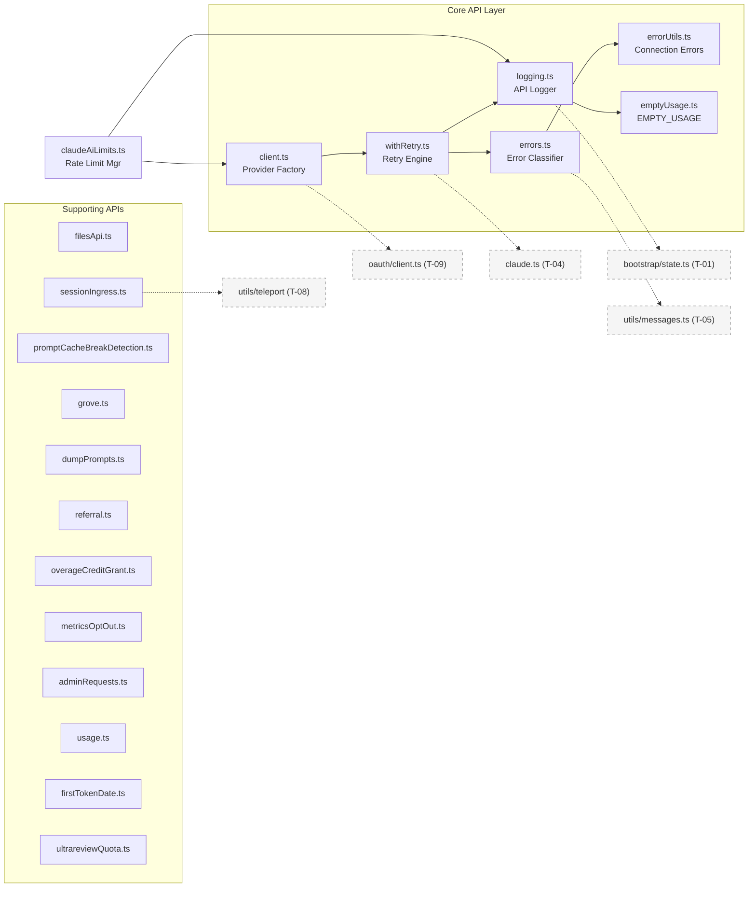
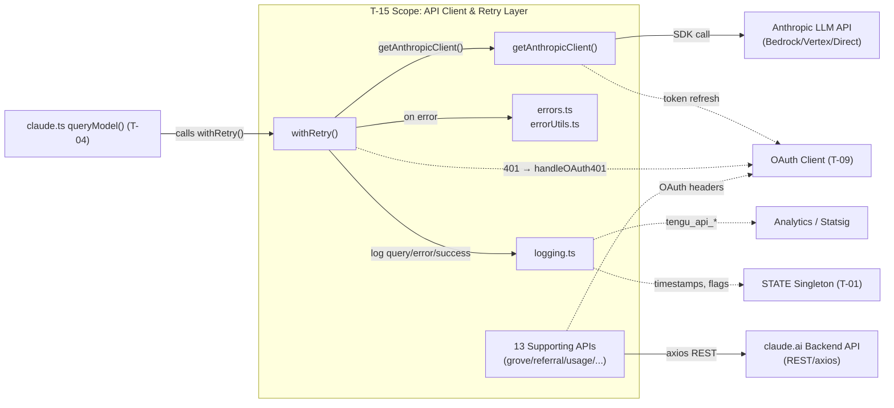
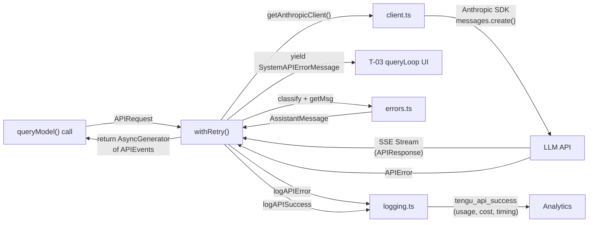
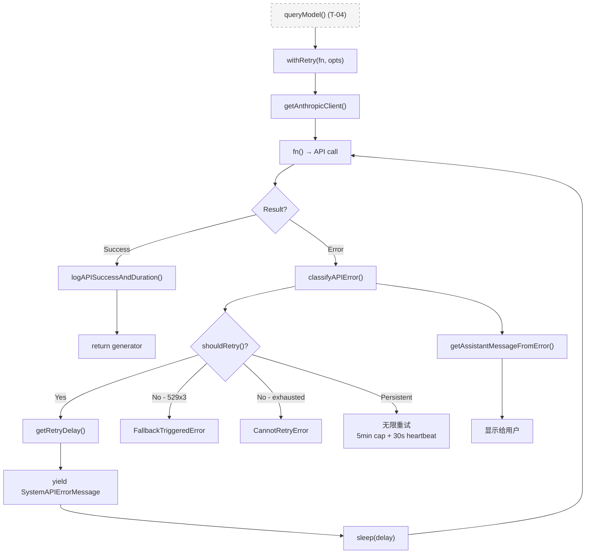
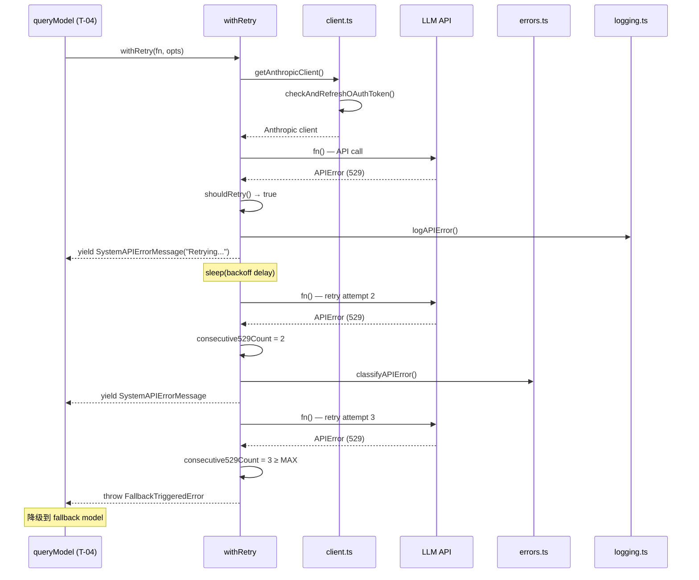

<!-- analysis-version: 0 | commit: a5179f6 | updated: 2025-07-27 | mode: full | task: T-15 -->
# T-15 Analysis: API客户端与重试层

## Scope Confirmation
- Task ID: T-15
- Primary Mainline: ML-10
- ML Priority: P2
- Analysis Depth: STANDARD
- Secondary Mainlines: 无
- Scope Files (confirmed): 19 files, 7,432 lines total
- Scope adjustments: 无（所有文件存在且可读）
- Dependencies: T-03 (query loop 调用 withRetry)

**Core Files (6)**:
- `src/services/api/client.ts` (389行) — Anthropic SDK 客户端工厂
- `src/services/api/withRetry.ts` (822行) — 核心重试引擎
- `src/services/api/errors.ts` (1207行) — 错误分类与用户消息映射
- `src/services/api/errorUtils.ts` (260行) — 连接错误/SSL 错误工具集
- `src/services/api/logging.ts` (788行) — API 查询/错误/成功日志记录
- `src/services/api/filesApi.ts` (748行) — Files API 下载/上传客户端

**Supporting Files (13)**:
- `src/services/api/promptCacheBreakDetection.ts` (727行) — prompt cache 中断检测与诊断
- `src/services/api/sessionIngress.ts` (514行) — 会话日志上传至后端
- `src/services/api/grove.ts` (357行) — Grove 功能开关/通知服务
- `src/services/api/dumpPrompts.ts` (226行) — API 请求 dump（ant 用户调试用）
- `src/services/api/referral.ts` (281行) — 推荐计划 API
- `src/services/api/overageCreditGrant.ts` (137行) — 超额信用赠金 API
- `src/services/api/metricsOptOut.ts` (159行) — 遥测开关状态查询
- `src/services/api/adminRequests.ts` (119行) — 管理员请求 API
- `src/services/api/usage.ts` (63行) — 用量/限额查询
- `src/services/api/firstTokenDate.ts` (60行) — 首次 token 日期缓存
- `src/services/api/ultrareviewQuota.ts` (38行) — ultrareview 配额查询
- `src/services/api/emptyUsage.ts` (22行) — 零值 Usage 常量
- `src/services/claudeAiLimits.ts` (515行) — Claude.ai 订阅用户限额管理

## File Roles

| File | Lines | One-liner Role | Where Analyzed |
|------|-------|----------------|---------------|
| src/services/api/client.ts | 389 | 四路 Provider 工厂：根据环境变量路由到 Bedrock/Foundry/Vertex/Direct Anthropic SDK 客户端，含认证头注入、代理配置、请求 ID | STANDARD: § 关键路径与组件 |
| src/services/api/withRetry.ts | 822 | 核心重试引擎：AsyncGenerator 模式，最多 10 次重试，529 过载退避、Fast Mode cooldown、persistent retry、OAuth 401 刷新、FallbackTriggeredError 模型降级 | STANDARD: § 关键路径与组件, § 调用链概要, § 错误处理概要, § 状态概要 |
| src/services/api/errors.ts | 1207 | 错误→用户消息映射 + 错误分类：getAssistantMessageFromError（500+ 行 if-else 链）+ classifyAPIError（20+ 错误类型）+ getErrorMessageIfRefusal | STANDARD: § 关键路径与组件, § 错误处理概要 |
| src/services/api/errorUtils.ts | 260 | 连接错误工具集：SSL/TLS 错误码识别、cause chain 遍历、HTML 消息清洗、deserialized APIError 消息提取 | STANDARD: § 关键路径与组件 |
| src/services/api/logging.ts | 788 | API 三阶段日志：logAPIQuery（查询发起）+ logAPIError（含 gateway 检测、OTel span）+ logAPISuccessAndDuration（含 usage/cache 指标） | STANDARD: § 关键路径与组件 |
| src/services/api/filesApi.ts | 748 | Anthropic Files API 客户端：文件上传（multipart）+ 下载，带 OAuth 头、进度报告、幂等上传 | STANDARD: § 关键路径与组件 |
| src/services/api/promptCacheBreakDetection.ts | 727 | Prompt cache 中断检测：对比 system/tools/messages hash，生成 diff 文件，上报 Statsig 事件 | STANDARD: § 关键路径与组件 |
| src/services/api/sessionIngress.ts | 514 | 会话日志上传：transcript entry → batch POST → 后端 ingress，带重试（10次）、per-session 串行化、lastUuidMap 去重 | STANDARD: § 关键路径与组件 |
| src/services/api/grove.ts | 357 | Grove 功能开关服务：24h 缓存，查询账户设置(grove_enabled)、通知已读状态 | STANDARD: § 关键路径与组件 |
| src/services/api/dumpPrompts.ts | 226 | API 请求 dump：缓存最近 5 个请求+响应，ant 用户 /issue 命令用 | STANDARD: § 关键路径与组件 |
| src/services/api/referral.ts | 281 | 推荐计划 API：查询推荐资格、推荐人奖励、兑换列表，24h 缓存 | STANDARD: § 关键路径与组件 |
| src/services/api/overageCreditGrant.ts | 137 | 超额信用赠金：查询并领取 overage credit grant，1h 缓存 | STANDARD: § 关键路径与组件 |
| src/services/api/metricsOptOut.ts | 159 | 遥测开关状态：查询用户 metrics_logging_enabled 设置，双层缓存（内存 1h + 磁盘 24h） | STANDARD: § 关键路径与组件 |
| src/services/api/adminRequests.ts | 119 | 管理员请求 API：创建 limit_increase / seat_upgrade 请求 | STANDARD: § 关键路径与组件 |
| src/services/api/usage.ts | 63 | 用量/限额查询：获取用户当前用量(utilization)、extra usage 状态、组织用量 | STANDARD: § 关键路径与组件 |
| src/services/api/firstTokenDate.ts | 60 | 首次 token 日期缓存：登录后查询首次使用日期并持久化到 globalConfig | STANDARD: § 关键路径与组件 |
| src/services/api/ultrareviewQuota.ts | 38 | Ultrareview 配额查询：获取已用/限额/剩余配额 | STANDARD: § 关键路径与组件 |
| src/services/api/emptyUsage.ts | 22 | 零值 Usage 常量：避免 bridge/replBridge 导入 errors.ts 的传递依赖链 | STANDARD: § 关键路径与组件 |
| src/services/claudeAiLimits.ts | 515 | Claude.ai 订阅用户限额管理：处理 rate limit headers、早期预警、超限消息生成 | STANDARD: § 关键路径与组件 |

## Analysis Findings

### 关键路径与组件

**Entry → Core → Exit 主链路**:

```
T-03 queryLoop() 
  → withRetry<T>(fn, options) [withRetry.ts:L98]
    → getAnthropicClient() [client.ts:L1] — 获取/创建 Anthropic SDK 客户端
    → fn() — 执行实际 API 调用（yield SSE events）
    → shouldRetry(error) [withRetry.ts:L696] — 重试决策
    → getRetryDelay(attempt, headers) [withRetry.ts:L622] — 计算退避时间
    → on retry: yield SystemAPIErrorMessage [withRetry.ts] — 显示重试进度
    → 成功: return fn result
    → 失败: getAssistantMessageFromError() [errors.ts:L425] — 生成用户友好消息
```

**Component A — client.ts (389行)**: 四路 Provider 工厂。`getAnthropicClient()` 检测环境变量 `CLAUDE_CODE_USE_BEDROCK`/`CLAUDE_CODE_USE_FOUNDRY`/`CLAUDE_CODE_USE_VERTEX`，动态 import 对应 SDK 模块，构造 Anthropic 客户端实例。每次调用先 `checkAndRefreshOAuthTokenIfNeeded()`（client.ts:L20）。含 buildFetch() 构造代理感知的 fetch 函数（client.ts:L310-389），timeout 默认 600s（client.ts:L309）。

**Component B — withRetry.ts (822行)**: 核心重试引擎，AsyncGenerator 模式。关键常量：DEFAULT_MAX_RETRIES=10, MAX_529_RETRIES=3, BASE_DELAY_MS=500。五种重试策略：
1. 常规退避：500ms × 2^attempt + 25% jitter，cap 32s
2. Fast Mode 短重试：retry-after < 20s 保持 fast mode
3. Fast Mode cooldown：≥10min 降级到 standard speed  
4. Persistent retry：unattended sessions 无限重试，5min backoff cap，30s heartbeat yield
5. 模型降级：3 次连续 529 → FallbackTriggeredError

**Component C — errors.ts (1207行)**: 错误处理双函数架构。`getAssistantMessageFromError()`（L425-933，508行）是巨型 if-else 链，处理 20+ 种错误类型生成用户友好消息。`classifyAPIError()`（L965-1161）返回标准化错误类型字符串用于分析追踪。两类函数职责不同：前者面向用户显示，后者面向 Datadog 标签。

**Component D — errorUtils.ts (260行)**: 连接错误深度分析工具。`extractConnectionErrorDetails()`（L42-83）遍历 error cause chain（最多 5 层），识别 29 种 SSL/TLS 错误码。`formatAPIError()`（L200-260）生成可操作的连接错误消息。`sanitizeAPIError()` 清洗 HTML（如 CloudFlare 错误页面）。

**Component E — logging.ts (788行)**: API 三阶段日志系统。`logAPIQuery()` 发起时记录 query 参数。`logAPIError()` 失败时记录错误分类 + gateway 检测 + OTel span + teleport 追踪。`logAPISuccessAndDuration()` 成功时记录 usage/cache/timing + 持久化 completion timestamp。Gateway 检测覆盖 litellm/helicone/portkey/cloudflare/kong/braintrust/databricks 七种。

**Component F — Supporting API 集群 (13 个文件)**: 均为独立的 HTTP API 客户端，使用 axios 调用 claude.ai 后端 API。共同模式：OAuth 头注入 → 缓存（内存+磁盘双层 TTL）→ 错误静默处理。各自职责明确：filesApi(文件传输)、sessionIngress(日志上传)、grove(功能开关)、referral(推荐)、metricsOptOut(遥测开关)、usage(用量查询)等。

### 架构洞察

1. **AsyncGenerator 重试模式是关键架构决策**: withRetry 使用 `async function*` 而非普通 async function。通过 `yield SystemAPIErrorMessage` 让调用方（query loop）可以实时显示重试进度，同时通过 `return T` 传递最终结果。这种设计将"重试策略"和"UI 展示"解耦——withRetry 只负责决策何时重试，调用方决定如何展示。

2. **五策略重试架构按场景分区**: 并非单一重试策略，而是根据 querySource（前台/后台）、是否 unattended session、是否 fast mode、529 还是 429 等因素动态选择策略。前台源 529 重试最多 3 次后降级模型；后台源立即放弃；unattended sessions 持久重试长达 6 小时。这是"自适应弹性"的典型实现。

3. **错误处理双层架构**: errors.ts 中 getAssistantMessageFromError（用户消息）和 classifyAPIError（分析标签）是完全独立的两条路径。同一错误在两条路径中可能走不同分支。例如 429 错误在用户消息路径中要解析 rate limit headers（anthropic-ratelimit-unified-representative-claim 等 5 个 header），但在分类路径中直接返回 `'rate_limit'`。

4. **Provider 路由通过环境变量实现**: client.ts 不使用配置文件或注册表，而是通过 `CLAUDE_CODE_USE_BEDROCK`/`FOUNDRY`/`VERTEX` 三个布尔环境变量做路由。每次调用都检查，意味着运行时切换环境变量可以动态切换 Provider（虽然实际不会这样做）。

5. **Supporting API 统一 axios + OAuth + 缓存模式**: 13 个 supporting 文件全部使用 axios 而非 Anthropic SDK，因为它们调用的是 claude.ai 后端 REST API 而非 LLM API。统一使用 `getOAuthHeaders()` + `prepareApiRequest()` + 双层 TTL 缓存（内存 + globalConfig 磁盘）。

6. **emptyUsage.ts 存在的理由是打破循环依赖**: 22 行的 emptyUsage.ts 专门从 logging.ts 中提取出来，因为 bridge/replBridge.ts 需要 EMPTY_USAGE 常量但不能导入 logging.ts（会传递拉入 errors.ts → messages.ts → BashTool.tsx → 整个工具系统）。

### 观察到的模式

- **AsyncGenerator 重试模式**: withRetry 是 async generator，yield 进度消息，return 最终结果。调用方通过 `for await` 消费。
- **环境变量路由模式**: client.ts 通过布尔环境变量做 Provider 分发，而非策略注册表。
- **巨型 if-else 错误分派**: errors.ts 的 getAssistantMessageFromError 是 500+ 行的线性 if-else 链，无 switch/策略映射表。
- **双层缓存模式**: Supporting API 文件统一使用内存缓存（1h TTL）+ 磁盘缓存（24h TTL，通过 globalConfig）。
- **显式去重/幂等**: sessionIngress 用 lastUuidMap 去重、filesApi 用 content-hash 幂等上传。
- **静默失败**: 大部分 Supporting API 在错误时返回 null/空值而非 throw，确保非关键功能不影响主流程。

### 与共享模块的交互

- `src/services/api/claude.ts` (owner: T-04): withRetry 被 claude.ts 的 queryModel() 调用，是 API 调用的核心重试层。T-15 的 withRetry 为 T-04 的流式处理提供弹性保障。
- `src/services/oauth/client.ts` (owner: T-09): client.ts 的 `checkAndRefreshOAuthTokenIfNeeded()` 调用 T-09 的 OAuth 刷新逻辑。withRetry 在 401 时调用 `handleOAuth401Error()` 触发 token 刷新。
- `src/bootstrap/state.ts` (owner: T-01): logging.ts 读写多个 STATE 字段（lastApiCompletionTimestamp, postCompaction, teleportInfo 等）。
- `src/utils/model/model.ts` (跨主线共享): claudeAiLimits.ts 和 withRetry 都引用模型字符串常量和 fast mode 逻辑。

## File Dependency Graph

### Dependency Diagram



### Dependency Table

| Source File | Depends On | Type | Direction |
|------------|-----------|------|-----------|
| withRetry.ts | client.ts | import (getAnthropicClient) | outgoing |
| withRetry.ts | errors.ts | import (classifyAPIError, getAssistantMessageFromError) | outgoing |
| withRetry.ts | logging.ts | import (logAPIError, logAPISuccessAndDuration) | outgoing |
| errors.ts | errorUtils.ts | import (extractConnectionErrorDetails) | outgoing |
| logging.ts | emptyUsage.ts | import (EMPTY_USAGE) | outgoing |
| claudeAiLimits.ts | client.ts | import (getAnthropicClient) | outgoing |
| claudeAiLimits.ts | logging.ts | import (logEvent) | outgoing |
| sessionIngress.ts | teleport/api.ts | import (getOAuthHeaders) | outgoing |
| filesApi.ts | axios | import | outgoing |
| grove.ts | http.ts (T-09) | import (getAuthHeaders, withOAuth401Retry) | outgoing |

## Boundary / Integration Map



- **图说明**: 上半部分是核心 API 调用链路（query → retry → client → LLM API），下半部分是 supporting API 集群（均走 claude.ai REST API）。五个外部依赖点分别属于 T-04（queryModel）、T-09（OAuth）、T-01（STATE）、analytics（Statsig/Datadog）。

## Data Flow View



- **图说明**: 展示了 API 请求从发起、重试决策、到最终返回的完整数据流。关键数据实体：APIRequest（输入）、APIResponse/Event Stream（输出）、APIError（错误路径）、SystemAPIErrorMessage（重试进度）、AssistantMessage（用户友好错误消息）、tengu_api_* events（分析追踪）。

## Call Chain Summary (STANDARD)

### Chain 1: 主查询重试链路
```
claude.ts queryModel() [T-04]
  → withRetry<T>(fn, options) [withRetry.ts:L98]
    → getAnthropicClient() [client.ts:L1] — 获取 SDK 客户端
    → fn() — 执行 API 调用（返回 AsyncGenerator of events）
    → [成功] return generator → queryModel 继续 SSE 处理
    → [错误] shouldRetry(error) [withRetry.ts:L696]
      ├─ [重试] yield SystemAPIErrorMessage → sleep(delay) → loop
      ├─ [529×3] throw FallbackTriggeredError → query loop 降级模型
      ├─ [耗尽] throw CannotRetryError → query loop 显示错误
      └─ [persistent] 无限重试（unattended sessions）
```

### Chain 2: 错误→用户消息链路
```
API throws error
  → withRetry catches → logAPIError() [logging.ts:L235]
    → classifyAPIError(error) [errors.ts:L965] — 分析标签
    → extractConnectionErrorDetails(error) [errorUtils.ts:L42]
    → detectGateway(headers) [logging.ts] — 网关检测
    → logEvent('tengu_api_error') — Datadog
  → withRetry: getAssistantMessageFromError(error) [errors.ts:L425]
    → 20+ if-else branches → return AssistantMessage
    → query loop displays to user
```

### Chain 3: Supporting API 通用模式
```
业务调用 (e.g., grove.ts getAccountSettings)
  → prepareApiRequest() / getOAuthHeaders() — 认证
  → axios.get/post(url, {headers, timeout}) — HTTP 调用
  → [成功] 缓存结果 (内存 + globalConfig) → return data
  → [失败] logError() → return null — 静默失败
```

### Flowchart View (STANDARD)



- **图说明**: 展示 withRetry 的主决策流程。三个终止路径：FallbackTriggeredError（模型降级）、CannotRetryError（重试耗尽）、persistent 无限重试（仅 unattended sessions）。

## Error Handling Summary (STANDARD)

- **主要 try/catch 位置**: withRetry.ts:L696（shouldRetry 决策点）、errors.ts:L425（getAssistantMessageFromError）、errorUtils.ts:L42（extractConnectionErrorDetails）、grove.ts 等 supporting 文件的 try-catch
- **恢复策略分布**:
  - `retry`: 常规 429/529/5xx/连接错误（最多 10 次，指数退避）
  - `fallback`: 3 次连续 529 → FallbackTriggeredError → 模型降级（Opus→Sonnet）
  - `transform`: errors.ts 将 APIError 转换为用户友好 AssistantMessage
  - `absorb`: supporting API 文件全部静默吞掉错误（return null），不影响主流程
  - `escalate`: CannotRetryError 抛给 query loop 显示给用户
- **未处理冒泡**: 有 — CannotRetryError 和 FallbackTriggeredError 都冒泡到 T-03 的 queryLoop()，由 query loop 的 catch 处理（重试或 abort session）
- **特殊错误处理**:
  - OAuth 401: withRetry 自动刷新 token 并重建 client
  - Context overflow 400: 解析 token 计数，自动调整 maxTokensOverride
  - ECONNRESET keep-alive: 禁用 keep-alive 后重试
  - 429 rate limit: 解析 anthropic-ratelimit-unified-* headers，精确计算 reset 时间

## State Summary (STANDARD)

| State Variable | Location | Description |
|---------------|----------|-------------|
| `consecutive529Count` | withRetry.ts | 连续 529 计数器，达到 MAX_529_RETRIES(3) 触发 FallbackTriggeredError |
| `isFastModeCooldown` | withRetry.ts | Fast Mode cooldown 状态，≥10min 后恢复 |
| `isPersistentRetryMode` | withRetry.ts | 持久重试模式（unattended sessions），6h 总 cap |
| `cachedApiClient` | client.ts | 无（每次调用重建客户端实例）|
| `lastApiCompletionTimestamp` | logging.ts (STATE) | 上次 API 成功完成时间戳 |
| `cachedApiRequests[]` | dumpPrompts.ts | 最近 5 个 API 请求+响应缓存 |
| `lastUuidMap` | sessionIngress.ts | per-session 最后上传 UUID 去重 |
| `sequentialAppendBySession` | sessionIngress.ts | per-session 串行化 wrapper Map |
| `fetchInProgress` | referral.ts | in-flight fetch Promise 去重 |

**状态机概要**:
1. **Retry State**: idle → retrying(1-10) → success / fallback / cannot-retry
2. **Fast Mode State**: active → cooldown(429/529 long delay) → active(≥10min)
3. **Persistent Retry State**: off → on(unattended+429/529) → off(6h cap)

**跨组件状态联动**: withRetry 的 `isFastModeCooldown` 影响 client.ts 的模型选择（fast mode 保留 prompt cache vs standard speed）。claudeAiLimits 的 rate limit 状态影响 query loop 的查询行为（quota exhausted → warning/stop）。

## Temporal Analysis (STANDARD)

### Sequence Diagram



- **图说明**: 展示最关键的 529 过载场景：3 次连续 529 → FallbackTriggeredError → 模型降级。每次重试间 yield 进度消息给 UI，logAPIError 记录详细错误信息。

## Acceptance Criteria Status

- [x] **AC-1**: 分析 `withRetry` 的 5 种重试策略（常规退避/Fast Mode 短重试/Fast Mode cooldown/Persistent retry/模型降级）及触发条件 — § Analysis Findings > 关键路径与组件 + § Call Chain Summary
- [x] **AC-2**: 分析 `getAnthropicClient()` 的四路 Provider 工厂（Bedrock/Foundry/Vertex/Direct）和环境变量路由 — § Analysis Findings > 关键路径与组件 (Component 1)
- [x] **AC-3**: 分析 `classifyAPIError()` 和 `getAssistantMessageFromError()` 的错误分类与用户消息生成逻辑 — § Analysis Findings > 关键路径与组件 (Component 3) + § Error Handling Summary
- [x] **AC-4**: 分析 SSL 错误识别和 cause chain 遍历机制 — § Analysis Findings > 关键路径与组件 (Component 4: errorUtils.ts)
- [x] **AC-5**: 分析 API 日志三阶段和 AI gateway 检测 — § Analysis Findings > 关键路径与组件 (Component 5: logging.ts)
- [x] **AC-6**: 分析 Supporting API 集群的统一 axios+OAuth+缓存模式 — § Analysis Findings > 关键路径与组件 (Component 6) + 观察到的模式
- [x] **AC-7**: 标注与 T-04/T-09/T-01 的跨 task 接口点 — § 与共享模块的交互 + § Boundary/Integration Map

## Identified Problems

### 风险与热点

- [事实] **withRetry.ts 重试逻辑复杂度高**: shouldRetry() 单函数包含 5 种重试策略的分支判断（persistent 旁路 → CCR mode → header 检查 → 身份检查 → 状态码规则 → 连接错误 → mock 检测），嵌套条件约 15+ 层，难以测试和推理 (withRetry.ts:L696-L850)
- [事实] **errors.ts getAssistantMessageFromError() 500+ 行 if-else**: 20+ 分支的用户消息生成，新增错误类型时容易遗漏匹配或消息格式不一致 (errors.ts:L425-L960)
- [推测] **client.ts 每次调用重建客户端实例**: `getAnthropicClient()` 无缓存，每次 withRetry 重试都重新创建 SDK 客户端（含 Provider 解析 + OAuth 刷新），理论上可缓存客户端实例减少开销 (client.ts)
- [事实] **Supporting API 集群全部静默失败**: 所有 supporting API（grove/referral/usage/overage/...）catch 错误后 return null，上游调用者无法区分"数据不存在"和"请求失败"。可能导致功能静默降级而不被察觉
- [事实] **Fast Mode cooldown 阈值硬编码**: ≥10 分钟 delay 触发 cooldown，无配置化能力 (withRetry.ts)
- [事实] **consecutive529Count 不会重置**: 仅在达到 3 后 throw FallbackTriggeredError。若 2 次 529 后收到一次非 529 错误再回到 529，计数器可能不准确 — 需确认 reset 逻辑

### 反模式或一致性问题

- **错误消息双路径不一致**: `getAssistantMessageFromError()`（用户消息）和 `classifyAPIError()`（分析标签）使用独立的 if-else 分支，同一错误类型可能在一侧有处理但另一侧遗漏。应考虑统一分类器然后映射消息
- **Supporting API 缓存模式重复**: grove.ts/referral.ts/overageCreditGrant.ts 等各自实现了相同的"内存变量 + globalConfig"双层缓存，可抽象为通用缓存工具
- **日志事件名不一致**: tengu_api_error / tengu_api_success / tengu_api_query 三个事件使用不同参数结构，分析侧需要适配三种 schema

## Open Questions

1. **consecutive529Count 重置时机**: 在非 529 错误发生时，consecutive529Count 是否重置为 0？还是仅通过 FallbackTriggeredError 触发后才重置？需要确认 withRetry.ts 的完整 loop 逻辑 (depends on T-04 queryModel 的调用模式)
2. **persistent retry 6h cap 的用户体验**: unattended session 持续重试 6 小时后直接 CannotRetryError，中间是否有通知机制？(需要运行时测试)
3. **claudeAiLimits 的限流精度**: anthropic-ratelimit-unified-* headers 是否所有 Provider（Bedrock/Vertex/Direct）都返回？Bedrock 可能不返回标准限流 headers (depends on T-04 Provider 差异)
4. **dumpPrompts.ts 的调试用途**: 缓存最近 5 个 API 请求+响应是否有大小限制？大型请求可能导致内存问题 (需要运行时测试)
5. **sessionIngress 串行化保证**: `sequentialAppendBySession` Map 是否有清理机制？长期运行 session 是否会导致 Map 无限增长？(需要确认 session 生命周期)

## Complexity Assessment
- **MEDIUM**
- 主要复杂度集中在 withRetry.ts 的重试决策链（5 种策略×多层条件嵌套）和 errors.ts 的错误消息生成分支（20+ if-else）
- Supporting API 集群复杂度低（统一模式），但一致性问题值得关注
- client.ts 的四路 Provider 工厂复杂度中等（环境变量路由 + OAuth 刷新）
