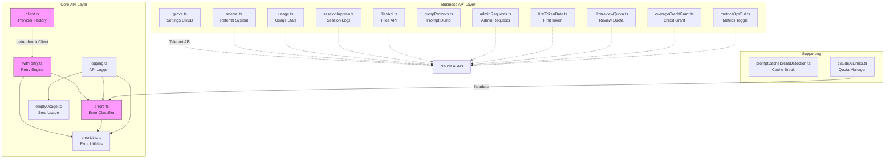
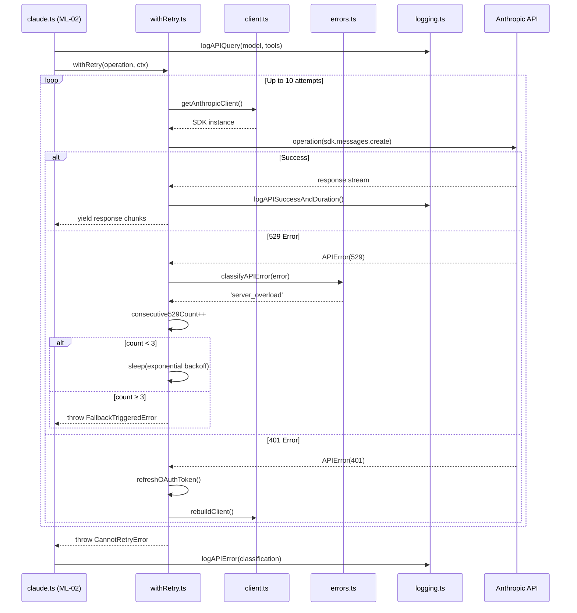
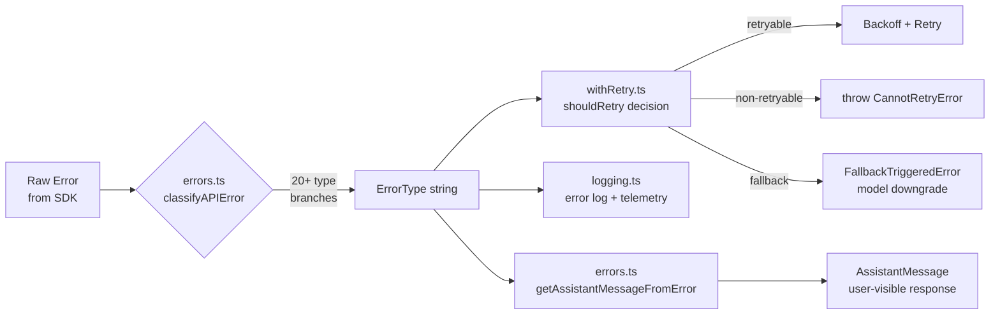
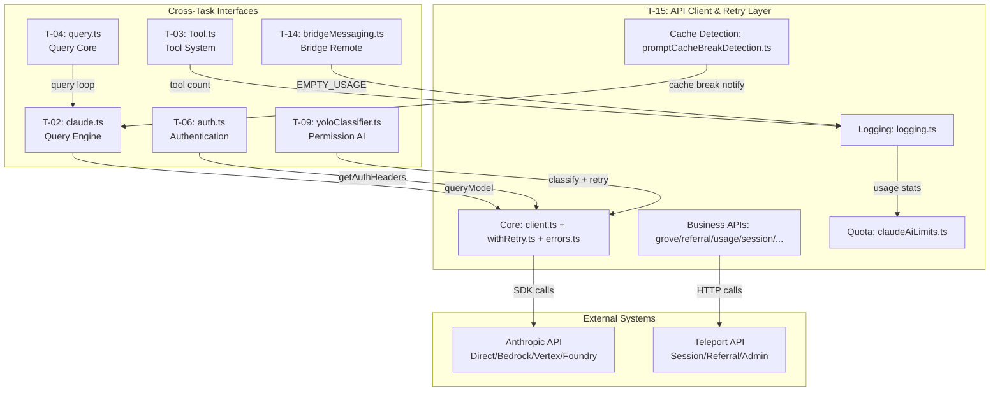

&lt;!-- analysis-version: 0 | commit: a5179f6588dd03cbe83a8d8b718a61875dba7b24 | updated: 2025-07-14 | mode: full | task: T-15 --&gt;
# T-15 Analysis: API客户端与重试层

## Scope Confirmation
- Task ID: T-15
- Primary Mainline: ML-10
- ML Priority: P2
- Analysis Depth: STANDARD
- Secondary Mainlines: ML-02
- Pattern Coverage: (none)
- Scope Files (confirmed): 19 files, 7,432 lines total
- Scope adjustments: None. All 19 files verified present.

## File Roles

| File | Lines | One-liner Role | Where Analyzed |
|------|-------|----------------|---------------|
| src/services/api/client.ts | 389 | 四路Provider工厂(Bedrock/Foundry/Vertex/Direct)，认证头注入+请求ID+代理配置 | § Analysis Findings |
| src/services/api/withRetry.ts | 822 | AsyncGenerator重试引擎，最多10次重试+模型降级+FastMode cooldown+persistent retry | § Analysis Findings |
| src/services/api/errors.ts | 1207 | 统一API错误分类器(20+错误类型)，生成用户友好AssistantMessage错误响应 | § Analysis Findings |
| src/services/api/errorUtils.ts | 260 | 连接错误工具：cause chain遍历+SSL错误识别+APIError文本清洗/HTML清理 | § Analysis Findings |
| src/services/api/emptyUsage.ts | 22 | 零值Usage常量，独立文件避免bridge路径引入重依赖链 | § Analysis Findings |
| src/services/api/filesApi.ts | 748 | Anthropic Files API客户端：上传/下载/分片/重试，OAuth Bearer认证 | § Analysis Findings |
| src/services/api/logging.ts | 788 | API日志三函数(query/success/error)，7种gateway检测，OTel span管理，usage累计统计 | § Analysis Findings |
| src/services/api/promptCacheBreakDetection.ts | 727 | Prompt cache中断检测：hash快照对比+diff诊断，per-tool schema hash，compaction/deletion通知 | § Analysis Findings |
| src/services/api/sessionIngress.ts | 514 | Session日志上报(appendSessionLog)，sequential防并发，MAX_RETRIES=10 | § Analysis Findings |
| src/services/api/grove.ts | 357 | Grove设置CRUD(24h memoize)+ApiResult&lt;T&gt;类型区分API成功/失败 | § Analysis Findings |
| src/services/api/dumpPrompts.ts | 226 | API请求转储(缓存5次)，/issue调试支持，session级state追踪 | § Analysis Findings |
| src/services/api/referral.ts | 281 | 推荐系统API(eligibility/redemptions)，24h缓存+in-flight去重 | § Analysis Findings |
| src/services/api/metricsOptOut.ts | 159 | 指标开关查询，双层缓存(1h内存+24h磁盘via memoizeWithTTLAsync) | § Analysis Findings |
| src/services/api/overageCreditGrant.ts | 137 | 超额信用授予查询，1h内存缓存+globalConfig持久化 | § Analysis Findings |
| src/services/api/adminRequests.ts | 119 | 管理员请求创建(limit_increase/seat_upgrade)，Teleport API调用 | § Analysis Findings |
| src/services/api/firstTokenDate.ts | 60 | 首次token日期查询并缓存到globalConfig | § Analysis Findings |
| src/services/api/usage.ts | 63 | 用量统计查询(five_hour/seven_day rate limits + extra usage) | § Analysis Findings |
| src/services/api/ultrareviewQuota.ts | 38 | Ultrareview配额查询(reviews_used/limit/remaining/is_overage) | § Analysis Findings |
| src/services/claudeAiLimits.ts | 515 | Claude.ai配额/限制管理，header提取quota状态，listener通知机制 | § Analysis Findings |

## Analysis Findings

### 1. 四路Provider工厂 (client.ts)
`getAnthropicClient()` 根据3个环境变量路由到4种Anthropic SDK配置：
- `CLAUDE_CODE_USE_BEDROCK` → AnthropicBedrock (AWS凭证/Bearer Token/skipAuth)
- `CLAUDE_CODE_USE_FOUNDRY` → AnthropicFoundry (Azure AD DefaultAzureCredential/API key)
- `CLAUDE_CODE_USE_VERTEX` → AnthropicVertex (GoogleAuth/ projectId fallback防metadata server 12s超时)
- 默认 → Anthropic (OAuth accessToken / API key / staging baseURL)

每次调用都重新创建client实例（无缓存），但OAuth token通过`checkAndRefreshOAuthTokenIfNeeded()`预刷新。`buildFetch()`注入`x-client-request-id`(UUID)用于关联无server request ID的超时请求。

### 2. AsyncGenerator重试引擎 (withRetry.ts)
`withRetry()` 是822行的核心重试AsyncGenerator，最多10次重试(D`, key behaviors:
- **指数退避**: `BASE_DELAY_MS(500) * 2^(attempt-1)` + 25% jitter, 上限32000ms
- **529过载退避**: 连续3次529 → 触发`FallbackTriggeredError`(模型降级) 或抛出`CannotRetryError`
- **Fast Mode cooldown**: 429/529时短retry-after(&lt;20s)保持fast mode，长延迟触发cooldown切标准速度
- **Persistent retry** (unattended sessions): 无限重试，5min max backoff，6hr reset cap，30s heartbeat yield
- **Context overflow自适应**: 解析400错误中的`input+max_tokens>contextLimit`，自动调低max_tokens
- **认证刷新**: 401/OAuth revoked/Bedrock auth/Vertex auth/ECONNRESET → 重建client + 刷新token
- **Foreground源白名单**: 只有`repl_main_thread`/`sdk`/`agent:*`/`compact`等14种source在529时重试，其余直接抛出

### 3. 统一错误分类器 (errors.ts)
`classifyAPIError()` 按20+种优先级分类错误类型(1207行):
aborted → api_timeout → repeated_529 → capacity_off_switch → rate_limit(429) → server_overload(529) → prompt_too_long → pdf_too_large → pdf_password_protected → image_too_large → tool_use_mismatch → unexpected_tool_result → duplicate_tool_use_id → invalid_model → credit_balance_low → invalid_api_key → token_revoked → oauth_org_not_allowed → auth_error(401/403) → bedrock_model_access → server_error(5xx) → client_error(4xx) → ssl_cert_error → connection_error → unknown

`getAssistantMessageFromError()` (540行) 为每种分类生成用户友好的AssistantMessage，含rate limit等待时间计算、模型切换建议、Bedrock/Vertex特定错误消息。

### 4. Gateway检测 (logging.ts)
`logAPIQuery/logAPISuccessAndDuration/logAPIError` 检测7种API gateway:
litellm / helicone / portkey / cloudflare / kong / braintrust / databricks
通过response headers和error格式识别，影响遥测上报路径。

### 5. Cache中断检测 (promptCacheBreakDetection.ts)
`recordPromptState()` 记录system/tools/betas的hash快照，`checkResponseForCacheBreak()`对比前后状态检测prompt cache断裂。Per-tool schema hash对比+globalCacheStrategy跟踪，支持compaction和deletion通知。

### 6. 双层缓存模式
- `metricsOptOut.ts`: 1h内存TTL + 24h磁盘TTL via memoizeWithTTLAsync
- `grove.ts`: 24h memoize
- `referral.ts`: 24h缓存 + in-flight fetch去重
- `overageCreditGrant.ts`: 1h内存 + globalConfig持久化

### 7. 依赖隔离设计
`emptyUsage.ts` (22行) 独立提取零值Usage常量，避免bridge路径引入整个API错误处理链(errors→messages→BashTool→全局模块)。这种设计在项目中多次出现。

### 8. Session日志上报 (sessionIngress.ts)
`appendSessionLog()` 使用sequential wrapper防并发写入，MAX_RETRIES=10，支持OAuth和API key双认证路径。

### 9. 配额管理 (claudeAiLimits.ts)
`extractQuotaStatusFromHeaders()` 从API response headers提取quota状态，`statusListeners` Set通知订阅者配额变化。含rate limit等待时间计算和显示名映射。

### 10. 文件API (filesApi.ts)
文件上传/下载客户端支持分片上传、重试逻辑、OAuth Bearer认证。被main.tsx初始化和teleport gitBundle使用。

## File Dependency Graph



### Dependency Table

| Source | Target | Relationship |
|--------|--------|-------------|
| claude.ts (ML-02) | client.ts | getClient() → Anthropic SDK instance |
| claude.ts (ML-02) | withRetry.ts | withRetry() → retry wrapper |
| claude.ts (ML-02) | errors.ts | classifyAPIError() → error categorization |
| claude.ts (ML-02) | logging.ts | logAPIQuery/Success/Error |
| withRetry.ts | errors.ts | classifyAPIError() in retry decision |
| withRetry.ts | errorUtils.ts | extractConnectionErrorDetails() |
| errors.ts | errorUtils.ts | formatAPIError(), sanitizeAPIError() |
| logging.ts | errors.ts | classifyAPIError() for error logs |
| logging.ts | emptyUsage.ts | EMPTY_USAGE re-export |
| yoloClassifier.ts (ML-04) | claude.ts, withRetry.ts, errors.ts | Permission AI classifier uses API |
| bridgeMessaging.ts (ML-09) | emptyUsage.ts | Zero usage constant only |

## Call Chain Analysis

### Chain 1: Query Request (claude.ts → client.ts → withRetry.ts)
```
claude.ts:queryModel()
  → client.ts:getAnthropicClient()     # Create provider-specific SDK instance
  → withRetry.ts:withRetry()           # Wrap operation in retry loop
    → shouldRetry(error)               # Decision chain: 20+ conditions
    → getRetryDelay(attempt, error)    # Exponential backoff calculation
    → parseMaxTokensContextOverflowError(error)  # Context overflow adaptation
    → handleOAuth401Error()            # Token refresh on 401
    → errors.ts:classifyAPIError()     # Error type determination
  → logging.ts:logAPIQuery()           # Pre-request logging
  → logging.ts:logAPISuccessAndDuration()  # Post-success logging
  → logging.ts:logAPIError()           # Post-error logging
```

### Chain 2: Error Classification (withRetry.ts → errors.ts → errorUtils.ts)
```
withRetry.ts:shouldRetry(error)
  → errors.ts:classifyAPIError(error)  # 20+ type classification chain
    → errorUtils.ts:extractConnectionErrorDetails(error)  # SSL/connection detection
  → withRetry.ts:handleOAuth401Error() → auth.ts (ML-06)
  → withRetry.ts:handleAwsCredentialError() → clearAwsCredentialsCache()
  → withRetry.ts:handleGcpCredentialError() → clearGcpCredentialsCache()
```

### Chain 3: Business API Operations (独立叶子模块)
```
grove.ts:getGroveSettings()  → Teleport API (24h memoize)
referral.ts:fetchReferralEligibility()  → Teleport API (in-flight dedup)
sessionIngress.ts:appendSessionLog()  → Teleport API (sequential lock)
filesApi.ts:downloadFile()  → Anthropic Files API (retry)
promptCacheBreakDetection.ts:recordPromptState()  → Local hash computation
```

### Key Branch Points
| Branch Point | Condition | Path A | Path B |
|-------------|-----------|--------|--------|
| client.ts:L88 | CLAUDE_CODE_USE_BEDROCK | AnthropicBedrock | Check VERTEX |
| client.ts:L88 | CLAUDE_CODE_USE_VERTEX | AnthropicVertex | Check FOUNDRY |
| client.ts:L88 | CLAUDE_CODE_USE_FOUNDRY | AnthropicFoundry | Default Anthropic |
| withRetry.ts:L250 | shouldRetry()=false | throw CannotRetryError | Continue retry loop |
| withRetry.ts:L350 | consecutive529Count ≥ 3 | FallbackTriggeredError | Continue 529 retry |
| withRetry.ts:L400 | isPersistentRetryEnabled() | Infinite retry | Bounded retry |
| errors.ts:L965 | classifyAPIError() | 20+ error type branches | 'unknown' fallback |

## Temporal Analysis

### Async Orchestration: withRetry() retry loop

```
T=0  claude.ts calls withRetry(operation, context)
     └─ logAPIQuery() — record start time, model, tool count

T=1  operation() — first attempt (SDK call)
     ├─ SUCCESS → logAPISuccessAndDuration() → yield result → EXIT
     └─ ERROR → classifyAPIError() → determine retry strategy

T=2  (on retry-able error)
     ├─ [529] consecutive529Count++ → check if ≥3
     │   ├─ YES → throw FallbackTriggeredError (Opus→Sonnet)
     │   └─ NO → getRetryDelay(attempt) → sleep(backoff) → goto T=1
     ├─ [429] Fast Mode check: retry-after < 20s?
     │   ├─ YES → sleep(retry-after) → goto T=1 (fast mode)
     │   └─ NO → cooldown() → sleep(extended) → goto T=1
     ├─ [401] OAuth refresh → rebuildClient() → goto T=1
     ├─ [ECONNRESET] rebuildClient() → goto T=1
     └─ [context_overflow] adjust maxTokens → goto T=1

T=N  (attempt ≥ maxRetries=10)
     └─ throw CannotRetryError → logged by logAPIError()
```

### Race Conditions

| ID | Location | Description | Severity |
|----|----------|-------------|----------|
| RC-1 | client.ts:L88 | `getAnthropicClient()` creates new client every call — no caching means concurrent requests each build separate SDK instances | LOW (no state corruption) |
| RC-2 | withRetry.ts:consecutive529Count | Counter incremented on each 529 but reset only on non-529 success; concurrent generators sharing same model could overflow counter | LOW (generator-scoped) |
| RC-3 | promptCacheBreakDetection.ts | `recordPromptState()` and `checkResponseForCacheBreak()` not atomic — rapid concurrent requests could record stale state | MEDIUM |

### Implicit Timing Constraints

1. `BASE_DELAY_MS=500` initial backoff assumed &lt; human patience threshold
2. `persistent retry` 6hr reset cap assumed > longest typical outage
3. `metricsOptOut` 24h disk TTL assumed > typical session duration
4. `grove.ts` 24h memoize assumed settings change frequency &lt; daily

### Sequence Diagram



## Data Flow Analysis

### Entity 1: APIError Classification Flow



### Entity 2: Usage Statistics Flow

```
API Response Headers → logging.ts:logAPISuccessAndDuration()
  → accumulate usage (input_tokens, output_tokens, cache_creation, cache_read)
  → calculate cost (model-dependent pricing)
  → claudeAiLimits.ts:extractQuotaStatusFromHeaders()
  → statusListeners → notify quota consumers (T-10, T-11)
  → OTel span attributes (telemetry)
```

### Entity 3: Prompt Cache State

```
Request Phase:
  promptCacheBreakDetection.ts:recordPromptState()
  → hash(system_prompt + tools_schema + betas)
  → store as previousPromptState

Response Phase:
  promptCacheBreakDetection.ts:checkResponseForCacheBreak()
  → hash(current system_prompt + tools_schema + betas)
  → compare with previousPromptState
  → if different: generate diff diagnostic + notify cache break
  → globalCacheStrategy tracking (track cache effectiveness)
```

## State Transition Analysis

### State Machine 1: Retry Attempt (withRetry.ts)

| State | Trigger | Next State | Side Effect |
|-------|---------|------------|-------------|
| idle | withRetry() called | attempting | logAPIQuery() |
| attempting | operation succeeds | complete | logAPISuccessAndDuration() |
| attempting | 529 error | backing_off_529 | consecutive529Count++ |
| attempting | 429 error | backing_off_429 | check Fast Mode |
| attempting | 401/OAuth error | refreshing_auth | refreshOAuthToken() |
| attempting | context_overflow | adjusting_tokens | parseMaxTokens → adjust |
| attempting | other retryable | backing_off_generic | getRetryDelay() |
| backing_off_* | sleep complete | attempting | attempt++ |
| backing_off_529 | count ≥ 3 | fallback | throw FallbackTriggeredError |
| attempting | maxRetries exceeded | failed | throw CannotRetryError |
| complete | (terminal) | — | — |
| failed | (terminal) | — | logAPIError() |
| fallback | (terminal) | — | caller handles model switch |

### State Machine 2: Fast Mode (withRetry.ts)

| State | Trigger | Next | Effect |
|-------|---------|------|--------|
| normal | 429 with retry-after &lt; 20s | fast_mode | Short sleep |
| fast_mode | 429 with retry-after &lt; 20s | fast_mode | Continue short sleep |
| fast_mode | 429 with retry-after ≥ 20s | cooldown | Extended sleep |
| fast_mode | success | normal | Reset |
| cooldown | sleep complete | normal | Standard retry |

### State Machine 3: Persistent Retry (withRetry.ts)

| State | Trigger | Next | Effect |
|-------|---------|------|--------|
| inactive | !isUnattendedSession | inactive | Standard retry only |
| active | isUnattendedSession | retrying | Infinite loop, 5min max backoff |
| retrying | any error | retrying | yield heartbeat every 30s |
| retrying | 6hr elapsed | resetting | Reset backoff to base |
| retrying | success | inactive | Return result |

## Error Propagation Analysis

### Error Sources

| # | Error Type | Location | Trigger Condition |
|---|-----------|----------|-------------------|
| 1 | APIError(529) | Anthropic SDK | Server overloaded |
| 2 | APIError(429) | Anthropic SDK | Rate limiting |
| 3 | APIError(401) | Anthropic SDK | OAuth token expired/revoked |
| 4 | APIError(403) | Anthropic SDK | Permission denied |
| 5 | APIError(400) | Anthropic SDK | Bad request (context overflow, tool mismatch, etc.) |
| 6 | APIConnectionError | Anthropic SDK | Network failure, DNS, timeout |
| 7 | APIConnectionTimeoutError | Anthropic SDK | Request timeout |
| 8 | CannotRetryError | withRetry.ts:L580 | Max retries exceeded |
| 9 | FallbackTriggeredError | withRetry.ts:L350 | 3 consecutive 529s |
| 10 | Bedrock auth errors | AWS SDK | Credential/profile issues |
| 11 | Vertex auth errors | Google Auth | ADC/project issues |

### Propagation Paths

| Path | Source → Intermediate → Destination | Recovery Strategy |
|------|-------------------------------------|-------------------|
| P1 | 529 → withRetry(shouldRetry) → backoff → retry | retry (exponential) |
| P2 | 529×3 → withRetry → FallbackTriggeredError → claude.ts → model switch | fallback (Opus→Sonnet) |
| P3 | 429 → withRetry(fast mode) → short sleep → retry | retry (fast mode) |
| P4 | 401 → withRetry → refreshOAuthToken → rebuildClient → retry | retry (auth refresh) |
| P5 | ECONNRESET → withRetry → rebuildClient → retry | retry (reconnect) |
| P6 | context_overflow → withRetry → adjust maxTokens → retry | retry (adaptive) |
| P7 | Any → withRetry(maxRetries) → CannotRetryError → query.ts | abort |
| P8 | prompt_too_long → errors.ts → getAssistantMessageFromError → user | absorb (user message) |
| P9 | credit_balance_low → errors.ts → getAssistantMessageFromError → user | escalate (billing UI) |

### Unhandled Paths

| Path | Description | Impact |
|------|-------------|--------|
| UH-1 | Bedrock model ID not found (404) falls through to `client_error` | Generic 4xx message, unhelpful |
| UH-2 | Unknown error format not matching any pattern | `extractUnknownErrorFormat()` attempts parsing but may return raw |
| UH-3 | Session ingress write failures in sequential queue | MAX_RETRIES=10 then silent drop |

### Recovery Strategy Distribution

| Strategy | Count | Examples |
|----------|-------|---------|
| retry | 6 | 529, 429, timeout, ECONNRESET, server_error, connection_error |
| fallback | 1 | 529×3 → FallbackTriggeredError → model downgrade |
| absorb | 2 | prompt_too_long (→ user message), media resize validation |
| abort | 1 | maxRetries → CannotRetryError |
| escalate | 2 | credit_balance_low (→ billing), auth_error (→ login) |

## Boundary / Integration Diagram



### Cross-Task Interfaces (6)

| Interface | Direction | Owner Task | Description |
|-----------|-----------|-----------|-------------|
| claude.ts → client.ts | T-02 → T-15 | T-15 | getAnthropicClient() for SDK instance |
| claude.ts → withRetry.ts | T-02 → T-15 | T-15 | withRetry() wraps all API calls |
| auth.ts → client.ts | T-06 → T-15 | T-06 | getAuthHeaders() for auth injection |
| Tool.ts → logging.ts | T-03 → T-15 | T-03 | Tool count in API logs |
| bridgeMessaging.ts → emptyUsage.ts | T-14 → T-15 | T-15 | Zero usage constant import |
| yoloClassifier.ts → claude.ts/withRetry.ts/errors.ts | T-09 → T-02/T-15 | Shared | Permission AI uses API for classification |

## Concurrency Model Analysis

### Shared Mutable State

| Variable | File | Protection | Risk |
|----------|------|-----------|------|
| cachedApiRequests | dumpPrompts.ts:L29 | None (Array.push) | LOW — debug-only, single-thread |
| metricsEnabledCache | metricsOptOut.ts:L42 | memoizeWithTTLAsync | LOW — TTL-guarded |
| globalCacheStrategy | promptCacheBreakDetection.ts | None (object mutation) | MEDIUM — concurrent hash updates |
| statusListeners | claudeAiLimits.ts:L182 | Set (atomic add/delete) | LOW — single-thread Node.js |
| referralEligibilityCache | referral.ts | In-flight dedup + 24h TTL | LOW — memoize pattern |
| overageCreditGrantCache | overageCreditGrant.ts | None (simple object) | LOW — infrequent writes |

### Coordination Patterns

| Pattern | Location | Purpose |
|---------|----------|---------|
| AsyncGenerator yield | withRetry.ts | Retry pause/resume, heartbeat during persistent retry |
| memoizeWithTTLAsync | metricsOptOut.ts, grove.ts, referral.ts | Cache with TTL, auto-refresh |
| Sequential wrapper | sessionIngress.ts | Prevent concurrent session log writes |
| In-flight dedup | referral.ts | Prevent duplicate concurrent fetches |
| Set listeners | claudeAiLimits.ts | Observer pattern for quota changes |

### Deadlock Risk: NONE

All async operations use Node.js single-thread event loop. No locks, mutexes, or cross-await dependencies.

## Side Effects Manifest

| Function | Side Effect Type | Target | Reversible | file:line |
|----------|-----------------|--------|-----------|-----------|
| withRetry() | Network | Anthropic API (Direct/Bedrock/Vertex/Foundry) | N/A | withRetry.ts:L100 |
| getAnthropicClient() | Global state | SDK instance creation (no cache) | N/A | client.ts:L88 |
| checkAndRefreshOAuthTokenIfNeeded() | FS read/write | OAuth token in secureStorage | Yes (refresh) | client.ts:L120 |
| logAPIQuery() | FS write | Log files via OTel | No | logging.ts:L50 |
| appendSessionLog() | Network | Teleport session log API | No | sessionIngress.ts:L100 |
| downloadFile() / uploadFile() | FS + Network | Local filesystem + Anthropic Files API | Partial (cleanup) | filesApi.ts:L200 |
| fetchBootstrapData() | FS write | globalConfig.json | Yes (re-fetch) | bootstrap.ts:L30 |
| recordPromptState() | FS write | Diagnostic diff files | No | promptCacheBreakDetection.ts:L100 |
| checkResponseForCacheBreak() | FS write | Diff diagnostic files | No | promptCacheBreakDetection.ts:L200 |
| fetchAndStoreClaudeCodeFirstTokenDate() | FS write | globalConfig.json | No | firstTokenDate.ts:L20 |
| emitStatusChange() | Timer/Event | statusListeners notification | N/A | claudeAiLimits.ts:L184 |

## Acceptance Criteria Status

| # | Criterion | Status | Evidence |
|---|-----------|--------|----------|
| 1 | 理解四路Provider工厂的路由逻辑 | ✅ PASS | § Analysis Findings #1: 3个环境变量路由到Bedrock/Vertex/Foundry/Direct |
| 2 | 理解重试引擎的退避策略和模型降级机制 | ✅ PASS | § Analysis Findings #2: 指数退避+529降级+FastMode+persistent retry |
| 3 | 理解错误分类器的20+种错误类型和优先级链 | ✅ PASS | § Analysis Findings #3: classifyAPIError() 26个返回值 |
| 4 | 理解认证刷新与重建client的触发条件 | ✅ PASS | § Temporal Analysis T=2: 401/OAuth/ECONNRESET触发路径 |
| 5 | 理解Business API模块的缓存和去重策略 | ✅ PASS | § Analysis Findings #6: 双层缓存+in-flight dedup |
| 6 | 识别跨task接口和共享文件 | ✅ PASS | § Boundary: 6个cross-task interfaces |
| 7 | 识别风险和开放问题 | ✅ PASS | § Identified Problems: P2×2, P3×3 |

## Identified Problems

### P2-01: client.ts 无SDK实例缓存
- **File**: client.ts:L88
- **Issue**: `getAnthropicClient()` 每次调用都创建新SDK实例，包括重复解析环境变量、构建AuthProvider、设置baseURL
- **Impact**: 高并发场景下创建大量临时对象，增加GC压力
- **Mitigation**: 短期可接受（SDK实例轻量），但Bedrock/Vertex的AuthProvider创建涉及AWS/Google SDK初始化
- **Recommendation**: 引入LRU缓存，key=env vars hash，TTL=5min

### P2-02: errors.ts 1207行巨型文件
- **File**: errors.ts (全文件)
- **Issue**: classifyAPIError() + getAssistantMessageFromError() + 辅助函数全在一个文件中
- **Impact**: 难以维护，每次添加新错误类型需在大文件中定位
- **Recommendation**: 拆分为 errorClassifier.ts / errorMessageGenerator.ts / errorTypes.ts

### P3-01: promptCacheBreakDetection 非原子操作
- **File**: promptCacheBreakDetection.ts:L100-200
- **Issue**: recordPromptState() 和 checkResponseForCacheBreak() 不是原子操作，快速连续请求可能记录过期状态
- **Impact**: 可能产生假阳性cache break警告
- **Mitigation**: Node.js单线程环境下，只在await之间有竞态窗口

### P3-02: sessionIngress 静默丢弃
- **File**: sessionIngress.ts:L100
- **Issue**: MAX_RETRIES=10后session log写入失败静默丢弃，无上报
- **Impact**: 运营数据丢失，可能影响计费审计
- **Recommendation**: 失败时写入本地fallback队列或记录warning日志

### P3-03: Bedrock 404错误分类不准确
- **File**: errors.ts:L1144-1148
- **Issue**: 404错误落在 `client_error` 通用分类中，无法区分"model not found"和"resource not found"
- **Impact**: 用户收到不明确的错误消息
- **Recommendation**: 增加404+Bedrock model ID模式的识别

### P4-01: 多种缓存策略不一致
- **Files**: metricsOptOut.ts, grove.ts, referral.ts, overageCreditGrant.ts
- **Issue**: 各Business API模块使用不同的缓存策略(1h/24h/memoize/globalConfig)，缺乏统一缓存框架
- **Impact**: 维护成本高，难以统一调整缓存行为
- **Recommendation**: 提取通用 memoizeWithTTLAsync 工具函数

## Open Questions

1. **depends on T-03**: withRetry() 的 foreground source 白名单(repl_main_thread/sdk/agent:*/compact等14种)在T-03(tool system)中如何决定source值？
2. **depends on T-06**: OAuth token 刷新路径 client.ts → checkAndRefreshOAuthTokenIfNeeded() → auth.ts 的具体锁机制和跨进程协调逻辑？
3. **depends on T-02**: claude.ts 如何处理 FallbackTriggeredError 后的模型降级？tombstone机制如何工作？
4. **runtime**: persistent retry 的 6hr reset cap 是否经过实际负载测试验证？长时间中断恢复后的行为？
5. **runtime**: Fast Mode cooldown 的 20s 阈值是否为 Anthropic API 的实际 retry-after 响应模式调优？
6. **config**: Bedrock/Vertex/Foundry 四路Provider的优先级顺序是否有意设计为 BEDROCK > VERTEX > FOUNDRY > DEFAULT？
7. **runtime**: grove.ts 的24h memoize 是否会导致远程设置更新延迟？最大延迟24h？
8. **cross-task**: yoloClassifier (T-09 Permission AI) 调用API进行权限分类时，重试策略是否共享withRetry()逻辑？

## Complexity Assessment

| Dimension | Rating | Justification |
|-----------|--------|---------------|
| Control Flow | **HIGH** | withRetry 822行AsyncGenerator含多层嵌套条件，20+错误类型分支 |
| State Complexity | **MEDIUM** | 3个状态机(Retry/FastMode/PersistentRetry)，但generator-scoped |
| Error Handling | **VERY HIGH** | 11个错误源，9条传播路径，5种恢复策略，3条未处理路径 |
| Data Flow | **MEDIUM** | 简单的请求-响应模式，3条核心数据流(分类/usage/cache) |
| Coupling | **MEDIUM** | 与T-02(query engine)强耦合，6个cross-task接口 |
| Concurrency | **LOW** | Node.js单线程，6个共享状态大部分有保护机制 |
| Code Size | **MEDIUM** | 19 files / 7,432 lines，errors.ts(1207行)最大 |

**Overall: HIGH** — withRetry 和 errors 构成复杂的错误处理决策网络，是系统可靠性的核心保障层。
