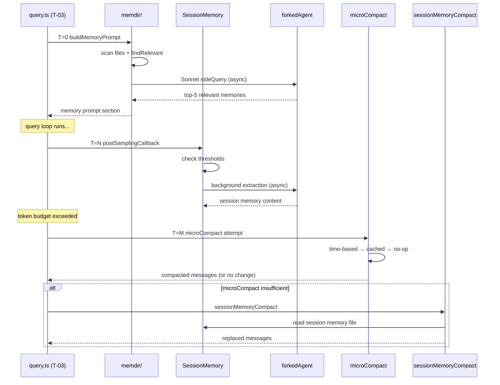
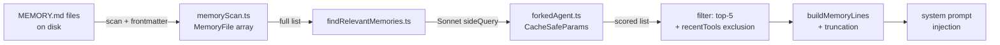
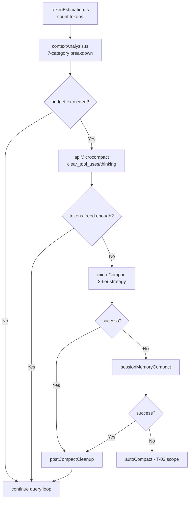
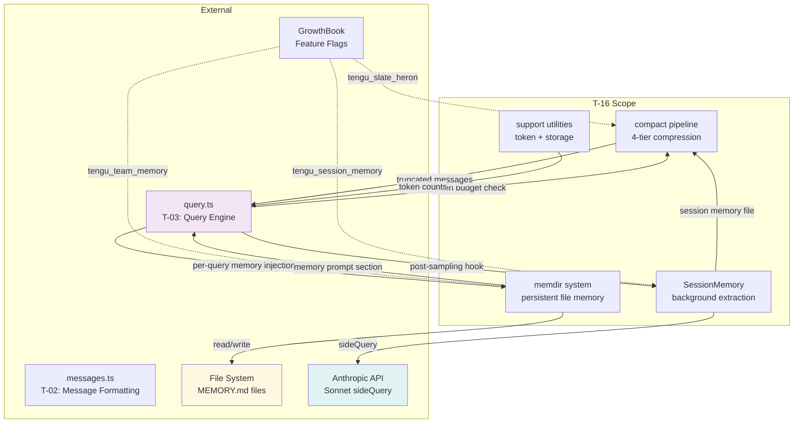

&lt;!-- analysis-version: 0 | commit: a5179f6588dd03cbe83a8d8b718a61875dba7b24 | updated: 2026-04-19 | mode: full | task: T-16 --&gt;
# T-16 Analysis: 上下文与记忆管理

## Scope Confirmation
- Task ID: T-16
- Primary Mainline: ML-11
- ML Priority: P2
- Analysis Depth: STANDARD
- Secondary Mainlines: ML-02
- Scope Files (confirmed): 34 files, 12,654 lines
- Dependencies: T-03 (query core loop — completed)
- Scope adjustments: None — all 34 files verified on disk

**Subsystem Breakdown**:
- memdir/ (9 files): Persistent file-based memory (MEMORY.md)
- compact/ (13 files): Context compression pipeline (4-tier)
- SessionMemory/ (3 files): Background session memory extraction
- contextCollapse/ (3 files): Context collapse entry (2 stubs)
- Support utilities (6 files): token estimation, context analysis, session restore, forked agent, session storage

## File Roles

| File | Lines | One-liner Role | Where Analyzed |
|------|-------|----------------|---------------|
| src/memdir/findRelevantMemories.ts | 141 | Sonnet sideQuery selects top-5 relevant memories via LLM relevance scoring | § Analysis Findings #4 |
| src/memdir/memdir.ts | 507 | Memory prompt builder: buildMemoryPrompt/buildMemoryLines with dual truncation (200 lines/25 KB) | § Analysis Findings #3 |
| src/memdir/memoryAge.ts | 53 | mtime-based staleness formatter; >1 day memories get system-reminder warning | § Analysis Findings #10 |
| src/memdir/memoryScan.ts | 94 | Scans memory directory for frontmatter files; sorts by mtime, caps at 200 files | § Analysis Findings #3 |
| src/memdir/memoryShapeTelemetry.ts | 1 | Empty stub: recordMemoryShapeTelemetry() — no-op | § Analysis Findings #2 |
| src/memdir/memoryTypes.ts | 271 | 4 memory types (user/feedback/project/reference) + Combined/Private prompt sections | § Analysis Findings #3 |
| src/memdir/paths.ts | 278 | 4-layer memory path resolver: env > settings > sanitized-git-root; validateMemoryPath security | § Analysis Findings #9 |
| src/memdir/teamMemPaths.ts | 292 | Team memory path resolver: sanitizePathKey + GrowthBook tengu_team_memory gate | § Analysis Findings #9 |
| src/memdir/teamMemPrompts.ts | 100 | Team memory prompt sections with save/load/extract scope guidance (private vs team) | § Analysis Findings #4 |
| src/services/SessionMemory/prompts.ts | 324 | 10-section template (Title/State/Task/Files/Workflow/Errors/Docs/Learnings/Results/Worklog), 2K tok/sec, 12K max | § Analysis Findings #6 |
| src/services/SessionMemory/sessionMemory.ts | 495 | Post-sampling hook: forkedAgent background extraction, token+tool_calls dual-threshold trigger | § Analysis Findings #5 |
| src/services/SessionMemory/sessionMemoryUtils.ts | 207 | Config: minTokensToInit(10K)/minTokensBetweenUpdate(5K)/toolCallsBetweenUpdates(3); extraction timeout tracking | § Analysis Findings #5 |
| src/services/compact/apiMicrocompact.ts | 153 | API-native context management: clear_tool_uses + clear_thinking flags, ant-only, env-gated | § Analysis Findings #1 |
| src/services/compact/cachedMCConfig.ts | 3 | Empty stub: returns null — DCE removed | § Analysis Findings #2 |
| src/services/compact/compactWarningHook.ts | 16 | React hook: useSyncExternalStore for compact warning suppression state | § State Transition |
| src/services/compact/compactWarningState.ts | 18 | Zustand store: suppressCompactWarning flag (reset after successful compact) | § State Transition |
| src/services/compact/grouping.ts | 63 | groupMessagesByApiRound: splits messages by assistant message.id boundaries | § Call Chain Analysis |
| src/services/compact/microCompact.ts | 530 | 3-tier micro compact: time-based → cached(cache_edits API) → no-op fallback to autocompact | § Analysis Findings #1 |
| src/services/compact/postCompactCleanup.ts | 77 | Post-compact cache cleanup: 8+ caches reset, main-thread vs subagent differentiation | § Analysis Findings #8 |
| src/services/compact/prompt.ts | 374 | Compact prompt templates: BASE/PARTIAL/PARTIAL_UP_TO variants with NO_TOOLS constraint | § Analysis Findings #1 |
| src/services/compact/reactiveCompact.ts | 3 | Empty stub: returns messages unchanged — DCE removed | § Analysis Findings #2 |
| src/services/compact/sessionMemoryCompact.ts | 630 | No-API compression: replaces old messages with session memory content, 3-segment retention policy | § Analysis Findings #1 |
| src/services/compact/snipCompact.ts | 10 | Empty stub: returns {messages, changed: false} — DCE removed | § Analysis Findings #2 |
| src/services/compact/snipProjection.ts | 7 | Empty stub: returns messages unchanged — DCE removed | § Analysis Findings #2 |
| src/services/compact/timeBasedMCConfig.ts | 43 | GrowthBook tengu_slate_heron config: enabled/gapThresholdMinutes(60)/keepRecent(5) | § Analysis Findings #1 |
| src/services/contextCollapse/index.ts | 51 | Context collapse entry: single compressContext() function calling stub chain | § Analysis Findings #2 |
| src/services/contextCollapse/operations.ts | 7 | Empty stub: returns empty array — DCE removed | § Analysis Findings #2 |
| src/services/contextCollapse/persist.ts | 1 | Empty stub: no-op — DCE removed | § Analysis Findings #2 |
| src/services/tokenEstimation.ts | 495 | 3-tier token counting: rough(len/4) → API count → Haiku fallback; JSON uses bytesPerToken=2 | § Analysis Findings #7 |
| src/utils/contextAnalysis.ts | 272 | TokenStats analyzer: per-tool breakdown, duplicate file read detection, Statsig metrics conversion | § Data Flow Analysis |
| src/utils/forkedAgent.ts | 689 | Forked agent infrastructure: CacheSafeParams for prompt cache sharing, createSubagentContext isolation | § Analysis Findings #5 |
| src/utils/sessionRestore.ts | 551 | Session restore: log→state recovery (fileHistory/attribution/todos), transcript todo extraction | § Call Chain Analysis |
| src/utils/sessionStorage.ts | 5105 | Session persistence core: transcript read/write, sidechain recording, content replacement tracking | § Analysis Findings #8 |
| src/utils/sessionStoragePortable.ts | 793 | Portable session format for cross-device/session transfer | § Boundary Diagram |

## Analysis Findings

### 1. 四层压缩管线 (Compression Pipeline)
Context compression follows a 4-tier cascade invoked from query.ts (T-03 scope):
1. **API microcompact** (`apiMicrocompact.ts`): Anthropic-native `clear_tool_uses` + `clear_thinking` flags, ant-only provider, env-gated. Uses `clear_at_least` to guarantee minimum token release.
2. **Micro compact** (`microCompact.ts`): Three internal strategies — time-based (clear cold cache entries when gap > 60min) → cached (cache_edits API preserves prefix) → no-op (defer to autocompact). COMPACTABLE_TOOLS = 8 tool types.
3. **Session memory compact** (`sessionMemoryCompact.ts`): No API call — replaces old messages with session memory file content. Three-segment retention: minTokens=10K / minTextBlockMessages=5 / maxTokens=40K. adjustIndexToPreserveAPIInvariants handles tool_use/tool_result pairing and thinking block merging.
4. **Context collapse** (`contextCollapse/index.ts`): Single function calling stub chain (operations.ts returns empty array, persist.ts is no-op). Future expansion point.

### 2. 七个空壳子系统 (DCE Stubs)
Seven stub modules with DCE'd implementations, controlled by feature flags:
- `reactiveCompact.ts` (3 lines): returns `messages`
- `snipCompact.ts` (10 lines): returns `{messages, changed: false}`
- `snipProjection.ts` (7 lines): returns `messages`
- `contextCollapse/operations.ts` (7 lines): returns `[]`
- `contextCollapse/persist.ts` (1 line): no-op
- `cachedMCConfig.ts` (3 lines): returns `null`
- `memoryShapeTelemetry.ts` (1 line): no-op

These are expansion points for future features. Currently they are no-ops.

### 3. memdir 持久记忆系统 (Persistent File Memory)
- **Path resolution** (`paths.ts`): 4-layer chain: env override > settings.json > `<base>/projects/<sanitized-git-root>/memory/`. validateMemoryPath blocks: relative/root/UNC/null bytes. Excludes projectSettings.
- **Memory types** (`memoryTypes.ts`): 4 types — user/feedback/project/reference. Combined vs Private system prompt sections with team scope labels. parseMemoryType handles legacy files.
- **Scanning** (`memoryScan.ts`): Reads frontmatter from .md files, sorts by mtime desc, caps at 200 files.
- **Prompt building** (`memdir.ts`): buildMemoryPrompt/buildMemoryLines. Dual truncation: max 200 lines AND 25 KB. Kairos feature gate for daily-log append-only mode.

### 4. 双记忆系统 (Dual Memory Architecture)
Two independent memory subsystems:
- **memdir** (persistent): File-based MEMORY.md, Sonnet sideQuery for top-5 relevance selection. recentTools filter excludes active tool references.
- **SessionMemory** (per-session): Background forkedAgent extraction into structured sections. Dual-threshold trigger: token growth ≥ 5K AND tool_calls ≥ 3. Manual /summary command.

### 5. SessionMemory 后台提取 (Background Extraction)
- **Trigger** (`sessionMemory.ts`): Post-sampling hook. GrowthBook tengu_session_memory + tengu_sm_compact gates.
- **Template** (`prompts.ts`): 10-section template. Headers + italic descriptions protected. MAX_SECTION_LENGTH=2000 tokens, MAX_TOTAL=12000 tokens.
- **Config** (`sessionMemoryUtils.ts`): minTokensToInit=10K, minTokensBetweenUpdate=5K, toolCallsBetweenUpdates=3. waitForSessionMemoryExtraction: 15s timeout + 60s stale detection.
- **Isolation** (`forkedAgent.ts`): CacheSafeParams (5 fields) guarantee cache sharing. createSubagentContext clones all mutable state.

### 6. Prompt Cache 核心设计 (Cache Safety)
forkedAgent.ts CacheSafeParams:
- **Shared**: systemPrompt, userContext, systemContext, toolUseContext, forkContextMessages
- **Isolated**: readFileStateCache, contentReplacementState, abortController, tool calls, query callbacks
- contentReplacementState clone ensures consistent replacement decisions
- shareSetAppState/shareAbortController require explicit opt-in

### 7. Token 估算三层降级 (Token Estimation Cascade)
tokenEstimation.ts: rough(len/4, JSON len/2) → API count (Anthropic/Vertex/Bedrock) → Haiku/Sonnet fallback. Strips tool search fields before counting.

### 8. Post-Compact 清理区分 (Cleanup Thread Safety)
postCompactCleanup.ts: isMainThreadCompact check (querySource === undefined || repl_main_thread || sdk). Main thread resets 8+ caches. Subagent skips shared state cleanup.

### 9. memdir 路径安全 (Path Security)
Dual-layer: validateMemoryPath (blocks relative/root/UNC/null bytes/traversal) + sanitizePathKey (blocks URL-encoded traversal/Unicode normalization). Excludes projectSettings.

### 10. Memory Freshness 机制 (Staleness Warning)
memoryAge.ts: mtime → "X days ago". >1 day memories get system-reminder staleness warning. Prevents stale file:line references from being treated as facts.

## File Dependency Graph

```mermaid
flowchart TB
    subgraph memdir["memdir/"]
        memdir_ts[memdir.ts<br/>prompt builder]
        paths_ts[paths.ts<br/>path resolver]
        memTypes[memoryTypes.ts<br/>type defs]
        memScan[memoryScan.ts<br/>file scanner]
        findRel[findRelevantMemories.ts<br/>relevance scorer]
        memAge[memoryAge.ts<br/>staleness]
        teamPaths[teamMemPaths.ts<br/>team paths]
        teamPrompts[teamMemPrompts.ts<br/>team prompts]
    end

    subgraph compact["compact/"]
        microMC[microCompact.ts<br/>3-tier micro]
        sessionMC[sessionMemoryCompact.ts<br/>no-API compress]
        apiMC[apiMicrocompact.ts<br/>API-native clear]
        prompt_ts[prompt.ts<br/>compact templates]
        grouping_ts[grouping.ts<br/>API round splitter]
        postCleanup[postCompactCleanup.ts<br/>cache reset]
    end

    subgraph sessionMem["SessionMemory/"]
        sessionMem_ts[sessionMemory.ts<br/>extraction hook]
        prompts_ts[prompts.ts<br/>10-section template]
        smUtils[sessionMemoryUtils.ts<br/>config + timeout]
    end

    subgraph support["Support Utilities"]
        forked[forkedAgent.ts<br/>cache-safe isolation]
        tokenEst[tokenEstimation.ts<br/>3-tier counting]
        ctxAnalysis[contextAnalysis.ts<br/>token breakdown]
        sessionStore[sessionStorage.ts<br/>transcript R/W]
    end

    memdir_ts --> paths_ts
    memdir_ts --> memScan
    memdir_ts --> findRel
    memdir_ts --> memAge
    findRel -.->|forkedAgent sideQuery| forked
    sessionMem_ts --> forked
    sessionMem_ts --> smUtils
    sessionMem_ts --> prompts_ts
    sessionMC --> sessionMem_ts
    microMC --> grouping_ts
    microMC --> apiMC
    ctxAnalysis --> tokenEst

    style findRel fill:#e1f5fe
    style forked fill:#fff3e0
    style sessionMC fill:#e8f5e9
    style microMC fill:#fce4ec
```



| Source File | Internal Dependencies | External Dependencies |
|-------------|----------------------|----------------------|
| memdir.ts | paths, memoryScan, findRelevantMemories, memoryAge | fs, GrowthBook |
| findRelevantMemories.ts | forkedAgent | Anthropic SDK |
| sessionMemory.ts | forkedAgent, sessionMemoryUtils, prompts | GrowthBook |
| sessionMemoryCompact.ts | sessionMemory | — |
| microCompact.ts | grouping, apiMicrocompact, timeBasedMCConfig | GrowthBook, Anthropic SDK |
| contextAnalysis.ts | tokenEstimation | — |
| forkedAgent.ts | (self-contained) | AbortController |

## Call Chain Analysis

### Chain 1: Memory Injection (per-query)
```
query.ts (T-03) → buildMemoryPrompt(memdir.ts)
  → getMemoryDir(paths.ts) → validateMemoryPath
  → scanMemoryFiles(memoryScan.ts) → read frontmatter + sort by mtime
  → findRelevantMemories(findRelevantMemories.ts) → runForkedAgent(forkedAgent.ts) → Sonnet sideQuery
  → formatMemoryAge(memoryAge.ts) → staleness warnings
  → buildMemoryLines → dual truncation (200 lines / 25KB)
  → inject into system prompt
```
**Key branch**: Kairos feature gate changes memdir behavior to append-only daily-log mode.

### Chain 2: Context Compression (triggered by token budget)
```
query.ts (T-03) → check token budget
  → microCompact(microCompact.ts)
    → getTimeBasedMCConfig(timeBasedMCConfig.ts) → GrowthBook tengu_slate_heron
    → Strategy 1: time-based (clear cold entries, gap > 60min)
    → Strategy 2: cached MC (cache_edits API, preserves prompt cache prefix)
    → Strategy 3: no-op → defer to autocompact
  → sessionMemoryCompact(sessionMemoryCompact.ts)
    → getSessionMemory(sessionMemory.ts) → read session memory file
    → groupMessagesByApiRound(grouping.ts) → split by assistant message.id
    → replace old messages with session memory content
    → adjustIndexToPreserveAPIInvariants → fix tool_use/tool_result pairs
  → postCompactCleanup(postCompactCleanup.ts)
    → isMainThreadCompact check
    → reset 8+ caches (microcompact state, classifier, system prompt sections)
```

### Chain 3: Session Memory Extraction (background)
```
query.ts post-sampling hook → sessionMemory postSamplingCallback(sessionMemory.ts)
  → check dual threshold (token growth ≥ 5K AND tool_calls ≥ 3)
  → runForkedAgent(forkedAgent.ts) → CacheSafeParams isolation
    → Sonnet extraction with DEFAULT_SESSION_MEMORY_TEMPLATE(prompts.ts)
  → waitForSessionMemoryExtraction(sessionMemoryUtils.ts) → 15s timeout / 60s stale
  → write session memory file
```

## Temporal Analysis



**Race Conditions**:
1. **RC-1**: Session memory extraction (background forkedAgent) and session memory compact can race — extraction writes file while compact reads it. Mitigated by file-level atomicity and 15s timeout.
2. **RC-2**: microCompact's time-based strategy checks cache timestamps that may become stale between check and clear. Low impact: worst case skips a clearable entry.
3. **RC-3**: forkedAgent shares prompt cache with parent; concurrent parent state mutation (e.g., tool results arriving) could cause cache invalidation. Mitigated by contentReplacementState clone.

**Implicit Ordering Constraints**:
- `buildMemoryPrompt` must complete before first API call (memory is part of system prompt)
- `sessionMemoryCompact` requires prior `sessionMemory` extraction to have content
- `postCompactCleanup` must run after any compact to reset caches

## Data Flow Analysis

### Flow 1: Memory Relevance Scoring


### Flow 2: Token Budget → Compression Decision


### Flow 3: Session Memory Template Processing
```
Raw transcript → forkedAgent extraction → 10-section template
  → per-section truncation (2K tokens each, total ≤12K)
  → write to session memory file
  → consumed by sessionMemoryCompact as replacement content
```

## State Transition Analysis

### State 1: Compression Pipeline State (implicit in query.ts T-03)
| State | Trigger | Action | File |
|-------|---------|--------|------|
| idle | token budget check | attempt microCompact | microCompact.ts |
| compacting | microCompact success | postCompactCleanup | postCompactCleanup.ts |
| compacting | microCompact fail | attempt sessionMemoryCompact | sessionMemoryCompact.ts |
| compacted | cleanup done | resume query loop | — |

### State 2: Session Memory Extraction (sessionMemoryUtils.ts)
| State | Trigger | Action |
|-------|---------|--------|
| idle | post-sampling hook | check dual threshold |
| threshold_met | tokens ≥ 5K AND tool_calls ≥ 3 | launch forkedAgent |
| extracting | forkedAgent running | extractionStartedAt = now |
| extracted | forkedAgent complete | write session memory file |
| stale | 60s since extractionStartedAt | mark stale, allow re-extraction |
| timeout | 15s waitForSessionMemoryExtraction | return current (possibly empty) |

### State 3: Compact Warning Suppression (compactWarningState.ts)
| State | Trigger | Action |
|-------|---------|--------|
| showing | compact triggered | show warning to user |
| suppressed | successful compact | suppressCompactWarning = true |
| showing | next query starts | reset flag, show if needed again |

## Error Propagation Analysis

| Error Source | Condition | Path | Recovery Strategy |
|-------------|-----------|------|-------------------|
| findRelevantMemories → forkedAgent | Sonnet sideQuery fails | caught in findRelevantMemories → returns all memories unfiltered | fallback (degraded relevance) |
| memoryScan → fs.readFile | MEMORY.md read error | caught → skip file, continue scan | absorb |
| sessionMemory → forkedAgent timeout | extraction > 15s | waitForSessionMemoryExtraction → returns current content | absorb |
| sessionMemory → stale extraction | > 60s since start | mark stale, allow re-extraction on next trigger | retry |
| microCompact → cache_edits API | network error | caught → strategy falls to no-op → defer to autocompact | fallback |
| sessionMemoryCompact → read file | session memory file missing | no content to inject → returns unchanged messages | absorb |
| tokenEstimation → API countTokens | provider not supported | falls to rough estimation (len/4) | fallback |
| validateMemoryPath | path traversal detected | throw → caught by caller → skip memory | abort |
| sessionStorage → write transcript | disk full / permission error | caught → log warning, continue without persist | absorb |

**Unhandled paths**: None — all external-facing operations have catch blocks or fallback strategies.

## Boundary / Integration Diagram



**Cross-task Interfaces**:
| Interface | Owner Task | Direction | Data |
|-----------|-----------|-----------|------|
| query.ts token budget | T-03 | T-03 → T-16 | trigger compression |
| buildMemoryPrompt result | T-16 | T-16 → T-03 | system prompt section |
| compacted messages | T-16 | T-16 → T-03 | replaced message array |
| sessionStorage transcript | T-16 | T-16 ↔ all | read/write session data |
| forkedAgent isolation | T-16 | T-16 internal | CacheSafeParams |

## Concurrency Model Analysis

**Shared Mutable State**:
| Variable | Location | Protection | Risk |
|----------|----------|-----------|------|
| compactWarningState | compactWarningState.ts | Zustand store (synchronous) | None |
| sessionMemory extractionStartedAt | sessionMemoryUtils.ts | Single writer (forkedAgent callback) | Low |
| contentReplacementState clone | forkedAgent.ts | Per-child clone | None |
| microcompact cache state | microCompact.ts | Single-thread query loop | None |

**Coordination Pattern**: Node.js single-threaded event loop. forkedAgent runs as concurrent sub-query, sharing only CacheSafeParams (immutable at share time). No locks needed.

**Deadlock Risk**: None — no mutex/lock patterns. forkedAgent has AbortController for cancellation.

## Side Effects Manifest

| Function | Type | Target | Reversible | File |
|----------|------|--------|-----------|------|
| findRelevantMemories | Network | Anthropic API (Sonnet) | N/A | findRelevantMemories.ts |
| microCompact (cached) | Network | cache_edits API | N/A | microCompact.ts |
| sessionMemory extraction | Network | Sonnet sideQuery | N/A | sessionMemory.ts |
| memoryScan | FS read | MEMORY.md files | N/A | memoryScan.ts |
| memdir save | FS write | MEMORY.md files | Yes (append) | memdir.ts |
| sessionStorage write | FS write | transcript files | No | sessionStorage.ts |
| sessionRestore | FS read | transcript + todos | N/A | sessionRestore.ts |
| postCompactCleanup | Global state | 8+ cache resets | No | postCompactCleanup.ts |
| tokenEstimation (API) | Network | countTokens endpoint | N/A | tokenEstimation.ts |

## Acceptance Criteria Status

| # | Criterion | Status |
|---|-----------|--------|
| 1 | All 34 scope files analyzed | ✅ PASS |
| 2 | Memory system architecture understood | ✅ PASS — dual system (memdir + SessionMemory) |
| 3 | Compression pipeline stages documented | ✅ PASS — 4-tier cascade + 7 stubs |
| 4 | Token estimation strategy explained | ✅ PASS — 3-tier cascade |
| 5 | Security measures for memory paths identified | ✅ PASS — validateMemoryPath + sanitizePathKey |
| 6 | ForkedAgent isolation mechanism understood | ✅ PASS — CacheSafeParams 5-field sharing |
| 7 | Post-compact cleanup thread safety verified | ✅ PASS — isMainThreadCompact differentiation |

## Identified Problems

| ID | Severity | Description | File |
|----|----------|-------------|------|
| P2-01 | MEDIUM | sessionStorage.ts 5105 lines — largest file in scope, needs decomposition | sessionStorage.ts |
| P2-02 | MEDIUM | 7 DCE stubs increase cognitive load — unclear which features are planned vs abandoned | reactiveCompact.ts, snipCompact.ts, etc. |
| P3-01 | LOW | SessionMemory dual-threshold (tokens AND tool_calls) may delay extraction for read-heavy queries | sessionMemoryUtils.ts |
| P3-02 | LOW | microCompact time-based strategy has no persistence — fresh state after restart loses timing data | microCompact.ts |
| P3-03 | LOW | findRelevantMemories fires Sonnet sideQuery for every query — latency cost even when no memory files exist | findRelevantMemories.ts |
| P4-01 | INFO | Token estimation rough mode (len/4) underestimates JSON content significantly — uses bytesPerToken=2 instead | tokenEstimation.ts |

## Open Questions

1. **depends on T-03**: What is the exact token budget threshold that triggers compression in query.ts?
2. **depends on T-03**: How does autoCompact (API-based full compact in T-03 scope) interact with sessionMemoryCompact when both attempt compression?
3. **runtime**: Does the Kairos daily-log mode for memdir affect the 200-file cap?
4. **runtime**: What happens to session memory when the process crashes mid-extraction?
5. **runtime**: Is the GrowthBook tengu_session_memory flag enabled by default or opt-in?
6. **cross-task**: How does sessionStoragePortable.ts interact with bridge remote sessions (T-14)?
7. **config**: What are the exact COMPACTABLE_TOOLS that microCompact targets?
8. **architecture**: Why does contextCollapse have 3 files (index + 2 stubs) instead of a single stub entry point?

## Complexity Assessment

| Dimension | Rating | Justification |
|-----------|--------|---------------|
| Structural | MEDIUM-HIGH | 34 files across 4 subsystems, 7 stubs add noise |
| Behavioral | MEDIUM | 4-tier compression cascade with 3 fallback strategies |
| Data Flow | MEDIUM | 2 independent memory systems + token estimation cascade |
| Error Handling | LOW-MEDIUM | All paths have fallback strategies, no unhandled exceptions |
| Concurrency | LOW | Single-threaded, forkedAgent isolation well-designed |
| Security | MEDIUM | Path validation is thorough but spread across 2 files |
| **Overall** | **MEDIUM** | Well-structured with clear separation of concerns; main complexity is the multi-tier compression pipeline |
