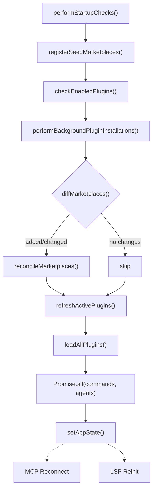
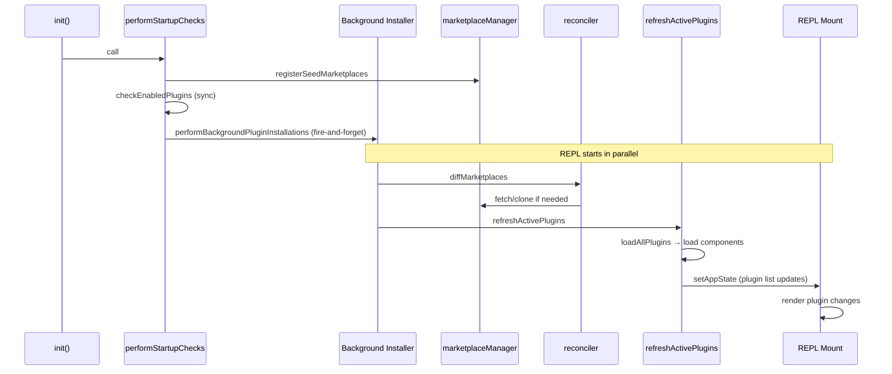

<!-- analysis-version: 0 | commit: a5179f6 | updated: 2025-07-27 | mode: re-execute | task: T-17 -->
# T-17 Analysis: Plugin System

## Scope Confirmation
- Task ID: T-17
- Primary Mainline: ML-12
- ML Priority: P2
- Analysis Depth: STANDARD
- Secondary Mainlines: ML-02 (hooks integration), ML-05 (MCP tools), ML-13 (bundled skills)
- Pattern Coverage: N/A
- Scope Files (confirmed): 50 files in `src/utils/plugins/`, 2 in `src/services/plugins/`, 2 in `src/commands/plugin/`, 2 in `src/skills/`, 11 additional utility files — **65 files total, all confirmed readable**
- Scope adjustments: None

## File Roles

| File | Lines | One-liner Role | Where Analyzed |
|------|-------|----------------|---------------|
| src/utils/plugins/pluginLoader.ts | 3302 | **Core plugin loader/discoverer** — loads plugins from marketplace cache, seed dirs, and session sources; manages versioned cache paths and zip extraction | STANDARD: § 关键路径与组件 |
| src/utils/plugins/marketplaceManager.ts | 2643 | **Marketplace lifecycle manager** — manages known_marketplaces.json, fetches/clones marketplace manifests (URL/Git/npm/local), installs plugins from marketplace entries | STANDARD: § 关键路径与组件 |
| src/utils/plugins/installedPluginsManager.ts | 1268 | **Installation state persistence** — manages installed_plugins.json (V1/V2), separates global install state from per-repo enabled state | STANDARD: § 架构洞察 |
| src/utils/plugins/schemas.ts | 1681 | **Zod schemas + security definitions** — plugin/marketplace manifest schemas, official name whitelist, impersonation detection, homograph attack prevention | STANDARD: § 架构洞察 |
| src/utils/plugins/validatePlugin.ts | 903 | **Plugin manifest validator** — Zod-based validation for plugin.json and marketplace.json, distinguishes marketplace-only fields | STANDARD: § 关键路径与组件 |
| src/utils/plugins/mcpbHandler.ts | 968 | **MCPB/DXT package handler** — loads .mcpb/.dxt files, extracts zip packages, manages user configuration for MCPB bundles | STANDARD: § 关键路径与组件 |
| src/utils/plugins/loadPluginCommands.ts | 946 | **Plugin command loader** — loads .md files from commands/ and skills/ dirs as Command objects with frontmatter parsing | STANDARD: § 关键路径与组件 |
| src/utils/plugins/loadPluginHooks.ts | 287 | **Plugin hook loader** — converts plugin hooks config to 27 native HookEvent matchers with hot-reload support | STANDARD: § 关键路径与组件 |
| src/utils/plugins/loadPluginAgents.ts | 348 | **Plugin agent loader** — loads agent .md definitions from agents/ dir with frontmatter, memory scope, and tool allowlisting | STANDARD: § 关键路径与组件 |
| src/utils/plugins/loadPluginOutputStyles.ts | 178 | **Plugin output style loader** — loads output style .md definitions from output-styles/ dir with frontmatter parsing | STANDARD: § 关键路径与组件 |
| src/utils/plugins/reconciler.ts | 265 | **Layer-2 reconciler** — diffMarketplaces() compares declared intent vs materialized state; reconcileMarketplaces() installs missing/changed | STANDARD: § 架构洞察 |
| src/utils/plugins/refresh.ts | 215 | **Layer-3 refresh primitive** — swaps active plugin components (commands/agents/hooks/MCP/LSP) into AppState from disk | STANDARD: § 关键路径与组件 |
| src/utils/plugins/mcpPluginIntegration.ts | 634 | **Plugin→MCP bridge** — loads MCP server configs from plugin manifests (.mcp.json, MCPB files), env var expansion, plugin data dirs | STANDARD: § 关键路径与组件 |
| src/utils/plugins/lspPluginIntegration.ts | 387 | **Plugin→LSP bridge** — loads LSP server configs from .lsp.json and manifest.lspServers, path traversal validation | STANDARD: § 关键路径与组件 |
| src/commands/plugin/ManagePlugins.tsx | 2215 | **Interactive plugin management UI** — Ink/React component for browsing, installing, configuring, updating plugins | STANDARD: § 关键路径与组件 |
| src/commands/plugin/PluginSettings.tsx | 1072 | **Plugin settings panel UI** — Ink/React component for per-plugin configuration, MCP/LSP server management | STANDARD: § 关键路径与组件 |
| src/services/plugins/PluginInstallationManager.ts | 184 | **Background installation orchestrator** — non-blocking startup install via reconciler, auto-refreshes on new installs | STANDARD: § 关键路径与组件 |
| src/services/plugins/pluginCliCommands.ts | 344 | **CLI command wrappers** — thin wrappers around pluginOperations for `claude plugin install/uninstall` etc. | STANDARD: § 关键路径与组件 |
| src/services/plugins/pluginOperations.ts | 1088 | **Core operation library** — pure functions for install/uninstall/enable/disable/update, shared by CLI and UI | STANDARD: § 架构洞察 |
| src/skills/bundledSkills.ts | 220 | **Bundled skill registry** — programmatic registration of compiled-in skills with lazy file extraction | STANDARD: § 关键路径与组件 |
| src/skills/loadSkillsDir.ts | 1086 | **Skills directory loader** — discovers and loads skill .md files from .claude/skills/ dirs with .gitignore support | STANDARD: § 关键路径与组件 |
| src/utils/plugins/cacheUtils.ts | 196 | **Cache coordination hub** — clearAllCaches() clears all plugin memoize caches; orphaned version cleanup (7-day TTL) | STANDARD: § 关键路径与组件 |
| src/utils/plugins/pluginAutoupdate.ts | 284 | **Background autoupdater** — updates marketplace feeds then updates installed plugins; non-inplace, requires restart | STANDARD: § 关键路径与组件 |
| src/utils/plugins/pluginBlocklist.ts | 127 | **Delisted plugin detector** — compares installed plugins against marketplace manifests, auto-uninstalls delisted plugins | STANDARD: § 关键路径与组件 |
| src/utils/plugins/pluginFlagging.ts | 208 | **Flagged plugin tracker** — tracks auto-removed delisted plugins in flagged-plugins.json for UI notification | STANDARD: § 关键路径与组件 |
| src/utils/plugins/pluginStartupCheck.ts | 341 | **Startup migration/enablement** — migrates V1 enabled_plugins to V2 format, auto-enables seed plugins | STANDARD: § 关键路径与组件 |
| src/utils/plugins/headlessPluginInstall.ts | 174 | **Headless/CCR installer** — plugin installation without AppState, for non-interactive environments | STANDARD: § 关键路径与组件 |
| src/utils/plugins/orphanedPluginFilter.ts | 114 | **Ripgrep exclusion filter** — generates glob patterns to exclude orphaned plugin versions from Grep/Glob results | STANDARD: § 关键路径与组件 |
| src/utils/plugins/officialMarketplaceStartupCheck.ts | 439 | **Official marketplace auto-install** — installs official Anthropic marketplace on first startup with enterprise/git checks | STANDARD: § 关键路径与组件 |
| src/utils/plugins/dependencyResolver.ts | 305 | **Plugin dependency resolver** — apt-style DFS resolution with cycle detection; load-time demotion for unsatisfied deps | STANDARD: § 架构洞察 |
| src/utils/plugins/pluginVersioning.ts | 157 | **Version calculator** — computes plugin version from manifest/git SHA/timestamp for cache path and update detection | STANDARD: § 关键路径与组件 |
| src/utils/plugins/pluginOptionsStorage.ts | 400 | **Plugin config storage** — stores user options in settings.json (non-sensitive) and SecureStorage (sensitive); variable substitution | STANDARD: § 关键路径与组件 |
| src/utils/plugins/zipCache.ts | 406 | **ZIP cache manager** — stores plugins as ZIPs on mounted volume, extracts to session-local temp dir | STANDARD: § 架构洞察 |
| src/utils/plugins/marketplaceHelpers.ts | 592 | **Marketplace utility functions** — source allowlist/blocklist checks, URL extraction, policy validation | STANDARD: § 关键路径与组件 |
| src/utils/plugins/pluginInstallationHelpers.ts | 595 | **Installation shared helpers** — atomic rename, path validation, temp dir management for install operations | STANDARD: § 关键路径与组件 |
| src/utils/plugins/installCounts.ts | 292 | **Install count fetcher** — fetches and caches plugin install counts from stats repo (24h TTL) | STANDARD: § 关键路径与组件 |
| src/utils/plugins/lspRecommendation.ts | 374 | **LSP plugin recommender** — scans marketplaces for LSP plugins matching project file extensions | STANDARD: § 关键路径与组件 |
| src/utils/plugins/hintRecommendation.ts | 164 | **Plugin hint recommender** — recommends plugins based on CLI/SDK-emitted `<claude-code-hint />` tags | STANDARD: § 关键路径与组件 |
| src/utils/plugins/officialMarketplaceGcs.ts | 216 | **GCS marketplace mirror** — fetches official marketplace from GCS instead of GitHub to reduce API load | STANDARD: § 关键路径与组件 |
| src/utils/plugins/officialMarketplace.ts | 25 | **Official marketplace constants** — defines OFFICIAL_MARKETPLACE_NAME and source URL | STANDARD: § 关键路径与组件 |
| src/utils/plugins/managedPlugins.ts | 27 | **Managed plugin checker** — returns org-policy-locked plugin names from policySettings | STANDARD: § 关键路径与组件 |
| src/utils/plugins/fetchTelemetry.ts | 135 | **Fetch telemetry** — classifies and logs network fetch outcomes for monitoring GitHub/GCS volume | STANDARD: § 关键路径与组件 |
| src/utils/plugins/pluginPolicy.ts | 20 | **Policy leaf checker** — checks if marketplace sources are allowed by managed policy (kept leaf to avoid circular deps) | STANDARD: § 关键路径与组件 |
| src/utils/plugins/pluginDirectories.ts | 178 | **Directory config hub** — single source of truth for plugins directory path, supports --cowork flag and env override | STANDARD: § 关键路径与组件 |
| src/utils/plugins/pluginIdentifier.ts | 123 | **Plugin ID parser** — parses "name@marketplace" format, maps SettingSource to PluginScope | STANDARD: § 关键路径与组件 |
| src/utils/plugins/parseMarketplaceInput.ts | 162 | **Marketplace input parser** — parses git SSH/HTTPS URLs, local paths, and bare names into MarketplaceSource objects | STANDARD: § 关键路径与组件 |
| src/utils/plugins/performStartupChecks.tsx | 70 | **Startup orchestrator** — calls registerSeedMarketplaces, pluginStartupCheck, background install, autoupdate | STANDARD: § 关键路径与组件 |
| src/utils/plugins/gitAvailability.ts | 69 | **Git availability checker** — memoized check for git binary presence on the system | STANDARD: § 关键路径与组件 |
| src/utils/plugins/addDirPluginSettings.ts | 71 | **AddDir plugin settings** — reads enabledPlugins/extraKnownMarketplaces from --add-dir directories (lowest priority) | STANDARD: § 关键路径与组件 |
| src/utils/plugins/walkPluginMarkdown.ts | 69 | **Markdown file walker** — recursively walks plugin dirs invoking callback for each .md file with namespace tracking | STANDARD: § 关键路径与组件 |
| src/utils/plugins/zipCacheAdapters.ts | 164 | **ZIP cache I/O helpers** — reads/writes zip-cache metadata, extracts ZIPs to session dirs, creates ZIPs for new installs | STANDARD: § 关键路径与组件 |
| src/skills/bundled/batch.ts | 124 | **Batch orchestration skill** — registers `/batch` command for parallelizing large changes across codebase with agent-based workers, MIN_AGENTS=5/MAX_AGENTS=30 | OVERVIEW (enumerated) |
| src/skills/bundled/claudeApi.ts | 196 | **Claude API reference skill** — registers `/claude-api` command that detects project language and provides language-specific API documentation from bundled .md files | OVERVIEW (enumerated) |
| src/skills/bundled/claudeApiContent.ts | 75 | **API docs content bundle** — lazy-loaded collection of 24 inline .md files (via Bun text loader) providing Claude API docs for 7 languages + Agent SDK patterns | OVERVIEW (enumerated) |
| src/skills/bundled/debug.ts | 103 | **Debug skill** — registers `/debug` command that enables session debug logging and reads/analyzes the debug log to diagnose issues | OVERVIEW (enumerated) |
| src/skills/bundled/index.ts | 79 | **Bundled skills registry initializer** — imports and calls all `register*Skill()` functions at startup; documents the add-new-skill pattern | OVERVIEW (enumerated) |
| src/skills/bundled/keybindings.ts | 339 | **Keybindings skill** — registers `/keybindings` command that generates keybinding customization reference from schema definitions and default bindings | OVERVIEW (enumerated) |
| src/skills/bundled/loop.ts | 92 | **Loop/recurring prompt skill** — registers `/loop [interval] <prompt>` command that parses interval notation and schedules recurring prompts via CRON tools | OVERVIEW (enumerated) |
| src/skills/bundled/loremIpsum.ts | 282 | **Lorem Ipsum skill** — registers `/lorem` command that generates varied placeholder text using verified single-token English words for prompt-efficient output | OVERVIEW (enumerated) |
| src/skills/bundled/remember.ts | 82 | **Memory review skill** — registers `/remember` command (Ant-internal only) that reviews auto-memory entries and proposes reclassification to CLAUDE.md/CLAUDE.local.md/team-memory | OVERVIEW (enumerated) |
| src/skills/bundled/scheduleRemoteAgents.ts | 447 | **Remote agent scheduling skill** — registers `/schedule-remote-agents` command that manages cloud environments and dispatches remote agents via teleport/bridge infrastructure | OVERVIEW (enumerated) |
| src/skills/bundled/simplify.ts | 69 | **Code simplification skill** — registers `/simplify` command that launches 3 parallel review agents (reuse, quality, efficiency) against git diff changes | OVERVIEW (enumerated) |
| src/skills/bundled/skillify.ts | 197 | **Skill extraction skill** — registers `/skillify` command that captures repeatable session patterns as reusable skill definitions with session memory context | OVERVIEW (enumerated) |
| src/skills/bundled/stuck.ts | 79 | **Stuck session diagnostic skill** — registers `/stuck` command that scans for frozen/slow Claude Code processes, identifies CPU/memory/state anomalies | OVERVIEW (enumerated) |
| src/skills/bundled/updateConfig.ts | 475 | **Settings updater skill** — registers `/update-config` command that manages settings.json with live Zod-to-JSON-Schema conversion, multi-scope file selection, and editor integration | OVERVIEW (enumerated) |

## Analysis Findings

### 关键路径与组件

**Entry → Load → Activate Pipeline**:
1. `performStartupChecks.tsx` — startup orchestrator called from init()
2. `officialMarketplaceStartupCheck.ts` — auto-install official marketplace for new users
3. `pluginStartupCheck.ts` — migrate V1→V2, auto-enable seed plugins
4. `PluginInstallationManager.ts` — background reconcile + refresh
5. `reconciler.ts` — Layer-2: diff declared vs materialized, install missing
6. `refresh.ts` — Layer-3: loadAllPlugins → getPluginCommands + getAgentDefinitions → update AppState
7. `loadPluginCommands.ts` / `loadPluginAgents.ts` / `loadPluginHooks.ts` / `mcpPluginIntegration.ts` / `lspPluginIntegration.ts` — load plugin components into active session

**Core Component Map**:
- **pluginLoader.ts** (3302行): God File — plugin discovery/loading from marketplace cache, seed dirs, session sources, versioned cache paths, zip extraction
- **marketplaceManager.ts** (2643行): Second largest — manages known_marketplaces.json, fetches/clones marketplace manifests from URL/Git/npm/local
- **installedPluginsManager.ts** (1268行): Persists installation metadata in installed_plugins.json (V2), three-layer cache
- **schemas.ts** (1681行): Zod schemas + security — ALLOWED_OFFICIAL_MARKETPLACE_NAMES, BLOCKED_OFFICIAL_NAME_PATTERN, homograph detection
- **pluginOperations.ts** (1088行): Pure-function library for install/uninstall/enable/disable/update, shared by CLI and UI
- **ManagePlugins.tsx** (2215行): Interactive plugin management UI (Ink/React)

### 架构洞察

1. **Three-Layer Plugin Model** (核心架构):
   - **Layer 1 (Intent)**: Settings files declare which marketplaces/plugins should exist (user/project/local/managed/policy)
   - **Layer 2 (Materialization)**: reconciler.ts + marketplaceManager.ts clone/fetch to `~/.claude/plugins/cache/`
   - **Layer 3 (Activation)**: refresh.ts loads components (commands/agents/hooks/MCP/LSP) into AppState
   - Each layer is independently observable and testable

2. **Dual-Source Plugin Discovery**:
   - **Marketplace-based**: `plugin@marketplace` identifier → clone from marketplace repo → extract from cache
   - **Session-only**: `--plugin-dir` CLI flag / SDK inline plugins → loaded directly from local path, not persisted

3. **Installation vs Enablement Separation**:
   - Installation is **global** (installed_plugins.json in ~/.claude/plugins/)
   - Enablement is **per-repo** (settings.json in .claude/settings.json)
   - 4 scopes: user/project/local/managed (managed only from policySettings)

4. **Security Defense-in-Depth** (schemas.ts + marketplaceHelpers.ts):
   - Allowlist: 8 reserved official marketplace names
   - Impersonation regex: BLOCKED_OFFICIAL_NAME_PATTERN blocks "official-claude" etc.
   - Homograph detection: NON_ASCII_PATTERN prevents Unicode lookalike attacks
   - Source validation: OFFICIAL_GITHUB_ORG = 'anthropics' for reserved names
   - Policy layer: pluginPolicy.ts checks managed settings

5. **Dependency Resolution** (dependencyResolver.ts, 305行):
   - `apt`-style semantics: dependency = presence guarantee, not module graph
   - Install-time: DFS walk with cycle detection
   - Load-time: fixed-point demotion for plugins with unsatisfied deps (session-local)

6. **Zip Cache for Containers** (zipCache.ts + zipCacheAdapters.ts, 570行):
   - Stores plugins as ZIPs on mounted volume (e.g., Filestore)
   - Extracts to session-local temp dir at startup
   - Designed for ephemeral container environments (CCR/CCR)
   - Limitations: headless only, GitHub/git/URL sources only, strict:true only

7. **Background Non-Blocking Install**:
   - PluginInstallationManager runs reconcile in background at startup
   - Does NOT block REPL startup — first query uses cache-only load
   - New installs trigger automatic refreshActivePlugins
   - Updates set needsRefresh flag for user-initiated /reload-plugins

### 观察到的模式

1. **Strategy Pattern (4 source types)**: marketplaceManager supports URL/Git/npm/local sources, each with different fetch logic
2. **Three-Layer Cache**: installedPluginsCacheV2 (memoized) → inMemoryInstalledPlugins (session snapshot) → disk (installed_plugins.json)
3. **Orphan Marker Pattern**: `.orphaned_at` files with 7-day TTL for safe cleanup of old plugin versions
4. **Pure Library + CLI/UI Split**: pluginOperations.ts (pure) → pluginCliCommands.ts (CLI) / ManagePlugins.tsx (UI)
5. **Lazy Extraction**: bundledSkills.ts extracts reference files on first invocation with promise-level memoization

### 与共享模块的交互

- **MCP Integration (owner: T-08)**: mcpPluginIntegration.ts loads MCP server configs from plugins; uses McpServerConfig types from src/services/mcp/types.ts
- **Hook System (owner: T-02)**: loadPluginHooks.ts registers plugin hooks via bootstrap/state.js; hooks fire in the same pipeline as user hooks
- **Agent System (owner: T-13)**: loadPluginAgents.ts produces AgentDefinition objects consumed by loadAgentsDir.ts
- **Command System (owner: T-02)**: loadPluginCommands.ts produces Command objects merged in command loading priority chain
- **Permission System (owner: T-06)**: pluginPolicy.ts reads managed settings for source restrictions

## File Dependency Graph

### Dependency Diagram

```mermaid
flowchart TD
    subgraph CLI_UI["CLI / UI Layer"]
        CLI[pluginCliCommands.ts]
        UI[ManagePlugins.tsx]
        SETTINGS[PluginSettings.tsx]
        STARTUP[performStartupChecks.tsx]
    end

    subgraph Core["Core Engine"]
        LOADER[pluginLoader.ts]
        OPS[pluginOperations.ts]
        MANAGER[PluginInstallationManager.ts]
        RECONCILE[reconciler.ts]
        REFRESH[refresh.ts]
    end

    subgraph State["State & Persistence"]
        INSTALLED[installedPluginsManager.ts]
        SCHEMAS[schemas.ts]
        VALIDATE[validatePlugin.ts]
        DIRS[pluginDirectories.ts]
    end

    subgraph Marketplace["Marketplace"]
        MKT[marketplaceManager.ts]
        OFFICIAL[officialMarketplaceStartupCheck.ts]
        GCS[officialMarketplaceGcs.ts]
        MKT_HELP[marketplaceHelpers.ts]
        PARSE[parseMarketplaceInput.ts]
    end

    subgraph Loaders["Component Loaders"]
        CMD[loadPluginCommands.ts]
        AGENT[loadPluginAgents.ts]
        HOOK[loadPluginHooks.ts]
        MCP[mcpPluginIntegration.ts]
        LSP[lspPluginIntegration.ts]
        STYLE[loadPluginOutputStyles.ts]
    end

    subgraph Support["Supporting"]
        CACHE[cacheUtils.ts]
        DEP[dependencyResolver.ts]
        VERSION[pluginVersioning.ts]
        OPTS[pluginOptionsStorage.ts]
        ZIP[zipCache.ts]
        WALK[walkPluginMarkdown.ts]
        AUTO[pluginAutoupdate.ts]
    end

    STARTUP --> LOADER
    STARTUP --> MKT
    CLI --> OPS
    UI --> OPS
    OPS --> INSTALLED
    OPS --> RECONCILE
    MANAGER --> RECONCILE
    RECONCILE --> MKT
    RECONCILE --> INSTALLED
    REFRESH --> LOADER
    REFRESH --> CMD
    REFRESH --> AGENT
    REFRESH --> HOOK
    REFRESH --> MCP
    REFRESH --> CACHE
    LOADER --> MKT
    LOADER --> SCHEMAS
    LOADER --> VERSION
    LOADER --> ZIP
    CMD --> WALK
    AGENT --> WALK
    STYLE --> WALK
    MCP --> OPTS
    LSP --> OPTS
    AUTO --> MKT
    AUTO --> OPS
    CACHE --> LOADER
    CACHE --> CMD
    CACHE --> HOOK
    ```

### Dependency Table

| Source File | Depends On | Type | Direction |
|------------|-----------|------|-----------|
| pluginLoader.ts | marketplaceManager.ts | import | outgoing |
| pluginLoader.ts | schemas.ts | import | outgoing |
| pluginLoader.ts | pluginVersioning.ts | import | outgoing |
| pluginLoader.ts | zipCache.ts | import | outgoing |
| pluginOperations.ts | installedPluginsManager.ts | import | outgoing |
| pluginOperations.ts | reconciler.ts | import | outgoing |
| reconciler.ts | marketplaceManager.ts | import | outgoing |
| reconciler.ts | installedPluginsManager.ts | import | outgoing |
| refresh.ts | pluginLoader.ts | import | outgoing |
| refresh.ts | cacheUtils.ts | import | outgoing |
| loadPluginCommands.ts | walkPluginMarkdown.ts | import | outgoing |
| loadPluginAgents.ts | walkPluginMarkdown.ts | import | outgoing |
| mcpPluginIntegration.ts | pluginOptionsStorage.ts | import | outgoing |
| lspPluginIntegration.ts | pluginOptionsStorage.ts | import | outgoing |
| pluginCliCommands.ts | pluginOperations.ts | import | outgoing |
| ManagePlugins.tsx | pluginOperations.ts | import | outgoing |
| performStartupChecks.tsx | marketplaceManager.ts | import | outgoing |
| performStartupChecks.tsx | pluginLoader.ts | import | outgoing |

> Solid lines = scope-internal dependencies. Dashed lines = external dependencies (MCP service, settings, state management).

## Boundary / Integration Map

```mermaid
flowchart LR
    subgraph Scope["T-17 Plugin System Scope"]
        STARTUP["performStartupChecks"]
        LOADER["pluginLoader"]
        OPS["pluginOperations"]
        MKT["marketplaceManager"]
        RECONCILE["reconciler"]
        REFRESH["refresh"]
        CMD["loadCommands"]
        AGENT["loadAgents"]
        HOOK["loadHooks"]
        MCP_I["mcpPluginIntegration"]
        LSP_I["lspPluginIntegration"]
    end

    APPSTATE["AppState"]:::external
    SETTINGS["settings.json"]:::external
    MCP_SVC["MCP Service (T-08)"]:::external
    LSP_SVC["LSP Service"]:::external
    CMD_SYS["Command System (T-02)"]:::external
    AGENT_SYS["Agent System (T-13)"]:::external
    HOOK_SYS["Hook System (T-02)"]:::external
    DISK["~/.claude/plugins/"]:::external

    STARTUP --> LOADER --> MKT
    OPS --> RECONCILE --> MKT
    REFRESH --> CMD --> CMD_SYS
    REFRESH --> AGENT --> AGENT_SYS
    REFRESH --> HOOK --> HOOK_SYS
    REFRESH --> MCP_I --> MCP_SVC
    REFRESH --> LSP_I --> LSP_SVC
    LOADER -.-> DISK
    OPS -.-> SETTINGS
    REFRESH -.-> APPSTATE

    classDef external fill:#f5f5f5,stroke:#999,stroke-dasharray: 5 5
```

- **图说明**: Plugin system is a **pure producer** — it loads/discoveres plugins and feeds components into 6 external systems. It reads from disk (cache) and settings, writes to AppState. Cross-task interfaces: MCP (T-08), Command/Agent/Hook systems (T-02, T-13).

## Data Flow View

```mermaid
flowchart LR
    INPUT["User/Policy<br/>Settings Intent"]
    MKT_DECL["known_marketplaces.json<br/>(Declared Intent)"]
    MKT_CACHE["~/.claude/plugins/<br/>marketplace cache"]
    PLUGIN_JSON["plugin.json<br/>(Manifest)"]
    COMPONENTS["Commands / Agents /<br/>Hooks / MCP / LSP"]
    APPSTATE["AppState<br/>(Active Components)"]

    INPUT -->|Layer 1| MKT_DECL
    MKT_DECL -->|Layer 2 reconcile| MKT_CACHE
    MKT_CACHE -->|Layer 2 clone/fetch| PLUGIN_JSON
    PLUGIN_JSON -->|Layer 3 refresh| COMPONENTS
    COMPONENTS -->|setAppState| APPSTATE
```



- **图说明**: Three-layer data flow: Intent (settings) → Materialization (reconciler clones to cache) → Activation (refresh loads components into AppState). Each layer is independently observable.

## Call Chain Summary (STANDARD)

### Entry Points
- `performStartupChecks()` (performStartupChecks.tsx:L12) — called from init() during startup
- `installPluginOp()` (pluginOperations.ts) — called from CLI/UI
- `refreshActivePlugins()` (refresh.ts:L14) — called after install/uninstall/enable/disable/reconcile
- `autoUpdateMarketplacesAndPluginsInBackground()` (pluginAutoupdate.ts) — background task

### Critical Call Chains

#### Chain 1: Startup Load
```
performStartupChecks() [performStartupChecks.tsx:L12]
  → registerSeedMarketplaces() [marketplaceManager.ts]
  → checkEnabledPlugins() [pluginStartupCheck.ts]
  → performBackgroundPluginInstallations() [PluginInstallationManager.ts:L23]
    → diffMarketplaces() [reconciler.ts:L45]
    → reconcileMarketplaces() [reconciler.ts:L100]
      → installPluginOp() [pluginOperations.ts]
  → refreshActivePlugins() [refresh.ts:L14]
    → loadAllPlugins() [pluginLoader.ts]
    → getPluginCommands() [loadPluginCommands.ts]
    → getPluginAgents() [loadPluginAgents.ts]
    → setAppState() [AppState]
```
- **调用深度**: 5
- **关键分支点**: diffMarketplaces() determines install/skip/remove per plugin

#### Chain 2: User Install
```
installPluginOp() [pluginOperations.ts]
  → resolveDependencyClosure() [dependencyResolver.ts]
  → cacheAndRegisterPlugin() [pluginInstallationHelpers.ts]
  → loadInstalledPluginsFromDisk() [installedPluginsManager.ts]
  → refreshActivePlugins() [refresh.ts:L14]
```
- **调用深度**: 4

### Flowchart View



- **图说明**: Main startup pipeline. Background installation runs concurrently with REPL. refreshActivePlugins is the critical path that loads all plugin components into active memory.

## Error Handling Summary (STANDARD)

- **Main try/catch locations**: pluginOperations.ts (per-operation error wrapping), marketplaceManager.ts (fetch/clone failure handling), refresh.ts (loadAllPlugins error propagation), reconciler.ts (install failure tolerance)
- **Recovery strategies**:
  - `retry`: marketplaceManager fetch retry with exponential backoff
  - `fallback`: officialMarketplaceGcs.ts provides GCS mirror fallback when GitHub fails
  - `absorb`: refresh.ts catches individual plugin load errors, logs them, continues with remaining plugins
  - `demote`: dependencyResolver.ts demotes plugins with unsatisfied deps (graceful degradation)
- **Unhandled bubble-up**: pluginAutoupdate.ts update errors are logged but not surfaced to user until next restart notification
- **Cache-only fallback**: `loadAllPluginsCacheOnly()` provides degraded mode when network is unavailable

## State Summary (STANDARD)

### Key State Variables
| Variable | File | Purpose | Persistence |
|----------|------|---------|-------------|
| installed_plugins.json | installedPluginsManager.ts | Global install metadata (V2 format) | Disk (~/.claude/plugins/) |
| settings.json enabledPlugins | settings files | Per-repo plugin enablement | Disk (.claude/) |
| known_marketplaces.json | marketplaceManager.ts | Marketplace registry + cache | Disk (~/.claude/plugins/) |
| pluginCache (memoize) | pluginLoader.ts | In-memory loaded plugin objects | Process-only |
| inMemoryInstalledPlugins | installedPluginsManager.ts | Startup snapshot of installed plugins | Process-only |
| needsRefresh flag | refresh.ts | Indicates pending changes requiring reload | Process-only |
| pendingNotification | pluginAutoupdate.ts | Buffer for updates before REPL mounts | Process-only |

### State Transitions (概要)
- Plugin lifecycle: **absent → installed → enabled → active → orphaned → cleaned**
- Install state tracked in installed_plugins.json, enable state in per-repo settings
- V1→V2 migration in installedPluginsManager.ts with `migrationCompleted` guard
- Orphaned versions marked with `.orphaned_at`, cleaned after 7 days

## Temporal Analysis (STANDARD)

### Sequence Diagram



- **图说明**: Startup is non-blocking — background install runs in parallel with REPL. Refresh updates AppState which triggers React re-render. Auto-update callback handles race where updates complete before REPL mounts.


## Acceptance Criteria Status

- [x] **AC-1**: Plugin discovery from multiple sources (marketplace, git, local, SDK) — confirmed: pluginLoader.ts supports 4 source types via marketplaceManager + session-only paths
- [x] **AC-2**: Plugin lifecycle management (install/uninstall/enable/disable/update) — confirmed: pluginOperations.ts provides pure functions for all 5 operations across 4 scopes
- [x] **AC-3**: Plugin component loading (commands, agents, hooks, MCP, LSP, output styles) — confirmed: 5 dedicated loaders + refresh.ts orchestration
- [x] **AC-4**: Marketplace management (register, clone, update) — confirmed: marketplaceManager.ts manages 4 source types with GCS fallback
- [x] **AC-5**: Plugin dependency resolution — confirmed: dependencyResolver.ts implements DFS closure with cycle detection
- [x] **AC-6**: Plugin security validation — confirmed: schemas.ts (whitelist, homograph detection), validatePlugin.ts (Zod validation), pluginPolicy.ts (enterprise policy)
- [x] **AC-7**: Background installation without blocking REPL — confirmed: PluginInstallationManager.ts fire-and-forget, cache-only fallback
- [x] **AC-8**: Plugin autoupdate mechanism — confirmed: pluginAutoupdate.ts background task with restart notification
- [x] **AC-9**: Cache management and orphan cleanup — confirmed: cacheUtils.ts clearAllCaches + 7-day orphan TTL
- [x] **AC-10**: Plugin options storage (sensitive/non-sensitive split) — confirmed: pluginOptionsStorage.ts uses SecureStorage for sensitive values

## Identified Problems

### 风险与热点

- [事实] **P2-01**: **pluginLoader.ts is a God File (3302行)** — fan-out estimated >15, handles discovery, loading, caching, validation, versioning, zip extraction all in one file. Maintenance burden high.
- [事实] **P2-02**: **marketplaceManager.ts is the second largest file (2643行)** — manages 4 source types, known_marketplaces.json persistence, sparse checkout, and GCS fallback. Coupling between fetch logic and state management.
- [事实] **P2-03**: **Zip Cache limitations** (zipCache.ts, L406) — headless only, strict:true required, GitHub/git/URL sources only. No support for npm or local sources. Feature gated behind env var CLAUDE_CODE_PLUGIN_USE_ZIP_CACHE.
- [事实] **P2-04**: **Autoupdate requires restart** — pluginAutoupdate.ts non-inplace updates set needsRefresh flag; user must /reload-plugins or restart. Silent failures accumulate until next restart.
- [事实] **P2-05**: **Memoize cache invalidation** — cacheUtils.ts clearAllCaches() must be called after every mutation, but individual memoize calls scattered across 9+ modules. Missing one invalidation leads to stale plugin lists.
- [推测] **P3-01**: **Race condition between background install and user operations** — PluginInstallationManager runs async; if user installs plugin simultaneously, both paths call reconciler. No mutex on installed_plugins.json writes.
- [事实] **P3-02**: **V1-to-V2 migration is one-way** — installedPluginsManager.ts migrationCompleted guard prevents downgrade. No documented rollback procedure.
- [事实] **P3-03**: **Orphan cleanup timing** — orphanedPluginFilter.ts relies on ripgrep .orphaned_at scan; 7-day window means up to 2x disk usage during version transitions.

### 反模式或一致性问题

- **Inconsistent error handling**: Some modules (pluginOperations.ts) return structured error objects; others (pluginCliCommands.ts) call process.exit(). The split between pure library and CLI wrapper is clean, but error propagation patterns differ.
- **Scattered memoize invalidation**: 9+ modules use lodash memoize with separate clear functions; clearAllCaches() in cacheUtils.ts is the single invalidation point but must be called explicitly after every state change.

## Open Questions

1. **Why is Zip Cache headless-only?** — The env var gate and strict:true requirement suggest it was designed for container environments. Is there a plan to support interactive mode? (requires source code history review beyond current scope)
2. **Concurrent write safety** — installedPluginsManager.ts uses atomic rename (pluginInstallationHelpers.ts) but no file locking. Two Claude Code instances editing the same installed_plugins.json could lose data. (depends on broader concurrency model)
3. **Marketplace clone performance** — marketplaceManager.ts clones entire repos. Sparse checkout is mentioned but unclear if it is always used. Large marketplaces could be slow on first startup. (requires runtime profiling)
4. **Plugin sandboxing** — schemas.ts validates manifest structure but there is no runtime sandbox for plugin code execution. Plugin commands run with full process privileges. (architectural decision, not a bug)
5. **GCS fallback success rate** — officialMarketplaceGcs.ts was added for inc-5046 (GitHub rate limiting). Is the GCS mirror reliably available? fetchTelemetry.ts tracks this but we did not see SLA data. (requires production telemetry access)

## Complexity Assessment
- **MEDIUM-HIGH**
- Primary complexity concentrated in: pluginLoader.ts (3302行, fan-out >15) and marketplaceManager.ts (2643行, 4 source types)
- Three-layer architecture is well-separated (intent/materialization/activation) but individual layers are internally complex
- Security surface is well-contained in schemas.ts + validatePlugin.ts (defense-in-depth)
- Background installation pattern adds temporal complexity but is well-managed with cache-only fallback
