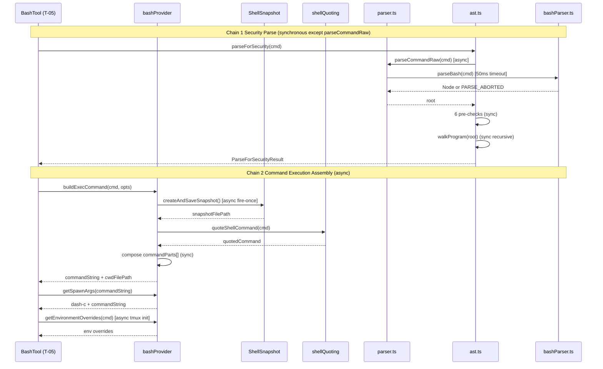
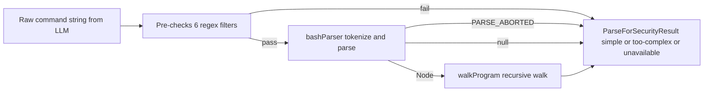
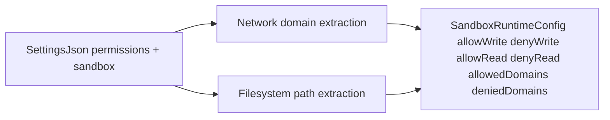
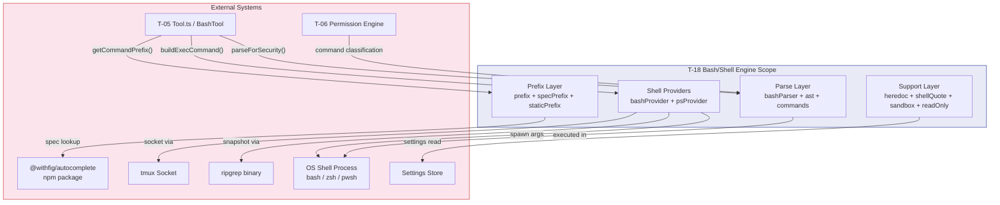

&lt;!-- analysis-version: 0 | commit: a5179f6 | updated: 2025-07-27 | mode: full | task: T-18 --&gt;
# T-18 Analysis: Bash/Shell引擎

## Scope Confirmation
- Task ID: T-18
- Primary Mainline: ML-13
- ML Priority: P2
- Analysis Depth: STANDARD
- Secondary Mainlines: []
- Pattern Coverage: none
- Scope Files (confirmed): 37 files, 18,665 lines — ALL EXIST
- Scope adjustments: none

The scope covers three major subsystems:
1. **Bash Parsing Engine** (`src/utils/bash/`) — Pure TypeScript bash parser producing tree-sitter-compatible ASTs, command splitting, heredoc handling, quoting, completion, and security analysis
2. **Shell Provider Layer** (`src/utils/shell/`) — Shell-agnostic abstraction with bash/PowerShell providers, prefix extraction, read-only command validation, output limits
3. **PowerShell Engine** (`src/utils/powershell/`) — PowerShell command parsing, static prefix extraction, dangerous cmdlet classification
4. **Sandbox Adapter** (`src/utils/sandbox/`) — Sandbox runtime configuration converter and filesystem path resolution

## File Roles

| File | Lines | One-liner Role | Where Analyzed |
|------|-------|----------------|---------------|
| src/utils/bash/bashParser.ts | 4436 | Pure-TS bash parser producing tree-sitter-compatible ASTs with 50ms timeout and 50K node budget | § Analysis Findings, § Call Chain Analysis |
| src/utils/bash/ast.ts | 2679 | AST walker for security analysis: fail-closed allowlist approach, extracts SimpleCommand[] with argv/redirects/envVars | § Analysis Findings, § Call Chain Analysis |
| src/utils/bash/commands.ts | 1339 | Legacy shell-quote-based command splitter with salted placeholders and heredoc extraction | § Analysis Findings, § Call Chain Analysis |
| src/utils/shell/readOnlyCommandValidation.ts | 1893 | Comprehensive read-only command maps for git/gh/docker/rg/pyright with safe-flag validation | § Analysis Findings |
| src/utils/powershell/parser.ts | 1804 | PowerShell AST parser via Invoke-Expression + ConvertTo-JSON pipeline, with Windows command length limits | § Analysis Findings |
| src/utils/sandbox/sandbox-adapter.ts | 985 | Converts Claude Code settings to SandboxRuntimeConfig, resolves filesystem paths and network domains | § Analysis Findings |
| src/utils/bash/ShellSnapshot.ts | 582 | Creates shell environment snapshots (aliases/functions/vars) via ripgrep or find+grep for session restoration | § Call Chain Analysis |
| src/utils/bash/heredoc.ts | 733 | Extracts and restores heredoc content from bash commands, handles all heredoc variants (&lt;&lt;, &lt;&lt;-, &lt;&lt;&lt;) | § Analysis Findings |
| src/utils/bash/treeSitterAnalysis.ts | 506 | Tree-sitter WASM bridge for bash parsing (legacy, being replaced by pure-TS bashParser) | § Analysis Findings |
| src/utils/bash/ParsedCommand.ts | 318 | IParsedCommand interface and builder functions: RegexParsedCommand (legacy) + buildParsedCommandFromRoot (tree-sitter) | § Call Chain Analysis |
| src/utils/bash/shellQuote.ts | 304 | Shell-quote library wrapper: tryParseShellCommand, quote, hasMalformedTokens, single-quote bug detection | § Analysis Findings |
| src/utils/bash/prefix.ts | 204 | Bash-specific getCommandPrefixStatic: parses command → extracts prefix for permission rule matching | § Call Chain Analysis |
| src/utils/bash/bashPipeCommand.ts | 294 | Rearranges pipe commands so stdin redirect applies to first command, not eval wrapper | § Analysis Findings |
| src/utils/bash/shellCompletion.ts | 259 | Shell tab-completion via external commands (compgen for bash) | § Analysis Findings |
| src/utils/bash/shellQuoting.ts | 128 | Command quoting utilities: quoteShellCommand, stdin redirect detection, Windows null rewrite | § Analysis Findings |
| src/utils/bash/registry.ts | 53 | Command spec registry: loads @withfig/autocomplete specs via dynamic import + memoized LRU cache | § Analysis Findings |
| src/utils/bash/shellPrefix.ts | 28 | Formats shell prefix command by prepending CLAUDE_CODE_SHELL_PREFIX | § Analysis Findings |
| src/utils/bash/parser.ts | 230 | Parser facade: wraps bashParser.ts, provides parseCommand/parseCommandRaw with PARSE_ABORTED sentinel | § Call Chain Analysis |
| src/utils/bash/specs/alias.ts | 14 | Fig spec override for alias command | § Analysis Findings |
| src/utils/bash/specs/index.ts | 18 | Barrel file importing all command spec overrides | § Analysis Findings |
| src/utils/bash/specs/nohup.ts | 13 | Fig spec override for nohup command | § Analysis Findings |
| src/utils/bash/specs/pyright.ts | 91 | Fig spec override for pyright with deep subcommand tree | § Analysis Findings |
| src/utils/bash/specs/sleep.ts | 13 | Fig spec override for sleep command | § Analysis Findings |
| src/utils/bash/specs/srun.ts | 31 | Fig spec override for srun (SLURM) command | § Analysis Findings |
| src/utils/bash/specs/time.ts | 13 | Fig spec override for time command | § Analysis Findings |
| src/utils/bash/specs/timeout.ts | 20 | Fig spec override for timeout command | § Analysis Findings |
| src/utils/shell/bashProvider.ts | 255 | ShellProvider impl for bash: builds exec command with snapshot sourcing, extglob disabling, env overrides | § Call Chain Analysis |
| src/utils/shell/prefix.ts | 367 | Generic command prefix extractor factory: createCommandPrefixExtractor/createSubcommandPrefixExtractor | § Analysis Findings |
| src/utils/shell/specPrefix.ts | 241 | Fig-spec-driven prefix depth calculator: walks spec tree to determine meaningful prefix depth | § Call Chain Analysis |
| src/utils/shell/shellProvider.ts | 33 | ShellProvider type definition + ShellType enum (bash/powershell) | § Analysis Findings |
| src/utils/shell/powershellDetection.ts | 107 | PowerShell path detection: finds pwsh.exe/powershell.exe, caches result, detects Core vs Desktop edition | § Analysis Findings |
| src/utils/shell/powershellProvider.ts | 123 | ShellProvider impl for PowerShell: builds args with -Command -NonInteractive wrapper | § Analysis Findings |
| src/utils/shell/shellToolUtils.ts | 22 | Constants: BASH_TOOL_NAME, POWERSHELL_TOOL_NAME, isPowerShellToolEnabled | § Analysis Findings |
| src/utils/shell/outputLimits.ts | 14 | Output limits: BASH_MAX_OUTPUT_UPPER_LIMIT=150K, BASH_MAX_OUTPUT_DEFAULT=30K | § Analysis Findings |
| src/utils/shell/resolveDefaultShell.ts | 14 | Resolves default shell to bash or powershell based on platform | § Analysis Findings |
| src/utils/powershell/staticPrefix.ts | 316 | PowerShell-specific prefix extractor: handles pipeline-chaining operators and dangerous cmdlet detection | § Call Chain Analysis |
| src/utils/powershell/dangerousCmdlets.ts | 185 | Classifies PowerShell cmdlets into 7 risk categories (filepath execution, script block, module loading, etc.) | § Analysis Findings |

## Analysis Findings

### F-01: Dual-Parser Architecture (bashParser.ts + ast.ts)
The system uses a **two-layer parser pipeline**: `bashParser.ts` (4436 lines) is a pure-TS tokenizer + recursive-descent parser producing tree-sitter-compatible `TsNode` ASTs with a 50ms wall-clock timeout and 50K node budget. `ast.ts` (2679 lines) is the **security walker** that consumes these ASTs with a fail-closed allowlist approach — any unrecognized node type → `too-complex` → user permission prompt. The parser is gated behind `feature('TREE_SITTER_BASH')` and falls back to the legacy `shell-quote` path when unavailable.

### F-02: Fail-Closed Security Model (ast.ts)
`parseForSecurity()` returns one of three results: `{kind: 'simple', commands}`, `{kind: 'too-complex', reason}`, or `{kind: 'parse-unavailable'}`. The `too-complex` classification is the security default — it triggers user permission prompts. Pre-checks run before tree-sitter to catch known parser differentials (control chars, Unicode whitespace, backslash-escaped whitespace, zsh-specific syntax, brace-with-quote obfuscation). `PARSE_ABORTED` sentinel (added for adversarial inputs) ensures timeout/node-budget hits also route to `too-complex` rather than falling through to the legacy path.

### F-03: Legacy Command Splitting Path (commands.ts)
`splitCommandWithOperators()` is the legacy shell-quote-based command parser (1339 lines). It uses salted placeholders (randomBytes(8) salt) to prevent injection attacks during heredoc extraction and quote handling. The salt prevents malicious commands from containing literal placeholder strings that would be replaced during parsing. This path is used when `TREE_SITTER_BASH` feature flag is off.

### F-04: Shell Provider Abstraction
`ShellProvider` interface defines a shell-agnostic contract: `buildExecCommand()`, `getSpawnArgs()`, `getEnvironmentOverrides()`. `bashProvider.ts` implements bash-specific behavior (snapshot sourcing, extglob disabling, pipe command rearrangement, tmux socket isolation). `powershellProvider.ts` wraps commands with `-Command -NonInteractive`. Both produce `{commandString, cwdFilePath}` for the tool execution layer.

### F-05: Fig Spec Registry for Prefix Extraction
`registry.ts` loads `@withfig/autocomplete` specs via dynamic import + LRU memoization. These specs drive `specPrefix.ts` which calculates prefix depth for permission rule matching — e.g., `git -C /repo status --short` → `git status`. Custom specs in `specs/` override/extend the Fig specs for commands like alias, nohup, pyright, srun, timeout.

### F-06: Read-Only Command Validation (1893 lines)
`readOnlyCommandValidation.ts` is a comprehensive map of git/gh/docker/rg/pyright subcommands with their safe flags and argument types. Each `ExternalCommandConfig` defines `safeFlags` (with `FlagArgType` classification) and optional `additionalCommandIsDangerousCallback` for complex validation. The `EXTERNAL_READONLY_COMMANDS` array lists cross-shell commands that bypass permission prompts.

### F-07: Shell Environment Snapshots
`ShellSnapshot.ts` creates persistent snapshots of the user's shell environment (aliases, functions, variables) by running `alias`, `declare -f`, and `declare -p` through either ripgrep-based integration or find+grep fallback. These snapshots are sourced at the start of each bash command execution to preserve the user's shell environment across tool invocations.

### F-08: Sandbox Adapter
`sandbox-adapter.ts` converts Claude Code settings (permissions, sandbox config) into `SandboxRuntimeConfig` format. It extracts allowed/denied domains from WebFetch rules, configures filesystem paths (write allowlist includes cwd + temp dir, write denylist includes settings files), and resolves path patterns for sandbox filesystem isolation.

### F-09: PowerShell Engine
The PowerShell path mirrors the bash path with separate parser (`powershell/parser.ts`, 1804 lines), prefix extractor (`staticPrefix.ts`), and dangerous cmdlet classification (`dangerousCmdlets.ts`). The parser uses `Invoke-Expression` + `ConvertTo-Json` pipeline to parse PowerShell commands. `dangerousCmdlets.ts` classifies cmdlets into 7 risk categories: filepath execution, script block, module loading, network, alias hijack, WMI/CIM, and arg-gated.

### F-10: Heredoc Handling
`heredoc.ts` (733 lines) extracts heredoc content before shell-quote parsing (which mishandles `<<`), replaces it with salted placeholders, and restores it after parsing. Supports all variants: `<<`, `<<-` (strip leading tabs), `<<<` (here-string), with and without quoting of the delimiter.

## File Dependency Graph

```mermaid
flowchart TD
    subgraph parse["Parse Layer"]
        bashParser["bashParser.ts<br/>4436L"]
        parserFacade["parser.ts<br/>230L"]
        astWalker["ast.ts<br/>2679L"]
        tsAnalysis["treeSitterAnalysis.ts<br/>506L"]
        parsedCmd["ParsedCommand.ts<br/>318L"]
        commands["commands.ts<br/>1339L"]
    end

    subgraph provider["Shell Provider Layer"]
        bashProv["bashProvider.ts<br/>255L"]
        psProv["powershellProvider.ts<br/>123L"]
        shellProv["shellProvider.ts<br/>33L"]
        snapshot["ShellSnapshot.ts<br/>582L"]
        prefix["prefix.ts<br/>204L"]
        shellPrefix["shell/prefix.ts<br/>367L"]
        specPrefix["specPrefix.ts<br/>241L"]
        registry["registry.ts<br/>53L"]
        shellPrefixCmd["shellPrefix.ts<br/>28L"]
    end

    subgraph ps["PowerShell Layer"]
        psParser["powershell/parser.ts<br/>1804L"]
        psStatic["staticPrefix.ts<br/>316L"]
        dangerous["dangerousCmdlets.ts<br/>185L"]
    end

    subgraph support["Support Layer"]
        heredoc["heredoc.ts<br/>733L"]
        shellQuote["shellQuote.ts<br/>304L"]
        shellQuoting["shellQuoting.ts<br/>128L"]
        pipeCmd["bashPipeCommand.ts<br/>294L"]
        completion["shellCompletion.ts<br/>259L"]
        sandbox["sandbox-adapter.ts<br/>985L"]
        readOnly["readOnlyCommandValidation.ts<br/>1893L"]
    end

    parserFacade --> bashParser
    astWalker --> bashParser
    astWalker --> parserFacade
    commands --> shellQuote
    commands --> heredoc
    bashProv --> snapshot
    bashProv --> pipeCmd
    bashProv --> shellPrefixCmd
    bashProv --> shellQuote
    bashProv --> shellQuoting
    prefix --> commands
    prefix --> parserFacade
    prefix --> registry
    shellPrefix --> specPrefix
    shellPrefix --> commands
    shellPrefix --> parserFacade
    shellPrefix --> registry
    specPrefix --> registry
    psStatic --> registry
    psStatic --> specPrefix
    psStatic --> dangerous
    psStatic --> psParser

    style parse fill:#e3f2fd,stroke:#1565c0
    style provider fill:#f3e5f5,stroke:#7b1fa2
    style ps fill:#e8f5e9,stroke:#2e7d32
    style support fill:#fff3e0,stroke:#ef6c00
```



**Dependency Table** (scope-internal edges only):

| Source | Target | Type |
|--------|--------|------|
| parser.ts | bashParser.ts | import (parseBash) |
| ast.ts | bashParser.ts | import (TsNode type) |
| ast.ts | parser.ts | import (parseCommandRaw) |
| commands.ts | heredoc.ts | import (extractHeredocs/restoreHeredocs) |
| commands.ts | shellQuote.ts | import (quote/tryParseShellCommand) |
| bashProvider.ts | ShellSnapshot.ts | import (createAndSaveSnapshot) |
| bashProvider.ts | bashPipeCommand.ts | import (rearrangePipeCommand) |
| bashProvider.ts | shellPrefix.ts | import (formatShellPrefixCommand) |
| bashProvider.ts | shellQuote.ts | import (quote) |
| bashProvider.ts | shellQuoting.ts | import (quoteShellCommand/rewriteWindowsNullRedirect) |
| prefix.ts (bash) | commands.ts | import (splitCommandWithOperators) |
| prefix.ts (bash) | parser.ts | import (parseCommand) |
| prefix.ts (bash) | registry.ts | import (getSpec) |
| shell/prefix.ts | specPrefix.ts | import (buildPrefix) |
| shell/prefix.ts | commands.ts | import (splitCommandWithOperators) |
| shell/prefix.ts | parser.ts | import (parseCommand) |
| shell/prefix.ts | registry.ts | import (getSpec) |
| specPrefix.ts | registry.ts | import (CommandSpec type) |
| staticPrefix.ts | registry.ts | import (getSpec) |
| staticPrefix.ts | specPrefix.ts | import (buildPrefix) |
| staticPrefix.ts | dangerousCmdlets.ts | import (classifyCmdlet) |
| staticPrefix.ts | powershell/parser.ts | import (parsePowerShell) |

## Call Chain Analysis

### Chain 1: Security Parse (bashParser + ast)
```
T-05 Tool.ts: checkPermissionsAndCallTool()
  → ast.ts:L381 parseForSecurity(cmd)
    → parser.ts:L?? parseCommandRaw(cmd)           [feature gate: TREE_SITTER_BASH]
      → bashParser.ts:L?? parseBash(cmd)            [50ms timeout, 50K node budget]
    ← Node | null | PARSE_ABORTED
    → ast.ts:L400 parseForSecurityFromAst(cmd, root)
      → ast.ts:L408-437 6 pre-checks               [control chars, unicode, backslash, zsh, brace]
      → ast.ts:L459 walkProgram(root)
        → recursive walk → collectCommands()
    ← {kind: 'simple'|'too-complex'|'parse-unavailable', commands: SimpleCommand[]}
```

### Chain 2: Command Prefix Extraction (bash path)
```
T-05 Tool.ts: getCommandPrefix()
  → prefix.ts (bash): getCommandPrefixStatic(command)
    → parser.ts parseCommand(command)                [returns Node[] or null]
    → commands.ts splitCommandWithOperators(command)  [legacy shell-quote path]
    → registry.ts getSpec(commandName)                [Fig spec lookup]
    → specPrefix.ts buildPrefix(command, args, spec)  [depth calculation]
  ← prefix string (e.g., "git status")
```

### Chain 3: Shell Command Execution Assembly (bashProvider)
```
T-05 BashTool: execute()
  → bashProvider.ts:L77 buildExecCommand(command, opts)
    → ShellSnapshot.ts createAndSaveSnapshot()       [async, fire-once]
    → shellQuoting.ts quoteShellCommand(normalizedCommand)
    → bashPipeCommand.ts rearrangePipeCommand()      [if pipe + stdin redirect]
    → compose: source snapshot + sessionEnv + disableExtglob + eval + pwd capture
    → shellPrefix.ts formatShellPrefixCommand()      [if CLAUDE_CODE_SHELL_PREFIX set]
  ← {commandString, cwdFilePath}
  → bashProvider.ts:L200 getSpawnArgs(commandString)
    ← ['-c', commandString] or ['-c', '-l', commandString]  [skip -l when snapshot exists]
  → bashProvider.ts:L208 getEnvironmentOverrides(command)
    → tmuxSocket.ts ensureSocketInitialized()        [if tmux used]
  ← env overrides {TMUX, TMPDIR, CLAUDE_CODE_TMPDIR, TMPPREFIX, session vars}
```

### Key Branch Points

| Location | Condition | Path |
|----------|-----------|------|
| ast.ts:L387 | cmd === '' | → {kind:'simple', commands:[]} |
| ast.ts:L389 | root === null | → {kind:'parse-unavailable'} |
| ast.ts:L444 | root === PARSE_ABORTED | → {kind:'too-complex', reason:'Parser aborted...'} |
| ast.ts:L408-437 | pre-check fails | → {kind:'too-complex', reason: specific check} |
| parser.ts | TREE_SITTER_BASH feature off | → returns null → parse-unavailable |
| bashProvider.ts:L161 | snapshotFilePath exists | → source snapshot; skip -l flag |
| bashProvider.ts:L190 | CLAUDE_CODE_SHELL_PREFIX set | → wrap command with prefix |


## Temporal Analysis



### Race Conditions

1. **RC-01: Snapshot file disappearance** (bashProvider.ts): `access()` check is explicitly documented as NOT pure TOCTOU - between the access check and the spawned shell source, the file could be cleaned by OS tmpdir cleanup. Mitigated by `|| true` on the source command.

2. **RC-02: Snapshot creation timing** (bashProvider.ts): `snapshotPromise` is created once and awaited on first buildExecCommand() call. Subsequent calls reuse the resolved promise.

3. **RC-03: Shell prefix shell mismatch** (bashProvider.ts): When CLAUDE_CODE_SHELL_PREFIX is set, both bash and zsh extglob-disable commands are emitted regardless of actual shell type.

### Implicit Ordering Constraints

1. Snapshot must be sourced **before** extglob disable (order matters in `&&` chain)
2. Extglob must be disabled **before** `eval` of user command
3. `pwd -P >|` must be **after** user command execution to capture the working directory

## Data Flow Analysis

### Entity 1: Bash Command String to SimpleCommand[]



### Entity 2: Settings to SandboxRuntimeConfig



## State Transition Analysis

### State Machine 1: ParseForSecurity Result
| State | Trigger | Next State | Notes |
|-------|---------|------------|-------|
| input | cmd empty string | simple(commands=[]) | Short circuit |
| input | root null | parse-unavailable | Feature flag off |
| input | root PARSE_ABORTED | too-complex | Timeout/node budget hit |
| input | pre-check fail | too-complex | Parser differential protection |
| input | walkProgram OK | simple(commands) | Normal path |
| input | walkProgram finds unknown | too-complex | Fail-closed default |

### State Machine 2: Snapshot Lifecycle
| State | Trigger | Next State | Notes |
|-------|---------|------------|-------|
| pending | createAndSaveSnapshot called | creating | Async fire-once |
| creating | Snapshot file written | ready | File persisted to tmpdir |
| ready | access fails | missing | OS tmpdir cleanup |
| ready | buildExecCommand called | sourced | source + or true |
| missing | getSpawnArgs called | fallback | Add -l flag for login shell |

### State Machine 3: Shell Type Resolution
| State | Trigger | Next State | Notes |
|-------|---------|------------|-------|
| unknown | resolveDefaultShell | bash or powershell | Platform detection |
| bash | getPlatform not windows | bash | Default on Unix |
| powershell | isPowershellAvailable | powershell | Windows + PS available |

## Error Propagation Analysis

### Error Sources

| Source | Error Type | Trigger | Recovery |
|--------|-----------|---------|----------|
| bashParser.ts | PARSE_ABORTED | 50ms timeout or 50K node limit | too-complex fail-closed |
| ast.ts | too-complex (6 reasons) | Pre-check regex match | user permission prompt |
| ast.ts walkProgram | too-complex | Unknown node type | user permission prompt |
| commands.ts | shell-quote parse error | Malformed shell syntax | Best-effort tokenization |
| ShellSnapshot.ts | snapshot failure | ripgrep not found or shell error | catch + undefined + skip |
| bashProvider.ts | ENOENT on snapshot | tmpdir cleanup | source or true + -l flag |
| bashPipeCommand.ts | malformed pipe | Unbalanced pipe syntax | Best-effort rearrangement |
| registry.ts | spec not found | Unknown command | null spec + depth=2 |
| sandbox-adapter.ts | settings parse error | Invalid permissions config | Empty config fallback |

### Error Handling Summary

- **Parse errors to fail-closed**: All unrecognized bash syntax routes to too-complex, triggering user permission prompts
- **Snapshot errors to degraded**: Missing snapshot causes fallback to login shell (-l flag)
- **Spec errors to conservative**: Missing Fig spec produces depth=2 (command name only)
- **Sandbox errors to minimal**: Empty config preserves default deny behavior

### Unhandled Error Paths

1. **UNHANDLED-01**: bashPipeCommand.ts - if rearrangement produces invalid shell syntax (nested pipes with redirects), error surfaces at shell execution time only
2. **UNHANDLED-02**: shellQuoting.ts - no pre-check for OS argument length limits
3. **UNHANDLED-03**: readOnlyCommandValidation.ts - static flag map; new flags in tool updates not recognized until manual update


## Boundary / Integration Diagram



### Cross-Task Interfaces

| Interface | Direction | Description |
|-----------|-----------|-------------|
| T-05 Tool.ts → T-18 | Inbound | checkPermissionsAndCallTool calls parseForSecurity, getCommandPrefix, buildExecCommand |
| T-06 Permission Engine → T-18 | Inbound | Uses parseForSecurity result to determine if command needs user approval |
| T-18 → OS Shell | Outbound | Spawns bash/zsh/pwsh child processes with assembled commands |
| T-18 → @withfig/autocomplete | Outbound | Dynamic import for command spec lookup |
| T-18 → tmux | Outbound | Socket initialization for sandbox isolation |
| T-18 → ripgrep | Outbound | Used in ShellSnapshot for integration-based snapshot creation |

## Concurrency Model Analysis

N/A — Scope is predominantly synchronous parsing and command assembly. The only async operations are:
- `ShellSnapshot.createAndSaveSnapshot()` (fire-once, cached via promise)
- `getEnvironmentOverrides()` (async for tmux socket init)
- `parseCommandRaw()` (async for WASM/tree-sitter loading)
None of these involve shared mutable state requiring coordination.

## Side Effects Manifest

| Function | Side Effect Type | Target | Reversible | file |
|----------|-----------------|--------|------------|------|
| createAndSaveSnapshot() | FS write | tmpdir snapshot file | Yes (tempfile) | ShellSnapshot.ts |
| buildExecCommand() | FS read | snapshot file via access() | N/A | bashProvider.ts |
| buildExecCommand() | FS write | cwdFilePath (pwd capture) | Yes (tempfile) | bashProvider.ts |
| buildExecCommand() | Subprocess | OS shell spawn | N/A | bashProvider.ts |
| registry.getSpec() | Network | @withfig/autocomplete dynamic import | N/A | registry.ts |
| ensureSocketInitialized() | Subprocess | tmux socket creation | Yes (tempfile) | bashProvider.ts (via tmuxSocket) |
| shellCompletion() | Subprocess | compgen command execution | N/A | shellCompletion.ts |
| parsePowerShell() | Subprocess | pwsh Invoke-Expression | N/A | powershell/parser.ts |
| parseForSecurity() | FS read | None (pure computation) | N/A | ast.ts |
| rearrangePipeCommand() | Global state mutation | None (pure function) | N/A | bashPipeCommand.ts |

## Acceptance Criteria Status

| # | Criterion | Status | Evidence |
|---|-----------|--------|----------|
| 1 | Bash parsing pipeline understood end-to-end | PASS | F-01, F-02, Chain 1 |
| 2 | Security model (fail-closed) documented | PASS | F-02, State Machine 1 |
| 3 | Shell provider abstraction understood | PASS | F-04, Chain 3 |
| 4 | Prefix extraction pipeline understood | PASS | F-05, Chain 2 |
| 5 | PowerShell path documented | PASS | F-09 |
| 6 | Sandbox adapter documented | PASS | F-08 |
| 7 | Read-only command validation documented | PASS | F-06 |

## Identified Problems

### P2-01: bashParser.ts is a 4436-line monolith
The pure-TS bash parser is the largest file in the scope, mixing tokenizer, recursive-descent parser, node construction, and error recovery in a single file. This makes it difficult to test individual components and increases cognitive load for security review. Recommendation: Split into tokenizer.ts, parser-core.ts, node-types.ts, and error-recovery.ts.

### P2-02: Dual parser paths create maintenance burden
commands.ts (1339 lines, legacy shell-quote) and bashParser.ts (4436 lines, pure TS) serve overlapping purposes. The feature flag TREE_SITTER_BASH controls which path is active. Both paths must be maintained in sync for security behavior, increasing the risk of parser differentials. The 6 pre-checks in ast.ts exist specifically to bridge known differentials.

### P3-01: No pre-execution validation of assembled command length
bashProvider.ts assembles potentially long command strings (snapshot source + extglob disable + user command + pwd capture) but does not check against OS argument length limits (typically 128KB-2MB depending on OS).

### P3-02: Static read-only command maps require manual maintenance
readOnlyCommandValidation.ts (1893 lines) maintains hardcoded maps of safe git/gh/docker flags. When upstream tools add new flags or subcommands, these maps become stale until manually updated.

### P3-03: ShellSnapshot TOCTOU window
The access() check for snapshot file existence has an explicit TOCTOU window documented in the code. While mitigated by the source || true fallback, a more robust approach would be to catch the source failure in the shell itself.

### P4-01: Fig spec dynamic import can fail silently
registry.ts uses dynamic import for @withfig/autocomplete specs which can fail in native/node builds. The DEPTH_RULES fallback exists but only covers a handful of commands.

## Open Questions

1. **OQ-01** (depends on T-05): How does BashTool handle the PARSE_ABORTED sentinel when both tree-sitter and legacy parsers fail? Does it fall back to allowing the command with a warning?
2. **OQ-02** (depends on T-06): What is the exact permission prompt UX when parseForSecurity returns too-complex? Does it show the raw command or a sanitized version?
3. **OQ-03** (runtime): What is the measured parse time distribution for bashParser.ts? The 50ms timeout seems generous for most commands but may be tight for complex scripts.
4. **OQ-04** (runtime): How often does the snapshot creation fail in practice? Is the ripgrep path always available?
5. **OQ-05** (depends on T-05): How does the tool execution layer handle the cwdFilePath that bashProvider writes? Does it read it synchronously after spawn completes?
6. **OQ-06** (configuration): What is the rollout status of the TREE_SITTER_BASH feature flag? Is the legacy path still widely used?
7. **OQ-07** (runtime): Does the PowerShell parser work reliably on non-Windows platforms with pwsh installed?
8. **OQ-08** (security): Has the fail-closed allowlist in ast.ts been audited against the full bash grammar? Are there node types that could be missed?

## Complexity Assessment

| Dimension | Rating | Justification |
|-----------|--------|---------------|
| Parsing complexity | VERY HIGH | Full bash grammar tokenizer + recursive descent in pure TS |
| Security sensitivity | VERY HIGH | Fail-closed design, parser differential protection, injection prevention |
| Cross-shell compatibility | HIGH | Bash + zsh + PowerShell with different parsing rules |
| Code volume | HIGH | 18,665 lines across 37 files |
| State management | MEDIUM | Snapshot lifecycle, shell type resolution, feature flag gating |
| Error handling depth | HIGH | 9 error sources, fail-closed default, degraded modes |
| External dependencies | MEDIUM | @withfig/autocomplete, ripgrep, tmux, OS shell |
| **Overall** | **HIGH** | Security-critical parsing engine with multi-shell compatibility |
