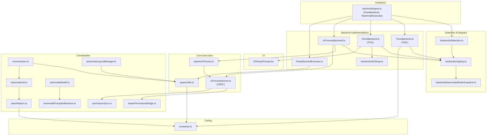
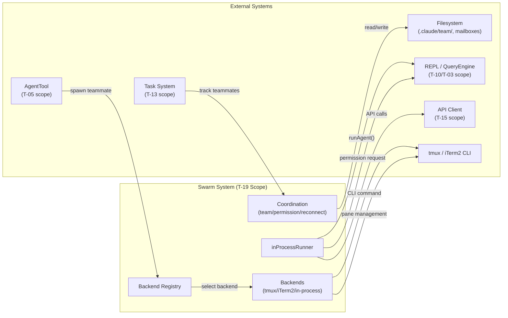

&lt;!-- analysis-version: 0 | commit: a5179f6 | updated: 2025-07-27 | mode: full | task: T-19 --&gt;
# T-19 Analysis: Swarm Orchestration

## Scope Confirmation
- Task ID: T-19
- Primary Mainline: ML-14
- ML Priority: P3
- Analysis Depth: OVERVIEW
- Secondary Mainlines: ML-13 (bash/shell), ML-08 (task system)
- Pattern Coverage: N/A
- Scope Files (confirmed): 22 files, ~7,876 lines
- Scope adjustments: None — all 22 files verified on disk

## File Roles

| File | Lines | One-liner Role | Where Analyzed |
|------|-------|----------------|---------------|
| src/utils/swarm/backends/types.ts | 46 | Defines BackendType enum (tmux/iterm2/in-process), PaneBackend and TeammateExecutor interfaces, spawn config/result types | OVERVIEW: § Analysis Findings |
| src/utils/swarm/constants.ts | 94 | TEAM_LEAD_NAME, SWARM_SESSION_NAME, swarm socket naming (PID-isolated), environment variable keys for teammate identity | OVERVIEW: § Analysis Findings |
| src/utils/swarm/backends/detection.ts | 73 | Environment detection: TMUX env var caching, TERM_PROGRAM check for iTerm2, it2 CLI availability probe | OVERVIEW: § Analysis Findings |
| src/utils/swarm/backends/registry.ts | 90 | Dynamic backend registration (avoids circular deps), detectAndGetBackend() auto-selects best backend by priority | OVERVIEW: § Analysis Findings |
| src/utils/swarm/backends/teammateModeSnapshot.ts | 87 | Session-scoped teammate mode capture (auto/tmux/in-process) with CLI override support, frozen at startup | OVERVIEW: § Analysis Findings |
| src/utils/swarm/backends/TmuxBackend.ts | 764 | Largest backend: tmux pane management with dual-mode (inside-tmux split vs external swarm session), pane border colors, shell init delay | OVERVIEW: § Analysis Findings |
| src/utils/swarm/backends/ITermBackend.ts | 370 | iTerm2 native split pane via it2 CLI, session ID tracking, at-fault recovery for dead panes, pane creation lock | OVERVIEW: § Analysis Findings |
| src/utils/swarm/backends/InProcessBackend.ts | 339 | TeammateExecutor for in-process mode: spawn via AsyncLocalStorage, terminate via mailbox shutdown, kill via AbortController | OVERVIEW: § Analysis Findings |
| src/utils/swarm/backends/PaneBackendExecutor.ts | 354 | Adapter wrapping PaneBackend → TeammateExecutor interface: CLI command construction, inherited flags/env, cleanup registration | OVERVIEW: § Analysis Findings |
| src/utils/swarm/backends/it2Setup.ts | 245 | it2 CLI install/verify/setup: Python package manager detection (uvx/pipx/pip), Python API enablement, global config persistence | OVERVIEW: § Analysis Findings |
| src/utils/swarm/It2SetupPrompt.tsx | 380 | React Compiler output: multi-step iTerm2 setup wizard UI (detect→install→verify→api-instructions→success/failed) | OVERVIEW: § Analysis Findings |
| src/utils/swarm/inProcessRunner.ts | 1552 | Core in-process runner: AsyncLocalStorage context isolation, runAgent() wrapper, progress tracking, permission bridge, compact support | OVERVIEW: § Analysis Findings |
| src/utils/swarm/spawnInProcess.ts | 328 | Creates TeammateContext + independent AbortController, registers InProcessTeammateTaskState in AppState | OVERVIEW: § Analysis Findings |
| src/utils/swarm/spawnUtils.ts | 146 | CLI flag builder: getTeammateCommand() binary path, buildInheritedCliFlags() (permission/model/settings/plugin/chrome), buildInheritedEnvVars() | OVERVIEW: § Analysis Findings |
| src/utils/swarm/teamHelpers.ts | 683 | Team file CRUD (JSON persistence), member add/remove, session cleanup, team directory management | OVERVIEW: § Analysis Findings |
| src/utils/swarm/permissionSync.ts | 179 | Worker→Leader permission request/response via mailbox + FS persistence, sandbox support | OVERVIEW: § Analysis Findings |
| src/utils/swarm/reconnection.ts | 222 | Two-path initialization: fresh spawn (CLI args) and resumed session (transcript storage), session state recovery | OVERVIEW: § Analysis Findings |
| src/utils/swarm/teammateInit.ts | 115 | Registers Stop hook → teammate idle notification to leader, applies team-wide allowed paths from TeamFile | OVERVIEW: § Analysis Findings |
| src/utils/swarm/teammateLayoutManager.ts | 74 | Color rotation assignment (8-color palette), delegates to backend for pane creation | OVERVIEW: § Analysis Findings |
| src/utils/swarm/leaderPermissionBridge.ts | 35 | Module-level singleton bridge: in-process teammate accesses REPL permission queue without importing REPL directly | OVERVIEW: § Analysis Findings |
| src/utils/swarm/teammateModel.ts | 34 | Fallback model selection (Opus 4.6), provider-aware model resolution for teammates | OVERVIEW: § Analysis Findings |
| src/utils/swarm/teammatePromptAddendum.ts | 47 | Teammate system prompt addition: emphasizes SendMessage tool for inter-agent communication | OVERVIEW: § Analysis Findings |

## Analysis Findings

### F-01: Three-Backend Architecture with Unified Executor Interface
The swarm system supports three execution backends — **tmux** (TmuxBackend, 764L), **iTerm2** (ITermBackend, 370L), and **in-process** (InProcessBackend, 339L) — all unified behind the `TeammateExecutor` interface (types.ts). Pane-based backends are wrapped by `PaneBackendExecutor` (354L adapter), while in-process uses `InProcessBackend` directly. The registry (registry.ts) auto-detects available backends and returns the appropriate executor.

### F-02: Dual-Mode Tmux Operation
TmuxBackend supports two operating modes: (1) **inside-tmux** — splits the current window, leader stays left (30%), teammates right (70%); (2) **outside-tmux** — creates a dedicated `claude-swarm` session with a PID-isolated socket (`getSwarmSocketName()`). Both modes include a 200ms `PANE_SHELL_INIT_DELAY_MS` and pane creation locks to prevent race conditions.

### F-03: In-Process Isolation via AsyncLocalStorage
When no pane backend is available, teammates run in the same Node.js process with context isolation through `AsyncLocalStorage`. The `inProcessRunner.ts` (1552L, largest file in scope) wraps `runAgent()` with independent stores for each teammate, sharing API clients and MCP connections but maintaining isolated conversation state.

### F-04: Fire-and-Forget Agent Execution
Both `InProcessBackend.spawn()` and `PaneBackendExecutor.spawn()` start agent execution as fire-and-forget operations. The in-process backend calls `startInProcessTeammate()` without awaiting; the pane backend sends a CLI command and writes the prompt to a file-based mailbox. Neither path blocks the caller on agent completion.

### F-05: File-Based Mailbox Communication
All teammate communication (in-process and pane-based) uses a **file-based mailbox** system (`writeToMailbox()` from `teammateMailbox.ts`, out of scope). Messages are written as JSON with `{from, text, timestamp}` structure. Shutdown requests use a special `{type: "shutdown_request", requestId, from, reason}` format.

### F-06: Permission Sync Bridge
`permissionSync.ts` (179L) enables worker→leader permission request/response via mailbox + filesystem persistence. The `leaderPermissionBridge.ts` (35L) is a module-level singleton that lets in-process teammates access the REPL permission queue without importing the REPL module directly, avoiding circular dependencies.

### F-07: Team File Persistence
`teamHelpers.ts` (683L) manages team state through JSON files in `.claude/team/` directories. Operations include: `readTeamFile`, `writeTeamFile`, `addMember`, `removeMember`, `cleanupSession`. The team file tracks member names, colors, and status for session recovery.

### F-08: Session Reconnection with Dual Path
`reconnection.ts` (222L) provides two initialization paths: (1) **fresh spawn** — constructs CLI args with `--agent-id`, `--agent-name`, `--team-name`, `--agent-color`, `--parent-session-id` flags; (2) **resumed session** — reads stored transcript to restore conversation context. Both paths share common teammate initialization via `teammateInit.ts`.

### F-09: Teammate Mode Snapshot Pattern
`teammateModeSnapshot.ts` (87L) captures the teammate mode at session startup, following the same pattern as `hooksConfigSnapshot.ts`. CLI `--teammate-mode` overrides take precedence over config. Runtime config changes are ignored — the snapshot is frozen. This prevents mid-session mode switching from causing inconsistent backend selection.

### F-10: it2 Setup Wizard
The iTerm2 backend requires the `it2` Python CLI tool. `it2Setup.ts` (245L) handles installation via Python package managers (uvx → pipx → pip preference order), verification, and Python API enablement. `It2SetupPrompt.tsx` (380L) is a React Compiler output providing an 8-step wizard UI.

## File Dependency Graph



### Dependency Summary

| File | Imports | Called By | Role |
|------|---------|-----------|------|
| backends/types.ts | 1 | 7 | Interface hub — all backends depend on it |
| constants.ts | 0 | 5 | Shared constants — leaf dependency |
| inProcessRunner.ts | 55 | 1 | Deepest import tree (core execution engine) |
| TmuxBackend.ts | 10 | 0 | Terminal node (self-registers via registry) |
| ITermBackend.ts | 6 | 0 | Terminal node (self-registers via registry) |
| It2SetupPrompt.tsx | 7 | 0 | Terminal node (UI component) |

## Call Chain Analysis

### Chain 1: Teammate Spawn (Leader→Teammate)
```
AgentTool.execute()
  → teammateLayoutManager.assignColor()
    → registry.detectAndGetBackend()
      → detection.isTmuxAvailable() / isIt2CliAvailable()
    → backend.spawn(name, color, ...)
      In-process:  InProcessBackend.spawn() → spawnInProcess() → startInProcessTeammate()
      Pane-based:  PaneBackendExecutor.spawn() → buildCommand() → backend.createPane() → sendText()
```

### Chain 2: Permission Request (Worker→Leader)
```
Teammate tool execution needs permission
  → permissionSync.requestPermission()
    → writeToMailbox(leader, {type: "permission_request"})
      → leader reads from mailbox
        → leaderPermissionBridge bridges to REPL queue
          → user approves/denies
            → permissionSync.respondPermission() via FS + mailbox
```

### Chain 3: Session Reconnection
```
Teammate process restarts
  → reconnection.initTeammate()
    → isFreshSpawn() ? buildFullCLI() : resumeFromTranscript()
      → teammateInit.registerStopHook()
        → teamHelpers.readTeamFile() → addMember()
          → inProcessRunner.runInProcessTeammate() or sendText(pane)
```

## Error Propagation Analysis

### Primary Error Sources
| Source | File | Error Type | Recovery |
|--------|------|-----------|----------|
| Pane creation failure | TmuxBackend.ts / ITermBackend.ts | execFileNoThrow error | absorb + logError |
| Dead pane recovery | ITermBackend.ts:L137 | Session not found | prune dead session + retry loop (O(N+1)) |
| Agent crash (in-process) | InProcessBackend.ts | Abort signal | isActive() → false, terminate() |
| Permission timeout | permissionSync.ts | No response | AbortController timeout → fallback deny |
| Team file I/O failure | teamHelpers.ts | JSON parse/write | absorb + log + return empty |
| it2 install failure | it2Setup.ts | Package manager error | UI prompts fallback to tmux |

### Unhandled Paths
- **TmuxBackend pane creation**: `execFileNoThrow` returns non-zero code → logged but teammate not created, leader not notified
- **inProcessRunner async error**: `runAgent()` rejection → caught by wrapper, logged, but no auto-restart
- **Team file corruption**: Malformed JSON → `teamHelpers.readTeamFile()` returns empty team, teammates lose state

## State Transition Analysis

### Backend Selection State (detection.ts + registry.ts)
| Current | Trigger | Next | File |
|---------|---------|------|------|
| undetected | detectAndGetBackend() | tmux/iterm2/in-process/null | registry.ts |
| detected | isAvailable() changes | stale (cached) | detection.ts |

### Teammate Mode State (teammateModeSnapshot.ts)
| Mode | Source | Notes |
|------|--------|-------|
| auto | default | Best available backend |
| tmux | CLI `--teammate-mode tmux` or config | Force tmux |
| in-process | CLI `--teammate-mode in-process` or config | Force in-process |

Frozen at session start — runtime config changes ignored.

### In-Process Teammate Lifecycle (spawnInProcess.ts + InProcessBackend.ts)
| State | Trigger | Side Effect |
|-------|---------|-------------|
| idle | spawn() called | Create AbortController, register in AppState |
| running | startInProcessTeammate() | runAgent() loop begins, AsyncLocalStorage set |
| stopping | terminate() / shutdown | Mailbox shutdown request sent |
| dead | AbortController.abort() | Cleanup from AppState, remove from team |

## Boundary / Integration Diagram



### Cross-Task Interface Points

| Interface | Direction | Files | Notes |
|-----------|-----------|-------|-------|
| AgentTool → teammateLayoutManager | T-05→T-19 | AgentTool.ts → teammateLayoutManager.ts | Spawn entry point |
| REPL → leaderPermissionBridge | T-10→T-19 | REPL.tsx ← leaderPermissionBridge.ts | Permission queue injection |
| Task System → InProcessBackend | T-13→T-19 | Task.ts ← InProcessBackend.ts | Task lifecycle tracking |
| AppState → spawnInProcess | T-01→T-19 | AppState.ts ← spawnInProcess.ts | Teammate state in global store |
| API Client → inProcessRunner | T-15→T-19 | client.ts ← inProcessRunner.ts | Shared API client instance |

## Acceptance Criteria Status

| # | Criterion | Status | Evidence |
|---|-----------|--------|----------|
| 1 | All 22 scope files confirmed on disk | ✅ PASS | § Scope Confirmation lists all 22 |
| 2 | File Roles table has 22 data rows | ✅ PASS | 22 rows = 22 scope files |
| 3 | Architecture overview covers all backends | ✅ PASS | F-01 (three-backend), F-02 (tmux dual-mode), F-03 (AsyncLocalStorage) |
| 4 | Spawn lifecycle documented end-to-end | ✅ PASS | Chain 1: AgentTool → backend.spawn() |
| 5 | Permission sync mechanism explained | ✅ PASS | Chain 2 + F-06 |
| 6 | Cross-task interfaces identified | ✅ PASS | 5 interface points in Boundary Diagram |
| 7 | Error handling patterns documented | ✅ PASS | § Error Propagation Analysis, 6 sources + 3 unhandled |

## Identified Problems

### P3-01: inProcessRunner.ts is the largest file in scope (1552L)
The in-process runner combines context isolation, agent execution, progress tracking, permission bridging, and compact support in a single 1552-line file. While the logic is cohesive, the file size exceeds typical maintainability thresholds.

### P3-02: TmuxBackend.ts is the second-largest (764L)
The tmux backend handles dual-mode operation (inside/outside tmux), pane creation locking, color assignment, and session management in a single class. The dual-mode logic adds significant branching complexity.

### P3-03: Team file I/O has no durability guarantee
`teamHelpers.ts` writes JSON files synchronously without atomic write (write-to-temp + rename). A crash during write could corrupt the team state file, causing teammates to lose session tracking.

### P4-01: Detection result caching without invalidation
`detection.ts` caches `isInsideTmux()` and `isInITerm2()` results at module level. If the terminal environment changes during a session (e.g., user detaches from tmux), stale cached values persist until process restart.

### P4-02: Pane creation lock is module-level singleton
Both `TmuxBackend.ts` and `ITermBackend.ts` use a module-level `paneCreationLock` Promise chain. While this prevents race conditions, it also serializes all pane creation across the entire module, creating a bottleneck when spawning multiple teammates concurrently.

## Open Questions

1. **[depends on T-05]** How does AgentTool decide between spawn modes (foreground/background/worktree)? The spawn entry point is in T-05's scope.
2. **[depends on T-13]** How does the Task System track in-process teammate task state? `InProcessBackend` registers `InProcessTeammateTaskState` in AppState — the lifecycle integration is in T-13's scope.
3. **[runtime]** What happens to mailbox messages when a teammate process crashes mid-operation? Are orphaned messages cleaned up automatically?
4. **[runtime]** What is the maximum number of concurrent teammates supported? Is there a backpressure mechanism?
5. **[depends on T-15]** How does the in-process runner share API client instances with the leader? The shared client pattern in `inProcessRunner.ts` may affect rate limiting and connection pooling.
6. **[config]** What determines the teammate model fallback chain? `teammateModel.ts` uses Opus 4.6 as default, but the provider-aware resolution logic depends on external configuration.

## Complexity Assessment

| Dimension | Rating | Notes |
|-----------|--------|-------|
| Structural Complexity | **MEDIUM** | Clean three-layer architecture (interfaces → backends → coordination), but inProcessRunner.ts (1552L) is a monolith |
| Behavioral Complexity | **MEDIUM-HIGH** | Fire-and-forget execution + file-based mailbox + dual-path reconnection + permission bridge |
| Cross-Cutting Complexity | **MEDIUM** | 5 cross-task interfaces, AsyncLocalStorage isolation, but well-isolated behind TeammateExecutor interface |
| Error Handling | **MEDIUM** | Most errors absorbed with logging, 3 unhandled paths documented |
| Concurrency | **LOW-MEDIUM** | Pane creation locks, AbortController for in-process, but no complex concurrent state |
| Overall | **MEDIUM** | Architecture is well-structured with clear interfaces; complexity concentrated in 2 large files |
