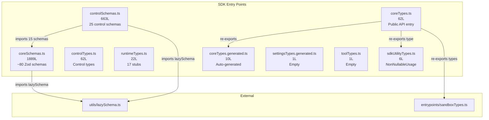
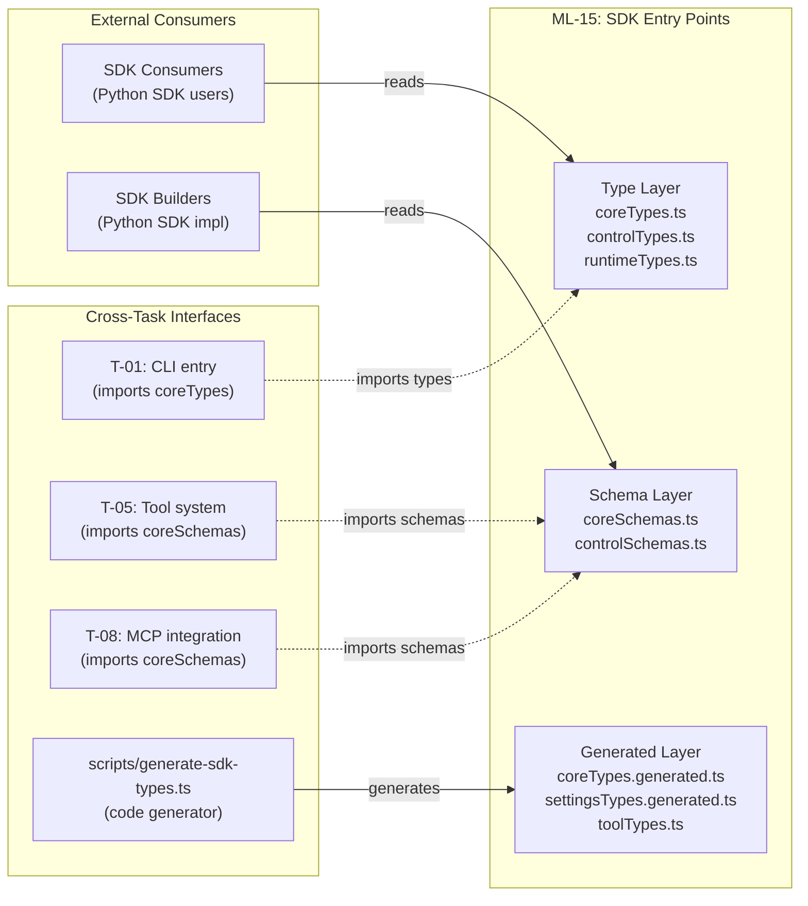

&lt;!-- analysis-version: 0 | commit: a5179f6 | updated: 2025-07-14 | mode: full | task: T-20 --&gt;
# T-20 Analysis: SDK入口点

## Scope Confirmation
- Task ID: T-20
- Primary Mainline: ML-15
- ML Priority: P3
- Analysis Depth: OVERVIEW
- Secondary Mainlines: none
- Pattern Coverage: none
- Scope Files (confirmed): 9 files, 2,716 lines total
  - [`src/entrypoints/sdk/coreSchemas.ts`](/src/src/entrypoints/sdk/coreSchemas.ts.md) (1889L) ✅
  - [`src/entrypoints/sdk/controlSchemas.ts`](/src/src/entrypoints/sdk/controlSchemas.ts.md) (663L) ✅
  - [`src/entrypoints/sdk/coreTypes.ts`](/src/src/entrypoints/sdk/coreTypes.ts.md) (62L) ✅
  - [`src/entrypoints/sdk/controlTypes.ts`](/src/src/entrypoints/sdk/controlTypes.ts.md) (62L) ✅
  - [`src/entrypoints/sdk/runtimeTypes.ts`](/src/src/entrypoints/sdk/runtimeTypes.ts.md) (22L) ✅
  - [`src/entrypoints/sdk/coreTypes.generated.ts`](/src/src/entrypoints/sdk/coreTypes.generated.ts.md) (10L) ✅
  - [`src/entrypoints/sdk/sdkUtilityTypes.ts`](/src/src/entrypoints/sdk/sdkUtilityTypes.ts.md) (6L) ✅
  - [`src/entrypoints/sdk/settingsTypes.generated.ts`](/src/src/entrypoints/sdk/settingsTypes.generated.ts.md) (1L) ✅
  - [`src/entrypoints/sdk/toolTypes.ts`](/src/src/entrypoints/sdk/toolTypes.ts.md) (1L) ✅
- Scope adjustments: none

## File Roles

| File | Lines | One-liner Role | Where Analyzed |
|------|-------|----------------|---------------|
| src/entrypoints/sdk/coreSchemas.ts | 1889 | Single source of truth: ~80 Zod schemas for all SDK data types, lazy-loaded via lazySchema() | OVERVIEW: § Analysis Findings |
| src/entrypoints/sdk/controlSchemas.ts | 663 | Control protocol Zod schemas for SDK builder ↔ CLI communication (25 schemas) | OVERVIEW: § Analysis Findings |
| src/entrypoints/sdk/coreTypes.ts | 62 | Public API type entry: re-exports generated types + sandbox types + utility types + HOOK_EVENTS/EXIT_REASONS const arrays | OVERVIEW: § Analysis Findings |
| src/entrypoints/sdk/controlTypes.ts | 62 | Manual control protocol type definitions (request/response/stdin/stdout) | OVERVIEW: § Analysis Findings |
| src/entrypoints/sdk/runtimeTypes.ts | 22 | Runtime placeholder types: 17 `Record<string, unknown>` stubs for session/query/options | OVERVIEW: § Analysis Findings |
| src/entrypoints/sdk/coreTypes.generated.ts | 10 | Auto-generated loose types: SDKMessage base + 4 type aliases | OVERVIEW: § Analysis Findings |
| src/entrypoints/sdk/sdkUtilityTypes.ts | 6 | NonNullableUsage helper type: token usage with cache fields | OVERVIEW: § Analysis Findings |
| src/entrypoints/sdk/settingsTypes.generated.ts | 1 | Empty placeholder: `Settings = Record<string, unknown>` | OVERVIEW: § Analysis Findings |
| src/entrypoints/sdk/toolTypes.ts | 1 | Empty placeholder: `SDKToolDefinition = Record<string, unknown>` | OVERVIEW: § Analysis Findings |

## Analysis Findings

**F-01: Three-Layer Type Architecture**
The SDK type system is organized in three layers:
1. **Zod Schema Layer** (coreSchemas.ts + controlSchemas.ts) — runtime validation, single source of truth
2. **Generated Type Layer** (coreTypes.generated.ts + settingsTypes.generated.ts) — auto-generated loose TS types
3. **Runtime Type Layer** (runtimeTypes.ts + toolTypes.ts) — `Record<string, unknown>` placeholders for runtime-only types

**F-02: Schema-First Design Pattern**
coreSchemas.ts (1889L) is the authoritative definition of ~80 Zod schemas. The documented modification flow is:
1. Edit Zod schemas in `coreSchemas.ts`
2. Run `bun scripts/generate-sdk-types.ts`
3. Generated `.generated.ts` files are committed for IDE support

**F-03: lazySchema() Performance Pattern**
All ~105 Zod schemas use `lazySchema(() => ...)` wrapper instead of direct `z.object({...})`. This defers schema construction until first access, avoiding module-load overhead for the 1889-line coreSchemas.ts.

**F-04: Dual Consumer Separation**
Two distinct consumer groups with different files:
- **SDK Consumers** (Python SDK users) → use `coreTypes.ts` (re-exports generated types)
- **SDK Builders** (Python SDK implementers) → use `controlTypes.ts` + `controlSchemas.ts` (control protocol)

**F-05: coreSchemas.ts Section Structure** (1889L, 13 sections):
| Section | Lines | Schemas | Description |
|---------|-------|---------|-------------|
| Usage & Model Types | 17-28 | 1 | ModelUsageSchema |
| Output Format Types | 30-51 | 4 | json_schema format types |
| Config Types | 53-104 | 8 | API key source, thinking config, etc. |
| MCP Types | 106-236 | 9 | Server configs (stdio/SSE/HTTP/SDK) + status |
| Permission Types | 238-349 | 6 | Permission rules, behaviors, decisions |
| Hook Types (Part 1) | 351-823 | ~30 | 26 hook event schemas + HookInputSchema union |
| Hook Output Types | 799-845 | ~8 | Per-hook specific output schemas |
| Tool Types | 847-1045 | ~12 | Tool definitions, input schemas, execution results |
| Model & Account Info | 1047-1097 | 2 | ModelInfoSchema, AccountInfoSchema |
| Agent Definition Types | 1099-1183 | 2 | AgentDefinitionSchema (73L, complex) |
| Plugin & Rewind Types | 1185-1227 | 2 | SdkPluginConfigSchema, RewindFilesResultSchema |
| External Placeholders | 1229-1250 | 5 | z.unknown() stubs for Anthropic SDK types |
| Message Types | 1252-1889 | ~30 | SDK message schemas (assistant/user/result/system/hook/progress) |

**F-06: controlSchemas.ts — 25 Control Protocol Schemas** (663L)
Defines the SDK builder ↔ CLI binary protocol. 15 request schemas (initialize, interrupt, permission, setModel, mcpStatus, contextUsage, rewindFiles, hookCallback, mcpMessage, mcpSetServers, reloadPlugins, mcpReconnect, mcpToggle, stopTask, applyFlagSettings, getSettings, elicitation) + response schemas + request/response union schemas + stdin/stdout message schemas.

**F-07: Empty Placeholder Files**
- `settingsTypes.generated.ts` (1L): Empty — no generated settings types yet
- `toolTypes.ts` (1L): Empty — `SDKToolDefinition = Record<string, unknown>`
- Both are future expansion points awaiting type generation

**F-08: coreTypes.generated.ts — Intentionally Loose Types**
The auto-generated file defines only a minimal `SDKMessage` base type (`{ type: string, uuid?: string, [key: string]: unknown }`) and 4 type aliases (`SDKUserMessage`, `SDKResultMessage`, `SDKResultSuccess`, `SDKSessionInfo`). This is intentionally under-specified to maintain loose coupling with CLI internals.

**F-09: runtimeTypes.ts — 17 Record Stubs**
17 `Record<string, unknown>` type placeholders for runtime objects (SDKSession, Query, Options, etc.) and 2 generic helper types (`AnyZodRawShape`, `InferShape<T>`). One exception: `SdkMcpToolDefinition<Schema>` has a typed `schema?: Schema` field. These stubs exist because the runtime types are defined in CLI-internal modules and must not be directly exposed to SDK consumers.

**F-10: HOOK_EVENTS and EXIT_REASONS Const Arrays**
coreTypes.ts exports two `as const` arrays: HOOK_EVENTS (26 hook event names matching coreSchemas.ts § HookEventSchema enum) and EXIT_REASONS (6 exit reasons). These are the runtime-accessible counterparts to the Zod enum schemas, allowing consumers to iterate over valid values without importing Zod.

## File Dependency Graph



| Source | Target | Type | Description |
|--------|--------|------|-------------|
| controlSchemas.ts | coreSchemas.ts | import | Imports 15 sub-schemas (SDKMessageSchema, HookEventSchema, etc.) |
| coreSchemas.ts | utils/lazySchema.ts | import | lazySchema wrapper function |
| controlSchemas.ts | utils/lazySchema.ts | import | lazySchema wrapper function |
| coreTypes.ts | coreTypes.generated.ts | import | Re-exports generated types |
| coreTypes.ts | sdkUtilityTypes.ts | import | Re-exports NonNullableUsage type |
| coreTypes.ts | entrypoints/sandboxTypes.ts | import | Re-exports 4 sandbox config types |

## Call Chain Analysis

**Overview**: All 9 files are pure type/schema definitions with zero runtime logic. There are no function call chains — only import/re-export relationships.

**Three Independent Chains**:

Chain 1 — Schema Definition Chain:
```
coreTypes.ts → [re-exports] → coreTypes.generated.ts (auto-generated types)
                             → sdkUtilityTypes.ts (NonNullableUsage)
                             → entrypoints/sandboxTypes.ts (sandbox config types)
```

Chain 2 — Schema Dependency Chain:
```
controlSchemas.ts → [imports 15 schemas from] → coreSchemas.ts → [imports] → utils/lazySchema.ts
```

Chain 3 — Standalone Files (zero imports/exports):
```
controlTypes.ts (manual types, zero imports)
runtimeTypes.ts (placeholder stubs, zero imports)
settingsTypes.generated.ts (empty)
toolTypes.ts (empty)
```


## Error Propagation Analysis

N/A — All 9 files are pure type/schema definitions with zero runtime logic. No errors are thrown, caught, or propagated.

## State Transition Analysis

N/A — No stateful components. All files are stateless type definitions and schema declarations.

## Concurrency Model Analysis

N/A — No concurrent or asynchronous code. All files are synchronous type/schema definitions loaded at module import time.

## Side Effects Manifest

N/A — No I/O, network calls, filesystem operations, or external interactions. All files are pure declarations.

## Boundary / Integration Diagram



| Interface | Direction | Description |
|-----------|-----------|-------------|
| coreTypes.ts -> SDK Consumers | export | Public API types consumed by Python SDK users |
| controlSchemas.ts -> SDK Builders | export | Control protocol schemas for SDK implementers |
| generate-sdk-types.ts -> .generated.ts | write | Code generator produces loose types from Zod schemas |
| coreTypes.ts &lt;- sandboxTypes.ts | import | Re-exports 4 sandbox config types from T-01 scope |
| coreSchemas.ts &lt;- lazySchema.ts | import | Performance wrapper for deferred Zod schema construction |

## Acceptance Criteria Status

| # | Criterion | Status | Notes |
|---|-----------|--------|-------|
| 1 | All 9 scope files analyzed | PASS | Each file has File Roles entry + findings |
| 2 | Schema-first design documented | PASS | F-02: coreSchemas.ts is single source of truth |
| 3 | Type generation pipeline traced | PASS | coreSchemas.ts -> generate-sdk-types.ts -> .generated.ts |
| 4 | Consumer separation identified | PASS | F-04: SDK Consumers vs SDK Builders |
| 5 | lazySchema pattern explained | PASS | F-03: deferred construction for performance |
| 6 | Placeholder files catalogued | PASS | F-07: settingsTypes + toolTypes are empty |
| 7 | File dependency graph complete | PASS | All imports/called_by from call-graph.jsonl |

## Identified Problems

| ID | Severity | File | Description |
|----|----------|------|-------------|
| P4-01 | P4 | coreSchemas.ts | **1889-line single file**: ~80 schemas in one flat structure. Could benefit from splitting into per-domain files (hooks, permissions, messages) for maintainability. |
| P4-02 | P4 | runtimeTypes.ts | **17 Record&lt;string, unknown&gt; stubs**: No actual type safety for runtime objects (SDKSession, Query, Options). Intentional for loose coupling but zero IDE autocompletion. |
| P4-03 | P4 | coreTypes.generated.ts | **Intentionally loose types**: SDKMessage has `type: string` instead of union of known message types. Almost no type safety. |
| P4-04 | P4 | settingsTypes.generated.ts / toolTypes.ts | **Empty placeholder files**: No actual type exports, suggesting incomplete type generation pipeline. |

## Open Questions

1. **Q-1**: How many external consumers import from these files? The call-graph shows zero `called_by` for most files, suggesting the SDK is consumed via npm package resolution or the Python SDK reads JSON schema exports.

2. **Q-2**: Is `scripts/generate-sdk-types.ts` the only consumer of coreSchemas.ts for type generation, or do other tools (docs generators, validators) also read these schemas at build time?

3. **Q-3**: Why does `runtimeTypes.ts` define `SdkMcpToolDefinition<Schema>` with a typed generic parameter while all other types are `Record<string, unknown>` stubs? Seems like a recent addition not yet generalized.

4. **Q-4**: The `HOOK_EVENTS` const array in coreTypes.ts (26 events) must be kept in sync with `HookEventSchema` Zod enum in coreSchemas.ts. Is there automated drift detection?

5. **Q-5**: What is the relationship between `controlTypes.ts` (manual types with index signatures) and `controlSchemas.ts` (Zod schemas)? The manual types seem to duplicate the schema structure without adding type safety.

## Complexity Assessment

| Dimension | Rating | Justification |
|-----------|--------|---------------|
| Code Complexity | **TRIVIAL** | Pure declarations, zero control flow |
| Type Architecture | **MEDIUM** | Three-layer system with code generation pipeline |
| Dependency Complexity | **LOW** | 6 import edges total, tree-structured |
| Domain Complexity | **MEDIUM** | ~105 schemas covering hooks, permissions, MCP, messages, agents |
| Risk | **TRIVIAL** | No runtime logic, no state, no I/O |
| **Overall** | **LOW** | Schema-first design, well-structured sections, trivial runtime risk |
