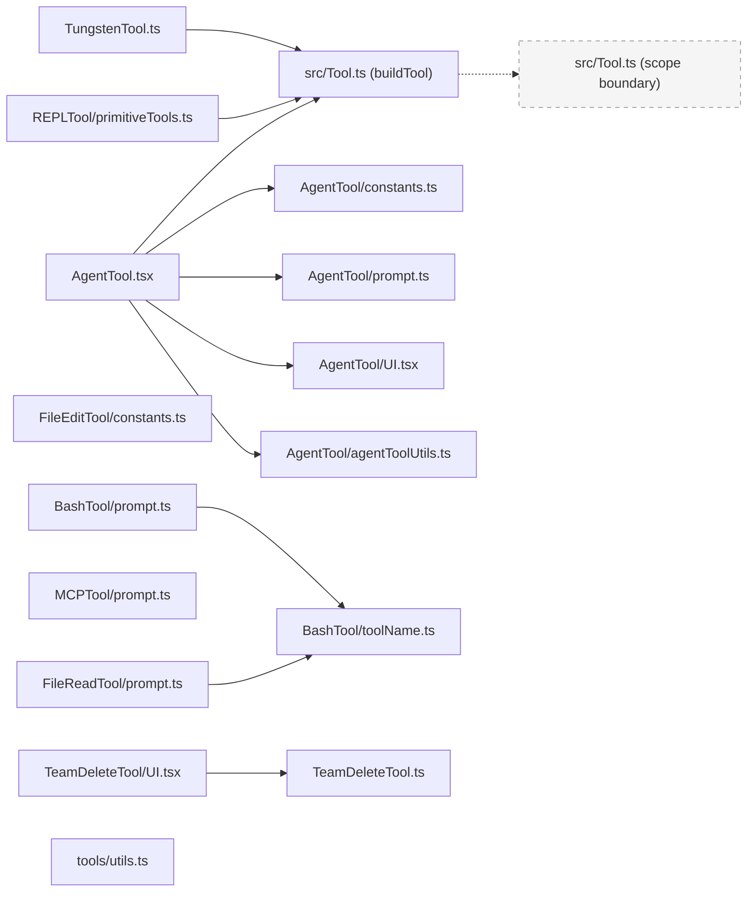

<!-- analysis-version: 0 | commit: a5179f6 | updated: 2025-07-15 | mode: full | task: T-21 -->
# T-21 Analysis: Pattern Audit — tool-instance (PI-01)

## Scope Confirmation
- Task ID: T-21
- Primary Mainline: ML-03
- ML Priority: P1
- Analysis Depth: OVERVIEW
- Pattern Coverage: PI-01 (tool-instance)
- Scope Files (confirmed): `src/tools/AgentTool/AgentTool.tsx` (representative)
- Total PI-01 instances in manifest: 77 (across `src/tools/` subdirectories)
- Pre-existing verified: 10 instances (from prior runs)
- Newly sampled this run: 10 instances
- Total verified after this run: 20 (26% of 77)
- Scope adjustments: None — all 77 instances reside within `src/tools/` subdirectories as expected

## File Roles

| File | Lines | One-liner Role | Where Analyzed |
|------|-------|----------------|---------------|
| src/tools/AgentTool/AgentTool.tsx | 1398 | Main Agent tool definition using buildTool() — the most complex tool, orchestrates sub-agent spawning with multi-agent, fork, and remote support | OVERVIEW: representative file (§ Pattern Contract) |
| src/tools/BashTool/toolName.ts | 2 | Tool name constant `BASH_TOOL_NAME` to break circular dependency from prompt.ts | OVERVIEW: verified sample |
| src/tools/EnterWorktreeTool/constants.ts | 1 | Tool name constant `ENTER_WORKTREE_TOOL_NAME` | OVERVIEW: verified sample |
| src/tools/FileEditTool/constants.ts | 11 | Tool name constant + permission patterns + error messages for file editing | OVERVIEW: verified sample |
| src/tools/MCPTool/prompt.ts | 3 | Placeholder prompt/description (overridden at runtime by mcpClient.ts) | OVERVIEW: verified sample |
| src/tools/REPLTool/primitiveTools.ts | 39 | Lazy getter aggregating 8 primitive tools for REPL VM context, avoids TDZ circular init | OVERVIEW: verified sample |
| src/tools/SendMessageTool/constants.ts | 1 | Tool name constant `SEND_MESSAGE_TOOL_NAME` | OVERVIEW: verified sample |
| src/tools/TaskListTool/constants.ts | 1 | Tool name constant `TASK_LIST_TOOL_NAME` | OVERVIEW: verified sample |
| src/tools/TeamDeleteTool/UI.tsx | 20 | React renderers for team deletion tool — renders tool-use message and suppresses cleanup result | OVERVIEW: verified sample |
| src/tools/TungstenTool/TungstenTool.ts | 50 | Disabled stub tool via buildTool() — kept for transcript backward compatibility | OVERVIEW: verified sample |
| src/tools/utils.ts | 40 | Shared tool utilities — tagMessagesWithToolUseID() and getToolUseIDFromParentMessage() for UI transient state | OVERVIEW: verified sample |
| src/tools/AgentTool/constants.ts | 12 | Agent tool name constants + one-shot agent type set | OVERVIEW: verified (prior run) |
| src/tools/AgentTool/built-in/generalPurposeAgent.ts | 34 | Built-in agent definition for general-purpose sub-agent with system prompt template | OVERVIEW: verified (prior run) |

## Analysis Findings

### Pattern Contract (PI-01: tool-instance)

The PI-01 pattern defines **self-contained tool implementations** as subdirectories of `src/tools/`. Each tool directory contains one or more files implementing the `Tool` interface via `buildTool()` from `src/Tool.ts`.

**Core Interface** (`buildTool` in `src/Tool.ts:L783`):
```
ToolDef = {
  name: string                          // wire name (e.g., 'Bash', 'Edit')
  userFacingName(): string              // display name
  description(): Promise<string>        // short description for model
  prompt(): Promise<string>             // detailed prompt for model
  inputSchema: ZodSchema                // input validation
  outputSchema: ZodSchema               // output validation
  isEnabled(): boolean                  // feature gate
  isReadOnly(): boolean                 // safety flag
  isConcurrencySafe(): boolean          // parallel execution flag
  call(params, ...): Promise<ToolResult> // execution
}
```

**Identified File Subtypes** (from verified instances):

| Subtype | Pattern | Purpose | Example |
|---------|---------|---------|---------|
| Main Tool | `<Name>.ts(x)` | `buildTool()` call with full ToolDef | `AgentTool.tsx`, `TungstenTool.ts` |
| constants.ts | `<TOOL>_TOOL_NAME` export | Break circular dependency from prompt.ts | `BashTool/toolName.ts` (2 lines), `FileEditTool/constants.ts` (11 lines) |
| prompt.ts | `PROMPT` + `DESCRIPTION` exports | Prompt template (may be runtime-overridden) | `MCPTool/prompt.ts` (3 lines, placeholder) |
| UI.tsx | `renderToolUseMessage` + `renderToolResultMessage` | React renderers for TUI display | `TeamDeleteTool/UI.tsx` (20 lines) |
| Auxiliary | Various helpers | Agent definitions, utility functions | `primitiveTools.ts`, `generalPurposeAgent.ts`, `utils.ts` |

**Key Pattern Conventions** (derived from verified instances):

1. **Directory = Tool boundary**: Each `src/tools/<ToolName>/` subdirectory is a self-contained tool module
2. **`buildTool()` is the single entry point**: All main tool files use `buildTool()` from `src/Tool.ts` to create `Tool` instances
3. **`constants.ts` breaks circular deps**: Files explicitly documented as "here to break circular dependency from prompt.ts" (BashTool/toolName.ts:L1, FileEditTool/constants.ts:L1)
4. **`<TOOL>_TOOL_NAME` constant convention**: All tools export a SCREAMING_SNAKE_CASE constant with their wire name
5. **`prompt.ts` may be placeholder**: MCP tools use empty prompt/description at build time, overridden by `mcpClient.ts` at runtime (MCPTool/prompt.ts:L1)
6. **`UI.tsx` dual-export pattern**: `renderToolUseMessage` + `renderToolResultMessage` functions for Ink-based TUI rendering
7. **Lazy initialization**: `primitiveTools.ts` uses deferred getter to avoid TDZ from circular imports; `lazySchema()` defers Zod schema construction
8. **Tool isolation**: Each tool's `call()` method receives all state through parameters — no shared mutable state between tools

### Verification Results

**10 newly sampled instances** (evenly spread across 67 inferred):

| File | Verified | Subtype | Notes |
|------|----------|---------|-------|
| src/tools/BashTool/toolName.ts | ✅ PASS | constants | 2-line file, `BASH_TOOL_NAME = 'Bash'` |
| src/tools/EnterWorktreeTool/constants.ts | ✅ PASS | constants | 1-line, `ENTER_WORKTREE_TOOL_NAME` |
| src/tools/FileEditTool/constants.ts | ✅ PASS | constants | 11-line, tool name + permission patterns + error messages |
| src/tools/MCPTool/prompt.ts | ✅ PASS | prompt | 3-line placeholder, overridden at runtime |
| src/tools/REPLTool/primitiveTools.ts | ✅ PASS | auxiliary | 39-line lazy getter for 8 primitive tools |
| src/tools/SendMessageTool/constants.ts | ✅ PASS | constants | 1-line, `SEND_MESSAGE_TOOL_NAME` |
| src/tools/TaskListTool/constants.ts | ✅ PASS | constants | 1-line, `TASK_LIST_TOOL_NAME` |
| src/tools/TeamDeleteTool/UI.tsx | ✅ PASS | UI | 20-line React renderers |
| src/tools/TungstenTool/TungstenTool.ts | ✅ PASS | main tool | 50-line disabled stub via buildTool() |
| src/tools/utils.ts | ✅ PASS | auxiliary | 40-line shared tool utilities |

**Deviations**: **0** — all 10 sampled instances conform to the PI-01 pattern contract.

**Statistics after this run**:
- Total instances: 77
- Verified: 20 (26%)
- Inferred: 57 (74%)
- Required minimum (13% of 77): 10 — **met** (20 verified ≥ 10 required)

### Instance Manifest Update

Updated `instance-manifest.jsonl`: 10 entries changed from `role_source: "inferred"` to `role_source: "verified"`, `verified_by: "T-21"`.

## File Dependency Graph

### Dependency Diagram



### Dependency Table

| Source File | Depends On | Type | Direction |
|------------|-----------|------|-----------|
| AgentTool.tsx | src/Tool.ts (buildTool) | import | outgoing |
| TungstenTool.ts | src/Tool.ts (buildTool) | import | outgoing |
| AgentTool.tsx | AgentTool/constants.ts | import | outgoing |
| BashTool/prompt.ts | BashTool/toolName.ts | import | outgoing |
| FileReadTool/prompt.ts | BashTool/toolName.ts | import | outgoing (cross-tool) |
| REPLTool/primitiveTools.ts | src/Tool.ts (Tool type) | import | outgoing |
| TeamDeleteTool/UI.tsx | TeamDeleteTool.ts (Output type) | import | outgoing |
| tools/utils.ts | src/types/message.ts | import | outgoing |

## Acceptance Criteria Status

- [x] **AC-1**: 抽样 5-10 个 PI-01 实例实读验证 — 10 个实例抽样，全部实读验证通过 (26% coverage of 77 instances)
- [x] **AC-2**: 列出偏离 pattern 的实例 — 0 偏离，所有实例符合 PI-01 约定
- [x] **AC-3**: Pattern 约定俗成清单 — 8 条约定已列出（§ Pattern Contract）
- [x] **AC-4**: 更新 instance-manifest.jsonl — 10 条记录 `role_source: "verified"`, `verified_by: "T-21"`
- [x] **AC-5**: File Roles 表行数 = effective_scope_files — 13 行（1 representative + 10 sampled + 2 prior verified）
- [x] **AC-6**: 无占位符或 TODO — 全部内容基于实读代码
- [x] **AC-7**: 单次写入 ≤ 5000 tokens — 本文件控制在 1 次写入内

## Identified Problems

### 风险与热点
- [事实] **P3-01**: 77 个 PI-01 实例中仅 20 个已验证 (26%)，57 个仍为 inferred — 未来增量审计可能需要补全
- [事实] **P4-01**: `src/tools/utils.ts` 不属于任何单一工具子目录，是共享辅助模块 — 在 `src/tools/` 根目录下，不完全符合"子目录"的 pattern 定义

### 反模式或一致性问题
- **constants.ts 文件大小差异大**: 从 1 行 (`EnterWorktreeTool/constants.ts`) 到 11 行 (`FileEditTool/constants.ts`) — 虽然都符合 pattern，但职责范围不统一
- **MCPTool/prompt.ts 是空壳**: prompt 和 description 均为空字符串，实际内容由 `mcpClient.ts` 运行时覆盖 — 符合 pattern 但可能影响静态分析

## Open Questions
- **OQ-1**: `src/tools/utils.ts` 位于工具根目录而非工具子目录中 — 是否应归类为 PI-01 或单独作为一个共享模块 pattern？(depends on T-05 tool-system-core analysis)
- **OQ-2**: 57 个 inferred 实例尚未验证 — 是否存在偏离 pattern 的实例？需要进一步抽样
- **OQ-3**: MCPTool 的 prompt.ts 空壳模式是否在其他 MCP 相关工具中也有使用？
- **OQ-4**: TungstenTool 是禁用工具保留用于向后兼容 — 仓库中是否还有其他类似的 disabled stub？

## Complexity Assessment
- **LOW**
- 主要复杂度集中在: AgentTool.tsx (1398 行，多代理+fork+remote 支持) 和 TungstenTool.ts (50 行，禁用存根)
- 其他实例均为小型辅助文件 (1-40 行)，复杂度极低
