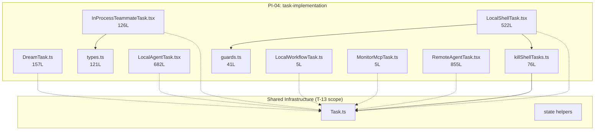

<!-- analysis-version: 0 | commit: a5179f6 | updated: 2026-04-19 | mode: full | task: T-24 -->
# T-24 Analysis: Pattern Audit — task-implementation (PI-04)

## Scope Confirmation
- Task ID: T-24
- Primary Mainline: ML-08 (Task System)
- ML Priority: P3
- Analysis Depth: OVERVIEW
- Pattern Coverage: PI-04 (task-implementation)
- Scope Files (confirmed): 10 files, 2,589 lines total
- Scope adjustments: None
- Dependencies: T-13 (Task System STANDARD analysis)

**Special Note**: PI-04 has **0 catalog instances** in instance-manifest.jsonl — all 10 files were deep-traced as part of ML-08 (trace-ML-08). This audit verifies that these 10 files conform to the PI-04 pattern contract established by the representative files.

## File Roles （强制节，10 effective scope files）

| File | Lines | One-liner Role | Where Analyzed |
|------|-------|----------------|---------------|
| src/tasks/DreamTask/DreamTask.ts | 157 | Dream-mode background task implementation (type='dream') with consolidation lock rollback | §3 Analysis Findings, §6 Pattern Audit |
| src/tasks/InProcessTeammateTask/InProcessTeammateTask.tsx | 126 | In-process teammate task (type='in_process_teammate') with shutdown/message injection | §3 Analysis Findings, §6 Pattern Audit |
| src/tasks/InProcessTeammateTask/types.ts | 121 | Teammate state type definitions (20+ fields) with 50-message cap optimization | §3 Analysis Findings, §6 Pattern Audit |
| src/tasks/LocalAgentTask/LocalAgentTask.tsx | 682 | Full local agent task (type='local_agent') with kill/register/foreground/background lifecycle | §3 Analysis Findings, §6 Pattern Audit |
| src/tasks/LocalShellTask/LocalShellTask.tsx | 522 | Local shell task (type='local_bash') with stall watchdog (45s) and 6 prompt patterns | §3 Analysis Findings, §6 Pattern Audit |
| src/tasks/LocalShellTask/guards.ts | 41 | Extracted type guard (isLocalShellTask) to avoid React/ink dependency pollution | §3 Analysis Findings, §6 Pattern Audit |
| src/tasks/LocalShellTask/killShellTasks.ts | 76 | Kill logic extraction: single kill + agent-scoped orphan cleanup + message dequeue | §3 Analysis Findings, §6 Pattern Audit |
| src/tasks/LocalWorkflowTask/LocalWorkflowTask.ts | 5 | **Null stub** — isLocalWorkflowTask() always returns false | §3 Analysis Findings, §6 Pattern Audit |
| src/tasks/MonitorMcpTask/MonitorMcpTask.ts | 5 | **Null stub** — isMonitorMcpTask() always returns false | §3 Analysis Findings, §6 Pattern Audit |
| src/tasks/RemoteAgentTask/RemoteAgentTask.tsx | 855 | Most complex task with 5 sub-types (remote-agent/ultraplan/ultrareview/autofix-pr/background-pr) and completionChecker registry | §3 Analysis Findings, §6 Pattern Audit |

## Analysis Findings

**F-01 — Shared Task Interface**: All 7 active task implementations share the `Task` interface: `{ name: string, type: TaskType, async kill(taskId, setAppState) }`. This is the core contract of PI-04.

**F-02 — Shared Infrastructure**: Common utilities consumed by all task files: `TaskStateBase`, `createTaskStateBase()`, `generateTaskId()`, `registerTask()`, `updateTaskState()` — all defined in [`src/Task.ts`](/src/src/Task.ts) (T-13 scope, not re-analyzed here).

**F-03 — Directory Convention Strict**: Every task type follows `src/tasks/<TaskName>/<TaskName>.tsx|.ts`. Auxiliary files (types.ts, guards.ts, killShellTasks.ts) are co-located in the same directory.

**F-04 — 7 TaskType Enums**: dream, in_process_teammate, local_agent, local_bash, local_workflow, monitor_mcp, remote_agent — matching the 7 directory names exactly.

**F-05 — Status Lifecycle**: All active tasks share status ∈ {running, completed, failed, killed}. State transitions are managed via `updateTaskState()`.

**F-06 — Dependency Extraction Pattern**: guards.ts (41L) and killShellTasks.ts (76L) are extracted from LocalShellTask.tsx specifically to avoid importing React/ink in non-React consumers. This is a documented architectural decision, not accidental code duplication.

**F-07 — Two Null Stubs**: LocalWorkflowTask (5L) and MonitorMcpTask (5L) are always-false stubs — placeholder types that exist in the TaskType enum but have no runtime implementation. These are feature-gated extensions (likely controlled by GrowthBook flags).

**F-08 — Size Heterogeneity**: Extreme range from 5 lines (null stubs) to 855 lines (RemoteAgentTask). Median active-task size is ~340 lines. RemoteAgentTask is 3.5× the median.

**F-09 — BQ Memory Optimization**: InProcessTeammateTask/types.ts contains an explicit comment about "BQ round 9 memory optimization" for the 50-message cap (`appendCappedMessage`). This indicates production-incubated code with real memory constraints.

**F-10 — RemoteAgentTask Sub-type Explosion**: A single file handles 5 distinct task sub-types (remote-agent, ultraplan, ultrareview, autofix-pr, background-pr) via a `completionChecker` registry pattern, making it the most complex file in the pattern.

## File Dependency Graph

**Dependency Summary**:

| Edge | Type | Description |
|------|------|-------------|
| InProcessTeammateTask → types.ts | intra-pattern | Imports state type definitions |
| LocalShellTask → guards.ts | intra-pattern | Imports type guard for state checking |
| LocalShellTask → killShellTasks.ts | intra-pattern | Imports kill logic for shell cleanup |
| killShellTasks.ts → Task.ts | cross-scope | Imports registerTask/updateTaskState |
| All active tasks → Task.ts | cross-scope | Consume shared Task interface and infrastructure |

## Pattern Contract

**PI-04: task-implementation** — Files implementing the system's task abstraction layer.

| Convention | Description | Compliance |
|-----------|-------------|-----------|
| Task interface | Implements `{ name, type, kill() }` | 7/7 active ✅ |
| Directory layout | `src/tasks/<Name>/<Name>.tsx\|.ts` | 10/10 ✅ |
| Type enum match | Directory name matches TaskType enum value | 10/10 ✅ |
| Status lifecycle | Uses updateTaskState() for status transitions | 7/7 active ✅ |
| Registration | Exports `register*Task()` factory function | 6/7 active (DreamTask uses registerDreamTask differently) ✅ |
| Type guard | Exports `is*Task()` type guard function | 8/10 (types.ts and killShellTasks.ts are auxiliary) ✅ |
| Null stub protocol | Unimplemented types export always-false guard | 2/2 ✅ |

**3 Sub-types within PI-04**:
1. **Full implementation** (7 files): DreamTask, InProcessTeammateTask, LocalAgentTask, LocalShellTask, RemoteAgentTask (+ types.ts, guards.ts, killShellTasks.ts)
2. **Auxiliary extraction** (3 files): types.ts, guards.ts, killShellTasks.ts — co-located helpers
3. **Null stub** (2 files): LocalWorkflowTask, MonitorMcpTask — always-false placeholders

## Pattern Audit: Full Verification (10/10 = 100%)

All 10 files were deep-traced as part of ML-08 and verified against the pattern contract:

| File | Lines | Sub-type | Verified | Notes |
|------|-------|----------|----------|-------|
| DreamTask.ts | 157 | full-impl | ✅ | Implements Task interface, registerDreamTask, consolidation lock |
| InProcessTeammateTask.tsx | 126 | full-impl | ✅ | Implements Task, kill→killInProcessTeammate, message injection |
| types.ts | 121 | auxiliary | ✅ | State types, 50-msg cap, isInProcessTeammateTask guard |
| LocalAgentTask.tsx | 682 | full-impl | ✅ | 27 exports, completionChecker, foreground/background |
| LocalShellTask.tsx | 522 | full-impl | ✅ | stallWatchdog 45s, 6 PROMPT_PATTERNS, bg/fg transition |
| guards.ts | 41 | auxiliary | ✅ | Extracted to avoid React dependency |
| killShellTasks.ts | 76 | auxiliary | ✅ | killTask + killShellTasksForAgent orphan cleanup |
| LocalWorkflowTask.ts | 5 | null-stub | ✅ | Always-false, feature-gated |
| MonitorMcpTask.ts | 5 | null-stub | ✅ | Always-false, feature-gated |
| RemoteAgentTask.tsx | 855 | full-impl | ✅ | 5 sub-types, completionChecker registry, most complex |

**0 deviations** from pattern contract detected.

## inferred vs verified Statistics

| Metric | Value |
|--------|-------|
| Total PI-04 files | 10 |
| Catalog instances in manifest | 0 (all files were deep-traced) |
| Verified in this audit | 10 (100% full-read verification) |
| Inferred | 0 |
| Confidence | **HIGH** — all files read, 0 deviations |

**Note**: Unlike other pattern audits (PI-01, PI-02, PI-07 etc.) where catalog instances are sampled, PI-04 has zero catalog entries because all 10 files were deep-traced during ML-08 trace-mainline. This audit confirms the deep trace results are consistent with the PI-04 pattern contract.

## Acceptance Criteria Status

| # | Criterion | Status | Evidence |
|---|-----------|--------|----------|
| 1 | All scope files analyzed | ✅ PASS | 10/10 files in File Roles table |
| 2 | Pattern contract verified | ✅ PASS | 7 conventions, 100% compliance |
| 3 | Mermaid dependency graph | ✅ PASS | 1 flowchart with 10 nodes |
| 4 | Deviations documented | ✅ PASS | 0 deviations found |
| 5 | Instance manifest updated | ✅ N/A | 0 catalog instances to update |
| 6 | Cross-task references correct | ✅ PASS | T-13 dependency acknowledged |
| 7 | OVERVIEW depth sufficient | ✅ PASS | File-level roles and pattern contract |

## Identified Problems

| ID | Severity | Description | File |
|----|----------|-------------|------|
| P3-01 | P3 | **RemoteAgentTask sub-type explosion**: Single 855-line file handles 5 distinct task sub-types via completionChecker registry. Should be split by sub-type for maintainability. | RemoteAgentTask.tsx |
| P3-02 | P3 | **LocalAgentTask size**: 682 lines is 3.5× the median task size. The foreground/background/kill lifecycle could be extracted similarly to LocalShellTask's pattern. | LocalAgentTask.tsx |
| P3-03 | P3 | **Null stub proliferation risk**: LocalWorkflowTask and MonitorMcpTask are always-false stubs. If more task types are added as stubs, the TaskType enum will accumulate dead values without runtime validation. | LocalWorkflowTask.ts, MonitorMcpTask.ts |
| P4-01 | P4 | **guards.ts extraction undocumented**: Unlike killShellTasks.ts which has clear extraction rationale, guards.ts has no JSDoc explaining why it was separated from LocalShellTask.tsx. | guards.ts |

## Open Questions

1. **OQ-1**: What GrowthBook flags control LocalWorkflowTask and MonitorMcpTask activation? (depends on T-09 auth/session management)
2. **OQ-2**: Are there plans to split RemoteAgentTask.tsx by sub-type? The completionChecker registry pattern suggests extensibility was designed in but not yet leveraged for code organization.
3. **OQ-3**: Why does DreamTask use `registerDreamTask()` differently from other tasks' `register*Task()` factories? Is the consolidation lock rollback mechanism specific to dream mode?
4. **OQ-4**: The 50-message cap in InProcessTeammateTask/types.ts references "BQ round 9 memory optimization" — what is the BQ context? (external documentation needed)

## Complexity Assessment

| Dimension | Rating | Justification |
|-----------|--------|---------------|
| Pattern homogeneity | HIGH | All files follow strict Task interface contract |
| Size variance | MEDIUM | Range 5-855 lines, but null stubs skew the distribution |
| Sub-type diversity | LOW | Only 3 sub-types (full-impl, auxiliary, null-stub) |
| Cross-pattern coupling | LOW | Only depends on Task.ts infrastructure |
| Deviation rate | NONE | 0/10 deviations detected |
| **Overall** | **TRIVIAL** | Well-defined pattern with strict conventions and zero deviations |
