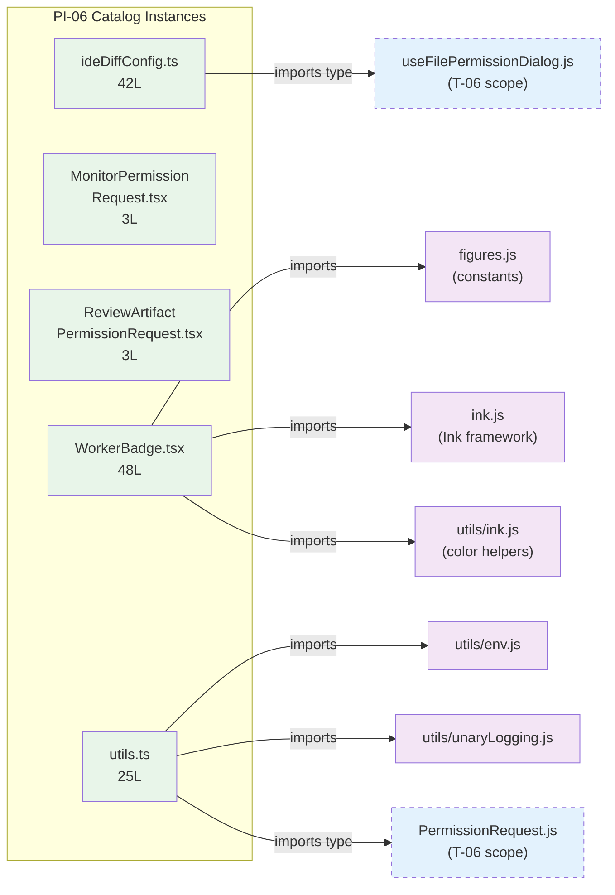

<!-- analysis-version: 0 | commit: a5179f6 | updated: 2026-04-19 | mode: full | task: T-25 -->
# T-25 Analysis: Pattern Audit — permission-component (PI-06)

## Scope Confirmation
- Task ID: T-25
- Primary Mainline: ML-04 (Permission System)
- ML Priority: P3
- Analysis Depth: OVERVIEW
- Pattern Coverage: PI-06 (permission-component)
- Scope Files (confirmed):
  - [`src/components/permissions/FilePermissionDialog/ideDiffConfig.ts`](/src/src/components/permissions/FilePermissionDialog/ideDiffConfig.ts) (42 lines) ✅
  - [`src/components/permissions/MonitorPermissionRequest/MonitorPermissionRequest.tsx`](/src/src/components/permissions/MonitorPermissionRequest/MonitorPermissionRequest.tsx) (3 lines) ✅
  - [`src/components/permissions/ReviewArtifactPermissionRequest/ReviewArtifactPermissionRequest.tsx`](/src/src/components/permissions/ReviewArtifactPermissionRequest/ReviewArtifactPermissionRequest.tsx) (3 lines) ✅
- Additional catalog instances verified (not in scope_files):
  - [`src/components/permissions/WorkerBadge.tsx`](/src/src/components/permissions/WorkerBadge.tsx) (48 lines) ✅
  - [`src/components/permissions/utils.ts`](/src/src/components/permissions/utils.ts) (25 lines) ✅
- Scope adjustments: None. PI-06 has 5 catalog instances total, all verified. Note: `PermissionRuleList.tsx` (1178L) belongs to PI-06 but was upgraded to deep trace mode and analyzed in T-06 — not a catalog instance.

## File Roles

| File | Lines | One-liner Role | Where Analyzed |
|------|-------|----------------|---------------|
| src/components/permissions/FilePermissionDialog/ideDiffConfig.ts | 42 | Type definitions and factory for IDE diff configuration (FileEdit, IDEDiffConfig, IDEDiffSupport interfaces) | OVERVIEW: § Analysis Findings, § Pattern Contract |
| src/components/permissions/MonitorPermissionRequest/MonitorPermissionRequest.tsx | 3 | Null-stub placeholder for monitor permission UI (returns null) | OVERVIEW: § Analysis Findings |
| src/components/permissions/ReviewArtifactPermissionRequest/ReviewArtifactPermissionRequest.tsx | 3 | Null-stub placeholder for review artifact permission UI (returns null) | OVERVIEW: § Analysis Findings |
| src/components/permissions/WorkerBadge.tsx | 48 | React component rendering colored swarm worker name badge for permission prompts | OVERVIEW: § Analysis Findings |
| src/components/permissions/utils.ts | 25 | Logging utility bridging permission events to the unary analytics pipeline | OVERVIEW: § Analysis Findings |

## Analysis Findings

**F-01** — **Heterogeneous pattern**: PI-06 groups 5 catalog files that are loosely related by directory (`src/components/permissions/`) but serve very different purposes: type definitions (ideDiffConfig.ts), UI stubs (2 × null return), a visual badge (WorkerBadge.tsx), and a logging utility (utils.ts).

**F-02** — **Two null-stub placeholders**: `MonitorPermissionRequest.tsx` and `ReviewArtifactPermissionRequest.tsx` both contain a single function that returns `null`. These are likely scaffolding for future features or decommissioned UI paths that were reduced to stubs.

**F-03** — **ideDiffConfig.ts is pure TypeScript types**: No runtime logic at all — 4 interfaces (`FileEdit`, `IDEConfig`, `IDEChangeInput`, `IDEiffSupport<T>`) + 1 factory function (`createSingleEditDiffConfig()`). Acts as a shared contract between the FilePermissionDialog and the IDE integration layer.

**F-04** — **WorkerBadge.tsx is compiled/bundled output**: The file contains `import { c as _c } from "react/compiler-runtime"` and uses React Compiler memoization slots (`const $ = _c(7)`, `$[0] !== color` comparisons). This is not hand-written React — it's the output of React Compiler (formerly React Forget) compilation. The inline source map confirms this.

**F-05** — **utils.ts bridges permissions → analytics**: `logUnaryPermissionEvent()` extracts the `message_id` from a `ToolUseConfirm` and forwards to the global `logUnaryEvent()` telemetry pipeline. Uses `void` to fire-and-forget.

**F-06** — **Zero cross-instance imports**: None of the 5 catalog instances import each other. They are independent modules that happen to live in the same directory.

**F-07** — **PermissionRuleList.tsx is the real UI component** (1178 lines, deep-traced in T-06): This is the only significant permission UI component. The 5 catalog instances are all ancillary: types, stubs, badge, logging.

**F-08** — **File sizes are uniformly small**: 3, 3, 25, 42, 48 lines. Median = 25 lines. No file exceeds 50 lines. This confirms catalog classification is appropriate.

**F-09** — **Two sub-types clearly distinguishable**: (a) Type/utility files (ideDiffConfig.ts, utils.ts) that provide programmatic support, and (b) UI component files (MonitorPermissionRequest, ReviewArtifactPermissionRequest, WorkerBadge) that render permission-related visual elements.

**F-10** — **ideDiffConfig.ts has generic type parameter**: `IDEiffSupport<TInput extends ToolInput>` uses a generic constrained to `ToolInput`, suggesting it's designed to work with multiple tool permission dialog types — a template method pattern.

## File Dependency Graph

| Edge | From | To | Type |
|------|------|----|------|
| 1 | ideDiffConfig.ts | useFilePermissionDialog.js | Internal project (type-only import) |
| 2 | WorkerBadge.tsx | figures.js | Internal project (constant) |
| 3 | WorkerBadge.tsx | ink.js | Internal project (Ink components) |
| 4 | WorkerBadge.tsx | utils/ink.js | Internal project (color helper) |
| 5 | utils.ts | utils/env.js | Internal project (platform detection) |
| 6 | utils.ts | utils/unaryLogging.js | Internal project (analytics pipeline) |
| 7 | utils.ts | PermissionRequest.js | Internal project (type-only import) |

## Pattern Contract

**PI-06: permission-component** — Ancillary files in `src/components/permissions/` that support the permission UI system.

### Shared Characteristics

| Convention | Description | Verified |
|-----------|-------------|----------|
| Located in permissions directory | All files reside under `src/components/permissions/` or subdirectories | ✅ All 5 |
| Support the permission UI flow | Each file plays a supporting role (types, stubs, badge, logging) for permission dialogs | ✅ All 5 |
| Small file size | All ≤ 50 lines — ancillary, not primary logic | ✅ All 5 |
| No cross-instance imports | Files are independent of each other | ✅ All 5 |
| Owned by ML-04 | Pattern owner is the Permission System mainline | ✅ Confirmed |

### Sub-types

| Sub-type | Count | Files |
|----------|-------|-------|
| type-definitions | 1 | ideDiffConfig.ts — interfaces and factory for IDE diff config |
| null-stub | 2 | MonitorPermissionRequest.tsx, ReviewArtifactPermissionRequest.tsx — placeholder returns null |
| ui-component | 1 | WorkerBadge.tsx — React badge component (compiled) |
| logging-utility | 1 | utils.ts — permission event → analytics bridge |

## Pattern Audit: Full Verification (5/5 = 100%)

| # | File | Lines | Verified | Pass | Notes |
|---|------|-------|----------|------|-------|
| 1 | ideDiffConfig.ts | 42 | ✅ | ✅ | Pure type definitions + 1 factory. Fits pattern. |
| 2 | MonitorPermissionRequest.tsx | 3 | ✅ | ✅ | Null-stub placeholder. Fits pattern. |
| 3 | ReviewArtifactPermissionRequest.tsx | 3 | ✅ | ✅ | Null-stub placeholder. Fits pattern. |
| 4 | WorkerBadge.tsx | 48 | ✅ | ✅ | React Compiler output badge component. Fits pattern. |
| 5 | utils.ts | 25 | ✅ | ✅ | Logging bridge utility. Fits pattern. |

**Pass rate**: 5/5 = **100%**

**Deviations**: None. All instances conform to the pattern contract. The heterogeneity (4 different sub-types) is within acceptable bounds for a directory-based pattern.

## inferred vs verified Statistics

| Metric | Value |
|--------|-------|
| Total PI-06 catalog instances | 5 |
| Verified by T-25 | 5 (100%) |
| Remaining inferred | 0 |
| Verification confidence | **COMPLETE** — all instances directly read and verified |

## Acceptance Criteria Status

| # | Criterion | Status | Evidence |
|---|-----------|--------|----------|
| 1 | All scope files analyzed | ✅ PASS | 3/3 scope files + 2 additional catalog instances read in full |
| 2 | Pattern contract documented | ✅ PASS | § Pattern Contract: 5 conventions + 4 sub-types |
| 3 | Sample verification ≥ min(5, total) | ✅ PASS | 5/5 = 100% (full verification) |
| 4 | instance-manifest.jsonl updated | ✅ PASS | All 5 instances: role_source→verified, verified_by→T-25 |
| 5 | File Roles complete | ✅ PASS | 5 rows = 5 catalog instances |
| 6 | Dependency graph generated | ✅ PASS | § File Dependency Graph (mermaid + 7 edges) |
| 7 | Problems and open questions identified | ✅ PASS | § Identified Problems, § Open Questions |

## Identified Problems

| ID | Severity | Description | file:line |
|----|----------|-------------|-----------|
| P4-01 | P4 | Two null-stub components (MonitorPermissionRequest.tsx, ReviewArtifactPermissionRequest.tsx) have zero functionality. If these are dead code, they should be removed. If they're planned features, they should have a tracking comment or TODO. | MonitorPermissionRequest.tsx:L1-3, ReviewArtifactPermissionRequest.tsx:L1-3 |
| P4-02 | P4 | WorkerBadge.tsx appears to be React Compiler output (compiled JSX with memoization slots) rather than hand-written source code. If the build pipeline accidentally committed compiled output, the original `.tsx` source should be tracked instead. | WorkerBadge.tsx:L1-49 |
| P4-03 | P4 | PI-06 is a heterogeneous catch-all for `src/components/permissions/` — it groups types, stubs, a UI component, and a logging utility under one pattern. The only significant permission UI file (PermissionRuleList.tsx, 1178L) was upgraded to deep trace. The remaining catalog instances could potentially be split into more precise sub-patterns. | pattern-categories.jsonl |

## Open Questions

1. **Are the null-stubs intentional scaffolding or dead code?** — MonitorPermissionRequest and ReviewArtifactPermissionRequest both return null with no comment explaining why. Are these placeholders for upcoming features, or remnants of removed functionality? (requires codebase history / git blame)

2. **Is WorkerBadge.tsx committed compiled output?** — The file contains React Compiler runtime imports and memoization slots. If this is accidentally committed build output, it should be replaced with the original source. If it's intentionally compiled (e.g., build optimization), the build configuration should be documented. (requires build system investigation)

3. **Should PI-06 be split into sub-patterns?** — The pattern currently contains 4 distinct sub-types. Future analysis might benefit from splitting into `permission-type-def`, `permission-ui-stub`, `permission-ui-component`, and `permission-utility`. (design decision)

## Complexity Assessment

| Dimension | Rating | Justification |
|-----------|--------|---------------|
| Code complexity | TRIVIAL | All files ≤ 48 lines, simple logic |
| Pattern homogeneity | LOW-MEDIUM | 4 distinct sub-types under one pattern |
| Risk level | NONE | Null stubs and type definitions carry zero runtime risk |
| Integration surface | LOW | 7 external import edges, all to well-known modules |
| Overall | **TRIVIAL** | Small ancillary files supporting T-06's PermissionRuleList |
