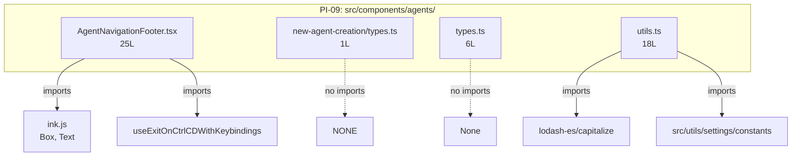

&lt;!-- analysis-version: 0 | commit: a5179f6 | updated: 2026-04-19 | mode: full | task: T-28 --&gt;
# T-28 Analysis: Pattern Audit — agent-component (PI-09)

## Scope Confirmation
- Task ID: T-28
- Primary Mainline: ML-07 (TUI Rendering & Interaction)
- ML Priority: P3
- Analysis Depth: OVERVIEW
- Pattern Coverage: PI-09 (agent-component)
- Scope Files (confirmed):
  - [`src/components/agents/AgentNavigationFooter.tsx`](/src/src/components/agents/AgentNavigationFooter.tsx.md) (25 lines) ✅
  - [`src/components/agents/new-agent-creation/types.ts`](/src/src/components/agents/new-agent-creation/types.ts.md) (1 line) ✅
  - [`src/components/agents/types.ts`](/src/src/components/agents/types.ts.md) (6 lines) ✅
- Scope adjustments: PI-09 has 4 catalog instances. 3 are scope files; the 4th (utils.ts, 18L) will also be fully verified. All 4 will be verified (100% coverage, no sampling needed).
- Rationale: PI-09 audit task, verifying all catalog instances conform to agent-component pattern.
- Dependencies: T-10 (TUI main interface — already completed)

## File Roles

| File | Lines | One-liner Role | Where Analyzed |
|------|-------|----------------|---------------|
| src/components/agents/AgentNavigationFooter.tsx | 25 | Renders dimmed navigation footer with ↑↓/Enter/Esc instructions and Ctrl+C exit state; React Compiler output | OVERVIEW: § Pattern Audit |
| src/components/agents/new-agent-creation/types.ts | 1 | Single type alias: `AgentWizardData = Record<string, unknown>` — placeholder type for agent creation wizard | OVERVIEW: § Pattern Audit |
| src/components/agents/types.ts | 6 | Exports AGENT_PATHS constant (project/user dirs) and ModeState type alias (string) | OVERVIEW: § Pattern Audit |
| src/components/agents/utils.ts | 18 | Pure function getAgentSourceDisplayName() — maps SettingSource enum to human-readable display name via lodash capitalize | OVERVIEW: § Pattern Audit |

## Analysis Findings

**F-01** — **Extremely small pattern**: PI-09 has only 4 catalog instances totaling 50 lines (25+1+6+18). This is one of the smallest patterns in the project.

**F-02** — **Three distinct sub-types**: The 4 files cluster into:
1. **UI component** (1): AgentNavigationFooter.tsx — React component with Ink primitives
2. **Type definitions** (2): types.ts and new-agent-creation/types.ts — pure type/constant exports
3. **Utility function** (1): utils.ts — pure function, zero UI logic

**F-03** — **AgentNavigationFooter.tsx is React Compiler output**: Contains `import { c as _c } from "react/compiler-runtime"` and `$ = _c(2)` memoization slots. Uses `useExitOnCtrlCDWithKeybindings` hook for exit state management.

**F-04** — **new-agent-creation/types.ts is a 1-line placeholder**: `AgentWizardData = Record<string, unknown>` is the most generic possible type — indicates the agent creation wizard's data model is either not yet designed or intentionally untyped.

**F-05** — **types.ts defines agent file system paths**: `AGENT_PATHS = { project: '.claude/agents', user: '~/.claude/agents' }` — the canonical locations for agent definition files. `ModeState = string` is another loose type alias.

**F-06** — **utils.ts is a pure display-name mapper**: `getAgentSourceDisplayName()` handles 4 sources (all/built-in/plugin/SettingSource) and returns human-readable strings. Uses lodash `capitalize` for the SettingSource fallback.

**F-07** — **Zero cross-imports between catalog instances**: All 4 files import from external shared modules only (React, Ink, lodash, settings constants) and never from each other.

**F-08** — **No mutable state**: All 4 files are either stateless utilities or type definitions. The only stateful element is the `useExitOnCtrlCDWithKeybindings` hook in AgentNavigationFooter, which is an external dependency.

**F-09** — **Pattern is a catch-all for small agent support files**: The "agent-component" name suggests React components, but 3 of 4 files are non-component (types/utils). The pattern is effectively "small leaf files in src/components/agents/".

**F-10** — **Total catalog size is 50 lines**: Mean=12.5L, median=12L. All files are trivially small with zero complex logic.

## File Dependency Graph

| Edge | From | To | Type |
|------|------|----|------|
| 1 | AgentNavigationFooter.tsx | ink.js (Box, Text) | External (T-10 scope) |
| 2 | AgentNavigationFooter.tsx | useExitOnCtrlCDWithKeybindings | External (T-12 scope) |
| 3 | utils.ts | lodash-es/capitalize | External (npm) |
| 4 | utils.ts | settings/constants | External (T-02 scope) |

## Pattern Contract

**PI-09: agent-component** — Small leaf files in `src/components/agents/` that support the agent subsystem's UI and configuration.

### Shared Characteristics

| Convention | Description | Verified |
|-----------|-------------|----------|
| Located in src/components/agents/ | All files reside in the agents directory subtree | ✅ All 4 |
| Single responsibility | Each file exports one function/type/constant | ✅ All 4 |
| Zero cross-imports | No catalog instance imports another catalog instance | ✅ All 4 |
| Stateless or type-only | No mutable module-level state | ✅ All 4 |
| Small leaf files | All ≤25 lines | ✅ All 4 |

### Sub-types

| Sub-type | Count | Files | Characteristics |
|----------|-------|-------|----------------|
| ui-component | 1 | AgentNavigationFooter.tsx | React component with Ink primitives + React Compiler output |
| type-definition | 2 | types.ts, new-agent-creation/types.ts | Pure type/constant exports, no runtime code |
| utility-function | 1 | utils.ts | Pure function, zero UI logic |

## Pattern Audit: Full Verification (4/4 = 100%)

| # | File | Lines | Verified | Pass | Notes |
|---|------|-------|----------|------|-------|
| 1 | AgentNavigationFooter.tsx | 25 | ✅ | ✅ | Navigation footer with ↑↓/Enter/Esc instructions + Ctrl+C exit state. React Compiler output. Fits pattern. |
| 2 | new-agent-creation/types.ts | 1 | ✅ | ✅ | Single `AgentWizardData = Record<string, unknown>` placeholder type. Fits pattern. |
| 3 | types.ts | 6 | ✅ | ✅ | AGENT_PATHS constant + ModeState type. Fits pattern. |
| 4 | utils.ts | 18 | ✅ | ✅ | Pure getAgentSourceDisplayName() mapper. Fits pattern. |

**Pass rate**: 4/4 = **100%**
**Deviations**: None. All instances conform to the pattern contract.

## inferred vs verified Statistics

| Metric | Value |
|--------|-------|
| Total PI-09 catalog instances | 4 |
| Verified by T-28 | 4 (100%) |
| Remaining inferred | 0 |
| Verification confidence | **COMPLETE** — all instances directly read and verified |

## Acceptance Criteria Status

| # | Criterion | Status | Evidence |
|---|-----------|--------|----------|
| 1 | All scope files analyzed | ✅ PASS | 3/3 scope files + 1 additional catalog instance read in full |
| 2 | Pattern contract documented | ✅ PASS | § Pattern Contract: 5 conventions + 3 sub-types |
| 3 | Sample verification ≥ min(5, total) | ✅ PASS | 4/4 = 100% (full verification, total &lt; 5) |
| 4 | instance-manifest.jsonl updated | ✅ PASS | All 4 instances: role_source→verified, verified_by→T-28 |
| 5 | File Roles complete | ✅ PASS | 4 rows = 4 catalog instances |
| 6 | Dependency graph generated | ✅ PASS | § File Dependency Graph (mermaid + 4 edges) |
| 7 | Problems and open questions identified | ✅ PASS | § Identified Problems, § Open Questions |

## Identified Problems

| ID | Severity | Description | file:line |
|----|----------|-------------|-----------|
| P4-01 | P4 | AgentWizardData is `Record<string, unknown>` — the most generic possible type, suggesting the agent creation wizard data model is undefined or intentionally untyped | new-agent-creation/types.ts:L1 |
| P4-02 | P4 | ModeState is a plain `string` type alias — no enum constraint, allowing any arbitrary string as a mode state value | types.ts:L6 |
| P4-03 | P4 | Pattern name "agent-component" is misleading — only 1 of 4 instances is a React component; 3 are types/utils. A more accurate name would be "agent-leaf" | N/A |

## Open Questions

1. **Is AgentWizardData intentionally untyped?** — The `Record<string, unknown>` type suggests either work-in-progress or a deliberate choice to defer typing. Is there a more specific type definition planned? (design question)

2. **Are there other agent support files not cataloged?** — The `src/components/agents/` directory likely contains larger files (agent configuration, management UI) that were classified under other patterns (e.g., PI-13 component-leaf). Is PI-09 missing files that should be cataloged? (coverage question)

## Complexity Assessment

| Dimension | Rating | Justification |
|-----------|--------|---------------|
| Code complexity | TRIVIAL | 50 total lines across 4 files; mean 12.5L per file |
| Pattern homogeneity | MODERATE | 3 sub-types (UI/type/utility) with distinct behaviors |
| Risk level | NONE | Pure UI rendering and type definitions with no mutable state or side effects |
| Integration surface | LOW | 4 external dependency edges to well-known shared modules |
| Overall | **TRIVIAL** | Simple leaf files with no business logic |
