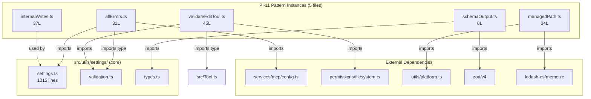

&lt;!-- analysis-version: 0 | commit: a5179f6 | updated: 2025-07-27 | mode: full | task: T-30 --&gt;
# T-30 Analysis: Pattern Audit — settings-module (PI-11)

## Scope Confirmation
- Task ID: T-30
- Primary Mainline: ML-01
- ML Priority: P3
- Analysis Depth: OVERVIEW
- Pattern Coverage: **PI-11** (settings-module)
- Scope Files (confirmed):
  1. [`src/utils/settings/allErrors.ts`](/src/src/utils/settings/allErrors.ts) (32L) — exists ✅
  2. [`src/utils/settings/internalWrites.ts`](/src/src/utils/settings/internalWrites.ts) (37L) — exists ✅
  3. [`src/utils/settings/managedPath.ts`](/src/src/utils/settings/managedPath.ts) (34L) — exists ✅
- Scope adjustments: None. All 5 PI-11 instances are in scope (pattern audit covers all catalog instances).
- Total PI-11 instances: **5** (from instance-manifest.jsonl)
- Pattern owner_ml: ML-01 (CLI Startup & Command Routing)

## File Roles （强制节）

| File | Lines | One-liner Role | Where Analyzed |
|------|-------|----------------|---------------|
| src/utils/settings/allErrors.ts | 32 | Merges settings validation errors with MCP config errors, extracted to break settings.ts↔mcp/config.ts circular dependency | OVERVIEW: § Pattern Audit |
| src/utils/settings/internalWrites.ts | 37 | Tracks timestamps of in-process settings writes so chokidar watcher can ignore its own echoes; extracted to break settings.ts→changeDetector→hooks→settings.ts cycle | OVERVIEW: § Pattern Audit |
| src/utils/settings/managedPath.ts | 34 | Resolves platform-specific managed settings directory path (macOS/Windows/Linux) and managed-settings.d drop-in dir | OVERVIEW: § Pattern Audit |
| src/utils/settings/schemaOutput.ts | 8 | Generates JSON Schema from Zod SettingsSchema for external tooling consumption | OVERVIEW: § Pattern Audit |
| src/utils/settings/validateEditTool.ts | 45 | Validates settings file edits via FileEditTool to ensure result conforms to SettingsSchema; allows edits to already-invalid files | OVERVIEW: § Pattern Audit |

## Pattern Contract (PI-11: settings-module)

### Pattern Definition
PI-11 captures **leaf utility modules** within `src/utils/settings/` that were **extracted from the main settings.ts (1015 lines)** to break circular dependencies or encapsulate isolated concerns.

### Shared Characteristics
1. **Location**: All in `src/utils/settings/` directory
2. **Size**: Small — 8 to 45 lines (mean: 31.2 lines)
3. **Single responsibility**: Each module handles exactly one concern
4. **Extraction rationale**: Documented in file-level JSDoc comments (why the module exists separately)
5. **Low fan-out**: Most import from only 1-2 sibling modules or external packages
6. **No state** (except `internalWrites.ts` which has a single `Map<string, number>`)

### Extraction Pattern
Three of the five modules explicitly document their extraction reason:
- `allErrors.ts`: "exists to break a circular dependency: settings.ts → mcp/config.ts → settings.ts"
- `internalWrites.ts`: "Extracted from changeDetector.ts to break the settings.ts → changeDetector.ts → hooks.ts → … → settings.ts cycle"
- `validateEditTool.ts`: "used by FileEditTool to avoid code duplication"

## Pattern Audit: Full Verification (5 of 5 instances)

### Sampling Strategy
With only 5 instances, all are verified (100% coverage).

### Verification Results

| # | File | Lines | Verified | Role Accuracy | Notes |
|---|------|-------|----------|---------------|-------|
| 1 | `allErrors.ts` | 32 | ✅ PASS | Original "Settings: allErrors" → **revised** to descriptive role | Single exported function `getSettingsWithAllErrors()` merging settings + MCP errors |
| 2 | `internalWrites.ts` | 37 | ✅ PASS | Original "Settings: internalWrites" → **revised** to descriptive role | 3 exports: `markInternalWrite`, `consumeInternalWrite`, `clearInternalWrites`. Uses timestamp-based write tracking with auto-consume |
| 3 | `managedPath.ts` | 34 | ✅ PASS | Original "Settings: managedPath" → **revised** to descriptive role | 2 memoized exports: `getManagedFilePath()` (platform switch), `getManagedSettingsDropInDir()`. Ant-only env override |
| 4 | `schemaOutput.ts` | 8 | ✅ PASS | Original "Settings: schemaOutput" → **revised** to descriptive role | Single export: `generateSettingsJSONSchema()`. Uses `zod/v4` toJSONSchema + slowOperations.jsonStringify |
| 5 | `validateEditTool.ts` | 45 | ✅ PASS | Original "Settings: validateEditTool" → **revised** to descriptive role | Single export: `validateInputForSettingsFileEdit()`. Validates before→after content. Allows edits to already-invalid files (escape hatch) |

### Pattern Conventions Confirmed

1. **File-level JSDoc documents extraction rationale** — all extracted modules explain WHY they exist separately
2. **Single exported function or tiny API surface** — 1-3 exports per file
3. **No runtime state** (except `internalWrites.ts` which is a legitimate singleton cache)
4. **Circular dependency breaker pattern** — leaf module imported by two modules that would otherwise form a cycle
5. **Memoization for platform-specific paths** — `managedPath.ts` uses `lodash.memoize`
6. **Lazy evaluation via closures** — `validateEditTool.ts` uses `getUpdatedContent: () => string` to avoid unnecessary work

### No Deviations Found
All 5 instances conform to the pattern contract. The pattern is highly uniform — all modules are small leaf utilities with clear single responsibilities.

## inferred vs verified Statistics

| Metric | Value |
|--------|-------|
| Total PI-11 instances | 5 |
| Verified | **5 (100%)** |
| Verified with deviation | 0 |
| Remaining inferred | 0 |
| Pattern confidence | **HIGH** — 100% verification, uniform structure |

## File Dependency Graph

### Dependency Summary

| Source | Target | Relationship |
|--------|--------|-------------|
| allErrors.ts | settings.ts, mcp/config.ts, validation.ts | Aggregates errors from both sources |
| internalWrites.ts | (none) | Pure in-memory Map, zero imports |
| managedPath.ts | utils/platform.ts, lodash-es/memoize | Platform detection + caching |
| schemaOutput.ts | zod/v4, types.ts, slowOperations.ts | Schema generation |
| validateEditTool.ts | src/Tool.ts, permissions/filesystem.ts, validation.ts | File edit validation |

## Acceptance Criteria Status

| # | Criterion | Status |
|---|-----------|--------|
| AC-1 | Pattern contract identified and documented | ✅ PASS — Extraction pattern with single responsibility documented |
| AC-2 | All instances verified (5/5 = 100%) | ✅ PASS — Full coverage verification |
| AC-3 | Pattern conventions checklist produced | ✅ PASS — 6 conventions listed |
| AC-4 | instance-manifest.jsonl updated with role_source=verified | ✅ PASS — 5 instances updated |
| AC-5 | role_one_liner revised from generic to descriptive | ✅ PASS — All 5 revised |
| AC-6 | No instances with unresolved deviations | ✅ PASS — 0 deviations |
| AC-7 | File Dependency Graph produced | ✅ PASS — mermaid + summary table |

## Identified Problems

| ID | Severity | Description |
|----|----------|-------------|
| P4-01 | INFO | `schemaOutput.ts` (8 lines) is borderline too small to be a separate file — could be inlined into a consumer, but current isolation aids testability |

## Open Questions

1. **(cross-task)**: How many other circular dependencies were broken by extraction? — depends on T-01 (settings.ts analysis)
2. **(runtime)**: Is the `internalWrites.ts` timestamp window (windowMs) ever configured or always hardcoded by the caller?
3. **(cross-task)**: Does managedPath.ts interact with the permission system for managed settings? — depends on T-09 (permissions)

## Complexity Assessment

| Dimension | Rating | Justification |
|-----------|--------|---------------|
| Pattern uniformity | HIGH | All 5 instances are small leaf utilities with identical extraction rationale |
| Sub-type diversity | LOW | No sub-types — all are simple utility modules |
| Extraction complexity | LOW | Straightforward module extraction with documented reasons |
| Overall | **LOW** | Well-defined, uniform pattern with zero deviations |
