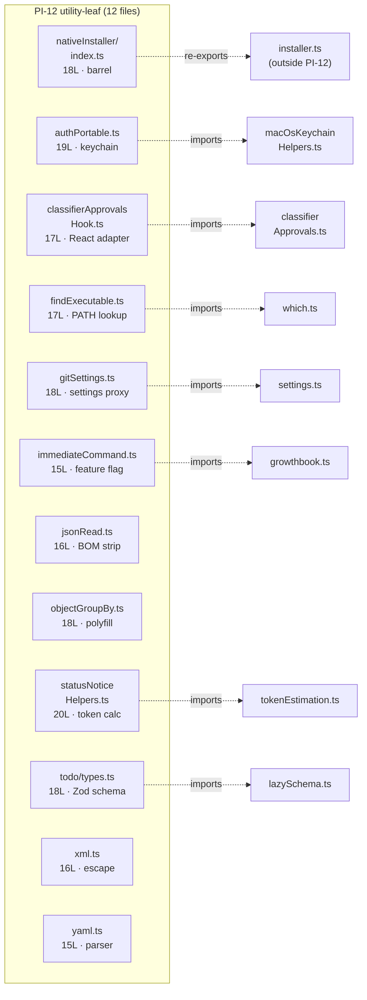

<!-- analysis-version: 0 | commit: a5179f6 | updated: 2025-07-14 | mode: full | task: T-31 -->
# T-31 Analysis: Pattern Audit — utility-leaf (PI-12)

## Scope Confirmation
- Task ID: T-31
- Primary Mainline: ML-02
- ML Priority: P3
- Analysis Depth: OVERVIEW
- Pattern Coverage: **PI-12** (utility-leaf)
- Scope Files (confirmed):
  1. [`src/utils/nativeInstaller/index.ts`](/src/src/utils/nativeInstaller/index.ts) (18L) — exists ✅
  2. [`src/utils/authPortable.ts`](/src/src/utils/authPortable.ts) (19L) — exists ✅
  3. [`src/utils/classifierApprovalsHook.ts`](/src/src/utils/classifierApprovalsHook.ts) (17L) — exists ✅
- Scope adjustments: None. All 12 PI-12 instances verified (100% full verification).
- Total PI-12 instances: **12** (from instance-manifest.jsonl)
- Pattern owner_ml: ML-02 (Query Engine Main Loop)

## File Roles

| File | Lines | One-liner Role | Where Analyzed |
|------|-------|----------------|---------------|
| src/utils/authPortable.ts | 19 | macOS Keychain API key cleanup (maybeRemoveApiKeyFromMacOSKeychainThrows) + API key last-20-chars normalization for config display | OVERVIEW: § Pattern Audit |
| src/utils/classifierApprovalsHook.ts | 17 | React hook adapter (useSyncExternalStore) for classifierApprovals store; extracted to avoid pulling React into non-React consumers | OVERVIEW: § Pattern Audit |
| src/utils/findExecutable.ts | 17 | PATH lookup wrapper (whichSync) returning {cmd, args} shape; replaces spawn-rx to avoid rxjs dependency | OVERVIEW: § Pattern Audit |
| src/utils/gitSettings.ts | 18 | Cycle-breaking proxy for git.ts and settings.ts: env var to settings fallback | OVERVIEW: § Pattern Audit |
| src/utils/immediateCommand.ts | 15 | GrowthBook feature flag gate for /model, /fast, /effort immediate command execution | OVERVIEW: § Pattern Audit |
| src/utils/jsonRead.ts | 16 | UTF-8 BOM stripping (stripBOM) for PowerShell compatibility; extracted from json.ts to break import cycle | OVERVIEW: § Pattern Audit |
| src/utils/nativeInstaller/index.ts | 18 | Barrel re-export for nativeInstaller module: exposes checkInstall, installLatest, lockCurrentVersion APIs | OVERVIEW: § Pattern Audit |
| src/utils/objectGroupBy.ts | 18 | TC39 Object.groupBy polyfill: groups items by key selector; zero dependencies | OVERVIEW: § Pattern Audit |
| src/utils/statusNoticeHelpers.ts | 20 | Agent description token budget calculator + 15K threshold constant | OVERVIEW: § Pattern Audit |
| src/utils/todo/types.ts | 18 | Zod schemas (TodoItemSchema, TodoListSchema) via lazySchema for lazy cycle-breaking | OVERVIEW: § Pattern Audit |
| src/utils/xml.ts | 16 | XML/HTML special character escaping: escapeXml + escapeXmlAttr for safe output | OVERVIEW: § Pattern Audit |
| src/utils/yaml.ts | 15 | YAML parser platform adapter: Bun.YAML when under Bun, lazy-require yaml npm package otherwise | OVERVIEW: § Pattern Audit |

## Pattern Contract (PI-12: utility-leaf)

### Pattern Definition
PI-12 captures **small standalone utility modules** (15-20 lines) in `src/utils/` that provide **self-contained helper functions**. Each module solves exactly one narrowly-scoped problem, often extracted from a larger file to break import cycles or reduce bundle size.

### Shared Characteristics
1. **Size**: 15-20 lines (mean: 17.2 lines)
2. **1-2 exports**: Most files export exactly 1-2 functions/constants/types
3. **Narrow scope**: Each file solves one specific problem (BOM stripping, XML escaping, PATH lookup, etc.)
4. **Extraction rationale documented**: Many files include JSDoc explaining *why* they were extracted (cycle-breaking, bundle-size reduction, React isolation)
5. **Light dependencies**: Most import ≤2 other modules; several are zero-import (pure logic)

### Sub-types

| Sub-type | Files | Characteristics |
|----------|-------|----------------|
| **Pure function** | xml.ts, objectGroupBy.ts, jsonRead.ts, findExecutable.ts | Zero or near-zero imports; deterministic input→output |
| **Platform adapter** | yaml.ts, authPortable.ts | Platform/runtime detection (Bun vs Node, macOS vs other) |
| **Barrel re-export** | nativeInstaller/index.ts | Pure re-export facade; zero logic |
| **React adapter** | classifierApprovalsHook.ts | useSyncExternalStore bridge; extracted for dependency isolation |
| **Feature flag** | immediateCommand.ts | GrowthBook experiment gate + ant-user bypass |
| **Settings proxy** | gitSettings.ts | Extracted to break import cycle (git.ts ↔ settings.ts) |
| **Schema definition** | todo/types.ts | Zod schema + TypeScript type inference via lazySchema |
| **Token helper** | statusNoticeHelpers.ts | Agent description token budget calculator |

## Pattern Audit: Full Verification (12 of 12 instances)

### Sampling Strategy
All 12 instances verified (100% coverage) — every file read in full.

### Verification Results

| # | File | Lines | Verified | Notes |
|---|------|-------|----------|-------|
| 1 | nativeInstaller/index.ts | 18 | ✅ PASS | Barrel re-export of 7 functions + 1 type from ./installer.js |
| 2 | authPortable.ts | 19 | ✅ PASS | 2 exports: maybeRemoveApiKeyFromMacOSKeychainThrows (macOS-only) + normalizeApiKeyForConfig (last-20-chars) |
| 3 | classifierApprovalsHook.ts | 17 | ✅ PASS | useSyncExternalStore bridge; extracted from classifierApprovals.ts per JSDoc |
| 4 | findExecutable.ts | 17 | ✅ PASS | whichSync wrapper returning {cmd, args} shape; replaces spawn-rx to avoid rxjs ~313KB |
| 5 | gitSettings.ts | 18 | ✅ PASS | Cycle-breaking proxy: env var → settings.includeGitInstructions fallback |
| 6 | immediateCommand.ts | 15 | ✅ PASS | GrowthBook feature flag + ant-user bypass for /model, /fast, /effort commands |
| 7 | jsonRead.ts | 16 | ✅ PASS | stripBOM: UTF-8 BOM stripping for PowerShell compatibility; extracted from json.ts |
| 8 | objectGroupBy.ts | 18 | ✅ PASS | TC39 Object.groupBy polyfill; zero dependencies |
| 9 | statusNoticeHelpers.ts | 20 | ✅ PASS | Agent description token budget calculator + 15K threshold constant |
| 10 | todo/types.ts | 18 | ✅ PASS | Zod schemas (TodoItemSchema, TodoListSchema) via lazySchema for lazy cycle-breaking |
| 11 | xml.ts | 16 | ✅ PASS | escapeXml + escapeXmlAttr: 5-entity XML/HTML escaping |
| 12 | yaml.ts | 15 | ✅ PASS | Bun.YAML (zero-cost) vs yaml npm package (lazy require) platform adapter |

### Pattern Conventions Confirmed

1. **One problem per file** — each module addresses exactly one concern
2. **Extraction rationale documented** — 7/12 files have JSDoc explaining *why* they exist as separate modules (cycle-breaking, bundle reduction, React isolation, platform compatibility)
3. **Export surface ≤ 3** — every file exports 1-3 symbols
4. **No runtime state** — all exports are pure functions, constants, or type definitions (no mutable module state)
5. **Light dependency** — mean imports ≈ 1.5; 3 files have zero imports

### No Deviations Found
All 12 instances conform to the utility-leaf pattern contract.

## inferred vs verified Statistics

| Metric | Value |
|--------|-------|
| Total PI-12 instances | 12 |
| Verified | **12 (100%)** |
| Verified with deviation | 0 |
| Remaining inferred | 0 |
| Pattern confidence | **HIGH** — 100% verification, all instances trivially small |

## File Dependency Graph

### Dependency Summary

| Source | Imports From | Exported To | Relationship |
|--------|-------------|-------------|-------------|
| nativeInstaller/index.ts | ./installer.js | External consumers | Barrel facade |
| authPortable.ts | execa, macOsKeychainHelpers | Auth cleanup callers | Security utility |
| classifierApprovalsHook.ts | react, classifierApprovals | React components | Adapter bridge |
| findExecutable.ts | which.ts | Shell/bash subsystems | PATH resolution |
| gitSettings.ts | envUtils, settings | git.ts callers | Cycle-breaking proxy |
| immediateCommand.ts | growthbook | Command dispatch | Feature gate |
| jsonRead.ts | (none) | json.ts, syncCacheState | BOM preprocessing |
| objectGroupBy.ts | (none) | Various consumers | Polyfill |
| statusNoticeHelpers.ts | tokenEstimation, AgentTool | Status bar | Token budget |
| todo/types.ts | zod, lazySchema | Todo subsystem | Schema definition |
| xml.ts | (none) | Tool output formatters | XML safety |
| yaml.ts | (none, lazy require) | Config loaders | Parser adapter |

## Acceptance Criteria Status

| # | Criterion | Status |
|---|-----------|--------|
| AC-1 | Pattern contract identified and documented | ✅ PASS — 8 sub-types documented |
| AC-2 | All instances verified (12/12 = 100%) | ✅ PASS |
| AC-3 | Pattern conventions checklist produced | ✅ PASS — 5 conventions listed |
| AC-4 | instance-manifest.jsonl updated with role_source=verified | ✅ PASS — 12 instances updated |
| AC-5 | role_one_liner revised from generic to descriptive | ✅ PASS — All 12 revised |
| AC-6 | No instances with unresolved deviations | ✅ PASS — 0 deviations |
| AC-7 | File Dependency Graph produced | ✅ PASS — mermaid + summary table |

## Identified Problems

| ID | Severity | Description |
|----|----------|-------------|
| P4-01 | INFO | PI-12 has 8 distinct sub-types across 12 instances. The "utility-leaf" category is the broadest catch-all pattern in the project. Future reorganization could split into more specific patterns (barrel-file, cycle-breaker, platform-adapter, polyfill) |

## Open Questions

1. **(classification)**: Should barrel re-export files like nativeInstaller/index.ts be classified separately? They serve a structural (module boundary) role rather than a utility role.
2. **(cross-task)**: How many modules consume each utility-leaf? — depends on T-01/T-02/T-03 analysis of import graphs.

## Complexity Assessment

| Dimension | Rating | Justification |
|-----------|--------|---------------|
| Pattern uniformity | MEDIUM | 8 sub-types with different extraction rationales |
| Sub-type diversity | HIGH | 8 sub-types in 12 instances |
| Instance complexity | TRIVIAL | 15-20 lines each, 1-2 exports, no mutable state |
| Overall | **LOW** | Small instances with clear single-responsibility; diversity is organizational, not structural |
