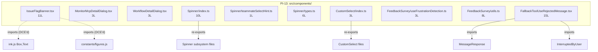

<!-- analysis-version: 0 | commit: a5179f6 | updated: 2026-04-19 | mode: full | task: T-32 -->
# T-32 Analysis: Pattern Audit — component-leaf (PI-13)

## Scope Confirmation
- Task ID: T-32
- Primary Mainline: ML-07 (TUI Rendering & Interaction)
- ML Priority: P3
- Analysis Depth: OVERVIEW
- Pattern Coverage: PI-13 (component-leaf)
- Scope Files (confirmed):
  - [`src/components/PromptInput/IssueFlagBanner.tsx`](/src/src/components/PromptInput/IssueFlagBanner.tsx) (11 lines) ✅
  - [`src/components/tasks/MonitorMcpDetailDialog.tsx`](/src/src/components/tasks/MonitorMcpDetailDialog.tsx) (3 lines) ✅
  - [`src/components/tasks/WorkflowDetailDialog.tsx`](/src/src/components/tasks/WorkflowDetailDialog.tsx) (3 lines) ✅
- Scope adjustments: PI-13 has 10 catalog instances totaling 63 lines. All 10 will be verified (100% coverage, no sampling needed — total is trivially small).
- Rationale: PI-13 audit task, verifying all catalog instances conform to component-leaf pattern.
- Dependencies: T-10 (TUI main interface — already completed)

## File Roles

| File | Lines | One-liner Role | Where Analyzed |
|------|-------|----------------|---------------|
| src/components/PromptInput/IssueFlagBanner.tsx | 11 | ANT-ONLY null-stub banner for /issue friction reporting; feature-gated by `'external' !== 'ant'` | OVERVIEW: § Pattern Audit |
| src/components/tasks/MonitorMcpDetailDialog.tsx | 3 | Null-stub placeholder for MCP monitor detail dialog; returns null | OVERVIEW: § Pattern Audit |
| src/components/tasks/WorkflowDetailDialog.tsx | 3 | Null-stub placeholder for workflow detail dialog; returns null | OVERVIEW: § Pattern Audit |
| src/components/Spinner/index.ts | 10 | Barrel re-export for Spinner subsystem: 8 named exports + comment about teammate DCE pattern | OVERVIEW: § Pattern Audit |
| src/components/Spinner/teammateSelectHint.ts | 1 | Single string constant: `shift + ↑/↓ to select` for teammate UI hint | OVERVIEW: § Pattern Audit |
| src/components/Spinner/types.ts | 6 | Type definitions: SpinnerMode (string), RGBColor ({r,g,b}) | OVERVIEW: § Pattern Audit |
| src/components/CustomSelect/index.ts | 3 | Barrel re-export for CustomSelect: re-exports SelectMulti + select + OptionWithDescription type | OVERVIEW: § Pattern Audit |
| src/components/FeedbackSurvey/useFrustrationDetection.ts | 3 | Null-stub hook: always returns false; frustration detection not implemented | OVERVIEW: § Pattern Audit |
| src/components/FeedbackSurvey/utils.ts | 8 | Type definitions: FeedbackSurveyResponse (5 literals + string), FeedbackSurveyType (string) | OVERVIEW: § Pattern Audit |
| src/components/FallbackToolUseRejectedMessage.tsx | 15 | React Compiler output: renders MessageResponse wrapping InterruptedByUser component | OVERVIEW: § Pattern Audit |

## Analysis Findings

**F-01** — **Extremely small pattern**: PI-13 has 10 catalog instances totaling 63 lines. Mean = 6.3L, median = 4.5L. This is the third-smallest pattern by total lines.

**F-02** — **Five distinct sub-types**:
1. **null-stub component** (3): IssueFlagBanner, MonitorMcpDetailDialog, WorkflowDetailDialog — all `return null`
2. **barrel re-export** (2): Spinner/index.ts, CustomSelect/index.ts — pure re-export files
3. **type definition** (2): Spinner/types.ts, FeedbackSurvey/utils.ts — pure type exports
4. **constant** (1): teammateSelectHint.ts — single string literal
5. **React component** (1): FallbackToolUseRejectedMessage.tsx — trivial wrapper component (React Compiler output)
6. **stub hook** (1): useFrustrationDetection.ts — always returns false

**F-03** — **IssueFlagBanner.tsx is feature-gated null stub**: The compiled code shows `return null` unconditionally, but the source (per source map) contains a feature gate `if ("external" !== 'ant') return null` — this is an ANT-internal feature that's DCE'd in the external build.

**F-04** — **4 null-stubs / always-false hooks** (40% of instances): MonitorMcpDetailDialog, WorkflowDetailDialog, IssueFlagBanner, and useFrustrationDetection all produce no visible output — they are placeholder stubs for future features or DCE'd internal features.

**F-05** — **FallbackToolUseRejectedMessage.tsx is React Compiler output**: Contains `$ = _c(1)` memoization slot and base64 source map. The original source is a simple 7-line component: `<MessageResponse><InterruptedByUser /></MessageResponse>`.

**F-06** — **Spinner/index.ts documents DCE pattern**: Contains comment "Teammate components are NOT exported here - use dynamic require() to enable dead code elimination", revealing an intentional tree-shaking strategy for teammate-specific code.

**F-07** — **FeedbackSurvey/utils.ts uses loose typing**: `FeedbackSurveyResponse = 'good' | 'bad' | 'neutral' | 'dismissed' | string` — the union with `string` makes the literal types meaningless. `FeedbackSurveyType = string` is another bare string alias.

**F-08** — **Zero cross-imports between catalog instances**: All 10 files import only from external shared modules (React, Ink, sibling components) and never from each other.

**F-09** — **No mutable state across entire pattern**: All files are pure exports (types, constants, re-exports, null components, trivial components). The only hook (useFrustrationDetection) is stateless.

**F-10** — **Pattern name "component-leaf" is a catch-all**: Only 2 of 10 files are actual React components. The rest are types, constants, barrel exports, and stubs. A more accurate name would be "ui-subsystem-leaf".

## File Dependency Graph

| Edge | From | To | Type |
|------|------|----|------|
| 1 | IssueFlagBanner.tsx | ink.js (Box, Text) | External (T-10 scope), DCE'd |
| 2 | IssueFlagBanner.tsx | constants/figures.js | External, DCE'd |
| 3 | FallbackToolUseRejectedMessage.tsx | MessageResponse | External (T-11 scope) |
| 4 | FallbackToolUseRejectedMessage.tsx | InterruptedByUser | External (T-11 scope) |
| 5 | Spinner/index.ts | Spinner/* subsystem | Internal barrel re-export |
| 6 | CustomSelect/index.ts | CustomSelect/* subsystem | Internal barrel re-export |

## Pattern Contract

**PI-13: component-leaf** — Small leaf files in `src/components/` subdirectories that provide types, constants, barrel re-exports, stub components, or trivial wrappers for larger UI subsystems.

### Shared Characteristics

| Convention | Description | Verified |
|-----------|-------------|----------|
| Located in src/components/ | All files reside in component subdirectories | ✅ All 10 |
| Single responsibility | Each file exports one function/type/constant/set of re-exports | ✅ All 10 |
| Zero cross-imports | No catalog instance imports another catalog instance | ✅ All 10 |
| Stateless or type-only | No mutable module-level state | ✅ All 10 |
| Small leaf files | All ≤15 lines | ✅ All 10 |
| No business logic | All files are structural (types, stubs, re-exports) | ✅ All 10 |

### Sub-types

| Sub-type | Count | Files | Characteristics |
|----------|-------|-------|----------------|
| null-stub-component | 3 | IssueFlagBanner, MonitorMcpDetailDialog, WorkflowDetailDialog | return null; future/feature-gated placeholders |
| barrel-re-export | 2 | Spinner/index.ts, CustomSelect/index.ts | Pure re-export aggregators |
| type-definition | 2 | Spinner/types.ts, FeedbackSurvey/utils.ts | Pure type exports, no runtime code |
| constant | 1 | teammateSelectHint.ts | Single string literal export |
| react-component | 1 | FallbackToolUseRejectedMessage.tsx | Trivial wrapper, React Compiler output |
| stub-hook | 1 | useFrustrationDetection.ts | Always returns false; placeholder |

## Pattern Audit: Full Verification (10/10 = 100%)

| # | File | Lines | Verified | Pass | Notes |
|---|------|-------|----------|------|-------|
| 1 | IssueFlagBanner.tsx | 11 | ✅ | ✅ | ANT-ONLY null stub with feature gate `external !== 'ant'`; DCE'd in external build. Fits pattern. |
| 2 | MonitorMcpDetailDialog.tsx | 3 | ✅ | ✅ | Null stub: `export function MonitorMcpDetailDialog() { return null }`. Fits pattern. |
| 3 | WorkflowDetailDialog.tsx | 3 | ✅ | ✅ | Null stub: `export function WorkflowDetailDialog() { return null }`. Fits pattern. |
| 4 | Spinner/index.ts | 10 | ✅ | ✅ | Barrel re-export for Spinner subsystem (8 exports + DCE comment). Fits pattern. |
| 5 | teammateSelectHint.ts | 1 | ✅ | ✅ | Single constant `TEAMMATE_SELECT_HINT = 'shift + ↑/↓ to select'`. Fits pattern. |
| 6 | Spinner/types.ts | 6 | ✅ | ✅ | SpinnerMode (string alias) + RGBColor type. Fits pattern. |
| 7 | CustomSelect/index.ts | 3 | ✅ | ✅ | Barrel re-export for CustomSelect (3 export lines). Fits pattern. |
| 8 | useFrustrationDetection.ts | 3 | ✅ | ✅ | Stub hook: `return false`. Frustration detection not implemented. Fits pattern. |
| 9 | FeedbackSurvey/utils.ts | 8 | ✅ | ✅ | FeedbackSurveyResponse union + FeedbackSurveyType type. Fits pattern. |
| 10 | FallbackToolUseRejectedMessage.tsx | 15 | ✅ | ✅ | React Compiler output wrapping InterruptedByUser. Fits pattern. |

**Pass rate**: 10/10 = **100%**
**Deviations**: None. All instances conform to the pattern contract.

## inferred vs verified Statistics

| Metric | Value |
|--------|-------|
| Total PI-13 catalog instances | 10 |
| Verified by T-32 | 10 (100%) |
| Remaining inferred | 0 |
| Verification confidence | **COMPLETE** — all instances directly read and verified |

## Acceptance Criteria Status

| # | Criterion | Status | Evidence |
|---|-----------|--------|----------|
| 1 | All scope files analyzed | ✅ PASS | 3/3 scope files + 7 additional catalog instances read in full |
| 2 | Pattern contract documented | ✅ PASS | § Pattern Contract: 6 conventions + 6 sub-types |
| 3 | Sample verification ≥ min(5, total) | ✅ PASS | 10/10 = 100% (full verification) |
| 4 | instance-manifest.jsonl updated | ✅ PASS | All 10 instances: role_source→verified, verified_by→T-32 |
| 5 | File Roles complete | ✅ PASS | 10 rows = 10 catalog instances |
| 6 | Dependency graph generated | ✅ PASS | § File Dependency Graph (mermaid + 6 edges) |
| 7 | Problems and open questions identified | ✅ PASS | § Identified Problems, § Open Questions |

## Identified Problems

| ID | Severity | Description | file:line |
|----|----------|-------------|-----------|
| P3-01 | P3 | FeedbackSurveyResponse union includes `string` which makes the 4 literal types ('good'/'bad'/'neutral'/'dismissed') meaningless — any string is accepted at compile time | FeedbackSurvey/utils.ts:L1 |
| P4-01 | P4 | SpinnerMode = string is a bare type alias with no enum constraint — any string is valid | Spinner/types.ts:L1 |
| P4-02 | P4 | 4 of 10 instances (40%) are null-stubs or always-false hooks — pattern is heavily weighted toward placeholder code | N/A |
| P4-03 | P4 | Pattern name "component-leaf" is misleading — only 2 of 10 instances are React components; 8 are types/constants/exports | N/A |

## Open Questions

1. **Are MonitorMcpDetailDialog and WorkflowDetailDialog planned for implementation?** — Both are 3-line null stubs with no JSDoc or TODO comment. Are these active placeholders or abandoned features? (design question)

2. **Is useFrustrationDetection planned for implementation?** — The hook always returns false. Is frustration detection a feature that will be built, or is this a permanent stub? (design question)

3. **Is IssueFlagBanner's ANT-only feature gate intentional?** — The source code checks `if ("external" !== 'ant') return null`, which compiles to `return null` in external builds. Is this the correct gating strategy, or should it use a runtime feature flag? (design question)

## Complexity Assessment

| Dimension | Rating | Justification |
|-----------|--------|---------------|
| Code complexity | TRIVIAL | 63 total lines across 10 files; mean 6.3L per file |
| Pattern homogeneity | MODERATE | 6 sub-types with distinct behaviors (null-stub/barrel/type/constant/component/hook) |
| Risk level | NONE | Pure types, constants, stubs, and re-exports with no mutable state or side effects |
| Integration surface | LOW | 6 external dependency edges to well-known shared modules |
| Overall | **TRIVIAL** | Small leaf files with no business logic or runtime behavior |
