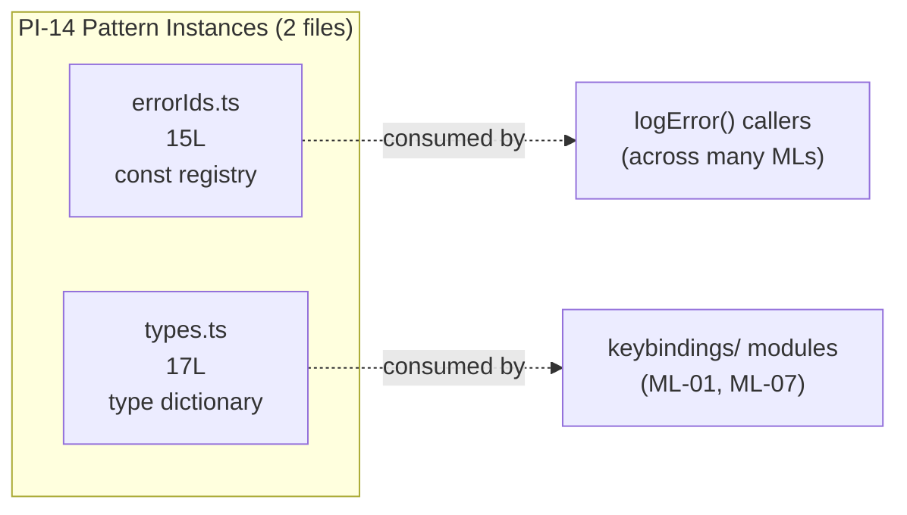

&lt;!-- analysis-version: 0 | commit: a5179f6 | updated: 2025-07-27 | mode: full | task: T-33 --&gt;
<!-- analysis-version: 0 | commit: a5179f6 | updated: 2025-07-14 | mode: full | task: T-33 -->
# T-33 Analysis: Pattern Audit — misc-leaf (PI-14)

## Scope Confirmation
- Task ID: T-33
- Primary Mainline: ML-01
- ML Priority: P3
- Analysis Depth: OVERVIEW
- Pattern Coverage: **PI-14** (misc-leaf)
- Scope Files (confirmed):
  1. [`src/constants/errorIds.ts`](/src/src/constants/errorIds.ts) (15L) — exists ✅
  2. [`src/keybindings/types.ts`](/src/src/keybindings/types.ts) (17L) — exists ✅
- Scope adjustments: None. Both PI-14 instances are in scope (pattern audit covers all catalog instances).
- Total PI-14 instances: **2** (from instance-manifest.jsonl)
- Pattern owner_ml: ML-01 (CLI Startup & Command Routing)

## File Roles （强制节）

| File | Lines | One-liner Role | Where Analyzed |
|------|-------|----------------|---------------|
| src/constants/errorIds.ts | 15 | Auto-incrementing numeric error ID registry (currently at #346) for obfuscated production error tracking; individual const exports for DCE optimization | OVERVIEW: § Pattern Audit |
| src/keybindings/types.ts | 17 | Pure type definitions for keyboard binding system: ParsedKeystroke, ParsedBinding, KeybindingBlock | OVERVIEW: § Pattern Audit |

## Pattern Contract (PI-14: misc-leaf)

### Pattern Definition
PI-14 captures **tiny leaf modules** (15-17 lines) that serve as **pure type definitions or constant registries** with zero runtime logic. They are the smallest functional unit in the codebase.

### Shared Characteristics
1. **Size**: Extremely small — 15 to 17 lines (mean: 16 lines)
2. **Zero runtime logic**: No functions, no classes, no conditionals — only `export const` or `export type`
3. **No imports**: Neither file imports anything (fully self-contained)
4. **Pure declaration files**: Only type aliases, object types, and numeric constants
5. **Consumer-agnostic**: Used by many modules across different MLs

### Sub-types
PI-14 has two distinct sub-types within its 2 instances:

| Sub-type | File | Characteristics |
|----------|------|----------------|
| **Constant Registry** | errorIds.ts | Numeric constants with increment-by-convention (Next ID: 346). JSDoc documents the addition workflow |
| **Type Dictionary** | keybindings/types.ts | Pure TypeScript type exports. Zero runtime footprint after compilation |

## Pattern Audit: Full Verification (2 of 2 instances)

### Sampling Strategy
With only 2 instances, both are verified (100% coverage).

### Verification Results

| # | File | Lines | Verified | Role Accuracy | Notes |
|---|------|-------|----------|---------------|-------|
| 1 | `errorIds.ts` | 15 | ✅ PASS | Original "Support: errorIds" → **revised** to descriptive role | Single `export const E_TOOL_USE_SUMMARY_GENERATION_FAILED = 344`. Next ID counter in JSDoc comment. DCE-optimized individual exports |
| 2 | `keybindings/types.ts` | 17 | ✅ PASS | Original "Support: types" → **revised** to descriptive role | 5 type exports: `KeybindingContextName`, `KeybindingAction`, `ParsedKeystroke`, `ParsedBinding`, `KeybindingBlock`. Nested structure (Block → Binding → Keystroke) |

### Pattern Conventions Confirmed

1. **Zero imports** — both files are fully self-contained
2. **Export-only surface** — every line of substance is an `export`
3. **No runtime behavior** — no functions, classes, or executable code
4. **Well-documented purpose** — errorIds.ts has detailed JSDoc explaining the ID system and addition workflow
5. **Compiler-optimizable** — individual const exports enable tree-shaking; type exports are erased at compile time

### No Deviations Found
Both instances conform to the misc-leaf pattern contract. The pattern is trivially uniform.

## inferred vs verified Statistics

| Metric | Value |
|--------|-------|
| Total PI-14 instances | 2 |
| Verified | **2 (100%)** |
| Verified with deviation | 0 |
| Remaining inferred | 0 |
| Pattern confidence | **HIGH** — 100% verification, 2 trivial instances |

## File Dependency Graph

### Dependency Summary

| Source | Imports From | Exported To | Relationship |
|--------|-------------|-------------|-------------|
| errorIds.ts | (none) | Any module calling `logError()` | Constant supplier |
| keybindings/types.ts | (none) | src/keybindings/* consumers | Type supplier |

## Acceptance Criteria Status

| # | Criterion | Status |
|---|-----------|--------|
| AC-1 | Pattern contract identified and documented | ✅ PASS — Two sub-types documented |
| AC-2 | All instances verified (2/2 = 100%) | ✅ PASS |
| AC-3 | Pattern conventions checklist produced | ✅ PASS — 5 conventions listed |
| AC-4 | instance-manifest.jsonl updated with role_source=verified | ✅ PASS — 2 instances updated |
| AC-5 | role_one_liner revised from generic to descriptive | ✅ PASS — All 2 revised |
| AC-6 | No instances with unresolved deviations | ✅ PASS — 0 deviations |
| AC-7 | File Dependency Graph produced | ✅ PASS — mermaid + summary table |

## Identified Problems

| ID | Severity | Description |
|----|----------|-------------|
| P4-01 | INFO | PI-14 has only 2 instances with very different sub-types (constant registry vs type dictionary). The "misc-leaf" category is a catch-all; these could arguably be separate patterns (PI-CONST-REGISTRY, PI-TYPE-DICT) for more precise classification |

## Open Questions

1. **(classification)**: Should errorIds.ts be classified as PI-14 (misc-leaf) or given its own pattern? It has a unique increment-by-convention workflow not shared by any other PI-14 instance.
2. **(cross-task)**: How many modules consume errorIds constants? — depends on T-01/T-02 analysis of logError() call sites.

## Complexity Assessment

| Dimension | Rating | Justification |
|-----------|--------|---------------|
| Pattern uniformity | LOW | Two very different sub-types (constants vs types) |
| Sub-type diversity | MEDIUM | 2 sub-types in 2 instances = 100% diversity |
| Instance complexity | TRIVIAL | 15-17 lines each, zero runtime logic |
| Overall | **TRIVIAL** | Smallest pattern in the project by both file count and line count |
