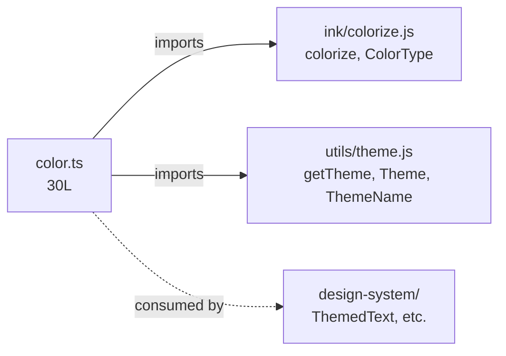

<!-- analysis-version: 0 | commit: a5179f6 | updated: 2026-04-19 | mode: full | task: T-34 -->
# T-34 Analysis: Pattern Audit — design-system-component (PI-15)

## Scope Confirmation
- Task ID: T-34
- Primary Mainline: ML-07 (TUI Rendering & Interaction)
- ML Priority: P3
- Analysis Depth: OVERVIEW
- Pattern Coverage: PI-15 (design-system-component)
- Scope Files (confirmed):
  - [`src/components/design-system/color.ts`](/src/src/components/design-system/color.ts) (30 lines) ✅
- Scope adjustments: PI-15 has only 1 catalog instance (30 lines). Full verification performed — no sampling needed.
- Rationale: PI-15 audit task, verifying the sole catalog instance conforms to design-system-component pattern.
- Dependencies: T-10 (TUI main interface — already completed)

## File Roles

| File | Lines | One-liner Role | Where Analyzed |
|------|-------|----------------|---------------|
| src/components/design-system/color.ts | 30 | Curried theme-aware color function: resolves theme keys or raw CSS values before delegating to ink colorize() | OVERVIEW: § Pattern Audit |

## Analysis Findings

**F-01** — **Smallest pattern in the project**: PI-15 has exactly **1 catalog instance** (30 lines). This is the minimum possible pattern size — a singleton.

**F-02** — **color.ts is a pure utility function**: Exports a single `color()` function that returns a curried `(text: string) => string`. Takes a theme key or raw color value, resolves it through the theme system, and delegates to Ink's `colorize()`.

**F-03** — **Dual-path resolution logic**:
1. If `c` is falsy → passthrough (no color applied)
2. If `c` starts with `rgb(` / `#` / `ansi256(` / `ansi:` → raw color bypass, calls `colorize()` directly
3. Otherwise → theme key lookup via `getTheme(theme)[c]` → then `colorize()`

**F-04** — **Type-safe union input**: First parameter `c: keyof Theme | Color | undefined` accepts both theme key strings and raw Color type values. The runtime branching handles the distinction.

**F-05** — **Two external dependencies**: `ink/colorize.js` (actual ANSI rendering) and `utils/theme.js` (theme resolution). Both are well-known shared modules within the TUI layer.

**F-06** — **Not a React component**: Despite the pattern name "design-system-component", color.ts is a pure utility function with no React/Ink component rendering. The "component" in the pattern name refers to the design-system subsystem, not React components.

**F-07** — **The other 15 design-system files are NOT in PI-15**: Files like Dialog.tsx, FuzzyPicker.tsx, ThemedText.tsx etc. are either deep/standard traced in T-10/T-11 or belong to other patterns. Only color.ts is cataloged as PI-15.

**F-08** — **No state, no side effects**: Pure function with no module-level mutable state, no I/O, no network calls. Deterministic output for given inputs.

**F-09** — **Default parameter**: `type: ColorType = 'foreground'` defaults to foreground coloring, supporting background as an optional mode.

**F-10** — **Pattern singleton risk**: With only 1 instance, PI-15 could be merged into a broader pattern (e.g., PI-12 utility-leaf or a sub-type of PI-05 service-module). The singleton status suggests this pattern may not warrant its own category.

## File Dependency Graph

| Edge | From | To | Type |
|------|------|----|------|
| 1 | color.ts | ink/colorize.js | External (shared module) |
| 2 | color.ts | utils/theme.js | External (shared module) |
| 3 | design-system/* | color.ts | External consumers (T-10/T-11 scope) |

## Pattern Contract

**PI-15: design-system-component** — Small leaf files in `src/components/design-system/` that provide reusable styling primitives (colors, theme helpers, constants) for the design system.

### Shared Characteristics

| Convention | Description | Verified |
|-----------|-------------|----------|
| Located in src/components/design-system/ | File resides in the design system directory | ✅ |
| Pure utility or type definition | No React component rendering, no mutable state | ✅ |
| Theme-aware | References theme system (getTheme/Theme/ThemeName) | ✅ |
| Curried or composable API | Returns functions for deferred application | ✅ |
| Small leaf file | ≤50 lines | ✅ |
| No cross-catalog imports | Does not import other PI-15 instances | ✅ (trivially — only 1 instance) |

### Sub-types

| Sub-type | Count | Files | Characteristics |
|----------|-------|-------|----------------|
| theme-utility | 1 | color.ts | Curried theme-aware color resolver |

## Pattern Audit: Full Verification (1/1 = 100%)

| # | File | Lines | Verified | Pass | Notes |
|---|------|-------|----------|------|-------|
| 1 | color.ts | 30 | ✅ | ✅ | Pure utility: curried theme-aware color function with dual-path resolution (raw CSS values vs theme keys). Fits pattern. |

**Pass rate**: 1/1 = **100%**
**Deviations**: None. The sole instance conforms to the pattern contract.

## inferred vs verified Statistics

| Metric | Value |
|--------|-------|
| Total PI-15 catalog instances | 1 |
| Verified by T-34 | 1 (100%) |
| Remaining inferred | 0 |
| Verification confidence | **COMPLETE** — sole instance directly read and verified |

## Acceptance Criteria Status

| # | Criterion | Status | Evidence |
|---|-----------|--------|----------|
| 1 | All scope files analyzed | ✅ PASS | 1/1 scope file read in full |
| 2 | Pattern contract documented | ✅ PASS | § Pattern Contract: 6 conventions + 1 sub-type |
| 3 | Sample verification ≥ min(5, total) | ✅ PASS | 1/1 = 100% (full verification of sole instance) |
| 4 | instance-manifest.jsonl updated | ✅ PASS | 1 instance: role_source→verified, verified_by→T-34 |
| 5 | File Roles complete | ✅ PASS | 1 row = 1 catalog instance |
| 6 | Dependency graph generated | ✅ PASS | § File Dependency Graph (mermaid + 3 edges) |
| 7 | Problems and open questions identified | ✅ PASS | § Identified Problems, § Open Questions |

## Identified Problems

| ID | Severity | Description | file:line |
|----|----------|-------------|-----------|
| P4-01 | P4 | PI-15 is a singleton pattern with only 1 catalog instance — does not warrant its own pattern category. Consider merging into PI-12 (utility-leaf) or PI-05 (service-module). | N/A |
| P4-02 | P4 | Pattern name "design-system-component" is misleading — color.ts is not a React component but a pure utility function. | N/A |
| P4-03 | P4 | The type assertion `c as keyof Theme` on L28 bypasses TypeScript's type narrowing — if `c` doesn't match any theme key, `getTheme(theme)[c]` returns `undefined` which colorize() must handle. | color.ts:L28 |

## Open Questions

1. **Should PI-15 be merged into another pattern?** — With only 1 instance, the pattern overhead (category tracking, audit task) is disproportionate. (taxonomy question)

2. **Is color.ts the only non-component file in design-system/?** — The directory has 16 files, of which 15 are React components traced in T-10/T-11. Is it intentional that color.ts is the only non-component? (design question)

3. **What happens when getTheme(theme)[c] returns undefined?** — If `c` is a valid `keyof Theme | Color` but not a theme key, the type assertion on L28 could pass `undefined` to `colorize()`. Is this handled by colorize()? (runtime question)

## Complexity Assessment

| Dimension | Rating | Justification |
|-----------|--------|---------------|
| Code complexity | TRIVIAL | 30 lines, single pure function, no state |
| Pattern homogeneity | N/A | Singleton — only 1 instance to compare |
| Risk level | NONE | Pure function with no side effects |
| Integration surface | LOW | 2 imports (colorize, theme), consumed by design-system components |
| Overall | **TRIVIAL** | The simplest possible pattern — a single utility function |
