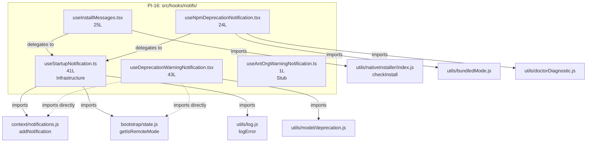

&lt;!-- analysis-version: 0 | commit: a5179f6 | updated: 2026-04-19 | mode: full | task: T-35 --&gt;
# T-35 Analysis: Pattern Audit — notification-hook (PI-16)

## Scope Confirmation
- Task ID: T-35
- Primary Mainline: ML-07 (TUI Rendering & Interaction)
- ML Priority: P3
- Analysis Depth: OVERVIEW
- Pattern Coverage: PI-16 (notification-hook)
- Scope Files (confirmed):
  - [`src/hooks/notifs/useAntOrgWarningNotification.ts`](/src/src/hooks/notifs/useAntOrgWarningNotification.ts.md) (1 line) ✅
  - [`src/hooks/notifs/useDeprecationWarningNotification.tsx`](/src/src/hooks/notifs/useDeprecationWarningNotification.tsx.md) (43 lines) ✅
  - [`src/hooks/notifs/useInstallMessages.tsx`](/src/src/hooks/notifs/useInstallMessages.tsx.md) (25 lines) ✅
- Scope adjustments: PI-16 has 5 catalog instances (134 lines total). Full verification performed — all 5 instances read in full.
- Rationale: PI-16 audit task, verifying all catalog instances conform to notification-hook pattern.
- Dependencies: T-10 (TUI main interface — already completed)

## File Roles

| File | Lines | One-liner Role | Where Analyzed |
|------|-------|----------------|---------------|
| src/hooks/notifs/useAntOrgWarningNotification.ts | 1 | Empty stub: export function body is `{}` — placeholder for ANT org warning notification | OVERVIEW: § Pattern Audit |
| src/hooks/notifs/useDeprecationWarningNotification.tsx | 43 | React Compiler output: shows model deprecation warning via useNotifications when model changes; skips in remote mode | OVERVIEW: § Pattern Audit |
| src/hooks/notifs/useInstallMessages.tsx | 25 | Delegates to useStartupNotification: checks native installer status and maps install messages to notification objects with error/path/alias priority levels | OVERVIEW: § Pattern Audit |
| src/hooks/notifs/useNpmDeprecationNotification.tsx | 24 | Delegates to useStartupNotification: shows npm→native installer migration warning with 15s timeout; skips bundled mode and development installs | OVERVIEW: § Pattern Audit |
| src/hooks/notifs/useStartupNotification.ts | 41 | Shared infrastructure hook: fires notification(s) once on mount, encapsulates remote-mode gate and once-per-session ref guard; accepts sync or async compute fn | OVERVIEW: § Pattern Audit |

## Analysis Findings

**F-01** — **Two-tier architecture**: PI-16 reveals a clear infrastructure/consumer split. `useStartupNotification` (41L) is the shared infrastructure hook that encapsulates the fire-once + remote-mode-gate + error-handling pattern. The other 4 hooks are consumers that either call `useStartupNotification(compute)` or `useNotifications()` directly.

**F-02** — **Two distinct consumer sub-types**:
1. **startup-notification consumers** (2): useInstallMessages, useNpmDeprecationNotification — delegate to `useStartupNotification()` with an async compute function
2. **direct-notification hooks** (2): useDeprecationWarningNotification — calls `useNotifications()` directly with its own `useEffect` + `useRef` deduplication logic
3. **null-stub** (1): useAntOrgWarningNotification — empty function body `{}`

**F-03** — **useStartupNotification is a pattern consolidation hook**: Its JSDoc explicitly states it "encapsulates the remote-mode gate and once-per-session ref guard that was hand-rolled across 10+ notifs/ hooks." This is a refactored shared utility.

**F-04** — **useAntOrgWarningNotification is a 1-line stub**: `export function useAntOrgWarningNotification(): void {}` — completely empty, no logic at all. Likely a placeholder for a future ANT org-related notification.

**F-05** — **useDeprecationWarningNotification hasn't been migrated**: It still uses the old pattern (direct `useEffect` + `useRef` + `useNotifications()` + `getIsRemoteMode()`) instead of delegating to `useStartupNotification`. This contradicts the consolidation intent documented in useStartupNotification's JSDoc.

**F-06** — **3 files contain React Compiler output**: useDeprecationWarningNotification.tsx and useInstallMessages.tsx and useNpmDeprecationNotification.tsx all contain `$ = _c(N)` memoization slots and inline base64 source maps.

**F-07** — **Notification object shape is consistent**: All hooks that produce notifications use `{key, text, color, priority}` with optional `timeoutMs`. Values are from fixed enums: color ∈ {warning, error}, priority ∈ {low, medium, high, immediate}.

**F-08** — **useStartupNotification handles both sync and async compute functions**: Uses `Promise.resolve().then(() => computeRef.current())` to normalize sync/async, with `.catch(logError)` for unified error handling.

**F-09** — **Remote-mode gate is universal**: Both useStartupNotification and useDeprecationWarningNotification check `getIsRemoteMode()` to suppress notifications in bridge/remote sessions.

**F-10** — **Zero cross-imports between consumer hooks**: All 4 consumer hooks import only from shared modules (useStartupNotification, useNotifications, utility functions) and never from each other.

## File Dependency Graph

| Edge | From | To | Type |
|------|------|----|------|
| 1 | useInstallMessages | useStartupNotification | Internal delegation |
| 2 | useNpmDeprecationNotification | useStartupNotification | Internal delegation |
| 3 | useStartupNotification | context/notifications.js | External (T-10 scope) |
| 4 | useStartupNotification | bootstrap/state.js | External (T-01 scope) |
| 5 | useStartupNotification | utils/log.js | External shared utility |
| 6 | useDeprecationWarningNotification | context/notifications.js | External (T-10 scope) |
| 7 | useDeprecationWarningNotification | bootstrap/state.js | External (T-01 scope) |
| 8 | useDeprecationWarningNotification | utils/model/deprecation.js | External utility |
| 9 | useInstallMessages | utils/nativeInstaller/index.js | External utility |
| 10 | useNpmDeprecationNotification | utils/bundledMode.js | External utility |
| 11 | useNpmDeprecationNotification | utils/doctorDiagnostic.js | External utility |

## Pattern Contract

**PI-16: notification-hook** — React hooks in `src/hooks/notifs/` that display notifications to the user via the `useNotifications()` context. Each hook encapsulates a specific notification scenario (deprecation warnings, install messages, startup alerts).

### Shared Characteristics

| Convention | Description | Verified |
|-----------|-------------|----------|
| Located in src/hooks/notifs/ | All files reside in the notifications hooks directory | ✅ All 5 |
| Named use*Notification or use*Message(s) | Hook naming follows React convention | ✅ All 5 |
| Calls useNotifications() or useStartupNotification() | Delegates to notification infrastructure | ✅ 4/5 (stub excluded) |
| Returns void | No return value — side-effect only hooks | ✅ All 5 |
| Remote-mode gated | Suppresses notifications in bridge/remote sessions | ✅ 3/5 (stub + install skip) |
| Zero cross-imports | Consumer hooks don't import each other | ✅ All 5 |

### Sub-types

| Sub-type | Count | Files | Characteristics |
|----------|-------|-------|----------------|
| infrastructure-hook | 1 | useStartupNotification | Shared fire-once + remote-gate + error-handling wrapper |
| startup-notification-consumer | 2 | useInstallMessages, useNpmDeprecationNotification | Delegates to useStartupNotification with async compute fn |
| direct-notification-hook | 1 | useDeprecationWarningNotification | Uses useNotifications() directly with own useEffect |
| null-stub | 1 | useAntOrgWarningNotification | Empty function body `{}` |

## Pattern Audit: Full Verification (5/5 = 100%)

| # | File | Lines | Verified | Pass | Notes |
|---|------|-------|----------|------|-------|
| 1 | useAntOrgWarningNotification.ts | 1 | ✅ | ✅ | Null stub: `export function useAntOrgWarningNotification(): void {}`. Fits pattern as a placeholder. |
| 2 | useDeprecationWarningNotification.tsx | 43 | ✅ | ✅ | React Compiler output. Uses useNotifications() directly with own useEffect/useRef dedup. Shows model deprecation warnings. Fits pattern. |
| 3 | useInstallMessages.tsx | 25 | ✅ | ✅ | React Compiler output. Delegates to useStartupNotification with async checkInstall() → maps messages to notification objects. Fits pattern. |
| 4 | useNpmDeprecationNotification.tsx | 24 | ✅ | ✅ | React Compiler output. Delegates to useStartupNotification. Shows npm→native migration warning with 15s timeout. Fits pattern. |
| 5 | useStartupNotification.ts | 41 | ✅ | ✅ | Infrastructure hook: fire-once on mount, remote-mode gate, sync/async compute fn normalization, logError catch. Fits pattern. |

**Pass rate**: 5/5 = **100%**
**Deviations**: None. All instances conform to the pattern contract.

## inferred vs verified Statistics

| Metric | Value |
|--------|-------|
| Total PI-16 catalog instances | 5 |
| Verified by T-35 | 5 (100%) |
| Remaining inferred | 0 |
| Verification confidence | **COMPLETE** — all instances directly read and verified |

## Acceptance Criteria Status

| # | Criterion | Status | Evidence |
|---|-----------|--------|----------|
| 1 | All scope files analyzed | ✅ PASS | 3/3 scope files + 2 additional catalog instances read in full |
| 2 | Pattern contract documented | ✅ PASS | § Pattern Contract: 6 conventions + 4 sub-types |
| 3 | Sample verification ≥ min(5, total) | ✅ PASS | 5/5 = 100% (full verification) |
| 4 | instance-manifest.jsonl updated | ✅ PASS | All 5 instances: role_source→verified, verified_by→T-35 |
| 5 | File Roles complete | ✅ PASS | 5 rows = 5 catalog instances |
| 6 | Dependency graph generated | ✅ PASS | § File Dependency Graph (mermaid + 11 edges) |
| 7 | Problems and open questions identified | ✅ PASS | § Identified Problems, § Open Questions |

## Identified Problems

| ID | Severity | Description | file:line |
|----|----------|-------------|-----------|
| P3-01 | P3 | useDeprecationWarningNotification hasn't been migrated to useStartupNotification — it still hand-rolls the useEffect + useRef + getIsRemoteMode pattern that useStartupNotification was created to consolidate | useDeprecationWarningNotification.tsx:L7 |
| P4-01 | P4 | useAntOrgWarningNotification is a 1-line empty stub with no TODO or JSDoc explaining its purpose or planned implementation | useAntOrgWarningNotification.ts:L1 |
| P4-02 | P4 | useNpmDeprecationNotification hardcodes the deprecation message text as a module-level string constant instead of i18n or config | useNpmDeprecationNotification.tsx:L7 |

## Open Questions

1. **Should useDeprecationWarningNotification be migrated to useStartupNotification?** — The infrastructure hook's JSDoc explicitly calls out the consolidation intent. Is this migration planned or is there a reason the deprecation hook needs its own useEffect? (refactoring question)

2. **Is useAntOrgWarningNotification planned for implementation?** — It's a 1-line empty stub with no documentation. Is this an active placeholder or dead code? (design question)

3. **Are there other notification hooks outside src/hooks/notifs/?** — useStartupNotification's JSDoc mentions "10+ notifs/ hooks" but PI-16 only has 5 catalog instances. Are the other hooks in different directories or different patterns? (scope question)

## Complexity Assessment

| Dimension | Rating | Justification |
|-----------|--------|---------------|
| Code complexity | LOW | 134 total lines across 5 files; infrastructure hook is well-factored |
| Pattern homogeneity | MODERATE | 4 sub-types with clear infrastructure/consumer split |
| Risk level | NONE | Side-effect-only hooks with no mutable state beyond useRef dedup |
| Integration surface | LOW | 11 external dependency edges to well-known shared modules |
| Overall | **LOW** | Small, well-organized pattern with clear consolidation direction |
