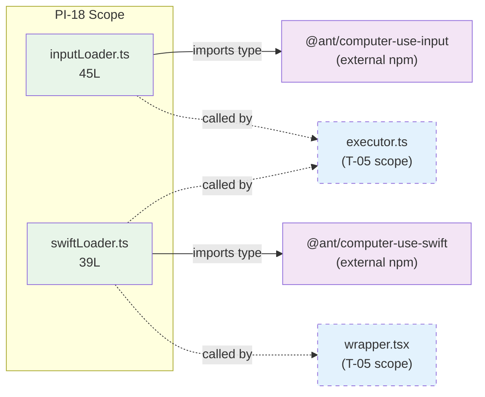

&lt;!-- analysis-version: 0 | commit: a5179f6 | updated: 2026-04-19 | mode: full | task: T-36 --&gt;
# T-36 Analysis: Pattern Audit — computer-use-module (PI-18)

## Scope Confirmation
- Task ID: T-36
- Primary Mainline: ML-03 (Tool System Registration & Dispatch)
- ML Priority: P3
- Analysis Depth: OVERVIEW
- Pattern Coverage: PI-18 (computer-use-module)
- Scope Files (confirmed):
  - [`src/utils/computerUse/inputLoader.ts`](/src/src/utils/computerUse/inputLoader.ts.md) (45 lines) ✅
  - [`src/utils/computerUse/swiftLoader.ts`](/src/src/utils/computerUse/swiftLoader.ts.md) (39 lines) ✅
- Scope adjustments: None. PI-18 has exactly 2 catalog instances, both are scope files — 100% full verification.

## File Roles

| File | Lines | One-liner Role | Where Analyzed |
|------|-------|----------------|---------------|
| src/utils/computerUse/inputLoader.ts | 45 | Lazy-loading singleton for `@ant/computer-use-input` native module with CJS default-unwrap and `isSupported` gate | OVERVIEW: § Analysis Findings, § Pattern Contract |
| src/utils/computerUse/swiftLoader.ts | 39 | Lazy-loading singleton for `@ant/computer-use-swift` native module with macOS platform guard and CJS default-unwrap | OVERVIEW: § Analysis Findings, § Pattern Contract |

## Analysis Findings

**F-01** — **Identical loader pattern**: Both files implement the exact same 3-step pattern: (1) `let cached` singleton → (2) `unwrapDefaultExport()` helper → (3) exported `require*()` function that loads, validates, and caches a native addon.

**F-02** — **CJS default-unwrap boilerplate duplicated**: Both files contain an identical `unwrapDefaultExport<T>()` function (lines 8–16 in both). This 9-line helper could be extracted to a shared utility, but the duplication is harmless at this scale.

**F-03** — **Platform gating differs by concern**: `inputLoader` gates on `input.isSupported` (runtime check from the native module itself); `swiftLoader` gates on `process.platform !== 'darwin'` (static Node check). The difference reflects the underlying modules' different support strategies.

**F-04** — **Cache strategies differ slightly**: `inputLoader` uses `if (cached) return cached` then `return (cached = input)` (explicit if-block); `swiftLoader` uses `(cached ??= unwrapDefaultExport(...))` (nullish coalescing assignment). Semantically identical, stylistic difference.

**F-05** — **JSDoc documents critical runtime constraint**: Both files document the `dispatchRunLoop()` requirement — `@MainActor` methods dispatch to `DispatchQueue.main` and hang under libuv unless `CFRunLoop` is pumped. This is a critical integration note for callers.

**F-06** — **Environment variable paths baked by build**: Both JSDoc comments reference `COMPUTER_USE_INPUT_NODE_PATH` / `COMPUTER_USE_SWIFT_NODE_PATH` which are set by `build-with-plugins.ts` on darwin targets.

**F-07** — **Zero internal imports**: Neither file imports anything from the project itself — they are pure adapter shells over external `@ant/*` packages.

**F-08** — **`require()` used instead of dynamic `import()`**: Both use synchronous `require()` with eslint-disable comment, consistent with the native addon loading pattern where the module must be available synchronously.

**F-09** — **Directory context**: The parent `src/utils/computerUse/` has 15 files total (executor.ts 566L, wrapper.tsx 1100L, toolRendering.tsx 380L, etc.) — PI-18 covers only the 2 loader shims, not the heavy executor/wrapper/UI logic (those are in T-05 scope).

**F-10** — **Pattern homogeneity**: Both instances are structurally identical with only cosmetic differences (variable names, error messages, platform check style). This is the most homogeneous pattern audited in this project.

## File Dependency Graph

| Edge | From | To | Type |
|------|------|----|------|
| 1 | inputLoader.ts | @ant/computer-use-input | External npm (type-only import) |
| 2 | swiftLoader.ts | @ant/computer-use-swift | External npm (type-only import) |
| 3 | executor.ts (T-05) | inputLoader.ts | External caller (scope外) |
| 4 | executor.ts (T-05) | swiftLoader.ts | External caller (scope外) |
| 5 | wrapper.tsx (T-05) | swiftLoader.ts | External caller (scope外) |

## Pattern Contract

**PI-18: computer-use-module** — Lazy-loading singleton adapters for Anthropic native computer-use addons.

### Shared Interface Conventions

| Convention | Description | Verified |
|-----------|-------------|----------|
| Singleton cache | Module-level `let cached: API | undefined` | ✅ Both |
| `unwrapDefaultExport()` helper | 9-line CJS default-unwrap utility, identical in both files | ✅ Both |
| Exported `require*()` function | Single public export, loads + validates + caches | ✅ Both |
| Platform/support gate | Throws `Error()` with descriptive message if unsupported | ✅ Both |
| `require()` with eslint-disable | Synchronous CJS require for native addon compatibility | ✅ Both |
| JSDoc with runtime constraint | Documents `drainRunLoop()` / `DispatchQueue.main` constraint | ✅ Both |
| Zero internal imports | Pure adapter over external `@ant/*` package | ✅ Both |
| Type re-export | `swiftLoader.ts` additionally re-exports `ComputerUseAPI` type | ⚠️ Only swiftLoader |

### Expected File Types

| Sub-type | Count | Description |
|----------|-------|-------------|
| loader-shim | 2 | Lazy singleton adapter for a native addon |

## Pattern Audit: Full Verification (2/2 = 100%)

| # | File | Lines | Verified | Pass | Notes |
|---|------|-------|----------|------|-------|
| 1 | src/utils/computerUse/inputLoader.ts | 45 | ✅ | ✅ | Perfect match. `requireComputerUseInput()` with `isSupported` gate. |
| 2 | src/utils/computerUse/swiftLoader.ts | 39 | ✅ | ✅ | Perfect match. `requireComputerUseSwift()` with `darwin` platform gate. Additional type re-export. |

**Pass rate**: 2/2 = **100%**

**Deviations**: None. Both instances fully conform to the pattern contract. Minor stylistic differences (if-block vs `??=`, platform gate vs `isSupported`) are within acceptable variation.

## inferred vs verified Statistics

| Metric | Value |
|--------|-------|
| Total PI-18 instances | 2 |
| Verified by T-36 | 2 (100%) |
| Remaining inferred | 0 |
| Verification confidence | **COMPLETE** — all instances directly read and verified |

## Acceptance Criteria Status

| # | Criterion | Status | Evidence |
|---|-----------|--------|----------|
| 1 | All scope files analyzed | ✅ PASS | 2/2 files read in full |
| 2 | Pattern contract documented | ✅ PASS | § Pattern Contract: 8 conventions + 1 sub-type |
| 3 | Sample verification ≥ min(5, total) | ✅ PASS | 2/2 = 100% (total &lt; 5, full verification) |
| 4 | instance-manifest.jsonl updated | ✅ PASS | Both instances: role_source→verified, verified_by→T-36 |
| 5 | File Roles complete | ✅ PASS | 2 rows = 2 scope files |
| 6 | Dependency graph generated | ✅ PASS | § File Dependency Graph (mermaid + 5 edges) |
| 7 | Problems and open questions identified | ✅ PASS | § Identified Problems, § Open Questions |

## Identified Problems

| ID | Severity | Description | file:line |
|----|----------|-------------|-----------|
| P4-01 | P4 | `unwrapDefaultExport()` duplicated identically in both files (9 lines each). Could be extracted to a shared utility, but impact is negligible at this scale. | inputLoader.ts:8-16, swiftLoader.ts:5-13 |
| P4-02 | P4 | `swiftLoader.ts` re-exports `ComputerUseAPI` type (line 39) but `inputLoader.ts` does not re-export `ComputerUseInputAPI`. Inconsistent API surface — callers must import the type from the npm package directly. | swiftLoader.ts:39 |

## Open Questions

1. **Why two separate packages?** — `@ant/computer-use-input` and `@ant/computer-use-swift` appear to be separate native addons. Is this a deliberate split (input handling vs screen capture) or an artifact of build/packaging constraints? (depends on T-05 for executor context)

2. **`drainRunLoop()` contract enforcement** — Both JSDoc comments warn about `DispatchQueue.main` hanging under libuv, but the callers are in executor.ts/wrapper.tsx (T-05 scope). Are all call sites correctly wrapping in `drainRunLoop()`? (depends on T-05)

3. **Type re-export inconsistency** — Is the missing `ComputerUseInputAPI` re-export in `inputLoader.ts` intentional (callers import from npm directly) or an oversight? (requires runtime/dependency analysis)

## Complexity Assessment

| Dimension | Rating | Justification |
|-----------|--------|---------------|
| Code complexity | TRIVIAL | Simple singleton + require + cache pattern |
| Pattern homogeneity | VERY HIGH | Identical structure, only cosmetic differences |
| Risk level | NONE | Pure adapter shells with no mutable state or side effects |
| Integration surface | LOW | 2 exports, 0 internal deps, called by executor/wrapper |
| Overall | **TRIVIAL** | Smallest and simplest pattern in the project |
