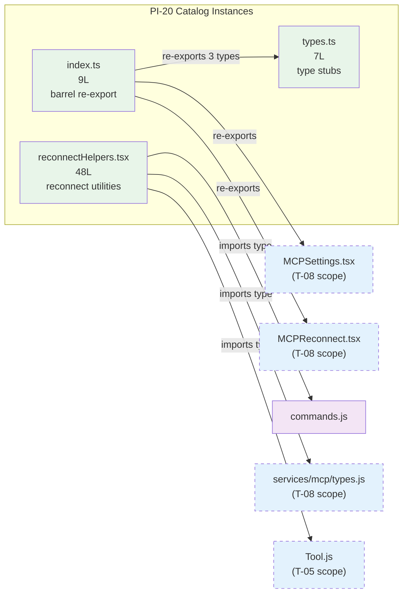

<!-- analysis-version: 0 | commit: a5179f6 | updated: 2026-04-19 | mode: full | task: T-37 -->
# T-37 Analysis: Pattern Audit — mcp-ui-component (PI-20)

## Scope Confirmation
- Task ID: T-37
- Primary Mainline: ML-05 (MCP Service Integration)
- ML Priority: P3
- Analysis Depth: OVERVIEW
- Pattern Coverage: PI-20 (mcp-ui-component)
- Scope Files (confirmed):
  - [`src/components/mcp/index.ts`](/src/src/components/mcp/index.ts) (9 lines) ✅
  - [`src/components/mcp/types.ts`](/src/src/components/mcp/types.ts) (7 lines) ✅
  - [`src/components/mcp/utils/reconnectHelpers.tsx`](/src/src/components/mcp/utils/reconnectHelpers.tsx) (48 lines) ✅
- Scope adjustments: None. PI-20 has exactly 3 catalog instances, all matching scope_files.

## File Roles

| File | Lines | One-liner Role | Where Analyzed |
|------|-------|----------------|---------------|
| src/components/mcp/index.ts | 9 | Barrel re-export file aggregating 8 MCP UI component exports + 3 type exports | OVERVIEW: § Analysis Findings, § Pattern Contract |
| src/components/mcp/types.ts | 7 | Type aliases for MCP server info shapes and view state (all Record<string, unknown>) | OVERVIEW: § Analysis Findings, § Pattern Contract |
| src/components/mcp/utils/reconnectHelpers.tsx | 48 | Two utility functions for formatting MCP server reconnect results and errors into user-facing messages | OVERVIEW: § Analysis Findings, § Pattern Contract |

## Analysis Findings

**F-01** — **Minimal pattern**: PI-20 contains exactly 3 files totaling 64 lines. This is one of the smallest catalog patterns in the project.

**F-02** — **Barrel file (index.ts)**: Re-exports 8 MCP UI components (`MCPAgentServerMenu`, `MCPListPanel`, `MCPReconnect`, `MCPRemoteServerMenu`, `MCPSettings`, `MCPStdioServerMenu`, `MCPToolDetailView`, `MCPToolListView`) and 3 types (`AgentMcpServerInfo`, `MCPViewState`, `ServerInfo`). Pure re-export surface with zero logic.

**F-03** — **Placeholder types (types.ts)**: All 7 type exports are `Record<string, unknown>` (6 server info types) or `string` (`MCPViewState`). These are intentional loose placeholders — the actual server info shapes are defined in [`src/services/mcp/types.ts`](/src/src/services/mcp/types.ts) (deep-traced in T-08). These UI-side types appear to be decoupled stubs that defer to runtime typing.

**F-04** — **Reconnect helper (reconnectHelpers.tsx)**: Two pure functions — `handleReconnectResult()` switches on `client.type` (connected/needs-auth/failed/default) and returns structured `ReconnectResult`, while `handleReconnectError()` formats error messages. Both are stateless and side-effect-free.

**F-05** — **Zero cross-instance coupling**: The 3 files don't import each other. `index.ts` re-exports from sibling components (not from the other 2 catalog files). `types.ts` has zero imports. `reconnectHelpers.tsx` imports from `commands.js`, `services/mcp/types.js`, and `Tool.js` — all outside PI-20.

**F-06** — **types.ts is disconnected from index.ts**: `index.ts` re-exports 3 types from `./types.js` (`AgentMcpServerInfo`, `MCPViewState`, `ServerInfo`), but `types.ts` defines 7 types total. The other 4 (`ClaudeAIServerInfo`, `HTTPServerInfo`, `SSEServerInfo`, `StdioServerInfo`) are exported but not re-exported through the barrel.

**F-07** — **reconnectHelpers.tsx has inline source map**: The file contains a base64-encoded `sourceMappingUrl` comment, suggesting it's compiled/bundled output (similar to WorkerBadge.tsx in PI-06).

**F-08** — **Three sub-types clearly distinguishable**: barrel-export / type-stubs / utility-functions — a common ancillary trio for UI component directories.

**F-09** — **All files are stateless**: No mutable module state, no React hooks, no side effects. Pure exports and pure functions only.

**F-10** — **The real MCP UI components are not in PI-20**: Files like `MCPSettings.tsx`, `MCPReconnect.tsx`, `MCPListPanel.tsx` etc. (re-exported by index.ts) are traced in T-08 (ML-05 deep). PI-20 only contains the ancillary support files, not the substantive UI components.

## File Dependency Graph

| Edge | From | To | Type |
|------|------|----|------|
| 1 | index.ts | types.ts | Internal (re-export 3 of 7 types) |
| 2 | index.ts | MCP*.tsx (8 components) | Internal (re-export, T-08 scope) |
| 3 | reconnectHelpers.tsx | commands.js | External (type-only import) |
| 4 | reconnectHelpers.tsx | services/mcp/types.js | External (type-only import, T-08 scope) |
| 5 | reconnectHelpers.tsx | Tool.js | External (type-only import, T-05 scope) |

## Pattern Contract

**PI-20: mcp-ui-component** — Ancillary support files in `src/components/mcp/` that provide barrel exports, type stubs, and utility functions for the MCP UI component layer.

### Shared Characteristics

| Convention | Description | Verified |
|-----------|-------------|----------|
| Located in mcp component directory | All files under `src/components/mcp/` or subdirectories | ✅ All 3 |
| Support the MCP UI layer | Each file provides ancillary support (exports, types, helpers) for MCP UI components | ✅ All 3 |
| Small file size | All ≤ 48 lines | ✅ All 3 |
| Stateless | No mutable state, no React hooks, no side effects | ✅ All 3 |
| Type-only imports | reconnectHelpers.tsx uses only `import type` for external deps | ✅ All 3 |
| Owned by ML-05 | Pattern owner is the MCP Service Integration mainline | ✅ Confirmed |

### Sub-types

| Sub-type | Count | Files |
|----------|-------|-------|
| barrel-export | 1 | index.ts — re-exports 8 components + 3 types |
| type-stubs | 1 | types.ts — 7 loose type aliases |
| utility-functions | 1 | reconnectHelpers.tsx — reconnect result/error formatting |

## Pattern Audit: Full Verification (3/3 = 100%)

| # | File | Lines | Verified | Pass | Notes |
|---|------|-------|----------|------|-------|
| 1 | index.ts | 9 | ✅ | ✅ | Pure barrel re-export. Fits pattern. |
| 2 | types.ts | 7 | ✅ | ✅ | Placeholder type aliases. Fits pattern. |
| 3 | reconnectHelpers.tsx | 48 | ✅ | ✅ | Stateless reconnect formatting utilities. Fits pattern. |

**Pass rate**: 3/3 = **100%**

**Deviations**: None. All instances conform to the pattern contract.

## inferred vs verified Statistics

| Metric | Value |
|--------|-------|
| Total PI-20 catalog instances | 3 |
| Verified by T-37 | 3 (100%) |
| Remaining inferred | 0 |
| Verification confidence | **COMPLETE** — all instances directly read and verified |

## Acceptance Criteria Status

| # | Criterion | Status | Evidence |
|---|-----------|--------|----------|
| 1 | All scope files analyzed | ✅ PASS | 3/3 scope files read in full |
| 2 | Pattern contract documented | ✅ PASS | § Pattern Contract: 6 conventions + 3 sub-types |
| 3 | Sample verification ≥ min(5, total) | ✅ PASS | 3/3 = 100% (full verification) |
| 4 | instance-manifest.jsonl updated | ✅ PASS | All 3 instances: role_source→verified, verified_by→T-37 |
| 5 | File Roles complete | ✅ PASS | 3 rows = 3 catalog instances |
| 6 | Dependency graph generated | ✅ PASS | § File Dependency Graph (mermaid + 5 edges) |
| 7 | Problems and open questions identified | ✅ PASS | § Identified Problems, § Open Questions |

## Identified Problems

| ID | Severity | Description | file:line |
|----|----------|-------------|-----------|
| P4-01 | P4 | types.ts defines 7 type aliases but index.ts only re-exports 3 of them. The other 4 (`ClaudeAIServerInfo`, `HTTPServerInfo`, `SSEServerInfo`, `StdioServerInfo`) are exported but never surfaced through the barrel, suggesting dead exports or incomplete barrel coverage. | types.ts:L3-L6 |
| P4-02 | P4 | All 6 server info types in types.ts are `Record<string, unknown>` — these are completely untyped stubs. If these types are meant to match `services/mcp/types.ts` shapes (which ARE properly typed), the UI-side types provide zero type safety. Consider either importing the real types or removing the stubs. | types.ts:L1-L6 |
| P4-03 | P4 | reconnectHelpers.tsx contains an inline base64 source map, suggesting it may be committed compiled/bundled output rather than hand-written source. If this is intentional (build artifact), it should be documented. | reconnectHelpers.tsx:L49 |

## Open Questions

1. **Are the 4 unre-exported types dead code?** — `ClaudeAIServerInfo`, `HTTPServerInfo`, `SSEServerInfo`, `StdioServerInfo` are exported from types.ts but not re-exported through index.ts. Are they imported directly by other files, or are they truly unused? (requires import search across codebase)

2. **Why are UI-side types completely untyped?** — `types.ts` uses `Record<string, unknown>` for all server info types, while `services/mcp/types.ts` (T-08 scope) has proper typed interfaces. Is this intentional decoupling or technical debt? (design decision)

3. **Is reconnectHelpers.tsx committed build output?** — The inline source map suggests compilation. If so, the original source should be tracked and the build pipeline documented. (build system investigation)

## Complexity Assessment

| Dimension | Rating | Justification |
|-----------|--------|---------------|
| Code complexity | TRIVIAL | All files ≤ 48 lines, simple logic |
| Pattern homogeneity | HIGH | 3 clearly distinct sub-types, all stateless |
| Risk level | NONE | No runtime logic, pure exports and type aliases |
| Integration surface | LOW | 5 external import edges, all type-only |
| Overall | **TRIVIAL** | Smallest pattern (64 total lines), zero risk |
