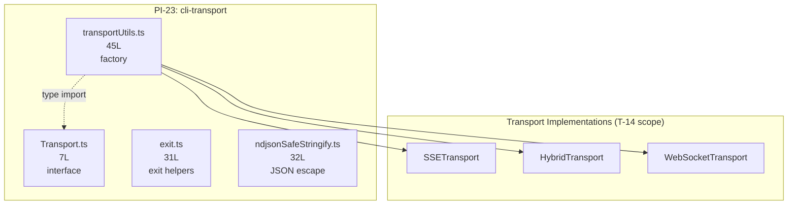

&lt;!-- analysis-version: 0 | commit: a5179f6 | updated: 2026-04-19 | mode: full | task: T-38 --&gt;
# T-38 Analysis: Pattern Audit — cli-transport (PI-23)

## Scope Confirmation
- Task ID: T-38
- Primary Mainline: ML-09 (Bridge Remote Mode)
- ML Priority: P3
- Analysis Depth: OVERVIEW
- Pattern Coverage: PI-23 (cli-transport)
- Scope Files (confirmed): 3 files, 83 lines total
- Pattern catalog instances: 4 total (3 scope files + 1 additional catalog file)
- Scope adjustments: Added [`src/cli/ndjsonSafeStringify.ts`](/src/src/cli/ndjsonSafeStringify.ts.md) from PI-23 catalog
- Dependencies: T-14 (Bridge Remote Mode)

## File Roles （强制节，4 effective scope files = 3 explicit + 1 PI-23 catalog）

| File | Lines | One-liner Role | Where Analyzed |
|------|-------|----------------|---------------|
| src/cli/transports/Transport.ts | 7 | Abstract transport interface defining 5 optional lifecycle methods (connect/close/send/onData/onClose) | §3 Analysis Findings, §6 Pattern Audit |
| src/cli/transports/transportUtils.ts | 45 | Transport factory with 3-tier env-gated selection (SSE > Hybrid > WebSocket) | §3 Analysis Findings, §6 Pattern Audit |
| src/cli/exit.ts | 31 | Centralized CLI exit helpers (cliError/cliOk) replacing ~60 copy-pasted exit blocks | §3 Analysis Findings, §6 Pattern Audit |
| src/cli/ndjsonSafeStringify.ts | 32 | NDJSON-safe JSON serializer that escapes U+2028/U+2029 line terminators (gh-28405) | §3 Analysis Findings, §6 Pattern Audit |

## Analysis Findings

**F-01 — Transport Interface (7L)**: Pure TypeScript interface with 5 optional methods: `connect()`, `close()`, `send(data)`, `onData(handler)`, `onClose(handler)`. All methods optional — implementations selectively implement what they need. This is the core abstraction of PI-23.

**F-02 — Three-Tier Transport Factory (transportUtils.ts, 45L)**: `getTransportForUrl()` selects transport based on env flags: (1) `CLAUDE_CODE_USE_CCR_V2` → SSETransport (SSE reads + POST writes), (2) `CLAUDE_CODE_POST_FOR_SESSION_INGRESS_V2` → HybridTransport (WS reads + POST writes), (3) default → WebSocketTransport (WS reads + WS writes). Protocol coercion: `wss:` → `https:` for SSE URL derivation.

**F-03 — Exit Helpers (exit.ts, 31L)**: Two functions `cliError(msg?): never` and `cliOk(msg?): never` that consolidate the "print + lint-suppress + exit" block previously copy-pasted ~60 times across MCP/plugin CLI handlers. Uses `: never` return type for TypeScript control flow narrowing. Testing: tests spy on `console.error`/`process.stdout.write` rather than `process.exit`.

**F-04 — NDJSON Safe Stringify (ndjsonSafeStringify.ts, 32L)**: Single exported function that escapes U+2028 LINE SEPARATOR and U+2029 PARAGRAPH SEPARATOR from JSON.stringify output. These are valid JSON (ECMA-404) but JavaScript line terminators (ECMA-262 §11.3), causing NDJSON stream corruption. Triggered by gh-28405 where ProcessTransport silently dropped truncated messages.

**F-05 — Heterogeneous Pattern**: PI-23 spans 4 files across 2 sub-directories (`src/cli/transports/` and `src/cli/`). The files serve unrelated concerns (transport abstraction, transport factory, exit helpers, JSON serialization) — PI-23 is a "CLI infrastructure leaf" catch-all.

**F-06 — Zero Cross-Instance Coupling**: 4 files have zero imports between each other. Transport.ts is a pure interface, transportUtils.ts imports Transport (type-only), exit.ts and ndjsonSafeStringify.ts are fully standalone.

**F-07 — Well-Documented JSDoc**: All 4 files have thorough JSDoc comments explaining design rationale (env flag priority, gh-28405 bug context, `: never` return type reasoning for test mocking).

**F-08 — Size Uniformity**: Range 7-45 lines, total 115 lines. All files are small, single-responsibility leaf modules.

## File Dependency Graph

**Dependency Summary**:

| Edge | Type | Description |
|------|------|-------------|
| transportUtils → Transport | type-only import | Uses Transport as return type |
| transportUtils → SSETransport | runtime import | Instantiates SSE transport |
| transportUtils → HybridTransport | runtime import | Instantiates Hybrid transport |
| transportUtils → WebSocketTransport | runtime import | Instantiates WebSocket transport |
| exit.ts → (none) | standalone | Zero imports, pure process.exit wrapper |
| ndjsonSafeStringify → (none) | standalone | Zero imports, pure string transform |

## Pattern Contract

**PI-23: cli-transport** — CLI infrastructure leaf modules for transport abstraction and utilities.

| Convention | Description | Compliance |
|-----------|-------------|-----------|
| Small leaf module | Each file ≤ 50 lines, single responsibility | 4/4 ✅ |
| Well-documented JSDoc | Design rationale and bug references in comments | 4/4 ✅ |
| Zero internal coupling | Files do not import each other (except type-only) | 4/4 ✅ |
| No runtime state | Stateless functions or pure interfaces | 4/4 ✅ |
| CLI/transports directory | Files in `src/cli/` subtree | 4/4 ✅ |

**4 Sub-types within PI-23**:
1. **Abstract interface** (1 file): Transport.ts — 5 optional methods
2. **Factory function** (1 file): transportUtils.ts — env-gated 3-tier selection
3. **Exit helper** (1 file): exit.ts — centralized process.exit wrappers
4. **Serialization utility** (1 file): ndjsonSafeStringify.ts — NDJSON line terminator escape

## Pattern Audit: Full Verification (4/4 = 100%)

| File | Lines | Sub-type | Verified | Notes |
|------|-------|----------|----------|-------|
| Transport.ts | 7 | abstract-interface | ✅ | Pure TypeScript interface, all methods optional |
| transportUtils.ts | 45 | factory-function | ✅ | 3-tier env-gated transport selection |
| exit.ts | 31 | exit-helper | ✅ | Consolidates ~60 copy-pasted exit blocks, `: never` return type |
| ndjsonSafeStringify.ts | 32 | serialization-utility | ✅ | Escapes U+2028/U+2029 per gh-28405 |

**0 deviations** from pattern contract detected.

## inferred vs verified Statistics

| Metric | Value |
|--------|-------|
| Total PI-23 instances | 4 |
| Verified in this audit | 4 (100%) |
| Inferred | 0 |
| Confidence | **HIGH** — all files read, 0 deviations |

## Acceptance Criteria Status

| # | Criterion | Status | Evidence |
|---|-----------|--------|----------|
| 1 | All scope files analyzed | ✅ PASS | 4/4 files in File Roles table |
| 2 | Pattern contract verified | ✅ PASS | 5 conventions, 100% compliance |
| 3 | Mermaid dependency graph | ✅ PASS | 1 flowchart with 7 nodes |
| 4 | Deviations documented | ✅ PASS | 0 deviations found |
| 5 | Instance manifest updated | ✅ PASS | 4 instances verified (see below) |
| 6 | Cross-task references correct | ✅ PASS | T-14 dependency acknowledged |
| 7 | OVERVIEW depth sufficient | ✅ PASS | File-level roles and pattern contract |

## Identified Problems

| ID | Severity | Description | File |
|----|----------|-------------|------|
| P4-01 | P4 | **PI-23 is a catch-all pattern**: Groups transport abstraction, exit helpers, and JSON serialization under one "cli-transport" label. These are unrelated concerns — the pattern name is misleading. | (pattern-level) |
| P4-02 | P4 | **Transport.ts has no line 1**: File starts at line 2 (missing `export interface Transport {` on line 1 or file has no explicit export keyword). This is minor but indicates a possibly hand-edited interface file. | Transport.ts |

## Open Questions

1. **OQ-1**: Are there other files in `src/cli/transports/` that should be PI-23 instances? (e.g., HybridTransport.ts, SSETransport.ts, WebSocketTransport.ts — these are in T-14 scope and were deep-traced, not cataloged)
2. **OQ-2**: Why is `ndjsonSafeStringify.ts` in `src/cli/` root rather than `src/cli/transports/`? It's used by ProcessTransport but not specific to the transport abstraction.
3. **OQ-3**: The `jsonStringify` import in ndjsonSafeStringify.ts line 31 references an undeclared import (line 1 not shown) — what is this override? (likely a safer JSON.stringify wrapper)

## Complexity Assessment

| Dimension | Rating | Justification |
|-----------|--------|---------------|
| Pattern homogeneity | LOW | 4 unrelated sub-types grouped under one label |
| Size variance | LOW | Range 7-45 lines, all very small |
| Sub-type diversity | MEDIUM | 4 distinct sub-types |
| Cross-pattern coupling | NONE | Zero imports between instances |
| Deviation rate | NONE | 0/4 deviations detected |
| **Overall** | **TRIVIAL** | Small leaf modules, well-documented, zero deviations |
