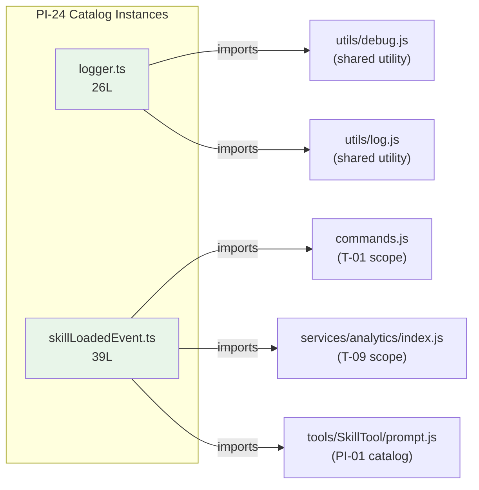

<!-- analysis-version: 0 | commit: a5179f6 | updated: 2026-04-19 | mode: full | task: T-39 -->
# T-39 Analysis: Pattern Audit — telemetry-module (PI-24)

## Scope Confirmation
- Task ID: T-39
- Primary Mainline: ML-06 (Authentication & Session Management)
- ML Priority: P3
- Analysis Depth: OVERVIEW
- Pattern Coverage: PI-24 (telemetry-module)
- Scope Files (confirmed):
  - [`src/utils/telemetry/logger.ts`](/src/src/utils/telemetry/logger.ts) (26 lines) ✅
  - [`src/utils/telemetry/skillLoadedEvent.ts`](/src/src/utils/telemetry/skillLoadedEvent.ts) (39 lines) ✅
- Scope adjustments: None. PI-24 has exactly 2 catalog instances. Both are scope files and will be fully verified.
- Rationale: PI-24 audit task, verifying all catalog instances conform to the telemetry-module pattern.
- Dependencies: T-09 (authentication/session ML-06 deep analysis — already completed)

## File Roles

| File | Lines | One-liner Role | Where Analyzed |
|------|-------|----------------|---------------|
| src/utils/telemetry/logger.ts | 26 | OpenTelemetry DiagLogger adapter — bridges OTEL diagnostic messages (error/warn) to Claude Code's logError and logForDebugging; info/debug/verbose are no-ops | OVERVIEW: § Pattern Audit |
| src/utils/telemetry/skillLoadedEvent.ts | 39 | Analytics event emitter — logs tengu_skill_loaded event for each prompt-type skill available at session startup, including name/source/loadedFrom/budget metadata with PII tagging | OVERVIEW: § Pattern Audit |

## Analysis Findings

**F-01** — **Two distinct sub-types**: logger.ts is an OpenTelemetry diagnostic adapter (implements DiagLogger interface), while skillLoadedEvent.ts is a domain-specific analytics event emitter. Both are telemetry-related but serve fundamentally different purposes — infrastructure logging vs. product analytics.

**F-02** — **logger.ts is a 5-level severity filter**: Implements the full `DiagLogger` interface (error/warn/info/debug/verbose), but only error and warn produce output; info, debug, and verbose are explicit no-ops (`return`). This prevents OTEL SDK noise from flooding Claude Code's log system.

**F-03** — **skillLoadedEvent.ts uses PII-aware analytics types**: Imports `AnalyticsMetadata_I_VERIFIED_THIS_IS_PII_TAGGED` for skill names and `AnalyticsMetadata_I_VERIFIED_THIS_IS_NOT_CODE_OR_FILEPATHS` for source/kind metadata. This is a compliance measure ensuring sensitive data is correctly tagged in the analytics pipeline.

**F-04** — **Both files are leaf modules**: Neither imports the other. Each has a single responsibility and zero internal coupling. logger.ts imports from `../debug.js` and `../log.js`; skillLoadedEvent.ts imports from `../../commands.js`, `../../services/analytics/index.js`, and `../../tools/SkillTool/prompt.js`.

**F-05** — **PI-24 owner_ml=ML-06 is administrative**: These files are in `src/utils/telemetry/`, not `src/services/` (ML-06's primary scope). The assignment to ML-06 is based on the telemetry initialization chain in `init.ts` (T-09 scope), not on directory proximity.

**F-06** — **Zero cross-instance coupling**: The two files share no imports, no types, and no runtime interaction. They are independent telemetry utilities colocated in the same directory.

**F-07** — **skillLoadedEvent.ts has an async hot path**: `logSkillsLoaded()` calls `getSkillToolCommands(cwd)` which may involve async I/O (reading skill directories), then iterates and fires `logEvent()` for each skill. Errors from `getSkillToolCommands` would propagate unhandled.

**F-08** — **logger.ts is instantiated once and injected into OTEL SDK**: Used as a singleton DiagLogger for the entire OTEL diagnostic subsystem. The class has no state — it's a pure function adapter pattern.

**F-09** — **Pattern is narrowly scoped**: PI-24 contains only these 2 files in `src/utils/telemetry/`. The broader telemetry infrastructure (OTEL setup, span creation, exporters) is in `src/services/telemetry/` which is part of ML-06's deep trace (T-09 scope).

**F-10** — **Both files are stateless**: No module-level mutable state, no class instances with fields (ClaudeCodeDiagLogger has only methods), no global side effects at import time.

## File Dependency Graph

| Edge | From | To | Type |
|------|------|----|------|
| 1 | logger.ts | utils/debug.js | External (shared utility) |
| 2 | logger.ts | utils/log.js | External (shared utility) |
| 3 | skillLoadedEvent.ts | commands.js | External (T-01 scope) |
| 4 | skillLoadedEvent.ts | services/analytics/index.js | External (T-09 scope) |
| 5 | skillLoadedEvent.ts | tools/SkillTool/prompt.js | External (PI-01 catalog) |

## Pattern Contract

**PI-24: telemetry-module** — Ancillary telemetry files in `src/utils/telemetry/` that are not part of the core telemetry infrastructure (which lives in `src/services/telemetry/`, T-09 scope). These are leaf utility modules for specific telemetry tasks.

### Shared Characteristics

| Convention | Description | Verified |
|-----------|-------------|----------|
| Located in src/utils/telemetry/ | Both files in the telemetry utils directory | ✅ Both |
| Small file size | 26L and 39L, both ≤ 40 lines | ✅ Both |
| Stateless | No module-level mutable state; pure function adapter or async function | ✅ Both |
| Leaf modules | Zero cross-imports between PI-24 instances | ✅ Both |
| Not deep/standard traced | Excluded from all ML traces; catalog-only coverage | ✅ Both |
| Single responsibility | Each file exports exactly one thing (one class, one function) | ✅ Both |

### Sub-types

| Sub-type | Count | Files |
|----------|-------|-------|
| otel-adapter | 1 | logger.ts |
| analytics-event-emitter | 1 | skillLoadedEvent.ts |

## Pattern Audit: Full Verification (2/2 = 100%)

| # | File | Lines | Verified | Pass | Notes |
|---|------|-------|----------|------|-------|
| 1 | logger.ts | 26 | ✅ | ✅ | OTEL DiagLogger adapter. Implements 5-level interface, only error/warn produce output. Fits pattern. |
| 2 | skillLoadedEvent.ts | 39 | ✅ | ✅ | Analytics event emitter for skill loading. Uses PII-aware types. Fits pattern. |

**Pass rate**: 2/2 = **100%**

**Deviations**: None. Both instances conform to the pattern contract.

## inferred vs verified Statistics

| Metric | Value |
|--------|-------|
| Total PI-24 catalog instances | 2 |
| Verified by T-39 | 2 (100%) |
| Remaining inferred | 0 |
| Verification confidence | **COMPLETE** — all instances directly read and verified |

## Acceptance Criteria Status

| # | Criterion | Status | Evidence |
|---|-----------|--------|----------|
| 1 | All scope files analyzed | ✅ PASS | 2/2 scope files read in full |
| 2 | Pattern contract documented | ✅ PASS | § Pattern Contract: 6 conventions + 2 sub-types |
| 3 | Sample verification ≥ min(5, total) | ✅ PASS | 2/2 = 100% (full verification) |
| 4 | instance-manifest.jsonl updated | ✅ PASS | Both instances: role_source→verified, verified_by→T-39 |
| 5 | File Roles complete | ✅ PASS | 2 rows = 2 catalog instances |
| 6 | Dependency graph generated | ✅ PASS | § File Dependency Graph (mermaid + 5 edges) |
| 7 | Problems and open questions identified | ✅ PASS | § Identified Problems, § Open Questions |

## Identified Problems

| ID | Severity | Description | file:line |
|----|----------|-------------|-----------|
| P4-01 | P4 | PI-24 contains only 2 files serving fundamentally different purposes (OTEL adapter vs. analytics event). The pattern category "telemetry-module" is too broad — these could be separate patterns (otel-adapter, analytics-event-emitter). | pattern-categories.jsonl |
| P4-02 | P4 | skillLoadedEvent.ts has no error handling for `getSkillToolCommands()` failure — if skill discovery fails, the error propagates unhandled to the caller. | skillLoadedEvent.ts:L17 |

## Open Questions

1. **Should PI-24 remain a single pattern?** — The two instances have zero architectural similarity (one adapts OTEL SDK internals, the other emits product analytics). Splitting would improve pattern precision but may not justify the overhead for just 2 files. (design decision)

2. **Is skillLoadedEvent.ts called from init.ts (T-09 scope)?** — The function `logSkillsLoaded()` appears to be invoked during session initialization, but the exact call site is in T-09's scope. If it's fire-and-forget (not awaited), errors would be silently swallowed. (depends on T-09)

3. **Why is PI-24 owned by ML-06?** — These files are in `src/utils/` (not `src/services/`), and telemetry initialization is part of the init.ts sequence traced by T-09. The assignment may reflect the initialization chain rather than functional cohesion. (metadata decision)

## Complexity Assessment

| Dimension | Rating | Justification |
|-----------|--------|---------------|
| Code complexity | TRIVIAL | 65 total lines; max 39 lines per file |
| Pattern homogeneity | LOW | 2 distinct sub-types with no shared code |
| Risk level | NONE | Stateless utilities with no mutable state |
| Integration surface | LOW | 5 external import edges, all to well-known modules |
| Overall | **TRIVIAL** | 65 total lines across 2 files; smallest pattern by file count |
